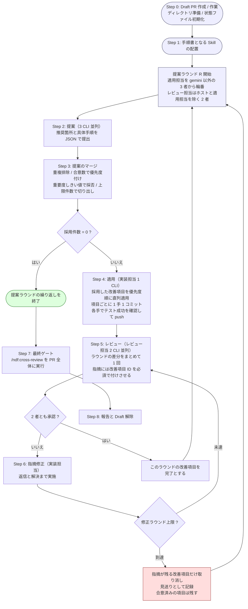

# cross-refactoring: 多ランタイム・リファクタリング収束ループ Skill

## この文書群について

Skill `/ndf:cross-refactoring` の実施計画である。読む順序は次のとおり。

| ファイル | 内容 |
| --- | --- |
| 本ファイル | 解決したい課題、担当の決め方、全体の流れ |
| [02-loop-design.md](02-loop-design.md) | 進行の構造、担当の輪番、終了条件、作業ディレクトリ |
| [03-runtime-notes.md](03-runtime-notes.md) | ランタイムごとの固有対応（起動形式・完了検知・権限） |
| [04-skill-provisioning.md](04-skill-provisioning.md) | 手順書となる Skill の配置と、読ませ方 |
| [05-measurement.md](05-measurement.md) | モデルの選択と、ランタイム／モデルの比較計測 |
| [06-schema.md](06-schema.md) | 実行の骨組み、状態ファイル、提出形式、レビュー観点 |
| [07-tasks.md](07-tasks.md) | 変更するファイルと 12 個の作業単位 |
| [08-acceptance-and-risks.md](08-acceptance-and-risks.md) | 受け入れ条件、リスク、対象外 |
| [09-cross-review-alignment.md](09-cross-review-alignment.md) | `cross-review` への展開と、共有するコードの置き方 |

## 関連リンク

- GitHub Issue: https://github.com/devbasex/ai-plugins/issues/113
- CLI 実機検証の記録: [../issue-113-task3-cli-verification.md](../issue-113-task3-cli-verification.md)
- Kiro 実機検証の記録: [../ndf-development-skills/03-runtime-conformance.md](../ndf-development-skills/03-runtime-conformance.md)
- 参考 Skill: `plugins/ndf-shared/skills/cross-review/SKILL.md`
- 参考 Skill: `plugins/ndf-shared/skills/refactoring/SKILL.md`
- 参考 Skill: `plugins/ndf-shared/skills/external-ai/SKILL.md`

## 解決したい課題

`refactoring` Skill は「テストで守りながら 1 手ずつ直す」手順を定めているが、次の 2 つを
持っていない。

1. **何を直すかの発見。** どのコードスメルに手を付けるかは人間または単一の AI の主観で
   決まっており、見落としが体系的に検出されない。
2. **直した結果の他者検証。** 実装した本人（同一モデル）が自己レビューすると、選んだ手法の
   妥当性と「振る舞いが本当に変わっていないか」が構造的に検証されない。

`cross-review` Skill は 2 の一部をレビュー段階で担うが、対象は人間が作った Pull Request で
あり、リファクタリング固有の観点（振る舞い不変、スメルと手法の対応、現状固定テストの
妥当性、範囲の逸脱）をレビュー観点に持っていない。

そこで、**発見・適用・検証を別々のランタイムに分担させ、指摘が尽きるまで回す**進行を作る。

## 何をするか

`/ndf:cross-review` がレビューを収束させるのと同じ発想で、**リファクタリングを収束させる**。

- 複数の CLI に「どこを・どう直すか」を提案させる
- 1 回の提案ラウンドで採用した**改善項目**をまとめて適用し、まとめてレビューする
- 実装した者とレビューする者は必ず別のランタイムにする
- レビューが収束したら提案からやり直し、新しい提案が出なくなった時点で完了とする

## 用語

| 用語 | 意味 |
| --- | --- |
| **ホスト** | 本 Skill を実行しているセッション。Claude Code / Codex / Kiro CLI のいずれか |
| **提案ラウンド** | 提案 → 適用 → レビュー収束 までの 1 周。進行の最大単位 |
| **改善項目** | 提案をマージして採用した「1 箇所の直し」。状態ファイルの `items[]` に対応する |
| **実装担当** | その提案ラウンドで改善項目を適用するランタイム。状態ファイルの `impl` に対応する |
| **レビュー担当** | 適用結果を検証する 2 つのランタイム。状態ファイルの `reviewers` に対応する |
| **レビュー収束** | レビュー担当 2 者がともに承認するまで、指摘の修正とレビューを繰り返すこと |
| **修正ラウンド** | レビュー収束の中の 1 往復（指摘 → 修正 → 再レビュー） |

## 担当の決め方

ホストセッションは**進行の制御に徹し、提案とレビューには参加しない**。
ただし**適用だけはホストと同じランタイムも担当しうる**。その場合もホストのサブエージェント
機能は使わず、**独立した CLI プロセスとして起動する**ため、ホストセッションの作業文脈から
切り離されている点は変わらない。参加者はどの役割でも独立した CLI である。

役割ごとに母集合が異なる。

| 母集合 | 定義 | 中身 |
| --- | --- | --- |
| **提案・レビュー**（状態ファイルの `runtimes`） | 全ランタイム − ホスト | 常に 3 者 |
| **適用**（状態ファイルの `impl_capable`） | 全ランタイム − gemini | 常に claude / codex / kiro |

| ホスト | 提案・レビュー | 適用（輪番） |
| --- | --- | --- |
| Claude Code | codex / gemini / kiro | **claude** / codex / kiro |
| Codex | claude / gemini / kiro | claude / **codex** / kiro |
| Kiro CLI | claude / codex / gemini | claude / codex / **kiro** |

- **gemini は適用に参加しない。** NDF Skill を配布していないランタイムであり、
  `refactoring` Skill の手順を踏ませる適用には向かない。提案とレビューには常に参加する
  （配布先ではないため、ホストになることもない）。
- **ホストは適用にだけ参加する。** 提案とレビューから外れているので、
  「実装した者と評価する者が同一モデルにならない」という構造は保たれる。

どのホストでも提案・レビューは 3 者、適用候補も 3 者で揃うため、輪番（適用 1 : レビュー 2）
は全ランタイムで同じ形になる。

## 全体の流れ

`cross-review` が 1 本の繰り返しなのに対し、本 Skill は**提案ラウンドの繰り返しの中に
レビュー収束の繰り返しが入る**二段構造になる点が最大の差である。
