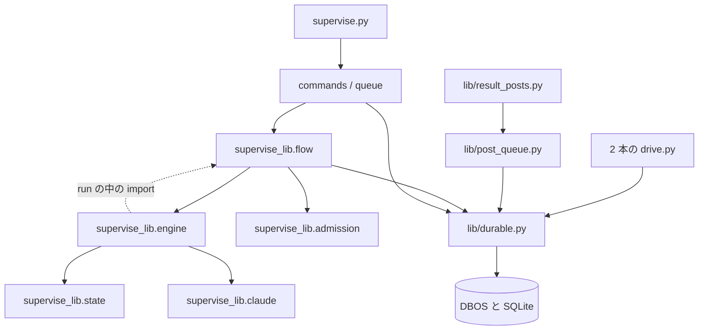
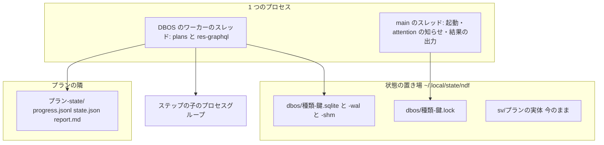
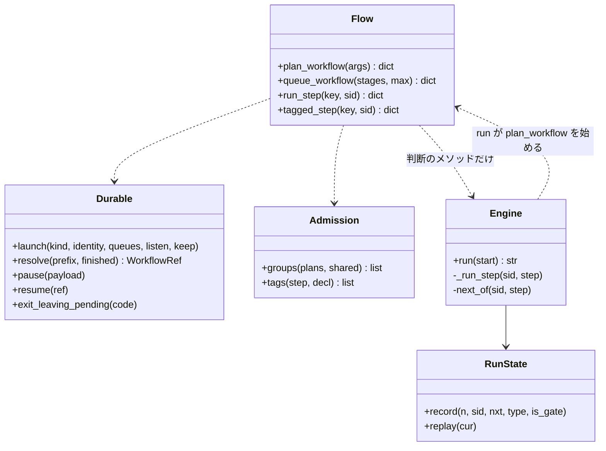
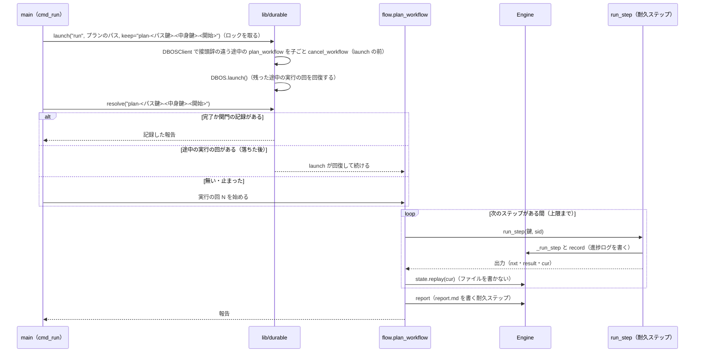
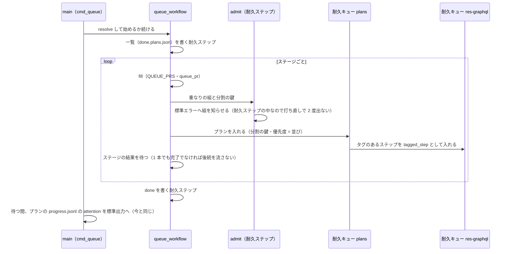
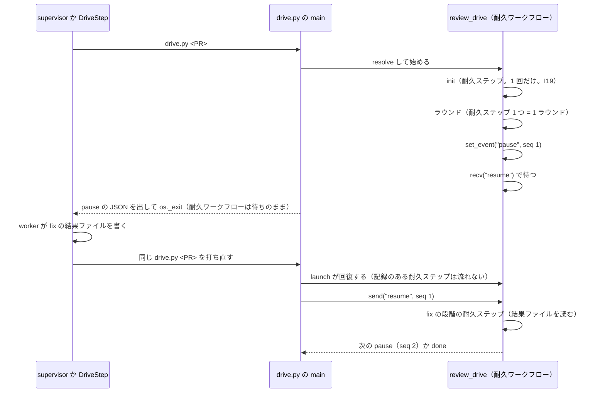
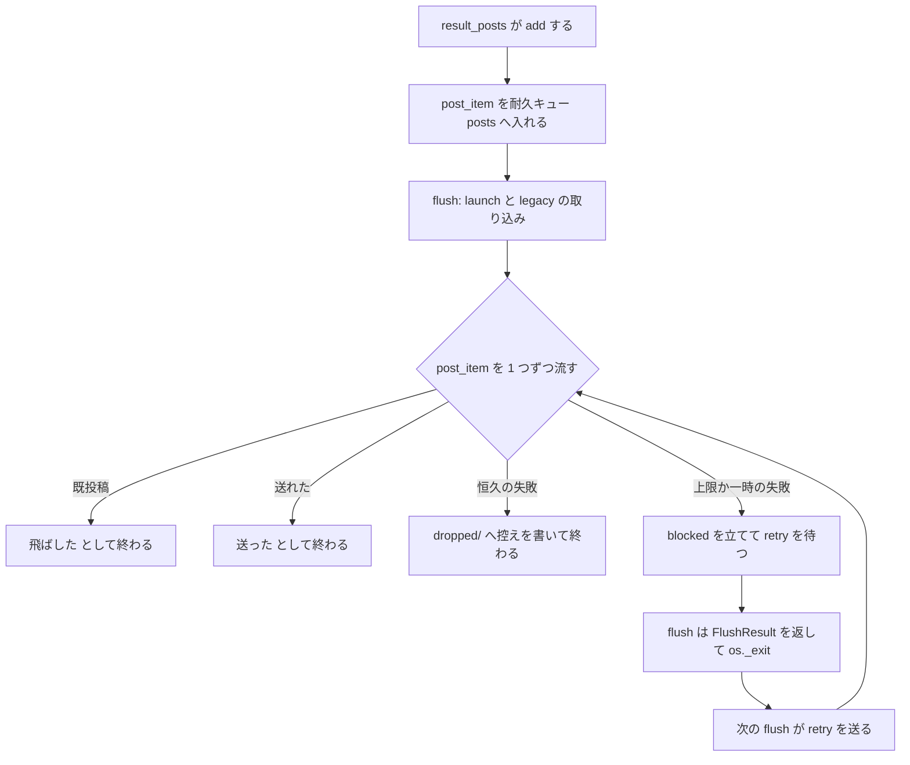

# #1142 の設計の追加: プランの実行とキューを DBOS Transact へ置き換える（スプリント 2c）

**この文書はスプリント 2c だけを扱う。** 要求と受け入れ条件（C-1〜C-8）は #1142 の本文の「スプリント 2c の要求と
受け入れ条件」にある（コピーは [issue-1142-requirements.md](issue-1142-requirements.md) ）。DBOS Transact を選んだ
理由は決定 21（[issue-1142-design-libraries.md](issue-1142-design-libraries.md) ）にあり、ここでは繰り返さない。
全体の設計の索引は [issue-1142-design.md](issue-1142-design.md) である。

置き換える対象の行数は develop の `dfeb3517`（2026-09-30）で数えた値である（要求の「何を置き換えるか」）。DBOS の
振る舞いは `dbos==3.1.0` を一時の環境に入れて、この文書を書く前に確かめた（「処理の流れ」の各節に出力を添える）。

## 先に全体の形

**1 回の起動（`run` 1 本・`queue` 1 本・`drive.py` 1 本・投稿キュー 1 つ）が、1 つのプロセスと 1 つの SQLite の
ファイルを持つ。** プランは耐久ワークフロー 1 つ、プランのステップは耐久ステップ 1 つ、`queue` は耐久キュー
（`plans`）に入れたプランの耐久ワークフローを、同じプロセスの中で同時に `--max` 本まで流す。GraphQL を使う
ステップは、もう 1 つの耐久キュー（`res-graphql`）の同時の本数で数える。落ちた後に同じコマンドを打ち直すと、
DBOS が SQLite の記録から耐久ワークフローを続ける。済んだ耐久ステップは流し直さない。

例: `supervise.py queue impl-c2.json impl-c3.json --max 3` を打つと、`~/.local/state/ndf/dbos/queue-<鍵>.sqlite` が
でき、2 本のプランが同じプロセスの中で流れる。2 本の `触るファイル` が `plugins/ndf/skills/cross-review/tests/` と
その下のファイルで重なるので（#1248 の実例）、2 本は同じ分割に入り、c2 が終わってから c3 が流れる。途中で
`kill -9` して同じコマンドを打ち直すと、c2 の流れていたステップから続く。

## ドメインモデル

### コンテキスト

新しいコンテキストは作らない。耐久の記録を扱う包み（`lib/durable.py`）はライブラリ（共有カーネル）に置き、
3 つのコンテキストがそれを使う。

| コンテキスト | 2c で何の語が 1 つの意味に決まるか |
| --- | --- |
| ライブラリ | 耐久ワークフロー・耐久ステップ・耐久キュー・耐久の記録・実行の鍵・実行の回 |
| プランの実行 | 資源のタグ・資源の枠・重なりの組・共有の一覧・孤児の片付け |
| 収束ループ | drive の止まり（pause）と続き（resume）の受け渡し |
| 記録と測定（投稿キュー） | 投稿の項目 1 件 = 耐久ワークフロー 1 つ |

**コンテキストマップに足す関係は 1 つだけである。** ライブラリの `lib/durable.py` が上流（共有カーネル）で、
`supervise_lib`・2 本の `drive.py`・`lib/post_queue.py` が下流である。**DBOS を import するのは `lib/durable.py`
だけで**（決定 19 の包みの形）、ほかは `durable` の関数と装飾子だけを使う。コンテキストの間の契約（`drive.py` の
結果 JSON の `metrics`・`supervise.py` の結果 JSON・進捗ログ）は変えない。

### 集約

| 集約 | 持ち主（書き換えてよいもの） | 根 | エンティティ | 値オブジェクト |
| --- | --- | --- | --- | --- |
| 耐久の記録（新設） | `lib/durable.py`（DBOS を通してだけ書く） | 1 つの SQLite のファイル | 耐久ワークフロー（ID・状態・入力・出力）・耐久ステップの出力・イベント・メッセージ | 実行の鍵・回の番号・形式の版 |
| 実行の状態（今のまま） | `supervise_lib.state.RunState` | `<プラン>-state/` | ステップの記録 | `ClaudeCall`・件数 |
| drive の状態（廃止） | — | ~~`drive-pr<N>.json` / `drive-rf<ID>.json`~~ | — | — |
| 投稿キュー（中身を移す） | `lib/post_queue.Queue`（耐久の記録を通して書く） | 待ち行列のディレクトリ（鍵として使う） | 投稿の項目 | 連番・種別 |

**実行の状態は再開に使わない。** `<プラン>-state/` の `progress.jsonl`・`state.json`・`report.md`・`NN-<ステップ>.out` は
出力（記録）で、形もパスも変えない（C-3c）。再開の位置は耐久の記録だけが持つ。例外は `--from` のときに前の
`report.md` から Pull Request を読む今の `_restore_pr` で、これは出力を読むだけで位置を書かない。

**drive の状態は耐久の記録へ移して消す。** `stage` と `init_vars` は、耐久ワークフローの中の変数と耐久ステップの
出力になる。`state.py init` の出力は 1 つの耐久ステップの出力として記録され、打ち直しで流し直されない（I7 は
この形で満たされる。I19）。

### 不変条件

番号は全体の I1〜I14 を引き継ぐ。

| # | 集約 | 条件 | 破れたときの扱い |
| --- | --- | --- | --- |
| I15 | （全体） | 次の表の置き場の関数に、ステップの遷移のループ・再開の位置の読み書き・子プロセスの数え上げによる同時の本数の制御が無い。ループは `@durable.workflow` を付けた関数の中だけに書く（C-1） | 構造チェック（`durable-boundary`）が落とす |
| I16 | 耐久の記録 | `dbos` を import するのは `lib/durable.py` だけ（I14 の包みの規則に `dbos` を足す） | 構造チェック（I14）が落とす |
| I17 | 耐久の記録 | 1 つの SQLite のファイルを開くプロセスは同時に 1 つだけで、executor_id は実行の鍵と同じ | 2 つ目の起動は実行の鍵のファイルロックで待つ（決定 26） |
| I18 | 耐久の記録 | 耐久ワークフローの中の DBOS の呼び出しの順序は、形式の版（`durable.FORMAT`）が同じ間は変えない。変えたら形式の版を上げる | 版の違う記録は続けず、新しい実行の回で頭から流す（決定 28） |
| I19 | 収束ループ | 1 つの実行の回の中で `state.py init` / `refactor.py init` は 1 回だけ流れる（I7 を置き換える） | `sweep` まで進めてから打ち直し、`metrics.rounds` が 0 でないテストが落とす |
| I20 | プランの実行 | 同じキューの同じステージで、`触るファイル` が重なる（ディレクトリの包含を含む）か同じ共有の一覧に当たる 2 本は、同時に流れない（C-4） | 重なる 2 本を同時に入れたテストで、2 本の区間が重ならないことを見る |
| I21 | プランの実行 | 資源のタグを持つステップは、同じプロセスの中で資源の枠の本数を超えて同時に流れない（C-5） | 枠 1 で 3 本を流したテストで、タグのあるステップの区間が重ならないことを見る |

**I15 の置き場と関数の一覧**（構造チェックが構文木で見る）:

| ファイル | 関数・クラス | 無いこと |
| --- | --- | --- |
| `scripts/supervise_lib/engine.py` | `Engine.run` | `while` / `for` の文 |
| `scripts/supervise_lib/state.py` | `RunState.record` | `state.json` へ書く辞書に `log`・`llm`・`project_mvv` 以外の鍵 |
| `scripts/supervise_lib/queue.py` | モジュール全体 | `subprocess.Popen`・`.poll()` の呼び出し・`run_batch` という名前の関数 |
| `scripts/lib/post_queue.py` | `Queue` | `os.open`・`glob` の呼び出し（`_import_legacy` を除く） |
| `skills/cross-review/scripts/drive.py` | `Drive.run` と `save_ds`・`ds_path` | `for` / `while` の文。`save_ds`・`ds_path` という名前のメソッド |
| `skills/cross-refactoring/scripts/drive.py` | `Drive.run`・`Drive.phases`・`Drive.final_gate` と `save_ds`・`ds_path` | 同上 |

**あわせて、表の各ファイル（`state.py` を除く）が `@durable.workflow` の関数を 1 つ以上持つか、その関数を持つ
モジュールを呼ぶことを見る。** 無いことだけを見ると、ループを消して何も置かない壊し方が通る。

### ドメインイベント

番号は要求の C1〜C10 を引き継ぐ。

| # | イベント | 発生元 | 受け手 |
| --- | --- | --- | --- |
| C1 | プランを書き出した | `supervise.py new`（今のまま） | `queue` / `run` |
| C2 | 重なりを検査した | `queue_workflow` の耐久ステップ `admit` | 標準エラー・結果 JSON の `items` |
| C3 | キューへ入れた | `queue_workflow` が耐久キュー `plans` へ | 同じプロセスの DBOS のワーカー |
| C4 | 枠を取った | `plan_workflow` が耐久キュー `res-graphql` へ入れた耐久ワークフローが流れ始めた | `plan_workflow`（結果を待つ） |
| C5 | ステップを流した・結果を記録した | 耐久ステップ `run_step` | 耐久の記録・`<プラン>-state/` |
| C6 | 進捗ログへ step・attention の行を書いた | `run_step` の中の `RunState`（今のまま） | `supervise.py wait` |
| C7 | 承認ゲートで止まった | `plan_workflow` が結果 `関門` で終わった | conductor（`--from` で続ける） |
| C8 | プロセスが落ちた | 外から | 次の起動の `DBOS.launch()` の回復 |
| C9 | 打ち直しで続けた | `durable.resolve` が続ける実行の回を選んだ | 同じ耐久ワークフロー |
| C10 | キューが終わった | `queue_workflow` の終わりの耐久ステップが done を書いた | `supervise.py wait` |

### 用語

| 用語 | 意味 | 用語集への反映 |
| --- | --- | --- |
| 耐久ワークフロー | DBOS の `@DBOS.workflow` の関数の 1 回の実行。ID を持ち、落ちた後の起動が記録から続ける。プラン 1 本・キュー 1 本・drive 1 回・投稿の項目 1 件がそれぞれ 1 つ | 追加（`ndf-workflow`） |
| 耐久ステップ | 耐久ワークフローの中で出力を SQLite へ記録する単位（DBOS の `@DBOS.step`）。記録のある耐久ステップは続けるときに流し直さない。プランのステップ（`ステップ`）とは別の語 | 追加（`ndf-workflow`） |
| 耐久キュー | DBOS の `register_queue` で作る、同時の本数・分割を持つ待ち行列。`supervise.py queue`（`キュー`）とは別の語 | 追加（`ndf-workflow`） |
| 耐久の記録 | 1 回の起動が持つ DBOS の SQLite のファイル（`~/.local/state/ndf/dbos/<種類>-<鍵>.sqlite`） | 追加（`ndf-workflow`） |
| 実行の鍵 | 起動を識別する文字列（`run-<プランのパスの sha256 の先頭 12 字>` など）。耐久の記録のファイル名と executor_id に使う | 追加（`ndf-workflow`） |
| 実行の回 | 同じ実行の鍵の中で、耐久ワークフローを頭から流した 1 回。ID の末尾の番号 | 追加（`ndf-workflow`） |
| 資源のタグ | ステップが使う、共有する外部の枠の名前（今は `graphql` だけ） | 追加（`ndf-workflow`） |
| 資源の枠 | 資源のタグごとの、同時に流せるステップの本数の上限 | 追加（`ndf-workflow`） |
| 重なりの組 | 同じステージの 2 本のプランで、`触るファイル` が包含で重なるか同じ共有の一覧に当たるもの | 追加（`ndf-workflow`） |
| 共有の一覧 | 複数のプランが同じ行の並びへ書き足すファイル（索引など）。`.ndf/supervise.json` の `queue.shared` に書く | 追加（`ndf-workflow`） |
| 投稿キュー | 送る前に投稿を積み、上限で送れなければ残す仕組み。項目は耐久の記録に置く（`lib/post_queue.py`） | 意味の変更（`ndf-cross-review`） |
| drive の状態 | — | 意味の変更（`ndf-cross-review`。Q3・Q4 で耐久の記録へ移し、その PR で廃止する） |

## 機能一覧

| # | 機能 | 誰が使うか |
| --- | --- | --- |
| F14 | `run` / `queue` を `kill -9` の後に同じコマンドで打ち直すと、流れていたステップから続く（C-6） | conductor |
| F15 | 同じステージの重なる組を、流す前に知らせて直列にする（C-4。#1248・#1249） | conductor |
| F16 | GraphQL を使うステップを資源の枠で数える（C-5。#889） | conductor |
| F17 | 収束ループの drive が、止まり（pause）から耐久の記録で続く | supervisor・conductor |
| F18 | 投稿キューの項目を耐久の記録に積み、次の flush で順に送る | cross-review・cross-refactoring |
| F19 | 落ちたプロセスが残した子のプロセスグループを、同じステップを流し直す前に止める（孤児の片付け） | conductor |

## 構成要素

| 要素 | 責務 |
| --- | --- |
| `lib/durable.py`（新設） | DBOS の起動（SQLite・executor_id・形式の版・耐久キューの登録）、実行の鍵とファイルロック、実行の回の選び方（`resolve`）、止まりと続きのイベント・メッセージ、`os._exit` での抜け方、古い耐久の記録の削除。**DBOS を import する唯一のモジュール**（I16） |
| `supervise_lib/flow.py`（新設） | `plan_workflow`（ステップの遷移のループ）・`queue_workflow`（ステージの順・ステージごとの入れ方）・`run_step`（耐久ステップ）・`tagged_step`（資源の枠の耐久ワークフロー）。`Engine` の判断のメソッドを呼ぶだけで、遷移の規則を持たない |
| `supervise_lib/admission.py`（新設） | 重なりの組と分割の鍵（和集合の森）・資源のタグの決め方。宣言の値は引数で受け、ファイルを読まない。副作用を持たない関数だけ |
| `supervise_lib/engine.py`（変更） | `run` のループを `flow.plan_workflow` へ移す。`run` はメソッドの中で `flow` を import する（`flow` が `Engine` を import するため、モジュールの循環を避ける）。`_run_step`・`next_of`・`_next_after_*`・`take_gate`・`gh_limit_wait` は今のまま（C-3d） |
| `supervise_lib/state.py`（変更） | 耐久ステップの出力（今のステップの記録）から、ファイルを書かずに記録を組み直す `replay(cur)` を足す。`state.json` の `log[]` の要素に鍵 `resumed`・`graphql` を足す（I11） |
| `supervise_lib/queue.py`（変更） | `cmd_queue` は耐久ワークフロー `queue_workflow` を始めるか続け、終わるまで attention を標準出力へ知らせる。`run_batch` と子プロセスを消す。`cmd_wait` は今のまま |
| `supervise_lib/commands.py`（変更） | `cmd_run` が実行の鍵を決めて `durable.launch` を打つ |
| `supervise_lib/claude.py`（変更） | 子を起動したら `<状態>/step.pid` に pgid・pid・起動時刻を書き、終わったら消す。流す前に前の `step.pid` の生きたグループを止める（孤児の片付け。決定 33） |
| `supervise_lib/templates.py`（変更） | `other_files` と実装の指示文の除外の行を消す（#1248） |
| `supervise_lib/worker_steps.py`（変更） | `WorkStep` の実装の指示文へ、同じステージで同時に流れる他の組の `触るファイル` を流す時点で足す |
| `supervise_lib/decl.py`（変更） | `.ndf/supervise.json` の `queue`（`resources`・`shared`）を読む |
| `lib/post_queue.py`（変更） | `Queue` の項目の置き場を耐久の記録へ移す。1 項目 = 1 耐久ワークフロー（`post_item`）。送り方・既投稿の照合・恒久の失敗の判定は今のまま |
| `lib/result_posts.py`（変更） | `enqueue` の戻り値を項目のファイルのパスから項目の辞書へ替える（`read_item(path)` の読み直しを消す） |
| 2 本の `drive.py`（変更） | `Drive.run` のループを `@durable.workflow` の関数へ移す。止まりは `durable.pause`、続きは打ち直しの `durable.resume`。`save_ds`・`ds_path` を消す |
| 2 本の `SKILL.md`（変更） | 「進みは `$TMP_DIR/drive-pr<PR>.json`」の 1 文を耐久の記録へ直す |
| `scripts/check-script-structure.py`（変更、リポジトリ根） | I15 の `durable-boundary` と、I14 の `dbos` |
| `plugins/ndf/pyproject.toml` と `uv.lock`、根の `pyproject.toml` と `uv.lock`（変更） | extra `durable = ["dbos==3.1.0"]`（決定 34） |
| `scripts/experimental/runner-trial.py` と `runner-trial/`（削除） | C-8 |

**構成要素図**（依存は矢印の向き。`lib/durable.py` から外へ向かう矢印は DBOS だけ）



**配置**（実行の単位と、耐久の記録の置き場）



## 構造

### DBOS への対応付け

**NDF の概念ごとに、DBOS のどの要素へ置くかを 1 つに決める。**

| NDF の概念 | 今の置き場 | DBOS の要素 | ID・名前 |
| --- | --- | --- | --- |
| プラン 1 本の実行 | `Engine.run` の `while` | 耐久ワークフロー `plan_workflow` | `plan-<パス鍵>-<中身鍵>-<開始>-<回>` |
| プランのステップ 1 回（run・work・drive・pr・judge） | `Engine._run_step` と `RunState.record` | 耐久ステップ `run_step` | 呼び出しの順（DBOS の function_id） |
| judge の打ち直しの前の GitHub の上限の待ち | `Engine.gh_limit_wait` | 耐久ステップ `limit_wait` | 同上 |
| 資源のタグのあるステップ | 無い | 耐久キュー `res-graphql` に入れた耐久ワークフロー `tagged_step` の中の `run_step` | `<親の ID>-t<番号>` |
| `queue` 1 回 | `cmd_queue` と `run_batch`（子プロセスの `Popen`・`poll`） | 耐久ワークフロー `queue_workflow` | `queue-<done の鍵>-<回>` |
| 同時に流す本数（`--max`） | `run_batch` の `len(running) < max_` | 耐久キュー `plans` の `worker_concurrency` | — |
| 重なりの組の直列 | 無い | 耐久キュー `plans` の `partition_concurrency=1` と分割の鍵 | 組の代表のプランのパス鍵 |
| 後続のステージ（`--then`） | `_run_stage` | `queue_workflow` の中の順（前のステージの結果を待つ） | — |
| QUEUE_PRS と `{queue_pr:<名>}` の埋め込み | `fill_queue_prs` / `fill_queue_pr` | 耐久ステップ `fill`（プランのファイルを書くため） | — |
| 承認ゲート | 結果 `関門` でプランを終え、`--from` で続ける | 同じ（`plan_workflow` が `関門` で終わる。`recv` を使わない。決定 27） | `--from` は新しい ID |
| 収束ループの drive 1 回 | `Drive.run` の `for` と `drive-pr<N>.json` | 耐久ワークフロー `review_drive` / `refactor_drive` | `review-<鍵>-<回>` / `refactor-<鍵>-<回>` |
| ラウンド 1 回・段階 1 つ | `step_round` ほか | 耐久ステップ（1 ラウンド = 1 つ。要約だけを返す。#773） | — |
| drive の止まり（fix・sweep・newtext・cross-review） | `dp.pause` を返して抜ける | `set_event("pause")` → `recv("resume")` の待ちのまま `os._exit` | 話題 `resume` |
| 投稿の項目 1 件 | `pending/<連番>-<種別>-<識別子>.json` | 耐久キュー `posts`（`worker_concurrency=1`）に入れた耐久ワークフロー `post_item` | `post-<連番 4 桁>-<種別>-<識別子>` |
| 上限で送れない項目 | ファイルを残して `flush` が止まる | `set_event("blocked")` → `recv("retry")` の待ち | 話題 `retry` |
| 遅れの見張り | `SlowWatch`（ステップの子の待ちの中） | 置かない。耐久ステップの中に残す（決定 31） | — |

### クラス図（変える型だけ）



**`Engine` はプロセスの中の登録簿（`plan_workflow` の ID → `Engine`）で耐久ワークフローから引く。** 鍵を
実行の鍵にしないのは、`queue` では 1 つのプロセス（実行の鍵は `queue-<12 字>` の 1 つ）で複数のプランの
`plan_workflow` と `tagged_step` が流れ、実行の鍵では別のプランの `Engine` を引くか上書きするためである。
`run_step(key, sid)` と `tagged_step(key, sid)` の `key` はこの ID で、`plan_workflow` が自分の ID
（`DBOS.workflow_id`）を入力として渡す。落ちた後の起動では、
DBOS が `launch()` の直後に耐久ワークフローを回復するため、`main` が `Engine` を作るより先に `plan_workflow` が
流れ始めうる。`plan_workflow` は登録簿に無ければ、入力（プランのパス・状態ディレクトリ・`--slow`・開始の
ステップ・同時に流れる他の組のファイル）から `Engine` を作る。入力は耐久の記録に残るため、作り直しは決定的である。

**`plan_workflow` は遷移の規則を持たない。** 次のステップは `run_step` の出力（`nxt`・`result`・`reason`）が決め、
それを求めるのは今の `Engine._run_step` と `_next_after_*` である。`plan_workflow` が持つのは、ステップの数の上限
（`上限`）・知らないステップの判定・`run_step` の出力を `RunState.replay` へ渡すことだけである。

## データ構造

### 耐久の記録の置き場

**置き場のディレクトリは `NDF_DBOS_DIR` → `${XDG_STATE_HOME}/ndf/dbos` → `~/.local/state/ndf/dbos` の順に決める。**
使用量の帳簿（`ndf/usage`）とプランの状態の実体（`ndf/sv`）と同じ解決で、OS の再起動と `/tmp` の掃除で消えない
（前提 C2）。テストは `NDF_DBOS_DIR` を一時ディレクトリへ向ける。

| 起動 | 種類 | 鍵の元 | ファイル |
| --- | --- | --- | --- |
| `supervise.py run <プラン>` | `run` | プランの絶対パス | `run-<sha256 の先頭 12 字>.sqlite` |
| `supervise.py queue ... [--done D]` | `queue` | done の絶対パス（省けば今の既定のパス） | `queue-<12 字>.sqlite` |
| cross-review の `drive.py <PR>` | `review` | 状態の置き場（`known_tmp()`。求まらなければ `<owner/repo>#<PR>`） | `review-<12 字>.sqlite` |
| cross-refactoring の `drive.py <PR>` | `refactor` | 同上（`refactor.py` の規則） | `refactor-<12 字>.sqlite` |
| `post_queue.Queue(<ディレクトリ>)` | `posts` | 待ち行列のディレクトリの絶対パス | `posts-<12 字>.sqlite` |

**実行の鍵は `<種類>-<12 字>` で、executor_id にもファイルロック（`<鍵>.lock`、`lib/locks.py`）にも使う。**
同じ鍵の起動が 2 つ同時に動くと、両方が同じ耐久ワークフローを回復して流す。2 つ目はロックが空くまで待つ（I17）。
**`queue` が同じプロセスで流すプランは、`run` の耐久の記録を使わない。** プランの耐久ワークフローは `queue` の
耐久の記録に入る。

**古い耐久の記録は 30 日で消す。** `durable.launch` が、置き場の中でロックの取れる（使われていない）`.sqlite` の
うち、最終の更新から 30 日を過ぎたものを `-wal`・`-shm`・`.lock` ごと消す。止まり（pause）のまま 30 日を過ぎた
drive は、`recv` の上限（30 日）で先に終わっている。

### 耐久ワークフローの ID と実行の回の選び方

| 耐久ワークフロー | ID | 鍵の中身 |
| --- | --- | --- |
| `plan_workflow` | `plan-<パス鍵>-<中身鍵>-<開始>-<回>` | パス鍵 = プランの絶対パスの sha256 の先頭 12 字、中身鍵 = 流す時点のプランのファイルの sha256 の先頭 8 字、開始 = `--from` のステップの id（無ければ `-`） |
| `queue_workflow` | `queue-<done の鍵>-<回>` | |
| `review_drive` / `refactor_drive` | `review-<鍵>-<回>` / `refactor-<鍵>-<回>` | |
| `post_item` | `post-<連番 4 桁>-<種別>-<識別子>` | 連番 = 同じ耐久の記録の `post_item` の最大 + 1 |

**`durable.resolve(prefix, finished)` が、同じ接頭辞の最後の実行の回を見て続けるか新しく始めるかを決める。**

| 最後の実行の回の状態 | 扱い |
| --- | --- |
| 無い | 実行の回 1 を始める |
| 流れている途中（`PENDING` / `ENQUEUED`。落ちた後は `ENQUEUED` に見える） | その実行の回を続ける（C-6） |
| 終わり（`SUCCESS`）で、`finished(出力)` が真 | 記録した出力をそのまま返す。流し直さない |
| 終わり（`SUCCESS`）で `finished` が偽、または `ERROR` / `CANCELLED` | 次の実行の回を始める |
| 形式の版が今と違う | 次の実行の回を始め、標準エラーへ 1 行を出す（I18・前提 C4） |

| 耐久ワークフロー | `finished` が真になる出力 |
| --- | --- |
| `plan_workflow` | 結果が `完了` か `関門`（`止まった` は次の実行の回で頭から流す。今の打ち直しと同じ） |
| `queue_workflow` | 常に偽（打ち直しは新しい実行の回。プランごとに `plan_workflow` の `resolve` が済んだプランを流し直さない） |
| `review_drive` / `refactor_drive` | 終わり（done）で、レビューの状態のファイル（`cross-review-pr<N>-state.json` / リファクタリング計画の状態）がまだある |

**`run` は、ロックを取った後・`DBOS.launch()` の前に、同じパス鍵で接頭辞（中身鍵・開始）の違う
`PENDING` / `ENQUEUED` の `plan_workflow` を、`DBOSClient`（launch しない）の
`cancel_workflow(id, cancel_children=True)` で止める。** `durable.launch` が続ける接頭辞（`keep`）を受けて行う。
executor_id は実行の鍵（パス鍵だけから作る）なので、`kill -9` の後にプランを直すか `--from` で打ち直すと、
止めずに `launch()` すれば古い接頭辞の `plan_workflow` と、それが耐久キュー `res-graphql` へ入れた子の
`tagged_step`（`<親の ID>-t<番号>`）が回復して流れ始める。`resolve` は新しい接頭辞に記録が無いため新しい実行の回を
始めるので、同じ `<プラン>-state/` と worktree を 2 本の `plan_workflow` が同時に書く（決定 35 が防ぐ破損と同じ形）。
`launch()` の後に止める形は採らない。DBOS 3.1.0 の `cancel_workflow` は状態の行を `CANCELLED` へ書くだけで、
回復して流れているスレッドの耐久ステップを止めないため、状態を見て待っても古いステップが最大 1 回流れる。
`launch()` の前ならロック（I17）で他に流す者が無く、`CANCELLED` の耐久ワークフローは回復も取り出しもされないため、
終わりを待つ必要が無い。親だけを止めると子は `ENQUEUED` / `PENDING` のまま残り、`res-graphql` を待ち受ける
新しい起動が流すため、子も止める（既定の `cancel_children=False` では止まらない）。

2026-09-30 に `dbos==3.1.0` で確かめた（親の耐久ワークフローが耐久キューへ子を 1 つ入れ、親と子が各 3 秒の
ステップを流す間に `kill -9`。executor_id `run-abc`）。

```text
止めずに launch:                      親 step 1〜2・子 step 1〜2 が新しい pid で流れる
DBOSClient で止めてから launch:       [('plan-old-1', 'CANCELLED'), ('plan-old-1-t1', 'CANCELLED')]・ステップは 1 つも流れない
```

**プランの中身鍵を ID に入れるのは、プランを直して打ち直したら頭から流すためである。** `queue` の
`fill` がプランを書き換えるのは耐久ステップの中なので、打ち直しでは書き換えた後の中身で同じ ID になる。

### 形式の版

`application_version` は `durable.FORMAT`（最初は `"ndf-durable-1"`）に固定する。DBOS は `launch()` のとき、
executor_id と `application_version` の両方が一致する `PENDING` の耐久ワークフローだけを回復する（実測は
「処理の流れ」の「落ちた後の打ち直し」）。

### 耐久ステップの出力とイベント

| 耐久ステップ・イベント | 形 | 使う所 |
| --- | --- | --- |
| `run_step` の出力 | `{"n", "sid", "nxt", "result", "reason", "cur"}`。`cur` は今の `RunState.cur`（`text` を含む） | `RunState.replay` が `results`・`log`・`gates`・`llm`・`fail_counts` を組み直す |
| `admit` の出力 | `{"groups": [[プラン...]], "overlaps": [{"a", "b", "paths"}], "others": {プラン: [パス...]}}` | 分割の鍵・`items`・標準エラー・`WorkStep` の除外の行 |
| イベント `pause`（drive） | `{"seq": <番号>, "result": <dp.pause の JSON>, "code": <終了コード>}` | 打ち直しの `main` が出力して抜ける |
| メッセージ `resume`（drive） | `{"seq": <続ける止まりの番号>}` | `recv` の待ちを解く |
| イベント `blocked`（投稿） | `{"seq", "rate_limited", "last_error"}` | `flush` の `FlushResult` |
| メッセージ `retry`（投稿） | `{}` | 次の `flush` が送る |

### 消えるファイル・残るファイル

| ファイル | 2c の後 |
| --- | --- |
| `<プラン>-state/progress.jsonl`・`state.json`・`report.md`・`NN-<ステップ>.out`・`work/` | 残る（出力。形は変えない） |
| `<プラン>.log`（`queue` の隣） | 残る。中身は子の標準出力から、そのプランの `## フェーズの報告` に替わる |
| `<done>`・`<done>.plans.json`・`<done>.wait.json` | 残る（`wait` が読む。形は変えない） |
| `$TMP_DIR/drive-pr<N>.json`・`drive-rf<ID>.json` | 書かない（耐久の記録へ移す） |
| `<待ち行列>/pending/<連番>-*.json` | 書かない。移行の前に積まれていたものは最初の `flush` が耐久の記録へ取り込み、`pending/imported/` へ移す |
| `<待ち行列>/pending/dropped/` | 残る（恒久の失敗の控え。人が読む） |
| `<プラン>-state/step.pid` | 新設（孤児の片付け。ステップが流れている間だけある） |

### CRUD 図

| 機能 | 耐久の記録 | 実行の状態 | done と一覧 | drive の状態 | 投稿の控え（`dropped/`） |
| --- | --- | --- | --- | --- | --- |
| F14 打ち直し | C / R / U | U | U | — | — |
| F15 重なり | U（`admit`） | — | U（`items`） | — | — |
| F16 資源の枠 | C / U | U（`graphql`） | — | — | — |
| F17 drive の続き | C / R / U | — | — | D | — |
| F18 投稿キュー | C / R / U | — | — | — | C |
| F19 孤児の片付け | — | C / D（`step.pid`） | — | — | — |

## 入出力の契約

### 変えないもの（C-3）

| 契約 | 境界（どこで守るか） |
| --- | --- |
| プランの JSON の形・`new <種別>` の出力（C-3a） | `templates`・`sprint`・`release_templates` は `flow` を import しない。例外は 1 つ: 同じディレクトリに終わっていないプランがあるとき実装の指示文に足していた除外の行（`other_files`）が消え、流す時点で `WorkStep` が足す（#1248 の扱いが「やめる」と決めた形）。突き合わせのテストは他のプランの無いディレクトリで書き出す |
| `supervise.py` の副命令 10 個の引数・結果 JSON の鍵・終了コード（C-3b） | `supervise.py` と `new_args.py` は触らない（`deps.require` に `"durable"` を足す 1 行を除く）。`run` の終了コードは今の `cmd_run` の規則（`完了`・`関門` で 0、ほかは 3） |
| 進捗ログの行の鍵と値の形・`<プラン>-state` のパス（C-3c） | 行を書くのは今のまま `RunState` だけで、`run_step` の中で書く。**打ち直しで耐久ステップを流し直さないため、同じ行は 2 度書かれない。** 新しい種類の行は足さない（続けたことは `state.json` の `resumed` と標準エラーへ） |
| `on_fail`・judge の選択・上限 20・承認ゲート（C-3d） | 判断のメソッドは `Engine` に残す。既存のテストは `Engine(...).run()` を今の形で呼ぶ |
| `queue` の結果 JSON（`items[]` の `plan`・`result`・`exit`・`report`・`seconds`、`metrics` の 6 つ） | 鍵の追加だけ（下の表） |
| `drive.py` の止まり・終わりの JSON と終了コード（`lib/drive_pause.py`） | `dp.pause` / `dp.done` の出力をイベントに入れ、打ち直した `main` がそのまま出す |
| `post_queue.Queue(dir)` の `add`・`flush`・`count`・`items`・`drop`・`set_aside` と `FlushResult` | 引数と戻り値の形を保つ。`add` の戻り値だけ、ファイルのパスから項目の辞書へ替える（読み手は `result_posts` の 1 つだけ） |

### 足すもの

| 所 | 足すもの | 互換 |
| --- | --- | --- |
| `queue` の結果 JSON の `items[]` の要素 | `overlap`: `[{"with": <プラン>, "paths": [<こちら>, <あちら>]}]`（重なりの組に入ったプランだけ） | 鍵の追加 |
| `queue` の結果 JSON の `metrics` | `overlaps`（重なりの組の数）・`resource_limits`（`{"graphql": 2}`） | 鍵の追加 |
| `queue` の標準エラー | 重なりの組ごとに 1 行 `supervise-queue: 重なる組 <a> と <b>（<パス> ⊃ <パス>）を同時には流さない` | 新しい行 |
| `state.json` の `log[]` の要素 | `resumed`（落ちた後に続けて流したステップ）・`graphql`（ステップの前後の GraphQL の残りの差。読めなければ無し） | 鍵の追加（I11） |
| `.ndf/supervise.json` | `queue`（下の表）。無ければ既定で動く | 宣言の追加 |

**`.ndf/supervise.json` の `queue`**（未決 2・3 の答え。ai-plugins の値は既定に埋め込まない。MVV の Value 5）

```json
{
  "queue": {
    "resources": {
      "graphql": {"limit": 2, "types": ["pr", "drive"], "commands": ["merged-steps.py"]}
    },
    "shared": [
      {"path": "plugins/ndf/scripts/lib/README.md", "touched_by": ["plugins/ndf/scripts/lib/"]}
    ]
  }
}
```

| 鍵 | 型 | 既定 | 意味 |
| --- | --- | --- | --- |
| `resources.<タグ>.limit` | 1 以上の整数 | `graphql` は 2 | 資源の枠の本数 |
| `resources.<タグ>.types` | ステップの型の配列 | `graphql` は `["pr", "drive"]` | この型のステップはタグを持つ |
| `resources.<タグ>.commands` | 文字列の配列 | `graphql` は `["merged-steps.py"]` | run のステップの `cmd` がどれかを含めばタグを持つ |
| `shared[].path` | リポジトリの根からのパス | 無し | 共有の一覧のファイル |
| `shared[].touched_by` | パスの配列 | `[path]` | `触るファイル` がこのどれかを含むか、どれかに含まれるプランは `path` に当たる |

形が違えば、`queue` は流す前に `stopped` の結果 JSON（`DeclError` の今の形）で止まる。

## 処理の流れ

図に現れない構成要素は、1 つの関数の中で閉じるもの（`decl` の読み取り・`templates` の行の削除・`worker_steps` の
除外の行・`result_posts` の戻り値）と、置き場だけが変わるもの（依存の宣言・構造チェック・試行の削除・`SKILL.md`）である。

### `run`: 始める・続ける・記録を返す



**判断のメソッドと記録の書き込みは耐久ステップの中、記録の組み直しは耐久ワークフローの中に置く。** 続けるとき、
記録のある `run_step` は流れずに出力だけを返すため、進捗ログの行と `.out` は 2 度書かれない。組み直しは
ファイルを書かないため、何度流しても同じになる。

### 落ちた後の打ち直し（実測）

`kill -9` のとき流れていたステップから続き、済んだステップを流さないことと、形式の版が違う記録を続けない
ことを、2026-09-30 に `dbos==3.1.0` で確かめた（`/tmp/dbos-probe/probe.py`。4 つの耐久ステップのうち 3 つ目が
3 秒眠る間に `kill -9`。executor_id `run-abc`）。

```text
kill の前:            start 0 / end 0 / start 1 / end 1 / start 2（pid 71287）
版 v2 で打ち直し:     status_before PENDING v1 → 2 秒後も PENDING（回復しない）
版 v1 で打ち直し:     status_before ENQUEUED v1 → start 2 / end 2 / start 3 / end 3（pid 71390）
                      result [0, 1, 2, 3]・待ち受けのポート 0
```

### `queue`: ステージ・重なり・資源の枠



**同時の本数は耐久キュー `plans` の `worker_concurrency`（`--max`）、重なりの組の直列は同じ耐久キューの
`partition_concurrency=1` と分割の鍵で表す。** 組に入らないプランは自分のパス鍵を分割の鍵にする。2026-09-30 の
実測（`/tmp/dbos-probe/part.py`。`worker_concurrency=2`・`partition_concurrency=1`、5 本のうち A と B が同じ分割）:

```text
0.0 s D / 0.0 s A → 1.0 e A / 1.0 e D → 1.02 s E / 1.02 s B → 2.02 e E / 2.02 e B → 2.06 s C → 3.06 e C
max 2（同時は最大 2 本。A と B は重ならない）
```

分割をまたぐ順は入れた順にならなかった（C より D が先）。優先度（`SetEnqueueOptions(priority=<並び>)`）で並びを
保てるかは未確認に置く。

**重なりの組は同じステージの中だけで数える。** ステージの間は `queue_workflow` の順で直列になる。キューの外の
プラン（手で再開したもの・マージ済みのもの）は候補に入らないため、並行中と数えない（C-4）。包含の判定は
パスの要素の単位で行う（`a/b` は `a/bc` を含まない）。

**資源のタグのあるステップは、`plan_workflow` が耐久キュー `res-graphql`（`concurrency` = 資源の枠の本数）へ
`tagged_step` を入れ、その結果を待つ。** `tagged_step` は同じプロセスで流れ、入力の `key`（入れた
`plan_workflow` の ID）で登録簿の `Engine` を引いて `run_step` を呼ぶ。上限に当たったときの退避と待ちは今の `lib/gh_quota.py` のまま使う。

### drive の止まりと続き



**結果ファイルが無いまま打ち直したときは、同じ段階の耐久ステップがもう一度止まりを返す（seq が増える）。**
今の「結果が無ければ同じ所で止まる」と同じ振る舞いになる。`main` は、打ち直す前に見た止まりの番号より大きい
番号のイベントか、終わりまで待つ。

cross-refactoring の `refactor_drive` も同じ形で、`phases` の各段階（提案・計画・テスト・実装・検証と修正の
繰り返し・最終ゲート）の `refactor.py` の呼び出しを 1 つずつ耐久ステップにする。**`refactor.py` の出力の
KEY=VALUE は耐久ステップの出力として記録し、耐久ワークフローの中で `self.v` を組み直す。** 検証と修正の繰り返しの
上限（100）・最終ゲートの繰り返しは今の値のまま耐久ワークフローの中の `for` に移す。

### 投稿キューの flush



**耐久キュー `posts` は `worker_concurrency=1` で、止まった項目の後ろは流れない。** 今の「1 件でも送れなければ
そこで止める」を、ファイルの連番の代わりに耐久キューの順で保つ。`FlushResult` の `remaining` は、終わっていない
`post_item` の数である。

**耐久キュー `posts` を待ち受けて取り出すのは `flush` だけにする。** DBOS は `launch()` したプロセスが既定で
登録済みのすべての耐久キューを待ち受けるため、そのままでは `add` のために耐久の記録を開いた短命の CLI が
`post_item` をその場でバックグラウンドのスレッドで送り、送信の途中で終わりうる。`durable.launch` は待ち受ける
耐久キューの名前（`listen`）を受け、`launch()` の前に `DBOS.listen_queues(listen)` を打つ（`dbos==3.1.0`。
空の一覧はどのキューも待ち受けない）。`post_queue` は `flush` だけが `["posts"]`、`add`・`count`・`items`・
`drop`・`set_aside` は `[]` を渡す。**耐久の記録のファイルが無いときの `count()` は DBOS を起動せずに 0 を返す**
（import 0.24〜0.78 秒を、積んでいない呼び出しに払わせない）。

### 孤児の片付け

`kill -9` はプロセスを消すが、ステップが起こした子のプロセスグループ（`claude -p`・テスト）は残る。続けると同じ
ステップがもう一度流れ、同じ worktree を 2 つのプロセスが書く。**`run_ticking` は子を起こしたら
`<状態>/step.pid` に `{"pgid", "pid", "create_time"}` を書き、終わったら消す。流す前に `step.pid` があり、その pid が
同じ起動時刻で生きていればグループを止め、標準エラーへ 1 行を出す。** 起動時刻を照らすのは、pid の再利用で
関係のないグループを止めないためである。

## 非機能の実現方式

| 大項目 | 要求の条件 | 実現方式 | 確かめ方 |
| --- | --- | --- | --- |
| 性能 | 1 ステップあたりの上乗せが 1 秒以内 | 耐久キューの問い合わせの間隔を `plans`・`res-graphql`・`posts` とも 0.2 秒にする（試行の 0.1 秒で 6 本 72 ステップ +6.4 秒 = 1 ステップ約 0.09 秒）。DBOS の import は 1 起動 1 回で、`new`・`wait` ほかの副命令は DBOS を import しない（`flow` は `cmd_run`・`cmd_queue` の中で import する） | 同じ偽物のプラン（run のステップ 12 本・`cmd` は `true`）を移行の前後で `run` し、壁時計の差をステップの数で割る。ステップの中の秒は `supervise.py history import` で取り込んで前後で比べる。結果を Q1 の PR に貼る |
| 可用性 | 流れていたステップの流し直しより多くを失わない | 耐久ステップの出力を SQLite に記録し、同じ executor_id と形式の版で回復する | C-6 のテスト（kill -9） |
| 移行性 | 途中の版の利用者の手順が変わらない。移行の前のプランは頭から流し直せる | 副命令と引数を変えない。移行の前の `state.json` だけを持つプランは `resolve` が「無い」と見て実行の回 1 から流す | 移行の前の版で書いたプランを `run` するテスト（C-3a の後半） |
| システム環境 | Python 3.10 以上・Postgres とサーバーを要しない・宣言だけでほかのプロジェクトでも動く | `system_database_url` は `sqlite:///` だけ。DBOS の管理サーバーと Conductor は設定しない。`queue` の宣言は無ければ既定 | C-2 のテスト（実行中の待ち受けのポートを `lib/procs.py` の psutil で数えて 0）。`--python 3.10` の全体テスト |

## 決定の記録

### 決定 26: 1 回の起動は 1 つのプロセスと 1 つの SQLite で動き、`queue` のプランは同じプロセスの中で流す

資源の枠（#889）を耐久キューの `concurrency` で数えるには、枠を取るステップが同じ耐久の記録の同じプロセスで
流れる必要がある。DBOS の耐久キューは、登録したどのプロセスでも入った耐久ワークフローを取り出して流すため、
1 つの SQLite を複数のプロセスで共有すると、あるプランのステップが別のプランのプロセスで流れる。起動ごとに
ファイルを分け、executor_id を実行の鍵にすれば、回復するのは自分の耐久ワークフローだけになる。

プランごとに子プロセスを起こし耐久の記録を共有する形は、上の理由で資源の枠を数えられない。利用者ごとに
1 つの記録を共有する形は、キューをまたぐ枠（別の conductor の `queue` どうし）を数えられる見込みがあるが、
同じ理由で取り出しが混ざる。キューをまたぐ枠は範囲外の課題 #1532 に残した。

根拠: Value 4 / Value 6（MVV 版 2）

### 決定 27: 承認ゲートは今の「結果 `関門` でプランを終え、`--from` で続ける」のまま置く

今の雛形は、承認ゲートのステップを `gate_next: end` でプランの終わりにし、承認の後に conductor が
`run <プラン> --from <ステップ>` で続ける。耐久ワークフローも `関門` で終わり、`--from` は開始が違うため別の
ID の耐久ワークフローになる。承認の無い打ち直しは `resolve` が記録した `関門` の報告を返し、同じ所で止まった
ままになる（C-6）。

試行の `DBOS.recv` で待つ形は、続けるために `--approve` のような引数が要り、副命令の引数を変えない条件（C-3b）に
反する。

根拠: Value 2 / Value 3（MVV 版 2）

### 決定 28: 形式の版は NDF の版から切り離した定数にする

DBOS は `application_version` の一致する記録だけを回復する。NDF の版を使うと、開発版が頻繁に出るため、止まり
（pause）のまま版が上がった drive が続かなくなる。DBOS の既定（コードの hash）も同じである。耐久ワークフローの
DBOS の呼び出しの順を変えたときだけ `durable.FORMAT` を上げる（I18）。上げ忘れを見つける手立ては持たないため、
耐久ワークフローの関数を変える PR のレビューの観点に入れる。

根拠: Value 2 / Value 7（MVV 版 2）

### 決定 29: 重なりの組は待たせて直列にする（未決 1）。共有の一覧は `.ndf/supervise.json` に書く（未決 2）

止めて知らせる形は、conductor が `--files` を細かくするか `--then` へ移して打ち直すまで後続がすべて待つ
（#1248 の実例では後続 3 本が流れなかった）。待たせて直列にすれば、手を止めずに C-4 を満たし、知らせた組から
次のプランの切り方を直せる。直列は耐久キューの分割で表し、待ちの処理を自作しない。重なりの関係は推移的で
ないため、和集合の森で組をまとめる。A と B、B と C が重なるとき A と C も直列になるが、同時の本数が減るだけで
誤りにはならない。

共有の一覧は、プランの `--files` とは別に置く。一覧を書き足すのは `触るファイル` に書かれない副作用
（lib のモジュールを足すと索引を直す）で、プランを作る側が毎回思い出す形にすると同じ衝突が戻る。宣言は
プロジェクトごとの設定の置き場に置き、`touched_by` で当たり方を書く。

根拠: Value 2 / Value 5 / Value 6（MVV 版 2）

### 決定 30: 資源の枠の既定は `graphql` の 2 本で、タグは型と `cmd` から決める（未決 3）

事例（#889）は、設計の担当 3 人とそれぞれの CLI で GraphQL の枠（5,000 / 時）を使い切った。`queue --max` の既定 3
より少ない 2 にすれば、3 本が同時に GraphQL を使う形を既定で避けられる。1 本あたりの問い合わせの見込みは
まだ測っていないため、既定は宣言で変えられる値として置き、`state.json` の `graphql`（ステップの前後の残りの差）で
測って見直す。プランの JSON の形は変えないため（C-3a）、タグはプランに書かず、ステップの型（`pr`・`drive`）と
run のステップの `cmd`（`merged-steps.py`）から決める。

根拠: Value 3 / Value 5（MVV 版 2）

### 決定 31: 遅れの見張りは耐久ステップの中に残す（未決 4）

遅れの見張りは、ステップの子を待つ間に 1 秒未満の間隔で動き、子のプロセスグループを止めて打ち直しか修正を
選ぶ。DBOS の上へ移すと、見張りごとに耐久ワークフローが要り、子のプロセスを持つスレッドの外から止める仕組みを
作ることになる。耐久ステップの中に残せば `slow.py` は変わらない。見張りが打ち直しへ引き継ぐ状態（`carry`）は
プロセスの中にだけあり、落ちた後の続きでは失われて見張りを頭から始める。前提 C3 の揮発の範囲に収まる。

根拠: Value 1 / Value 4（MVV 版 2）

### 決定 32: 2 本の `drive.py` のループも耐久ワークフローへ移し、止まりは `recv` で待つ

drive の状態ファイルは、再開の位置（`stage`）と `init` の出力（`init_vars`）を持ち、I7 はその上書きの不具合を
防ぐために足した条件である。耐久ワークフローへ移すと、`init` は 1 つの耐久ステップになり、打ち直しで流れない
（I19）。止まりは、決定 27 と違って LLM の作業の後に同じコマンドを打ち直す形で、引数を足さずに続けられる。
1 ラウンドを 1 つの耐久ステップにし、要約だけを返す切り方は、#773 の「ラウンドを worker へ出し、supervisor には
要約だけを戻す」形を妨げない。

drive の状態ファイルを残して耐久ワークフローと並べる形は、再開の位置を 2 か所に持ち、C-1 に反する。

根拠: Value 6 / Value 7（MVV 版 2）

### 決定 33: 投稿キューは 1 項目 = 1 耐久ワークフローにし、耐久の記録は待ち行列のディレクトリごとに分ける

投稿キューを使うのは短命の CLI（`state.py`・`refactor.py`・`fix-steps.py` ほか）で、PR ごとに 1 つのプロセスが
順に打つ。待ち行列のディレクトリを鍵にすれば、今の `Queue(dir)` の呼び出しを変えずに、別の PR のプロセスと
記録が混ざらない。移行の前に積まれた `pending/` の項目は、最初の `flush` が同じ連番で取り込む。取り込まないと、
上限の間に移行した利用者のレビューのコメントが送られないまま消える。

根拠: Value 1 / Value 5（MVV 版 2）

### 決定 34: 依存は extra `durable` の 1 つにし、DBOS を呼ぶのは `lib/durable.py` だけにする

決定 19 の形（1 つの包みが 1 つのグループを使う）に合わせる。DBOS は SQLite で使っても SQLAlchemy と
psycopg-binary を引き込む（試行の 11 件・60.6 MB）が、宣言と lock で固定する。エントリポイントは
`deps.require(..., "durable")` を足し（決定 23 の可変長）、`post_queue` を import でたどれるエントリポイントにも
同じ行を足す。hook の経路は投稿キューを通らないため、決定 20 の所要の制約を受けない。

根拠: Value 5 / Value 6（MVV 版 2）

### 決定 35: 孤児の片付けを 2c に含める

前提 C3 は「流れていたステップを頭から流し直す」までを許すが、落ちたプロセスの子が生きたまま同じステップを
もう一度流すと、2 つの `claude -p` が同じ worktree を書く。これは揮発ではなく破損で、kill -9 の打ち直し（C-6）を
条件にした時点で起きうる。片付けは `lib/procs.py`（psutil）で pid と起動時刻を照らして行う。

根拠: Value 1（MVV 版 2）

## 移行ステップと戻し方

**移行ステップは 1 本の PR で閉じ、その revert 1 つで 1 つ前に戻る（I10）。** 名前は 2c の `Q` を付ける。

| ステージ | 移行ステップ | 触るファイル | 先に要るもの |
| --- | --- | --- | --- |
| 0 | Q0 依存と包み | `plugins/ndf/pyproject.toml`・`plugins/ndf/uv.lock`・根の `pyproject.toml`・`uv.lock`・`scripts/lib/durable.py`（新設）・`scripts/lib/README.md`・`scripts/tests/test_durable.py`（新設）・根の `conftest.py`（`NDF_DBOS_DIR` をテストの一時ディレクトリへ）・`scripts/tests/test_drive.py` を `test_drive_review.py` と `test_drive_refactor.py` へ分ける（中身は移すだけ）・根の `scripts/check-script-structure.py`（I16）・`scripts/tests/test_supervise_contract.py` と `scripts/tests/fixtures/supervise-contract/`（新設。C-3a の種別ごとのプランの JSON と C-3b の引数・鍵・終了コードを移行の前の版で固定する） | — |
| 1 | Q1 プランの実行 | `supervise_lib/engine.py`・`flow.py`（新設）・`state.py`・`commands.py`・`claude.py`・`supervise.py`（`deps.require` の 1 行）・`scripts/tests/test_supervise.py`・`test_supervise_slow.py`・`test_supervise_pace*.py`（差し替え先だけ）・`scripts/tests/test_supervise_resume.py`（新設。C-6） | Q0 |
| 1 | Q2 投稿キュー | `lib/post_queue.py`・`lib/result_posts.py`・`post_queue` をたどるエントリポイントの `deps.require`（cross-review の `state.py`・cross-refactoring の `refactor.py`・`fix-steps.py`・`upkeep_gh.py` を使うエントリポイントほか。構造チェックの `hook-deps` と同じ辿り方で列挙する）・`scripts/tests/test_post_queue.py`・`test_result_posts.py`・`skills/cross-review/tests/test_state_queue*.py`・`test_queue_idempotency.py` | Q0 |
| 1 | Q3 cross-review の drive | `skills/cross-review/scripts/drive.py`・`skills/cross-review/SKILL.md`（1 文）・`skills/cross-review/tests/test_review_drive_resume.py`・`test_drive_sweep_verify.py`・`scripts/tests/test_drive_review.py` | Q0 |
| 1 | Q4 cross-refactoring の drive | `skills/cross-refactoring/scripts/drive.py`・`skills/cross-refactoring/SKILL.md`（1 文）・`skills/cross-refactoring/tests/test_refactor_drive_resume.py`・`test_drive_contract.py`・`scripts/tests/test_drive_refactor.py` | Q0 |
| 2 | Q5 キュー・重なり・資源の枠 | `supervise_lib/queue.py`・`admission.py`（新設）・`flow.py`・`templates.py`・`worker_steps.py`・`decl.py`・`scripts/tests/test_supervise.py`（`other_files` のテストを流す時点の除外の行へ替える）・`scripts/tests/test_supervise_queue.py`（新設。C-4・C-5・C-6 の queue） | Q1 |
| 3 | Q6 境界のチェックと試行の撤去 | 根の `scripts/check-script-structure.py`（I15 の `durable-boundary`）・`scripts/experimental/runner-trial.py` と `runner-trial/`（削除）・`docs/ndf-experiments.md`（行き先） | Q1〜Q5 |
| 3 | Q7 ai-plugins の共有の一覧の宣言 | `.ndf/supervise.json`（`queue.shared`） | Q5 |

**ステージ 1 は 4 本で、並列の上限（6 本）に収まる。** 4 本の触るファイルは重ならない。`scripts/tests/test_drive.py`
は Q3 と Q4 の両方が触るため、Q0 が先に 2 本へ分ける。Q5 は `flow.py` を Q1 の後に触るため、ステージ 2 に置く。
Q6 と Q7 は触るファイルが重ならないため、同時に流せる。**Q7 は利用者の設定（`.ndf/`）を書き換えるため、共通原則の
C7 に当たる。** 1 本の PR に分け、人の承認を得てからマージする。

| 移行ステップ | 戻し方 | 戻す前に確かめること |
| --- | --- | --- |
| Q0 | revert | Q1〜Q7 がすべて戻っていること（ほかが `lib/durable.py` を使う） |
| Q1 | revert | 流れているプランが無いこと。耐久の記録は残るが、戻した版は読まない。途中のプランは頭から流し直す（前提 C4 と同じ） |
| Q2 | revert | `post_queue.py count` が 0 になるまで `flush` を打つこと。耐久の記録に残った項目は、戻した版から見えない |
| Q3・Q4 | revert | 止まり（pause）の drive が無いこと。戻した版は drive の状態ファイルが無いと `init` から流す |
| Q5 | revert | 流れている `queue` が無いこと。戻した版は子プロセスで流す |
| Q6 | revert | — |
| Q7 | revert | — |

## テスト設計

| 受け入れ条件・不変条件 | どの振る舞いで縛るか | どう壊したら落ちるべきか |
| --- | --- | --- |
| C-1・I15 | 構造チェックの `durable-boundary` が I15 の表の 6 ファイルを見る | 表のどれかの関数に `for` を戻す・`run_batch` を戻す・`save_ds` を戻す・`@durable.workflow` の関数を消す |
| C-2 | `run` と `queue` の実行中に、プロセスの待ち受けのポートが 0 で、耐久の記録が置き場の下に 1 つ以上ある | DBOS の設定に管理サーバーを足す・置き場を `/tmp` にする |
| C-3a | 移行の前に書き出したプランの JSON（種別ごと。Q0 が `fixtures/supervise-contract/` に置く）と、同じ引数で移行の後に書き出した JSON が一致する。移行の前に書き出したプランを移行の後の `run` で流せる | 雛形のステップの並びを変える・`flow` の都合でプランに鍵を足す |
| C-3b | 副命令 10 個の `--help` の引数と、代表の結果 JSON の鍵・終了コード（`wait` の 0 / 20 / 3）が変わらない（Q0 が移行の前に固定する `test_supervise_contract.py`） | 副命令に引数を足す・`run` の終了コードを 1 にする |
| C-3c | 移行の後の `queue` の `progress.jsonl` を、移行の前の `wait` と `history import` が読める。打ち直した後の進捗ログに同じステップの `step` の行が 2 度ない | 続けるときに記録のあるステップの行を書き直す・行に鍵を足す |
| C-3d | 既存の `test_supervise*.py` が差し替え先の変更だけで通る | `_next_after_step` の分岐を `flow` へ写して片方だけ直す |
| C-4・I20 | 包含で重なる 2 本と、共有の一覧に当たる 2 本を同じステージへ入れると、区間が重ならず、`items` と標準エラーに組が出る。別のステージのプラン・キューの外のプランは組に入らない | 包含を文字列の前方一致で判定する（`a/b` と `a/bc`）・終わったプランを数える |
| C-5・I21 | 枠 1 で 3 本を流すと、タグのあるステップの区間が重ならない。宣言で枠を 2 にすると 2 本まで重なる | タグを型だけで決めて `commands` を読まない・枠を `--max` と同じにする |
| C-6 | 試行の 5 つのシナリオ（pass・branch・loop・gate・stop）と slow の kill -9 を、置き換えた `run` と `queue` に対して流す。kill の後の打ち直しは流れていたステップから続き、済んだステップを流さない。`--then` の後続は前が済むまで流れない。`関門` の後の打ち直しは同じ報告を返し、`--from` で続く | 記録のあるステップを流し直す・`関門` の打ち直しで頭から流す・形式の版を NDF の版にする |
| C-7 | `dbos` が extra `durable` と両方の `uv.lock` に載り、`python3 supervise.py ...` で起動し直してから動く。uv を入れられないと終了コード 3 で止まる（今の `test_deps.py` の形） | extra に版を書かない・エントリポイントの `require` に `durable` を書かない |
| C-8 | `test_experimental.py` と台帳の行き先 | 試行を消さずに台帳だけ直す |
| I16 | 構造チェックの I14 が、`lib/durable.py` の外の `import dbos` を落とす | `flow.py` で `from dbos import DBOS` と書く |
| I17 | 同じ実行の鍵で 2 つ起動すると、2 つ目はロックで待ち、同じステップが 2 度流れない | ロックを取らずに `launch` する |
| 古い回の停止 | 子の `tagged_step` を入れた途中で `kill -9` し、プランを直すか `--from` で打ち直すと、古い接頭辞の `plan_workflow` と子が `CANCELLED` になり、古いステップが 1 つも流れない | `launch()` の後に止める・`cancel_children` を省く |
| I18 | 形式の版を変えた起動は、前の版の途中の記録を続けず、実行の回 2 を頭から流す | 版を読まずに `retrieve_workflow` する |
| I19 | cross-review の drive を `sweep` まで進めて打ち直すと、`state.py init` が流れず、`metrics.rounds` が 0 でない。cross-refactoring も同じ | `init` を耐久ステップの外で打つ |
| drive の止まり | 結果ファイルを書かずに打ち直すと、同じ種類の止まりを番号を増やして返す。書いてから打ち直すと次の段階へ進む | 止まりの番号を見ずに前のイベントを出す |
| 投稿キュー | 上限の項目の後ろは送られず、次の `flush` で順に送られる。恒久の失敗は `dropped/` へ控えを書いて後ろを送る。移行の前の `pending/` の項目は最初の `flush` で同じ連番のまま送られる | 耐久キュー `posts` の同時の本数を 2 にする・取り込みで連番を振り直す |
| 孤児の片付け | 前の `step.pid` のグループが生きていれば止めてから流す。pid が同じでも起動時刻が違えば止めない | 起動時刻を照らさない |
| 性能 | 非機能の表の測り方で、1 ステップあたり 1 秒以内 | 問い合わせの間隔を 1 秒（DBOS の既定）に戻す |

## 未確認のまま残ること

| 項目 | 内容 |
| --- | --- |
| 分割をまたぐ順 | 実測では分割をまたぐと入れた順にならなかった。`priority` で入れた順に流れるかは Q5 の `tdd-cycle` で確かめ、保てなければ順を約束しない（今の `run_batch` は入れた順） |
| 1 本あたりの GraphQL の量 | 資源の枠の既定 2 は見込みで、測っていない。Q5 の後の最初のスプリントで `state.json` の `graphql` を集計し、既定を見直す |
| キューをまたぐ枠と重なり | 別々の `queue` の起動（別の conductor）の間では、資源の枠も重なりの組も数えない（決定 26）。範囲外の課題 #1532 に残した |
| スレッドで流すプラン | 今は 1 プラン 1 プロセスで、同じプロセスの中で並べるのは初めてである。環境変数の書き換え・`os.chdir`・シグナルの登録は `supervise_lib` に無い（2026-09-30 に `grep` で 0 件）が、ステップが呼ぶライブラリの中は見ていない。Q5 の queue のテストで 3 本を同時に流して確かめる |
| SQLite の書き込みの競合 | 1 つのプロセスの中の複数のスレッドが同じ SQLite に書く。試行の 6 本（同時 2 本）では起きなかった。`--max 6` の手動確認で見る |
| `.log` の中身の変化 | `<プラン>.log` は子の標準出力の全部から報告だけに変わる。読んでいる手順があれば Q5 の PR で直す |
| drive の止まりの 30 日 | `recv` の上限を 30 日にした。それより長く止まった drive は終わり、打ち直すと新しい実行の回で `init` から流れる |
