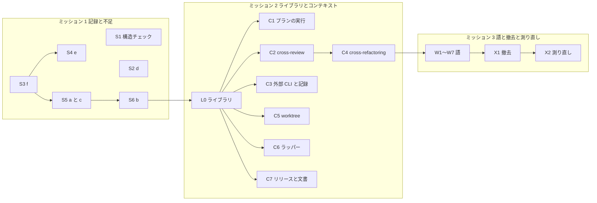

# 1142: エントリポイントの一覧と移行の順序

[issue-1142-design.md](issue-1142-design.md) の続きである。エントリポイントの一覧、変えるエントリポイント、
移行の順序（移行ステップごとに触るファイル）を持つ。パスは `plugins/ndf/` からの相対で書く
（`scripts/check-script-structure.py` などリポジトリの根のものは「根の」と添える）。

## エントリポイントの一覧

外から呼ばれるスクリプトは 45 本である（2026-09-26 の調査。手順書・hook・宣言・プランの雛形・継続的統合・
ほかのスクリプトから、パスと副命令の形で呼ばれるもの）。**45 本すべてについて、パスと副命令と引数と出力の
形を移行の後も変えない**（I3）。変わるのは中身の置き場所だけである。追加と読み替えと撤去は次の節にある。

呼び出し元の略号: S = Skill の手順、A = エージェント、H = hook、N = `.ndf/`、P = プランの雛形、
X = ほかのスクリプト、CI = 継続的統合。

### 中身を移すもの（11 本）

| エントリポイント | コンテキスト | 呼び出し元 | 移行後の中身の置き場 | 移行ステップ |
| --- | --- | --- | --- | --- |
| `scripts/supervise.py`（new / run / queue / wait / note / history / expected / example / design-glossary / sync-check） | プランの実行 | S・P・X | `scripts/supervise_lib/` | C1 |
| `scripts/mission-state.py` | プランの実行 | S | ライブラリ（時刻・JSON・`state_dir_of`） | C1 |
| `scripts/mvv-gate.py check` | プランの実行 | S・P | ライブラリ（時刻・gh・`sha256_of`） | C1 |
| `scripts/check-trigger.py`（eval ほか 8 個） | プランの実行 | S・P | ライブラリ（時刻・git・gh・JSON） | C1 |
| `scripts/mission-close.py` | プランの実行 | S・P | ライブラリ | C1 |
| `skills/cross-review/scripts/drive.py` | 収束ループ | S・P | `lib/loop_drive.py`。drive.py が起動する内部の `state.py`（副命令 14 個）の中身は `review_lib/` | C2 |
| `skills/cross-refactoring/scripts/drive.py` | 収束ループ | S・P | `lib/loop_drive.py` | C4 |
| `skills/cross-refactoring/scripts/refactor.py` | 収束ループ | S・P・X | `refactor_lib/`（時刻と slug をライブラリへ） | C4 |
| `scripts/relay.py`（run / stop / install / uninstall / status / startup / question / is-child / notice / mark） | ラッパー | H・S・X | `scripts/relay_lib/` とラッパーの束 | C6 |
| `lib/worktree-common.sh`（source） | worktree | S・X | 同じディレクトリの 4 本 | C5 |
| `scripts/instructions-check.py` | 文書の検査 | S・N・CI | `scripts/instructions_lib/` | C7 |

### 重複だけをライブラリへ置き換えるもの（22 本）

| エントリポイント | コンテキスト | 移行ステップ |
| --- | --- | --- |
| `scripts/merged-steps.py`・`release-steps.py`・`release-verification-steps.py`・`pr-steps.py`・`plan-to-spec-steps.py`・`pr-body-decisions.sh` | リリース | C7 |
| `skills/fix/scripts/fix-steps.py` | リリース | C7 |
| `scripts/glossary.py`・`spec-copy.py`・`doc-lint.py`・`skills/issue-upkeep/scripts/upkeep.py` | 文書の検査 | C7 |
| `scripts/worktree-setup.sh`・`worktree-localenv.sh`・`worktree-testenv.sh`・`worktree-guard.sh`・`worktree-session.sh` | worktree | C5 |
| `skills/external-ai/scripts/external-ai.py`・`scripts/wait-notify.py`・`lib/transcript_agents.py` | 外部 CLI の起動 / 記録と測定 | C3 |
| `skills/skill-stats/scripts/skill-stats.py`・`scripts/parallel-measure.py`・`lib/bg-wait.sh` | 記録と測定 | C3 |

### 変えないもの（12 本）

重複を持たず、1000 行以下のもの: `scripts/projects-sync.sh`・`progress-record.sh`・`resolve.sh`・
`token-guard.sh`・`ensure-retention.sh`・`statusline-switch.sh`・`statusline.sh`・`install-official-skills.sh`・
`skills/development-workflow/scripts/workflow-guard.sh`・`stage-check.sh`・`skills/google-auth` と `google-drive` の
2 本（`google_auth.py`・`gdrive_fetch.py`）。語の移行（W1〜W7）で文面だけ触るものがある。

### 内部だけのもの

外から呼ばれないのは 85 本（ライブラリ 27・cross-refactoring 33・cross-review 12・試行 4・データ 4・
そのほか 5）である。パスを変えてよいが、この設計で動かすのは上の表の移行ステップが挙げるものだけにする。
`.ndf/pace.json` の `paths` と `boundary_paths` はスクリプトのパスを並べているため、パスを動かした
移行ステップが同じ PR で書き換える。

## 変えるエントリポイント

### 追加（5 件）

| # | エントリポイント | 理由 | 移行ステップ |
| --- | --- | --- | --- |
| V1 | `supervise.py new fix` | 即時修正を worker の実装のステップ無しで流す（不足 a） | S5 |
| V2 | `release-steps.py changed-plugins` | 本番のリリースプランが ndf 以外の差分を知る（不足 c） | S5 |
| V3 | `lib/limits.py cli-timeout` の `--override`・`--no-floor` | 3 つの `resolve_print_timeout` を 1 つにする | L0 |
| V4 | 根の `scripts/check-script-structure.py` | 構造チェック（I4・I5） | S1 |
| V5 | 根の `scripts/measure/structure-baseline.py`・`claude-p-usage.py` | E1 と E9 を同じコマンドで打つ | S1 |

### 足す約束の形

| 名前 | 入力 | 出力（成功） | 失敗の形 | 互換性 |
| --- | --- | --- | --- | --- |
| `supervise.py new fix` | 必須 `--worktree` か `--branch`・`--tests`・`--title`。任意 `--issue`・`--escape-of`・`--summary`・`--out` | 結果 JSON（`tool: supervise-new`）。プランは `test-limited` → `pr` → `test-all` → `doc-lint` → `ready` → `merge` | 必須が欠ければ終了コード 2 | 追加だけ |
| `release-steps.py changed-plugins` | `--since <タグ>`・`--root` | 結果 JSON。`items` は差分のあるプラグイン（ndf を除く）ごとの `{name, from, to}`。`to` は PATCH を 1 つ上げた版 | タグが無ければ 2 | 追加だけ |
| 本番のリリースプランの `bump-others` | `changed-plugins` の `items` | プラグインごとに `bump --plugin <名> --to <to>` | 1 つでも落ちたら止まる | 本番のプランにステップが 1 つ増える |
| `mvv-gate.py check --gate design` | 今のまま | 記録の `material` に読んだ設計文書のパス | 読めない文書は飛ばし、記録に `material_skipped` | 追加だけ |
| `check-script-structure.py` | `--root`・`--allow <json>` | 結果 JSON。`items` に違反 | 違反があれば 1、例外リストの使われない行も 1 | 新設 |
| `limits.py cli-timeout` | 今の 2 引数に任意 `--override N`・`--no-floor` | 秒数 1 行 | 今のまま | 追加だけ |
| `token-usage.py` | 今のまま | 帳簿の行を版と層（supervisor / worker）へ加える | 帳簿が無ければ今の値だけ | 値が増える |

### 読み替え（5 件）

#1166 の旧い語のうち、ほかのスクリプトや conductor が値として読むものである。**書く側を新しい語へ替え、
読む側は新旧の両方を受ける。** 旧い語を受ける読み替えは、語の移行を載せた版の次の版で外す（外す課題は
X1 で起票する）。

| # | 値 | 旧 → 新 | 読む側 | 移行ステップ |
| --- | --- | --- | --- | --- |
| R1 | フェーズレポートの `結果:` の値 | `関門` → `承認ゲート` | conductor の手順・`mission-state.py` | W1 |
| R2 | プランの `"フェーズ"` の値 | `配布（開発版）` / `配布（本番）` → `リリース（開発版）` / `リリース（本番）` | `mission-state.py`・`check-trigger.py` | W1 |
| R3 | `supervise.py new` の出力の文 | `計画を書いた` → `プランを書いた` | conductor の手順 | W1 |
| R4 | ラッパーの境の行 | `── ndf-relay: 区間 N ──` → `── ndf-relay: セッション N ──` | `experimental/resume.py`・利用者 | W6 |
| R5 | フェーズレポートの見出し | `## フェーズの報告` → `## フェーズレポート` | conductor の手順・`scripts/measure/claude-p-usage.py` | W1 |

`log.jsonl` のキー `section` と、状態ファイルのキーは変えない（I11）。docstring・コメント・stderr の
案内の語は読む側が無いため、読み替えを置かずに替える。

### 撤去（2 件）

| # | エントリポイント | 理由 | 移行ステップ |
| --- | --- | --- | --- |
| X-a | `scripts/phase-steps.py` | 呼び出し元が 0 件の試作 | X1 |
| X-b | `scripts/bundle-close.py` | `mission-close.py` の旧名の中継。手順書・プランの雛形からの呼び出しが 0 件 | X1 |

### 中身が変わるが形は変わらないもの

- `~/.claude/ndf/relay.py` は、ラッパーの束を読むランチャーになる。rc の関数が呼ぶパスと引数は変わらない
- `<プラン>-state/` は、プランが一時ディレクトリの下にあるとき状態の置き場への シンボリックリンクになる

## 移行の順序

**3 つのミッションに分け、各ミッションが版を 1 つ出す**（前提 2）。1 移行ステップは 1 本の PR で閉じる
（I10）。同じ段の移行ステップは触るファイルが重ならず、並列に流せる（6 本まで）。**着手の前に、開いている
PR の変更ファイルと突き合わせ、重なれば同じ段の中で順序を入れ替える**（前提 3）。

**ミッションの間は版で区切る。** 次のミッションは、前のミッションの本番（承認ゲート 2）の後に始める。
図のミッションをまたぐ矢印はその順序を表し、特定の移行ステップへの依存ではない。

**d と f を最初のミッションに置くのは、移行の前後を同じ物差しで比べるためである**（要求の「決めたこと」）。
ミッション 1 の版から、検査の件数と `claude -p` の消費が記録に残る。

### ミッション 1: 記録と不足 a〜f

| 段 | 移行ステップ | 触るファイル |
| --- | --- | --- |
| 1 | S1 構造チェック | 根の `scripts/check-script-structure.py`・`scripts/script-structure-allow.json`・`scripts/measure/structure-baseline.py`・`scripts/measure/claude-p-usage.py`（パスを引数へ）・`scripts/tests/test_check_script_structure.py`・`.github/workflows/script-structure.yml` |
| 1 | S2 検査の件数（d） | `skills/cross-review/scripts/drive.py`・`skills/cross-refactoring/scripts/drive.py`・両方の `tests/test_drive.py` |
| 1 | S3 消費の記録（f と d の入れ子） | `scripts/lib/usage_ledger.py`（新設）・`scripts/supervise.py`（`claude_cmd`・`call_claude`・`add_usage`・`do_drive`・`state_dir_of` だけ）・`scripts/mvv-gate.py`（`ask` だけ）・根の `scripts/token-usage.py`・`scripts/experimental/phase_cost.py`（既定の glob）・`skills/development-workflow/references/relay.md`（例のパス）・テスト |
| 2 | S4 設計文書の材料（e） | `scripts/mvv-gate.py`（`cmd_check`・`record`）・`scripts/tests/test_mvv_gate.py` |
| 2 | S5 即時修正と他のプラグイン（a・c） | `scripts/supervise.py`（`NEW_KINDS`・`NEW_REQUIRED`・`NEEDS`・`NEW_ARGS`・`cmd_new`・`plan_fix`・`plan_release_package_plugin`）・`scripts/release-steps.py`・`skills/release/references/form-package-plugin.md`・`skills/development-workflow/references/pace.md`（即時修正の 1 行）・テスト |
| 3 | S6 conductor の一覧（b） | `skills/development-workflow/references/conductor-entrypoints.md`（新設）・`references/scripts-lookup.md`（参照 1 行）・一覧のスクリプトが実在するかのテスト |

S1 の例外リストは、その時点の違反をすべて載せて始める（行数 6 件・同じ名前で本体の違う関数・本体の同じ
関数）。**以後の移行ステップは、自分が直した行だけを例外リストから消す。** 使われない行は構造チェックが
落とすため、消し忘れは同じ PR で分かる。

### ミッション 2: ライブラリとコンテキスト

| 段 | 移行ステップ | 触るファイル | 見積りの行数（移行後の最大） |
| --- | --- | --- | --- |
| 1 | L0 ライブラリ | `lib/` に `clock.py`・`jsonio.py`・`proc.py`・`repo.py`・`loop_drive.py` を新設。`lib/limits.py`（`resolve_cli_timeout`・V3）・`lib/launch-cli.sh`（`resolve_print_timeout` を `limits.py` の 1 回へ）・`lib/step_result.py`（`git`・`gh_json` を `proc` の上へ）・`lib/statefile.py`（`now`・`die`・`info` を再エクスポート）・`lib/README.md`・テスト。**呼び出し側はまだ変えない** | 各 150 以下 |
| 2 | C1 プランの実行 | `scripts/supervise.py`・`scripts/supervise_lib/`（新設 13 本。`__init__` を含む）・`mission-state.py`・`mvv-gate.py`・`check-trigger.py`・`mission-close.py`・`scripts/tests/test_supervise*.py` ほか差し替え先 | `supervise.py` 約 450・`engine.py` 約 550 |
| 2 | C2 cross-review | `skills/cross-review/scripts/state.py`・`review_lib/`（新設 16 本。`__init__` を含む）・`drive.py`・`measure.py`・`critique.sh`・`launch-reviewer.sh`・`skills/cross-review/tests/`・`skills/fix/tests/test_fix_steps.py`（差し替え先だけ） | `commands/init.py` 約 520 |
| 2 | C3 外部 CLI と記録 | `lib/monitor.py`・`lib/monitor_patterns.py`（新設）・`lib/monitor_outcome.py`・`lib/run_metrics.py`・`lib/post_queue.py`・`lib/transcript_agents.py`・`skills/external-ai/scripts/external-ai.py`・`scripts/wait-notify.py`・`skills/skill-stats/scripts/skill-stats.py`・`scripts/parallel-measure.py`・テスト | `monitor.py` 約 860 |
| 2 | C5 worktree | `lib/worktree-common.sh`・`lib/worktree-branch.sh`・`worktree-shell-lex.sh`・`worktree-write-target.sh`・`worktree-registry.sh`（新設）・`scripts/worktree-*.sh` 5 本・`lib/README.md` の worktree の行 | `worktree-write-target.sh` 約 950 |
| 2 | C6 ラッパー | `scripts/relay.py`・`scripts/relay_lib/`（新設 10 本。`__init__` を含む）・`scripts/experimental/resume.py`・`scripts/tests/test_relay.py`・`skills/install-wrapper/SKILL.md`（束の説明だけ） | `relay_lib/run.py` 約 780 |
| 2 | C7 リリースと文書 | 「重複だけを置き換えるもの」のリリースと文書の検査の 11 本・`scripts/instructions-check.py`・`scripts/instructions_lib/`（新設 2 本）・`scripts/tests/test_instructions_check.py`（複製の対象に新設の 1 本を足す） | `instructions-check.py` 約 870 |
| 3 | C4 cross-refactoring | `skills/cross-refactoring/scripts/drive.py`・`launch-cli.sh`・`refactor_lib/clock.py`・`paths.py`・`commands/converge.py`・`commands/implement.py`・`commands/setup.py`・テスト | 変わらず（最大 `gitfacts.py` 991） |

**段 2 は 6 本で、並列の上限に収まる。** C4 は C2 と同じ `lib/loop_drive.py` の呼び出しを揃えるため、
C2 の後に置く。`lib/README.md` の索引は、各移行ステップが自分の行だけを直す。

**テストは差し替え先と import だけを変える**（受け入れ条件「置き換え先の変更だけで通る」）。`state.py` の
`monkeypatch.setattr(state_mod, ...)` 146 か所と `supervise.py` の 8 か所を、定義元のモジュールへ向け直す
（決定 3）。`lib/monitor.py` は差し替えられる関数を動かさないため、シム越しの約 43 か所はそのまま通る。

### ミッション 3: 語・撤去・測り直し

| 段 | 移行ステップ | 触るファイル |
| --- | --- | --- |
| 1 | W1 プランの実行の語（R1〜R3・R5） | C1 と同じファイル |
| 1 | W2 cross-review の語 | C2 と同じファイル |
| 1 | W3 外部 CLI と記録の語 | C3 と同じファイル |
| 1 | W4 cross-refactoring の語（`改修計画` → リファクタリング計画ほか） | C4 と同じファイル |
| 1 | W5 worktree の語（`主ディレクトリ` → メインディレクトリほか） | C5 と同じファイル |
| 1 | W6 ラッパーの語（R4・`区間` → セッション・`合図` → シグナルファイル） | C6 と同じファイル |
| 2 | W7 リリースと文書の語（`配布` → リリースほか） | C7 と同じファイル。W1 と同じ段に置くと並列の上限を超えるため段 2 |
| 3 | X1 撤去と後片付け | `scripts/phase-steps.py`・`scripts/bundle-close.py`（削除）・`.ndf/pace.json`・根の `scripts/script-structure-allow.json`。読み替えを外す課題を起票する |
| 4 | X2 測り直し（E9） | ファイルは変えない。`scripts/measure/` の 2 本を E1 と同じ引数で打ち、課題のコメントへ比べた表を残す |

語の移行ステップは、`glossary.py check` を対象のファイルに掛け、旧い語の行が 0 になることを確かめる。

### 戻し方

| 何が落ちたか | 扱い |
| --- | --- |
| 移行ステップの PR の全体テスト | その PR をマージしない。直せなければ閉じ、同じ段の残りを先に流す |
| マージ後に開発版の `verify-install` | 落ちた移行ステップの PR を revert する（I10）。ほかの移行ステップは revert しない |
| ほかのミッションとの衝突 | 同じ段の中で入れ替える。段をまたぐ入れ替えはしない（L0 の前にコンテキストの移行ステップを置かない） |
