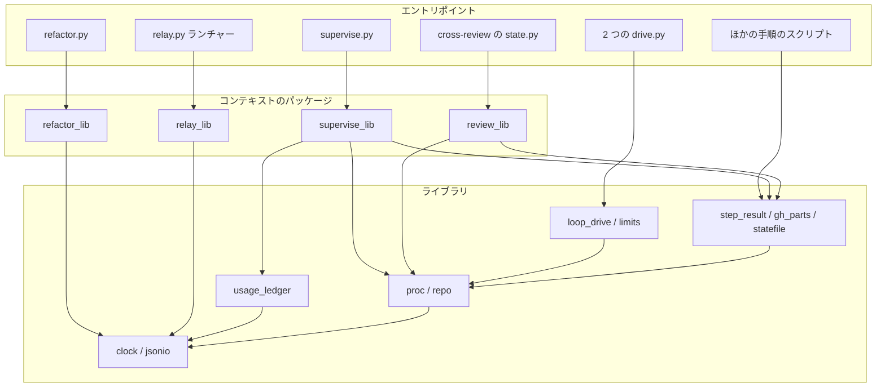
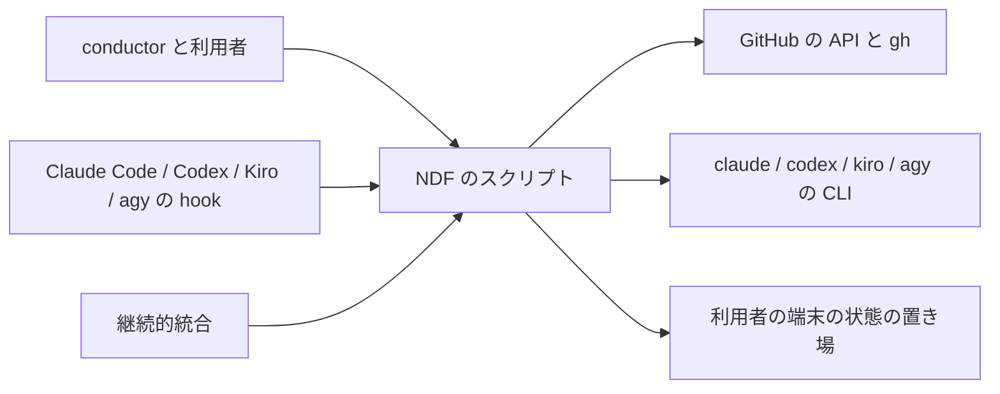
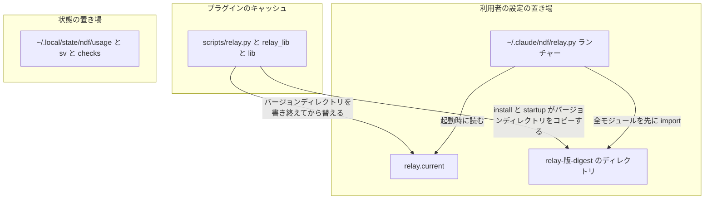
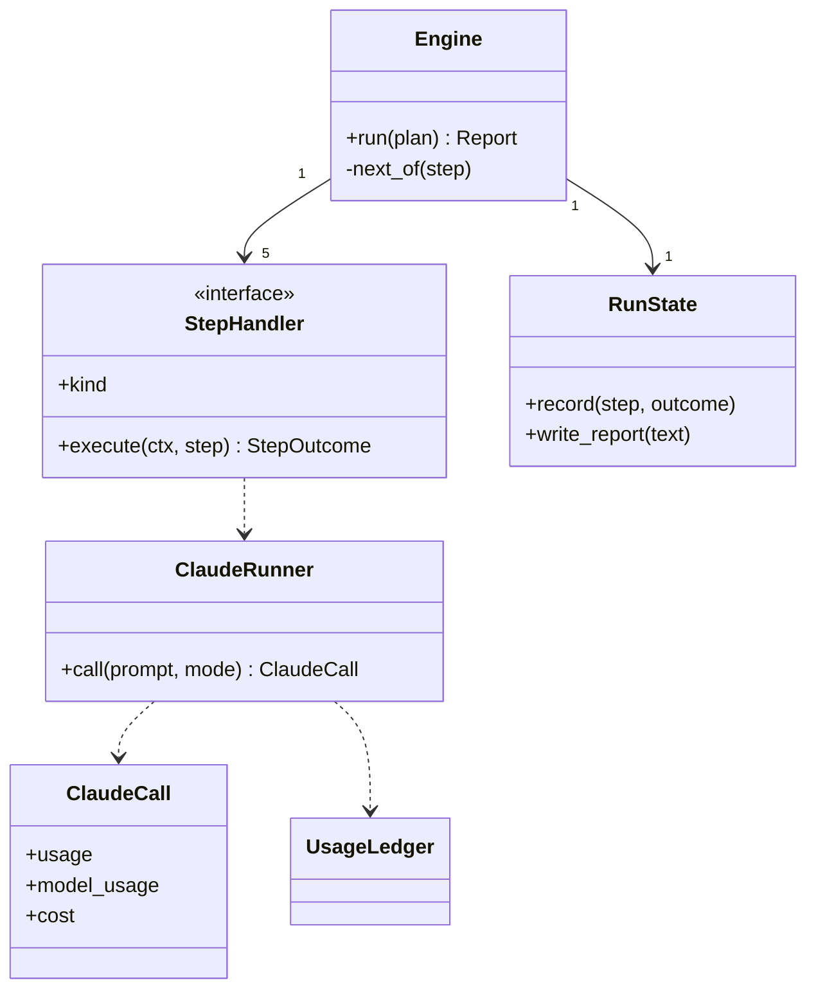
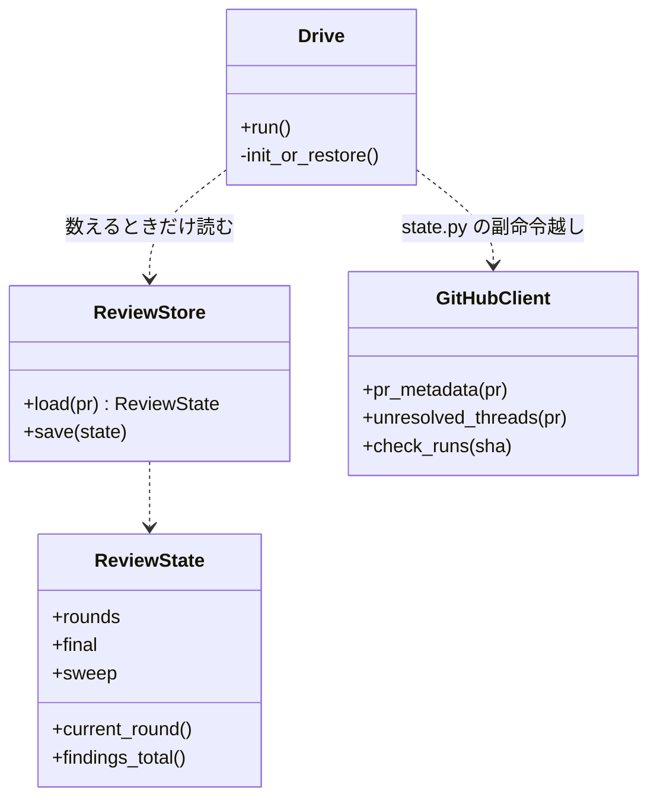
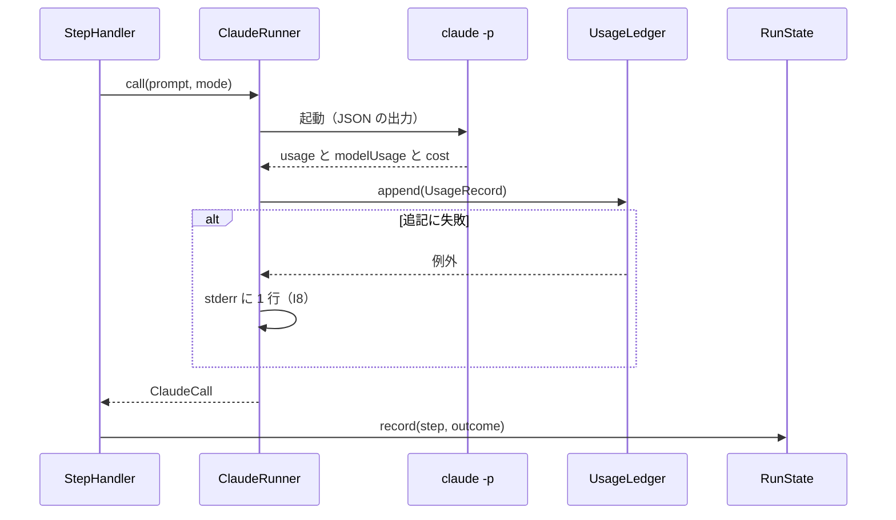
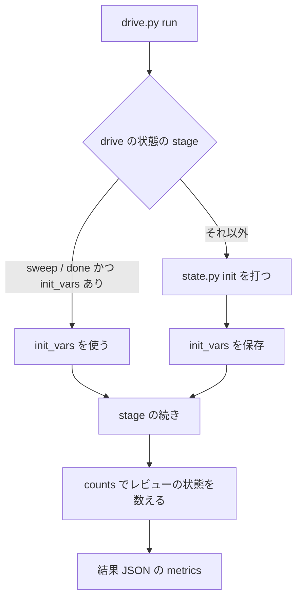
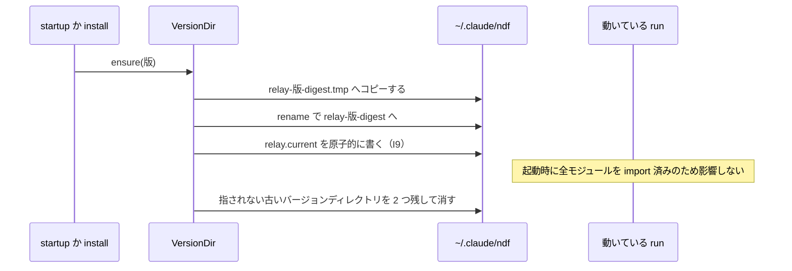

# 1142: NDF のスクリプトをモデルとクラスから組み直す

要求と受け入れ条件は #1142 の本文にある（コピーは [issue-1142-requirements.md](issue-1142-requirements.md) ）。
この文書は「どう作るか」だけを扱う。エントリポイントの一覧と移行の順序（移行ステップごとに触るファイル）は
[issue-1142-design-migration.md](issue-1142-design-migration.md) 、モジュールの分け方は [issue-1142-design-modules.md](issue-1142-design-modules.md) 、決定の記録は [issue-1142-design-decisions.md](issue-1142-design-decisions.md) にある。

数は 2026-09-26 03:30 UTC に測った値である（`python3 /tmp/ndf-measure-1142/structure.py plugins/ndf`）。
ファイル 128 本・48,394 行（本文の表から 531 行増えた）、1000 行を超えるファイル 6 本、2 つ以上のファイルで
同じ名前を持つ最上位の関数 86 名（199 件）。

## ドメインモデル

### コンテキスト

スクリプトを 8 つのコンテキストとライブラリに分ける。要求が初期値に挙げた 6 つに、外部 CLI の起動と
文書の検査を足した。どのスクリプトがどこに属するかは移行の文書の「エントリポイントの一覧」が持つ。

| コンテキスト | 用語集の `id` | 何の語が 1 つの意味に決まるか |
| --- | --- | --- |
| ライブラリ | `ndf-workflow` | 時刻・JSON・git / gh の呼び出し・リポジトリの識別・結果 JSON・使用量の帳簿 |
| プランの実行 | `ndf-workflow` | プラン・ステップ・フェーズレポート・ミッション状態ファイル・承認ゲート・検査のトリガー |
| 収束ループ | `ndf-cross-review` / `ndf-cross-refactoring` | ラウンド・指摘・drive の状態・レビューの状態・リファクタリング計画 |
| リリース | `ndf-release` | 版・リリースプラン・リリース記録・マージの待ち |
| worktree | `ndf-worktree` | 宣言・書き込み先・テスト環境のレジストリ |
| ラッパー | `ndf-relay` | セッション・シグナルファイル・ラッパーのバージョンディレクトリ |
| 記録と測定 | `ndf-workflow` | 実行の要約・会話の記録・キュー・通知 |
| 外部 CLI の起動 | `ndf-agent-cli` | スロット・起動の上限時間・監視の結果 |
| 文書の検査 | `ndf-instructions` / `ndf-issue-upkeep` | 用語集・指示書・仕様のコピー・課題の棚卸し |

**コンテキストの間は「公表された言語」でやり取りする。** 言語は結果 JSON（`lib/README.md` の契約）と
状態ファイルの形である。プランの実行は `drive.py` の結果 JSON の `metrics` だけを読み、レビューの状態の
ファイルを直に読まない。**ライブラリは全コンテキストの共有カーネルで、どのコンテキストにも依存しない**（I1）。

**コンテキストマップ。** 契約の形を決めるのは上流で、下流はその形に従う。形を変えるときは上流の PR が
下流の読み手とそのテストを同じ PR で直す（I3・I10）。

| 上流（契約を決める） | 下流（従う） | 関係 | 契約 |
| --- | --- | --- | --- |
| ライブラリ | ほかの 8 つすべて | 共有カーネル | 関数の引数と戻り値・結果 JSON の形（`lib/README.md`） |
| 収束ループ | プランの実行 | 公開ホストサービス / 順応者 | `drive.py` の結果 JSON（`metrics`） |
| 外部 CLI の起動 | 収束ループ | 公開ホストサービス / 順応者 | 監視の結果（`*-monitor.json`）と起動の上限時間 |
| リリース | プランの実行 | 公開ホストサービス / 順応者 | `release-steps.py` などの結果 JSON |
| worktree | プランの実行・収束ループ | 公開ホストサービス / 順応者 | 宣言と書き込み先の出力 |
| 文書の検査 | プランの実行 | 公開ホストサービス / 順応者 | 検査のスクリプトの結果 JSON |
| プランの実行 | 記録と測定 | 公開ホストサービス / 順応者 | 実行の状態・ミッション状態ファイルの形（I11） |
| ラッパー | プランの実行 | 公開ホストサービス / 順応者 | `ndf-next` のブロックの形とシグナルファイル（`next.json`）。ブロックを解析して `next.json` へ書くのは `relay.py mark`（Stop hook）で、`mission-state.py next`・`token-guard.sh` はその形に従ってブロックを出す |
### 集約

集約はどれも状態を持つファイルである。値オブジェクトはコードの中の型で、ファイルの形は変えない（I11）。

| 集約 | 持ち主（書き換えてよいもの） | 根 | エンティティ | 値オブジェクト |
| --- | --- | --- | --- | --- |
| プラン | `supervise_lib.templates`（`new` が書く） | `plan.json` | ステップ | ステップの型・条件 |
| 実行の状態 | `supervise_lib.state.RunState` | `<プラン>-state/` | ステップの記録 | `ClaudeCall`・件数 |
| ミッション状態ファイル | `mission-state.py` | `mission.json` | プラン・承認ゲートの記録 | 版 |
| レビューの状態 | `review_lib.store.ReviewStore` | `cross-review-pr<N>-state.json` | ラウンド・指摘 | `final`・`sweep` |
| drive の状態 | 各 Skill の `drive.py` の `Drive` | `drive-pr<N>.json` / `drive-rf<ID>.json` | — | `stage`・`init_vars` |
| リファクタリング計画 | `refactor_lib`（今のまま） | 状態ファイル | 改善項目 | 配分 |
| 検査の記録 | `check-trigger.py` | `checks/<owner>__<repo>.jsonl` | 評価・検査の行 | 件数 |
| 使用量の帳簿 | `lib/usage_ledger.UsageLedger` | `usage/<owner>__<repo>.jsonl` | — | `UsageRecord` |
| テスト環境のレジストリ | `lib/worktree-registry.sh` | レジストリのディレクトリ | スロット | ポート |
| ラッパーの記録 | `relay_lib.record.RelayRecord`（`run.Relay` と `mark` はこれを通して書く） | `log.jsonl`・`next.json` | セッション | ブロック |
| ラッパーのバージョンディレクトリ | `relay_lib.version_dir.VersionDir` | `~/.claude/ndf/relay.current` | バージョンごとのディレクトリ | ディレクトリの digest |
| 版 | `release-steps.py bump` | `plugin.json` の `version` | — | 版数 |

### 不変条件

| # | 集約 | 条件 | 破れたときの扱い |
| --- | --- | --- | --- |
| I1 | （ライブラリ） | ライブラリのモジュールは、ライブラリ・標準ライブラリ・依存の宣言（`plugins/ndf/pyproject.toml` の extra）に載る外部パッケージだけを import する。標準ライブラリは `sys.stdlib_module_names` に載るモジュールを指す | 構造チェックが落とす |
| I2 | ラッパーのバージョンディレクトリ | バージョンディレクトリの中のモジュールは、バージョンディレクトリの中と標準ライブラリだけを import する（外部パッケージを使わない。決定 17） | 構造チェックが落とす |
| I3 | （全体） | エントリポイントのパス・副命令・引数・出力の形は移行の前後で同じ。例外は移行の文書の「変えるエントリポイント」だけ | 契約テストが落とす |
| I4 | （全体） | 本体の同じ関数が 2 つのファイルに無い。同じ名前で本体の違う関数は例外リストに載る | 構造チェックが落とす |
| I5 | （全体） | テストを除くスクリプトは 500 行以下（区分は `markdown-writing` のルール 9 と同じ。300 行は目安）。例外は例外リストに理由と行数付きで載り、載せた行数を超えない（ラチェット）。新しく作るファイルは例外リストに載せない（決定 18） | 構造チェックが落とす |
| I6 | （全体） | 既定で動くものは `experimental/` を import しない。向きは試行 → 安定だけ | 既存の `test_experimental.py` が落とす |
| I7 | drive の状態 | `stage` が `sweep` か `done` で `init_vars` があるとき、`drive.py` は `init` を打たずに `init_vars` を使う。これでレビューの状態の `final` を同じ PR の空の状態で上書きさせない | `sweep` から打ち直して `metrics.rounds` が 0 でないテストが落とす |
| I8 | 使用量の帳簿 | `claude -p` の 1 回の呼び出しにつき 1 行を追記し、既存の行を書き換えない | 追記に失敗しても呼び出しの結果は返し、stderr に 1 行を出す |
| I9 | ラッパーのバージョンディレクトリ | バージョンディレクトリを書き終えてから `relay.current` を 1 回の原子的な書き込みで替える | 書き終わらないバージョンディレクトリは `relay.current` から指されず、次の起動で消える |
| I10 | （移行） | 移行ステップは 1 本の PR で閉じ、その revert 1 つで 1 つ前に戻る | 戻せない形の PR は分ける |
| I11 | 状態ファイル | 状態ファイルの形は変えない。変えるのはキーの追加だけ | 読む側のテストが落とす |
| I12 | （全体） | 1 つの集約のファイルを書くモジュールは 1 つ | 構造チェックの書き手の表で見る（テスト設計） |
| I13 | （全体） | hook から import をたどって届くモジュールは、標準ライブラリだけを import する。外部パッケージを使うエントリポイントは、外部パッケージの import より前に `deps.require()` を呼ぶ | 構造チェックが落とす |

### ドメインイベント

番号は要求の「ドメインイベント」を引き継ぐ。

| # | イベント | 発生元 | 受け手 |
| --- | --- | --- | --- |
| E1 | 移行の前の基準を測った | conductor（計測の 2 本） | 設計（この文書の数） |
| E2 | スクリプトの語を用語集に揃えた | `requirements-design` | 設計（用語の表） |
| E3 | 設計を承認した（承認ゲート 1） | 利用者 | 移行ステップ S1〜S3 |
| E4 | ライブラリを 1 か所へまとめた | 移行ステップ L0 | コンテキストの移行ステップ C1〜C7 |
| E5 | コンテキストごとのモジュールへ移した | C1〜C7 | 語の移行ステップ W1〜W7 |
| E6 | エントリポイントの形が変わらないことを確かめた | 各移行ステップの契約テスト | 開発版のリリースプラン |
| E7 | 開発版を導入して確かめた | `release-verification-steps.py verify-install` | 本番のリリースプラン |
| E8 | 本番を承認した（承認ゲート 2） | 利用者 | 次のミッション |
| E9 | 移行の後を同じ物差しで測り直した | conductor（E1 と同じ 2 本） | 振り返り（課題のコメント） |

### 用語

| 用語 | 意味 | 用語集への反映 |
| --- | --- | --- |
| 使用量の帳簿 | `claude -p` の 1 回の呼び出しごとに、版・プラン・ステップ・usage を 1 行で追記する jsonl | 追加（`ndf-workflow`） |
| ラッパーのバージョンディレクトリ | `~/.claude/ndf/` に版ごとに置く、ラッパーの `relay_lib/` と使うライブラリのコピー | 追加（`ndf-relay`） |
| ランチャー | `~/.claude/ndf/relay.py`（プラグインの `scripts/relay.py` と同じバイト列）。使うバージョンディレクトリを選び、`relay_lib` を読み込んで起動するだけのエントリポイント | 追加（`ndf-relay`） |
| drive の状態 | 収束ループの `drive.py` が PR ごとに持つ状態ファイル（`drive-pr<N>.json` / `drive-rf<ID>.json`）。`stage` と `init_vars` を持つ | 追加（`ndf-cross-review`） |
| 構造チェック | テストを除くスクリプトの行数と、本体の同じ関数・同じ名前で本体の違う関数を構文木で数える継続的統合のチェック | 追加（`ndf-workflow`） |

## 機能一覧

| # | 機能 | 誰が使うか |
| --- | --- | --- |
| F1 | 時刻・JSON・git / gh・リポジトリの識別・drive の部品を 1 つの関数で呼ぶ | スクリプトを直す worker |
| F2 | 1 つの責務を 500 行以下のモジュールで読む | スクリプトを直す worker |
| F3 | 行数と重複を継続的統合で落とす | レビューする者 |
| F4 | 即時修正を「テスト → PR → `merge-when-green`」のプランで流す（不足 a） | conductor |
| F5 | conductor が直に使うエントリポイントを 1 か所で引く（不足 b） | conductor |
| F6 | 本番のリリースプランが、差分のある ndf 以外のプラグインの版も上げる（不足 c） | conductor |
| F7 | 検査のフェーズレポートと `check-trigger.py stats` が実際のラウンド数と指摘数を返す（不足 d） | conductor・振り返り |
| F8 | 設計の MVV の判定に設計文書を材料として渡す（不足 e） | conductor |
| F9 | プランが起動した `claude -p` の消費を版ごとに集計する（不足 f） | 振り返り |
| F10 | ラッパーを複数のモジュールに分けたまま、1 回の導入で複製して動かす | 利用者 |
| F11 | 移行の前後を同じコマンドで測る | 振り返り |
| F12 | 読み直しを REST の ETag で上限に数えさせず、GraphQL と REST の 2 つの枠を使い分け、片方が上限でも代われる操作は止まらない（不足 g） | conductor |
| F13 | 外部パッケージを 1 つの宣言と lock で固定して使い、uv が無い環境でも入れてから続ける（不足 h） | スクリプトを直す worker・利用者 |

## 構成要素

| 要素 | 責務 |
| --- | --- |
| `lib/clock.py`（新設） | 今の時刻・ISO の書き出しと読み取り・秒の差。書き出しの形は引数で選ぶ |
| `lib/jsonio.py`（新設） | JSON の読み（無いとき・壊れたときの扱いを引数で選ぶ）と原子的な書き込み |
| `lib/proc.py`（新設） | 子プロセス・git の起動。失敗は `StepError(msg, code)` に揃える |
| `lib/repo.py`（新設） | メインディレクトリ・`owner/repo`・slug・宣言のベースブランチ |
| `lib/loop_drive.py`（新設） | 2 つの `drive.py` が使う `call`・`parse_vars`・`review_status` |
| `lib/usage_ledger.py`（新設） | 使用量の帳簿の追記と読み取り |
| `lib/limits.py`（変更） | 外部 CLI の起動の上限時間を 1 つの関数で決める（`resolve_cli_timeout`） |
| `lib/step_result.py`・`lib/gh_parts.py`・`lib/statefile.py`（変更） | 結果 JSON・GitHub の部品・KEY=VALUE の出力に絞る。git と時刻は新設の 3 本へ移す。GitHub の読み書きは `gh_parts` だけが `gh` を呼ぶ。読み直しは REST の ETag 付きの要求、単発の読み書きは REST、入れ子の読み取りと REST に無い操作は GraphQL で行い、片方の枠が上限なら代われる操作をもう片方で行う（不足 g） |
| `scripts/supervise.py` と `scripts/supervise_lib/`（分割） | エントリポイントは使い方と main だけ。実行・テンプレート・queue は下のパッケージの 19 本（分け方は [issue-1142-design-modules.md](issue-1142-design-modules.md) ） |
| `skills/cross-review/scripts/state.py` と `review_lib/`（分割） | エントリポイントは副命令の解析だけ。状態・GitHub・指摘・副命令の本体は下のパッケージの 21 本 |
| 2 つの `drive.py`（変更） | `final` の後に `init` を打たない（I7）。共通の部品は `lib/loop_drive.py` |
| `scripts/relay.py` と `relay_lib/`（分割） | エントリポイントだけを持つランチャーと、バージョンディレクトリに入るパッケージの 11 本。`log.jsonl`・`next.json` を書くのは `relay_lib.record` だけ（I12） |
| `lib/worktree-common.sh`（分割） | ほかのスクリプトが source するファイルとして残し、宣言・ブランチ・字句解析・書き込み先（3 本）・レジストリの 7 本を source する |
| `lib/monitor.py`（分割） | 照合の表・ログの読み取り・PID・型・監視ループの 5 本へ分ける（`supervise.py` は照合の表を `monitor_patterns` から読む） |
| `instructions-check.py`（分割） | 型・宣言・集める処理・判定・出力を隣の `instructions_lib/` の 7 本へ出す（読み手が 1 つのためライブラリに置かない） |
| `refactor_lib/gitfacts.py`（分割） | コミットの事実だけを残し、パスの判定・プロセス・GitHub・作業ツリー・公開・結果の 6 本へ分ける |
| `release-steps.py`（変更） | 差分のあるプラグインを列挙する副命令 `changed-plugins` |
| `mvv-gate.py`（変更） | 設計の判定で PR の `issues/` の設計文書を材料に足す |
| `scripts/check-script-structure.py`（新設、リポジトリ根） | 構造チェック。例外リストは `scripts/script-structure-allow.json` |
| `scripts/measure/`（新設、リポジトリ根） | E1 と E9 の計測の 2 本（`structure-baseline.py`・`claude-p-usage.py`） |
| `development-workflow/references/conductor-entrypoints.md`（新設） | conductor が直に使うエントリポイントの一覧 |

**構成要素図**（依存は矢印の向きだけ。ライブラリから外へ向かう矢印は無い）



**文脈**（外部の系は変えられないものだけ）



**配置**（ラッパーだけが、プラグインのキャッシュの外で動く）



## 構造

### パッケージ・モジュール構成

移行の後のディレクトリの構成と、関数とクラスをどのモジュールへ置くかは [issue-1142-design-modules.md](issue-1142-design-modules.md) にある。
501 行以上のファイルは移行の後に 0 本になり（移行の範囲の外のものは例外リストに残る。決定 18）、見積りの最大は
`worktree-write-target-scan.sh` の約 475 行である。

### クラス図: プランの実行

`Supervisor` の 1018 行を、ステップの型ごとのハンドラーと、状態の持ち主と、claude の呼び出しに分ける。



`StepHandler` の実装は `RunStep`・`WorkStep`・`DriveStep`・`PrStep`・`JudgeStep` の 5 つ（ステップの型と
1 対 1）。遅いステップの監視（`SlowWatch`）は `Engine` が持ち、ハンドラーからは `ctx` 越しに使う。ハンドラーは
`Engine` を import しない。テンプレート（`templates`・`mission`）は `Engine` を import しない。

### クラス図: 収束ループ

`state.py` の 225 個の関数を、状態の持ち主と外部の呼び出しと指摘の規則に分ける。辞書の形はそのまま使い、
`ReviewState` はその上に読み方を足す薄い型にする（I11）。



`Drive` は今も `state.py` の副命令をファイルのパスで起動する。直に import するのは件数を数える `counts()`
のための読み取りだけで、書き込みは `ReviewStore` だけが行う（I12）。

## データ構造

### 使用量の帳簿

置き場所は `${XDG_STATE_HOME:-~/.local/state}/ndf/usage/<owner>__<repo>.jsonl`（`check-trigger.py` の記録と
同じ解決）。**1 行 1 呼び出しのイベントログにする。** 合計は読む側が導く。

| 列 | 型 | 空を許すか | 意味 |
| --- | --- | --- | --- |
| `at` | string（UTC・`Z`） | 許さない | 呼び出しが終わった時刻 |
| `ndf_version` | string | 許さない | 起動したスクリプトの `plugin.json` の版 |
| `source` | string | 許さない | `supervise` / `mvv-gate` |
| `plan` / `step` | string | 許す | 空は「プランの外の呼び出し」（`mvv-gate`） |
| `kind` | string | 許さない | `work` / `full` / `judge` / `slow` / `pr` / `mvv` |
| `model` | string | 許す | 空は「`modelUsage` が無かった」 |
| `usage` | object | 許さない | `claude -p` の `usage` をそのまま（`cache_creation.ephemeral_5m/1h_input_tokens` を含む） |
| `model_usage` | object | 許す | `modelUsage` をそのまま |
| `cost_usd` / `turns` / `seconds` | number | 許す | 空は「結果に無かった」。0 と区別する |
| `session_id` | string | 許す | `--no-session-persistence` でも返る値 |

### 実行の状態の置き場所

`<プラン>-state/` のパスは変えない（I3）。**プランのファイルが一時ディレクトリの下にあるときだけ、実体を
`${XDG_STATE_HOME}/ndf/sv/<stem>-<プランの絶対パスの sha256 の先頭 8 字>/` に作り、`<プラン>-state` を
そこへのシンボリックリンクにする。** 実体にはプランのコピー `plan.json` も置く。`state.json` の `log[]` の
各ステップの `llm` には、キー `cache_write_5m`・`cache_write_1h`・`models` を足す（I11）。

### drive の状態

`drive-pr<N>.json` にキー `init_vars`（`state.py init` の KEY=VALUE を dict にしたもの）を足す。
`stage` が `sweep` か `done` で `init_vars` があるとき、`drive.py` は `init` を打たずにこれを使う（I7）。

### ラッパーのバージョンディレクトリ

```text
~/.claude/ndf/
├── relay.py                      # ランチャー（プラグインの scripts/relay.py と同じバイト列）
├── relay.current                 # 使うバージョンディレクトリの名前 1 行。原子的に書き換える
├── relay.version                 # 今のまま（版の記録）
└── relay-<版>-<digest 8 字>/
    ├── relay_lib/                # バージョンディレクトリの中身
    ├── lib/clock.py  lib/jsonio.py
    ├── inuse-<pid>               # このバージョンディレクトリを使っている run ごとに 1 つ。run が終わるときに消す
    └── MANIFEST                  # バージョンディレクトリのファイルと sha256。digest はこの内容の sha256
```

時系列の扱い: 帳簿と `log.jsonl` は追記だけのイベントログ。バージョンディレクトリは版ごとに新しく作り、古い
バージョンディレクトリは `startup` が「`relay.current` が指さず、生きている pid の `inuse-<pid>` も無い」ものを 2 つを残して消す。

### CRUD 図

| 機能 | 使用量の帳簿 | 実行の状態 | drive の状態 | レビューの状態 | 検査の記録 | ラッパーのバージョンディレクトリ | 版 |
| --- | --- | --- | --- | --- | --- | --- | --- |
| F4 即時修正のプラン | — | C | — | — | C（`--escape-of` のとき） | — | — |
| F6 他のプラグインの版 | — | U | — | — | — | — | U |
| F7 検査の件数 | — | U | U | R | C | — | — |
| F8 設計の MVV | C | — | — | — | — | — | — |
| F9 版ごとの集計 | R | R | — | — | — | — | — |
| F10 ラッパーの複製 | — | — | — | — | — | C / U / D | R |

## 入出力の契約

変えるエントリポイント（追加 5・読み替え 5・撤去 2）と、足すインタフェースの入力・出力・失敗の形・互換性は、移行の文書の
「変えるエントリポイント」にある。

## 処理の流れ

図に現れない構成要素は、呼び出しの順序を変えずに置き場所だけが変わるもの（ライブラリの変更・`worktree-common.sh`・
`monitor.py`・`instructions-check.py`）と、1 つのスクリプトの中で閉じるもの（`release-steps.py`・`mvv-gate.py`・構造チェック・計測・一覧）である。

### claude の呼び出しと帳簿



### 収束した検査の再開（不足 d）



入れ子の最終ゲート（`item.command`）の件数は、`DriveStep` が内側の `metrics` を `counts` の `inner` に残す。

### ラッパーのバージョンディレクトリの切り替え



ランチャーの起動: `relay.py` の隣に `relay_lib/` があればそれを使う（プラグインのキャッシュ）。無ければ
`relay.current` のバージョンディレクトリを `sys.path` の先頭に置く。どちらでも、`run` は処理の前にバージョンディレクトリの全モジュールを import する。

### 移行ステップの流れ


## 非機能の実現方式

| 大項目 | 要求の条件 | 実現方式 | 確かめ方 |
| --- | --- | --- | --- |
| 性能・拡張性 | worker がスクリプトを 1 つ直すときに読むファイルの大きさの中央値が、移行の前より小さい | 500 行を上限に責務ごとのモジュールへ分け、エントリポイントは解析だけにする | E1 と E9 で `measure/structure-baseline.py` の中央値を比べる |
| 運用・保守性 | 並列のミッションが同じファイルを触った件数が、移行の後の 10 本の PR で移行の前より少ない | コンテキストのパッケージに分け、ライブラリの変更を L0 に集める | 移行の前後 10 本の PR の変更ファイルの重なりを `measure/structure-baseline.py --prs` で数える |
| 移行性 | 途中の版を導入した利用者の手順が変わらない。どの移行ステップでも 1 つ前へ戻せる | エントリポイントを残し中身だけ移す。語は読む側が新旧を受ける。1 移行ステップ 1 PR（I10） | 開発版ごとの `verify-install`。各 PR の revert を手元で当てて全体テスト |
| システム環境 | Python 3.10 以上・bash 3.2 で動く。外部パッケージは宣言と lock に載るものだけを使い、uv で解決する。hook とラッパーのバージョンディレクトリは外部パッケージを使わない | `clock.parse` が `Z` を置き換えてから `fromisoformat` を呼ぶ。シェルは既存の移植性テストの対象の `lib/` 直下に置く。外部パッケージは `deps.require()` が uv の環境へ起動し直して使う（決定 17） | Python 3.10 で全体テスト（`uv run --python 3.10`）。`test_portability.py`。`deps.require()` のテスト（uv が無い・起動し直しの後も import できない・入れられない） |

## テスト設計

| 受け入れ条件・不変条件 | 何で確かめるか |
| --- | --- |
| 計測と振り返りがコメントに残る | E1 のコメント（済み）。E9 は X2 のコメント |
| 計測のスクリプトが同じコマンドで打ち直せる | S1 が `scripts/measure/` に置き、`--help` と 1 回の実行を PR のテスト計画に載せる |
| 移行の後に測り直して比べる | X2 で E1 と同じ 2 本を打ち、表で比べる |
| 設計文書にモデル・責務・移行の順序がある | 設計 PR のレビュー |
| エントリポイントの一覧と変えるものがある | 設計 PR のレビュー（移行の文書） |
| 500 行を超えるファイルが例外リストの外に無く、例外リストの行数が増えない（I5） | `check-script-structure.py` の行数の検査（継続的統合）。例外リストの行数を 1 行超えたファイルと、例外リストに載る新しいファイルで落ちるテスト |
| 概念ごとに実装が 1 つ・チェックが継続的統合で走る（I4） | 同じ構造チェックの重複の検査。本体の比較は docstring・型注釈・関数名を除く |
| 即時修正を 1 つのエントリポイントで流せる（a） | `test_supervise_new.py` に `new fix` のプランの形のテスト |
| 一覧が 1 か所にある（b） | `check-markdown-links.py` と、一覧に載るスクリプトが実在するかのテスト |
| 他のプラグインの版を上げる（c） | `changed-plugins` のテスト（mcp-serena だけを変えた一時リポジトリ）と、本番のテンプレートのテスト |
| 実際のラウンド数と指摘数を返す（d・I7） | `sweep` まで進めた drive の状態から `drive.py` を打ち直し、`metrics.rounds` が 0 でないテスト |
| 設計文書が材料に渡る（e） | `issues/x-design.md` を変更ファイルに持つ PR を差し替えた `mvv-gate.py` のテスト |
| 消費が版ごとの集計に入る（f・I8） | `ClaudeRunner` のテスト（帳簿に 1 行・5 分と 1 時間が分かれる）、追記の失敗のテスト、`token-usage.py` が帳簿を読むテスト、一時ディレクトリの下のプランの状態がシンボリックリンクになるテスト |
| 既存のテストが置き換え先の変更だけで通る | 各移行ステップの差分のうち `tests/` の変更が import と差し替え先だけかを、レビューの観点に入れる |
| エントリポイントの形が変わらない（I3） | `scripts/tests/test_entrypoints.py`（新設）が一覧の各エントリポイントの `--help` の副命令と、代表の出力の形を固定する |
| `build-runtime-plugins.sh --check` が通り、配布物に新しいモジュールが入る | `--check` と、開発版の `verify-install` の後に 3 ランタイムの導入先で `supervise_lib` などの有無を見る |
| 複製が 1 回の導入で動く（F10・I2・I9） | `test_relay.py` にバージョンディレクトリの作成・切り替え・古いバージョンディレクトリの削除（生きている pid の `inuse-<pid>` があるものは残す）・書きかけのバージョンディレクトリが指されないテスト。手動確認はラッパーの下でセッションを 1 回切り替える |
| I1・I2・I13 | 構造チェックの import の検査（ライブラリとバージョンディレクトリの中身の import 先を構文木で見る。hook からたどれるモジュールに外部パッケージが無いこと、外部パッケージを使うエントリポイントが先に `deps.require()` を呼ぶこと） |
| 外部パッケージを固定して使え、uv が無ければ入れる（h・F13） | `test_deps.py`（uv を置いた・置かない一時の `PATH`、`NDF_DEPS_REEXEC` での打ち切り、入れられないときの終了コード 3）。試行で 4 ランタイムからの起動し直しと 304 が上限に数えられないことを確かめ、結果を課題のコメントに残す |
| I6 | 既存の `test_experimental.py` |
| I10 | 各 PR のテスト計画に revert の確認を載せる |
| I11 | 状態ファイルを読む側の既存テストと、足したキーの読み書きのテスト |
| I12 | 構造チェックが、集約のファイル名を書き込み先に持つ関数の置き場所を表にし、集約の表と照らす |

## 未確認のまま残ること

| 項目 | 内容 |
| --- | --- |
| 並列のミッションとの重なり | 移行ステップの着手の時点で開いている PR の変更ファイルを見るまで決まらない。重なれば順序を入れ替える（E5） |
| bash 3.2 の実機 | 継続的統合に bash 3.2 が無い。検査は文字列の照合だけで、実機での読み込みは macOS の利用者の開発版の確認で見る |
| hook の速さ | `worktree-common.sh` を分けても、guard は全部を読むため速くならない。ほかの hook が速くなるかは C5 で測る |
| `claude -p` の出力の形 | `modelUsage` と `cache_creation` のキーは 2026-09-26 に 1 回確かめただけ。帳簿は受けた形をそのまま残し、読む側で欠けを許す |
| ラッパーのバージョンディレクトリと macOS | `rename` と原子的な書き込みの振る舞いは Linux でだけ確かめる。macOS の利用者の開発版の確認で見る |
| 計測の 2 本の置き場所 | 本文は「設計 PR で `scripts/` へ移す」と書くが、設計 PR は文書だけを載せる。S1 で移す（決定 12） |
