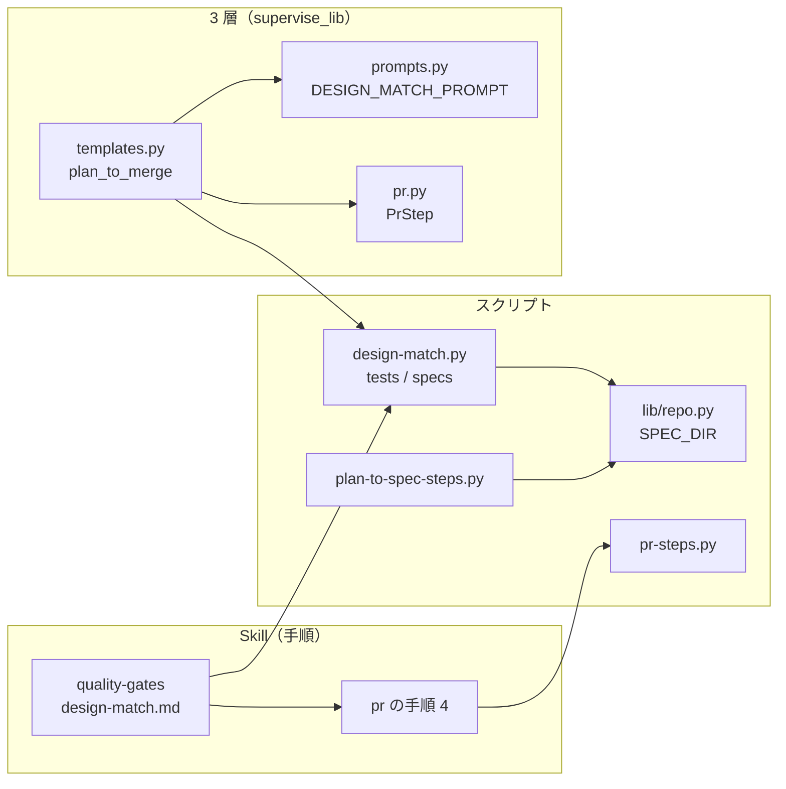
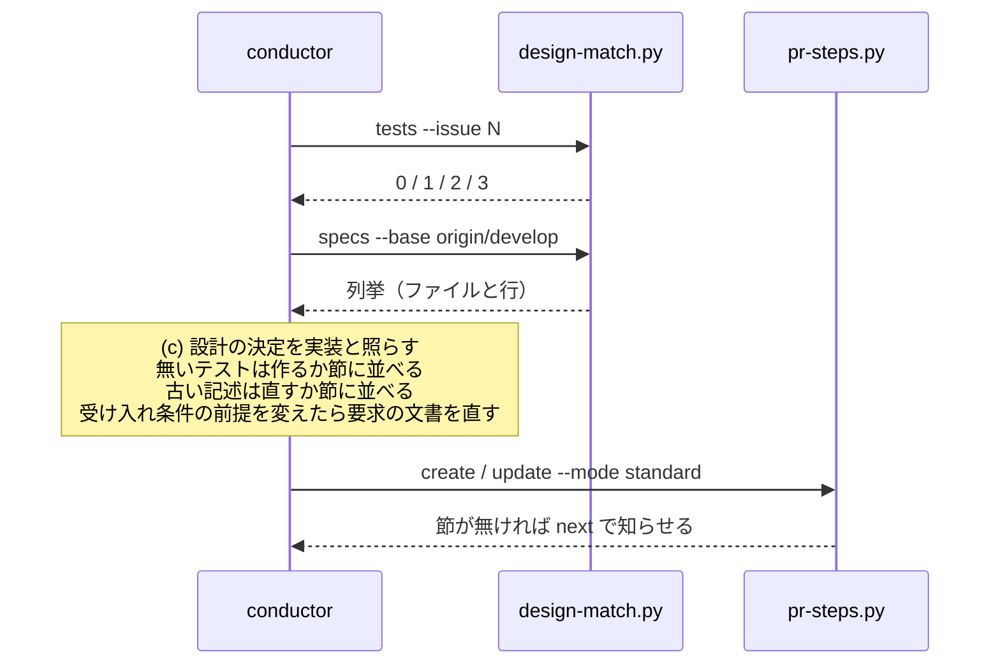
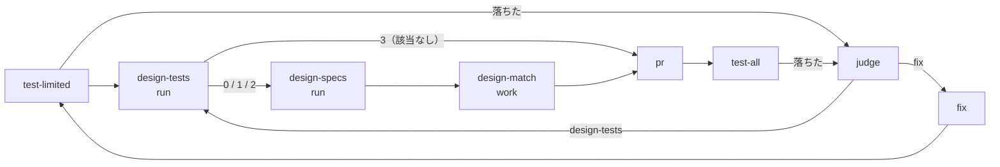

# quality-gates: 設計が作ると書いたテストや既存の確定仕様と食い違う実装が、違いを書かれないまま実装 PR を通る → 完了判定が設計のテストの実在・既存の確定仕様と変更履歴・設計の決定を突き合わせ、違いを実装 PR の本文に残す（#1241）

## 目的

- **何が壊れているか**: 完了判定は受け入れ条件とテストの結果だけを見る。設計が作ると書いたテスト・既存の確定仕様と変更履歴・設計の決定と実装の食い違いは、確定仕様化かリリース後テストで初めて見つかる（devbasex/devbase の m6・m7b・m7e で 7 件）
- **誰が困るか**: 確定仕様化とリリース後テストで手戻りを負う conductor と、矛盾した仕様と変更履歴を読む利用者
- **直すと何が成り立つか**: `standard` の実装 PR は、食い違いを本文の `## 設計と違う点` に並べるか同じ PR で文書を直してからでないと完了と呼ばれない

## 適用範囲

- **働く範囲**: 配布先のリポジトリでも働く。設計文書の置き場（`issues/`）と確定仕様の置き場（`docs/specifications/`）は確定仕様化と同じものを使う
- **プロジェクトごとに違うもの**: 比べるベースブランチは引数（`--base`）で受ける。テストの言語・命名・置き場は決め打ちせず、名前が書かれたファイルに実在するかを語の一致で見る（決定 3）
- **当たるモード**: `standard`。設計文書の無い変更（`light` / `operation` / `documentation` と設計を持たない `legacy-refactor`）は 3 つの確認を「該当なし（設計文書が無い）」で満たし、手順を足さない

## あるべき姿の根拠

| 根拠 | 種類 | 何を示すか |
| --- | --- | --- |
| devbasex/devbase の #216 の設計文書（`af44795` の `issues/issue-216-design.md`）を `b57710e^` に照らすと、`## 構成要素` の `tests/ci/test_ci_workflow.py` と `## テスト設計` の関数 3 つが HEAD に無い | 実測（2026-10-08） | 確認 (a) で #216 の取りこぼしを確定仕様化より前に出せる。パスは `## 構成要素` にだけあり、要求の前提 4 の 2 節では拾えない（決定 2） |
| devbasex/devbase の版を固定したコミット `4d82277` の差分から語を抜くと、既存の確定仕様 `base-image-shellcheck.md` が 4 語（パス 3・`SHELLCHECK_VERSION`）で最上位に並ぶ | 実測（2026-10-08） | 確認 (b) で #247 の「版は固定せず」の記述へ届く |
| ai-plugins の `HEAD~60..HEAD`（変更 412 ファイル・2,472 語）を 1 つの正規表現で `docs/specifications/` の 68 文書へ当てると 2.6 秒。語ごとに行を照らすと 120 秒を超え、`git grep -F -f` は 6.8 秒 | 実測（2026-10-08） | 非機能の 10 秒以内を、照合を 1 回の走査にまとめる形で満たす（決定 6） |

要求と受け入れ条件は #1241 の本文にある（コピーは `issues/issue-1241-requirements.md`）。この文書は「どう作るか」だけを扱う。
決定の記録は [issue-1241-design-decisions.md](issue-1241-design-decisions.md) に分けてある。

## ドメインモデル

### コンテキスト

| コンテキスト | 何の語が 1 つの意味に決まるか |
| --- | --- |
| NDF の開発ワークフロー | 完了判定・設計文書・設計の決定・既存の確定仕様・設計との突き合わせ・設計と違う点 |

1 つのコンテキストに収まる。3 層（supervise.py）の実装フェーズも同じコンテキストの工程である。

### 集約

| 集約 | 持ち主（書き換えてよいもの） | 根 | エンティティ | 値オブジェクト |
| --- | --- | --- | --- | --- |
| 突き合わせの結果 | `design-match.py` | 1 回の実行の結果（1 行の JSON） | 設計に名前の出るテスト・列挙した文書 | 名前の判定（ある / 無い / 確かめられなかった）・一致した語 |
| 実装 PR の本文の「設計と違う点」の節 | 突き合わせの担い手（単発は conductor、3 層は `design-match` の work ステップ） | 節 | 違いの行 | 設計の箇所・違い・理由 |
| 要求の文書 | `gh_parts.py body-section`（課題ごとの錠の中で節を差し替える。worker も進捗記録もここを通す。写しは `spec-copy.py write` が作る） | 課題の本文 | 受け入れ条件・前提 | 「実装で変えた」の印 |

設計文書・既存の確定仕様・変更履歴は、突き合わせの担い手が同じ PR で直してよい（要求の前提 5）。`design-match.py` は読むだけで、どの文書も書き換えない。PR のステップ（`PrStep`）は節を本文へ置くだけで、中身を書かない。

### 不変条件

| # | 集約 | 条件 | 破れたときの扱い |
| --- | --- | --- | --- |
| I1 | 突き合わせの結果 | 設計に名前の出るテストのうち HEAD に無いものが 1 件でもあれば、確認 (a) は 1 で終わり、その名前を「無い」として出す | 0 を返せば完了判定が取りこぼす。テストで落とす |
| I2 | 突き合わせの結果 | 設計文書か git が読めないとき、確認 (a) は 2 で終わる。0（すべてある）と 1（無い）へ畳まない | 読めないことを「ある」と読ませない |
| I3 | 突き合わせの結果 | 設計文書が見つからないとき、確認 (a) は 3（該当なし）で終わり、名前を判定しない | 設計の無い変更に「無い」を出さない |
| I4 | 突き合わせの結果 | 設計に名前の出るテストが 0 件のとき、確認 (a) は 0 で終わり、`metrics.names` に 0 を残す | 0 件と「判定しなかった」を読み分けられない |
| I5 | 突き合わせの結果 | 確認 (b) の列挙は、比べる起点との merge-base に無かった文書（同じ差分で足した文書）を含めない | 確定仕様化で足した文書が「既存」として並ぶ |
| I6 | 突き合わせの結果 | 確認 (b) は、変更したファイルのパスか増減したシンボルの名前を含む既存の確定仕様と変更履歴を、ファイルと行で出す | 食い違う記述へ届かない |
| I7 | 「設計と違う点」の節 | 3 層の `standard` の実装 PR の本文は `## 設計と違う点` を 1 つだけ持つ。「該当なし（設計文書が無い）」を置くのは `design-tests` が 3 で終わったときだけで、それ以外で節のファイルが無ければ `pr` は PR を作らずに止まり、judge へ戻す | 節が欠けるか 2 つ並ぶか、確かめていない突き合わせが「該当なし」として完了する |
| I8 | 「設計と違う点」の節 | 単発の `pr-steps.py create` / `update` は、`--mode standard` で `design/` 以外のブランチの本文に節が無いと、`next` で足すよう求める | 節の無いまま実装 PR が出る |
| I9 | 突き合わせの結果 | `standard` 以外のモードの実装プランには、突き合わせのステップが入らない | 設計文書の無い変更の手順と所要が変わる |
| I10 | 要求の文書 | 課題の本文を書き換える者（`gh_parts.py body-section` と進捗記録の `progress-record.sh`）は、課題ごとの錠（`lib/locks.py` の `exclusive`。錠は `~/.claude/ndf/locks/issue-body/<owner>--<repo>--<番号>`）を取ってから本文を読み、書き終えてから放す。差し替えは節ごとに行い、本文全体を手元の写しで上書きしない | 後に書いた側が、受け入れ条件の変更か `## 進行` を消す |

### ドメインイベント

| # | イベント | 発生元 | 受け手 |
| --- | --- | --- | --- |
| E1 | 設計がテストと決定を記録した | 設計 PR のマージ（`design`） | `design-match.py tests`（設計文書を読む） |
| E2 | 実装が終わり、完了判定に入った | 単発は conductor の `quality-gates`、3 層は `test-limited` の後 | `design-match.py tests` と `specs` |
| E3 | 設計に名前の出るテストの実在を判定した | `design-match.py tests` | 突き合わせの担い手 |
| E4 | 変えたファイル・シンボルを参照する既存の確定仕様と変更履歴を列挙した | `design-match.py specs` | 突き合わせの担い手 |
| E5 | 各決定を実装と突き合わせ、一致・違う・実装されなかったに分けた | 突き合わせの担い手（LLM） | 「設計と違う点」の節 |
| E6 | 食い違いを本文に並べたか、文書を同じ PR で直した | 突き合わせの担い手 | 単発は `pr-steps.py`、3 層は `PrStep` |
| E7 | 実装で変えた受け入れ条件の前提を、要求の文書に残した | 突き合わせの担い手 | 要求の文書（課題の本文と写し） |
| E8 | 完了判定が通った | 単発は `quality-gates`、3 層は `pr` の後の全体テストと doc-lint | `pr` / `ready` |

### 用語

| 用語 | 意味 | 用語集への反映 |
| --- | --- | --- |
| 設計との突き合わせ | 完了判定で、設計に名前の出るテスト・既存の確定仕様と変更履歴・設計の決定を実装と照らし、食い違いを残すこと。確認 (a)(b)(c) の 3 つからなる | 追加（NDF の開発ワークフロー） |
| 設計に名前の出るテスト | 設計文書の `## 決定の記録`・`## テスト設計`・`## 構成要素` に、バッククォートで囲んで書かれたテストファイルのパス・`<パス>::<名前>`・`## テスト設計` のテスト関数の名前 | 追加（NDF の開発ワークフロー） |
| 既存の確定仕様 | 比べる起点との merge-base の時点で確定仕様の置き場にあった文書。同じ差分で足した確定仕様は含まない | 追加（NDF の開発ワークフロー） |
| 設計の決定 | 設計文書の `## 決定の記録` の 1 件（`### 決定 N`）。judge のステップが返す「決定」とは別の語 | 追加（NDF の開発ワークフロー） |
| 設計と違う点 | 実装 PR の本文の節。設計の決定・設計に名前の出るテスト・既存の確定仕様・受け入れ条件と実装の違いを、箇所・違い・理由の行で並べる | 追加（NDF の開発ワークフロー） |

## 機能一覧

| # | 機能 | 誰が使うか |
| --- | --- | --- |
| F1 | 設計に名前の出るテストが HEAD にあるかを判定する（確認 (a)） | 突き合わせの担い手 |
| F2 | 変えたファイル・シンボルを参照する既存の確定仕様と変更履歴を列挙する（確認 (b)） | 突き合わせの担い手 |
| F3 | 設計の決定を実装と突き合わせ、違いを `## 設計と違う点` に並べる（確認 (c)） | 突き合わせの担い手 |
| F4 | 実装で変えた受け入れ条件の前提を要求の文書に残す | 突き合わせの担い手 |
| F5 | 3 層の `standard` の実装フェーズで F1〜F4 を通し、節を実装 PR に載せる | supervise.py |
| F6 | 単発の実装 PR の本文に節が無いと知らせる | conductor（`pr-steps.py`） |

## 構成要素

| 要素 | 責務 |
| --- | --- |
| `plugins/ndf/scripts/design-match.py`（新設） | `tests`（確認 (a)）と `specs`（確認 (b)）。LLM を呼ばず、読むだけで、結果を 1 行の JSON で返す |
| `plugins/ndf/scripts/lib/repo.py` | 確定仕様の置き場 `SPEC_DIR = "docs/specifications"` を持つ（決定 7） |
| `plugins/ndf/scripts/plan-to-spec-steps.py` | 索引のパスを `SPEC_DIR` から組む。振る舞いは変えない |
| `plugins/ndf/scripts/supervise_lib/paths.py` | `DESIGN_MATCH_PY` を足す |
| `plugins/ndf/scripts/supervise_lib/templates.py` | `plan_to_merge` が `standard` のとき、`test-limited` と `pr` の間へ `design-tests` → `design-specs` → `design-match` を入れ、`pr` のステップへ `diff_section` を足す |
| `plugins/ndf/scripts/supervise_lib/prompts.py` | `design-match` の work ステップの指示文 `DESIGN_MATCH_PROMPT` |
| `plugins/ndf/scripts/supervise_lib/pr.py` | `PrStep` が `diff_section` のファイルを `## 設計と違う点` として本文へ置く。ファイルが無いとき、`design-tests` が 3 で終わっていれば「該当なし（設計文書が無い）」を置き、それ以外は PR を作らずに止まる（I7）。LLM の本文に同じ見出しがあれば置き換える |
| `plugins/ndf/scripts/lib/gh_parts.py` | `body-section` が課題ごとの錠の中で読みから書きまでを行う（I10）。錠を持ったままコマンドを走らせる `body-lock --issue <番号> -- <コマンド>` を足す |
| `plugins/ndf/scripts/progress-record.sh` | `## 進行` の読みから書きまでを `gh_parts.py body-lock` の中で行う（I10） |
| `plugins/ndf/scripts/pr-steps.py` | `template --mode standard` が節の雛形を書く。`create` / `update` が節の有無を `items` と `next` で返す |
| `plugins/ndf/skills/quality-gates/references/design-match.md`（新設） | 確認 (a)(b)(c) の手順・終了コードの読み方・節の形・要求の文書の直し方 |
| `plugins/ndf/skills/quality-gates/references/definition-of-done.md` | `standard` の完了の定義に確認 (a)(b)(c) と要求の前提の項目、設計文書が無いときの書き方を足す |
| `plugins/ndf/skills/quality-gates/SKILL.md` | 「モード別の完了の定義」から `design-match.md` を指す |
| `plugins/ndf/skills/pr/SKILL.md` | 手順 4 に `## 設計と違う点` の節と `template --mode` を足す |
| `plugins/ndf/scripts/tests/test_design_match.py`（新設） | `design-match.py` の単体テスト |
| `plugins/ndf/scripts/tests/test_supervise_design_match.py`（新設） | 3 層のプランと `PrStep` の節のテスト |
| `plugins/ndf/scripts/tests/test_pr_steps.py` | 節の雛形と `next` のテストを足す |
| `docs/glossary/glossary.json` | 用語の表の 5 語を足し、`glossary.py render` で `docs/glossary.md` を作り直す |
| `CHANGELOG.md` | 版の節に記載する（要求の境界「常に行う」） |



図に含めない要素は、テストの 3 ファイル・`supervise_lib/paths.py`・`definition-of-done.md`・`quality-gates/SKILL.md`・用語集・`CHANGELOG.md` の 8 つである。

```text
plugins/ndf/
├── scripts/
│   ├── design-match.py                      # 新設
│   ├── lib/repo.py                          # SPEC_DIR
│   ├── supervise_lib/{templates,prompts,pr,paths}.py
│   └── tests/
│       ├── test_design_match.py             # 新設
│       └── test_supervise_design_match.py   # 新設
└── skills/quality-gates/references/
    └── design-match.md                      # 新設
```

## 入出力の契約

### `design-match.py tests`（確認 (a)）

```bash
python3 design-match.py tests (--issue <番号>... | --design <パス>...) [--root <dir>]
```

| 引数 | 意味 |
| --- | --- |
| `--issue` | 課題の番号。`issues/` の `issue-<番号の並び>-design[-<主題>].md` のうち、並びに番号を含むものを HEAD から読む |
| `--design` | 設計文書のパスを直接渡す（`--issue` と排他） |
| `--root` | 対象のリポジトリの根（既定はカレントの git の根） |

| 終了コード | `status` | 意味 |
| --- | --- | --- |
| 0 | `ok` | 名前がすべて HEAD にある。0 件を含む（`metrics.names` が 0） |
| 1 | `stopped` | 「無い」が 1 件以上 |
| 2 | `stopped` | 設計文書か git が読めない、または「無い」が無く「確かめられなかった」が 1 件以上 |
| 3 | `stopped` | 設計文書が見つからない（該当なし） |

`items` の 1 件は `{"kind": "test_file" | "test_function", "name": <書かれた字面>, "result": "present" | "missing" | "unverified", "doc": <設計文書>, "line": <行>, "section": <節>}`。`metrics` は `designs`・`names`・`missing`・`unverified`・`skipped`（形だけで具体的な名前でない字面の数）。

名前の拾い方と判定は次のとおり（決定 2・3）。

| 字面（バッククォートの中） | 拾う節 | 種類 | ある と判定する条件 |
| --- | --- | --- | --- |
| テストファイルのパス | `## 決定の記録`・`## テスト設計`・`## 構成要素` | `test_file` | HEAD にそのパスのファイルかディレクトリがある |
| `<パス>::<名前>[::<名前>]` | 同上 | `test_function` | パスのファイルが HEAD にあり、`::` で区切った名前がすべて、そのファイルに語として現れる（`[...]` の引数は除く） |
| `test` で始まる識別子（大文字小文字を問わない） | `## テスト設計` | `test_function` | HEAD の `.md` 以外の追跡しているファイルのどれかに、語として現れる |

- テストファイルのパスは、パスの区切りのどれかが `test` / `tests` / `spec` / `specs` / `__tests__` であるか、ファイル名が `test_*` / `*_test.*` / `*.test.*` / `*.spec.*` / `*Test.*` / `*Tests.*` のもの
- `<` `{` `*` `…` を含む字面は形の説明として `skipped` に数え、判定しない
- 囲み（```）の中と、引用の中は拾わない。同じ字面は最初の 1 か所だけを出す

### `design-match.py specs`（確認 (b)）

```bash
python3 design-match.py specs --base <ref> [--root <dir>] [--max-lines 10]
```

| 引数 | 意味 |
| --- | --- |
| `--base` | 比べる起点（例: `origin/develop`）。範囲は `git merge-base <base> HEAD` から HEAD |
| `--max-lines` | 1 文書に出す行の上限（既定 10）。上限を超えた行は `line_count` にだけ数える |

| 終了コード | `status` | 意味 |
| --- | --- | --- |
| 0 | `ok` | 列挙した（0 件を含む） |
| 2 | `stopped` | `--base` を解けない・git が読めない |

`items` の 1 件は `{"kind": "spec" | "changelog", "name": <文書>, "result": "listed", "terms": [<一致した語>], "lines": [<行>], "line_count": <行の数>, "changed_in_diff": <この差分で直したか>}`。並びは一致した語の種類の数の多い順、同じなら文書のパスの順。`metrics` は `changed_paths`・`symbols`・`terms`・`listed`。

| 何を | 決め方 |
| --- | --- |
| 対象の文書 | HEAD の `docs/specifications/` の `.md` と、名前が `CHANGELOG.md` のすべてのファイルのうち、merge-base にもあったもの |
| 語（パス） | `git diff --name-status -M` の変更したファイルのパス（名前を変えたものは前後の両方） |
| 語（シンボル） | `.md` 以外の差分の hunk の見出しと増減の行から、`def` / `class` / `function` / `func` / `fn` に続く識別子と、`_` を含む大文字の識別子（`SHELLCHECK_VERSION` の形）。4 文字未満は捨てる |
| 一致 | パスは字面の一致、シンボルは前後が識別子の文字でない一致 |

### 実装 PR の本文の `## 設計と違う点`

```markdown
## 設計と違う点

| 設計の箇所 | 違い | 理由 |
| --- | --- | --- |
| 決定 3 | 戻り値を `0` ではなく `2` にした | 呼び手が「読めない」と区別できないため |
| 決定 6 | 実装しなかった | #1234 へ分けた |
| `tests/ci/test_ci_workflow.py` | 作らなかった | `tests/ci/test_trigger.py` に入れた |
| `docs/specifications/x.md` の 59 行 | 直していない記述がある | 判断できない（記述の意図が読めない） |
| 受け入れ条件 2 | 実装で変えた | 接続の設定を隔離の前に引き継ぐため |
```

違いが無ければ `- 無し`、設計文書が無ければ `- 該当なし（設計文書が無い）` の 1 行にする。同じ PR で設計文書・既存の確定仕様・要求の文書を直した箇所は並べない（直した文書が正になる）。

### 3 層の `pr` のステップの `diff_section`

`diff_section` は `{state_dir}` を含むパスの文字列である。`PrStep` はそのファイルの中身（`## 設計と違う点` で始まる節）を、材料の節と同じ位置（署名の前）へ置く。ファイルが無いときは、`design-tests` のステップの終了コードを実行の記録から読み、3 なら `## 設計と違う点\n\n- 該当なし（設計文書が無い）` を置く。0 / 1 / 2 で終わっていた（突き合わせを行うはずだった）のにファイルが無ければ、worker が節を書かなかったものとして PR を作らずに `stopped` で止まり、judge へ戻す（I7）。「該当なし」と「確かめていない」を同じ節に畳まない。LLM が書いた本文に同じ見出しがあれば、`gh_sections.replace_section` で置き換える。

## 処理の流れ

### 単発（conductor が `quality-gates` を通す）



`tests` が 3 なら 3 つの確認を「該当なし（設計文書が無い）」として満たし、`specs` を打たない。2 は「確かめられなかった」として完了判定の報告の「未検証の項目」へ書き、「ある」と読まない。

### 3 層（`plan_to_merge`、`standard` のとき）



| ステップ | 種類 | 入力 | 次 |
| --- | --- | --- | --- |
| `design-tests` | run（`design-match.py tests --issue <プランの課題> --root .`） | — | `next` と `on_fail` は `design-specs`、`skip_to` は `pr`（終了コード 3） |
| `design-specs` | run（`design-match.py specs --base origin/<宛先> --root .`） | — | `next` と `on_fail` は `design-match` |
| `design-match` | work（`kind: 設計との突き合わせ`、`DESIGN_MATCH_PROMPT`） | `design-tests`・`design-specs` | `pr` |

- `test-limited` の `next` と、judge の選択肢 `pr` を `design-tests` へ向ける。judge の問いの文も「設計との突き合わせへ（design-tests）」に合わせる
- `design-match` の worker は、(c) と F4 を行い、直した文書をコミットし（push しない）、節を `{state_dir}/design-diff.md` へ書く
- 修正のループ（`fix` → `test-limited`）を通るたびに突き合わせをやり直す。修正が実装を変えうるためである
- `standard` 以外のモードでは 3 ステップを入れず、`test-limited` の `next` は `pr` のまま（I9）

`DESIGN_MATCH_PROMPT` が worker に求めること:

1. 入力の `design-tests` の「無い」名前は、作るか、節に「作らなかった」と理由を並べる。「確かめられなかった」は自分で確かめ、確かめられなければ節に並べる
2. 入力の `design-specs` の文書を上から読み、変更後の振る舞いと合わない記述を同じ PR で直す。直せなければ節に並べる
3. 設計文書の `### 決定 N` を 1 件ずつ実装と照らし、違う・実装しなかった・判断できないを節に並べる
4. 実装で受け入れ条件の前提を変えたなら、課題の本文の条件を `requirements-design` の「変更の途中で要求が変わったとき」の形に直し（直す節ごとに `gh_parts.py body-section replace --issue <番号> --heading <節の見出し>`。`gh issue edit --body-file` で本文全体を書き直さない。I10）、`spec-copy.py write` で写しを作り直してコミットする
5. 違いが無ければ節を `- 無し` にする

## 非機能の実現方式

| 大項目 | 実現方式 |
| --- | --- |
| 性能・拡張性 | `specs` は語を 1 つの正規表現（長い語から並べた選択）にまとめ、`git cat-file --batch` で読んだ文書を 1 回ずつ走査する。`HEAD~60..HEAD` の規模で 2.6 秒（根拠の表）。`tests` は git の呼び出しを名前の数に比例させず、`git ls-tree -r` 1 回と、関数の判定に要るファイルの `git grep -w -F` だけにする。どちらも LLM を呼ばない |
| 運用・保守性 | 結果は `lib/step_result.py` の `result` / `emit` / `main_with` で 1 行の JSON にする。終了コードは `EXIT_VIOLATION`（1）・`EXIT_UNREADABLE`（2）・`EXIT_PRECONDITION`（3）を使い、新しい値を作らない |
| システム環境 | 関数の有無を言語の構文で判定せず、名前がファイルに語として現れるかで見る（決定 3）。どの言語でも判定でき、判定できない言語が生じない |

## テスト設計

| 受け入れ条件・不変条件 | どの振る舞いで縛るか | どう壊したら落ちるべきか |
| --- | --- | --- |
| 受け入れ条件 1・I1 | `## テスト設計` に書いたパスのファイルを HEAD に置かない一時リポジトリで `tests` が 1 を返し、そのパスを `missing` で出す（`test_design_match.py`） | 存在の判定をworktreeで行うか、`missing` を 0 へ畳むと落ちる |
| 受け入れ条件 1（#216 の形）・決定 2 | パスを `## 構成要素` にだけ書いた設計文書でも `missing` を出す | 拾う節を 2 つに戻すと落ちる |
| 受け入れ条件 2 | ファイルはあるが関数の名前が無い `<パス>::<名前>` を `missing` で出し、1 を返す | 関数の判定を省くと落ちる |
| 受け入れ条件 2（#216 の形） | `## テスト設計` の `test_` で始まる名前が `.md` 以外のどのファイルにも無ければ `missing` | 設計文書自身に一致して「ある」と読むと落ちる |
| 受け入れ条件 3 | 名前がすべてあると 0 | 1 件でも誤って `missing` にすると落ちる |
| 受け入れ条件 4・I4 | テストの名前の無い設計文書で 0 を返し、`metrics.names` が 0 | 0 件で 3 か 1 を返すと落ちる |
| 受け入れ条件 5・I2 | git の外の `--root` と、読めない `--design` で 2 を返す | 2 を 0 か 1 へ畳むと落ちる |
| I3 | 設計文書の無い課題の `--issue` で 3 を返し、`items` が空 | 名前を判定するか 0 を返すと落ちる |
| 受け入れ条件 6・I6（#247 の形） | 起点の後に変えたファイルのパスとシンボルの名前を含む既存の確定仕様と `CHANGELOG.md` を、文書と行で出す。語の種類の多い文書が先に並ぶ | パスかシンボルの一方を抜く、並びを崩すと落ちる |
| 受け入れ条件 7・I5 | 同じ差分で足した確定仕様は、語を含んでいても出ない | merge-base にあるかを見ずに並べると落ちる |
| 非機能（性能） | 確定仕様 70 文書・語 2,500 の一時リポジトリで `specs` が 10 秒以内 | 語ごとに走査すると落ちる |
| 受け入れ条件 8・9・11・12 | `definition-of-done.md` と `design-match.md` の該当の節を読んで確かめ、節を証跡に書く（文言を照合するテストは書かない） | — |
| 受け入れ条件 10・I7 | `standard` の `plan_to_merge` のプランで、`pr` のステップが `diff_section` を持ち、`PrStep` が節を 1 つだけ置く。ファイルが無いとき、`design-tests` が 3 なら「該当なし」、0 / 1 / 2 なら PR を作らずに止まる。LLM の本文に同じ見出しがあれば置き換える（`test_supervise_design_match.py`） | 節を足し忘れる、2 つ並べる、ファイルの欠落を「該当なし」へ畳むと落ちる |
| I10 | 錠を持つ別のプロセスがあるあいだ `body-section replace` が本文を読まずに待ち、`progress-record.sh` の書き込みと並べても両方の節が残る（`test_gh_parts.py`・`test_progress_record.py`） | 錠を取らずに読む、本文全体を上書きすると落ちる |
| 受け入れ条件 10・I8 | `pr-steps.py create --mode standard` で節の無い本文に `next` が節を求め、`template --mode standard` が節を書く（`test_pr_steps.py`） | 節の有無を見ないと落ちる |
| 受け入れ条件 14・I9 | `light` の `plan_to_merge` のプランのステップの並びが変更前と同じ | `standard` 以外にもステップを入れると落ちる |
| 3 層の経路（F5） | `standard` のプランで `test-limited` → `design-tests` → `design-specs` → `design-match` → `pr` の順につながり、`design-tests` の `skip_to` が `pr` | 順序か `skip_to` を崩すと落ちる |
| 受け入れ条件 13 | devbasex/devbase の #216（`b57710e^`）と `4d82277` に `tests` と `specs` を打ち、根拠の表と同じ食い違いが出ることを実装 PR に貼る | — |
| 受け入れ条件 15 | `uv run --frozen --project . --all-extras pytest . -q -n 4` | — |

## 設計の結果

| 課題 | 扱い | 取り込み先 | 触るファイル |
| --- | --- | --- | --- |
| #1241 | 実装する | — | `plugins/ndf/scripts/design-match.py`、`plugins/ndf/scripts/lib/repo.py`、`plugins/ndf/scripts/plan-to-spec-steps.py`、`plugins/ndf/scripts/pr-steps.py`、`plugins/ndf/scripts/lib/gh_parts.py`、`plugins/ndf/scripts/progress-record.sh`、`plugins/ndf/scripts/supervise_lib/`、`plugins/ndf/scripts/tests/`、`plugins/ndf/skills/quality-gates/`、`plugins/ndf/skills/pr/SKILL.md`、`docs/glossary/glossary.json`、`docs/glossary.md`、`CHANGELOG.md` |

## 未確認のまま残ること

| 項目 | 内容 |
| --- | --- |
| 要求の前提 4 との差 | 拾う節に `## 構成要素` を、名前に `## テスト設計` の `test` で始まる識別子を足した（決定 2）。要求の前提 4 は 2 節のパスと `<パス>::<関数>` だけを挙げる。承認ゲート 1 で認められたら、実装 PR で課題の本文の前提 4 を「実装で変えた」の形に直す |
| `specs` の誤検出の多さ | 広く使われるパス（`bin/devbase`・`CHANGELOG.md`）は多くの文書に一致する。`HEAD~60..HEAD` では 68 文書すべてが並んだ。並びと `--max-lines` で読む量を抑えるが、誤検出の多さが読む手間に見合うかは、次の `standard` の実装 PR の実測（読んだ文書の数・直した記述の数）で決める（リリース後テスト） |
| 語の一致による関数の判定 | 名前がコメントや文字列にだけ現れると「ある」と判定する（見逃しの側に倒れる）。実物で見逃しが出たら、言語ごとの定義の形を足す |
| 課題の本文の書き換えの競合 | 同じ機械の worker と進捗記録は I10 の錠で直列にする。錠は機械ごとのファイルのため、別の機械からの書き込みと、人が GitHub の画面で直す書き込みは排他できない。節ごとの差し替えで、他の節を消す範囲を書き換えた節に限る |
| スプリントブランチの設計文書 | 3 層のスプリントでは、設計 PR がベースブランチへマージされた後にスプリントブランチを切る前提で、実装のworktreeの HEAD に設計文書がある。前提が崩れると `tests` が 3（該当なし）を返し、突き合わせを飛ばす |
