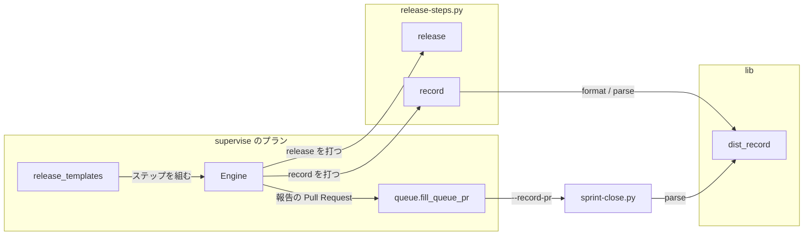
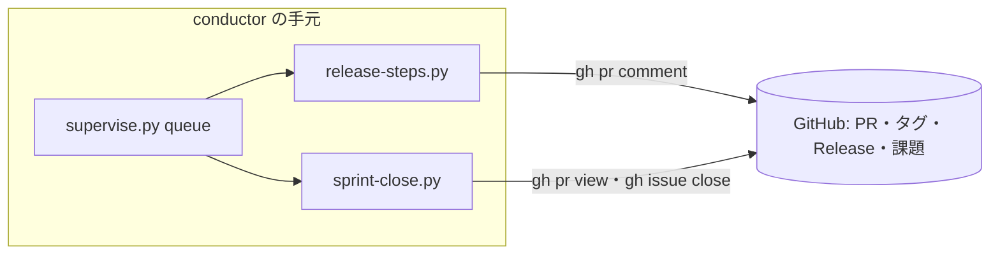
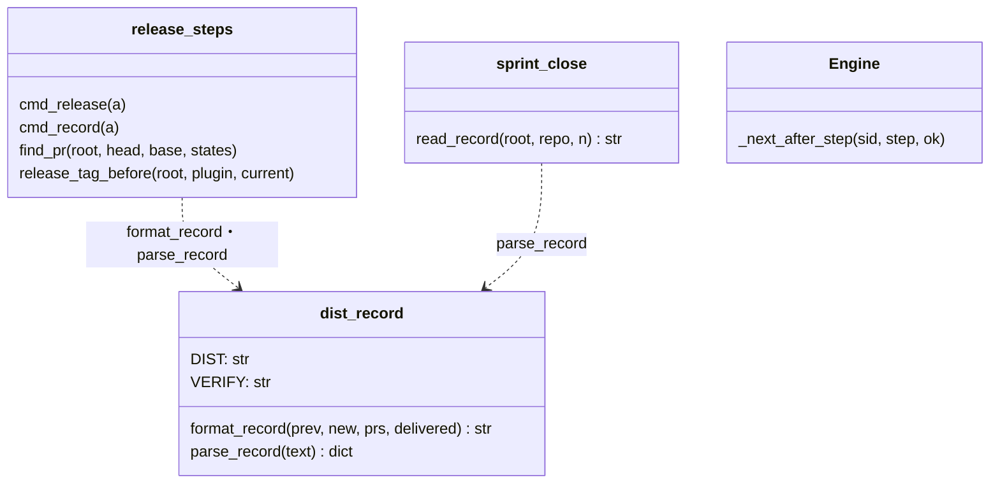
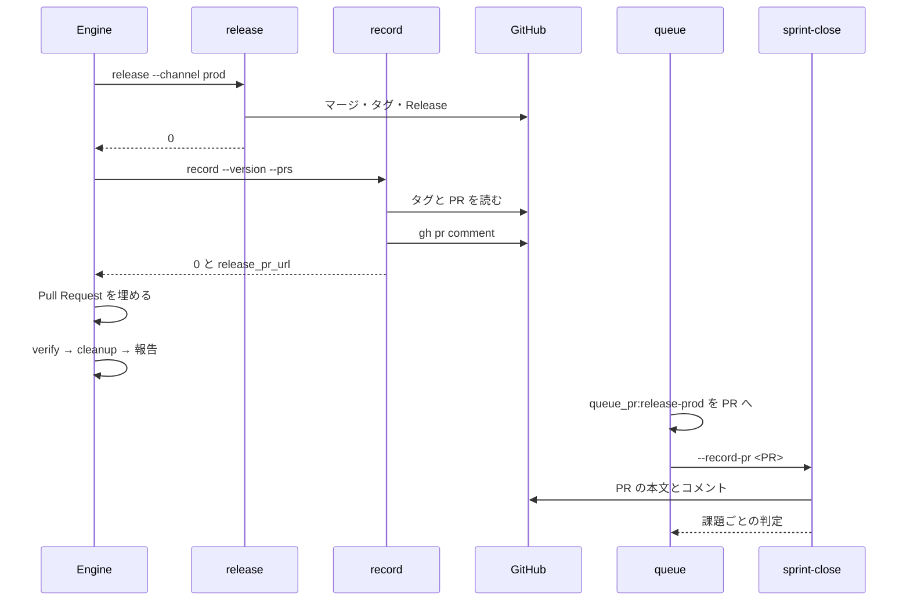
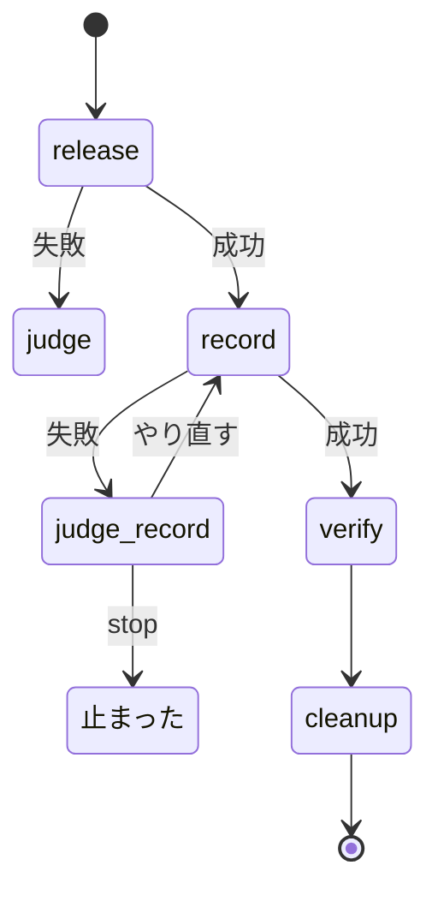

# sprint-close: 本番のリリースの PR にリリース記録が無く、スプリントの課題を毎回手で閉じる → 本番のリリースプランが記録を書き、まとめの close がそれを読んで閉じる条件 1 を判定する（#1273）

## 目的

- **何が壊れているか**: スクリプトで組む本番のリリースプラン（`package-plugin`）が、リリース記録（`## 配布の記録`）を書かない。加えて、このプランは報告に Pull Request を残さないため、まとめの `close` ステップの `--record-pr` は `0`（本番の記録なし）に置き換わる
- **誰が困るか**: スプリントを閉じる conductor。10.17.29・10.17.30・10.17.55・10.17.57 で `gh issue close` を手で打った（#1683）
- **直すと何が成り立つか**: 本番の配布の後に、本番のリリースの PR へリリース記録がコメントで付く。まとめの `close` ステップはその PR を `--record-pr` に受け取り、閉じる条件 1 を記録から判定する

## 適用範囲

- **働く範囲**: `supervise.py new release --channel prod` が `release.form: package-plugin` から組むプランと、それを使うスプリントのまとめ（配布先のリポジトリでも、同じ宣言を置けば働く）
- **プロジェクトごとに違うもの**: プラグイン名・ベースブランチ・本番チャネルは今と同じく `.ndf/supervise.json` の `release.plugin` と `.ndf/worktree.json` から読む。新しい設定は足さない
- **当たるモード**: スプリントの本番のステージを通るすべてのモード（`pace` によらない）

## あるべき姿の根拠

| 根拠 | 種類 | 何を示すか |
| --- | --- | --- |
| `~/.local/state/ndf/sv/sprint-m1693` ほか 6 スプリントの `8-release-prod-state/report.md` がすべて `- Pull Request: 無し` | 実測 | 本番のリリースプランは報告に PR を残さず、`{queue_pr:release-prod}` は `0` に置き換わる（`queue.py` の `fill_queue_pr`） |
| `sprint-close.py` の `_closing_blocker` は `--record-pr 0` のとき閉じる条件を見ない | 実測（コードの読み取り） | 書き手だけを足しても、`--record-pr` に記録の PR が入らなければ記録は読まれない |
| `progress-tracking` の「配布の記録」の表 | 既存の契約 | 書く形・置く側（`release`）・置き場所（配布の PR）は決まっている。形は変えない |
| #1683 の本文（2 スプリント続けて手で閉じた） | 実測 | プランの外の手当てが 2 度目になった（Value 4 の「雛形へ入れる」条件） |

要求と受け入れ条件は #1273 の本文にある（コピーは `issues/issue-1273-requirements.md`）。この文書は「どう作るか」だけを扱う。

**要求の前提 1 は事実と違う。** 要求は「`close_plan` が `{queue_pr:release-prod}` を本番のリリースの PR で埋める」とするが、上の実測のとおり今は `0` で埋まる。この設計は、本番のリリースプランが報告に PR を残すところまでを範囲に含める（決定 2）。目的（`close` ステップが記録を読める）はこれ無しに成り立たない。

## ドメインモデル

### コンテキスト

| コンテキスト | 何の語が 1 つの意味に決まるか |
| --- | --- |
| 配布（`release`） | リリースプラン・リリース記録・本番の配布 |
| 進捗記録（`progress-tracking`） | スプリントを閉じる・閉じる条件・スプリント課題 |

関係は**公開された言語**とする。リリース記録の形（見出しと 3 行）は `progress-tracking` の「配布の記録」の表が文書化した共通の形式で、配布が書き、進捗記録が読む。形を 1 つのモジュール（`lib/dist_record.py`）へ置き、両側がそれを使う。

### 集約

| 集約 | 持ち主（書き換えてよいもの） | 根 | エンティティ | 値オブジェクト |
| --- | --- | --- | --- | --- |
| 本番のリリース | `release-steps.py release`（本番の配布）と `release-steps.py record`（記録） | 本番のリリースの PR | — | 版（直前の正式版・出した版）・タグ・スプリントの PR の並び |
| リリースプランの実行 | supervise の `Engine` | プラン | ステップ | 報告の Pull Request |
| スプリントのまとめ | `sprint-close.py` | 記録の PR | 課題 | 閉じる条件の判定 |

### 不変条件

| # | 集約 | 条件 | 破れたときの扱い |
| --- | --- | --- | --- |
| I1 | 本番のリリース | リリース記録は本番の配布（タグ `<plugin>--v<版>` が origin にある）より後にだけ書く | `record` は投稿せずに終了コード 3（前提が無い）で止まる |
| I2 | 本番のリリース | 書いたリリース記録は `parse_record` で読むと `found` が真・`stage` が `本番` で始まり・`version` が出した版・`sprint_prs` が受けた PR の並びになる | 書く側と読む側が同じモジュールの形を使う。形が食い違えば契約のテストが落ちる |
| I3 | 本番のリリース | 同じ版の同じ内容の記録は PR に 2 件以上増えない | `record` は投稿の前に最後の記録を読み、同じなら投稿せずに `ok` を返す |
| I4 | リリースプランの実行 | 記録を書くステップの失敗から、本番の配布（タグ・GitHub Release・本番チャネルへのマージ）へ戻る経路が無い | 記録の失敗は専用の判断（`judge-record`）へ回し、選べるのは `record` のやり直しか停止だけにする |
| I5 | リリースプランの実行 | 記録を書けた本番のリリースプランの報告は、本番のリリースの PR を `Pull Request` に持つ | `record` の結果の `metrics.release_pr_url` が空なら `Pull Request` を書き換えない（報告は `無し` のまま。まとめは今と同じ `0`） |
| I6 | リリースプランの実行 | 開発版のリリースプランは記録を書くステップを持たない | 雛形の分岐（`dev`）で組まない |

### ドメインイベント

| # | イベント | 発生元 | 受け手 |
| --- | --- | --- | --- |
| E1 | 本番のリリースプランが本番の配布を終えた | `release` ステップ（`release-steps.py release --channel prod`） | `record` ステップ |
| E2 | 本番のリリースの PR にリリース記録を書いた | `record` ステップ（`release-steps.py record`） | `Engine`（報告の Pull Request を埋める）・`sprint-close.py`（E4 で読む） |
| E3 | まとめの `close` ステップが `--record-pr` を本番のリリースの PR で埋めた | `queue.py` の `fill_queue_pr`（報告の Pull Request を読む） | `close` ステップ |
| E4 | `sprint-close.py` がリリース記録を読み、閉じる条件 1 を判定した | `close` ステップ | 課題（閉じる・`kept_open`） |
| E5 | リリース後テストのブロックを書いた | — | #1683 が扱う（範囲外。受け手はこの変更では無い） |

### 用語

| 用語 | 意味 | 用語集への反映 |
| --- | --- | --- |
| リリース記録 | release が Pull Request へ残す記録のブロック。段階・版・スプリントの Pull Request を持つ | 変更なし |
| リリースプラン | リリースの手順をステップの列として持つプラン | 変更なし |
| スプリント課題 | スプリントに含まれる Pull Request の本文が、閉じる語で指す課題 | 変更なし |

新しい語は足さない。

## 機能一覧

| # | 機能 | 誰が使うか |
| --- | --- | --- |
| F1 | 本番の配布の後に、本番のリリースの PR へリリース記録を書く | 本番のリリースプラン（無人） |
| F2 | 記録の書き込みが落ちたとき、配布をやり直さずに記録だけを書き直す | 本番のリリースプランの判断（`judge-record`）と conductor |
| F3 | 本番のリリースプランの報告に、本番のリリースの PR を残す | まとめのステージ（`{queue_pr:release-prod}` の置き換え） |
| F4 | まとめの `close` ステップが、本番のリリースの PR の記録から閉じる条件 1 を判定する | まとめのプラン（無人） |

F4 は `sprint-close.py` を変えずに、F1・F3 が入力を揃えることで成り立つ。

## 構成要素

| 要素 | 責務 | 変更 |
| --- | --- | --- |
| `lib/dist_record.py` | リリース記録の形（見出し・行の名前）を 1 か所に持ち、組む（`format_record`）と読む（`parse_record`）を提供する | 新規。`sprint-close.py` の読み取りの関数を、振る舞いを変えずに移す |
| `release-steps.py record` | 本番の配布の後に、本番のリリースの PR へリリース記録を 1 件コメントで投稿する。PR の番号と URL を結果に出す | 新規のサブコマンド |
| `supervise_lib/release_templates.py` | 本番のリリースプランに `record` と `judge-record` のステップを足す | 変更 |
| `supervise_lib/engine.py` | run のステップの `pr_from` の鍵を読み、成功したら結果 JSON の `metrics.<鍵>` で報告の Pull Request を埋める | 変更 |
| `supervise_lib/plan.py` | プランの書き方の説明に `pr_from` を足す | 変更（説明だけ） |
| `sprint-close.py` | 記録の読み取りを `lib/dist_record.py` から import する。引数・結果 JSON・閉じる条件は変えない | 変更（import の付け替えだけ） |
| `skills/progress-tracking/SKILL.md` | 「配布の記録」の表の「置く側」に、スクリプトで組む本番のリリースプランでは `release-steps.py record` が書くと足す | 変更（形は変えない） |
| `skills/release/references/form-package-plugin.md` | 本番のリリースプランのステップの並びに `record` を足す | 変更 |

### 構成要素図



### システム構成図



すべて conductor の手元のプロセスで動く。外部の系は GitHub だけで、書く先は記録のリポジトリの PR に限る。

### パッケージ構成

```text
plugins/ndf/scripts/
├── lib/
│   └── dist_record.py          # 新規: リリース記録の形
├── release-steps.py            # record のサブコマンドを足す
├── sprint-close.py             # 読み取りを lib/dist_record.py から import
└── supervise_lib/
    ├── engine.py               # pr_from を読む
    ├── plan.py                 # 説明に pr_from を足す
    └── release_templates.py    # record・judge-record を足す
```

## 構造



`parse_record` とその下の関数（`_read_dist_block`・`_verify_blocks`・`_pick_verify_block`・`_strip_note`）は本体を変えずに移す。`sprint-close.py` は `parse_record` を同じ名前で import し直すため、モジュールの属性として読む既存のテストはそのまま通る。

## 入出力の契約

### `release-steps.py record`

```text
python3 release-steps.py record --version <版> --prs <PR番号>... [--plugin <名前>] [--root <dir>]
```

| 項目 | 内容 |
| --- | --- |
| 前提 | タグ `<plugin>--v<版>` が origin にある（`git fetch --tags` の後に確かめる）。`release/v<版>` → ベースブランチの PR がマージ済み |
| 書くもの | 本番のリリースの PR（`release/v<版>` → ベースブランチ、MERGED）へコメント 1 件（`gh pr comment <番号> --body-file <一時ファイル>`） |
| 書かないとき | PR の本文とコメントの最後のリリース記録が、`stage` が `本番` で始まり `version` と `sprint_prs` が同じなら投稿しない（I3） |
| 結果 JSON | `lib/step_result.py` の形。`items` は `{kind: "comment", name: "#<番号>", result: "posted" / "exists"}`。`metrics` は `release_pr`・`release_pr_url`・`version`・`prev_version`・`sprint_prs` |
| 終了コード | 0 = 書いた・既にある / 1 = 投稿が失敗した（`gh pr comment` が非 0） / 2 = PR を読めない / 3 = 前提が無い（タグが無い・マージ済みの PR が無い） |

ブランチとプラグイン名は `cmd_release` と同じく `release_decl` から読む。

### リリース記録の本文（`format_record` が組む）

```markdown
## 配布の記録

段階: 本番（承認ゲート 2 の承認の後、<タグの作成時刻 JST> に <タグ> を出した）
版: <直前の正式版> → <出した版>（タグ <タグ>。直前はタグ <直前のタグ>）
スプリント: PR #<番号> / #<番号>
```

- 直前の正式版は `release_tag_before(root, plugin, current=<タグ>)` のタグから `<plugin>--v` を外した版。無ければ `なし`
- 出した版は `v` を付けない版数（要求の前提 4）
- `スプリント:` には `--prs` の番号を受けた順に並べる（要求の前提 5）

### プランのステップの鍵 `pr_from`

| 鍵 | 型 | 意味 |
| --- | --- | --- |
| `pr_from` | 文字列（`metrics` の鍵の名前） | run のステップが終了コード 0 で終わったとき、出力の最後の JSON の `metrics.<鍵>` が空でなければ、プランの `Pull Request` をその値にする |

値は URL を渡す（`release_pr_url`）。再開のときの `_restore_pr` が報告から読むのは URL の形だけのためである。

### 本番のリリースプランのステップ（`package-plugin`、本番）

| id | 型 | 変更 | `next` | `on_fail` |
| --- | --- | --- | --- | --- |
| `release` | run | `next` を `verify` から `record` へ | `record` | `judge` |
| `record` | run（新規） | `cmd`: `release-steps.py record --version <版> --prs <PR>`、`stage: 配布`、`timeout: 300`、`pr_from: release_pr_url` | `verify` | `judge-record` |
| `judge-record` | judge（新規） | `inputs: [record]`、`choices: [record, stop]` | — | — |
| `judge` | judge | `choices` に `record` を入れない（I4） | — | — |

開発版のプランは変えない（I6）。MVV 判定つきの本番（`_add_prod_mvv_gate`）は先頭に `mvv`・`note` が入るだけで、`record` の位置は同じである。

## 処理の流れ



図に含めない要素: `release_templates`（ステップを組むだけで、流れには現れない）・`plan.py`（説明だけ）・`dist_record`（`record` と `sprint-close` の中で呼ぶ）・2 つの Skill の文書。

`record` が落ちたとき:



`judge_record` から `release` へ戻る遷移は無い（I4）。conductor が後から `run <プラン> --from record` で打ち直しても、`release` は走らない。

## 非機能の実現方式

| 大項目 | 要求の条件 | 実現方式 |
| --- | --- | --- |
| 可用性 | 記録の失敗は配布を取り消さず、記録だけを書き直せる | 記録を別のステップにし、失敗は `judge-record`（`record` か `stop`）へ回す。`record` は同じ記録があれば投稿しないため、何度打ち直しても 1 件に収まる |
| 運用・保守性 | 読む側と書く側で同じ見出しと行の名前を使う | 見出し・行の名前・組み方・読み方を `lib/dist_record.py` の 1 か所に置く |
| セキュリティ | 書く先は記録のリポジトリの PR だけで、秘密を含めない | 本文は版・タグ・PR の番号・時刻だけで組む。`--repo` を渡さず、worktreeのリポジトリへ書く |

## 決定の記録

### 決定 1: 記録の失敗から配布をやり直さないため、記録を `release` とは別のステップにし、専用の判断へ回す

`release` の続きに書くと、記録だけが落ちたときのやり直しが `release` 全体の打ち直しになり、タグの重複で止まる。別のステップにすれば、やり直しの単位が記録だけになる。共有の `judge` へ回すと `fix` を選べ、`fix` の `next` は `release`（`after_notes`）のため配布へ戻る。記録の失敗は GitHub の書き込みの揺れか権限で、直すコードが無いため、選べるのを `record` と `stop` に限った判断を置く。

`release-steps.py release` の本番の続きに書く案は、AC4 のやり直しの性質を満たさないため採らない。

根拠: Value 1 / C4（MVV 版 2）

### 決定 2: まとめが記録の PR を受け取れるよう、run のステップの結果から報告の Pull Request を埋める鍵 `pr_from` を足す

`{queue_pr:release-prod}` は報告の `Pull Request` を読むが、本番のリリースプランには `pr` のステップが無く、今は `0` に置き換わる。記録を書くステップの結果に PR の URL を出し、Engine が汎用の鍵でそれを報告へ移せば、queue とまとめの側は変えずに済む。鍵は `metrics` の名前を受けるため、ほかの run のステップも同じ形で使える。

`sprint.py` が `gh pr list --head release/v<版>` で PR を引く案は、版をまとめのプランへ渡す経路が要り、PR を決める規則が 2 か所になるため採らない。`queue.py` が報告を読むときに `release_pr` を探す案は、queue に配布の知識が入るため採らない。

根拠: Value 4 / Value 5 / Value 6（MVV 版 2）

### 決定 3: 読む側と書く側の形を 1 つにするため、リリース記録の組み方と読み方を `lib/dist_record.py` へ置く

書く側が見出しと行の名前を別に持つと、片方を変えたときに `parse_record` が `found` を偽にしても気づけない。読み取りの関数は本体を変えずに移し、`sprint-close.py` は同じ名前で import する。

`sprint-close.py` の定数を書く側が文字列で写す案は、同じ役割の定数を 2 か所に持つため採らない。

根拠: Value 6 / Value 7（MVV 版 2）

### 決定 4: 記録が事実と食い違わないよう、記録はタグがあるときだけ書き、記録を書くステップを `release` の直後に置く

記録の `段階: 本番` は配布が終わった事実を表す。タグの有無を `record` 自身が確かめれば、プランの外から打たれても配布の前には書かない（I1）。`verify` の後に置くと、導入の確かめが落ちて止まったときに、配布は終わっているのに記録が無く、閉じる条件 1 を満たせない。

根拠: Value 7 / C4（MVV 版 2）

### 決定 5: `段階:` の括弧には配布の事実（タグの作成時刻とタグ）を書き、`progress-tracking` の形は変えない

`progress-tracking` の形は「本番なら承認を得た時点」を括弧に書くとするが、`record` は承認の時刻を持たない。リリースプランは承認ゲート 2 の承認の後にしか走らないため、「承認ゲート 2 の承認の後」とタグの作成時刻を書き、読み手が承認と配布の順を読めるようにする。括弧は `parse_record` が読まない注記で、形を変える確認（要求の「境界」）は要らない。

直前の正式版は、bump の前の `plugin.json` ではなく前のタグから取る。マージ後のworktreeでは bump の前の値が残らず、タグは `approval-facts` と `changed-plugins` が使う規則（`release_tag_before`）と同じである。

根拠: Value 6 / Value 7（MVV 版 2）

## テスト設計

| 受け入れ条件・不変条件 | どの振る舞いで縛るか | どう壊したら落ちるべきか |
| --- | --- | --- |
| AC1・I6 | 本番の `new release` のプランが `release` → `record` → `verify` の順に進み、`record` が `pr_from` を持つ。開発版のプランに `record` と `judge-record` が無い | `record` を開発版にも足す・`release` の `next` を戻す |
| AC2・AC7・I2 | `format_record` の出力を `parse_record` に通すと、`found`・`stage`・`version`・`sprint_prs` が期待どおりになる | 書く側の見出しか行の名前を変える・`版:` に `v` を付ける |
| AC3・I1 | 偽の `gh` で、タグがあると `record` が本番のリリースの PR へコメントを 1 件投稿する。タグが無いと投稿せず 3 で終わる | タグの確かめを外す・PR の宛先をスプリントの PR にする |
| I3 | 同じ記録を持つ PR に `record` を 2 度打っても、投稿は 1 件で 2 度目は `exists` | 既にある記録の確かめを外す |
| AC4・I4 | `gh pr comment` が非 0 なら `record` が 1 で終わり、プランは `judge-record` へ進み、選べるのは `record` と `stop` だけ。`judge` の `choices` に `record` が無い | `record` の `on_fail` を `judge` にする・`judge-record` に `fix` を入れる |
| I5 | `pr_from` の run のステップが 0 で終わると報告の `Pull Request` が `metrics` の URL になり、`{queue_pr:release-prod}` がその番号に置き換わる。`metrics` に鍵が無ければ書き換えない | `pr_from` を読まない・失敗の終了コードでも埋める |
| AC5 | `format_record` の出力を本文に持つ PR を偽の `gh` で `--record-pr` に渡し、`--with-verification` なしの `sprint-close.py --dry-run` で `--issues` の OPEN の課題が `would_close` になる | 記録の行の形を `parse_record` と食い違わせる |
| AC6 | `test_sprint_close_issues.py`・`test_sprint_close_merge_green.py`・`test_legacy_names.py`・`test_supervise.py`・`test_release_steps.py` が通る。本番のステップの並びを確かめる既存のテストは、期待値に `record`・`judge-record` を足す | 移した読み取りの関数の振る舞いを変える |

## 設計の結果

| 課題 | 扱い | 取り込み先 | 触るファイル |
| --- | --- | --- | --- |
| #1273 | 実装する | — | `plugins/ndf/scripts/lib/dist_record.py`、`plugins/ndf/scripts/release-steps.py`、`plugins/ndf/scripts/sprint-close.py`、`plugins/ndf/scripts/supervise_lib/engine.py`、`plugins/ndf/scripts/supervise_lib/plan.py`、`plugins/ndf/scripts/supervise_lib/release_templates.py`、`plugins/ndf/scripts/tests/`、`plugins/ndf/skills/progress-tracking/SKILL.md`、`plugins/ndf/skills/release/references/form-package-plugin.md` |

## 未確認のまま残ること

| 項目 | 内容 |
| --- | --- |
| まとめの `close` の結果 | この変更の後も `--with-verification` のため、課題は「本番の版のリリース後テストの記録が無い」で `kept_open` になる（#1683 が直るまで閉じない）。今は `--record-pr 0` のため閉じる条件を見ずに閉じる経路にあり、その経路は無くなる。次の本番のリリースプランを通すスプリントのリリース後テストで確かめる |
| 要求の前提 1 | 要求は `{queue_pr:release-prod}` が本番のリリースの PR で埋まるとするが、今は `0` で埋まる。この設計は決定 2 で埋まるようにする。承認ゲート 1 で前提の訂正として読んでもらう |
| 雛形で組まない経路 | 手で `/ndf:release` を通す経路の記録は、今と同じく `release` の Skill の手順が書く（範囲外） |
