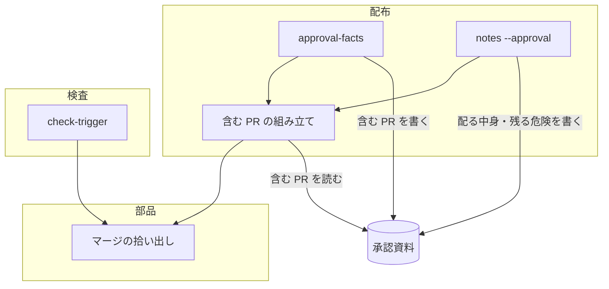
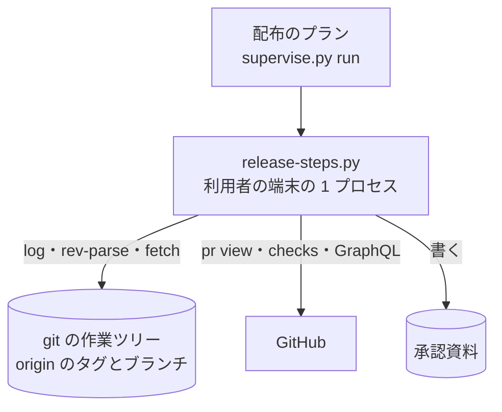
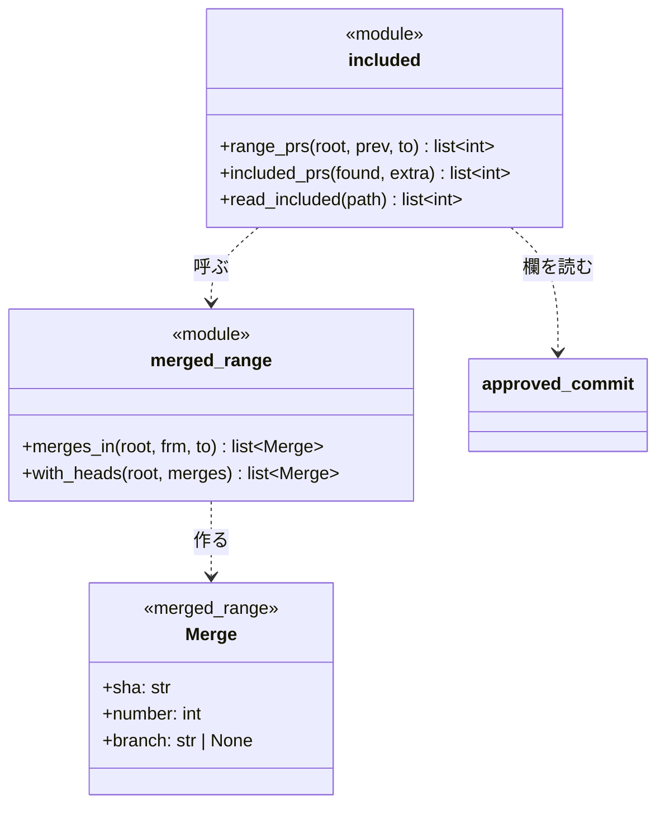
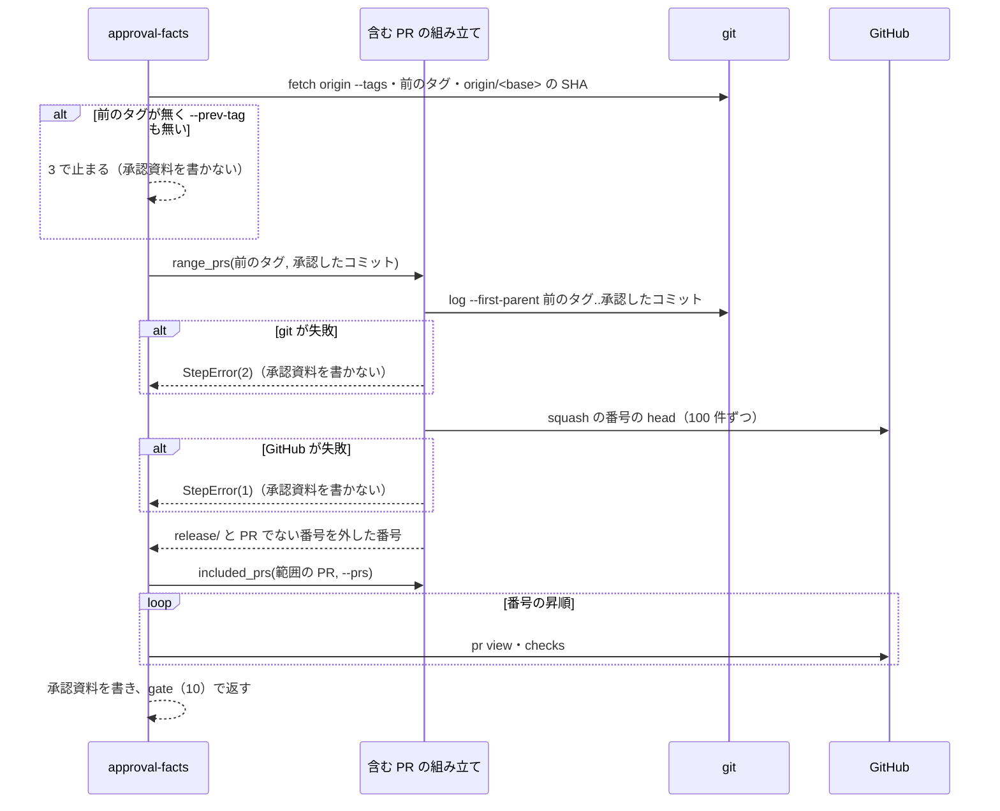
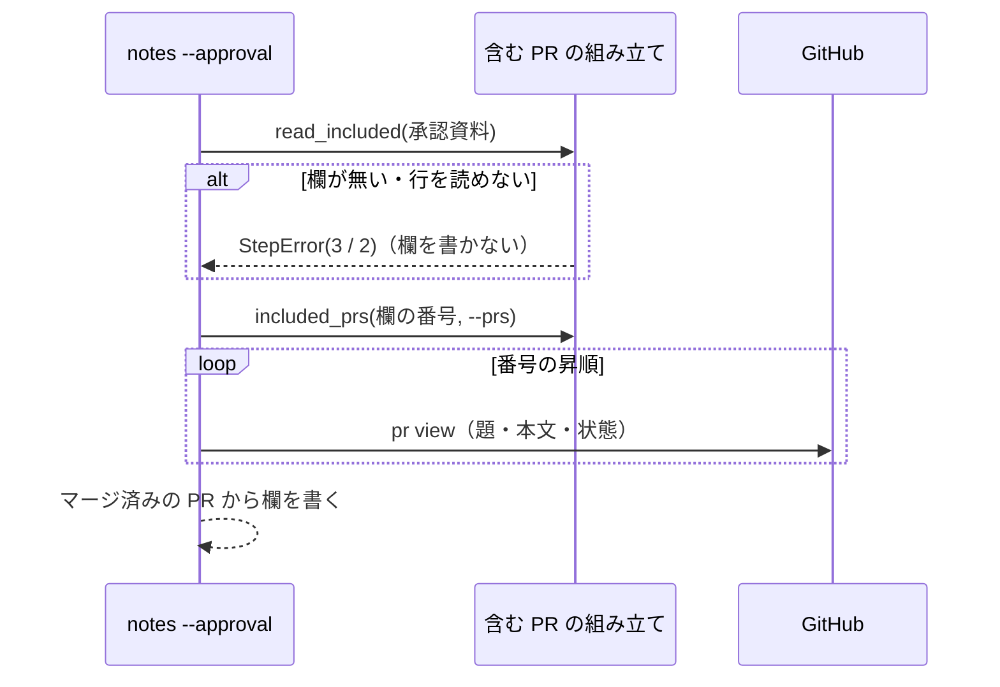

# release: 本番の承認資料が直前の開発版から後の PR しか載せず、承認する人が本番に入る変更の一部しか見ない → 直前の正式版から後にベースブランチへ入った PR をすべて載せ、配る中身と残る危険も同じ PR から書く（#1274）

## 目的

- **何が壊れているか**: 本番への配布の承認資料（`issues/approval-<プラグイン>-v<版>.md`）の「含む PR」「配る中身」「未検証・残る危険」が、配布のプランが `--prs` に渡した PR（その開発版で渡した PR）だけから書かれる。開発版を 2 回出すと、1 回目に入った PR が落ちる
- **誰が困るか**: 承認ゲート 2 で承認する利用者。本番に入る変更の一部しか見ずに承認する（10.17.30 では #1238 #1239 #1250 #1251 などが落ち、手で直した）
- **直すと何が成り立つか**: 承認資料の 3 つの欄が、直前の正式版のタグからベースブランチへマージされた PR のすべてを載せる。承認の意味が「直前の開発版の差分」に縮まない

## 適用範囲

- **働く範囲**: NDF を使うすべてのリポジトリの本番への配布（`release-steps.py approval-facts` と `notes --approval`）。ai-plugins に限らない
- **プロジェクトごとに違うもの**: ベースブランチ・本番チャネルは `.ndf/worktree.json` の宣言（`release_decl`）、配るプラグインとタグの形は `--plugin` か `.ndf/supervise.json` から読む。マージの形（merge commit / squash merge）は設定を持たず、両方を数える
- **当たるモード**: `standard`

## あるべき姿の根拠

| 根拠 | 種類 | 何を示すか |
| --- | --- | --- |
| `git log --first-parent --format=%s ndf--v10.17.68..ndf--v10.17.69^2` が 9 件のマージを返し、版上げ（`release/`）の 3 件を除くと #1868 #1869 #1874 #1876 #1878 #1882 の 6 件になる（2026-10-10） | 実測 | 直前の正式版のタグからベースブランチまでの first-parent のマージから、承認資料に要る PR が過不足なく取れる |
| 10.17.69 の dev.1（PR 1883）の CHANGELOG の版の節に #1869 が無く、dev.2 で `--prs 1882 1869` と手で並べて回避した（#1885） | 実測 | `--prs` だけを材料にすると、開発版の出し直しとベースブランチへの直接のマージの両方で PR が落ちる |
| 課題 #1274 の案「`approval-facts` の『含む PR』を、直前の正式版のタグ（`ndf--v<前の版>`）から `develop` までのマージ済み PR から並べる」 | 利用者の指示の原文 | 集合の起点と終点 |

要求と受け入れ条件は #1274 の本文にある（コピーは `issues/issue-1274-requirements.md`）。この文書は「どう作るか」だけを扱う。

## ドメインモデル

### コンテキスト

| コンテキスト | 何の語が 1 つの意味に決まるか |
| --- | --- |
| 配布（`ndf-release`） | 承認資料・承認したコミット・範囲の PR・版上げの PR |

1 つのコンテキストに収まる。検査（`check-trigger.py`）も範囲の PR を集めるが、共有するのは「first-parent のログからマージで入った PR を拾う」部品だけで、どの PR を外すかは各々が持つ（決定 1）。

### 集約

| 集約 | 持ち主（書き換えてよいもの） | 根 | エンティティ | 値オブジェクト |
| --- | --- | --- | --- | --- |
| 承認資料 | `release-steps.py`（`approval-facts` が作り直し、`notes --approval` が欄を書き、`approve` が承認の記録を書く） | 承認資料 | 「含む PR」の行（PR ごと） | 承認したコミット・直前の正式版のタグ・範囲の PR の集合 |

範囲の PR の集合は承認資料を書くたびに git と GitHub から作り直す値で、承認資料の外に保存しない。保存先は「含む PR」の欄だけである（決定 3）。

### 不変条件

| # | 集約 | 条件 | 破れたときの扱い |
| --- | --- | --- | --- |
| I1 | 承認資料 | 「含む PR」の集合は、範囲の PR と `approval-facts --prs` の和である。同じ番号は 1 つだけ並ぶ | 破れる経路を作らない（テストで縛る） |
| I2 | 承認資料 | 範囲の PR は、`<直前の正式版のタグ>..<承認したコミット>` の first-parent のログで merge commit か squash merge として入った PR のうち、版上げの PR と PR でない番号を除いたものである | 同上 |
| I3 | 承認資料 | 範囲の PR の終点は承認したコミットで、compare の URL・変更量・`approved_sha` の範囲と同じである。この 3 つの値は変更の前と同じに出る | 同上 |
| I4 | 承認資料 | 「含む PR」の行は番号の昇順に並ぶ | 同上 |
| I5 | 承認資料 | 「配る中身」「未検証・残る危険」を書く PR は、承認資料の「含む PR」の PR と `notes --prs` の和のうち、マージ済みのものである | 同上 |
| I6 | 承認資料 | 結果 JSON の `kind: pr` の items と要約の「PR N 件」は、「含む PR」の行と同じ番号・同じ件数である | 同上 |
| I7 | 承認資料 | 範囲の PR を集められないとき（git のログ・GitHub の読み取りの失敗）、承認資料を書かない。`notes --approval` は「含む PR」の欄を読めないとき欄を書かない | 0 以外で止まり、`summary` に理由を出す。既存の承認資料はそのまま残る |
| I8 | — | 検査（`check-trigger.py`）の範囲の PR・外すコミット・行数・終了コードは、部品の共有の前後で変わらない | 破れる経路を作らない（既存のテストと足すテストで縛る） |

### ドメインイベント

| # | イベント | 発生元 | 受け手 |
| --- | --- | --- | --- |
| E1 | 配布のプランが `approval-facts` を起動した | 開発版の配布のプランの `facts` のステップ、または conductor | `approval-facts` |
| E2 | 直前の正式版のタグを決めた | `approval-facts`（`--prev-tag` か `release_tag_before`） | 範囲の PR の収集 |
| E3 | タグからベースブランチの先頭までにマージされた PR を集めた | 範囲の PR の収集（`merged_range`） | 含む PR の組み立て（`included`） |
| E4 | 集めた PR と `--prs` を合わせ、版上げの PR を外した | 含む PR の組み立て | `approval-facts` |
| E5 | 承認資料の「含む PR」を書いた | `approval-facts` | `notes --approval`・MVV 判定・承認する人 |
| E6 | `notes --approval` が「配る中身」「未検証・残る危険」を同じ集合から書いた | `notes --approval`（プランの `explain` のステップ） | 承認する人・MVV 判定 |
| E7 | 利用者が承認資料を見て承認した | 承認する人（承認ゲート 2） | `approve`・本番の配布のプラン |

### 用語

| 用語 | 意味 | 用語集への反映 |
| --- | --- | --- |
| 範囲の PR | 直前の正式版のタグから承認したコミットまでに、ベースブランチへ merge commit か squash merge で入った PR。版上げの PR と、PR でない番号（squash の件名の `(#N)` が課題を指すもの）は含まない | 追加（`ndf-release`） |
| 版上げの PR | head のブランチが `release/` で始まる PR。版数と CHANGELOG だけを変え、中身の変更を持たない | 追加（`ndf-release`） |

## 機能一覧

| # | 機能 | 誰が使うか |
| --- | --- | --- |
| F1 | 承認資料の「含む PR」に、直前の正式版から後にベースブランチへ入った PR をすべて並べる | 承認ゲート 2 で承認する利用者・MVV 判定 |
| F2 | 承認資料の「配る中身」「未検証・残る危険」を、「含む PR」と同じ PR の本文から書く | 承認する利用者・MVV 判定 |
| F3 | `approval-facts` の結果 JSON の PR の items と件数を、「含む PR」と同じ集合にする | 配布のプラン・conductor |
| F4 | 範囲の PR を拾う部品を、検査（`check-trigger.py`）と配布で 1 つにする | NDF の開発者 |

## 構成要素

| 要素 | 責務 |
| --- | --- |
| マージの拾い出し（`lib/merged_range.py`。新設） | `<起点>..<終点>` の first-parent のログから、merge commit（件名 `Merge pull request #N from <owner>/<branch>`）と squash merge（件名の末尾 `(#N)`）で入った PR を、コミット・番号・head のブランチの組で返す。squash の head は GitHub から 100 件ずつまとめて読む（`gh_rest.pr_head_branches`）。**外す規則は持たない** |
| 含む PR の組み立て（`release_lib/included.py`。新設） | 範囲の PR（版上げの PR と PR でない番号を外す）・`--prs` との和と並び（番号の昇順）・承認資料の「含む PR」の欄からの番号の読み取り |
| `approval-facts`（`release-steps.py` の `cmd_approval_facts`） | 「含む PR」・結果 JSON の items・要約の件数を、組み立てた集合から書く。compare・変更量・承認したコミットは今のまま |
| `notes --approval`（`release-steps.py` の `cmd_notes`） | `--approval` のとき、承認資料の「含む PR」の番号と `--prs` の和から欄を書く。`--approval` なし（CHANGELOG の版の節）は今のまま |
| 検査（`check-trigger.py`） | `_scan_log` と squash の head の読み取りを、マージの拾い出しへ置き換える。外す規則（`SKIP_BRANCHES`・記録の番号）・点数・行数は今のまま |
| 部品の一覧（`lib/README.md`） | マージの拾い出しの行を足す |
| 手順書（`release` の `references/release-steps.md`・`release-steps.py` の使い方の説明） | `approval-facts` と `notes --approval` の `--prs` が「並べる PR のすべて」から「範囲の PR に足す PR」へ広がったことを書く |



図には動く要素だけを描く。部品の一覧（`lib/README.md`）と手順書は文書なので図に含めない。

### システムの文脈と配置



外部の系（変えられないもの）は git と GitHub の 2 つである。配置は変わらない。範囲の PR の収集は `release-steps.py` のプロセスの中で動き、新しいプロセス・常駐・保存先を持たない。GitHub へは squash の head の読み取り（100 件ごとに 1 回）が増え、PR ごとの `pr view` と checks の読み取りが範囲の PR の数だけ増える。

### 置き場所

```text
plugins/ndf/scripts/
├── lib/
│   ├── merged_range.py      # 新設: check-trigger.py の _scan_log と squash の head の読み取りを移す
│   └── README.md            # 行を足す
├── release_lib/
│   └── included.py          # 新設: 範囲の PR・--prs との和・承認資料の欄の読み取り
├── release-steps.py         # cmd_approval_facts・cmd_notes が included を呼ぶ
├── check-trigger.py         # merged_range を呼ぶ（行数は減る）
└── tests/                   # 足す（下の「テスト設計」）
plugins/ndf/skills/release/references/release-steps.md   # --prs の意味
```

`release-steps.py` は行数の例外リスト（`scripts/script-structure-allow/plugins__ndf__scripts__release-steps.py--lines.json`、上限 1206 行・今 1174 行）に載る。組み立ては `release_lib/included.py` へ置き、`release-steps.py` に足すのは呼び出しの行だけにする。

## 構造



| 型・関数 | 責務 | 失敗の形 |
| --- | --- | --- |
| `Merge`（frozen の dataclass） | ベースブランチ上のマージのコミット・PR の番号・head のブランチ。`branch` は merge commit なら件名から、squash なら `with_heads` を通るまで `None`、PR でない番号なら `""` | — |
| `merges_in(root, frm, to)` | `git log --first-parent --format=%H%x09%P%x09%s <frm>..<to>` を読み、親が 2 つなら merge commit の件名、1 つなら squash の件名の末尾で拾う。どちらにも当たらないコミットは返さない | git が 0 以外: `StepError(…, 2)` |
| `with_heads(root, merges)` | `branch` が `None` の番号だけを GitHub から読み、埋めた組を返す | 読めない: `StepError(…, 1)`（今の検査の終了コード） |
| `range_prs(root, prev, to)` | `merges_in` → `with_heads` の後、`branch` が `release/` で始まるものと `""` のものを外し、番号を返す | 上の 2 つの失敗をそのまま通す |
| `included_prs(found, extra)` | 和を取り、番号の昇順に並べる | 純粋な処理（失敗しない） |
| `read_included(path)` | 承認資料の「含む PR」の欄を `<br>` で割り、各行の先頭の `#N` を読む。欄が `—` なら空 | 欄が無い: `StepError(…, 3)`。`#N` で始まらない行がある: `StepError(…, 2)` |

`check-trigger.py` は `merges_in` と `with_heads` の `StepError` を `Stop(str(e), e.code)` へ読み替える。記録の番号（`skip`）は `merges_in` の結果から外し、外した後の squash の番号だけを `with_heads` へ渡す。GitHub へ渡す番号は今と同じになる。

## 入出力の契約

### `release-steps.py approval-facts`

| 項目 | 書くこと |
| --- | --- |
| 入力 | 今のまま（`--version`・`--prs`（必須）・`--prev-tag`・`--plugin`・`--root`）。`--prs` は「並べる PR のすべて」から「範囲の PR に足す PR」へ意味が広がる |
| 出力（gate・10） | `items` は `kind: pr` の行を「含む PR」と同じ番号・同じ順で並べる（行の形は今のまま: `name`・`result`（PR の状態の小文字）・`url`・`title`・`merge_commit`・`checks_passed`・`checks`）。`summary` の「PR N 件」は items の件数。`metrics` は今のまま（`files`・`insertions`・`deletions`・`prev_tag`・`compare`・`approved_sha`） |
| 承認資料 | 「含む PR」の欄の行の形は今のまま（`#<番号> <題>（<状態>・<マージのコミットの先頭 8 桁>・CI <通過>/<全体>）`）。行の先頭の `#<番号>` を `notes --approval` が読む |
| 失敗の形 | 前のタグが無い: 3（今のまま）。範囲の git のログを読めない: 2。squash の head を GitHub から読めない: 1。PR の `pr view` が失敗: 1（今のまま）。どれも承認資料を書かない |
| 互換性 | 配布のプランの雛形（`--prs {prs}`）・10.17.66 のように全 PR を手で並べたプラン・マージ前の PR を渡すプランは、そのまま通る。結果 JSON の形は変わらず、件数が増える |

### `release-steps.py notes --approval`

| 項目 | 書くこと |
| --- | --- |
| 入力 | 今のまま。`--prs` は承認資料の「含む PR」に足す PR になる |
| 出力（ok・0） | 今のまま。`metrics.prs` と `unmerged` は、承認資料の「含む PR」と `--prs` の和から数える |
| 失敗の形 | 承認資料が無い: 3（今のまま）。「含む PR」の欄が無い: 3。欄の行を読めない: 2。マージ済みが 0 件: 3（今のまま）。どれも欄を書かない |
| 互換性 | `--approval` なし（CHANGELOG の版の節）は変わらない |

## 処理の流れ

### `approval-facts`



compare の URL・変更量・承認したコミットを求める順序と git のコマンドは変えない。範囲の PR を集めるのは承認したコミット（`origin/<base>` の SHA）を決めた後で、終点にその SHA を使う（I3）。

### `notes --approval`



## 非機能の実現方式

| 大項目 | 要求の条件 | 実現方式 | 確かめ方 |
| --- | --- | --- | --- |
| 運用・保守性 | 範囲の PR を集める処理は、同じ役割の既存の処理（`check-trigger.py` の `merged_prs`）と分けて持たない（AGENTS.md の MVV Value 6） | 拾い出し（件名の照合 2 つと squash の head の読み取り）を `lib/merged_range.py` へ移し、検査と配布の両方がそれを呼ぶ。外す規則は呼び手が持つ | `check-trigger.py` に件名の照合の正規表現と `git log --first-parent` が残っていないことを差分で見る。`python3 scripts/check-script-structure.py` が同じ名前・同じ本体の関数を出さない |
| システム環境 | ai-plugins の形（`develop` / `main` / merge commit）を既定に埋め込まない。ベースブランチ・本番チャネルは `.ndf/` の宣言から読む（MVV Value 5） | ベースブランチは今の `release_decl` が返す値、タグの形は `<プラグイン>--v` を `release_tag_before` から使う。merge commit と squash merge の両方を拾う。外す head の接頭辞は `release/` の 1 つで、配布の工程が作るブランチ名（`release/v<版>`）と同じ NDF の側の規約である | ベースブランチを `develop` 以外の名前にした一時のリポジトリと、squash merge だけの一時のリポジトリでテストが通る |

## 決定の記録

### 決定 1: 検査と配布で同じ拾い方を保つため、マージの拾い出しを `lib/` の部品へ移し、外す規則は呼び手に残す

件名の照合（merge commit と squash merge）と squash の head の読み取りは、検査と配布で同じ役割である。`lib/merged_range.py` へ移して両方から呼ぶ。外す規則は両者で違う。検査は `release/` と `check/`（検査の修正）と記録の番号を外し、配布は `release/` だけを外して `check/` を並べる（要求の前提 2）。規則まで共通にすると、片方の規則の変更がもう片方へ漏れる。

`release-steps.py` から `check-trigger.py` の関数を読み込む案は採らない。ファイル名にハイフンを含み、検査のスクリプトの全体（記録・置き場・点数）を配布が読み込むことになる。

根拠: Value 6 / Value 5（MVV 版 2）

### 決定 2: compare と同じ範囲を承認するため、範囲の PR の終点を承認したコミットにする

範囲の終点は、`approval-facts` が決めた `origin/<base>` の 40 桁（承認したコミット）にする。compare の URL（`<前のタグ>...<承認したコミット>`）と同じ範囲になり、承認資料の中で「含む PR」と差分の範囲が食い違わない。

`HEAD` や `origin/<base>` を改めて読む案は採らない。読む時点の間にベースブランチが進むと、承認したコミットより後の PR が並ぶ。

根拠: Value 2（MVV 版 2）

### 決定 3: 欄どうしが同じ PR を指すため、`notes --approval` は承認資料の「含む PR」の欄から番号を読み、範囲を求め直さない

`notes --approval` は承認資料の「含む PR」の行の先頭の `#N` を読み、`--prs` との和から欄を書く。「含む PR」と「配る中身」「未検証・残る危険」が同じ集合になることが、作り方から保たれる（I5）。配布のプランは `--prev-tag` を `facts` のステップにだけ渡し、`explain`（`notes --approval`）には渡さない。

`notes` が前のタグと範囲を求め直す案は採らない。`--prev-tag` で起点を変えたときと、2 つのステップの間にベースブランチが進んだときに、欄どうしが別の集合を指す。範囲を別のファイル（JSON）へ書いて渡す案も採らない。承認資料のほかに、消える時点と置き場の規約を持つファイルが 1 つ増える。

根拠: Value 2 / Value 7（MVV 版 2）

### 決定 4: 承認する人が番号で探せるよう、「含む PR」を番号の昇順に並べる（要求の未決の 2）

範囲の PR と `--prs` の和を、番号の昇順に並べる。要求の例（#1868 #1869 #1874 #1876 #1878 #1882）と同じ並びで、merge commit と squash merge が混ざっても並びが決まる。

マージの順に並べる案は採らない。`--prs` の範囲の外の PR（マージ前の PR）にはマージの順が無く、置く位置が決まらない。

根拠: Value 2（MVV 版 2）

### 決定 5: 範囲から外すのは版上げの PR と PR でない番号の 2 つにする

head が `release/` で始まる PR（開発版と正式版の版上げ）は外す（要求の前提 2）。squash の件名の `(#N)` が課題を指すとき（GitHub が head を返さない番号）も外す。外さないと `pr view` が失敗し、承認資料が書けない。`check/` を含むほかのブランチは並べる。

`--prs` で明示した番号は、`release/` の PR でも外さない。呼び手が並べると決めた PR だからである（要求の前提 3）。

根拠: Value 2（MVV 版 2）

### 決定 6: 承認の前に人が見る形を増やさないため、結果 JSON の形を変えない

`approval-facts` の結果 JSON は、`kind: pr` の行の数だけが変わる。範囲から来たか `--prs` から来たかを示す欄は足さない。読み手（配布のプラン・MVV 判定・conductor）は行の集合と件数だけを使っている。

根拠: Value 1（MVV 版 2）

### 決定 7: CHANGELOG の版の節の欠けは #1885 で直し、この変更は承認資料の欄に限る（要求の未決の 1）

実測で、CHANGELOG の版の節も開発版を出し直すと前の開発版の PR を失うと分かった。`notes`（`--approval` なし）の `write_notes` は版の節を丸ごと置き換えるため、dev.2 の `--prs` が dev.2 の PR だけなら dev.1 の箇条が消える（一時の CHANGELOG で `write_notes(..., ["- B の変化（#2）"])` を打つと、`#1` の節が `#2` の 1 行になった。2026-10-10）。原因は、直接のマージが CHANGELOG から落ちる #1885 と同じ「CHANGELOG の材料が `--prs` だけ」の層である。新しい課題は起こさず、#1885 の本文に実測を足した（「再確認（#1274 の設計、2026-10-10）」の節）。#1885 はこの変更のマージの拾い出しと含む PR の組み立てを使って直せる。

根拠: Value 6 / Value 1（MVV 版 2）

## テスト設計

| 受け入れ条件・不変条件 | どの振る舞いで縛るか | どう壊したら落ちるべきか |
| --- | --- | --- |
| AC1・I1 | 正式版のタグの後に PR A（merge commit）と開発版の版上げと PR B を入れたリポジトリで `approval-facts --prs B` を打つと、承認資料の「含む PR」に A と B が並ぶ | 範囲の PR を集めずに `--prs` だけを並べると落ちる |
| AC2・I2 | 同じリポジトリで、`release/v<版>-dev.1` からの PR が「含む PR」に並ばない。`check/` からの PR は並ぶ | `release/` を外さない・検査の `SKIP_BRANCHES`（`check/` を含む）を配布で使うと落ちる |
| AC3・I1 | `--prs A B` を渡しても A と B は 1 行ずつ | 和を取らずに連結すると落ちる |
| AC4 | 範囲の外のマージ前の PR を `--prs` に渡すと、その行が並び、状態（`OPEN`）が行に出る | `--prs` を範囲で絞ると落ちる |
| AC5・I2 | squash merge（件名の末尾 `(#N)`、親が 1 つ）で入った PR が並び、head が `release/` の squash の PR は並ばない。件名の `(#N)` が課題を指す（GitHub が head を返さない）番号は並ばない | merge commit の件名だけを照合すると落ちる。squash の head を読まずに並べると版上げの squash が並んで落ちる |
| AC6・I6 | 結果 JSON の `kind: pr` の items の番号の並びが「含む PR」の行の番号の並びと等しく、要約の件数が items の件数と等しい | 件数を `len(a.prs)` のまま数えると落ちる |
| AC7・I5 | AC1 の承認資料に対して `notes --prs B --approval <資料>` を打つと、「配る中身」と「未検証・残る危険」に A と B の本文の箇条が載る | `notes --approval` が `--prs` だけを読むと落ちる |
| AC8・I7 | 範囲の git のログが失敗するとき（存在しない起点を `--prev-tag` に渡す）と squash の head の GitHub の読み取りが失敗するとき、`approval-facts` は 0 以外で終わり、承認資料のファイルを作らない（既にあれば中身が変わらない）。`notes --approval` は「含む PR」の欄が無い承認資料で 0 以外で終わり、欄を書かない | 失敗を空の一覧として扱い、欠けた承認資料を書くと落ちる |
| AC9 | 正式版のタグが無く `--prev-tag` も無いと、3 で止まる | 範囲の収集を前のタグの判定より前に置くと、別の終了コードになって落ちる |
| AC10・I3 | compare の URL・`metrics.files`・`insertions`・`deletions`・`approved_sha` が、範囲の PR が増えた後も変更前と同じ値になる | 変更量を範囲の PR から数え直す・終点を別の ref にすると落ちる |
| I3 | ベースブランチが承認したコミットより進んでいても（収集の時点で後の PR がある）、後の PR は並ばない | 終点に `origin/<base>` を読み直すと落ちる |
| I4 | `--prs` に大きい番号を先に渡しても、「含む PR」は番号の昇順 | 渡した順・マージの順に並べると落ちる |
| I8 | `check-trigger.py` の既存のテスト（`test_check_trigger.py` の squash の PR と記録の PR の扱いを含む）がそのまま通る。記録の番号で外した squash の PR の番号は GitHub へ問い合わせない | 外す規則を部品へ移す・記録で外す前に head を読むと落ちる |
| システム環境（非機能） | ベースブランチを `develop` 以外の名前にした一時のリポジトリで AC1 が通る | ベースブランチの名前を埋め込むと落ちる |

## 設計の結果

| 課題 | 扱い | 取り込み先 | 触るファイル |
| --- | --- | --- | --- |
| #1274 | 実装する | — | `plugins/ndf/scripts/lib/merged_range.py`、`plugins/ndf/scripts/lib/README.md`、`plugins/ndf/scripts/release_lib/included.py`、`plugins/ndf/scripts/release-steps.py`、`plugins/ndf/scripts/check-trigger.py`、`plugins/ndf/scripts/tests/`、`plugins/ndf/skills/release/references/release-steps.md` |

## 未確認のまま残ること

| 項目 | 内容 |
| --- | --- |
| 範囲の PR が多い版の待ち時間 | `approval-facts` は PR ごとに `pr view` と checks を 1 回ずつ読む。10.17.69 の 6 件では数秒だが、数十件の版でどれだけ延びるかは測っていない。次の本番の配布で `approval-facts` の所要時間を見る |
| リリース後テスト | 次の本番の配布で、承認資料の「含む PR」が `git log --first-parent <前のタグ>..origin/<base>` のマージ（`release/` を除く）と一致するかを conductor が見る（要求の検証手段） |
| 承認資料を手で直したとき | 利用者が「含む PR」の行を手で消すと、`notes --approval` はその PR の欄を書かない（欄が「含む PR」に従う）。手で直す運用は #1834 の範囲で、この変更は扱わない |
