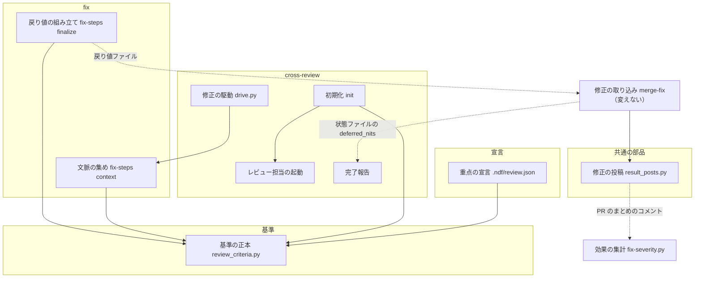
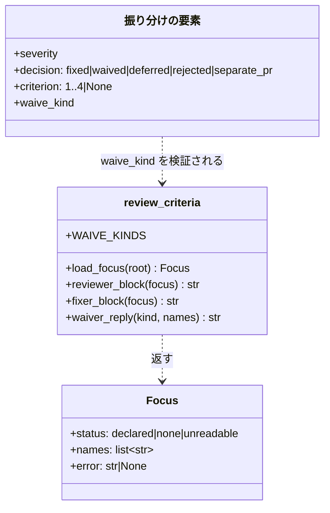
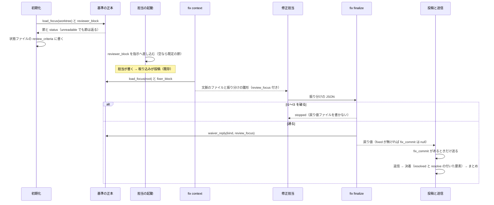
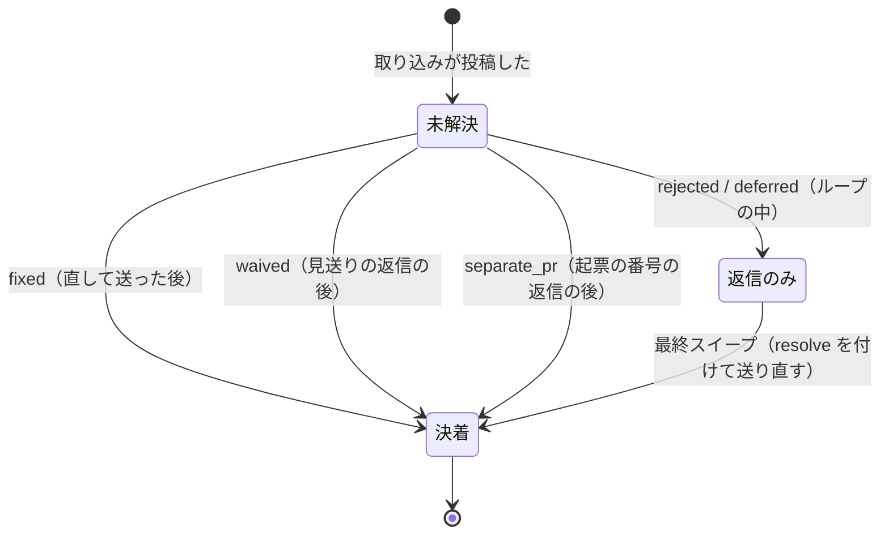

# #1287: cross-review の指摘を「利用者が困るか」の基準に揃える

要求と受け入れ条件は #1287 の本文にある（コピーは [issue-1287-requirements.md](issue-1287-requirements.md)）。この文書は「どう作るか」だけを扱う。

## 例: minor の指摘 1 件が、変えた後の部品をどう通るか

PR の上に、担当が `[minor / 整合性] 2 つの文書で受け入れ条件の番号がずれている` を書いたとする（このリポジトリには重点の宣言がある）。

1. `state.py init` が `.ndf/review.json` を読み、`review_criteria.py` がレビュー担当への「指摘の基準」の節を組んで状態ファイルの `review_criteria` に写す。節には基準 1・2・4 と、宣言した重点が基準 3 として名前で入る
2. `launch-reviewer.sh` がその節を指示へ差し込む。担当はこの指摘を「実装に影響しない文書の食い違い」と読み、書かない
3. 別の担当が書いてしまい、投稿された。修正担当は `fix-steps.py context` が文脈のファイルへ書いた同じ基準を読み、振り分けの JSON に `"decision": "waived", "severity": "minor", "waive_kind": "doc_mismatch"` と書く
4. `fix-steps.py finalize` が、見送りの返信（「直しません。この指摘は、利用者が実際に使って困る不具合ではないためです（実装に影響しない文書の食い違い。レビューの重点（…）にも当たりません）。…」）を組み、戻り値の `deferred` に `resolve: true` を付けて載せる。`fixed` が無いので `fix_commit` は `null` になる
5. `merge-fix` は `fix_commit` が無いので送らない。投稿キューが返信とスレッドの決着とまとめを送る。push も CI も起きない
6. 同じ PR の「秘密をログへ書き出す経路がある」が `minor` で届いても、修正担当は基準 2 に当てて `"severity": "major", "criterion": 2, "decision": "fixed"` と書く。`minor` のまま `fixed` と書くと `finalize` が止める

## ドメインモデル

### コンテキスト

| コンテキスト | 何の語が 1 つの意味に決まるか |
| --- | --- |
| NDF の cross-review（`ndf-cross-review`） | 指摘・指摘の基準・レビューの重点・見送りの返信・見送りの種類・最終スイープ・修正担当 |

変更は 1 つのコンテキストに収まる。`/ndf:fix` を単独で呼んだとき（bot のレビューへの対応）も、同じ語を同じ意味で使う。

### 集約

| 集約 | 持ち主（書き換えてよいもの） | 根 | エンティティ | 値オブジェクト |
| --- | --- | --- | --- | --- |
| 指摘の基準 | `review_criteria.py`（定数として持つ。実行時に書き換えない） | 基準の表 | — | 基準の番号（1〜4）・出さないもの・見送りの種類・返信の雛形 |
| レビューの重点の宣言 | プロジェクトの利用者（`.ndf/review.json` を手で書く）。NDF は読むだけ | 宣言 | — | 重点の名前 |
| 振り分け | 修正担当が書き、`fix-steps.py finalize` が検証して戻り値ファイルへ変える | 振り分けの JSON | 指摘ごとの判定（`thread_id` で識別する） | 重要度・`decision`・`criterion`・`waive_kind` |
| 収束ループの状態 | `state.py`（既存） | 状態ファイル | ラウンド | `review_criteria`（init が写した基準の節と宣言の読み取り結果） |

振り分けの集約はレビューの重点の宣言を ID で参照しない。`context` が読み取り結果（重点の名前の列）を振り分けの JSON の `review_focus` へ写し、`finalize` はそれだけを読む。

### 不変条件

| # | 集約 | 条件 | 破れたときの扱い |
| --- | --- | --- | --- |
| I1 | 振り分け | `decision` が `fixed` の要素は、重要度が `critical` か `major` である | `finalize` が `stopped`（終了コード 1）で止まり、戻り値ファイルを書かない |
| I2 | 振り分け | `decision` が `waived` の要素は、重要度が `minor` か `nit` で、`criterion` を持たず、`waive_kind` が見送りの種類の 5 つのどれかである | 同上 |
| I3 | 振り分け | `criterion` が 3 の要素は、振り分けの JSON の `review_focus` が空でない | 同上 |
| I4 | 振り分け | `fixed` の要素が 1 つも無いとき、戻り値の `fix_commit` は `null` である（振り分けの JSON に値があっても捨てる） | 捨てたことを `finalize` の `items` に出す。止めない |
| I5 | 振り分け | `waived` の要素は、戻り値の `deferred` に `resolve: true` と、雛形から組んだ `reply` を持って載る | 組めない（種類が不明）ときは I2 で止まる |
| I6 | 指摘の基準 | 重点の宣言が無いとき、レビュー担当への節に基準 3 が現れず、見送りの返信は雛形の定型文と種類の名前だけでできている | テストで落とす |
| I7 | 指摘の基準 | 重点の宣言が読めないとき、基準 1・2・4 だけの節を返し、読み取り結果を `unreadable` と理由にする。例外を上げない | テストで落とす |
| I8 | 収束ループの状態 | 1 回の実行の中で、どのラウンドの担当も init が写した同じ基準の節を受け取る | 状態ファイルに節が無いときは、宣言を読まない既定の節を使う |

### ドメインイベント

| # | イベント | 発生元 | 受け手 |
| --- | --- | --- | --- |
| E1 | プロジェクトの重点の宣言を読んだ | `state.py init`（cross-review）/ `fix-steps.py context`（`/ndf:fix`） | 状態ファイルの `review_criteria` / 振り分けの JSON の `review_focus` と文脈のファイル |
| E2 | レビュー担当が基準に当たる指摘だけを書いた | レビュー担当（`launch-reviewer.sh` の指示） | 取り込み（`read-result`） |
| E3 | 取り込みが指摘を PR へ投稿した | 取り込み（既存） | 修正担当（PR の未解決のスレッド） |
| E4 | 修正担当が指摘ごとに重要度を判定し直した | 修正担当 | `fix-steps.py finalize` |
| E5 | 修正担当が `major` 以上を直してコミットした | 修正担当 | `finalize`（`fix_commit`）→ `merge-fix` / `result_posts.py fix`（送信） |
| E6 | 修正担当が `minor` / `nit` に見送りの返信を書き、スレッドを閉じた | `finalize`（返信を組む）→ 投稿キュー（送る） | `fix-steps.py remaining` / `verify-sweep`（残りを数える） |
| E7 | 最終スイープが残ったスレッドを閉じた | 最終スイープの worker（`/ndf:fix` を通す） | `state.py verify-sweep` |
| E8 | 変更の後の修正のまとめを重要度別に集計した | `scripts/measure/fix-severity.py` | 課題 #1287 のコメント（受け入れ条件 8） |

### 用語

| 用語 | 意味 | 用語集への反映 |
| --- | --- | --- |
| 指摘の基準 | 指摘として出してよいものを決める 4 つの条件。当たるものが `major` 以上になる | 追加（要求の段で反映済み。出所をこの設計へ移す） |
| レビューの重点 | プロジェクトが `.ndf/review.json` で宣言した、指摘の基準 3 に使う観点 | 意味の変更（置き場所を `.ndf/review.json` に決めた） |
| 見送りの返信 | 修正担当が `minor` / `nit` の指摘を直さずに閉じるときに送る返信。雛形から組む | 追加（要求の段で反映済み） |
| 見送りの種類 | 見送りの返信の括弧に書く、基準に当たらない理由の 5 分類（`waive_kind`） | 追加 |
| 最終スイープ | 収束ループを抜けた後に `/ndf:fix` を通し、open thread を 0 にする工程 | 追加（要求の段で反映済み） |

## 機能一覧

| # | 機能 | 誰が使うか |
| --- | --- | --- |
| F1 | レビュー担当が、基準に当たる指摘だけを `major` 以上で書く | cross-review のレビュー担当 |
| F2 | プロジェクトがレビューの重点を宣言し、基準 3 と見送りの返信に使わせる | NDF を使うプロジェクトの利用者 |
| F3 | 修正担当が `minor` / `nit` をコードを変えずに見送りの返信で閉じる | 修正担当（cross-review の中 / `/ndf:fix` の単独の呼び出し） |
| F4 | 修正担当が、ラベルによらず基準に当たる指摘を `major` 以上として直す | 同上 |
| F5 | 最終スイープが、`minor` 以下だけ残ったスレッドをコードを変えずに閉じる | cross-review の conductor |
| F6 | 変更の後の修正のまとめを重要度別に集計し、判定を出す | このリポジトリの保守者 |

## 構成要素

| 要素 | 置き場所 | 新設 / 変更 | 責務 |
| --- | --- | --- | --- |
| 基準の正本 | `plugins/ndf/scripts/lib/review_criteria.py` | 新設 | 基準 1〜4・出さないもの・見送りの種類・返信の雛形を定数で持つ。重点の宣言を読み、レビュー担当への節・修正担当への節・見送りの返信を組む |
| 重点の宣言（このリポジトリ） | `.ndf/review.json` | 新設 | 前提 7 の重点を 1 つ宣言する |
| 初期化 | `skills/cross-review/scripts/review_lib/commands/init.py` | 変更 | 新規・再開のどちらでも基準の正本を呼び、状態ファイルの `review_criteria` を書き直す。読めなければ標準エラーと出力の `REVIEW_FOCUS=unreadable` に出す |
| レビュー担当の起動 | `skills/cross-review/scripts/launch-reviewer.sh` | 変更 | 「出し切り」の節を状態ファイルの基準の節に差し替える。重要度の書式を `critical` / `major` だけにする |
| 完了報告 | `skills/cross-review/scripts/review_lib/commands/report.py` | 変更 | 基準外の見送りを件数で別の節に出し、残 deferred の一覧から外す。宣言が読めなかったことを出す |
| 修正の駆動 | `skills/cross-review/scripts/drive.py` | 変更 | 修正の指示から `--defer-nit` を外す |
| 修正の手順の集計 | `skills/fix/scripts/fix-steps.py` | 変更 | `context` が文脈のファイルへ修正担当への節を書き、振り分けの雛形へ `review_focus` を写す。`finalize` が I1〜I5 を守り、`waived` を `deferred` へ変える |
| 修正の投稿 | `plugins/ndf/scripts/lib/result_posts.py` | 変更 | 要素が `reply` を持てば定型句を付けずにそのまま返信する。まとめに「基準外の見送り: N 件」の行を足す |
| 修正の手順 | `skills/fix/SKILL.md` | 変更 | 引数・振り分けの値・「重要度の判定」の表・`--classify-only` の表を基準に揃える |
| cross-review の定め | `skills/cross-review/references/design-principles.md`・`docs/02-fix-and-rotation.md`・`docs/03-review-output.md`・`docs/04-contracts.md`・`SKILL.md` | 変更 | 自動で直すのは `critical` / `major` だけ・最終スイープは閉じるだけ・戻り値の新しい項目を書く |
| PR レビューの表 | `skills/pr-review/SKILL.md` | 変更 | 「重要度の運用ガイド」の「後段（`/ndf:fix`）の扱い」の列を新しい判断表に揃える |
| ライブラリの一覧 | `plugins/ndf/scripts/lib/README.md` | 変更 | `review_criteria.py` の行を足す |
| 効果の集計 | `scripts/measure/fix-severity.py` | 新設 | `/tmp/fixsum.py` と `/tmp/threads.py` を 1 本にまとめ、期間を引数で受け、前提 9 の判定を出す |



図に入れない要素は文書（`SKILL.md`・`references/`・`docs/`・`README.md`）と、このリポジトリの宣言そのものである。どれも基準の正本を参照するだけで、呼び出しの辺を持たない。

### 配置

変わる配置は無い。`review_criteria.py` はプラグインルートの `scripts/lib/` に置くため、配る Skill を絞る配布先でも `cross-review` と `fix` の両方から読める（`fix-steps.py` は既に `scripts/lib/` を読む）。`scripts/measure/fix-severity.py` はリポジトリの根にあり、配布しない。

### 置き場所

```text
.ndf/review.json                                  新設
scripts/measure/fix-severity.py                   新設
scripts/tests/test_fix_severity.py                新設
plugins/ndf/scripts/lib/
├── review_criteria.py                            新設
├── result_posts.py                               変更
└── README.md                                     変更
plugins/ndf/scripts/tests/test_review_criteria.py 新設
plugins/ndf/skills/cross-review/
├── SKILL.md / references/design-principles.md    変更
├── docs/02-fix-and-rotation.md / 03-review-output.md / 04-contracts.md  変更
└── scripts/
    ├── launch-reviewer.sh / drive.py             変更
    └── review_lib/commands/init.py / report.py   変更
plugins/ndf/skills/fix/
├── SKILL.md                                      変更
└── scripts/fix-steps.py                          変更
plugins/ndf/skills/pr-review/SKILL.md             変更
```

## 構造



- `Focus` は値オブジェクト（`NamedTuple`）。`status` が `none` のときと `unreadable` のときは `names` が空である
- `振り分けの要素` は型としては辞書のままで、`check_decisions` が規則を持つ。`criterion` と `waive_kind` は新しい鍵、`waived` は `decision` の新しい値である

## 入出力の契約

### 重点の宣言 `.ndf/review.json`

```json
{"version": 1, "focus": ["トークン・所要時間・処理の回数（CLI の起動・API の呼び出し・CI の実行）を増やす変更"]}
```

| 状態 | 条件 | `Focus.status` |
| --- | --- | --- |
| 無い | ファイルが無い、または `focus` が空の配列 | `none` |
| 宣言がある | オブジェクトで、`version` が 1、`focus` が空でない文字列の配列 | `declared` |
| 読めない | 上のどちらでもない（JSON でない・形が違う・読み取りの権限が無い） | `unreadable`（`error` に理由） |

ほかの鍵は無視する。宣言を読む場所は、cross-review では状態ファイルの `worktree_path`（PR の head）、`/ndf:fix` では `--root`（既定は今のworktreeの根）である。

### `review_criteria.py`

| 名前 | 入力 | 出力 | 失敗の形 |
| --- | --- | --- | --- |
| `load_focus(root)` | worktreeの根 | `Focus` | 例外を上げない。読めなければ `unreadable` |
| `reviewer_block(focus)` | `Focus` | レビュー担当への節（Markdown）。宣言があるときだけ基準 3 の行を持つ | — |
| `fixer_block(focus)` | `Focus` | 修正担当への節。基準・出さないもの・見送りの種類の値と名前・返信の雛形 | — |
| `waiver_reply(kind, names)` | 見送りの種類の値・重点の名前の列 | 見送りの返信の本文 | 不明な種類は `ValueError` |
| CLI `review_criteria.py reviewer\|fixer [--root R]` | 同上 | 節を標準出力へ。`unreadable` なら理由を標準エラーへ出し、終了コード 0 | — |

レビュー担当への節（宣言がある形。無いときは 3 の行が無い。番号は詰めない）:

```markdown
## 指摘の基準
次のどれかに当たるものだけを、重要度 `critical` か `major` で書く。当たらないものは書かない（`minor` / `nit` は使わない）。上のレビュー観点は探す場所で、書く基準はここである。見つけたものはこのラウンドですべて書く。
1. 利用者が普通に使う経路で、誤動作する・止まる・データを壊す
2. 秘密・認証認可・利用者のデータ・戻せない操作に触れる（起きる確率によらず書く）
3. このプロジェクトのレビューの重点に当たる: <重点の名前>（複数は「 / 」で区切る）
4. 設計の文書で、実装する人が違うものを作ってしまう食い違い
書かないもの: 字句や言い回し・まず起きない条件での異常処理・実装に影響しない文書どうしの食い違い・番号や表記の揃え・好みの設計
```

見送りの種類（値と、返信の括弧に入る名前）:

| 値 | 名前 |
| --- | --- |
| `wording` | 字句や言い回しの修正 |
| `unlikely` | まず起きない条件での異常処理 |
| `doc_mismatch` | 実装に影響しない文書の食い違い |
| `alignment` | 番号や表記の揃え |
| `preference` | 好みの設計 |

返信の雛形（`<名前>` は上の表の名前。重点の宣言があるときだけ `。レビューの重点（<重点の名前>）にも当たりません` を括弧の中に足す）:

```text
直しません。この指摘は、利用者が実際に使って困る不具合ではないためです（<名前>）。使って困る場面が出たら、そのときに直します。
```

### 状態ファイルの `review_criteria`（cross-review）

```json
{"status": "declared", "focus": ["…"], "error": null, "reviewer_block": "## 指摘の基準\n…"}
```

`init` が新規・再開のどちらでも書き直す。`launch-reviewer.sh` は `reviewer_block` だけを読み、空なら `review_criteria.py reviewer`（`--root` なし。宣言を読まない既定の節）を差し込む。`init` の出力に `REVIEW_FOCUS=<status>` の 1 行を足す。

### `/ndf:fix` の引数

| 引数 | 変更 |
| --- | --- |
| `--defer-nit` | 廃止。受け取ったら「nit は常に見送るため無視する」と知らせて続ける |
| `--severity-min LEVEL` | 値は `critical` / `major`、既定 `major`。`minor` を受け取ったら `major` として扱うと知らせる |

### 振り分けの JSON（`fix-steps.py` の `context` が雛形を書き、修正担当が埋める）

既存の鍵に次を足す。既存の値の改名はしない。

| 鍵 | 置き場所 | 値 |
| --- | --- | --- |
| `review_focus` | 最上位 | `context` が写す重点の名前の列。宣言が無い・読めないときは空の配列 |
| `review_focus_status` | 最上位 | `declared` / `none` / `unreadable` |
| `decision` | 要素 | 既存の 4 つに `waived` を足す |
| `criterion` | 要素 | 当たった基準の番号（1〜4）。任意。`waived` では持たない |
| `waive_kind` | 要素 | `waived` のとき必須。見送りの種類の値 |

`context` の出力は、文脈のファイルに「## 指摘の基準」の節（`fixer_block`）を足し、`items` に `{"name": "review-focus", "result": "<status>", "reason": "<error>"}`、`metrics` に `review_focus` を足す。

### 戻り値ファイル `fix-pr<PR>-result.json`

最上位の鍵は変えない（`merge-fix` の契約と既存のテストが鍵の集合を固定している）。`waived` の要素は `deferred` の配列へ次の形で載る。

```json
{"comment_id": 14, "thread_id": "PRRT_4", "path": "c.py", "line": 5, "severity": "minor",
 "category": "整合性", "summary": "…", "reason_for_deferral": "<見送りの返信>",
 "reply": "<見送りの返信>", "resolve": true, "waived": "doc_mismatch"}
```

`finalize` の `metrics` に `waived`（件数）を足し、要約を `修正 N 件 / 見送り N 件（うち基準外 M 件）/ 却下 N 件 / …` にする。

### 修正のまとめのコメント（`result_posts.py`）

既存の 4 行は形を変えない（集計が `critical=… / major=… / minor=…` と `見送り: N 件 / 却下: N 件` を読む）。`waived` を持つ要素が 1 つ以上あるときだけ、`決着` の行の直後に `基準外の見送り: M 件` の行を足す。返信は、要素が `reply` を持てばその本文だけを送り、「見送ります。」を前に付けない。

### `scripts/measure/fix-severity.py`

```text
python3 scripts/measure/fix-severity.py --repo devbasex/ai-plugins --since 2026-10-01 [--until …] [--out <JSON>]
```

| 出力の鍵 | 内容 |
| --- | --- |
| `summaries` / `prs` | まとめのコメントの件数と、それを持つ PR の本数 |
| `fixed_by_severity` | まとめの `critical` / `major` / `minor` の和 |
| `minor_ratio` | `minor` ÷ 3 つの和 |
| `minor_only_rounds` | `minor` が 1 以上で、`critical` と `major` が 0 のまとめの件数 |
| `waived` | 「基準外の見送り」の行の和 |
| `posted_by_severity` | 期間内の PR の、スレッドの最初のコメントの `[重要度 / …]` の件数 |
| `verdict` | 前提 9 の判定（`minor_ratio ≤ 0.10` かつ `minor_only_rounds ≤ 0.05 × prs`）。閾値は引数で変えられる |

GitHub の読み取りは `gh api graphql` を使う。形の解析は純粋な関数に分け、単体テストはそこだけを縛る。

## 処理の流れ



最終スイープは同じ経路を通る。スイープの worker は `/ndf:fix` の振り分けをそのまま使い、`waived` の要素は `finalize` の時点で `resolve: true` を持つため、スイープの結果ファイルへ写すだけで閉じる。`verify-sweep` は変えない。

指摘のスレッドの状態:



`waived` のスレッドがループの中で未解決に残る遷移は無い。

上の順序の図に含めない要素: 重点の宣言（`load_focus` が読む相手）・修正の駆動（修正担当を起動するだけで、指示から引数が 1 つ減る）・修正の取り込み（変えない。「投稿と送信」に含めた）・完了報告（状態ファイルを読むだけ）・効果の集計（リリースの後に PR のコメントを読む）・文書。

## 既存の規則への当てはめ

振り分けの値の集合（`decision`）へ `waived` を足し、重要度の値の意味を変えるため、その集合を前提にした規則を集めて判定した。当てはまらないものだけを並べる（どれも構成要素の表に載せた）。

| 規則 | 場所 | 当てはまらない理由と直し方 |
| --- | --- | --- |
| `DECISIONS` の 4 値と `check_decisions` | `fix-steps.py` | `waived` を知らない。値と I1〜I3 の検査を足す |
| `remaining` が `resolve` の無い `deferred` / `rejected` だけを残してよいものとする | `fix-steps.py` | 当てはまる（`waived` は `resolve: true` なので、閉じていなければ残りとして止まる）。変えない |
| 返信の定型句「見送ります。」＋理由 | `result_posts.py` | 見送りの返信が「直しません。」で始まり、重なる。`reply` を優先する |
| 「残 deferred nit」の一覧 | `report.py` | 基準外の見送りが nit の一覧に混ざる。件数だけの別の節に分ける |
| `/ndf:fix <PR> --defer-nit` の指示 | `drive.py` | 引数が廃止になる。外す |
| 最終スイープの指示の 1〜3（修正可能な minor/nit を直す） | `docs/02` の Step 7.5 | `major` 以上だけを直し、`minor` / `nit` は `waived` にする |
| APPROVE の条件「minor 以下しか無い場合も APPROVE」・インライン化の表の `minor` の行 | `docs/03` | 担当が `minor` を書かなくなる。表から `minor` の行を「書かない」にし、APPROVE は「基準に当たる指摘が無い」にする |
| `--classify-only` の「🟢 軽微 → 対応すべき」 | `fix/SKILL.md` | 基準外は見送る。「対応しない（見送り）」にする |
| 重要度の運用ガイドの後段の列 | `pr-review/SKILL.md` | `minor` を自動修正の対象としている。`minor` / `nit` は「直さず見送りの返信で閉じる」にする |

当てはまるため変えないもの: `_classify_finding` の `minor` 以下を数えない規則・`verify-findings` の区分・`merge-fix` の `deferred` の正規化（辞書の鍵をそのまま写す）・`verify-sweep` の数え方・`push_fix` のコミットが無ければ送らない規則。

## 非機能の実現方式

| 大項目 | 要求の条件 | 実現方式 | 確かめ方 |
| --- | --- | --- | --- |
| 性能・拡張性 | minor・nit だけの修正の回が起きない分、修正・push・CI の回数が減る | `fixed` を `major` 以上に限り（I1）、`fixed` が無ければ送らない（I4） | 受け入れ条件 8 の集計 |
| 性能・拡張性 | ラウンドあたりのトークンを増やさない（指示に足す基準の文は、消す「出し切り」の文と同じ程度の長さに収める） | 基準の節で「出し切り」の節・「nit / スタイル指摘」の行・重要度の行の 3 つを置き換える。宣言が無い形の指示の増分を 400 バイト以下にする | 変更の前後で同じ状態ファイルから指示を組み、`wc -c` の差を PR に書く |
| 運用・保守性 | 指摘の基準の正本は 1 か所で、ほかの定めはそこを参照するか同じ扱いを導く | 基準の文は `review_criteria.py` だけが持ち、指示・文脈のファイル・返信はそこから組む。文書は番号と節の名前で参照する | レビュー（文言の照合テストは書かない） |
| セキュリティ | 基準 2 は確率によらず出す。見送りの対象にレッドラインの指摘が入らない | 基準の節に「確率によらず」を書き、`waived` は `criterion` を持てない（I2） | テスト設計の受け入れ条件 5 の行 |
| システム環境 | このリポジトリの目的を既定に埋め込まない | 重点は宣言だけから入る。雛形と基準の定数にプロジェクト固有の語を置かない | テスト設計の受け入れ条件 2 の行 |

## 決定の記録

### 決定 1: 基準の正本を `plugins/ndf/scripts/lib/review_criteria.py` の定数にする

レビュー担当への指示・修正担当の文脈のファイル・見送りの返信の 3 つが同じ文から組まれ、写しが生まれない。`scripts/lib/` はプラグインルートにあり、`cross-review` と `fix` のどちらを配っても読める。Markdown の文書を正本にすると、指示を組むスクリプトが文を写すか、文書を解析することになる。`cross-review/references/` に置くと、`/ndf:fix` を単独で配る配布先で読めない。

### 決定 2: 重点の宣言は新しいファイル `.ndf/review.json` に置き、形は重点の名前の配列にする

`.ndf/` の既存のファイルはどれも読み手が決まっていて（`pace.json` は進め方、`supervise.json` は 3 層）、レビューの重点と読み手が重ならない。名前だけにするのは、指示の基準 3 と返信の括弧の両方がその名前を使い、ほかの値を読む者がいないためである。重点ごとに説明や例を持つ形は、読む者のいない値を増やす。

### 決定 3: 見送りの値は `waived` とし、戻り値では既存の `deferred` の配列へ `resolve: true` を付けて載せる

`separate_pr` が同じ形（`deferred` ＋ `resolve: true`）で決着まで通っており、`merge-fix`・`remaining`・投稿キューの経路を変えずに済む。新しい配列を作ると、戻り値の最上位の鍵が増え、`merge-fix` の正規化と記録と、鍵の集合を固定する既存のテストを変えることになる。`deferred`（要ユーザ判断）とは `waived` の鍵の有無で分ける。

### 決定 4: 基準の番号は、重点の宣言が無くても 1・2・4 のまま詰めない

`criterion` の番号・`/ndf:fix` の判断表・PR の返信で同じ番号が同じ基準を指し続ける。詰めると、宣言の有無で基準 4 の番号が 3 に変わる。

### 決定 5: `fixed` を `critical` / `major` に限り、`finalize` が止める

受け入れ条件 4・5 を LLM の判断ではなくスクリプトの検査で縛れる。修正担当が `minor` を直したいときは、重要度を判定し直して基準の番号を書くしかなくなる。判断表に書くだけでは、テストで固定できない。

### 決定 6: 見送りの種類を「出さないもの」の 5 つにする

依頼の返信の例は 3 つだが、「出さないもの」は 5 つあり、番号や表記の揃えと好みの設計を見送るときに書く名前が無くなる。種類と「出さないもの」を 1 対 1 にすれば、正本の表が 1 つで済む。

### 決定 7: `--defer-nit` は知らせて無視し、`--severity-min` の `minor` は `major` として扱う

`nit` は常に見送るため、`--defer-nit` の意味が既定と同じになる。引数を消すと、古い呼び出し（手で打つ人・古い版の駆動）が引数の誤りで止まる。`drive.py` は渡さないように直す。

### 決定 8: cross-review は重点の宣言を `init` で 1 回読み、状態ファイルに写す

1 回の実行の中で、修正のコミットが宣言を変えても担当の基準が揃う（I8）。再開は必ず `init` を通るため、再開のたびに読み直される。ラウンドごとに読むと、ラウンドによって基準が変わりうる。

### 決定 9: 宣言は PR のworktree（head）から読む

cross-review の `init` が既に `worktree_path` を持ち、`/ndf:fix` もworktreeで動く。ベースのブランチから読むには、別の取得の手順が要る。PR が自分の宣言を変えられるが、宣言は基準 3 を足すだけで、基準 1・2・4 を外せない。

### 決定 10: 効果の集計は `scripts/measure/fix-severity.py` に 1 本で置き、配布しない

集計はこのリポジトリの効果の確認で、NDF の利用者の手順ではない。`scripts/measure/` は同じ性質の測定（`claude-p-usage.py`）の置き場所である。`/tmp` の 2 本は同じ PR の一覧を 2 回取るため、1 本にまとめて期間を引数にする。

### 決定 11: 自動のレビュー観点のテンプレートは変えず、基準の節で「観点は探す場所」と優先を決める

テンプレートは分類ごとに見る場所を示すもので、書く基準ではない。基準の節が優先を宣言すれば、テンプレートに「可読性」とあっても、担当は基準に当たらないものを書かない。テンプレートの文の削減はトークンの削減が目的で、この課題の受け入れ条件に無い。範囲外として #1291 に残した。

### 決定 12: 最終スイープは独自の重要度の規則を持たず、`/ndf:fix` の振り分けをそのまま使う

スイープとループの中の修正で同じ指摘の扱いが変わらない。`waived` は `finalize` の時点で閉じる形になるため、スイープが足すのは `rejected` と `deferred` に `resolve: true` を付けることだけになる。

## テスト設計

| 受け入れ条件・不変条件 | どの振る舞いで縛るか | どう壊したら落ちるべきか |
| --- | --- | --- |
| 受け入れ条件 1 | レビュー担当への指示を組んだ結果に、基準の節があり、「重要度が minor のものも書く」の節が無い（`launch-reviewer.sh` を状態ファイルから組む） | 「出し切り」の節を戻す / 基準の節を差し込まない。文書どうしの食い違いはレビューで見る |
| 受け入れ条件 2・I6 | 宣言が無いworktreeで、`reviewer_block` に基準 3 の行が無く、`waiver_reply` の本文が 5 つの種類のどれでもトークン・所要時間・処理の回数の語を含まない | 雛形か定数へ固有の語を入れる / 宣言が無いのに 3 の行を出す |
| 受け入れ条件 3 | 宣言があるworktreeで、`reviewer_block` の基準 3 の行に宣言した名前がそのまま現れ、`init` が状態ファイルへ同じ節を写す | 名前を落とす / `init` が再開で書き直さない |
| 受け入れ条件 4・I2・I4・I5 | `minor` と `nit` の `waived` だけの振り分けで `finalize` が通り、戻り値の `fix_commit` が `null`、`deferred` の要素が `resolve: true` と `reply` を持ち、`result_posts.py` の項目が返信と決着とまとめだけで、送信（`push_fix`）が送らない | `fix_commit` を振り分けの値のまま残す / `resolve` を付けない / 定型句を前に付ける |
| 受け入れ条件 5・I1・I2 | `minor` で `fixed` の要素、`criterion: 2` で `waived` の要素は `finalize` が止め、`major` で `criterion: 2` の `fixed` は通る | 検査を外す / `waived` に `criterion` を許す |
| 受け入れ条件 6 | `waived` だけのスイープの結果ファイルで、`result_posts.py` がすべてのスレッドを決着させ、`verify-sweep` が残り 0 で終了コード 0 を返す（既存の検証の偽の GitHub を使う） | `waived` の決着を積まない |
| 受け入れ条件 7・I7 | 壊れた宣言（JSON でない・`focus` が文字列）で、`load_focus` が `unreadable` と理由を返し、`reviewer_block` が基準 1・2・4 を出し、`init` の出力が `REVIEW_FOCUS=unreadable`、`context` の `items` に `review-focus` の `unreadable` が出て `status` は `ok` | 例外を上げる / 止まる / 読めなかったことを出さない |
| 受け入れ条件 8 | `fix-severity.py` の解析の関数が、まとめのコメントの本文の列から `minor_ratio`・`minor_only_rounds`・`waived`・`verdict` を出す（起票時の形と、基準外の見送りの行を足した形の両方） | 旧形のまとめを読めない / 判定の閾値を逆にする |
| 受け入れ条件 9 | 既存のテスト（`_classify_finding`・`verify-sweep`・`merge-fix`・`finalize` の契約）がそのまま通る | — |
| I3 | `review_focus` が空の振り分けで `criterion: 3` を持つ要素を `finalize` が止める | 検査を外す |
| I8 | 状態ファイルの `reviewer_block` が空のとき、起動の指示に既定の節（基準 3 の無い形）が入る | 空の節のまま起動する |

受け入れ条件 8 の集計そのもの（前提 8 の時点で打ち、課題にコメントする）はテストでなく、リリースの後の作業として実装計画へ載せる。

## 未確認のまま残ること

| 項目 | 内容 |
| --- | --- |
| 既存のテストの 1 行 | `plugins/ndf/scripts/tests/test_drive.py` の 113 行目は、修正の指示の文字列に `--defer-nit` があることを固定している。決定 7 で `drive.py` が渡さなくなるため、この 1 行の期待値だけを変える（振る舞いの退行ではない）。受け入れ条件 9 の「そのまま通る」から外れる唯一の行で、承認ゲート 1 で確かめる |
| 集計の時点と閾値 | 前提 8・9（14 日か 30 件の早い方、10% と 5%）は承認ゲート 1 で利用者が確かめる |
| 指示の増分 | 400 バイトの上限は、基準の節の文を実装で組んで測るまで確かでない。超えたら文を削る（条件は下げない） |
| 担当が基準を守るか | 担当が `minor` を書かなくなるかは LLM の振る舞いで、テストで縛れない。変更の後の最初の cross-review で、投稿された指摘に基準外のものが無いかを PR の上で見る（要求の「手動確認」） |
