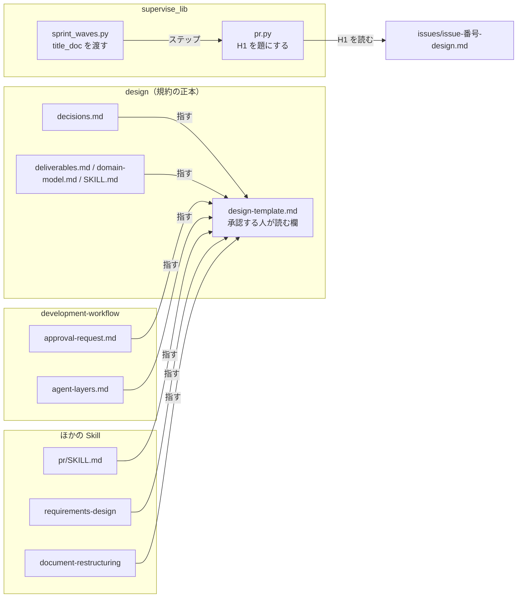
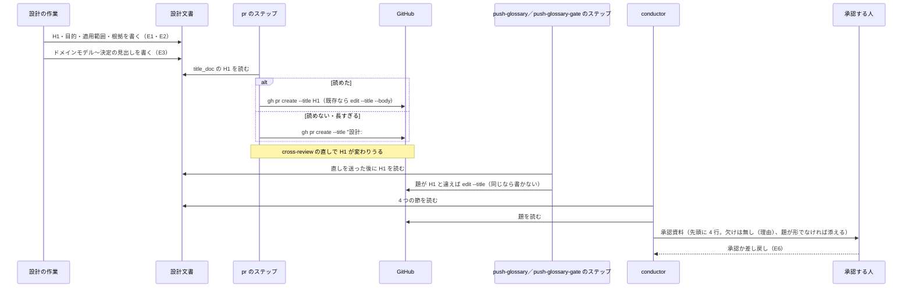

# 設計の承認: 設計 PR の題と承認資料から目的・用語・適用範囲・根拠が読めず承認ゲートで問い直しが続く → 題と承認資料の先頭でそろって読め、1 回で承認か差し戻しを決められる（#1289）

## 目的

- **何が壊れているか**: 承認ゲート 1 に届く設計 PR の題と設計文書の H1 が仕組みの語だけで書かれ、承認資料に目的・用語・適用範囲・あるべき姿の根拠の欄が無い
- **誰が困るか**: 承認する人。v10.15.0 では問いが 9 回になり（#772）、マイルストーン 13 では設計 PR 3 本が題から書き直しになった（#785）
- **直すと何が成り立つか**: 題と承認資料の先頭から「何が壊れていて、マージすると何が成り立つか」が読め、欠けた欄は「無し（理由）」で見える。承認する人は問い直さずに 1 回で決められる

## 適用範囲

- **働く範囲**: NDF を使うすべてのリポジトリ。変えるのは配布物（`plugins/ndf/skills/` の雛形と参照、`plugins/ndf/scripts/supervise_lib/` の pr のステップ）で、ai-plugins だけの形を埋め込まない
- **プロジェクトごとに違うもの**: 無し（設計文書の置き場 `issues/` は今の規約のまま。設定も引数も足さない）
- **当たるモード**: 設計 PR を出す `standard` と、設計 PR を出すときの `legacy-refactor`。`light` / `operation`（設計 PR を出さない）と `documentation` の企画承認、承認ゲート 2 は変えない

## あるべき姿の根拠

| 根拠 | 種類 | 何を示すか |
| --- | --- | --- |
| 「titleからして何を言ってるか分かりません。それぞれ目的を明らかにして全部書き直し」（2026-09-19、#785） | 利用者の指示の原文 | 題と最初の章に目的（問題と結果）を置く形 |
| #781 #782 #783 の書き直し後の題（3 本とも「問題 → 成り立つこと（#番号）」の形でマージ済み） | 実測（利用者が承認した実物） | 題の形がそのまま承認に通る |
| v10.15.0 の承認ゲート 1 の問い 9 回の内訳（用語・適用範囲・あるべき姿の根拠の 3 点。#772） | 実測 | 承認資料に足す欄の 3 つ |

要求と受け入れ条件は #1289 の本文にある（写しは [issue-1289-requirements.md](issue-1289-requirements.md)）。この文書は「どう作るか」だけを扱う。この文書自身が、ここで定める題・目的・適用範囲・あるべき姿の根拠の形に従っている。

## ドメインモデル

### コンテキスト

| コンテキスト | 何の語が 1 つの意味に決まるか |
| --- | --- |
| 設計の承認（承認ゲート 1） | 題・目的・適用範囲・あるべき姿の根拠・承認資料・承認する人が読む欄 |

コンテキストは 1 つで、マップの関係は持たない。スプリントのプラン（`supervise.py`）は同じコンテキストの中で題を作る側として振る舞う。

### 集約

| 集約 | 持ち主（書き換えてよいもの） | 根 | エンティティ | 値オブジェクト |
| --- | --- | --- | --- | --- |
| 設計文書 | 設計の作業（`design` の手順 2・3） | 頭のファイル `issues/issue-<番号>-design.md` | 節（目的・適用範囲・あるべき姿の根拠・ドメインモデル・決定の記録 ほか） | H1、決定の見出し、用語の行 |
| 設計 PR | pr のステップと、`PUSH_DESIGN` を打つ 2 つのステップ（push-glossary と、pace: fast / auto で足す push-glossary-gate）（スプリント。どれも `pr.py` の同じ関数で題を書く）／`/ndf:pr` を呼ぶ者（単発） | Pull Request | 本文 | 題 |
| 承認資料 | conductor（承認ゲート 1 を組む者） | 承認資料 1 件 | 対象を開くもの・判断に使うもの | 4 行（目的・用語・適用範囲・あるべき姿の根拠）、「無し（理由）」、「題: 規約の形でない」 |
| 承認する人が読む欄の規約 | `design` の参照（`design-template.md`） | 「承認する人が読む欄」の節 | — | 題の形・目的の形・欄の形・決定の見出しの形・実例 |

### 不変条件

| # | 集約 | 条件 | 破れたときの扱い |
| --- | --- | --- | --- |
| I1 | 設計 PR | スプリントの設計 PR の題は、設計文書の頭のファイルの H1（`# ` を除いた文）と同じ文である | H1 を読めない・長すぎるときは `設計: #<番号>` で出し、PR の作成は止めない（I5） |
| I2 | 設計文書 | H1 の直後の章は「目的」で、管理上の注記（要求の置き場など）は「あるべき姿の根拠」の節より後にある | 承認資料の「目的」の行が「無し（理由）」になる。直すのは設計の作業 |
| I3 | 規約 | 題・目的・適用範囲・あるべき姿の根拠・用語の載せ方・決定の見出しの規約の本文は `design-template.md` の 1 か所にだけある | ほかのファイルが同じ規約の文を持てば、レビューで写しを消して節への 1 行に戻す |
| I4 | 承認資料 | 設計 PR の承認資料の「判断に使うもの」の先頭に 4 行が必ず出る。出所の節が無いか空なら「無し（理由）」 | 承認ゲートは止めない（前提 4） |
| I5 | 設計 PR | 題を作れないことで設計 PR の作成が失敗しない | — |
| I6 | 承認資料 | 承認ゲートの数・`AskUserQuestion` で止まる手段・MVV 判定の手順・`documentation` の企画承認・承認ゲート 2 の承認資料は変わらない | 変えた差分はこの課題の範囲外として戻す |

### ドメインイベント

| # | イベント | 発生元 | 受け手 |
| --- | --- | --- | --- |
| E1 | 設計文書の H1 と「目的」の章を書いた | 設計の作業 | pr のステップ（E4 で H1 を読む） |
| E2 | 「適用範囲」と「あるべき姿の根拠」の節を書いた | 設計の作業 | conductor（E5） |
| E3 | 決定の見出しを書いた | 設計の作業 | `pr-body-decisions.sh`（本文の「決めたこと」）・conductor（E5） |
| E4 | 設計 PR を出した（題は H1 と同じ文） | pr のステップ／`/ndf:pr` | conductor（E5） |
| E4b | レビューの直しを送った後に題を H1 へ合わせ直した（違うときだけ書き直す） | push-glossary のステップ／push-glossary-gate のステップ | conductor（E5） |
| E5 | 承認資料を組んだ（先頭に 4 行） | conductor | 承認する人（E6） |
| E6 | 承認する人が承認か差し戻しを決めた | 承認する人 | conductor（差し戻しなら設計の工程へ戻す。今と同じ） |

### 用語

| 用語 | 意味 | 用語集への反映 |
| --- | --- | --- |
| 適用範囲 | 設計した変更が働く範囲。このリポジトリだけか配布先でも働くか、プロジェクトごとに違うものを設定か引数のどちらで受けるか | 追加（要求の工程で反映済み） |
| あるべき姿の根拠 | 変更後の形が適切だと言える根拠。外部の一次情報・実測・利用者の指示の原文のどれかで、MVV の項目の番号とは別のもの | 追加（要求の工程で反映済み） |

## 機能一覧

| # | 機能 | 誰が使うか |
| --- | --- | --- |
| F1 | 設計文書の雛形が、題（H1）・目的・適用範囲・あるべき姿の根拠の欄と、その書き方の規約を 1 か所で持つ | 設計の作業（supervisor・worker・単発の利用者） |
| F2 | 決定の見出しを「何のために何を決めたか」と読める形で書く | 設計の作業 |
| F3 | スプリントの設計 PR の題を設計文書の H1 から作る（読めなければ `設計: #<番号>`） | pr のステップ |
| F4 | 承認資料の「判断に使うもの」の先頭に 4 行を出し、欠けは「無し（理由）」、題が規約の形でなければその旨を出す | conductor・承認する人 |
| F5 | 関係する Skill と起動の指示から、規約の節を 1 行で指す | conductor・supervisor・`/ndf:pr` を呼ぶ者 |

## 構成要素

| 要素 | 変更 | 責務 |
| --- | --- | --- |
| `plugins/ndf/skills/design/references/design-template.md` | 変更 | 雛形の H1 を題の形にし、H1 の直後に「目的」「適用範囲」「あるべき姿の根拠」の節を置き、管理上の注記をその後へ移す。雛形の外に「承認する人が読む欄」の節（規約の正本、60 行以内）を足す。「各節が実装計画のどこへつながるか」の表と「`legacy-refactor` の書き方」に新しい欄を足す |
| `plugins/ndf/skills/design/references/decisions.md` | 変更 | 見出しの形 `### 決定 N: {結論を 1 文で}` を、雛形の規約の節を指す形に変える（規約の文は写さない） |
| `plugins/ndf/skills/design/references/deliverables.md` | 変更 | 要否表に「承認する人が読む欄」の行を足す。ドメインモデルの「設計文書の先頭に置く」を「承認する人が読む欄の次に置く」に変える |
| `plugins/ndf/skills/design/references/domain-model.md` | 変更 | 冒頭の「設計文書の先頭に置く節」を、欄の次に置く節へ合わせる |
| `plugins/ndf/skills/design/SKILL.md` | 変更 | 手順 2 に「H1 と承認する人が読む欄を先に書き、続けてドメインモデルの節を書く」を足す（規約の節を指す 1 行） |
| `plugins/ndf/skills/development-workflow/references/approval-request.md` | 変更 | 「承認の判断に使うもの」の先頭に 4 行（出所は設計文書の該当の節）。設計 PR の承認ゲートの表に 4 行を足す。「無し（理由）」で出して止めないこと、題が規約の形でないとき「題: 規約の形でない」と出すことを書く |
| `plugins/ndf/skills/development-workflow/references/agent-layers.md` | 変更 | supervisor が守る規則に 13 番目（設計の工程は規約の節に従い、承認ゲートを返す前に欄を埋める）を足し、`prompt` の「守る規則 12 個」を 13 個にする |
| `plugins/ndf/skills/pr/SKILL.md` | 変更 | 「設計 Pull Request の本文」に、題は設計文書の H1 と同じ文にする 1 行（規約の節を指す） |
| `plugins/ndf/skills/requirements-design/SKILL.md` | 変更 | 「目的」の行に、設計文書の「目的」の章の出所になる 1 行（規約の節を指す） |
| `plugins/ndf/skills/document-restructuring/SKILL.md` | 変更 | 設計文書の H1 と H1 の直後の「目的」の章は動かさない 1 行（規約の節を指す） |
| `plugins/ndf/scripts/supervise_lib/pr.py` | 変更 | pr のステップの `title_doc` を読み、H1 を題にする。読めなければ今の `title` を使う。既存の PR では H1 を読めたときだけ題も書き直す。H1 を読む関数と題を合わせ直す関数（`sync-title` が呼ぶ）を同じ場所に置く（決定 9） |
| `plugins/ndf/scripts/supervise_lib/sprint_waves.py` | 変更 | 設計 PR のステップに `"title_doc": "issues/issue-<番号>-design.md"` を足す（`"title": "設計: #<番号>"` は代わりの題として残す）。`PUSH_DESIGN` を打つ 2 つのステップの `cmd` を、`PUSH_DESIGN` の後に `supervise.py sync-title --pr {pr} --doc issues/issue-<番号>-design.md` を続ける形にする。`plan_sprint_design` が push-glossary の `cmd` をこの形で組み、`plan_mvv_design` が足す push-glossary-gate は push-glossary の `cmd` をそのまま使う（`PUSH_DESIGN` を直に書かない）。`PUSH_DESIGN` の定数は設計 PR 以外の送りにも使うため変えない（決定 9） |
| `plugins/ndf/scripts/supervise.py` | 変更 | 冒頭のステップの説明（pr の行）に `title_doc` を足す。`sync-title` のサブコマンドを足す（`pr.py` の関数を呼ぶだけ） |
| `plugins/ndf/scripts/tests/`（pr のステップのテスト） | 新規か変更 | F3 の振る舞いと不変条件 I1・I5 を縛る |



`supervise.py` の説明の行とテストは、ほかの要素を説明・検証するだけなので図に含めない。

## 入出力の契約

### 設計文書の形（雛形の規約の節が定めるもの）

| 欄 | 形 | 無いときの書き方 |
| --- | --- | --- |
| 題（H1） | `# [<対象>: ]<今起きている問題（利用者が見る現象）> → <直した後に成り立つこと>（#<課題番号>[ #<番号>...]）`。対象は Skill 名か領域で省いてよい。仕組みの語は本文へ回す。1 行、`# ` を除いて 256 コードポイント以内（Python の `len()` で数える。バイト数では数えない） | 省けない（I1 の代わりの題になる） |
| 目的 | H1 の直後の章。何が壊れているか・誰が困るか・直すと何が成り立つかを 5 行以内 | `- 無し（<理由>）` |
| 適用範囲 | 働く範囲（このリポジトリだけか配布先でもか）、プロジェクトごとに違うものを設定と引数のどちらで受けるか、当たるモード | `- 無し（<理由>）` |
| あるべき姿の根拠 | 根拠ごとに 1 行。種類は外部の一次情報・実測・利用者の指示の原文のどれか | `- 無し（既存の形に揃える）` など理由つき |
| 管理上の注記 | 要求の置き場・分けた文書への参照。あるべき姿の根拠の節の後 | — |
| 用語 | ドメインモデルの「用語」の表のまま（場所を変えない）。承認資料へは反映が「追加」「意味の変更」の行を出す | 表が無い・該当の行が無い → 承認資料に「無し（<理由>）」 |
| 決定の見出し | `### 決定 N: <何のために>、<何を決めたか>`（例: `### 決定 1: 題の書き手を 1 つにするため、設計 PR の題を設計文書の H1 から作る`） | — |
| 頭のファイル名 | `issues/issue-<番号>-design.md`。分けたファイルは `issue-<番号>-design-<主題>.md` | — |

実例として、#781 #782 #783 の書き直し後の題（「あるべき姿の根拠」の表の 2 行目）を規約の節へそのまま写す。

### pr のステップの `title_doc`（プランの JSON の約束）

| キー | 型 | 意味 |
| --- | --- | --- |
| `title_doc` | 文字列（作業ディレクトリからの相対パス） | 題を読む設計文書。省けば今の振る舞いのまま |
| `title` | 文字列 | `title_doc` から題を読めないときの題（今と同じ） |

| 状況 | 題 | 既存の PR があるとき |
| --- | --- | --- |
| `title_doc` があり、囲み（```）の外の最初の `# ` の行が空でなく、`# ` を除き前後の空白を落とした文が 256 コードポイント以内（`len()`） | その行から `# ` を除き前後の空白を落とした文 | 本文と一緒に題も書き直す |
| ファイルが無い・読めない・H1 が無い・空・256 コードポイントを超える | `title`（無ければ今と同じくコミットの件名） | 題は書き直さない（人が付けた題を代わりの題で上書きしない） |

### `supervise.py sync-title`（レビューの後に題を合わせ直す）

| 引数 | 型 | 意味 |
| --- | --- | --- |
| `--pr` | 数 | 題を合わせる PR |
| `--doc` | 文字列（作業ディレクトリからの相対パス） | 題を読む設計文書（`title_doc` と同じ） |

| 条件 | 振る舞い | 終了コード |
| --- | --- | --- |
| H1 を読めて（上の表の 1 行目と同じ条件）、今の題と違う | `gh pr edit --title <H1>` で書き直す | 0 |
| H1 を読めて、今の題と同じ | 書き込まない | 0 |
| H1 を読めない・256 コードポイントを超える | 書き込まない（人が付けた題を代わりの題で上書きしない） | 0 |
| `gh` の照会か書き込みが失敗した | 書き込まず、失敗を標準エラーへ出す。承認資料の「題: 規約の形でない」で見える | 0（承認ゲートを止めない。I5） |

### 承認資料（設計 Pull Request のマージ）

「承認の判断に使うもの」の先頭に、今の 7 行より前に次の 4 行を置く。

| 項目 | 何を書くか | 出所 |
| --- | --- | --- |
| 目的 | 目的の章を 3 行以内 | 設計文書の「目的」 |
| 用語 | 反映が「追加」「意味の変更」の語と意味 | 設計文書のドメインモデルの「用語」 |
| 適用範囲 | 節をそのまま | 設計文書の「適用範囲」 |
| あるべき姿の根拠 | 根拠の行をそのまま | 設計文書の「あるべき姿の根拠」 |

- 節が無いか空なら、その行を「無し（<理由>）」と出して承認ゲートは止めない（I4）
- 「対象を開くもの」のタイトルが題の形（`→` と末尾の課題番号の括弧）でなければ、「題: 規約の形でない」と添える
- `documentation` の企画承認と承認ゲート 2 の表は変えない（I6）

## 処理の流れ



単発（`/ndf:pr`）では、呼ぶ者が `pr/SKILL.md` の 1 行に従って H1 を `--title` に渡す。機械は介さない。

## 非機能の実現方式

| 大項目 | 実現方式 |
| --- | --- |
| 運用・保守性 | 規約の本文を `design-template.md` の「承認する人が読む欄」の節だけに置き、ほかの 9 ファイル（`decisions.md`・`deliverables.md`・`domain-model.md`・`design/SKILL.md`・`approval-request.md`・`agent-layers.md`・`pr/SKILL.md`・`requirements-design/SKILL.md`・`document-restructuring/SKILL.md`）は節へのリンクを含む 1〜2 行だけを持つ（I3） |
| 性能・拡張性 | 規約の節は 60 行以内。雛形の中の増分は節の見出しと注記の 10 行前後。承認資料に足す行は 4 行。pr のステップが読むのは 1 ファイルだけで、GitHub への呼び出しは増やさない（既存の `edit` に `--title` を足すだけ）。push-glossary のステップ（pace: fast / auto で用語の当たりが残ったときは push-glossary-gate のステップ。1 本の実行で通るのはどちらか 1 つ）は設計 PR 1 本につき題の照会を 1 回足し、書き込みは題が H1 と違うときだけ 1 回足す（ステップの数は増やさない） |

## 決定の記録

### 決定 1: 題の書き手を 1 つにするため、スプリントの設計 PR の題は pr のステップが PR を出す時点で設計文書の H1 から読む

`sprint_waves.py` がプランを作る時点では設計文書がまだ無く、H1 を読めない。PR を出す時点なら設計の作業が H1 を書き終えており、題と H1 が同じ文になる（I1）。LLM に題を別に書かせる案は、書き手が 2 つになって題と H1 が食い違うため採らない。プランの時点で `設計: #<番号>` を付けておき後から書き直す専用のステップを足す案は、ステップと GitHub への書き込みが 1 つずつ増えるため採らない。

根拠: Value 4 / Value 6（MVV 版 2）

### 決定 2: 題を読む文書を探さずに済むよう、設計文書の頭のファイル名を `issues/issue-<番号>-design.md` に固定する

直近の設計文書（#1287〜#1370）は頭のファイルをすべてこの名前で書いており、規約にするのは今の形の追認である。差分の中から `## 決定の記録` を持つ文書を探す案は、決定の節を `-decisions.md` へ分けた文書で頭のファイルを取り違えるため採らない。名前が違うときは代わりの題で出し、承認資料の「題: 規約の形でない」で見える（I5）。

根拠: Value 4 / Value 5（MVV 版 2）

### 決定 3: 承認する人が最初に目的を読めるよう、H1 → 目的 → 適用範囲 → あるべき姿の根拠 → 管理上の注記 → ドメインモデルの順に置く

承認する人が問うのは「何が壊れていて何が成り立つか」であり、ドメインモデルは仕組みの語で書かれる。今の「ドメインモデルを先頭に置く」は機能一覧より先にモデルを決めるための規約で、欄の次に置いてもその目的は保たれる。欄を文書の末尾に置く案は、承認資料を組む側と承認する人の両方が最後まで読むことになるため採らない。

根拠: Vision / Value 2（MVV 版 2）

### 決定 4: 規約の本文を 1 か所に保つため、雛形のコードブロックの外に「承認する人が読む欄」の節を置き、雛形の中は欄の見出しと節へのリンクだけにする

雛形のコードブロックは設計文書ごとに写されるため、規約の文を中に置くと設計文書の数だけ写しが増える。既にある「設計の結果の書き方」と同じく、雛形の外の節が正本になる。`markdown-writing` に置く案は、前提 1 が置き場を `design-template.md` に定めており、#873 がその本文を縮める予定とも重なるため採らない。

根拠: Value 7（MVV 版 2）

### 決定 5: 承認ゲートを止めないため、欠けた欄は承認資料に「無し（理由）」と出し、差し戻すかは承認する人が決める

欄の充足を承認ゲートの手前で機械が止めると、人の手が承認ゲートの外で止まる。用語を確定するために設計より前に人へ問う案も、問いの回数を増やすため採らない（前提 5）。欠けが見えれば、承認する人は問い直さずに差し戻しを選べる。

根拠: Value 2 / Vision（MVV 版 2）

### 決定 6: 書き直した H1 を題へ反映するため、既存の PR では H1 を読めたときだけ題も書き直す

レビューで H1 を直した後に pr のステップを打ち直すと（再開を含む）、本文だけを書き直す今の形では題が古いまま残る。読めないときにも題を書き直す案は、人が付けた題を `設計: #<番号>` で上書きするため採らない。題を書き直さない案は I1 を保てないため採らない。

根拠: Value 4（MVV 版 2）

### 決定 7: PR の作成を題で失敗させないため、256 コードポイントを超える H1 は題に使わず代わりの題で出す

GitHub の題には長さの上限があり、超えると `gh pr create` が失敗して設計の工程が止まる。題を切り詰める案は、問題と成り立つことのどちらかが欠けた題が規約の形に見えて出るため採らない。代わりの題なら承認資料で「題: 規約の形でない」と見える。

題の長さはコードポイントで数える（Python の `len()`）。日本語の題が既定のこのリポジトリでは、バイトで数えると 86 文字前後の H1 でも代わりの題へ落ち、直そうとしている現象（題が `設計: #<番号>` になる）が残るためである。

根拠: Value 1（MVV 版 2）

### 決定 8: 設計 PR を出す `legacy-refactor` でも承認する人が読む欄を書く

承認ゲート 1 はモードによらず同じ承認資料を組むため、欄が無いと `legacy-refactor` の設計 PR だけ 4 行が「無し」になる。今このモードの雛形は 3 節に限っているため、設計 PR を出すときだけ欄を足すと「`legacy-refactor` の書き方」に書き、要否表では「該当時」にする。`light` / `operation` は設計 PR を出さず承認資料も組まないため、欄を求めない。

根拠: Vision / Value 5（MVV 版 2）

### 決定 9: レビューの直しで変わった H1 を承認ゲート 1 の前に題へ反映するため、設計を送る 2 つのステップ（push-glossary と push-glossary-gate）で題を合わせ直す

スプリントの設計のプランは pr → sync-body → review（cross-review）→ sync-review → glossary-check → push-glossary → gate と進み、review より後に pr のステップは無い。レビューの指摘で H1 を直すと、決定 6 だけでは題が古い H1 のまま承認ゲート 1 に届き、I1 が通常の経路で破れる。pace: normal ではプランは glossary-check の成否によらず push-glossary を通って gate へ進む。pace: fast / auto（`plan_mvv_design`）では、glossary-recheck に当たりが残ると push-glossary を通らず push-glossary-gate → gate へ進み、当たりが無ければ push-glossary → mvv へ進む。どの経路でも承認ゲート 1（gate か mvv の判定）の前に、`PUSH_DESIGN` を打つ 2 つのステップのどちらか 1 つを必ず通り、そこはレビューの直しと用語の直しの両方を送った後の head を持つ。そのため 2 つのステップの両方で題を合わせ直す。push-glossary-gate は push-glossary の `cmd` をそのまま使い、片方だけに同期が付く食い違いを作らない。`PUSH_DESIGN` の定数に同期を含める案は、設計 PR 以外の送りでも題を書き換える経路を作るため採らない。題を書く関数は pr のステップと同じ `pr.py` の関数で、書き手の規則は 1 つのまま（決定 1）。承認資料に「題と H1 が違う」と添えるだけの案は、I1 を破ったまま承認する人に直させるため採らない。専用のステップを足す案は、プランのステップが 1 つ増え、push-glossary と同じ head を待つだけになるため採らない。

根拠: Value 2 / Value 4 / Value 6（MVV 版 2）

## テスト設計

文面の規約は `.md` の文言を照合するテストで縛らない（`AGENTS.md` の DON'T）。振る舞いが変わる pr のステップだけをテストで縛り、文面の条件は実装の検証とレビューで確かめる。

| 受け入れ条件・不変条件 | どの振る舞いで縛るか | どう壊したら落ちるべきか |
| --- | --- | --- |
| AC9・I1 | `title_doc` の H1 が 1 行目にある設計文書で pr のステップを打つと、その文で PR を作る | H1 を読まずに `title` を使うように壊すと落ちる |
| AC9・I1 | 囲み（```）の中の `# ` の行は題にならず、囲みの外の最初の H1 が題になる | 囲みを数えずに最初の `# ` の行を採るように壊すと落ちる |
| AC9・I5 | ファイルが無い・H1 が無い・256 コードポイントを超えるとき（境界: 日本語の 256 コードポイントの H1 は題になり、257 は代わりの題になる）、`設計: #<番号>` で PR を作り、ステップは成功する | 代わりの題へ戻らず例外か空の題になるように壊すと落ちる |
| I1（決定 6） | 既存の PR があり H1 を読めたとき、本文と一緒に題も書き直す。読めないときは題を書き直さない | 題を常に書き直す・一度も書き直さない、のどちらに壊しても落ちる |
| I1（決定 9） | 既存の PR の題と違う H1 の設計文書で `sync-title` を打つと題を H1 に書き直し、同じなら書き込まず、H1 を読めないときは書き込まない。どれも 0 で終わる | 書き直さない・常に書き直す・読めないときに代わりの題で上書きする・失敗で非 0 を返す、のどれに壊しても落ちる |
| I1（決定 9） | スプリントの設計のプランの push-glossary のステップの `cmd` が、送った後に `sync-title --pr {pr} --doc issues/issue-<番号>-design.md` を打つ | `sync-title` を落とすか番号を取り違えると落ちる |
| I1（決定 9） | pace: fast / auto の設計のプラン（`plan_mvv_design`）の push-glossary-gate と push-glossary の両方の `cmd` が、送った後に `sync-title --pr {pr} --doc issues/issue-<番号>-design.md` を打つ（glossary-recheck の `on_fail` が push-glossary-gate を指し、その `next` が gate のまま） | push-glossary-gate に `PUSH_DESIGN` だけを書くか、どちらかの `sync-title` を落とすと落ちる |
| AC9 | スプリントの設計のプランの pr のステップが `title_doc` に `issues/issue-<番号>-design.md`、`title` に `設計: #<番号>` を持つ | `title_doc` を落とすか番号を取り違えると落ちる |
| AC1〜AC4・AC11・I2 | 雛形の H1・目的・欄・決定の見出し・実例を、実装の後に雛形で読んで確かめる（手動） | — |
| AC5・I3 | 規約の文が雛形の節にだけあることを、9 ファイルの差分を読んで確かめる（手動） | — |
| AC6〜AC8・I4 | 承認資料の 4 行・「無し（理由）」・「題: 規約の形でない」を、差分を読んで確かめる（手動） | — |
| AC10 | `agent-layers.md` の規則 13 と「13 個」を確かめる（手動） | — |
| AC12 | `python3 plugins/ndf/scripts/glossary.py check --file issues/issue-1289-design.md` が当たり 0 件 | — |
| AC13・I6 | 差分に `documentation` の企画承認・承認ゲート 2・止まる手段・MVV 判定の行の変更が無いことを確かめる（手動） | — |
| AC14 | `pytest`・`check-skill-frontmatter.py`・`instructions-check.py`・`claude plugin validate .` が 0 で終わる | — |

## 設計の結果

| 課題 | 扱い | 取り込み先 | 触るファイル |
| --- | --- | --- | --- |
| #1289 | 実装する | — | `plugins/ndf/skills/design/`、`plugins/ndf/skills/development-workflow/references/approval-request.md`、`plugins/ndf/skills/development-workflow/references/agent-layers.md`、`plugins/ndf/skills/pr/SKILL.md`、`plugins/ndf/skills/requirements-design/SKILL.md`、`plugins/ndf/skills/document-restructuring/SKILL.md`、`plugins/ndf/scripts/supervise_lib/pr.py`、`plugins/ndf/scripts/supervise_lib/sprint_waves.py`、`plugins/ndf/scripts/supervise.py`、`plugins/ndf/scripts/tests/` |

## 未確認のまま残ること

| 項目 | 内容 |
| --- | --- |
| GitHub の題の長さの上限 | 256 コードポイントとしたが実測していない。実装で `gh` の失敗の出力を確かめ、違えば決定 7 の値を直す（書き込みを伴うため、確かめ方は実装で決める） |
| 単発の設計 PR の題 | `/ndf:pr` を呼ぶ者が `pr/SKILL.md` の 1 行に従うかは機械で確かめない。題と章の形の検査は #873 が持つ（前提 7） |
| 頭のファイル名の固定に外れる既存の命名 | `issue-821-wait-notify-design.md` のような名前は既存の文書だけで、書き直さない（前提 8）。今後の設計で外れたときは代わりの題で出る |
| リリース後の確かめ | 次の承認ゲート 1 で、承認資料の先頭に 4 行が出て題が規約の形になっているかを承認する人が見る（要求の手動確認） |
