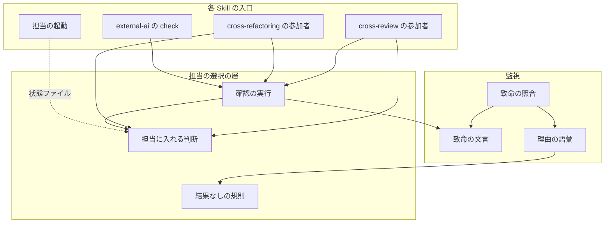
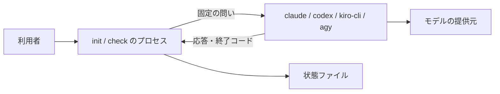
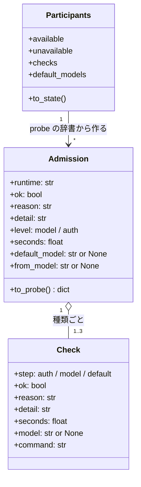
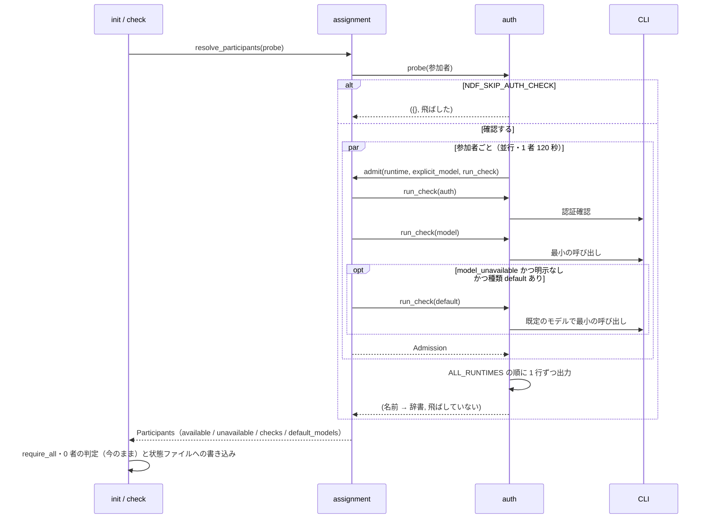
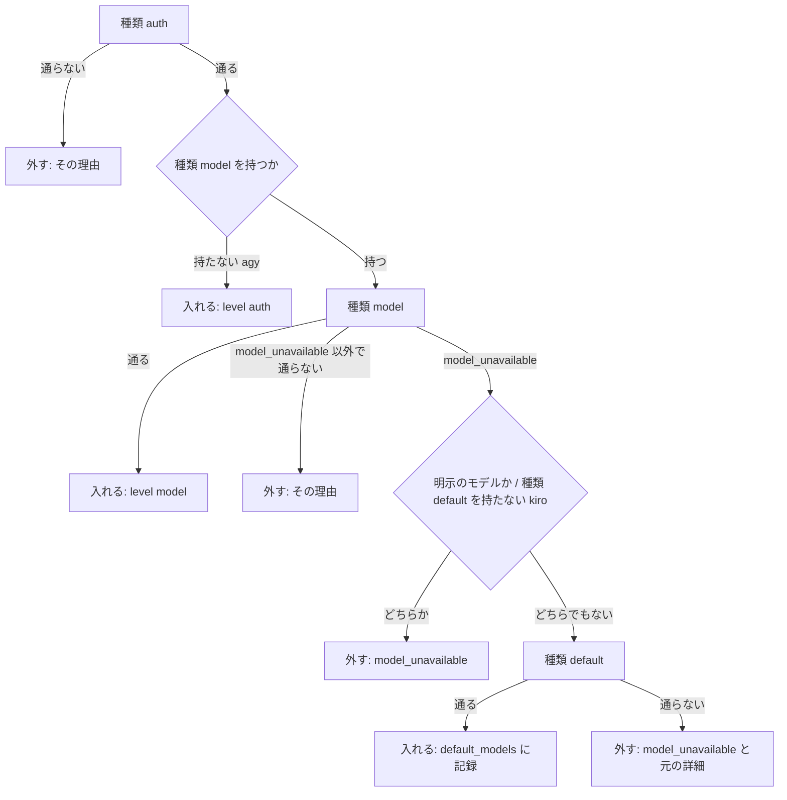
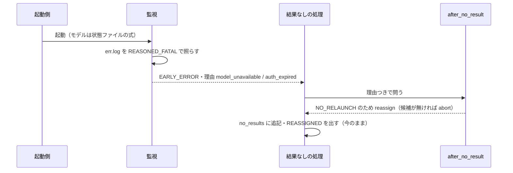

# cross-review / cross-refactoring: 認証だけを確かめた CLI がモデルを引けず・認証が失効していて結果を残さずにラウンドを潰す → 起動の前にモデルを 1 回引いて外すか既定のモデルへ切り替え、途中で起きても起動し直さずに振り替える（#1290 #461 #1589）

## 目的

- **何が壊れているか**: `init` と `external-ai.py check` の確認（`lib/auth.py` の `probe_auth`）は認証だけを見る。設定のモデルを引けない CLI と更新トークンが失効した CLI も `✅` で担当に入り、結果を残さずに終わる。その文言は監視の致命の語彙に無く `missing` に畳まれ、同じ担当で起動し直してもう 1 回分を失う
- **誰が困るか**: cross-review / cross-refactoring の利用者。ラウンドの指摘が 0 件になり `final = error` で止まり、原因は `err.log` を開くまで分からない（#461 の 5 件、#1589 の 1 件の観測）
- **直すと何が成り立つか**: 確認を通った CLI は実際にモデルを 1 回引ける。設定のモデルを引けないだけなら既定のモデルで担当に入る。確認の後に同じ形が起きても、監視が理由を付けて止め、起動し直さずに別の担当へ振り替わる

## 適用範囲

- **働く範囲**: 配布先のリポジトリでも働く（cross-review / cross-refactoring / external-ai の `check` を使うすべてのリポジトリ）
- **プロジェクトごとに違うもの**: 無し。CLI ごとの確認のコマンドは NDF が持つ定数で、利用者が変えるのは引数（`--model` / `--include` / `--exclude`）と環境変数 `NDF_SKIP_AUTH_CHECK` だけである
- **当たるモード**: `standard`

## あるべき姿の根拠

| 根拠 | 種類 | 何を示すか |
| --- | --- | --- |
| #461 のコメント（2026-09-07）「こうした場合は default モデルを選択するようにすること」 | 利用者の指示の原文 | 設定のモデルを引けないときは既定のモデルへ切り替える |
| #1589 の利用者の要求（2026-10-01）「設定のモデルが引けないときは、その CLI の既定のモデルが選ばれるべきである」 | 利用者の指示の原文 | 同上。原因が CLI の版の古さでも同じ扱いにする |
| #461 の観測（PR #460・#661・#665・#666・#812） | 実測 | 認証確認が通った後に 404 と更新トークンの失効で結果なしになり、起動し直しも同じ結果になる |
| 2026-10-06 の実測（`issue-1290-design-contracts.md` の「最小の呼び出しのコマンド」の表） | 実測 | 最小の呼び出しは 1 者 4〜7 秒、claude で約 0.02 米ドル。既定のモデルは codex が `--ignore-user-config`、claude が `--model default` で引ける。kiro-cli 2.24.1 は `--model` を受けず警告だけ出す |
| 2026-10-06 の照合の試行（#461 と #1589 の実物の行を `monitor_scan._scan_patterns` に通した） | 実測 | 行頭から文言までを 1 つの一致にすれば、JSON の中の文言も引用の除外に掛からずに当たり、差分と Markdown の行は除外される |

要求と受け入れ条件は #1290 の本文にある（コピーは `issues/issue-1290-requirements.md`）。この文書は「どう作るか」だけを扱う。

## ドメインモデル

### コンテキスト

| コンテキスト | 何の語が 1 つの意味に決まるか |
| --- | --- |
| NDF の外部 CLI 委譲（`ndf-agent-cli`） | 参加者・利用可能な参加者・参加の確認・担当・起動結果の理由・結果なし・振り替え |

1 つのコンテキストに収まる。cross-review と cross-refactoring は、このコンテキストの語をそのまま使う（今の関係のまま）。

### 集約

| 集約 | 持ち主（書き換えてよいもの） | 根 | エンティティ | 値オブジェクト |
| --- | --- | --- | --- | --- |
| 参加者の記録（状態ファイルの `participants`） | `assignment.resolve_participants`（Skill の `init` と、参加者の引数を渡した再開が呼ぶ） | 参加者の記録 | — | 参加の確認の結果（ランタイムごと）・既定のモデルへの切り替え |
| 起動結果（`<stem>-monitor.json`） | `monitor.py`（理由の語彙は `monitor_outcome.REASONS`） | 起動結果 | — | 理由 |
| 結果なしの記録（`no_results`） | 各 Skill の結果なしの処理（答えは `assignment.after_no_result` が決める。今のまま） | 結果なしの記録 | 1 件の記録 | 規則の答え |

参加の確認の結果は参加者の記録の中だけに置き、起動結果と結果なしの記録はランタイムの名前で参照する。

### 不変条件

| # | 集約 | 条件 | 破れたときの扱い |
| --- | --- | --- | --- |
| I1 | 参加者の記録 | `available` と `unavailable` は参加者を過不足なく分ける（重ならず、和が参加者） | `resolve_participants` の中の誤りとして落ちる（テストで縛る） |
| I2 | 参加者の記録 | 確認を飛ばしたときを除き、`available` の者は認証確認を通り、モデルの確認を持つ CLI ならモデルの確認も通っている | 通らない者は理由つきで `unavailable` に入る |
| I3 | 参加者の記録 | `default_models` のランタイムは引数でモデルを明示されていない（`models` に無い） | 明示のモデルを引けなければ切り替えずに `model_unavailable` で外す |
| I4 | 参加者の記録 | `default_models` のランタイムは `available` にいる | 既定のモデルでも引けなければ記録しない |
| I5 | 参加者の記録 | 認証確認を通らなかった者には最小の呼び出しを走らせない | — |
| I6 | 参加者の記録 | 確認は利用者の CLI の設定ファイルを書き換えない | 設定を変える引数を渡さず、書くのは一時ディレクトリだけにする |
| I7 | 参加者の記録 | `NDF_SKIP_AUTH_CHECK` が立てば確認のコマンドを 1 回も走らせない | — |
| I8 | 起動結果 | 同じ文言は、確認と監視で同じ理由（`model_unavailable` / `auth_expired`）に分類される | 照合の表を `monitor_patterns.py` の 1 つにする |
| I9 | 結果なしの記録 | 理由が `usage_limit` / `model_unavailable` / `auth_expired` の結果なしは `relaunch` にならない | `NO_RELAUNCH_REASONS` の 1 か所で決める |

### ドメインイベント

番号は要求のドメインイベントを引き継ぐ。

| # | イベント | 発生元 | 受け手 |
| --- | --- | --- | --- |
| E1 | 参加者を解決した | `assignment.resolve_participants` | 参加の確認（`auth.probe_auth`） |
| E2 | 参加者ごとに認証を確かめた | `auth.run_check`（種類 `auth`） | `assignment.admit` |
| E3 | 参加者ごとにモデルを 1 回引いた | `auth.run_check`（種類 `model`） | `assignment.admit` |
| E4 | 既定のモデルで引き直した | `auth.run_check`（種類 `default`） | `assignment.admit` |
| E5 | 利用可能な参加者と使えない者を記録した | `assignment.resolve_participants` | 状態ファイル・`init` の出力 |
| E6 | 席・実装担当を選んだ | `review_seats` / `choose_implementer`（今のまま） | 起動側 |
| E7 | 担当を起動した | `launch-reviewer.sh` / `critique.sh` / cross-refactoring の `launch-cli.sh` | 監視 |
| E8 | 監視が理由を付けて止めた | `monitor_scan._early_error` | 起動結果 |
| E9 | 結果なしの規則が振り替え先を決めた | `assignment.after_no_result`（今のまま） | 各 Skill の結果なしの処理 |
| E10 | 振り替えの事実と理由を残した | 各 Skill の結果なしの処理（今のまま） | 状態ファイルの `no_results`・出力の `REASSIGNED` |

### 用語

| 用語 | 意味 | 用語集への反映 |
| --- | --- | --- |
| 参加の確認 | 参加者ごとに、認証確認・最小の呼び出し・（設定のモデルを引けなければ）既定のモデルでの引き直しを順に行い、担当に入れるかと理由を決めること（`auth.probe_auth` が走らせ、`assignment.admit` が判断する） | 追加 |
| 利用可能な参加者 | 参加者のうち参加の確認を通った者（`participants.available`） | 意味の変更 |
| 認証確認 | 参加の確認の最初の種類。確認コマンド（`AUTH_PROBES`）を走らせ、認証を通っているかだけを見る | 意味の変更 |
| モデルを引けない | 担当の CLI が、指定か設定のモデルを使えないと返したこと（理由 `model_unavailable`） | 追加 |
| 認証の失効 | 認証の状態確認は通るが、更新トークンの失効などで実行のときに認証を作り直せないこと（理由 `auth_expired`） | 追加 |
| 既定のモデルへの切り替え | 引数で明示していないモデルを引けない CLI を、既定のモデルで担当に入れること（`participants.default_models`） | 追加 |

## 機能一覧

| # | 機能 | 誰が使うか |
| --- | --- | --- |
| F1 | 参加の確認で、モデルを引けない CLI と認証が失効した CLI を担当から外し、理由を 1 行で出す | cross-review / cross-refactoring の利用者 |
| F2 | 設定のモデルを引けない CLI を、既定のモデルで担当に入れ、そのことを出力と状態ファイルに残す | 同上 |
| F3 | `external-ai.py check` が F1 と同じ確認と理由を返す | external-ai の利用者・conductor |
| F4 | 実行の途中で同じ 2 つの形が出たら、監視が理由を付けて止め、起動し直さずに振り替える | cross-review / cross-refactoring の利用者 |
| F5 | 参加者ごとの確認の秒数を出力と状態ファイルに残す | 利用者・振り返り |

## 構成要素

| 要素 | 責務 |
| --- | --- |
| 確認の実行（`lib/auth.py`） | CLI ごとの確認のコマンドの表（認証・最小の呼び出し・既定のモデル）、1 回の確認の実行と分類（`run_check`）、参加者ごとの並行の実行と 1 行の出力（`probe_auth`）、未認証の文言と、kiro のモデルを受けない警告の定数 |
| 担当に入れる判断（`lib/assignment.py`） | 1 者の確認の進め方と合否・既定のモデルへ切り替えるか（`admit`）、確認の結果から `available` / `unavailable` / `checks` / `default_models` を作ること（`resolve_participants`）、起動し直さない理由の集合（`NO_RELAUNCH_REASONS`） |
| 致命の文言（`lib/monitor_patterns.py`） | `MODEL_UNAVAILABLE_FATAL` / `AUTH_EXPIRED_FATAL` / claude の標準出力の 404 を足し、理由つきの致命の表（`REASONED_FATAL`）に利用上限と並べる |
| 致命の照合（`lib/monitor_scan.py`） | 理由つきの致命の表を上から照らし、最初に当たった理由を付ける（今の `_scan_usage_limit` を表の照合へ広げる） |
| 理由の語彙（`lib/monitor_outcome.py`） | `REASONS` と `_MONITOR_DECIDED_REASONS` に `model_unavailable` / `auth_expired` を足す |
| cross-review の参加者（`review_lib/participants.py`） | 確認に引数を渡すだけにする（判断を持たない） |
| cross-refactoring の参加者（`refactor_lib/commands/setup.py`） | 確認に `--model` の指定を渡すだけにする |
| external-ai（`external-ai.py`） | `check` は参加の確認のすべての種類、`run` は認証確認だけを通す。監視の理由 `auth_expired` を `outcome` の `auth` へ写す |
| 担当の起動（cross-review の `launch-reviewer.sh` / `critique.sh`、cross-refactoring の `launch-cli.sh`） | 起動のモデルを「引数の明示 → 既定のモデルへの切り替え → 空」の 1 つの式で状態ファイルから読む |



### 文脈と配置

外部の系は 4 つの CLI（claude / codex / kiro-cli / agy）と、その先のモデルの提供元である。どちらもこの変更で変えられない。確認は `init` のプロセスの中から CLI を子プロセスとして起動し、境界をまたぐのは固定の問い（「OK とだけ返す」）と、CLI が返す標準出力・標準エラー・終了コードだけである。環境変数は今の確認と同じく親から継承し、NDF はトークンを読まない。



### 置き場所

```text
plugins/ndf/scripts/lib/
├── auth.py              # 変更: 確認の種類の表・run_check・並行の probe_auth
├── assignment.py        # 変更: admit・resolve_participants・NO_RELAUNCH_REASONS
├── monitor_patterns.py  # 変更: 2 つの致命の表と REASONED_FATAL
├── monitor_scan.py      # 変更: 理由つきの致命の表を照らす
└── monitor_outcome.py   # 変更: REASONS に 2 語
plugins/ndf/skills/
├── cross-review/scripts/{review_lib/participants.py, launch-reviewer.sh, critique.sh}
├── cross-refactoring/scripts/{refactor_lib/commands/setup.py, launch-cli.sh}
└── external-ai/scripts/external-ai.py
scripts/script-structure-allow/  # 追加: assignment.py の行数の例外（決定 12）
```

## 構造



- `Check` は `auth.py` に置き、1 回の確認の結果だけを持つ。`Admission` は `assignment.py` に置き、1 者の合否を持つ
- **`auth.probe_auth` の返り値は今と同じく「名前 → 辞書」である。** 辞書は今の 3 キー（`command` / `ok` / `detail`）に `reason` / `level` / `seconds` / `default_model` / `from_model` を足す（`Admission.to_probe()`）。cross-refactoring のテストは `assignment.py` を別の名前で読み込むため、型の同一性に頼らない
- 依存の向きは `auth.py` → `assignment.py`（`admit` を呼ぶ）と `auth.py` → `monitor_patterns.py`。`assignment.py` は `auth.py` を読まない

## データ構造

状態ファイルの `participants` に 2 つの欄を足し、1 つの欄の値の形を広げる。既存の状態ファイルは欄が無いものとして読める（移行は不要）。

| 欄 | 型 | 空の扱い | 意味 |
| --- | --- | --- | --- |
| `unavailable`（今の欄） | 名前 → 文字列 | 空の辞書は「外した者がいない」 | 値を `<理由>: <詳細>` の形にする（例 `model_unavailable: ERROR: unexpected status 404 ...`）。型は文字列のまま |
| `checks`（足す） | 名前 → `{result, level, seconds, model, from_model}` | 欄が無いのは「この版より前の記録」。確認を飛ばした実行は空の辞書 | `result` は `ok` か理由の語（下の表）、`level` は通った確認の種類（`model` / `auth`）、`seconds` は 1 者の所要、`model` は応答したモデルの名前（読めた場合）、`from_model` は引けなかった元のモデルの名前（読めた場合） |
| `default_models`（足す） | ランタイム → モデルの名前 | 空の辞書は「切り替えた者がいない」 | 既定のモデルへの切り替えの起動の引数（codex は見出しの名前、claude は `default`） |

参加の確認の理由の語（`checks[].result`）:

| 語 | いつ |
| --- | --- |
| `ok` | 通った（確認の途中の利用上限も通す。決定 6） |
| `unauthenticated` | 認証確認が通らない |
| `auth_expired` | 認証確認は通るが、最小の呼び出しが認証の失効の文言を返した |
| `model_unavailable` | 最小の呼び出しがモデルを引けない文言を返した（既定のモデルでも引けない場合を含む） |
| `timeout` | 1 者の持ち時間（120 秒）を使い切った |
| `missing_cli` | コマンドが無いか実行できない |
| `probe_failed` | 上のどれにも当たらない失敗（終了コードが 0 でない、kiro で応答が空） |

**時系列は上書きでよい。** 参加者の記録は今も再開で作り直すたびに上書きし、前の値は `resume_changes` に `from` / `to` で残る。足す欄も同じ扱いで過去を失わない。

| 機能 | 参加者の記録 | 起動結果 | 結果なしの記録 |
| --- | --- | --- | --- |
| F1・F2・F5 確認 | C / U（再開） | — | — |
| F3 check | — | — | — |
| F4 途中の失敗 | R（起動のモデル） | C | C |

## 入出力の契約

最小の呼び出しのコマンドと実測・分類の順序・致命の文言・`init` / `check` の出力・呼び出しの形は [issue-1290-design-contracts.md](issue-1290-design-contracts.md) にある。

## 処理の流れ

### 参加の確認（`init` / `check`）



### 1 者の判断（`assignment.admit`）



- 種類 `default` が通らないときの理由は、種類 `model` の理由（`model_unavailable`）と詳細を残す。利用者が直す対象は設定のモデルだからである
- 1 者の持ち時間は 3 種類の確認で共有し、各確認のコマンドへ残りの秒数を時間切れとして渡す

### 実行の途中の失敗（F4）



監視の照合は、生きている間もプロセスが終わった後も、終わりの判定（`_process_exit_outcome`）より先に走る（`monitor_loop.py` の今の順序）。CLI が 15 秒で終わっても、結果なしの `missing` ではなく理由つきの `EARLY_ERROR` になる。

## 非機能の実現方式

| 大項目 | 要求の条件 | 実現方式 | 確かめ方 |
| --- | --- | --- | --- |
| 可用性 | 確認を通った CLI がモデルを引けずに落ちて 1 ラウンドを失う事象が、`init` で外れるか、起動し直し無しの振り替えで続くかのどちらかになり、状態ファイルの手編集が要らない | 確認に最小の呼び出しを足し（F1・F2）、途中の同じ形は理由つきで止めて `NO_RELAUNCH_REASONS` で振り替える（F4） | AC1・AC2・AC11・AC12 の結合テスト |
| 性能・拡張性 | `init` の確認にかかる時間を、参加者ごとの秒数として出力か状態ファイルに残す。参加者ごとに並行に走らせ、全体の時間は最も遅い 1 者の秒数 + 数秒に収まる。実装の Pull Request で 3 者の実測の秒数を示す | `probe_auth` が参加者ごとにスレッドで並行に走らせ、`checks[].seconds` と出力の行に秒数を残す。最小の呼び出しは道具・MCP・Skill・会話の保存を切った形にする（claude の費用を 0.44 から 0.02 米ドルへ下げた実測） | 遅い偽の CLI を 2 者置いた単体テストで、全体が 2 者の和より短い。実装の Pull Request に実物の 3 者の秒数を載せる |
| 運用・保守性 | 担当に入れる判断と振り替えの判断の正本は `lib/assignment.py` の 1 か所で、2 つの Skill と `external-ai.py check` が同じ関数を通る。外れた理由と振り替えの理由が、後から状態ファイルで数えられる | 判断は `admit` と `after_no_result`、実行は `probe_auth` の 1 つ。理由は語（`checks[].result`・`no_results[].reason`）で残す | AC13 の検索のテストと、3 つの呼び手が同じ関数を通るテスト |
| セキュリティ | 最小の呼び出しは担当の起動と同じ環境だけを子へ渡し、トークンを NDF が読まない。確認の出力の理由にトークンが載らないよう、秘密の伏せ字を通す | 環境は今の確認と同じく継承する（引数でも環境変数でも認証の情報を渡さない）。詳細は `secret_redact.redact_output` を通してから 200 文字に切る | トークンの形の文字列を出す偽の CLI で、出力と状態ファイルに伏せ字だけが残るテスト |

## 決定の記録

### 決定 1: 確認で結果なしを先に拾うため、CLI ごとの最小の呼び出しを実測した形で固定し、測れない agy はモデルの確認を持たない

最小の呼び出しは、担当の起動と同じ CLI・同じモデルの指定で 1 回答えさせる形にした。claude は道具・MCP・Skill・会話の保存を切ると費用が 0.44 から 0.02 米ドルへ下がり、応答の有無は変わらない（実測）。agy はこの環境が未認証で形を測れないため、書く前に実行して確かめる決まりに従い、今の認証確認（`agy models`）だけを残す。agy は既定の母集合の外で、`--include agy` のときだけ参加する。

モデルの一覧（`codex debug models`・`agy models`）に名前があるかで判定する形は採らなかった。#461 の 404 は一覧にあっても権限で起き、一覧にあることは引けることを示さない。

根拠: Value 3 / Value 1（MVV 版 2）

### 決定 2: 既定のモデルを CLI 自身に選ばせるため、codex は `--ignore-user-config` で引いて見出しのモデル名で起動し、claude は `--model default` で起動する

codex は `--ignore-user-config` で設定を読まずに答え、標準エラーの見出し `model: <名前>` がその版の既定のモデルを示す（実測）。起動では利用者の他の設定を保つため、その名前を `--model` で渡す。claude は `--model default` を受け、アカウントの既定のモデルで答える（実測）。kiro は `--model` を受けず自ら既定のモデルで答えるため、切り替えの対象にしない。どれも利用者の設定ファイルを書き換えない（C6）。

#1589 の案（目録で `visibility: list` の `priority` 最小を選ぶ）は採らなかった。目録の並びは CLI の既定の決め方と一致する保証が無く、CLI 自身の選んだ名前は見出しから読める。

根拠: C6 / Value 5 / Value 3（MVV 版 2）

### 決定 3: 明示のモデルを黙って上書きしないため、kiro に明示したモデルが `failed to set model` を返したら `model_unavailable` で外す

kiro-cli 2.24.1 は `--model` を受けず、警告だけ出して既定のモデルで答える（`auto` でも同じ。実測）。このまま担当に入れると、`--model kiro=<名前>` を明示した利用者の計測が別のモデルの値になる。要求の前提 4（明示のモデルを引けないときは切り替えずに外す）を kiro にも当てる。明示しないときは `--model` を渡さないため、この警告は出ない。

根拠: Value 3 / Value 2（MVV 版 2）

### 決定 4: 判断の正本を 1 つにするため、確認の進め方と合否は `assignment.admit`、実行と出力は `auth.probe_auth`、文言は `monitor_patterns` に置く

要求の AC13 のとおり、担当に入れるかと既定のモデルへ切り替えるかは `assignment.py` が持つ。`admit` は自分では CLI を呼ばず、確認の実行を引数（`check`）で受ける形にして、全分岐を偽の `check` の単体テストで見る。確認の分類と監視の照合は同じ文言の表を読み、片方だけ古くなる形を作らない（I8）。依存は `auth.py` から `assignment.py` への 1 方向にする。

確認の分類の文言を `auth.py` に別に持つ形は採らなかった。監視と確認で同じ実物の行を 2 か所に書くことになる。

根拠: Value 6（MVV 版 2）

### 決定 5: JSON の中の文言も拾い、引用は拾わないため、致命の文言は行頭（`ERROR:` の前置きを許す）から文言までを 1 つの一致にする

#1589 の 400 は JSON の文字列の中に文言があり、文言だけに一致させると引用の除外（`_match_is_quoted`）が二重引用符の内側と読んで捨てる。行頭から一致させると一致の始まりより前に引用符が無く、除外に掛からない。差分（`+` で始まる行）と Markdown の表・リストの行は今の除外が働く。#461 と #1589 の実物 3 形と、引用・差分の 3 形で試した（「あるべき姿の根拠」）。#461 の `refresh_token_invalidated` の行は二重引用符の内側にあり除外されるが、同じ失敗で必ず続く `Your access token could not be refreshed ...` の行で拾える。

根拠: Value 3（MVV 版 2）

### 決定 6: 利用上限の扱いを #919 の規則の 1 か所に残すため、確認の最小の呼び出しが利用上限を返したら通す

確認で利用上限の者を外すと、claude のアカウントへの振り替え（#919 の規則の行 3）が働く前に担当から消える。確認では「認証が通り、モデルの提供元まで届いた」ことが分かれば足り、上限の扱いは実行の監視と `after_no_result` に任せる。

根拠: Value 6（MVV 版 2）

### 決定 7: 再開の費用を増やさないため、確認の結果は再開で使い回し、参加者の引数を渡した再開だけ確かめ直す

今の再開は、参加者に関わる引数か宣言が変わったときだけ参加者を作り直す（cross-review の決定 14）。最小の呼び出しを足しても同じ条件のままにし、確認の後に起きた失敗は監視と振り替え（F4）が拾う。再開のたびに確かめ直す形は、再開ごとに 1 者 5 秒前後と claude の費用を足すため採らなかった。

根拠: Value 1 / Value 4（MVV 版 2）

### 決定 8: 全体の待ちを最も遅い 1 者に揃えるため、参加者ごとに並行に走らせ、120 秒の持ち時間を 1 者の 3 種類の確認で共有する

要求の前提 3 の「1 者の時間切れは 120 秒」を、種類ごとではなく 1 者の合計に当てる。種類ごとに 120 秒を与えると、既定のモデルへの切り替えを含む 1 者が最大 360 秒かかる。

根拠: Value 2（MVV 版 2）

### 決定 9: 起動の直前に二重に呼ばないため、`external-ai.py run` は認証確認だけを通し、`check` はすべての種類を通す

`run` は確認の直後に同じ CLI を起動するため、最小の呼び出しは起動 1 回分の費用と時間を足すだけになる。起動後の失敗は監視の理由（`auth_expired` は `outcome` の `auth`）で返る。`check` は「使えるか」を問う入口なので、`init` と同じ確認を通る（#852 の決定どおり 2 つ目の確認を作らない）。

根拠: Value 1 / Value 6（MVV 版 2）

### 決定 10: 起動のモデルの決め方を 3 つの起動側で揃えるため、状態ファイルの 2 つの欄を 1 つの式で読む

引数の明示（`models`）と既定のモデルへの切り替え（`participants.default_models`）は同じランタイムに同時に入らない（I3）。順序が答えを変えない 1 行の式にし、cross-review の 2 本と cross-refactoring の 1 本が同じ式を使う。切り替えを `models` へ書き込む形は採らなかった。`models` は利用者の指定の記録で、計測の分離（`models.separation_reason`）と報告の `implementer_model` が「指定したか」をそこから読む。

根拠: Value 6 / Value 7（MVV 版 2）

### 決定 11: 既存の読み手を壊さないため、`unavailable` の値は文字列のまま理由を頭に付け、構造化した結果は `checks` に分ける

`unavailable` の値は報告・再開の比較・`--require-all` の文が文字列として読む。辞書に変えると読み手をすべて直すことになる。理由を語で数える用途は `checks[].result` が持つ。

根拠: Value 1 / Value 6（MVV 版 2）

### 決定 12: 判断の置き場を 1 ファイルに保つため、`assignment.py` が 500 行を超えたら行数の例外を足す

`assignment.py` は今 497 行で、`admit` と記録の欄を足すと 500 行を超える。要求の AC13 は判断の置き場を `assignment.py` に決めている。結果なしの規則を別のモジュールへ分けると、cross-refactoring のテストが `assignment.py` を別の名前で読み込む形と循環の読み込みが絡み、同じ層の判断が 2 ファイルに割れる。例外の理由に「担当に入れる判断と振り替えの規則を 1 ファイルに置く要求（#1290 の AC13）」と、分けるならどこで分けるかを書く。

根拠: Value 6（MVV 版 2）

### 決定 13: 同じファイルを 2 本の実装で触らないため、#461 と #1589 は #1290 の 1 本の実装へ寄せる

#1290 に残る統合の範囲は #461 の 1 つで（要求の「何をまとめるか」）、#461 の受け入れ条件はそのまま #1290 の AC1〜AC12 である。#1589 の 2 つの向き（既定のモデルへの切り替え・400 の文言の検知）は AC5・AC9 と決定 2・決定 5 が覆う。分けると `auth.py`・`assignment.py`・`monitor_patterns.py` を 2 本の Pull Request が順に触り、片方だけが入った版で確認と監視の語彙が食い違う。#461 と #1589 は #1290 の実装の Pull Request で閉じる。

根拠: Value 6 / Value 1（MVV 版 2）

## テスト設計

| 受け入れ条件・不変条件 | どの振る舞いで縛るか | どう壊したら落ちるべきか |
| --- | --- | --- |
| AC1 | 認証確認は通り、最小の呼び出しが #461 の 404 を返す偽の codex で、2 つの Skill の `init` が `unavailable` に `model_unavailable` を入れる | 最小の呼び出しを外す（認証確認だけに戻す） |
| AC2 | 同じく更新トークンの失効の行を返す偽の codex で `auth_expired` が入る | 分類の順で失効より先に未認証を照らす |
| AC3 | `init` の出力に `❌ codex: model_unavailable` の行と、通った者の `認証とモデル` の行が出る | 行に理由を入れない |
| AC4 | `external-ai.py check codex` が同じ偽の CLI で 0 以外を返し理由を出す。`check` と `init` が `auth.probe_auth` を通る | `check` だけ認証確認に戻す |
| AC5 | 明示なしで設定のモデルが 400 を返し、`--ignore-user-config` では通る偽の codex が `available` に入り、`default_models` と `checks.codex.from_model` と `↪` の行が残る | 種類 `default` を呼ばない |
| AC6 | `default_models` のある状態ファイルで、3 つの起動側が `--model <既定の名前>` を CLI へ渡し、実測のモデルが設定のモデルと違う値で記録される | 起動側が `default_models` を読まない |
| AC7 | `--model codex=<名前>` で 404 を返す偽の codex は、種類 `default` を呼ばずに外れる。kiro に明示して `failed to set model` が出れば外れる | 明示でも種類 `default` へ進む |
| AC8・I6 | 確認の前後で偽の HOME の `~/.codex/config.toml`・`settings.json` の中身が同じ | 種類 `default` が設定を書き換える |
| AC9・I8 | #461 の実物の 3 行と #1589 の行を入れた err.log で監視が `EARLY_ERROR` と理由を残す。同じ行を確認の分類に通すと同じ理由になる。差分・表・リストの行は拾わない | 行頭の照合を外す・表を 2 か所に持つ |
| AC10・I9 | `after_no_result` が 2 つの理由で `relaunch` を返さず、候補があれば `reassign`、無ければ `abort` | `NO_RELAUNCH_REASONS` に足さない |
| AC11 | `drive.py` を通した cross-review で、席の 1 つが 404 で止まると、3 者以上なら同じラウンドで振り替わり `REASSIGNED` と理由が出て `final` が `error` でない | 監視の理由を `missing` に畳む |
| AC12 | cross-refactoring の提案担当と実装担当がそれぞれ 404 で止まると、#919 と同じ経路で続く | 同上 |
| AC13 | 3 つの呼び手に、確認の結果から合否か切り替えを決める分岐が無い（判断の関数を呼ぶだけ）。`admit` の全分岐を単体テストで見る | 呼び手に理由の分岐を書く |
| AC14 | #919 のテスト（`test_lib_assignment.py` と 2 つの Skill の振り替えの結合テスト）が通る | 規則の行の順を変える |
| AC15・I1 | 全員が通る偽の CLI では、席・実装担当・既存の欄・終了コードが今と同じ。`available` と `unavailable` が重ならず和が参加者 | 通った者を両方に入れる |
| AC16・I7 | `NDF_SKIP_AUTH_CHECK` で、認証確認も最小の呼び出しも走らない（偽の CLI の呼び出しの記録が空） | 種類 `model` だけ飛ばし忘れる |
| AC17 | 理由が `missing` などの 1 度目の結果なしは、今と同じく同じ担当で 1 度起動し直す | 新しい 2 語以外も起動し直さない |
| AC18・I5 | 未認証の偽の CLI は外れ、最小の呼び出しの記録が無い | 種類 `auth` の失敗の後も種類 `model` へ進む |
| AC19 | 実装の Pull Request の本文が #461 と #1589 を閉じる語で指す | 本文から落とす |
| I2 | 確認を飛ばしていない実行で、`available` の各者の `checks[].result` が `ok` | 種類 `model` を持つ CLI を `level=auth` で入れる |
| I3・I4 | `default_models` のキーが `models` に無く、`available` にある | 明示のモデルへ切り替える・外した者を記録する |
| 非機能（性能） | 各 3 秒かかる偽の CLI 2 者で、全体が 6 秒より短く、`checks[].seconds` が残る | 順に走らせる |
| 非機能（セキュリティ） | トークンの形の文字列を返す偽の CLI で、出力と状態ファイルに伏せ字だけが残る | 伏せ字を通さない |

## 設計の結果

| 課題 | 扱い | 取り込み先 | 触るファイル |
| --- | --- | --- | --- |
| #1290 | 実装する | — | `plugins/ndf/scripts/lib/auth.py`、`plugins/ndf/scripts/lib/assignment.py`、`plugins/ndf/scripts/lib/monitor_patterns.py`、`plugins/ndf/scripts/lib/monitor_scan.py`、`plugins/ndf/scripts/lib/monitor_outcome.py`、`plugins/ndf/scripts/tests/`、`plugins/ndf/skills/cross-review/`、`plugins/ndf/skills/cross-refactoring/`、`plugins/ndf/skills/external-ai/`、`scripts/script-structure-allow/`、`docs/glossary/glossary.json`、`docs/glossary.md` |
| #461 | 取り込む | #1290 | — |
| #1589 | 取り込む | #1290 | — |

## 未確認のまま残ること

| 項目 | 内容 |
| --- | --- |
| agy の最小の呼び出し | この環境の agy 1.2.11 が未認証で、`agy -p` の応答とモデルを引けないときの文言を測れていない。測れるまで agy は認証確認だけで担当に入る（決定 1） |
| claude の認証の失効の文言 | claude の更新トークンが失効したときの出力を観測していない。今は `AUTH_EXPIRED_FATAL` に claude の形を入れず、未知の失敗は `probe_failed` で外れる |
| codex の既定のモデルと利用者の他の設定の組み合わせ | 種類 `default` は利用者の設定を読まずに確かめ、起動は設定を読んだうえでその名前を `--model` で渡す。独自の提供元（`model_provider`）を設定した利用者では、確認と起動の条件が食い違いうる |
| 従量の接続の claude（`NDF_CLAUDE_ACCOUNT=metered`） | 起動は `--settings` で宣言の変数を渡すが、確認は今と同じく渡さない。従量の接続の区間で確認と起動の結果が食い違うかを確かめていない |
| CLI の版の違い | 文言と見出しの形は claude 2.1.291・codex 0.160.0・kiro-cli 2.24.1 の実測である。版が変わったときは #461 と同じ形の結果なしとして監視の `missing` に戻る |
