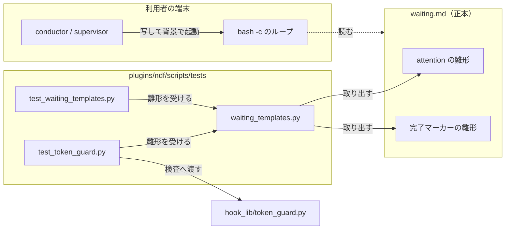
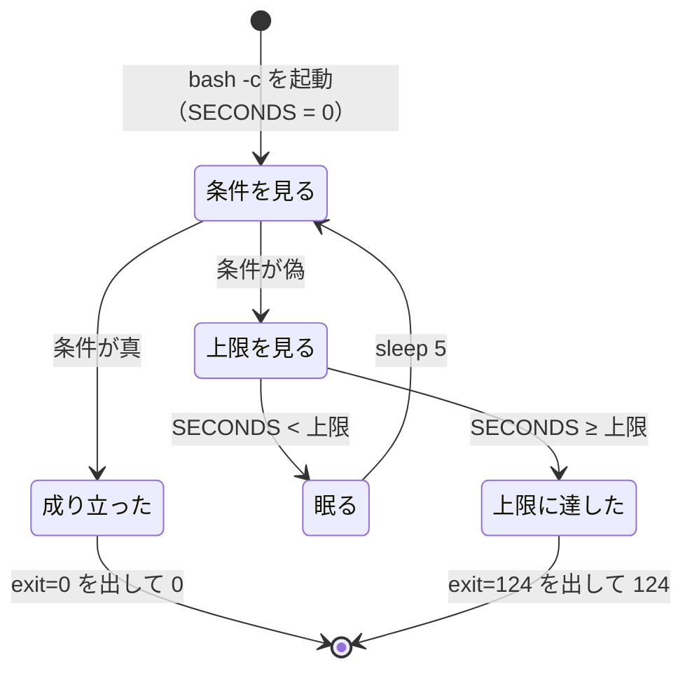

# #1297: 待ちの雛形の上限を bash の SECONDS で数える — 設計

要求と受け入れ条件は #1297 の本文にある（コピーは [issue-1297-requirements.md](issue-1297-requirements.md) ）。
この文書は「どう作るか」だけを扱う。

## 例: macOS の supervisor が worker の報告を待つと

supervisor が worker を起動した後、`waiting.md` の完了マーカーの雛形を Bash の `run_in_background: true` で打つ。

```bash
# Bash の run_in_background: true で起動する（前景で打たない）。最後の 3600 が上限の秒数
bash -c 'until [ -e "$1.done" ]; do [ "$SECONDS" -lt "$2" ] || exit 124; sleep 5; done' _ "<置き場所>" 3600; rc=$?; echo "exit=$rc"; exit "$rc"
```

1. `bash -c` が新しいシェルを起こす。組み込みの変数 `SECONDS` は、このシェルの起動からの経過秒で 0 から数える
2. ループは 5 秒ごとに `<置き場所>.done` を見る。見つかれば抜けて `exit=0` を出し、0 で終わる
3. 見つからないまま `SECONDS` が 3600 に達すると、次の周の頭で `exit 124` で抜け、`exit=124` を出す
4. どちらの場合も、外部コマンドは `sleep` だけである。`timeout` / `gtimeout` を打たないため、macOS の標準の状態でも
   127 で終わらない

今の雛形（`timeout 3600 bash -c '...'`）は 1 の前に `timeout` を探し、macOS では見つからずに 127 で終わる。

実測（2026-09-30、この環境。`PATH` に `bash` / `cat` / `grep` / `sleep` だけを置き、`command -v timeout gtimeout` が 1）:

| 雛形 | 操作 | 上限 | 終了コード | 所要 |
| --- | --- | --- | --- | --- |
| 完了マーカー | `.done` を作らない | 2 秒 | 124 | 5 秒 |
| 完了マーカー | 1 秒後に `.done` を作る | 8 秒 | 0 | 5 秒 |
| attention | 起動の時点で attention が 1 行。何もしない | 2 秒 | 124 | 5 秒 |
| attention | 1 秒後に `report.md` を書く | 8 秒 | 0 | 5 秒 |
| attention | 1 秒後に attention の行を 1 行足す | 8 秒 | 0 | 5 秒 |

同じ 2 つの雛形を `hook.py token-guard` へ渡すと、前景（`run_in_background` なし）は拒み、背景は通した。

## ドメインモデル

### コンテキスト

| コンテキスト | 何の語が 1 つの意味に決まるか |
| --- | --- |
| `ndf-workflow` | 待ちの雛形・上限・完了マーカー・attention の行。背景の起動と完了通知は今の意味のまま |

1 つのコンテキストに収まる。sleep の検査（`hook_lib/token_guard.py`）は同じコンテキストの中の読み手で、振る舞いを変えない。

### 集約

| 集約 | 持ち主（書き換えてよいもの） | 根 | エンティティ | 値オブジェクト |
| --- | --- | --- | --- | --- |
| 待ちの雛形 | `waiting.md`（待ち方の規約の正本） | 待ちの雛形 1 つ | — | 待つ条件・上限の秒数・終了コード（0 / 124） |

雛形を写す先は無い（要求の「調べたこと」の grep で、外部コマンドの `timeout` を打つのは 2 つの雛形と `statusline.sh` だけ）。
テストは雛形を写さず、`waiting.md` から取り出して打つ（決定 3）。

### 不変条件

| # | 集約 | 条件 | 破れたときの扱い |
| --- | --- | --- | --- |
| I1 | 待ちの雛形 | 雛形が打つ外部コマンドは `bash` / `cat` / `grep` / `sleep` だけで、`timeout` / `gtimeout` を打たない | 雛形の差分を差し戻す。テストが `timeout` の無い `PATH` で 127 を見て落ちる |
| I2 | 待ちの雛形 | 待つ条件が成り立てば 0、上限に達すれば 124 で終わり、どちらの場合も最後に `exit=<終了コード>` の 1 行を出す | 「終了コードごとの動き」の表と合わない。テストが終了コードと出力で落ちる |
| I3 | 待ちの雛形 | 上限に達してから終わるまでは、ループの 1 周（5 秒）を超えて延びない | 待ちが上限を大きく超えて返らない。テストが所要で落ちる |
| I4 | 待ちの雛形（attention） | 起動の時点で既にある attention の行を、新しい知らせと読まない | 起動の直後に 0 で終わり、conductor が同じ行で起き続ける。テストが 124 を見ずに落ちる |
| I5 | 待ちの雛形 | 前景で打つと sleep の検査が拒む | 前景のループが通り、呼び出しが待つ間に増える。テストが拒否を見ずに落ちる |
| I6 | 待ちの雛形 | 雛形は bash 3.2 に無い構文を使わない | コードレビューで「処理の流れ」の構文の一覧と照らして差し戻す |

### ドメインイベント

| # | イベント | 発生元 | 受け手 |
| --- | --- | --- | --- |
| E1 | 待ちの雛形を背景で起動した | conductor / supervisor | 雛形の `bash -c`（`SECONDS` を 0 から数え始める） |
| E2 | 待つ条件が成り立った | 背景の処理（supervise.py・worker） | 雛形のループ（次の周の条件で抜ける） |
| E3 | 待ちが終了コード 0 で終わった | 雛形 | 完了通知を受けた conductor / supervisor |
| E4 | 上限に達し、待ちが終了コード 124 で終わった | 雛形のループの本体の先頭の判定 | 完了通知を受けた conductor / supervisor |
| E5 | 待ちがその他の終了コードで終わった | 雛形（構文の誤り・シェルが無い） | 完了通知を受けた conductor / supervisor。この変更の後は `timeout` が無いことでは起きない |

### 用語

| 用語 | 意味 | 用語集への反映 |
| --- | --- | --- |
| 待ちの雛形 | `waiting.md` が持つ、背景で起動して条件が成り立つまで待つ until ループのコマンド。成り立てば 0、上限に達すれば 124 で終わり、`exit=<終了コード>` を出す | 追加（`ndf-workflow`） |
| 完了マーカー | worker が報告コピーを書き終えた後に作る空のファイル（<置き場所>.done） | 変えない |

## 機能一覧

| # | 機能 | 誰が使うか |
| --- | --- | --- |
| F1 | `supervise.py run` の `report.md` と attention の行を、`timeout` の無い端末でも上限つきで待つ | conductor |
| F2 | worker の完了マーカーを、`timeout` の無い端末でも上限つきで待つ | supervisor |

## 構成要素

| 要素 | 責務 | 変え方 |
| --- | --- | --- |
| `plugins/ndf/skills/development-workflow/references/waiting.md` の attention の雛形（今の 100〜102 行） | `report.md` か attention の行の増加を、上限つきで待つ | `timeout 3600` を外し、上限を第 3 引数で受けてループの本体の先頭で判定する |
| 同じ文書の完了マーカーの雛形（今の 209 行） | `<置き場所>.done` を、上限つきで待つ | `timeout 3600` を外し、上限を第 2 引数で受けてループの本体の先頭で判定する |
| `plugins/ndf/scripts/tests/waiting_templates.py`（新規。テストの補助） | `waiting.md` から 2 つの雛形を取り出し、置き換えの目印（`<置き場所>` / `<プラン>-state` / 上限の秒数）を差し替えたコマンドを返す | `gh_fake.py` と同じくテストの隣に置く。テスト以外から読まない |
| `plugins/ndf/scripts/tests/test_waiting_templates.py`（新規） | 2 つの雛形を `timeout` / `gtimeout` の無い `PATH` で子プロセスとして打ち、終了コード・出力・所要を見る（受け入れ条件 1〜5・8） | 新しいテストのファイル |
| `plugins/ndf/scripts/tests/test_token_guard.py` | 2 つの雛形を前景と背景で sleep の検査に渡す（受け入れ条件 7） | テストを 1 つ足す。雛形は補助から受ける |

変えないもの: `hook_lib/token_guard.py`（`timeout 590` を読み飛ばす処理はほかの書き方のために残す）・`scripts/lib/bg-wait.sh`・
`supervise.py wait`・`waiting.md` の「終了コードごとの動き」の表と hook の節・`statusline.sh`。



## 入出力の契約

**雛形はコマンドの約束である。** 打ち方・引数・終了コード・出力を次のとおりに固める。テストの補助はこの約束だけに依る。

| 項目 | attention の雛形 | 完了マーカーの雛形 |
| --- | --- | --- |
| 起動 | Bash の `run_in_background: true`（今と同じ） | 同左 |
| 置き換えの目印 | `<プラン>-state`（1 行目の `S=` の値） | `<置き場所>` |
| `bash -c` の引数 | `_ "$S" "$n" 3600`（状態ディレクトリ・起動時の attention の行数・上限の秒数） | `_ "<置き場所>" 3600`（置き場所・上限の秒数） |
| 上限 | `bash -c` の最後の引数。10 進の秒数。雛形の既定は 3600 | 同左 |
| 0 で終わる条件 | `$S/report.md` が空でない、または attention の行数が起動時の行数を超えた | `<置き場所>.done` がある |
| 124 で終わる条件 | 0 の条件が成り立たないまま、`SECONDS` が上限に達した | 同左 |
| 出力 | 最後に `exit=<終了コード>` の 1 行 | 同左 |

**上限を最後の引数に置くのは、テストが本文を書き換えずに上限を縮められるようにするためである**（決定 2）。
補助は「`bash -c` の最後の引数の `3600`」を差し替える。見つからなければ補助が例外で落ち、雛形の形が変わったことを知らせる。

書き換えた後の attention の雛形:

```bash
# Bash の run_in_background: true で起動する（前景で打たない）。S はプランの状態ディレクトリ、最後の 3600 が上限の秒数
S="<プラン>-state"; n=$(cat "$S/progress.jsonl" 2>/dev/null | grep -c '"kind": "attention"')
bash -c 'c() { cat "$1/progress.jsonl" 2>/dev/null | grep -c "\"kind\": \"attention\""; }
until [ -s "$1/report.md" ] || [ "$(c "$1")" -gt "$2" ]; do [ "$SECONDS" -lt "$3" ] || exit 124; sleep 5; done' _ "$S" "$n" 3600; rc=$?; echo "exit=$rc"; exit "$rc"
```

完了マーカーの雛形は冒頭の「例」のとおりである。雛形の下の説明（「124（上限の 3600 秒）で終わったら」の行・終了コードの表）は
書き換えない（受け入れ条件 8）。

## 処理の流れ



この図は 2 つの雛形の振る舞いだけを描く。テストの 3 つの構成要素は雛形を外から打つ側で、関係は「構成要素」の図にある。

**条件を上限より先に見る。** 上限の直前に条件が成り立った周は 0 で終わる。上限を過ぎてから眠ることは無いため、
上限に達してから終わるまでの遅れは 1 周（`sleep 5` と条件の評価）に収まる（I3。実測で上限 2 秒に対し 5 秒）。

雛形が使う構文と外部コマンドの一覧（受け入れ条件 6。コードレビューはこの一覧と照らす）:

| 種類 | 使うもの | bash 3.2 にあるか |
| --- | --- | --- |
| 起動 | `bash -c '<本体>' _ <引数>…`・位置引数 `$1` `$2` `$3` | ある |
| 組み込みの変数 | `SECONDS`・`$?` | ある（bash 2 から） |
| 制御 | `until … do … done`・`\|\|`・`;`・`exit` | ある |
| 関数 | `c() { …; }` | ある |
| 置換 | `$(…)`・二重引用の中の `\"` | ある |
| 条件 | `[ -e ]`・`[ -s ]`・`[ -gt ]`・`[ -lt ]` | ある（組み込みの `[`） |
| 出力 | `echo` | ある（組み込み） |
| 外部コマンド | `cat`・`grep -c`・`sleep 5`（整数の秒） | macOS の BSD 版にもある |

使わないもの: 連想配列・`mapfile`・`${var,,}`・`[[ =~ ]]`・`$EPOCHSECONDS`・`read -t` の小数・`timeout` / `gtimeout`。

**`bash -c` の外（1 行目の `S=` と `n=`、末尾の `rc=$?; echo; exit`）は POSIX の構文だけにする。** Claude Code の Bash は
利用者のシェルで打たれ、macOS の既定は zsh である。外側を POSIX に留めれば、zsh でも bash でも同じに動く。

## 非機能の実現方式

| 大項目 | 要求の条件 | 実現方式 | 確かめ方 |
| --- | --- | --- | --- |
| システム環境 | GNU coreutils の無い macOS の標準の状態（bash 3.2・BSD のユーザーランド）で雛形が動く。Linux（bash 5）での振る舞いは変えない | 上限を bash の組み込み `SECONDS` で数え、外部コマンドを `cat` / `grep -c` / `sleep` に限る。Linux でも同じ書き方にし、`timeout` の有無で分けない | `timeout` / `gtimeout` の無い `PATH` で 2 つの雛形を子プロセスとして打つテスト。bash 3.2 の構文は上の一覧とコードレビューで照らす。macOS の実機はリリース後テスト |
| 性能・拡張性 | 待ちの間の呼び出しの回数は今と同じ（背景の起動 1 回・完了通知 1 回）。ループの間隔は今の 5 秒を超えない | 起動の形（`run_in_background: true` の 1 回）を変えない。ループの間隔は `sleep 5` のまま | 雛形の `sleep` の秒数を読むテストは書かない（文言のテストになる）。所要のテスト（上限 + 10 秒以内）が間隔の延びを拾う |

## 決定の記録

### 決定 1: 上限は雛形の中で SECONDS を使って数え、共通のスクリプトを置かない

雛形は利用者のプロジェクトで打たれる。スクリプトを呼ぶ形にすると、雛形にスクリプトのパスの解決（`$SCRIPTS` の決め方）が入り、
写した 1 行が環境ごとに打てたり打てなかったりする。`SECONDS` は bash の組み込みで、外部への依存が増えない。
変更も 2 つの雛形の中で済む。

採らなかった案: `scripts/lib/` に `timeout` の代わりのスクリプトを置く案は、パスの解決と新しい構成要素が 1 行の上限の判定に
見合わない。`command -v timeout || command -v gtimeout` で分ける案は、端末ごとに止め方が 3 通りになり、どちらも無い端末の
書き方が結局要る。`bg-wait.sh wait` を使う案は、1 回の待ちが 540 秒に区切られ、起動と待ちの 2 回の呼び出しになる
（性能・拡張性の条件に反する）。

根拠: Value 5 / Value 1 / Value 4（MVV 版 2）

### 決定 2: 上限の秒数を bash -c の最後の引数で渡す

上限が引数なら、テストは本文を書き換えずに上限を縮めて打てる。利用者から見ても、上限が雛形の末尾の `3600` として見える。
本体の中に `3600` を書くと、テストは本文の中を書き換えることになり、書き換えた先が雛形と同じ振る舞いかを別に確かめることになる。

採らなかった案: 環境変数（例: `NDF_WAIT_LIMIT`）で渡す案は、雛形を読んだだけでは上限が見えない。

根拠: Value 3（MVV 版 2）

### 決定 3: テストは雛形を waiting.md から取り出して打ち、テストの中に写しを持たない

この課題の不具合は文書の中の雛形そのものにあった。テストが写しを持つと、写しが通っても `waiting.md` の雛形が壊れたままになり得る。
取り出して打つテストが見るのは終了コード・出力・所要であり、文言を照合しない（`AGENTS.md` の「`.md` の文言を照合するテストを書かない」は
文言の固定を禁じるもので、雛形の振る舞いを確かめることを禁じない）。取り出しは `waiting.md` の `bash` の囲みのうち `until` を含むものを
集め、ちょうど 2 つであることを確かめる。数が変わったら補助が落ち、雛形が増えた・減ったことを知らせる。

採らなかった案: テストの中に同じコマンドを持つ案は、雛形の食い違いを拾えない（要求の未決の 2 つ目）。

根拠: Value 6 / Value 7（MVV 版 2）

### 決定 4: 上限の判定をループの本体の先頭に置き、条件の判定を先にする

条件が成り立った周は上限より優先して 0 で終わり、上限を過ぎた後に眠らない。ループの条件の側に `[ "$SECONDS" -ge 上限 ]` を
足す形は、抜けた後にどちらで抜けたかを見分けるため条件をもう一度評価することになる。

根拠: 根拠なし（MVV 版 2）

## テスト設計

| 受け入れ条件・不変条件 | どの振る舞いで縛るか | どう壊したら落ちるべきか |
| --- | --- | --- |
| 受け入れ条件 1・I1 | 2 つの雛形を `timeout` / `gtimeout` の無い `PATH` で打つと、127 で終わらない（下の 2〜4 の行が通ること） | 雛形の先頭に `timeout 3600` を戻すと、どの行も 127 で落ちる |
| 受け入れ条件 2・I2 | 完了マーカーの雛形を上限を縮めて打ち、上限までに `.done` を作ると 0 で終わり、`exit=0` を出す | `.done` の判定を別の名前（例: `.dune`）にすると 124 になって落ちる。`echo "exit=$rc"` を消すと出力で落ちる |
| 受け入れ条件 3・I2・I3 | `.done` を作らないと、上限の後、上限 + 10 秒以内に 124 で終わり、`exit=124` を出す | `exit 124` を `exit 1` にすると終了コードで落ちる。上限の判定を消すとテストの打ち切りで落ちる。`sleep 5` を `sleep 30` にすると所要で落ちる |
| 受け入れ条件 4・I2 | attention の雛形を上限を縮めて打ち、(a) `report.md` を書く、(b) attention の行を 1 行足す、は 0。(c) どちらもしないは 124 | (a) の判定を消すと (a) が 124 で落ちる。行数の比較を消すと (b) が 124 で落ちる。上限の判定を消すと (c) が打ち切りで落ちる |
| 受け入れ条件 5・I4 | 起動の時点で attention の行が 1 行以上あり、行を足さないと 0 で終わらない（124） | 起動時の行数を 0 に固定する（`"$n"` を `0` にする）と、直ちに 0 で終わって落ちる |
| 受け入れ条件 6・I6 | 「処理の流れ」の構文の一覧をコードレビューで照らす（この環境に bash 3.2 が無い） | 自動テストは持たない（未確認のまま残ること） |
| 受け入れ条件 7・I5 | 2 つの雛形を sleep の検査へ前景で渡すと拒み、`run_in_background: true` で渡すと通す | 検査が `bash -c` の中身を読まないように壊すと、前景が通って落ちる |
| 受け入れ条件 8 | 受け入れ条件 2〜4 の終了コードが 0 と 124 だけであること（表の行に当てはまる） | 上限の終わりを 3 や 125 にすると落ちる |
| 受け入れ条件 9 | 既存の全体テスト（`uv run --frozen --project . --all-extras pytest plugins/ndf/scripts/tests -q -n 4`）が通る | — |

取り出しの補助にも縛りを 1 つ置く: `waiting.md` の `until` を含む `bash` の囲みが 2 つでないとき、置き換えの目印が見つからないときは
例外で落ちる（壊し方: 雛形の `<置き場所>` を別の語に変えると、補助が落ちる）。

## 未確認のまま残ること

| 項目 | 内容 |
| --- | --- |
| macOS の実機での振る舞い | この環境に macOS が無い。`timeout` の無い `PATH` で代えて確かめた。実機で 2 つの雛形を背景で起動し、0 と 124 で終わることはリリース後テストで見る |
| bash 3.2 での構文 | この環境に bash 3.2 が無い。構文の一覧とコードレビューで照らす。実機の `/bin/bash` での確認はリリース後テストで見る |
| 外側のシェルが zsh のとき | 外側を POSIX の構文に留めたが、zsh で打つ試しはこの環境で行っていない。リリース後テストで macOS の既定のシェルから打つ |
