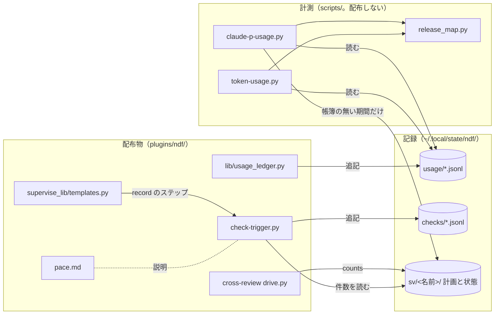
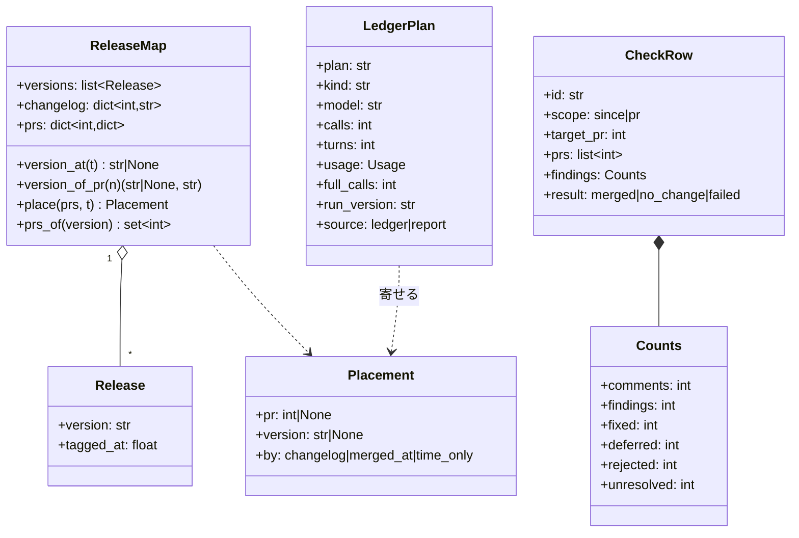
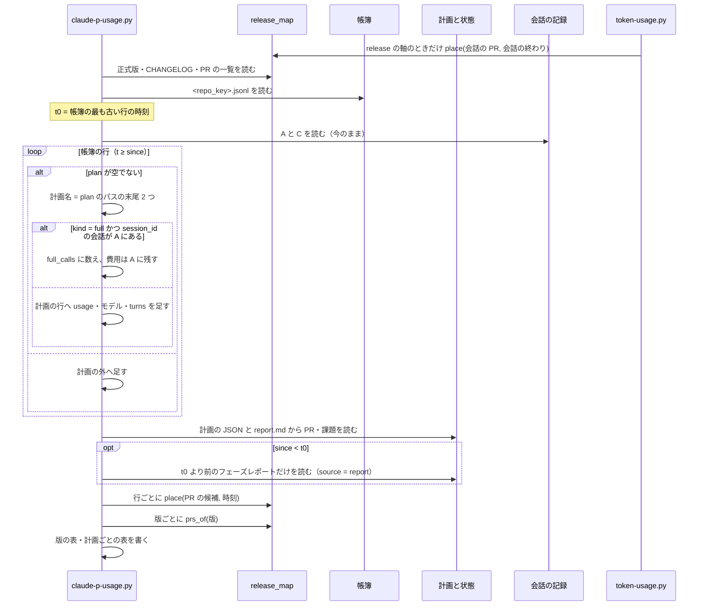
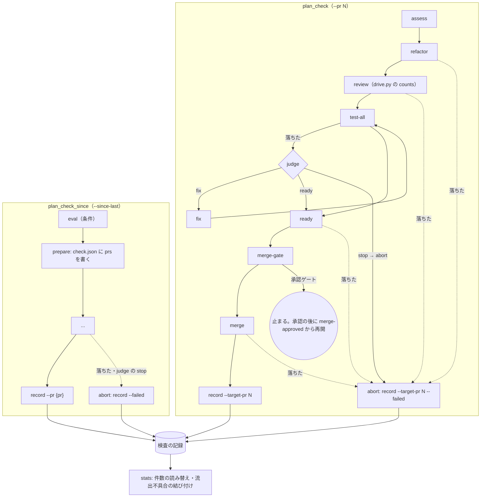

# #1316: 費用と検査の物差しを 2c の前後で同じに使えるようにする

要求と受け入れ条件は #1316 の本文にある（コピーは [issue-1316-requirements.md](issue-1316-requirements.md) ）。#1317 の「直し方の候補」と「確かめ方」も同じ本文の受け入れ条件 7〜11 に写してあり、この文書 1 本で扱う。この文書は「どう作るか」だけを扱う。直すのは、費用の物差し（#1316。計測のスクリプト 2 本と共通の寄せ方）と、検査の物差し（#1317。`check-trigger.py`・検査の計画の雛形・cross-review の件数）の読み手と書き手である。

## ドメインモデル

### コンテキスト

| コンテキスト | 何の語が 1 つの意味に決まるか |
| --- | --- |
| `ndf-workflow` | 使用量の帳簿・検査の記録・フェーズレポート・流出不具合・正式版・載った版・動いた版 |
| `ndf-cross-review` | 指摘・修正担当（件数の単位） |

`ndf-cross-review` が供給者、`ndf-workflow` が顧客の関係（顧客 / 供給者）。検査の記録は cross-review の件数（drive の `metrics`）を受け取って写すだけで、件数の数え方は cross-review の drive が決める。

### 集約

| 集約 | 持ち主（書き換えてよいもの） | 根 | エンティティ | 値オブジェクト |
| --- | --- | --- | --- | --- |
| 使用量の帳簿 | `lib/usage_ledger.py`（追記だけ。この変更では書き手を変えない） | 帳簿のファイル | 帳簿の行（1 呼び出し） | usage・モデル・計画のパス |
| 検査の記録 | `check-trigger.py`（`eval` / `record` / `escape` だけが追記する） | 記録のファイル | 検査の行・評価の行・流出不具合の行 | 件数（`findings`）・範囲の PR |
| 版の寄せ方 | `scripts/lib/release_map.py`（新規） | 版の一覧 | 正式版 | 寄せた結果（PR・版・寄せ方） |

- 帳簿の行は計画を**パスで**参照し、計画の中身（PR・課題）は計測のときに計画の JSON と状態ディレクトリから読む
- 流出不具合の行は持ち込んだ PR を**番号で**参照する（`of`）。どの検査と結び付くかは行に書かず、`stats` が検査の行の範囲の PR から導く

### 不変条件

| # | 集約 | 条件 | 破れたときの扱い |
| --- | --- | --- | --- |
| I1 | 使用量の帳簿 | 1 回の `claude -p` の呼び出しは、A（会話）と B（帳簿・報告）の一方でだけ費用に数える | 2 度数えた行が出たら集計の誤り（テストで落とす） |
| I2 | 使用量の帳簿 | 帳簿のある期間（帳簿の最も古い行の時刻から後）の B は帳簿だけから読み、フェーズレポートを重ねない | 同上 |
| I3 | 使用量の帳簿 | 帳簿の `plan` が空でない計画は、B にちょうど 1 行ずつ出る | 同上 |
| I4 | 版の寄せ方 | 同じ PR は、2 本のスクリプトで同じ版と同じ寄せ方に寄る | 同上（同じ関数を呼ぶので構造で守る） |
| I5 | 版の寄せ方 | 版の PR 数は、PR の一覧と寄せ方だけで決まり、観測した会話・計画の有無に依らない | 同上 |
| I6 | 検査の記録 | 同じ行の件数は `findings`（扱った指摘）≥ `fixed`（直した指摘）である | `drive` が数え方で守る。古い行は読むときに読み替える（決定 10） |
| I7 | 検査の記録 | PR を指す検査の行は、`eval` の範囲の起点にも、範囲から外す PR の集合にもならない | 行の形（`pr` と `to` を持たない）で守る |
| I8 | 検査の記録 | 検査の計画は、マージ・変更なし・落ちたのどの終わり方でも検査の行を 1 行書く（承認ゲートで止まった間と、計画の外から止められた場合を除く） | 書けなければ `record` のステップが落ちる |
| I9 | 検査の記録 | 流出不具合の行の `of` の意味（持ち込んだ PR）と既存の行は変えない。記録は追記だけ | 書き換える経路を作らない |

### ドメインイベント

要求の番号を引き継ぐ。

| # | イベント | 発生元 | 受け手 |
| --- | --- | --- | --- |
| E1 | 計画のステップが `claude -p` を 1 回呼んだ | `supervise.py` のステップ・MVV の判定 | 帳簿（E2） |
| E2 | 帳簿に 1 行が追記された | `usage_ledger.append_safely` | `claude-p-usage.py`・`token-usage.py`（E8） |
| E3 | 計画がフェーズレポートを書いた | `supervise.py` | `claude-p-usage.py`（帳簿の無い期間だけ）・`check-trigger.py record`（件数） |
| E4 | 検査の計画が実行条件を評価した | `check-trigger.py eval` | 検査の記録（`kind: eval`） |
| E5 | 検査の計画がレビューとリファクタリングを終えた | cross-review / cross-refactoring の drive | 計画の `state.json` の `counts` |
| E6 | 検査の記録に検査の 1 行が書かれた | `check-trigger.py record`（**両方の検査の雛形から**） | `stats`（E9）・`eval`（範囲の起点。範囲を差分で決める検査の行だけ） |
| E7 | 流出不具合が記録された | `check-trigger.py escape` | `stats`（E9）・`eval`（トリガー）・MVV の改訂の兆候 |
| E8 | 計測のスクリプトが版ごとの表を出した | `token-usage.py`・`claude-p-usage.py` | 人・計測の作業 |
| E9 | `stats` が検査ごとの件数と流出不具合の結び付きを出した | `check-trigger.py stats` | 人・振り返り |

### 用語

| 用語 | 意味 | 用語集への反映 |
| --- | --- | --- |
| 載った版 | PR が載った正式版。CHANGELOG の版の節 → マージの時刻の後の最初の正式版のタグ → 行の時刻の後の最初の正式版のタグ、の順で決める | 追加（`ndf-workflow`） |
| 動いた版 | 呼び出しや会話を動かした NDF の版（帳簿の `ndf_version`・会話の Skill の置き場の版） | 追加（`ndf-workflow`） |
| 検査の記録 | 意味は変えない。検査の行に `scope`・`target_pr`・`prs` の列が増える | 追加（`ndf-workflow`。用語集に無かったため、要求の定義を載せる） |

## 機能一覧

| # | 機能 | 誰が使うか |
| --- | --- | --- |
| F1 | 記録の残らない `claude -p` の使用量を、計画ごとにモデル・書き込みの 5 分 / 1 時間の別まで版ごとに出す | 計測の作業（2c の前後の比較） |
| F2 | 帳簿の無い期間だけフェーズレポートから読み、境目と読んだ元を出す | 同上 |
| F3 | 版を寄せる規則と版の PR 数を、2 本の計測のスクリプトで同じにする | 同上 |
| F4 | `token-usage.py` で、動いた版の表に加えて載った版の表を出す | 同上・版を選ぶ人 |
| F5 | PR を指す検査も、終わったとき（落ちたときも）に検査の記録へ 1 行を書く | conductor・振り返り |
| F6 | 流出不具合を、持ち込んだ PR を最後に範囲に含めた検査へ結び付けて出す | 振り返り（検査の閾値の見直し） |
| F7 | 指摘と修正を同じ単位で数え、レビューのコメントの数は別の名前で出す | 同上 |

## 構成要素

| 要素 | 責務 |
| --- | --- |
| `scripts/lib/release_map.py`（新規） | 正式版の一覧（タグと CHANGELOG の見出し）と PR の一覧を読み、PR・時刻を載った版へ寄せる。版ごとの PR 数を返す。2 本の計測のスクリプトが呼ぶ唯一の寄せ方 |
| `scripts/measure/claude-p-usage.py` | B を帳簿から読む（帳簿の無い期間だけフェーズレポート）。計画名を帳簿のパスから決める。`full` の行を会話と session_id で突き合わせて除く。版の寄せ方を `release_map` に移す |
| `scripts/token-usage.py` | 軸 `release`（載った版）を足す。軸 `version` は動いた版のまま（表の見出しを「動いた版」にする）。`release` の軸のときだけ PR の一覧を読む |
| `plugins/ndf/scripts/check-trigger.py` | `record --target-pr` を足す。検査の行に `scope`・`target_pr`・`prs` と、新しい単位の件数を書く。`prepare` が範囲の PR を `check.json` に書く。`stats` が流出不具合を検査へ結び付け、古い行の件数を読み替える |
| `plugins/ndf/scripts/supervise_lib/templates.py` | `plan_check`（`--pr`）に `record` と `abort` のステップを足す。両方の検査の雛形で judge の `stop` を `abort` へ向ける |
| `plugins/ndf/skills/cross-review/scripts/drive.py` | `counts()` の `findings` を修正担当が扱った指摘の数にし、レビューのコメントの数を `comments` で出す |
| `plugins/ndf/skills/development-workflow/references/pace.md` | 検査の記録の表（`check` の列）と `stats` の出力の説明を新しい列に合わせる |
| `docs/glossary/glossary.json` | 「載った版」「動いた版」「検査の記録」を足す（`docs/glossary.md` も同じ 3 語） |



**配置は変えない。** 計測の 3 つはリポジトリの根の `scripts/` で手元だけで動き、配布物からは参照しない（`AGENTS.md`）。配布物で変える 4 つ（`usage_ledger.py` を除く）は今の置き場のままである。

### 値の集合へ値を足す規則の判定

検査の行に `scope` の値（`since` / `pr`）が増える。検査の行（`kind: check`）を前提にした既存の規則を集め、`scope: pr` の行に当てはまるかを判定した。当てはまらないものだけを変える対象に挙げる。

| 規則（場所） | `scope: pr` の行に当てはまるか | 扱い |
| --- | --- | --- |
| 前回の検査は `to` を持つ `check` の最新（`last_check`） | 当てはまらない（範囲の起点を持たない） | `to` を空にして外れる（I7）。変更なし |
| 検査の PR は範囲から外す（`evaluate` の除外集合 `e["pr"]`） | 当てはまらない（検査した PR は実装の PR で、外すと差分の検査から落ちる） | `pr` を書かず `target_pr` に書く（I7） |
| `record` の失敗で `check-base/<名>` を消し検査の PR を閉じる | 当てはまらない（`check-base` は無く、閉じると実装の PR が閉じる） | `--target-pr` のときは消さず閉じない |
| `record` の成功で `check-done/*` を進める | 当てはまらない | `--target-pr` のときは送らない |
| `stats` の流出の窓は同じ種類の次の検査まで | 当てはまらない（範囲が時刻で連続しない） | 窓を切る検査から `scope: pr` を除く |
| `changed --id` は同じ名前の最後の行 | 当てはまる | 変更なし |
| MVV の兆候は `kind: escape` だけを数える | 当てはまる（`check` を読まない） | 変更なし |

## 構造

変更が触る型だけを載せる。



`Usage` は `token-usage.py` の既存の型をそのまま使う（換算の係数とモデルごとの read の倍率を持つ）。

## データ構造

**帳簿の行と流出不具合の行の形は変えない。** 変わるのは検査の行と `check.json` と、計測の出力である。すべて追記で、既存の行は書き換えない（I9）。

### 検査の行（`kind: check`）

| 列 | 型 | 空の扱い | 変更 |
| --- | --- | --- | --- |
| `id`・`at`・`from`・`to`・`metrics`・`result`・`failed_at`・`only` | 既存 | 既存 | なし。`scope: pr` の行は `from`・`to` が空、`metrics` が `{}` |
| `pr` | int | 無い | `scope: since` の行だけが持つ（検査の PR）。`scope: pr` の行は持たない |
| `scope` | `since` / `pr` | 無い行は `since` として読む | 追加 |
| `target_pr` | int | `scope: pr` の行だけ | 追加。検査した PR |
| `prs` | int の配列 | 無い行は「範囲の PR を持たない」 | 追加。`scope: since` は `check.json` の範囲の PR、`scope: pr` は `[target_pr]` |
| `findings` | dict | 既存 | キーを足す（下の表） |

`findings` の中身:

| キー | 単位 | 出所 |
| --- | --- | --- |
| `applied`・`reverted` | 改善項目（cross-refactoring） | 変更なし |
| `comments` | レビュー担当が出したコメント | drive の `comments`（これまでの `findings` と同じ値） |
| `findings` | 修正担当が扱った指摘 | drive の `findings`（= 各ラウンドの `fixed + deferred + rejected` の和） |
| `fixed`・`deferred`・`rejected` | 修正担当が扱った指摘 | drive の同名の値（各ラウンドの和） |
| `unresolved` | スレッド | 変更なし |
| `rounds` | ラウンド | drive の `rounds` |

**古い行は読むときに読み替える。** `comments` を持たない行の `findings` は、これまでのコメントの数である。`stats` はその値を `comments` として出し、`findings` と `fixed` を空にする（決定 10）。

### `check.json`（`prepare` が書く）

`prs`（範囲に入った PR の番号の配列）を足す。`evaluate` が既に持つ `merged_prs` の結果を写すだけで、範囲の決め方は変えない。

### 計測の出力（`claude-p-usage.py` の `.json`）

| 置き場 | 足す・変える値 |
| --- | --- |
| `meta` | `ledger_since`（帳簿の最も古い行の時刻。無ければ空）・`ledger_path` を足す |
| `by_version[]` | `release_prs`（版の PR 数。I5）・`prs_seen`（行から寄った PR の数。これまでの `prs`）・`partial`（範囲が版の途中から始まるか）・`cost_B_low` / `cost_B_high` は帳簿から読んだ計画では同じ値になる・`B_outside`（計画の外の換算） |
| `B[]` | `source`（`ledger` / `report`）・`model`・`calls`・`cache_write_5m`・`cache_write_1h`・`full_calls`（A で数える呼び出し）・`run_version` を足す |

`token-usage.py` の出力（`per_pr[]`）は、軸 `release` を含むときだけ `release_prs` と `release_by`（寄せ方ごとの会話の数）を足す。

### CRUD

| 機能 | 帳簿 | 検査の記録 | `check.json` | 計画と状態 |
| --- | --- | --- | --- | --- |
| F1〜F4 | R | — | — | R |
| F5 | — | C（検査の行） | R | R（`state.json`） |
| F6 | — | R | C（`prs`） | — |
| F7 | — | C（件数） | — | C（drive の `counts`） |

## 入出力の契約

**副命令と既存の引数の意味は変えない。** 足すのは次の引数と出力の列だけである。

### `check-trigger.py record`

```text
check-trigger.py record --id <名> --state <DIR> (--pr N | --failed [--pr N] | --target-pr N [--failed]) [--review] [--root DIR]
```

| 引数 | 意味 | 振る舞い |
| --- | --- | --- |
| `--target-pr N`（新規） | PR を指す検査として記録する。N は検査した PR | `check.json` を読まない。行は `scope: pr`・`target_pr: N`・`prs: [N]`。結果は N の状態（MERGED → `merged`、CLOSED → `no_change`）。`check-base` を消さず、`check-done/*` を進めず、PR を閉じない |
| `--target-pr N --failed` | PR を指す検査が落ちた | `result: failed`・`failed_at` を書く。PR を閉じない。終了コード 1（既存の `--failed` と同じ） |
| `--target-pr` と `--pr` / `--review` | 同時に渡せない | 終了コード 2（引数の誤り） |

終了コードと結果 JSON の形（`step_result`）は既存の `record` と同じである。

### `check-trigger.py stats`

結果 JSON の `items` と `metrics` に足す。既存のキーは残す。

| 置き場 | キー | 意味 |
| --- | --- | --- |
| `items[]`（検査ごと） | `scope`・`target_pr`・`prs` | 検査の行の値 |
| `items[]` | `findings` | 読み替えた後の件数（`comments`・`findings`・`fixed` ほか） |
| `items[]` | `escapes_linked` | この検査に結び付いた流出不具合の PR の番号の配列 |
| `metrics` | `escapes_linked` / `escapes_unlinked` | 結び付いた件数 / 結び付かない件数 |
| `metrics` | `unlinked` | 結び付かない流出不具合ごとの `{pr, of, reason}`。`reason` は `of_unknown`（`of: 0`）/ `no_check`（`of` を範囲に含めた検査が無い）/ `no_range`（その時点より前に範囲の PR を持たない検査の行しか無い） |

要約の 1 行に「検査 N 回（PR を指す M）・流出不具合 K 件（結び付いた L）」を出す。

### `scripts/measure/claude-p-usage.py`

| 引数 | 既定 | 変更 |
| --- | --- | --- |
| `--usage-root` | `usage_ledger.ledger_dir()` | 新規。帳簿のディレクトリ。読むのは `<repo_key(--repo)>.jsonl` だけ |
| `--plugin` | `ndf` | 新規。タグの接頭辞 `<plugin>--v` と CHANGELOG の見出し `## [<plugin> <版>]` を決める |
| `--sv-root` | `~/.local/state/ndf/sv` | 既定を今の計画の置き場へ変える。帳簿の無い期間の報告だけを読む |
| `--since` | 帳簿の最も古い行の時刻（無ければ必須） | 既定を変える |

### `scripts/token-usage.py`

| 引数 | 既定 | 変更 |
| --- | --- | --- |
| `--by` | `version,mode,model` | 軸 `release` を受ける。`version` の見出しを「動いた版」にする |
| `--repo` | カレントのリポジトリ | 新規。`release` の軸で PR の一覧・タグ・CHANGELOG を読むリポジトリ |
| `--prs-json` | 無し | 新規。PR の一覧のキャッシュ（無ければ `gh pr list` を 1 回打って書く）。`release` の軸が無いときは読まず、通信しない |

## 処理の流れ

### 費用の物差し（F1〜F4）



- **計画の PR は、計画の JSON の `Pull Request` → 状態ディレクトリの `report.md` の `- Pull Request:` → 計画の `課題` を題に持つマージ済みの PR の順で決める。** どれも無ければ時刻で版だけを決め、寄せ方 `time_only` を出す（実測: 帳簿の 57 計画のうち JSON に PR を持つのは 12、`report.md` に持つのは 41）
- **計画の種類は、計画の JSON の `フェーズ` を先に読み、無ければ計画名から決める**（今の規則）
- **A の会話で `in_B` の推定を使うのは、報告から読んだ B の行と比べるときだけである。** 帳簿から読んだ B は `full` の行を session_id で除くため、推定が要らない（I1）。`token-usage.py` は帳簿の読み方を変えない

### 検査の物差し（F5〜F7）



処理の流れの図は、説明の文書（`pace.md`・`glossary.json`）を含めない。

**`record` の件数は、計画の `state.json` の `log` の `counts` から読む。** フェーズレポートの件数も同じ `counts` から書かれる（`state.py` の `counts_text`）。書き手と出所が 1 つなので、検査の行とフェーズレポートの件数は一致する（受け入れ条件 9）。

**`stats` が流出不具合を結び付ける規則:**

1. `of` が 0 なら `of_unknown`
2. 流出不具合の行の時刻より前の検査の行のうち、`prs` に `of` を含むものの最新を選ぶ（`scope` を問わない）
3. 無ければ、それより前に `prs` を持たない検査の行があれば `no_range`、無ければ `no_check`

結果の時刻の窓で数える既存の `escapes_after` は残す。窓を切る検査からは `scope: pr` の行を除く（範囲が時刻で連続しないため）。

## 非機能の実現方式

| 大項目 | 条件 | 実現方式 |
| --- | --- | --- |
| 運用・保守性 | 版を寄せる規則を 1 か所に置き、2 本から同じ関数を使う | `scripts/lib/release_map.py` の `ReleaseMap.place` / `prs_of` だけが寄せる。`claude-p-usage.py` の `Mapper`・`load_versions`・`changelog_prs` は消す |
| 移行性 | 既存の帳簿・検査の記録の行をそのまま読む。書き換えない | 検査の行の新しい列は、無いときの読み方を決めてある（データ構造の表）。古い件数は読むときに読み替える |
| システム環境 | 配布物に ai-plugins の形を埋め込まない | `check-trigger.py` と雛形が足すのは列と引数だけで、タグの接頭辞・置き場のパスを持たない。ai-plugins の形（`ndf--v`・`## [ndf …]`）は `scripts/` の既定値にだけ置き、引数で変えられる |

## 決定の記録

### 決定 1: 版を寄せる規則は `scripts/lib/release_map.py` の 1 つにし、2 本の計測のスクリプトが呼ぶ

寄せ方が 2 本に分かれていたことが、同じ版の PR 数が 1 本と 22 本に食い違った原因である。関数を写すと再び分かれるため、置き場を 1 つにする。置き場は配布物でなく `scripts/lib/` にする。計測は ai-plugins の開発のためのもので、配布物から参照しない。

`token-usage.py` の中に置いて `claude-p-usage.py` から読む形は採らない。`claude-p-usage.py` は既に `token-usage.py` をモジュールとして読み込んでいるが、寄せ方は `token-usage.py` の本業（会話の集計）と別の責務である。

根拠: Value 6 / Value 3（MVV 版 2）

### 決定 2: 版の PR 数は「その版に載った PR の数」とし、観測した行に依らない

2 本は読む記録が違う（会話と、計画・worktree の会話）。観測した行から PR を数える限り、寄せ方をそろえても数は一致しない。版の PR 数を PR の一覧と寄せ方だけで決めれば、2 本で同じ値になる（I5）。PR の一覧は、マージ済みで、ブランチが `release/` で始まらない PR である。範囲が版の途中から始まるときは、その版の行に `partial` を付ける（費用は範囲の分だけ、PR 数は版の全体になるため）。

観測した行から数える値は `prs_seen` として残す。費用の出所の網羅を確かめる材料になる。

根拠: Value 3（MVV 版 2）

### 決定 3: `token-usage.py` の軸 `version` は動いた版のまま残し、載った版は新しい軸 `release` で出す

`version` の意味を載った版へ変えると、これまで `docs/metrics/` に残した表と比べ直せなくなる。軸を足すだけなら、読む側は軸の名前で意味を選べる。PR の一覧を読む通信は `release` の軸のときだけ起こし、既定の打ち方は通信しない今の性質を保つ。

`version` を載った版へ変えて、動いた版を別名の軸へ移す形は採らない。既存の打ち方の出力の意味が黙って変わる。

根拠: Value 3 / Value 7（MVV 版 2）

### 決定 4: 帳簿のある期間の B は帳簿だけから読み、境目は帳簿の最も古い行の時刻にする

帳簿は呼び出しごとにモデル・5 分 / 1 時間・turns を持ち、報告の合計より細かい。報告と重ねると同じ呼び出しを 2 度数える（I2）。境目を日時で埋め込むと、帳簿が作り直された環境（今の手元は 2026-09-27 12:24 UTC から）で誤る。

根拠: Value 3 / Value 5（MVV 版 2）

### 決定 5: `full` の行は A（会話）で数え、B では session_id で A と突き合わせて費用から除く

`full` の呼び出しは会話が残り、呼び出しの並び（P・書き直し）まで A から取れる。帳簿の `full` の行の session_id は、実測で 37 行すべてが会話の記録のファイル名と一致した。B の計画の行には `full_calls` として件数だけを出すので、`full` だけの計画も B に 1 行出る（I3）。`token-usage.py` の「`full` を読まない」規則とも一致する。

B で数えて A から除く形は採らない。A にしか無い値（P・所要）を失う。

根拠: Value 3（MVV 版 2）

### 決定 6: 帳簿から読む計画名は、`plan` のパスの末尾 2 つ（置き場の名前とファイル名）にする

今の計画の置き場は `~/.local/state/ndf/sv/<名前>/<計画>.json` で、`<名前>/<計画>` で一意になる（例 `check-m26/2-review-s2a`）。置き場の根を知らなくても決まるため、`--sv-root` の既定が違う環境でも同じ名前になる。報告から読む行（帳簿の無い期間）は、今の `r<数字>/…-state` の形も読めるように、名前の正規表現を `<sv_root>/<名前>/(plans/)?<計画>-state` へ広げる。

根拠: Value 5（MVV 版 2）

### 決定 7: PR を指す検査の行は `scope: pr` と `target_pr` を持ち、`pr` と `to` を持たない

`eval` は `check` の行の `pr` を「検査の PR」として範囲から外し、`to` を持つ最新の行を範囲の起点にする。PR を指す検査の行がこの 2 つを持つと、差分の検査の範囲が縮み、トリガーの計算が変わる（受け入れ条件 13、要求の「確認してから行う」）。PR を指す検査は 1 本の PR を見るもので、差分の検査が見る PR どうしの組み合わせは見ていない。そのため範囲に影響させない。同じ PR を 2 度検査し得るが、見る観点が違う。

`pr` に検査した PR を書いて範囲から外す形は採らない。要求の未決「PR を指す検査の記録を範囲の起点に数えるか」は、数えない側に決める。

根拠: Value 3 / Value 1（MVV 版 2）

### 決定 8: 落ちた検査の記録は、雛形の `on_fail` と judge の選択肢で `abort` へ向けて書く。計画の実行の仕組みは変えない

`plan_check` の失敗し得るステップに `on_fail: abort` を付け、両方の雛形の judge の `stop` を `abort` へ置き換える。`abort` は `record --failed` を打ち、終了コード 1 で計画を止める（`plan_check_since` の今の形と同じ）。承認ゲートで止まった計画は、承認の後に `merge-approved` から再開し `record` へ進むため、止まっている間は記録しない。

実行の仕組みに「必ず最後に走るステップ」を足す形は採らない。2c で実行の仕組みを DBOS へ移すため、この課題で仕組みを変えない（要求の前提 7）。計画の外から止められた場合（プロセスの終了・利用上限）は記録されない。これは 2c で扱う（未確認の表）。

根拠: Value 4 / Value 6（MVV 版 2）

### 決定 9: 流出不具合と検査の結び付けは `stats` が導き、流出不具合の行は変えない

`escape` は持ち込んだ PR（`of`）を書く時点で、どの検査がその PR を範囲に含めたかを知るには検査の記録と git を読む必要がある。検査の行に範囲の PR（`prs`）を書いておけば、`stats` が記録だけから導ける。流出不具合の行の形と `of` の意味を変えない（I9。MVV の兆候の読み手もそのまま）。

`escape` に検査の名前の列を足す形は採らない。書く時点の判断が記録に固まり、後から検査の行が増えても直せない。

根拠: Value 6 / Value 7（MVV 版 2）

### 決定 10: 「指摘」と「修正」は修正担当の単位にそろえ、レビューのコメントの数は `comments` で出す

修正担当は指摘ごとに直す・見送る・却下するを決めて返す。`findings` をその和（`fixed + deferred + rejected`）にすれば、`fixed` と同じ単位になり、`findings ≥ fixed` が数え方で成り立つ（I6）。コメントの数は 1 つに複数の指摘が入り、2 者が同じ所を指すと 2 件になるため、指摘の数と比べない。drive の `counts()` を変えれば、フェーズレポートと検査の行が同じ値を持つ。収束の判定は `counts()` を読まないため変わらない。古い行（`comments` が無い）の `findings` はコメントの数なので、`stats` が読むときに `comments` へ読み替える。

コメントの数を指摘とし、修正担当の申告を別名にする形は採らない。コメントの単位では `fixed` と比べられず、r28/check-review の「修正 17 > 指摘 6」が残る。

根拠: Value 3 / Value 8（MVV 版 2）

### 決定 11: 正式版の一覧はタグの接頭辞と CHANGELOG の見出しの形だけで選び、版の系列に縛らない

今は `ndf--v10.17.*` と `## [ndf 10.17.x]` に縛っており、2c の後の版（10.18 以降）を拾わない。接頭辞 `<plugin>--v` の後が接尾辞（`-`）を持たないタグを正式版とする。

根拠: Value 5（MVV 版 2）

## テスト設計

| 受け入れ条件・不変条件 | どの振る舞いで縛るか | どう壊したら落ちるべきか |
| --- | --- | --- |
| 1 | 模した帳簿から B を作ると、計画ごとのモデルが帳簿の `model` で埋まる | モデルを「不明」の固定に戻すと落ちる |
| 2・I1 | B の書き込みの 5 分 / 1 時間が帳簿の `ephemeral_5m` / `1h` の和と一致し、`full` の行で A にある session_id の分は B の費用に入らない | `full` を B の費用に足すか、5 分と 1 時間を合計にすると落ちる |
| 3・I3 | 帳簿の異なる `plan`（`full` だけの計画を含む）の数と B の計画の数が一致し、`plan` が空の行は計画の外の 1 行に入る | `full` だけの計画を捨てるか、空の `plan` を計画として数えると落ちる |
| 4・I2 | 範囲の始まりが帳簿より前のとき、境目より前の報告だけが `source: report` で入り、`meta` に境目が出る | 境目の後の報告も読むか、境目を固定の日時にすると落ちる |
| 5・I4・I5 | 同じ PR の一覧・タグ・CHANGELOG から、2 本が同じ版の `release_prs` を出す。会話の有無を変えても `release_prs` は変わらない | どちらかが寄せ方を独自に持つか、観測した PR で数えると落ちる |
| 6 | 10.18.0 のタグと `## [ndf 10.18.0]` を拾い、`-dev.N`・`-rc.N` を寄せ先にしない | 10.17 の縛りを戻すか、接尾辞付きのタグを正式版にすると落ちる |
| 7・I8 | `plan_check` の雛形が `merge` の次に `record --target-pr` を持ち、模した記録と `state.json` から `record --target-pr` を打つと `stats` に `scope: pr` の行が出る | `record` のステップを外すか、`--target-pr` の行を `stats` が捨てると落ちる |
| 8・I8 | `plan_check_since` の `eval`・`record` のステップが残り、両方の雛形で失敗し得るステップと judge の `stop` が `abort` へ向く | `on_fail` を外すか、judge の選択肢に `stop` を戻すと落ちる |
| 9 | 同じ `state.json` の `counts` から、検査の行とフェーズレポートの件数の行が同じ値になる | `record` が `counts` 以外（報告の本文など）から数えると落ちる |
| 10・I9 | `of` を範囲に含めた最新の検査へ結び付き、`of: 0`・範囲に無い・範囲を持たない行だけのときにそれぞれの理由が出る。流出不具合の行は書き換わらない | 時刻の窓だけで結び付けるか、`escape` の行を書き換えると落ちる |
| 11・I6 | drive の `counts()` が `findings = Σ(fixed + deferred + rejected)` と `comments` を返し、古い行の `findings` が `comments` へ読み替わる | `findings` をコメントの数に戻すか、読み替えを外すと落ちる |
| 12 | 上の各行が全体テストで通る | — |
| 13・I7 | `scope: pr` の行を足しても、`eval` の範囲の起点・除外する PR・点数・行数が変わらない。`token-usage.py` の既存の軸の出力が変わらない（スナップショットのテスト） | `scope: pr` の行に `pr` か `to` を書くか、`version` の軸の意味を変えると落ちる |

## 未確認のまま残ること

| 項目 | 内容 |
| --- | --- |
| 計画の外から止められた検査 | プロセスの終了・利用上限で止まった検査の計画は記録を書かない（決定 8）。2c で実行の仕組みを移すときに扱う |
| 報告の読み取りの実データ | 帳簿の無い期間のフェーズレポートは、今の手元に残っていない（2026-09-27 02:33 UTC に `~/.local/state/` が作り直された）。報告の読み取りはテストの模したデータでだけ確かめる |
| 記録の置き場が消える件 | `~/.local/state/ndf/` はコンテナの作り直しで消える。移行の前の基準を残す場所は利用者が決める（要求の未決。範囲外） |
| `check.json` の `prs` の出始め | この変更の後に `prepare` した検査からしか `prs` が無い。それより前の検査は `no_range` として出る |
| 雛形の外の計画 | 手で組んだ計画（`check-m26/*-review-*` など）は記録を書かない（要求の含まない）。組む側が `record --target-pr` を足す |
| PR の一覧の取得 | `gh pr list` の上限（件数）を超える期間を測るときは、キャッシュを分けて渡す必要があるかを実装で確かめる |
