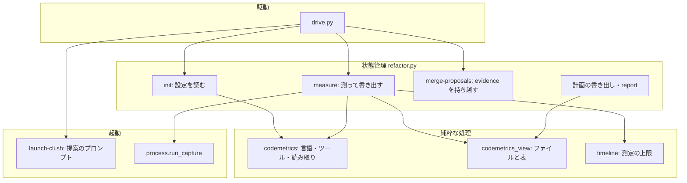
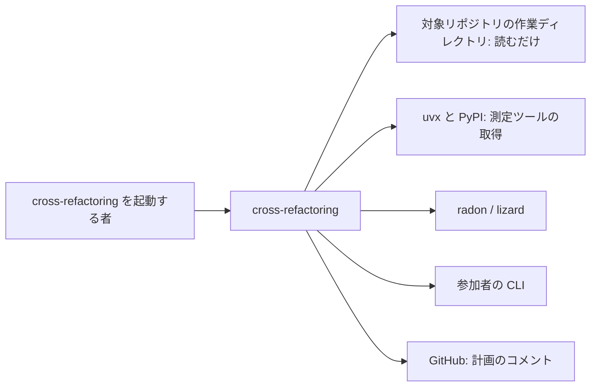
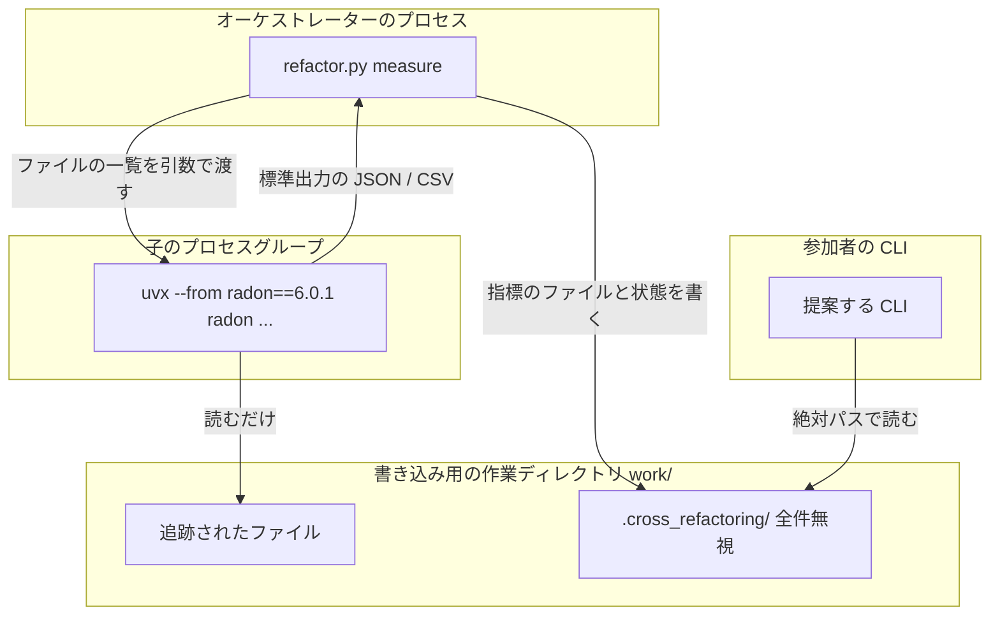
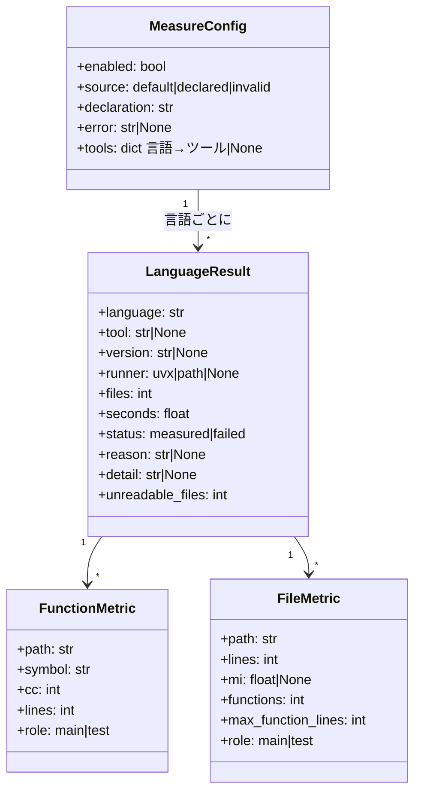
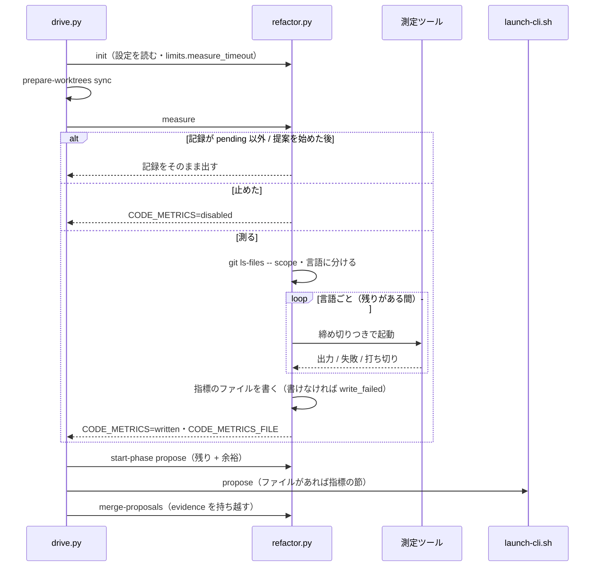
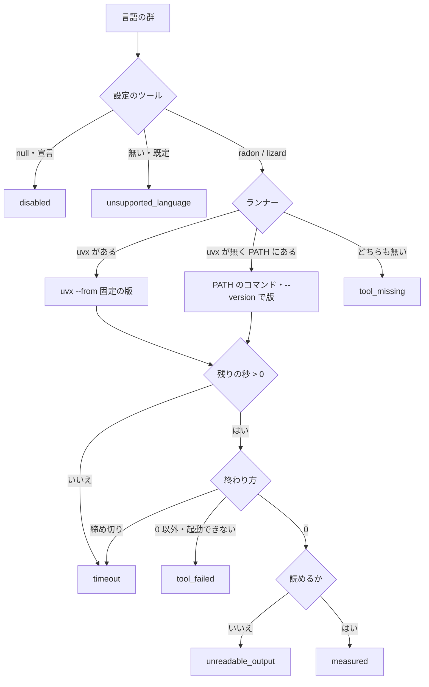
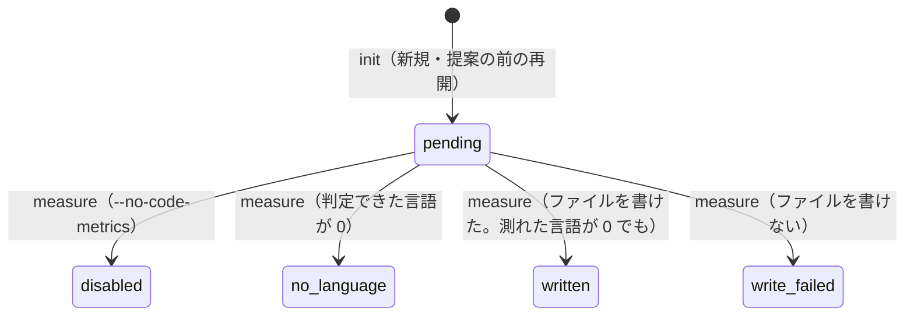

# #1319: cross-refactoring の提案の前に指標を測る — 設計

要求と受け入れ条件は #1319 の本文にある（コピーは [issue-1319-requirements.md](issue-1319-requirements.md) ）。
この文書は「どう作るか」だけを扱う。

## 例: `supervise_lib` を対象に起動すると

```bash
python3 scripts/drive.py 1320 --scope plugins/ndf/scripts/supervise_lib plugins/ndf/scripts/tests \
    --baseline-test "uv run --frozen --project . --all-extras pytest plugins/ndf/scripts/tests -q -n 4"
```

1. `init` が `.ndf/code-metrics.json` を探す。無いので既定の対応（Python → radon、ほかの言語 → lizard）を
   状態ファイルの `code_metrics.config` に書く。`limits.measure_timeout` は `0.05·30 分 = 90 秒` になる
2. 駆動が読み取り用の作業ディレクトリを HEAD へ同期した後、提案を起動する前に `refactor.py measure 1320` を打つ
3. `measure` が `git ls-files -- <対象範囲>` で追跡されたファイルを集め、拡張子で言語に分ける。Python の
   ファイルを `uvx --from radon==6.0.1 radon cc -j` と `radon mi -j` で測る
4. 指標のファイル `<作業ディレクトリ>/work/.cross_refactoring/code-metrics-rf1320.md` ができる。
   本体の最初の行は `Engine.run`（`supervise_lib/engine.py` ・CC 45・101 行）で、ファイルの表の MI が
   最も低いのは `slow.py`（24.4）である
5. 提案のプロンプトに「指標」の節が入り、このファイルのパスが載る。参加者は、提案の `evidence` に
   `{"cc": 45, "lines": 101}` と根拠にした値を書ける。書かなくても見送られない
6. リファクタリング計画のコメントと `refactor.py report` に「指標の測定」の節ができる
   （`python ・ radon 6.0.1 ・ uvx ・ 103 ファイル ・ 0.7 秒 ・ 測った`）

uvx も radon も無い環境では、4 のファイルに `python | tool_missing` の行だけが載り、5 以降は同じように進む。

## ドメインモデル

### コンテキスト

| コンテキスト | 何の語が 1 つの意味に決まるか |
| --- | --- |
| `ndf-cross-refactoring` | 指標・指標のファイル・測定ツール・測定の宣言・根拠の値。提案・改善候補・リファクタリング計画は今の意味のまま |

1 つのコンテキストに収まる。測定ツール（radon・lizard）は外部のコマンドで、その出力を指標の形へ
直すのは `ndf-cross-refactoring` の側の腐敗防止層（`codemetrics` の読み取り）である。

### 集約

| 集約 | 持ち主（書き換えてよいもの） | 根 | エンティティ | 値オブジェクト |
| --- | --- | --- | --- | --- |
| 実行の状態（状態ファイル） | `refactor.py` の副コマンド。測定の記録は `init` と `measure` だけが書く | 実行（`id`） | 指標の測定の記録（`code_metrics`）・改善候補・改善項目 | 測定の設定・言語ごとの結果・時間の上限（`limits`） |
| 指標のファイル | `measure` だけが書く。参加者は読むだけ | 指標のファイル（1 実行に 1 つ） | — | 関数の指標・ファイルの指標 |
| 提案 | 参加者の CLI が結果ファイルへ書き、`merge-proposals` が読む | 提案 1 件 | — | 根拠の値（`evidence`） |

指標のファイルは状態ファイルからパス（`code_metrics.file`）で参照する。中身を状態ファイルへ写さない（決定 12）。

### 不変条件

| # | 集約 | 条件 | 破れたときの扱い |
| --- | --- | --- | --- |
| I1 | 実行の状態 | 測定は 1 実行に 1 回だけ終わる。`code_metrics.status` が `pending` 以外なら `measure` は測らない | 2 回目の `measure` は記録をそのまま出して 0 で終わる |
| I2 | 実行の状態 | 提案の手順を始めた後（`phases.propose.started_at` がある）は測らない | `measure` は測らずに 0 で終わる。記録が無ければ無いまま |
| I3 | 指標のファイル | 載るファイルは、`--scope` の中で git が追跡しているものだけである | 集め方を `git ls-files` に限る。範囲外のパスが出たら捨てる |
| I4 | 指標のファイル | 載る値の出所は測定ツールの出力と NDF が数えた行数だけで、LLM の申告を使わない | 参加者の CLI を測定に使わない。提案の `evidence` を指標のファイルへ書き戻さない |
| I5 | 実行の状態 | 測れなかった理由は識別子の集合（`codemetrics.REASONS`）の値だけで、指標のファイル・計画・報告で同じ値を使う | 集合に無い値を書かない（書く側を 1 か所にする） |
| I6 | 実行の状態 | 測定の失敗（ツールが無い・落ちる・読めない・遅い・宣言が壊れている・書けない）で、`measure` の終了コードは 0 のまま | 失敗は記録に残して提案へ進む。状態ファイルを読めないときだけ 4 |
| I7 | 提案 | `evidence` の有無と中身は、改善候補の採否・順位・見送りの理由を変えない | `evidence` を正規化で落としても提案そのものは残す |
| I8 | 実行の状態 | 測定の前後で、対象リポジトリの追跡されたファイルが変わらない | 書き出しは一時ディレクトリ（全件無視の `.gitignore` の中）だけに限る |
| I9 | 実行の状態 | 測定の所要は `measure_deadline` を超えない（打ち切りの後始末の `kill_grace` を除く） | 残りが尽きた言語は起動せずに `timeout` にする |

### ドメインイベント

| # | イベント | 発生元 | 受け手 |
| --- | --- | --- | --- |
| E1 | 測定の設定を読み込んだ | `init`（再開では提案の前だけ） | `measure`（設定を使う）・計画と報告（宣言を使わなかった理由を載せる） |
| E2 | 対象範囲のファイルを言語ごとに分けた | `measure` | `measure`（言語ごとに起動する） |
| E3 | 言語ごとにツールを起動した | `measure` | `measure`（出力を読む） |
| E4 | ツールの出力を指標の共通の形へ直した | `codemetrics` の読み取り | `codemetrics_view`（指標のファイルを組む） |
| E5 | 指標のファイルを書き出した | `measure` | `launch-cli.sh`（提案のプロンプトへパスを載せる） |
| E6 | 参加者が指標のファイルを読んで提案した | 参加者の CLI | `merge-proposals`（`evidence` を候補へ持ち越す） |
| E7 | 計画と完了報告に測定の記録を載せた | `plan.py` の書き出し・`report` | Pull Request のコメント・完了報告の読み手 |

### 用語

| 用語 | 意味 | 用語集への反映 |
| --- | --- | --- |
| 指標 | `cross-refactoring` が提案の前に対象範囲のコードを測定ツールで測った値。関数ごとの循環的複雑度、ファイルごとの保守性か大きさ、行数 | 追加（`ndf-cross-refactoring`） |
| 指標のファイル | 提案の前に 1 回だけ作り、参加者の全員が読む指標の測定の結果 | 追加（`ndf-cross-refactoring`） |
| 測定ツール | 言語ごとに指標を測る外部のコマンド（radon・lizard など） | 追加（`ndf-cross-refactoring`） |
| 測定の宣言 | 言語ごとの測定ツールをプロジェクトが置き換える `.ndf/code-metrics.json` | 追加（`ndf-cross-refactoring`） |
| 根拠の値 | 提案が根拠にした指標の値。提案の JSON の `evidence` に書き、採否には使わない | 追加（`ndf-cross-refactoring`） |

## 機能一覧

| # | 機能 | 誰が使うか |
| --- | --- | --- |
| F1 | 提案の前に、対象範囲の言語を判定して指標を測る | オーケストレーター（`drive.py`） |
| F2 | 言語とツールの対応を、宣言で置き換え、引数で測定を止める | cross-refactoring を起動する者 |
| F3 | 測った結果を指標のファイル 1 つにまとめ、本体とテストを分けて載せる | 提案する参加者 |
| F4 | 提案のプロンプトに指標のファイルを示し、提案に根拠の値を書かせる | 提案する参加者 |
| F5 | 測れなかった言語と理由を記録し、止めずに提案へ進む | オーケストレーター |
| F6 | 計画と完了報告に、言語・ツール・版・所要秒と、測れなかった理由を載せる | Pull Request と完了報告の読み手 |
| F7 | 言語ごとの既定の測定ツールと、読む指標を `lang-*.md` に書く | 実装担当と、手で測る者 |

## 構成要素

| 要素 | 責務 | 新設 / 変更 |
| --- | --- | --- |
| `refactor_lib/codemetrics.py` | 言語の表・ツールの表（版の固定）・宣言の読み取りと重ね合わせ・ファイルの言語分け・ツールのコマンドの組み立て・出力の読み取り・識別子の集合（`REASONS`）。**純粋な処理だけを置く**（起動も書き出しもしない） | 新設 |
| `refactor_lib/codemetrics_view.py` | 読み取った指標から、指標のファイル（Markdown）と、計画・報告の「指標の測定」の表を組む。純粋な処理 | 新設 |
| `refactor_lib/commands/measure.py` | `cmd_measure`。ファイルの収集（git）・ランナーの解決・締め切りつきの起動・行数の数え上げ・指標のファイルの書き出し・状態の保存・KEY=VALUE の出力 | 新設 |
| `refactor_lib/process.py` | 標準出力と標準エラーを分けて受け取り、締め切りでプロセスグループごと止める `run_capture` を足す（`_kill_process_group` を使い回す） | 変更 |
| `refactor_lib/timeline.py` | 係数 `MEASURE_SHARE`（0.05）と `MEASURE_PROPOSE_CAP`（0.5）、表の `measure_timeout`、純粋な `measure_deadline(now, limits)` | 変更 |
| `refactor_lib/commands/setup.py` | `init` が測定の設定を読み、`code_metrics = {config, status: pending}` を書く。再開では提案の前で記録が無いときだけ同じことをする。`--code-metrics` を「知らせる」の表へ載せる | 変更 |
| `refactor.py` | `init` に `--code-metrics / --no-code-metrics`、副コマンド `measure <id>` を登録する | 変更 |
| `drive.py` | 提案の同期の後、`start-phase propose` の前に `measure` を 1 回打つ | 変更 |
| `launch-cli.sh` + `prompts/propose.md` | 提案の手順だけ、指標のファイルがあれば `$RF_METRICS_BLOCK`（パスと `evidence` の書き方）を展開する。無ければ空にする | 変更 |
| `prompts/plan.md` の候補（`launch-cli.sh` の jq） | 候補に `evidence` があれば載せる | 変更 |
| `refactor_lib/proposals.py` | `evidence` を正規化して候補へ持ち越す。形の悪い値は落とすだけで、見送りの理由にしない | 変更 |
| `refactor_lib/plan.py` | 計画に「指標の測定」の節と、時間の上限の表に `measure_timeout` の行を足す | 変更 |
| `refactor_lib/commands/report.py` | 完了報告に「指標の測定」の節を足す（計画と同じ表を `codemetrics_view` から受ける） | 変更 |
| `SKILL.md` ・ `docs/01` ・ `docs/02` ・ `docs/04` | 引数の表・全体フロー・測定の節・締め切りの表・完了報告の列挙 | 変更 |
| `refactoring/references/lang-{python,javascript,typescript,php}.md` | 「指標の測定」の節（既定のツール・読む指標・手で測るコマンド） | 変更 |
| `docs/glossary/glossary.json` | 指標・指標のファイル・測定ツール・測定の宣言・根拠の値の 5 語を足す | 変更 |

### 構成要素図



図に含めないもの: 文書（`SKILL.md` ・ `docs/` ・ `lang-*.md` ・用語集）と、`refactor.py` の引数と副コマンドの登録。

### 文脈



変えられない外部は `uvx`・PyPI・測定ツール・参加者の CLI・GitHub である。

### 配置



測定は `work/` を対象に行う。読み取り用の作業ディレクトリは同じ HEAD へ同期済みで、パスはどれも
リポジトリ相対なので、指標のファイルの値は参加者の作業ディレクトリのファイルにそのまま当たる。

### 置き場所

```text
plugins/ndf/skills/cross-refactoring/
├── SKILL.md                          # 変更: 引数・全体フロー・完了報告
├── docs/01-state-and-propose.md      # 変更: 指標の測定の節
├── docs/02-plan-and-implement.md     # 変更: 締め切りの表に測定の上限
├── docs/04-verify-and-report.md      # 変更: 完了報告の列挙
├── prompts/propose.md                # 変更: $RF_METRICS_BLOCK
├── scripts/
│   ├── drive.py                      # 変更
│   ├── launch-cli.sh                 # 変更
│   ├── refactor.py                   # 変更
│   └── refactor_lib/
│       ├── codemetrics.py            # 新設
│       ├── codemetrics_view.py       # 新設
│       ├── commands/measure.py       # 新設
│       ├── commands/setup.py         # 変更
│       ├── commands/report.py        # 変更
│       ├── plan.py                   # 変更
│       ├── process.py                # 変更
│       ├── proposals.py              # 変更
│       └── timeline.py               # 変更
└── tests/test_code_metrics*.py       # 新設
plugins/ndf/skills/refactoring/references/lang-{python,javascript,typescript,php}.md  # 変更
```

既存の `refactor_lib/measure.py` は手順の所要の要約で、この変更とは別物である。名前が紛れないよう、
新しい部品は `codemetrics` の名前で置く。

### 値の集合へ値を足すことで当たる既存の規則

| 既存の規則 | 足す値 | 当てはまるか | 扱い |
| --- | --- | --- | --- |
| 状態ファイルに載る引数は `RESUME_*` の表のどれかに必ず載る（`setup.py`） | `--code-metrics` | 当てはまらない（表に無い） | `RESUME_NOTIFY_FIELDS` へ `code_metrics` を足し、`_notify_view` で `code_metrics.config.enabled` と比べる |
| 時間に関わる数値は `timeline.py` の係数だけで出す（決定 24） | 測定の上限 | 当てはまらない（係数が無い） | `MEASURE_SHARE` と `MEASURE_PROPOSE_CAP` を足す |
| 時間の上限の表（`plan.py` の `_LIMIT_ROWS`）と「締め切り」の表（`docs/02`）は同じ値を並べる | `measure_timeout` | 当てはまらない | 両方へ行を足す |
| 固定のまま残す値は `FIXED_VALUES` に並べて報告する | 測定の打ち切りの `kill_grace` | 当てはまる（`run_with_timeout` と同じ 5 秒を使う） | 行の説明に「測定の打ち切り」を足す |
| 手順書の変数は `cmd_*` から 1 階層で出す（`check-skill-shell-vars.py`） | `CODE_METRICS` / `CODE_METRICS_FILE` | 当てはまらない | `cmd_measure` から直接 `statefile.emit` する |
| 雛形は `${RF_*}` を `safe_substitute` で展開する | `RF_METRICS_BLOCK` | 当てはまる | `export_prompt_env` に足すだけ |
| 見送りの理由の集合（`budget` ほか 8 つ） | — | 足さない | `evidence` は見送りの理由を作らない（I7） |

## 構造



型は辞書で持つ（今の状態ファイルと同じ）。`FunctionMetric` と `FileMetric` は `measure` の中だけで使い、
状態ファイルには載せない（決定 12）。

## データ構造

### 言語とツールの既定

| 言語 | 拡張子 | 既定のツール |
| --- | --- | --- |
| `python` | `.py` | `radon` |
| `javascript` | `.js` `.mjs` `.cjs` `.jsx` | `lizard` |
| `typescript` | `.ts` `.tsx` `.mts` | `lizard` |
| `php` | `.php` | `lizard` |
| `go` | `.go` | `lizard` |
| `ruby` | `.rb` | `lizard` |
| `java` | `.java` | `lizard` |
| `kotlin` | `.kt` | `lizard` |
| `swift` | `.swift` | `lizard` |
| `rust` | `.rs` | `lizard` |
| `c` | `.c` `.h` | `lizard` |
| `cpp` | `.cc` `.cpp` | `lizard` |
| `csharp` | `.cs` | `lizard` |
| `lua` | `.lua` | `lizard` |
| `shell` | `.sh` `.bash` | なし（`unsupported_language`） |

拡張子はどれも lizard 1.24.0 で関数を検出できることを確かめた（2026-09-26。`.scala` は検出しなかったため
表に入れない）。表に無い拡張子（`.md` `.json` など）と拡張子の無いファイルは言語を判定せず、
「言語を判定しなかったファイル」の数にだけ入れる。**表にパスもリポジトリ固有の設定も入れない**（AC8）。

| ツール | パッケージと版 | 起動（uvx があるとき） | 使う出力 |
| --- | --- | --- | --- |
| `radon` | `radon==6.0.1` | `uvx --from radon==6.0.1 radon cc -j <files>` と `... radon mi -j <files>` | cc: 関数とメソッドの `complexity` ・ `lineno` ・ `endline` ・ `classname`（`type` が `class` の行は除く）。mi: ファイルの `mi` と `rank` |
| `lizard` | `lizard==1.24.0` | `uvx --from lizard==1.24.0 lizard --csv <files>` | 1 行 11 列の CSV（NLOC・CCN・token・PARAM・length・location・file・function・long_name・start・end）。使うのは CCN・length・file・function |

**行数（`lines`）は NDF が数える。** 空白だけの行を除いた行の数で、全言語で同じ数え方にする（決定 11）。
関数の行数は radon なら `endline − lineno + 1`、lizard なら `length` である。

### 測定の宣言 `.ndf/code-metrics.json`

```json
{"version": 1, "tools": {"python": "lizard", "shell": null}}
```

| 鍵 | 型 | 空を許すか | 意味 |
| --- | --- | --- | --- |
| `version` | 整数 | 許さない | `1` だけ |
| `tools` | オブジェクト | 許さない（空のオブジェクトは可） | 鍵は上の表の言語名。値は `"radon"`（`python` だけ）・`"lizard"`・`null`（その言語を測らない） |

読むのは書き込み用の作業ディレクトリ（Pull Request の head）の `.ndf/code-metrics.json` である。形が違えば
（JSON でない・`version` が違う・知らない鍵・知らない言語・知らないツール・`radon` を `python` 以外へ当てる）
**宣言の全体を使わず既定で測り**、`config.source = "invalid"` と理由を残す（前提 8）。一部の鍵だけを
生かさない。宣言した言語だけを置き換え、ほかの言語は既定のまま測る（AC6）。

### 状態ファイルに足す鍵

`code_metrics`（オブジェクト。`init` が作り、`measure` が埋める）:

| 鍵 | 型 | 空を許すか | 意味 |
| --- | --- | --- | --- |
| `config.enabled` | 真偽 | 許さない | `--no-code-metrics` なら偽 |
| `config.source` | 文字列 | 許さない | `default` / `declared` / `invalid` |
| `config.error` | 文字列 | 許す | 空は「宣言を使えなかった理由が無い」 |
| `config.tools` | オブジェクト | 許さない | 重ね合わせた後の言語 → ツール（`null` は測らない） |
| `status` | 文字列 | 許さない | `pending` / `written` / `disabled` / `no_language` / `write_failed` |
| `head` | 文字列 | 許す | 測った HEAD。空は「まだ測っていない」 |
| `started_at` / `seconds` | 時刻 / 数 | 許す | 空は「まだ測っていない」 |
| `deadline_seconds` | 整数 | 許す | その実行で使えた測定の時間（`measure_deadline` の値） |
| `file` | 文字列 | 許す | 指標のファイルの絶対パス。空は「ファイルを作らなかった」 |
| `ignored_files` | 整数 | 許す | 言語を判定しなかったファイルの数 |
| `languages` | 配列 | 許す | 言語ごとの結果（`LanguageResult`）。`status` が `written` のときだけ 1 件以上 |

`limits.measure_timeout`（整数・秒）を足す。

**旧い状態ファイル（`code_metrics` が無い）での再開**: 提案を始める前（`phases.propose.started_at` が無い）なら
`init` の再開が設定を読んで `pending` で作り、`measure` が測る。始めた後なら作らない。計画と報告は
「記録なし」と 1 行出す（決定 8）。`schema` は上げない（鍵を足すだけで、旧い形の読み手が壊れない）。

**過去の記録は上書きしない。** 測定は 1 実行に 1 回で、状態ファイルは 1 実行に 1 つであるため、上書きで
失う過去が無い。改修の前後の比較は範囲外である。

### 指標のファイル

置き場は `<TMP_DIR>/code-metrics-rf<ID>.md`（`TMP_DIR` は `work/.cross_refactoring/`）。形は次のとおり。

```markdown
# 指標（cross-refactoring rf1320）

- 測った版: 3f2a1c0 / 対象範囲: plugins/ndf/scripts/supervise_lib plugins/ndf/scripts/tests
- 載せたもの: 対象範囲の中で git が追跡しているファイル。本体とテストを分けて載せる。上位だけで、全件ではない
- 言語とツールの対応: 既定（.ndf/code-metrics.json は無い）
- 言語を判定しなかったファイル: 47 本

## 測れなかった言語

（なし）

## python（radon 6.0.1 ・ uvx）

本体: 19 ファイル・関数 160 個・CC 11 以上 36 個・最大 CC 45 / テスト: 84 ファイル・関数 1,910 個・CC 11 以上 32 個・最大 CC 41

### 複雑な関数（本体・CC の降順・上位 30）

| ファイル | 関数 | CC | 行 |
| --- | --- | --- | --- |
| plugins/ndf/scripts/supervise_lib/engine.py | Engine.run | 45 | 101 |

### ファイル（本体・行数の降順・上位 20）

| ファイル | 行 | MI | 関数 | 最長の関数の行 |
| --- | --- | --- | --- | --- |
```

| 表 | 並び | 上限 |
| --- | --- | --- |
| 複雑な関数（本体） | CC の降順、同じなら行数の降順・パス | 30 行 |
| 複雑な関数（テスト） | 同上 | 10 行 |
| ファイル（本体） | 行数の降順 | 20 行 |
| ファイル（テスト） | 同上 | 10 行 |

上限は `codemetrics_view` の定数に置く。要約の行の件数（CC 11 以上の数など）は全件から数える。
本体かテストかは `pathkinds.is_test_path` で分ける（決定 1）。lizard の言語では MI の列が `—` になる。
radon が構文を読めなかったファイルは「読めなかったファイル N 本」を要約の行に足し、表には載せない。
**ファイルの集合は集めた一覧が正である。** `radon cc` は関数の無いファイル（`__init__.py` など）を出力に
含めないため、ツールの出力からファイルを数えない（2026-09-26 の実測で 103 本中 2 本が出なかった）。

### CRUD

| 機能 | 宣言 | `code_metrics` | `limits` | 指標のファイル | 提案の結果 | 改善候補 |
| --- | --- | --- | --- | --- | --- | --- |
| F2 `init` | R | C | C | — | — | — |
| F1 F3 F5 `measure` | — | U | R | C | — | — |
| F4 提案（参加者） | — | — | — | R | C | — |
| F4 `merge-proposals` | — | — | — | — | R | C（`evidence`） |
| F6 計画・報告 | — | R | R | — | — | R |

## 入出力の契約

### `refactor.py init` に足す引数

| 名前 | 入力 | 既定 | 互換性 |
| --- | --- | --- | --- |
| `--code-metrics` / `--no-code-metrics` | 真偽（`BooleanOptionalAction`、既定は `None`） | 新規の実行で `True`（`NEW_RUN_DEFAULTS`） | 付けない既存の起動は測る側に変わる。再開で状態と違えば「反映しない」と知らせる |

`drive.py` は知らない引数を `init` へそのまま渡すため、駆動の引数は増やさない。

### `refactor.py measure <id>`

| 項目 | 内容 |
| --- | --- |
| 入力 | 実行の番号。環境変数 `CROSS_REFACTORING_TMP_DIR`（今の副コマンドと同じ） |
| 出力（標準出力） | `CODE_METRICS=<status>`（記録が無ければ空）と `CODE_METRICS_FILE=<絶対パス>`（作らなければ空） |
| 出力（標準エラー） | 言語ごとに `✅ python: radon 6.0.1（uvx）103 ファイル 0.7 秒` か `⚠ go: tool_missing（…）` の 1 行 |
| 終了コード | 0（測った・測れなかった・止めた・測らずに返した、のいずれも）。4 は状態ファイルを読めないときだけ |
| 冪等 | `status` が `pending` 以外、または提案を始めた後は、測らずに記録を出す（I1 I2） |

### 言語ごとの失敗の識別子（`codemetrics.REASONS`）

| 識別子 | いつ | 詳細に書くもの |
| --- | --- | --- |
| `tool_missing` | uvx も、そのツールのコマンドも PATH に無い | 探したコマンドの名前 |
| `unsupported_language` | 言語の表にあるが、既定の対応にツールが無い（`shell`） | — |
| `disabled` | 宣言がその言語を `null` にした。実行の全体を止めたときは `status = disabled` | — |
| `tool_failed` | 起動できない、または 0 以外で終わった（uvx の取得の失敗を含む） | 終了コードと標準エラーの末尾 5 行 |
| `unreadable_output` | 0 で終わったが、出力を読めない（JSON でない・CSV の列が 11 でない） | 読めなかった箇所 |
| `timeout` | 締め切りを過ぎた、または起動の前に残りが無かった | 使えた秒 |

実行の単位の値（`status`）と宣言の理由（`declaration_invalid`）も同じモジュールに置く。指標のファイル・
計画・報告はこの集合の値だけを書く（I5）。

### 提案の JSON の `evidence`

```json
{"path": "plugins/ndf/scripts/supervise_lib/engine.py", "symbol": "Engine.run",
 "smell": "long_method", "technique": "extract_method", "severity": "major",
 "rationale": "...", "plan": "...", "test_gap": false, "estimated_diff_lines": 80,
 "evidence": {"cc": 45, "lines": 101}}
```

| 鍵 | 型 | 必須か | 意味 |
| --- | --- | --- | --- |
| `evidence` | オブジェクト | 任意 | 鍵は `cc` / `mi` / `lines` / `functions` / `max_function_lines`、値は数 |

`merge-proposals` の正規化: オブジェクトでなければ落とす。知らない鍵と数でない値は、その鍵だけ落とす。
**どの場合も提案は残り、見送りの理由を作らない**（I7・AC17）。同じ鍵の提案を統合するときは、既にある鍵を
残し、無い鍵だけ足す。改善候補は `evidence` を持ち越し、計画のプロンプトの候補に載る。

### 提案のプロンプト（`$RF_METRICS_BLOCK`）

`launch-cli.sh` が、手順が `propose` で、`code_metrics.file` が空でなく、そのファイルが実在するときだけ
次の節を組む。それ以外は空文字にする（AC18）。

```markdown
## 指標（測定の結果・読むだけ）

提案の前に `<code_metrics.file>` を読んでください。対象範囲のコードを測定ツールで測った値です。
作業ディレクトリの外にありますが、このファイルは読んでかまいません。値を根拠にした提案は、
`evidence` に使った値を書けます（例: `"evidence": {"cc": 45, "lines": 101}`）。書かなくても見送られません。
```

雛形 `propose.md` は「必須コンテキスト」の直後に `$RF_METRICS_BLOCK` を置く。提出形式の例と「守ること」は
変えない。

### 計画と完了報告の「指標の測定」の節

`codemetrics_view.record_lines(state)` が 1 つの行の並びを返し、`plan.py` と `report.py` の両方が使う。

```markdown
## 指標の測定

- 状態: written / 言語とツールの対応: 既定 / 所要: 0.8 秒（上限 90 秒）
- 指標のファイル: /tmp/ndf-worktrees/devbasex--ai-plugins/rf1320/work/.cross_refactoring/code-metrics-rf1320.md

| 言語 | ツール | 版 | ランナー | ファイル | 秒 | 結果 |
| --- | --- | --- | --- | --- | --- | --- |
| python | radon | 6.0.1 | uvx | 103 | 0.7 | 測った |
| shell（別の実行の例） | — | — | — | 2 | — | unsupported_language |
```

宣言を使わなかったときは `言語とツールの対応: 既定（declaration_invalid: <理由>）` と書く。記録が無い
実行は `（記録なし）` の 1 行にする。

## 処理の流れ



### 言語ごとの判定



言語の順は名前の辞書順にする（結果が起動のたびに変わらない）。ファイルは 1 回の起動に 500 本までに分け、
結果を合わせる（引数の長さの上限を超えないため）。分けた起動の 1 つが失敗すれば、その言語を失敗にする。

### `code_metrics.status` の遷移



`pending` 以外の状態から出る遷移は無い（I1）。`pending` のまま提案が始まった実行（測定の途中で落ちて
再開した場合など）は、提案を始めた後の `measure` が測らないため、`pending` のまま残り、計画と報告は
「測っていない」と書く。

## 時間の配分

| 値 | 式 | B = 30 分 | 書き出す時点 |
| --- | --- | --- | --- |
| 測定の上限（`measure_timeout`） | `0.05·B` | 90 秒 | `init` |
| 測定に使える時間（`measure_deadline`） | `min(measure_timeout, 0.5·max(0, 提案の枠の終わり − 今))` | 着手前のテストが 5 分なら `min(90, 0.5·(360 − 300))` = 30 秒 | `measure`（`deadline_seconds`） |
| 提案の監視の上限 | 今と同じ（提案の枠の終わりまでの残り + 余裕） | — | `start-phase` |

**提案の枠の中から割き、枠の終わり（`開始 + 0.20·B`）は動かさない**（決定 7）。ほかの手順の終わりの時刻は
どれも開始からの式のままで、ずれない（AC15 の前半）。`docs/02` の「締め切り」の表に 2 行を足す。
打ち切った後の後始末は固定の `kill_grace` 5 秒で、`FIXED_VALUES` に既にある。

## 非機能の実現方式

| 大項目 | 要求の条件 | 実現方式 | 確かめ方 |
| --- | --- | --- | --- |
| 性能・拡張性 | 測定の所要は AC13 の上限に収まる。上限は想定最大時間から出る | 言語ごとに順に起動し、各起動に締め切りまでの残りを渡す。残りが尽きた言語は起動しない。B = 30 分で上限 90 秒。実測はこのリポジトリの `plugins/` の Python 549 本で `radon cc` 0.8 秒・`radon mi` 1.9 秒、lizard（`.py` `.js` `.ts`）1.0 秒（2026-09-26、キャッシュ済み） | 遅い偽のツールで締め切りを超えさせ、所要が `deadline_seconds + kill_grace` を超えないこと |
| 運用・保守性 | 測れなかった理由は識別子で残し、指標のファイル・計画・完了報告で同じ識別子を使う | 識別子は `codemetrics.REASONS` の 1 か所に置き、3 つの出力はどれも `codemetrics_view` を通す | 3 つの出力に同じ識別子が出ることを、失敗させた実行で確かめる |
| システム環境 | 利用者の環境へ常駐のインストールを増やさない。一時実行のキャッシュへの書き込みは許す | `uvx` の一時実行だけを使い、`uv tool install` も `npx` も使わない。uv のキャッシュ（`~/.cache/uv`）への書き込みは許す。対象リポジトリへは書かない | 測定の前後で `git status --porcelain` が同じこと。起動したコマンドに `install` が無いこと |

## 決定の記録

### 決定 1: 本体とテストの両方を測り、分けて載せる

`--scope` には現状固定テストの置き場所を必ず含めるため、テストを外すと範囲の半分が測られない。テストの
重複や長いテストも提案の対象になる。本体の表を先に置いて件数を多く取り、テストの表は短くする。
本体だけを測る案は、テストへの提案の根拠を失うため採らない。

### 決定 2: Python は radon、ほかの言語は lizard 1 つで受ける

radon は Python の CC と MI を 1 つのパッケージで出す。lizard は JavaScript・TypeScript・PHP・Go を含む 13 言語の
CC と関数の長さを、設定なしで同じ CSV の形で出す。どちらも PyPI にあり、ランナーが `uvx` 1 つで足りる。
ESLint の `complexity` は TypeScript にパーサーのプラグインと設定が要り、phpmetrics は PHP の実行環境が要るため
採らない。

### 決定 3: `uvx --from <パッケージ>==<版>` で起動し、uvx が無いときだけ PATH のコマンドを使う

版を NDF が固定すると、同じ対象から同じ値が出る。プロジェクトに入っているツールを優先すると、版が
プロジェクトごとに変わり、`.venv` の探し方もプロジェクトの構成に依存する。uvx の無い環境で PATH に
コマンドがあれば、測れないよりは測れる方を採り、その版（`--version`）とランナー `path` を記録に残す。
uvx が失敗したときに PATH へ切り替える案は、失敗の理由を隠すため採らない。

### 決定 4: 指標のファイルは Markdown 1 本で、上位だけを載せ、一時ディレクトリに置く

読むのは参加者の LLM であり、表なら追加の手順なしに読める。全件を載せると大きい範囲で数千行になり、
提案の時間を読むことに使う。要約の件数は全件から数えるので、上位の外にどれだけあるかは分かる。
置き場は結果ファイルと同じ一時ディレクトリで、全参加者が既に書き込んでいる場所である。参加者ごとの
作業ディレクトリへ写す案は、1 つだけ作る前提 6 に反するため採らない。JSON は機械の読み手がいないため採らない。

### 決定 5: 根拠の欄は `evidence`（指標の名前 → 数）で、採否に使わない

指標の名前を鍵にすれば、計画の担当がどの値を根拠にしたかを読める。値の検証（指標のファイルと一致するか）は
しない。一致しない値で落とす規則を置くと、指標が採否に効き、前提 7 に反する。自由文の欄は、既にある
`rationale` と重なるため採らない。

### 決定 6: 宣言は `.ndf/code-metrics.json` を新設し、引数は `--no-code-metrics` にする

`.ndf/` の既存の宣言は用途ごとに 1 ファイルで（`review.json` ・ `supervise.json` など）、測定の対応はどれにも
属さない。名前に `code-` を付けるのは、既存の `run_metrics` と `report --metrics`（種類別の件数）と区別する
ためである。宣言で持つのはツールの置き換えだけで、版の上書きと拡張子の追加は持たない（要件に無い）。
ツールを引数で指定する案は、言語ごとの指定が引数の形に収まらないため採らない。

### 決定 7: 測定の時間は提案の枠から割き、枠の残りの半分までに抑える

新しい枠を提案の前に置くと、提案以降のすべての終わりの時刻と `docs/02` の式が変わる。提案の枠から割けば
式は 2 行足すだけで済む。上限を枠の残りの半分に抑えるのは、着手前のテストが長い実行でも、提案の時間を
測定が食い尽くさないためである。

### 決定 8: 旧い状態ファイルでも、提案を始める前なら測り、始めた後なら測らない

提案を始める前なら、測った結果を全参加者が読める。始めた後に測ると、既に動いている参加者と後から読む者で
材料が食い違い、前提 6 に反する。

### 決定 9: 測定は `init` に入れず、副コマンド `measure` にする

`init` は着手前のテストまでを持ち、再開のたびに打たれる。測定を入れると、再開の扱いと測定の 1 回だけの規則が
混ざる。副コマンドにすれば、駆動の中で提案の直前という位置が 1 か所に決まり、手順書（`docs/01`）の
bash の流れにも 1 行で書ける。

### 決定 10: 部品は `refactor_lib` に置き、共通ライブラリへは cross-review へ広げるときに移す

共通ライブラリ（`plugins/ndf/scripts/lib/`）は、2 つの Skill が同じ役割を 1 つだけ持つための置き場である。
使う者が cross-refactoring だけの今は、cross-review が何を要るか（指標のファイルか、記録の表か）が決まって
おらず、先に置くと 2 つ目の使い手の無い契約を固めることになる。`codemetrics` と `codemetrics_view` は
`refactor_lib` の非公開の名前に依存しない純粋な処理にし、移すときにそのまま動かせる形にする。

### 決定 11: 行数は NDF が空行を除いて数える

radon の `sloc` はコメントとドキュメント文字列を除き、lizard はファイルの行数を CSV に出さない。ツールの
値を使うと言語で意味が変わる。空行を除いた行なら全言語で同じ意味になり、標準ライブラリで数えられる。

### 決定 12: 関数とファイルの指標は状態ファイルに載せない

状態ファイルは保存のたびに実行の要約を書き直す（`run_metrics.after_save`）。数千件の指標を載せると、
以後のすべての保存が重くなる。状態ファイルには言語ごとの結果とファイルのパスだけを置く。

## テスト設計

| 受け入れ条件・不変条件 | どの振る舞いで縛るか | どう壊したら落ちるべきか |
| --- | --- | --- |
| AC1 | Python のファイルを含む範囲で `measure` を打つと、`start-phase propose` より前に指標のファイルができ、関数の CC・ファイルの MI・行数が載る | 駆動で `measure` を `start-phase propose` の後へ動かす。MI の読み取りを外す |
| AC2 | `.py` と `.ts` を含む範囲で、言語ごとの節と、節の見出しにツールの名前と版が出る | 言語の群を 1 つにまとめる。版を見出しから落とす |
| AC3 | 範囲外の追跡ファイルと、範囲内の追跡していないファイルが載らない | `git ls-files` を `find` に替える。パス指定の `--` を外す |
| AC4 | テストのパスの関数が「テスト」の表に、本体の関数が「本体」の表に出る | `is_test_path` の判定を外す |
| AC5 | 宣言の無いリポジトリで、既定の対応で測る | 既定の表から `python` を消す |
| AC6 | 宣言で `python` を `lizard` にすると Python は lizard で、`.ts` は既定の lizard のままで測る | 宣言の値を全言語へ当てる |
| AC7 | `--no-code-metrics` でファイルが作られず、`status` が `disabled` で、プロンプトに指標の節が無い | 止める引数を読み捨てる |
| AC8 | 既定の表と既定の値に `plugins/` などのパスと、このリポジトリ固有の設定が無い | 既定の表にこのリポジトリのパスを足す |
| AC9 | uvx もツールも PATH に無いとき、`measure` が 0 で終わり、ファイルと計画に `tool_missing` が出て、提案が起動される | ツールが無いときに 4 で止める |
| AC10 | `.go` だけの範囲は lizard で測られる。`.sh` だけの範囲は `unsupported_language` と記録して提案へ進む | `go` を表から消す。`unsupported_language` で止める |
| AC11 | 0 以外で終わるツール・壊れた出力を返すツールで、その言語が `tool_failed` / `unreadable_output` になり、ほかの言語は測られる | 1 言語の失敗で残りの言語を飛ばす |
| AC12 | 壊れた宣言（JSON でない・知らない鍵・`radon` を `typescript` へ）で既定で測り、ファイルと計画に `declaration_invalid` と理由が出る | 壊れた宣言で例外を上げる。一部の鍵だけ生かす |
| AC13 | `init` の後の `limits.measure_timeout` が `ceil(0.05·B·60)` で、B を変えると比例して変わる | 秒の固定値を入れる |
| AC14 | 締め切りを超える偽のツールで、子プロセスまで止まり、その言語が `timeout` になり、提案が起動される | プロセスグループではなく子だけを止める。打ち切りを外す |
| AC15 | 測定を足しても、`limits` の手順の終わりの時刻が足す前と同じである | 提案の枠の終わりに測定の上限を足す |
| AC16 | 提案のプロンプトに指標のファイルの絶対パスが載り、そのパスが実在する | 相対パスで載せる。書き出す前にプロンプトを組む |
| AC17 | `evidence` を書いた提案・書かない提案・形の悪い `evidence` の提案が、どれも同じ規則で候補になる | 形の悪い `evidence` の提案を捨てる。`evidence` の有無で並びを変える |
| AC18 | ファイルが無い（止めた・言語が無い・書けない）とき、プロンプトに指標の節もパスも無い | ファイルの有無を見ずに節を組む |
| AC19 | 計画に「指標の測定」の節があり、言語・ツール・版・秒と、測れなかった言語・理由が出る | 計画の書き出しから節を外す |
| AC20 | `report` に計画と同じ行が出る | 報告だけ別の組み立てにする |
| AC21 | 測定の前後で `git status --porcelain` が同じ | 指標のファイルを作業ディレクトリの直下へ書く |
| AC22 | uvx があるとき、起動の引数が `--from radon==6.0.1` と `--from lizard==1.24.0` を含む。uvx が無く PATH にあるとき、PATH のコマンドで起動し `runner` が `path` になる | 版の固定を外す。uvx があっても PATH を先に使う |
| AC23 | 既存の `tests/` がすべて通る | — |
| AC24 | 4 本の `lang-*.md` に既定のツールと読む指標がある | 目で確かめる（`.md` の文言を照合するテストは書かない） |
| I1 | 2 回目の `measure` がツールを起動せず、同じ記録を返す | 冪等の判定を外す |
| I2 | `phases.propose.started_at` がある状態で `measure` がツールを起動しない | 提案の開始の判定を外す |
| I3 | AC3 と同じ | — |
| I4 | 提案の `evidence` が指標のファイルと状態の `code_metrics` を変えない | 統合で `evidence` を指標へ書き戻す |
| I5 | 指標のファイル・計画・報告に出る理由が `REASONS` の値だけである | 出力の側で理由の文字列を組む |
| I6 | 全言語が失敗しても、宣言が壊れていても、ファイルを書けなくても `measure` が 0 で終わる | どれかの失敗で 0 以外を返す |
| I7 | AC17 と同じ | — |
| I8 | AC21 と同じ | — |
| I9 | AC14 と同じ。あわせて残りが 0 の言語はツールを起動しない | 残りが尽きた後も起動する |

**外部の取得には頼らない。** 偽の `uvx` ・ `radon` ・ `lizard` を置いた環境で、無い・落ちる・読めない・遅い
経路を確かめる（要求の「検証手段」）。実物のツールの出力の読み取りは、2026-09-26 に測った出力の形
（「データ構造」のツールの表）をもとにする。

## 未確認のまま残ること

| 項目 | 内容 | いつ決まるか |
| --- | --- | --- |
| claude・kiro が作業ディレクトリの外のファイルを読めるか | 結果ファイルを一時ディレクトリへ書けているため読めると見込む。agy は一時ディレクトリを `--add-dir` で既に足している | 手動確認（このリポジトリの PR で `drive.py` を 1 回動かす） |
| キャッシュの無い環境での初回の所要 | uvx の取得は通信に依存する。キャッシュ済みなら 0.1〜0.2 秒で起動した。キャッシュ済みの固定の版は `UV_OFFLINE=1` でも起動した | 実装で 1 度、キャッシュを空にして測る |
| 1 回の起動に渡すファイルの数（500 本） | 引数の長さの上限（macOS は 1 MB）に対する余裕として置いた値 | 実装で大きい範囲を渡して確かめる |
| radon のクロージャとネストした関数の載せ方 | cc の出力の `closures` を関数として載せるか | 実装（`tdd-cycle`）で出力を見て決める |
| lizard の関数名の形（`Class::method` など）と提案の `symbol` の書き方の差 | 参加者が読み替えられるかは使って分かる | 手動確認 |
