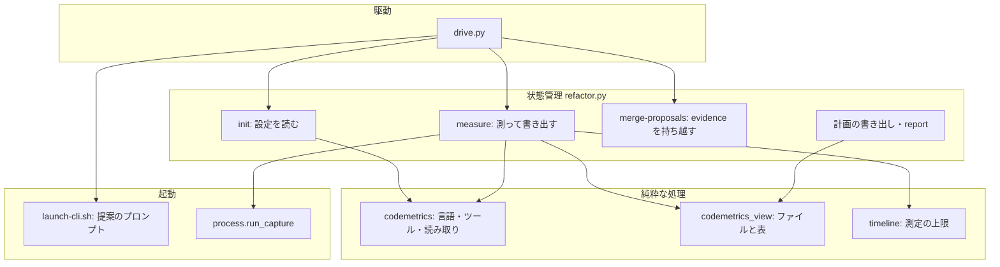
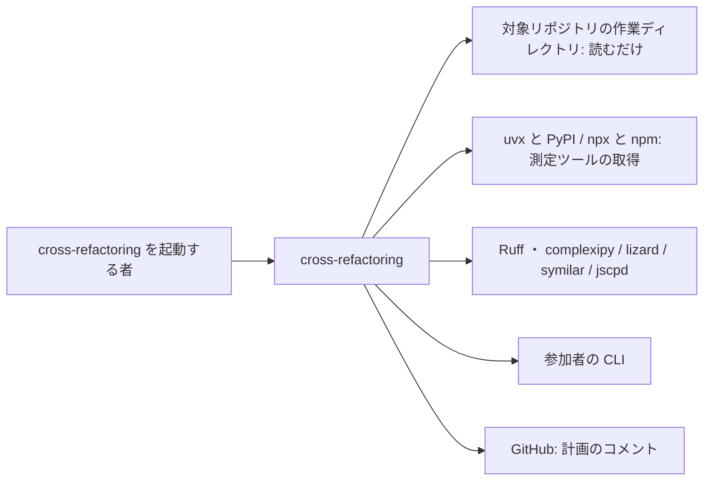
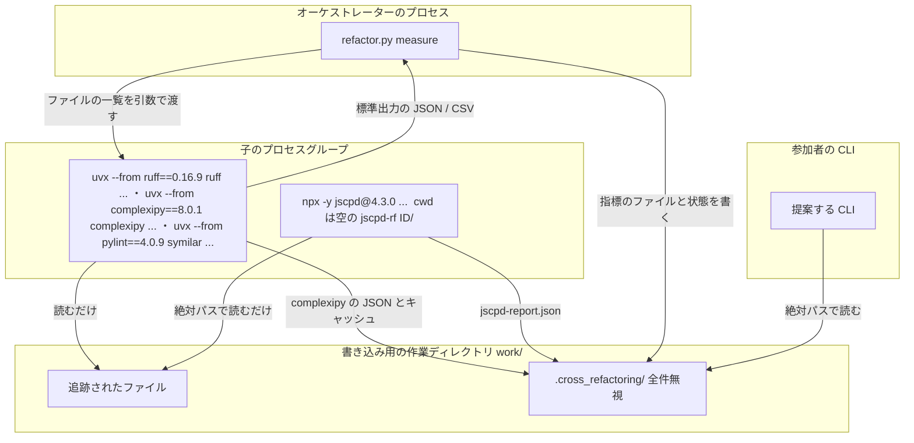
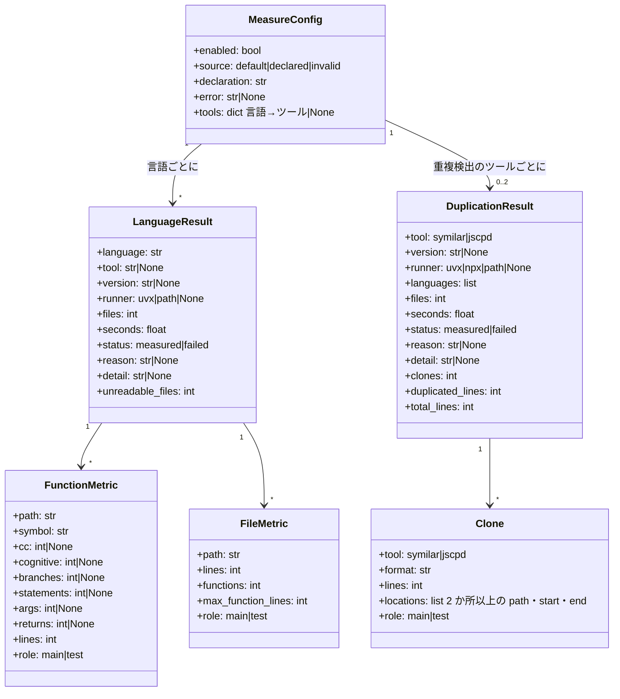
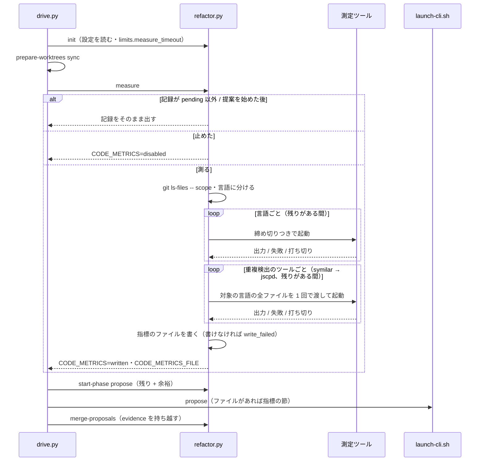
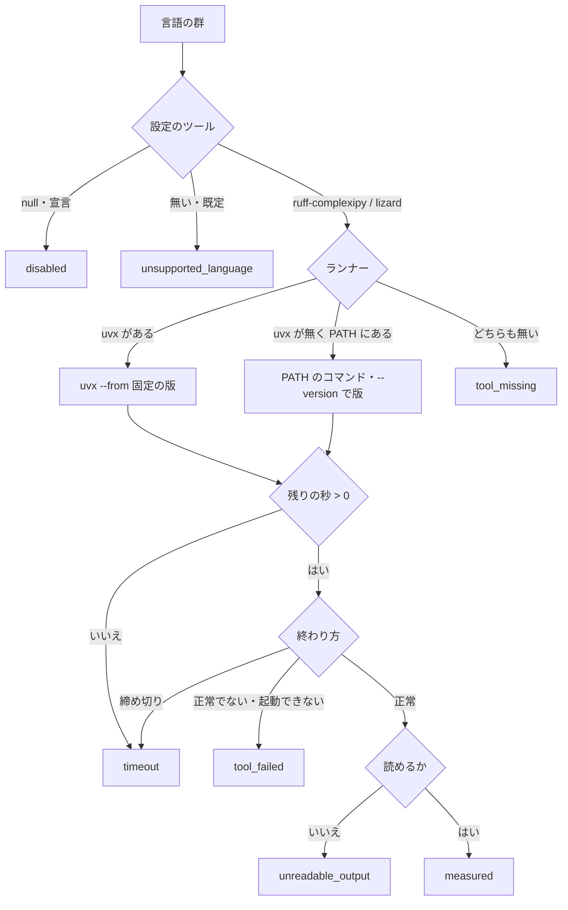
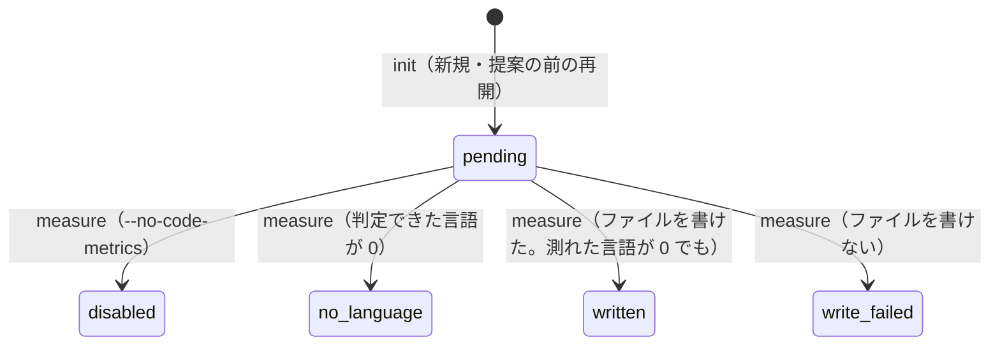

# #1319: cross-refactoring の提案の前に指標を測る — 設計

要求と受け入れ条件は #1319 の本文にある（コピーは [issue-1319-requirements.md](issue-1319-requirements.md) ）。
この文書は「どう作るか」だけを扱う。

## 例: `supervise_lib` を対象に起動すると

```bash
python3 scripts/drive.py 1320 --scope plugins/ndf/scripts/supervise_lib plugins/ndf/scripts/tests \
    --baseline-test "uv run --frozen --project . --all-extras pytest plugins/ndf/scripts/tests -q -n 4"
```

1. `init` が `.ndf/code-metrics.json` を探す。無いので既定の対応（Python → Ruff と complexipy、ほかの言語 → lizard）を
   状態ファイルの `code_metrics.config` に書く。`limits.measure_timeout` は `0.05·30 分 = 90 秒` になる
2. 駆動が読み取り用の作業ディレクトリを HEAD へ同期した後、提案を起動する前に `refactor.py measure 1320` を打つ
3. `measure` が `git ls-files -- <対象範囲>` で追跡されたファイルを集め、拡張子で言語に分ける。Python の
   ファイルを `uvx --from ruff==0.16.9 ruff check`（循環的複雑度・分岐・文・引数・return の数）と
   `uvx --from complexipy==8.0.1 complexipy`（認知的複雑度）で測り、関数の範囲を NDF が `ast` で数える。
   言語ごとの測定の後に、Python の重複を `uvx --from pylint==4.0.9 symilar -d 8 …` で 1 回だけ探す。
   Python 以外の追跡ファイルが無いため、jscpd は起動しない
4. 指標のファイル `<作業ディレクトリ>/work/.cross_refactoring/code-metrics-rf1320.md` ができる。
   本体の最初の行は `Engine.run`（`supervise_lib/engine.py` ・認知的複雑度 74・CC 26・101 行）で、
   ファイルの表で最も長いのは `claude.py`（282 行）である。重複の節は `symilar` で 8 行以上の重複が 0 箇所
   （全 27,098 行）と載る
5. 提案のプロンプトに「指標」の節が入り、このファイルのパスが載る。参加者は、提案の `evidence` に
   `{"cognitive": 74, "cc": 26, "lines": 101}` と根拠にした値を書ける。書かなくても見送られない
6. リファクタリング計画のコメントと `refactor.py report` に「指標の測定」の節ができる
   （`python ・ ruff-complexipy ・ ruff 0.16.9 / complexipy 8.0.1 ・ uvx ・ 103 ファイル ・ 0.1 秒 ・ 測った` と
   `重複: python ・ symilar ・ pylint 4.0.9 ・ uvx ・ 103 ファイル ・ 2.7 秒 ・ 測った`）

uvx も `ruff` も `complexipy` も無い環境では、4 のファイルに `python | tool_missing` の行だけが載り、5 以降は同じように進む。
npx も `jscpd` も無い環境で `.ts` を含む範囲なら、重複の `jscpd` の行だけが `tool_missing` になり、CC ほかの指標は測る。

## ドメインモデル

### コンテキスト

| コンテキスト | 何の語が 1 つの意味に決まるか |
| --- | --- |
| `ndf-cross-refactoring` | 指標・指標のファイル・測定ツール・測定の宣言・根拠の値・重複の箇所。提案・改善候補・リファクタリング計画は今の意味のまま |

1 つのコンテキストに収まる。測定ツール（Ruff・complexipy・lizard・symilar・jscpd）は外部のコマンドで、その出力を指標の形へ
直すのは `ndf-cross-refactoring` の側の腐敗防止層（`codemetrics` の読み取り）である。

### 集約

| 集約 | 持ち主（書き換えてよいもの） | 根 | エンティティ | 値オブジェクト |
| --- | --- | --- | --- | --- |
| 実行の状態（状態ファイル） | `refactor.py` の副コマンド。測定の記録は `init` と `measure` だけが書く | 実行（`id`） | 指標の測定の記録（`code_metrics`）・改善候補・改善項目 | 測定の設定・言語ごとの結果・重複検出の結果・時間の上限（`limits`） |
| 指標のファイル | `measure` だけが書く。参加者は読むだけ | 指標のファイル（1 実行に 1 つ） | — | 関数の指標・ファイルの指標・重複の箇所 |
| 提案 | 参加者の CLI が結果ファイルへ書き、`merge-proposals` が読む | 提案 1 件 | — | 根拠の値（`evidence`） |

指標のファイルは状態ファイルからパス（`code_metrics.file`）で参照する。中身を状態ファイルへ写さない（決定 12）。

### 不変条件

| # | 集約 | 条件 | 破れたときの扱い |
| --- | --- | --- | --- |
| I1 | 実行の状態 | 測定は 1 実行に 1 回だけ終わる。`code_metrics.status` が `pending` 以外なら `measure` は測らない | 2 回目の `measure` は記録をそのまま出して 0 で終わる |
| I2 | 実行の状態 | 提案の手順を始めた後（`phases.propose.started_at` がある）は測らない | `measure` は測らずに 0 で終わる。記録が無ければ無いまま |
| I3 | 指標のファイル | 載るファイルは、`--scope` の中で git が追跡しているものだけである | 集め方を `git ls-files` に限る。範囲外のパスが出たら捨てる |
| I4 | 指標のファイル | 載る値の出所は測定ツールの出力と NDF が数えた行数だけで、LLM の申告を使わない | 参加者の CLI を測定に使わない。提案の `evidence` を指標のファイルへ書き戻さない |
| I5 | 実行の状態 | 測れなかった理由は識別子の集合（`codemetrics.REASONS`）の値だけで、指標のファイル・計画・報告で同じ値を使う | 集合に無い値を書かない（書く側を 1 か所にする） |
| I6 | 実行の状態 | 測定の失敗（ツールが無い・落ちる・読めない・遅い・宣言が壊れている・書けない）で、`measure` の終了コードは 0 のまま | 失敗は記録に残して提案へ進む。状態ファイルを読めないときだけ 4 |
| I7 | 提案 | `evidence` の有無と中身は、改善候補の採否・順位・見送りの理由を変えない | `evidence` を正規化で落としても提案そのものは残す |
| I8 | 実行の状態 | 測定の前後で、対象リポジトリの追跡されたファイルが変わらない | 書き出しは一時ディレクトリ（全件無視の `.gitignore` の中）だけに限る |
| I9 | 実行の状態 | 測定の所要は `measure_deadline` を超えない（打ち切りの後始末の `kill_grace` を除く） | 残りが尽きた言語は起動せずに `timeout` にする |

### ドメインイベント

| # | イベント | 発生元 | 受け手 |
| --- | --- | --- | --- |
| E1 | 測定の設定を読み込んだ | `init`（再開では提案の前だけ） | `measure`（設定を使う）・計画と報告（宣言を使わなかった理由を載せる） |
| E2 | 対象範囲のファイルを言語ごとに分けた | `measure` | `measure`（言語ごとに起動する） |
| E3 | 言語ごとにツールを起動した | `measure` | `measure`（出力を読む） |
| E4 | ツールの出力を指標の共通の形へ直した | `codemetrics` の読み取り | `codemetrics_view`（指標のファイルを組む） |
| E5 | 指標のファイルを書き出した | `measure` | `launch-cli.sh`（提案のプロンプトへパスを載せる） |
| E6 | 参加者が指標のファイルを読んで提案した | 参加者の CLI | `merge-proposals`（`evidence` を候補へ持ち越す） |
| E7 | 計画と完了報告に測定の記録を載せた | `plan.py` の書き出し・`report` | Pull Request のコメント・完了報告の読み手 |

### 用語

| 用語 | 意味 | 用語集への反映 |
| --- | --- | --- |
| 指標 | `cross-refactoring` が提案の前に対象範囲のコードを測定ツールで測った値。関数ごとの循環的複雑度（Python では認知的複雑度も）、ファイルごとの大きさ、行数、重複の箇所 | 追加（`ndf-cross-refactoring`） |
| 指標のファイル | 提案の前に 1 回だけ作り、参加者の全員が読む指標の測定の結果 | 追加（`ndf-cross-refactoring`） |
| 測定ツール | 言語ごとに指標を測る外部のコマンド（Ruff・complexipy・lizard・symilar・jscpd など） | 追加（`ndf-cross-refactoring`） |
| 測定の宣言 | 言語ごとの測定ツールをプロジェクトが置き換える `.ndf/code-metrics.json` | 追加（`ndf-cross-refactoring`） |
| 根拠の値 | 提案が根拠にした指標の値。提案の JSON の `evidence` に書き、採否には使わない | 追加（`ndf-cross-refactoring`） |
| 重複の箇所 | 対象範囲の中で、同じコードが最小の行数（8 行）以上続く 2 か所以上の組。Python は symilar、ほかの言語は jscpd が見つける | 追加（`ndf-cross-refactoring`） |

## 機能一覧

| # | 機能 | 誰が使うか |
| --- | --- | --- |
| F1 | 提案の前に、対象範囲の言語を判定して指標を測る | オーケストレーター（`drive.py`） |
| F2 | 言語とツールの対応を、宣言で置き換え、引数で測定を止める | cross-refactoring を起動する者 |
| F3 | 測った結果を指標のファイル 1 つにまとめ、本体とテストを分けて載せる | 提案する参加者 |
| F4 | 提案のプロンプトに指標のファイルを示し、提案に根拠の値を書かせる | 提案する参加者 |
| F5 | 測れなかった言語と理由を記録し、止めずに提案へ進む | オーケストレーター |
| F6 | 計画と完了報告に、言語・ツール・版・所要秒と、測れなかった理由を載せる | Pull Request と完了報告の読み手 |
| F7 | 言語ごとの既定の測定ツールと、読む指標を `lang-*.md` に書く | 実装担当と、手で測る者 |
| F8 | 言語ごとの測定の後に、対象範囲の重複の箇所を 1 回だけ探し、指標のファイルに載せる | 提案する参加者 |

## 構成要素

| 要素 | 責務 | 新設 / 変更 |
| --- | --- | --- |
| `refactor_lib/codemetrics.py` | 言語の表・ツールの表（版の固定）・宣言の読み取りと重ね合わせ・ファイルの言語分け・ツールのコマンドの組み立て・出力の読み取り・Python の関数の列挙（ソースの文字列を `ast` で読む）と Ruff・complexipy の値の突き合わせ・重複検出のコマンドの組み立てと出力（symilar の文字列・jscpd の JSON）の読み取り・識別子の集合（`REASONS`）。**純粋な処理だけを置く**（起動も書き出しもしない） | 新設 |
| `refactor_lib/codemetrics_view.py` | 読み取った指標から、指標のファイル（Markdown）と、計画・報告の「指標の測定」の表を組む。純粋な処理 | 新設 |
| `refactor_lib/commands/measure.py` | `cmd_measure`。ファイルの収集（git）・ランナーの解決・締め切りつきの起動（言語ごと、その後に重複検出）・jscpd 用の空の作業ディレクトリの用意・ファイルの読み込みと行数の数え上げ・指標のファイルの書き出し・状態の保存・KEY=VALUE の出力 | 新設 |
| `refactor_lib/process.py` | 標準出力と標準エラーを分けて受け取り、締め切りでプロセスグループごと止める `run_capture` を足す（`_kill_process_group` を使い回す） | 変更 |
| `refactor_lib/timeline.py` | 係数 `MEASURE_SHARE`（0.05）と `MEASURE_PROPOSE_CAP`（0.5）、表の `measure_timeout`、純粋な `measure_deadline(now, limits)` | 変更 |
| `refactor_lib/commands/setup.py` | `init` が測定の設定を読み、`code_metrics = {config, status: pending}` を書く。再開では提案の前で記録が無いときだけ同じことをする。`--code-metrics` を「知らせる」の表へ載せる | 変更 |
| `refactor.py` | `init` に `--code-metrics / --no-code-metrics`、副コマンド `measure <id>` を登録する | 変更 |
| `drive.py` | 提案の同期の後、`start-phase propose` の前に `measure` を 1 回打つ | 変更 |
| `launch-cli.sh` + `prompts/propose.md` | 提案の手順だけ、指標のファイルがあれば `$RF_METRICS_BLOCK`（パスと `evidence` の書き方）を展開する。無ければ空にする | 変更 |
| `prompts/plan.md` の候補（`launch-cli.sh` の jq） | 候補に `evidence` があれば載せる | 変更 |
| `refactor_lib/proposals.py` | `evidence` を正規化して候補へ持ち越す。形の悪い値は落とすだけで、見送りの理由にしない | 変更 |
| `refactor_lib/plan.py` | 計画に「指標の測定」の節と、時間の上限の表に `measure_timeout` の行を足す | 変更 |
| `refactor_lib/commands/report.py` | 完了報告に「指標の測定」の節を足す（計画と同じ表を `codemetrics_view` から受ける） | 変更 |
| `SKILL.md` ・ `docs/01` ・ `docs/02` ・ `docs/04` | 引数の表・全体フロー・測定の節・締め切りの表・完了報告の列挙 | 変更 |
| `refactoring/references/lang-{python,javascript,typescript,php}.md` | 「指標の測定」の節（既定のツール・読む指標・手で測るコマンド） | 変更 |
| `docs/glossary/glossary.json` | 指標・指標のファイル・測定ツール・測定の宣言・根拠の値・重複の箇所の 6 語を足す | 変更 |

### 構成要素図



図に含めないもの: 文書（`SKILL.md` ・ `docs/` ・ `lang-*.md` ・用語集）と、`refactor.py` の引数と副コマンドの登録。

### 文脈



変えられない外部は `uvx`・PyPI・`npx`・npm のレジストリ・測定ツール・参加者の CLI・GitHub である。

### 配置



測定は `work/` を対象に行う。読み取り用の作業ディレクトリは同じ HEAD へ同期済みで、パスはどれも
リポジトリ相対なので、指標のファイルの値は参加者の作業ディレクトリのファイルにそのまま当たる。

### 置き場所

```text
plugins/ndf/skills/cross-refactoring/
├── SKILL.md                          # 変更: 引数・全体フロー・完了報告
├── docs/01-state-and-propose.md      # 変更: 指標の測定の節
├── docs/02-plan-and-implement.md     # 変更: 締め切りの表に測定の上限
├── docs/04-verify-and-report.md      # 変更: 完了報告の列挙
├── prompts/propose.md                # 変更: $RF_METRICS_BLOCK
├── scripts/
│   ├── drive.py                      # 変更
│   ├── launch-cli.sh                 # 変更
│   ├── refactor.py                   # 変更
│   └── refactor_lib/
│       ├── codemetrics.py            # 新設
│       ├── codemetrics_view.py       # 新設
│       ├── commands/measure.py       # 新設
│       ├── commands/setup.py         # 変更
│       ├── commands/report.py        # 変更
│       ├── plan.py                   # 変更
│       ├── process.py                # 変更
│       ├── proposals.py              # 変更
│       └── timeline.py               # 変更
└── tests/test_code_metrics*.py       # 新設
plugins/ndf/skills/refactoring/references/lang-{python,javascript,typescript,php}.md  # 変更
```

既存の `refactor_lib/measure.py` は手順の所要の要約で、この変更とは別物である。名前が紛れないよう、
新しい部品は `codemetrics` の名前で置く。

### 値の集合へ値を足すことで当たる既存の規則

| 既存の規則 | 足す値 | 当てはまるか | 扱い |
| --- | --- | --- | --- |
| 状態ファイルに載る引数は `RESUME_*` の表のどれかに必ず載る（`setup.py`） | `--code-metrics` | 当てはまらない（表に無い） | `RESUME_NOTIFY_FIELDS` へ `code_metrics` を足し、`_notify_view` で `code_metrics.config.enabled` と比べる |
| 時間に関わる数値は `timeline.py` の係数だけで出す（決定 24） | 測定の上限 | 当てはまらない（係数が無い） | `MEASURE_SHARE` と `MEASURE_PROPOSE_CAP` を足す |
| 時間の上限の表（`plan.py` の `_LIMIT_ROWS`）と「締め切り」の表（`docs/02`）は同じ値を並べる | `measure_timeout` | 当てはまらない | 両方へ行を足す |
| 固定のまま残す値は `FIXED_VALUES` に並べて報告する | 測定の打ち切りの `kill_grace` | 当てはまる（`run_with_timeout` と同じ 5 秒を使う） | 行の説明に「測定の打ち切り」を足す |
| 手順書の変数は `cmd_*` から 1 階層で出す（`check-skill-shell-vars.py`） | `CODE_METRICS` / `CODE_METRICS_FILE` | 当てはまらない | `cmd_measure` から直接 `statefile.emit` する |
| 雛形は `${RF_*}` を `safe_substitute` で展開する | `RF_METRICS_BLOCK` | 当てはまる | `export_prompt_env` に足すだけ |
| 見送りの理由の集合（`budget` ほか 8 つ） | — | 足さない | `evidence` は見送りの理由を作らない（I7） |

## 構造



型は辞書で持つ（今の状態ファイルと同じ）。`FunctionMetric` ・ `FileMetric` ・ `Clone` は `measure` の中だけで使い、
状態ファイルには載せない（決定 12）。

## データ構造

### 言語とツールの既定

| 言語 | 拡張子 | 既定のツール |
| --- | --- | --- |
| `python` | `.py` | `ruff-complexipy` |
| `javascript` | `.js` `.mjs` `.cjs` `.jsx` | `lizard` |
| `typescript` | `.ts` `.tsx` `.mts` | `lizard` |
| `php` | `.php` | `lizard` |
| `go` | `.go` | `lizard` |
| `ruby` | `.rb` | `lizard` |
| `java` | `.java` | `lizard` |
| `kotlin` | `.kt` | `lizard` |
| `swift` | `.swift` | `lizard` |
| `rust` | `.rs` | `lizard` |
| `c` | `.c` `.h` | `lizard` |
| `cpp` | `.cc` `.cpp` | `lizard` |
| `csharp` | `.cs` | `lizard` |
| `lua` | `.lua` | `lizard` |
| `shell` | `.sh` `.bash` | なし（`unsupported_language`） |

拡張子はどれも lizard 1.24.0 で関数を検出できることを確かめた（2026-09-26。`.scala` は検出しなかったため
表に入れない）。表に無い拡張子（`.md` `.json` など）と拡張子の無いファイルは言語を判定せず、
「言語を判定しなかったファイル」の数にだけ入れる。**表にパスもリポジトリ固有の設定も入れない**（AC8）。

| ツール | パッケージと版 | 起動（uvx があるとき） | 使う出力 |
| --- | --- | --- | --- |
| `ruff-complexipy` | `ruff==0.16.9` と `complexipy==8.0.1` の 2 つのコマンド | 下の 2 行を順に起動する | 下の 2 行 |
| （Ruff） | `ruff==0.16.9` | `uvx --from ruff==0.16.9 ruff check --isolated --no-cache --exit-zero --select C901,PLR0911,PLR0912,PLR0913,PLR0915 --config lint.mccabe.max-complexity=0 --config lint.pylint.max-branches=0 --config lint.pylint.max-returns=0 --config lint.pylint.max-args=0 --config lint.pylint.max-statements=0 --output-format json <files>` | 標準出力の JSON の配列。要素の `code` ・ `filename`（絶対パス）・ `location.row`（`def` の行。デコレータの行ではない）・ `message`。構文を読めないファイルは `code` が `invalid-syntax` で出る |
| （complexipy） | `complexipy==8.0.1` | `uvx --from complexipy==8.0.1 complexipy <files> --output-format json --output <TMP_DIR>/complexipy-rf<ID>.json -q --max-complexity-allowed 1000000 --no-ignore --cache-dir <TMP_DIR>/complexipy-cache` | `--output` のファイルの JSON の配列。要素の `complexity` ・ `path`（渡したとおりの相対パス）・ `function_name`（`関数` か `クラス::メソッド`）。`file_name` と `refactor_plans` は使わない |
| `lizard` | `lizard==1.24.0` | `uvx --from lizard==1.24.0 lizard --csv <files>` | 1 行 11 列の CSV（NLOC・CCN・token・PARAM・length・location・file・function・long_name・start・end）。使うのは CCN・length・file・function |

`ruff-complexipy` は 1 つの測定ツールとして扱う。2 つのコマンドのどちらかが無い・落ちる・読めないときは、
その言語を失敗にする（片方の値だけを載せない）。版（`version`）は `ruff 0.16.9 / complexipy 8.0.1` のように
コマンドごとの版を並べた文字列にする。

**Ruff の引数の意味。** `--isolated` で対象プロジェクトの設定（`pyproject.toml` ・ `ruff.toml`）を読まず、閾値を
NDF が決める。5 つの閾値を 0 にすると、値が 1 以上の関数がすべて出る（2026-09-27、`supervise_lib` で C901 が
162 件＝全関数）。閾値の既定のままだと上限を超えた関数しか出ない（同じ範囲で 15 件）。`--exit-zero` で、出た
診断の有無を終了コードから外す（外さないと診断が 1 件でもあれば 1 になる）。`--no-cache` で作業ディレクトリへ
`.ruff_cache` を書かない（I8）。

**Ruff の値の読み方。** 値は構造化された欄に無く、`message` の文字列の末尾にだけある（例:
`` `check_new` is too complex (11 > 0) `` ・ `Too many branches (29 > 0)`）。末尾の `(<N> > 0)` を
`\((\d+) > 0\)$` で読み、`code` ごとに次の欄へ入れる。

| `code` | 欄 | 意味 |
| --- | --- | --- |
| `C901` | `cc` | 循環的複雑度（mccabe。ブール演算子を数えない） |
| `PLR0912` | `branches` | 分岐の数 |
| `PLR0915` | `statements` | 文の数 |
| `PLR0913` | `args` | 引数の数 |
| `PLR0911` | `returns` | return の数 |

診断は（`filename` をリポジトリ相対へ直したパス、`location.row`）で関数へ結び付ける。`PLR` の `message` には
関数の名前が無いため、名前では結び付けない。閾値が 0 なので、出ない `PLR` の欄は 0 と読む（例: return の無い
関数には `PLR0911` が出ない）。`C901` は全関数に出る（最小が 1）。`invalid-syntax` の診断は値として読まず、
そのファイルを「読めなかったファイル」に数える。末尾の形が合わない `message` が 1 件でもあれば、その言語を
`unreadable_output` にする。

**complexipy の終了コードの扱い。** complexipy 8.0.1 は、上限（既定 15。`pyproject.toml` の
`[tool.complexipy]` でも変わる）を超える関数があると 1 で終わる。`-i` / `--ignore-complexity` を付けても
1 のままだった（2026-09-27、`supervise_lib` で実測）。そこで `--max-complexity-allowed 1000000` を渡し、上限を
超える関数が出ない形にする（引数は設定より優先され、この値で 0 になった）。上限を外しても、構文を読めない
ファイルがあると 1 で終わり、`--output` にはほかのファイルの結果が書かれる（`Failed to process <file>` は
標準出力に出る）。**0 と、1 で `--output` のファイルが JSON の配列として読めるときを正常とし、それ以外
（2 = 引数の誤り、1 で出力のファイルが無い・読めない）を `tool_failed` にする。** 読めなかったファイルの数は
Ruff の `invalid-syntax` から数える（complexipy の標準出力の文は読まない）。`--no-ignore` は
`# noqa: complexipy` を付けた関数も出すため（付けないと出力から消える）、`--cache-dir` は既定の
`.complexipy_cache` を作業ディレクトリへ作らないため（I8）に渡す。起動の前に `--output` のファイルを消し、
前の実行の出力を読まない。

**Python の関数は NDF が列挙する。** Ruff も complexipy も関数の終わりの行を出さないため、標準ライブラリの
`ast` でファイルを読み、`FunctionDef` と `AsyncFunctionDef` ごとに名前（`クラス.メソッド`・入れ子は
`外側.内側`）・`lineno`（`def` の行）・`end_lineno` を取る。関数の行数は `end_lineno − lineno + 1` である。
Ruff の値は（パス・`lineno`）で、complexipy の値は（パス・`function_name` の `::` を `.` にした名前）で結び付ける。
complexipy は入れ子の関数を外側の関数に含めて数え、入れ子のクラスのメソッドを出さない（2026-09-27 実測）ため、
それらの関数の `cognitive` は空になる。`ast` が読めないファイル（オーケストレーターの Python より新しい構文を
含むなど）は「読めなかったファイル」に数え、その関数を載せない。

**行数（`lines`）は NDF が数える。** 空白だけの行を除いた行の数で、全言語で同じ数え方にする（決定 11）。
関数の行数は Python なら上の `ast` の範囲、lizard なら `length` である。

**同じ名前の指標でも、ツールが違えば値の意味が違う。** `check_new`（`supervise_lib/new_args.py`）の循環的複雑度は
lizard で 35、Ruff の C901 で 11 だった（mccabe はブール演算子を数えない）。指標のファイルの各節の見出しに
ツールの名前と版を載せ、言語の節ごとに列を分ける。言語をまたいで同じ列で並べ替え・比較をしない。

### 重複検出のツール

重複検出は言語ごとの測定とは別に、ツールごとに 1 回だけ起動する（決定 13）。重複はファイルをまたいで
探すため、1 回の起動に渡すファイルを分けると、分けた群の間の重複を見落とす。

| ツール | 対象の言語 | パッケージと版 | 起動 | 使う出力 |
| --- | --- | --- | --- | --- |
| `symilar` | `python` | `pylint==4.0.9` | `uvx --from pylint==4.0.9 symilar -d 8 -i --ignore-docstrings --ignore-imports --ignore-signatures <files>`（cwd は作業ディレクトリ、パスはリポジトリ相対） | 標準出力の文字列（下の読み方） |
| `jscpd` | `python` 以外の、言語の表の全言語（`shell` を含む） | `jscpd@4.3.0`（npm） | `npx -y jscpd@4.3.0 <files の絶対パス> --absolute --no-gitignore --min-lines 8 --reporters json --output <TMP_DIR>/jscpd-rf<ID> --silent`（cwd は空の `<TMP_DIR>/jscpd-rf<ID>/`） | `--output` の `jscpd-report.json` の `duplicates[]`（`format` ・ `lines` ・ `firstFile` と `secondFile` の `name` ・ `start` ・ `end`）と `statistics.total`（`sources` ・ `lines` ・ `clones` ・ `duplicatedLines`） |

**対象の言語は、言語の表で判定できた言語のうち、宣言で `null` にしていない言語である。** 言語ごとの測定の
ツール（`ruff-complexipy` か `lizard`）の置き換えは重複検出のツールを変えない。`shell` は CC を測らない
（`unsupported_language`）が、jscpd が bash を読むため重複は探す。jscpd は表の 22 の拡張子をすべて形式として
判定した（2026-09-27。`.h` は `c-header`、`.cc` は `cpp`）。

**Python を jscpd から外すのは、渡すファイルで行う。** jscpd はディレクトリを渡すと `.md` ・ `.json` ・ `.toml`
まで測る（`plugins/ndf/scripts` で 6 形式・173 本）。NDF が言語を判定したファイルだけを明示して渡すと、渡した
ファイルだけを測る（59 本を渡して `sources` が 59）。`--format` は使わない（`--format bash,javascript,typescript`
とディレクトリを渡すと bash の 25 本しか測らなかった）。

**pylint の `duplicate-code`（R0801）ではなく、同じパッケージの `symilar` を使う。** R0801 は `symilar` と同じ
検出で、`-i --ignore-docstrings --ignore-imports --ignore-signatures` が R0801 の既定と同じ扱いになる
（2026-09-27、`plugins/ndf/scripts` の本体 143 本で、どちらも同じ 5 か所・同じ行の範囲を出した）。R0801 を
採らない理由は 3 つある。

- 場所が `message` の文字列にしか無く、パスでなくモジュール名で出る（`==ht_shparse:[219:248]`）。`json2`
  にも場所の欄は無い（`path` ・ `absolutePath` は最後に読んだモジュールで、重複の場所ではない）
- 同じ名前のモジュールが衝突する。`a/util.py` と `b/util.py` の重複は `==util:[1:19]` が 2 行になり、
  パスへ戻せない。`symilar` は `==a/util.py:[1:19]` と渡したパスで出す
- 終了コードが見つかったこと（8 = refactor のビット）を表し、失敗のビット（1 fatal ・ 2 error ・ 32 usage）と
  合わせて読む必要がある。対象プロジェクトの `pylintrc` ・ `pyproject.toml` も読む

**symilar の出力の読み方。** 重複ごとに `<N> similar lines in <K> files` の行、続く K 行の
`==<path>:[<start>:<end>]`、コードの行が並び、最後に `TOTAL lines=<L> duplicates=<D> percent=<P>` が 1 行出る。
`^(\d+) similar lines in (\d+) files$` で塊を始め、直後の K 行を `^==(.+):\[(\d+):(\d+)\]$` で読む。
`start` は 0 始まり、`end` はその行を含まない終わりで、1 始まりの行へは `start + 1`〜`end` と直す
（`ht_shparse.py:[219:248]` の最初のコードの行が 220 行目、最後が 248 行目だった）。`N` は比べた行の数
（コメントと空行を除く）で、範囲の行数とは一致しない。指標のファイルの「行」には `N` を載せる。
`TOTAL` の行が無い・塊の場所の行が K 行に足りないときは `unreadable_output` にする。

**symilar の終了コードの扱い。** 重複の有無に関わらず 0 で終わる。1 は例外（構文を読めないファイル・無い
ファイル）で、**1 本でも読めないファイルがあると全体が落ち、結果を出さない**（2026-09-27 実測）。2 は引数の誤り。
0 だけを正常とし、それ以外を `tool_failed` にする。全体が落ちるのを避けるため、渡すのは NDF の `ast` が読めた
ファイルだけにする（読めなかったファイルは言語ごとの測定と同じく数えるだけ）。

**jscpd の終了コードと報告の扱い。** `--threshold` を渡さなければ、重複があっても 0 で終わる。無いファイル・
知らない引数は 1 だった。0 だけを正常とし、それ以外を `tool_failed` にする。0 で終わって報告のファイルが無い
のは、調べるファイルが 0 本になったときだった（最小の行数に満たない 1 行のファイルだけを渡したとき、
`--no-gitignore` を付けずに全部が外れたとき。2026-09-27 実測）。この場合は重複 0 ・調べた
ファイル 0 と読む。`statistics.total.sources`（調べたファイルの数）を `files` とは別に記録に残し、渡した数との
差が読めるようにする。報告があって JSON として読めないときは `unreadable_output` にする。

**jscpd の cwd を空のディレクトリにする。** jscpd は cwd の `.jscpd.json` と `package.json` の `jscpd` の欄を
読み、`ignore` まで効く（`.jscpd.json` の `ignore` で渡したファイルが外れた）。`--config` で別のファイルを渡しても
`package.json` の欄は効いた。cwd の親の設定は読まなかったため、`measure` が作る空の `<TMP_DIR>/jscpd-rf<ID>/` を
cwd にし、ファイルは絶対パスで渡す。`--absolute` で報告の `name` を絶対パスにし、作業ディレクトリからの相対パスへ
直す。`--no-gitignore` は必ず付ける。付けないと、上の階層の `.gitignore`（このリポジトリの `.worktrees/`）に当たる
ファイルが黙って外れ、渡した 59 本がすべて消えた。集め方は `git ls-files` が正で（I3）、`.gitignore` を二重に
当てない。

**最小の行数は 8 で、`codemetrics.DUPLICATE_MIN_LINES` に固定する**（決定 14）。

**重複の箇所の本体とテスト。** 場所がすべてテストのパスなら「テスト」、1 か所でも本体のパスがあれば「本体」に
載せる（`pathkinds.is_test_path`）。

### 測定の宣言 `.ndf/code-metrics.json`

```json
{"version": 1, "tools": {"python": "lizard", "shell": null}}
```

| 鍵 | 型 | 空を許すか | 意味 |
| --- | --- | --- | --- |
| `version` | 整数 | 許さない | `1` だけ |
| `tools` | オブジェクト | 許さない（空のオブジェクトは可） | 鍵は上の表の言語名。値は `"ruff-complexipy"`（`python` だけ）・`"lizard"`・`null`（その言語を測らない） |

読むのは書き込み用の作業ディレクトリ（Pull Request の head）の `.ndf/code-metrics.json` である。形が違えば
（JSON でない・`version` が違う・知らない鍵・知らない言語・知らないツール・`ruff-complexipy` を `python` 以外へ当てる）
**宣言の全体を使わず既定で測り**、`config.source = "invalid"` と理由を残す（前提 8）。一部の鍵だけを
生かさない。宣言した言語だけを置き換え、ほかの言語は既定のまま測る（AC6）。

### 状態ファイルに足す鍵

`code_metrics`（オブジェクト。`init` が作り、`measure` が埋める）:

| 鍵 | 型 | 空を許すか | 意味 |
| --- | --- | --- | --- |
| `config.enabled` | 真偽 | 許さない | `--no-code-metrics` なら偽 |
| `config.source` | 文字列 | 許さない | `default` / `declared` / `invalid` |
| `config.error` | 文字列 | 許す | 空は「宣言を使えなかった理由が無い」 |
| `config.tools` | オブジェクト | 許さない | 重ね合わせた後の言語 → ツール（`null` は測らない） |
| `status` | 文字列 | 許さない | `pending` / `written` / `disabled` / `no_language` / `write_failed` |
| `head` | 文字列 | 許す | 測った HEAD。空は「まだ測っていない」 |
| `started_at` / `seconds` | 時刻 / 数 | 許す | 空は「まだ測っていない」 |
| `deadline_seconds` | 整数 | 許す | その実行で使えた測定の時間（`measure_deadline` の値） |
| `file` | 文字列 | 許す | 指標のファイルの絶対パス。空は「ファイルを作らなかった」 |
| `ignored_files` | 整数 | 許す | 言語を判定しなかったファイルの数 |
| `languages` | 配列 | 許す | 言語ごとの結果（`LanguageResult`）。`status` が `written` のときだけ 1 件以上 |
| `duplication` | 配列 | 許す | 重複検出のツールごとの結果（`DuplicationResult`）。対象の言語のファイルが無いツールは載せない。空は「重複を探す言語が無かった」 |

`limits.measure_timeout`（整数・秒）を足す。

**旧い状態ファイル（`code_metrics` が無い）での再開**: 提案を始める前（`phases.propose.started_at` が無い）なら
`init` の再開が設定を読んで `pending` で作り、`measure` が測る。始めた後なら作らない。計画と報告は
「記録なし」と 1 行出す（決定 8）。`schema` は上げない（鍵を足すだけで、旧い形の読み手が壊れない）。

**過去の記録は上書きしない。** 測定は 1 実行に 1 回で、状態ファイルは 1 実行に 1 つであるため、上書きで
失う過去が無い。改修の前後の比較は範囲外である。

### 指標のファイル

置き場は `<TMP_DIR>/code-metrics-rf<ID>.md`（`TMP_DIR` は `work/.cross_refactoring/`）。形は次のとおり。

```markdown
# 指標（cross-refactoring rf1320）

- 測った版: 3f2a1c0 / 対象範囲: plugins/ndf/scripts/supervise_lib plugins/ndf/scripts/tests
- 載せたもの: 対象範囲の中で git が追跡しているファイル。本体とテストを分けて載せる。上位だけで、全件ではない
- 言語とツールの対応: 既定（.ndf/code-metrics.json は無い）
- 言語を判定しなかったファイル: 47 本

## 測れなかった言語

（なし）

## python（ruff-complexipy ・ ruff 0.16.9 / complexipy 8.0.1 ・ uvx）

本体: 19 ファイル・関数 162 個・認知的複雑度 16 以上 20 個・最大 74・CC 11 以上 8 個・最大 26 / テスト: 84 ファイル・関数 1,983 個・認知的複雑度 16 以上 7 個・最大 41・CC 11 以上 2 個・最大 13

### 複雑な関数（本体・認知的複雑度の降順・上位 30）

| ファイル | 関数 | 認知 | CC | 分岐 | 文 | 引数 | return | 行 |
| --- | --- | --- | --- | --- | --- | --- | --- | --- |
| plugins/ndf/scripts/supervise_lib/engine.py | Engine.run | 74 | 26 | 29 | 91 | 1 | 4 | 101 |

### ファイル（本体・行数の降順・上位 20）

| ファイル | 行 | 関数 | 最長の関数の行 |
| --- | --- | --- | --- |
| plugins/ndf/scripts/supervise_lib/claude.py | 282 | … | … |

## 重複（最小 8 行）

python（symilar ・ pylint 4.0.9 ・ uvx）: 本体: 0 箇所 / テスト: 0 箇所 / 重複の行 0（全 27,098 行の 0.00%）

### 重複の箇所（本体・行の降順・上位 20）

| 行 | 形式 | 場所 |
| --- | --- | --- |
| 25 | python | plugins/ndf/scripts/experimental/hook-trial/ht_shparse.py:220-248 ・ plugins/ndf/scripts/hook_lib/write_target.py:180-208（別の範囲の例） |
```

| 表 | 並び | 上限 |
| --- | --- | --- |
| 複雑な関数（本体） | Python は認知的複雑度の降順、lizard の言語は CC の降順。同じなら行数の降順・パス | 30 行 |
| 複雑な関数（テスト） | 同上 | 10 行 |
| ファイル（本体） | 行数の降順 | 20 行 |
| ファイル（テスト） | 同上 | 10 行 |
| 重複の箇所（本体） | 行の降順、同じなら最初の場所のパス・行 | 20 行 |
| 重複の箇所（テスト） | 同上 | 10 行 |

上限は `codemetrics_view` の定数に置く。要約の行の件数（CC 11 以上の数など）は全件から数える。
要約の行の閾値は、Python の認知的複雑度が 16 以上（complexipy の既定の上限 15 を超える）、CC が 11 以上
（Ruff の mccabe の既定の上限 10 を超える。lizard の言語も同じ）で、`codemetrics_view` の定数に置く。
本体かテストかは `pathkinds.is_test_path` で分ける（決定 1）。関数の表の列は言語の節ごとに決まる。Python は
認知・CC・分岐・文・引数・return・行、lizard の言語は CC・行である。値の無い欄（complexipy が出さない入れ子の
関数の認知など）は `—` にする。
構文を読めなかったファイルは「読めなかったファイル N 本」を要約の行に足し、表には載せない。
**ファイルの集合は集めた一覧が正である。** 関数の無いファイル（`__init__.py` など）はツールの出力に
現れないため、ツールの出力からファイルを数えない（2026-09-27 の実測で `supervise_lib` の 19 本中 2 本が関数を持たなかった）。

### CRUD

| 機能 | 宣言 | `code_metrics` | `limits` | 指標のファイル | 提案の結果 | 改善候補 |
| --- | --- | --- | --- | --- | --- | --- |
| F2 `init` | R | C | C | — | — | — |
| F1 F3 F5 `measure` | — | U | R | C | — | — |
| F4 提案（参加者） | — | — | — | R | C | — |
| F4 `merge-proposals` | — | — | — | — | R | C（`evidence`） |
| F6 計画・報告 | — | R | R | — | — | R |

## 入出力の契約

### `refactor.py init` に足す引数

| 名前 | 入力 | 既定 | 互換性 |
| --- | --- | --- | --- |
| `--code-metrics` / `--no-code-metrics` | 真偽（`BooleanOptionalAction`、既定は `None`） | 新規の実行で `True`（`NEW_RUN_DEFAULTS`） | 付けない既存の起動は測る側に変わる。再開で状態と違えば「反映しない」と知らせる |

`drive.py` は知らない引数を `init` へそのまま渡すため、駆動の引数は増やさない。

### `refactor.py measure <id>`

| 項目 | 内容 |
| --- | --- |
| 入力 | 実行の番号。環境変数 `CROSS_REFACTORING_TMP_DIR`（今の副コマンドと同じ） |
| 出力（標準出力） | `CODE_METRICS=<status>`（記録が無ければ空）と `CODE_METRICS_FILE=<絶対パス>`（作らなければ空） |
| 出力（標準エラー） | 言語ごとに `✅ python: ruff-complexipy（ruff 0.16.9 / complexipy 8.0.1 ・ uvx）103 ファイル 0.1 秒` か `⚠ go: tool_missing（…）` の 1 行。続けて重複検出のツールごとに `✅ 重複: symilar（pylint 4.0.9 ・ uvx）103 ファイル 2.7 秒 ・ 0 箇所` か `⚠ 重複: jscpd tool_missing（npx jscpd）` の 1 行 |
| 終了コード | 0（測った・測れなかった・止めた・測らずに返した、のいずれも）。4 は状態ファイルを読めないときだけ |
| 冪等 | `status` が `pending` 以外、または提案を始めた後は、測らずに記録を出す（I1 I2） |

### 言語ごとの失敗の識別子（`codemetrics.REASONS`）

| 識別子 | いつ | 詳細に書くもの |
| --- | --- | --- |
| `tool_missing` | uvx も、そのツールのコマンドも PATH に無い（`ruff-complexipy` は `ruff` と `complexipy` のどちらか 1 つでも無い）。jscpd は npx も `jscpd` も PATH に無い | 探したコマンドの名前 |
| `unsupported_language` | 言語の表にあるが、既定の対応にツールが無い（`shell`） | — |
| `disabled` | 宣言がその言語を `null` にした。実行の全体を止めたときは `status = disabled` | — |
| `tool_failed` | 起動できない、または正常でない終了コードで終わった（uvx と npx の取得の失敗を含む）。正常は Ruff ・ lizard ・ symilar ・ jscpd が 0、complexipy が 0 か「1 で `--output` が読める」 | 終了コードと標準エラーの末尾 5 行 |
| `unreadable_output` | 正常に終わったが、出力を読めない（JSON でない・CSV の列が 11 でない・Ruff の `message` の末尾が `(<N> > 0)` でない） | 読めなかった箇所 |
| `timeout` | 締め切りを過ぎた、または起動の前に残りが無かった | 使えた秒 |
| `too_many_files` | 重複検出で、渡すパスの長さの合計が上限（`codemetrics.DUPLICATE_ARG_BYTES` = 256 KiB）を超えた。重複検出は分けて起動できない | 渡すはずだったファイルの数とバイト数 |

言語ごとの結果と重複検出の結果は同じ集合を使う（`unsupported_language` と `disabled` は重複検出には出ない。対象の言語に入らないだけである）。
実行の単位の値（`status`）と宣言の理由（`declaration_invalid`）も同じモジュールに置く。指標のファイル・
計画・報告はこの集合の値だけを書く（I5）。

### 提案の JSON の `evidence`

```json
{"path": "plugins/ndf/scripts/supervise_lib/engine.py", "symbol": "Engine.run",
 "smell": "long_method", "technique": "extract_method", "severity": "major",
 "rationale": "...", "plan": "...", "test_gap": false, "estimated_diff_lines": 80,
 "evidence": {"cognitive": 74, "cc": 26, "lines": 101}}
```

| 鍵 | 型 | 必須か | 意味 |
| --- | --- | --- | --- |
| `evidence` | オブジェクト | 任意 | 鍵は `cc` / `cognitive` / `lines` / `functions` / `max_function_lines` / `duplicate_lines`、値は数 |

`merge-proposals` の正規化: オブジェクトでなければ落とす。知らない鍵と数でない値は、その鍵だけ落とす。
**どの場合も提案は残り、見送りの理由を作らない**（I7・AC17）。同じ鍵の提案を統合するときは、既にある鍵を
残し、無い鍵だけ足す。改善候補は `evidence` を持ち越し、計画のプロンプトの候補に載る。

### 提案のプロンプト（`$RF_METRICS_BLOCK`）

`launch-cli.sh` が、手順が `propose` で、`code_metrics.file` が空でなく、そのファイルが実在するときだけ
次の節を組む。それ以外は空文字にする（AC18）。

```markdown
## 指標（測定の結果・読むだけ）

提案の前に `<code_metrics.file>` を読んでください。対象範囲のコードを測定ツールで測った値です。
作業ディレクトリの外にありますが、このファイルは読んでかまいません。値を根拠にした提案は、
`evidence` に使った値を書けます（例: `"evidence": {"cognitive": 74, "cc": 26, "lines": 101}`）。書かなくても見送られません。
```

雛形 `propose.md` は「必須コンテキスト」の直後に `$RF_METRICS_BLOCK` を置く。提出形式の例と「守ること」は
変えない。

### 計画と完了報告の「指標の測定」の節

`codemetrics_view.record_lines(state)` が 1 つの行の並びを返し、`plan.py` と `report.py` の両方が使う。

```markdown
## 指標の測定

- 状態: written / 言語とツールの対応: 既定 / 所要: 0.2 秒（上限 90 秒）
- 指標のファイル: /tmp/ndf-worktrees/devbasex--ai-plugins/rf1320/work/.cross_refactoring/code-metrics-rf1320.md

| 言語 | ツール | 版 | ランナー | ファイル | 秒 | 結果 |
| --- | --- | --- | --- | --- | --- | --- |
| python | ruff-complexipy | ruff 0.16.9 / complexipy 8.0.1 | uvx | 103 | 0.1 | 測った |
| 重複: python | symilar | pylint 4.0.9 | uvx | 103 | 2.7 | 測った（0 箇所） |
| 重複: typescript, shell（別の実行の例） | jscpd | — | — | 59 | — | tool_missing |
| shell（別の実行の例） | — | — | — | 2 | — | unsupported_language |
```

宣言を使わなかったときは `言語とツールの対応: 既定（declaration_invalid: <理由>）` と書く。記録が無い
実行は `（記録なし）` の 1 行にする。

## 処理の流れ



### 言語ごとの判定



言語の順は名前の辞書順にする（結果が起動のたびに変わらない）。ファイルは 1 回の起動に 500 本までに分け、
結果を合わせる（引数の長さの上限を超えないため）。complexipy の `--output` は起動ごとに別のファイルにする。
分けた起動の 1 つが失敗すれば、その言語を失敗にする。

**重複検出は言語ごとの測定がすべて終わった後に、`symilar` → `jscpd` の順で起動する。** 分けずに 1 回で渡し
（渡すパスが上限を超えたら `too_many_files`）、判定は上の図と同じで、ランナーは symilar が uvx、jscpd が npx
（無ければ PATH の `jscpd`・`--version` で版）である。CC ほかの指標を先に測るのは、提案の主な材料がそちらで、
重複検出の方が遅いためである（`plugins/` の Python 549 本で symilar 31 秒）。締め切りで重複検出だけが
`timeout` になっても、言語ごとの結果は残る。

### `code_metrics.status` の遷移



`pending` 以外の状態から出る遷移は無い（I1）。`pending` のまま提案が始まった実行（測定の途中で落ちて
再開した場合など）は、提案を始めた後の `measure` が測らないため、`pending` のまま残り、計画と報告は
「測っていない」と書く。

## 時間の配分

| 値 | 式 | B = 30 分 | 書き出す時点 |
| --- | --- | --- | --- |
| 測定の上限（`measure_timeout`） | `0.05·B` | 90 秒 | `init` |
| 測定に使える時間（`measure_deadline`） | `min(measure_timeout, 0.5·max(0, 提案の枠の終わり − 今))` | 着手前のテストが 5 分なら `min(90, 0.5·(360 − 300))` = 30 秒 | `measure`（`deadline_seconds`） |
| 提案の監視の上限 | 今と同じ（提案の枠の終わりまでの残り + 余裕） | — | `start-phase` |

言語ごとの測定と重複検出は同じ `measure_deadline` を分け合い、係数は足さない（決定 13）。
**提案の枠の中から割き、枠の終わり（`開始 + 0.20·B`）は動かさない**（決定 7）。ほかの手順の終わりの時刻は
どれも開始からの式のままで、ずれない（AC15 の前半）。`docs/02` の「締め切り」の表に 2 行を足す。
打ち切った後の後始末は固定の `kill_grace` 5 秒で、`FIXED_VALUES` に既にある。

## 非機能の実現方式

| 大項目 | 要求の条件 | 実現方式 | 確かめ方 |
| --- | --- | --- | --- |
| 性能・拡張性 | 測定の所要は AC13 の上限に収まる。上限は想定最大時間から出る | 言語ごとに順に起動し、各起動に締め切りまでの残りを渡す。残りが尽きた言語は起動しない。B = 30 分で上限 90 秒。実測はこのリポジトリの `plugins/` の Python 549 本で complexipy 0.13 秒・Ruff 0.10 秒（2026-09-27）、lizard（`.py` `.js` `.ts`）1.0 秒（2026-09-26）。重複検出は symilar が `plugins/ndf/scripts` の本体 143 本で 3.2 秒・例の範囲 103 本で 2.7 秒・`plugins/` の Python 549 本で 31 秒、jscpd が `plugins/` の `.sh` `.js` `.ts` 59 本で 0.5 秒（2026-09-27）。どれもランナーのキャッシュ済み | 遅い偽のツールで締め切りを超えさせ、所要が `deadline_seconds + kill_grace` を超えないこと |
| 運用・保守性 | 測れなかった理由は識別子で残し、指標のファイル・計画・完了報告で同じ識別子を使う | 識別子は `codemetrics.REASONS` の 1 か所に置き、3 つの出力はどれも `codemetrics_view` を通す | 3 つの出力に同じ識別子が出ることを、失敗させた実行で確かめる |
| システム環境 | 利用者の環境へ常駐のインストールを増やさない。一時実行のキャッシュへの書き込みは許す | `uvx` と `npx -y` の一時実行だけを使い、`uv tool install` も `npm install` も使わない。uv のキャッシュ（`~/.cache/uv`）と npm のキャッシュ（`~/.npm/_npx`）への書き込みは許す（要求のシステム環境）。対象リポジトリへは書かない（Ruff は `--no-cache`、complexipy は `--cache-dir` を一時ディレクトリへ向ける。どちらも外すと作業ディレクトリの直下にキャッシュのディレクトリができた。jscpd は cwd の空のディレクトリへ報告を書き、作業ディレクトリへは何も作らなかった。symilar は何も書かなかった。2026-09-27） | 測定の前後で `git status --porcelain` が同じこと。起動したコマンドに `install` が無いこと |

## 決定の記録

### 決定 1: 本体とテストの両方を測り、分けて載せる

`--scope` には現状固定テストの置き場所を必ず含めるため、テストを外すと範囲の半分が測られない。テストの
重複や長いテストも提案の対象になる。本体の表を先に置いて件数を多く取り、テストの表は短くする。
本体だけを測る案は、テストへの提案の根拠を失うため採らない。

### 決定 2: Python は Ruff と complexipy、ほかの言語は lizard 1 つで受ける

利用者が 2026-09-27 の承認ゲート 1 で決めた。Python は Ruff（循環的複雑度・分岐・文・引数・return の数）と
complexipy（認知的複雑度）の 2 つのコマンドを 1 つの測定ツール `ruff-complexipy` として測る。どちらも
Rust で書かれて速く（`plugins/` の Python 549 本で 0.1 秒台）、保守が続いている。認知的複雑度は入れ子の深さに
重みを付けるため、循環的複雑度だけより読みにくさの順位に近い。lizard は JavaScript・TypeScript・PHP・Go を含む
13 言語の CC と関数の長さを、設定なしで同じ CSV の形で出す。3 つとも PyPI にあり、ランナーが `uvx` 1 つで足りる。

radon は採らない。radon だけが出す保守性の指数（MI）は失い、ファイル単位の値は決定 11 の NDF が数える行数と
関数の数で代える。Ruff の値は `message` の文字列にしか無く、関数の終わりの行も出ないため、値を文字列から
読み（「データ構造」の Ruff の値の読み方）、関数の範囲は NDF が `ast` で数える。循環的複雑度はツールで数え方が
違う（`check_new` は lizard で 35、Ruff で 11）ため、言語の節ごとにツールの名前と版を載せ、言語をまたいで
同じ列で比べない。complexipy の上限を超えたときの終了コード 1 は、上限を 1000000 にして出さない（`-i` では
0 にならなかった）。

ESLint の `complexity` は TypeScript にパーサーのプラグインと設定が要り、phpmetrics は PHP の実行環境が要るため
採らない。

### 決定 3: `uvx --from <パッケージ>==<版>` で起動し、uvx が無いときだけ PATH のコマンドを使う

版を NDF が固定すると、同じ対象から同じ値が出る。プロジェクトに入っているツールを優先すると、版が
プロジェクトごとに変わり、`.venv` の探し方もプロジェクトの構成に依存する。uvx の無い環境で PATH に
コマンドがあれば、測れないよりは測れる方を採り、その版（`--version`）とランナー `path` を記録に残す。
uvx が失敗したときに PATH へ切り替える案は、失敗の理由を隠すため採らない。npm にだけある jscpd は同じ考えで
`npx -y jscpd@4.3.0` と版を固定して起動し、npx が無いときだけ PATH の `jscpd` を使う。

### 決定 4: 指標のファイルは Markdown 1 本で、上位だけを載せ、一時ディレクトリに置く

読むのは参加者の LLM であり、表なら追加の手順なしに読める。全件を載せると大きい範囲で数千行になり、
提案の時間を読むことに使う。要約の件数は全件から数えるので、上位の外にどれだけあるかは分かる。
置き場は結果ファイルと同じ一時ディレクトリで、全参加者が既に書き込んでいる場所である。参加者ごとの
作業ディレクトリへ写す案は、1 つだけ作る前提 6 に反するため採らない。JSON は機械の読み手がいないため採らない。

### 決定 5: 根拠の欄は `evidence`（指標の名前 → 数）で、採否に使わない

指標の名前を鍵にすれば、計画の担当がどの値を根拠にしたかを読める。値の検証（指標のファイルと一致するか）は
しない。一致しない値で落とす規則を置くと、指標が採否に効き、前提 7 に反する。自由文の欄は、既にある
`rationale` と重なるため採らない。

### 決定 6: 宣言は `.ndf/code-metrics.json` を新設し、引数は `--no-code-metrics` にする

`.ndf/` の既存の宣言は用途ごとに 1 ファイルで（`review.json` ・ `supervise.json` など）、測定の対応はどれにも
属さない。名前に `code-` を付けるのは、既存の `run_metrics` と `report --metrics`（種類別の件数）と区別する
ためである。宣言で持つのはツールの置き換えだけで、版の上書きと拡張子の追加は持たない（要件に無い）。
ツールを引数で指定する案は、言語ごとの指定が引数の形に収まらないため採らない。

### 決定 7: 測定の時間は提案の枠から割き、枠の残りの半分までに抑える

新しい枠を提案の前に置くと、提案以降のすべての終わりの時刻と `docs/02` の式が変わる。提案の枠から割けば
式は 2 行足すだけで済む。上限を枠の残りの半分に抑えるのは、着手前のテストが長い実行でも、提案の時間を
測定が食い尽くさないためである。

### 決定 8: 旧い状態ファイルでも、提案を始める前なら測り、始めた後なら測らない

提案を始める前なら、測った結果を全参加者が読める。始めた後に測ると、既に動いている参加者と後から読む者で
材料が食い違い、前提 6 に反する。

### 決定 9: 測定は `init` に入れず、副コマンド `measure` にする

`init` は着手前のテストまでを持ち、再開のたびに打たれる。測定を入れると、再開の扱いと測定の 1 回だけの規則が
混ざる。副コマンドにすれば、駆動の中で提案の直前という位置が 1 か所に決まり、手順書（`docs/01`）の
bash の流れにも 1 行で書ける。

### 決定 10: 部品は `refactor_lib` に置き、共通ライブラリへは cross-review へ広げるときに移す

共通ライブラリ（`plugins/ndf/scripts/lib/`）は、2 つの Skill が同じ役割を 1 つだけ持つための置き場である。
使う者が cross-refactoring だけの今は、cross-review が何を要るか（指標のファイルか、記録の表か）が決まって
おらず、先に置くと 2 つ目の使い手の無い契約を固めることになる。`codemetrics` と `codemetrics_view` は
`refactor_lib` の非公開の名前に依存しない純粋な処理にし、移すときにそのまま動かせる形にする。

### 決定 11: 行数は NDF が空行を除いて数える

Ruff と complexipy はファイルの行数を出さず、lizard はファイルの行数を CSV に出さない。ツールごとの
行数を使うと言語で意味が変わる。空行を除いた行なら全言語で同じ意味になり、標準ライブラリで数えられる。

### 決定 12: 関数とファイルの指標は状態ファイルに載せない

状態ファイルは保存のたびに実行の要約を書き直す（`run_metrics.after_save`）。数千件の指標を載せると、
以後のすべての保存が重くなる。状態ファイルには言語ごとの結果とファイルのパスだけを置く。重複の箇所も同じで、
状態ファイルには重複検出のツールごとの件数と結果だけを置く。

### 決定 13: 重複は Python を pylint の symilar、ほかの言語を jscpd で、言語ごとの測定の後に 1 回ずつ探す

利用者が 2026-09-27 の承認ゲート 1 で、Python は pylint の duplicate-code、ほかの言語は jscpd と決めた。
CC と行数だけでは、同じコードが複数の場所にある（抽出と統合の候補になる）ことが分からない。

Python は pylint の R0801 と同じ検出を `symilar` で直に呼ぶ。R0801 の出力は場所をモジュール名で持ち、同じ
名前のモジュールでパスへ戻せない。`symilar` は渡したパスで場所を出し、R0801 の既定と同じ引数で同じ結果になった
（「データ構造」の重複検出のツール）。jscpd は 200 を超える形式を 1 つの JSON の形で出し、言語の表の 22 の
拡張子をすべて読んだ。Python を jscpd で測らないのは、Python の重複を 2 つのツールで二重に数えないためである。

重複はファイルをまたいで探すため、ツールごとに対象の全ファイルを 1 回で渡す（言語ごとの測定の 500 本の分割を
当てない）。起動は言語ごとの測定の後に置き、同じ締め切りを分け合う。重複検出の失敗（npx が無い・落ちる・遅い）は
重複検出の結果だけに残し、言語ごとの結果を変えない。

jscpd に Python も任せて 1 つのツールにする案は、利用者の決定と違い、Python の重複の読み方（コメント・
docstring・import を除く）も R0801 と揃わないため採らない。

### 決定 14: 重複の最小の行数は 8 に固定し、宣言では変えない

宣言で持つのはツールの置き換えだけとする決定 6 に揃える。閾値をプロジェクトごとに変えられると、同じ対象でも
実行ごとに件数の意味が変わり、要約の件数を比べられない。8 行は pylint の `min-similarity-lines` の既定（4）より
長く、jscpd の既定（5）より長い。短い一致（import の並び・テストの準備）で上位の表が埋まらないように選んだ
（`supervise_lib` とテストの 103 本で、4 行なら 71 行・6 行なら 22 行・8 行なら 0 行が重複になった）。変えたく
なったら、宣言の鍵を足す安定版の変更として扱う。

## テスト設計

| 受け入れ条件・不変条件 | どの振る舞いで縛るか | どう壊したら落ちるべきか |
| --- | --- | --- |
| AC1 | Python のファイルを含む範囲で `measure` を打つと、`start-phase propose` より前に指標のファイルができ、関数の CC と認知的複雑度・ファイルの大きさ（関数の数・最長の関数の行数）・行数が載る | 駆動で `measure` を `start-phase propose` の後へ動かす。complexipy の値の突き合わせを外す |
| AC2 | `.py` と `.ts` を含む範囲で、言語ごとの節と、節の見出しにツールの名前と版が出る | 言語の群を 1 つにまとめる。版を見出しから落とす |
| AC3 | 範囲外の追跡ファイルと、範囲内の追跡していないファイルが載らない | `git ls-files` を `find` に替える。パス指定の `--` を外す |
| AC4 | テストのパスの関数が「テスト」の表に、本体の関数が「本体」の表に出る | `is_test_path` の判定を外す |
| AC5 | 宣言の無いリポジトリで、既定の対応で測る | 既定の表から `python` を消す |
| AC6 | 宣言で `python` を `lizard` にすると Python は lizard で、`.ts` は既定の lizard のままで測る | 宣言の値を全言語へ当てる |
| AC7 | `--no-code-metrics` でファイルが作られず、`status` が `disabled` で、プロンプトに指標の節が無い | 止める引数を読み捨てる |
| AC8 | 既定の表と既定の値に `plugins/` などのパスと、このリポジトリ固有の設定が無い | 既定の表にこのリポジトリのパスを足す |
| AC9 | uvx もツールも PATH に無いとき、`measure` が 0 で終わり、ファイルと計画に `tool_missing` が出て、提案が起動される | ツールが無いときに 4 で止める |
| AC10 | `.go` だけの範囲は lizard で測られる。`.sh` だけの範囲は `unsupported_language` と記録して提案へ進む | `go` を表から消す。`unsupported_language` で止める |
| AC11 | 正常でない終了コードで終わるツール・壊れた出力を返すツールで、その言語が `tool_failed` / `unreadable_output` になり、ほかの言語は測られる。complexipy が 1 で `--output` を書いたとき（構文を読めないファイルがある）は測った扱いで、読めなかったファイルが数えられる。`ruff` か `complexipy` の片方だけが落ちても `python` は失敗になる | 1 言語の失敗で残りの言語を飛ばす。complexipy の 1 を一律に失敗にする。片方の値だけで載せる |
| AC12 | 壊れた宣言（JSON でない・知らない鍵・`ruff-complexipy` を `typescript` へ）で既定で測り、ファイルと計画に `declaration_invalid` と理由が出る | 壊れた宣言で例外を上げる。一部の鍵だけ生かす |
| AC13 | `init` の後の `limits.measure_timeout` が `ceil(0.05·B·60)` で、B を変えると比例して変わる | 秒の固定値を入れる |
| AC14 | 締め切りを超える偽のツールで、子プロセスまで止まり、その言語が `timeout` になり、提案が起動される | プロセスグループではなく子だけを止める。打ち切りを外す |
| AC15 | 測定を足しても、`limits` の手順の終わりの時刻が足す前と同じである | 提案の枠の終わりに測定の上限を足す |
| AC16 | 提案のプロンプトに指標のファイルの絶対パスが載り、そのパスが実在する | 相対パスで載せる。書き出す前にプロンプトを組む |
| AC17 | `evidence` を書いた提案・書かない提案・形の悪い `evidence` の提案が、どれも同じ規則で候補になる | 形の悪い `evidence` の提案を捨てる。`evidence` の有無で並びを変える |
| AC18 | ファイルが無い（止めた・言語が無い・書けない）とき、プロンプトに指標の節もパスも無い | ファイルの有無を見ずに節を組む |
| AC19 | 計画に「指標の測定」の節があり、言語・ツール・版・秒と、測れなかった言語・理由が出る | 計画の書き出しから節を外す |
| AC20 | `report` に計画と同じ行が出る | 報告だけ別の組み立てにする |
| AC21 | 測定の前後で `git status --porcelain` が同じ | 指標のファイルを作業ディレクトリの直下へ書く |
| AC22 | uvx があるとき、起動の引数が `--from ruff==0.16.9` ・ `--from complexipy==8.0.1` ・ `--from lizard==1.24.0` を含む。uvx が無く PATH にあるとき、PATH のコマンドで起動し `runner` が `path` になる | 版の固定を外す。uvx があっても PATH を先に使う |
| AC23 | 既存の `tests/` がすべて通る | — |
| AC24 | 4 本の `lang-*.md` に既定のツールと読む指標がある | 目で確かめる（`.md` の文言を照合するテストは書かない） |
| I1 | 2 回目の `measure` がツールを起動せず、同じ記録を返す | 冪等の判定を外す |
| I2 | `phases.propose.started_at` がある状態で `measure` がツールを起動しない | 提案の開始の判定を外す |
| I3 | AC3 と同じ | — |
| I4 | 提案の `evidence` が指標のファイルと状態の `code_metrics` を変えない | 統合で `evidence` を指標へ書き戻す |
| I5 | 指標のファイル・計画・報告に出る理由が `REASONS` の値だけである | 出力の側で理由の文字列を組む |
| I6 | 全言語が失敗しても、宣言が壊れていても、ファイルを書けなくても `measure` が 0 で終わる | どれかの失敗で 0 以外を返す |
| I7 | AC17 と同じ | — |
| I8 | AC21 と同じ | — |
| I9 | AC14 と同じ。あわせて残りが 0 の言語はツールを起動しない | 残りが尽きた後も起動する |
| 重複検出の起動 | `.py` と `.ts` と `.sh` を含む範囲で、symilar には `.py` だけ、jscpd には `.ts` と `.sh` の絶対パスだけが 1 回で渡り、jscpd の cwd が空の `jscpd-rf<ID>/` で `--no-gitignore` が付く。どちらも言語ごとの測定の後に起動する | jscpd にディレクトリを渡す。500 本で分ける。cwd を作業ディレクトリにする。`--no-gitignore` を外す |
| 重複検出の読み取り | 2026-09-27 に保存した symilar の文字列（3 か所の塊を含む）から、1 始まりの範囲（`start + 1`〜`end`）とパスが読め、`TOTAL` が無ければ `unreadable_output` になる。jscpd の報告の `duplicates[]` と `statistics.total` が読め、0 で終わって報告が無ければ 0 箇所になる | `start` をそのまま載せる。報告が無いことを失敗にする |
| 重複検出の失敗 | npx も `jscpd` も無いとき、jscpd の結果だけが `tool_missing` になり、言語ごとの結果と symilar の結果は測った扱いのまま `measure` が 0 で終わる。symilar が 1 で終わると `tool_failed` になる。パスが上限を超えると起動せずに `too_many_files` になる | 重複検出の失敗で言語の結果を失敗にする。symilar の 1 を測った扱いにする |
| 重複の本体とテスト | 場所がすべてテストの重複は「テスト」の表、1 か所でも本体があれば「本体」の表に出る | `is_test_path` を最初の場所だけに当てる |
| Ruff の値の読み方 | 2026-09-27 に保存した Ruff の出力（`C901` と `PLR` の 5 つ・`invalid-syntax`）から、（パス・`def` の行）で関数へ結び付き、出ない `PLR` が 0 になる | 名前で結び付ける。出ない `PLR` を空にする。`message` の末尾以外の数を読む |

**外部の取得には頼らない。** 偽の `uvx` ・ `npx` ・ `ruff` ・ `complexipy` ・ `lizard` ・ `symilar` ・ `jscpd` を置いた環境で、無い・落ちる・読めない・遅い
経路を確かめる（要求の「検証手段」）。実物のツールの出力の読み取りは、2026-09-26（lizard）と 2026-09-27（Ruff と
complexipy・symilar・jscpd）に測った出力の形（「データ構造」のツールの表と重複検出のツール）をもとにする。
重複検出は AC25（2026-09-27 に要求へ足した）に当たる。上の 4 行で縛る。

## 未確認のまま残ること

| 項目 | 内容 | いつ決まるか |
| --- | --- | --- |
| claude・kiro が作業ディレクトリの外のファイルを読めるか | 結果ファイルを一時ディレクトリへ書けているため読めると見込む。agy は一時ディレクトリを `--add-dir` で既に足している | 手動確認（このリポジトリの PR で `drive.py` を 1 回動かす） |
| キャッシュの無い環境での初回の所要 | uvx の取得は通信に依存する。キャッシュ済みなら 0.1〜0.2 秒で起動した。キャッシュ済みの固定の版は `UV_OFFLINE=1` でも起動した | 実装で 1 度、キャッシュを空にして測る |
| 1 回の起動に渡すファイルの数（500 本） | 引数の長さの上限（macOS は 1 MB）に対する余裕として置いた値 | 実装で大きい範囲を渡して確かめる |
| Ruff と complexipy の構文の読み取りの差 | 片方だけが読めないファイルがあるか。読めなかったファイルは Ruff の `invalid-syntax` だけで数える | 実装で、新しい構文と壊れた構文のファイルを両方へ渡して確かめる |
| symilar の所要が範囲の大きさに対して伸びる | `plugins/ndf/scripts` の本体 143 本で 3.2 秒、`plugins/` の Python 549 本で 31 秒だった。B = 30 分の上限 90 秒には収まるが、着手前のテストが長いと `measure_deadline` が 30 秒まで縮み、重複検出だけ `timeout` になる | 実装で大きい範囲を渡し、`timeout` の頻度を見る。多ければ重複検出の打ち切りの扱いを別の課題にする |
| npx のキャッシュが無い環境での jscpd の初回の所要 | npm からの取得は通信に依存する。キャッシュ済みで 0.5 秒だった | 実装で 1 度、キャッシュを空にして測る |
| NDF の `ast` と symilar（uvx の Python 3.13 と astroid）の構文の読み取りの差 | NDF が読めて astroid が読めないファイルがあると、symilar の全体が落ちる | 実装で、新しい構文のファイルを渡して確かめる |
| `ast` がオーケストレーターの Python の版で読めないファイル | 対象が新しい構文を使うと、Ruff と complexipy が読めても NDF が関数を列挙できない | 実装で、読めなかったファイルの数が要約に出ることを確かめる |
| lizard の関数名の形（`Class::method` など）と提案の `symbol` の書き方の差 | 参加者が読み替えられるかは使って分かる | 手動確認 |
