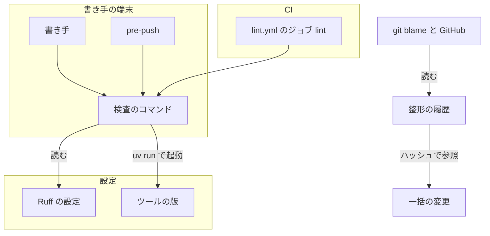
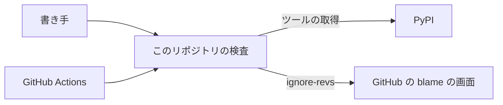
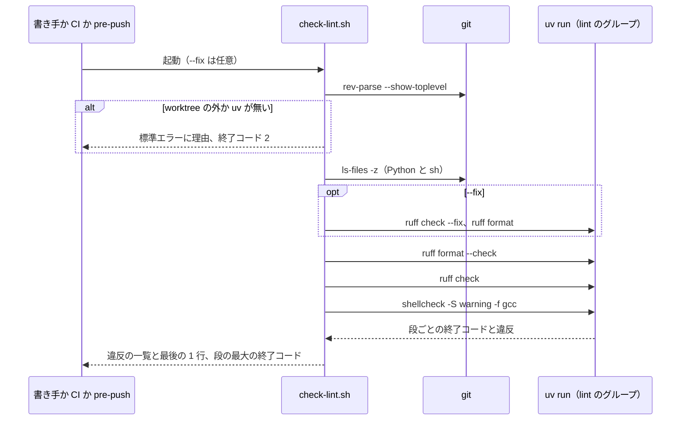
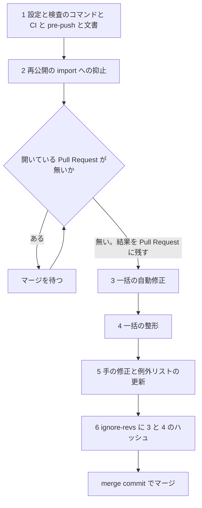

# #1323: リポジトリに formatter と静的解析を入れ、CI で守る — 設計

要求と受け入れ条件は #1323 の本文にある（コピーは [issue-1323-requirements.md](issue-1323-requirements.md)）。
この文書は「どう作るか」だけを扱う。

## 例: 変えた後に、書き手が 1 つの違反を直すまで

1. 書き手が `plugins/ndf/scripts/lib/` の Python を直し、リポジトリの根で `bash scripts/check-lint.sh` を打つ
2. 検査のコマンドは `git ls-files` で対象を決め、`uv run --frozen --project . --only-group lint` から
   `ruff format --check`・`ruff check`・`shellcheck -S warning` を順に走らせる。版は根の `uv.lock` が固定する
3. `plugins/ndf/scripts/lib/x.py:12:1: F401 [*] 'json' imported but unused` が出て、終了コード 1 で終わる
4. 書き手が `bash scripts/check-lint.sh --fix` を打つ。ruff が自動で直せる違反を直して整形し、もう一度検査して 0 で終わる
5. `git push` の前に `.githooks/pre-push` が同じコマンドを走らせる。Pull Request では `lint.yml` の
   ジョブ `lint` が同じコマンドを走らせ、違反があれば落ちる
6. 一括の整形より前の行を `git blame --ignore-revs-file .git-blame-ignore-revs` でたどると、整形の前のコミットが出る

## ドメインモデル

### コンテキスト

| コンテキスト | 何の語が 1 つの意味に決まるか |
| --- | --- |
| このリポジトリの開発の検査（`repo-dev-checks`） | 検査のコマンド・一括の整形・一括の自動修正・抑止。ai-plugins の開発の中だけで使う |

**この変更は 1 つのコンテキストだけに属する。** cross-refactoring の指標の測定（`ndf-cross-refactoring`、#1319）も
Ruff を起動するが、`--isolated` でこの設定を読まず、版も自分で固定する（決定 8）。モデルを共有しないので、
コンテキストマップの関係は置かない。

### 集約

| 集約 | 持ち主（書き換えてよいもの） | 根 | エンティティ | 値オブジェクト |
| --- | --- | --- | --- | --- |
| Ruff の設定 | 根の `pyproject.toml` の `[tool.ruff]` | Ruff の設定 | — | 規則の選択・除外と理由・行幅・対象の Python の版 |
| ツールの版 | 根の `pyproject.toml` の `[dependency-groups] lint`（`uv lock` が `uv.lock` へ解決する） | lint のグループ | — | ruff の版・shellcheck-py の版 |
| 検査の手順 | `scripts/check-lint.sh` | 検査のコマンド | — | 対象の一覧・shellcheck の重さ・終了コード |
| 一括の変更 | 実装の Pull Request（1 回だけ） | 実装の Pull Request | 一括の自動修正・一括の整形・手の修正の各コミット | コミットのハッシュ |
| 整形の履歴 | `.git-blame-ignore-revs` | ファイル | 載せたコミット（ハッシュで参照） | 注記の 1 行 |

整形の履歴は、一括の変更のコミットを**ハッシュで参照する**。コミットそのものを持たない。

### 不変条件

| # | 集約 | 条件 | 破れたときの扱い |
| --- | --- | --- | --- |
| I1 | ツールの版 | 手元と CI は同じ `uv.lock` から ruff と shellcheck を起動する。検査のコマンドのほかにツールを起動する経路を置かない | CI のワークフローが検査のコマンドを呼ばずにツールを直に起動したら、レビューで差し戻す |
| I2 | 検査の手順 | 対象は git が追跡するファイルだけである。追跡していないファイルを置いても結果が変わらない | 追跡していない `.py` を置いて結果が変われば、対象の選び方の誤りとして直す |
| I3 | 検査の手順 | 違反があれば 1、検査の仕組みが落ちたら 2 で終わる。どの段が落ちても成功に倒さない | 成功に倒れたら検査のコマンドの誤りとして直す |
| I4 | Ruff の設定 | 設定の除外と、この変更が置く行の抑止には、それぞれ理由がある | 理由の無い除外・抑止はレビューで差し戻す |
| I5 | 一括の変更 | 一括の整形のコミットは `ruff format` の出力だけを、一括の自動修正のコミットは `ruff check --fix` の出力だけを持つ | 親へ戻して同じコマンドを掛け直した結果と食い違えば、コミットを作り直す |
| I6 | 整形の履歴 | 載せたハッシュは、マージの後の `develop` から到達できる | 到達できないハッシュは、マージの後のハッシュで載せ直す |
| I7 | Ruff の設定 | #1319 の指標の測定は、この設定の有無で結果が変わらない | 変われば測定の側が設定を読んでいる。この変更は測定を変えないので、設定の置き方を直す |
| I8 | 一括の変更 | 前後で、全体テストの成否・`claude plugin validate .` の終了コード・`build-runtime-plugins.sh --check`・`check-script-structure.py` が変わらない | 変われば一括の変更を入れない。原因の修正か抑止を手の修正へ足す |

### ドメインイベント

| # | イベント | 発生元 | 受け手 |
| --- | --- | --- | --- |
| E1 | 検査の設定と版の固定を置いた | 実装の Pull Request のコミット 1 | 検査のコマンド（読む）・CI |
| E2 | 手元で検査を走らせた | 書き手（手で打つ）・`.githooks/pre-push` | 書き手（終了コードと違反の一覧） |
| E3 | 開いている Pull Request が無いことを確かめた | 実装の担当（`gh pr list --state open`） | 実装の Pull Request のコメント（AC12） |
| E4 | 一括で整形し直し、違反を直した | 実装の Pull Request のコミット 3〜5 | 全体テスト・構造チェック（I8） |
| E5 | 整形のコミットを `.git-blame-ignore-revs` に載せた | 実装の Pull Request のコミット 6 | `git blame`・GitHub の blame の画面 |
| E6 | CI が検査を走らせ、違反で落とした | `lint.yml` のジョブ `lint` | Pull Request の作成者 |
| E7 | 進行中のブランチが整形の後の `develop` を取り込んだ | ブランチの持ち主（`CONTRIBUTING.md` の手順） | そのブランチの Pull Request |
| E8 | 配布した | `release` | 利用者（整形は振る舞いを変えない） |

**E6 が全体を落とし始めるのは E4 と同じ Pull Request のマージからである。** ワークフローは一括の変更と同じ
Pull Request で入るため、既存の違反で他の Pull Request を落とす期間ができない（AC5）。

### 用語

| 用語 | 意味 | 用語集への反映 |
| --- | --- | --- |
| 一括の自動修正 | リポジトリの全対象へ `ruff check --fix` を掛け、結果を 1 つのコミットにしたもの。一括の整形と同じく `.git-blame-ignore-revs` に載せる | 追加（`repo-dev-checks`） |
| 抑止 | 静的解析の指摘を、行のコメント（`# noqa`・`# shellcheck disable=`）か設定の除外で出さなくすること。理由を添える | 追加（`repo-dev-checks`） |
| 一括の整形 | （要求で追加済み） | 変更なし |
| 検査のコマンド | （要求で追加済み。実体は `scripts/check-lint.sh`） | 変更なし |

## 機能一覧

| # | 機能 | 誰が使うか |
| --- | --- | --- |
| F1 | 手元で CI と同じ検査を走らせる | 書き手（人・エージェント） |
| F2 | 手元で自動の修正と整形を掛ける | 書き手 |
| F3 | push の前に検査を走らせる | `install-dev-hooks.sh` を入れた clone の書き手 |
| F4 | Pull Request で検査を走らせ、違反で落とす | レビューする人・マージする人 |
| F5 | 一括の整形と違反の修正を 1 回入れる | 実装の担当 |
| F6 | blame で一括の変更を飛ばす | 履歴をたどる人（GitHub の画面は自動） |
| F7 | 整形の前から続くブランチを取り込む | 進行中のブランチの持ち主 |

## 基準の実測

2026-09-26、`develop` の `2f17ec16`。対象は git が追跡する Python 623 本・sh 79 本（`.sh` 76 本と、拡張子の無い
`.githooks/pre-commit`・`.githooks/pre-push`・`claude`）。ruff 0.16.9・shellcheck 0.11.0 で、下の設定を一時の
worktree に置いて測った。

| 測ったもの | 結果 |
| --- | --- |
| 規則 `E4,E7,E9,F,W`（E402・E741 を除く）の違反 | 127 件。E702 44・F401 36・F811 27・E731 4・E701 4・F541 4・E401 3・W 3・F821 1・F841 1 |
| 一括の自動修正（`ruff check --fix`） | 36 本（+22 / −45 行） |
| 一括の整形（`ruff format`、行幅 140） | 602 本（+22,574 / −14,167 行） |
| 自動修正と整形の後に残る違反 | 31 件。F811 25（3 本）・E731 4・F821 1・F841 1。E702・E701 は整形が行を分けて消える |
| shellcheck `-S warning` | 32 件（14 本）。error 2（`plugins/ndf/dev.kiro/install.sh:110` の構文）・warning 30（SC2034 11・SC1007 9 ほか） |
| 全体テスト（`-n 4`） | 整形前 6,653 件が通る。自動修正と整形の後は 6,652 件が通り、構造チェックの例外リストの照合 1 件だけが落ちる |
| 構造チェック（`check-script-structure.py`） | 整形の後に 11 件。例外リストの行数を超えた 8 本と、新しく 500 行を超えた 3 本（`pr-steps.py` 593・`fix-steps.py` 592・`converge.py` 505） |
| 所要時間 | `ruff check` と `ruff format --check` で 1 秒未満、shellcheck で 3.0 秒 |

採らなかった設定で測った結果は、決定の記録にある（決定 1〜4）。

## 構成要素

| 要素 | 変更 | 責務 |
| --- | --- | --- |
| 根の `pyproject.toml` の `[tool.ruff]` | 新規の節 | Ruff の設定。規則・除外と理由・行幅・対象の版（決定 1〜4） |
| 根の `pyproject.toml` の `[dependency-groups] lint` と `uv.lock` | 新規の節・更新 | ツールの版の固定（`ruff==0.16.9`・`shellcheck-py==0.11.0.1`）。上げ方をコメントに書く（決定 6） |
| `scripts/check-lint.sh` | 新規 | 検査のコマンド。対象の選び方・3 つの段・`--fix`・終了コード（入出力の契約） |
| `.github/workflows/lint.yml` | 新規 | Pull Request では絞り込まずに検査のコマンドを走らせる（決定 9） |
| `.githooks/pre-push` | 変更 | 既存の `validate-runtime-plugins.sh` の後に検査のコマンドを走らせる（決定 10） |
| `.git-blame-ignore-revs` | 新規 | 一括の自動修正と一括の整形のハッシュを、注記の 1 行とともに持つ（決定 11） |
| `CONTRIBUTING.md` の「手元での検証」 | 変更 | 5 つ目の検査として検査のコマンドを足す。`blame.ignoreRevsFile` の設定の仕方と、整形の前から続くブランチの取り込み方を書く（決定 12） |
| `plugins/ndf/scripts/lib/monitor.py` | 変更 | 再公開の import（96〜100 行）へ `F401` の抑止と理由を置く。一括の自動修正より前のコミットにする（決定 13） |
| 対象の Python（602 本） | 整形・修正 | 一括の自動修正・一括の整形・手の修正（残る 31 件） |
| 対象の sh（14 本） | 修正 | shellcheck の 32 件の修正か抑止（決定 5） |
| `scripts/script-structure-allow/*--lines.json` | 更新 8・新規 3 | 整形の後の行数へラチェットを合わせる（決定 14） |

**`plugins/ndf/pyproject.toml` は変えない。** NDF が利用者の環境へ入れるスクリプトの依存の宣言で、開発の検査の
ツールを載せると利用者の環境へ入る（要求の「前提とする取り決め」）。

**既存の規則のうち、新しく足す値に当てはまらないものは 2 つある。** 構造チェックの行数のラチェット（例外リストは
「載せた時点の行数」を持ち、整形で物理行が増えると破れる）と、`test_supervise_layout.py` の 500 行の上限
（例外リストを持たない）である。前者は例外リストの更新を構成要素へ載せ、後者は行幅で収める（決定 4）。
ほかに照らした規則は当てはまった。根の `pyproject.toml` の extra を `plugins/ndf` と照らすテスト
（`test_root_declaration_pins_the_same_versions_as_the_plugin`）は `[project.optional-dependencies]` の節だけを読み、
`[dependency-groups]` は読まない。重いジョブを省く判定（`ci-heavy-skip.py`）は `pytest.yml` と runtime smoke だけに
掛かり、数秒で終わる `lint.yml` には要らない。



### 文脈



外部の系は PyPI（ruff と shellcheck-py の wheel の取得元）・GitHub Actions・GitHub の blame の画面の 3 つである。
どれもこの変更では変えない。

### 配置

```mermaid
graph TD
    subgraph 手元の clone
        CMD[check-lint.sh] -->|uv run| VENV[根の .venv の lint のグループ]
    end
    subgraph GitHub Actions の runner
        JOB[ジョブ lint] -->|bash| CMD2[check-lint.sh]
        CMD2 -->|uv run| VENV2[runner の .venv]
    end
    VENV -. 同じ uv.lock .- VENV2
```

境界をまたいで流れるのは、`uv.lock` が固定した wheel（PyPI から）と、ジョブの成否（GitHub へ）だけである。
秘密は流れない。ワークフローの権限は `contents: read` に絞る。

### 置き場所

```text
（リポジトリの根）
├── .git-blame-ignore-revs            新規
├── .githooks/pre-push                変更
├── .github/workflows/lint.yml        新規
├── CONTRIBUTING.md                   変更
├── pyproject.toml                    変更（[tool.ruff]・[dependency-groups] lint）
├── uv.lock                           更新
└── scripts/
    ├── check-lint.sh                 新規
    └── script-structure-allow/       更新 8・新規 3
```

## 入出力の契約

**検査のコマンド `scripts/check-lint.sh`。** リポジトリの根でも、worktree の中のどこでも打てる（根は
`git rev-parse --show-toplevel` で決める）。

| 項目 | 内容 |
| --- | --- |
| 名前 | `bash scripts/check-lint.sh [--fix]` |
| 入力 | `--fix`（任意）。ほかの引数は使い方を出して 2 で終わる |
| 対象 | Python は `git ls-files -z -- '*.py'`。sh は `git ls-files -z -- '*.sh'` と、拡張子の無い追跡しているファイルのうち 1 行目が `sh`・`bash` の shebang のもの。どちらもworktree に無いファイル（消したがまだ index にあるもの）を除く。一覧は NUL 区切りで受け、配列で渡す |
| 段 | 1. `ruff format --check` 2. `ruff check` 3. `shellcheck -S warning -f gcc`。どれも `uv run --frozen --project <根> --only-group lint` から起動する。前の段が落ちても後の段を走らせ、すべての違反を 1 回で出す |
| `--fix` | 段の前に `ruff check --fix` と `ruff format` を Python の対象へ掛ける。sh は直さない |
| 出力（標準出力） | 各ツールの出力をそのまま流す。`ruff check` は `パス:行:列: 規則 説明`、`ruff format --check` は整形し直すファイル、shellcheck は `パス:行:列: 重さ: 説明 [SC番号]` |
| 出力（標準エラー） | 最後に 1 行。通れば `check-lint: 違反なし`、違反があれば落ちた段の名前、仕組みが落ちたら何が無いか（`uv が見つからない` など） |
| 終了コード | 0: すべての段が 0。1: どれかの段が 1 で、2 以上の段が無い。2: git の worktree の外・`uv` が無い・引数の誤り・どれかの段が 2 以上（ツールを取得できない・設定の誤り・ファイルが無い） |
| 互換性 | 新しいコマンドで、既存の呼び出し側は無い |

**段の終了コードの意味はツールに揃える。** ruff は 0（違反なし）・1（違反あり）・2（異常）、shellcheck は
0・1（指摘あり）・2 以上（異常）を返す。`uv run` がツールを取得できないときも 2 を返す。3 つの段で 1 と 2 以上が
同じ意味になるので、段の最大値をそのまま返せば I3 を満たす。

**CI のワークフロー `lint.yml`。**

| 項目 | 内容 |
| --- | --- |
| 起動 | `pull_request`（絞り込まない）と、`main`・`develop` への `push`（対象のファイル・設定・ワークフロー自身の変更に絞る） |
| ジョブ | `lint` の 1 つ。checkout → Python の用意 → `python3 -m pip install --upgrade uv` → `bash scripts/check-lint.sh` |
| 失敗 | 検査のコマンドの終了コードが 0 以外なら落ちる。途中のステップが落ちたときも GitHub Actions の既定どおり落ちる |
| 必須のチェック | ruleset へは足さない（要求の対象範囲の外。足すなら確認してから） |

## 処理の流れ

### 検査のコマンド



### 一括の変更を入れる順序

実装の Pull Request は 1 本で、次の 6 つのコミットをこの順で積む（決定 11）。



- **3 と 4 はツールの出力だけを持つ**（I5）。3 は `ruff check --fix`、4 は `ruff format` を、対象の全体へ 1 回ずつ掛ける
- **5 が持つもの**: 残る Python の違反 31 件の修正か抑止、sh の 32 件の修正か抑止、構造チェックの例外リストの更新
- **マージの前に `develop` が進んだら、rebase せずに `develop` を merge する。** rebase すると 3 と 4 のハッシュが変わる。
  取り込んだ差分に整形の差が出たら `check-lint.sh --fix` の結果を新しいコミットにし、そのハッシュも 6 と同じ形で足す
- リポジトリのマージの方式は merge commit だけが許可されている（squash と rebase は無効。2026-09-26 に
  `gh api repos/devbasex/ai-plugins` で確認）。**マージでハッシュは変わらない**ので、6 はマージの前に書ける（I6）

## 非機能の実現方式

| 大項目 | 要求の条件 | 実現方式 | 確かめ方 |
| --- | --- | --- | --- |
| 性能・拡張性 | CI の検査のジョブは、既存の `pytest` のジョブより先に終わる（検査で Pull Request の待ちを延ばさない）。実測の秒を設計か Pull Request に残す | ジョブを 1 つにし、`--only-group lint` で ruff と shellcheck-py の 2 つだけを入れる。検査そのものは手元で 4 秒以内（基準の実測） | 実装の Pull Request で、`lint` と `pytest` のジョブの所要秒を `gh run view` で取り、本文に残す |
| 運用・保守性 | ツールの版を上げるのは、版を固定した 1 か所を変える Pull Request だけで行う。上げたときに出る新しい違反は、同じ Pull Request で直すか抑止する | 版は `[dependency-groups] lint` にだけ書き、`uv.lock` が固定する。上げ方（宣言と lock を同じ Pull Request で変え、`check-lint.sh` が 0 になるまで直す）を節のコメントに書く | 版を書いた場所が 1 つであることを `grep -rn "ruff==" pyproject.toml scripts .github` で見る（`codemetrics.py` の版は別の目的。決定 8） |
| 移行性 | 一括の整形の後に、整形の前から続くブランチを取り込む手順がある（AC9） | `CONTRIBUTING.md` に手順を書く。一括の自動修正の直前のコミットまでを取り込み、自分のブランチへ `check-lint.sh --fix` を掛けてコミットし、一括の整形を取り込むときの衝突は自分の側を採る。書く前に、整形の前から分けた一時のブランチで打って確かめる | 一時のブランチで手順を通し、`check-lint.sh` が 0 で終わり、取り込みの結果が `develop` と自分の変更だけの差になることを見る |
| システム環境 | 手元の検査のコマンドは、`uv` がある環境で追加の導入なしに走る。shellcheck を採るなら、無い環境でどう扱うかを設計が決める（CI では入れる） | shellcheck は PyPI の `shellcheck-py`（shellcheck の実行ファイルを同梱した wheel）を lint のグループに入れる。手元と CI のどちらも、システムの shellcheck を使わない | `PATH` から shellcheck を外した環境で検査のコマンドを打ち、shellcheck の段が走ることを見る |

## 決定の記録

### 決定 1: ruff の規則は `E4,E7,E9,F` と `W` にする

未定義名・未使用の import・構文に近い誤りを見る規則だけを選ぶ。目的は機械で見つけられる誤りをレビューへ回さないことで、
書き方の好みを揃えることではない。**ruff 0.16 の既定の規則は広い**（1,791 件。PLW1510 の `subprocess.run` の `check` の
省略が 377 件など）。直すと `subprocess.run` の失敗の扱いという振る舞いに触れるため、この変更では採らない。

import の並べ替え（`I`）は採らない。一時の worktree で `I001` を含めて自動で直すと、全体テストが 138 件落ち、
並べ替えだけを外すと 16 件に減った。スクリプトは `sys.path` へ経路を足す import の後で隣のモジュールを import して
おり、並べ替えるとその順序が崩れる。
`UP`・`B`・`SIM` は誤りより書き方の規則が多く、課題に挙がっていないので採らない。

### 決定 2: E402 と E741 は設定で外す

E402（モジュールの先頭に無い import）は 424 か所に当たる。402 か所は書き手がすでに `# noqa: E402` で抑止しており、
`sys.path` に経路を足した後で隣のモジュールを import するリポジトリの規約の形である。抑止の無い 22 件は、同じ形が
11 件、テストの途中で使う直前に置いた import（`test_relay.py` の `pty` など）が 11 件で、どちらも誤りではない。
E741（`l`・`O` などの紛らわしい名前）は字形の規則で、誤りではない。72 か所の名前を変える修正は、違反を消す最小の
修正を超える。

**既存の `# noqa: E402` は消さない。** 規則を外すと働かないコメントになるが、消すと 139 本のファイルに差分が出る。
RUF100（働かない抑止）の自動修正は、抑止に添えた理由の文まで消すことも確かめた。

### 決定 3: F811 は `gh_fake` のフィクスチャを受ける 3 本だけで外す

残る F811 の 25 件はすべて、`test_gh_call.py`・`test_gh_quota.py`・`test_gh_rest.py` が `gh_fake` のフィクスチャ
`fake` を import し、テストの引数で同じ名前を受ける pytest の形である。F811 はほかでは同じ名前のテストの上書き
（書いたテストが走らない）を見つけるので、全体では外さない。3 本は `per-file-ignores` に理由と一緒に書く。

### 決定 4: 行幅は 140、対象の Python の版は 3.10、引用符は ruff の既定にする

ruff は全角の文字を幅 2 と数えるため、日本語の文字列の多い行が大きく折り返される。行幅ごとに一括の整形を測った。

| 行幅 | 増える行 | 構造チェックの違反 | `supervise_lib/templates.py` |
| --- | ---: | ---: | ---: |
| 120 | +13,157 | 16 | 523 行 |
| 140 | +8,407 | 11 | 466 行 |
| 160 | +5,484 | 9 | 429 行 |

増える行は、一括の自動修正の後に整形したときの追加と削除の差である。

**`test_supervise_layout.py` は `supervise_lib` の各ファイルを 500 行までに縛り、例外リストを持たない。** 120 では
`templates.py` が 523 行になり、ファイルを分けるリファクタリングが要る（要求の対象範囲の外）。140 はこの上限に収まる
最も狭い行幅の候補である。160 は差分が少ないが、横に長い行を許す幅がさらに広がり、差分の読みにくさが残る。
対象の版を 3.10 にするのは、NDF のスクリプトが利用者の環境で 3.10 以上で動く（`plugins/ndf/pyproject.toml`）ためで、
根の `requires-python`（3.11）からの推定に任せない。引用符は既定（二重引用符）にする。保つ設定（`preserve`）と比べて
差分の行は 1% しか変わらない。

### 決定 5: shellcheck は `-S warning` で全 sh へ掛け、版は shellcheck-py で固定する

info の 48 件は、SC1091（読み込む先を追えない）26 件と SC2016（単一引用符の中の `$`）19 件などで、どちらも意図した
書き方が大半である。warning 以上の 32 件は、構文の誤り（`install.sh` の `[ "$test_flag" "$path" ]`。`test` へ書き換え
ても振る舞いは同じ）と、未使用・未定義の変数など誤りに近いものである。**source される側の lib が持つ変数の SC2034 は、
ファイルの先頭で理由と一緒に抑止する**（source する側が使う）。直すと振る舞いが変わる指摘（未定義の変数を読んでいる
など）は、境界の「確認してから行う」に当たる。その場で `out-of-scope` が起票し、抑止に課題の番号を理由として書く。
shellcheck を PyPI の wheel で入れるのは、ツールの版を ruff と同じ `uv.lock` 1 か所で固定するためである。
システムの shellcheck を使う案は、手元と CI で版が揃わない。

### 決定 6: 版は根の `pyproject.toml` の `[dependency-groups] lint` に書き、`uv.lock` で固定する

根の `pyproject.toml` は全体テストの環境の宣言で、版を lock で固定し、上げるのは宣言と lock を変える Pull Request だけと
決めている。検査のツールも同じ方針に乗せる。extra ではなく依存のグループにするのは、`--only-group lint` で
ruff と shellcheck-py の 2 つだけを入れられるためである（全体テストの環境の依存を検査のジョブへ入れない）。一時の
worktree で、`--only-group lint` と全体テストの `--all-extras` を交互に起動しても、環境のパッケージの出し入れが
起きないことを確かめた。`uvx ruff@0.16.9` のようにコマンドへ版を書く案は、shellcheck を同じ形で固定できない。

### 決定 7: 型検査はこの変更では入れない（#1331）

ty 0.0.84 で 1,431 件、そのうち 968 件が import を解決できない指摘だった。スクリプトは `sys.path.insert`（154 か所）で
隣の `lib/` を足してから import するため、置き場ごとの検索の経路を設定に書くまで、意味のある指摘が埋もれる。
mypy を `plugins/ndf/scripts/lib` だけに掛けても 69 件・21 秒だった。経路の設定と違反の直しは formatter と lint の導入と
別の量の作業で、整形の時期（利用者の指示）に合わせる理由が無い。#1331 として起票した。

### 決定 8: cross-refactoring の指標の測定が固定する ruff の版とは共有しない

`codemetrics.py` は利用者のプロジェクトで `uvx ruff==0.16.9` を `--isolated` で起動する。この版は配る振る舞いの一部で、
上げる理由と時期が開発の検査と違う。共有すると、片方の版上げがもう片方の振る舞いを変える。今は同じ版だが、揃える
約束は置かない。

### 決定 9: CI は変わったファイルではなく全体を検査する

検査のすべては 4 秒以内に終わる。全体を見ると、結果が差分の取り方（merge-base・取り込み）に左右されず、手元の結果と
同じになる（AC2）。変わったファイルだけを見る案は、版を上げたときの新しい違反を、そのファイルを次に触った人へ回す。

### 決定 10: 書く前に走らせる仕組みは `.githooks/pre-push` にする

CI が落とすのは push した内容なので、同じ境界で先に止める。pre-commit にしない理由は 2 つある。検査のコマンドは
worktree のファイルを見るため、index と食い違う（部分的に add したコミットで結果が合わない）。supervise の手順は区切りごとに
コミットし、途中のコミットを止めると手順が進まない。Claude Code の hook は NDF が利用者へ配る振る舞いに当たるため
使わない（要求の前提 3）。`--no-verify` で飛ばせるのは既存の pre-push と同じである。

### 決定 11: 実装の Pull Request を 1 本にし、6 つのコミットで積む

ワークフローと一括の変更を別の Pull Request にすると、先にマージした側が既存の違反で他の Pull Request を落とすか、
検査の無い期間を作る（AC5）。コミットを分けるのは、整形と自動修正のコミットがツールの出力だけを持つ（AC7）ためと、
`.git-blame-ignore-revs` に載せる単位にするためである。一括の自動修正も載せる。未使用の import を消し、f 文字列を
普通の文字列にするだけの変更で、行の作者を上書きさせる理由が無い。

### 決定 12: `blame.ignoreRevsFile` は自動で設定せず、文書で案内する

設定したまま `.git-blame-ignore-revs` の無い ref（一括の整形より前のタグ・ブランチ）で `git blame` を打つと、
`fatal: could not open object name list` で終了コード 128 になる（git 2.53.0 で確認）。`install-dev-hooks.sh` で
設定すると、過去の版をたどる操作が落ちる。GitHub の blame の画面は、根にファイルを置けば設定なしで読む。

### 決定 13: 再公開の import には、一括の自動修正より前に抑止を置く

`lib/monitor.py` の 96〜100 行は、他のモジュールが `monitor.monitor_proc` のように使う再公開の import で、F401 の
自動修正が消す。消した一時の worktree では、cross-review の監視のテストが 12 件落ちた。F401 を自動で直せない規則に
する案は、以後の `--fix` でも未使用の import を手で消させる。再公開は抑止で示すのが ruff の想定する形で、書き忘れは
全体テストが落とす。

### 決定 14: 構造チェックの例外リストは、整形の後の行数へ更新する

500 行の上限と例外リストの行数は、読む量の目安として決めた値である（#1142 の I5）。一括の整形は処理を増やさずに
物理行だけを増やす。上限に合わせてファイルを分けるのはリファクタリングで、要求の対象範囲の外である。更新する 8 本と
新しく載せる 3 本の理由は「一括の整形（#1323）で物理行が増えた」とし、整形の後の行数を載せる。

### 決定 15: 抑止に理由を求めるのは、この変更が置くものと設定の除外である

既存の `# noqa` は 435 行（157 本）あり、その多くは E402 だけを抑止していて、決定 2 の後は働かない。理由を書き足すと
一括の変更の外で 157 本に差分が出る。AC10 の確かめ方（`grep` で抑止の一覧を出す）は、この変更の差分に現れた抑止に
当てる。

## テスト設計

新しい単体テストは足さない（要求の「前提とする取り決め」）。確かめる振る舞いは、検査のコマンドと CI を実際に動かして見る。

| 受け入れ条件・不変条件 | どの振る舞いで縛るか | どう壊したら落ちるべきか |
| --- | --- | --- |
| AC1 | 根の `pyproject.toml` に `[tool.ruff]` と lint のグループがあり、ruff がそれを読む（`ruff check --show-settings` の設定の場所が根） | `[tool.ruff]` を消すと、`--show-settings` が既定の設定を示す |
| AC2・I1 | 同じコミットで、手元の検査のコマンドと CI のジョブの違反の件数と対象のファイルが一致する | CI のワークフローでツールを直に起動し版を変えると、件数が食い違う |
| AC3 | 違反が無ければ 0、違反を 1 つ入れた一時のブランチで 1 と違反のファイルと行、`uv` を `PATH` から外すと 2 と「uv が見つからない」 | 段の終了コードを捨てると、違反を入れても 0 で終わる |
| AC4・I3 | 違反を 1 つ入れた下書きの Pull Request で `lint` が落ち、直すと通る。設定を壊した（未知の規則を書いた）ときも落ちる | ruff が 2 を返す状態で 0 を返すと、壊れた設定で CI が通る |
| AC5 | 実装の Pull Request の先端で検査のコマンドが 0、`lint` が通る | 手の修正のコミットを抜くと 1 で落ちる |
| AC6・I8 | 一括の変更の前後で、全体テスト・`claude plugin validate .`・`build-runtime-plugins.sh --check`・`check-script-structure.py` の結果が同じ | 再公開の抑止（決定 13）を抜くと、全体テストが落ちる |
| AC7・I5 | 3 と 4 のコミットを親へ戻して同じコマンドを掛け直すと、差が出ない | 手の修正を 4 に混ぜると、掛け直した結果と食い違う |
| AC8・I6 | `git blame --ignore-revs-file .git-blame-ignore-revs` を整形したファイル 1 本に掛けると、整形の行が整形より前のコミットを指す。マージの後に載せたハッシュが `develop` から到達できる | ハッシュを 1 文字変えると、blame が整形のコミットを指す |
| AC9 | `CONTRIBUTING.md` のコマンドを打って確かめる（文言を照合するテストは書かない）。取り込みの手順は、整形の前から分けた一時のブランチで通す | 手順のコマンドが落ちるか、取り込んだ結果に整形の衝突が残る |
| AC10・I4 | この変更の差分に現れた `# noqa`・`# shellcheck disable=`・設定の除外に、それぞれ理由がある | 理由の無い抑止を差分に足すと、確かめる一覧に理由の無い行が出る |
| AC11・I7 | cross-refactoring の指標の測定のテスト（`test_code_metrics.py` ほか）が通る。`plugins/` の差分が整形と違反の修正に限る | 測定の起動から `--isolated` を外すと、根の設定の有無で結果が変わる |
| AC12 | 一括の自動修正の直前の `gh pr list --state open` の出力が、実装の Pull Request のコメントにある | — |
| I2 | 追跡していない `.py`（違反を含む）を置いても、検査のコマンドの結果が変わらない | 対象を `ruff check .` のようにディレクトリで渡すと、置いたファイルの違反が出る |

## 未確認のまま残ること

| 項目 | 内容 |
| --- | --- |
| CI の所要秒 | 検査のジョブと `pytest` のジョブの実測の秒は、実装の Pull Request で取る（非機能の条件） |
| shellcheck-py の wheel の対応環境 | Linux の aarch64 で動くことだけを確かめた。macOS と Linux の x86_64 は実装で確かめる |
| sh の 32 件の個々の扱い | 直すか抑止するかは 1 件ずつ実装で決める。振る舞いが変わる指摘が見つかれば起票する（決定 5） |
| 整形の前から続くブランチの取り込み手順 | 形は非機能の移行性の行に書いた。コマンドは実装で一時のブランチを使って確かめてから `CONTRIBUTING.md` に書く |
| 実装の時点の本数と件数 | 基準の実測は `2f17ec16` の値である。実装の時点で `develop` が進んでいれば、手の修正の件数と例外リストの行数は測り直す |
| ruleset の必須のチェック | `lint` を必須にするかは、実装の後に利用者へ確かめる（要求の対象範囲の外） |
