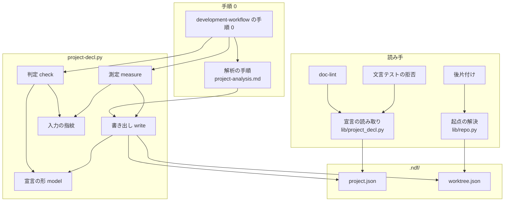
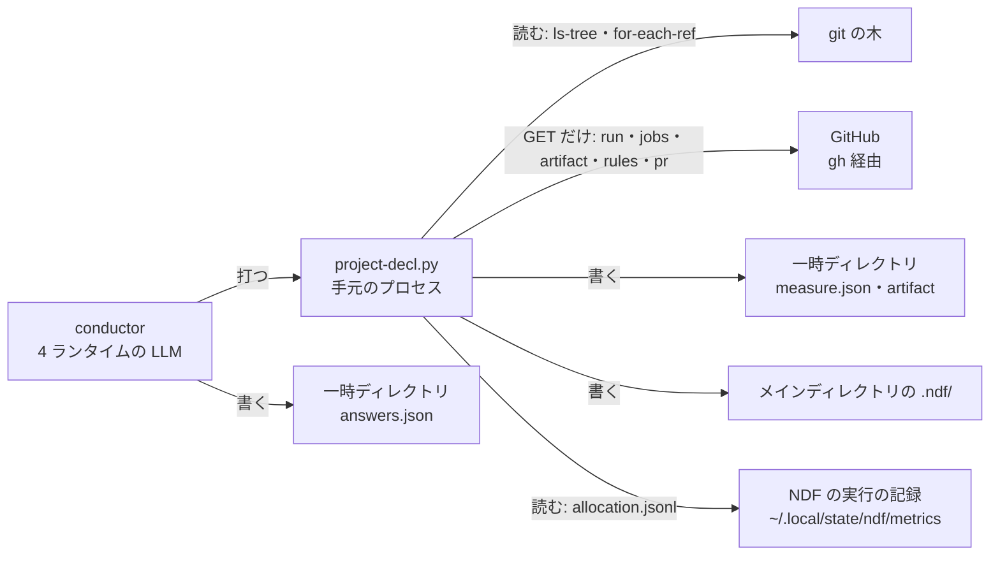
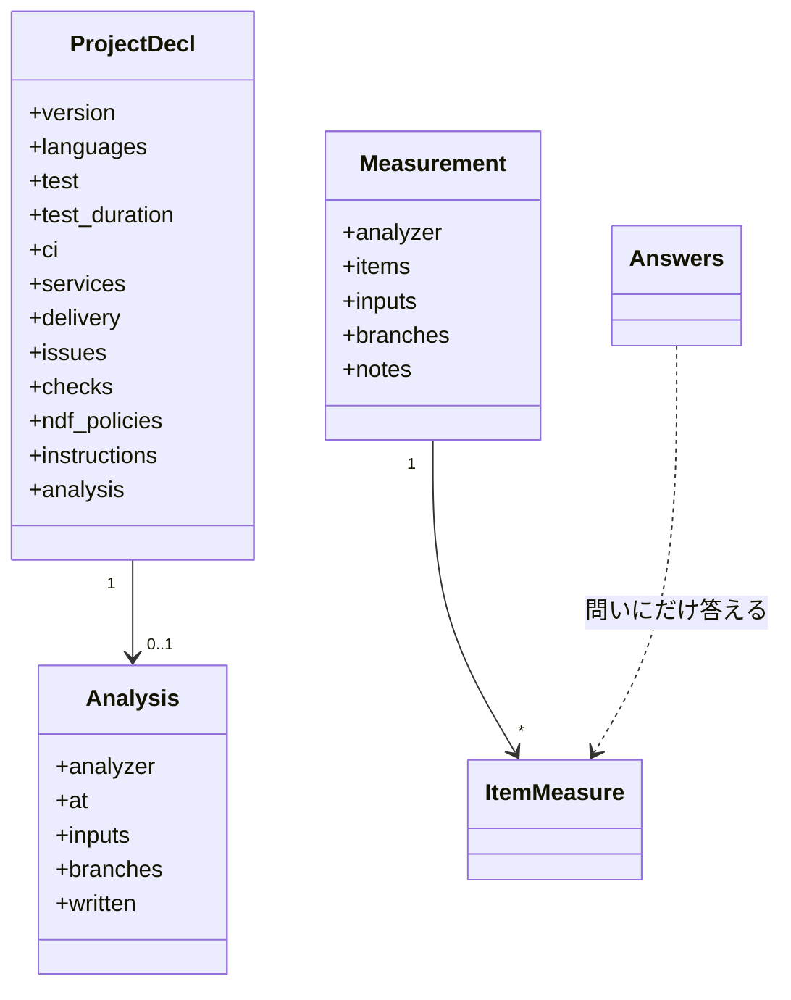
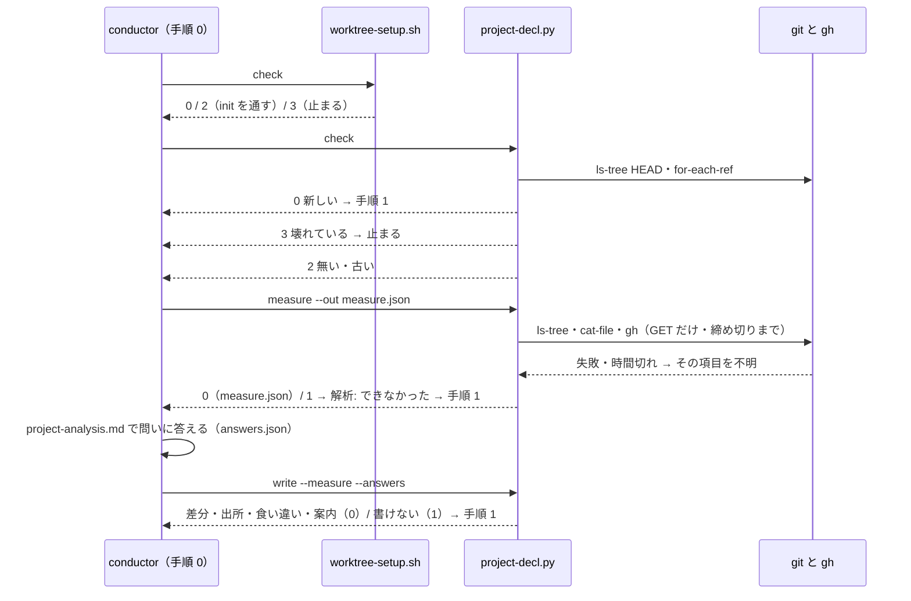
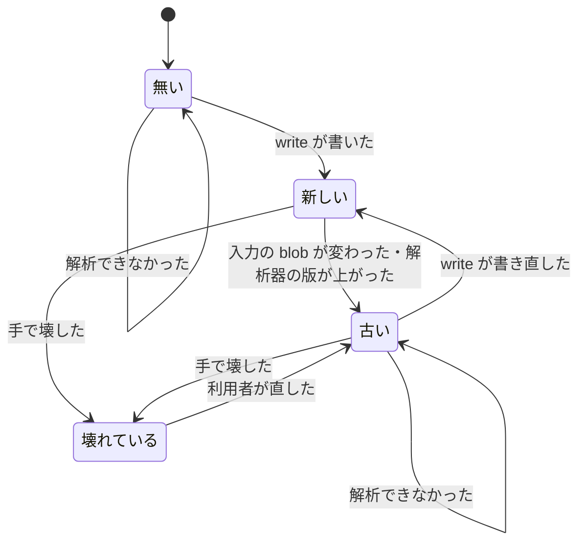

# #1333: NDF を使い始めるリポジトリを解析し、.ndf/ の宣言をその場で作る — 設計

要求と受け入れ条件は #1333 の本文にある（コピーは [issue-1333-requirements.md](issue-1333-requirements.md) ）。
この文書は「どう作るか」だけを扱う。決定の記録・テスト設計・未確認のまま残ることは
[issue-1333-design-decisions.md](issue-1333-design-decisions.md) にある。

## 例: carmo-system-console で `/ndf:development-workflow` を回し始めると

1. 手順 0 が `worktree-setup.sh check` を打つ。`.ndf/worktree.json` はあるが `base_branch` が無いので、
   `開発の起点: main（既定ブランチ）` と出て 0 で終わる
2. 続けて `project-decl.py check` を打つ。`.ndf/project.json` が無いので 2 で終わる
3. conductor が `project-decl.py measure --out "$TMP/measure.json"` を打つ。測定は git の木と `gh` だけを読み、
   120 秒の締め切りの中で終わる。言語（PHP 8.3・Laravel 10）・CI の JUnit 24 本の合計（3,827 秒）・ワークフロー 15 本・
   必須のチェック 3 つ・`compose.yml` の `mysql` を「測った値」として、テストの走らせ方・起点と本番・配布・
   課題の正本・NDF の方針の検査を「問い」として、候補と根拠を付けて返す
4. conductor が `project-analysis.md`（新設）の手順で問いに答える。`CLAUDE.md` の
   `docker compose exec app ./vendor/bin/phpunit` の行を根拠にテストを「PHPUnit・`app` のコンテナ越し」、
   マージされた PR の宛先が `main` に揃っていることから起点と本番を `main` と決め、答えのファイルを書く
5. `project-decl.py write` が `.ndf/project.json` を新しく作り、`.ndf/worktree.json` に欠けていた
   `base_branch: main`・`production_branch: main` だけを足す。書いた差分と、項目ごとに「測った / 判断した / 不明」を出す
6. 手順 0 の出力が `宣言: あり。解析: 作成した（.ndf/project.json・worktree.json に 2 項目。不明 無し）` になる
7. 次に手順 0 を通すと、`check` は HEAD の木の入力の blob が記録と同じなので 0 で終わり、解析は走らない（0.1 秒未満）

`gh` が使えない環境では、3 の CI の項目（P3・P4）が `{"unknown": "gh が使えない（未認証）"}` になり、4 以降は同じように進む。

## ドメインモデル

### コンテキスト

| コンテキスト | 何の語が 1 つの意味に決まるか |
| --- | --- |
| `ndf-workflow` | プロジェクトの宣言・解析・不明・測った値・問い・答え・入力の指紋 |
| `ndf-worktree` | ベースブランチ・本番のブランチ（`.ndf/worktree.json` の `base_branch`・`production_branch`）。今の意味のまま |

`ndf-workflow` が顧客、`ndf-worktree` が供給者の関係（顧客 / 供給者）。解析は P6（起点と本番）を
`worktree.json` の既存の 2 項目としてだけ書き、別の名前で持ち直さない（決定 3）。

測った対象（CI・`gh`・依存の定義のファイル）は外部の系である。その出力を宣言の形へ直すのは `measure` の中の
腐敗防止層で、外部の語（GitHub Actions の job・artifact・ruleset）を宣言の語（CI の分割・所要の出所・必須のチェック）へ直す。

### 集約

| 集約 | 持ち主（書き換えてよいもの） | 根 | エンティティ | 値オブジェクト |
| --- | --- | --- | --- | --- |
| プロジェクトの宣言（`.ndf/project.json`） | `project-decl.py write` と、手で直す利用者。ほかの Skill とスクリプトは読むだけ | 宣言（1 リポジトリに 1 つ） | 項目（P1〜P5・P7〜P10 の 10 キー） | 項目の値・不明（理由）・入力の指紋・書いた値の指紋 |
| 起点の宣言（`.ndf/worktree.json`） | 今の持ち主（`worktree-setup.sh init` と利用者）に加え、`write` が欠けた 2 キーだけを足す | 宣言 | — | ベースブランチ・本番のブランチ |
| 測定の結果（一時ファイル） | `project-decl.py measure` だけが書く | 1 回の測定 | 項目の測定（測った値・問い・不明） | 候補・根拠 |
| 答え（一時ファイル） | conductor だけが書く | 1 回の判断 | — | 選んだ値・不明（理由） |

測定の結果と答えは宣言へ写さない。宣言が持つのは、書いた値と、`analysis` の節（入力の指紋・書いた値の指紋・解析器の版）だけである。

### 不変条件

| # | 集約 | 条件 | 破れたときの扱い |
| --- | --- | --- | --- |
| I1 | プロジェクトの宣言 | `write` は、手で書いた値を変えない。変えてよいのは、キーが無い項目と、前の `write` が書いた値のまま（書いた値の指紋が一致する）の項目だけ | 一致しない項目は残し、`mismatch` として両方の値を出す。ただし手で書いた値が秘密の形に当たるときは I7 を先に当て、`mismatch` を出さない |
| I2 | 起点の宣言 | `write` は `base_branch`・`production_branch` のうち無いキーだけを足し、ほかのキーと既存の値を変えない | 既存の値と食い違えば `mismatch` を出すだけにする |
| I3 | プロジェクトの宣言 | 値を「不明」で置き換えない。新しい解析で不明でも、前の値があれば残す。ただし前の値が秘密の形に当たるときは I7 を先に当て、不明に置き換える | 前の値を残し、`unknown` の行を出力に出す |
| I4 | プロジェクトの宣言 | 「不明」の項目に ai-plugins の値（`develop`・`uv run ... pytest` など）も既定の値も入れない。不明は `{"unknown": "<理由>"}` だけで表す | model が `unknown` と値の両方を持つ項目を拒む |
| I5 | 測定の結果 | `measure` はリポジトリの追跡ファイル・`.ndf/`・GitHub のどれにも書かない。書くのは `--out` のファイルと一時ディレクトリだけ | `gh` は読む API だけを呼ぶ（`gh api` は GET のみ、`run download` は一時ディレクトリへ） |
| I6 | 測定の結果 | `.env*`・鍵・資格情報に当たるファイル（決定 10 の名前の表）は、パスだけを記録して開かない | 名前の表に当たったファイルは読まない |
| I7 | プロジェクトの宣言 | 宣言に秘密の形の文字列（決定 10 の形の表）が入らない。測った値・答えに加え、既存の宣言に手で書いた値にも当てる（I1 より先） | `write` がその値を捨てて `{"unknown": "秘密の形"}` にし、キーの名前だけの `secret` の行を出す。値は書き出した宣言・差分・`mismatch`・出力のどれにも出さない |
| I8 | プロジェクトの宣言 | `check` は決定論だけで判定し、LLM と `gh` を呼ばず、ファイルを書かない | 判定に使うのは `.ndf/` の JSON と `git ls-tree`・`git for-each-ref` だけ |
| I9 | プロジェクトの宣言 | 入力の指紋のうち、入力のパスの blob が HEAD の木（`git ls-tree`）と一致し、ブランチの構成が今の `git for-each-ref` から作った構成と一致し、解析器の版が今の版なら「新しい」 | 1 つでも違えば `check` は 2 と変わった入力を返す |
| I10 | 測定の結果 | `measure` の所要は 120 秒を超えない | 締め切りに届いた項目は起動せず `{"unknown": "時間切れ"}` にする |
| I11 | プロジェクトの宣言 | 壊れた宣言（JSON として読めない・model に合わない）を `write` が作り直さない | `check` は 3、`write` も 3 で終わり、直す箇所を出す |
| I12 | 手順 0 | 解析の失敗（測定の失敗・時間切れ・書けない）で工程を止めない | 手順 0 は `解析: できなかった（<理由>）` を出して手順 1 へ進む。止まるのは 3 だけ |

### ドメインイベント

| # | イベント | 発生元 | 受け手 |
| --- | --- | --- | --- |
| E1 | NDF の工程を始めた | 手順 0（conductor） | `worktree-setup.sh check` と `project-decl.py check` |
| E2 | 宣言の有無と新しさを判定した | `project-decl.py check` | 手順 0（0 なら手順 1、2 なら解析、3 なら止まる） |
| E3 | リポジトリを決定論で測った | `project-decl.py measure` | conductor（問いに答える）・`write`（測った値を書く） |
| E4 | 測った値から宣言の中身を決めた | conductor（答えのファイル） | `write` |
| E5 | 宣言を書き出した | `project-decl.py write` | 利用者（差分を見てコミットするか決める）・E7 の読み手 |
| E6 | 書き出した内容・食い違い・指示書の案内を示した | `project-decl.py write` の出力 | 手順 0 の `宣言:` の行・利用者 |
| E7 | Skill とスクリプトが宣言を読んだ | `lib/project_decl.py`・`lib/repo.py` を通す読み手 | doc-lint・cross-refactoring・後片付け・#1334 の戦略 |
| E8 | 解析が読んだ入力が変わった | コミット（CI のワークフロー・依存の定義など） | 次の E2（`check` が 2 を返す） |

### 用語

| 用語 | 意味 | 用語集への反映 |
| --- | --- | --- |
| プロジェクトの宣言 | リポジトリの根の `.ndf/` に置く、そのプロジェクトの形を表すファイルの集まり。機能ごとの JSON と、解析が書く `project.json` からなる | 意味の変更（`ndf-workflow`。「10 種類を含む」を外す） |
| 測った値 | 解析の測定が、ファイル・git・`gh` の出力から決定論で決めた項目の値 | 追加（`ndf-workflow`） |
| 問い | 測定が値を 1 つに決められず、候補と根拠を付けて conductor へ渡す項目 | 追加（`ndf-workflow`） |
| 答え | conductor が問いごとに選んだ値か不明。`write` が形を確かめて宣言へ書く | 追加（`ndf-workflow`） |
| 入力の指紋 | 解析が読んだファイルの、HEAD の木での blob の SHA と、ブランチの構成の組。宣言の新しさの判定に使う | 追加（`ndf-workflow`） |
| 解析 | プロジェクトの宣言を作るために、リポジトリと CI を決定論で測り、測った値から宣言の中身を決めること | 追加（`ndf-workflow`） |
| 不明 | 解析が測れなかった・決められなかった項目の値。ai-plugins の値で埋めない | 追加（`ndf-workflow`） |

## 機能一覧

| # | 機能 | 誰が使うか |
| --- | --- | --- |
| F1 | 宣言が無いか古いかを、工程の入り口で決定論で判定する。手動の再解析では新しくても古いとする | conductor（手順 0・手動の再解析） |
| F2 | リポジトリと CI を測り、測った値と問いを返す | conductor（手順 0） |
| F3 | 問いに答え、測った値と合わせて宣言を書き出す。差分と項目ごとの出所を示す | conductor（手順 0）・利用者 |
| F4 | 既存の宣言の値を保ち、解析との食い違いを示す | 利用者 |
| F5 | 指示書の状態（古い NDF の案内・指示書が無い）を案内する | 利用者 |
| F6 | 宣言の形を schema で公開する | #1334 などの後続の設計・宣言を手で書く利用者 |
| F7 | 起点を宣言 → origin の HEAD → main → master の順で決める（後片付け・手順の例） | `merged-steps.py`・conductor |
| F8 | doc-lint と `.md` の文言テストの拒否を、宣言で掛けない | doc-lint・cross-refactoring |

## 構成要素

| 要素 | 責務 |
| --- | --- |
| 手順 0（`development-workflow/SKILL.md`） | `worktree-setup.sh check` の後に `project-decl.py check` を打ち、2 なら解析の 3 手（measure → 答え → write）を通す。`宣言:` の行に解析の結果を足す。自動の再解析はここでだけ走る（「再解析」） |
| 解析の手順（`development-workflow/references/project-analysis.md`、新設） | conductor が問いに答える規則（候補から選ぶ・根拠を読む・決められなければ不明）と答えのファイルの形。「再解析」の節に、自動と手動の契機と、手動の入り口（`check --force`）から 3 手を通す手順を持つ |
| 判定（`project-decl.py check`） | 宣言の有無・読めるか・新しさを返す。`--force` なら新しくても 2 を返す。LLM も `gh` も呼ばない（I8） |
| 測定（`project-decl.py measure` と `project_lib/measure_repo.py`・`measure_ci.py`） | P1〜P10 を測り、項目ごとに「測った値・問い・不明」を一時ファイルへ書く。標準ライブラリと `git`・`gh` だけで動く |
| 入力の指紋（`project_lib/fingerprint.py`） | 入力のパスの表（決定 6）に当たる追跡ファイルの blob を HEAD の木から集め、ブランチの構成と組にする |
| 書き出し（`project-decl.py write` と `project_lib/merge.py`） | 答えの形を確かめ、I1〜I3・I7 の規則で `project.json` と `worktree.json` へ書く。差分・食い違い・案内を出す |
| 宣言の形（`project_lib/model.py`） | `project.json` の pydantic のモデル。`project-decl.py schema` が JSON Schema を生成する（決定 5） |
| 宣言の schema（`development-workflow/schemas/project.schema.json`、生成物） | 宣言の形の公開。#1334 が P2〜P5 をここで参照する |
| 宣言の読み取り（`lib/project_decl.py`、新設） | Skill とスクリプトが `project.json` を読む唯一の入口。読めなければ `{}` を返し例外を上げない |
| 起点の解決（`lib/repo.py`） | `default_branch()`（origin の HEAD → main → master）と `base_branch()`（宣言 → 既定ブランチ）を持つ。`pr-steps.py` の `default_branch` をここへ移す |
| 後片付け（`merged-steps.py`） | `_update_main_dir` の起点を `repo.base_branch()` で決める。決まらなければ pull せず理由を出す |
| doc-lint（`doc-lint.py`） | `ndf_policies.doc_lint` が `true` のときだけ文体の規則を掛ける。ほかは `skipped` で 0 |
| 文言テストの拒否（`cross-refactoring` の `refactor_lib/commands/implement.py`） | `ndf_policies.reject_md_wording_tests` が `true` のときだけ `doc_wording_tests` を当てる |
| 手順の例（`workflow-modes.md`・`cross-refactoring/SKILL.md`） | `origin/develop` を `origin/<起点>` に直し、起点は `worktree-setup.sh check` の `開発の起点:` の行から読むと書く |
| ai-plugins の宣言（`.ndf/project.json`、新設） | ai-plugins で解析した結果。`ndf_policies` の 2 つを `true` にし、今の振る舞いを保つ（決定 8） |
| 用語集（`docs/glossary/glossary.json`） | 用語の表の 5 語を反映し `glossary.py render` で作り直す |

### 構成要素図



手順の例（2 つの `.md`）・schema の生成物・ai-plugins の宣言・用語集は、呼び出しの関係を持たないため図に含めない。

### 文脈と配置



- GitHub へ流れるのは読む要求だけで、書く要求を出さない（I5）。`gh` の認証は利用者の既存のもので、NDF は資格情報を受け渡さない
- 書く先は一時ディレクトリとメインディレクトリの `.ndf/` だけである。メインディレクトリへ書くのは `worktree-setup.sh init` と同じ扱い
  （`.ndf/` はガードの `allow_paths` に入っている）
- NDF の実行の記録は、同じ機械の NDF が書いた全体テストの所要を読むためだけに使う（決定 9）

### 置き場所

```text
plugins/ndf/
├── scripts/
│   ├── project-decl.py                 # 新設。check / measure / write / schema
│   ├── project_lib/                    # 新設
│   │   ├── model.py                    # 宣言の形（pydantic）と schema の生成
│   │   ├── fingerprint.py              # 入力のパスの表と指紋
│   │   ├── measure_repo.py             # P1・P2・P5・P6（git の分）・P7〜P10
│   │   ├── measure_ci.py               # P3・P4・P6（PR の宛先）・P8（gh の分）
│   │   └── merge.py                    # 書き出しの規則（I1〜I3・I7）と差分
│   ├── lib/project_decl.py             # 新設。宣言の読み取り
│   ├── lib/repo.py                     # 変更。default_branch・base_branch
│   ├── pr-steps.py                     # 変更。default_branch を lib/repo へ移す
│   ├── merged-steps.py                 # 変更。起点の既定
│   └── doc-lint.py                     # 変更。ndf_policies.doc_lint
└── skills/
    ├── development-workflow/
    │   ├── SKILL.md                    # 変更。手順 0
    │   ├── references/project-analysis.md   # 新設。答え方と再解析
    │   ├── references/workflow-modes.md     # 変更。origin/<起点>
    │   └── schemas/project.schema.json      # 新設（生成物）
    └── cross-refactoring/
        ├── SKILL.md                    # 変更。origin/<起点>
        └── scripts/refactor_lib/commands/implement.py   # 変更。reject_md_wording_tests
.ndf/project.json                       # 新設（ai-plugins の宣言）
```

`project_lib/` の各モジュールは 500 行以下に収める（`check-script-structure.py` の `lines`）。

## 構造



- `ItemMeasure` は `status`（`measured` / `question` / `unknown`）と、`value`・`candidates`・`evidence`・`reason` のいずれかを持つ
- 項目の値は、キーごとに `値の形` か `Unknown`（`{"unknown": str}`）のどちらか一方である（I4）

## データ構造

**永続するのは `.ndf/project.json` 1 つと、`.ndf/worktree.json` の 2 キーである。** 測定の結果と答えは一時ファイルで、
工程が終われば捨ててよい。

### `.ndf/project.json`

| キー | 項目 | 形 | 空・無いときの意味 |
| --- | --- | --- | --- |
| `$schema` | — | schema の URL | 無くてよい |
| `version` | — | `1` | 必須 |
| `languages` | P1 | `[{"name", "version"?, "frameworks": [str], "files": int}]` | キーが無い = 未解析。`[]` = 言語のファイルが無い |
| `test` | P2 | `{"suites": [{"name", "runner", "command", "scope_command"?, "container"?: {"service", "compose_files"}, "needs": [str], "paths": [str]}]}` | `suites: []` = テストが無い |
| `test_duration` | P3 | `{"measured": [{"seconds", "source", "detail"}]}` | `measured: []` は許さない（測れなければ不明） |
| `ci` | P4 | `{"provider", "workflows": [{"path", "jobs", "wall_seconds"?}], "required_checks": [str]}` | `workflows: []` = CI が無い |
| `services` | P5 | `{"container": bool, "compose_files": [str], "databases": [str]}` | `databases: []` = DB を要さない |
| `delivery` | P7 | `[{"target", "kind": "auto"|"manual", "trigger", "branch"?, "versioned": bool}]` | `[]` = 配布しない |
| `issues` | P8 | `{"primary", "others": [str]}`。`primary` は `github` / `markdown` / `redmine` / `external` など | — |
| `checks` | P9 | `{"tools": [{"name", "config"}]}` | `tools: []` = 検査が無い |
| `ndf_policies` | P9 | `{"doc_lint": bool, "reject_md_wording_tests": bool}` | キーが無い = どちらも掛けない（決定 8） |
| `instructions` | P10 | `{"files": [str], "imports": [{"from", "to"}], "notes": [str]}` | `files: []` = 指示書が無い |
| `analysis` | — | `{"analyzer": int, "at": ISO8601, "inputs": {パス: blob}, "branches": {"head", "present": [str]}, "written": {キー: sha256}}` | キーが無い = 手で書いた宣言。`check` は 2 を返す |

- 項目のキーはどれも `{"unknown": "<理由>"}` を取れる。**キーが無い（未解析・手で書かない）と不明（解析したが決まらない）を分ける**
- P6 は `worktree.json` の `base_branch`・`production_branch` に書き、`project.json` には持たない（決定 3）
- `test_duration.measured[].source` は `ndf-record`（NDF の実行の記録の中央値）・`ci-junit`（直近の成功した run の JUnit の `time` の合計）・
  `ci-steps`（テストの step の所要の合計）の 3 つで、測れたものをすべて並べる。どれを使うかは読み手（#1334）が決める
- `analysis.written` は、`write` が書いた項目の値を正規化した JSON の SHA-256 である。`worktree.json` の 2 キーは
  `worktree.json#base_branch` の形のキーで持つ

**時系列の扱い: 状態を上書きする。** 宣言は「今のプロジェクトの形」だけを表し、過去の値の読み手がいない。
過去の値は git の履歴が持つ（宣言はコミットされる前提）。解析ごとの記録を積まない理由は決定 11 にある。

**移行: 既存の 10 種類は移さない。** 形も置き場も変えず、読み手も変えない（決定 2）。

### CRUD 図

| 機能 | `project.json` | `worktree.json` | 測定の結果 | 答え |
| --- | --- | --- | --- | --- |
| F1 判定 | R | R | — | — |
| F2 測定 | R（指紋の比較用） | R | C | — |
| F3 書き出し | C / U | U（欠けたキーだけ） | R | R |
| F4 食い違いの提示 | R | R | R | R |
| F5 指示書の案内 | — | — | R | — |
| F7 起点の解決 | — | R | — | — |
| F8 方針の検査 | R | — | — | — |

書く相手が 2 つあるのは F3 だけで、`worktree.json` へは I2 の 2 キーに限る。

## 入出力の契約

### `project-decl.py check`

| 項目 | 内容 |
| --- | --- |
| 入力 | `--root <dir>`（既定は現在地の git の根）、`--force`（手動の再解析。新しくても 2 を返す）。宣言はメインディレクトリの `.ndf/` を読む（`repo.main_dir`） |
| 出力 | 人が読む行（`プロジェクトの宣言: <状態>`、古ければ `変わった入力: <パス>`）と、最後に結果 JSON 1 行（`lib/README.md` の形） |
| 終了コード | 0 新しい / 2 無い・古い（`analysis` が無い、解析器の版が古い、入力の指紋が違う、`--force`）/ 3 壊れている（JSON として読めない・model に合わない。箇所を出す）/ 1 判定できない（git の根が無いなど） |
| 互換性 | 新設。既存の呼び出し側は無い |

### `project-decl.py measure`

| 項目 | 内容 |
| --- | --- |
| 入力 | `--root <dir>`、`--out <file>`（必須。一時ディレクトリの中）、`--budget <秒>`（既定 120） |
| 出力 | `--out` に測定の結果（下の形）。標準出力には結果 JSON 1 行（項目ごとの `status` の数と所要） |
| 終了コード | 0 書けた（項目が不明でも 0。I12）/ 1 `--out` を書けない・引数の誤り |
| 失敗の形 | `gh` が無い・未認証・ネットワークが無い → CI の項目を `{"status": "unknown", "reason": "..."}` にして続ける |

測定の結果の形（値は形を示す例）:

```json
{
  "analyzer": 1,
  "elapsed_seconds": 41.2,
  "items": {
    "languages": {"status": "measured", "value": [{"name": "php", "version": "8.3", "frameworks": ["laravel 10"], "files": 1490}]},
    "test": {"status": "question",
             "candidates": [{"runner": "phpunit", "config": "phpunit.xml"}],
             "evidence": [{"path": "CLAUDE.md", "line": 42, "text": "docker compose exec app ./vendor/bin/phpunit"}]},
    "test_duration": {"status": "measured", "value": {"measured": [{"seconds": 3827, "source": "ci-junit", "detail": "run 1234 の artifact 24 本"}]}},
    "ci": {"status": "unknown", "reason": "gh が使えない（未認証）"}
  },
  "branches": {"status": "question", "candidates": {"base": ["main"], "production": ["main"]},
               "evidence": [{"text": "直近 100 件のマージ先: main 62・qa/epsilon 38"}]},
  "inputs": {".github/workflows/test.yml": "3f2a..."},
  "branch_state": {"head": "main", "present": ["main"]},
  "notes": ["AGENTS.md・CLAUDE.md が無い"]
}
```

### 答えのファイル（conductor が書く）

形の例（carmo-system-console を想定した値）:

```json
{"test": {"value": {"suites": [{"name": "phpunit", "runner": "phpunit",
                                "command": "docker compose exec -T app ./vendor/bin/phpunit",
                                "scope_command": "docker compose exec -T app ./vendor/bin/phpunit {paths}",
                                "container": {"service": "app", "compose_files": ["compose.yml"]},
                                "needs": ["mysql"], "paths": ["tests"]}]},
          "reason": "CLAUDE.md:42 の手順"},
 "branches": {"value": {"base": "main", "production": "main"}, "reason": "マージ先の 62% が main。develop が無い"},
 "delivery": {"unknown": "デプロイの設定がリポジトリに無い"}}
```

- キーは測定の結果で `status: question` の項目だけ。ほかのキーは無視して `ignored` の行を出す
- `value` は model のその項目の形に合うこと。合わなければその項目を不明（`答えが形に合わない: <箇所>`）にして続ける
- `reason` は出力にだけ載り、宣言へは書かない
- 答え方の規則（候補から選ぶ・根拠を必ず 1 つ挙げる・根拠が無ければ不明）は `project-analysis.md` が持つ

### `project-decl.py write`

| 項目 | 内容 |
| --- | --- |
| 入力 | `--root <dir>`、`--measure <file>`、`--answers <file>`（無ければ問いをすべて不明にする）、`--dry-run` |
| 出力 | 書いたファイルごとの unified diff、項目ごとの出所の表（`測った` / `判断した` / `不明` / `手の値を保った`）、食い違い（`宣言 <値> / 解析 <値>`）、指示書の案内、最後に結果 JSON 1 行 |
| 結果 JSON の `items` | `{"kind": "written" | "kept" | "mismatch" | "unknown" | "secret" | "ignored" | "note", "key", ...}` |
| 終了コード | 0 書けた・書くものが無い / 1 書けない（権限・ディスク）/ 3 既存の宣言が壊れている（I11） |

### 手順 0 の出力（`development-workflow`）

`宣言:` の行を `宣言: <worktree の結果>。解析: <解析の結果>` にする。

| `project-decl.py check` | 次に行うこと | `解析:` の部分 |
| --- | --- | --- |
| 0 | 手順 1 へ進む | `不要（新しい）` |
| 2 | measure → 答え → write を通し、手順 1 へ進む | `作成した（<書いたファイル>。不明 <P 番号>）` / `更新した（変わった入力 <パス>）` / `更新した（手動）` / `できなかった（<理由>）` |
| 3 | **先へ進まない。** `check` の出力を示して利用者に直してもらう | 出さない |
| 1、または `$SCRIPTS` を決められない | 手順 1 へ進む | `判定できない（<理由>）` |

`worktree-setup.sh check` が 3 のときは、今と同じく `project-decl.py check` を打たずに止まる。

## 処理の流れ



`measure` の中の順序: 指紋と git から測る項目（P1・P2・P5・P6・P7・P9・P10）を先に測り、残りの時間で `gh` の項目
（P3・P4・P6 の PR の宛先・P8）を測る。`gh` の 1 回の呼び出しは「締め切りまでの残り」と 30 秒の小さい方で打ち切る。

### 宣言の状態



- 壊れている → 新しいへ直接は移らない。直した後の `check` は、`analysis` の指紋と照らして「古い」か「新しい」を決める
  （図では指紋が合わない場合を描いた。合えば新しいに戻る）
- 手で書いた `project.json`（`analysis` が無い）は「古い」として扱い、解析は I1 で手の値を保ったまま `analysis` を足す

## 再解析

**構成の変化を宣言へ映す経路は、自動と手動の 2 つである。** どちらも同じ 3 手（measure → 答え → write）と同じ
書き出しの規則を通り、違うのは `check` が 2 を返す理由だけである（決定 17）。手順の本文は `project-analysis.md` の「再解析」の節が持つ。

### 自動の再解析

| 項目 | 内容 |
| --- | --- |
| いつ | 入力の変化を含むコミットが `check` の読む HEAD に入った後の、最初の手順 0 |
| 契機 | `check` が入力の指紋（決定 6・I9）の違いで 2 を返す。違いを見るのは、入力のパスの表の blob・ブランチの構成・解析器の版の 3 つ |
| どこで | 手順 0 の中だけ。手順 0 以外の工程の入り口（`supervise.py`・cross-refactoring・cross-review・後片付け）は `check` を打たず、宣言をそのまま読む |
| 手順 | 手順 0 の出力の表の 2 の行（measure → 答え → write → 手順 1） |
| 出力 | `解析: 更新した（変わった入力 <パス>）` |

自動では拾わない変化: 未コミットの編集・ロックファイル・CI の結果（P3・P4 の値）だけの変化・入力のパスの表の外での
構成の変化（指示書を変えずにテストをコンテナ越しに変えた、表に無いファイルで配布の手段を変えた、など）。これらは手動の再解析で拾う。

### 手動の再解析

利用者か conductor が、次の 1 つのコマンドで始める。

```bash
python3 "$SCRIPTS/project-decl.py" check --force
```

`--force` は宣言が新しくても 2 を返し、`変わった入力: 強制（--force）` を出す。3（壊れている）と 1（判定できない）は
`--force` でも変わらず、ファイルを書かない（I8）ことも同じである。2 を受けた後は、自動と同じ 3 手を通す。

| 項目 | 内容 |
| --- | --- |
| 誰が | 利用者（conductor に「宣言を解析し直して」と頼む）か、conductor（自動で拾わない変化に気づいたとき） |
| いつ | 自動では拾わない変化の後。例: CI を分けた・JUnit を出し始めた（P3・P4）、テストの走らせ方を指示書の外で変えた、配布の設定を表の外のファイルで変えた |
| どこで | 工程のどこでもよい。手順 0 の中なら、`check` を `--force` 付きで打つ |
| 手順 | `check --force` → measure → 答え → write。答えを書くのは conductor で、利用者が自分のシェルで `check --force` だけを打っても宣言は変わらない |
| 出力 | `解析: 更新した（手動）` |

### 再解析でも手で直した値は残る

再解析の `write` は、初回と同じ規則で書く。自動と手動で規則は変わらない。

- 前の `write` が書いた値のまま（`analysis.written` の指紋が一致する）の項目だけを新しい値へ置き換え、手で直した項目は残して `mismatch` を出す（I1・決定 7）
- 新しい解析で不明になった項目は、前の値を残す（I3）
- 秘密の形の値には、I1 と I3 より先に I7 を当てる
- `analysis` の節（入力の指紋・ブランチの構成・解析器の版・`written`）は書き直す。次の `check` は 0 を返す

## 非機能の実現方式

| 大項目 | 要求の条件 | 実現方式 | 確かめ方 |
| --- | --- | --- | --- |
| 性能・拡張性 | 宣言が新しいときの判定（AC4）は決定論だけで、4 つのサンプルと ai-plugins のどれでも 5 秒以内に終わる | `check` は `git ls-tree -r HEAD` の blob を入力のパスの表と照らすだけで、ファイルを開かず `gh` も呼ばない。試作では 5 つのリポジトリで 0.05 秒以下（carmo-system-console の追跡ファイル 11,701 本・入力 24 本） | 5 つで `time project-decl.py check` を測る |
| 性能・拡張性 | 解析の決定論の測定は、それぞれ 120 秒以内に終わる（超えた項目は「不明」にする） | `measure` が開始時刻から締め切りを持ち、`gh` の呼び出しを残りと 30 秒の小さい方で打ち切る。artifact は名前が JUnit らしいものだけを、合計 50 MB までを一時ディレクトリへ落とす | 5 つで `measure` の `elapsed_seconds` を見る。`--budget 5` で時間切れの項目が不明になるのを見る |
| 運用・保守性 | 解析の測定と判断の結果は、宣言とは別に出力（または記録）へ残り、どの値が測った値でどれが判断した値かが分かる | `write` の出力の出所の表と結果 JSON の `items`。測定の結果と答えのファイルは一時ディレクトリに残り、パスを出力に出す | 仮のリポジトリで `write` の結果 JSON の `kind` を見る |
| 移行性 | 既存の 10 種類の宣言を持つリポジトリ（ai-plugins）で、宣言を読む Skill とスクリプトの振る舞いが変わらない | 10 種類を移さない。`ndf_policies` は ai-plugins の `project.json` で `true` にし、同じ Pull Request に入れる | ai-plugins で解析した後の `git diff .ndf/` が空。全体テストが通る |
| セキュリティ | 外部へ送らず、秘密の値を読まない・書かない（AC13・AC15） | `gh` は GET だけ。I6 の名前の表のファイルを開かない。I7 の形の表で書く値を捨てる。PR の本文からはホスト名だけを取る | サンプル 4 つの宣言を `.env` の値と照らす grep。解析の前後の `git status` と `gh` の課題・PR・ブランチの数 |
| システム環境 | 4 ランタイムの手順 0 から同じに呼べる。決定論の測定は Python 3 標準と `git`・`gh` だけで動く | 呼び出しは手順 0 の本文の `python3 "$SCRIPTS/project-decl.py"` だけで、hook を使わない。`measure` は標準ライブラリ（`json`・`tomllib`・`xml.etree`・`subprocess`）だけを import する。`check` と `write` は model のため `deps.require("schema")` を呼ぶ | `measure` を uv の環境の外の `python3` で打って通る。`check-script-structure.py` |
