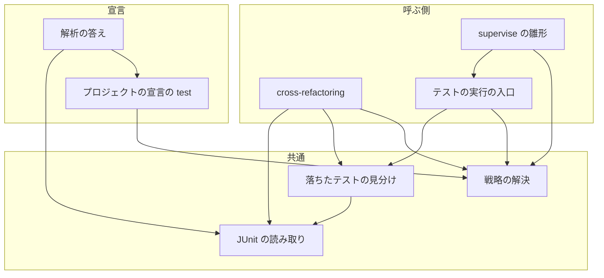
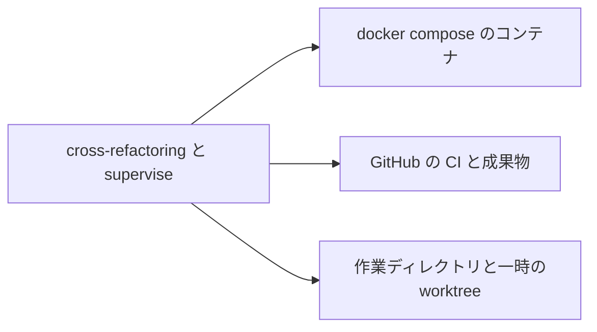
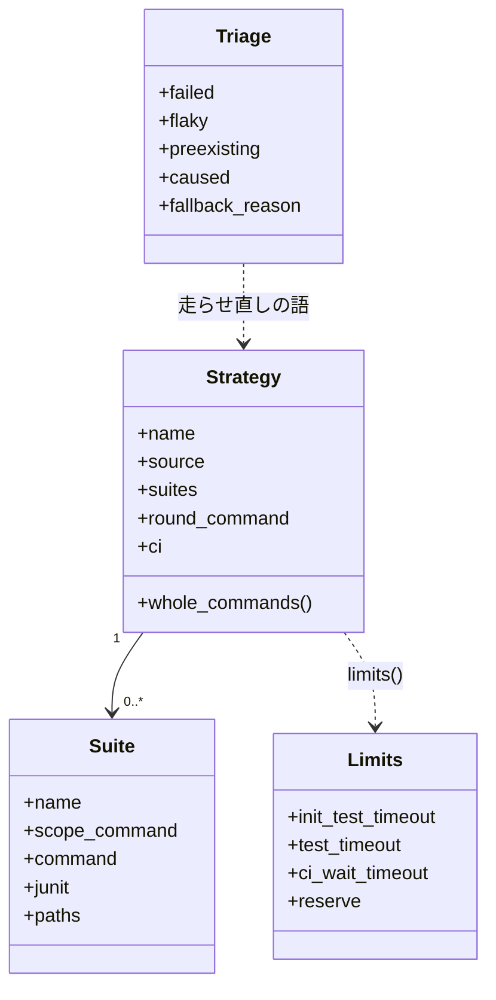
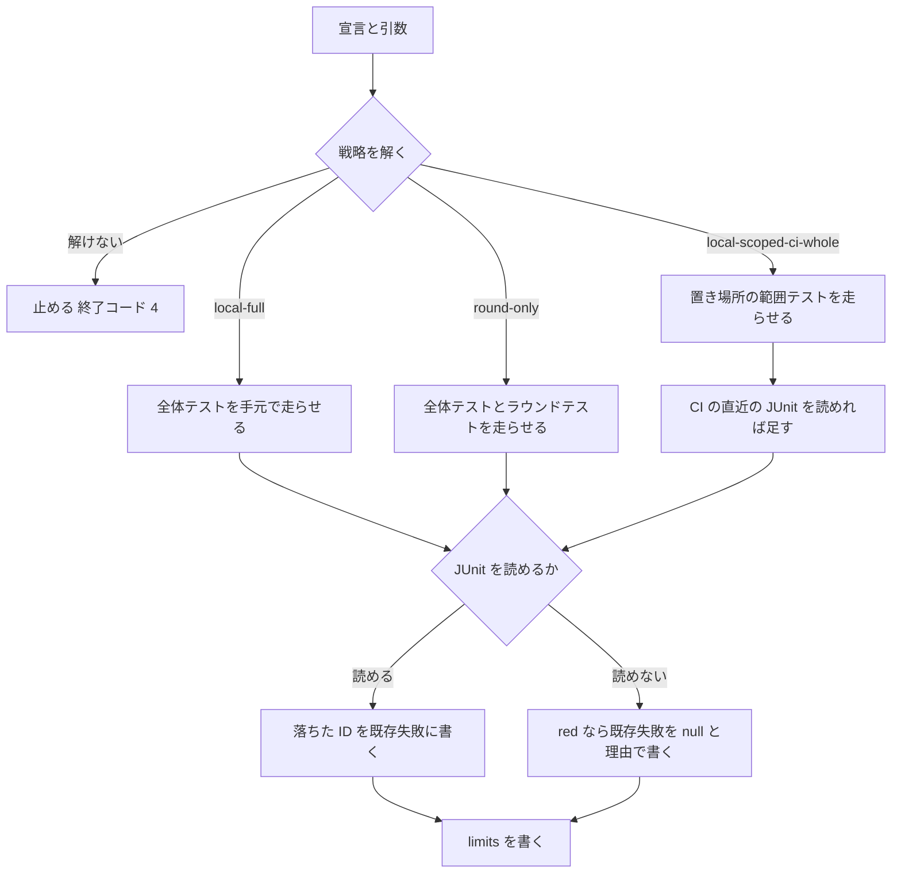
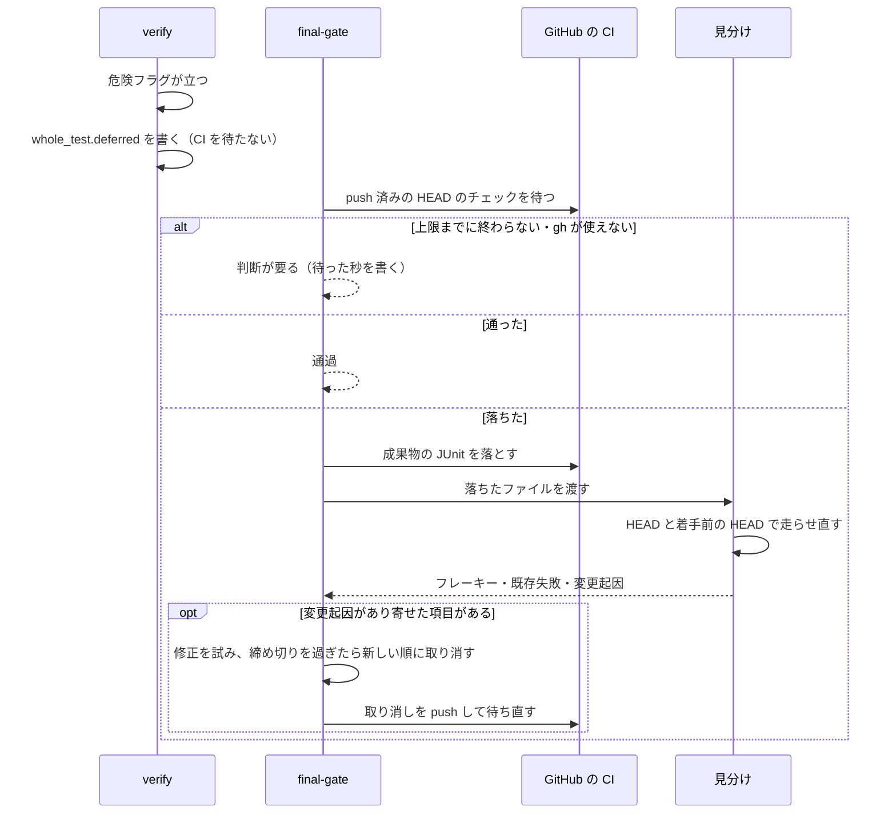

# #1334: テストの走らせ方を宣言の戦略で決める

要求と受け入れ条件は #1334 の本文にある（コピーは `issues/issue-1334-requirements.md` ）。この文書は「どう作るか」だけを扱う。
決定の記録・テスト設計・未確認のまま残ることは `issues/issue-1334-design-decisions.md` にある。

## 例: carmo-system-console で `init` から最初の範囲テストまで

宣言（#1333 の解析が作る `.ndf/project.json` ）の `test` が次の形のとき:

```json
{
  "strategy": "local-scoped-ci-whole",
  "ci": {"check": "test-results", "junit_artifacts": "junit-*"},
  "suites": [{
    "name": "phpunit", "runner": "phpunit",
    "command": "docker compose exec -T app ./vendor/bin/phpunit --log-junit build/ndf/junit.xml",
    "scope_command": "docker compose exec -T app ./vendor/bin/phpunit --log-junit build/ndf/junit.xml {paths}",
    "junit": "build/ndf/junit.xml",
    "container": {"service": "app"}, "paths": ["tests"]
  }]
}
```

1. `refactor.py init 130 --scope app/Services tests/Unit/Services --budget-minutes 30` は `--baseline-test` を受けずに進む。
   `test_strategy.resolve` が宣言の `test.strategy` を読み、戦略 `local-scoped-ci-whole`（根拠 `test.strategy` ）を状態ファイルへ書く
2. 着手前は全体テストを走らせず、`--scope` のテストの置き場所（`tests/Unit/Services` ）だけを `scope_command` で 1 回走らせる。
   落ちたテストは `build/ndf/junit.xml` から読み、既存失敗として書く。CI の直近の結果が読めればその JUnit の失敗も既存失敗へ足す
3. リファクタリング計画は項目ごとの `test_targets` を `{paths}` の位置へ語として入れ、
   `["docker","compose","exec","-T","app","./vendor/bin/phpunit","--log-junit","build/ndf/junit.xml","tests/Unit/Services/UserServiceTest.php"]`
   を `shell=False` で走らせる。コマンドの語は `{paths}` の置き換えのほかに読まない
4. 危険フラグが立っても手元で全体テストを走らせず、最終ゲートへ寄せたことを `whole_test.deferred` に書く。最終ゲートは push の後に
   チェック `test-results` を待ち、落ちたら CI の JUnit から落ちたファイルを取り、手元でそのファイルだけを HEAD と着手前の HEAD で走らせ直して分ける

ai-plugins は宣言に `test.strategy` が無い。同じ関数が所要（`test_duration` の 424 秒）から `local-full` を導き、
今と同じく着手前・危険フラグ・最終ゲートで全体テストを手元で走らせる。

## ドメインモデル

### コンテキスト

| コンテキスト | 何の語が 1 つの意味に決まるか |
| --- | --- |
| NDF の開発ワークフロー（`ndf-workflow` ） | プロジェクトの宣言・テストの戦略・範囲テスト・全体テスト・supervise の検査と実装のプラン |
| NDF の cross-refactoring（`ndf-cross-refactoring` ） | 改善項目・危険フラグ・最終ゲート・フレーキー / 既存失敗 / 変更起因 |

関係は**公開された言語**である。開発ワークフローが宣言の schema（`project.schema.json` ）とテストの戦略の関数を公開し、
cross-refactoring と supervise の両方が同じ形を読む。cross-refactoring は宣言を書き換えない。

### 集約

| 集約 | 持ち主（書き換えてよいもの） | 根 | エンティティ | 値オブジェクト |
| --- | --- | --- | --- | --- |
| プロジェクトの宣言の `test` | `project-decl.py write` だけ（利用者の手の値は `write` への入力で、`write` が保って正とする。解析の答えは手の値の無いキーへだけ書く） | `test` | suite | 戦略の名前・範囲テストの雛形・JUnit の置き場・CI の見る先 |
| テストの戦略（1 回の実行で解いたもの） | `lib/test_strategy.py` の `resolve` | 解いた戦略 | suite（解いた後の写し） | 戦略の名前・根拠のキー・時間の上限 |
| cross-refactoring の実行の状態 | `refactor.py` の各副命令 | 状態ファイル | 改善項目 | 着手前のテストの記録・既存失敗・全体テストの記録・最終ゲートの記録 |
| 落ちたテストの見分け | `lib/test_triage.py` | 見分けの結果 | — | 落ちたテストの ID・分類・走らせ直しのコマンド |

**解いた戦略は状態ファイルとプランへ写した後に変えない。** 宣言を途中で直しても、その実行は `init` で解いた戦略のまま進む。
cross-refactoring の状態ファイルは解いた戦略を ID（戦略の名前と根拠）で持ち、宣言の中身を参照しない。

### 不変条件

| # | 集約 | 条件 | 破れたときの扱い |
| --- | --- | --- | --- |
| I1 | テストの戦略 | 戦略は宣言のキーと引数の有無・`{paths}` の有無だけで決まる。コマンドの語・実行器の名前・前置きを見ない | 同じ宣言で前置きだけ違う 2 つの入力に別の戦略・別の範囲が出たら誤り（AC5） |
| I2 | テストの戦略 | コマンドへの加工は `{paths}` の語を対象の語の並びへ置き換えることだけである。宣言の `scope_command` は 1 語の `{paths}` を必ず含む。引数（`--baseline-test` / `--round-test` ）だけは、`{paths}` を含まなければ雛形でなく全体テスト / ラウンドテストのコマンドとしてそのまま走らせる | 宣言の `scope_command` に `{paths}` が無い雛形と、`{paths}` が 1 語として立っていない雛形（`--filter={paths}` ）は、`init` と `new` が理由を出して止める |
| I3 | テストの戦略 | 宣言に `test` が無い・不明で引数も無ければ、戦略を決めずに止める。ai-plugins の値でも既定の値でも埋めない | `init` は終了コード 4 で、欠けたキーと直し方を出す（AC4） |
| I4 | テストの戦略 | `local-scoped-ci-whole` の実行は、着手前・危険フラグ・最終ゲートのどこでも全体テストを手元で走らせない | 全体テストのコマンドを手元で起動したら誤り（AC3） |
| I5 | 実行の状態 | 着手前に落ちていたテストは既存失敗として書き、`init` を止めない。最終ゲートは既存失敗の外で新しく落ちたテストが無ければ通る | 既存失敗だけで最終ゲートが落ちたら誤り。既存失敗の外の失敗で通ったら誤り（AC10） |
| I6 | 落ちたテストの見分け | 落ちたテストの ID は JUnit XML からだけ読む。読めなければ見分けを全体の走らせ直しへ落とし、落としたことと理由を結果に書く | 実行器の出力の文字列から ID を読んだら誤り。落としたことが結果に無ければ誤り（AC6） |
| I7 | テストの戦略 | 時間の上限（着手前・テスト 1 回・CI の待ち）は予算と宣言の所要と着手前の実測からの算術だけで出し、状態ファイルとプランに書く | 宣言に所要がある実行で、固定の秒（900 / 1800 / 3600）がテストと CI の待ちの上限に残ったら誤り（AC7・AC9）。所要が宣言に無い supervise の計画だけは今の秒を使い、そう書く（決定 8） |
| I8 | 実行の状態 | 全体テストを CI に任せる戦略では、危険フラグの全体テストを項目ごとに回さず、最終ゲートの 1 回へ寄せ、寄せたことと立った項目を書く | 検証の中で CI を待ったら誤り（AC8） |
| I9 | 実行の状態 | CI を起動する push はオーケストレーターだけが行う | 実装担当が push したら今と同じく取り込まない |
| I10 | テストの戦略 | cross-refactoring と supervise は同じ関数（`test_strategy.resolve` / `scope_words` / `limits`・`test_triage.classify` ）で戦略・範囲テスト・時間・見分けを決める | 片方だけに同じ役割の関数があれば誤り（AC7） |

### ドメインイベント

| # | イベント | 発生元 | 受け手 |
| --- | --- | --- | --- |
| E1 | テストの戦略を選んだ | `test_strategy.resolve`（cross-refactoring の `init`、supervise の `new check` / `new impl` / `new fix` ） | 状態ファイルの `strategy`・プランの `テストの戦略` |
| E2 | 着手前のテストを走らせた | cross-refactoring の `init` | 状態ファイルの `baseline_test`（既存失敗）・`limits` の算出 |
| E3 | 項目の範囲テストを走らせた | cross-refactoring の `verify`（群の検証）・supervise の `test-limited` | 改善項目の状態・`judge` のステップ |
| E4 | 危険フラグが立ち、全体テストを走らせた（か最終ゲートへ寄せた） | cross-refactoring の `verify` | `whole_test`（`deferred` を含む）・`test_triage.classify` |
| E5 | 最終ゲートの全体テストの結果が出た | cross-refactoring の `final-gate`・supervise の `test-all` | `final_gate.checks`・`test_triage.classify` |
| E6 | 落ちたテストを見分けた | `test_triage.classify` | 危険フラグの修正と取り消し・最終ゲートの合否・supervise の `judge` |

### 用語

| 用語 | 意味 | 用語集への反映 |
| --- | --- | --- |
| テストの戦略 | 範囲テストの走らせ方・全体テストの置き場（手元か CI か）・落ちたテストの見分け方の組。`local-full` / `local-scoped-ci-whole` / `round-only` の 3 つ。宣言の `test.strategy` か、同じ関数が所要から導く | 意味の変更（候補の 4 つから 3 つに確定） |
| 範囲テストの雛形 | `{paths}` を 1 語として含むテストのコマンド（宣言の `scope_command` か、`{paths}` を含む引数）。`{paths}` を対象の語の並びへ置き換えて走らせる | 追加（`ndf-workflow`、`scope_command` ） |
| JUnit の置き場 | テストのコマンドが JUnit XML を書くファイルの、作業ディレクトリからの相対パス（宣言の `suites[].junit` ）。NDF はコマンドへ引数を足さず、このファイルを読む | 追加（`ndf-workflow`、`junit` ） |
| フレーキー / 既存失敗 / 変更起因 | 全体テスト（着手前・危険フラグ・最終ゲート）で落ちたテストの 3 つの分類。ID は JUnit から読み、落ちたファイルだけを HEAD と着手前の HEAD で走らせ直して分ける | 意味の変更（危険フラグの全体テストだけでなく着手前と最終ゲートにも当てる） |

## 機能一覧

| # | 機能 | 誰が使うか |
| --- | --- | --- |
| F1 | 宣言と引数からテストの戦略を選び、根拠とともに出す | cross-refactoring の `init`・supervise の `new` |
| F2 | 範囲テストを `{paths}` の置き換えだけで組み立てて走らせる | cross-refactoring の実装担当の検証・supervise の `test-limited` |
| F3 | 着手前のテストを戦略に沿って走らせ、落ちたテストを既存失敗として記録して進む | cross-refactoring の `init` |
| F4 | 全体テストを CI に任せる戦略で、CI を待って JUnit を読む | cross-refactoring の `final-gate`・supervise の `test-all` |
| F5 | 落ちたテストを JUnit から取り、フレーキー・既存失敗・変更起因に分ける | cross-refactoring の `verify` / `final-gate`・supervise の `test-all` |
| F6 | 危険フラグの全体テストを、CI に任せる戦略では最終ゲートの 1 回へ寄せる | cross-refactoring の `verify` / `final-gate` |
| F7 | 予算と宣言の所要から、テストと CI の待ちの上限を出してプランと状態ファイルに書く | cross-refactoring・supervise |
| F8 | PHP の `use` と、`--scope` のテストの置き場所から、危険フラグ D3・D4 を判定する | cross-refactoring の `verify` |
| F9 | テストを本体と同じ場所に置く構成で `--scope` の検査を通す | cross-refactoring の `init` |
| F10 | 解析の答えでテストの戦略・JUnit の置き場・CI の見る先を宣言へ書く | `development-workflow` の手順 0（解析） |

## 構成要素

| 要素 | 責務 | 新設 / 変更 / 削除 |
| --- | --- | --- |
| 戦略の解決（`scripts/lib/test_strategy.py` ） | 宣言と引数から戦略を解く（`resolve` ）。範囲テストの語の並び（`scope_words` ）と全体テストのコマンド（`whole_commands` ）を返す。所要と予算から上限を出す（`limits` ）。所要から戦略を導く（`propose` ）。**純粋な処理だけを置く**（ファイルもプロセスも触らない）。解けないときは理由を持つ例外を上げ、終了コードは呼ぶ側が決める | 新設 |
| JUnit の読み取り（`scripts/lib/junit.py` ） | JUnit XML から落ちたテスト（`failure` / `error` を持つ `testcase` ）と所要を読む。`file` の絶対パスを追跡ファイルの末尾の一致で作業ディレクトリからの相対へ直す。CI の run の成果物から名前の glob に当たる JUnit を落として読む | 新設（`project_lib/measure_ci.py` の `junit_seconds`・`_junit_of_run` の読み取りを移す） |
| 落ちたテストの見分け（`scripts/lib/test_triage.py` ） | 落ちたファイルだけを HEAD と着手前の HEAD（一時の detach のworktree）で走らせ直し、3 つに分ける（`classify` ）。JUnit が無ければ全体の走らせ直しへ落とす。CI のチェックを `lib/waits.py` の `wait_until` で待つ（`wait_check` ） | 新設（`refactor_lib/triage.py` の走らせ直しを移す） |
| テストの実行の入口（`scripts/test-run.py` ） | supervise の run のステップが呼ぶ。`scope --paths ...` と `whole [--pr N]` の 2 つの副命令で、戦略の解決・実行・見分けを通し、`lib/step_result.py` の形で返す | 新設 |
| 宣言の形（`project_lib/model.py`・`project.schema.json` ） | `test.strategy`・`test.ci`・`suites[].junit` を足す | 変更 |
| 解析の答え方（`development-workflow/references/project-analysis.md` ） | P2 の問いに戦略・JUnit の置き場・CI の見る先を足し、`propose` の値を答えの既定として示す | 変更 |
| cross-refactoring の `init`（`commands/setup.py` ） | 戦略を解き、戦略ごとの着手前のテストを走らせる。red でも止めず既存失敗を書く。`is_known` の検査を外す | 変更 |
| cross-refactoring の範囲テストの組み立て（`refactor_lib/testcmd.py` → `refactor_lib/targets.py` ） | `valid_targets` と、戦略の `scope_words` を呼ぶ `limited_command` だけを残す。`runner_index` / `is_known` / `build` / `target_indices` / `failed_nodes` / `rerun_command` と前置きの表を消す | 変更（改名） |
| `--scope` の検査（`refactor_lib/scope.py` ） | 置き場所があるかだけを見る。本体と同じ場所のテスト（名前の形）を置き場所に数える。`VALUE_OPTIONS`・`baseline_search_roots`・`round_test_roots`・`_scope_roots`・`round_test_hint`・`_example_program` を消す | 変更 |
| 時間の算出（`refactor_lib/timeline.py`・`budget.py` ） | 着手前の上限・テスト 1 回の上限・CI の待ちの上限・バッファを、戦略と所要から出す（式は `limits` ） | 変更 |
| リファクタリング計画（`commands/plan.py` ） | 項目の検証の見積りに着手前の範囲テストの実測を使う。範囲テストの語を `targets.limited_command` で決める | 変更 |
| テストの追加（`commands/implement.py` の `_test_words` ） | 足したテストのファイルを `scope_words` へ渡す。`round-only` はラウンドテストをそのまま走らせる | 変更 |
| 検証と危険フラグ（`commands/converge.py` ） | CI に任せる戦略では全体テストを走らせず `whole_test.deferred` を書く。見分けを `test_triage.classify` で行う | 変更 |
| 最終ゲート（`commands/gate.py` ） | 戦略ごとに手元の全体テストか CI を待つ。落ちたら見分け、変更起因が無ければ通す。寄せた危険フラグの項目を、変更起因のとき新しい順に取り消す | 変更 |
| 見分けの薄い包み（`refactor_lib/triage.py` ） | 状態ファイルから `test_triage.classify` の入力を組み、結果を `whole_test` / `final_gate` へ写す | 変更 |
| 危険フラグ（`refactor_lib/danger.py` ） | D3 の照合に区切り `\` と `::` を足す。D4 の範囲テストのファイルを `--scope` のテストの置き場所から取り、コマンドの語から取らない | 変更 |
| cross-refactoring の引数（`refactor.py` ） | `--baseline-test` を任意にし、`--baseline-test` / `--round-test` を `{paths}` の有無で読む | 変更 |
| supervise の宣言（`supervise_lib/decl.py` ） | テストを `project.json` から読む。`supervise.json` の `test.command` / `test.all` は `project.json` に `test` が無いときだけ読み、読んだことを知らせる | 変更 |
| supervise の雛形（`supervise_lib/templates.py`・`paths.py` ） | `test-limited` / `test-all` を `test-run.py` の呼び出しにし、`timeout` を `limits` から書く。`new check` の `refactor` から `--baseline-test` を外す。`MERGE_CMD` に `--timeout` を渡す。`with_paths` を消す | 変更 |
| supervise の run のステップ（`supervise_lib/steps.py`・`plan.py` ） | `rerun_failed` と `PYTEST_ADDOPTS` への `--lf` を消す（走らせ直しは `test-run.py` が持つ） | 変更 |
| 手順書（cross-refactoring の `SKILL.md`・`docs/02-plan-and-implement.md`・`docs/04-verify-and-report.md`、`CLAUDE.md` の cross-refactoring の節） | 引数の意味・戦略・時間の式・最終ゲートの寄せ方を今の形で書く | 変更 |

**値の集合へ値を足す変更の規則の突き合わせ**（手順 2）で、次の規則が新しい値に当てはまらないため変える対象へ入れた。

| 集合 | 足す値 | 当てはまらない既存の規則 | 変える要素 |
| --- | --- | --- | --- |
| 最終ゲートの `mode`（`test` / `ci` ） | 戦略で決まる `ci` | `--ci-check` があるときだけ `ci` とする（`gate._run_and_record_gate_check`・`_reusable_whole_test` ） | 最終ゲート |
| バッファの内訳 | CI の待ち | `ci_check` なら `final_whole_test` を 0（`budget.reserve` ） | 時間の算出 |
| `whole_test.resolution`（`kept` / `fixing` / `fixed` / `narrowed` / `reverted_all` ） | `deferred` | `resolution` が無い記録を「走っていない」と読む（`converge._whole_test` の `record.get("ran")` ） | 検証と危険フラグ |
| 改善項目の `command_source`（`targets` / `round_test` / `none` ） | 変えない | `round_test` の項目の D4 をコマンドの語から読む（`converge._test_files` ） | 危険フラグ |
| 着手前のテストの `status`（`green` / `red` ） | red を進める | red で止める（`setup._run_baseline_test` ） | cross-refactoring の `init` |



図の cross-refactoring は、表の cross-refactoring の 11 要素（`init`・範囲テストの組み立て・`--scope` の検査・時間の算出・リファクタリング計画・テストの追加・検証と危険フラグ・最終ゲート・見分けの薄い包み・危険フラグ・引数）をまとめる。
supervise の雛形は supervise の 3 要素を、宣言の 2 つは宣言の形と解析の答え方をまとめる。手順書は図に含めない。`init` は既存失敗を JUnit から直に読み（R → J）、
解析は CI の所要を同じ読み取りで測る（A → J）。

### 文脈と配置



| 境界 | 流れるもの | 条件 |
| --- | --- | --- |
| → コンテナ | 宣言のコマンドの語の並び（`shell=False` ）。JUnit はコンテナの中から作業ディレクトリの相対パスへ書かれる | コンテナが作業ディレクトリをマウントしていること（#1337 の範囲。未確認のまま残ること） |
| → GitHub | check-runs の読み取りと成果物の zip の取得（`gh api --method GET` だけ） | 書き込みは push だけで、担うのはオーケストレーター（I9） |
| → 一時のworktree | 着手前の HEAD の detach のworktreeで、落ちたファイルだけを走らせる | 走らせた後に消す（今の `triage.failing_at` と同じ） |

### 置き場所

```text
plugins/ndf/scripts/
├── test-run.py                     # 新設
├── lib/
│   ├── test_strategy.py            # 新設
│   ├── junit.py                    # 新設
│   └── test_triage.py              # 新設
├── project_lib/
│   ├── model.py                    # test.strategy・test.ci・suites[].junit
│   └── measure_ci.py               # JUnit の読み取りを lib/junit.py へ移す
└── supervise_lib/
    ├── decl.py  templates.py  paths.py  steps.py  plan.py
plugins/ndf/skills/cross-refactoring/scripts/refactor_lib/
├── targets.py                      # testcmd.py を改名して縮める
├── scope.py  timeline.py  budget.py  danger.py  triage.py
└── commands/setup.py  plan.py  implement.py  converge.py  gate.py
plugins/ndf/skills/development-workflow/
├── schemas/project.schema.json     # project-decl.py schema の出力
└── references/project-analysis.md
```

検査は `python3 scripts/check-script-structure.py`（行数と重複関数）と `bash scripts/build-runtime-plugins.sh --check` で行う。

## 構造



| 型 | 責務 |
| --- | --- |
| `Strategy` | 解いた戦略。`source` は根拠（`test.strategy` / `derived:test_duration` / `args` ）。`round_command` は `round-only` のときだけ持つ。`ci` は `local-scoped-ci-whole` のときだけ持つ（`check`・`junit_artifacts` ） |
| `Suite` | 宣言の suite の写し。`scope_command` を持たない suite は範囲テストに使わない |
| `Limits` | 時間の上限の表。状態ファイルの `limits` とプランの `テストの時間` へそのまま書く |
| `Triage` | 見分けの結果。`fallback_reason` は JUnit で見分けられず全体の走らせ直しへ落としたときの理由 |

## データ構造

### 宣言の `test`（`.ndf/project.json` ）

| キー | 型 | 空を許すか | 意味 |
| --- | --- | --- | --- |
| `test.strategy` | `"local-full"` / `"local-scoped-ci-whole"` / `"round-only"` | 許す | 空は「導く」。`propose` が所要と suite から導く（決定 2） |
| `test.ci.check` | 文字列 | 許す | 全体テストを走らせる CI のチェックの名前。空は `ci.required_checks` のすべてを待つ |
| `test.ci.junit_artifacts` | glob の文字列 | 許す | JUnit を持つ成果物の名前の形。空は解析と同じ名前の規則（`junit.JUNIT_NAME` ） |
| `test.suites[].junit` | 相対パスの文字列 | 許す | JUnit の置き場。空は「JUnit を書かない」で、見分けは全体の走らせ直しへ落ちる |

**既存のキーは変えない。** `scope_command` は今の意味（`{paths}` に範囲のパスが入る）のまま、1 語として立つ `{paths}` を求める。
`command` は全体テストのコマンドで、今どおりシェル（`shell=True` ）で走らせる。

### 状態ファイル（cross-refactoring）に足すもの

| キー | 意味 |
| --- | --- |
| `strategy` | `{name, source, suites: [名前], round_command, ci}`。`init` が書き、以後変えない |
| `baseline_test.mode` | `whole`（手元の全体テスト）/ `scope`（`--scope` の置き場所の範囲テスト）/ `round`（ラウンドテスト） |
| `baseline_test.existing_failures` | 既存失敗の ID（`file::classname::name` ）の並び。JUnit が無ければ `null` と `existing_failures_reason` |
| `baseline_test.ci_run` | 既存失敗へ足した CI の run の ID（CI の直近の結果を読めたときだけ） |
| `whole_test.deferred` | `{flags, items}`。CI に任せる戦略で最終ゲートへ寄せた危険フラグと改善項目 |
| `limits.ci_wait_timeout` | CI の待ちの上限（秒） |
| `limits.basis` | 上限を出した入力（`w`・`w_source`・`s`・`c` と予算）。報告と計画に並べる |

**上書きして失う過去は無い。** 既存失敗は `init` が 1 度書き、最終ゲートは `final_gate.checks[]` に追記する（今の形）。

### CRUD

| 機能 | 宣言の `test` | 状態の `strategy` | `baseline_test` | `whole_test` | `final_gate` |
| --- | --- | --- | --- | --- | --- |
| F1 戦略の選択 | R | C | — | — | — |
| F3 着手前のテスト | R | R | C | — | — |
| F5 見分け（危険フラグ） | R | R | R | U | — |
| F6 最終ゲートへ寄せる | — | R | — | U | R |
| F4・F5 最終ゲート | R | R | R | R | U |
| F10 解析の答え | C / U | — | — | — | — |

## 入出力の契約

### cross-refactoring の `init` の引数

| 引数 | 今 | 変えた後 |
| --- | --- | --- |
| `--baseline-test` | 必須。文字列から実行器を推測する | 任意。`{paths}` を含めば範囲テストの雛形（全体テストは `{paths}` を `.` に置き換えたもの）、含まなければ全体テストのコマンドとしてそのまま走らせる |
| `--round-test` | 任意。pytest 等でなければ必須 | 任意。`{paths}` を含めば範囲テストの雛形、含まなければラウンドテストとしてそのまま走らせ、戦略を `round-only` にする |
| `--ci-check` | 最終ゲートで見るチェックの名前（1 回読むだけ） | 宣言の `test.ci.check` より先に効く。読むだけでなく `ci_wait_timeout` まで待つ |

**引数は宣言より先に効く**（前提 3）。戦略の解き方の表は `issues/issue-1334-design-decisions.md` の決定 2 にある。

失敗の形（終了コード 4 = 前提の不足で、今の `die` と同じ）:

| 状態 | 出す文 |
| --- | --- |
| 宣言に `test` が無い・不明で、引数も無い | `.ndf/project.json の test が無い（か不明: <理由>）。/ndf:development-workflow の手順 0 で解析するか、--round-test を渡す` |
| 宣言の `scope_command` に `{paths}` が無い | `<キー> に {paths} が無い。範囲テストの雛形は {paths} を 1 語で含める（今: <値>）` |
| 雛形の `{paths}` が 1 語として立っていない | `<キー> の {paths} は空白で区切った 1 語で書く（今: <値>）` |
| `local-scoped-ci-whole` なのに `scope_command` を持つ suite が無い | `local-scoped-ci-whole には scope_command を持つ suite が要る` |

### 状態の出力と計画

`init` は今の出力に `STRATEGY=<名前>` と `STRATEGY_SOURCE=<根拠>` を足す。リファクタリング計画（`plan.json` ）と報告は `テストの戦略`・`根拠`・
`範囲テストの雛形`・`テストの時間`（`limits` と `basis` ）・`既存失敗の件数`・`最終ゲートへ寄せた危険フラグ` を持つ。

### `test-run.py`（supervise の run のステップ）

```text
python3 test-run.py scope --paths <パス>... [--root DIR]
python3 test-run.py whole [--pr N] [--base <ブランチ>] [--root DIR]
```

| 終了コード | 意味 |
| --- | --- |
| 0 | 通った。落ちたテストがフレーキーと既存失敗だけのときも 0 で、`items` に分類を持つ |
| 1 | 変更起因の失敗がある（`judge` のステップへ） |
| 2 | 判断できない（CI が上限までに終わらない・`gh` が使えない・宣言の不足）。止まった理由と待った秒を `summary` に出す |

`whole` の既存失敗は、`--base`（無ければ `.ndf/worktree.json` の `base_branch` ）と HEAD の merge-base を着手前の HEAD とみなして見分ける。

### supervise の雛形が書くもの

| ステップ | 今 | 変えた後 |
| --- | --- | --- |
| `test-limited` | `with_paths(test_cmd, tests)`・`timeout: 900`・`rerun_failed` | `python3 test-run.py scope --paths <tests>`・`timeout` は `limits.test_timeout` + 余裕 |
| `test-all` | `with_paths(test_cmd, all)`・`timeout: 1800`・`rerun_failed` | `python3 test-run.py whole --pr {pr}`・`timeout` は手元なら `limits.test_timeout`、CI なら `limits.ci_wait_timeout` に余裕を足す |
| `refactor`（`new check` ） | `--baseline-test <埋めたコマンド>` | `--baseline-test` を渡さない（cross-refactoring が同じ宣言を読む） |
| `merge` | `MERGE_CMD`（`--timeout` 無し = 3600） | `--timeout <limits.ci_wait_timeout>` を渡し、ステップの `timeout` はそれに余裕を足す |

計画の最上位に `テストの戦略` と `テストの時間` を書く。

## 処理の流れ

### `init` の着手前のテスト



上限を超えたときだけ止める（今と同じ `die` ）。落ちたことでは止めない（I5）。

### 危険フラグと最終ゲート（`local-scoped-ci-whole` ）



変更起因が無ければ通す（既存失敗とフレーキーだけ）。寄せた項目が無いときの変更起因は、今と同じく最終ゲート修正へ回す。
`local-full` と `round-only` の危険フラグは今の流れ（検証の中で全体テストを 1 回）のまま、見分けだけを `test_triage.classify` に替える。

### 見分け（`test_triage.classify` ）

1. 落ちた ID を JUnit から読む（手元は suite の `junit` 、CI は成果物）。読めなければ `fallback_reason` を書いて 4 へ
2. 落ちた ID のファイルを suite の `paths` で振り分け、suite ごとに `scope_words` で HEAD で走らせ直す。通った ID はフレーキー
3. 残りを着手前の HEAD の一時のworktreeで同じく走らせ、落ちた ID は既存失敗（`init` の既存失敗に載っている ID も既存失敗）。残りは変更起因
4. 落とした場合は全体を HEAD で 1 回走らせ直す。通ればフレーキー、落ちれば着手前が green なら変更起因、red なら「判断が要る」

**迷ったら変更起因の側へ倒す**（今の `triage.py` の規則）。

## 非機能の実現方式

| 大項目 | 要求の条件 | 実現方式 | 確かめ方 |
| --- | --- | --- | --- |
| 可用性 | CI に任せる戦略で CI が時間内に終わらない・`gh` が使えないときは、止まった理由と待った時間を結果に出し、「判断が要る」で終える。黙って成功にしない | `test_triage.wait_check` は `pending` を上限まで待ち、上限・照会の失敗を `None` で返す。呼ぶ側は `None` を通さない（今の `_ci_gate` の fail-closed を引き継ぐ） | `gh` を失敗させた単体テストで、最終ゲートが通らず理由と秒を出す |
| 性能・拡張性 | carmo-system-console で `--budget-minutes 30` の 1 回の実行が予算の中に収まる。戦略の選択は決定論で、LLM を呼ばない | `local-scoped-ci-whole` は手元で全体テストを走らせず、バッファに CI の待ち `c` だけを入れる。`resolve` と `propose` は純粋な関数 | carmo の実測の所要を Pull Request に残す。`resolve` の単体テスト |
| 運用・保守性 | 選んだ戦略・根拠・範囲テストのコマンド・打ち切りの時間・危険フラグの全体テストを寄せたかが、計画と結果に残る。戦略を足すときに文字列の解析を足さなくてよい | 状態ファイルの `strategy`・`limits.basis`・`whole_test.deferred` を計画と報告へ写す。戦略は `resolve` の表の 1 行 | 報告の単体テストで欄があることを見る |
| 移行性 | 廃止する引数・キーは知らせて無視する。ai-plugins の既存の宣言と履歴を読める | `supervise.json` の `test.command` / `test.all` は `project.json` に `test` があれば知らせて無視する。配分の履歴の形は変えない | ai-plugins の宣言で AC2・AC13 |
| セキュリティ | コマンドは宣言か引数から受け、シェルへ渡す形は今と変えない。宣言の値を LLM が書き換えない | 範囲テストは語の並び（`shell=False` ）、全体テストは文字列（`shell=True` ）のまま。対象の語は `valid_targets` がシェルの文字を拒む（今のまま）。cross-refactoring と supervise は宣言を読むだけ | 今の `valid_targets` の単体テスト |
| システム環境 | 4 ランタイムから同じに呼べる。戦略の選択と JUnit の読み取りは Python 3 標準で動く | `test_strategy`・`junit`・`test_triage` は標準ライブラリ（`xml.etree`・`zipfile`・`shlex`・`fnmatch` ）だけで書く | `check-script-structure.py` と、依存を入れない環境の単体テスト |
