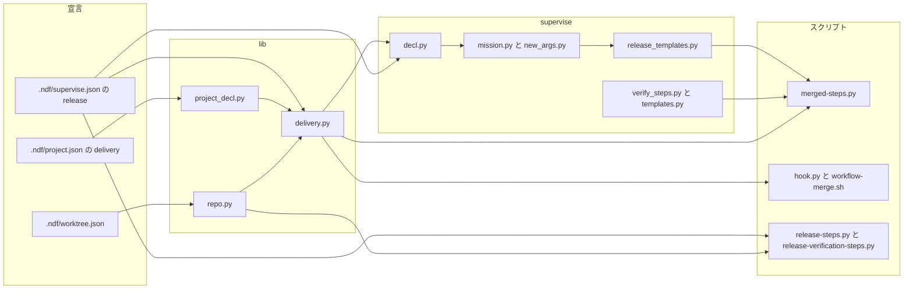
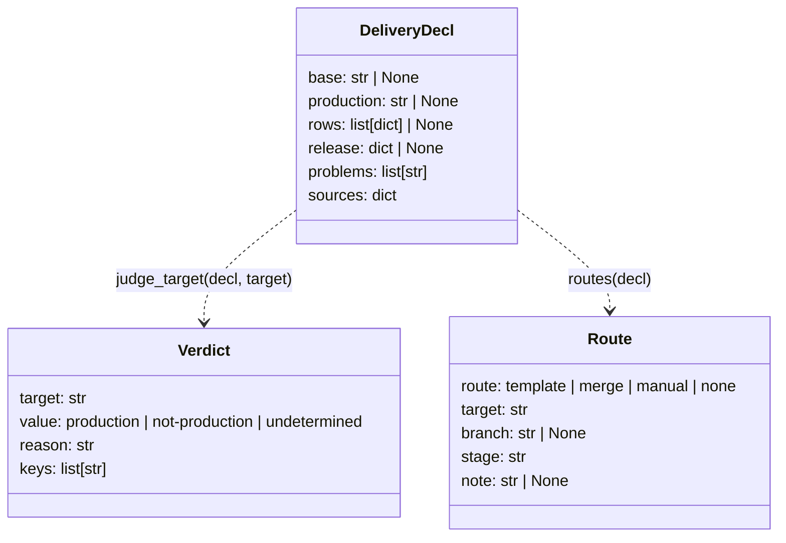
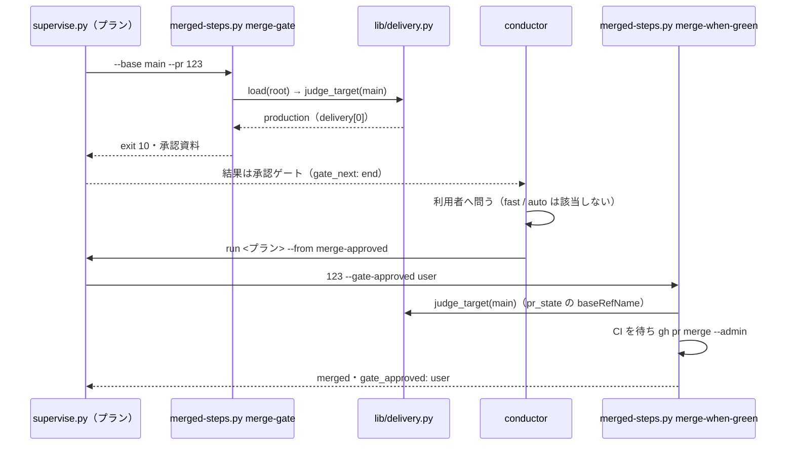
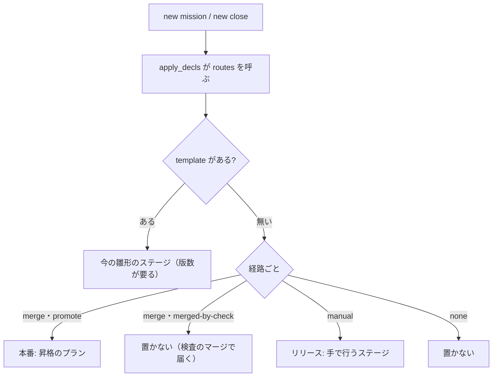
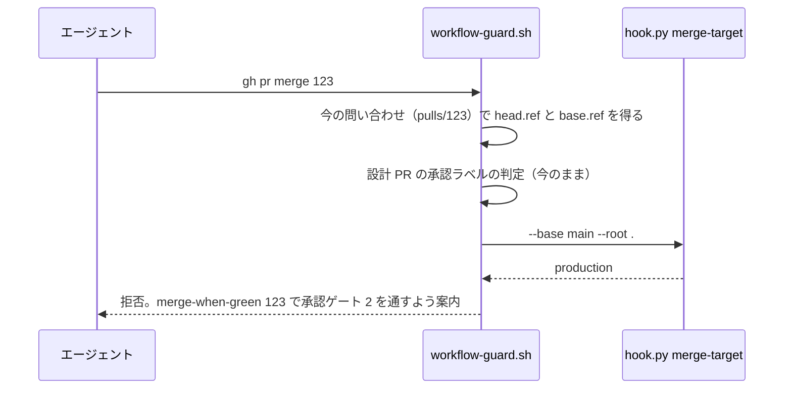

# #1336: リリースの経路を宣言から組み、自動反映の本番チャネルへのマージに承認ゲート 2 を掛ける

要求と受け入れ条件は #1336 の本文にある（コピーは `issues/issue-1336-requirements.md` ）。この文書は「どう作るか」だけを扱う。
決定の記録・テスト設計・未確認のまま残ることは `issues/issue-1336-design-decisions.md` にある。

## 例: 4 つのサンプルの宣言で何が起きるか

宣言（#1333 の解析が作る `.ndf/worktree.json` と `.ndf/project.json` の `delivery` ）が次の形のとき:

| リポジトリ | `base_branch` | `production_branch` | `delivery` の行（`kind` ・ `branch` ・ `target` ） |
| --- | --- | --- | --- |
| carmo-system-console | `main` | `main` | `auto` ・ `main` ・本番（ECS） |
| project-trygroup-prd | `develop` | `main` | `auto` ・ `develop` ・stg / `auto` ・ `main` ・prd |
| carmo-contractors-app | `main` | `main` | `auto` ・ `main` ・web（Amplify） / `manual` ・なし・api（`sam deploy` ） |
| with-ai-dev | `main` | `main` | `manual` ・なし・本番 |
| ai-plugins | `develop` | `main` | `manual` ・ `main` ・ndf プラグイン（ `versioned: true` ）。 `supervise.json` に `release.form: package-plugin` |

1. **マージの判定。** `merged-steps.py merge-gate --base <宛先> --pr <番号>` は宣言と宛先のブランチ名だけで判定する。
   carmo-system-console の `main` 宛ては、 `main` が本番チャネルで `delivery` に `auto` ・ `main` の行があるため
   **自動反映の本番チャネル**と判定し、終了コード 10（承認ゲート）で止まる。結果の JSON の `metrics.gate` は `production-merge` で、
   `items` に判定に使った宣言のファイルとキーが出る。trygroup の `develop` 宛ては本番チャネル（ `main` ）でないため 0 で通る
2. **承認の後。** conductor が利用者の承認を得て、プランを `run <プラン> --from merge-approved` で続ける。このステップは
   `merge-when-green <番号> --gate-approved user` を打ち、CI を待ってマージする。結果に `gate_approved: user` が残る
3. **ミッション。** 5 つのリポジトリで `supervise.py new mission --name m1 --issue 10` は `--version` を受けずに通る。
   `mission.json` の `リリースの経路` は次になる。要求の F1〜F4 は経路の `template` / `merge` / `manual` / `none` に当たる

| リポジトリ | リリースの経路 | 最後のステージ |
| --- | --- | --- |
| carmo-system-console | `merge` （ `main` ・ベースブランチと同じ） | 置かない。検査のプランのマージが本番への反映で、そこで承認ゲート 2 に当たる |
| project-trygroup-prd | `merge` （ `develop` ・検証）/ `merge` （ `main` ・本番） | 「本番」: 昇格のプラン（ `develop` → `main` の Pull Request を作り、承認ゲート 2 の後にマージ） |
| carmo-contractors-app | `merge` （web）/ `manual` （api） | 「リリース」: 手で行うステージ（ `/ndf:release` 。note に api の `trigger` ） |
| with-ai-dev | `manual` | 「リリース」: 手で行うステージ |
| ai-plugins | `template` （ `package-plugin` ） | 今のまま（開発版 → 本番）。 `--version` は今のとおり要る |

ai-plugins では実装の Pull Request は `develop` 宛てで、 `develop` は本番チャネルでないため 1 の判定は 0 を返す。
`develop` → `main` のマージは `release-steps.py release --channel prod` の中で行い、承認ゲート 2 は今のとおりその前で取る。

## ドメインモデル

### コンテキスト

| コンテキスト | 何の語が 1 つの意味に決まるか |
| --- | --- |
| NDF の開発ワークフロー（`ndf-workflow` ） | 承認ゲート・本番チャネル・自動反映の本番チャネル・プロジェクトの宣言・ミッション・ステージ・プラン |
| NDF のリリース（`ndf-release` ） | リリースの経路・昇格の Pull Request・リリース種別 |

関係は**公開された言語**である。開発ワークフローが宣言の形（`worktree.json` ・ `project.schema.json` ）と判定の関数
（`lib/delivery.py` ）を公開し、マージのスクリプト・hook・ミッションの組み立ての 3 者が同じ関数を読む。リリースのスクリプトは
同じ宣言の読み取り（`lib/repo.py` ）を読む。
どれも宣言を書き換えない。

### 集約

| 集約 | 持ち主（書き換えてよいもの） | 根 | エンティティ | 値オブジェクト |
| --- | --- | --- | --- | --- |
| プロジェクトの宣言 | `project-decl.py write` と利用者（この変更は読むだけ） | `.ndf/` | `delivery` の行 | ベースブランチ・本番チャネル・ `kind` ・ `branch` |
| マージの判定（1 回の呼び出しで作るもの） | `lib/delivery.py` の `judge_target` | 判定 | — | 宛先・判定の値（ `production` / `not-production` / `undetermined` ）・理由・根拠のキー |
| ミッションのプラン | `supervise.py new mission` / `new close` | `mission.json` | ステージ・プラン | リリースの経路の並び |
| マージの実行の結果 | `merged-steps.py` の各副命令 | 結果の JSON | Pull Request | 承認の引数（ `user` / `mvv` ）・マージの先頭のコミット |

**判定は保存しない。** マージの直前に毎回宣言から作り直す。宣言を途中で直せば次の判定から効く。

### 不変条件

| # | 集約 | 条件 | 破れたときの扱い |
| --- | --- | --- | --- |
| I1 | マージの実行の結果 | 判定が `production` か `undetermined` の宛先へは、 `--gate-approved` の無い呼び出しで `gh pr merge` を打たない | 終了コード 10 で止まり、承認資料を書く |
| I2 | マージの判定 | 宣言が壊れている・本番チャネルを決められない・宛先が本番チャネルで `delivery` が不明か無いときは `undetermined` にする（ `not-production` へ倒さない） | I1 と同じく止まる |
| I3 | マージの判定 | 判定は宣言と宛先のブランチ名だけで決まり、 `gh` を呼ばない | テストが `gh` の呼び出しを数えて落とす |
| I4 | マージの判定 | 宣言が読めて本番チャネルが決まるとき、本番チャネルと違うブランチ（ベースブランチを含む）への宛先は `not-production` にする（I2 に当たるときは I2 が先に効く） | 検証への反映まで止まる。テストが落とす |
| I5 | ミッションのプラン | リリースの経路は `release.form` があればそれ（ `template` ）を、無ければ `delivery` から導く。導けなければ `manual` にし、理由を note に書く | `new mission` / `new close` が止まる。テストが落とす |
| I6 | ミッションのプラン | 版数を要するのは経路が `template` のときだけである | 版数の無いプロジェクトで止まる（AC3・AC4） |
| I7 | マージの実行の結果 | 昇格の Pull Request のマージは head（ベースブランチ）を後片付けで消さない | ベースブランチが消える。テストが落とす |
| I8 | マージの実行の結果 | `--gate-approved` の値（ `user` / `mvv` ）とマージした先頭のコミットを結果に残す | 監査で誰が承認したかを辿れない |
| I9 | マージの実行の結果 | ai-plugins の宣言では、 `package-plugin` の副命令の出力（ブランチ・タグ・題・リポジトリ名）が今と同じになる | AC6 のテストが落とす |

### ドメインイベント

| # | イベント | 発生元 | 受け手 |
| --- | --- | --- | --- |
| E1 | ミッションを始めた | `supervise.py new mission` | ステージのキュー |
| E2 | リリースの経路を選んだ | `lib/delivery.py` の `routes` （ `new mission` / `new close` が呼ぶ） | `mission.json` の `リリースの経路` とステージの組み立て |
| E3 | 実装の Pull Request のレビューが収束した | cross-review | プランの `merge-gate` のステップ |
| E4 | 宛先が自動反映の本番チャネルかを判定した | `merged-steps.py merge-gate` / `merge-when-green` / `promote` | 同じスクリプトの続き（止めるか進むか） |
| E5 | 承認ゲート 2 の承認を求めた | E4 が `production` か `undetermined` | conductor（利用者へ問う）、 `fast` / `auto` の昇格のプランでは `mvv-gate.py check` |
| E6 | Pull Request をマージした | `merge-when-green` / `promote` | 後片付け（昇格では行わない）とプランの次のステップ |
| E7 | ミッションを閉じた | `supervise.py new close` | `mission-close.py` |

### 用語

| 用語 | 意味 | 用語集への反映 |
| --- | --- | --- |
| 自動反映の本番チャネル | 本番チャネルのうち、マージ（push）で本番系への反映が自動で始まるもの。宣言の `delivery` に `kind: auto` で本番チャネルを `branch` に持つ行があるときに当たる | 追加（`ndf-workflow` ） |
| リリースの経路 | 変更が本番系へ届く道筋の種類。 `template` （ `release.form` の雛形で組む）/ `merge` （マージで反映）/ `manual` （手で反映）/ `none` （届けない） | 追加（`ndf-release` ） |
| 昇格の Pull Request | ベースブランチから本番チャネルへ変更を入れる Pull Request | 追加（`ndf-release` ） |
| ミッション | 1 回のリリースとして出す課題と Pull Request のセット。版数を持つプロジェクトでは 1 つの版になる | 意味の変更（`ndf-workflow` 。「1 つの版として出す」を版数の無いプロジェクトへ広げる） |

## 機能一覧

| # | 機能 | 誰が使うか |
| --- | --- | --- |
| F1 | 自動反映の本番チャネルへのマージを、承認が無ければ止める | conductor・supervisor・worker（プランの `merge-gate` と `merge-when-green` ） |
| F2 | 承認を得たマージを、承認の引数を付けて同じコマンドで進める | conductor（ `run --from merge-approved` ）、 `fast` / `auto` の MVV 判定 |
| F3 | エージェントが直接打つ `gh pr merge` を、自動反映の本番チャネル宛てなら拒む | hook（ `workflow-guard.sh` ） |
| F4 | 宣言からリリースの経路を選び、版数を渡さずにミッションを始めて閉じる | conductor（ `supervise.py new mission` / `new close` ） |
| F5 | ベースブランチと本番チャネルが違う `merge` の経路で、昇格の Pull Request を作って承認ゲート 2 の後にマージする | 昇格のプラン |
| F6 | `package-plugin` のブランチ・タグ・題・リポジトリ名を宣言から読む | `release-steps.py` ・ `release-verification-steps.py` |

## 構成要素

| 要素 | 責務 |
| --- | --- |
| `lib/delivery.py` （新規） | 宣言の読み取り結果から、宛先の判定（ `judge_target` ）とリリースの経路（ `routes` ）を返す。ファイルと git の参照（既定ブランチ）だけを読み、 `gh` を呼ばない |
| `lib/repo.py` | `.ndf/worktree.json` を読み、壊れているかを返す読み取り（ `read_worktree_decl` ）を足す。 `declared_base` はこれを使う。本番チャネル（ `production_branch` → 既定ブランチ）の関数を足す |
| `lib/project_decl.py` | 壊れているかを返す読み取り（ `read_project_decl_checked` ）を足す。今の `read_project_decl` は `{}` を返す振る舞いのまま残す |
| `merged-steps.py` | 副命令 `merge-gate` と `promote` を足す。 `merge-when-green` に `--gate-approved user\|mvv` を足し、CI を待つ前に判定する。止めるときは `approval_present` で承認資料を書く |
| `supervise_lib/verify_steps.py` | `merge_step` を `merge_steps` にし、 `merge-gate` → `merge` → `merge-approved` （ `--from` でだけ入る）の 3 ステップを返す |
| `supervise_lib/templates.py` ・ `mission.py` の `close_plan` ・ `mission_waves.py` の `plan_mvv_design` | `merge_step` の呼び出しを `merge_steps` へ替える |
| `supervise_lib/decl.py` | `apply_decls` が `routes` を呼び、 `a.routes` に載せる。 `NEEDS` の `close` から `release` を外し、経路が `template` のときだけ版数を要する |
| `supervise_lib/new_args.py` | `check_mission` の `--version` ・ `--prod` の必須を外す（ `apply_decls` が経路を見て求める） |
| `supervise_lib/mission.py` | 経路からリリースのステージを組む（ `route_waves` ）。 `normal` / `fast` / `auto` / `close` の 4 か所が使う。 `mission.json` に `リリースの経路` を書く。 `close_plan` は `template` 以外で `--record-pr 0` を渡す |
| `supervise_lib/release_templates.py` | 昇格のプラン（ `plan_promote` ）を足す。 `package-plugin` の雛形はそのまま |
| `release-steps.py` | `release` ・ `approval-facts` ・ `notes` のブランチを宣言のベースブランチと本番チャネルから、タグの接頭辞と題を `release.plugin` から読む。 `--plugins` の既定を `release.plugin` にする |
| `release-verification-steps.py` | リポジトリ名を `origin` の URL から、 `--ref` の値を宣言のブランチから、タグの接頭辞を `--plugin` から読む |
| `hook.py` と `workflow-merge.sh` | `hook.py merge-target --base <宛先>` が `judge_target` を呼ぶ。 `wf_check_merge` は、今の問い合わせで得た `base.ref` を渡し、 `production` か `undetermined` なら拒んで `merge-when-green` へ案内する |
| `development-workflow` の SKILL.md と参照 | 承認ゲート 2 の節（実装 Pull Request のマージが当たる条件と、承認ゲート 1 の承認資料に本番への反映を載せること。決定 10）、 `pace.md` （ `merge` の経路の本番）、 `conductor-entrypoints.md` （新しい副命令） |
| `merged` ・ `release` の Skill | `merge-when-green` の承認の引数と止まったときの手、 `form-package-plugin.md` の値の出所 |
| 用語集（`docs/glossary/glossary.json` ） | 上の「用語」の 4 行 |



図に含めない要素: 文書（SKILL.md と参照・用語集）。どれもコードから読まれない。

## 構造



- `DeliveryDecl.rows` は `delivery` が並びなら並び、 `{"unknown": ...}` か無ければ `None` 。 `[]` は空の並び（ `none` ）
- `problems` は壊れた宣言の理由（ファイルとキー）。空でなければ `judge_target` は宛先によらず `undetermined` を返す
- `sources` は値の出所（ `worktree.json の production_branch` / `既定ブランチ` など）。止めた結果の `items` へ写す
- `Route.stage` は経路をどのステージで届けるか（下の「経路からステージを組む」の表の値）

パッケージの置き場所:

```text
plugins/ndf/scripts/
├── lib/
│   ├── delivery.py        # 新規: judge_target・routes・load
│   ├── repo.py            # read_worktree_decl・production_branch を足す
│   └── project_decl.py    # read_project_decl_checked を足す
├── merged-steps.py        # merge-gate・promote・--gate-approved
├── hook.py                # merge-target
├── supervise_lib/
│   ├── decl.py            # a.routes・版数の要否
│   ├── mission.py         # route_waves・リリースの経路
│   ├── new_args.py        # --version / --prod を任意に
│   ├── release_templates.py  # plan_promote
│   ├── templates.py       # merge_steps へ
│   └── verify_steps.py    # merge_steps
├── release-steps.py
└── release-verification-steps.py
```

## 入出力の契約

### `lib/delivery.py`

```python
def load(root) -> DeliveryDecl: ...                      # 例外を上げない。壊れていれば problems に書く
def judge_target(decl: DeliveryDecl, target: str) -> Verdict: ...
def routes(decl: DeliveryDecl) -> list[Route]: ...
```

`judge_target` の表（上から順に最初に当たった行で決まる）:

| # | 条件 | 値 | 理由の例 |
| --- | --- | --- | --- |
| 1 | `problems` が空でない | `undetermined` | `.ndf/project.json: JSON として読めない` |
| 2 | 本番チャネル（ `production_branch` → 既定ブランチ）を決められない | `undetermined` | `本番チャネルを決められない（production_branch も origin/HEAD も無い）` |
| 3 | 宛先が本番チャネルでない | `not-production` | `宛先 develop は本番チャネル main でない` |
| 4 | `rows` が `None` （ `delivery` が不明か無い） | `undetermined` | `宛先 main は本番チャネルだが、delivery が無く反映の仕方を決められない` |
| 5 | `rows` に `kind: auto` で `branch` が本番チャネルの行がある | `production` | `delivery[0]（本番（ECS））は main へのマージで自動で反映する` |
| 6 | それ以外（ `[]` ・ `manual` だけ・別のブランチの `auto` だけ） | `not-production` | `main へのマージで自動で反映する delivery の行が無い` |

`routes` の表（ `release.form` があれば 1 行目だけで決まる。無ければ `delivery` の行ごとに 2〜5 行目）:

| # | 条件 | 経路 | ステージ（ `Route.stage` ） |
| --- | --- | --- | --- |
| 1 | `release.form` がある | `template` | 雛形があれば今の開発版・本番。無ければ `manual` （今の `manual_release_wave` ） |
| 2 | `rows` が `None` | `manual` （1 つ） | `manual` 。note に「delivery が無い / 不明」 |
| 3 | `rows` が `[]` | `none` （1 つ） | 置かない |
| 4 | `kind: auto` ・ `versioned: false` | `merge` | `branch` がベースブランチなら `merged-by-check` （置かない）、本番チャネルでベースブランチと違えば `promote` 、 `branch` が無いか別のブランチなら `manual` |
| 5 | `kind: manual` か `versioned: true` | `manual` | `manual` 。note に `target` と `trigger` 、 `versioned: true` なら「版数を持つ経路の雛形は release.form で選ぶ」 |

### `merged-steps.py`

| 呼び出し | 振る舞い | 終了コード |
| --- | --- | --- |
| `merge-gate --base <宛先> [--pr N]` | `judge_target` だけを行う。 `production` / `undetermined` なら `--pr` の Pull Request の URL と差分の量を読んで承認資料を書く | 0 = 進めてよい / 10 = 承認ゲート 2 / 2 = 引数の誤り |
| `merge-when-green N [--gate-approved user\|mvv] ...` | 最初の読み（ `pr_state` 。 `baseRefName` をフィールドに足す）で判定し、承認の引数が無く `production` / `undetermined` なら CI を待たずに 10 で終える。承認の引数があれば今のとおり待ってマージする | 今の契約に 10 = 承認ゲート 2 を足す（後片付けの `git branch -D` の 10 と `metrics.gate` で見分ける） |
| `promote --head <ベース> --base <本番> [--gate-approved user\|mvv] [--prepare]` | 開いた昇格の Pull Request を探し、無ければ作る。 `--prepare` は作って承認資料を書くところで 0 で終える。それ以外は `merge-when-green --no-cleanup` と同じ判定と待ちでマージする | `merge-when-green` と同じ |

止めたときの結果（ `lib/step_result.py` の形）:

```json
{"tool": "merged", "status": "gate", "summary": "#123 の宛先 main は自動反映の本番チャネルである。承認ゲート 2 の承認が要る",
 "items": [{"kind": "decl", "name": ".ndf/worktree.json の production_branch", "result": "main"},
           {"kind": "decl", "name": ".ndf/project.json の delivery[0]", "result": "auto main 本番（ECS）"},
           {"kind": "pr", "name": "#123", "result": "gate", "base": "main"}],
 "metrics": {"gate": "production-merge", "verdict": "production", "target": "main"},
 "presentation": ".ndf/tmp/approval-merge-123.md",
 "next": "承認を得たら merge-when-green 123 --gate-approved user（プランなら run <プラン> --from merge-approved）"}
```

マージした結果は `items` の Pull Request の行に `gate_approved` （ `user` / `mvv` / 無し）と `head` （マージした先頭のコミット）を持つ。

### プランのステップ

| id | cmd | 次 |
| --- | --- | --- |
| `merge-gate` | `merged-steps.py merge-gate --base <プランの base_branch> --pr {pr}` | 0 なら `merge` 、10 なら終える（ `gate_next: end` ） |
| `merge` | `merged-steps.py merge-when-green {pr} --timeout <秒>` | 今の `next` / `on_fail` |
| `merge-approved` | `merge` と同じに `--gate-approved user` を足す | `merge` と同じ。通常の流れからは入らず、 `--from merge-approved` でだけ入る |

### `supervise.py new mission` / `new close`

| 引数 | 今 | 変えた後 |
| --- | --- | --- |
| `--version` | 必須 | 経路が `template` のときだけ必須。無ければ `new <種類> に要る宣言が無い: 版数（--version。release.form の雛形は版数で組む）` で止まる |
| `--prod` （ `close` ） | 必須 | 同じく `template` のときだけ必須 |
| `release.form` （ `close` ） | 必須 | 要らない |

`mission.json` の最上位に `"リリースの経路": [{"route", "target", "branch", "stage", "note"}...]` を足す。

## 処理の流れ

処理の流れの図に含めない要素: `repo.py` と `project_decl.py` （ `load` の中で読む）、 `new_args.py` （引数の検査だけ）、
`release-steps.py` と `release-verification-steps.py` （流れは変えず、値の出所だけを変える）、文書。

### マージの判定（ carmo-system-console の検査のプラン）



### 経路からステージを組む



ステージの並び（ `promote` と `manual` が両方あれば `promote` を先に置く）:

| 進め方 | 検査の後に置くステージ |
| --- | --- |
| `normal` | 「本番」（昇格のプラン。承認ゲート 2 はプランの中の `promote` で止まる）→「リリース」（手で行う） |
| `fast` / `auto` | 「本番」（昇格のプラン。先頭の `mvv-gate.py check --gate release` が承認ゲート 2 を判定する）→「リリース」（手で行う）。開発版のステージは置かない（ベースブランチへのマージが検証への反映である） |
| `close` | 最終の検査 →「本番」（ `changed` の実行条件つき）→「リリース」→ まとめ（ `--record-pr 0 --issues` ） |

昇格のプラン（ `plan_promote` ）のステップ:

| 進め方 | ステップ |
| --- | --- |
| `normal` | `promote` （ `--gate-approved` 無し。10 で終える）→ `promote-approved` （ `--from` でだけ入る。 `--gate-approved user` ） |
| `fast` / `auto` | `prepare` （ `promote --prepare` ）→ `mvv` （ `--material` に承認資料、 `--pr` に `prepare` が書いた番号）→ `note` （判定のコメント）→ `promote` （ `--gate-approved mvv` ）。 `note` か `promote` が落ちたら `handoff` （今の `handoff_step` ） |

### hook の判定



## 非機能の実現方式

| 大項目 | 条件 | 実現方式 |
| --- | --- | --- |
| 可用性 | 判定に `gh` の呼び出しを足さない。読めないときは止める側へ | `judge_target` はファイルと `git symbolic-ref refs/remotes/origin/HEAD` だけを読む。 `merge-when-green` は今の `pr_state` の 1 回の呼び出しへ `baseRefName` を足す。 `merge-gate` はプランが知る宛先を引数で受ける。hook は今の `pulls/<番号>` の応答の `base.ref` を使う。表の 1・2・4 行が止める側 |
| 性能・拡張性 | 決定論だけで 1 秒以内 | JSON 2 つの読み取りと git の参照 1 回。LLM も通信も使わない |
| 運用・保守性 | 止めた結果に宣言の値と宛先 | 結果の `items` に `kind: decl` の行（ファイルとキーと値）と宛先を載せる。承認資料の「判断に使うもの」にも同じ行を書く |
| 移行性 | ai-plugins の宣言と配布は変えずに動く | ai-plugins の宣言では `release-steps.py` の各値が今の直書きと同じ値に解ける（I9）。 `release.form: package-plugin` は経路 `template` としてそのまま読む |
| セキュリティ | 承認を省く経路を足さない | `--gate-approved` を付けるステップは `--from` でしか入れない `merge-approved` ・ `promote-approved` と、MVV 判定が従ったときだけ進む `fast` / `auto` の昇格のプランに限る。値は結果に残る（I8） |
| システム環境 | 4 ランタイムで同じに働く | 止める場所はスクリプト（ `merge-gate` ・ `merge-when-green` ・ `promote` ）に置く。hook は直接の `gh pr merge` を塞ぐ補助で、hook の無いランタイムでもプランのマージはスクリプトで止まる |
