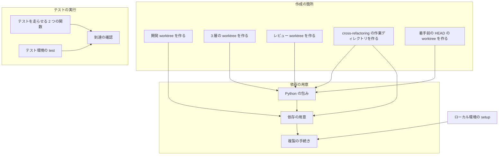
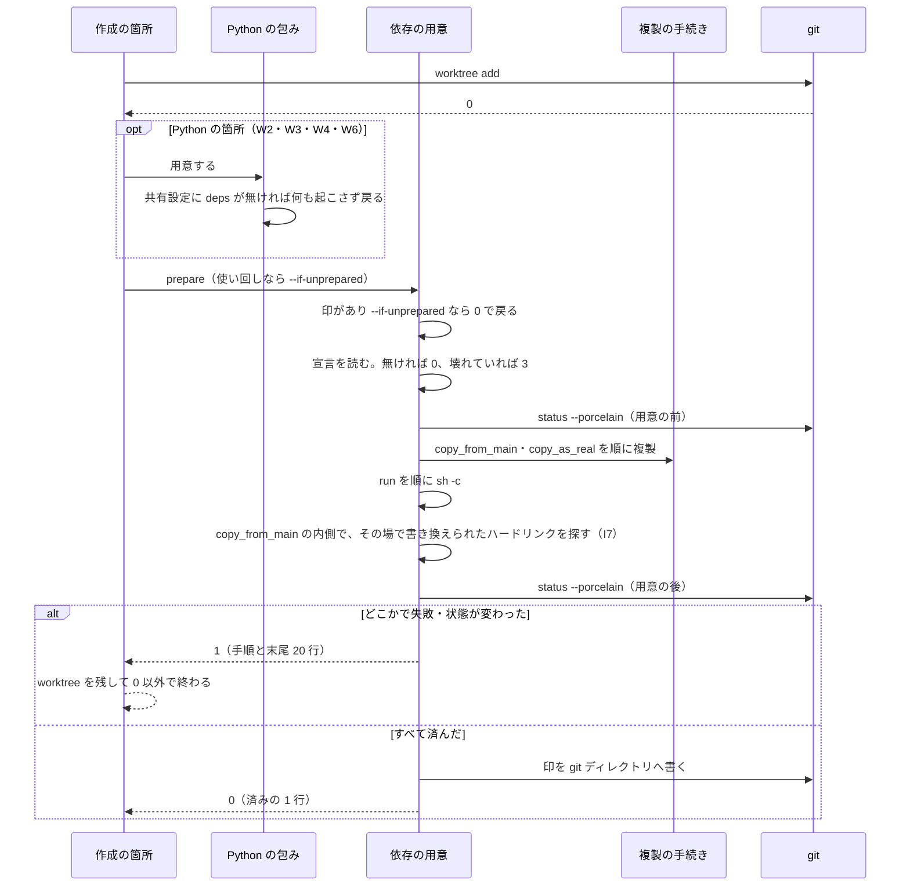
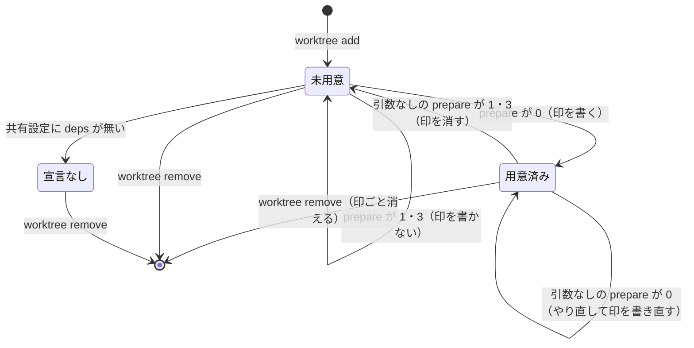
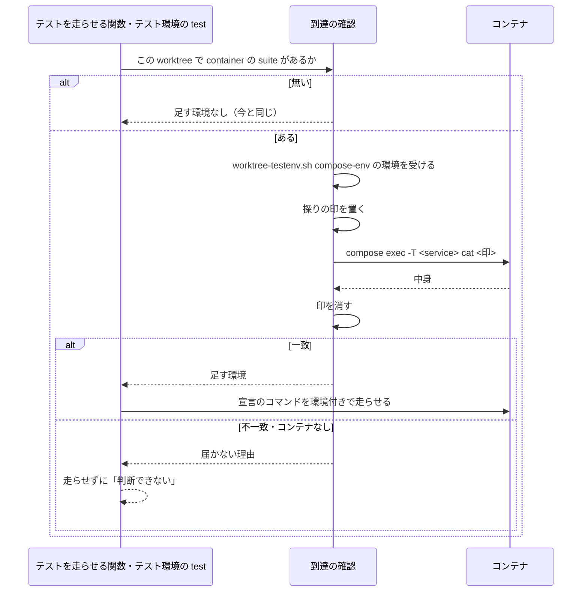

# #1337: NDF が作る worktree で、依存物とコンテナのテストを worktree の変更に対して使えるようにする

要求と受け入れ条件は #1337 の本文にある（コピーは [issue-1337-requirements.md](issue-1337-requirements.md)）。
この文書は「どう作るか」だけを扱う。決定の記録・テスト設計・未確認のまま残ることは
[issue-1337-design-decisions.md](issue-1337-design-decisions.md) にある。

## 例: carmo-system-console の開発 worktree で PHP のファイルをコミットする

**変更の後は、次の順に動く。** 宣言は利用者が共有設定（`.ndf/worktree.json`）に 1 回だけ書く。

```json
{ "version": 1, "deps": { "copy_from_main": ["vendor"], "copy_as_real": [".env"] } }
```

1. `worktree-setup.sh create feat/x` が `git worktree add` の直後に `worktree-deps.sh prepare` を呼ぶ。`vendor/` を
   メインディレクトリからハードリンクで複製し（498 MB・54,180 ファイルを 0.61 秒。2026-09-27 に carmo のコンテナで実測）、
   `.env` は実体で複製する。標準エラーに `依存の用意: 済み（2 件・1 秒）` の 1 行が出る
2. `git commit` で pre-commit が走る。devcontainer の中（`REMOTE_CONTAINERS=true`）なので `./vendor/bin/pint` を直接呼び、
   **worktree の `vendor/` の Pint が worktree のファイルを整形する**
3. 範囲テスト（`php vendor/bin/phpunit <ファイル>`）も worktree の `vendor/` で走る。Composer の自動読み込みは
   `vendor/` の置き場所から `App\` の位置を決めるため、worktree のコードを読む

**`vendor/` をメインディレクトリへの symlink にすると、手順 3 が偽の green になる。** PHP の `__DIR__` は symlink を
たどった先を返す（carmo のコンテナで実測: symlink 経由でも `/…/main/vendor` を返し、ハードリンクの複製は
`/…/wt2vendor` を返した）。Composer はそこから 1 つ上をアプリの根とみなし、**メインディレクトリの `App\` を読む**。
今まで利用者が手で張っていた symlink（`.worktrees/feature/redmine14837…/vendor` など 2 本）はこの状態にある。

project-trygroup-prd は宣言を足さなくても通る。`./scripts/run-python-tests.sh docs-prep` を
`git worktree add --detach` した worktree で打つと、キャッシュの無い状態から 21 秒・`294 passed` で終わった
（venv を `$TMPDIR` に作り、`poetry.lock` から入れる）。記録にある `ModuleNotFoundError` の 34 件は、どれも
このスクリプトを通さず `python3` やメインディレクトリの `.venv` を直接呼んだものである。

## ドメインモデル

### コンテキスト

| コンテキスト | 何の語が 1 つの意味に決まるか |
| --- | --- |
| NDF の worktree（`ndf-worktree`） | 依存の用意・用意の印・到達の確認。worktree を作る・使い回す・消すまで |
| NDF の cross-review（`ndf-cross-review`） | レビュー worktree の作成と使い回し |
| NDF の cross-refactoring（`ndf-cross-refactoring`） | 書き込み用・読み取り用の作業ディレクトリと、着手前の HEAD の一時の worktree |

**`ndf-worktree` が供給者、cross-review・cross-refactoring・3 層の supervise が顧客である（顧客 / 供給者）。**
顧客は `worktree-deps.sh prepare` の終了コードと 1 行の出力だけを受け取り、宣言の中身を読まない。

### 集約

| 集約 | 持ち主（書き換えてよいもの） | 根 | エンティティ | 値オブジェクト |
| --- | --- | --- | --- | --- |
| 依存の用意（worktree ごと） | `worktree-deps.sh` | 用意の印（worktree ごとの git ディレクトリの `ndf-deps`） | — | 用意の手順（複製 / 実体の複製 / コマンド）・用意の結果の 1 行 |
| 到達の確認（worktree とサービスの組ごと） | `lib/container_reach.py` | 到達の判定 | — | 探りの印（乱数のファイル名と中身） |
| テスト環境の割り当て（worktree ごと。既存） | `worktree-testenv.sh` | 台帳の割り当て | — | コンテナへ渡す環境（`compose_env` が組む `NDF_ENVIRONMENT`・`NDF_SLOT`・`NDF_WORKTREE`・`NDF_SHARED_NETWORK`・`NDF_PORT_<役割>` と、`COMPOSE_PROJECT_NAME=<環境名>`・`COMPOSE_FILE=<compose_files を : で結んだ絶対パス>` の全部） |

**依存の用意の宣言（共有設定の `deps`）は集約に入れない。** 書くのは利用者で、NDF は読むだけである。
**コンテナへ渡す環境の持ち主は `worktree-testenv.sh` の 1 つだけである。** `up` と同じ `compose_env` が組んだ環境を
`compose-env` で出し、到達の確認はそれをそのまま受けて探るだけにする。自分で組むと、`${NDF_PORT_HTTP}` を参照する
compose の定義を `exec` が再解釈するときに値が空になり、`up` と違う解釈で exec が失敗する。
`worktree` を作る 6 箇所（構成要素の表）は依存の用意を書き換えず、`worktree-deps.sh` を呼ぶだけである。

### 不変条件

| # | 集約 | 条件 | 破れたときの扱い |
| --- | --- | --- | --- |
| I1 | 依存の用意 | 共有設定に `deps` が無ければ、worktree を作る 6 箇所は今と同じ git のコマンドだけを打ち、同じファイルを作り、同じ出力を出す | 変更前後の比較のテストが落ちる |
| I2 | 依存の用意 | 依存物の置き場所（複製・実体の複製の書き込み先）は worktree の中だけである。途中の symlink をたどって外へ書かない（`destination_is_safe` の規則）。例外は用意の印の 1 つで、`git -C <worktree> rev-parse --git-dir` が返すディレクトリの `ndf-deps` にだけ書く | その手順で止め、失敗として返す |
| I3 | 依存の用意 | 用意は git の状態を変えない。用意の後の `git status --porcelain` は用意の前と一致する（依存物は git が無視するパスに置く） | 変わったパスを挙げて失敗として返す。印を書かない |
| I4 | 依存の用意 | 用意が失敗しても worktree は消さない。作成の処理は 0 以外で終わる | — |
| I5 | 依存の用意 | 宣言が壊れていれば、用意の手順を 1 つも実行しない | 宣言のファイルと誤りの箇所を示し、終了コード 3 で返す |
| I6 | 依存の用意 | `--if-unprepared` で呼ばれたとき、用意の印があれば手順を 1 つも走らせない。引数なしの `prepare` は印を見ずにやり直し、成功すれば印を書き直す | — |
| I7 | 依存の用意 | worktree を消した後、メインディレクトリの依存物のファイルの一覧と内容は、作る前と一致する（symlink を張らない）。ハードリンクの複製は同じ実体を指すため、**`copy_from_main` に置けるのは worktree の中でその場で書き換えないパスだけ**とする（宣言の契約。書き換えるものは `copy_as_real` に置く）。用意の中では、複製の前に時刻の印を置き、`run` の後に `find <copy_from_main のパス> -type f -links +1 -newer <時刻の印>` で、複製の後にその場で書き換えられたハードリンクを探す | 用意では見つかったパスを挙げて失敗（1）として返し、印を書かない。消した後の比較のテストが落ちる |
| I8 | 依存の用意 | `deps.run` で走らせるのは共有設定に書かれたコマンドだけである。個人設定の `deps` は反映しない | 個人設定の `deps` は「反映しない項目」として `status` に出る |
| I9 | 到達の確認 | 宣言でコンテナを指定した suite は、到達を確かめてから走らせる。確かめられなければ走らせない | 届かない理由を示し、テストを「判断できない」（`test-run.py` の 2）として返す |
| I10 | 到達の確認 | 探りの印は git が無視するパス（worktree の `.ndf-evidence/reach-<乱数>`）に置き、置く前に共通の git ディレクトリの `info/exclude` へ `.ndf-evidence/` を登録する（`worktree-testenv.sh` の `exclude_evidence` と同じ）。確認の後に必ず消す。途中で止められて消せなくても、Pull Request と利用者のコミットには入らない | 登録できなければ印を置かずに届かないものとして扱う。消せなければ到達しなかったものとして扱う |

### ドメインイベント

| # | イベント | 発生元 | 受け手 |
| --- | --- | --- | --- |
| E1 | worktree を作った | 作成の 6 箇所 | `worktree-deps.sh`（E2 を起こす） |
| E2 | 依存の用意の宣言を読んだ | `worktree-deps.sh` | 同じ処理の中で E3 へ進む。宣言が無ければ何もしない |
| E3 | 依存物を用意した | `worktree-deps.sh` | 作成の 6 箇所（終了コードで成否を受け取る）・用意の印 |
| E4 | テスト環境を worktree へ向けた | `lib/container_reach.py` | テストを走らせる 2 つの関数（`test_triage.run_command`・`refactor_lib.process.run_with_timeout`）と `worktree-testenv.sh test` |
| E5 | pre-commit・範囲テスト・全体テストを走らせた | 利用者の git・`test-run.py`・cross-refactoring | 今と同じ |
| E6 | worktree を消した | `/ndf:merged`・cross 系の後片付け・`git worktree remove` | 用意の印は git の管理ディレクトリごと消える。メインディレクトリの依存物は変わらない |
| E7 | `EnterWorktree` の隔離の中から NDF のスクリプトを呼んだ | 利用者・Claude Code | `worktree` Skill の「`EnterWorktree` との付き合い方」 |

### 用語

| 用語 | 意味 | 用語集への反映 |
| --- | --- | --- |
| 依存物 | パッケージマネージャが入れる、追跡されないディレクトリ（`vendor/`・`node_modules/`・`.venv` など）。worktree には最初から無い | 既存（`ndf-worktree`） |
| 依存の用意 | worktree を作った直後、または未用意の既存 worktree を使う前（使い回し・手で打つやり直し）に、宣言に従って依存物を worktree で使える状態にすること | 既存（`ndf-worktree`。定義を広げる） |
| 用意の印 | 依存の用意が済んだことを示す、worktree ごとの git ディレクトリの `ndf-deps` ファイル。使い回すときはこれを見てやり直しを省く | 追加（`ndf-worktree`） |
| 到達の確認 | コンテナの中から worktree の探りの印を読み、テストのコンテナが worktree を見ているかを確かめること | 追加（`ndf-worktree`） |

## 機能一覧

| # | 機能 | 誰が使うか |
| --- | --- | --- |
| F1 | worktree を作ったときに、宣言に従って依存物を用意する | NDF の工程（`/ndf:worktree`・3 層・cross-review・cross-refactoring） |
| F2 | 使い回す worktree で、用意が済んでいなければ用意する | cross-review・cross-refactoring・3 層（再開） |
| F3 | 依存の用意を手で打つ（失敗の後のやり直し・外部 Skill や手で作った worktree） | 利用者・conductor |
| F4 | コンテナで走るテストを、worktree を見ているコンテナへ向け、届かなければ止める | `test-run.py`・cross-refactoring・`worktree-testenv.sh test` |
| F5 | `EnterWorktree` の隔離の中で NDF のスクリプトが拒まれたときの代わりの手を示す | 利用者・Claude Code |

## 構成要素

**worktree を作る処理は、要求に挙げた 4 箇所ではなく 6 箇所ある。** `git worktree add` を検索して数えた
（テストを除く）。残りの 2 つも worktree の中でテストを走らせるため、依存物が要る。

| # | 作成の箇所 | 作る worktree | その中で走るもの |
| --- | --- | --- | --- |
| W1 | `worktree-setup.sh create` | 開発 worktree | pre-commit・利用者のテスト |
| W2 | `supervise_lib/paths.py` の `ensure_worktree` | 開発 worktree（3 層の run・queue） | `test-run.py` |
| W3 | cross-review の `review_lib/workspace.py` の `_create_worktree` | レビュー worktree | レビュー担当と修正担当のテスト |
| W4 | cross-refactoring の `refactor_lib/commands/setup.py` の `_ensure_work_worktree` | 書き込み用（`work/`） | 範囲テスト・全体テスト・最終ゲート |
| W5 | cross-refactoring の `prepare-worktrees.sh` の `ensure_readonly_worktree` | 読み取り用（参加者ごと） | 提案の担当が振る舞い不変を確かめるテスト |
| W6 | `lib/test_triage.py` の `failing_at` | 着手前の HEAD の一時の worktree | 既存失敗の見分けのための走らせ直し |

**W6 に依存物が無いと、変更起因の失敗が既存失敗へ入る。** 着手前の HEAD でも同じテストが「落ちる」ため、
`classify` は変更起因を既存失敗と読む。依存物の欠如が偽の green になる経路である。

| 要素 | 責務 | 新設 / 変更 |
| --- | --- | --- |
| 複製の手続き（`lib/worktree-copy.sh`） | メインディレクトリから worktree へ 1 つのパスを複製する（ハードリンク → 実体へ退避 / 実体）。書き込み先の検査（I2）と、食い違う既存のパスで止めること | 新設（`worktree-localenv.sh` の `destination_is_safe`・`differs_from_main`・`copy_one`・`replace_with_real_copy` を移す） |
| ローカル環境（`worktree-localenv.sh`） | `setup` は今と同じ。複製は上の手続きを source して使う | 変更（関数を移すだけ。振る舞いは変えない） |
| 依存の用意（`worktree-deps.sh`） | `prepare` で宣言を読み、複製・実体の複製・コマンドの順に用意し、git の状態の不変（I3）を確かめ、印を書き、1 行を出す | 新設 |
| 依存の用意の包み（`lib/worktree_deps.py`） | Python の作成箇所（W2〜W4・W6）から呼ぶ。共有設定を自分で読み、ファイルが無いか `deps` が無ければ何も起動しない（I1）。`deps` があるか、JSON として読めなければ `worktree-deps.sh prepare` を打ち（壊れているかの判定は `worktree-deps.sh` だけが持つ）、終了コードと 1 行を返す | 新設 |
| 作成の 6 箇所（W1〜W6） | `git worktree add` の直後に用意を呼ぶ。使い回す経路（W2〜W5）では `--if-unprepared` で呼ぶ | 変更 |
| 到達の確認（`lib/container_reach.py`） | コンテナを指定した suite を走らせる前に、`worktree-testenv.sh compose-env` が出した環境を受け、探りの印で到達を確かめる。環境を自分で組まない。CLI（`probe`）も持ち、シェルから呼べる | 新設 |
| テストを走らせる 2 つの関数 | `test_triage.run_command` と `refactor_lib.process.run_with_timeout` は、到達の確認が返した環境を足して走らせる。届かなければ走らせずに「判断できない」を返す | 変更 |
| テスト環境（`worktree-testenv.sh`） | `compose-env` を足し、`up` と同じ `compose_env` が組んだ環境の全部に `COMPOSE_PROJECT_NAME`・`COMPOSE_FILE` を加えて `KEY=VALUE` で出す（割り当てを新しく取らない）。`test` は種類に `service` があれば、`container_reach.py probe` で到達を確かめてから同じ環境で走らせる | 変更 |
| worktree の設定のスキーマ（`worktree.schema.json`） | `deps` 節と、`testenv.test_kinds.*.service` を足す | 変更 |
| 宣言のモデル（`project_lib/model.py` の `Container`） | 既にある `suites[].container`（`service`・`compose_files`）の意味を「到達を確かめて走らせる」に決める。形は変えない | 変更（説明だけ） |
| `worktree` Skill | 手順 2-1（外部 Skill への委譲）と 2-3（手で `git worktree add`）の後に `worktree-deps.sh prepare` を打つ。`EnterWorktree` との付き合い方の節を足す（決定 9 の 3 行）。`references/declaration.md` に `deps`、`references/test-execution.md` にコンテナの suite と到達の確認を書く | 変更 |
| `issue-plan-strategy` Skill | 並行開発で Agent の `isolation: "worktree"` を勧める 1 文を、`worktree-setup.sh create` で作ったパスを渡す形へ書き換える | 変更 |

**`worktree` Skill の手順 2-1 と 2-3 も、値の集合（worktree を作る経路）に足した値として判定した。**
どちらも `worktree-setup.sh create` を通らずに worktree を作るため、用意が走らない。手順の文に
`prepare` を足す（ほかの 6 箇所と違い、コードではなく Skill の本文である）。



`W45` は W4（Python から包みを通す）と W5（シェルから直に呼ぶ）をまとめた箱である。**図に含めない要素**は、
スキーマ・宣言のモデル・2 つの Skill の本文である。どれも呼び出しの辺を持たず、宣言の形と手順を書き写すだけである。

### 置き場所

```text
plugins/ndf/
├── scripts/
│   ├── worktree-deps.sh             新設
│   ├── worktree-localenv.sh         変更（複製の関数を lib へ移す）
│   ├── worktree-setup.sh            変更（create）
│   ├── worktree-testenv.sh          変更（test）
│   ├── lib/
│   │   ├── worktree-copy.sh         新設
│   │   ├── worktree_deps.py         新設
│   │   ├── container_reach.py       新設
│   │   └── test_triage.py           変更（failing_at・run_command）
│   ├── project_lib/model.py         変更（Container の説明）
│   └── supervise_lib/paths.py       変更（ensure_worktree）
└── skills/
    ├── worktree/
    │   ├── SKILL.md                 変更
    │   ├── references/declaration.md、test-execution.md   変更
    │   └── schemas/worktree.schema.json                    変更
    ├── issue-plan-strategy/SKILL.md                         変更
    ├── cross-review/scripts/review_lib/workspace.py、commands/init.py      変更
    └── cross-refactoring/scripts/
        ├── prepare-worktrees.sh                            変更
        └── refactor_lib/commands/setup.py、process.py       変更
```

ランタイムごとの配布物は `scripts/` を symlink で指すため（`scripts/build-runtime-plugins.sh`）、新しいスクリプトの
複製は要らない。

## 入出力の契約

### 共有設定の `deps` 節

```json
{
  "deps": {
    "copy_from_main": ["vendor", "node_modules"],
    "copy_as_real": [".env"],
    "run": ["uv sync --frozen"]
  }
}
```

| キー | 型 | 必須 | 意味 |
| --- | --- | --- | --- |
| `deps` | object | 任意 | 無ければ依存の用意をしない（I1）。空の object も「無い」と同じに扱う |
| `deps.copy_from_main` | string の配列 | 任意 | メインディレクトリからハードリンクで複製するパス（使えない配置では実体の複製へ退避）。意味は `localenv.copy_from_main` と同じ |
| `deps.copy_as_real` | string の配列 | 任意 | 実体で複製するパス。worktree の中で書き換えるもの（`.env`・自動読み込みの生成物）を置く。`copy_from_main` の内側を指してよい |
| `deps.run` | string の配列 | 任意 | 複製の後に worktree を作業ディレクトリにして `sh -c` で順に走らせるコマンド。1 つでも 0 以外なら止める |

- パスは worktree の根からの相対パスで、`..` と絶対パスを断る（`wt_is_safe_relative`）
- 複製元がメインディレクトリに無いパスは失敗として扱う（受け入れ条件 4 の「複製元が無い」）。`localenv.setup` が黙って
  飛ばすのと違うのは、宣言した依存物が無いまま「済み」と出すと、手順 2 の pre-commit が黙って飛ぶためである
  （carmo の pre-commit は `vendor/bin/pint` が無くても成功を表示して 0 で終わる）
- **`deps` は個人設定から反映しない**（I8）。`_wt_local_analysis` の許可一覧へ足さず、個人設定に書かれていれば
  「反映しない項目」に `deps` と出る
- **壊れている**とは、共有設定が JSON として読めない・`deps` が object でない・3 つのキーのどれかが string の配列でない、の
  いずれかである

### `worktree-deps.sh`

```text
worktree-deps.sh prepare <worktree> [--if-unprepared]
```

| 終了コード | 意味 | 標準エラー |
| --- | --- | --- |
| 0 | 用意した / 宣言が無い / `--if-unprepared` で印があった | 用意したときだけ `依存の用意: 済み（<手順の数> 件・<秒> 秒）`。ほかは何も出さない |
| 0 | 印がある worktree で引数なしの `prepare` を打ち、印を無視してやり直して成功した（印を書き直す） | `依存の用意: 済み（<手順の数> 件・<秒> 秒）` |
| 1 | 用意が失敗した（複製元が無い・複製できない・書き込み先が外・コマンドが 0 以外・git の状態が変わった・`copy_from_main` のハードリンクがその場で書き換えられた（I7）） | `依存の用意: 失敗（<手順>・<秒> 秒）` の後に、失敗した手順の出力の末尾 20 行 |
| 3 | 宣言が壊れている | `依存の用意: 宣言が壊れています（<ファイル>: <箇所>）`。用意の手順は 1 つも実行しない（I5） |

- **標準出力には何も出さない。** `worktree-setup.sh create` の標準出力（`作業ツリー:`・`起点:` の 2 行）を変えないためである
- `<手順>` は `copy_from_main[0] vendor`・`run[1] composer install` の形で、宣言の中の位置と値を示す
- 印は `git -C <worktree> rev-parse --git-dir` が返すディレクトリの `ndf-deps` に、用意した時刻を 1 行で書く。
  worktree の中には書かないため、git の状態を変えない（I3）
- 失敗したときは印を書かない。次の `--if-unprepared` の呼び出しがやり直す。引数なしの失敗では、前からあった印を消してから
  用意を始めるため、失敗の後に印は残らない

### 作成の箇所の終了の形

| 箇所 | 用意が 1 のとき | 用意が 3 のとき |
| --- | --- | --- |
| W1 `worktree-setup.sh create` | 標準出力の 2 行を出した後に 1 で終わる | 3 で終わる |
| W2 `ensure_worktree` | 誤りの文を返す（`作業ツリーは作ったが依存の用意に失敗した: <1 行>`）。run・queue は作成の失敗と同じに扱う | 同じ（文の中で宣言が壊れていると分かる） |
| W3 cross-review `init` | `die(code=1)`。worktree は残し、次の `init` が `--if-unprepared` でやり直す | 同じ |
| W4・W5 cross-refactoring `init` | `setup` は止まる（`die`）。`prepare-worktrees.sh` は `set -e` で 1 を返す | 同じ |
| W6 `failing_at` | `None`（見分けられない）を返す。既存失敗とみなさない | 同じ |

### 到達の確認（`lib/container_reach.py`）

**対象になる suite は、`.ndf/project.json` の `test.suites[]` に `container` を書いたものだけである。** コマンドの語は
見ない（テストの戦略の I1 と同じ）。

```text
python3 container_reach.py probe <worktree> --service <サービス> [--compose-file <パス>]...
```

| 手順 | 内容 |
| --- | --- |
| 1. 環境を受ける | `worktree-testenv.sh compose-env <worktree>` を打ち、出た `KEY=VALUE` の全部を返す環境に入れる（`NDF_*` と `COMPOSE_PROJECT_NAME`・`COMPOSE_FILE`）。割り当てが無ければ何も出ず、何も足さない。自分では組まない |
| 2. 印を置く | 共通の git ディレクトリの `info/exclude` へ `.ndf-evidence/` を登録してから、worktree の `.ndf-evidence/reach-<乱数>` を作り、中身に乱数を書く（I10） |
| 3. 読む | 1 の環境で、worktree を作業ディレクトリにして `docker compose exec -T <サービス> cat .ndf-evidence/reach-<乱数>` を打つ |
| 4. 消す | 印を消す（I10。`finally` で消す。外から止められて残っても git は無視する） |
| 5. 判定 | 出力が乱数と一致すれば到達した。コンテナが無い・exec が 0 以外・中身が違う、はいずれも届かない |

| 終了コード（CLI） | 意味 | 出力 |
| --- | --- | --- |
| 0 | 届いた | 標準出力に、足す環境を `KEY=VALUE` で 1 行ずつ |
| 1 | 届かない | 標準エラーに理由の 1 行（`サービス app のコンテナが動いていない（プロジェクト <名前>）。worktree-testenv.sh up <worktree> で起こす` / `サービス app の作業ディレクトリはこの worktree ではない（メインディレクトリを見ている可能性がある）`） |
| 2 | コンテナ実行系が無い | 標準エラーに理由の 1 行 |

- **shell の `COMPOSE_PROJECT_NAME` は `.env` の値より優先される**（2026-09-27 に Docker Compose v5.5.1 で実測。
  `.env` に `fromdotenv`、環境変数に `fromenv` を置くと `fromenv` になった）。プロジェクトが書いた
  `docker compose exec -T app …` の形のコマンドを変えずに、worktree ごとの環境へ向けられる
- Python の 2 つの関数は、作業ディレクトリごとに 1 プロセスで 1 回だけ確かめ、結果を覚えて使い回す
- `test-run.py` は届かないとき 2（判断できない）を返し、`summary` に理由を出す。cross-refactoring は着手前のテストで
  届かなければ `init` を止める（既存失敗として記録しない）

### `worktree-testenv.sh test` の追加

`testenv.test_kinds.<種類>.service`（string・任意）を足す。あれば走らせる前に `container_reach.py probe` を打ち、1・2 なら
走らせずにその終了コードで終わる。0 なら出力の環境を足して走らせる。無ければ今と同じである。

`compose-env <worktree>` を足す。台帳に割り当てがあれば、`compose_env` が組む `NDF_*` の全部に
`COMPOSE_PROJECT_NAME=<環境名>`・`COMPOSE_FILE=<compose_files を : で結んだ絶対パス>` を加え、標準出力へ `KEY=VALUE` で
1 行ずつ出して 0 で終わる。割り当てが無ければ何も出さずに 0 で終わる。`env` と違い、割り当てを新しく取らない。

## 処理の流れ

ローカル環境（`worktree-localenv.sh`）は流れを変えないため、図に含めない。

### 作成と依存の用意



### worktree の依存の状態



**使い回す経路（`--if-unprepared`）では、用意済みから未用意へ戻らない。** 使い回す worktree で宣言や lock ファイルが
変わってもやり直さない（前提 3）。やり直すときは引数なしで `prepare` を打つ。印を消す手順は要らない（`worktree` Skill に書く）。

### コンテナで走るテスト



## 非機能の実現方式

| 大項目 | 要求の条件 | 実現方式 | 確かめ方 |
| --- | --- | --- | --- |
| 性能・拡張性 | 使い回す worktree では依存の用意をやり直さない（前提 3）。cross-review の 2 ラウンド目以降の開始までの時間が、宣言の無いときと比べて依存の用意の分だけ延びない | 使い回す経路は `--if-unprepared` で呼び、印があればファイルを 1 つ見て戻る。宣言が無ければ Python の包みはプロセスを起こさない | 印のある worktree で `prepare --if-unprepared` を打ち、複製とコマンドが 1 つも走らないことをテストで見る |
| 運用・保守性 | 依存の用意の成否と所要秒数が、作成の処理の出力に 1 行で出る | `worktree-deps.sh` が標準エラーへ `依存の用意: 済み / 失敗（…・<秒> 秒）` を 1 行出す。Python の作成箇所はその行を `info` でそのまま出す | 用意の成功と失敗のテストで、標準エラーの 1 行を見る |
| セキュリティ | 依存の用意で走らせるのは宣言に書かれたコマンドだけ（前提 4）。複製・参照の書き込み先は worktree の中に限る（既存の `destination_is_safe` と同じ規則。symlink をたどって外へ書かない） | `run` は共有設定の `deps.run` だけを読む（個人設定から反映しない。I8）。複製は `lib/worktree-copy.sh` の同じ関数を通す（I2）。symlink は張らない | 外を指す symlink を途中に置いた worktree で用意が止まり、外に何も書かれないことをテストで見る |
| 移行性 | 既存の共有設定（`localenv.copy_from_main` などを書いたもの）は書き換えなしで今と同じに動く | `localenv` の意味と `worktree-localenv.sh setup` の起動条件（`kind: compose`・手で打つ）を変えない。移すのは関数の置き場所だけ | `worktree-localenv.sh` の既存のテストがそのまま通る |
