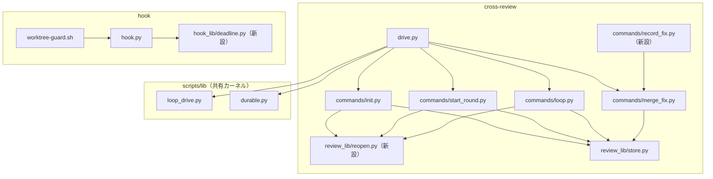
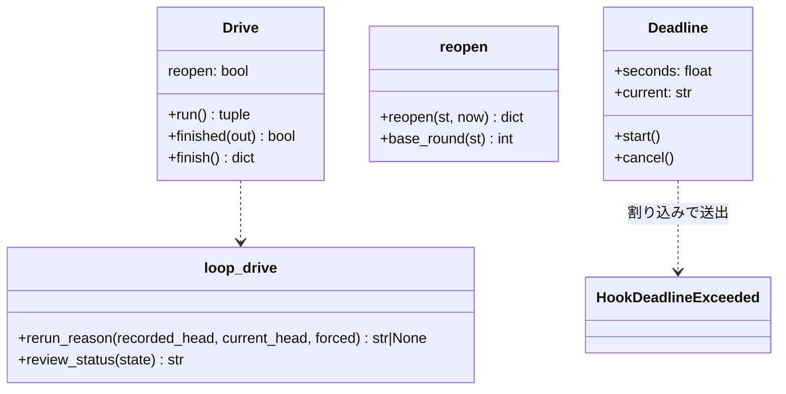
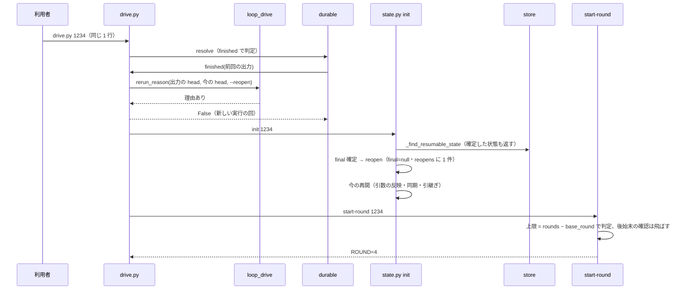
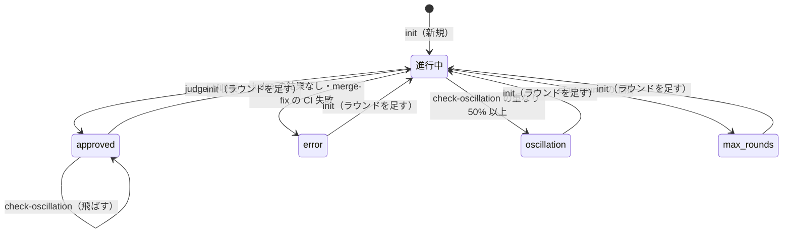
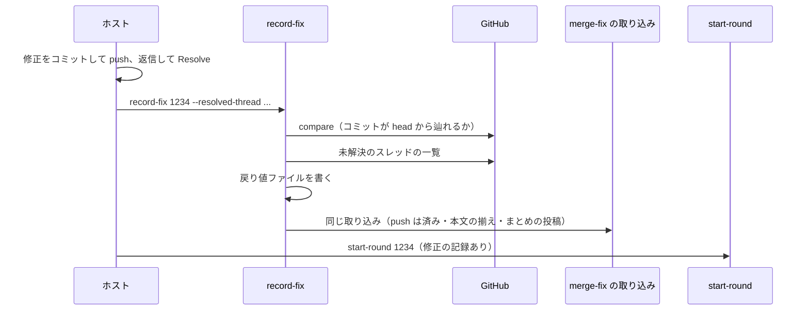
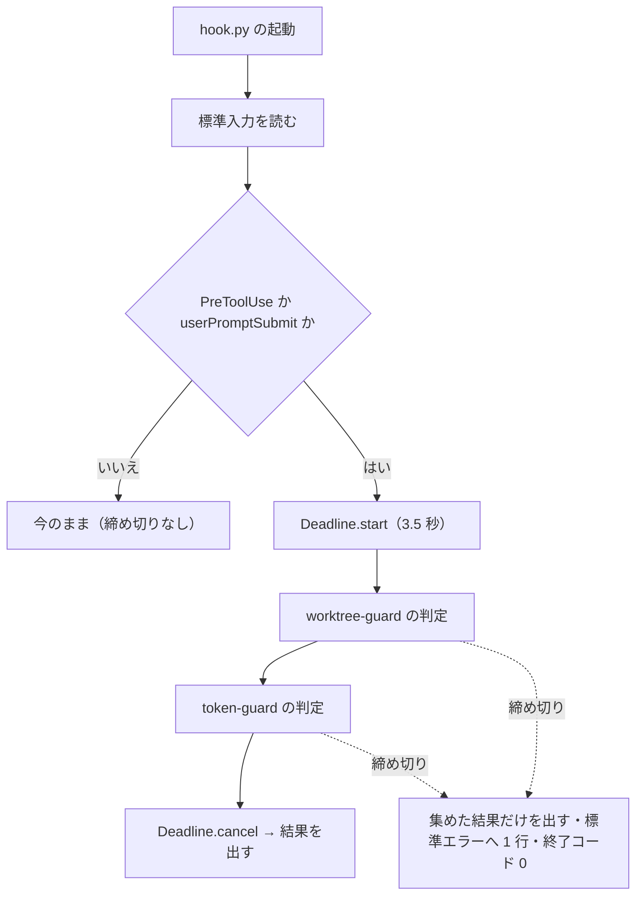

# #1340: cross-review にラウンドを足す入口・振動検知の順序・hook の締め切りの設計

要求と受け入れ条件は #1340 の本文にある（コピーは `issues/issue-1340-requirements.md`）。この文書は「どう作るか」だけを扱う。
決定の記録は [issue-1340-design-decisions.md](issue-1340-design-decisions.md)、テスト設計は
[issue-1340-design-tests.md](issue-1340-design-tests.md) に分けた。

## 例: 収束した PR #1234 に 1 コミット足してもう一度回す

PR #1234 の cross-review が round 3 で収束した（`final=approved`）。利用者が指摘とは別の直しを 1 コミット push し、
`/ndf:cross-review 1234` の 1 行（`python3 scripts/drive.py 1234`）をそのまま打ち直す。

| 時点 | 今の振る舞い | この設計の後 |
| --- | --- | --- |
| `drive.py` の起動 | 耐久の記録に完了があり、状態ファイルも残っているので前回の結果を返す | 完了の時点の head と今の head が違うため、新しい実行の回を始める |
| `state.py init` | `final` が確定した状態ファイルは再開の対象にせず、新しい状態で上書きする（round 1〜3 が消える） | `final` を外して `reopens` に 1 件積み、round 1〜3 を残したまま再開する |
| `start-round` | （上書き後の round 1） | round 4。上限は足した時点から数え直す（round 4 が「足した後の 1 回目」） |
| round 4 の `judge` が収束 | — | `check-oscillation` を誰かが打っても `final=approved` のまま、`⏭` を出して終了コード 2 |

## ドメインモデル

### コンテキスト

| コンテキスト | 何の語が 1 つの意味に決まるか |
| --- | --- |
| `ndf-cross-review` | レビューの状態ファイル・ラウンド・`final`・修正の記録・振動検知・ラウンドを足す |
| `ndf-workflow` | 耐久の記録・hook の上限・hook の締め切り |

2 つは**共有カーネル**の関係にある。共有するのは `scripts/lib/loop_drive.py`（cross-review と cross-refactoring の駆動が
使う部品）と耐久の記録の語で、前回の結果を返すかを決める判定をここへ置く（決定 3）。hook の締め切りは `ndf-workflow` の
中で閉じ、cross-review の語を使わない。

### 集約

| 集約 | 持ち主（書き換えてよいもの） | 根 | エンティティ | 値オブジェクト |
| --- | --- | --- | --- | --- |
| レビューの状態ファイル | `review_lib/store.py` の `_write_state`（副命令はこの経路だけで書く） | 状態（PR ごとに 1 つ） | ラウンド（`rounds[]`） | `final`・足した記録（`reopens[]` の要素）・修正の記録（`rounds[].fix`） |
| 駆動の実行の回 | `lib/durable.py`（`drive.py` が段階を進める） | 実行の回（`review-<鍵>-<n>`） | — | 終わりの出力（`result`・`code`・`tmp`・`head`） |
| hook の 1 回の実行 | `scripts/hook.py` | 1 回の実行 | — | 締め切り・飛ばした判定の名前 |

### 不変条件

| # | 集約 | 条件 | 破れたときの扱い |
| --- | --- | --- | --- |
| I1 | レビューの状態ファイル | ラウンドを足しても `rounds` の要素は 1 つも消えず変わらない。次のラウンドの番号は `len(rounds) + 1` | 足さずに終了コード 1（書き込みの前に止める） |
| I2 | レビューの状態ファイル | ラウンドを足すたびに `reopens` へ 1 件積み、`at`・`from_final`・`base_round`・`ended_at` を持つ | 同上 |
| I3 | レビューの状態ファイル | ラウンドの上限と巻き直しの数は、最後に足した時点（`base_round`）より後のラウンドだけで数える | — （数え方の規則） |
| I4 | レビューの状態ファイル | `base_round` 以前のラウンドに `start-round` の後始末の確認（修正の記録・Resolve の突き合わせ）を当てないのは、最後の足した記録の `sweep` が `verified: true` かつ `remaining_open: 0` のときだけ（最終スイープが閉じたと検証できたラウンド）。`final` はスイープの前に確定し、未解決を残した終了もあるため、`final` の確定だけでは免除しない | 免除せず、`base_round` のラウンド（足す前の最後のラウンド）に今と同じ後始末の確認を当てる（未対応なら今と同じく止まる） |
| I5 | レビューの状態ファイル | `final` が確定しているとき、`check-oscillation` は `final` を書き換えず、終了コード 4 を返さない | 判定せずに `⏭` を出して終了コード 2 |
| I6 | レビューの状態ファイル | 振動検知が比べるのは、`base_round` より後で同じ PR の直近 2 ラウンドだけ | 2 つに満たなければ今と同じく飛ばす |
| I7 | レビューの状態ファイル | `record-fix` が修正の記録を作るのは、コミットが PR の head から辿れ、申告したスレッドがすべて解決済みのときだけ | 記録を作らずに理由を出して終了コード 5 |
| I8 | レビューの状態ファイル | 1 つのラウンドへ同じコミットの修正の記録を 2 回取り込まない。取り込みが済んだかは、コミットの一致ではなく `rounds[-1].fix.merge`（取り込みの段階と終了コード）で決める | 同じコミットで `merge.stage` が `done` なら投稿もせずに `取り込み済み` を出し、記録した終了コード（0 / 3）を返す。`done` でなければ、済んでいない段階（投稿・CI の分類）から続ける |
| I9 | レビューの状態ファイル | 状態ファイルが JSON として読めないとき、`init` は新しい状態で上書きしない | パスと理由を出して終了コード 1 |
| I10 | 駆動の実行の回 | 前回の結果を返すのは、完了の時点の head が今の PR の head と同じで、`--reopen` が無いときだけ | 新しい実行の回を始める |
| I11 | hook の 1 回の実行 | PreToolUse と userPromptSubmit の hook は、開始から締め切り（3.5 秒）までに終わる | 残りの判定を飛ばし、終了コード 0、標準エラーへ 1 行 |
| I12 | hook の 1 回の実行 | 締め切りの中で終わった判定の結果（拒む / 通す / 案内）は、この変更の前と同じ | — |
| I13 | hook の 1 回の実行 | 締め切り + 1.5 秒 ≤ NDF が配る PreToolUse・userPromptSubmit の hook の上限 | テストが落ちる（上限か締め切りの片方だけを変えたとき） |

### ドメインイベント

| # | イベント | 発生元 | 受け手 |
| --- | --- | --- | --- |
| E1 | 収束ループが終わり、`final` が確定した | `judge`・`check-oscillation`・`merge-fix`・`start-round` | `drive.py`（最終スイープへ）・`check-oscillation`（I5） |
| E2 | PR に差分が足された | 利用者・エージェントの push | `drive.py` の完了の判定（I10） |
| E3 | ラウンドを足す入口が打たれた | `/ndf:cross-review` の打ち直し（`drive.py` か `state.py init`） | `store._find_resumable_state` |
| E4 | `final` が外れ、足した記録が積まれた | `init` の再開の経路 | `start-round`（I3・I4） |
| E5 | 次の番号のラウンドが始まった | `start-round` | レビュー担当の起動 |
| E6 | `judge` がラウンドを判定した | `judge` | `drive.py` の `after_judge` |
| E7 | ホストが自分で直し、修正の記録を作った | `state.py record-fix` | `merge-fix`（同じ取り込みの経路）・`start-round` |
| E8 | 振動検知が判定した | `check-oscillation` | `drive.py`（修正へ / 最終スイープへ） |
| E9 | PreToolUse の hook が操作を判定した | `hook.py` | ランタイム（拒む / 通す / 案内） |

### 用語

| 用語 | 意味 | 用語集への反映 |
| --- | --- | --- |
| ラウンドを足す | `final` が確定したレビューの状態ファイルの `final` を外し、履歴を残したまま次の番号のラウンドから収束ループを続けること。`init` の再開の経路が行い、`reopens` に 1 件残す | 追加（`ndf-cross-review`） |
| hook の締め切り | NDF の hook が自分で決める、1 回の実行の時間の上限。hook の上限より短く、過ぎたら残りの判定を飛ばして通す | 追加（`ndf-workflow`） |
| レビューの状態ファイル | 要求で追加した語。意味は変えない | — |
| 修正の記録 | 要求で追加した語。`record-fix` も作り手になる | 意味の変更（作り手に `record-fix` を足す） |
| hook の上限 | 要求で追加した語。意味は変えない | — |

## 機能一覧

| # | 機能 | 誰が使うか |
| --- | --- | --- |
| F1 | 収束・異常終了した PR に、同じ 1 行を打ち直してラウンドを足す | 利用者・conductor・supervisor |
| F2 | 差分が足されていなければ前回の結果を返し、足されていれば新しく回す | `drive.py`（打ち直した人からは F1 の一部に見える） |
| F3 | 確定した `final` を振動検知が上書きしない | `drive.py`・手順を順に打つ利用者 |
| F4 | ホストが自分で直した修正を、JSON を書かずに修正の記録にする | ホスト（`/ndf:fix` を通さずに直した人） |
| F5 | hook が上限の中で終わり、飛ばした判定を知らせる | 4 ランタイムの利用者 |

## 構成要素

| 要素 | 変更 | 責務 |
| --- | --- | --- |
| `review_lib/store.py` の `_find_resumable_state` | 変える | `final` が確定した状態も返す。JSON として読めなければパスと理由を出して終了コード 1（I9） |
| `review_lib/reopen.py` | 新設 | `reopen(st, now)`: `final` を外して足した記録を積む（I1・I2）。`base_round(st)`: 最後に足した時点のラウンド数（足していなければ 0） |
| `review_lib/commands/init.py` の `_resume_from_state` | 変える | `final` が確定していれば `reopen` を通してから今の再開の手順（引数の反映・同期・引継ぎ）へ進む |
| `review_lib/commands/start_round.py` | 変える | 上限の判定を `len(rounds) - base_round` で行う（I3）。後始末の確認を飛ばすのは、最後のラウンドが `base_round` 以前で、最後の足した記録の `sweep` が検証済みかつ未解決 0 件のときだけ（I4） |
| `review_lib/commands/loop.py` | 変える | `check-oscillation`: `final` が確定していれば判定しない（I5）。比べるラウンドを `base_round` より後に絞る（I6）。`should-rotate`: 数えるラウンドを `base_round` より後に絞る（I3） |
| `review_lib/commands/merge_fix.py` | 変える | 取り込みの段階ごとに `rounds[-1].fix.merge` を書き進める。最後のラウンドの `fix.commit` と戻り値ファイルのコミットが同じなら、`merge.stage` が `done` のときは取り込まずに記録した終了コードを返し、`done` でなければ続きの段階から再開する（I8）。取り込みの本体を `record-fix` から呼べる関数に切り出す |
| `review_lib/commands/record_fix.py` | 新設 | `state.py record-fix`: コミットと申告したスレッドを GitHub で確かめ（I7）、戻り値ファイルを契約の形で書いて `merge-fix` と同じ取り込みを通す |
| `scripts/state.py` | 変える | 副命令 `record-fix` を登録する |
| `scripts/drive.py` | 変える | 完了の記録を返すかを `loop_drive.rerun_reason` で決める（I10）。`--reopen` を受ける。`finish` が終わりの出力へ PR の head を残す |
| `scripts/lib/loop_drive.py` | 変える | `rerun_reason(recorded_head, current_head, forced)`: 新しく始める理由（無ければ `None`）を返す。cross-review と cross-refactoring の駆動の共通の部品（#1263 が引数の比較を足す） |
| `scripts/hook.py` | 変える | PreToolUse・userPromptSubmit の判定を締め切りの中で行い、過ぎたら集めた分だけを出して終了コード 0（I11・I12） |
| `scripts/hook_lib/deadline.py` | 新設 | `DEADLINE_SECONDS = 3.5`・`MARGIN_SECONDS = 1.5`。`Deadline` は残り時間で割り込み、今の判定の名前を持つ |
| `cross-review/SKILL.md`・`docs/01`・`docs/02`・`docs/04` | 変える | ラウンドを足す手順、`record-fix`、`reopens` の鍵、Step 4 の飛ばし方 |

### 構成要素図



### 影響範囲

| 呼び出し元 | 呼ぶもの | 変わること |
| --- | --- | --- |
| `drive.py` の `Drive.run` | `durable.resolve(..., finished=...)` | `finished` が `rerun_reason` を通す |
| `drive.py` の `advance`（init の段階） | `state.py init` | 新しい実行の回では `init` が足す（引数は変えない） |
| `drive.py` の `after_judge` | `state.py check-oscillation` | 呼ぶ条件は変えない（`judge` が 2 のときだけ） |
| `drive.py` の `merge_fix` | `state.py merge-fix` | 取り込み済みなら記録した終了コード（0 / 3）で戻る。途中で止まった取り込みは続きから通す |
| SKILL.md の手順を手で打つ利用者 | `state.py record-fix`・`check-oscillation` | 新しい副命令。`check-oscillation` は確定後に飛ばす |
| `hooks/claude.json`・`hooks/codex.json` | `hook.py` | 締め切り。hook の定義は変えない |
| `dev.agy/hooks.json`・`dev.kiro/install.sh` | `worktree-guard.sh` → `hook.py worktree-guard` | 同上 |

### 値の集合へ値を足したときの既存の規則

`final` の取りうる遷移に「確定 → `null`」を足し、`state.py` の副命令に `record-fix` を足す。`final` を読む規則を
配布物から集めて当てはめた（`grep -rn '"final"'`、手順は `drive.py` の段階を読んだ）。

| 規則 | 新しい遷移に当てはまるか |
| --- | --- |
| `store._find_resumable_state` の「確定したら再開しない」 | 当てはまらない。変える（構成要素の表） |
| `loop.cmd_check_oscillation` が `final` を見ない | 当てはまらない。変える |
| `start_round` の上限と後始末の確認が全ラウンドを数える | 当てはまらない。変える |
| `drive.finished` が状態ファイルの有無だけを見る | 当てはまらない。変える |
| `run_metrics.ended_at`（`final` が `null` なら終わりを持たない）・`measure._convergence`・`report` の `in_progress`・`loop_drive.review_status` | 当てはまる（足した後は終わっていない実行として扱い、次の `final` で書き直される） |

`sweep` は足すときに足した記録へ移す（I2 の `ended_at` と同じ扱い）。残すと `review_status` と `counts()` の
`unresolved` が前の実行の最終スイープを読む。

## 構造



### パッケージ・モジュール構成

```text
plugins/ndf/
├── scripts/
│   ├── hook.py                         # 変える
│   ├── hook_lib/deadline.py            # 新設
│   └── lib/loop_drive.py               # 変える
└── skills/cross-review/
    ├── SKILL.md · docs/01 · 02 · 04    # 変える
    └── scripts/
        ├── drive.py · state.py         # 変える
        └── review_lib/
            ├── reopen.py               # 新設
            ├── store.py                # 変える
            └── commands/
                ├── init.py · start_round.py · loop.py · merge_fix.py   # 変える
                └── record_fix.py       # 新設
```

## データ構造

レビューの状態ファイルに鍵 `reopens` を足す。既存の鍵の意味は変えない。`reopens` が無い状態ファイルは
`base_round = 0` として読む（移行のコマンドを要さない）。

| 鍵 | 型 | 空の扱い | 意味 |
| --- | --- | --- | --- |
| `reopens` | list | 無い = 足したことがない | ラウンドを足した記録。古い順 |
| `reopens[].at` | ISO 8601 文字列 | 必須 | 足した時刻 |
| `reopens[].from_final` | 文字列 | 必須 | 足す前の `final`（`approved` / `error` / `oscillation` / `max_rounds`） |
| `reopens[].base_round` | int | 必須 | 足した時点の `len(rounds)`。次のラウンドは `base_round + 1` |
| `reopens[].ended_at` | ISO 8601 文字列 か null | 足す前に無ければ null | 足す前の `ended_at` |
| `reopens[].sweep` | object か null | 足す前に無ければ null | 足す前の `sweep`（最終スイープの検証） |

足した後の状態: `final = null`・`ended_at` と `sweep` の鍵を消す。

修正の記録 `rounds[].fix` に鍵 `merge` を足す（I8）。`merge` が無い記録は `merge.stage = recorded` と読み、
投稿から続ける。今の取り込みは投稿の前に `rounds[-1].fix` を保存するため、`merge` が無い記録からは投稿と CI の
分類が済んだかを決められない。投稿をやり直しても、投稿の待ち行列が送る前に投稿済みかを照会し、見つけた項目は
送らずに済ませる（`post_queue.py` の `match`）ため、二重に投稿しない。終了コードは `final` から推さず、続けた
CI の分類が決める（`final = error` は judge の結果が無いときにも立ち、コード関連の CI 失敗と同値ではない）。

| 鍵 | 型 | 空の扱い | 意味 |
| --- | --- | --- | --- |
| `rounds[].fix.merge.stage` | 文字列 | 必須 | `recorded`（記録を保存した）→ `posted`（返信・決着・まとめを投稿した）→ `done`（CI の分類を終えた） |
| `rounds[].fix.merge.exit_code` | int か null | `done` の前は null | 取り込みが返した終了コード（0 / 3） |

駆動の実行の回の終わりの出力に `head`（`finish` の時点の PR の head の OID。取れなければ null）を足す。
`head` を持たない古い記録は、比べられないため今と同じく前回の結果を返す。

### CRUD

| 機能 | `rounds` | `final` | `reopens` | `rounds[].fix` | 終わりの出力 `head` |
| --- | --- | --- | --- | --- | --- |
| F1 ラウンドを足す | R | U（`null` へ） | C | — | — |
| F2 前回の結果を返すか | R（`current_pr`） | — | — | — | R |
| F3 振動検知 | R | R | R | — | — |
| F4 修正の記録 | R | — | R | C | — |
| 最終スイープの後（`finish`） | — | R | — | — | C |

## 入出力の契約

### `state.py init <PR> [今の引数]`

引数と標準出力（`TMP_DIR=` ほか）は変えない。状態ファイルの有無で 4 つに分かれる。

| 状態ファイル | 振る舞い | 標準エラー | 終了コード |
| --- | --- | --- | --- |
| 無い | 今の新規の経路 | 今のまま | 今のまま |
| `final = null` | 今の再開の経路 | `↻ 前回中断 state から再開（round=<n>）` | 0 |
| `final` が確定 | 足してから今の再開の経路 | `↻ final=<値> のレビューにラウンドを足す（round <n+1> から）` に続けて上の 1 行 | 0 |
| JSON として読めない | 書かずに止まる | `❌ レビューの状態ファイルを読めません: <パス>（<理由>）` | 1 |

### `state.py check-oscillation <PR>`

| 条件 | 出力 | 終了コード |
| --- | --- | --- |
| `final` が確定 | `⏭ final=<値> は確定済み: 振動検知スキップ` | 2 |
| それ以外 | 今のまま（比べる範囲は I6） | 今のまま（2 / 4） |

### `state.py record-fix <PR> [--commit <SHA>] [--resolved-thread <ID>]...`

| 引数 | 既定 | 意味 |
| --- | --- | --- |
| `--commit` | PR の今の head の OID | 修正のコミット（push 済みであること） |
| `--resolved-thread` | なし（0 件） | 返信して Resolve したスレッドの node ID。繰り返して渡す |

| 条件 | 振る舞い | 終了コード |
| --- | --- | --- |
| 最後のラウンドが無い・修正の記録が既にある | 書かずに理由を出す | 1 |
| コミットが PR の head から辿れない（`gh api repos/<repo>/compare/<commit>...<head>` が `identical` / `ahead` 以外） | 書かずに `コミット <SHA> が PR の head にありません` | 5 |
| 申告したスレッドが未解決の一覧にある・一覧を取れない | 書かずに未解決の ID か取れない理由を出す | 5 |
| 上のどれでもない | 戻り値ファイル `fix-pr<PR>-result.json` を下の形で書き、`merge-fix` と同じ取り込みを通す | 取り込みの終了コード（0 / 3） |

書く戻り値ファイルは `docs/04-contracts.md` の契約の形のままで、値だけが決まっている。

```json
{"pr": 1234, "fix_commit": "<SHA>", "fixed_count": 2, "resolved_threads": [{"thread_id": "PRRT_..."}],
 "deferred": [], "rejected": [], "ci_status": null, "recorded_by": "record-fix"}
```

`fixed_count` は申告したスレッドの数、`recorded_by` は取り込みが読まない印である（記録の出所を後から見分ける）。

### `state.py merge-fix <PR>`（I8 で変わる所）

| 条件 | 振る舞い | 終了コード |
| --- | --- | --- |
| 最後のラウンドに修正の記録が無い・コミットが違う | 今の取り込み。段階ごとに `merge.stage` を書き進める | 今のまま（0 / 3） |
| 同じコミットで `merge.stage = recorded`（`merge` が無い記録を含む） | 記録を書き直さず、投稿から続ける | 続けた取り込みの終了コード |
| 同じコミットで `merge.stage = posted` | 投稿せず、CI の分類から続ける | 続けた取り込みの終了コード |
| 同じコミットで `merge.stage = done` | 書かず投稿もせずに `取り込み済み`（記録した終了コード） | `merge.exit_code` |

### `drive.py <PR> [--reopen] [今の引数]`

| 条件 | 振る舞い |
| --- | --- |
| 耐久の記録が完了・状態ファイルあり・終わりの出力の `head` が今の PR の head と同じ・`--reopen` なし | 前回の結果を返す（今のまま） |
| 上のうち `head` が違う | 標準エラーに `↻ 完了の時点の head <旧 7 桁> から <新 7 桁> へ進んでいるため、ラウンドを足す` を出して新しい実行の回を始める |
| `--reopen` あり | 標準エラーに `↻ --reopen が渡されたため、ラウンドを足す` を出して新しい実行の回を始める |
| `head` が無い（古い記録）・今の head を取れない | 標準エラーに `ℹ head を比べられないため前回の結果を返す（足すなら --reopen）` を出して前回の結果を返す |

`--reopen` は `state.py init` へ渡さない（`init` は `final` を見て足すかを決める）。

### hook（`hook.py`）

標準入力・標準出力の形は変えない。締め切りを過ぎたときだけ次が変わる。

| 項目 | 値 |
| --- | --- |
| 終了コード | 0 |
| 標準出力 | 締め切りまでに終わった判定の結果だけ（今の `_merge` の規則。拒否があれば拒否） |
| 標準エラー | `[ndf hook] 締め切り 3.5 秒を過ぎたため <判定の名前> を飛ばして通した` の 1 行。名前は `worktree-guard` / `token-guard` |

## 処理の流れ

### ラウンドを足す（`drive.py` を通す経路）



### `final` の状態遷移



確定した `final` から確定した別の値へ直接移る遷移は無い（I5）。

### ホストが自分で直したとき



`drive.py` の修正の止まり（終了コード 20）でホストが `record-fix` を打った後に `drive.py` を打ち直すと、
`drive.py` の `merge_fix` は取り込み済み（I8）として記録した終了コードで戻る。0 なら巻き直しの判定へ進み、
3（コード関連の CI 失敗）なら今と同じく中断する。`record-fix` の取り込みが投稿の途中で止まっていれば、
打ち直した `merge-fix` が投稿から続ける。

### hook の締め切り



割り込みは `signal.setitimer(ITIMER_REAL)` で行う。`subprocess.run` は待っている間の例外で子のプロセスを止めて
送り直すため、`git` を打っている途中でも残らない。`setitimer` を持たない環境（Windows）では締め切りを掛けずに今の
振る舞いのまま通す。

## 非機能の実現方式

| 大項目 | 要求の条件 | 実現方式 |
| --- | --- | --- |
| 性能・拡張性 | PreToolUse の hook が各ランタイムの上限より短い締め切りの中に収まる | 締め切り 3.5 秒・余裕 1.5 秒の定数を `hook_lib/deadline.py` に 1 か所で持つ。上限との差は下の表。今の所要は 0.03 秒（2026-10-02 に `hook.py` へ PreToolUse の入力を 3 回渡して実測。Python の起動は 0.009 秒） |
| 運用・保守性 | 足したことが状態ファイルに残る。hook が飛ばしたことが標準エラーに 1 行残る | `reopens` の要素（いつ・どの `final` から・どのラウンドの後か）。hook は飛ばした判定の名前を含む 1 行 |
| 移行性 | 今の形の状態ファイルをそのまま読める | `reopens` が無ければ `base_round = 0`。終わりの出力に `head` が無い耐久の記録は今の振る舞い |

| hook | 上限 | 締め切り | 差 |
| --- | ---: | ---: | ---: |
| Claude Code PreToolUse（`hooks/claude.json`） | 10 秒 | 3.5 秒 | 6.5 秒 |
| Codex PreToolUse（`hooks/codex.json`） | 5 秒 | 3.5 秒 | 1.5 秒 |
| agy PreToolUse（`dev.agy/hooks.json` → `worktree-guard.sh`） | 5 秒 | 3.5 秒 | 1.5 秒 |
| Kiro userPromptSubmit（`dev.kiro/install.sh` → `worktree-guard.sh`） | 5 秒 | 3.5 秒 | 1.5 秒 |

## 設計の結果

| 課題 | 扱い | 取り込み先 | 触るファイル |
| --- | --- | --- | --- |
| #1340 | 実装する | — | `plugins/ndf/skills/cross-review/`、`plugins/ndf/scripts/hook.py`、`plugins/ndf/scripts/hook_lib/`、`plugins/ndf/scripts/lib/loop_drive.py`、`plugins/ndf/scripts/tests/` |

## 未確認のまま残ること

| 項目 | 内容 |
| --- | --- |
| 打ち切りが起きたコマンドの形 | carmo-system-console の会話の記録（2026-09-14 ほか）はこの環境に無く、形を特定できなかった。前提 10 のとおり、`git` を遅くした擬似のリポジトリで代える。41 秒の事例は `hooks/pretooluse.py`（今は呼ばれていない）のもので、今の `hook.py` で同じ形が起きるかは確かめていない |
| 締め切りを過ぎた回の書き込み先の検知 | 前提 9 のとおり、その回だけメインディレクトリへの書き込みの事前の案内が出ない。#734 の事後の観測で拾う前提で、利用者が設計 PR の承認で確かめる |
| `setitimer` の割り込みと tree-sitter の構文解析 | C 拡張の中で時間を使っている間は割り込みが Python へ戻らない。構文解析が 1.5 秒を超える入力があるかは実装で測る |
| #1263 との合わせ方 | `rerun_reason` に引数の比較を足すのは #1263 である。cross-refactoring の `finished` はこの課題では変えない |
