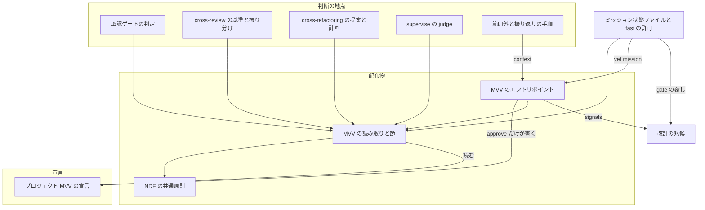
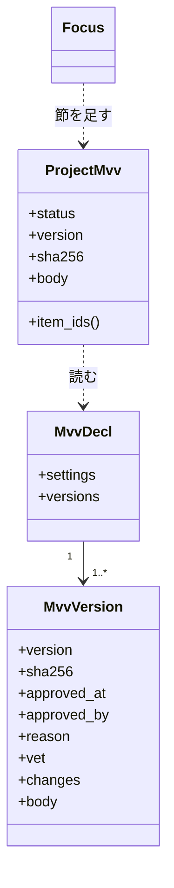
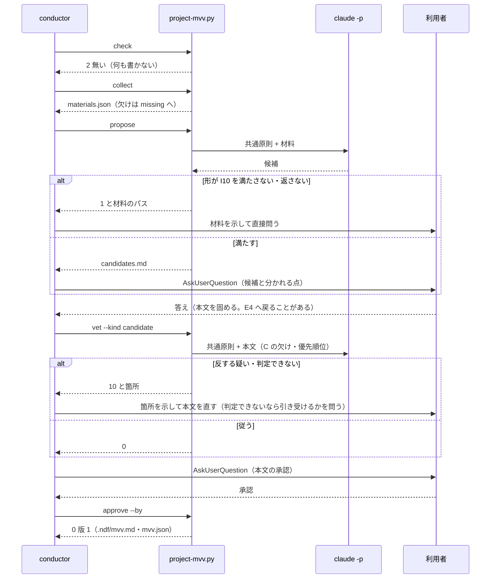
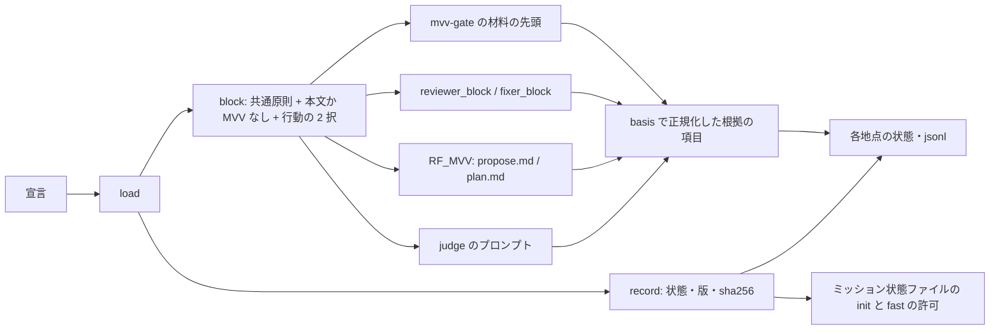
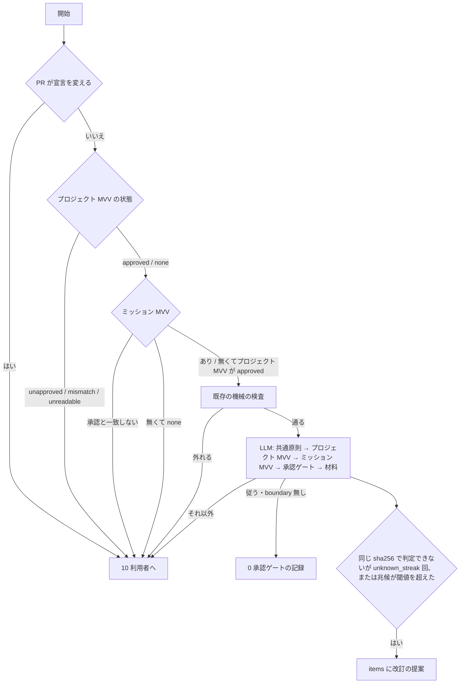
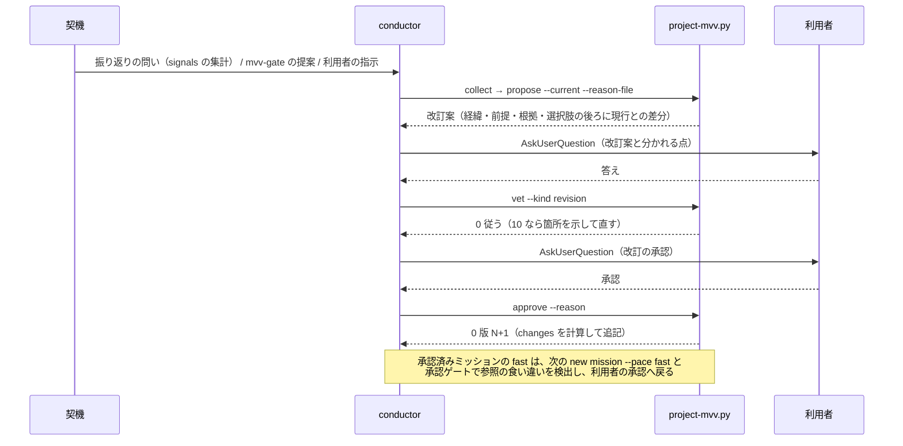
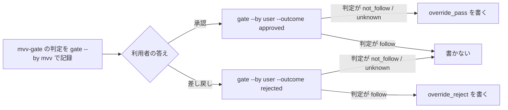
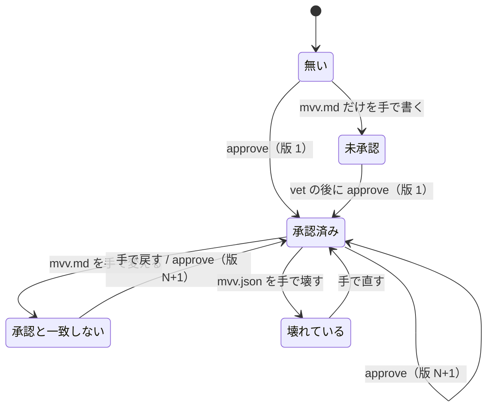

# #1366: プロジェクト MVV を宣言し、候補から定め、判断の地点がそれに従い、改訂できるようにする

要求と受け入れ条件は #1366 の本文にある（コピーは `issues/issue-1366-requirements.md` ）。この文書は「どう作るか」だけを扱う。
決定の記録・テスト設計・未確認のまま残ることは `issues/issue-1366-design-decisions.md` にある。

## 例: ai-plugins でプロジェクト MVV を定め、承認ゲートがそれを読むまで

1. conductor が `development-workflow` の手順 0 で `project-mvv.py check` を打つ。`.ndf/mvv.json` が無いので終了コード 2 と
   「プロジェクト MVV が無い」が出る。LLM も `gh` も呼ばず、何も書かない
2. `project-mvv.py collect` が材料を集める。コミット 3781 件・課題 573 件で閾値（100 件・20 件）を超えるので履歴モードになり、
   `git log` の件名・課題の題名と本文・`docs/ndf-version-decisions.md`・`AGENTS.md`・`README.md` から出典つきの材料を
   状態ディレクトリの `materials.json` へ書く（git 0.03 秒・`gh issue list` 全件 5.9 秒の実測で、60 秒に収まる）
3. `project-mvv.py propose` が最小構成の `claude -p` を 1 回呼び、候補 A・B と「利用者に決めてもらう点」を
   `candidates.json` と `candidates.md` へ書く（`issues/mvv-candidates-ai-plugins.md` と同じ形）。`candidates.md` は
   経緯・前提・根拠・選択肢の 4 節を先頭に持ち、内部の用語には説明が付く（I19）
4. conductor が `candidates.md` を示し、分かれる点を `AskUserQuestion` で問う。答えから本文を固める。ai-plugins では
   承認済みの `issues/mvv-ai-plugins.md` の文面がそのまま本文になる。**ここまで `.ndf/` に何も書かない**
5. `project-mvv.py vet --kind candidate --body <本文>` が NDF の共通原則に照らし（C1〜C8 を外していない・優先順位を変えて
   いない・固有の操作が `P<番号>` で書かれている）、「従う」を返す（終了コード 0）
6. 利用者が承認した後に `project-mvv.py approve --body <本文> --by takemi.ohama --reason 初版` を打つ。
   `.ndf/mvv.md`（本文）と `.ndf/mvv.json`（版 1・sha256・日時・承認者・照合の記録）ができ、`check` が 0 を返す
7. 次の設計 PR で `mvv-gate.py check --gate design` が、共通原則の本文全体・プロジェクト MVV（版 1）・ミッション MVV の順に
   並べた材料で判定し、`mvv-gate.jsonl` に `"project_mvv": {"status": "approved", "version": 1, ...}` と `"basis": ["Value 1"]` を
   残す。判定の結果として取る行動は「進める」（0）か「止めて人へ戻す」（10。理由と根拠つき）の 2 つだけである。
   同じ PR の cross-review は担当と修正担当の「指摘の基準」の後ろに MVV の節を受け取り、見送りの返信に「根拠: Value 1（MVV 版 1）」と書く
8. 利用者が承認ゲートで判定を覆すと（「従う」を退ける・「反する疑い」を通す）、`mission-state.py gate` が改訂の兆候を
   `project-mvv-signals.jsonl` へ 1 行残す。`retrospective` の `project-mvv.py signals` が、現行の版のもとでの覆し・「判定できない」・
   流出不具合の件数を宣言の閾値と比べ、超えていれば改訂を提案する

## ドメインモデル

### コンテキスト

| コンテキスト | 何の語が 1 つの意味に決まるか |
| --- | --- |
| NDF の開発ワークフロー（`ndf-workflow` ） | NDF の共通原則・上位の原則・プロジェクト MVV・ミッション MVV・MVV の版・MVV の改訂・改訂の兆候・MVV 候補・傾向モード・MVV の照合・判断の地点・根拠の項目 |
| NDF の cross-review（`ndf-cross-review` ） | 指摘の基準・見送り・見送りの返信 |
| NDF の cross-refactoring（`ndf-cross-refactoring` ） | 提案・候補・見送りの理由・リファクタリング計画 |

関係は**公開された言語**である。開発ワークフローが宣言のスキーマ（`mvv.schema.json` ）と、MVV の節・根拠の項目・状態への写しの形
（`lib/project_mvv.py` ）を公開し、cross-review・cross-refactoring・supervise が同じ形を読む。どの受け手も宣言を書き換えない。

### 集約

| 集約 | 持ち主（書き換えてよいもの） | 根 | エンティティ | 値オブジェクト |
| --- | --- | --- | --- | --- |
| プロジェクト MVV の宣言 | `project-mvv.py approve` だけ | 宣言（`.ndf/mvv.json` ） | 版 | 本文・sha256・承認の記録（日時・承認者）・理由・差分・照合の記録・設定（閾値） |
| NDF の共通原則 | NDF の配布物（リリースだけが変える） | 原則の本文（`scripts/data/ndf-common-principles.md` ） | — | 上位の原則の 1 文・優先順位・AI の行動の 2 択・判断の範囲と記録・人と AI の対話・必ず承認が要る操作 C1〜C8 |
| MVV の材料（1 回の収集） | `project-mvv.py collect` だけ | 材料（`materials.json` ） | 出典 | 出典の ID と種類・モード（履歴 / 傾向）・件数と閾値・欠け |
| MVV 候補（1 回の生成） | `project-mvv.py propose` だけ | 候補の組（`candidates.json` ） | 候補 | 4 節の本文・根拠（材料の出典の ID）・分かれる点・種類（新規 / 改訂） |
| MVV の照合（1 回） | `project-mvv.py vet` | 照合の記録 | — | 種類（candidate / revision / mission）・対象の sha256・判定・箇所 |
| ミッション状態ファイル（既存） | `mission-state.py` | `mission.json` | 承認ゲートの記録 | プロジェクト MVV の参照（版・sha256）を足す |
| 判断の記録（既存・地点ごと） | 各地点の既存の持ち主（`mvv-gate.py`・`fix-steps.py`・`refactor.py`・supervise の engine） | 各地点の状態ファイル・jsonl | 判断 1 件 | MVV の参照（状態・版・sha256）・根拠の項目 |
| 改訂の兆候（覆しの記録） | `mission-state.py gate` だけ | `project-mvv-signals.jsonl` | 覆し 1 件 | 種類（従うを退けた / 反する疑いを通した）・承認ゲート・ミッション・MVV 判定・プロジェクト MVV の sha256・日時 |

**宣言は ID（版と sha256）で参照する。** ミッション状態ファイルも判断の記録も本文を写さず、`{status, version, sha256}` だけを持つ。
本文を読むのは `lib/project_mvv.py` だけで、判断の地点はそこから MVV の節を受け取る。**改訂の兆候は集計で、新しく書くのは覆しだけである。**
「判定できない」は `mvv-gate.jsonl` に、流出不具合は `new impl --escape-of` の記録（`kind: escape` ）に既にあり、`signals` がそれらを読む。

### 不変条件

| # | 集約 | 条件 | 破れたときの扱い |
| --- | --- | --- | --- |
| I1 | 宣言 | `.ndf/mvv.md` と `.ndf/mvv.json` を書くのは `approve` だけで、同じ sha256 の本文への直近の照合が「従う」（または「判定できない」を `--accept-unknown` で人が引き受けた）ときだけ書く | 照合が無い・「反する疑い」なら終了コード 1 で止まり、箇所を示す。ファイルは作らない（AC5・AC16） |
| I2 | 宣言 | `check` が 0 を返すのは、`mvv.md` の sha256 が `versions` の最後の版の sha256 と一致するときだけである | 一致しなければ終了コード 4「承認と一致しない」（AC6） |
| I3 | 宣言 | 版は 1 から 1 ずつ上がり、`versions` は追記だけで過去の版（本文・理由・差分・承認の記録）を書き換えない。版 2 以降は理由を必ず持つ | `approve` が理由の無い改訂と、本文が現行と同じ改訂を止める（AC10） |
| I4 | 宣言 | 本文は `## Mission` / `## Vision` / `## Value`（番号つきの箇条）を持ち、固有の必ず承認が要る操作は `## 必ず人の承認が要る操作` の表の `P<番号>` で書く。共通原則の写し（上位の原則の節・優先順位の節・`C<番号>` の行）を持たない。ほかの節（共通原則との関係・改訂）は持ってよく、項目の番号は読まない | `approve` と `vet` が欠けた見出し・共通原則の写しを示して止まる（前提 8・AC19） |
| I5 | NDF の共通原則 | 判断の地点へ渡す MVV の節・候補の生成・照合のプロンプトは、共通原則の本文全体を先頭に持ち、プロジェクト MVV・ミッション MVV の順に続ける。プロジェクト MVV が無くても共通原則は持つ | 共通原則が先頭に無い・1 文だけに縮めたプロンプトができたら誤り（AC16・AC19） |
| I6 | 判断の記録 | プロジェクト MVV が無い・未承認（`.ndf/mvv.md` だけがあり `.ndf/mvv.json` が無い）・承認と一致しない・壊れているとき、mvv-gate 以外の地点は止まらず「MVV なし」として進み、状態をその記録に書く。mvv-gate は未承認・承認と一致しない・壊れているなら LLM を呼ばずに 10 を返し、無ければミッション MVV だけで判定する | 地点が止まったら誤り。mvv-gate が未承認か一致しない宣言で LLM を呼んだら誤り（AC7・E7） |
| I7 | 判断の記録 | LLM が判断した記録（`mvv-gate.jsonl`・修正の振り分けと見送りの返信・提案と候補と見送り・judge の結果）は根拠の項目を必ず持つ。MVV が無ければ「MVV なし」、あって LLM が返さなければ「根拠なし」を入れ、根拠の欠けで止めない | 根拠の項目が空の記録ができたら誤り（AC9） |
| I8 | MVV の材料 | `check` と `collect` は LLM を呼ばない。`gh` は読み取りだけに使う。`check` はファイルを書かない | LLM か `gh` の書き込みを呼んだら誤り（AC1・AC2） |
| I9 | MVV の材料 | コミット数と課題数の両方が閾値に満たないときだけ傾向モードになり、傾向モードの材料は README・指示書・依頼文だけから作る | 片方が閾値以上で傾向モードになったら誤り。傾向モードで履歴の出典が材料に入ったら誤り（AC3） |
| I10 | MVV 候補 | 候補は 2 案以上で、各案が 4 節を持ち、根拠が材料の出典の ID を指す。分かれる点が 1 つ以上ある | 満たさない応答は終了コード 1 で止まり、材料のパスを示す（AC4・E3） |
| I11 | ミッション状態ファイル | 承認済みのプロジェクト MVV があるときの `init --pace fast` は、ミッション MVV があればその照合（`mission`）が「従う」のときだけ状態を書き、プロジェクト MVV の参照（版・sha256）を残す。`new mission --pace fast` はその sha256 と現行の宣言が食い違えば断る | 「反する疑い」で状態が書かれたら誤り。改訂の後に fast が通ったら誤り（AC12・AC10・前提 6） |
| I12 | 宣言 | 閾値・パス・ブランチ名に ai-plugins の値を既定として持たない。閾値は汎用の既定と、引数と、宣言の `settings` で受ける | 既定に ai-plugins の値があれば誤り（AC14） |
| I13 | 判断の記録 | mvv-gate が同じプロジェクト MVV の sha256 のもとで「判定できない」を `unknown_streak` 回続けて返したら、結果に改訂の提案を載せる。ほかの判定か版の更新で数え直す | 回数に届いて提案が無い、または別の版をまたいで数えたら誤り（AC11） |
| I14 | 判断の記録 | 照合と判断の地点の結果は「進める」か「止めて人へ戻す（理由と根拠つき）」だけで、利用者の本文・指示を書き換えも退けもしない | 照合が本文を書き換えたら誤り。地点が指示に無い変更を加えた記録があれば誤り（前提 9・AC16） |
| I15 | 判断の記録 | 承認ゲートの PR が `.ndf/mvv.md` か `.ndf/mvv.json` を変えるとき、mvv-gate は LLM を呼ばずに利用者へ戻す | 宣言を変える PR が MVV 判定で通ったら誤り（C7。I1 を PR 経由で回り込ませない） |
| I16 | NDF の共通原則 | 判断を求めるプロンプト（候補の生成・照合・mvv-gate・judge・担当と修正担当の基準・提案と計画）は、共通原則の後ろに同じ固定の指示（`lib/project_mvv.contract` ）を持つ: 共通原則を基準に判断する・取れる行動は「進める」か「止めて人へ戻す」の 2 つ・指示と違う変更を独自に加えない・根拠の項目を返す | 固定の指示を欠く・地点ごとに文面を変えたプロンプトができたら誤り（AC16） |
| I17 | MVV の照合 | プロジェクト MVV の本文（候補・改訂案）が、共通原則の C1〜C8 のどれかを承認なしで行えると書く・優先順位を変えるとき、照合は「反する疑い」で止め、箇所（C の番号か優先順位）を示す。形（I4）は機械が、意味は LLM が見る | C を外した本文・優先順位を入れ替えた本文が「従う」で通ったら誤り（AC19） |
| I18 | 改訂の兆候 | 覆しは `mission-state.py gate --by user` が、同じ承認ゲートの直前の MVV 判定と食い違うとき（`follow` を退けた・`not_follow` / `unknown` を通した）だけ書く。`signals` は現行の版の sha256 と承認の日時より後の記録だけを数え、閾値を超えたら改訂の提案を `items` に載せる | 判定と一致する承認で覆しが書かれたら誤り。前の版の記録を数えたら誤り（AC17） |
| I19 | MVV 候補 | 人へ示す文面（`candidates.md` ・改訂案・承認ゲートの資料）は、経緯・前提・根拠・選択肢の 4 節をこの順に先頭に持ち、内部の用語には言い換えか説明が付く | `propose` の出力に 4 節が無ければ 1 で止まる（I10 と同じ検査）。承認ゲートの資料は手順書の雛形で見る（AC18） |

### ドメインイベント

| # | イベント | 発生元 | 受け手 |
| --- | --- | --- | --- |
| E1 | 宣言の有無と新しさを確かめた | `project-mvv.py check`（`development-workflow` の手順 0） | conductor（2 と 4 なら策定か改訂の手順を案内する） |
| E2 | 材料を集めた | `project-mvv.py collect` | `propose` |
| E3 | 候補を書いた | `project-mvv.py propose` | conductor |
| E4 | 候補と分かれる点を利用者へ示した | conductor（`AskUserQuestion` ） | 利用者 |
| E5 | 利用者が答え、本文が固まった | 利用者（conductor が答えから本文を組む） | `vet --kind candidate` |
| E6 | 照合が「従う」を返した後に、利用者が同じ本文を承認した | 利用者（`AskUserQuestion` ） | `approve` |
| E7 | 宣言を書いた | `project-mvv.py approve` | `check`・判断の地点 |
| E8 | 判断の地点がプロジェクト MVV を読んだ | `lib/project_mvv.load`（各地点） | 各地点の状態ファイル・jsonl |
| E9 | 判断の記録に根拠の項目を残した | 各地点（`lib/project_mvv.basis` で正規化） | 各地点の記録 |
| E10 | 改訂の契機が立った | `retrospective` の問い（`signals` の集計つき）・mvv-gate の連続と兆候の閾値・利用者の指示 | conductor（改訂の手順） |
| E11 | 改訂案を示し、照合の後に承認して版を上げた | `propose --current`・`vet --kind revision`・利用者の承認・`approve --reason` | 宣言・`new mission --pace fast`（参照の食い違いで断る） |
| E12 | ミッション MVV がプロジェクト MVV と矛盾し、ミッションの開始が止まった | `mission-state.py init`（`vet --kind mission` ） | conductor |
| E13 | 承認ゲートで人が MVV 判定を覆した | `mission-state.py gate --by user`（`--outcome rejected` か、`not_follow` / `unknown` の後の承認） | `project-mvv-signals.jsonl` ・`signals` |

順序は E5 → `vet` → E6 → `approve` → E7 である。`vet` が「従う」を返す前（または「判定できない」を人が引き受ける前）に承認を問わず、
承認の後に本文を変えたら E5 へ戻る（I1）。

### 用語

| 用語 | 意味 | 用語集への反映 |
| --- | --- | --- |
| MVV | Mission / Vision / Value。プロジェクト MVV とミッション MVV の 2 層があり、下位は上位の範囲で具体化する | 意味の変更 |
| MVV 判定 | 承認ゲートのエビデンスが NDF の共通原則・プロジェクト MVV・ミッション MVV に従うかの判定。「従う」でレッドラインが無いときだけ承認ゲートを省き、記録を残す | 意味の変更 |
| MVV の照合 | 本文（候補・改訂案・ミッション MVV）が NDF の共通原則とプロジェクト MVV に従うかを「従う / 反する疑い / 判定できない」の 3 択で判定すること。従う以外は人へ戻す | 追加 |
| MVV の節 | 判断の地点へ渡す塊。NDF の共通原則の本文全体を先頭に置き、承認済みのプロジェクト MVV の本文か「MVV なし」とその理由、行動の 2 択と根拠の指示を続ける | 追加 |
| 根拠の項目 | 判断の記録に残す MVV の項目の番号（`Mission` / `Vision` / `Value 3` / `C4` / `P1` / `R2` ）。MVV が無ければ「MVV なし」、返されなければ「根拠なし」 | 追加 |
| NDF の共通原則 | NDF を使うすべてのプロジェクトに効く原則。NDF が持ち、利用側は上書きできない。上位の原則・優先順位・AI の行動の 2 択・判断の記録・人と AI の対話・必ず承認が要る操作 C1〜C8 を含む | 追加 |
| 上位の原則 | 「人類を守り、発展させる」。NDF の共通原則の最上位の 1 文 | 追加 |
| レッドライン | MVV 判定が「従う」でも利用者の承認を省かない操作。NDF の共通原則の `C<番号>`（NDF が持つ）・プロジェクト MVV の `P<番号>`（プロジェクトが足す）・ミッション MVV の `R<番号>` の 3 層 | 意味の変更 |
| 改訂の兆候 | 人が AI の判断を覆した回数（「従う」を退けた・「反する疑い」を通した）・「判定できない」の回数・流出不具合の件数。現行の版のもとで数え、宣言の閾値を超えたら改訂を提案する | 追加 |
| プロジェクト MVV | プロジェクト全体の Mission / Vision / Value と固有の必ず承認が要る操作（`P<番号>` ）。`.ndf/` に宣言し、利用者が承認する。判断の基準の上位 | 追加 |
| ミッション MVV | ミッション単位の MVV（既存の `mvv.md` ）。プロジェクト MVV の範囲での具体化 | 追加 |
| MVV の版 | プロジェクト MVV の承認のたびに 1 ずつ上がる番号。改訂の理由と前の版との差分を伴う | 追加 |
| MVV の改訂 | プロジェクト MVV の本文を変え、利用者の承認で新しい版にすること | 追加 |
| 判断の地点 | NDF が LLM の判断を挟む場所（承認ゲートの判定・レビューの指摘と修正の可否・リファクタリングの提案の採否・judge のステップ・範囲外の起票の 3 択） | 追加 |
| MVV 候補 | 材料から書いたプロジェクト MVV の案。2 案以上と分かれる点を利用者へ示す | 追加 |
| 傾向モード | 履歴が育っていないプロジェクトで、README・指示書・依頼文の傾向から MVV 候補を出す抽出の形 | 追加 |

## 機能一覧

| # | 機能 | 誰が使うか |
| --- | --- | --- |
| F1 | プロジェクト MVV の有無と新しさを判定する | conductor（手順 0） |
| F2 | 候補の材料を集める（履歴モード / 傾向モード） | conductor |
| F3 | MVV 候補を書く（新規 / 改訂案） | conductor |
| F4 | 候補と分かれる点を示し、対話で本文を固める | conductor と利用者 |
| F5 | 本文を NDF の共通原則とプロジェクト MVV に照らす | conductor・`mission-state.py` |
| F6 | 承認した本文を宣言として書く（版 1 / 改訂で版 N） | conductor（利用者の承認の後） |
| F7 | 過去の版の本文と版どうしの差分を取り出す | 利用者・`retrospective` |
| F8 | 判断の地点へ MVV の節を渡し、根拠の項目を記録する | mvv-gate・cross-review・cross-refactoring・supervise の judge・`out-of-scope` |
| F9 | 改訂の契機を知らせる | `retrospective`・mvv-gate |
| F10 | ミッション MVV がプロジェクト MVV と矛盾すればミッションの開始を止める | `mission-state.py init` |
| F11 | ai-plugins のプロジェクト MVV（版 1）を宣言する | conductor と利用者 |
| F12 | 改訂の兆候を記録し、閾値と比べる | `mission-state.py gate`・`project-mvv.py signals`（`retrospective`・mvv-gate） |

## 構成要素

| 要素 | 新設 / 変更 | 責務 |
| --- | --- | --- |
| NDF の共通原則（`scripts/data/ndf-common-principles.md` ） | 新設 | 承認済みの文面（`issues/ndf-common-principles.md` ）をそのまま置く。上位の原則・優先順位・AI の行動の 2 択・判断の範囲と記録・人と AI の対話・必ず承認が要る操作 C1〜C8。どのプロンプトも先頭にこの本文全体を置く |
| MVV の読み取りと節（`scripts/lib/project_mvv.py` ） | 新設 | 宣言の読み取り（例外を上げず `approved` / `none` / `unapproved` / `mismatch` / `unreadable` を返す）・本文の解析（見出しと項目の番号）・MVV の節の組み立て・判断のプロンプトの固定の指示（`contract` ）・根拠の項目の正規化・状態への写し・改訂の兆候の集計（`signals` ）・宣言の型（`lib/schema.py` の `Shape` ）・ミッションの承認の照合（`approved_mvv` と `mvv_refusal` の 2 つを 1 つに寄せる） |
| MVV のエントリポイント（`scripts/project-mvv.py` ） | 新設 | `check` / `collect` / `propose` / `vet` / `approve` / `show` / `context` / `signals` の 8 副命令。LLM を呼ぶのは `propose` と `vet` だけで、`supervise_lib/claude.py` の `call_claude` を Tool なしで呼ぶ |
| 宣言のスキーマ（`development-workflow/schemas/mvv.schema.json` ） | 新設 | `lib/project_mvv.py` の型から生成し、一致をテストが見る |
| 承認ゲートの判定（`scripts/mvv-gate.py` ） | 変更 | 材料の先頭へ MVV の節を置き、ミッション MVV を続ける。宣言の状態による機械の検査（I6・I15）。`mvv-gate.jsonl` に MVV の参照と根拠の項目。「判定できない」の連続と兆候の閾値で改訂を提案する |
| ミッション状態ファイル（`scripts/mission-state.py` ） | 変更 | `init` でプロジェクト MVV の参照を書き、ミッション MVV があれば `vet --kind mission` を通す（I11）。`gate --by user` に `--outcome`（`approved` / `rejected` ）を足し、直前の MVV 判定と食い違えば覆しを `project-mvv-signals.jsonl` へ書く（I18） |
| fast の許可（`supervise_lib/mission.py` ） | 変更 | 照合を `lib/project_mvv.py` の関数へ寄せる。ミッション MVV が無くても承認済みのプロジェクト MVV で許可し、参照の食い違いで断る |
| 指摘の基準（`scripts/lib/review_criteria.py` ） | 変更 | `reviewer_block` / `fixer_block` の後ろへ MVV の節を足し、`waiver_reply` に根拠の項目を足し、`as_state` に MVV の参照を足す |
| cross-review の初期化（`review_lib/commands/init.py` ） | 変更 | 宣言を 1 回だけ読み、状態ファイルの `review_criteria` へ MVV の参照と節を写す |
| 修正の振り分け（`fix/scripts/fix-steps.py` ） | 変更 | 振り分けの `mvv_basis` を正規化して結果と見送りの返信へ渡す。修正担当と最終スイープで共通 |
| cross-refactoring（`refactor_lib/commands/setup.py`・`launch-cli.sh`・`prompts/propose.md`・`prompts/plan.md`・`proposals.py`・`commands/plan.py`・`items.py`・`plan.py` ） | 変更 | 初期化で MVV の参照と節を状態へ写し、`RF_MVV` で提案と計画のプロンプトへ渡す。提案・計画の答えの `mvv_basis` を候補・項目・見送りへ運び、計画の見送りの表に根拠の列を足す |
| supervise の judge（`supervise_lib/steps.py`・`prompts.py`・`state.py` ） | 変更 | judge のプロンプトへ MVV の節を足し、出力に `basis` を足し、`log` へ根拠の項目を、`state.json` へ MVV の参照を書く |
| 手順書（`development-workflow` の `SKILL.md`・`references/project-mvv.md`・`references/conductor-entrypoints.md`・`references/pace.md` ） | 変更・新設 | 手順 0 に `check` を足す。策定と改訂の手順（対話・承認・書き込み）と、人へ示す文面の雛形（経緯・前提・根拠・選択肢・用語の説明。候補の提示・改訂の提案・承認ゲートの資料で共通）を `project-mvv.md` に置く。承認ゲートの手順に `gate --by user --outcome` を足す。fast の許可にプロジェクト MVV を足す |
| `out-of-scope`・`retrospective` の `SKILL.md` | 変更 | 3 択の前に `project-mvv.py context` を読み、起票の本文に根拠の項目を書く。振り返りの観点に「MVV を見直すか」を足し、`project-mvv.py signals` の集計を示して問う |
| ai-plugins の宣言（`.ndf/mvv.md`・`.ndf/mvv.json`・`AGENTS.md` の方針） | 新設・変更 | 実装の中で、利用者の承認の後に `approve` で書く。本文は承認済みの `issues/mvv-ai-plugins.md` の文面そのまま。`AGENTS.md` の方針に「判断の基準は `.ndf/mvv.md` 、優先順位は NDF の共通原則が決める」の 1 段落を足す |
| 用語集（`docs/glossary/glossary.json`・`docs/glossary.md` ） | 変更 | 用語の表の追加と意味の変更を反映する（設計 PR で済ませる） |



### 配置

すべて利用者の端末（worktree）で動く。境界をまたぐのは 3 本である。

| 境界 | 流れるもの | 保護の条件 |
| --- | --- | --- |
| `collect` → `gh`（GitHub） | 課題の題名と本文の読み取り | 読み取りだけ。書き込みの副命令を呼ばない |
| `propose` / `vet` / mvv-gate / judge → `claude -p` | NDF の共通原則・材料・本文 | 材料は `project_lib/secret.py` で秘密を伏せてから渡す。Tool なし・設定を読まない最小構成 |
| `approve` → `.ndf/` | 本文と承認の記録 | 利用者の承認の後に conductor が打つ（レッドライン C7） |

### 置き場所

```text
plugins/ndf/
├── scripts/
│   ├── data/ndf-common-principles.md         # 新設
│   ├── lib/project_mvv.py                    # 新設
│   ├── lib/review_criteria.py                # 変更
│   ├── project-mvv.py                        # 新設
│   ├── mvv-gate.py / mission-state.py        # 変更
│   ├── supervise_lib/{mission,steps,prompts,state}.py   # 変更
│   └── tests/test_project_mvv.py             # 新設（ほかは既存のテストへ足す）
└── skills/
    ├── development-workflow/
    │   ├── SKILL.md                          # 変更（手順 0）
    │   ├── schemas/mvv.schema.json           # 新設
    │   └── references/{project-mvv.md（新設）,conductor-entrypoints.md,pace.md}
    ├── cross-review/scripts/review_lib/commands/init.py   # 変更
    ├── fix/scripts/fix-steps.py              # 変更
    ├── cross-refactoring/{prompts,scripts}   # 変更
    └── out-of-scope/SKILL.md, retrospective/SKILL.md      # 変更
```

`project-mvv.py` は安定版の置き場（`scripts/` ）に置く。手順 0 と判断の地点という既定で動くものから呼ぶため、実験版には置けない
（`test_experimental.py` ）。

## 構造



| 型・関数 | 責務 |
| --- | --- |
| `ProjectMvv`（`lib/project_mvv.py` ） | 読み取りの結果。`status` が `approved` のときだけ `body` と `version` を持つ |
| `MvvDecl` / `MvvVersion` | `.ndf/mvv.json` の型。`lib/schema.py` の `Shape` を継ぐ |
| `load(root) -> ProjectMvv` | 例外を上げない。`mvv.md` も `mvv.json` も無ければ `none` 、`mvv.md` だけがあれば `unapproved` 、`mvv.json` の形が違えば `unreadable` 、sha256 が最後の版と違えば `mismatch` |
| `block(mvv) -> str` | MVV の節。共通原則の本文全体 → 本文（または「MVV なし（理由）」）→ `contract()` |
| `contract() -> str` | 判断のプロンプトの固定の指示（I16）。共通原則を基準に判断する・行動は「進める」か「止めて人へ戻す（理由と根拠）」の 2 つ・指示と違う変更を独自に加えない・根拠の項目の番号を返す |
| `signals(root, mvv) -> dict` | 改訂の兆候の集計（I18）。覆し（`project-mvv-signals.jsonl` ）・「判定できない」（`mvv-gate.jsonl` ）・流出不具合（トリガーの記録の `escape` ）を現行の版のもとで数え、閾値との比較を返す |
| `record(mvv) -> dict` | 状態への写し `{status, version, sha256}` |
| `basis(raw, mvv) -> list[str]` | 根拠の項目の正規化（I7）。本文に無い番号は落とす |
| `approval_refusal(state, root) -> str \| None` | fast の許可の照合。ミッション MVV の 3 者の一致（今の 2 か所の実装）とプロジェクト MVV の参照の一致を見る |

既存の `Focus`（`review_criteria.py` ）は形を変えない。`reviewer_block(focus, mvv)` / `fixer_block(focus, mvv)` が第 2 引数を受け、
省くと今の出力と同じになる。

## データ構造

### 宣言

`.ndf/mvv.md` は本文だけを持つ Markdown で、人が読む。`.ndf/mvv.json` は版の履歴を持ち、機械が読む。

```json
{
  "version": 1,
  "body": "mvv.md",
  "settings": {"trend_commits": 100, "trend_issues": 20, "unknown_streak": 3,
               "revise_after": {"overrides": 3, "unknowns": 5, "escapes": 3}},
  "versions": [
    {"version": 1, "sha256": "9f2c…", "approved_at": "2026-09-28T01:23:45Z", "approved_by": "takemi.ohama",
     "reason": "初版", "vet": {"verdict": "follow", "at": "2026-09-28T01:20:02Z", "accepted_unknown": false},
     "changes": [], "body": "## Mission\n…"}
  ]
}
```

| 項目 | 型 | 空を許すか | 意味 |
| --- | --- | --- | --- |
| `version` | int | 許さない | 宣言の形の版。1 |
| `body` | str | 許さない | 本文のファイル（`.ndf/` からの相対）。既定 `mvv.md` |
| `settings.trend_commits` / `trend_issues` | int | 許す | 傾向モードの閾値。省くと既定（100 / 20） |
| `settings.unknown_streak` | int | 許す | 改訂を提案する「判定できない」の連続回数。省くと既定（3） |
| `settings.revise_after` | object | 許す | 改訂を提案する兆候の閾値。`overrides`（覆し）・`unknowns`（「判定できない」の総数）・`escapes`（流出不具合）。省くと既定（3 / 5 / 3） |
| `versions[]` | list | 許さない（1 件以上） | 承認の履歴。追記だけ（I3） |
| `versions[].sha256` | str | 許さない | その版の本文の sha256 |
| `versions[].approved_at` / `approved_by` | str | 許さない | 承認の日時（UTC）と承認者 |
| `versions[].reason` | str | 版 1 だけ許す | 改訂の理由。版 1 は「初版」を入れてよい |
| `versions[].vet` | object | 許さない | 承認の前の照合（判定・日時・「判定できない」を人が引き受けたか） |
| `versions[].changes` | list | 許さない（版 1 は空） | 前の版との差分。`{"item": "Value 3", "kind": "added" \| "changed" \| "removed"}` を項目の単位で並べる |
| `versions[].body` | str | 許さない | その版の本文の全文。`show --version N` がここから取り出す |

**時系列は履歴保持型で守る。** 改訂は新しい版を足し、過去の版を書き換えない。現行の本文は `mvv.md` と最後の版の `body` の 2 か所に
あり、sha256 の一致が「承認と一致する」の定義になる（I2）。

### 抽出の作業ファイル

`collect` と `propose` は、リポジトリの外の状態ディレクトリ（`~/.local/state/ndf/project-mvv/<リポジトリの根から決めた名前>/` 。
`--out-dir` で変える）へ書く。承認の前に `.ndf/` へ何も書かないためである（AC5）。

| ファイル | 主な項目 |
| --- | --- |
| `materials.json` | `mode`（`history` / `trend` ）・`counts`（`commits` / `issues` ）・`thresholds` ・`sources[]`（`id` = `S<番号>` ・`kind` = `commit` / `issue` / `doc` / `instructions` / `readme` / `request` ・`ref` = ファイルと行か課題番号かコミットの件名・`text` ）・`missing[]`（集められなかったものと理由）・`seconds` |
| `candidates.json` | `materials`（パス）・`kind`（`new` / `revision` ）・`candidates[]`（`id` ・`recommended` ・`mission` ・`vision` ・`values[]` と `redlines[]` の各行に `evidence`（`S<番号>` の並び））・`questions[]`（問いと選択肢ごとの影響） |
| `candidates.md` | `candidates.json` を `issues/mvv-candidates-ai-plugins.md` と同じ節の並びで書いたもの。利用者へ示す |

### 記録

| 記録 | 足す項目 |
| --- | --- |
| `~/.local/state/ndf/project-mvv.jsonl`（新設。`vet` の履歴） | `at` ・`repo` ・`kind` ・`sha256`（対象）・`project_sha256`（照らしたプロジェクト MVV。無ければ空）・`verdict`（`follow` / `suspect` / `unknown` / `unreadable` ）・`locations[]`（`item` と理由。C を外す・優先順位を変えるときは C の番号か `priority` ）・`cost_usd` ・`seconds` |
| `~/.local/state/ndf/project-mvv-signals.jsonl`（新設。覆しの記録） | `at` ・`repo` ・`mission` ・`gate` ・`kind`（`override_reject` = 「従う」を退けた / `override_pass` = 「反する疑い」か「判定できない」を通した）・`mvv_verdict` ・`project_sha256` |
| `mvv-gate.jsonl`（既存） | `project_mvv`（`{status, version, sha256}` ）・`basis[]` |
| `mission.json`（既存） | `project_mvv`（`{version, sha256}` 。承認済みのときだけ）。`mvv` は、プロジェクト MVV があれば空を許す。`gates[]` の `by: user` の行に `outcome`（`approved` / `rejected` ） |
| cross-review の状態（既存） | `review_criteria.project_mvv`（参照）と `review_criteria.mvv_block` 。振り分けと結果の各指摘に `mvv_basis` |
| cross-refactoring の状態（既存） | `project_mvv`（参照と節）。`candidates[]` ・`items[]` ・`deferred_items[]` に `mvv_basis` |
| supervise の `state.json`（既存） | `project_mvv`（参照。実行の開始で 1 回）。judge の `log` の行に `basis` |

| 機能 | 宣言 | 作業ファイル | `project-mvv.jsonl` | 各地点の記録 | `mission.json` |
| --- | --- | --- | --- | --- | --- |
| F1 判定 | R | — | — | — | — |
| F2 材料 | R（設定） | C | — | — | — |
| F3 候補 | R（改訂のとき） | R・C | — | — | — |
| F5 照合 | R | — | C | — | — |
| F6 承認 | C・U | — | R | — | — |
| F7 取り出し | R | — | — | — | — |
| F8 配線 | R | — | — | U | — |
| F9 契機 | R（設定） | — | — | R | — |
| F10 開始の検査 | R | — | C | — | C |
| F12 兆候 | R（設定） | — | — | C（覆し）・R（`mvv-gate.jsonl` ・トリガーの記録） | R |

書く相手が 2 つある機能は F10 だけで、照合の記録は `vet` が、ミッション状態ファイルは `mission-state.py` が書く。F12 が書くのは覆しの 1 ファイルだけである。F6 は本文と履歴の 2 ファイルを書くが、どちらも同じ宣言の集約に属する。

## 入出力の契約

`project-mvv.py` の副命令は結果を `lib/step_result.py` の形（`tool` / `status` / `summary` / `items` / `metrics` ）で標準出力へ書く。
引数の誤りは 2 で終わる（`argparse` ）。

| 副命令 | 入力 | 出力 | 終了コード |
| --- | --- | --- | --- |
| `check [--root]` | 宣言 | 状態・版・次にすることの案内（`items` ） | 0 承認済みで一致 / 2 無い / 3 壊れている / 4 承認と一致しない・未承認（`mvv.md` だけがある）。LLM・`gh` を呼ばず、書かない |
| `collect [--root] [--out-dir] [--request-file] [--trend-commits N] [--trend-issues N] [--budget 60]` | git・`gh`（読み取り）・ファイル | `materials.json` のパス・モード・件数・欠け | 0（欠けがあっても集められた材料で進む）/ 3 宣言の `settings` が壊れている |
| `propose --materials F [--current] [--reason-file F] [--out-dir]` | 材料・共通原則（`--current` なら現行の本文と改訂の理由） | `candidates.json` / `candidates.md` のパス。`candidates.md` は経緯・前提・根拠・選択肢の 4 節を先頭に持つ | 0 / 1 LLM が返さない・形が I10・I19 を満たさない（`items` に材料のパスと「利用者に直接問う」を示す） |
| `vet --body F --kind candidate\|revision\|mission [--root]` | 本文・共通原則・承認済みのプロジェクト MVV（`mission` と `revision` のとき） | 判定・箇所（I4 の形の欠け・C を外す箇所・優先順位の変更・Value の打ち消し） | 0 従う / 10 反する疑い・判定できない・読めない |
| `approve --body F --by NAME [--reason TEXT] [--accept-unknown] [--root]` | 本文・`project-mvv.jsonl` の直近の照合 | 書いた版・sha256 | 0 書いた / 1 照合が無い・「反する疑い」・形が I4 を満たさない・版 2 以降で理由が無い・本文が現行と同じ |
| `show [--version N] [--diff M] [--root]` | 宣言 | 本文、または版 M から N への差分 | 0 / 2 その版が無い |
| `context [--root] [--format text\|json]` | 宣言・共通原則 | MVV の節（`json` なら参照も） | 0（宣言が無くても共通原則と「MVV なし」を出す） |
| `signals [--root] [--format text\|json]` | 宣言・`project-mvv-signals.jsonl`・`mvv-gate.jsonl`・トリガーの記録 | 現行の版のもとでの覆し・「判定できない」・流出不具合の件数と閾値。超えていれば `items` に改訂の提案 | 0（宣言が無ければ「MVV なし」で 0）/ 3 宣言が壊れている |

**既存の約束へ足すもの（どれも後方互換）。**

| 約束 | 変更 | 互換性 |
| --- | --- | --- |
| 判断を求めるプロンプト（mvv-gate・judge・担当と修正担当の基準・提案と計画・候補の生成・照合） | 先頭に MVV の節（共通原則の本文全体 → プロジェクト MVV → `contract()` ）を足す。行動の 2 択と根拠の指示は 1 つの文面 | 出力の形は既存のまま。`basis` だけ足す |
| mvv-gate の LLM の出力 | `{"verdict","reasons","boundary"}` に `basis` を足す | 無ければ「根拠なし」として記録する |
| mvv-gate の機械の検査 | 未承認・承認と一致しない・壊れている宣言（I6）と、宣言を変える PR（I15）で 10 | 宣言の無いリポジトリは今と同じ |
| judge の出力 | `{"decision","reason"}` に `basis` を足す | 無ければ「根拠なし」 |
| 修正の振り分け（`fix-pr<N>-decisions.json` ） | 各指摘に `mvv_basis` を足す | 無ければ「根拠なし」。検査で止めない |
| cross-refactoring の提案と計画の答え | 各提案・各候補に `mvv_basis` を足す | 無ければ「根拠なし」 |
| `mission.json` | `project_mvv` を任意の項目として足す。fast の `mvv` は、承認済みのプロジェクト MVV の参照があれば空でよい | 今の状態ファイルは項目が無いまま読める |
| `waiver_reply(kind, names, basis)` | 返信の末尾に「根拠: Value 1（MVV 版 1）」か「（MVV なし）」を足す | 第 3 引数を省くと今の本文 |
| `mission-state.py gate <承認ゲート> --by user [--outcome approved\|rejected]` | `--outcome` を足す。`rejected` は承認ゲートを通さず記録だけ残す。直前の MVV 判定と食い違えば覆しを書く | 省くと `approved` で今と同じ |

## 処理の流れ

### 策定（F1〜F6）



承認されなければ、conductor は E4 へ戻り、`approve` を打たない。`approve` が書けなければ（権限・ディスク）止まり、本文を利用者へ示す。

### 判断の地点（F8）



`mission-state.py init` は参照を書く前に `project-mvv.py vet --kind mission` を呼ぶ（F10）。スキーマ・用語集・手順書・ai-plugins の宣言は呼び出しの順序を持たないため、どの図にも描かない。

`out-of-scope` は判断を LLM の会話の中で行うため、スクリプトの配線を持たない。Skill の手順で `project-mvv.py context` を読み、
起票の本文の「なぜこの変更の範囲外なのか」の節に根拠の項目と版を書く。それが渡した事実の記録になる（AC8）。

### 承認ゲートの判定（mvv-gate の順序）



判定の結果として mvv-gate が取る行動は 0（進める）か 10（止めて人へ戻す。`reasons` と `basis` を添える）の 2 つだけで、材料も PR も
書き換えない（I14）。

### 改訂（F3・F5・F6・F9・E10〜E11）



承認されなければ現行の版のまま終わる。

### 覆しの記録（F12・E13）



`retrospective` は `project-mvv.py signals` を打ち、集計と閾値を示して「MVV を見直すか」を問う。閾値を超えていれば改訂の手順へ入る。

### 宣言の状態



`approve` は「壊れている」から版を足さない（履歴を読めないため）。「無い」へ戻る遷移は描かない。宣言を消すのは利用者の手の操作で、
NDF の副命令は消さない。

## 非機能の実現方式

| 大項目 | 要求の条件 | 実現方式 | 確かめ方 |
| --- | --- | --- | --- |
| 性能・拡張性 | 材料集めは ai-plugins で 60 秒以内。候補の生成は最小構成の `claude -p` 1 回 | `collect` は `--budget`（既定 60 秒）の締め切りを持ち、git と `gh` の 1 回を `min(30, 残り)` 秒で打ち切る（`project_lib/measure_repo.py` の形）。課題は `gh_rest.issue_list` で 1 回に取り、本文は 1 件 2000 字で切る。`propose` は `call_claude` を Tool なしで 1 回呼ぶ | ai-plugins で `collect` の `seconds` を読む。`propose` の実行で `usage_ledger` の行が 1 つ増えることを見る |
| 運用・保守性 | 判定・承認・改訂は jsonl と git の履歴に残り、どの版で何を根拠に判断したかをたどれる | 版の履歴は `mvv.json` の `versions` （追記だけ）、照合は `project-mvv.jsonl` 、判断は各地点の記録に `{status, version, sha256}` と根拠の項目 | 判断の記録の版から `show --version N` で本文を取り出し、根拠の項目が本文にあることを見る |
| セキュリティ | レッドラインは MVV があっても承認ゲートを省かない | 共通原則の C1〜C8 は配布物にあり、宣言の照合が C を外す本文を止める（I17）。mvv-gate の既存の検査（`boundary_paths` ・`boundary` ）を残し、宣言を変える PR を常に利用者へ戻す（I15）。材料は `project_lib/secret.py` で秘密を伏せてから LLM へ渡す | 既存の `test_mvv_gate.py` と、宣言を変える PR の試験・C を外した本文の試験・秘密を含む材料の試験 |
