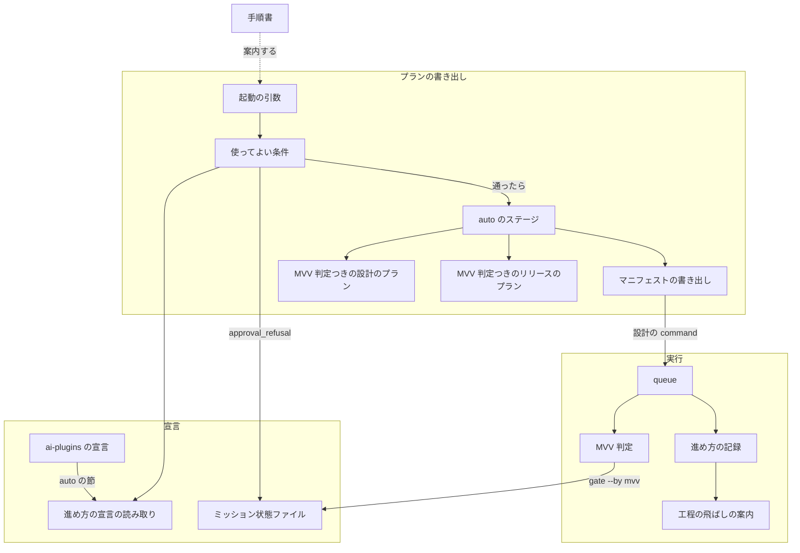
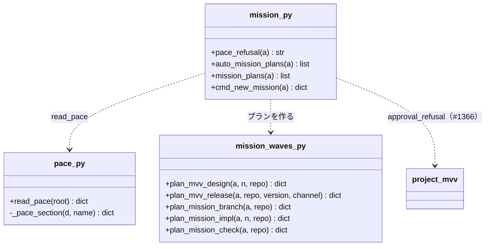
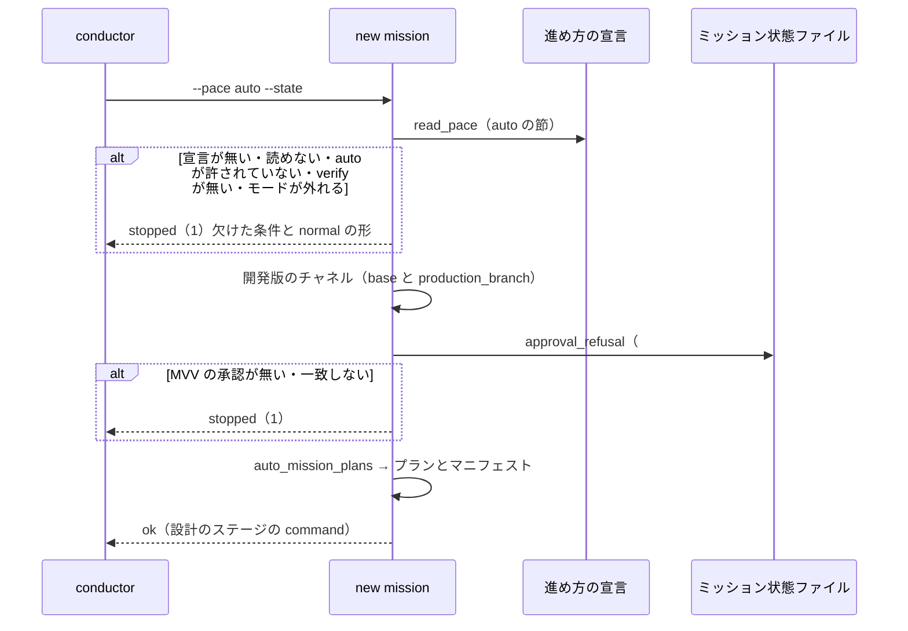
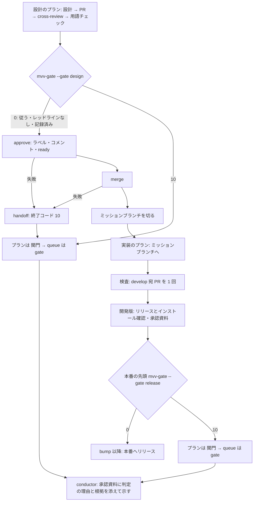
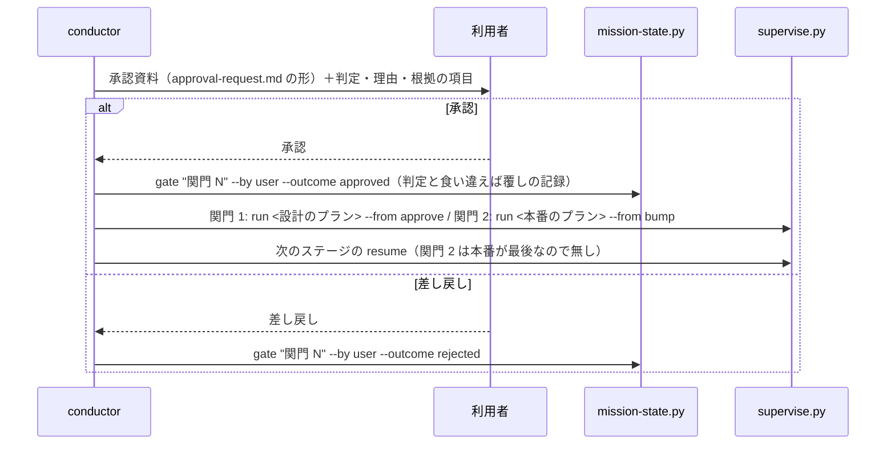

# #1370: pace: auto を足す（工程は normal のまま、承認ゲート 1・2 だけを MVV 判定で自動にする）

要求と受け入れ条件は #1370 の本文にある（コピーは `issues/issue-1370-requirements.md` ）。この文書は「どう作るか」だけを扱う。
プロジェクト MVV の読み方と覆しの記録は #1366 の設計（`issues/issue-1366-design.md` ）が持ち、この文書はそれを呼ぶ側だけを書く。

## 例: ai-plugins で課題 2 本のミッションを pace: auto で流す

課題 #1401（設計あり）と #1402（設計なし）を、ミッション `m27` として `standard` のモードで流す場合である。

1. `.ndf/pace.json` に `"auto": {"enabled": true, "modes": [...], "verify": "..."}` があり、`.ndf/mvv.json` の
   プロジェクト MVV が承認済みである（#1366）。ミッション MVV は写さない
2. conductor が `mission-state.py init m27/mission.json --name m27 --pace auto --milestone 27` を打つ。
   承認済みのプロジェクト MVV があるので、状態に `pace: auto` とプロジェクト MVV の参照（版・sha256）が入る
3. conductor が `supervise.py new mission --name m27 --worktree . --issue 1401 1402 --design 1401 --version 10.18.0-dev.1
   --pace auto --state m27/mission.json --out m27/plans` を打つ。使ってよい条件の 5 つが通り、ステージ 7 つの
   プランと `mission.json`（マニフェスト）ができる。コマンドは設計のステージの 1 本だけで、後ろのステージは `--then` で続く
4. 設計のプランが設計 PR を出し、cross-review（3 ラウンド）の後に `mvv-gate.py check --gate design` を打つ。「従う」で
   レッドラインが無いので、`mvv-gate.py` が承認ゲート `関門 1` を `by: mvv` で記録し、PR にラベル `design-approved` と
   判定のコメントを付けてマージする
5. 同じ queue がミッションブランチ `mission/m27` を切り、#1401 と #1402 の実装 PR をそのブランチへ集め、ミッションの
   develop 宛 PR で検査（リファクタリング・cross-review・完了判定）を 1 回通してマージし、開発版を出してインストールを確かめる。
   `check-trigger.py` は呼ばれない
6. 本番のプランの先頭で `mvv-gate.py check --gate release` が走る。「従う」なので `関門 2` を `by: mvv` で記録し、
   そのまま本番へリリースする。conductor が起きるのは queue の終わりの通知の 1 回だけである
7. 4 で判定が「判定できない」を返した場合は、設計のプランが `関門` で終わり、queue は後ろのステージを流さず `gate` を返す。
   conductor は承認資料に判定の理由と根拠の項目を添えて利用者へ示し、承認なら
   `mission-state.py gate m27/mission.json "関門 1" --by user --outcome approved` → `supervise.py run <設計のプラン> --from approve` → マニフェストの
   ミッションブランチのステージの `resume` のコマンドの順に打つ。判定と食い違う承認なので、#1366 の覆しの記録が 1 行残る

## ドメインモデル

### コンテキスト

| コンテキスト | 何の語が 1 つの意味に決まるか |
| --- | --- |
| NDF の開発ワークフロー（`ndf-workflow` ） | pace・pace: auto・承認ゲート・MVV 判定・レッドライン・ステージ・ミッション状態ファイル・進め方の宣言 |

1 つのコンテキストで閉じる。MVV の宣言と覆しの記録は #1366 が同じコンテキストに足すもので、この変更は読むだけである。

### 集約

| 集約 | 持ち主（書き換えてよいもの） | 根 | エンティティ | 値オブジェクト |
| --- | --- | --- | --- | --- |
| 進め方の宣言（既存） | 利用者（レビューを通す）。NDF は読むだけ | `.ndf/pace.json` | — | `auto` の節（`enabled`・`modes`・`verify`）を足す |
| ミッションのプラン（1 回の書き出し） | `supervise.py new mission` だけ | マニフェスト（`<out>/mission.json` ） | ステージ・プラン | 進め方・ステージの並び・`then_of` ・`resume` のコマンド |
| ミッション状態ファイル（既存） | `mission-state.py` と、`by: mvv` の承認ゲートの記録に限り `mvv-gate.py`（`mission-state.py gate` を呼ぶ） | `mission.json` | 承認ゲートの記録 | `pace` に `auto` が入る。プロジェクト MVV の参照（#1366） |
| MVV 判定の記録（既存） | `mvv-gate.py` だけ | `mvv-gate.jsonl` | 判定 1 件 | 判定・理由・根拠の項目・承認ゲート（#1366 の形のまま） |

**ミッションのプランは状態ファイルを ID（パス）で参照する。** プランは状態を書かず、承認ゲートの記録を書くのは
`mvv-gate.py` が呼ぶ `mission-state.py gate` だけである。

### 不変条件

| # | 集約 | 条件 | 破れたときの扱い |
| --- | --- | --- | --- |
| I1 | ミッションのプラン | `--pace auto` は、開発版のチャネルがある・`auto.verify` がある・`auto.enabled` が真・モードが `auto.modes` に入り `operation` / `documentation` でない・承認済みの MVV（プロジェクト MVV かミッション MVV）が状態と一致する、の 5 つがそろうときだけプランを書く | `stopped`（終了コード 1）でプランもマニフェストも書かず、欠けた条件と `normal` の起動の形を示す（AC1） |
| I2 | ミッションのプラン | `auto` のステージは `normal` の並び（設計 → ゲート 1 → ミッションブランチ → 実装 → 検査）の後に開発版と本番を続け、ゲート 2 は本番のプランの先頭のステップになる。`normal` の `配布` は開発版のリリースで、`auto` では `開発版` と呼ぶ（`fast` と同じ名前。本番を入れる理由は決定 7）。実装のプランの起点と宛先はミッションブランチである | ステージの並びか宛先が上と違えば誤り（AC2） |
| I3 | ミッションのプラン | `auto` のプランは `check-trigger.py` を呼ぶステップも実行条件も持たない | 1 つでも持てば誤り（AC2） |
| I4 | ミッションのプラン | ゲート 1 の MVV 判定のステップは設計の cross-review と用語チェックの後にあり、判定が 0 のときだけ承認ラベルの付与とマージへ進む。0 以外（10・その他）はプランを `関門` で終える | 判定の前にマージへ進む経路、10 でマージへ進む経路があれば誤り（AC3・AC5） |
| I5 | ミッションのプラン | ゲート 2 の MVV 判定のステップは本番のプランの先頭にあり、開発版のプラン（インストール確認を含む）がすべて完了したときだけ流れる。0 のときだけ版上げへ進む | 開発版の完了の前に本番が流れる、10 で版上げへ進む経路があれば誤り（AC4・AC5） |
| I6 | ミッションのプラン | 設計から本番までの後ろのステージは、前のステージのプランがすべて `完了` のときだけ流れる。1 本でも `関門` か停止なら、後ろのステージは流れずに queue が `gate` か `stopped` を返す | 承認ゲートのプランの後に後ろのステージが流れたら誤り（AC3〜AC5） |
| I7 | ミッションのプラン | `then_of` で続くステージは、マニフェストに `resume`（そのステージから最後までを流す queue のコマンド）を持つ | 承認ゲートの後に続きを流すコマンドがマニフェストに無ければ誤り |
| I8 | ミッション状態ファイル | 自動で通した承認ゲートには `by: mvv` の記録があり、`mvv-gate.jsonl` に同じ判定の 1 行があり、ゲート 1 は設計 PR に判定のコメントがある。記録を書けなければ自動で通さない | 記録の無い承認ゲートの通過、記録を書けないのに通った経路があれば誤り（AC6・E5） |
| I9 | 進め方の宣言 | `auto` の節が無い・`enabled` が真でなければ `auto` を許さない。`fast` の節の値は `auto` の判定に使わない | `fast` だけを許した宣言で `auto` が通ったら誤り（影響の「無ければ不許可」） |
| I10 | ミッションのプラン | `normal` と `fast` のプランとマニフェストは、この変更の前と同じ内容で書き出される（マニフェストの `resume` の追加と、共有する設計のプランの `handoff` の追加を除く） | 既存のテストが落ちたら誤り（AC10） |

### ドメインイベント

| # | イベント | 発生元 | 受け手 |
| --- | --- | --- | --- |
| E1 | `--pace auto` の使ってよい条件を確かめた | `supervise.py new mission`（`pace_refusal`） | conductor（断られたら欠けた条件と `normal` の形を示す） |
| E2 | ステージのプランを `normal` と同じ並びで書き出し、ゲート 1・2 のステップを MVV 判定にした | `supervise.py new mission`（`auto_mission_plans`） | conductor（設計のステージの `command` を打つ） |
| E3 | ゲート 1 で MVV 判定が「従う」を返し、承認ラベルを付けてマージし、次のステージへ続いた | 設計のプランの `mvv` → `approve` → `merge` のステップ | queue（ミッションブランチのステージを流す） |
| E4 | ゲート 2 で MVV 判定が「従う」を返し、本番のプランが続けて流れた | 本番のプランの `mvv` のステップ | 本番のプランの `bump` 以降 |
| E5 | 判定と結果を記録した | `mvv-gate.py`（`mission-state.py gate --by mvv`・`mvv-gate.jsonl`・`--note` の PR のコメント） | 利用者・`project-mvv.py signals`（#1366） |
| E6 | 人が判定を覆した | conductor（利用者の答えを受けて `mission-state.py gate --by user --outcome`） | `project-mvv-signals.jsonl`（#1366） |

E3・E4 が起きなかったとき（判定が 0 以外）は、プランが `関門` で終わり、queue が `gate` を返して conductor が起きる。
これは新しいイベントではなく、既存の承認ゲートの提示（`approval-request.md` の形）へ戻ることである。

### 用語

| 用語 | 意味 | 用語集への反映 |
| --- | --- | --- |
| pace: auto | 進め方の 1 つ。工程は normal と同じで、承認ゲート 1・2 だけを MVV 判定で自動にする。「従う」でレッドラインが無いときだけ通し、ほかは利用者へ戻す | 追加（要求の PR で登録済み。`source` を実装で `pace.md` に揃え、`pending_source` を外す） |
| pace | モードとは別の軸で、工程をどう通すかを決める。normal・fast・auto の 3 つ | 意味の変更（要求の PR で反映済み） |
| resume | マニフェストの `then_of` のステージが持つ、そのステージから最後までを流す queue のコマンド。承認ゲートで止まった後に続きを流す | 追加 |

## 機能一覧

| # | 機能 | 誰が使うか |
| --- | --- | --- |
| F1 | `auto` を使ってよいかを確かめ、欠けた条件を示す | conductor |
| F2 | `normal` と同じ並びのプランを、ゲート 1・2 を MVV 判定にして書き出す | conductor |
| F3 | ゲート 1・2 で MVV 判定が「従う」なら、conductor を起こさずに次のステージへ続ける | queue（supervisor） |
| F4 | 判定が「従う」以外なら止め、承認資料に判定の理由と根拠を添えて渡す | queue → conductor |
| F5 | 止まった後に、承認を得て続きを流す | conductor |
| F6 | 自動で通した承認ゲートと覆しを記録し、後からたどる | 利用者・`retrospective` |
| F7 | `auto` を宣言で許し、判定結果の出力と手順書で案内する | 利用者・conductor |

## 構成要素

| 要素 | 新設 / 変更 | 責務 |
| --- | --- | --- |
| 進め方の宣言の読み取り（`scripts/lib/pace.py` ） | 変更 | `fast` と同じ形の `auto` の節を読み、既定を埋める。節の読み取りを 1 つの関数にまとめ、`fast` と `auto` で共用する。`EXCLUDED_MODES` は両方に効く |
| 使ってよい条件（`supervise_lib/mission.py` の `pace_refusal` ） | 変更（`fast_refusal` を改める） | 進め方の名前を受け、宣言のその節・開発版のチャネル・MVV の承認（#1366 の `approval_refusal`）を見る。`fast` と `auto` で同じ関数を通り、読む節だけが違う |
| auto のステージ（`supervise_lib/mission.py` の `auto_mission_plans` ） | 新設 | `normal` のステージ（設計・ゲート 1・ミッションブランチ・実装・検査・開発版・本番）を、設計のプランと開発版・本番のプランだけ MVV 判定つきの関数で作る。ゲート 1 のステージは説明だけを持ち（プランを持たない）、ミッションブランチ以降を設計の `then_of` にする |
| MVV 判定つきの設計のプラン（`supervise_lib/mission_waves.py` の `plan_mvv_design` ） | 変更（`plan_fast_design` を改める） | 今の `plan_fast_design` の中身に、`approve` と `merge` の失敗を承認ゲートへ落とす `handoff` のステップを足し、名前を進め方に依らない形にして `fast` と `auto` から呼ぶ |
| MVV 判定つきのリリースのプラン（同 `plan_mvv_release` ） | 変更（`plan_fast_release` を改める） | 同上。開発版は `facts` を `gate_as_ok` にし、本番は先頭に `mvv` のステップを置く（今の `release_templates.py` の `mvv` の分岐のまま） |
| マニフェストの書き出し（`supervise_lib/mission.py` の `cmd_new_mission` ） | 変更 | `進め方` を `a.pace` から書く（今は `--state` の有無で `fast` と決め打ち）。`then_of` のステージへ `resume` を書く。承認ゲートのステージの説明を進め方ごとに変える |
| 起動の引数（`supervise_lib/new_args.py` ） | 変更 | `--pace` の選択肢に `auto` を足す。`normal` のときだけ `--state` を捨てる今の扱いを保つ |
| 進め方の記録（`supervise_lib/state.py`・`scripts/progress-record.sh`・`scripts/lib/projects-common.sh` ） | 変更 | 値の一覧に `auto` を足す。`normal` 以外なら本文の見出し行へ `進め方: <値>` を書く。プランの `進め方` を最初に見たときに記録する今の処理を `fast` 以外にも効かせる |
| 工程の飛ばしの案内（`development-workflow/scripts/lib/workflow-common.sh` ） | 変更 | 値の一覧に `auto` を足す。工程の区分（トリガー / まとめる）は `fast` だけに当て、`auto` は `normal` と同じく全工程を求める |
| ミッション状態ファイル（`scripts/mission-state.py` ） | 変更 | `--pace` の選択肢に `auto` を足し、`init` の MVV の写し（`--milestone` / `--mvv`、#1366 のプロジェクト MVV の参照）を `fast` と `auto` の両方で行う |
| MVV 判定（`scripts/mvv-gate.py` ） | 変更（説明文だけ） | 判定の規則は変えない。説明と止まるときの案内の `--pace fast` を「`--pace fast` か `auto`」へ改める |
| 手順書（`development-workflow` の `SKILL.md`・`references/pace.md`・`references/agent-layers.md`・`references/relay.md`・`references/waiting.md`・`references/glossary.md`、`release` の `SKILL.md`、`AGENTS.md` ） | 変更 | 判定結果の `pace:` の行を `normal` 以外で出す。`pace.md` に 3 つの進め方の違いの表・`auto` の条件・ステージ・止まった後の続け方・記録の読み方を足す。承認ゲートの扱い（`AGENTS.md` の `pace: fast` の条項・`release` の本番リリースの行）に `auto` を足す |
| ai-plugins の宣言（`.ndf/pace.json` ） | 変更 | `auto` の節を足す（`fast` と同じ `modes` と `verify`）。利用者の設定のため、この設計 PR の承認ゲート 1 で内容の承認を得てから実装で書く |

**変えないもの:** `check-trigger.py`・`templates.py` の `plan_check_since`・`mission-close.py`・`new close` は `fast` だけが使い、`auto` は
通らない（I3）。`parallel-work.md` の工程の単位の表は `auto` が `normal` と同じ単位のため変えない。



### 配置

すべて利用者の端末（worktree）で動き、配置は変わらない。境界をまたぐのは既存の 2 本（`mvv-gate.py` の `claude -p` と、
承認ラベル・コメント・マージの `gh`）で、この変更は本数も流れるものも変えない。

### 置き場所

```text
plugins/ndf/
├── scripts/
│   ├── lib/pace.py                      # auto の節
│   ├── lib/projects-common.sh           # 値の一覧
│   ├── progress-record.sh               # 進め方の見出し行
│   ├── mission-state.py                 # --pace auto
│   ├── mvv-gate.py                      # 説明文
│   ├── supervise_lib/
│   │   ├── mission.py                   # pace_refusal・auto_mission_plans・resume
│   │   ├── mission_waves.py             # plan_mvv_design・plan_mvv_release（改名）
│   │   ├── new_args.py                  # --pace の選択肢
│   │   └── state.py                     # 進め方の記録
│   └── tests/
│       ├── test_supervise_pace.py       # auto の行を足す
│       ├── test_pace.py                 # auto の節
│       ├── test_mission_state.py        # --pace auto
│       └── test_progress_record.py      # 進め方: auto
└── skills/
    ├── development-workflow/
    │   ├── SKILL.md
    │   ├── references/{pace,agent-layers,relay,waiting,glossary}.md
    │   └── scripts/lib/workflow-common.sh
    └── release/SKILL.md
AGENTS.md
.ndf/pace.json
docs/glossary/glossary.json・docs/glossary.md
```

## 構造



`read_pace` の戻り値は `{..., "fast": {...}, "auto": {...}}` で、どちらも `{"enabled": bool, "verify": str, "modes": [str]}` の形になる。
`mission_plans(a)` は `a.pace` で `fast_mission_plans` / `auto_mission_plans` / `normal` の並びへ分ける。

## 入出力の契約

### `supervise.py new mission --pace auto`

| 項目 | 内容 |
| --- | --- |
| 入力 | `normal` の引数（`--name`・`--worktree`・`--issue`・`--design`・`--version`・`--out` ほか）と `--pace auto`・`--state <ミッション状態ファイル>` |
| 出力（成功） | 結果 JSON `status: ok`（終了コード 0）。`<out>/` にステージごとのプランと `mission.json`（`進め方: auto`・`状態`・`ブランチ: mission/<名前>`・`ステージ`） |
| 出力（断り） | 結果 JSON `status: stopped`（終了コード 1）・`summary` に欠けた条件・`next` に `normal` の起動の形（`--pace` と `--state` を外した同じコマンド）。プランを書かない |
| 失敗の形 | 宣言が読めない・形が誤りは断りと同じ（`PaceError` の文面を `summary` へ）。引数の誤りは argparse の終了コード 2 |
| 互換性 | 選択肢の追加で、`normal`・`fast` の呼び出しは変わらない |

### マニフェスト（`<out>/mission.json`）

| 項目 | 変更 |
| --- | --- |
| `進め方` | `a.pace` を書く（`normal` では書かない今の扱いを保つ）。今は `--state` があれば `fast` と書いており、`auto` で誤る |
| `ブランチ` | `normal` と `auto` で書く（ミッションブランチを作る進め方） |
| `ステージ[].resume` | 新設。`then_of` のステージが持つ。そのステージのプランと後ろの `then_of` のステージを `--then` で流す `queue` のコマンド |
| `ステージ[].gate` | `auto` のゲート 1 は「設計のプランの MVV 判定が通せばマージ済みで、このステージは通過する。設計のプランが承認ゲートを返したら、承認を取り `run <プラン> --from approve` の後に次のステージの resume を打つ」 |

`auto` のマニフェストの `ステージ` は次の 7 つで、`command` を持つのは設計（設計が無ければミッションブランチ）だけである。

| # | name | 持つもの |
| --- | --- | --- |
| 1 | 設計 | `plans`（`design-<N>`）・`command`（`queue design-... --max 3` の後ろに、ステージ 3〜7 のプランを 1 ステージずつ `--then` で続ける） |
| 2 | `関門 1` | `gate`（上の説明） |
| 3 | `ミッションのブランチ` | `plans`・`then_of: 設計`・`resume` |
| 4 | 実装 | `plans`（`impl-<N>`）・`then_of: 設計`・`resume` |
| 5 | 検査 | `plans`（`check`）・`then_of: 設計`・`resume` |
| 6 | 開発版 | `plans`（`release`）・`then_of: 設計`・`resume` |
| 7 | 本番 | `plans`（`release-prod`、先頭が `mvv`）・`then_of: 設計`・`resume` |

`--design` を省くと 1 と 2 が無く、3 が `command` を持ち、4〜7 が `then_of: ミッションのブランチ` になる。リリースの形に雛形が
無ければ 6 と 7 の代わりに `manual` のステージ（`/ndf:release`）が 1 つ入り、ゲート 2 は conductor が承認を取る（`normal` と同じ）。

### `.ndf/pace.json` の `auto`

| 項目 | 型 | 空・無いとき | 意味 |
| --- | --- | --- | --- |
| `auto.enabled` | bool | 偽 | `auto` を許すか |
| `auto.modes` | 文字列の配列 | 既定の 3 つ（`light` / `standard` / `legacy-refactor`） | `auto` を使ってよいモード。`operation` と `documentation` は書いても入らない |
| `auto.verify` | 文字列 | `auto` を断る | インストール確認のコマンド |

互換性: 節が無い宣言はそのまま読め、`auto` は不許可になる。`version` は `1` のまま上げない（項目の追加で、読む側が無視できる）。

### ほかの約束

| 名前 | 変更 | 互換性 |
| --- | --- | --- |
| `mission-state.py init --pace auto` | 選択肢の追加。MVV の写しとプロジェクト MVV の参照は `fast` と同じ | 既存の値は変わらない |
| `progress-record.sh --pace auto`・`projects-sync.sh <N> pace auto` | 値の一覧に足す。本文の見出し行に `進め方: auto` | 既存の値は変わらない |
| `development-workflow` の判定結果 | `pace:` の行を `normal` 以外で出す（`pace: auto`）。`次のコマンド:` は `pace.md` の「ミッションを始める」の `auto` の 1 つ目 | 出力の行の形は同じ |

## 処理の流れ

### 書き出し

処理の流れの図に現れない構成要素は、起動の引数・進め方の記録・工程の飛ばしの案内・手順書・ai-plugins の宣言の 5 つである。
いずれも流れの外で値の一覧を持つか、conductor を案内するだけで、呼び出しの順序を持たない（配置は構成要素図にある）。



### 実行（設計から本番まで 1 本の queue）



**承認ラベルの付与とマージの失敗は、新しいステップ `handoff` で承認ゲートへ落とす。** 今の `plan_fast_design` の `approve` と
`merge` は `on_fail` を持たず、落ちるとエンジン（`engine.py` の `_next_after`）がプランを `止まった` で終える。`handoff` は
理由を 1 行出して終了コード 10 を返す `run` のステップ（`gate_next: end`）で、2 つのステップの `on_fail` がここを指す。
終了コード 10 はエンジンが承認ゲートとして扱うため、プランの結果は `関門` になり、queue は `gate` を返す（決定 8）。

### 止まった後の続け方（conductor）



自動で通った後に利用者が差し戻すときも、`gate "関門 N" --by user --outcome rejected` を打つ。直前の判定が `follow` なので
#1366 の覆しの記録（`override_reject`）が書かれる（AC7）。マージ済みの変更を戻す操作そのものは、この変更の範囲の外で
今の手順（取り消しの Pull Request）に従う。

## 非機能の実現方式

| 大項目 | 要求の条件 | 実現方式 | 確かめ方 |
| --- | --- | --- | --- |
| セキュリティ | レッドライン（共通原則 C1〜C8・プロジェクト固有の操作）に当たる変更は `auto` でも自動で通さない | 判定を `mvv-gate.py` に任せ、規則を変えない。`auto` のプランは `mvv` のステップが 0 のときだけ先へ進み、10 は `関門` で終える（I4・I5）。`boundary_paths` と `operation` / `documentation` の機械の検査は `mvv-gate.py` の既存の順のまま | `boundary_paths` に当たる PR と、判定の差し替え（`NDF_MVV_CLAUDE`）で `boundary` を返す場合に、設計のプランがマージへ進まず `関門` で終わる |
| 運用・保守性 | 自動で通した判定を後から `mvv-gate.jsonl` とミッション状態ファイルでたどれる | 記録は `mvv-gate.py` の既存の 3 つ（`by: mvv` の承認ゲート・`mvv-gate.jsonl`・PR のコメント）。マニフェストと状態に `進め方: auto`、課題の本文の見出し行に `進め方: auto` を残し、どの進め方で通ったかを状態から読めるようにする | `auto` で流したミッション状態ファイルに `関門 1`・`関門 2` の `by: mvv` があり、`mvv-gate.jsonl` の同じ `gate` の行と `at` で対応する |

## 決定の記録

### 決定 1: `auto` の宣言は `fast` と同じ形の独立した節にし、`verify` を共有しない

`auto` だけを許して `fast` を許さないリポジトリがありうるため、許可と対象のモードは節ごとに持つ必要がある。`verify` も同じ節へ
置けば、節 1 つを読めば判定が閉じ、`fast` の節を消したときに `auto` が黙って断られることが起きない。読み取りは 1 つの関数を
2 つの節へ当てるため、形の検査は 1 か所のままである。

`verify` を最上位へ上げて共有する形は、`fast` の宣言の形を変えるため採らない（要求の「`fast` の条件の変更」は範囲外）。
`auto.verify` が無ければ `fast.verify` を使う形は、節の間に暗黙の依存を作るため採らない。

### 決定 2: プロジェクト MVV の読み方は #1366 の `approval_refusal` の契約だけを仮定する

`auto` の使ってよい条件の 5 つ目（承認済みの MVV）は、`fast` と同じ関数を呼べば満たせる。#1366 の設計は、ミッション MVV の
3 者の一致とプロジェクト MVV の参照の一致を `lib/project_mvv.approval_refusal(state, root) -> str | None` に寄せると決めている。
この設計が仮定するのはその名前と契約だけで、宣言の形・MVV の節の組み方・判定のプロンプトには触れない。実装は #1366 の実装の
マージの後に始め（要求の前提 4）、契約が違えば `pace_refusal` の呼び出し 1 か所を合わせる。

今の `mvv_refusal`（ミッション MVV だけを見る）を呼んで先に実装する形は、#1366 の後に同じ場所をもう一度直すことになり、
ミッション MVV の無い `auto` が一時的に通らなくなるため採らない。

### 決定 3: 設計から本番までを 1 本の queue の `--then` で流す

要求の AC3 と AC4 は、判定が「従う」なら conductor を起こさずに次のステージへ続くことを求める。queue の `--then` は前の
ステージがすべて `完了` のときだけ後ろを流し、1 本でも `関門` なら後ろを流さずに `gate` を返す（I6）。この性質で、自動で
通す経路と人へ戻す経路の両方が既存の仕組みだけで閉じる。本番のプランも同じ queue の最後に置き、判定の後に conductor が
打つ形にしない。

ステージごとに conductor がコマンドを打つ形（今の `normal` と `fast` の設計 → 実装の境目）は、「従う」でも承認ゲートごとに
conductor が起きるため採らない。承認ゲートの後に続きを流すコマンドは、マニフェストの `resume` が持つ（決定 4）。

### 決定 4: `then_of` のステージにはマニフェストで `resume` を持たせ、進め方を問わず書く

1 本の queue が承認ゲートで止まると、後ろのステージのプランはマニフェストの前のステージの `command` の中にしか現れず、conductor が
続きのコマンドを組み立てることになる。`resume` を書き出しの時点で作れば、conductor は写すだけでよい。queue は単独で流した
ステージの `{queue_pr:<名>}` を同じディレクトリの報告から埋めるため（`fill_queue_pr`）、途中から流しても PR の番号が決まる。

`auto` のときだけ書く形は、`fast` の `--then` のステージ（検査・開発版・本番）でも、前のプランが止まった後に続きを流すときに
同じものが要り、分岐を 1 つ増やすだけになるため採らない。マニフェストへの項目の追加で、既存の読み手は無視できる（I10 の例外）。

### 決定 5: MVV 判定つきの設計とリリースのプランは `fast` と共有し、名前を進め方に依らない形へ改める

`auto` のゲート 1・2 は、`fast` の `plan_fast_design`・`plan_fast_release` が既に持つ並び（`mvv` → `approve` → `merge`、本番の
先頭の `mvv`、開発版の `gate_as_ok`）と同じである。同じ並びを 2 つ持つと、片方だけを直す食い違いが起きる。名前の `fast` は
進め方の特徴（トリガー・develop へ直接）を指すと読めるため、`plan_mvv_design`・`plan_mvv_release` へ改める。

`auto` 用に `plan_mission_design` の `judge` を差し替える関数を別に書く形は、上の食い違いを作るため採らない。

### 決定 6: 工程の飛ばしの案内は `auto` を `normal` と同じに扱い、進め方の記録は `auto` も書く

`auto` は工程を変えないため、トリガーで通す工程・まとめる工程の区分（`wf_fast_class`）を当てない。当てると、課題ごとの
リファクタリングとコードレビューの記録が無くても案内されなくなる。一方で進め方の記録は、どの承認ゲートが自動で通りうるかを課題から
たどる手がかりになるため、`normal` 以外は書く（非機能の運用・保守性）。

### 決定 7: 本番のステージを `auto` のミッションの中に持つ

`normal` のミッションは開発版（配布）で終わり、本番は conductor がゲート 2 の承認の後に `new release --channel prod` で流す
（`agent-layers.md`）。`auto` はゲート 2 を判定で通すため、本番のプランがミッションの中に無いと AC4 の「本番のプランが続けて
流れる」を満たせない。ステージの順は `normal` の工程と同じで、`normal` ではミッションの外にある本番を中へ入れるだけである。

確定仕様化と振り返りは `normal` と同じくミッションの外に残す（要求の前提 3 の表「工程表どおり」）。`fast` の `new close` は使わない。

### 決定 8: 承認ラベルの付与とマージの失敗は、終了コード 10 を返すステップで承認ゲートへ落とし、`fast` にも同じく効かせる

要求の AC5 は、承認ラベルの付与かマージが失敗したら `gate` で止まることを求める。今の 2 つのステップは `on_fail` を持たず、
落ちるとプランが `止まった` で終わる。`止まった` の報告は駆動の失敗として読まれ、承認資料と判定の理由が conductor へ渡らない。
終了コード 10 は `lib/step_result.py` の承認ゲートの契約で、エンジンが既に承認ゲートとして扱うため、新しい種類のステップを作らずに済む。

設計のプランは `fast` と共有するため、`fast` の設計のプランにも同じ `handoff` が入る。`fast` の条件・トリガー・ステージは
変わらず、失敗の報告が `止まった` から `関門` に変わるだけである。`auto` のときだけ足す形は、同じ並びを 2 つ持つことになり
決定 5 と食い違うため採らない。既存の `gate` の `judge` へ回す形は、LLM に `gate` か `stop` を選ばせることになり、`stop` を
選ぶと AC5 を満たさないため採らない。

## テスト設計

| 受け入れ条件・不変条件 | どの振る舞いで縛るか | どう壊したら落ちるべきか |
| --- | --- | --- |
| AC1・I1 | 5 つの条件を 1 つずつ欠かした宣言と状態で `new mission --pace auto` を打つと、それぞれ `stopped`・終了コード 1 で、`<out>` にプランが無く、`summary` に欠けた条件、`next` に `normal` の形が出る。5 つがそろえば `ok` | 条件の 1 つを判定から外す。断ってもプランを書く |
| I9 | `fast.enabled: true` で `auto` の節が無い宣言、`auto.enabled: false` の宣言で `--pace auto` が断られる。`auto` だけを許した宣言で `--pace fast` が断られる | `auto` の判定で `fast` の節を読む |
| AC2・I2・I3 | `auto` のマニフェストのステージの名前と順が上の 7 つで、実装のプランの起点と PR の宛先がミッションブランチ、検査のプランがミッションの develop 宛 PR を出す。どのプランの JSON にも `check-trigger.py` の文字列が無い | 実装を `fast` の関数で作る。検査に実行条件を付ける |
| AC3・I4 | 設計のプランの `mvv` のステップが cross-review と用語チェックの後にあり、`next` が `approve`、`gate_next` が `end`。判定の差し替えで 0 を返すと `approve` → `merge` へ進み、10 を返すとプランの結果が `関門` になる | `mvv` を cross-review の前に置く。10 で `approve` へ進む |
| AC3・I6 | 設計のプランが `関門` を返す queue で、ミッションブランチ以降のプランが `流さなかった` になり、queue の結果が `gate`。すべて `完了` なら後ろが流れる | `--then` を外してステージを並べる |
| AC4・I5 | 本番のプランの先頭のステップが `mvv --gate release` で、開発版のプランの `facts` が `gate_as_ok`。本番が開発版の `--then` の後ろにある | 本番の `mvv` を外す。本番を開発版より前に置く |
| AC5 | 判定の差し替えで `not_follow`・`unknown`・`boundary` あり、状態の書き込みの失敗、`approve` の `gh` の失敗のそれぞれで、設計のプランが `関門` で終わり、マージのステップが走らない。`merge` が落ちたときもプランが `関門` で終わる（`止まった` にならない） | どれか 1 つでマージへ進む。`handoff` の `on_fail` を外す |
| AC6・I8 | 判定が 0 の経路で、状態に `関門 1` の `by: mvv`、`mvv-gate.jsonl` に 1 行、PR のコメントの本文（`--note` のファイル）が残る | 記録を書く前に 0 を返す |
| AC7 | `by: mvv` の `follow` の後の `gate --by user --outcome rejected` で覆しが 1 行書かれる（#1366 のテストを `pace: auto` の状態で 1 行足す） | 状態の `pace` で覆しの記録を分岐させる |
| AC8 | `development-workflow` の判定結果の `pace:` の行の出し分け（`normal` で出さず、`fast`・`auto` で出す）を、手順書の出力を作るスクリプトが無いため手順書の雛形と `pace.md` の節の存在で見る（文言の照合テストは書かない） | — （レビューで見る） |
| AC9 | ai-plugins で `pace: auto` のミッションを 1 本流し、ゲート 1・2 の結果（自動で通ったか、止まった理由）を課題のコメントに残す | — （実測） |
| AC10・I10 | 既存の `test_supervise_pace.py`・`test_pace.py`・`test_mission_state.py`・`test_progress_record.py` と `normal` の `new mission` のテストが、`plan_fast_*` の改名と `resume`・`handoff` の追加の後も通る（`handoff` を見る行だけを足す） | `normal` のマニフェストに `進め方` を書く。`handoff` 以外で `fast` のプランの中身を変える |
| I7 | `then_of` のステージがすべて `resume` を持ち、それを打つとそのステージから最後までが流れる（ステージの数と順が一致する） | `resume` に後ろのステージを入れ忘れる |
| 進め方の記録 | `progress-record.sh --pace auto` が本文の見出し行に `進め方: auto` を書き、`workflow-common.sh` が `auto` の課題でリファクタリングの記録の無さを案内する | `auto` を `wf_fast_class` に当てる |

## 未確認のまま残ること

| 項目 | 内容 |
| --- | --- |
| #1366 の `approval_refusal` の実際の契約 | 名前と引数は #1366 の設計の表から取った。実装が違う形になったら `pace_refusal` の 1 か所で合わせる（決定 2） |
| 長い queue の打ち切り | 設計から本番までを 1 本の queue にすると、1 本の実行の時間が今の最長（実装 → 本番）より延びる。queue の既定の上限と通知の間隔で足りるかは AC9 の実測で見る |
| `.ndf/pace.json` の書き換えの承認 | 利用者の設定（共通原則 C7）のため、足す内容（`auto` の節。`modes` と `verify` は `fast` と同じ値）をこの設計 PR の承認ゲート 1 で承認してもらう。承認が無ければ実装で書かない |
| AC9 のミッションの候補 | どの課題で `auto` を通すかは決めていない。#1366 の実装の後の次のミッションで通し、その結果を課題に残す |
