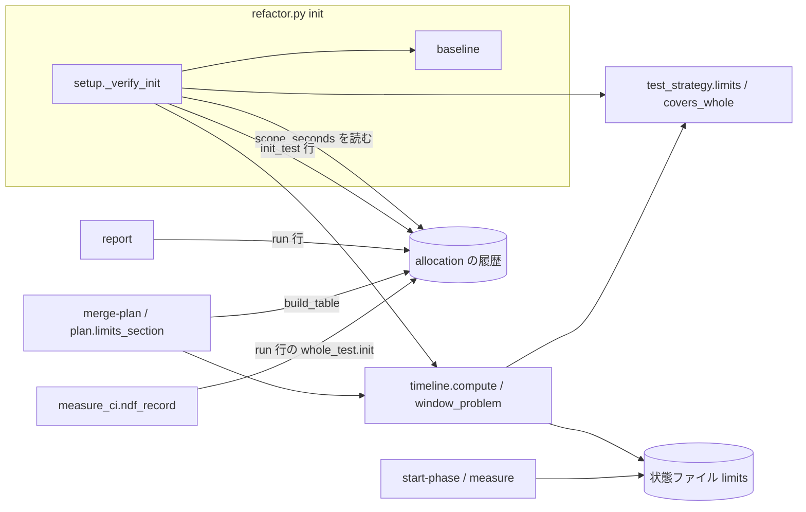
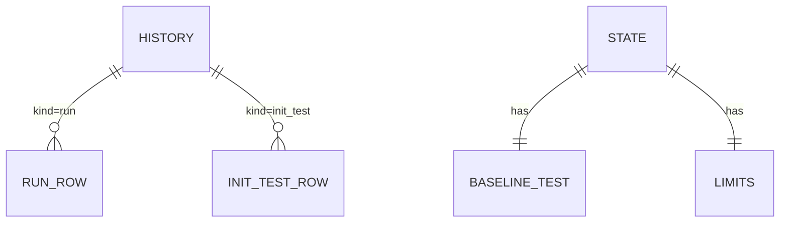
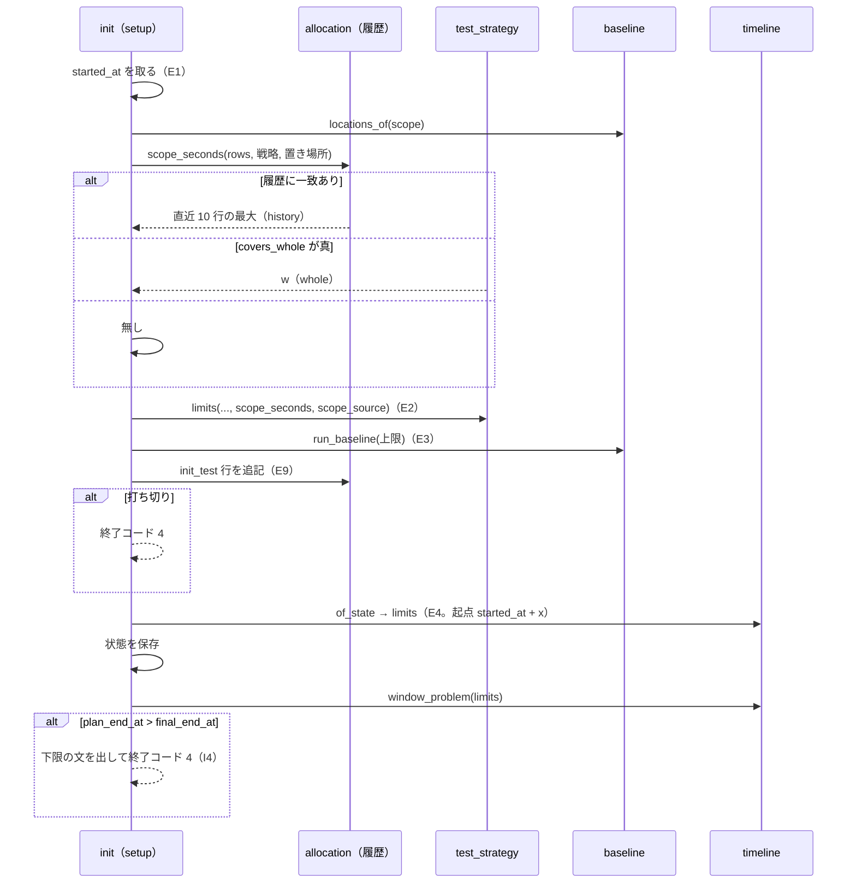

# cross-refactoring: 着手前のテストが長いと提案者が余裕だけで打ち切られ、CI に任せる戦略で範囲が広いと init が打ち切られる → 既定の予算のまま init を通り、提案者が提案の枠を丸ごと使える（#1385 #1555）

## 目的

- **何が壊れているか**: 提案とリファクタリング計画の枠の終わりを `started_at` から数えるため、着手前のテスト（実測 357 秒など）が枠を食い、提案者が余裕（90 秒）だけで起動されて提案 0 件で止まる（#1385）。CI に任せる戦略では着手前のテストの上限が `0.10·B` だけで決まり、範囲の広い実行（320 秒）が 180 秒で打ち切られて init が終了コード 4 で止まる（#1555）
- **誰が困るか**: 既定の `--budget-minutes 30` で cross-refactoring を回す conductor と、検査のプランごとに予算を手で広げている利用者
- **直すと何が成り立つか**: 手順の枠を着手前のテストの終わりから数え、CI に任せる戦略の着手前の上限は範囲テストの所要が分かればそれを下回らない。予算を広げずに init を通り、提案者が `0.20·B` の枠で提案を出す

## 適用範囲

- **働く範囲**: 配布先のどのリポジトリでも働く（cross-refactoring の `init` と、その後の手順の時間の上限）
- **プロジェクトごとに違うもの**: 全体テストの所要 w と suite の受け持つパスは宣言（`.ndf/project.json` の `test` / `test_duration`）、範囲は `--scope`、範囲テストの実測は利用者の手元の履歴から受ける。ai-plugins の値を既定に埋め込まない
- **当たるモード**: `standard`

## あるべき姿の根拠

| 根拠 | 種類 | 何を示すか |
| --- | --- | --- |
| #1370 の検査（PR #1383、2026-09-27）で着手前の全体テスト 356.7 秒の後、propose の上限が `hard timeout 90s` になり提案 0 件 | 実測 | 枠が `started_at` 起点のため、テストの所要がそのまま提案の枠から引かれる |
| スプリント m464（PR 1701、2026-10-03）で既定の 30 分のまま提案の上限 93 秒、3 者とも打ち切り | 実測 | 同じ現象が既定の予算で再発する |
| スプリント m1142c（PR https://github.com/devbasex/ai-plugins/pull/1554 、2026-09-30）で範囲 `plugins/ndf` の着手前のテストが上限 180 秒で打ち切られ、同じ範囲の実測は 320 秒（6632 passed） | 実測 | CI に任せる戦略の上限が範囲テストの所要を見ていない |
| 履歴 `cross-refactoring-allocation.jsonl` の直近 3 行（2026-10-03〜04、予算 60 分）の `whole_test.init` が 299〜341 秒、`phases.propose` が 361〜437 秒 | 実測 | 予算を 60 分へ広げれば提案が出る。広げずに同じ結果を出すのが目的になる |
| 「範囲テストの所要が分かる（前回の実測か、範囲が全体に近いときの `w`）なら、着手前の上限はそれを下回らない。予算を広げずに、範囲の広いスプリントでも init を通れる」 | 利用者の指示の原文 | #1555 の期待する動き |

要求と受け入れ条件は #1385 の本文にある（コピーは `issues/issue-1385-requirements.md`）。この文書は「どう作るか」だけを扱う。

## ドメインモデル

### コンテキスト

| コンテキスト | 何の語が 1 つの意味に決まるか |
| --- | --- |
| `ndf-cross-refactoring` | 想定最大時間・着手前のテスト・手順の枠・範囲テストの所要・配分テーブル |
| `ndf-workflow` | テストの戦略・範囲テスト・全体テスト（共有ライブラリの `test_strategy` が持つ） |

`ndf-workflow`（共有ライブラリの `test_strategy`）が供給者、`ndf-cross-refactoring` が顧客の関係（顧客 / 供給者）。cross-refactoring は
範囲テストの所要を自分で求めて `test_strategy.limits` へ数値として渡し、`test_strategy` は履歴を読まない。supervise も同じ
`limits` の顧客で、予算なしの分岐は変えない。

### 集約

| 集約 | 持ち主（書き換えてよいもの） | 根 | エンティティ | 値オブジェクト |
| --- | --- | --- | --- | --- |
| 実行の状態（状態ファイル） | `refactor.py` の `init`（新規・再開）と `merge-plan` | 状態 | 着手前のテストの記録（`baseline_test`） | 時間の上限の表（`limits`）・上限の入力（`limits.basis`） |
| 配分の履歴（`cross-refactoring-allocation.jsonl`） | `allocation`（追記だけ。`init` と `report` が呼ぶ） | 履歴のファイル | 実行の行（`kind: run`）・着手前のテストの行（`kind: init_test`） | 範囲（テストの置き場所の集合） |

時間の上限の表は `timeline.compute` と `test_strategy.limits` が入力だけから組む値で、状態の外の値を読まない。

### 不変条件

| # | 集約 | 条件 | 破れたときの扱い |
| --- | --- | --- | --- |
| I1 | 実行の状態 | `final_end_at = started_at + B`。着手前のテストの所要に左右されない | 単体テストで落とす |
| I2 | 実行の状態 | `propose_end_at = started_at + x + 0.20·B`、`plan_end_at = propose_end_at + 0.10·B`（x は `baseline_test.seconds`。無ければ 0） | 単体テストで落とす |
| I3 | 実行の状態 | `fix_end_at`・`stop_revert_end_at`・項目の締め切りは `started_at` から数えた今の式のまま | 単体テストで落とす |
| I4 | 実行の状態 | `plan_end_at > final_end_at` の状態で提案者を起動しない。`init` が状態を保存して終了コード 4 で止まり、要る想定最大時間の下限を出す | `init` のテストで落とす |
| I5 | 実行の状態 | CI に任せる戦略の `init_test_timeout` は、範囲テストの所要 s が分かれば `max(0.10·B, 3·s)`、分からなければ `0.10·B`。ほかの戦略と予算なしの値は今と同じ | 単体テストで落とす |
| I6 | 実行の状態 | `limits` は状態に残った入力だけから組み直せる。`init` が着手前のテストに使った上限と、書き出した `init_test_timeout` が一致する | 組み直しのテストで落とす |
| I7 | 配分の履歴 | 範囲テストの所要は、同じ戦略・同じ範囲の `init_test` 行の直近 10 行の秒の最大 → 範囲が全体テストの suite のパスを覆うときの w → 無し、の順に採る | 単体テストで落とす |
| I8 | 配分の履歴 | `init_test` 行は配分テーブルと、全体テストの所要（`ndf-record`）の集計に入らない。実行の行の `whole_test.init` は全体テストを走らせたときだけ値を持つ | 単体テストで落とす |
| I9 | 配分の履歴 | `schema` が 2 未満の行と、`kind` を持たない行は実行の行として読み、範囲の一致には使わない。読んでも落ちない | 単体テストで落とす |

### ドメインイベント

| # | イベント | 発生元 | 受け手 |
| --- | --- | --- | --- |
| E1 | 実行の開始時刻（`started_at`）を記録した | `init` | E4（枠の起点）・I1 |
| E2 | 着手前のテストの上限を決めた | `init`（履歴と宣言から s を求め、`test_strategy.limits`） | E3 |
| E3 | 着手前のテストを終えた（打ち切りを含む） | `baseline.run_baseline` | E9・E4 |
| E9 | 着手前のテストの所要を履歴へ 1 行足した | `init`（`allocation.append_row`） | 次の実行の E2 |
| E4 | 手順の枠の時刻（`limits`）を書き出した | `init`（新規・再開）・`merge-plan` | E5・E6。枠が収まらなければ `init` が止まる（I4） |
| E5 | 指標を測った | `measure` | E6 の前の任意の手順 |
| E6 | 提案者を起動し、提案を集めた | `start-phase propose` | E7 |
| E7 | リファクタリング計画で採る項目を決めた | `merge-plan` | 実装以降 |
| E8 | 実行を記録して履歴へ 1 行足した | `report` | 次の実行の配分テーブル |

E1〜E8 は要求の番号を引き継ぐ。E9 はこの設計で足す。E3 の打ち切りでも E9 は起こり、そのとき行の秒は上限（下限の実測）になる。

### 用語

| 用語 | 意味 | 用語集への反映 |
| --- | --- | --- |
| 着手前のテスト | `init` が改修の前に 1 回走らせるテスト。CI に任せる戦略では `--scope` のテストの置き場所の範囲テスト、ほかは全体テスト（`round-only` はラウンドテストも） | 追加（`ndf-cross-refactoring`） |
| 手順の枠 | 提案とリファクタリング計画に充てる時間。着手前のテストの終わり（`started_at + x`）から `0.20·B` と `0.10·B` | 追加（`ndf-cross-refactoring`） |
| 範囲テストの所要 | CI に任せる戦略で、着手前に走らせる範囲テストの所要の見込み（秒）。履歴の実測か、範囲が全体を覆うときの w | 追加（`ndf-cross-refactoring`） |

## 機能一覧

| # | 機能 | 誰が使うか |
| --- | --- | --- |
| F1 | 手順の枠を着手前のテストの終わりから数える | conductor（`start-phase` / `measure` の上限を受け取る） |
| F2 | 枠が想定最大時間に収まらないとき、提案者を起動せずに止まり、要る想定最大時間の下限を出す | conductor と、予算を決める利用者 |
| F3 | CI に任せる戦略で、着手前のテストの上限に範囲テストの所要を入れる | conductor |
| F4 | 着手前のテストの所要（打ち切りを含む）を、範囲・戦略とともに履歴へ残す | 次の実行の `init` |
| F5 | 上限の入力（範囲テストの所要と出所）を `limits.basis` とリファクタリング計画のコメントに出す | 計画を読む人 |

## 構成要素

| 要素 | 責務 | 変更 |
| --- | --- | --- |
| `plugins/ndf/scripts/lib/test_strategy.py` の `limits` | 上限の表。キーワード引数 `scope_seconds` / `scope_source` を受け、CI に任せる戦略の `init_test_timeout` を I5 で出す。`basis` に `scope_seconds` / `scope_source` を足す | 変える |
| 同 `covers_whole(strategy, locations)` | テストの種別の suite の `paths` の全要素を、テストの置き場所のどれかが覆うか（純粋。glob の要素は `.` の置き場所だけが覆う） | 足す |
| `refactor_lib/timeline.py` の `compute` / `test_limits` | 枠の起点を `started_at + x` にする（I2）。`test_limits` は `baseline_test.scope_seconds` / `scope_source` を `limits` へ渡す（I6） | 変える |
| 同 `window_problem(limits)` | `plan_end_at > final_end_at` なら止める理由の文（要る想定最大時間の下限つき）、収まれば `None`（純粋） | 足す |
| `refactor_lib/allocation.py` | `ROW_SCHEMA = 2`。実行の行に `kind: run`、`whole_test.init` は全体テストのときだけ（I8）。`init_test_row(...)` と `scope_seconds(rows, strategy, locations)`（I7）を足す。`build_table` は実行の行だけを集計する | 変える |
| `refactor_lib/baseline.py` | `locations_of(strategy, scope, work)` を足し、`commands_of` と共有する。打ち切りで止めずに記録を返し（`timed_out: true`・`seconds` は上限）、記録に `locations` を残す | 変える |
| `refactor_lib/commands/setup.py` の `_verify_init` / `_save_initial_state` / `_resume` | 範囲テストの所要を求めて上限に渡す（F3）。着手前のテストの後に履歴へ 1 行足し（F4）、打ち切りならそこで止める。`limits` を書いた後に `window_problem` を見て、保存してから止める（F2。新規と再開の両方） | 変える |
| `refactor_lib/plan.py` の `limits_section` | 入力の行に範囲テストの所要と出所を出す（F5） | 変える |
| `plugins/ndf/scripts/project_lib/measure_ci.py` の `ndf_record` | `kind: init_test` の行を読まない（I8） | 変える |
| `skills/cross-refactoring/docs/02-plan-and-implement.md` の「締め切り」 | 表の 3 行（着手前の上限・提案の枠・計画の枠）と、U1 の止まり方 | 変える |
| `skills/cross-refactoring/docs/04-verify-and-report.md` の「配分テーブル」 | 履歴に 2 種類の行があること（`init_test` は init が書き、最終ゲートの成否を問わない） | 変える |
| `skills/cross-refactoring/SKILL.md` の終了コードの表 | 4 の理由に「着手前のテストが長く、手順の枠が想定最大時間に収まらない」を足す | 変える |
| `CLAUDE.md` の cross-refactoring の節 | 時間の記述に、枠は着手前のテストの終わりから数えることと、CI に任せる戦略の着手前の上限を足す（C7。ゲート 1 の承認で書き換える） | 変える |



図には呼び出しの関係を持つ要素だけを描き、文書（`docs/02`・`docs/04`・`SKILL.md`・`CLAUDE.md`）は含めない。
配置は変わらない（すべて `refactor.py` と共有ライブラリのプロセスの中）。

## データ構造

### 保存する形

履歴は 1 行 1 JSON の追記だけのファイルで、行を上書きしない（時系列は追記で保つ）。主キーは持たず、`kind` で 2 種類に分かれる。



### 着手前のテストの行（`kind: init_test`。新設）

| 列 | 型 | 意味 | 空の値 |
| --- | --- | --- | --- |
| `schema` | int | 2 | — |
| `kind` | str | `init_test` | — |
| `at` | str | 着手前のテストを終えた時刻（`baseline_test.checked_at`） | — |
| `pr` | int | 対象の Pull Request | 取れなければ `null` |
| `budget_minutes` | int | B | — |
| `strategy` | str | 戦略の名前 | — |
| `mode` | str | `whole` / `scope` / `round` | — |
| `locations` | list[str] | テストの置き場所（正規化して並べ替えた集合）。`mode` が `scope` のときだけ | `whole` / `round` は `null` |
| `seconds` | float | 実測の秒。打ち切りなら上限の秒（下限の実測） | — |
| `timed_out` | bool | 上限で打ち切ったか | — |

### 実行の行（`kind: run`。変える）

| 列 | 変更 |
| --- | --- |
| `schema` | 1 → 2 |
| `kind` | `run` を足す |
| `whole_test.init` | `baseline_test.mode` が `whole` / `round` のときだけ秒、`scope` は `null`（I8） |

### 状態ファイル（変える）

| 置き場 | 足す欄 | 意味 | 空の値 |
| --- | --- | --- | --- |
| `baseline_test` | `locations` | 着手前に走らせた範囲テストのテストの置き場所 | `scope` 以外は `null` |
| `baseline_test` | `scope_seconds` / `scope_source` | 上限に使った範囲テストの所要と出所（`history` / `whole`） | 分からなければ両方 `null` |
| `limits.basis` | `scope_seconds` / `scope_source` | 同上の写し（AC10） | 同上 |

### 機能との対応

| 機能 | 履歴の `init_test` 行 | 履歴の `run` 行 | `baseline_test` | `limits` |
| --- | --- | --- | --- | --- |
| F1 | — | — | R | C |
| F2 | — | — | R | R |
| F3 | R | — | C | C |
| F4 | C | — | R | — |
| F5 | — | — | R | R |
| `report` / `merge-plan` / `ndf_record` | 読まない | C / R / R | R | R |

### 移行

- 既存の行は書き換えない。`schema` 1 と `kind` の無い行は実行の行として読み、範囲の一致に使わない（I9）。履歴に `init_test` 行が無い間は、範囲テストの所要は w の覆いだけで決まる
- 既存の `whole_test.init`（`scope` の実行で範囲テストの秒が入った行）は残る。`ndf_record` は直近 10 行の中央値なので、新しい実行の行が積もると押し出される
- `limits` を持つ旧い状態ファイルは書き出した値を使い、持たないものは `of_state` が新しい式で組む。`baseline_test.scope_seconds` が無ければ所要は分からないものとして組む

### 検査の手段

`uv run --frozen --project . --all-extras pytest plugins/ndf/skills/cross-refactoring/tests/test_allocation.py plugins/ndf/scripts/tests -q -n 4`
（行の形と読み飛ばしは単体テストが持つ）。

## 入出力の契約

| 項目 | 内容 |
| --- | --- |
| 置き場所 | 仕様記述のファイルは持たない（CLI と状態ファイル。式の正本は `docs/02-plan-and-implement.md` の「締め切り」） |
| 変わる約束 | `refactor.py init` の終了コード 4 に 2 つの理由が加わる: 手順の枠が想定最大時間に収まらない（状態は保存し、`--budget-minutes` を下限以上にして `init` を打ち直すと着手前のテストを走らせ直さずに続く）、着手前のテストの打ち切り（今と同じ止まり方。打ち切りを履歴に残したことと、次の実行の上限の見込みを 1 行足す）。`state["limits"]` の `propose_end_at` / `plan_end_at` / `init_test_timeout` の値と `basis` の 2 欄が変わる。`test_strategy.limits` はキーワード引数 2 つを足す（既定 `None` で、今の呼び出しはそのまま通る） |
| 互換性の扱い | `refactor.py` の引数は変わらない。supervise（`decl.py`・`verify_steps.py`・`test-run.py`）は予算なしで呼び、新しい引数を渡さないため値は変わらない |
| 検査の手段 | `test_timeline.py`・`test_init.py`・`test_lib_test_strategy.py` の契約のテスト |

止まるときの文（U1）の形:

```text
着手前のテストに <x> 秒かかり、提案とリファクタリング計画の枠（0.30·B = <秒> 秒）が想定最大時間 <B> 分に収まりません。
--budget-minutes を <下限> 以上にして init を打ち直すと、着手前のテストを走らせ直さずに続けます（下限では実装の時間が残りません）
```

下限は `ceil(x / (60 · (1 − PROPOSE_SHARE − PLAN_SHARE)))` 分（x = 1300 秒なら 31 分）。

## 処理の流れ



再開（`init` の打ち直し）は E1〜E3・E9 を通らず、`limits` を組み直した後に `window_problem` だけを見る。範囲テストの所要は
CI に任せる戦略のときだけ求め、ほかの戦略では履歴を読まない。

## 非機能の実現方式

| 大項目 | 要求の条件 | 実現方式 | 確かめ方 |
| --- | --- | --- | --- |
| 性能・拡張性 | 着手前のテストの上限と手順の枠の計算は init と `start-phase` の中で純粋な算術だけで終わり、LLM を呼ばない | `limits` / `compute` / `window_problem` / `covers_whole` / `scope_seconds` は引数だけを読む関数にし、ファイルを読むのは `setup` が履歴を 1 回読むだけにする | 単体テストが時刻と行を引数で渡して値を確かめる |
| 運用・保守性 | 時間の値の入力（B・w・x・c・範囲テストの所要とその出所・着手前のテストの終わり）がすべて `limits.basis` か状態ファイルに残り、計画のコメントから上限の由来を辿れる | `basis` に `scope_seconds` / `scope_source` を足し、着手前のテストの終わりは `started_at` と `basis.x` から読める。`limits_section` の入力の行に範囲テストの所要を出す | 計画のコメントの組み立てのテストが入力の行に 2 つの値を持つことを見る |
| 移行性 | この変更より前の状態ファイル（`limits` を持つもの・持たないもの）と、古い形の履歴の行を読んでも落ちない | 旧い状態は I9 と「移行」の節のとおりに読む | `schema` 1 の行と `limits` の無い状態を入力にしたテスト |

## 決定の記録

### 決定 1: テストの所要を提案の枠から引かないため、手順の枠の起点を `started_at + x` にする

提案とリファクタリング計画の枠の終わりを、着手前のテストの実測 x だけ後ろへずらす。`started_at` は #968 のまま着手前のテストの
前に取り、`final_end_at` も `started_at + B` のままなので、伸びた分はリファクタリング計画で採る件数で吸収する（前提 2）。
起点に `baseline_test.checked_at`（テストを終えた時刻）を使う案は採らなかった。認証確認などテスト以外の準備の時間まで枠から
外れて AC4（テストが 0 秒なら今と同じ）が成り立たず、起点が状態に残った秒の値から決まらなくなる。

根拠: Value 6 / Value 3（MVV 版 2）

### 決定 2: 打ち切られる提案者に費用を使わないため、枠が想定最大時間に収まらなければ init で止める（U1）

`plan_end_at > final_end_at`（x > 0.70·B）なら、状態を保存してから終了コード 4 で止まり、要る想定最大時間の下限を出す。
保存しておくと、利用者が予算を広げて `init` を打ち直したとき、着手前のテストを走らせ直さずに続く（再開は計画の前なら予算を
置き換え、`limits` を組み直す）。枠を残りの時間へ縮めて起動する案は、縮めた枠（90 秒）で提案 0 件になった実測があり、
採らなかった。予算を自動で広げる案は、想定最大時間が利用者の与えた上限であるため採らなかった。

根拠: Value 1 / Value 2 / Value 3（MVV 版 2）

### 決定 3: 範囲テストの所要を範囲ごとに実測から引くため、着手前のテストの行を履歴に別の種類として足す（U2）

`init` が着手前のテストの後に、成否と最終ゲートを問わず `kind: init_test` の 1 行を追記する。打ち切りの行は上限の秒を下限の
実測として残し、次の実行は `3·上限` で走らせる。実行の行（`report` が最終ゲートを通った実行だけ書く）に載せる案は、
中断した実行と init で打ち切られた実行が履歴に残らず、#1555 の実例（範囲が suite の `paths: ["."]` を覆わないリポジトリ）では
いつまでも所要が分からないため採らなかった。この行は配分テーブルと `ndf_record` の集計から外す。

根拠: Value 3 / Value 2（MVV 版 2）

### 決定 4: 走らせる中身が同じ実行だけを比べるため、「同じ範囲」は戦略とテストの置き場所の集合の一致にし、直近 10 行の最大を採る（U2）

着手前に走らせるのは `--scope` そのものではなく、そこから求めたテストの置き場所の範囲テストである。`--scope` の並びの一致は、
テストを含まないパスの増減や並びの違いで同じテストを別の範囲とみなす。直近 1 行でなく最大を採るのは、上限は見込みの上側だけが
要り、打ち切りの行（下限）と実測の行が混ざっても大きい側が正しいためである。窓の 10 行は配分テーブルの `WINDOW` と揃える。

根拠: Value 3 / Value 5（MVV 版 2）

### 決定 5: 宣言の w と実測の両方があるとき、履歴の実測を先に採る

前提 3 の 2 つの出所のうち、同じ範囲を手元で走らせた実測を先に、範囲が全体テストの suite のパスを覆うときの w を次に採る。
w は CI の step の合計（`ci-steps`）などで、手元の並列数で走らせる範囲テストの所要とは測り方が違う。宣言の所要の出所の順
（手元の実測が先）とも揃う。

根拠: Value 3（MVV 版 2）

### 決定 6: 範囲テストの秒が全体テストの所要として読まれないよう、実行の行の `whole_test.init` を全体テストのときだけ書く

`measure_ci.ndf_record` は実行の行の `whole_test.init` を全体テストの所要 w（`ndf-record`）として読むが、CI に任せる戦略では
そこに範囲テストの秒が入っている。この設計で着手前のテストの `mode` を行に持たせるのと同じ区別のため、範囲外として起票せず
この変更で直す（`out-of-scope` の「範囲内へ入れる」）。

根拠: Value 6（MVV 版 2）

### 決定 7: 履歴を読む層を 1 つに保つため、所要は cross-refactoring が求めて `test_strategy.limits` へ数値で渡す

`test_strategy` は supervise と共有の層で、cross-refactoring の履歴の置き場所を知らない。`limits` は秒と出所を受けるだけにし、
求め方（履歴の照合と `covers_whole` の判定の順）は `setup` が持つ。`covers_whole` は suite の `paths` の読み方（`_match_len`）と
同じ層に置くため `test_strategy` に足す。

根拠: Value 6 / Value 5（MVV 版 2）

### 決定 8: 2 つの課題を同じ関数とテストの上で直すため、実装は #1385 の 1 本に寄せる

#1555 の受け入れ内容（AC7〜AC11）は #1385 の実装へ取り込み、#1555 の実装プランは流さない。どちらも `test_strategy.limits`・
`timeline.compute`・`setup._verify_init`・`docs/02` の同じ表と、AC12〜AC14 を触る。分けると同じ行を 2 本の Pull Request が
順に書き換え、文書の表とテストを 2 回直してレビューも 2 回になる。#1555 だけを先に出すと、上限を広げて init を通っても
提案の枠が余裕だけになり（#1385）、提案 0 件のまま利用者に届く価値が無い。

根拠: Value 6 / Value 1（MVV 版 2）

## テスト設計

| 受け入れ条件・不変条件 | どの振る舞いで縛るか | どう壊したら落ちるべきか |
| --- | --- | --- |
| AC1・I2 | `local-full`・B 30・x 357 の `compute` が、提案の枠の終わり = 開始 + 717 秒、計画の枠の終わり = + 897 秒を返す | 起点を `started_at` に戻す |
| AC1・I1 | 同じ入力で `final_end_at` = 開始 + 1800 秒 | 終わりも x だけずらす |
| AC2 | 開始 + 357 秒の時刻で `start-phase propose` が `PHASE_TIMEOUT` 450 を出す | 起点を戻す（90 になる） |
| AC3 | 同じ時刻の `measure_deadline` が 90 | 起点を戻す（0 になる） |
| AC4 | x が 0 と無い（`None`）とき、枠の終わりが開始 + 0.20·B / + 0.30·B | x の欠けで例外にする・既定を 0 以外にする |
| AC5・I3 | 計画の後の `fix_end_at`・`stop_revert_end_at`・項目の締め切りが x に依らない | `budget.fix_end` の起点を枠と同じにずらす |
| AC6・I4 | x 1300・B 30 の `init` が状態を保存して終了コード 4、文に下限 31 分、提案者を起動しない。B 31 で打ち直すと着手前のテストを走らせずに `limits` を組み直して進む | `window_problem` を呼ばない・保存の前に止める・再開で見ない |
| AC7・I5 | CI に任せる戦略・B 30・`scope_seconds` 320 の `limits` が `init_test_timeout` 960 | 戦略の分岐で s を無視する |
| AC8・I7 | 置き場所が suite の `paths` を覆い履歴に一致が無いとき、s = w 424 で 1272。glob の `paths` は `.` の置き場所だけが覆う | 覆いを接頭辞の片側だけで判定する・glob を接頭辞として読む |
| AC9・I5 | s が分からなければ 180 | 分からないときに w を使う |
| AC10 | `limits.basis` と計画のコメントの入力の行に `scope_seconds` と `scope_source`（`history` / `whole` / 無し） | `basis` に写さない・`test_limits` が状態の s を渡さない |
| AC11・E9 | `init` の後に `init_test` 行が 1 行増え、戦略・置き場所・秒を持つ。打ち切りでも上限の秒と `timed_out: true` で増え、次の上限が 3 倍になる | 打ち切りで追記の前に止める・置き場所を並べ替えずに残す |
| AC12・I5 | `local-full` / `round-only` の `init_test_timeout` が `max(0.10·B, 3·w)`、予算なしの表が変更前と同じ値 | s を CI に任せる戦略の外でも使う |
| AC13 | `python3 plugins/ndf/scripts/instructions-check.py --root .` が終了コード 0 | — |
| AC14 | 全体テストが通る | — |
| I6 | `init` が使った上限と、保存した状態から `of_state` で組み直した `init_test_timeout` が一致する | `baseline_test` に s を残さない |
| I7 | 戦略か置き場所の集合が違う行、11 行以上前の行を使わない。一致する行が複数なら最大 | 直近 1 行を採る・並びの一致で比べる |
| I8 | `init_test` 行を混ぜた履歴の `build_table` の値と `source` が、混ぜないときと同じ。`ndf_record` は `init_test` 行と `scope` の実行の行を数えない | `kind` で絞らない |
| I9 | `schema` 1 の行（`kind` 無し）を混ぜても落ちず、範囲の一致に使われない | `kind` の欠けを `init_test` とみなす |

## 設計の結果

| 課題 | 扱い | 取り込み先 | 触るファイル |
| --- | --- | --- | --- |
| #1385 | 実装する | — | `plugins/ndf/scripts/lib/test_strategy.py`、`plugins/ndf/scripts/project_lib/measure_ci.py`、`plugins/ndf/scripts/tests/`、`plugins/ndf/skills/cross-refactoring/scripts/refactor_lib/`、`plugins/ndf/skills/cross-refactoring/tests/`、`plugins/ndf/skills/cross-refactoring/docs/02-plan-and-implement.md`、`plugins/ndf/skills/cross-refactoring/docs/04-verify-and-report.md`、`plugins/ndf/skills/cross-refactoring/SKILL.md`、`CLAUDE.md` |
| #1555 | 取り込む | #1385 | — |

## 未確認のまま残ること

| 項目 | 内容 |
| --- | --- |
| 準備の時間 | `started_at` から着手前のテストの開始までの準備（作業ディレクトリと参加者の認証確認。認証は 1 者 120 秒まで）は今と同じく提案の枠から引かれる。長くなる実例が出たら起点の取り方を見直す（決定 1） |
| 初回の打ち切り | 範囲が suite の `paths` を覆わず履歴にも行が無い最初の実行は、今と同じ `0.10·B` で走り、範囲が広ければ 1 度打ち切られる。2 回目から `3·上限` になる。実物で何回目に通るかはリリース後テストで見る |
| 採れる件数 | 既定の 30 分のまま x が 300 秒を超えるこのリポジトリでは、提案は出ても採れる項目が 0 件に近くなりうる（前提 2）。実物の検証は「提案が 1 件以上出る」までで、採用の件数は測って記録する |
| 古い `whole_test.init` | `scope` の実行で範囲テストの秒が入った既存の行は直らず、直近 10 行の中央値から押し出されるまで `ndf-record` の w に混ざる |
