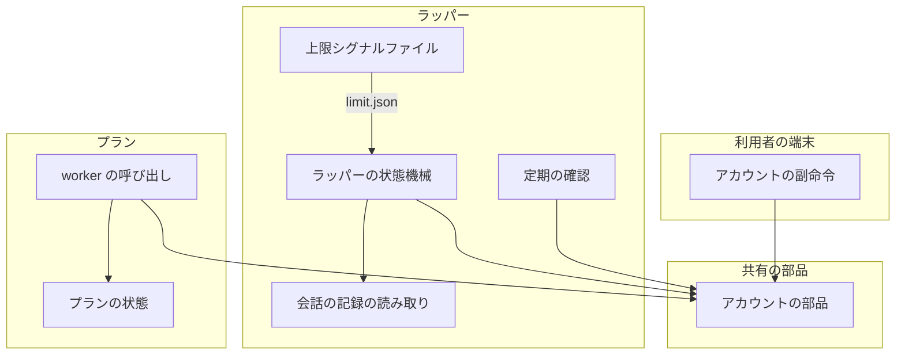
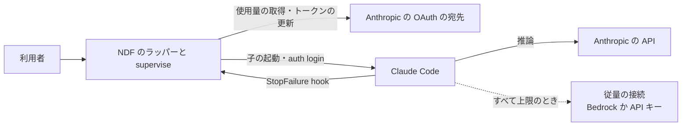
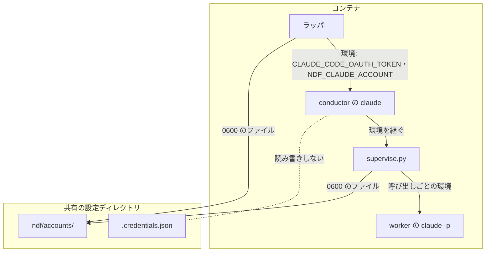
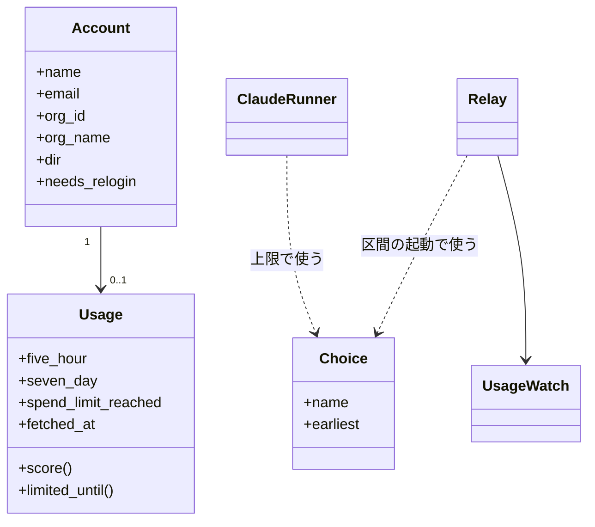
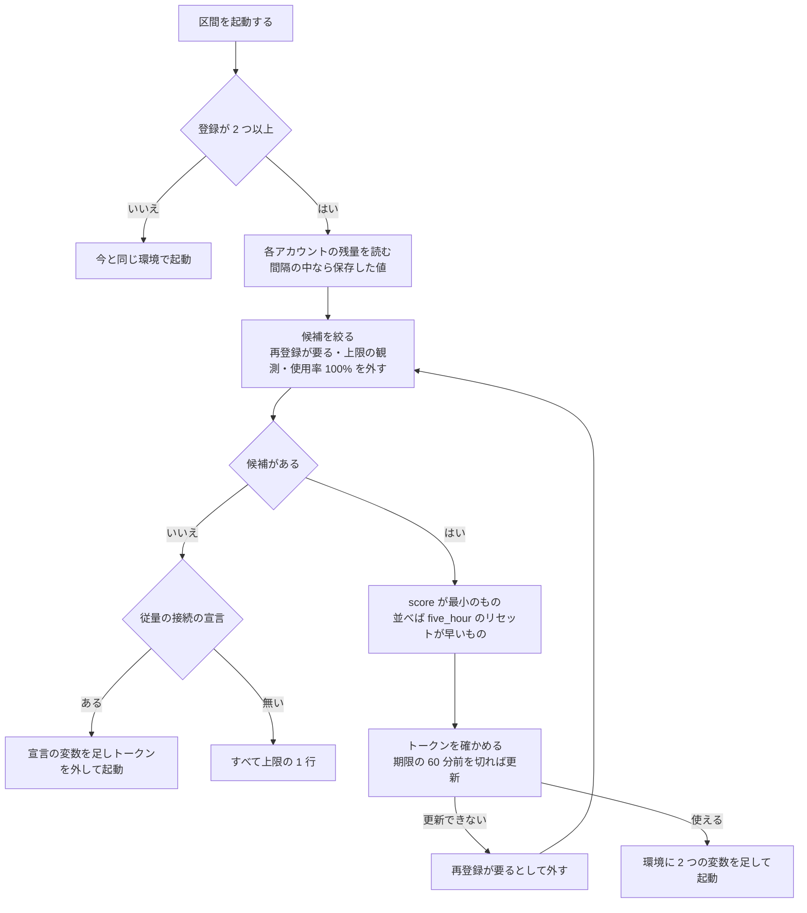
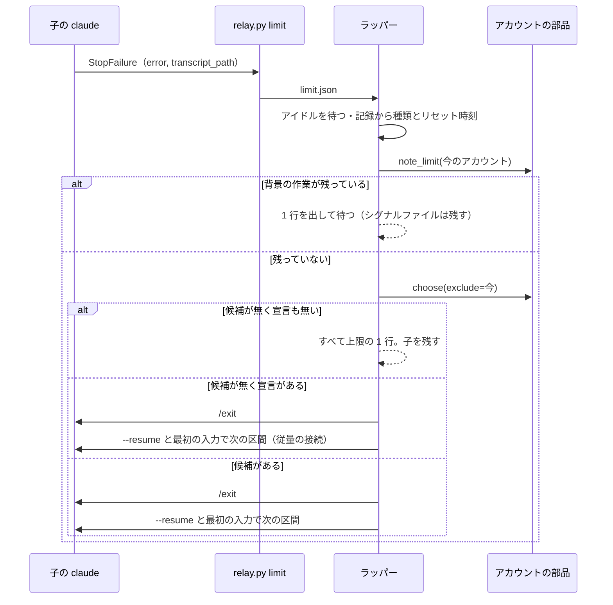
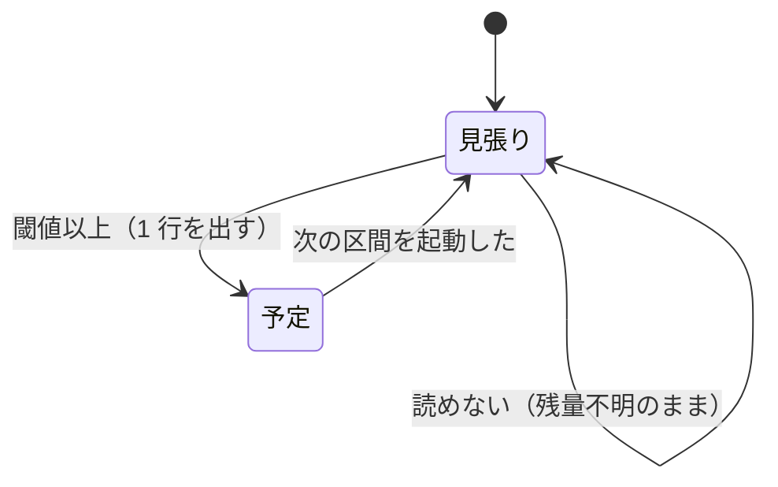
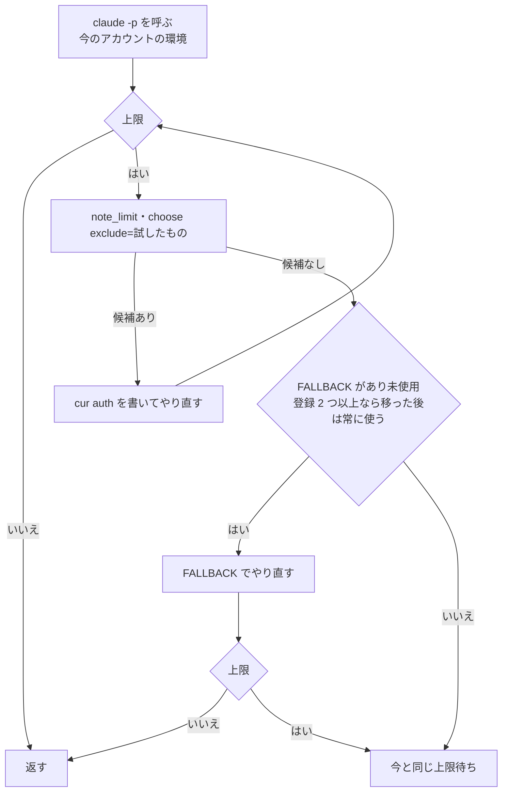
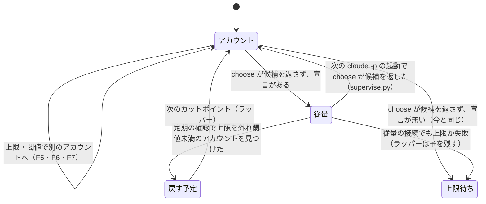

# #1389: ラッパーで複数の claude アカウントを持ち、利用上限の前後で自動で切り替えて作業を続ける

要求と受け入れ条件は #1389 の本文にある（コピーは [issue-1389-requirements.md](issue-1389-requirements.md)）。
この文書は「どう作るか」だけを扱う。決定の記録・テスト設計・未確認のまま残ることは
[issue-1389-design-decisions.md](issue-1389-design-decisions.md) にある。

## 例: セッション 24 の 23:59 UTC に、実装担当の claude が session limit に当たる

**変更の後は、次の順に動く。** 利用者は前もって 2 つのアカウントを登録している（`work1`・`work2`）。

```bash
python3 ~/.claude/ndf/relay.py account add work1   # 端末で claude auth login の手順に従う
python3 ~/.claude/ndf/relay.py account add work2
python3 ~/.claude/ndf/relay.py account list
```

```text
名前   識別                 5 時間         7 日           支出上限  状態
work1  a@example.com        15%（04:59）  3%（09-29）   達していない  使える
work2  b@example.com         2%（05:40）  41%（09-30）  達していない  使える
```

1. 利用者が `claude` と打つ。登録が 2 つあるので、ラッパーは使用率の大きい方が小さい `work1`（15%）を選び、
   子の環境に `CLAUDE_CODE_OAUTH_TOKEN=<work1 のアクセストークン>` と `NDF_CLAUDE_ACCOUNT=work1` を足して区間 1 を起動する
2. conductor が `supervise.py queue` を背景で流す。プランの worker（claude -p）は conductor の環境を継ぎ、`work1` で動く
3. 23:59 UTC、worker が 429 `You've hit your session limit · resets 2:10am (UTC)` を受ける。`ClaudeRunner.call` は
   待たずに、置き場から `work1` 以外で最も上限から遠い `work2` を選び、同じ呼び出しを `work2` のトークンでやり直す。
   ステップの記録に `auth: アカウント work2（five_hour）` が残る
4. 同じころ、conductor 自身の応答も 429 で終わる。Claude Code が `StopFailure` hook を発火し、`relay.py limit` が
   作業ディレクトリへ上限シグナルファイル（`limit.json`）を書く
5. ラッパーはシグナルファイルを読み、会話の記録の最後の合成応答から上限の種類（`five_hour`）を取る。背景のプランがまだ
   動いているので子を終えない。プランが終わって conductor が起こされると、また 429 で `StopFailure` が来る
6. 背景の作業が残っていない状態で上限シグナルファイルを受けた時点で、ラッパーは `work2` を選び、次の 1 行を出して `/exit` を書く

   ```text
   ndf-relay: 利用上限（five_hour）に達したため、アカウントを work1 から work2（b@example.com）へ替えて続ける
   ```

7. 区間 2 を `claude --resume <区間 1 の会話> "<最初の入力>"` で起動する。最初の入力は、会話の記録に未達の `/goal` が
   あれば `/goal <その条件>`、無ければ中断から続ける定型の文である。環境には `work2` のトークンを足す

**共有の `~/.claude/.credentials.json` は 1 度も読み書きしない。** 同じアカウントグループの別のコンテナで動く
claude は、今までどおり共有の認証情報で動き続ける。

**続き: `work2` も上限に当たったとき（セーフティネット）。** 利用者はシェルで従量の接続を宣言している
（`NDF_SUPERVISE_CLAUDE_FALLBACK='CLAUDE_CODE_USE_BEDROCK=1 AWS_PROFILE=… AWS_REGION=us-east-1 …'`）。

8. `work2` の区間で上限シグナルファイルが来る。`choose` は候補を返さない（`work1` は 02:10 まで上限）。宣言があるので、
   ラッパーは次の 1 行を出して `/exit` を書き、区間 3 を宣言の変数を足し `CLAUDE_CODE_OAUTH_TOKEN` を外した環境で
   `--resume` 付きで起動する。`log.jsonl` に `{event: "account", reason: "five_hour", from: "work2", to: "metered"}` が残る

   ```text
   ndf-relay: 登録済みのアカウントはすべて上限にある（最も早く戻るのは work1、11:10）。従量の接続（CLAUDE_CODE_USE_BEDROCK ほか 3 つ）へ替えて続ける
   ```

9. 従量の接続で動く間も、ラッパーの定期の確認は `work1`・`work2` の残量を 300 秒ごとに読む（推論なし）。02:10 を過ぎて
   `work1` の上限が外れると 1 行を出し、次のカットポイント（`ndf-next`）で区間 4 を `work1` で起動する。`log.jsonl` に
   `reason: "recovered"` の行が残る。区間 3 の conductor から起動したプランの worker も、次の claude -p の起動で `work1` へ戻る

## ドメインモデル

### コンテキスト

| コンテキスト | 何の語が 1 つの意味に決まるか |
| --- | --- |
| NDF のラッパー（`ndf-relay`） | 登録済みアカウント・アカウントの置き場・使用率・支出上限・上限シグナルファイル・切り替えの閾値・アカウントの切り替え |
| NDF の開発ワークフロー（`ndf-workflow`） | プラン・ステップ・worker の呼び出しと、その上限待ち |

**`ndf-relay` が供給者、`supervise.py`（`ndf-workflow`）が顧客である（顧客 / 供給者）。** `supervise.py` はアカウントの
置き場を直接読まず、共有の部品（`lib/claude_accounts.py`）が返す「選んだアカウントの名前」と「子へ足す環境」だけを使う。

### 集約

| 集約 | 持ち主（書き換えてよいもの） | 根 | エンティティ | 値オブジェクト |
| --- | --- | --- | --- | --- |
| 登録済みアカウント（アカウントごと） | `lib/claude_accounts.py` | アカウント（名前） | — | 識別（名前・メールアドレス）・認証情報（アクセストークン・リフレッシュトークン・2 つの期限）・残量（2 つの使用率とリセット時刻・支出上限・読んだ時刻）・上限の観測（種類・リセット時刻） |
| 区間のアカウント（ラッパーの 1 回の実行） | `relay_lib/run.py` の `Relay` | 今の区間のアカウントの名前 | — | 切り替えの予定（理由） |
| プランのアカウント（`supervise.py` の 1 回の実行） | `supervise_lib/claude.py` の `ClaudeRunner` | 次の呼び出しのアカウントの名前 | — | 切り替えの理由 |

**置き場のファイルを書くのは `lib/claude_accounts.py` だけである。** ラッパーと `supervise.py` は、その関数を呼んで
選んだ名前と環境を受け取る。上限を観測したときも、観測の記録（`note_limit`）を関数で渡し、ファイルを直接書かない。
上限シグナルファイル（`limit.json`）は集約に含めず、E5 を運ぶ入力として扱う（書き手の約束は I15）。
**区間のアカウントとプランのアカウントは互いを書き換えない。** プランは起動したときの環境の `NDF_CLAUDE_ACCOUNT`
を初めの値として読むだけで、以後は自分で持つ。

### 不変条件

| # | 集約 | 条件 | 破れたときの扱い |
| --- | --- | --- | --- |
| I1 | 登録済みアカウント | 認証情報は置き場（リポジトリの外）の中だけに置く。ファイルは 0600、置き場とアカウントのディレクトリは 0700。トークンを記録・ログ・画面・プロセスの引数へ出さない | 権限が広ければ読む前に 0600 / 0700 へ直す。直せなければそのアカウントを「再登録が要る」として候補から外す |
| I2 | 登録済みアカウント | アカウントを増やすのは `account add` だけである。ラッパー・プラン・worker は登録を増やさない | — |
| I3 | 登録済みアカウント | 同じメールアドレスと組織のアカウントを 2 つ登録しない（1 つのメールアドレスでも組織が違えば利用上限が別の独立したアカウントなので登録できる。どちらかの組織が分からなければ同じとみなす） | 2 つ目の登録を拒み、登録済みの名前と組織名を示す。作ったディレクトリを消す |
| I4 | 登録済みアカウント | 共有の設定ディレクトリの `.credentials.json` を NDF は読まず、書かない | — |
| I5 | 登録済みアカウント | トークンの更新はアカウントごとの排他の中で行い、更新した認証情報を書き戻してから使う。更新で古いアクセストークンが失効するかは未確認のため、動いている区間のアカウント（プランが起動時の `NDF_CLAUDE_ACCOUNT` で受けた名前）はプランが更新しない。更新するのは区間の起動（F4。カットポイントを含む）と、動いている区間が使っていないアカウントを渡すときだけである。プランは動いている区間のアカウントの期限が切れていれば、更新せずに候補から外して別のアカウントを選ぶ | 書き戻せなければ新しいトークンを使わず、そのアカウントを「再登録が要る」とする |
| I6 | 登録済みアカウント | 使用量の取得先は、1 アカウントにつき `NDF_ACCOUNT_CHECK_INTERVAL`（既定 300 秒）に 1 回までしか呼ばない。プロセス・コンテナをまたいで数える | 間隔の中なら取得せず、保存した残量を使う |
| I7 | 登録済みアカウント | 最も上限から遠いアカウントの選び方は前提 4 のとおりで、同じ入力には同じ名前を返す | — |
| I8 | 区間のアカウント・プランのアカウント | 登録が 1 つ以下なら、子の環境に認証の変数を足さず、上限と閾値で何もしない。`supervise.py` は今の `NDF_SUPERVISE_CLAUDE_FALLBACK` と上限待ちのまま | 今と同じ振る舞いとの比較のテストが落ちる |
| I9 | 区間のアカウント・プランのアカウント | 動いている claude の認証を替えない。アカウントが効くのは、区間の起動と claude -p の起動の時点だけである | — |
| I10 | 区間のアカウント | 閾値による切り替えは、カットポイント（`ndf-next` のシグナルファイルで `/exit` するとき）でだけ行う | — |
| I11 | 区間のアカウント | 上限シグナルファイルを受けても、子に背景の作業が残っている間は子を終えない | シグナルファイルを残して待つ。次のシグナルファイルか、背景の作業の終わりで判定し直す |
| I12 | 区間のアカウント・プランのアカウント | 切り替えのたびに、時刻・理由・替える前と後の名前を記録に 1 行残す | — |
| I13 | 登録済みアカウント | 「再登録が要る」アカウントは切り替えの候補にしない | — |
| I14 | すべて | 切り替えの判断・選び方・再認証に LLM を呼ばない | — |
| I16 | 区間のアカウント・プランのアカウント | 従量の接続へ移るのは、登録が 2 つ以上あり、`choose` が候補を返さず、宣言があるときだけである。移った子の環境に登録済みアカウントのトークンを入れず、登録済みアカウントで起動する子の環境に宣言のキーを入れない（混ぜない）。宣言の値を記録・画面・引数へ出さない（変数の名前だけ） | 宣言が無ければ今と同じ（受け入れ条件 4・上限待ち） |
| I17 | 区間のアカウント・プランのアカウント | 従量の接続で動いている間も登録済みアカウントの残量を読み続け、上限を外れ閾値未満のアカウントがあれば、次のカットポイント（ラッパー）か次の claude -p の起動（`supervise.py`）で戻す。作業の途中で子を終えない | 取得先が使えなければ、上限の観測のリセット時刻の後に戻す |
| I15 | 区間のアカウント | 上限シグナルファイルを作るのは `StopFailure` hook（`relay_lib/mark.py` の `cmd_limit`）だけである。`Relay` は読み、読んだ内容と同じときだけ消す | 内容が読んだときと違えば消さずに残し、次の判定で読み直す |

### ドメインイベント

| # | イベント | 発生元 | 受け手 |
| --- | --- | --- | --- |
| E1 | 利用者がアカウントを登録した | `relay.py account add` | 置き場（アカウントのディレクトリ） |
| E2 | 登録済みのアカウントの残量を読んだ | `claude_accounts.usage`（定期の確認・選ぶ直前・一覧） | 置き場（`usage.json`）・選び方 |
| E3 | アクセストークンを更新した | `claude_accounts.token`（期限の 60 分前を切っていたとき） | 置き場（`.credentials.json`） |
| E4 | 今のアカウントの使用率が閾値を超えた | ラッパーの定期の確認 | `Relay`（切り替えの予定を立て、次のカットポイントで E6 へ） |
| E5 | 子の claude が上限に達した | `relay.py limit`（`StopFailure` hook）と会話の記録 | `Relay`（E6 へ）・置き場（上限の観測） |
| E6 | 切り替え先のアカウントを選んだ | `claude_accounts.choose` | `Relay`（E7 へ）・`ClaudeRunner`（E10 へ） |
| E7 | 子の claude を終えた | `Relay.write_exit` → `end_child` | `Relay`（E8 へ） |
| E8 | 切り替え先のアカウントで次の区間を起動し、同じミッションを再開した | `Relay.start_section` | ラッパーの記録（`log.jsonl` の `account` の行）・画面の 1 行 |
| E9 | すべてのアカウントが上限にあると知らせた | `Relay` / `ClaudeRunner` | 宣言があれば E11 へ。無ければ画面の 1 行（ラッパー）・今の上限待ち（`supervise.py`） |
| E10 | worker の呼び出しを別のアカウントでやり直した | `ClaudeRunner.call` | プランの状態（`st.cur["auth"]`）・置き場（上限の観測） |
| E11 | 従量の接続へ移った | `Relay.start_section` / `ClaudeRunner.call` | ラッパーの記録（`to: "metered"`）・画面の 1 行・プランの状態（`auth`） |
| E12 | 登録済みのアカウントへ戻した | `UsageWatch`（戻す予定）→ `Relay.start_section` / `ClaudeRunner.call`（起動のたびの `choose`） | ラッパーの記録（`reason: "recovered"`）・画面の 1 行・プランの状態（`auth`） |

### 用語

| 用語 | 意味 | 用語集への反映 |
| --- | --- | --- |
| 登録済みアカウント | 利用者が登録のコマンドで認証情報を預けた claude のアカウント。アカウントの切り替えの候補になる | 追加済み（要求） |
| アカウントの切り替え | 次に起動する claude を、別の登録済みアカウントの認証で起動すること。動いているプロセスの認証は替えない | 追加済み（要求） |
| 使用率 | `api/oauth/usage` が返す `five_hour` / `seven_day` の `utilization`（%） | 追加済み（要求） |
| 支出上限 | 追加利用の支出の上限（`individual spend limit`） | 追加済み（要求） |
| アカウントの置き場 | 登録済みアカウントごとの設定ディレクトリを並べた `${CLAUDE_CONFIG_DIR:-~/.claude}/ndf/accounts/`。書くのは `lib/claude_accounts.py` だけ | 追加（`ndf-relay`） |
| 上限シグナルファイル | 子の claude の応答が API の失敗で終わったときに `StopFailure` hook が作業ディレクトリへ書く `limit.json` | 追加（`ndf-relay`） |
| 従量の接続 | 利用上限の無い、使った分だけ費用が掛かる接続（Bedrock か API キー）。登録済みアカウントがすべて上限のときだけ使う | 追加（`ndf-relay`） |
| 従量の接続の宣言 | 従量の接続で起動する子へ足す変数の並び。`NDF_SUPERVISE_CLAUDE_FALLBACK`（`KEY=VALUE` を空白区切り）に利用者が書く | 追加（`ndf-relay`） |
| 切り替えの閾値 | 今のアカウントの使用率がこれを超えたら、次のカットポイントで別のアカウントへ替える値（`NDF_ACCOUNT_SWITCH_AT`、既定 90%） | 追加（`ndf-relay`） |

## 機能一覧

| # | 機能 | 誰が使うか |
| --- | --- | --- |
| F1 | アカウントを登録する（`account add <名前>`） | 利用者 |
| F2 | 登録済みのアカウントと残量を一覧する（`account list`） | 利用者 |
| F3 | アカウントの登録を外す（`account remove <名前>`） | 利用者 |
| F4 | 区間を、最も上限から遠い登録済みアカウントで起動する | ラッパー |
| F5 | 子の claude が上限に達したら、別のアカウントで次の区間を起動して続ける | ラッパー |
| F6 | 今のアカウントの使用率を定期的に読み、閾値を超えたら次のカットポイントで替える | ラッパー |
| F7 | worker の呼び出しが上限に当たったら、待たずに別のアカウントでやり直す | `supervise.py` |
| F9 | すべての登録済みアカウントが上限のとき従量の接続へ移り、上限が外れたアカウントへ戻す | ラッパー・`supervise.py` |
| F8 | 期限を過ぎたトークンを更新し、更新できないアカウントを「再登録が要る」とする | F2・F4〜F7 の中で |

## 構成要素

| 要素 | 責務 | 新設 / 変更 |
| --- | --- | --- |
| アカウントの部品（`plugins/ndf/scripts/lib/claude_accounts.py`） | 置き場の読み書き（登録・一覧・削除）、トークンの更新、使用量の取得と保存、上限の観測の保存、最も上限から遠いアカウントの選び方、上限の文言と記録の分類、子へ足す環境の組み立て（アカウントと従量の接続の両方。混ぜない）、従量の接続の宣言の読み取り（`fallback_env` を `supervise_lib/claude.py` から移す）。ラッパーと `supervise.py` が同じものを使う | 新設 |
| アカウントの副命令（`relay_lib/accounts.py`） | `relay.py account add\|list\|remove` の入出力。登録では専用の設定ディレクトリで `claude auth login` を起動する | 新設 |
| 上限シグナルファイル（`relay_lib/mark.py` の `cmd_limit`） | `StopFailure` hook の入力を読み、ラッパーの直接の子なら作業ディレクトリへ `limit.json` を書く | 変更 |
| 副命令の振り分け（`relay_lib/__init__.py`・`relay_lib/runtime.py`） | `limit`（hook。例外でも 0）と `account` を足す。使い方の 1 行を直す。環境が無いときの表で、`limit` を `PASS`（0 を返す hook の副命令）へ、`account` を `PREPARE`（環境を用意してから動く副命令）へ足す | 変更 |
| 会話の記録の読み取り（`relay_lib/claude.py`） | 最後の合成応答から上限の種類とリセット時刻を読む（`limit_of`）。未達の `/goal` の条件を読む（`unmet_goal`）。背景の作業が残っているかを読む（`background_open`）。区間の環境にアカウントの環境を重ねる（`section_env`） | 変更 |
| ラッパーの状態機械（`relay_lib/run.py` の `Relay`） | 区間の起動ごとのアカウントの選択（候補が無く宣言があれば従量の接続）、上限シグナルファイルの判定と切り替え、定期の確認の起動と閾値・戻りの判定、`ndf-relay:` の 1 行と `account` の記録 | 変更 |
| 定期の確認（`relay_lib/run.py` の `UsageWatch`） | 別スレッドで、間隔ごとに今のアカウントの使用率を読み、閾値を超えたら印を立てる。従量の接続で動く間はすべての登録済みアカウントを読み、戻せるアカウントがあれば戻す印を立てる。取得に失敗しても中継を止めない | 新設 |
| ラッパーの複製の対象（`relay_lib/version_dir.py` の `LIB_FILES`） | `lib/claude_accounts.py` を足す（バージョンディレクトリからも読めるように） | 変更 |
| hook の定義（`plugins/ndf/hooks/claude.json`） | `StopFailure` に `relay.py limit` を足す（`NDF_RELAY_DIR` があるときだけ動く。`Stop` の `mark` と同じ形） | 変更 |
| worker の呼び出し（`supervise_lib/claude.py` の `ClaudeRunner`） | 呼び出しごとにアカウントの環境を足す。上限に当たったら、登録済みアカウント → `NDF_SUPERVISE_CLAUDE_FALLBACK` → 上限待ちの順に試す。従量の接続へ移った後は、起動のたびに `choose` で戻れるかを確かめる。`limit_reset_at` はアカウントの部品へ移し、ここからはそれを呼ぶ | 変更 |
| プランの状態（`supervise_lib/state.py`） | 切り替えたアカウントの名前を `switched` に残し、要約の「認証」の行に出す | 変更 |
| ラッパーの説明（`skills/development-workflow/references/relay.md`） | 登録・一覧・削除のコマンド、切り替えの条件、設定の環境変数、`ndf-relay:` の文面 | 変更 |

### 構成要素図



構成要素図と処理の流れの図には、副命令の振り分け・ラッパーの複製の対象・hook の定義・ラッパーの説明を描かない。
呼び出しの経路を持たない配線と文書である。

### システム構成図（文脈）



外部の系は Claude Code と Anthropic の 2 つと、利用者が宣言したときだけ従量の接続（Bedrock か Anthropic API の API キー）である。
NDF は従量の接続を直接呼ばない。宣言の変数を子の環境へ足すだけで、呼ぶのは Claude Code である。使用量の取得先とトークンの更新の宛先は公開の文書が無く、形が変わりうる。

### 配置



**境界をまたいで流れるのはアクセストークンだけで、環境変数として渡す。** 引数には載せない（`ps` に見えない）。
環境は同じ利用者の `/proc/<pid>/environ` からしか読めない。置き場は共有の設定ディレクトリの中にあり、同じアカウント
グループのコンテナで共有される（登録は 1 度でよい）。共有の `.credentials.json` はどのプロセスからも書き換えない。

### 置き場所

```text
plugins/ndf/
├── hooks/claude.json                     # 変更: StopFailure → relay.py limit
├── scripts/
│   ├── lib/claude_accounts.py            # 新設
│   ├── relay_lib/
│   │   ├── __init__.py                   # 変更: limit・account
│   │   ├── runtime.py                    # 変更: PASS・PREPARE
│   │   ├── accounts.py                   # 新設: account add|list|remove
│   │   ├── claude.py                     # 変更: limit_of・unmet_goal・background_open・section_env
│   │   ├── mark.py                       # 変更: cmd_limit
│   │   ├── run.py                        # 変更: Relay・UsageWatch
│   │   └── version_dir.py                # 変更: LIB_FILES
│   ├── supervise_lib/
│   │   ├── claude.py                     # 変更: ClaudeRunner.call
│   │   └── state.py                      # 変更: 認証の行
│   └── tests/
│       ├── test_claude_accounts.py       # 新設
│       └── test_relay.py                 # 変更
└── skills/development-workflow/references/relay.md   # 変更
```

## 構造



| 型 | 責務 |
| --- | --- |
| `Account` | 置き場の 1 アカウント。`needs_relogin` はリフレッシュトークンの期限切れか更新の失敗で真 |
| `Usage` | 残量。`score()` は `max(five_hour, seven_day)` の使用率。`limited_until()` は上限にあるならそのリセット時刻（支出上限で時刻が無ければ無限）、無ければ None。保存した上限の観測もここへ重ねる |
| `Choice` | 選んだ名前（無ければ None）と、すべて上限のときの最も早く戻るアカウントと時刻 |
| `UsageWatch` | 定期の確認のスレッド。`due` の印と、最後に読んだ `Usage` を持つ |

## データ構造

### 保存する形

```text
${NDF_ACCOUNTS_DIR:-${CLAUDE_CONFIG_DIR:-~/.claude}/ndf/accounts}/   0700
├── work1/                        0700。claude の設定ディレクトリ（auth login の書き先）
│   ├── .credentials.json         0600。claude が書き、更新の後は NDF が書き戻す
│   ├── .claude.json              claude が書く。oauthAccount.emailAddress を読む
│   ├── account.json              0600。NDF が書く
│   └── usage.json                0600。NDF が書く
├── work1.lock                    アカウントごとの排他（lib/locks.py）
└── work2/ …
```

**アカウントの名前が主キーである。** 名前は `[a-z0-9][a-z0-9_-]{0,31}`。`metered` は従量の接続を表す予約の名前で、登録できない。メールアドレスと組織の組は置き場の中で一意（I3）。

| ファイル・列 | 型 | 空を許すか | 意味 |
| --- | --- | --- | --- |
| `.credentials.json` の `claudeAiOauth.accessToken` | 文字列 | 許さない | 子の `CLAUDE_CODE_OAUTH_TOKEN` と使用量の取得に使う |
| 同 `refreshToken` | 文字列 | 許さない | 更新に使う。更新のたびに新しい値へ置き換わる |
| 同 `expiresAt` / `refreshTokenExpiresAt` | 整数（ミリ秒） | 許さない | アクセストークン / リフレッシュトークンの期限 |
| 同 `scopes` | 文字列の配列 | 許さない | `user:profile` が無ければ使用量を読めない（残量不明として扱う） |
| `account.json` の `name` / `email` | 文字列 | 許さない | 識別。`email` は登録のときに `claude auth status` から読む |
| 同 `org_id` / `org_name` | 文字列 | 許す（列ごと無くてよい） | 組織。登録のときに `claude auth status` の `orgId` / `orgName` から読む。組織を記録する前の登録には無い |
| 同 `registered_at` | ISO 8601 | 許さない | 登録した時刻 |
| 同 `needs_relogin` | 真偽 | 許さない | 真なら候補から外し、一覧に「再登録が要る」と出す。再登録（同じ名前の `add`）で偽に戻る |
| 同 `limit` | オブジェクト | 許す | 最後に観測した上限（`type`・`resets_at`・`observed_at`）。空は「観測していない」。`resets_at` を過ぎたら読む側が無視する |
| `usage.json` の `fetched_at` | ISO 8601 | 許さない | 最後に取得先を呼んだ時刻（成否を問わない）。I6 の間隔はこれで数える |
| 同 `five_hour` / `seven_day` | `{utilization, resets_at}` | 許す | 空は「読めなかった」（残量不明）。0 の使用率とは違う |
| 同 `spend_limit_reached` | 真偽 | 許す | `extra_usage.spend_limit_reached`。空は「読めなかった」 |
| 同 `error` | 文字列 | 許す | 最後の取得の失敗の理由（`http-401`・`timeout`・`shape` など）。空は「成功」 |

**`usage.json` は最新の 1 件だけを持つ（上書き）。** 切り替えの履歴はラッパーの記録（`log.jsonl` の `account` の行）と
プランの状態が持つ。理由は決定 11。

### 機能との対応

| 機能 | `.credentials.json` | `.claude.json` | `account.json` | `usage.json` |
| --- | --- | --- | --- | --- |
| F1 登録する | C（claude が書く） | C（claude が書く）・R | C | — |
| F2 一覧する | R・U（更新） | — | R・U（`needs_relogin`） | R・U |
| F3 登録を外す | D | D | D | D |
| F4・F6 区間の起動・定期の確認 | R・U | — | R・U | R・U |
| F5・F7 上限の後の切り替え | R・U | — | R・U（`limit`） | R・U |

書く相手が多いのは F2・F4〜F7 だが、すべて `lib/claude_accounts.py` の中の 1 アカウントの排他の中で閉じる。
**移行は無い。** 既存のデータは変えず、置き場が無い・空のときは登録が 0 個として扱う（I8）。

## 入出力の契約

### アカウントの副命令

`python3 ~/.claude/ndf/relay.py account <副命令>`（プラグインの `scripts/relay.py` からも同じ）。**登録は端末から打つ**
（`claude auth login` が URL を示し、認可コードの貼り付けを待つため）。

| 副命令 | 入力 | 成功の出力 | 失敗の形 |
| --- | --- | --- | --- |
| `add <名前>` | 名前（必須）。標準入力が端末であること | 標準出力に `登録した: <名前>（<メール>）`。終了コード 0。同じ名前が「再登録が要る」なら置き直す | 名前の形が違う・端末でない → 2。ログインが通らない → 1。同じメールが別の名前で登録済み → 1（`登録済み: <名前>`）。どれも作りかけのディレクトリを消す |
| `list [--json]` | なし | 1 行 1 アカウントの表（名前・識別・5 時間と 7 日の使用率とリセット時刻・支出上限・状態）。`--json` は同じ中身の配列。終了コード 0。登録が 0 個なら `登録済みのアカウントは無い` | 置き場が読めない → 1 |
| `remove <名前>` | 名前 | `外した: <名前>`。終了コード 0。専用の設定ディレクトリで `claude auth logout` を打ってから消す（logout の失敗は 1 行添えて続ける） | 無い名前 → 1 |

状態の列は `使える`・`上限（<リセット時刻>）`・`支出上限`・`残量不明`・`再登録が要る` の 5 つ。`list` は推論を呼ばない
（呼ぶのは使用量の取得先とトークンの更新の宛先だけ）。取得は I6 の間隔を守り、間隔の中なら保存した残量を出す。

### 上限シグナルファイル（hook）

| 項目 | 内容 |
| --- | --- |
| 名前 | `relay.py limit`（`StopFailure` hook から） |
| 入力 | 標準入力の JSON。使う項目は `error`・`transcript_path`・`session_id`・`cwd`・`last_assistant_message`（2.1.283 で実測。`background_tasks` は無い） |
| 出力 | `NDF_RELAY_DIR` のラッパーが動いていて、呼んだ claude がその直接の子のときだけ、`limit.json` に `{written_at, error, transcript_path, session_id, cwd}` を 0600 で書く。トークンと応答の本文は書かない |
| 失敗の形 | 常に終了コード 0（`StopFailure` の出力と終了コードは Claude Code が無視する） |
| 互換性 | 新しい hook。`Stop` の `mark` は変えない |

### 環境変数

| 変数 | 誰が読むか | 意味 | 既定 |
| --- | --- | --- | --- |
| `CLAUDE_CODE_OAUTH_TOKEN` | Claude Code | ラッパーと `supervise.py` が子へ足す。選んだアカウントのアクセストークン | 足さない（登録が 1 つ以下） |
| `NDF_CLAUDE_ACCOUNT` | `supervise.py` | 子へ足すアカウントの名前。プランが初めのアカウントとして読む。`metered` は従量の接続で動いていること | 同上 |
| `NDF_SUPERVISE_CLAUDE_FALLBACK` | 部品（ラッパー・`supervise.py`） | 従量の接続の宣言（`KEY=VALUE` を空白区切り）。今の意味（`supervise.py` の上限の後に 1 度試す変数）を保ったまま、登録が 2 つ以上のときはラッパーも読む | 無い（今と同じ） |
| `NDF_ACCOUNT_CHECK_INTERVAL` | 部品 | 使用量の取得の最短の間隔（秒）。定期の確認の間隔も兼ねる | 300 |
| `NDF_ACCOUNT_SWITCH_AT` | ラッパー | 切り替えの閾値（%）。100 以上なら閾値による切り替えをしない | 90 |
| `NDF_ACCOUNTS_DIR` | 部品 | 置き場の場所（試験用） | `${CLAUDE_CONFIG_DIR:-~/.claude}/ndf/accounts` |

**既存の環境変数の意味は変えない。** `NDF_SUPERVISE_CLAUDE_FALLBACK` は、登録済みのアカウントを試し尽くした後に移る先である。
移った後は、登録済みアカウントの上限が外れるまで同じプランの以後の呼び出しも従量の接続で起動する（決定 10・14）。
登録が 1 つ以下なら今と同じ順で、呼び出しごとに 1 度だけ試す。利用者のシェルが `CLAUDE_CODE_OAUTH_TOKEN` を持っていても、登録が 2 つ以上あれば
子の値は選んだアカウントのものに置き換わる。

### 画面の 1 行と記録

| 場面 | `ndf-relay:` の 1 行 | `log.jsonl` の行 |
| --- | --- | --- |
| 区間の起動（登録が 2 つ以上） | 区間 1 だけ `アカウント <名前>（<メール>）で起動する` | `start` の行に `account: <名前>` を足す |
| 上限の後の切り替え | `利用上限（<種類>）に達したため、アカウントを <前> から <後>（<メール>）へ替えて続ける` | `{event: "account", at, section, reason: <種類>, from, to}` |
| 閾値による切り替え | `<前> の使用率が <n>% に達したため、アカウントを <後>（<メール>）へ替える` | `{event: "account", …, reason: "threshold", usage: <n>}` |
| 閾値を超えた（定期の確認） | `<前> の使用率が <n>% を超えた。次のカットポイントで替える`（1 度だけ） | — |
| すべて上限（宣言なし） | `登録済みのアカウントはすべて上限にある。最も早く戻るのは <名前>（<手元の時刻>）。子はこのまま残す` | `{event: "account", …, reason: <種類>, to: null, earliest}` |
| 従量の接続へ移った（宣言あり） | `登録済みのアカウントはすべて上限にある（最も早く戻るのは <名前>、<手元の時刻>）。従量の接続（<変数の名前>）へ替えて続ける` | `{event: "account", at, section, reason: <種類>, from, to: "metered", keys: [<変数の名前>], earliest}` |
| 戻せるアカウントが出た（定期の確認） | `<名前> の上限が外れた。次のカットポイントで従量の接続から戻す`（1 度だけ） | — |
| 戻した | `<名前>（<メール>）の上限が外れたため、従量の接続からアカウント <名前> へ戻して続ける` | `{event: "account", at, section, reason: "recovered", from: "metered", to: <名前>}` |
| 背景の作業が残っている | `上限（<種類>）に達したが、背景の作業が残っているため終わるまで替えない`（シグナルファイルごとに 1 度） | — |

種類は `five_hour`・`seven_day`・`spend`・`unknown` の 4 つ。`auth`（認証の失敗）は理由にだけ現れる（下の「処理の流れ」）。

**プランの状態:** 替えたとき `st.cur["auth"]` に `アカウント <名前>（<種類>）` を書き、`st.switched` に `アカウント <名前>` を足す（要約の「認証」の行に出る）。FALLBACK は今と同じ書き方（`切り替え（<変数の名前>）`）。登録が 2 つ以上で従量の接続へ移ったときは
`従量の接続（<変数の名前>）`、戻したときは `アカウント <名前>（recovered）` を書く。宣言の値は書かない。

### 外の宛先（呼ぶ側の約束）

| 宛先 | 要求 | 使う応答 | 失敗の扱い |
| --- | --- | --- | --- |
| `GET https://api.anthropic.com/api/oauth/usage` | `Authorization: Bearer <アクセストークン>`・`anthropic-beta: oauth-2025-04-20`。上限 10 秒 | `five_hour.utilization`・`five_hour.resets_at`・`seven_day.*`・`extra_usage.spend_limit_reached`（2026-09-28 01:13 UTC に形を実測） | 200 以外・通信の失敗・形の違い → 残量不明（`error` に理由）。401 なら 1 度だけ更新してやり直す |
| トークンの更新（Claude Code が使う `https://platform.claude.com/v1/oauth/token`。2.1.283 の本体に含まれる宛先） | `grant_type=refresh_token` とリフレッシュトークン | 新しいアクセストークン・リフレッシュトークン・期限 | 失敗 → `needs_relogin` を真にする |

## 処理の流れ

### 区間の起動（F4）

区間を起動する直前（区間 1・カットポイント・上限の後のすべて）に、`claude_accounts.choose(exclude)` を呼ぶ。登録が 1 つ以下
なら呼ばずに今と同じ環境で起動する（I8）。



**上限に達していない候補の中に残量が読めるアカウントが 1 つも無いときだけ、残量不明のアカウントを候補にする**（前提 4。上限に達したアカウントは読めても数えない）。そのときは名前の順で選ぶ。
**区間 1 で候補が無く宣言も無いときは、今と同じ環境で起動する。** 起動できないまま止まるより、利用者の既定のログインで動くほうが
今の振る舞いに近い。

### 上限の後の切り替え（F5）



- **引き金は `error` が `rate_limit` か `billing_error` のシグナルファイルだけである。** `overloaded`・`server_error` などは上限では
  ないので読み捨てる（シグナルファイルを消す）
- **`authentication_failed` は、今のアカウントが登録済みなら 1 度だけ扱う。** 更新してから同じアカウントを含めて選び直し、
  理由を `auth` として切り替える。更新できなければ `needs_relogin` を真にして別のアカウントを選ぶ。登録が 1 つ以下なら
  何もしない（今と同じ）
- **種類は会話の記録の最後の合成応答から読む。** `quotaLimits.rateLimitType` があればそれ（`five_hour`・`seven_day`）、
  無ければ本文の `spend limit` で `spend`、どちらでもなければ `unknown`。リセット時刻は `quotaLimits.resetsAt`、
  無ければ本文から `supervise_lib.claude.limit_reset_at` と同じ規則で読む（その関数を部品へ移し、両方が使う）
- **判定は既存のカットポイントと同じ門を通す。** アイドル（`NDF_RELAY_QUIET`）・質問の表示中でない・停止シグナルファイルが無い・
  起動の数の上限（`StartLimit`）。シグナルファイルの後に利用者が入力したら、シグナルファイルを消して何もしない
- **背景の作業は会話の記録から読む。** `run_in_background` が真の Tool の呼び出しのうち、終わりの通知の行がまだ無いものと、
  発火の前の `ScheduleWakeup`（`pending_wakeups`）があれば「残っている」とする。読めないときも「残っている」とする（I11）
- **`ndf-next` のシグナルファイルが同時にあれば、それを最初の入力にする**（新しい会話）。無ければ `--resume <シグナルファイルの session_id>` で
  同じ会話を開き、未達の `/goal` があれば `/goal <条件>`、無ければ定型の文 `利用上限でアカウントを替えた。中断したところから続ける`
  を最初の入力にする
- `/exit` の書き方と子の終わりの待ちは、今の `write_exit` と `end_child` を使う。確かめ直しの対象を「シグナルファイルが同じか」から
  「シグナルファイル（`next.json` か `limit.json`）が同じか」へ広げる

### 閾値による切り替え（F6）



- 定期の確認は **今の区間のアカウントだけ** を読む。登録が 1 つ以下、または `NDF_ACCOUNT_SWITCH_AT` が 100 以上なら
  スレッドを起こさない
- 「予定」の間にカットポイント（`ndf-next` のシグナルファイル）が来たら、区間の起動（F4）の中で今のアカウントを除いて選ぶ。
  選んだ候補の `score` が今のアカウントの `score` 以上なら替えない
- 予定が無くても、区間の起動では毎回 F4 の選び方を通る。ただし **今のアカウントが閾値未満なら今のアカウントを使い続ける**
  （使用率の小さな差で区間ごとに行き来しない）

### worker の呼び出しのやり直し（F7）



- 今のアカウントは、プランの起動時の `NDF_CLAUDE_ACCOUNT`（無ければ不明）。切り替えた後は、同じプランの以後の呼び出しも
  そのアカウントで呼ぶ
- **呼び出しのたびに、今のアカウントのトークンを部品から受け取る**（期限の 60 分前を切っていれば更新される）。conductor から
  継いだトークンが長いプランの途中で切れないようにするためである
- 上限の種類は claude -p の結果の本文から読む（`session limit` → `five_hour`・`weekly limit` → `seven_day`・`spend limit` →
  `spend`）。リセット時刻は今の `limit_reset_at`
- 登録が 1 つ以下なら、今と同じ処理（FALLBACK → 上限待ち）だけを通る（I8）
- 登録が 2 つ以上で従量の接続へ移った後は、起動のたびに `choose` を呼び、候補があればそのアカウントで起動する（F9）

### 従量の接続への移りと戻り（F9）



- **宣言を読むのは部品の `fallback_env` だけである。** ラッパーと `supervise.py` は同じ関数を呼ぶ（決定 13・14）
- **子の環境は `claude_accounts.env_for(<名前か metered>)` が組む。** `metered` なら宣言の変数を足し、`CLAUDE_CODE_OAUTH_TOKEN` を
  外し、`NDF_CLAUDE_ACCOUNT=metered` とする。アカウントなら宣言のキーを外してからトークンと名前を足す（I16）
- **戻りの判定は `choose` をそのまま使う。** 候補があり、その `score` が `NDF_ACCOUNT_SWITCH_AT` 未満なら戻す。取得は I6 の間隔を
  守るため、従量の接続で動く間の確認も推論を呼ばず、どのアカウントの使用率も増やさない
- **最初の入力は上限の後の切り替え（F5）と同じである。** 移るときは `--resume` で同じ会話を開き、未達の `/goal` を入れ直す。
  戻るときはカットポイントなので `ndf-next` の入力を使う。接続をまたいだ `--resume` は未確認（決定の記録）
- 従量の接続でも上限か失敗の上限シグナルファイルが来たら、`choose` が候補を返せば戻り、返さなければ 1 行を出して子を残す

## 非機能の実現方式

| 大項目 | 要求の条件 | 実現方式 | 確かめ方 |
| --- | --- | --- | --- |
| 可用性 | 残量の取得先が使えないときも、上限に達した後の切り替え（受け入れ条件 3・6）は会話の記録と 429 だけで働く | 選び方は上限の観測（`account.json` の `limit`）と残量不明のアカウントを材料にでき、取得先を必須にしない。上限の検知は hook と会話の記録だけで行う | 取得先の偽物を常に失敗させて、上限シグナルファイルから切り替わることを見る |
| 性能・拡張性 | 定期の残量の確認は、既定の設定で 1 アカウントにつき 5 分に 1 回を超えて取得先を呼ばない。取得に失敗しても、ラッパーの監視（子の出力の中継）を止めない | 取得は `usage.json` の `fetched_at` を排他の中で見て、間隔の中なら呼ばない（プロセス・コンテナをまたぐ）。定期の確認は別スレッドで、上限 10 秒で打ち切る。区間の起動のときの取得も同じ間隔に従う | 偽物の取得先の呼ばれた回数を数える。取得先を 30 秒止めても中継の遅れが 0.2 秒を超えないことを見る |
| 運用・保守性 | 切り替えのたびに、時刻・替えた理由・替える前と後の識別をラッパーの記録（`relay_lib/record.py` の記録）に 1 行残す。従量の接続へ移ったとき・戻したときも同じ。トークンと従量の接続の宣言の値は残さない | `log.jsonl` に `event: "account"` の行（上の表。従量の接続は `metered` と変数の名前だけ）。`supervise.py` はステップの `auth` と `switched` | 切り替えの後の `log.jsonl` を読み、行の項目とトークンの文字列が無いことを見る |
| セキュリティ | 受け入れ条件 2。登録・削除・切り替えの記録にトークン・リフレッシュトークンを書かない | 置き場は 0700 / 0600、`_write_file` と同じ一時ファイルからの置き換えで書く。トークンは環境変数で渡し、引数に載せない。記録と画面に書くのは名前とメールだけ | 権限の検査のテスト。偽のトークンの文字列が置き場の外のどのファイル・出力・子の引数にも現れないことを見る |
| システム環境 | Claude Code だけ（ラッパーと同じ）。devbase のコンテナ間で `~/.claude` を共有する構成で受け入れ条件 7 を満たす | 共有の `.credentials.json` を読み書きしない（I4）。子の認証は環境変数で渡し、Claude Code は環境変数を共有の認証情報より優先する（2.1.283 で実測: `authMethod` が `oauth_token` になる）。hook は `hooks/claude.json` にだけ足す | 共有の `.credentials.json` の内容と更新時刻が切り替えの前後で変わらないことをテストで見る。実測で別の設定ディレクトリの claude の `auth status` のメールが前後で同じことを見る |
