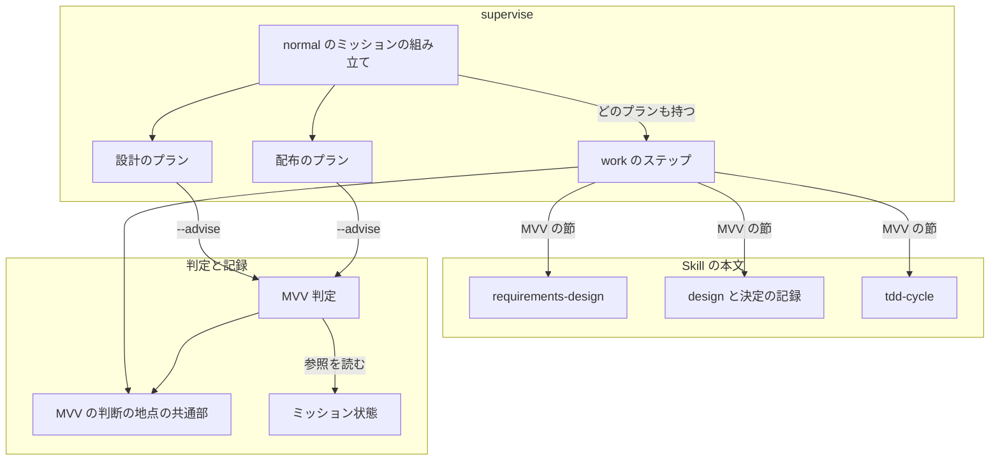
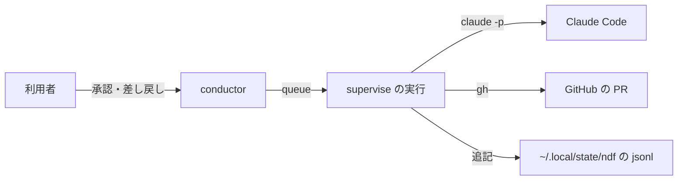
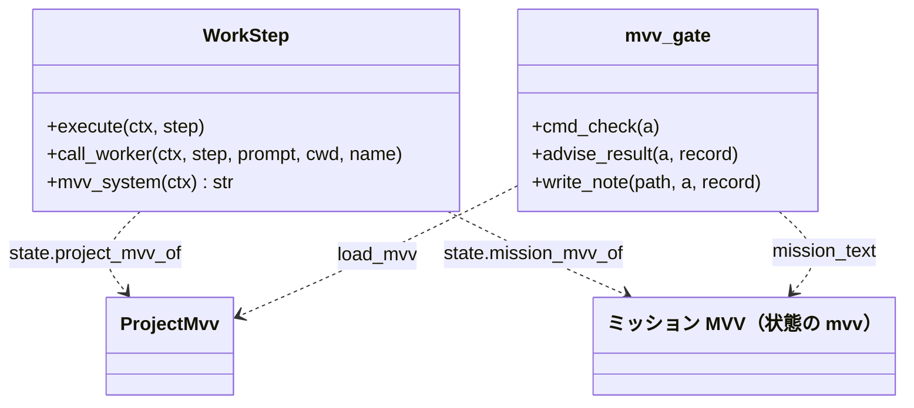
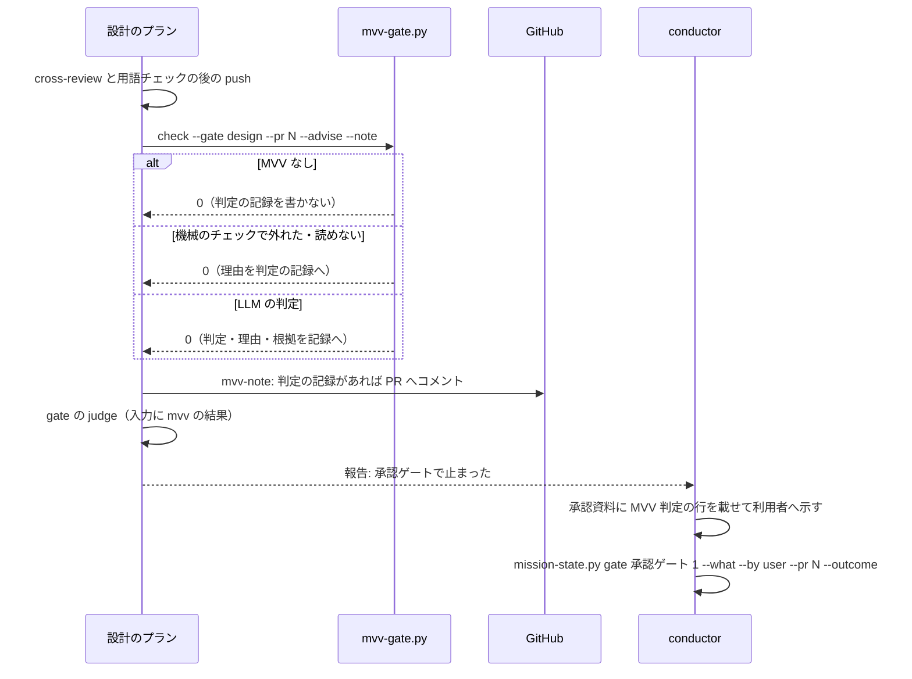
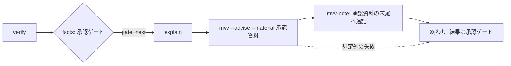
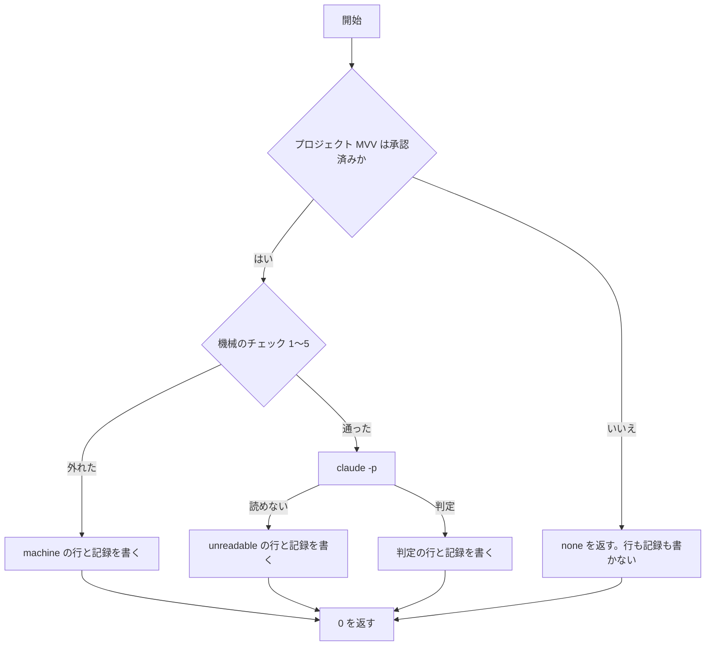

# #1400: プロジェクト MVV を normal・auto の各工程で従わせる

要求と受け入れ条件は #1400 の本文にある（コピーは `issues/issue-1400-requirements.md`）。この文書は「どう作るか」だけを扱う。

**変えるのは 3 か所である。** supervise の `work` のステップが MVV の節を worker へ渡す。`mvv-gate.py check` に承認ゲートの
記録を書かない呼び方（`--advise`）を足す。これを `pace: normal` のミッションの承認ゲート 1・2 の前に置く。`requirements-design`・
`design`・`tdd-cycle` の Skill 本文が MVV を読み、反する疑いを人へ戻す。

**ミッションが特定できるときは、ミッション MVV も合わせて渡す**（承認ゲート 1 での利用者の指示）。3 か所とも、MVV の節を
`project_mvv.block(プロジェクト MVV, ミッション MVV)` の 1 つの形で作る。特定できないときは、プロジェクト MVV だけの今の設計のまま
である（「ミッション MVV の特定と受け渡し」）。

例として、ai-plugins（プロジェクト MVV 版 1 が承認済み）で次を打つ。

```bash
supervise.py new mission --pace normal --state <状態> --design 1400 --issue 1400
```

設計のプランは次のように流れる。

1. `design` のステップの worker は、システムプロンプトの末尾に MVV の節（11,271 バイト）を受け取る
2. worker は決定ごとに「根拠: Value 6（MVV 版 1）」の行を書く。Value に反する疑いのある決定は書かずに「結果: 判断が要る」で終える
3. cross-review の後に `mvv-gate.py check --advise` が走る。判定（例: 従う）と理由と根拠の項目を設計 PR のコメントへ書く
4. プランは今どおり承認ゲート 1 で止まる。利用者が承認すると、conductor が承認を状態へ書く
   （`mission-state.py gate <状態> "関門 1" --what <要約> --by user --pr <設計 PR> --outcome approved`）。判定が「反する疑い」なら、この承認が覆し
   （`override_pass`）として 1 行残る

同じミッションをマイルストーン 26（説明に `## Mission` / `## Vision` / `## Value` がある）に結び付けると、次が変わる。

```bash
mission-state.py init <状態> --name <名> --pace normal --milestone 26 --issue 1400
```

1. `init` がマイルストーン 26 の説明からミッション MVV を状態の隣の `mvv.md` へ写し、状態に `mvv`（path・sha256）を書く
2. worker の MVV の節は、プロジェクト MVV（版 1）の後に「ミッション MVV」の節を持つ
3. worker は「根拠: Value 6 / ミッション Value 4（MVV 版 1・ミッション MVV 3f9a1c2e）」のように、どちらの MVV の項目かが分かる形で書く
4. `mvv-gate.py check --advise` も同じ 2 つの MVV で判定し、判定の行に `mission_mvv`（sha256）を残す

## ドメインモデル

### コンテキスト

| コンテキスト | 何の語が 1 つの意味に決まるか |
| --- | --- |
| NDF の工程（`ndf-workflow`） | MVV 判定・承認ゲート・承認資料・ステップ・プラン・根拠の項目・覆し |

コンテキストは 1 つで、コンテキストマップの関係は無い。

### 集約

| 集約 | 持ち主（書き換えてよいもの） | 根 | エンティティ | 値オブジェクト |
| --- | --- | --- | --- | --- |
| ミッション状態 | `mission-state.py`（`init` と `gate`） | ミッション状態ファイル | 承認ゲートの記録（`gates[]`） | プロジェクト MVV の参照（版・sha256）・ミッション MVV の参照（path・sha256）・進め方 |
| MVV 判定の記録 | `mvv-gate.py` | `mvv-gate.jsonl` の 1 行 | — | 判定・理由・根拠の項目・進め方・プロジェクト MVV の参照・ミッション MVV の参照 |
| 覆しの記録 | `mission-state.py gate --by user`（`lib/project_mvv_signals.record_override`・`last_mvv_verdict`） | `project-mvv-signals.jsonl` の 1 行 | — | 覆しの種類・直前の判定 |
| ミッションのプラン | `supervise.py new mission`（`supervise_lib/mission.py`・`mission_waves.py`・`release_templates.py`） | ステージの一覧（`mission.json`） | プラン・ステップ | — |
| 設計文書の決定の記録 | `design` の worker | 設計文書の「決定の記録」の節 | 決定 | 根拠の項目 |

**プロジェクト MVV はこの変更では読むだけである。** 持ち主は `project-mvv.py approve` で、どの構成要素も書き換えない。
**ミッション MVV の本文も読むだけである。** 写しを作るのは今どおり `mission-state.py init` だけで、ほかの構成要素は状態の参照から読む。

### 不変条件

| # | 集約 | 条件 | 破れたときの扱い |
| --- | --- | --- | --- |
| I1 | ミッション状態 | `--advise` の MVV 判定は、判定が「従う」でも承認ゲートの記録（`by: mvv`）を書かない | テストで落とす。書けば `normal` の承認ゲートが MVV 判定だけで通る |
| I2 | ミッションのプラン | `normal` のプランは MVV 判定の結果によらず承認ゲートで止まり、`--from` で続けるまで先へ進まない | テストで落とす |
| I3 | MVV 判定の記録 | プロジェクト MVV が承認済みでないとき、`--advise` は LLM を呼ばず、`mvv-gate.jsonl` に行を書かず、判定の記録（`--note`）も書かない | テストで落とす |
| I4 | ミッションのプラン | `work` のステップが worker へ渡す MVV の節は `project_mvv.block(mvv, ミッション MVV)` の出力と 1 バイトも違わない（ミッション MVV が特定できなければ `block(mvv)`）。プロジェクト MVV が承認済みでなければ、ミッション MVV があっても何も足さない | テストで落とす |
| I5 | MVV 判定の記録 | 判定の行はすべて `pace` を持つ。既存のキーの名前と意味は変えない | テストで落とす |
| I6 | ミッション状態 | `auto` / `fast` の MVV 判定は今どおり「従う」でレッドラインが無いときだけ `by: mvv` を書く | 既存のテストが落とす |
| I7 | ミッションのプラン | `--state` を渡さない `normal` のミッションのプランは、今のプランと同じである | テストで落とす |
| I8 | 覆しの記録 | 覆しは、人の答えが同じミッション・同じ承認ゲート・同じ PR（`gate --by user` に `--pr` を渡したとき）の直前の判定と食い違ったときだけ 1 行書く（`normal` でも同じ）。1 つのミッションが設計 PR を複数持つとき、ある PR の承認を別の PR の判定と比べない | テストで落とす |
| I9 | 設計文書の決定の記録 | 決定 1 件ごとに根拠の項目の行が 1 つある | Skill 本文の手順が守らせる（文言のテストは書かない）。AC11 で確かめる |
| I10 | ミッション状態 | ミッション MVV を節へ入れるのは、状態の `mvv.path` のファイルがあり、その sha256 が状態の `mvv.sha256` と一致するときだけである。一致しなければ worker と judge はプロジェクト MVV だけの節で進み、`--advise` は `machine`（理由つき）にする | テストで落とす |
| I11 | ミッション状態 | `normal` の `init` はミッション MVV を特定できなくても止まらない（`--milestone` の説明に見出しがそろわない・読めない）。LLM も呼ばない（照合 `vet` は `fast` / `auto` だけ） | テストで落とす |
| I12 | 根拠の項目 | ミッション MVV の項目は「ミッション」を頭に付けて残し（`ミッション Value 4`）、プロジェクト MVV の同じ番号（`Value 4`）と別の項目として扱う。`R<番号>` はミッション MVV だけが持つので頭に付けない | テストで落とす |

### ドメインイベント

| # | イベント | 発生元 | 受け手 |
| --- | --- | --- | --- |
| E1 | プロジェクト MVV の状態を読んだ | supervise の実行の状態（`project_mvv_of`）・Skill の手順（`project-mvv.py check`） | `work` のステップ（E2）・Skill の手順（E3〜E5） |
| E1b | ミッション MVV を特定した | `mission-state.py init`（写し）・supervise の実行の状態（`mission_mvv_of`）・Skill の手順（`project-mvv.py context --mission / --mvv / --milestone`） | E1 と同じ |
| E2 | `work` のステップのプロンプトに MVV の節を入れた | `WorkStep` | worker |
| E3 | 要求と範囲を MVV と突き合わせた | `requirements-design` の worker | 課題の本文。反する疑いは conductor（作業の報告） |
| E4 | 設計の決定ごとに根拠の項目を記録した | `design` の worker | 設計文書。`--advise` の MVV 判定の材料（E6） |
| E5 | 実装の選択を MVV と突き合わせた | `tdd-cycle` の worker | 実装の PR。反する疑いは conductor（作業の報告） |
| E6 | `normal` の承認ゲートの前に MVV 判定を走らせた | プランの `mvv` のステップ（`mvv-gate.py check --advise`） | `mvv-gate.jsonl`・判定の記録のファイル |
| E7 | MVV 判定の結果を承認資料に載せた | プランの `mvv-note` のステップ | 設計 PR のコメント（ゲート 1）・承認資料のファイル（ゲート 2） |
| E8 | 人が承認か差し戻しを答えた | 利用者（conductor が `mission-state.py gate --by user` で書く） | ミッション状態 |
| E9 | 覆しを記録した | `mission-state.py gate --by user` | `project-mvv-signals.jsonl`（改訂の兆候） |

### 用語

| 用語 | 意味 | 用語集への反映 |
| --- | --- | --- |
| 助言の MVV 判定 | 承認ゲートの記録（`by: mvv`）は書かないが、`mvv-gate.jsonl` へ判定の行（`pace` 付き）を書き、判定・理由・根拠の項目を承認資料へ載せる MVV 判定（`mvv-gate.py check --advise`）。`normal` の承認ゲートの前に走り、承認するのは人である | 追加（`ndf-workflow`） |
| MVV 判定 | 承認ゲートの材料が MVV に従うかの判定。`auto` / `fast` では「従う」かつレッドラインが無いときだけ承認ゲートを通し、`normal` では助言の MVV 判定として承認資料へ載せる | 意味の変更（`ndf-workflow`） |
| 根拠の項目 | 既存の語。設計の決定の記録にも書く。ミッション MVV の項目は頭に「ミッション」を付ける（`ミッション Value 4`） | 意味の変更（`ndf-workflow`） |
| 覆し | 既存の語。`normal` の承認ゲートでも数える | 変えない |

## 機能一覧

| # | 機能 | 誰が使うか |
| --- | --- | --- |
| F1 | worker が MVV の節を受け取って作業する（要求・設計・実装・修正） | supervise の `work` のステップの worker |
| F2 | 要求と範囲が MVV に反する疑いを人へ戻す | `requirements-design` の実行者（worker・対話の AI） |
| F3 | 設計の決定ごとに根拠の項目を残し、反する疑いのある決定を人へ戻す | `design` の実行者 |
| F4 | 実装の選択が MVV に反する疑いを人へ戻す | `tdd-cycle` の実行者 |
| F5 | `normal` の承認ゲート 1・2 の前に助言の MVV 判定を走らせ、結果を承認資料へ載せる | conductor・利用者 |
| F6 | `normal` の承認ゲートでの人の答えと判定の食い違いを覆しとして残す | conductor（`mission-state.py gate --by user`） |

## 構成要素

| 要素 | 責務 | 変え方 |
| --- | --- | --- |
| `work` のステップ（`supervise_lib/worker_steps.py` の `WorkStep`） | worker のシステムプロンプトの末尾へ MVV の節を足す。3 つの呼び方（最小構成の `claude -p`・Skill の `claude -p`（`full`）と再開・`external-ai.py run` のプロンプトファイル）で同じ文字列にする。プランに `ミッション状態` があればミッション MVV も節に入れる | 変える |
| 実行の状態（`supervise_lib/state.py`）と judge（`supervise_lib/steps.py` の `JudgeStep`） | `mission_mvv_of(plan)` を足す。プランの `ミッション状態` の `mvv` を実行の中で 1 回だけ読み、I10 の一致を見て本文を返す（外れたら `attention` に 1 行）。judge も同じ本文で `block(mvv, mission)` を作る | 変える |
| MVV の節と根拠の句（`lib/project_mvv.py`） | `block` のミッション MVV の節の見出しに出所の sha256 の先頭 8 文字と、項目の書き方（頭に「ミッション」）を 1 行足す。`basis` が「ミッション」付きの項目を受ける。`basis_phrase` にミッション MVV の参照を渡せるようにする。`approval_refusal` に `advise` を足し、ミッション MVV の承認の記録（承認ゲート `MVV`）を求めない | 変える |
| MVV の節の出力（`project-mvv.py context`） | `--mission <状態>` / `--mvv <ファイル>` / `--milestone M` のどれか 1 つを受け、ミッション MVV を足した節を出す。特定できなければ今と同じ節と、特定できなかった理由（`--format json` の `mission_mvv`） | 変える |
| MVV 判定（`mvv-gate.py`） | `--advise` を受ける。承認ゲートの記録を書かず、どの判定でも終了コード 0 で返す。判定の行へ `pace` と `mission_mvv`（ミッション MVV の sha256）を足す。進め方の宣言が無いときのレッドラインを空として扱う（`--advise` のときだけ）。`--advise` ではミッション MVV の承認の記録を求めない | 変える |
| MVV の判断の地点の共通部（`lib/project_mvv.py`） | `approval_refusal` の案内文から `--pace fast` の決め打ちを外す | 変える（文面だけ） |
| ミッション状態（`mission-state.py init`・`lib/mission_mvv.init_mvv`） | プロジェクト MVV が承認済みなら、`pace` によらず参照（版・sha256）を書く。`normal` でも `--mvv` / `--milestone` からミッション MVV を写す。`normal` では特定できなくても止めず、照合（`vet`）もしない | 変える |
| `normal` のミッションの組み立て（`supervise_lib/mission.py`） | `--state` があれば、組み立てるすべてのプラン（`pace` によらない）に `ミッション状態`（状態の絶対パス）を書く。設計と配布のプランへ助言の MVV 判定を入れる。承認ゲート 1・配布のステージの説明と `next` に `mission-state.py gate --what <要約> --by user` を足す（承認ゲート 1 は `--pr <設計 PR>` も）。`normal` で `--state` があるマニフェストの見出しを `進め方: normal` にする | 変える |
| ミッション状態（`mission-state.py gate`）と覆しの照合（`lib/project_mvv_signals.last_mvv_verdict`） | `gate --by user` に `--pr N` を足す。渡すと `mvv-gate.jsonl` の行を `pr` に N を含む行に絞って直前の判定を探す。省くと今と同じ | 変える |
| 設計のプラン（`supervise_lib/mission_waves.py`） | `plan_advise_design`: `plan_mission_design` の `push-glossary` と `gate` の間へ `mvv`・`mvv-note` のステップを入れる | 足す |
| 配布のプラン（`supervise_lib/release_templates.py`） | 開発版の `explain` の後へ `mvv`・`mvv-note` のステップを入れる（`advise` を渡されたときだけ） | 変える |
| `requirements-design` の本文 | 手順 5 の後に「MVV と突き合わせる」を足す。MVV の節がプロンプトに無ければ、課題のマイルストーンを渡して `project-mvv.py context --milestone M` で読む | 変える |
| `design` の本文と `references/decisions.md` | 手順 3 で決定ごとに根拠の行を書き、反する疑いのある決定を人へ戻す | 変える |
| `tdd-cycle` の本文 | 事前調査の後に「実装の選択を MVV と突き合わせる」を足す | 変える |
| 参照（`approval-request.md`・`project-mvv.md`・`pace.md`）と `--state` の説明（`new_args.py`）・`mvv-gate.py` の docstring | 足した地点と記録の置き場、`normal` の列の MVV 判定、判断に使うものの「MVV 判定」の行 | 変える |
| 用語集（`docs/glossary/glossary.json`） | 「助言の MVV 判定」を足し、「MVV 判定」「根拠の項目」の意味を直す | 変える |



図に載せない要素は、参照の文書・`new_args.py` の説明・`mvv-gate.py` の docstring・用語集である。どれも文面だけで、呼び出しの
関係を持たない。

### 文脈と配置



配置は変わらない。どの処理も conductor の端末の中で今と同じプロセスとして動く（`supervise.py` の実行・`mvv-gate.py` の
子プロセス・`claude -p`）。外部へ出るのは設計 PR のコメント 1 件（`gh pr comment`）だけ増える。

### 置き場所

```text
plugins/ndf/
├── scripts/
│   ├── mvv-gate.py                      # --advise・pace
│   ├── mission-state.py                 # init の参照
│   ├── project-mvv.py                   # context のミッション MVV
│   ├── lib/project_mvv.py               # 案内文・節の見出し・根拠の項目
│   ├── lib/mission_mvv.py               # normal の写し
│   └── supervise_lib/
│       ├── worker_steps.py              # MVV の節
│       ├── state.py                     # mission_mvv_of
│       ├── steps.py                     # judge のミッション MVV
│       ├── mission.py                   # normal の組み立て
│       ├── mission_waves.py             # plan_advise_design（新設）
│       ├── release_templates.py         # 開発版の mvv・mvv-note
│       └── new_args.py                  # --state の説明
└── skills/
    ├── requirements-design/SKILL.md
    ├── design/SKILL.md
    ├── design/references/decisions.md
    ├── tdd-cycle/SKILL.md
    └── development-workflow/references/{approval-request,project-mvv,pace}.md
```

### 既存の規則を新しい値（`pace: normal` の MVV 判定）に照らした結果

MVV 判定を持つ進め方の集合（`fast` / `auto`）へ `normal` を足す。そのため、集合を前提にした規則を 2 つの経路で集めた。
当てはまらないものだけを下の表に挙げる。

| 経路 | 見たもの |
| --- | --- |
| 配布物の検索 | `fast\|auto` と `mvv 判定\|mvv-gate\|project_mvv\|by: mvv` の重なり |
| `normal` のプランが通る手順 | `plan_mission_design`・`plan_mission_release`・`manifest_head`・`record_override` |

| 規則 | 当てはまらない理由 | 載せた構成要素 |
| --- | --- | --- |
| `manifest_head` が「状態があれば `fast` の終わり」と読む | `normal` で `--state` を渡すと `進め方: fast` と書かれる | `normal` のミッションの組み立て |
| `mission-state.py init` が参照を書くのは `MVV_PACES` だけ | 参照が無いと `approval_refusal` が判定を断る | ミッション状態 |
| `approval_refusal` の案内「`--pace fast` で書く」 | `normal` の状態にも当てはまる案内にする | MVV の判断の地点の共通部 |
| `mvv-gate.py` の判定の記録の文「`関門を省いた`」 | `--advise` は省かない | MVV 判定 |
| `boundary_hits` が進め方の宣言の欠如を機械のチェックの外れとする | `normal` のリポジトリは `.ndf/pace.json` を持たないことがある | MVV 判定 |
| `pace.md` の承認ゲートの表・フロー図の `normal` の列「利用者が承認する」 | MVV 判定が載る | 参照 |
| `--state` の説明「`--pace fast / auto` と組」 | `normal` でも受ける | `--state` の説明 |
| `init_mvv` が `normal` で `(None, None)` を返す | `normal` のミッション MVV を写さない | ミッション状態 |
| `mission_mvv_refusal` がミッション MVV の承認の記録（承認ゲート `MVV`）を求める | `normal` には承認ゲート `MVV` が無い | MVV の節と根拠の句 |

## 構造



- `WorkStep.mvv_system(ctx)` は `ctx.state.project_mvv_of(ctx.cwd)` と `ctx.state.mission_mvv_of(ctx.plan)` を読む。プロジェクト MVV が
  承認済みなら `"\n\n" + project_mvv.block(mvv, mission)` を、ほかは空文字を返す（`mission` は特定できなければ None）。`execute` と `call_worker` は `WORK_SYSTEM` / `FULL_SYSTEM` の後ろへこれを足す
- `mvv-gate.py` の `advise_result` は `--advise` のときの結果（status `ok`・終了コード 0）を組む。`write_note` は `advise` で見出しと
  判定の行の文を変える

## データ構造

### MVV 判定の記録（`mvv-gate.jsonl` の 1 行）

足すのは `pace` と `mission_mvv` の 2 列だけである。**既存の行は書き換えない**（追記だけの事象の記録。過去の判定を失わない）。

| 列 | 型 | 空を許すか | 意味 |
| --- | --- | --- | --- |
| `pace` | 文字列 | 許す（`""`） | ミッション状態の `pace`（`normal` / `auto` / `fast`）。状態を読めなかった行と、この変更より前の行は `""`（「分からない」） |
| `passed` | 真偽 | 許さない | 既存。承認ゲートを通したか。`--advise` では常に `false` |
| `mission_mvv` | `{sha256}` か `null` | 許す（`null`） | 判定に渡したミッション MVV の sha256。渡さなかった（特定できない）行と、この変更より前の行は `null`。`pace` と同じく **すべての行**に書く |

`verdict` は既存のまま（`follow` / `not_follow` / `unknown` / `machine` / `unreadable`）。**プロジェクト MVV が承認済みでない
`--advise` は行を書かない**（I3）。書くと「MVV なし」の行が改訂の兆候の集計に入り、`normal` しか使わないプロジェクトの記録が
今と変わる。

### ミッション状態

| キー | 型 | 空を許すか | 意味 |
| --- | --- | --- | --- |
| `project_mvv` | `{version, sha256}` | 許す（キーが無い） | 既存。`init` の時点で承認済みのプロジェクト MVV の参照。**`pace` によらず**書く。無いのは MVV が承認済みでなかったか、この変更より前に作った状態 |
| `mvv` | `{path, sha256}` | 許す（キーが無い） | 既存（`fast` / `auto` のミッション MVV の写し）。**`normal` でも**、`--mvv` か `--milestone` から特定できたときに書く。無いのはミッション MVV を特定できなかったか、この変更より前に作った `normal` の状態 |

### CRUD

| 機能 | ミッション状態 | `mvv-gate.jsonl` | `project-mvv-signals.jsonl` | 設計 PR のコメント | 承認資料のファイル |
| --- | --- | --- | --- | --- | --- |
| F5 助言の MVV 判定 | R | C | R（改訂の提案） | C | U（末尾へ追記） |
| F6 覆しの記録 | U（`gates[]`・`rejections[]`） | R | C | — | — |

### 移行

既存の `normal` の状態ファイルは `project_mvv` を持たない。そのまま `--state` に渡すと `approval_refusal` が「参照が無い」で断る。
助言の MVV 判定は `machine` として理由を資料に載せ、プランは止まらない（要求の非機能の「移行性」）。

## 入出力の契約

### `mvv-gate.py check --advise`

| 項目 | 書くこと |
| --- | --- |
| 名前 | `mvv-gate.py check --mission <状態> --gate design\|release [--material F...] [--pr N...] [--mode M] [--root DIR] [--note F] --advise` |
| 入力 | `--advise`（真偽。省くと今の振る舞い）。ほかは今と同じ |
| 出力（成功） | status `ok`・終了コード 0。`items[0]` が判定の行（`verdict`・`reasons`・`basis`・`pace`・`passed: false`）。改訂の提案があれば `items` の後ろに続く。`summary` は「承認ゲート N の MVV 判定（助言）: <判定>。承認は利用者が行う」 |
| 出力（MVV なし） | status `ok`・終了コード 0。`items[0]` は `{"verdict": "none", "status": <none / unapproved / mismatch / unreadable>}`。LLM を呼ばず、行も `--note` も書かない |
| 判定の記録（`--note`） | MVV なし以外のすべての判定で書く。見出し「MVV 判定（承認ゲート N・助言）」、判定・理由・根拠・時刻・ログの行。`machine` と `unreadable` は理由の欄に外れた理由を書く |
| 失敗の形 | 引数の誤りは argparse の終了コード 2。**判定の中身で終了コードを変えない**（止めるのはプランの承認ゲート） |
| 互換性 | `--advise` を省いた呼び出しは今と 1 バイトも変わらない振る舞い（行に `pace` が増えることを除く）。`auto` / `fast` のプランは `--advise` を渡さない |

`--advise` で状態の `pace` が `auto` / `fast` でも拒まない（記録を書かないだけで害が無い）。

状態に `mvv` があれば、`--advise` でも今と同じく `block(project, mission)` で判定する（`mission_text`）。違いは `approval_refusal` の
照合だけで、`--advise` ではミッション MVV の承認の記録（承認ゲート `MVV`）を求めず、ファイルと状態の sha256 の一致だけを見る（I10）。
外れれば `machine`（理由「ミッション MVV が状態と一致しない」）。

### `mission-state.py init --pace normal`

| 項目 | 書くこと |
| --- | --- |
| 入力 | 今と同じ。`--mvv <ファイル>` と `--milestone M` を `normal` でもミッション MVV の出所として読む |
| 出力 | `--mvv` のファイルがあれば、または `--milestone` の説明に 3 つの見出しがそろえば、状態に `mvv`（path・sha256）を書く（写しの置き場は `fast` / `auto` と同じ状態の隣の `mvv.md`）。特定できなければ `mvv` を書かず、結果の `items` に理由を 1 件（`{"kind": "mission_mvv", "result": "none", "reason": ...}`）載せて status `ok` |
| 失敗の形 | `--mvv` のファイルが無いときだけ止まる（終了コード 3。明示の指定の誤りなので `fast` / `auto` と同じ）。`--milestone` の説明の不足・読めないは止めない（I11） |
| 互換性 | `--milestone` も `--mvv` も渡さない `normal` の `init` は今と同じ状態を書く（決定 3 の `project_mvv` を除く）。`fast` / `auto` の振る舞い（写せなければ止まる・照合 `vet`）は変えない |

### `project-mvv.py context`

| 項目 | 書くこと |
| --- | --- |
| 名前 | `project-mvv.py context [--root DIR] [--format text\|json] [--mission <状態> \| --mvv <ファイル> \| --milestone M [--repo OWNER/REPO]]` |
| 入力 | ミッション MVV の出所を 3 つのうち 1 つ（排他）。`--mission` は状態の `mvv` を I10 の一致を見て読む。`--milestone` は `lib/mission_mvv.mvv_sections` で説明から 3 つの見出しを取り出す（写しは作らない） |
| 出力 | `block(project, mission)` の文。`--format json` の `items[0]` に `mission_mvv`（`{"sha256", "source"}` か、特定できなかった理由 `{"reason"}`） |
| 失敗の形 | 出所を読めない・見出しがそろわない・一致しないは止めず、プロジェクト MVV だけの節を出す（終了コード 0） |
| 互換性 | 3 つとも省けば今と 1 バイトも変わらない出力 |

### `supervise.py new mission --pace normal --state <状態>`

| 項目 | 書くこと |
| --- | --- |
| 入力 | `--state`（今も受けるが `normal` では使っていない）。渡すと助言の MVV 判定のステップが入る |
| 出力 | マニフェストの見出しに `進め方: normal`・`状態` が増える。承認ゲート 1 のステージの `gate` の文と `next` に `mission-state.py gate <状態> "関門 1" --what <要約> --by user --pr <設計 PR> --outcome approved\|rejected` が入る（`pace.md` の承認と差し戻しの行と同じ形に `--pr` を足したもの）。`--what` を落とすと `gate` は承認も覆しも書かずに止まる |
| 互換性 | `--state` を省けば今と同じプラン（I7） |

### `mission-state.py gate --by user --pr N`

| 項目 | 書くこと |
| --- | --- |
| 名前 | `mission-state.py gate <状態> <関門の名> --what <要約> --by user [--pr N] [--outcome approved\|rejected]` |
| 入力 | `--pr`（整数。省略可）。承認ゲート 1 では答えた設計 PR の番号を渡す |
| 出力 | 今と同じ。覆しの照合（`last_mvv_verdict`）は、`mvv-gate.jsonl` の行のうち同じミッション・同じ承認ゲートで `pr` に N を含む最後の行を直前の判定とする |
| 互換性 | `--pr` を省けば今と同じ照合（ミッションと承認ゲートだけで最後の行）。`auto` / `fast` の呼び出しは変えない |

### Skill の本文の約束

| Skill | どこで | 何をする |
| --- | --- | --- |
| `requirements-design` | 手順 5（対象範囲）の後 | MVV の節がプロンプトに無ければ `project-mvv.py context` で読む（課題にマイルストーンがあれば `--milestone M` を付ける。`design`・`tdd-cycle` も同じ）。要求・範囲が MVV に反する疑いがあれば、要求を書き切らずに人へ戻す（理由と根拠の項目つき）。受け入れ条件の文に項目を書き込まない |
| `design` | 手順 3（決定を記録する） | 決定ごとに最後の行へ「根拠: <項目>（MVV 版 N）」を書く。ミッション MVV があれば、その項目は頭に「ミッション」を付け、括弧にミッション MVV の sha256 の先頭 8 文字を足す（「根拠: Value 6 / ミッション Value 4（MVV 版 1・ミッション MVV 3f9a1c2e）」）。当たる項目が無ければ「根拠: 根拠なし（MVV 版 N）」、MVV が無ければ「（MVV なし）」。反する疑いのある決定は書かずに人へ戻す |
| `tdd-cycle` | 事前調査の後 | 依存の追加・公開インタフェースの形・データの扱いを選ぶとき、MVV に反する疑いがあれば実装を進めずに人へ戻す |

### 参照の文書に足す行

| 文書 | 足す行 |
| --- | --- |
| `project-mvv.md` の「判断の地点と記録」 | `work` のステップ（システムプロンプトの末尾・記録なし）／`requirements-design`（作業の報告の理由）／`design`（設計文書の決定の「根拠:」の行）／`tdd-cycle`（作業の報告の理由）／`normal` の承認ゲートの助言の MVV 判定（`mvv-gate.jsonl` の `pace: normal` の行・PR のコメントか承認資料の末尾） |
| `pace.md` の承認ゲートの表とフロー図 | `normal` の列を「助言の MVV 判定を資料に載せ、利用者が承認する」にし、`--state` を渡したときだけと添える |
| `approval-request.md` の「承認の判断に使うもの」 | 「MVV 判定」の行: 判定・理由・根拠の項目。機械のチェックで外れたら外れた理由。出所はゲート 1 が設計 PR のコメント、ゲート 2 が承認資料の末尾、判定の記録が無ければ「MVV なし」 |

**「人へ戻す」の形は前提 7 に従う。** supervise の worker は作業の報告を「結果: 判断が要る」で終え、理由と根拠の項目を書く。
対話の中では `decision-request` の形で利用者へ示す。

## ミッション MVV の特定と受け渡し

### 今どうなっているか（2026-09-28、`design/issue-1400` の 3e5e3be0 で確かめた）

| 地点 | ミッション MVV の扱い | 根拠 |
| --- | --- | --- |
| `mission-state.py init` | `fast` / `auto` だけが `--milestone` の説明（`## Mission` / `## Vision` / `## Value`）か `--mvv` のファイルから状態の隣の `mvv.md` へ写し、状態に `mvv`（path・sha256）を書く。`normal` は `(None, None)` を返して何もしない | `lib/mission_mvv.py` の `MVV_PACES = ("fast", "auto")` と `init_mvv` の先頭の分岐 |
| `mission-state.py init`（照合） | 承認済みのプロジェクト MVV があれば、写したミッション MVV を `vet_stop`（LLM の照合 `project-mvv.py vet --kind mission` と同じ）に通し、「従う」でなければ止まる。`fast` / `auto` だけ | `mission-state.py` の `cmd_init` の `if a.pace in mission_mvv.MVV_PACES and project.approved and mvv` |
| `mvv-gate.py check` | 状態の `mvv.path` を読み（`mission_text`）、`block(project, mission)` で判定する。`R<番号>` を根拠の項目に許す。照合 `approval_refusal` は、状態に `mvv.path` があればファイル・状態・承認の記録（承認ゲート `MVV`）の 3 者の sha256 の一致を求める | `mvv-gate.py` の `mission_text`・`rids`、`lib/project_mvv.py` の `mission_mvv_refusal` |
| MVV の節（`project_mvv.block`） | 第 2 引数にミッション MVV の本文を受け、「# ミッション MVV」の節を足す形が既にある | `lib/project_mvv.py` の `block(mvv, mission=None)` |
| supervise の judge・`work` のステップ | 渡さない。judge は `project_mvv.block(mvv)` だけ。プランはミッション状態のパスを持たない（`mission_waves.py` のコマンドの文字列と、マニフェストの見出しの `状態` にだけ現れる） | `supervise_lib/steps.py` の `JudgeStep.execute`、`grep -n "a.state" supervise_lib/*.py` |
| `project-mvv.py context` | ミッション MVV を受ける引数が無い | `project-mvv.py` の `context` の `add_argument` は `--format` だけ |
| 根拠の項目（`basis`・`basis_phrase`） | `Value 4` はプロジェクト MVV とミッション MVV のどちらの項目か区別しない。`basis_phrase` はプロジェクト MVV の版しか書かない | `ITEM_RE`・`basis_phrase` |

**特定の手段は `init` の写ししか無く、`normal` では使われない。** 渡す形（`block` の第 2 引数）は既にあるので、この設計は
「`normal` でも写す」「状態から worker・judge・`--advise`・Skill の手順へ届ける」「項目を区別する」の 3 つを足す。

### 特定の手段

| 流れ | 出所 | 特定できないとき |
| --- | --- | --- |
| `supervise.py new mission --state <状態>` | 状態の `mvv`（`init` が `--milestone` か `--mvv` から写したもの）。プランの `ミッション状態` から読む | `mvv` が無い・I10 の一致が外れる → プロジェクト MVV だけ |
| 状態ファイルの無い課題単位の流れ（前提 5） | 課題のマイルストーンの説明（`project-mvv.py context --milestone M`）か、起動指示が名指すファイル（`--mvv`） | 見出しがそろわない・読めない → プロジェクト MVV だけ |

**マイルストーンの説明を worker が直接読みには行かない。** 読むのは `init`（写し）と `context --milestone`（その場の読み取り）の
2 か所で、どちらも `mission_mvv.mvv_sections` の同じ規則で見出しを取り出す。

### 両方があるときの渡し方

| 地点 | 渡すもの | 根拠の行 |
| --- | --- | --- |
| `work` のステップ（worker） | `block(project, mission)`（システムプロンプトの末尾。1 回分） | 決定・報告に「根拠: Value 6 / ミッション Value 4（MVV 版 1・ミッション MVV 3f9a1c2e）」 |
| judge | 同じ `block(project, mission)` | `basis` に `ミッション Value 4` の形で残す |
| `--advise` の MVV 判定 | 同じ `block(project, mission)`（今の `mission_text` の経路） | 判定の行の `basis` に `ミッション Value 4`・`R2`、`mission_mvv` に sha256。判定の記録（`--note`）の根拠の行は `basis_phrase` の同じ形 |
| Skill の手順（前提 5 の流れ） | `project-mvv.py context --milestone M` の出力 | worker と同じ |

`block` のミッション MVV の節は、見出しを「# ミッション MVV（sha256 3f9a1c2e）」にし、直後に「この節の項目を根拠に書くときは
頭に「ミッション」を付ける（例: ミッション Value 4）。R の番号はそのまま」の 1 行を置く。**プロジェクト MVV の節と判断の決まり
（`CONTRACT`）は変えない。**

### 両者が食い違うとき

優先順位は今の判断の決まり（`CONTRACT` の「下位は上位を上書きしない」）のとおり、**プロジェクト MVV がミッション MVV に勝つ。**

| 地点 | 扱い |
| --- | --- |
| `init`（`normal`） | 照合（`vet`）をしない。LLM の呼び出しを増やさないため（非機能の性能・拡張性）。`fast` / `auto` は今どおり照合して止まる |
| worker | ミッション MVV の項目に従うとプロジェクト MVV の項目に反する決定は、書かずに「結果: 判断が要る」で戻す。理由に両方の項目（例: `ミッション Value 7` と `Value 2`）を書く |
| `--advise` の MVV 判定 | 判定の規則は変えない。プロジェクト MVV に反すれば、ミッション MVV に従っていても「反する疑い」になり、理由に両方の項目が載る。承認するのは今どおり人である |
| 人 | 食い違いの直し（マイルストーンの説明を直す・プロジェクト MVV を改訂する）は、この設計の外の既存の手順（`project-mvv.md` の改訂の手順）で行う |

## 処理の流れ

### 承認ゲート 1（設計のプラン）



- `mvv` のステップが 0 以外で終わったら（想定外の失敗）、`on_fail` で `gate` の judge へ進む。資料の MVV 判定の欄は
  「判定を読めない」になる。**承認ゲートへ着くことを MVV 判定の成否に依らせない**
- `mvv-note` のコメントが落ちても `gate` へ進む（`on_fail`）。判定の結果は `mvv` のステップの出力にも残る
- 用語チェックの当たりが残った経路（`glossary-recheck` の失敗）も `push-glossary` から同じ `mvv` を通る

### 承認ゲート 2（開発版の配布のプラン）



- `facts` が承認ゲートを取り（今どおり）、`explain` の後に `mvv` と `mvv-note` が続く。プランの結果は `facts` の承認ゲートのまま
- 材料は `explain` が書き終えた承認資料のファイル（`issues/approval-<プラグイン>-v<版>.md`）と、出す版の PR
- `normal` の本番の配布は、今どおり利用者の承認の後に conductor が進める。その前に `mission-state.py gate <状態> "関門 2" --what <要約> --by user` を打つ（配布のプランの判定は 1 ミッションに 1 つなので `--pr` は要らない）

### `mvv-gate.py check --advise` の分岐



**承認ゲートの記録（`mission-state.py gate --by mvv`）へ向かう辺は無い**（I1）。

## 非機能の実現方式

| 大項目 | 要求の条件 | 実現方式 | 確かめ方 |
| --- | --- | --- | --- |
| 性能・拡張性 | `work` のステップ 1 回あたりのプロンプトの増分は MVV の節の 1 回分（ai-plugins で 11,271 バイト）に限る。`normal` のミッションで増える LLM の呼び出しは承認ゲート 1 回につき `mvv-gate.py` の 1 回だけ | 節は実行の状態が 1 回だけ読んだ `ProjectMvv` とミッション MVV（`mission_mvv_of`）から作り、システムプロンプトへ 1 回だけ足す（再開の呼び出しも同じ 1 回分）。助言の MVV 判定はプランの 1 ステップで、再試行を持たない | テストで増分がちょうど `block(mvv)` の長さ + 区切りであること、`mvv` のステップが設計と配布のプランに 1 つずつであることを見る |
| 運用・保守性 | MVV の節を作る所は 1 か所。判定と覆しの記録は既存の `mvv-gate.jsonl` / `project-mvv-signals.jsonl` に書き、新しい記録の置き場を作らない | 節は `project_mvv.block` だけが作る。判定は `write_log`、覆しは `record_override` の既存の経路を使う | テストで記録の書き先が既存の 2 ファイルだけであることを見る |
| 移行性 | 既存の `normal` のミッション状態ファイルでもプランが止まらずに動く。機械のチェックで断られたときは「機械のチェックで外れた」として資料に載せる | 参照の無い状態は `approval_refusal` の断りを `machine` として判定の記録へ書き、終了コード 0 で返す | 参照の無い状態で `--advise` を打ち、0 と `machine` の行と理由の載った記録を見る |

## 決定の記録

### 決定 1: `normal` の MVV 判定は `mvv-gate.py check` に `--advise` を足して走らせる

機械のチェック・判定のプロンプト・判定の行・改訂の提案を `auto` / `fast` と共有できる。違いは「承認ゲートの記録を書かない」と
「終了コード」の 2 点に閉じる。別の入口を作ると、機械のチェックと記録の形を 2 か所で保つことになり、前提 1（判定の規則を
変えない）を守る場所が増える。

判定の行だけを読む別の入口（`auto` / `fast` の判定を流用する）も採らなかった。`normal` には流用する判定の行が無い。

根拠: Value 6 / Value 7（MVV 版 1）

### 決定 2: 助言の MVV 判定は判定の中身によらず終了コード 0 で返し、止めるのは既存の承認ゲートにする

`normal` のプランには既に承認ゲート（設計の `gate` の judge・開発版の `facts`）がある。MVV 判定が終了コード 10（承認ゲート）を返すと、1 本の
プランの中で承認ゲートが 2 度記録される。承認資料の組み立ても 2 つの承認ゲートを読み分けることになる。終了コード 0 にすれば、プランの
流れは MVV 判定が走ったかどうかで変わらない（I2）。

根拠: Value 2（MVV 版 1）

### 決定 3: `normal` のミッション状態にも、プロジェクト MVV が承認済みならその参照を書く

`approval_refusal` は、ミッションの開始から承認ゲートまでの間に MVV が改訂されたことを状態の参照との食い違いで見つける。参照を
書かずに `--advise` だけ照合を飛ばすと、改訂の前の MVV で始めたミッションを改訂の後の MVV で判定しても気づけない。書くのは
版と sha256 だけで、状態を読むほかの処理（`pace` による分岐）は参照の有無を見ていない。

根拠: Value 6（MVV 版 1）

### 決定 4: 助言の MVV 判定のステップは、`--state` を渡した `normal` のミッションにだけ入れる

判定の行と覆しはミッション状態ファイルのパスで結び付く（`last_mvv_verdict`）。状態が無いと覆しを数えられず、AC6 が成り立たない。
`--design` に複数の課題を渡すと、設計 PR ごとに `gate: design` の判定の行ができ、利用者も PR ごとに承認ゲート 1 を答える。
ミッションと承認ゲートだけで結び付けると、ある PR の承認が後から走った別の PR の判定と比べられる。そのため承認ゲート 1 の
`gate --by user` には設計 PR の番号（`--pr`）を渡し、判定の行の `pr` で絞る。1 ミッション 1 設計 PR に限る形は採らなかった
（`--design` の複数の課題を `normal` だけ拒むことになる）。
`--state` を省いた起動のプランを今のまま保てば、MVV を使わないプロジェクトと既存の手順が変わらない（I7・前提 5）。

根拠: Value 2 / Value 5（MVV 版 1）

### 決定 5: `work` のステップの MVV の節は、worker のシステムプロンプトの末尾へ足す

要求と設計のステップは Skill の呼び出し（`/ndf:design #N`）をプロンプトの先頭に置いて渡す。節をプロンプトの先頭へ足すと Skill の
呼び出しとして解釈されず、末尾へ足すと 11,271 バイトが Skill の引数になる。システムプロンプトなら 3 つの呼び方（最小構成・
Skill・`external-ai.py run`）で同じ位置に入り、再開の呼び出しにも同じ文字列が渡る。judge のようにユーザープロンプトの先頭へ置く
形は採らなかった。

根拠: Value 6（MVV 版 1）

### 決定 6: プロジェクト MVV が承認済みでないときの助言の MVV 判定は、LLM も行も判定の記録も出さない

AC7 は MVV の無いプロジェクトで今と同じ振る舞いを求める。`auto` / `fast` と同じく `machine` の行を書くと、2 つが変わる。
MVV を持たないプロジェクトの `mvv-gate.jsonl` に毎回行が増え、設計 PR に「MVV なし」のコメントが付く。承認資料の「MVV なし」は、ステップの出力
（`verdict: none`）から conductor が書く。プランのステップ自体は置き、実行の時点で読む（プランを作った後に MVV が承認される
ことがある）。

根拠: Value 2（MVV 版 1）

### 決定 7: `--advise` では、進め方の宣言（`.ndf/pace.json`）が無いことをレッドラインが空であるとして扱う

`pace.json` は `auto` / `fast` を使う条件の宣言で、`normal` しか使わないリポジトリは持たない。今の読み方では宣言の欠如が機械の
チェックの外れになり、そうしたリポジトリでは助言の MVV 判定が一度も LLM へ届かない。宣言が壊れているときは今どおり外れにする。
`--advise` を省いた呼び出しは変えない（前提 1）。

根拠: Value 5（MVV 版 1）

### 決定 8: 判定の結果は、ゲート 1 では設計 PR のコメント、ゲート 2 では承認資料のファイルの末尾に置く

どちらも承認する人がそのとき読むものである。ゲート 1 の承認資料は conductor が PR から組み立て、ゲート 2 の承認資料は
`approval-facts` が作るファイルそのものである。新しい置き場（状態ファイルの欄・別のファイル）を作ると、資料を組み立てる手順に
読む所が 1 つ増える。

根拠: Value 7（MVV 版 1）

### 決定 9: `normal` の判定も改訂の兆候を `auto` / `fast` と同じに数え、行に `pace` を残すところまでにする

分けて数えるかは利用者が AC11 の後に決める（要求の未決）。今の集計（`signals`・`unknown_streak`）を変えずに `pace` を残せば、
どちらに決まっても行を書き直さずに集計だけを変えられる。

根拠: Value 3（MVV 版 1）

### 決定 10: 設計の決定の根拠の行は、見送りの返信と同じ「根拠: <項目>（MVV 版 N）」の形にする

`project_mvv.basis_phrase` が cross-review と cross-refactoring の見送りの返信に使う形である。同じ形なら、読む人と照合する
スクリプトが 1 つの形だけを知ればよい。

根拠: Value 8（MVV 版 1）

### 決定 11: ミッションが特定できるときは、プロジェクト MVV とミッション MVV を 1 つの MVV の節（`block(project, mission)`）で渡す

承認ゲート 1 での利用者の指示（「ミッションが特定できる場合はミッション MVV も参照するように」）による。`block` は第 2 引数で
ミッション MVV を受ける形を既に持ち、`auto` / `fast` の MVV 判定が使っている。worker・judge・`--advise`・Skill の手順が同じ関数を
通れば、MVV の節を作る所は 1 か所のまま（前提 4）で、ミッション MVV の有無は引数の違いに閉じる。地点ごとにミッション MVV の節を
別に足す形は採らなかった（節の並びと判断の決まりの位置が地点ごとにずれる）。

根拠: Value 6 / Value 7（MVV 版 1）

### 決定 12: ミッション MVV の出所は、状態の `mvv`（`init` の写し）と、状態の無い流れでの `context --milestone` / `--mvv` に限る

写しを作るのは今どおり `init` の 1 か所にし、`normal` でも `--milestone` か `--mvv` を渡せば写す。supervise のプランには状態の
パス（`ミッション状態`）だけを持たせ、worker と judge は実行の中で 1 回だけ状態から読む（`mission_mvv_of`）。プランへ本文や
sha256 を写す形は採らなかった。写しが 2 つになり、`init` の後の直しと食い違っても気づけない。worker がマイルストーンの説明を
その場で読む形も採らなかった。ステップごとに `gh api` が走り、承認の後に説明が書き換わると工程の途中で MVV が変わる。

根拠: Value 7（MVV 版 1）

### 決定 13: `normal` の `init` は、ミッション MVV を特定できなくても止めず、照合（`vet`）もしない

`fast` / `auto` はミッション MVV を承認ゲートを自動で通す根拠に使うので、写せなければ止まり、プロジェクト MVV との食い違いを
LLM で照合する。`normal` では承認するのが人で、ミッション MVV は判断の材料にとどまる。止めると、見出しの無いマイルストーンに
結び付けた `normal` のミッションが今は動くのに動かなくなる（前提 3 と同じ考え方）。照合をすると `normal` のミッションごとに
LLM の呼び出しが 1 回増え、非機能の性能・拡張性の条件（承認ゲート 1 回につき `mvv-gate.py` の 1 回だけ）を超える。食い違いは、
各地点の判断の決まり（下位は上位を上書きしない）で扱う。明示した `--mvv` のファイルが無いときだけは、指定の誤りなので止める。

根拠: Value 2（MVV 版 1）

### 決定 14: `--advise` の照合は、ミッション MVV の承認の記録（承認ゲート `MVV`）を求めず、ファイルと状態の sha256 の一致だけを見る

承認ゲート `MVV` の承認は、`fast` / `auto` で承認ゲートを MVV 判定で通すための事前の承認である。`normal` で求めると、承認ゲートの前に
人の承認が 1 つ増え、前提 2（承認ゲートは 2 つのまま）に反する。承認の記録が無いことを `machine` とすると、ミッション MVV を
結び付けた `normal` のミッションでは助言の MVV 判定が一度も LLM へ届かない。sha256 の一致は残し、`init` の後に写しが書き換わった
ことには気づけるようにする（I10）。

根拠: Value 2（MVV 版 1）

### 決定 15: ミッション MVV の項目は根拠の欄で頭に「ミッション」を付け、根拠の行の括弧にミッション MVV の sha256 の先頭 8 文字を足す

プロジェクト MVV とミッション MVV はどちらも `Value <番号>` を持ち、今の `basis` と「根拠: <項目>（MVV 版 N）」では、どちらの
項目かが読めない。項目に「ミッション」を付ければ、読む人も `basis` の正規化も 1 つの行の中で区別できる。ミッション MVV には版の
番号が無いので、承認の照合と同じ sha256 で指す。`R<番号>` はミッション MVV だけが持つので付けない。

LLM に区別させるため、`block` のミッション MVV の節の見出しに sha256 を、直後に書き方の 1 行を足す。**ミッション MVV を渡す
`auto` / `fast` の MVV 判定のプロンプトもこの 2 行だけ変わる。** 前提 1（判定に渡す MVV の節の中身を変えない）に触れるため、
承認ゲート 1 で利用者の確認を求める。判断の決まり（`CONTRACT`）とプロジェクト MVV の節は変えない。項目の番号の付け方を
変える形（ミッション MVV を `M1` などに振り直す）は採らなかった。マイルストーンの説明の書き方を利用者に変えてもらうことになる。

根拠: Value 8（MVV 版 1）

### 決定 16: ミッション MVV を節へ入れるのは、プロジェクト MVV が承認済みのときだけにする

AC7 はプロジェクト MVV が無い・未承認・一致しない・壊れているプロジェクトで、`work` のステップと `normal` の承認ゲートが今と
同じに動くことを求める。ミッション MVV だけで節を足すと、プロジェクト MVV を持たないプロジェクトの worker のプロンプトが変わり、
`--advise` が LLM を呼ぶ（I3 に反する）。プロジェクト MVV の無いミッション MVV だけの判定は、今どおり `auto` / `fast` の MVV 判定が
受け持つ。

根拠: Value 5（MVV 版 1）

## テスト設計

| 受け入れ条件・不変条件 | どの振る舞いで縛るか | どう壊したら落ちるべきか |
| --- | --- | --- |
| AC1・I4 | 承認済みの MVV で `work` のステップを 3 つの呼び方（最小構成・`full` と再開・`runtime` あり）で走らせると、渡るシステムプロンプト（`runtime` ではプロンプトファイル）が `block(mvv)` をそのまま含む | 節を judge だけに渡す・`block` 以外で組む・再開の呼び出しで落とすと落ちる |
| AC1・AC7・I4 | MVV が無い・未承認・一致しない・壊れているとき、渡るシステムプロンプトが今と同じ | 「MVV なし」の節を足すと落ちる |
| AC2・AC3・AC10・I9 | Skill 本文の手順（文言のテストを書かない）。AC11 の実機の確かめで設計文書の根拠の行を見る | — |
| AC4 | `--advise` で偽の claude が `not_follow` を返すと、終了コード 0・判定の行・理由と根拠の載った判定の記録ができる。`follow`・`unknown`・読めない応答でも同じく 0 | 判定で終了コードを変える・記録を書かないと落ちる |
| AC4 | 機械のチェック（参照の無い状態・`operation`・レッドライン・宣言の変更）で外れると、LLM を呼ばず、理由の載った記録と `machine` の行ができて 0 を返す | 外れたときに 10 を返す・記録を書かないと落ちる |
| AC4 | `normal` と `--state` のミッションの設計のプランで `push-glossary` → `mvv` → `mvv-note` → `gate` と並び、`gate` の入力に `mvv` が入る。開発版のプランで `explain` → `mvv` → `mvv-note` と並ぶ | 並びを変える・`--advise` を落とすと落ちる |
| AC5・I1 | `--advise` で `follow` の後、状態の `gates` が変わらない | `record_gate` を呼ぶと落ちる |
| AC5・I2 | `mvv` のステップが 0 でも 0 以外でも、設計のプランの結果が承認ゲートになる | `mvv` の後を `merge` や `end` へつなぐと落ちる |
| AC6・I5 | `--advise` の判定の行が `pace: normal` を持つ。`--advise` の無い行も状態の `pace` を持つ | `pace` を書かない・既存のキーを変えると落ちる |
| AC6・I8 | `normal` の状態で `not_follow` の判定の後に `gate --what <要約> --by user --outcome approved` を打つと `override_pass` が 1 行、`follow` の後に `rejected` で `override_reject` が 1 行。判定と一致する答えでは書かない | 覆しを書かない・一致でも書くと落ちる |
| I8 | PR 1 の `not_follow` の後に PR 2 の `follow` の行があるとき、`gate --by user --pr 1 --outcome approved` は `override_pass` を 1 行書き、`--pr 2` では書かない | PR で絞らずに最後の行を使うと落ちる |
| AC4 | `normal` と `--state` のマニフェストの承認ゲート 1 の `next` が `--what` と `--pr` を持つ | `--what` を落とすと落ちる |
| AC7・I3 | MVV が無いプロジェクトの `--advise` は偽の claude を呼ばず、`mvv-gate.jsonl` と `--note` を作らずに 0 と `verdict: none` を返す | LLM を呼ぶ・行を書くと落ちる |
| AC8・I6 | 既存の `auto` / `fast` のテストがそのまま通る。`--advise` の無い `follow` は今どおり `by: mvv` を書いて 0 | 既定で記録を書かなくすると落ちる |
| AC9 | 参照の文書の表（文言のテストを書かない）。レビューで見る | — |
| AC11 | リリースの後に ai-plugins のミッション 1 本で、設計文書の根拠の行と承認資料の MVV 判定の行を conductor が読む | — |
| I7 | `--state` の無い `normal` のミッションのプランが、変更の前のプランと同じ（`mvv` のステップが無く、見出しに `状態` が無い） | `--state` の有無を見ずに足すと落ちる |
| 決定 3 | `normal` で承認済みの MVV があると `init` が `project_mvv` を書き、MVV が無いと書かない | `pace` で分けたままにすると落ちる |
| 決定 7 | `pace.json` の無いリポジトリで `--advise` がレッドラインのチェックを通って LLM を呼ぶ。`--advise` の無い呼び出しは今どおり外れにする。壊れた `pace.json` はどちらも外れ | 欠如を常に空にする・`--advise` でも外れにすると落ちる |
| `manifest_head` | `normal` と `--state` のマニフェストの見出しが `進め方: normal` | `fast` と書くと落ちる |
| AC12・I4・決定 11 | 状態に `mvv` があり承認済みのプロジェクト MVV があるとき、`work` のステップの 3 つの呼び方と judge に渡る文が `block(project, mission)` をそのまま含む。状態に `mvv` が無いときは `block(project)` | ミッション MVV を落とす・地点ごとに別に組むと落ちる |
| AC12・I10 | 状態の `mvv.sha256` とファイルが食い違うと、worker と judge はプロジェクト MVV だけの節になり `attention` が 1 行、`--advise` は LLM を呼ばず `machine` | 食い違いのまま入れる・止めると落ちる |
| AC12・決定 14 | 承認ゲート `MVV` の記録の無い `normal` の状態で `--advise` が偽の claude を呼び、プロンプトにミッション MVV の節が入る。`--advise` の無い `fast` の同じ状態は今どおり `machine` | `--advise` でも承認の記録を求める・既定でも外すと落ちる |
| AC12・I11・決定 13 | `normal` の `init --milestone M` が見出しのそろった説明で `mvv` を書き、そろわない・読めない説明で `mvv` を書かずに status `ok`。どちらも照合の LLM を呼ばない。`--mvv` の無いファイルは終了コード 3 | 止める・照合すると落ちる |
| AC12・決定 16 | プロジェクト MVV が無いとき、状態に `mvv` があっても `work` のステップのプロンプトは今と同じで、`--advise` は LLM を呼ばない | ミッション MVV だけで節を足すと落ちる |
| AC12・I12・決定 15 | `basis(["ミッション Value 4", "Value 6", "R2"])` が 3 つを別の項目として残し、`basis_phrase` が「根拠: Value 6 / ミッション Value 4 / R2（MVV 版 1・ミッション MVV <8 文字>）」を返す。ミッション MVV が無ければ今の句と同じ | 「ミッション」を落として `Value 4` にまとめると落ちる |
| AC12 | `--advise` の判定の行に `mission_mvv.sha256` が入り、ミッション MVV の無い行は `null` | 書かないと落ちる |
| AC12 | `project-mvv.py context --milestone M`（偽の `gh`）がミッション MVV の節を足し、3 つを省くと今と同じ出力 | 省いたときに出力が変わると落ちる |

## 未確認のまま残ること

| 項目 | 内容 |
| --- | --- |
| `normal` の判定を改訂の兆候で分けて数えるか | 利用者が AC11 の後の振り返りで決める（要求の未決の 3 つ目）。行の `pace` で分けられる |
| システムプロンプトが 11 KB 増えたときの費用と秒 | 1 ステップあたりの増分は要求の上限の内に収まるが、ミッション 1 本あたりの実測は AC11 で使用量の帳簿から読む |
| `mvv` のステップの `on_fail` を `end` にしたときのエンジンの扱い | 開発版のプランで想定外の失敗を承認ゲートのまま終える経路の書き方（`on_fail: "end"` か、`gate` を返すステップを置くか）は `tdd-cycle` で走らせて決める |
| ミッション MVV の節で増える量 | マイルストーン 26 の説明から取り出した 3 つの節は 1,991 バイト（2026-09-28 に `gh api` と `mission_mvv.mvv_sections` で測った）。`work` のステップ 1 回あたりの増分は MVV の節の 1 回分のままだが、節そのものが長くなる。AC11 で使用量の帳簿から読む |
| 決定 15 の前提 1 への影響 | `auto` / `fast` の MVV 判定のプロンプトのミッション MVV の節の見出しと 1 行が変わる。判定の傾向が変わらないかは、変更の後の `mvv-gate.jsonl` の「判定できない」の数で見る |
| 状態の無い流れで課題にマイルストーンが無いとき | ミッションを特定できないので、今の設計どおりプロジェクト MVV だけで進む。起動指示が `--mvv` を名指せば読む |
| conductor が `normal` で `mission-state.py gate --by user` を打つ習慣 | マニフェストの `next` とステージの説明で案内する。打たれなかった承認は覆しとして数えられない。AC11 で確かめる |
