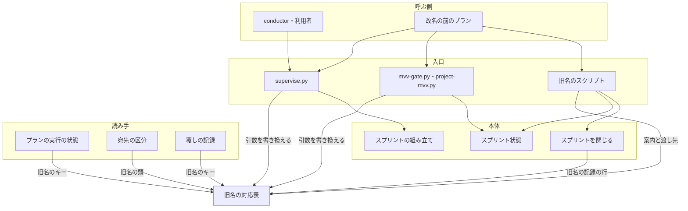
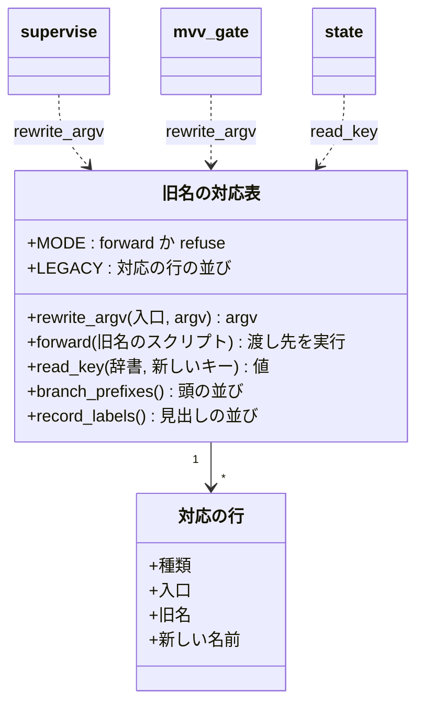
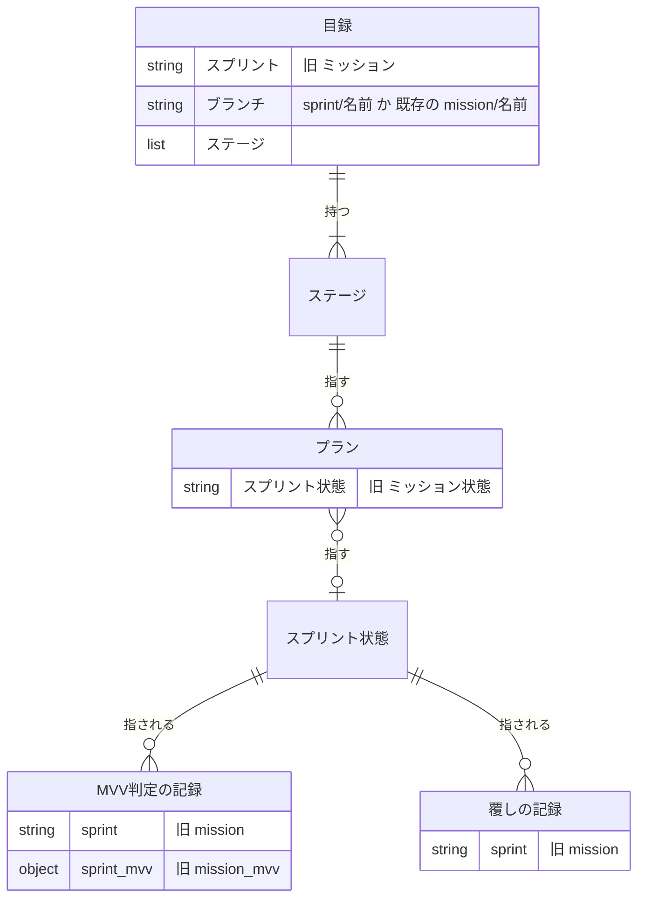
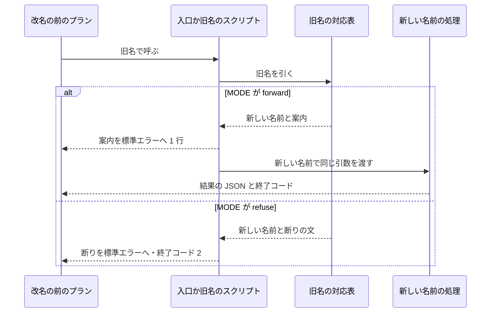
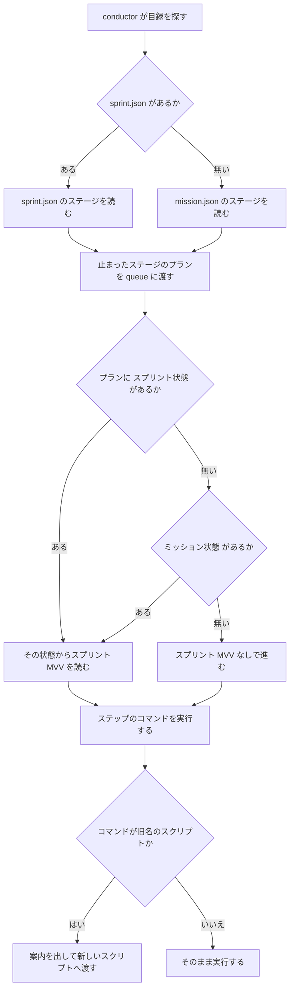
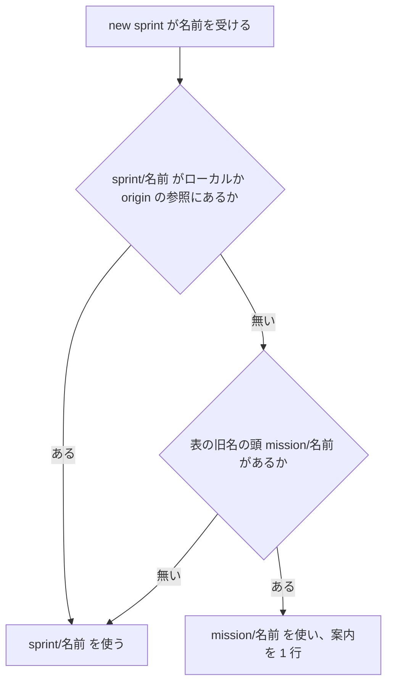
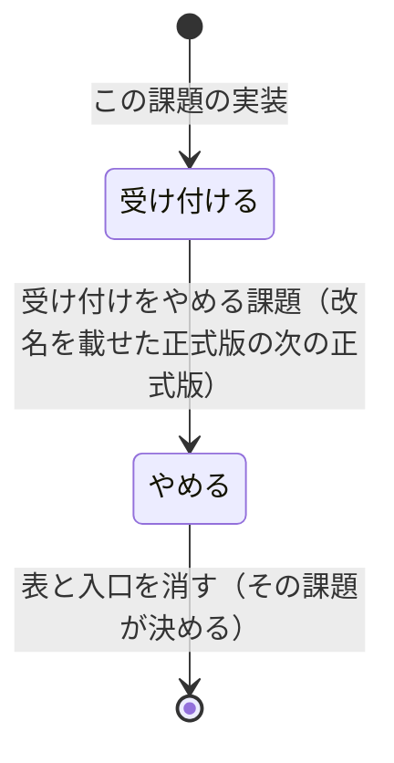

# #1407: 工程の単位「ミッション」を「スプリント」へ改名する

要求と受け入れ条件は #1407 の本文にある（コピーは `issues/issue-1407-requirements.md`）。この文書は「どう作るか」だけを扱う。

**語と名前だけを置き換え、工程の中身は変えない。** 置き換えの対応は要求の前提 1 のとおりである。旧名で呼ばれても動くように、
旧名を新しい名前へ渡す対応を **`lib/legacy_names.py` の表 1 つ**に集める。旧名の受け付けをやめるときは、この表の切り替えを
1 行変える（決定 1・決定 3）。

例として、このスプリント自身（`m1407`）がたどる経過を示す。`m1407` は改名の前に `supervise.py new mission` で組んだため、
プランは旧名を持つ（`~/.local/state/ndf/sv/r-1407/`）。

1. 目録は `mission.json`（キー `ミッション`・`ブランチ`・`ステージ`）で、スプリントブランチは `mission/m1407` である
2. 実装の Pull Request は `mission/m1407` 宛てに出る。改名の後の `pr-steps.py` も、`mission/` で始まる宛先を課題の Pull Request の
   宛先として読む（不変条件 I4）
3. 検査のプラン（`5-check.json`）が `mission/m1407` を `develop` へマージすると、メインディレクトリのスクリプトが改名の後の版になる
4. 続く配布のプラン（`6-release.json`）は、改名の後のスクリプトで流れる。conductor は目録 `mission.json` の `ステージ` を読んで
   続きを流す（`sprint.json` は無い）。止まったプランは `supervise.py queue` にそのまま渡せば、止まった所から進む（AC5）

同じことを改名の後に始めると、次のようになる。

```bash
supervise.py new sprint --name m1500 --worktree /work/ai-plugins --issue 1500 --version 10.18.0-dev.1
```

1. 目録は `sprint-m1500/sprint.json`（キー `スプリント`・`ブランチ`・`ステージ`）に書かれる
2. スプリントブランチは `sprint/m1500` になり、ステージの名前は「スプリントブランチ」、プランのファイルは `3-sprint-branch.json` になる
3. 旧名 `supervise.py new mission --name m1500 ...` で打っても、同じ目録とプランが書かれる。標準エラーに次の 1 行が出る

```text
supervise.py new mission は new sprint へ改名した。new sprint で呼ぶ（旧名の受け付けは、改名を載せた正式版の次の正式版でやめる）
```

## ドメインモデル

### コンテキスト

| コンテキスト | 何の語が 1 つの意味に決まるか |
| --- | --- |
| NDF の工程（`ndf-workflow`） | スプリント・スプリント状態ファイル・スプリントブランチ・スプリント課題・スプリント MVV・根拠の項目 |
| NDF のリリース（`ndf-release`） | リリース記録（行の見出し `スプリント:`） |

**関係は共有カーネルである。** 2 つのコンテキストは「スプリント」の語とリリース記録の行の形を共有する。書くのは `release`
（`ndf-release`）、読むのは `sprint-close.py`（`ndf-workflow`）で、どちらも同じ NDF の中で一緒に変える。

### 集約

| 集約 | 持ち主（書き換えてよいもの） | 根 | エンティティ | 値オブジェクト |
| --- | --- | --- | --- | --- |
| スプリントのプラン | `supervise.py new sprint`（`supervise_lib/sprint.py`・`sprint_waves.py`・`release_templates.py`） | 目録 `sprint.json` | ステージ・プラン | スプリントの名前・スプリントブランチ名・状態のパス（プランの `スプリント状態`） |
| スプリント状態 | `sprint-state.py` | スプリント状態ファイル | プランの行・承認ゲートの記録 | スプリント MVV の参照・プロジェクト MVV の参照・版 |
| MVV 判定の記録 | `mvv-gate.py` | `mvv-gate.jsonl` の 1 行 | — | 状態のパス（`sprint`）・スプリント MVV の参照（`sprint_mvv`） |
| 覆しの記録 | `sprint-state.py gate --by user`（`lib/project_mvv_signals.py`） | `project-mvv-signals.jsonl` の 1 行 | — | 状態のパス（`sprint`） |
| 旧名の対応表 | `lib/legacy_names.py` | 表 `LEGACY` | 対応の行 | 旧名・新しい名前・受け付けの切り替え（`MODE`） |

**目録とスプリント状態ファイルは別のファイルで、書き手は 1 つずつである。** `supervise.py new sprint` が書くのは
目録 `<out>/sprint.json` とステージごとのプランだけで、スプリント状態ファイルはパスを値としてプランの `スプリント状態` に写すだけで
開きも書きもしない。`sprint-state.py`（`init` / `update` / `gate`）が書くのはスプリント状態ファイルだけで、目録とプランを書かない。

**旧名の対応表は、ほかの集約を書き換えない。** 入口（`supervise.py`・`mvv-gate.py`・`project-mvv.py`・旧名のスクリプト）が
引数を渡す前に表を引き、読み手（`supervise_lib/state.py`・`lib/pr_mode.py`・`lib/project_mvv_signals.py`・`sprint-close.py`）が
旧名のキーを読むときに表を引く。旧名のファイルとキーは読むだけで、書くのは常に新しい名前である。

### 不変条件

| # | 集約 | 条件 | 破れたときの扱い |
| --- | --- | --- | --- |
| I1 | 旧名の対応表 | 受け付けの切り替え（`MODE`）が「受け付ける」のとき、旧名の呼び出しは、新しい名前の呼び出しと同じ結果（書き出すファイル・結果の JSON・終了コード）を返し、標準エラーに新しい名前を 1 行で案内する | テストが落ちる。旧名の入口を表の経路へ戻す |
| I2 | 旧名の対応表 | 旧名は `lib/legacy_names.py` の表にだけ書く。入口と読み手は表を引き、旧名の文字列を自分で持たない。同じ役割の関数を旧名と新名で 2 つ持たない | テストが落ちる（旧名の文字列を表の外で探す） |
| I3 | スプリント状態・スプリントのプラン・MVV 判定の記録 | 旧名のファイルとキー（目録 `mission.json`・プランの `ミッション状態`・記録の `mission`）は読むだけで、書き換えない。新しく書くのは新しい名前だけ | テストが落ちる（旧名の入力のハッシュが変わる） |
| I4 | スプリントのプラン | `mission/<名前>` があり `sprint/<名前>` が無いスプリントは、`mission/<名前>` を使い続ける。宛先が `mission/` で始まる Pull Request も、課題の Pull Request として扱う | テストが落ちる |
| I5 | （語の全体） | MVV の Mission の意味の語と識別子（`## Mission` の見出し・MVV の候補の `mission` のキー・`Mission` の項目の番号）は変えない | テストが落ちる（プロジェクト MVV の読み取りと候補の出力の既存テスト） |
| I6 | 旧名の対応表 | 受け付けの切り替え（`MODE`）を「やめる」にすると、旧名の呼び出しは新しい名前を示して終了コード 2 で止まり、何も書かない。I1 と I6 は `MODE` の値で排他で、どちらか一方だけが効く | テストが落ちる |
| I7 | スプリントのプラン | 同じ引数の `new sprint` は、改名の前の `new mission` と名前の置き換えを除いて同じステージ・プラン・承認ゲートを書き出す（AC8） | テストが落ちる。置き換え以外の差分を戻す |

### ドメインイベント

| # | イベント | 発生元 | 受け手 |
| --- | --- | --- | --- |
| E1 | 用語集の語を置き換え、旧名を廃止した語に載せた | 実装の最初のコミット | 用語チェック（`glossary.py check`） |
| E2 | 本文・コード・ファイル名をスプリントへ置き換えた | 実装のコミット | 既存のテスト・構造チェック |
| E3 | 利用者がスプリントを始めた（`supervise.py new sprint`） | 利用者か conductor | `supervise_lib/sprint.py`（旧名 `new mission` は旧名の対応表を経て同じ所へ渡る） |
| E4 | スプリントブランチを作った（`sprint/<名前>`） | スプリントブランチのプラン | `supervise_lib/sprint_waves.py`（表を引き、`sprint/<名前>` が無く `mission/<名前>` があるときだけ `mission/<名前>` をブランチにする。両方あれば `sprint/<名前>`。I4）・`lib/pr_mode.py`（表の旧名の頭 `mission/` の宛先も課題の Pull Request と判定する）。`worktree-setup.sh` は渡された `--from` を使うだけ、`pr-steps.py` は `lib/pr_mode.py` の判定を使うだけで、どちらも旧名の頭を持たない（I2） |
| E5 | 改名の前に始めた実行を再開した | 利用者か conductor が既存のプランを `queue` に渡した | `supervise_lib/state.py`（`ミッション状態` を読む）・旧名のスクリプト（新しいスクリプトへ渡す） |
| E6 | 旧名の受け付けを外した | 受け付けをやめる課題（決定 4）の実装 | 旧名の対応表（切り替えを「やめる」へ）。旧名で呼ぶと終了コード 2 |

### 用語

| 用語 | 意味 | 用語集への反映 |
| --- | --- | --- |
| スプリント | 1 つの版として出す課題と Pull Request のセット。期間ではなく、1 つの版として出す中身で切る。工程はスプリント単位で 1 回ずつ通し、モードもスプリントで 1 つにする | 追加（要求の PR で済み）。E1 で `source` を `plugins/ndf/skills/development-workflow/references/glossary.md` にし、`deprecated` に旧名を載せる |
| スプリント状態ファイル | スプリントのプラン・done・承認ゲートの記録・MVV・版を持つファイル（パスは呼ぶ側が決め、手順書の例は `sprint-state.json`。目録 `sprint.json` とは別のファイル） | 追加（要求の PR で済み）。E1 で `source` と `deprecated` をスプリントと同じに直し、登録済みの意味「…を持つファイル（`sprint.json`）」を左の意味（パスは呼ぶ側が決める。例 `sprint-state.json`。目録 `sprint.json` とは別のファイル）へ書き換える（`docs/glossary/glossary.json` と `docs/glossary.md`） |
| スプリントブランチ | 課題の Pull Request を集め、ベースブランチへの Pull Request をスプリントで 1 本にするブランチ（`sprint/<名前>`） | 追加（要求の PR で済み）。E1 で `source` と `deprecated` をスプリントと同じに直す |
| スプリント課題 | スプリントに含まれる Pull Request の本文が、閉じる語で指す課題 | 追加（要求の PR で済み）。E1 で `source` と `deprecated` をスプリントと同じに直す |
| スプリント MVV | スプリント単位の MVV。プロジェクト MVV の範囲での具体化 | 追加（要求の PR で済み）。E1 で `source` と `deprecated` をスプリントと同じに直す |
| 根拠の項目 | 判断の記録と設計の決定の記録に残す MVV の項目の番号。スプリント MVV の項目は頭に「スプリント」を付ける（スプリント Value 4。R の番号はそのまま） | 意味の変更（E1） |

**廃止する 5 語の行き先**（E1。旧名の語はそれぞれの新しい語の `deprecated` へ移し、元の語の行は消す）:

| 旧名の語 | 載せる先 | 一緒に移す既存の `deprecated` |
| --- | --- | --- |
| ミッション | スプリント | — |
| ミッション状態ファイル | スプリント状態ファイル | 移す（1 語） |
| ミッションブランチ | スプリントブランチ | 移す（1 語） |
| ミッション課題 | スプリント課題 | 移す（1 語） |
| ミッション MVV | スプリント MVV | — |

**目録を「ミッション状態ファイル」と呼ぶ 5 か所は「目録」へ書き換える**（E2。語の置き換えを機械的に当てない）。
`agent-layers.md:77`（ステージの置き場）・`agent-layers.md:83`（仕上げは「ミッション状態ファイルの外」＝目録のステージの外）・
`agent-layers.md:273`（承認の後に次のステージの `command` を打つ）・`waiting.md:154`（プランを書き出したときにできるもの）・
`context-window.md:199`（再開の表の 4 行目）は、キー `ステージ` とステージの `command` を持つ目録（`<out>/mission.json`。
`supervise_lib/mission.py:396-398`）を「ミッション状態ファイル」と呼んでいる。これをそのまま「スプリント状態ファイル」へ置き換えると、
再開のときと承認の後に conductor が `ステージ`・`command` をスプリント状態ファイルの側で探す。5 か所は「目録（`<out>/sprint.json`）」と書く。

**スプリント状態ファイルの例を `mission.json` と書く箇所は `sprint-state.json` へ書き換える**（E1・E2。ファイル名の対応
`mission.json → sprint.json` を当てない）。`relay.md:186`（「ミッション状態ファイル `mission.json`（プランの出力先に置く）」）・
`relay.md:190`〜`213`（`mission-state.py init ~/.local/state/ndf/sv/r7/mission.json`・`gate` / `update` / `render` / `next` / `status` の
`<mission.json>`・`$O/mission.json`）・用語集の出典 `references/glossary.md:171`（スプリント状態ファイルの行の「`mission.json`」）と
`:62`（スプリントの行の「状態のファイル `mission.json`」）は、スプリント状態ファイルの例に `mission.json` を使っている。
`sprint.json` へ置き換えると状態ファイルが目録と同じ `$O/sprint.json` になり、`sprint-state.py init` が別の形の JSON を見て
終了コード 1 で止まる（`relay.md:186`・`mission-state.py:128`）。これらは `sprint-state.json`（`$O/sprint-state.json`・
`<sprint-state.json>`）と書く。目録の `mission.json`（`waiting.md:167` の `new mission` の出力など）だけを `sprint.json` にする。

**意味の文だけを直す語**（E1）: レッドライン・MVV・MVV 判定・MVV の照合・根拠の項目・実行計画・マイルストーン・リリース記録・
conductor・ステージ・resume の 11 語。意味の文の「ミッション」を「スプリント」へ、`new mission` を `new sprint` へ置き換える。

**`deprecated_code` に `mission` を載せない**（決定 5）。

## 機能一覧

| # | 機能 | 誰が使うか |
| --- | --- | --- |
| F1 | スプリントのプランを書き出す（`supervise.py new sprint`） | conductor |
| F2 | スプリントの検査のプランを書き出す（`supervise.py new check --sprint`） | conductor |
| F3 | スプリント状態を作り、更新し、承認ゲートを記録する（`sprint-state.py`） | conductor・プランのステップ |
| F4 | スプリントを閉じる（`sprint-close.py`） | 本番のプランのステップ |
| F5 | MVV 判定と MVV の節を組む（`mvv-gate.py check --sprint`・`project-mvv.py --sprint`・`--kind sprint`） | プランのステップ・worker |
| F6 | 旧名で呼ばれたら新しい名前へ渡し、1 行で案内する | 改名の前のプラン・conductor |
| F7 | 改名の前に始めた実行を再開する | conductor |
| F8 | 工程の単位を「スプリント」の語で説明する（Skill・参照・README・指示書・用語集） | 利用者・AI |

## 構成要素

| 要素 | 責務 | 変え方 |
| --- | --- | --- |
| 旧名の対応表（`lib/legacy_names.py`） | 旧名と新しい名前の対応・受け付けの切り替え・案内の文面・引数の書き換え・旧名のキーの読み取り | 新設 |
| スプリントの組み立て（`supervise_lib/sprint.py`・`sprint_waves.py`） | `new sprint` / `new close` のステージとプランを組み、目録 `sprint.json` を書く | `mission.py`・`mission_waves.py` から改名。関数名の `mission` を `sprint` へ |
| 引数の定義（`supervise_lib/new_args.py`） | `new` の種別と引数 | 種別 `mission` → `sprint`、`--mission` → `--sprint` |
| 入口（`supervise.py`・`mvv-gate.py`・`project-mvv.py`） | 引数を解釈する前に旧名の対応表で書き換える | 解釈の前に 1 行を足す |
| スプリント状態（`sprint-state.py`） | 状態ファイルの操作 | `mission-state.py` から改名 |
| スプリントを閉じる（`sprint-close.py`） | 配布の記録を読み、スプリント課題を閉じる | `mission-close.py` から改名。記録の行の見出しは表から読む |
| 旧名のスクリプト（`mission-state.py`・`mission-close.py`・`bundle-close.py`） | 表を引いて案内を出し、新しいスクリプトへ引数をそのまま渡す | 数行の入口にする（決定 2） |
| スプリント MVV（`lib/sprint_mvv.py`） | `sprint-state.py init` のスプリント MVV の写し | `lib/mission_mvv.py` から改名（旧名のモジュールは残さない） |
| プランの実行の状態（`supervise_lib/state.py`） | プランの `スプリント状態` からスプリント MVV を読む | 鍵を表から引いて読む |
| 宛先の区分（`lib/pr_mode.py`） | 宛先が `sprint/`（と表の旧名の頭）で始まれば課題の Pull Request と判定する | 区分の値 `mission` → `sprint` |
| MVV の節と根拠（`lib/project_mvv.py`・`project_lib/mvv_llm.py`） | 根拠の項目の頭「スプリント」・判断の決まりの文・種別 `sprint` | 語の置き換え。MVV の Mission の語は変えない（I5） |
| 覆しの記録（`lib/project_mvv_signals.py`） | 同じ状態の直前の判定を探す | 記録のキー `sprint` を書き、読むときは表の旧名のキーも読む |
| 本文（Skill・`references/`・README・エージェント定義・フックの文面・`docs/`・指示書・共通原則） | 工程の単位を説明する | 語の置き換え。指示書と共通原則は承認ゲート 1 の承認の範囲だけ（前提 7） |
| 用語集（`docs/glossary/glossary.json`・`glossary.md` 2 本） | 語の定義 | E1 |
| 構造チェックの許可（`scripts/script-structure-allow/`） | 大きいファイルの許可 | `mission-state.py` の 2 件のファイル名とパスを `sprint-state.py` へ |
| 進め方の宣言（`.ndf/pace.json`） | 変更の範囲の区分（`areas`） | 「駆動」の `mission-state.py` を `sprint-state.py` へ。C7 のため承認ゲート 1 で承認を得る（決定 10） |



**図に含めない要素**: 引数の定義・本文・用語集・構造チェックの許可・進め方の宣言・スプリント MVV・MVV の節と根拠。どれも語と
名前の置き換えだけで、呼び出しの関係を変えない。

### パッケージ・モジュール構成

```text
plugins/ndf/scripts/
├── sprint-state.py            # mission-state.py から改名
├── sprint-close.py            # mission-close.py から改名
├── mission-state.py           # 旧名の入口（新設。数行）
├── mission-close.py           # 旧名の入口（新設。数行）
├── bundle-close.py            # 旧名の入口。渡し先を sprint-close.py へ変える
├── lib/
│   ├── legacy_names.py        # 新設
│   ├── sprint_mvv.py          # mission_mvv.py から改名
│   └── pr_mode.py             # 区分の値を変える
├── supervise_lib/
│   ├── sprint.py              # mission.py から改名
│   └── sprint_waves.py        # mission_waves.py から改名
└── tests/
    ├── test_sprint_state.py                # test_mission_state.py から改名
    ├── test_sprint_close_issues.py         # test_mission_close_issues.py から改名
    ├── test_sprint_close_merge_green.py    # test_mission_close_merge_green.py から改名
    └── test_legacy_names.py                # 新設。旧名の呼び方のテストをここへ集める（決定 7）
```

## 構造



**対応の行の種類は 5 つである。** `MODE` が効くのは呼び出しの 3 種類（引数・選択肢・スクリプト）で、読み取りの 2 種類
（キー・頭と見出し）は `MODE` に関わらず読む。読み取りは受け付けをやめる課題で行ごと消す（決定 3）。

| 種類 | 入口 | 旧名 | 新しい名前 |
| --- | --- | --- | --- |
| 引数 | `supervise.py` | `new mission` | `new sprint` |
| 引数 | `supervise.py` | `new check --mission` | `new check --sprint` |
| 引数 | `mvv-gate.py` | `check --mission` | `check --sprint` |
| 引数 | `project-mvv.py` | `--mission` | `--sprint` |
| 選択肢 | `project-mvv.py` | `--kind mission` | `--kind sprint` |
| スクリプト | 旧名のファイル | `mission-state.py` | `sprint-state.py` |
| スクリプト | 旧名のファイル | `mission-close.py` | `sprint-close.py` |
| スクリプト | 旧名のファイル | `bundle-close.py` | `sprint-close.py` |
| キー | `supervise_lib/state.py` | プランの `ミッション状態` | `スプリント状態` |
| キー | `lib/project_mvv_signals.py` | 記録の `mission` | `sprint` |
| 頭と見出し | `lib/pr_mode.py`・`supervise_lib/sprint_waves.py` | ブランチの頭 `mission/` | `sprint/` |
| 頭と見出し | `sprint-close.py` | 記録の行 `ミッション:`・`まとまり:` | `スプリント:` |

**`rewrite_argv` は `argparse` の前に働く。** 旧名の種別とオプションを新しい名前へ置き換えた `argv` を返し、置き換えるたびに
案内を 1 行、標準エラーへ出す。オプションの値（`--kind mission` の `mission`）は、直前の語がそのオプションのときだけ置き換える。
`--mission=<値>` の形も置き換える。

## データ構造

永続データは、ファイルの名前と JSON のキーと記録の行の見出しだけが変わる。形は変えない。



| 対象 | 新しい名前 | 旧名 | 空を許すか | 旧名の扱い |
| --- | --- | --- | --- | --- |
| 目録のファイル | `<out>/sprint.json`（既定の `<out>` は `sprint-<名前>`） | `mission.json`（既定 `mission-<名前>`） | — | 読み手はコードに無く conductor だけである。再開の手順（`context-window.md` の再開の表）に「`sprint.json` が無ければ `mission.json`」と書く |
| 目録のキー | `スプリント` | `ミッション` | 許さない | 同上 |
| プランのキー | `スプリント状態` | `ミッション状態` | 許す（空は「状態を渡さずに組んだ」） | `state.py` が表の `read_key` で新しいキー → 旧名のキーの順に読む |
| MVV 判定の記録のキー | `sprint`・`sprint_mvv` | `mission`・`mission_mvv` | `sprint_mvv` は許す（空は「スプリント MVV なしで判定した」） | 覆しの記録の読み手が `read_key` で両方を読む。`mvv-gate.jsonl` の既存の行は書き換えない |
| 覆しの記録のキー | `sprint` | `mission` | 許さない | 書くのは新しいキーだけ。既存の行は書き換えない |
| スプリント状態ファイル | 呼ぶ側がパスを渡す（手順書の例は `sprint-state.json`。目録 `sprint.json` と同じパスにしない） | 手順書の例は `mission.json` | — | 状態の中身のキーは `mission` を含まないため、形は変わらない |
| リリース記録の行 | `スプリント: PR #<番号> / ...` | `ミッション:`・`まとまり:` | — | `sprint-close.py` の `parse_record` が表の見出しをすべて読む |
| スクリプトの出力 | `project-mvv.py` の `sprint_mvv`・`sprint-close.py` の `sprint_prs`・`sprint-state.py status` の `スプリント:` の行 | `mission_mvv`・`mission_prs`・`ミッション:` | — | 旧名を併記しない（決定 9） |

**時系列の記録は上書きしない。** `mvv-gate.jsonl` と `project-mvv-signals.jsonl` は追記だけの事象の記録で、改名の前の行を
書き換えずに残す。改名の後の行は新しいキーで積む。読み手が両方のキーを読むので、同じスプリントの判定の並びが途切れない。

| 機能 | 目録 | プラン | スプリント状態 | MVV 判定の記録 | 覆しの記録 |
| --- | --- | --- | --- | --- | --- |
| F1 スプリントのプランを書き出す | C | C | R | — | — |
| F2 検査のプランを書き出す | — | C | R | — | — |
| F3 スプリント状態を扱う | — | R | CU | R | C |
| F4 スプリントを閉じる | — | — | — | — | — |
| F5 MVV 判定と MVV の節 | — | R | RU | C | — |
| F6 旧名で呼ぶ | — | — | — | — | — |
| F7 改名の前の実行を再開する | R | R | RU | R | R |

**移行はしない。** 旧名のファイルとキーを新しい名前へ写す処理を作らない（要求の前提 5）。旧版の NDF へ戻しても、旧名の
ファイルとキーはそのまま残っているため読める。改名の後に書いた新しいキーは、旧版からは読めない（未確認のまま残ること）。

## 入出力の契約

| 名前 | 入力 | 出力 | 失敗の形 | 互換性 |
| --- | --- | --- | --- | --- |
| `supervise.py new sprint` | `new mission` と同じ引数。`--name` の説明は「ブランチは `sprint/<名前>`」 | 目録 `<out>/sprint.json` とステージごとのプラン。結果の JSON は今の形で、`summary` の語が「スプリント」 | 今と同じ（引数の誤りは 2、pace の拒否は 1） | 旧名 `new mission` は表を経て同じ結果。案内を 1 行 |
| `supervise.py new check --sprint <状態>` | `--mission` と同じ | 今と同じ | 今と同じ | 旧名 `--mission` は表を経て同じ結果。案内を 1 行 |
| `sprint-state.py <副命令> <状態> ...` | `mission-state.py` と同じ副命令と引数。位置引数の名前は `sprint` | 今と同じ結果の JSON。`TOOL` は `sprint-state`。`status` の見出しの行は `スプリント:` | 今と同じ（前提の欠けは 3、読めないと 2） | 旧名 `mission-state.py` は案内を 1 行出して同じ引数で `sprint-state.py` を実行する。終了コードは渡し先のもの |
| `sprint-close.py ...` | `mission-close.py` と同じ | 今と同じ。`TOOL` は `sprint-close`。`--prs` の説明は「スプリントの PR」 | 今と同じ | 旧名 `mission-close.py`・`bundle-close.py` は同上 |
| `mvv-gate.py check --sprint <状態> ...` | `--mission` と同じ | 記録の行のキーが `sprint`・`sprint_mvv` | 今と同じ | 旧名 `--mission` は表を経て同じ結果 |
| `project-mvv.py ... --sprint <状態>`・`--kind sprint` | `--mission`・`--kind mission` と同じ | `--format json` の `sprint_mvv` | 今と同じ | 旧名の引数と選択肢は表を経て同じ結果。出力のキーは旧名を併記しない |
| 案内の 1 行 | — | `<旧名> は <新しい名前> へ改名した。<新しい名前> で呼ぶ（旧名の受け付けは、改名を載せた正式版の次の正式版でやめる）` を標準エラーへ | — | 標準出力の結果の JSON は変えない。読み手（プラン・conductor）は標準出力だけを読む |
| 受け付けをやめた後の旧名の呼び出し（`MODE = "refuse"`） | 旧名の引数・選択肢・スクリプト | 標準エラーに `<旧名> の受け付けはやめた。<新しい名前> で呼ぶ` | 終了コード 2。何も書かない | 受け付けをやめる課題（決定 4）で切り替える |

**ステップの ID とステージの名前も変わる。** スプリントブランチのプランのステップの ID は `sprint-branch`、ステージの名前は
「スプリントブランチ」、プランのファイルは `<番号>-sprint-branch.json` になる。これらを読むコードは無く、改名の前のプランは
自分のファイルの名前と ID のまま流れる。

## 処理の流れ

旧名で呼ばれたとき（E3・E5）:



改名の前に始めた実行を再開するとき（E5・AC5）:



スプリントブランチの名前を決めるとき（E4・I4）:



参照を見るのは `git for-each-ref refs/heads/<頭><名前> refs/remotes/origin/<頭><名前>` で、fetch はしない（決定 6）。

受け付けの切り替えの状態:



「受け付ける」から直接消す遷移は無い。旧名で呼んだ人が、黙って失敗せずに新しい名前を知る版を必ず通す（AC7）。

## 非機能の実現方式

| 大項目 | 要求の条件 | 実現方式 | 確かめ方 |
| --- | --- | --- | --- |
| 運用・保守性 | 旧名の受け付けは 1 か所（新しい名前へ渡す入口）にまとめ、前提 3 の版で消せる形にする。同じ役割の関数を旧名と新名で 2 つ持たない | 旧名は `lib/legacy_names.py` の表だけに書き、入口と読み手は表を引く。旧名のスクリプトは表の `forward` を呼ぶだけの数行にする。受け付けをやめるのは `MODE` の 1 行 | 旧名の文字列が表の外に無いことをテストが見る（I2）。`MODE = "refuse"` にした呼び出しのテスト（I6） |
| 移行性 | 改名の前に始めた実行が、利用者の操作なしで再開できる（AC5）。旧版の NDF へ戻しても、改名の前の状態ファイルが読める（前提 5） | 旧名のスクリプトのパスを残し、プランのキー・記録のキー・ブランチの頭を表で読む。旧名のファイルとキーは書き換えない | 改名の前のプランと状態の写しを使ったテスト（AC5）。旧名の入力のハッシュが処理の前後で変わらないテスト（I3）。手動確認: `~/.local/state/ndf/sv/` の 1 件の写しを `queue` に渡す |

## 決定の記録

決定 1〜12 は [issue-1407-design-decisions.md](issue-1407-design-decisions.md) にある。

## テスト設計

| 受け入れ条件・不変条件 | どの振る舞いで縛るか | どう壊したら落ちるべきか |
| --- | --- | --- |
| AC1 | `glossary.py check --diff origin/develop --rules all` が 0 で終わり、5 語の旧名が新しい語の `deprecated` にある（用語集の構造チェック） | 旧名の語の行を用語集に残す。`deprecated` から旧名を落とす |
| AC2 | 対象範囲の `grep -rn ミッション` の残りが、MVV の Mission の意味の行と決定 8 の素材だけ（検証手段の grep。文言のテストは書かない） | 本文の 1 か所に工程の単位の「ミッション」を残す |
| AC3 | `new sprint` が `sprint.json`・`sprint/<名前>`・`sprint-branch` のプランを書き出す。`new check --sprint` が状態の課題を読む | 目録の名前を `mission.json` に戻す。ブランチの頭を戻す。`--sprint` の値を読まない |
| AC4 | 旧名の 3 つの呼び方（`new mission`・`--mission`・旧名のスクリプト）が新しい名前と同じ結果と終了コードを返し、標準エラーに 1 行の案内がある。`mission/<名前>` の参照だけがあるリポジトリで `new sprint` を打つと `mission/<名前>` を使う | 旧名の入口が案内を出さない。案内が 2 行になる。旧名の呼び出しの終了コードが変わる。既存の `mission/` を無視して `sprint/` を切る |
| AC5 | 改名の前の形のプラン（`ミッション状態` を持ち、旧名のスクリプトのパスを埋めたもの）と目録を `queue` に渡すと、スプリント MVV を読み、旧名のスクリプトのステップが通る。処理の後も旧名のファイルのハッシュが同じ | `state.py` が旧名のキーを読まない。旧名のスクリプトを消す。旧名のファイルを書き換える |
| AC6 | 全体テスト（`uv run --frozen --project . --all-extras pytest . -q -n 4`）が通る。AC3〜AC5 の新旧の両方にテストがある | — |
| AC7 | `MODE` を `refuse` にした表で旧名を呼ぶと、新しい名前を含む 1 行を出して終了コード 2 で止まり、ファイルを書かない。決めの記録の規則は設計の決定 4 と、リリースの時の `docs/ndf-version-decisions.md` で見る | `refuse` でも渡してしまう。終了コードが 0 になる |
| AC8 | 同じ引数の `new sprint` と改名の前の `new mission` の出力（ステージ・プラン・承認ゲート）が、名前の置き換えを除いて一致する（既存の `test_supervise_new.py` ほかを改名した形で通す） | ステージの順・ゲートの文・pace の分岐のどれかを変える |
| I1 | AC4 と同じ | 同上 |
| I2 | 旧名の文字列（`mission-state.py`・`ミッション状態`・`mission/` など表の旧名）が、`lib/legacy_names.py`・旧名の入口のファイル・`test_legacy_names.py` の外の `plugins/ndf/scripts/` のコードに無い | 入口の 1 つに旧名の分岐を直接書く |
| I3 | 旧名の目録・プラン・記録を読む処理の前後で、そのファイルのハッシュが同じ。新しく書く記録のキーは `sprint` | 読んだ後に新しい名前で書き戻す |
| I4 | `mission/<名前>` の参照だけがあるとき `mission/<名前>`、`sprint/<名前>` があるときは `sprint/<名前>`、どちらも無ければ `sprint/<名前>`。`pr_target` が `mission/x` と `sprint/x` の両方を課題の宛先と読む | 参照の判定の順を逆にする。`pr_target` から旧名の頭を落とす |
| I5 | プロジェクト MVV の本文の読み取り（`## Mission`）と候補の出力（`mission` のキー）の既存テストが通る | MVV の `mission` を `sprint` へ置き換える |
| I6 | AC7 と同じ | 同上 |
| I7 | AC8 と同じ | 同上 |

## 未確認のまま残ること

| 項目 | 内容 |
| --- | --- |
| 改名を載せる正式版の版数 | リリースで決まる（要求の前提 3）。決まった時点で受け付けをやめる課題と決めの記録へ書き足す（決定 4） |
| 旧版へ戻したときの新しいキー | 改名の後に書いた `sprint`・`スプリント状態`・`sprint.json` は、旧版の NDF からは読めない。戻すのは改名の後に始めた実行を捨てるときに限られると見ているが、実際に戻した例は無い |
| 承認ゲート 1 の承認の範囲 | `AGENTS.md`・`CLAUDE.md`・NDF の共通原則（`plugins/ndf/scripts/data/ndf-common-principles.md`・`issues/ndf-common-principles.md`）・`.ndf/pace.json` の語とパスの置き換えを認めるか（前提 7・決定 10）。認められなかったものは置き換えず、AC2 の grep の残りとして報告する |
| origin の参照が古いリポジトリ | 決定 6 はローカルの参照だけを見る。改名の前のスプリントブランチを別の端末で作り、この端末で fetch していない場合は `sprint/<名前>` を新しく切る。NDF の 3 層ではスプリントを始めた端末で続きを流すため、起きないと見ている |
