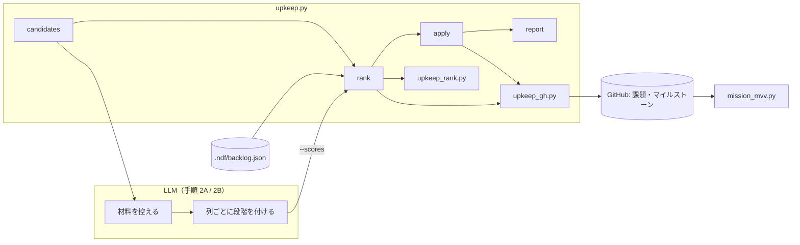
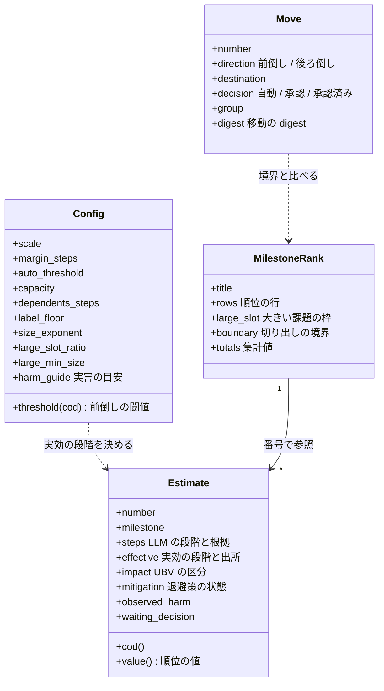
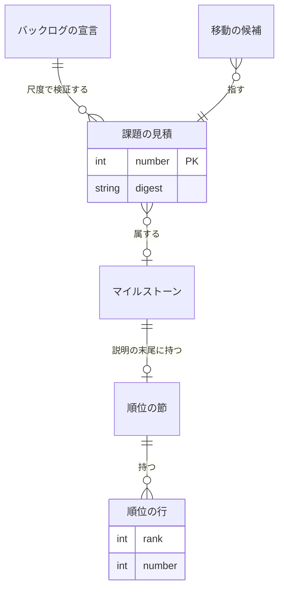
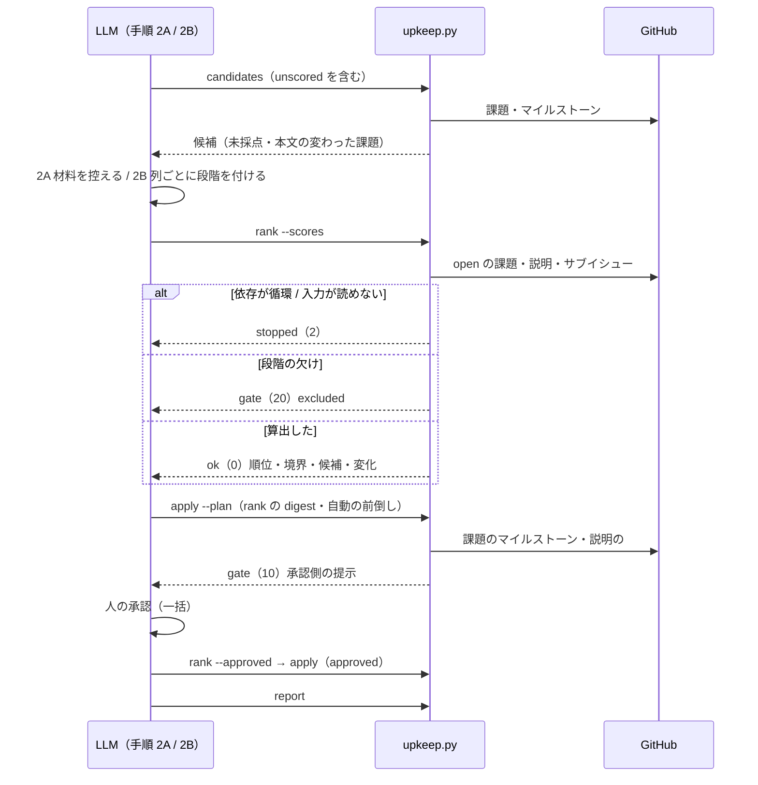
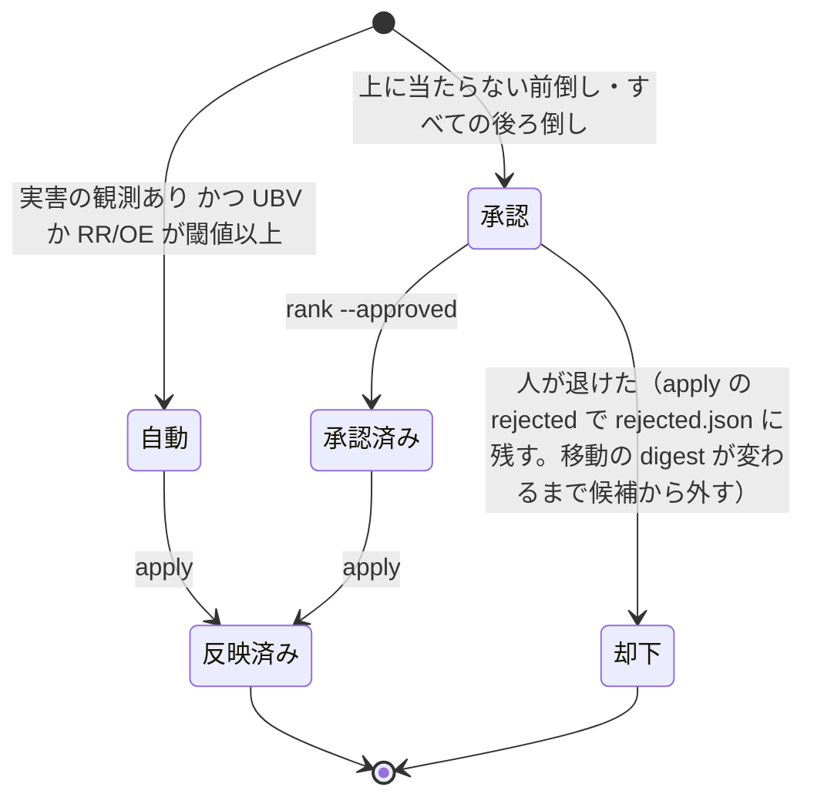

# #1429: 課題の順位付けと前倒し・後ろ倒しを issue-upkeep に足す

この文書は「どう作るか」だけを扱う。作るのは次の 8 つの機能である。

## 機能一覧

| # | 機能 | 誰が使うか |
| --- | --- | --- |
| F1 | 未採点・本文の変わった課題を棚卸しの対象に入れる | 棚卸しの担当（`candidates`） |
| F2 | 課題ごとに段階の材料を控え、列ごとに全件の段階を付ける | 棚卸しの担当（手順 2A / 2B） |
| F3 | マイルストーンごとの順位・大きい課題の枠・切り出しの境界・集計値を算出する | 棚卸しの担当（`rank`） |
| F4 | 前倒し・後ろ倒しの候補と扱い（自動 / 承認）を出す | 棚卸しの担当（`rank`） |
| F5 | 自動の前倒しと順位の表を反映し、承認側を一括で提示する | 棚卸しの担当（`apply`）と承認する人 |
| F6 | 前回の順位からの変化と理由を報告する | 棚卸しの担当・読み手（`report`） |
| F7 | 尺度・余白・閾値・容量・被依存の対応表・下限・大きさの指数・枠・実害の目安をリポジトリごとに変える | リポジトリの管理者（宣言）・棚卸しの担当（引数） |
| F8 | スプリント MVV へのコピーから説明の末尾の表を外す | スプリントの開始（`sprint-state.py init --milestone`） |

## 要求と決定の置き場

| 何か | 置き場 |
| --- | --- |
| 要求と受け入れ条件 | #1429 の本文（コピーは `issues/issue-1429-requirements.md`） |
| 調査 | `issues/backlog-prioritization-survey-2026-09-28.md` |
| 調査の論点 0〜8 の決定 | `issues/issue-1429-design-decisions.md`（決定 0〜8） |

この文書の決定は、決定 9 から番号を続ける。

語は #1407 の改名の後の「スプリント」（1 つの版として出す課題と Pull Request のセット）で書く。

## 決定の記録

設計で決めたこと（決定 9〜18）と利用者の決定（決定 19〜23）は `issues/issue-1429-design-decisions.md` にある。

本文が参照する利用者の決定は次の 3 つである。

| 利用者の決定 | 番号 |
| --- | --- |
| 大きい課題の優先 | 決定 21 |
| AI の実施を前提にした費用の見積 | 決定 22 |
| 実害の目安と退避策の扱い | 決定 23 |

## 例: 4 件の課題を並べる

調査の 6 章の 4 件を、仮に次のマイルストーンに置いて 1 回通す。容量だけを引数で 3 と渡し、ほかは宣言の既定値で通す。

| 宣言 | 既定値 |
| --- | --- |
| 尺度 | 1, 2, 3, 5, 8, 13, 20 |
| 余白 | 1 段階 |
| 自動の閾値 | 8 |
| 大きさの指数 | 0.3 |
| 大きい課題の枠 | 0.5 |
| 被依存の対応表 | 0→1, 1→5, 2→8, 3→13, 5→20 |

大きさの段階は AI が実施したときの費用で付けている（決定 22）。UBV は実害の目安（決定 23）の区分の帯の中で付けている。

| 課題 | 置き場 | UBV（区分） | TC | RR/OE | Size | CoD | 順位の値 | 実害の観測 |
| --- | --- | --- | --- | --- | --- | --- | --- | --- |
| #1422 | M1（直近） | 3（表示） | 5 | 2 | 1 | 10 | 10.0 | あり |
| #1382 | M1（直近） | 3（表示） | 1 | 2 | 2 | 6 | 4.9 | なし |
| #1289 | M2 | 5（機能） | 3 | 8（被依存） | 3 | 16 | 11.5 | あり |
| #1399 | 未設定 | 13（全体） | 8 | 8 | 5 | 29 | 17.9 | あり |

順位の値は CoD ÷ Size^0.3 である（決定 21 の A「大きさの効きを弱める」）。#1422 はマージに成功して終了コードだけが誤る（表示、帯 2〜3）。#1399 は取り消した変更が origin へ出る安全機構の欠落（全体、帯 13〜20）である。#1289 は子 2 件（#772・#785）を解放するため、RR/OE が LLM の 5 から被依存の対応表の 8 へ上がる（決定 21 の C「土台の加点」）。

1. **M1 の順位**は順位の値の降順で #1422 → #1382。**大きい課題の枠**は容量 3 × 0.5 の切り捨てで 1 である。M1 に大きい課題（Size 13 以上）が無いので、枠は順位の先頭からの切り出しへ戻る。Size の和は 1 → 3 で、容量 3 に収まる最後の課題 #1382 が**切り出しの境界**になる
2. **前倒しの閾値**は、境界の CoD 6 より大きい尺度の値のうち 1 つ目（余白 1 段階）の 8 である
3. **#1399**（CoD 29 ≥ 8）は前倒しの候補になる。実害の観測があり RR/OE 8 ≥ 自動の閾値 8 なので**自動**で M1 へ移る
4. **#1289**（CoD 16 ≥ 8）も候補になり、実害の観測があり RR/OE 8（被依存）≥ 8 なので**自動**で移る
5. **後ろ倒しの候補**は M1 の CoD 最小の #1382（CoD 6。前倒しの候補の最小 CoD 16 より低い）で、承認に回り、移す先は順序で次の M2 である
6. 自動の前倒しを入れた後の M1 の表（#1399 → #1289 → #1422 → #1382）を M1 の説明の `### 順位` に書く。承認側は棚卸しの提示に一括で並ぶ

一般的な WSJF（α=1）では #1399（5.8）は #1422（10.0）に負け、マイルストーンの中で前へ出ない。α=0.3 では首位になる。
前倒しは今どおり CoD で比べる（決定 0b）。大きい課題（#1142 など）の扱いは決定 21 の試算にある。

## ドメインモデル

### コンテキスト

| コンテキスト | 何の語が 1 つの意味に決まるか |
| --- | --- |
| 課題の棚卸し（`ndf-issue-upkeep`） | 見積の段階・実害の目安・退避策の状態・遅延コスト・順位の値・大きさの指数・大きい課題・大きい課題の枠・切り出しの境界・前倒し・後ろ倒し・容量・余白・人の判断待ち |
| NDF の開発ワークフロー（`ndf-workflow`） | スプリント・マイルストーン・スプリント MVV |

**開発ワークフローが供給者、棚卸しが顧客の関係（顧客 / 供給者）。** 棚卸しは「スプリントはマイルストーンから切り出す」
「スプリント MVV はマイルストーンの説明からコピーする」を変えずに受け取る。供給者は、説明の末尾に棚卸しが置く表を
スプリント MVV へのコピーから外す（決定 16）。

### 集約

| 集約 | 持ち主（書き換えてよいもの） | 根 | エンティティ | 値オブジェクト |
| --- | --- | --- | --- | --- |
| 課題の見積 | 手順 2B（LLM）が付け、`upkeep.py rank` が記録へ保存する | 課題の見積（課題の番号で識別） | — | 見積の段階（段階と根拠の 1 行。UBV は実害の目安の区分も持つ）・退避策の状態・実害の観測・依存の番号・人の判断待ち |
| マイルストーンの順位 | `upkeep.py rank` が算出し、`upkeep.py apply` だけが説明へ書く | マイルストーン | 順位の行 | 切り出しの境界・大きい課題の枠・集計値 |
| 移動の候補 | `upkeep.py rank` が作り、`upkeep.py apply` が反映する。却下の一覧（`rejected.json`）の追加と削除は `upkeep.py apply` だけが行い、`rank` は読むだけで、消す要素を `rank.json` の `metrics.rejected_stale[]` で `apply` へ依頼する | 移動の候補（課題の番号と向き） | 却下の記録（移動の digest で識別） | 扱い（自動 / 承認 / 承認済み / 却下）・移す先 |
| バックログの宣言 | 利用者（`.ndf/backlog.json`。書き換えは C7） | 宣言 | — | 尺度・余白・自動の閾値・容量・被依存の対応表・ラベルの下限・大きさの指数・大きい課題の閾値と枠の割合・実害の目安・アンカー |

ほかの集約は番号で参照する。マイルストーンの順位の行は課題の番号だけを持ち、課題の見積を複製しない（段階は表示のためのコピー）。

### 不変条件

| # | 集約 | 条件 | 破れたときの扱い |
| --- | --- | --- | --- |
| I1 | 課題の見積 | 順位に入る課題は 4 列とも尺度の値で、各列に根拠の 1 行がある | 順位から外し、番号と理由を返す（終了コード 20） |
| I10 | 課題の見積 | UBV の段階は実害の目安の区分の帯の中にある。退避策の状態が `防いでいる` のときだけ、区分を 1 つだけ下げ、その 1 つ下の区分の帯の中の段階も受け付ける（決定 23 の 2）。1 つ下の区分は、目安の区分を帯の下端の降順に並べたときの次の区分で、最下位の区分（既定の `なし`）は下げられない | 順位から外し、番号と理由を返す（終了コード 20） |
| I2 | 課題の見積 | 実効の段階は LLM の段階以上である（ラベルの下限と被依存の対応表は上げる向きにだけ効く） | — （算出の式で保つ） |
| I3 | マイルストーンの順位 | 同じマイルストーンの中で、依存する課題は依存先より後の順位にある | 循環なら順序を出さずに止まる（終了コード 2） |
| I4 | マイルストーンの順位 | 同じ入力（見積・依存・宣言・マイルストーンの順序・前回の表）から同じ出力が出る | — （順位の値は小数 9 桁へ丸めて比べ、同点は CoD の降順 → 番号の昇順で決める） |
| I9 | マイルストーンの順位 | 大きい課題の枠に当てる 1 切れの大きさは、枠（容量 × 枠の割合の切り捨て）以下である。当てる切れが無ければ枠は順位の先頭からの切り出しへ戻る | 枠に収まる切れが無い大きい課題を「分割が要る」として返す（自動で分割しない） |
| I5 | マイルストーンの順位 | マイルストーンの順序（名前の連番と説明の着手の順序）は書き換わらない | — （書き込む先は `### 順位` の節だけ） |
| I6 | マイルストーンの順位 | 説明のうち `### 順位` の節の外は変わらない | 書き込みを止め、`failed` で返す |
| I7 | 移動の候補 | 扱いが「承認」の候補は、承認の記録なしに反映されない | 承認待ち（`needs_approval`）へ回す（終了コード 10） |
| I8 | バックログの宣言 | スクリプトの既定値は一般的な値だけで、ai-plugins のラベルの名前・容量・課題番号を持たない | — （テストが縛る） |

### ドメインイベント

| # | イベント | 発生元 | 受け手 |
| --- | --- | --- | --- |
| E1 | 棚卸しの対象を選んだ | `upkeep.py candidates`（経路 `unscored` を含む） | 手順 2A |
| E2 | 課題ごとに段階の材料を控えた | 手順 2A | 手順 2B |
| E3 | 列ごとに全件の段階と根拠を付けた | 手順 2B | `upkeep.py rank` |
| E4 | 依存を集めた | `upkeep.py rank`（サブイシュー API・説明の並列の組）と手順 2B（本文） | `upkeep.py rank` |
| E5 | 順位を算出した | `upkeep.py rank` | 手順 3・`report` |
| E6 | 前倒し・後ろ倒しの候補を出した | `upkeep.py rank` | 手順 3・棚卸しの提示 |
| E7 | 自動で反映する前倒しと順位の表を書いた | `upkeep.py apply` | `report`・次の棚卸しの `rank`（前回の表） |
| E8 | 承認側の候補を一括で示し、承認か却下を受けた | `upkeep.py apply`（提示）と conductor（承認） | 承認: `upkeep.py rank --approved` → `apply`。却下: `apply` の plan の `rejected` → `rejected.json` → 次の `rank` |
| E9 | 前回の順位からの変化と理由を報告した | `upkeep.py report` | 完了報告 |

### 用語

| 用語 | 意味 | 用語集への反映 |
| --- | --- | --- |
| 容量 | 1 つのスプリントへ切り出す大きさの見積の段階の和の上限。宣言か引数で受け、既定値を持たない | 追加（`ndf-issue-upkeep`） |
| 余白 | 前倒しの候補にするために、遅延コストが切り出しの境界の課題を上回るべき尺度の段階の数。既定は 1 | 追加（`ndf-issue-upkeep`） |
| 自動の閾値 | 前倒しを承認なしに反映するために、実害の大きさかリスク低減のどちらかが届くべき段階。既定は 8 | 追加（`ndf-issue-upkeep`） |
| バックログの宣言 | 尺度・余白・自動の閾値・容量・被依存の対応表・ラベルの下限・大きさの指数・大きい課題の閾値と枠の割合・実害の目安・アンカーを持つ `.ndf/backlog.json` | 追加（`ndf-issue-upkeep`） |
| 実害の目安 | 実害の大きさの見積の段階の帯を、影響範囲の区分（全体 13〜20・機能 5〜8・表示 2〜3・なし 1）で決める表。帯の中の値はアンカーと比べて決める。宣言で変えられる既定値（決定 23） | 追加（`ndf-issue-upkeep`） |
| 退避策の状態 | 退避策・回避策が実際に止まるのを防いでいるか（`防いでいる` / `部分的` / `無い`）。`防いでいる` のときだけ実害の大きさとリスク低減を下げる根拠になる。実害の大きさを下げてよいのは実害の目安の区分を 1 つ下げるまでである（決定 23） | 追加（`ndf-issue-upkeep`） |
| 順位の値 | 遅延コストを大きさの見積の段階の α 乗で割った値。α は大きさの指数。マイルストーンの中の順位を決める | 追加（`ndf-issue-upkeep`） |
| WSJF | 遅延コストを大きさの見積の段階で割った値。人が実施する前提の一般的な形で、順位の値の α=1 に当たる | 意味の変更（`ndf-issue-upkeep`） |
| 大きさの指数 | 順位の値で大きさの見積の段階に掛ける指数 α。0 以上 1 以下で、既定は 0.3（AI が実施する前提。決定 21） | 追加（`ndf-issue-upkeep`） |
| 大きい課題 | 大きさの見積の段階が宣言の閾値（既定は尺度の上から 2 番目、既定の尺度では 13）以上の課題 | 追加（`ndf-issue-upkeep`） |
| 大きい課題の枠 | 容量のうち枠の割合（既定 0.5）の分を、マイルストーンの中で遅延コストが最大の大きい課題の 1 切れへ先に当てる取り決め。容量が無い回は出さない | 追加（`ndf-issue-upkeep`） |
| 切り出しの境界 | マイルストーンの中の順位を、大きい課題の枠に当てた 1 切れを除いて先頭から、大きさの見積の段階の和が容量の残りに収まるまで取ったときの、最後の課題（決定 21 の B） | 意味の変更（`ndf-issue-upkeep`） |
| 分割が要る | 大きい課題の枠に当たったが、枠に収まるサブイシューも無く課題そのものも枠を超える状態。報告に出し、自動で分割しない | 追加（`ndf-issue-upkeep`） |
| 人の判断待ち | 着手の前に人の判断（`needs-decision`・承認ゲート）を要する状態。費用に数えず、順位の値を変えずに印として出す（決定 22） | 追加（`ndf-issue-upkeep`） |
| 後ろ倒しの候補 | 直近のマイルストーンのうち、同じマイルストーンの課題が依存していない課題の中で遅延コストが最も低い 1 件。前倒しの候補の最小の遅延コスト以上のものと、順序で次のマイルストーンが無いときは出さない。前倒しの候補と対にして示す | 意味の変更（`ndf-issue-upkeep`） |

## 構成要素

| 要素 | 変更 | 責務 |
| --- | --- | --- |
| `issue-upkeep/scripts/upkeep_rank.py` | 新規 | 純粋な算出: 設定の合成と検証・実害の目安の帯の判定・実効の段階・CoD と順位の値・依存の合成とトポロジカル順・大きい課題の枠・切り出しの境界・候補と扱い・前回の表との差分・`### 順位` の節の描画と解析。GitHub を呼ばず、終了コードを持たない（誤りは例外で返し、`upkeep.py` が終了コードへ変換する） |
| `issue-upkeep/scripts/upkeep.py` | 変更 | `rank` サブコマンドの追加（GitHub から課題・マイルストーン・サブイシューを読み、記録へ保存し、1 行の JSON を返す）。`candidates` に経路 `unscored` を足し、前の回の `rank.json` を消す。`apply` に表の書き込みと `reschedule` の反映を足す。`report` に変化と候補の節と、大きい課題の枠（分割が要る課題を含む）・人の判断待ちの節を足す。冒頭の docstring |
| `issue-upkeep/scripts/upkeep_gh.py` | 変更 | マイルストーンの説明の読み書き（`Milestones` に説明の取得と PATCH を足す）。書き込みの制限の待ち方は既存の `Gh.call` を使う |
| `scripts/lib/mission_mvv.py` | 変更 | スプリント MVV の節の切り出し（`mvv_sections`）が、`### 並列の組（見込み）` と `### 順位` の節を Value の節から外す（決定 16） |
| `issue-upkeep/SKILL.md` | 変更 | 扱うことに「順位付け」を足して 5 つにする。手順の表に 2C（順位を算出する）を足して 5 つにする。2A の控える項目・2B の突き合わせ・3 の反映・自動で反映してよい変更の表・終了コードの表（10 に前倒し・後ろ倒しの承認を足す）・他のリポジトリで動くこと・完了報告 |
| `issue-upkeep/references/ranking.md` | 新規 | 段階の付け方: 尺度・列ごとの段階の意味・アンカーの選び方・材料の取り場所・宣言の書き方。大きさは AI が実施したときの費用（所要時間・LLM の費用・変更量）で付け、アンカーは閉じた課題の実績（supervise の記録の秒と費用・差分の行数）から選ぶこと、人の感覚で大きい課題も段階が下がりうること、人の判断待ちを費用に数えないこと（決定 22）。UBV は実害の目安の区分で帯を選んでからアンカーと比べて帯の中の値を決めること、退避策は止まるのを防いだ記録があるときだけ UBV と RR/OE を下げること（決定 23）。式と判定は `upkeep_rank.py` を指し、コピーしない |
| `issue-upkeep/references/no-work.md` | 変更 | 必要条件 1 の「直す費用」を、触るファイル数から AI の実行の費用（決定 22 の単位と根拠）へ直す |
| `issue-upkeep/references/milestones.md` | 変更 | 「既に設定されているものを振り直す」の表を前倒し・後ろ倒しの規則へ置き換える。説明の末尾の `### 順位` の節の置き場と書く時点を足す |
| `docs/glossary/glossary.json` と `docs/glossary.md` | 変更 | 用語の表の語（`glossary.py render` で作り直す） |
| `issue-upkeep/tests/test_upkeep_rank.py` | 新規 | テスト設計の行（偽の `gh` で GitHub を置き換える） |

**値の集合へ値を足す変更が 4 つある。** 既存の規則を集めて当てはめた結果、変える対象は上の表の `SKILL.md` と
`upkeep.py` の行に含めた。

| 足す集合 | 新しい値 | 前提にしていた規則 | 当てはまるか |
| --- | --- | --- | --- |
| サブコマンド（`candidates` / `apply` / `report`） | `rank` | `candidates` が前の回の `apply.json` を消す（同じ回の範囲） | 当てはまらない。`rank.json` も消す |
| 経路（`ROUTES`） | `unscored` | `--limit` で経路の多い候補から残す・`commit-subject` を先に残す | 当てはまる（`unscored` は優先しない） |
| 承認の要る変更（`NEEDS_APPROVAL` と終了コード 10） | 承認側の前倒し・後ろ倒し | 提示の題と戻し方が「やらない」だけを書く | 当てはまらない。提示を変更の種類ごとの節に分ける |
| 扱うこと（4 つ）・手順（4 つ） | 順位付け・手順 2C | `SKILL.md` の「扱う 4 つ」「4 つの手順に分け」 | 当てはまらない。数を 5 へ直す |



図は動く要素だけを描く。文書（`SKILL.md`・`references/ranking.md`・`references/milestones.md`・用語集）とテストは図に含めない。

## 構造

`upkeep_rank.py` が持つ型だけを描く。どれも不変の値として作る。



## データ構造

**永続するのは 4 つである。** 見積と前回の順位は、手元の記録と GitHub の説明の 2 か所に分けて持つ。



| 置き場 | 何を持つか | 書く者 | 時系列の扱い |
| --- | --- | --- | --- |
| `.ndf/backlog.json` | バックログの宣言（入出力の契約を参照） | 利用者 | Git の履歴 |
| `$NDF_UPKEEP_STATE_DIR/<repo>/estimates.json` | 課題ごとの最新の見積（段階・根拠・実害の観測・依存・`digest`）。回をまたいで残し、`candidates` は消さない | `rank` | 上書き。過去の段階は説明の `### 順位` の表と棚卸しの報告に残る |
| `$NDF_UPKEEP_STATE_DIR/<repo>/rejected.json` | 却下した移動の一覧（`rejected`。番号・向き・移動の digest の組 `{number, direction, move_digest}` の列。向きは `前倒し` / `後ろ倒し` のどちらか、移動の digest は却下した時の候補の値）。回をまたいで残し、`candidates` は消さない | `apply` だけ（`rank` は読むだけ） | 要素の追加と削除。`apply` が plan の `rejected` を足し、`rank.json` の `metrics.rejected_stale[]` にある要素を消す。`rank` は境界と候補を算出した回（容量がある回）だけ `rejected_stale` を出し、容量が無く候補を算出しない回は空にする |
| `$NDF_UPKEEP_STATE_DIR/<repo>/rank.json` | その回の `rank` の出力と要約値（`digest`） | `rank` | その回だけ。`candidates` が消す |
| マイルストーンの説明の `### 順位` の節 | 順位の表と境界の 1 行 | `apply` | 上書き。前回との差分は `rank` が書く前に読んで報告へ出す |

**移動の digest** は、候補を別の移動と見分ける要約値である。次の値を並べて正規化した JSON の sha256 とする。

| 向き | 並べる値 |
| --- | --- |
| 共通 | 番号・向き・`from`・`to`・その課題の見積の `digest`・境界の課題の番号とその見積の `digest`・実効の CoD（`boundary_cod`） |
| 前倒し | 一緒に移す課題（`group`）の番号の昇順 |
| 後ろ倒し | 対になる前倒しの候補（却下で外した後のもの）の番号の昇順 |

課題の本文が同じでも、マイルストーンの順序・移す先・境界・対になる候補のどれかが変われば別の移動になり、却下は効かない。
境界の変化には、同じ課題が境界に残ったまま見積か実効の CoD が変わった場合を含む。

**`estimates.json` を上書きにするのは、過去の見積を集計の対象にしないためである。** 見積の変化の理由は、その回の
報告（前後の段階つき）が持つ。既定の置き場は一時ディレクトリで消えうるため、消えたときは説明の表から段階を
戻す（決定 12）。

**`### 順位` の節の形**（冒頭の例の移動の後の M1 を、容量 13 で書いたもの）:

```markdown
### 順位

| 順位 | 課題 | UBV | TC | RR/OE | Size | CoD | 順位の値 |
| --- | --- | --- | --- | --- | --- | --- | --- |
| 1 | #1399 | 13 | 8 | 8 | 5 | 29 | 17.9 |
| 2 | #1289 | 5 | 3 | 8（被依存） | 3 | 16 | 11.5 |
| 3 | #1422 | 3 | 5 | 2 | 1 | 10 | 10.0 |
| 4 | #1382 | 3 | 1 | 2 | 2 | 6 | 4.9 |

大きい課題の枠: なし（枠 6 を順位の先頭からの切り出しへ戻した）
切り出しの境界: #1382（Size の和 11 / 容量 13）
```

| 列 | 値 | 空の扱い |
| --- | --- | --- |
| 順位 | マイルストーンの中の 1 から始まる連番 | 空にしない |
| UBV | 実効の段階。ラベルの下限で上がったときは `8（ラベル）` | 空にしない |
| RR/OE | 実効の段階。被依存の数で上がったときは `5（被依存）` | 空にしない |
| TC / Size | LLM の段階 | 空にしない |
| 課題 | 人の判断待ちの課題は `#760（判断待ち）` | 空にしない |
| CoD / 順位の値 | 算出の値。順位の値は小数 1 桁で表示し、比較には小数 9 桁へ丸めた値を使う | 空にしない |
| 枠の 1 行 | 当てた切れは `#1500（#1142 の子、Size 5 / 枠 6）`、分割が要るときは `#1142 は分割が要る（Size 20 / 枠 6）`、大きい課題が無いときは `なし`。容量が無いときは書かない | 行ごと無い |
| 境界の 1 行 | 容量が無いときは書かない（「未計算」を意味する。「該当なし」ではない） | 行ごと無い |

節の範囲は `### 順位` の見出しから、次の `###` 以上の見出しか説明の末尾までである。無ければ説明の末尾へ足す。

| 機能 | 宣言 | `estimates.json` | `rejected.json` | `rank.json` | `### 順位` の節 | 課題のマイルストーン |
| --- | --- | --- | --- | --- | --- | --- |
| F1 `candidates` | — | R | — | D | — | R |
| F3・F4 `rank` | R | C/U | R | C | R | R |
| F5 `apply` | — | — | C/U/D | R | C/U | U |
| F6 `report` | — | — | — | R | — | — |

移行は要らない。表の無いマイルストーンは、初回の `apply` で節を足す。

## 入出力の契約

### `upkeep.py rank`

```text
python3 upkeep.py rank [--scores <見積の入力>] [--approved 12,34] [--capacity N] [--scale 1,2,3,5,8,13,20]
                       [--margin-steps N] [--auto-threshold N] [--dependents-steps 0:1,1:5,2:8,3:13,5:20]
                       [--size-exponent X] [--large-slot-ratio X] [--large-min-size N]
                       [--label-floor "priority: high=8"]... [--repo owner/name] [--state-dir <dir>] [--root <dir>]
```

**入力 `--scores`**（手順 2B が書く。この回に付けた課題だけでよい）:

```json
{"version": 1,
 "milestones": ["<着手の順に並べた open のマイルストーンの題名>"],
 "issues": [{"number": 1399, "digest": "<candidates の値>",
             "ubv": {"step": 13, "why": "<根拠の 1 行>", "impact": "全体"}, "tc": {"step": 8, "why": "..."},
             "rr_oe": {"step": 8, "why": "..."}, "size": {"step": 5, "why": "..."},
             "mitigation": "無い", "observed_harm": true, "needs_detail": ["size"], "depends_on": [1237],
             "waiting_decision": false}]}
```

| 項目 | 必須 | 意味 |
| --- | --- | --- |
| `milestones` | いいえ | 着手の順。無ければ名前の先頭の連番の昇順（説明が別の順序を書くときは手順 2B が渡す）。先頭が直近 |
| `ubv.impact` | はい | 実害の目安の区分（既定は `全体` / `機能` / `表示` / `なし`）。`rank` が段階が帯に入っているかを確かめる（I10） |
| `mitigation` | いいえ（既定 `無い`） | 退避策の状態（`防いでいる` / `部分的` / `無い`）。`防いでいる` のときだけ、区分を 1 つ下げた帯の中の UBV も受け付ける（I10）。根拠（止まらなかった記録）は `ubv.why` か `rr_oe.why` に書く（決定 23） |
| `issues[].digest` | はい | この見積を付けたときの課題の要約値。次の `candidates` が本文の変化を見る |
| `observed_harm` | いいえ（既定 `false`） | 本文に実害の観測（再現の記録・起きた日時とログ）があるか |
| `needs_detail` | いいえ | 本文の書き足しが要る列。順位には効かず、報告へ出る |
| `depends_on` | いいえ | 本文から抽出した依存先の番号（「#N の後」「#N を前提に」と、ルートコーズの親として指す番号を含む。決定 21 の C「土台の加点」） |
| `waiting_decision` | いいえ（既定 `false`） | 人の判断待ち（`needs-decision` のラベルか、本文が判断を求めている）。順位の値に効かず、行と報告に印が付く（決定 22） |
| `size.why` | はい | AI が実施したときの費用の根拠（閉じた課題の実績との比較）。人の工数で書かない（決定 22） |

入力に無い open の課題は `estimates.json` の値を、それも無ければ説明の `### 順位` の表の値を使う（決定 12）。表には区分が無いため、表から戻した見積は帯の判定をしない。
どれにも無い課題は順位から外れる。

**設定の合成:** 引数 → `.ndf/backlog.json` → 既定値の順に採る。宣言はメインディレクトリの `.ndf/` を先に読み、
無ければ `--root` の `.ndf/` を読む（`project_decl.py` と同じ）。

```json
{"version": 1, "scale": [1, 2, 3, 5, 8, 13, 20], "margin_steps": 1, "auto_threshold": 8, "capacity": 13,
 "dependents_steps": [[0, 1], [1, 5], [2, 8], [3, 13], [5, 20]], "label_floor": {"priority: high": 8},
 "size_exponent": 0.3, "large_slot_ratio": 0.5, "large_min_size": 13,
 "harm_guide": {"全体": [13, 20], "機能": [5, 8], "表示": [2, 3], "なし": [1, 1]},
 "anchors": {"ubv": {"13": [{"number": 1399, "summary": "取り消した改善が origin へ出た"}]}}}
```

| キー | 既定値 | 検証 |
| --- | --- | --- |
| `scale` | `[1, 2, 3, 5, 8, 13, 20]` | 2 個以上の正の整数の狭義の昇順 |
| `margin_steps` | `1` | 0 以上の整数 |
| `auto_threshold` | `8` | `scale` の値 |
| `capacity` | 無し | 正の整数 |
| `dependents_steps` | `[[0,1],[1,5],[2,8],[3,13],[5,20]]`（決定 21 の C「土台の加点」） | 被依存の数の下限の昇順で、段階は `scale` の値 |
| `size_exponent` | `0.3`（決定 21 の A「大きさの効きを弱める」） | 0 以上 1 以下の数。1 で一般的な WSJF、0 で遅延コストだけ |
| `large_slot_ratio` | `0.5`（決定 21 の B「大きい課題の枠」） | 0 以上 1 未満の数。0 で枠を出さない |
| `large_min_size` | `scale` の上から 2 番目 | `scale` の値 |
| `harm_guide` | `{"全体": [13, 20], "機能": [5, 8], "表示": [2, 3], "なし": [1, 1]}`（決定 23） | 区分の名前 → `[下端, 上端]`。下端 ≤ 上端で、帯の中に `scale` の値が 1 つ以上ある。宣言の尺度を変えて `harm_guide` を宣言しないときも既定の帯で同じ検証をし、通らなければ宣言の誤り（2） |
| `label_floor` | 無し（下限は効かない） | 段階は `scale` の値 |
| `anchors` | 無し | 列（`ubv` / `tc` / `rr_oe` / `size`）→ 段階 → `{number, summary}` の列。スクリプトは形だけを見る。手順 2B が読む |

**出力**（`lib/step_result.py` の形の 1 行の JSON。`rank.json` にも同じものを書く）:

| 置き場 | 内容 |
| --- | --- |
| `metrics.milestones[]` | `{title, order, rows: [{rank, number, ubv, tc, rr_oe, size, cod, value, waiting_decision, released, sources: {ubv: "llm" / "label", rr_oe: "llm" / "dependents"}}], large_slot: {issue, slice, size, budget, status: "当てた" / "分割が要る" / "なし"} / null, boundary: {number, size_sum, capacity, over} / null, totals: {cod_sum, cod_max, high_count}}`。自動の前倒しと `--approved` の移動を入れた後の並び |
| `metrics.forward[]` | `{number, from, to, cod, boundary_cod, threshold, diff, higher_columns, decision: "自動" / "承認" / "承認済み", group, move_digest}` |
| `metrics.backward[]` | 0 件か 1 件。`{number, from, to, cod, decision: "承認" / "承認済み", move_digest}` |
| `metrics.changes[]` | `{milestone, number, kind: "up" / "down" / "new" / "removed" / "unknown_previous", from_rank, to_rank, columns: ["TC 3→8"], reason}` |
| `metrics.rejected[]` | 前回までに却下され、その回の候補と「移動の digest」が同じため候補から外した移動。`{number, direction: "前倒し" / "後ろ倒し", move_digest}` |
| `metrics.rejected_stale[]` | 却下の一覧（`rejected.json`）のうち、その回の候補（外したものを含む）に同じ「移動の digest」が無かった要素。`{number, direction, move_digest}`。`apply` がこの要素を一覧から消す。容量が無い回は空 |
| `metrics.excluded[]` | `{number, reason}`（段階が無い・尺度に無い値・根拠が空・列が欠けた・UBV の区分が目安に無い・UBV が区分の帯の外・退避策の状態が 3 値の外） |
| `metrics.cross_milestone_deps[]` | 前のマイルストーンの課題が後ろのマイルストーンの課題に依存している組（`milestones.md` の「順序を直すとき」の材料） |
| `metrics.digest` | 出力の要約値。`apply` の plan が指す |
| `items[]` | 課題ごとに `{kind: "issue", name, result: "ranked" / "excluded" / "forward" / "backward"}` |

出力の値の意味は次のとおりである。

| 値 | 意味 |
| --- | --- |
| 閾値以上の件数（`totals.high_count`） | 実効の UBV が自動の閾値以上の課題の件数。ラベルの名前に依らない |
| 解放する数（`released`） | 被依存の数 |
| 順位の値（`value`） | 小数 9 桁へ丸めた値 |
| 大きい課題の枠（`large_slot`） | 容量が無いときは `null` |
| 枠の大きさ（`budget`） | 容量 × 枠の割合の切り捨て |
| 枠に当たった大きい課題（`issue`） | — |
| 当てた 1 切れ（`slice`） | 課題そのものかサブイシュー。分割が要るときは `null` |
| 境界より高い列（`higher_columns`） | 候補の実効の段階が境界の課題より高い列の名前（`UBV` / `TC` / `RR/OE`） |
| 一緒に移す課題（`group`） | 候補が依存する課題のうち、直近より後ろか未設定にあるもの（推移的に集める）。候補と一緒に移す |

| 終了コード | status | いつ |
| --- | --- | --- |
| 0 | `ok` | 算出した。容量が無いときは境界と候補を出さず、`next` に `--capacity` か宣言の `capacity` の渡し方を書く。マイルストーンが 1 本も無いときは飛ばす |
| 20 | `gate` | `excluded` が 1 件以上。`next` に「手順 2B で段階を付けて `--scores` で打ち直す」 |
| 2 | `stopped` | 入力・宣言が読めない、または依存が循環した（`items` に循環する番号を並べ、順位を出さない） |
| 3 | `stopped` | `gh` が使えない・リポジトリが決まらない（既存と同じ） |

### `upkeep.py apply` の plan に足すもの

```json
{"repo": "owner/name", "rank": "<rank.json の metrics.digest>",
 "actions": [{"number": 1399, "verdict": "そのまま", "updated_at": "...", "digest": "...",
              "changes": {"milestone": "<直近の題名>"}, "reschedule": "前倒し", "approved": false}]}
```

| 追加 | 振る舞い |
| --- | --- |
| `rank`（任意） | `rank.json` の `metrics.digest` と一致すれば、各マイルストーンの `### 順位` の節を書く。一致しなければ書かずに終了コード 20（`next`: `rank` を打ち直す） |
| `rejected`（任意。`[{number, direction: "前倒し" / "後ろ倒し"}]`） | 人が退けた移動。`rank.json` の候補に同じ番号・向きがあることを確かめ（無ければ plan の誤り（2））、却下の一覧（`rejected.json`）へ、その候補の移動の digest（`move_digest`）と一緒に足す。plan に `rejected` が無くても、`rank.json` の `metrics.rejected_stale[]` の要素は一覧から消す。課題のマイルストーンは変えない |
| `reschedule`（任意。`前倒し` / `後ろ倒し`） | `rank.json` の候補に同じ番号・向きがあり、`changes.milestone` が候補の移す先と一致することを確かめる。合わなければ plan の誤り（2）。扱いが「自動」か「承認済み」なら反映し、「承認」なら `approved` によらず `needs_approval` へ回す |

**「承認」を「承認済み」にするのは `rank --approved` だけである。** 承認を得た番号を `--approved` で渡して `rank` を
打ち直すと、その移動を入れた後の表が算出され、候補の扱いが「承認済み」になる。表と移動が食い違わないように、
`approved: true` だけでは反映しない。

**向きの値は `前倒し` / `後ろ倒し` の 2 つだけである。** 次の項目は、どれもこの 2 値を使う。

| 置き場 | 項目 |
| --- | --- |
| plan | `reschedule`・`rejected[].direction` |
| 却下の一覧（`rejected.json`） | `rejected[].direction` |
| `rank` の出力（消す依頼） | `metrics.rejected_stale[].direction` |
| `rank` の出力 | `metrics.rejected[].direction` |

`forward` / `backward` などの別の表記は plan の誤り（2）にする。`metrics.forward` / `metrics.backward` はキーの名前で、向きの値ではない。

**互換性:** `rank` も `reschedule` も無い plan は今と同じに動く。終了コード 10 の提示は、「やらない」と
前倒し・後ろ倒しを別の節に並べる。

## 処理の流れ



`rank` の中の順序は次のとおりである。

1. 設定を合成して検証する。循環の検査の前に、見積の検証（I1・I10）で外す課題を決める。I10 の判定は、UBV の段階が区分の帯の中にあるか、退避策の状態が `防いでいる` で 1 つ下の区分の帯の中にあること
2. 依存を合成する。優先はサブイシュー API（子は親に依存）→ 本文から抽出した依存先（`depends_on`）→ 説明の `### 並列の組（見込み）` の依存の列。上位の取り元に逆向きの辺があれば下位の辺を捨てる
3. 実効の段階を決める。UBV = max（LLM の段階, ラベルの下限）、RR/OE = max（LLM の段階, 被依存の数を対応表で換算した段階）。被依存の数（解放する数）は open の課題からの辺だけを数える。順位の値 = CoD ÷ Size^α を小数 9 桁へ丸める
4. `--approved` の移動と、自動の前倒しを入れる前の並びで境界と候補を決める。順序は次のとおりである
   1. 大きい課題の枠を決める。容量があり枠が 1 以上なら、マイルストーンの中で CoD 最大の大きい課題（同点は番号の昇順）を選ぶ。その 1 切れを決定 21 の B「大きい課題の枠」の規則で選び、枠に当てる。当てる切れが無ければ「分割が要る」として返し、枠を戻す。大きい課題が無いマイルストーンも枠を戻す
   2. 境界と前倒しの候補を決め、各候補の「移動の digest」を算出する。境界は、枠の 1 切れを除いて順位の先頭から容量の残りに収まるまで取った最後の課題である。容量の残りは、容量から当てた 1 切れの大きさを引いた値である（決定 21 の B）。却下の一覧（`rejected.json`）と移動の digest が同じ候補は外す。外した候補は `metrics.rejected[]` へ出す
   3. 後ろ倒しの判定（AC7）は、却下で外した後の前倒しの候補で行う。出すのは 3 つがそろうときだけである。残った前倒しの候補が 1 件以上ある。依存されていない CoD 最小の課題の CoD が、その最小の CoD 未満である。順序で次のマイルストーンがある
   4. その後ろ倒しの「移動の digest」が却下の一覧にあれば候補から外して `metrics.rejected[]` へ出し、次点の課題は出さない
   5. 却下の一覧の要素のうち、この回の候補（外したものを含む）に同じ移動の digest が無かったものを `metrics.rejected_stale[]` へ出す。`rank` は却下の一覧を書かず、消すのは `rank.json` を読んだ `apply` である。出すのは境界と候補を算出した回（容量がある回）だけで、容量が無く境界も候補も出さない回は空にする
   6. 候補を決めた後に、自動と承認済みの移動を入れて表の並びと枠を算出し直す
5. マイルストーンごとに、同じマイルストーンの中の依存だけを制約にして Kahn の算法で並べる。並べられる課題の中は順位の値の降順 → CoD の降順 → 番号の昇順
6. 前回の `### 順位` の表と比べて変化を出す

**前倒しの閾値**は、尺度のうち境界の CoD より大きい値を小さい順に数えて、余白（`margin_steps`）番目の値である。CoD は尺度の最大を超えうる
ため、尺度の最大の先は最後の差を足して延ばす（既定なら 20 → 27 → 34…。決定 10）。



## 非機能の実現方式

| 大項目 | 条件 | 実現方式 |
| --- | --- | --- |
| 性能・拡張性 | open 200 件・依存 400 本で、GitHub への問い合わせを除き 5 秒以内 | 算出は `upkeep_rank.py` の純粋な関数で、依存の順序は辺の数に比例する Kahn の算法、同点は優先度つきキューで決める。GitHub の読みはサブイシューを課題ごとに 1 回で、既存の `Gh` の待ち方に従う。テストは 200 件・400 本の入力で時間を測る |
| 運用・保守性 | 式・同点・依存の順序・前倒しの判定はスクリプトの 1 か所 | すべて `upkeep_rank.py` に置き、`SKILL.md` と `references/ranking.md` は関数名を指す |
| システム環境 | 前提は `gh` と issue だけ。サブイシュー API が無ければ本文と説明の依存で動く | サブイシュー API の 404 は依存の取り元から外して続ける（`notes` に残す）。マイルストーンが無いリポジトリでは `rank` と `unscored` を飛ばす |

## テスト設計

| 受け入れ条件・不変条件 | どの振る舞いで縛るか | どう壊したら落ちるべきか |
| --- | --- | --- |
| AC1・I4 | 同じ入力を 2 回渡すと順位が一致し、順位の値（丸めた値）が同じ課題は CoD の降順 → 番号の昇順 | 同点を辞書の挿入順に任せる・丸めずに浮動小数で比べる |
| AC2・I1 | 尺度に無い値・空の根拠・列の欠けた課題が `excluded` に理由つきで並び、終了コード 20 | 欠けた列を 0 や最小で埋めて順位へ入れる |
| AC3・I3 | 依存する課題が依存先より後に来る（依存先の順位の値が低くても）。循環で順位を出さず終了コード 2 と番号 | 依存を無視して順位の値だけで並べる・循環を黙って切る |
| AC4・I2 | 被依存の数が対応表どおり段階になり、LLM の値と大きい方が採られ出所（`sources`）に出る | 対応表で LLM の値を下げる・出所を出さない |
| AC5 | 容量で境界の番号と Size の和が出る。容量が無いと境界も候補も無く `next` に渡し方 | 容量の既定値をスクリプトに持つ |
| AC6 | 閾値以上の後ろ・未設定の課題が候補になり、差と高い列が出る。依存先が後ろにあれば `group` に入る。尺度の最大を超える境界でも閾値が決まる | 順位の値で比べる・余白を掛けない・依存先を置いていく |
| AC7 | 前倒しの候補（却下で外した後）があるとき、依存されていない CoD 最小の課題が後ろ倒しに 1 件出る。その CoD が前倒しの候補の最小以上か、次のマイルストーンが無ければ出ない。その後ろ倒しが却下済みなら次点を出さない | 依存されている課題を後ろ倒しに出す・入る課題より重要な課題を出す・移す先の無い候補を出す・却下した前倒しを判定に数える・却下された後ろ倒しの代わりに次点を出す |
| AC8 | 実害の観測あり かつ 閾値以上だけが「自動」。後ろ倒しはすべて「承認」 | 実害の観測を見ない・後ろ倒しを自動にする |
| E8（却下） | plan の却下の一覧（`rejected`）が `apply` によって `rejected.json` に番号・向き・移動の digest で残り、次の `rank` は「移動の digest」が同じ移動を候補に出さず `metrics.rejected[]` に出す。見積・`from` / `to`・境界（境界の課題の見積か実効の CoD を含む）・対になる候補のどれかが変わると候補に戻る。`rank` は `rejected.json` を書かず、`apply` が `metrics.rejected_stale[]` の要素だけを消す。容量が無い回の `rejected_stale` は空である。向きが `前倒し` / `後ろ倒し` 以外なら plan の誤り（2） | 却下を残さず毎回同じ移動を提示する・本文が同じなら移す先や境界が変わっても外したままにする・`forward` などの別表記を受け付ける・容量が無い回に `rejected` を全件消す・`rank` が見積を上書きしたときに却下の一覧が消える |
| AC9・I7 | 「承認」の `reschedule` は `approved: true` でも `rank --approved` が無ければ反映しない。`pace` を読まない | `approved` だけで反映する |
| AC10・I5 | `rank` と `apply` がマイルストーンの題名と説明の `### 順位` の外を書かない。集計値が出る | 題名の連番を振り直す |
| AC11・I6 | `### 順位` の節だけを置き換え、並列の組と説明の文が変わらない。同じ順位で 2 回目は書かない | 節の終わりを誤って並列の組まで消す・毎回書く |
| AC12 | 前回の表と比べて上がった・下がった・入った・外れた・前後の段階が出て、`report` に載る | 前回の表を読まず全件を新規にする |
| AC13・I8 | 引数が宣言に勝ち、両方無ければ既定値で動きラベルの下限が効かない。スクリプトに ai-plugins の値が無い | 宣言を引数より優先する・`priority: high` をコードに書く |
| AC14 | frontmatter のチェックと用語チェックが通る | — （`.md` の文言は固定しない） |
| AC15 | 試走の出力を承認資料に載せる | — （手動） |
| AC16 | 既存の `candidates` / `apply` / `report` のテストが変わらず通り、マイルストーンの無いリポジトリで `rank` と `unscored` が飛ぶ | `rank` の無い plan の振る舞いを変える |
| AC17（決定 21 の大きさの効き） | α=1 で CoD ÷ Size の順、α=0 で CoD だけの順になり、既定 0.3 では CoD 24・Size 5 の課題が CoD 10・Size 1 の課題より先に来る。α が範囲外なら宣言の誤り（2） | α を無視して Size で割る・α を 1 に固定する |
| AC18・I9（決定 21 の大きい課題の枠） | 容量 13・割合 0.5 で枠 6。CoD 最大の大きい課題のサブイシューのうち依存の順で先頭の子が枠に入り、境界はそれを除いて算出される。サブイシューが無く枠を超える課題は「分割が要る」で枠が戻る。容量が無い・割合 0・大きい課題が無いときは枠が出ないか戻る | 枠を超える切れを入れる・分割が要る課題で枠を空けたままにする・容量が無い回に枠を出す |
| AC19（決定 21 の土台の加点） | 既定の対応表で解放する数 0/1/2/3/5 件が 1/5/8/13/20 になる。サブイシューの子・ルートコーズの親を指す子・本文の「#N の後」がどれも 1 件として数えられ、closed の課題は数えない | 4 件以上を 8 で頭打ちにする対応表を既定に持つ・取り元の 1 つを数えない |
| AC20（決定 22） | 人の判断待ち（`waiting_decision`）の課題は順位の値が変わらず、行・表・報告に印が付く | 判断待ちで順位を下げる・印を落とす |
| AC21・I10（実害の目安） | 既定の目安で、区分 `全体` の UBV 13・20 と `表示` の UBV 3 が受け付けられ、`全体` の UBV 8・`表示` の UBV 5 が帯の外として理由つきで `excluded` に並び終了コード 20。宣言の `harm_guide` が既定に勝ち、帯の中に尺度の値が無い宣言は終了コード 2。区分が目安に無い値なら `excluded` | 帯を見ずに段階だけで受け付ける・帯の外を黙って帯の端へ丸める・目安をスクリプトの定数に固定する |
| AC21・I10（退避策） | 区分 `全体` の UBV 8 は、退避策の状態が `防いでいる` なら受け付けられ、`部分的` と `無い`（省略を含む）なら帯の外で外れる。`全体` の UBV 3 は `防いでいる` でも 2 つ下の区分の帯なので外れ、`なし` の区分は下げられない。帯の上端を超える段階は `防いでいる` でも外れる。3 値の外の状態は `excluded` | `部分的` で下げるのを受け付ける・`防いでいる` で上端の超過まで許す・`防いでいる` で区分を 2 つ以上下げるのを受け付ける |
| 決定 16 | スプリント MVV の節の切り出し（`mvv_sections`）の結果に `### 順位` と `### 並列の組（見込み）` が含まれない | Value の節を末尾まで取る |
| 非機能（性能） | 200 件・400 本の入力で 5 秒以内 | 依存の順序を課題の数の 2 乗以上で組む |

## 未確認のまま残ること

| 項目 | 内容 |
| --- | --- |
| マイルストーンの説明の長さの上限 | GitHub が拒む長さと、拒むときの応答（状態コードと本文）は確かめていない。`tdd-cycle` で偽の応答を作る前に、書き込みの要らない方法で確かめられなければ決定 15 の半減で扱う |
| サブイシュー API の件数 | open 162 件で課題ごとに 1 回読むと、`gh` の待ちに当たるかは試走（AC15）で測る |
| LLM の段階の揺れ | 列ごとに全件を並べる付け方で、同じ課題の段階が棚卸しをまたいでどれだけ動くかは試走の 2 回目以降でしか測れない |
