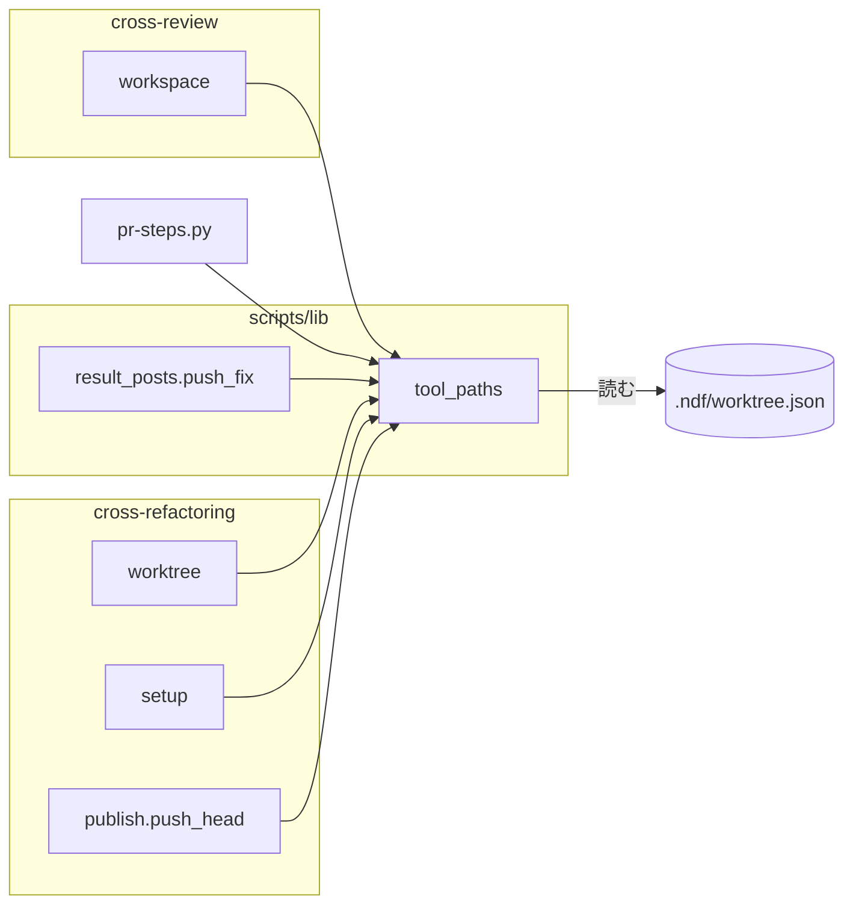
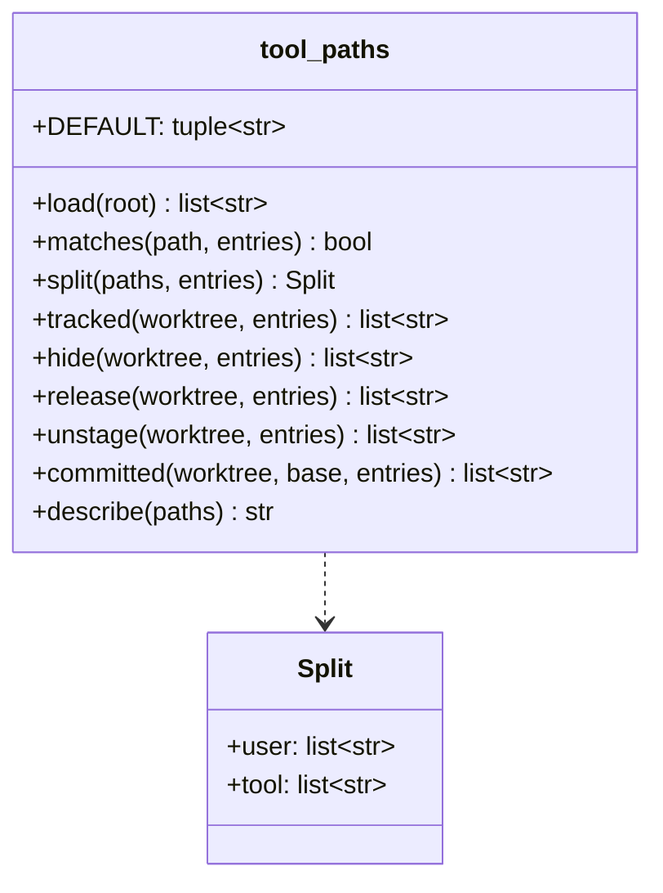
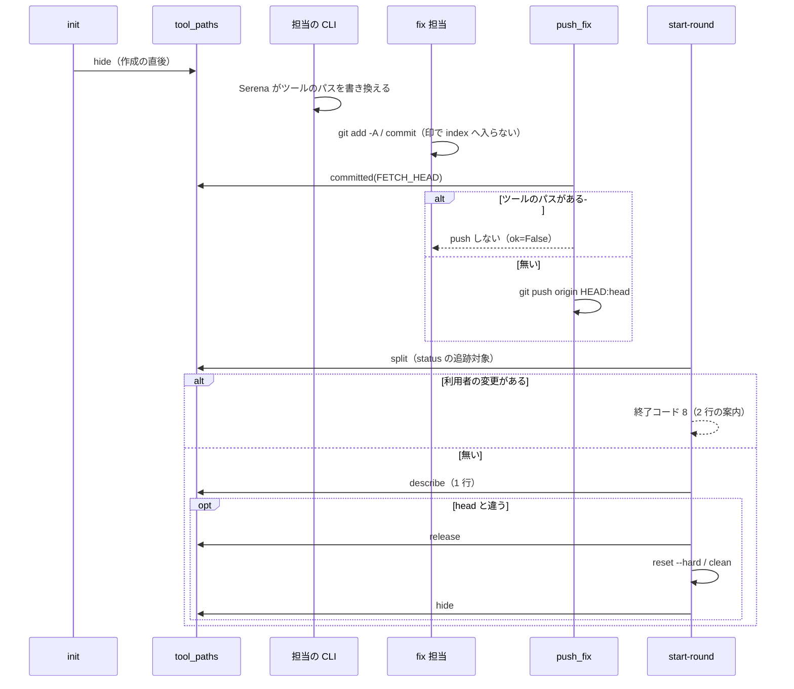

# #1436: ツールのパスを検査とコミットから外す

要求と受け入れ条件は [#1436](https://github.com/devbasex/ai-plugins/issues/1436) の本文にある（コピーは `issues/issue-1436-requirements.md` ）。この文書は「どう作るか」だけを扱う。

## 例: carmo-cdk の設計 PR で何が変わるか

volareinc/carmo-cdk の設計 PR #424 の cross-review（ndf 10.17.40）で、ラウンド 2 が止まった経路をこの設計でたどる。

1. `state.py init` がレビュー worktree を作る。作った直後に、追跡対象の `.serena/project.yml` と `.serena/serena_config.yml` へ `git update-index --skip-worktree` を掛ける
2. レビュー担当の CLI が Serena MCP を起動し、2 つのファイルを新しい形式（`auth_secret` を含む）へ書き換える。skip-worktree が掛かっているため、`git status` にも `git diff` にも出ない
3. fix 担当が `git add -A` でコミットする。2 つのファイルは index へ入らない。`result_posts.py fix` が push の直前に `origin/<head>...HEAD` の変更を見て、ツールのパスが無いことを確かめてから push する
4. ラウンド 2 の `state.py start-round` が worktree を検査する。利用者の変更は 0 件なので終了コード 0 で進み、`↷ ツールのパスを検査から外した: .serena/project.yml .serena/serena_config.yml` を出す
5. PR の head が進んでいれば同期する。同期の前に skip-worktree を外して 2 つのファイルを HEAD の内容へ戻し、同期の後に掛け直す

開発 worktree（`pr` の手順）では skip-worktree を掛けない。`pr-steps.py plan` がツールのパスを別の項目に分けて数え、`commit` は `git add -A` の後にツールのパスだけを index から外す。ファイルの中身は残る。

## ドメインモデル

### コンテキスト

| コンテキスト | 何の語が 1 つの意味に決まるか |
| --- | --- |
| worktree の運用（`ndf-worktree`） | ツールのパス・レビュー worktree・開発 worktree |
| レビューと公開（cross-review・cross-refactoring・`pr`） | 利用者の変更・ラウンドの開始・同期コミット・push |

worktree の運用が供給者、レビューと公開が顧客の関係（顧客 / 供給者）。3 つの工程は、ツールのパスの定義と操作を共通のライブラリ `tool_paths` から受け取るだけで、自分では既定を持たない。

### 集約

| 集約 | 持ち主（書き換えてよいもの） | 根 | エンティティ | 値オブジェクト |
| --- | --- | --- | --- | --- |
| ツールのパスの定義 | `plugins/ndf/scripts/lib/tool_paths.py`（読むだけ。書き換えるのは利用者の `.ndf/worktree.json`） | 定義 | — | パスの項目（完全一致か、末尾 `/` の前方一致） |
| レビュー worktree の index の skip-worktree の印 | `tool_paths.hide` / `tool_paths.release`（NDF が作ったレビュー worktree の中だけ） | worktree | 追跡対象のツールのパス | — |
| worktree の変更の分類 | `tool_paths.split` | 分類の結果 | — | 利用者の変更の一覧・ツールのパスの変更の一覧 |

### 不変条件

| # | 集約 | 条件 | 破れたときの扱い |
| --- | --- | --- | --- |
| I1 | ツールのパスの定義 | 3 つの工程は同じ関数 `tool_paths.load` から定義を得る。工程ごとに既定を持たない | 既定を変えるテストで 3 工程のどれかが追随しなければ落ちる |
| I2 | ツールのパスの定義 | 設定が無い・読めない・版が違うときは既定の 2 つだけになる | 止めない。既定で進む |
| I3 | worktree の変更の分類 | ツールのパスの変更は、利用者の変更の一覧に 1 件も入らない。利用者の変更はツールのパスの一覧に入らない | 検査が誤って止まる・誤って通る |
| I4 | 公開 | NDF の経路が作るコミットと push に、ツールのパスの変更が入らない | push の直前の検査が止める（push しない） |
| I5 | 開発 worktree | `pr` の手順はツールのパスのファイルの中身を変えない（index から外すだけ） | 利用者の変更が失われる |
| I6 | skip-worktree の印 | 印を掛けるのは NDF が作ったレビュー worktree（cross-review の `pr<番号>`、cross-refactoring の書き込み用の作業ディレクトリ）だけで、追跡対象のパスだけに掛ける | 開発 worktree に掛けると、利用者の変更が `git status` から消える |
| I7 | 出力 | ツールのパスについて出すのはパスだけで、中身を出さない | `auth_secret` がログと Pull Request へ出る |

### ドメインイベント

| # | イベント | 発生元 | 受け手 |
| --- | --- | --- | --- |
| E1 | レビュー worktree を作った | cross-review の `_create_worktree` / cross-refactoring の `_ensure_work_worktree` | `tool_paths.hide`（印を掛ける） |
| E2 | ツールがツールのパスを書き換えた | 担当の CLI が起動した Serena MCP | 受け手は無い。E3・E4・E6・E7 が検査で扱う |
| E3 | fix 担当が修正をコミットして push した | `result_posts.py fix` の `push_fix` | `tool_paths.committed`（push の直前の検査） |
| E4 | ラウンドの開始で worktree の変更を検査した | `state.py start-round` の `_is_synced` | `tool_paths.split` |
| E5 | worktree を Pull Request の head へ同期した | `_reset_worktree_head` / `_sync_work_worktree` | `tool_paths.release` → 同期 → `tool_paths.hide` |
| E6 | cross-refactoring が同期の前に変更を検査した | `_require_clean_worktree` / `_dirty_paths` | `tool_paths.split` |
| E7 | `pr` の手順が変更を数え、コミットした | `pr-steps.py plan` / `commit` | `tool_paths.split` / `tool_paths.unstage` |

### 用語

| 用語 | 意味 | 用語集への反映 |
| --- | --- | --- |
| ツールのパス | CLI が起動したツール（MCP サーバーなど）が、利用者の操作なしに worktree の中で書き換える既知のパス。既定（`.serena/project.yml` と `.serena/serena_config.yml`）と `.ndf/worktree.json` の `tool_paths` で決まる。検査とコミットの対象から外す | 意味の変更（`ndf-worktree`。設定の置き場を `.ndf/worktree.json` の `tool_paths` と書く） |

## 機能一覧

| # | 機能 | 誰が使うか |
| --- | --- | --- |
| F1 | ツールのパスだけが変わっていても cross-review のラウンドが始まる | cross-review を回す conductor |
| F2 | 利用者の変更で止まるとき、案内がツールのパスを別の行に分けて示す | cross-review を回す conductor |
| F3 | cross-review の修正の push にツールのパスが入らない | Pull Request の読み手 |
| F4 | cross-refactoring の同期の前の検査がツールのパスで止まらず、同期コミットにも入らない | cross-refactoring を回す conductor |
| F5 | `pr` の手順が、ツールのパスを未コミットと別に数え、コミットへ入れない | `pr` を打つ開発者 |
| F6 | `.ndf/worktree.json` でツールのパスを足す・外す | リポジトリの管理者 |

## 構成要素

| 要素 | 責務 |
| --- | --- |
| `plugins/ndf/scripts/lib/tool_paths.py`（新規） | 定義の読み込み（`load`）・分類（`split`）・印の掛け外し（`hide` / `release`）・index からの除外（`unstage`）・コミットの検査（`committed`）。3 工程が使う唯一の置き場 |
| `skills/worktree/schemas/worktree.schema.json` | `tool_paths`（`add` / `remove`）の項目を足す |
| `skills/cross-review/scripts/review_lib/workspace.py` | 作成の後に `hide`。`_is_synced` で `split` を使い、止める案内を 2 行に分ける。`_reset_worktree_head` の前後で `release` / `hide` |
| `scripts/lib/result_posts.py` の `push_fix` | push の直前に `committed` で検査し、当たれば push しない |
| `skills/cross-refactoring/scripts/refactor_lib/worktree.py` | `_dirty_paths` が `split` でツールのパスを外し、`_require_clean_worktree` が外したパスを 1 行出す |
| `skills/cross-refactoring/scripts/refactor_lib/commands/setup.py` | 作業 worktree の作成の後に `hide`。`_sync_work_worktree` の早送りの前後で `release` / `hide` |
| `skills/cross-refactoring/scripts/refactor_lib/publish.py` の `push_head` | push の直前に `committed` で検査し、当たれば中断する |
| `scripts/pr-steps.py` | `plan` が `split` で数え、`tool_paths` の項目を足す。`commit` が `git add -A` の後に `unstage` し、コミットの有無を index で判定する |
| `docs/glossary/glossary.json` | 「ツールのパス」の意味に設定の置き場を書く |



### 配置

| 実行の単位 | 置き場 | skip-worktree の印 |
| --- | --- | --- |
| cross-review のレビュー worktree | `/tmp/ndf-worktrees/<repo>/pr<番号>` | 掛ける |
| cross-refactoring の書き込み用の作業ディレクトリ | 状態の `worktrees.work`（`_ensure_work_worktree` が作る） | 掛ける |
| cross-refactoring の読み取り用の作業ディレクトリ | `prepare-worktrees.sh` が作る | 掛けない（コミットしない） |
| 開発 worktree | `.worktrees/<ブランチ>` | 掛けない |

## 構造



| 関数 | 入力 | 出力 | 失敗 |
| --- | --- | --- | --- |
| `load(root)` | 定義を読む worktree の根 | 既定に `add` を足し `remove` を引いた一覧（順序は既定 → `add`、重複なし） | 無い・読めない・版が違う → 既定（I2）。例外を出さない |
| `matches(path, entries)` | 根からの相対パス | 完全一致か、末尾 `/` の項目の前方一致なら真 | — |
| `split(paths, entries)` | パスの列 | `Split(user, tool)`。順序は入力のまま | — |
| `tracked(worktree, entries)` | worktree・一覧 | `git ls-files -z -- <entries>` が返す追跡対象のパス | git が失敗 → 空 |
| `hide` | 同上 | 印を掛けたパス。追跡対象だけに掛ける（追跡対象外へ掛けると git が 128 で落ちる） | git が失敗 → 空を返し、1 行の警告を出す。止めない |
| `release` | 同上 | 印を外し、`git checkout HEAD -- <paths>` で中身を HEAD へ戻したパス | 同上 |
| `unstage(worktree, entries)` | 同上 | `git diff --cached --name-only` のうちツールのパスを `git reset -q -- <paths>` で index から外したパス。ファイルの中身は変えない（I5） | git が失敗 → 呼び出し側の既存の扱い（`run` の失敗） |
| `committed(worktree, base, entries)` | 基準の参照 | `git diff --name-only <base>...HEAD` のうちツールのパス | git が失敗 → 空ではなく `None`。呼び出し側は判定できないとして止める |
| `describe(paths)` | パスの列 | `↷ ツールのパスを検査から外した: a b` の 1 行。空なら空文字 | — |

`release` が中身を捨てるのは、レビュー worktree でだけ呼ぶためである（I6）。

## 入出力の契約

### `.ndf/worktree.json` の `tool_paths`

| 項目 | 内容 |
| --- | --- |
| 名前 | `tool_paths`（任意の object） |
| 入力 | `add`: 文字列の配列（足すパス）。`remove`: 文字列の配列（外す既定のパス）。どちらも任意。末尾 `/` は前方一致、それ以外は完全一致 |
| 出力 | `load` の一覧 |
| 失敗の形 | 型が違う項目は無視する（文字列でない要素・配列でない値）。止めない |
| 互換性 | 項目が無ければ既定だけ。既存の `version: 1` のまま足す（`additionalProperties: true` の範囲） |

```json
{
  "version": 1,
  "tool_paths": {
    "add": [".idea/workspace.xml"],
    "remove": [".serena/project.yml"]
  }
}
```

**定義は、検査する worktree の中の `.ndf/worktree.json` から読む。** レビュー worktree では Pull Request の head の設定になる。

### `state.py start-round`（終了コードは変えない）

| 状態 | 終了コード | 出力（標準エラー） |
| --- | --- | --- |
| ツールのパスだけが変わっている | 0 | `↷ ツールのパスを検査から外した: <パス…>` |
| 利用者の変更がある | 8 | 1 行目 `❌ worktree に未 push の変更が残っています: <利用者の変更…>。 修正を push してから次のラウンドを開始してください`。2 行目 `↷ ツールのパスを検査から外した: <パス…>`（ツールのパスの変更があるときだけ） |

ツールのパスの一覧は、印を掛けたパスと、印の無いまま変わっていたパスを合わせたものである。印を掛けたパスは git から変更が見えないため、変わったかどうかを区別しない。

### `result_posts.py fix` / cross-refactoring の push

| 状態 | 振る舞い |
| --- | --- |
| `origin/<head>...HEAD` にツールのパスが無い | 今までどおり push する |
| ある | push しない。`PushResult(ok=False, pushed=False)`、detail は `ツールのパスがコミットに入っているため push しない: <パス…>。 .gitignore に入れるか、コミットから外してから打ち直す`。cross-refactoring は同じ文で `die` |
| 基準と比べられない | push しない。detail は `ツールのパスの有無を確かめられないため push しない` |

`result_posts.py fix` は push の前に `git fetch origin <head>` を打ち、`FETCH_HEAD` を基準にする。

### `pr-steps.py plan`

| 項目 | 変更 |
| --- | --- |
| `changes` の item | `name` と `files` と `metrics.uncommitted` は利用者の変更だけを数える |
| `tool_paths` の item（新規） | ツールのパスの変更が 1 件以上あるときだけ足す。`{"kind": "tool_paths", "name": "<N> 件のツールのパスの変更（コミットしない）", "result": "excluded", "files": [<status の行>]}` |

### `pr-steps.py commit`

| 状態 | 振る舞い |
| --- | --- |
| 利用者の変更とツールのパスがある | `git add -A` → `unstage` → コミット。items に `{"kind": "tool_paths", "name": "<パス…>", "result": "unstaged"}` を足す |
| ツールのパスだけ | コミットしない。今の「コミットする変更が無い」（`ok`）に、`tool_paths` の item を足す |
| 意図してツールのパスをコミットしたいとき | `pr-steps.py` は入れない。`tool_paths` の item の `name` に続けて、summary に `意図した変更なら git commit で直接コミットする` を足す |

コミットの有無は `git status --porcelain` でなく `git diff --cached --quiet` の終了コードで決める。unstage した後も worktree にはツールのパスの変更が残るためである。

## 処理の流れ



図に含めないのは、実行されない schema と用語集、および cross-refactoring と `pr` の経路の要素である。後の 2 つは次の 2 段落で流れを示す。

cross-refactoring は、作業ディレクトリの作成（`setup` の `hide`）→ 早送り（`setup` の `release` → `merge --ff-only` → `hide`）→ 同期の前の検査（`worktree` の `_dirty_paths` が `split` で外す）→ 同期コミット（`_dirty_paths` の結果だけを `git add --`）→ `publish.push_head` の push の直前の `committed` の順で通る。

`pr` の手順は `plan`（`split` で数える）→ `commit`（`add -A` → `unstage` → `diff --cached --quiet` → commit）の順で通り、`hide` / `release` を呼ばない。

## 非機能の実現方式

| 大項目 | 要求の条件 | 実現方式 | 確かめ方 |
| --- | --- | --- | --- |
| セキュリティ | ツールのパスの内容（`auth_secret` を含み得る）は、NDF の経路で作るコミット・push・Pull Request の本文・ログのどれにも出ない。案内に出すのはパスだけで、中身を出さない | レビュー worktree では印で index へ入れず、push の直前に `committed` で塞ぐ。開発 worktree では `unstage` で外す。`tool_paths` はファイルを読まず、git が返すパスだけを扱う | 中身に目印の文字列を書いたツールのパスで各工程を通し、コミットの tree・標準出力・標準エラーに目印が無いことを見る |
| 運用・保守性 | ツールのパスとして扱ったパスは、工程ごとに出力へ 1 行で残り、利用者が後から何を外したかを確かめられる | `describe` の 1 行を start-round・cross-refactoring の同期の前・`pr-steps.py` の item に出す | 各工程の出力に `↷ ツールのパスを検査から外した:` の行か `tool_paths` の item があることを見る |

## 決定の記録

### 決定 1: レビュー worktree では skip-worktree と検査の除外を併用し、開発 worktree では検査の除外だけにする

レビュー worktree で修正をコミットするのは LLM の fix 担当で、`git add -A` を使い得る。NDF がコミットの前に割り込む場所が無いため、index へ入らない印を掛けるしかない。開発 worktree は利用者のもので、印を掛けると利用者の変更が `git status` から消え、印の解除も利用者の操作になる。`pr-steps.py` はコミットを自分で作るため、index から外すだけで足りる。

検査の除外だけにする案は、fix 担当のコミットに入るのを止められない。push の直前の検査だけで止める案は、Serena が毎ラウンド書き換えるため毎ラウンド止まる。

根拠: Value 2 / Value 5 / C6（MVV 版 2・スプリント MVV 503affec）

### 決定 2: レビュー worktree のツールのパスの変更は、HEAD を動かす前に捨てる

skip-worktree の印が掛かったファイルに手元の変更があると、そのファイルを変える先への `reset --hard` と `merge --ff-only` が失敗する（実測: `error: Entry '.serena/project.yml' not uptodate. Cannot merge.`、終了コード 128）。印を外して HEAD の内容へ戻してから動かし、動かした後に掛け直す。捨てた中身は次に起動する CLI の Serena が書き直す。レビュー worktree は NDF が作る使い捨ての領域で、利用者の変更は置かれない。

残す案（stash してから戻す）は、戻した内容が新しい head の内容と食い違ったときの扱いを新しく決めることになる。

根拠: Value 1 / スプリント Value 1（MVV 版 2・スプリント MVV 503affec）

### 決定 3: 利用者が意図したツールのパスの変更を `pr` の手順でコミットする手段は設けない（U1）

`pr-steps.py commit` は、利用者が手で `git add` したツールのパスも index から外す。LLM が `git add -A` した後で `pr-steps.py` を呼ぶ経路と区別できず、区別できないまま入れると `auth_secret` が Pull Request へ出る。意図した変更は `git commit` で直接コミットするよう summary で案内する。恒常的にコミットしたいパスは `remove` で既定から外せる。

フラグで含める案は、LLM が付けても利用者が付けても同じに見え、秘密を外へ出す経路を 1 つ増やす。

根拠: Value 1 / C1（MVV 版 2）

### 決定 4: 設定は `.ndf/worktree.json` の `tool_paths` に `add` / `remove` で置く（U3）

ツールのパスは worktree の中身の扱いで、 worktree の運用の宣言に属する。`guard.allow_paths`（メインディレクトリで編集してよい場所）とは意味が違うため、別の項目にする。一覧を丸ごと置き換える形にすると、足すたびに既定を書き写すことになり、NDF が既定を直しても写したリポジトリへ届かない（I1 の「既定を変えると 3 工程が同時に変わる」が設定のあるリポジトリで崩れる）。

新しい設定ファイルを作る案は、1 項目のために読み手と schema を 1 組増やす。

根拠: Value 5 / Value 6（MVV 版 2）

### 決定 5: パスの照合は完全一致と末尾 `/` の前方一致だけにする

`hide` は git へ具体的なパスを渡すため、ワイルドカードを受けても展開の規則を git と揃える手間が増えるだけである。`guard.allow_paths` と同じ書き方にして、利用者が覚える規則を増やさない。

`lib/pathmatch.py`（wildmatch）を使う案は、`pathspec` への依存を cross-review の経路へ持ち込む。

根拠: Value 6（MVV 版 2）

### 決定 6: 追跡対象外のツールのパスは push の直前の検査で止める

skip-worktree は追跡対象にしか掛からない。`.serena/` を追跡も無視もしていないリポジトリでは、Serena が作ったファイルが `git add -A` で index へ入る。これを事前に塞ぐには、共通の `.git/info/exclude`（利用者のメインディレクトリにも効く）か worktree 単位の設定（リポジトリの設定の変更）が要り、どちらも利用者の環境を書き換える。報告の事例（carmo-cdk）は追跡対象で、`.gitignore` に入れれば解ける案内を出して止める。

根拠: Value 1 / C6（MVV 版 2）

## テスト設計

| 受け入れ条件・不変条件 | どの振る舞いで縛るか | どう壊したら落ちるべきか |
| --- | --- | --- |
| 1 | 一時リポジトリの PR 相当の worktree で 2 つのツールのパスだけを変え、`start-round` 相当（`_sync_worktree(strict=True)`）が 0 で進み、`↷ ツールのパスを検査から外した:` の行に 2 つのパスが出る | `_is_synced` が `split` を通さず追跡対象を全件で止める |
| 2 | 1 に利用者のファイル 1 つを足すと 8 で止まり、1 行目に利用者のファイルだけ、2 行目にツールのパスが出る | 分類せずに全件を 1 行目へ並べる |
| 3 | cross-refactoring の作業 worktree でツールのパスだけを変え、`_sync_generated` が中断せず、同期コミットの変更一覧にツールのパスが無い | `_dirty_paths` がツールのパスを外さない |
| 4 | `hide` を掛けた worktree で `git add -A` → commit し、`push_fix` が送った先のコミットの変更一覧にツールのパスが無い。追跡対象外のツールのパスを commit したときは push しない | `hide` を呼ばない・`committed` を呼ばない |
| 5 | 開発 worktree でツールのパスと利用者のファイル 1 つを変え、`plan` の `metrics.uncommitted` が 1、`tool_paths` の item が 1 つ。`commit` のコミットにツールのパスが無い | `plan` が `status` を全件数える・`commit` が `unstage` しない |
| 6 | `tool_paths.add` に 1 つ足すと、1〜5 の各経路で足したパスが同じに扱われる。設定が無いと既定の 2 つだけ | `load` が `add` を読まない・既定に別のパスが混ざる |
| 7 | `tool_paths.remove` で既定を 1 つ外すと、そのパスの変更で `start-round` 相当が 8 で止まる | `load` が `remove` を読まない |
| 8 | ツールのパスでない変更だけのとき、`start-round` 相当が 8・`_require_clean_worktree` が中断・`commit` がその変更をコミットする | 分類が利用者の変更をツールのパスへ入れる |
| 9 / I1 | `tool_paths.DEFAULT` を差し替えると、cross-review・cross-refactoring・`pr-steps.py` の 3 経路の分類が同時に変わる | どれかの工程が既定を自分で持つ |
| 10 / I5 | `commit` の後、ツールのパスのファイルの中身が commit の前と同じ | `unstage` の代わりに `checkout` で戻す |
| I2 | `.ndf/worktree.json` が壊れている・版が 2・`tool_paths` の型が違うとき、`load` が既定を返し例外を出さない | 読めない設定で止まる |
| I3 | `split` が同じパスを両方の一覧へ入れない。前方一致の項目 `x/` が `xy/a` に当たらない | 前方一致に `/` を付けずに比べる |
| I4 | 4 と 3 の push の直前の検査。基準と比べられないときは push しない | 比べられないときに空と読んで push する |
| I6 | 開発 worktree で `pr-steps.py` を通しても `git ls-files -v` に `S` が現れない。`hide` は追跡対象外のパスを渡しても失敗しない | 開発 worktree へ `hide` を呼ぶ・追跡対象外を git へ渡して 128 で落ちる |
| I7 | ツールのパスの中身に目印の文字列を書き、3 工程の標準出力・標準エラー・コミットに目印が出ない | 案内に `git diff` の中身を載せる |
| 決定 2 | 印とツールのパスの変更がある worktree で、ツールのパスを変える head へ `_reset_worktree_head` と `_sync_work_worktree` が成功し、後で印が掛かっている | `release` を呼ばずに動かす |

## 未確認のまま残ること

| 項目 | 内容 |
| --- | --- |
| 改善項目のコミットがツールのパスを触るとき | cross-refactoring の取り消し（`git revert`）と積み直し（`cherry-pick`）は `release` を通さない。Pull Request 自身のコミットがツールのパスを変えると、印の掛かったファイルで失敗し得る。既存の失敗の扱い（着手前へ戻して中断）になる。起きた時点で `release` で包むかを決める |
| Serena が起動中に `release` が走るとき | `release` はラウンドの開始・init・再開でだけ呼び、担当の CLI が動いていない前提に立つ。CLI が残って書き続けた場合の順序は確かめていない |
| 追跡対象外のツールのパスの頻度 | 決定 6 で止める経路を実際の利用で何回踏むかは測っていない。多ければ `.gitignore` への案内を init の時点へ前倒しする |
