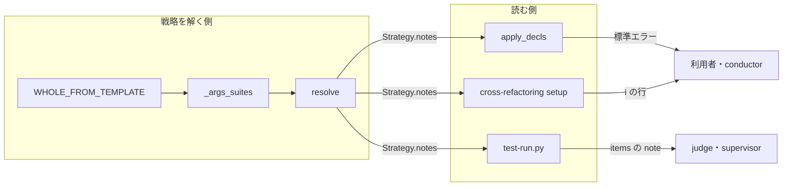
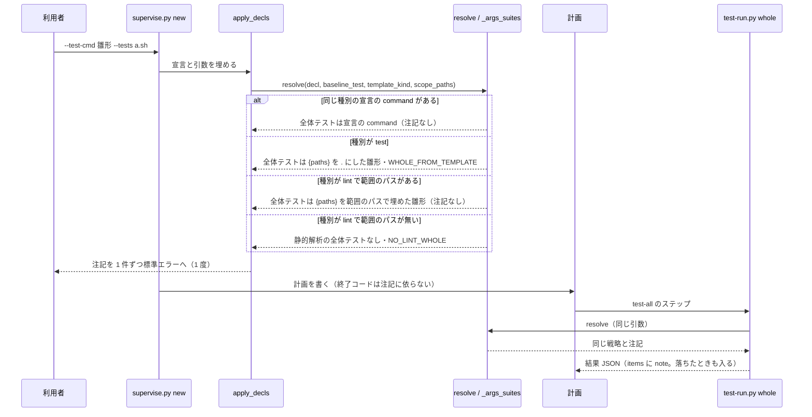

# #1437: 雛形から組んだ全体テストを、注記として報告と計画の作成に出す

要求と受け入れ条件は #1437 の本文にある（コピーは [issue-1437-requirements.md](issue-1437-requirements.md) ）。この文書は「どう作るか」だけを扱う。

直すのは 2 か所である。`lib/test_strategy.py` の `_args_suites` が、テストの種別の雛形から全体テスト（`{paths}` を `.` にしたコマンド）を組むときに注記を 1 件足す。`supervise_lib/decl.py` の `apply_decls` が、解いた戦略の注記を標準エラーへ出す。`test-run.py` と cross-refactoring は、今の `Strategy.notes` の読み方のまま注記を出す。

## 実例: 報告の事例が今の develop でどう解けるか

`--test-cmd 'uvx --from shellcheck-py shellcheck -s bash {paths}'` を、宣言の 3 つの形と `--test-kind` の 2 値、`--tests` の有無で `test_strategy.resolve` に通した結果である（2026-09-30、`dfeb3517` で実測）。

| 宣言の `test` | `--test-kind` | `--tests` | 全体テスト（テスト） | 全体テスト（静的解析） | 注記の件数 |
| --- | --- | --- | --- | --- | --- |
| pytest の suite | test | あり / なし | `pytest -q` | 無し | 0 |
| pytest の suite | lint | あり | `pytest -q` | `shellcheck ... images/redmine7/postresync.sh` | 0 |
| pytest の suite | lint | なし | `pytest -q` | 無し | 1（`NO_LINT_WHOLE`） |
| 無し | test | あり / なし | **`shellcheck -s bash .`** | 無し | **0** |
| 無し | lint | あり | 無し | `shellcheck ... images/redmine7/postresync.sh` | 0 |
| 無し | lint | なし | 無し | 無し | 1（`NO_LINT_WHOLE`） |
| 静的解析の suite だけ | test | あり / なし | **`shellcheck -s bash .`** | 宣言の `command` | **0** |
| 静的解析の suite だけ | lint | あり / なし | 無し | 宣言の `command` | 0 |

太字の 2 行が直す対象である。どちらも「宣言にテストの種別の `command` が無く、雛形の種別が test」の形で、全体テストは雛形の `{paths}` を `.` にしたものになり、注記は 0 件である。7 行目（静的解析の suite だけを宣言した場合）は要求の表に無いが、`_args_suites` の同じ分岐を通るため、この変更で同じ注記が付く。

## ドメインモデル

### コンテキスト

| コンテキスト | 何の語が 1 つの意味に決まるか |
| --- | --- |
| `ndf-workflow` | 全体テスト・範囲テスト・範囲テストの雛形・テストの戦略・suite の種別 |

`supervise.py`・`test-run.py`・cross-refactoring は、同じ `lib/test_strategy.py` の戦略を読む側である（#1483 の I10）。1 つのコンテキストに収まるため、関係は宣言しない。

### 集約

| 集約 | 持ち主（書き換えてよいもの） | 根 | エンティティ | 値オブジェクト |
| --- | --- | --- | --- | --- |
| テストの戦略 | `lib/test_strategy.resolve`（と、その中の `_from_args`・`_args_suites`） | `Strategy` | — | `Suite`・注記（`notes` の 1 件の文） |

- 注記を足してよいのは戦略を解く関数だけである。`supervise` と `test-run.py` と cross-refactoring は `Strategy.notes` を読んで出すだけで、足しも書き換えもしない
- 注記の文は `lib/test_strategy.py` の定数 1 つに置き、読む側は文を写さない（要求の非機能「運用・保守性」）

### 不変条件

| # | 集約 | 条件 | 破れたときの扱い |
| --- | --- | --- | --- |
| I1 | テストの戦略 | 引数の雛形から、雛形の `{paths}` を `.` にした全体テストを組んだ戦略は、その旨の注記（`WHOLE_FROM_TEMPLATE`）をちょうど 1 件持つ | 単体テストで落とす |
| I2 | テストの戦略 | 全体テストを雛形から組まなかった戦略（宣言にその種別の `command` がある・種別が lint）は、`WHOLE_FROM_TEMPLATE` を持たない | 単体テストで落とす |
| I3 | テストの戦略 | 注記を足しても、全体テストのコマンド・suite の並び・戦略の名前は変わらない（前提 2） | 単体テストで落とす |
| I4 | テストの戦略 | 種別と注記の有無は、コマンドの語を見ずに決まる（#1483 の I1） | コードに語の照合を置かない。単体テストで、同じ形の雛形 2 つ（`shellcheck` と `pytest`）が同じ注記を持つことを見る |
| I5 | テストの戦略 | `supervise.py new` 1 回で、戦略の注記は標準エラーへ 1 件につき 1 度だけ出る。計画の作成の終了コードは注記の有無で変わらない | 結合テストで落とす |

### ドメインイベント

要求の番号を引き継ぐ。

| # | イベント | 発生元 | 受け手 |
| --- | --- | --- | --- |
| E1 | 利用者が `--test-cmd` の雛形と種別を渡した | 利用者（`supervise.py new` / `test-run.py --template` / cross-refactoring の起動） | `resolve`（E2） |
| E2 | 戦略が全体テストを決めた | `resolve` | `_args_suites`（E3） |
| E3 | 全体テストを雛形から組んだことが注記として戦略に載った | `_args_suites` | `apply_decls`（E4）・`test-run.py`（E5）・cross-refactoring の `setup`（既存の表示） |
| E4 | `supervise.py new` が計画を書き、注記を標準エラーへ出した | `apply_decls` | 利用者・conductor |
| E5 | `test-run.py whole` が全体テストを走らせ、結果の `items` に注記を残した | `test-run.py` | judge・supervisor |

### 用語

新しい語は作らない。「全体テスト」「範囲テスト」「範囲テストの雛形」「テストの戦略」「suite の種別」は用語集（`ndf-workflow`）の意味のまま使う。

| 用語 | 意味 | 用語集への反映 |
| --- | --- | --- |
| 全体テスト | 範囲を絞らずに走らせるテストか静的解析。宣言の `suites[].command`、無ければ雛形から組む | 変更なし |
| 範囲テストの雛形 | `{paths}` を 1 語で含むコマンド | 変更なし |

## 機能一覧

| # | 機能 | 誰が使うか |
| --- | --- | --- |
| F1 | 雛形から全体テストを組んだ戦略が、その旨の注記を持つ | `supervise`・`test-run.py`・cross-refactoring（戦略を読む側） |
| F2 | `supervise.py new` が計画を作るとき、戦略の注記を標準エラーへ出す | 利用者・conductor |
| F3 | `test-run.py whole` の結果 JSON の `items` に注記が入る（既存の経路） | judge・supervisor |
| F4 | 報告の事例と静的解析の雛形の扱いを回帰テストで固定する | 開発者 |

## 構成要素

| 要素 | 変更 | 責務 |
| --- | --- | --- |
| `lib/test_strategy.py` の定数 `WHOLE_FROM_TEMPLATE` | 追加 | 注記の文の正本（1 か所） |
| `lib/test_strategy.py` の `_args_suites` | 変更 | テストの種別で、宣言に同じ種別の `command` が無く、雛形から全体テストを組んだ分岐で `WHOLE_FROM_TEMPLATE` を `notes` へ足す |
| `supervise_lib/decl.py` の `apply_decls` | 変更 | 戦略を解いた後、`strategy.notes` を 1 件ずつ標準エラーへ出す |
| `test-run.py` の `_resolve` / `_outcome_items` | 変更なし | `strategy.notes` を `items` の `note` へ写す（今のまま） |
| cross-refactoring の `commands/setup.py` | 変更なし | `strategy.notes` を `ℹ` の行で出す（今のまま） |
| `supervise_lib/verify_steps.py` の `plan_strategy` | 変更なし | `apply_decls` を通らない呼び出しでだけ戦略を解く。注記は出さない |

`plan_strategy` は `apply_decls` が戦略を載せなかったときだけ使う代わりの経路で、注記を出さないため図に含めない。

## 処理の流れ

`supervise.py new sprint` で計画を作り、`test-all` のステップで全体テストを走らせるまでである。

スプリントの各計画（impl・check など）は、`apply_decls` が解いた戦略を `decl_fields` で受け取るため、戦略を解き直さず、注記も出し直さない。

この図は `supervise` の経路だけを描く。cross-refactoring の `setup` は同じ `resolve` の注記を既存の `ℹ` の行で出すだけで、流れを変えないため含めない。`plan_strategy` は `apply_decls` が戦略を載せなかったときの代わりの経路で、この流れでは呼ばれない。

## 入出力の契約

引数・終了コード・結果 JSON の欄は変わらない。増えるのは出力の行と `items` の件数だけである。

| 出力 | 今 | 変更後 |
| --- | --- | --- |
| `resolve` の `Strategy.notes` | 雛形から全体テストを組んでも空 | `WHOLE_FROM_TEMPLATE` を 1 件持つ |
| `test-run.py whole` / `scope` の結果 JSON の `items` | `{"note": ...}` は宣言の読み取りの注記と `NO_LINT_WHOLE` だけ | `{"note": WHOLE_FROM_TEMPLATE}` が 1 件増える（全体テストが落ちたときも） |
| `supervise.py new` の標準エラー | 戦略の注記を出さない | 注記を 1 件 1 行、`⚠ ` を頭に付けて出す |
| `supervise.py new` の標準出力（計画の結果 JSON）と計画のファイル | — | 変わらない |
| cross-refactoring の起動の表示 | `ℹ` の行は戦略の注記の件数だけ | `ℹ` の行が 1 行増える |

注記の文は次のとおりとする。雛形の中身を埋め込まず、定数のまま出す（どの雛形かは同じ出力の戦略と計画が持つ）。

> 全体テストは宣言の test.suites[].command が無いため、雛形の {paths} を . にしたコマンドで組んだ。静的解析のコマンドなら --test-kind lint か、宣言の test.suites（kind: lint）を使う

`test-run.py scope` も同じ `resolve` を通るため、範囲テストの結果にも同じ注記が入る。範囲テストの判定は変わらない。

## 非機能の実現方式

| 大項目 | 条件 | 実現方式 |
| --- | --- | --- |
| 運用・保守性 | 注記の文は定数 1 か所、読む側は `Strategy.notes` を読むだけ | 文は `WHOLE_FROM_TEMPLATE` だけに置く。`apply_decls` は `strategy.notes` を回して出すだけで、どの注記かを見分けない |
| 移行性 | 既存の宣言・引数・結果 JSON の欄を変えない | 足すのは `notes` の要素だけ。状態ファイルの戦略（`as_state` の `notes`）も欄は同じで、旧形の状態を読むと注記は無いまま読める |

## 決定の記録

### 決定 1: 注記は `_args_suites` の「テストの種別で雛形から全体テストを組む」分岐で足す

`_args_suites` の中で `whole_command_of(template)` を呼ぶのはこの分岐だけで、ここが「宣言に同じ種別の `command` が無く、種別が test」を表す。条件を呼ぶ側で組み直すと、`resolve` と同じ判定が `supervise` と `test-run.py` に写る。この分岐は `--test-cmd`・`--template`・`--baseline-test`・`--round-test` のどの経路からも通るため、要求の対象範囲がそのまま覆われる。

要求の表の「宣言が無い」に限る条件（`test` のキーの有無で見る）は採らない。静的解析の suite だけを宣言したリポジトリも同じ分岐を通り、同じ `shellcheck .` になるためである（実例の表の 7 行目）。

根拠: Value 6（MVV 版 2）

### 決定 2: 注記の出し方は `supervise.py new` の標準エラーの行に留め、計画の JSON には残さない

要求の未決への答えである。計画を読んで全体テストを走らせる側（`test-run.py whole`）は、同じ引数で戦略を解き直し、結果 JSON の `items` に注記を残す。judge と supervisor が読むのはその結果であり、計画の JSON に写すと同じ文が 2 か所に残る。計画の `テストの戦略` の `note` は宣言の読み取り（`supervise.json` の `test.command`）を知らせる 1 つの文の欄で、戦略の注記を足すと欄の意味が変わる（前提 3「新しい出力の欄は作らない」）。

根拠: Value 7 / Value 2（MVV 版 2）

### 決定 3: `apply_decls` は戦略の注記をすべて出し、`WHOLE_FROM_TEMPLATE` だけを選ばない

どの注記を出すかを読む側で選ぶと、戦略に注記を足すたびに読む側を直すことになる。`supervise` の経路で戦略に載りうる注記は `WHOLE_FROM_TEMPLATE` と `NO_LINT_WHOLE` で、どちらも計画の作成の時点で利用者が知るべきことである（`NO_LINT_WHOLE` は今は `test-all` を走らせるまで見えない）。cross-refactoring の `setup` も同じくすべてを出している。

根拠: Value 6 / Value 2（MVV 版 2）

### 決定 4: 注記の文に雛形を埋め込まない

非機能の条件が文を定数 1 か所に置くことを求め、`NO_LINT_WHOLE` も定数のまま出している。どの雛形から組んだかは、同じ出力の戦略（`items` の先頭・計画の `テストの戦略`）と、ステップのコマンドの `--template` から読める。

根拠: Value 6（MVV 版 2）

## テスト設計

| 受け入れ条件・不変条件 | どの振る舞いで縛るか | どう壊したら落ちるべきか |
| --- | --- | --- |
| AC1・I1 | 宣言が無く種別 test の雛形 `shellcheck -s bash {paths}` を `resolve` に通すと、`notes` がちょうど `[WHOLE_FROM_TEMPLATE]` になる。静的解析の suite だけの宣言でも同じ | 注記を足さない、2 度足す、条件を「`test` のキーが無い」に絞る |
| AC2・F3 | 宣言の無い一時リポジトリで `test-run.py whole --template 'shellcheck -s bash {paths}'` を走らせると、落ちた結果でも `items` に `WHOLE_FROM_TEMPLATE` の `note` が入る | `_outcome_items` が落ちたときに注記を捨てる、注記が戦略に無い |
| AC3・I5 | 宣言の無いリポジトリで `supervise.py new sprint --test-cmd 'shellcheck -s bash {paths}' --tests a.sh` を走らせると、標準エラーに注記の文がちょうど 1 度出て、終了コードは注記の無い雛形（宣言あり）のときと同じ | 注記を出さない、スプリントの各計画で出し直す、注記で終了コードを変える |
| AC4・I2 | 宣言に pytest の suite があるとき、種別 test と lint のどちらでも全体テスト（テスト）は宣言の `command` だけで、`.` を含まず、`WHOLE_FROM_TEMPLATE` を持たない | 宣言があるときも雛形から組む、宣言があるときも注記を足す |
| AC5 | 宣言があり `--test-kind lint --tests images/redmine7/postresync.sh` の `supervise.py new sprint` の計画で、`test-all` のコマンドが `--paths images/redmine7/postresync.sh` を含み、`resolve` の全体テスト（静的解析）がそのパスで埋めた雛形になる | `whole_cmd` が `--paths` を落とす、静的解析の `{paths}` を `.` にする |
| AC6 | `--test-kind lint` で範囲のパスが無い `test-run.py whole` の結果の `items` に `NO_LINT_WHOLE` が残り、静的解析の全体テストが組まれない | 範囲が無いときに `.` で組む、注記を捨てる |
| AC7・I3 | 宣言が無く種別 test の雛形 `pytest {paths} -q` の全体テストは `pytest . -q` のまま。注記を足しても suite の並びと戦略の名前は変わらない | 雛形から全体テストを組むのをやめる、注記を足すときに suite を変える |
| I4 | 同じ形の雛形 `shellcheck -s bash {paths}` と `pytest {paths} -q` が同じ注記を持つ | コマンドの語で注記の有無を分ける |
| AC8 | 全体テスト（`uv run --frozen --project . --all-extras pytest . -q -n 4`）と `ruff check plugins/ndf/scripts` が通る | 既存のテストが `notes == []` や標準エラーの中身を固定していて落ちる |

既存の `test_a_lint_template_fills_paths_with_the_scope` は静的解析の雛形で `notes == []` を見ており、テストの種別の分岐に触れないため変えない。

## 未確認のまま残ること

| 項目 | 内容 |
| --- | --- |
| 判定の読み手 | judge が `items` の注記を読んで「雛形から組んだ全体テストの失敗」と見分けるかは、judge の規則（前提 4・`lint_verdict`）に依る。この変更では規則を変えず、注記が judge の判定を変えるかは実運用で見る |
| `supervise.json` の `test.command` | `decl_of` が `supervise.json` の `test.command` を宣言へ読み替えるときも、`{paths}` を `.` にした全体テストを組む。これは宣言の経路で、既存の注記（`supervise.json` を読んだ旨）を持つため、この変更では注記を足さない |
