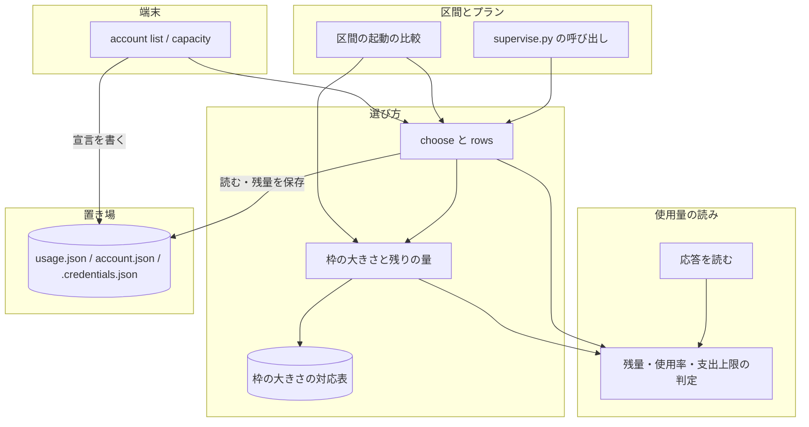
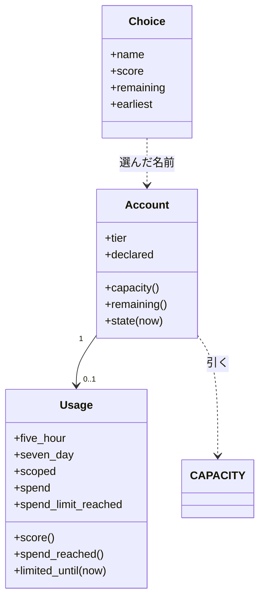
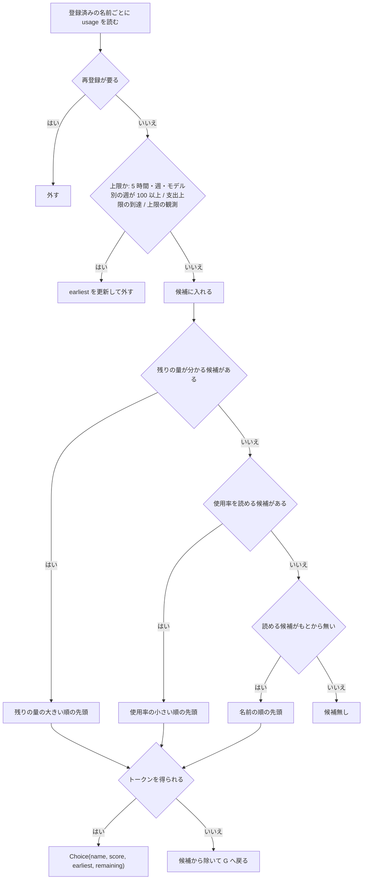
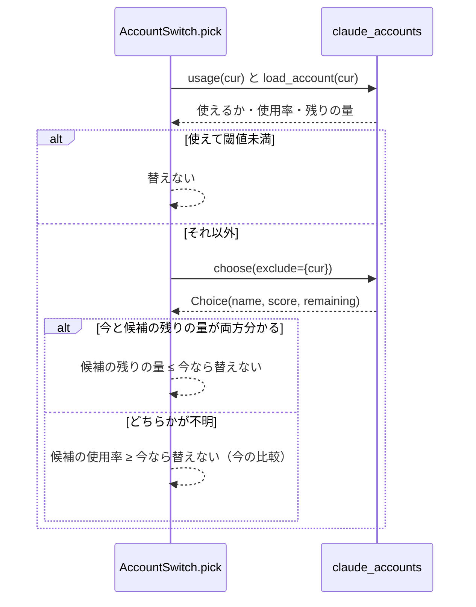

# #1453: relay のアカウントを残りの量で選ぶ

要求と受け入れ条件は #1453 の本文にある（コピーは `issues/issue-1453-requirements.md`）。枠の大きさの既定値の根拠は
`issues/relay-capacity-estimate-2026-09-28.md` にある。この文書は「どう作るか」だけを扱う。

## 例: 5 時間の枠が 40% の Max 5x と 50% の Max 20x

今の `choose` は使用率の小さい方を選ぶので、Max 5x（40%）を選ぶ。残りの量で比べると次のとおりで、Max 20x を選ぶ。

| アカウント | tier | 5 時間の枠 | 週の枠 | 残りの量 |
| --- | --- | --- | --- | ---: |
| ohama-personal | `default_claude_max_5x` | 52.5 ×（1 − 0.40）= 31.5 | 640 ×（1 − 0）= 640 | **31.5** |
| nyle-personal | `default_claude_max_20x` | 210 ×（1 − 0.50）= 105 | 1,100 ×（1 − 0）= 1,100 | **105** |

残りの量は枠ごとの値の最小である（要求の前提 1）。単位は API 料金の換算額（USD）で、枠の大きさの値は下の
「データ構造」の対応表から引く。

## ドメインモデル

### コンテキスト

| コンテキスト | 何の語が 1 つの意味に決まるか |
| --- | --- |
| NDF のラッパー（`ndf-relay`） | 登録済みアカウント・使用率・支出上限・切り替えの閾値に、残りの量・枠の大きさ・枠の大きさの対応表・枠の大きさの宣言・モデル別の週の枠を加える |

このコンテキストの中で閉じる。`supervise.py`（`ndf-workflow`）との関係は #1389 の設計のまま（顧客 / 供給者）で、
`choose` の引数と、返り値の既存の項目（`name`・`score`・`earliest`）の意味を変えない。

### 集約

| 集約 | 持ち主（書き換えてよいもの） | 根 | エンティティ | 値オブジェクト |
| --- | --- | --- | --- | --- |
| 登録済みアカウント（アカウントごと） | `lib/claude_accounts.py` | アカウント（名前） | — | 残量（2 つの使用率とリセット時刻に、**モデル別の週の枠・支出の状態**を加える）・**tier**・**枠の大きさの宣言**・**枠の大きさ**（tier と宣言から導く）・**残りの量**（枠の大きさと残量から導く。保存しない） |

**置き場のファイルを書くのは今までどおり `lib/claude_accounts.py` だけである**（#1389 の集約の規則）。枠の大きさの
宣言も、`relay_lib/accounts.py` の副命令から `claude_accounts` の関数を呼んで書く。`lib/claude_usage.py` は応答を
読んで残量の値オブジェクトを作るだけで、置き場を知らない。残りの量は選ぶ・一覧を出すたびに計算し、保存しない
（決定 6）。

### 不変条件

| # | 集約 | 条件 | 破れたときの扱い |
| --- | --- | --- | --- |
| I1 | 登録済みアカウント | 残りの量は、枠の大きさと使用率がともに分かる枠についての「枠の大きさ ×（1 − 使用率 / 100）」（0 未満は 0）の最小である。そういう枠が 1 つも無ければ残りの量は不明（`None`） | — |
| I2 | 登録済みアカウント | 枠の大きさは枠ごとに、宣言の値 → tier の対応表の値 → 不明、の順に決まる。モデル別の週の枠の大きさは、同じアカウントの週の枠の大きさと同じ | — |
| I3 | 登録済みアカウント | `choose` は上限に達していない候補を、(1) 残りの量の分かるものを残りの量の大きい順 → (2) 残りの量は不明だが使用率を読めるものを使用率の小さい順 → (3) 読める候補が 1 つも無いときだけ残量不明のものを名前の順、に並べて先頭から試す。同順は `five_hour` のリセット時刻の早い方、次に名前の順。同じ入力には同じ名前を返す（#1389 の I7 を保つ） | — |
| I4 | 登録済みアカウント | 支出上限に達したとは、`extra_usage.spend_limit_reached` が真、`spend.percent` が 100 以上、`spend.severity` が `critical` のいずれかである。達したアカウントは候補にせず、戻る時刻は不明（無限）とする | — |
| I5 | 登録済みアカウント | 使用率（`Usage.score()`。切り替えの閾値と比べる値）は、5 時間の枠・週の枠・モデル別の週の枠の使用率の最大である。モデル別の週の枠の使用率が 100 以上なら、その `resets_at` まで上限に達したとする | — |
| I6 | 登録済みアカウント | 応答の `limits[]` か `spend` の形が違っても、読めないのはその項目だけで、5 時間の枠と週の枠の読みは保つ（残量全体を `error: shape` にしない） | 読めない項目は `None`（読めなかった）として保存し、I1・I4・I5 の計算から外す |
| I7 | 登録済みアカウント | 新しい項目を持たない `usage.json`・宣言を持たない `account.json` を読める。置き場の既存ファイルを移行のために書き換えない | 読めない項目は `None` として扱う |
| I8 | 登録済みアカウント | `.credentials.json` から新しく読むのは `claudeAiOauth.rateLimitTier` だけで、置き場へ書く箇所を増やさない。一覧・記録・画面にトークンを出さない（#1389 の I1） | — |
| I9 | 区間のアカウント | 区間の起動で今のアカウントが使えて閾値を超えたとき、今と候補の残りの量が両方分かれば、候補の残りの量が今以下なら替えない。どちらかが不明なら、今の使用率の比較（候補の使用率が今以上なら替えない）で決める | — |

### ドメインイベント

要求のドメインイベントの番号を引き継ぐ。

| # | イベント | 発生元 | 受け手 |
| --- | --- | --- | --- |
| E1 | 使用量を取得した | `claude_accounts.usage`（`claude_usage.get_usage`） | E2 |
| E2 | モデル別の週の枠と支出の状態を読んだ | `claude_usage.parse_usage` | 置き場（`usage.json`）・E4・E5 |
| E3 | 枠の大きさを決めた | `claude_accounts.load_account`（tier と宣言を読む）→ `Account.capacity` | E4・E7 |
| E4 | 残りの量を計算した | `Account.remaining` | E6・E7・区間の起動の比較（I9） |
| E5 | 上限に達したアカウントを候補から外した | `Account.limited_until`（`Usage.limited_until`） | E6 |
| E6 | アカウントを選んだ | `claude_accounts.choose` | `Relay`・`ClaudeRunner`（#1389 の E6 のまま） |
| E7 | 枠の大きさと残りの量を一覧に出した | `claude_accounts.rows` → `relay_lib/accounts.cmd_list` | 利用者の端末 |

### 用語

| 用語 | 意味 | 用語集への反映 |
| --- | --- | --- |
| 残りの量 | 登録済みアカウントが上限に達するまでに使える量の見積り。枠ごとの「枠の大きさ ×（1 − 使用率 / 100）」の最小（USD 換算）。保存せず、選ぶ・一覧を出すたびに求める | 追加（`ndf-relay`） |
| 枠の大きさ | 1 つの枠（5 時間の枠・週の枠・モデル別の週の枠）が 0% から 100% になるまでに使える量（USD 換算）。支出上限（追加利用の上限額）とは別の量 | 追加（`ndf-relay`） |
| 枠の大きさの対応表 | `rateLimitTier` から 5 時間の枠と週の枠の大きさを引く表（`claude_accounts.CAPACITY`） | 追加（`ndf-relay`） |
| 枠の大きさの宣言 | 利用者が登録済みアカウントごとに書く枠の大きさ。対応表の値より先に効く（`account.json` の `capacity`） | 追加（`ndf-relay`） |
| モデル別の週の枠 | 使用量の応答の `limits[]` のうち `kind` が `weekly_scoped` のもの。特定のモデル（例: Fable）だけの週の上限 | 追加（`ndf-relay`） |

| 使用率 | 5 時間の枠・週の枠・モデル別の週の枠の使用率（%）。切り替えの閾値と比べるのはその最大（I5） | 意味の変更（`ndf-relay`） |
| 支出上限 | 追加利用の支出の上限。`spend_limit_reached`・`spend.percent`・`spend.severity` のどれかで達したとする（I4） | 意味の変更（`ndf-relay`） |

**用語集（`docs/glossary/glossary.json`）への反映は、この設計 PR に含める。** 要求の「未決」は追加を設計の承認で決めると
している。差分を設計 PR に載せれば、承認がその決定になる。載せないと `glossary.py check` と CI の `glossary.yml` が
要求と設計の用語の表を `unregistered` で止める。`.ndf/` の設定は書き換えない（C7 に当たらない）。承認されなければ
用語集の差分だけを取り消す。
「容量」はすでに `ndf-issue-upkeep` で別の意味に使われているため、
この変更では使わない（1 語 1 意味）。

## 機能一覧

| # | 機能 | 誰が使うか |
| --- | --- | --- |
| F1 | 次の区間・次の claude -p のアカウントを、残りの量の大きい順に選ぶ | ラッパー（`Relay`）・`supervise.py`（`ClaudeRunner`） |
| F2 | モデル別の週の枠と支出の状態を読んで、尽きた・上限に達したアカウントを選ばない | ラッパー・`supervise.py` |
| F3 | 区間の起動で、今のアカウントより残りの量が多い候補にだけ替える | ラッパー（`AccountSwitch.pick`） |
| F4 | アカウントごとに枠の大きさを宣言する・外す（`relay.py account capacity`） | 利用者 |
| F5 | 一覧に tier・枠の大きさ・残りの量・モデル別の週の枠を出す（`relay.py account list`） | 利用者 |

## 構成要素

| 要素 | 責務 | 変える所 |
| --- | --- | --- |
| 使用量の読み（`lib/claude_usage.py`） | 応答から残量の値オブジェクトを作る。支出上限の到達と使用率の判定を持つ | `Usage` に `scoped`・`spend` を足す。`parse_usage` が `limits[]` と `spend` を読む。`score`・`limited_until` が I4・I5 に従う。支出上限の到達を `Usage.spend_reached()` 1 か所で判定する |
| 置き場と選び方（`lib/claude_accounts.py`） | 枠の大きさの対応表・tier と宣言の読み・残りの量の計算・選び方・一覧の中身・宣言の書き込み | `CAPACITY` を足す。`Account` に `tier`・`declared` と `capacity()`・`remaining()` を足す。`choose` の並べ方（I3）、`Choice.remaining`、`rows` のキー、`set_capacity` |
| アカウントの副命令（`relay_lib/accounts.py`） | 端末の入出力 | `cmd_list` の列、`cmd_capacity` の追加、`USAGE` |
| 区間のアカウント（`relay_lib/switch.py`） | 区間の起動でアカウントを決める | `AccountSwitch.pick` の「候補が今より良いか」の比較（I9） |
| 副命令の案内（`relay_lib/__init__.py`） | `relay.py` の使い方の 1 行と表 | `account capacity` を足す |
| ラッパーの手順書（`skills/development-workflow/references/relay.md`） | 利用者向けの説明 | 一覧の例・選び方の表・宣言のコマンド |
| テスト（`scripts/tests/test_claude_accounts.py`・`test_relay.py`・`account_fake.py`） | 偽の応答で振る舞いを縛る | 偽の応答に `limits[]`・`spend`、偽の資格情報に `rateLimitTier` を足す |

**`supervise_lib/claude.py`・`relay_lib/run.py` は変えない。** `choose` の引数と `Choice.name`・`score`・`earliest` の
意味を保つため、呼び出し元の閾値の比較（`c.score < switch_at()`）はそのまま使える（決定 3）。

### 構成要素図



図には実行の時に動く要素だけを描く。表のうち副命令の案内・手順書・テストは描かない。`supervise.py` の呼び出しは
変えないが、`choose` の受け手として描く。

### 置き場所

```text
plugins/ndf/
├── scripts/
│   ├── lib/
│   │   ├── claude_usage.py        変更（Usage・parse_usage）
│   │   └── claude_accounts.py     変更（CAPACITY・Account・choose・Choice・rows・set_capacity）
│   ├── relay_lib/
│   │   ├── __init__.py            変更（使い方の 1 行と表）
│   │   ├── accounts.py            変更（cmd_list・cmd_capacity・USAGE）
│   │   └── switch.py              変更（AccountSwitch.pick の比較）
│   └── tests/
│       ├── account_fake.py        変更（偽の応答と資格情報）
│       ├── test_claude_accounts.py 変更
│       └── test_relay.py          変更
└── skills/development-workflow/references/relay.md   変更
```

## 構造



| 型 | 追加・変更 | 意味 |
| --- | --- | --- |
| `Usage.scoped` | 追加 | モデル別の週の枠の並び `[{model, utilization, resets_at}]`。`[]` は「応答に無かった」、`None` は「読めなかった」（I6・I7） |
| `Usage.spend` | 追加 | `{percent, severity}`。`None` は「読めなかった」 |
| `Usage.spend_reached()` | 追加 | I4 の判定。`limited_until` と `Account.state` がこれを使う（判定を 1 か所に置く） |
| `Usage.score()` | 変更 | I5。`scoped` の使用率を最大に加える |
| `Usage.limited_until()` | 変更 | I4・I5。`spend_reached()` なら無限、`scoped` の 100 以上をリセット時刻まで上限にする |
| `Account.tier` | 追加 | `.credentials.json` の `claudeAiOauth.rateLimitTier`。読めなければ空 |
| `Account.declared` | 追加 | `account.json` の `capacity`（`{five_hour, seven_day}`。正の数だけを採る） |
| `Account.capacity()` | 追加 | I2。`{"five_hour": float|None, "seven_day": float|None}` |
| `Account.remaining()` | 追加 | I1。残量が読めなければ `None` |
| `Choice.remaining` | 追加 | 選んだアカウントの残りの量（不明は `None`）。既定値を持たせ、`Choice(name, score, earliest)` の位置の引数を壊さない |
| `CAPACITY` | 追加 | 枠の大きさの対応表（モジュールの定数） |

`Account.remaining()` と `capacity()` は純粋な計算で、ファイルも取得先も触らない。ファイルを読むのは `load_account`
だけである。

## データ構造

### 保存する形

置き場の配置は #1389 の設計のまま（`<名前>/` に `.credentials.json`・`account.json`・`usage.json`）。足すのは
`usage.json` の 2 項目と `account.json` の 1 項目で、`.credentials.json` は読む項目が 1 つ増えるだけである。

| ファイル・列 | 型 | 空を許すか | 意味 |
| --- | --- | --- | --- |
| `.credentials.json` の `claudeAiOauth.rateLimitTier`（読むだけ） | 文字列 | 許す | 対応表を引く鍵。無い・表に無いときは枠の大きさを宣言だけから決める |
| `account.json` の `capacity`（追加） | `{five_hour?: 数, seven_day?: 数}` | 許す（キーごと無くてよい） | 枠の大きさの宣言（USD）。無いキーは対応表の値を使う。正の数でない値は無いものとして読む |
| `usage.json` の `scoped`（追加） | `[{model: 文字列|null, utilization: 数, resets_at: ISO 8601|null}]` | 許す | モデル別の週の枠。`[]` は「応答に無かった」、空（null・キーが無い）は「読めなかった」。旧い `usage.json` はキーが無く、読めなかったと同じに扱う |
| `usage.json` の `spend`（追加） | `{percent: 数|null, severity: 文字列|null}` | 許す | 支出の状態。空は「読めなかった」 |
| `usage.json` の `spend_limit_reached`（既存） | 真偽 | 許す | `extra_usage.spend_limit_reached` の生の値のまま（意味を変えない） |

`scoped` の各要素は応答の `limits[]` の要素から次のとおり写す。`kind` が `weekly_scoped` 以外の要素（`session`・
`weekly_all`）は読まない（決定 7）。

| `usage.json` | 応答（`limits[]` の要素） |
| --- | --- |
| `model` | `scope.model.display_name`（無ければ `scope.model.id`、それも無ければ null） |
| `utilization` | `percent`（数でなければ、その要素を読めなかったとして `scoped` 全体を null） |
| `resets_at` | `resets_at`（文字列でなければ null） |

### 枠の大きさの対応表

値は `issues/relay-capacity-estimate-2026-09-28.md` の結論から取り、要求の前提 2 の表のとおりにする。

| `rateLimitTier` | 5 時間の枠（USD） | 週の枠（USD） |
| --- | ---: | ---: |
| `default_claude_max_20x` | 210 | 1,100 |
| `default_claude_max_5x` | 52.5 | 640 |

Max 5x の週の枠は 1,100 × 3.5 / 6 ≒ 641.7 を 640 に丸めた仮の値である（決定 1）。Team premium は tier の文字列が
分かるまで載せない（要求の前提 2）。

### 機能との対応

| 機能 | `.credentials.json` | `account.json` | `usage.json` |
| --- | --- | --- | --- |
| F1・F2 選ぶ | R（`rateLimitTier` を足す） | R（`capacity` を足す） | R・U（`scoped`・`spend` を足す） |
| F3 区間の起動の比較 | R | R | R |
| F4 宣言する | — | U（`capacity`） | — |
| F5 一覧する | R | R | R・U |

**時系列は持たない。** `usage.json` は今までどおり最新の 1 件の上書きで、#1389 の決定 11 の理由（切り替えの履歴は
ラッパーの記録が持つ）がそのまま当たる。枠の大きさの学習は範囲の外（要求の「含まない」）である。

**移行は無い。** 旧い `usage.json` は次の取得（`NDF_ACCOUNT_CHECK_INTERVAL` 秒の後）で新しい形に置き換わる。
それまでは `scoped`・`spend` を読めなかったとして扱う（I7）。

## 入出力の契約

### `relay.py account capacity`（追加）

| 項目 | 内容 |
| --- | --- |
| 名前 | `relay.py account capacity <名前> <5 時間の枠> <週の枠>` |
| 入力 | `<名前>` は登録済みのアカウント。枠はそれぞれ正の数（USD）か `-`。`-` はその枠の宣言を外し、対応表の値へ戻す |
| 出力（成功） | 標準出力に 1 行（`枠の大きさ: <名前> 5 時間 <値> / 週 <値>`。宣言を外した枠は対応表の値か `-`）。終了コード 0 |
| 失敗の形 | 引数の数が違う・数でも `-` でもない・0 以下: 使い方を標準エラーに出して 2。登録されていない: 1。排他を取れない: 1 |
| 互換性 | 追加だけ。既存の副命令の形を変えない |

例:

```bash
python3 ~/.claude/ndf/relay.py account capacity ohama-personal - 900   # 週の枠だけを実測の 900 USD で宣言する
python3 ~/.claude/ndf/relay.py account capacity ohama-personal - -     # 宣言を外す
```

### `relay.py account list`（変更）

表の列:

```text
名前   識別           5 時間        7 日         モデル別の週        支出上限      枠の大きさ     残り  状態
work1  a@example.com  50%（04:59）  3%（09-29）  Fable 58%（09-29）  達していない  210 / 1,100    105   使える
work2  b@example.com  40%（05:40）  0%（09-30）  -                   達していない  52.5 / 640     31.5  使える
```

| 列 | 中身 | 不明のとき |
| --- | --- | --- |
| モデル別の週（追加） | `scoped` のうち使用率の最も高い 1 つ（`<model> <使用率>%（<リセット時刻>）`） | `-` |
| 支出上限（意味の変更） | `Usage.spend_reached()`（I4）で「達している / 達していない」 | `-` |
| 枠の大きさ（追加） | `<5 時間の枠> / <週の枠>`。宣言の値には `*` を付ける | 枠ごとに `-` |
| 残り（追加） | 残りの量（USD。小数第 1 位まで、整数なら小数を省く） | `-` |

`--json` の 1 行（既存のキーは消さない。追加するキーを太字にする）:

| キー | 型 | 意味 |
| --- | --- | --- |
| `spend_limit_reached` | 真偽 / null | **意味の変更**: `Usage.spend_reached()`（I4）。表の「支出上限」と同じ値 |
| **`scoped`** | 配列 / null | `usage.json` の `scoped` |
| **`spend`** | オブジェクト / null | `usage.json` の `spend`（生の `percent`・`severity`） |
| **`tier`** | 文字列 / null | `rateLimitTier`。読めなければ null |
| **`capacity`** | `{five_hour, seven_day}` | 枠の大きさ（USD）。枠ごとに不明は null |
| **`capacity_declared`** | `{five_hour, seven_day}` | 宣言の値。宣言の無い枠は null |
| **`remaining`** | 数 / null | 残りの量（USD、丸めない）。不明は null |

### `choose` の返り値（Python の呼び出し）

`Choice(name, score, earliest, remaining)`。`score` は選んだアカウントの使用率のまま（I5 でモデル別の週の枠を含む）で、
呼び出し元が切り替えの閾値と比べる値として使い続ける。`remaining` は追加で、`relay_lib/switch.py` だけが使う。

## 処理の流れ

### 選ぶ（`choose`）



「残りの量が分かる候補」を試し終えて全部トークンを得られなければ、次に「使用率を読める候補」を試す（I3 の (1) → (2)
の順）。(3) の残量不明の候補は、上限に達していない候補の中に読めるものがもとから 1 つも無いときだけ試す（今の
`readable` の扱いのまま）。

### 区間の起動の比較（`AccountSwitch.pick`、I9）



変えるのは `pick` の「候補が今より良いか」の 1 か所だけで、閾値との比較・上限の後・従量の接続からの戻りは変えない。

### 応答を読む（`parse_usage`）

1. `five_hour`・`seven_day` を今どおり読む。どちらも読めなければ `error: shape`（今のまま）
2. `limits` が配列なら `kind == "weekly_scoped"` の要素を写す。配列でない・要素の `percent` が数でなければ `scoped` は
   null。キーが無ければ `[]`
3. `spend` がオブジェクトなら `percent`（数か null）と `severity`（文字列か null）を写す。オブジェクトでなければ null
4. 2 と 3 の失敗は 1 の結果を変えない（I6）

## 非機能の実現方式

| 大項目 | 要求の条件 | 実現方式 | 確かめ方 |
| --- | --- | --- | --- |
| 可用性 | 枠の大きさ・残りの量が求まらないことを理由に、選ぶ・一覧を出す・中継を続ける処理を止めない | 計算は `None` を返して例外を出さない。`None` の候補は I3 の (2)・(3) の群へ回す。一覧は `-` / null を出す | tier の無い・宣言の壊れた・応答の崩れたアカウントを混ぜたテストで、`choose` と `rows` が例外を出さずに返る |
| 性能・拡張性 | 使用量の取得先を呼ぶ回数を増やさない。選び方と判定に LLM を呼ばない | 取得の経路（`usage`）を変えない。残りの量は保存した残量から計算する | 偽の取得先の呼ばれた回数が、既存のテストと同じ間隔の条件で変わらない |
| セキュリティ | 一覧・記録・画面にトークンを出さない。`.credentials.json` から読むのは `rateLimitTier` だけで、書く箇所を増やさない | `load_account` は `.credentials.json` から `rateLimitTier` の文字列だけを取り出して `Account` に持つ。宣言の書き込みは `account.json` だけ | 一覧の出力（表と JSON）にアクセストークンとリフレッシュトークンの文字列が現れない。宣言のコマンドの前後で `.credentials.json` が変わらない |

## 決定の記録

### 決定 1: 枠の大きさの対応表は `claude_accounts` のモジュールの定数に置き、Max 5x の週の枠は 640 にする

対応表は選び方の部品が使うもので、置き場と選び方の持ち主（`claude_accounts`）の中に置けば、呼び出し元の変更も設定の
読み込みも要らない。値の見直しは実測（`relay-capacity-estimate`）から来るため、変えるときは版として出す。Max 5x の週の
枠は非公式の比による仮の値なので、見かけの精度（641.7）を持たせずに 2 桁に丸める。

設定ファイル（`.ndf/` や環境変数）に表を置く案は採らない。表を変えたい理由は「自分のアカウントの値が違う」ことで、
それはアカウントごとの宣言（決定 2）が受ける。

根拠: Value 3 / Value 5（MVV 版 1）

### 決定 2: 枠の大きさの宣言は `account.json` の `capacity` に置き、`relay.py account capacity` で書く

宣言はアカウントごとで、プロセス・コンテナをまたいで効く必要がある（要求の前提 6）。`account.json` は同じ置き場の
アカウントごとのファイルで、書くのは `claude_accounts` だけという規則（#1389）にそのまま乗る。書く手段を副命令に
すると、数の検査と排他を通してから書け、利用者は 0600 の隠れたディレクトリの JSON を開かずに済む。

`account.json` を利用者が手で書く案は採らない。同じファイルを `note_limit` と `_update_account` が排他の中で読み
書きするため、手で書いた内容が並行の書き込みで消えうる。形を誤っても知らせる場所が無い。公開インタフェースの追加に
当たるため、要求の「境界」どおり設計の承認で確認する（未確認のまま残ること）。

根拠: Value 2 / Value 4（MVV 版 1）

### 決定 3: `Choice.score` は使用率のまま残し、残りの量は `Choice.remaining` として足す

`supervise_lib/claude.py`・`relay_lib/switch.py` は `c.score < switch_at()` で「戻ってよいか」を決めており、切り替えの
閾値は使用率のまま比べる（要求の前提 4）。`score` の意味を保てば呼び出し元を変えずに済み、要求の「含まない」
（`supervise.py` の呼び出し方を変えない）を満たす。残りの量を使うのは区間の起動の比較（I9）だけなので、そこだけが
新しい項目を読む。

`score` を残りの量へ置き換える案は採らない。単位が % から USD に変わり、閾値との比較がすべて誤る。

根拠: Value 6（MVV 版 1）

### 決定 4: 残りの量の分からない候補は、分かる候補の後ろへ使用率の順で並べる

残りの量と使用率は単位が違い、1 つの並びで比べられない。分かる群を先に試すのは、分かる候補がある限り要求の目的
（枠の大きさの違いを選び方に入れる）どおりに選ぶためで、分からない群の中では今の規則を保てば退行が無い（要求の前提 5）。

分からない候補の枠の大きさを平均や最小で補う案は採らない。未知の tier に推定の値を当てると、根拠の無い値で順序が
決まる。

根拠: Value 1 / Value 3（MVV 版 1）

### 決定 5: 一覧の `spend_limit_reached` を合成した判定にし、生の値は `spend` に置く

一覧の「支出上限」の列と状態の列は、同じ判定（I4）を見ないと「達していない」の横に「支出上限」が並ぶ。判定を
`Usage.spend_reached()` の 1 か所に置き、`limited_until`・`state`・`rows` がそれを読む。`usage.json` の
`spend_limit_reached` は応答の生の値のまま残し、後から読んだ人が応答と突き合わせられるようにする。

一覧に合成した判定の別のキー（`spend_reached`）を足して既存のキーを生の値のまま残す案は採らない。同じ問いに答える
キーが 2 つになり、既存の読み手（表の列）が誤った方を読み続ける。

根拠: Value 6 / Value 8（MVV 版 1）

### 決定 6: 残りの量は保存せず、読むたびに計算する

残りの量は保存した残量と枠の大きさ（表・宣言）から決まる。保存すると、宣言や表を変えたときに古い値が
`NDF_ACCOUNT_CHECK_INTERVAL` 秒のあいだ残る。計算は数個の掛け算で、取得先を呼ばない。

根拠: Value 6（MVV 版 1）

### 決定 7: `limits[]` からは `weekly_scoped` だけを読む

`session` と `weekly_all` は `five_hour`・`seven_day` と同じ値の別の表し方で（2026-09-28 の応答で一致を実測）、
両方を読むと食い違ったときにどちらを信じるかの規則が要る。今の読みを保ち、足りない項目だけを足す。

`five_hour`・`seven_day` を捨てて `limits[]` へ寄せる案は採らない。旧い形の応答（`limits[]` が無い）で残量を読めなく
なり、AC9 を破る。

根拠: Value 1（MVV 版 1）

## テスト設計

| 受け入れ条件・不変条件 | どの振る舞いで縛るか | どう壊したら落ちるべきか |
| --- | --- | --- |
| AC1 | 5 時間の枠が Max 5x 40%・Max 20x 50%、週の枠 0% のとき `choose` が Max 20x を返す | 並べ方を使用率の順に戻す |
| AC2 | 対応表の週の枠の値だけを差し替えると、選ぶアカウントが入れ替わる（5 時間の枠は余裕があり週の枠が効く入力） | 週の枠の大きさに 5 時間の枠の表を使う |
| AC3 | 宣言を `account capacity` で書くと、`account list --json` の `remaining` が宣言の値 ×（1 − 使用率 / 100）の最小になり、`-` で外すと表の値へ戻る | 宣言を読まない・宣言より表を先にする |
| AC4・I5 | `weekly_scoped` の使用率が週の枠より高いとき、`remaining` がその枠で決まり、`Usage.score()` がその使用率になる。100 以上ならリセット時刻まで候補から外れる | `scoped` を読まない・`score` に入れない |
| AC5・I4 | nyle-team の応答の形（`spend.percent` 100・`severity` critical・`spend_limit_reached` 偽）のアカウントを選ばず、一覧の状態が「支出上限」、支出上限の列が「達している」 | `spend_limit_reached` だけを見る |
| AC6・I3 | tier の無いアカウント・残量不明のアカウントが混ざっても例外を出さずに選び、残りの量の分かる群 → 使用率の群 → 残量不明の順に並ぶ。同じ入力には同じ名前 | 不明を 0 や無限として同じ群で比べる |
| AC7 | `account list` の表の「枠の大きさ」「残り」の列と、`--json` の `capacity`・`remaining` が読め、不明は `-` / null | 不明のときに例外を出す・0 を出す |
| AC8・I9 | 今のアカウントが使えて閾値を超え、候補の残りの量が今以下なら替えず、上回れば替える。どちらかが不明なら使用率の比較に戻る | 使用率の比較のまま残す・不明を 0 として比べる |
| AC9・I7 | `limits[]`・`spend` の無い応答と旧い形の `usage.json` で残量を読め、既存の relay・accounts のテストがすべて通る | 新しいキーを必須にする |
| I1 | 使用率が 100 を超える枠の残りの量が 0 で、負にならない。計算できる枠が無ければ `None` | 0 未満を許す・欠けた枠を 0 として最小を取る |
| I2 | 宣言が片方の枠だけのとき、もう片方は表の値。モデル別の週の枠の大きさは週の枠と同じ | 宣言の無い枠を不明にする・モデル別の枠に 5 時間の枠を使う |
| I6 | `limits` が配列でない・`spend` がオブジェクトでない応答で、`five_hour`・`seven_day` が読め `error` が無い | 崩れで `error: shape` にする |
| I8 | 一覧の出力（表と JSON）にトークンの文字列が現れず、`account capacity` の前後で `.credentials.json` が同じ | `.credentials.json` の辞書をそのまま `Account` に持って出す |
| 非機能（性能） | 既存の間隔の条件で、偽の取得先の呼ばれた回数が変わらない | 残りの量のために取得し直す |
| AC10（リリース後テスト） | 実物の nyle-personal・ohama-personal で `account list` を打ち、残りの量が使用率と対応表から手で計算した値と一致する | — |

## 未確認のまま残ること

| 項目 | 内容 |
| --- | --- |
| 宣言のコマンドの追加の承認 | `relay.py account capacity` は公開インタフェースの追加で、要求の「境界」で確認してから行うに当たる。この設計 PR の承認で確認とする |
| 用語集の 5 語の追加と 2 語の意味の変更 | 設計 PR に載せた。承認で決まる（要求の未決）。承認されなければ用語集の差分だけを取り消す |
| Team premium の tier の文字列 | 手元に実物が無い。分かるまで対応表に載せず、枠の大きさは不明（I3 の (2) の群）か宣言で扱う |
| Max 5x の週の枠 | 640 は仮の値。実測の手順は `relay-capacity-estimate` の「未確定と気づいたこと」。宣言で上書きできるので、この課題の完了は待たない |
| 支出上限に達したアカウントの枠の中の利用 | nyle-team は支出上限（追加利用）に達していても、プランの枠（週 25%）の中では使えている可能性がある。要求（AC5）は候補から外すと決めている。外したことで使えるアカウントを遊ばせていないかは、リリース後の記録で見る |
| モデル別の週の枠を子の使うモデルに応じて効かせるか | 別の課題で扱う（要求の前提 3） |
