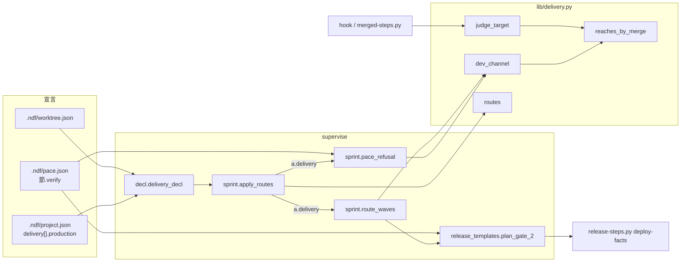
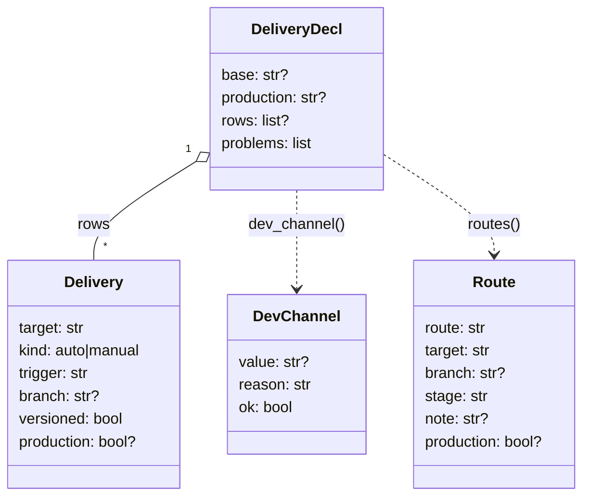
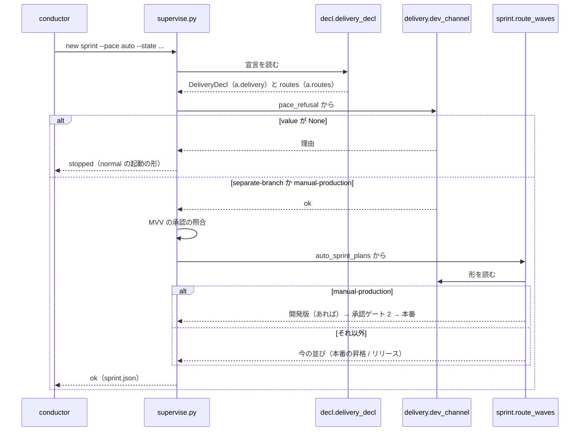

# #1454: 手動反映の本番系を配布の宣言に書けるようにし、その形で pace: auto / fast を使えるようにする

要求と受け入れ条件は #1454 の本文にある（コピーは `issues/issue-1454-requirements.md` ）。この文書は「どう作るか」だけを扱う。
決定の記録・テスト設計・未確認のまま残ることは `issues/issue-1454-design-decisions.md` にある。

## 例: carmo-cdk の宣言で何が起きるか

carmo-cdk（AWS CDK）は起点も本番チャネルも `main` で、CD を持たない。利用者が `.ndf/project.json` の `delivery` を
次のように書く（行の `production` がこの変更で足す項目）。

```json
{
  "delivery": [
    {"target": "staging のスタック", "kind": "manual", "trigger": "cdk deploy CarmoStaging", "branch": "main",
     "versioned": false, "production": false},
    {"target": "production のスタック", "kind": "manual", "trigger": "cdk deploy CarmoProduction", "branch": "main",
     "versioned": false, "production": true}
  ]
}
```

`.ndf/pace.json` の `auto.verify` には、デプロイ先の確認（例 `sh scripts/check-stack.sh CarmoStaging` ）を書く。

1. **使ってよい条件。** `supervise.py new sprint --pace auto --state <状態> ...` は、起点と本番チャネルが同じでも
   「本番系へ届く行（ `production: true` ）が 1 つ以上あり、すべて `kind: manual` で、 `main` へのマージで自動で反映する
   本番系の行が無い」ので、開発版のチャネルがあると判定する。今は「開発版のチャネルが無い」で断っている
2. **検査のマージ。** 検査のプランがスプリントの Pull Request を `main` へマージする。 `merge-gate` の判定
   （ `judge_target` ）は `not-production` を返し、承認ゲート 2 に当たらない（今も同じ）
3. **開発版。** 手で行うステージ「開発版」で、担い手が `/ndf:release` を使って staging のスタックへ `cdk deploy` する。
   承認は求めない
4. **承認ゲート 2。** 新しいプラン `gate-2` の `facts` のステップが `auto.verify` を走らせて承認資料を書き、 `mvv` のステップが MVV 判定（承認ゲート 2）を通す。
   `verify` が非 0 なら MVV 判定へ進まずに止まる
5. **本番。** 手で行うステージ「本番」で、担い手が `/ndf:release` を使って production のスタックへ `cdk deploy` する

`sprint.json` のステージは次の並びになる（ `--design` を渡したとき）。

| # | ステージ | 中身 | 流し方 |
| --- | --- | --- | --- |
| 1 | 設計 | `design-<N>` | `command` （後ろを `--then` で検査まで流す） |
| 2 | 承認ゲート 1 | 無し（設計のプランの MVV 判定） | — |
| 3 | スプリントブランチ | `sprint-branch` | `then_of: 設計` |
| 4 | 実装 | `impl-<N>` | `then_of: 設計` |
| 5 | 検査 | `check` （ `main` へマージ） | `then_of: 設計` |
| 6 | 開発版 | 手で行う（ `production: false` の行） | conductor |
| 7 | 承認ゲート 2 | `gate-2` （ `facts` （ `verify` を走らせる）→ `mvv` → `note` ） | `command` （単独の queue） |
| 8 | 本番 | 手で行う（ `production: true` の行と、 `production` を書いていない手動の行） | conductor |

`production: false` の手動の行が無い宣言（本番の手動の行だけ）では 6 が無く、7 は `then_of: 設計` で検査の後に続けて流れる。

ai-plugins（ `develop` → `main` ・ `release.form: package-plugin` ）は経路が雛形で組むものなので、ここは通らない。
`sprint.json` は変更の前後で同じになる。

## ドメインモデル

### コンテキスト

| コンテキスト | 何の語が 1 つの意味に決まるか |
| --- | --- |
| NDF の開発ワークフロー（ `ndf-workflow` ） | 承認ゲート・本番チャネル・開発版・手動反映の本番系・自動反映の本番チャネル・プロジェクトの宣言・スプリント・ステージ・プラン |
| NDF のリリース（ `ndf-release` ） | リリースの経路・昇格の Pull Request |

関係は #1336 と同じ**公開された言語**である。開発ワークフローが宣言の形（ `project.schema.json` ）と判定の関数
（ `lib/delivery.py` ）を公開し、スプリントの組み立て（ `pace_refusal` ・ `route_waves` ）と hook（ `judge_target` ）が同じ関数を読む。
どれも宣言を書き換えない。

### 集約

| 集約 | 持ち主（書き換えてよいもの） | 根 | エンティティ | 値オブジェクト |
| --- | --- | --- | --- | --- |
| プロジェクトの宣言 | 利用者と `project-decl.py write` （この変更は読むだけ。 `production` は利用者だけが書く） | `.ndf/` | `delivery` の行 | ベースブランチ・本番チャネル・ `kind` ・ `branch` ・ `production` |
| 開発版のチャネルの判定（1 回の呼び出しで作るもの） | `lib/delivery.py` の `dev_channel` | 判定 | — | 形（ `separate-branch` / `manual-production` / 無し）・理由 |
| マージの判定（同上） | `lib/delivery.py` の `judge_target` | 判定 | — | 宛先・判定の値・理由・根拠のキー |
| スプリントのプラン | `supervise.py new sprint` / `new close` | `sprint.json` | ステージ・プラン | リリースの経路の並び |

**判定は保存しない。** 呼ぶたびに宣言から作り直す（#1336 と同じ）。

### 不変条件

| # | 集約 | 条件 | 破れたときの扱い |
| --- | --- | --- | --- |
| I1 | 開発版のチャネルの判定 | 起点と本番チャネルが違うときは、 `delivery` を読まずに `separate-branch` にする（今の判定と同じ） | AC9 のテストが落とす |
| I2 | 開発版のチャネルの判定 | 起点と本番チャネルが同じときに `manual-production` にするのは、宣言が読め、 `production: true` の行が 1 つ以上あり、それがすべて `kind: manual` で、本番チャネルへのマージで自動で反映する行（ `kind: auto` ・ `branch` が本番チャネル・ `production` が `false` でない）が無いときだけである。ほかは「無し」にする | `pace: auto` / `fast` が断る。テストが落とす |
| I3 | 開発版のチャネルの判定 | 判定は宣言と git の参照だけから作り、 `gh` を呼ばない | テストが落とす |
| I4 | マージの判定 | `production: false` と書いた `kind: auto` の行は、本番チャネルへのマージを本番系へ届く操作に数えない。 `production` を書いていない行は今と同じに数える | テストが落とす |
| I5 | スプリントのプラン | `manual-production` の形の `auto` / `fast` のプランには、MVV 判定（承認ゲート 2）がちょうど 1 回あり、それは手で行う「本番」のステージより前で、検査のマージより後である | AC4 のテストが落とす |
| I6 | スプリントのプラン | 同じ形で、 `<節>.verify` は MVV 判定と同じプランの、MVV 判定より前のステップ（ `facts` ）で走り、非 0 ならプランは MVV 判定へ進まずに止まる | AC6 のテストが落とす |
| I7 | スプリントのプラン | `production` を書いていない手動の行は、手で行う「本番」のステージ（承認ゲート 2 の後）へ入れ、「開発版」へ入れない | 承認の無いまま本番系へ届きうる。テストが落とす |
| I8 | スプリントのプラン | `release.form` に雛形があるリポジトリ（ai-plugins）と、 `production` を 1 行も書いていない宣言のプランは、変更の前後で同じになる | AC8 のテストが落とす |

### ドメインイベント

要求の E1〜E7 を引き継ぐ。

| # | イベント | 発生元 | 受け手 |
| --- | --- | --- | --- |
| E1 | 利用者が `delivery` の行に `production` を書いた | 利用者 | 宣言の読み取り（ `project-decl.py check` ・ `lib/delivery.py` ） |
| E2 | conductor が `new sprint --pace auto` を打った | conductor | `pace_refusal` |
| E3 | 開発版のチャネルがあると判定した | `delivery.dev_channel` | `pace_refusal` と `route_waves` |
| E4 | 検査のプランがベースブランチへマージした | 検査のプランの `merge` | `merge-gate` （ `judge_target` ） |
| E5 | 開発版へ届け、導入の確認が済んだ | 手で行う「開発版」のステージと `gate-2` の `facts` | `gate-2` の `mvv` |
| E6 | 承認ゲート 2 を通した | `gate-2` の `mvv` （ `by: mvv` ）か利用者（ `by: user` ） | 手で行う「本番」のステージ |
| E7 | 担い手が本番のデプロイを起こした | `/ndf:release` | — |

### 用語

| 用語 | 意味 | 用語集への反映 |
| --- | --- | --- |
| 手動反映の本番系 | 配布の宣言の行のうち、 `production: true` と宣言され、 `kind: manual` のもの。そこへ届ける操作（手で行う「本番」のステージ）の前に承認ゲート 2 を掛ける | 要求で追加済み。意味の「本番系へ届くと宣言され」を「 `production: true` と宣言され」へ具体化する（意味の変更ではない） |
| 開発版 | ベースブランチに載るチャネルと、そこへ出す接尾辞付きの版 | 意味の変更（広げる）: 手動反映の本番系の形では、 `production: false` の行（検証の環境）へ届くことも開発版に当たる |

## 機能一覧

| # | 機能 | 誰が使うか |
| --- | --- | --- |
| F1 | 配布の宣言の行に、本番系へ届くかどうか（ `production` ）を書く | 利用者 |
| F2 | 起点と本番チャネルが同じでも、手動反映の本番系の形なら `pace: auto` / `fast` を使う | conductor |
| F3 | その形のスプリントで、検証の環境への反映 → 導入の確認 → 承認ゲート 2 → 本番のデプロイの順にステージを置く | conductor・supervisor |
| F4 | `production: false` の自動反映の行を、本番チャネルへのマージの判定で本番系に数えない | hook・マージのスクリプト |

## 構成要素

| 要素 | 変更 | 責務 |
| --- | --- | --- |
| `project_lib/model.py` の `Delivery` | 変える | 行に `production: Optional[bool] = None` を足す |
| `skills/development-workflow/schemas/project.schema.json` | 作り直す | `project-decl.py schema` の出力で置き換える |
| `lib/delivery.py` の `dev_channel` | 作る | 開発版のチャネルの形を判定する（I1〜I3）。 `pace_refusal` と `route_waves` が呼ぶ |
| `lib/delivery.py` の `reaches_by_merge` | 作る | 行が本番チャネルへのマージで自動で本番系へ届くか（ `kind: auto` ・ `branch` が本番チャネル・ `production` が `false` でない）。 `judge_target` と `dev_channel` が呼ぶ |
| `lib/delivery.py` の `judge_target` | 変える | 自動反映の行の判定を `reaches_by_merge` へ替える（I4） |
| `lib/delivery.py` の `Route` と `routes` | 変える | `Route` に `production` （行の値。 `None` 可）を持たせ、 `as_dict` は `None` のとき出さない（I8） |
| `supervise_lib/decl.py` の `delivery_decl` | 作る | `release_routes` の中の宣言の組み立てを切り出し、 `DeliveryDecl` を返す |
| `supervise_lib/sprint.py` の `apply_routes` | 変える | `a.delivery` （ `DeliveryDecl` ）も載せる |
| `supervise_lib/sprint.py` の `pace_refusal` | 変える | 起点と本番の比較を `delivery.dev_channel` へ替える |
| `supervise_lib/sprint.py` の `route_waves` | 変える | `mvv` があり、 `dev_channel` が `manual-production` なら、手で届ける経路を「開発版」「承認ゲート 2」「本番」へ分けて置く |
| `supervise_lib/sprint.py` の `next_text` | 変える | 手で行うステージが 2 つ以上あっても、すべてを順に書く（今は最初の 1 つだけ） |
| `supervise_lib/release_templates.py` の `plan_gate_2` | 作る | 承認ゲート 2 のプラン（ `facts` （ `<節>.verify` と承認資料）→ `mvv` → `note` ・ `handoff` ） |
| `release-steps.py deploy-facts` | 作る | `<節>.verify` を走らせ、承認資料（本番系の行・ベースブランチの先頭・確認の出力）を書く。確認が非 0 なら非 0 で終わる |
| `skills/development-workflow/references/pace.md` | 変える | 「使ってよい条件」「使ってはいけない場面」「リリースの経路からステージを組む」「承認ゲートで止まった後の続け方」 |
| `skills/development-workflow/references/project-analysis.md` | 変える | P7 の行に `production` を足し、解析は書かず利用者が書くと記す |
| `docs/glossary/glossary.json` と `docs/glossary.md` | 変えた（この設計の変更に含む） | 用語の表の 2 語 |
| `skills/development-workflow/references/glossary.md` | 変える | 「開発版」の意味の出所。用語集の意味に合わせる |



図には、文書（ `pace.md` ・ `project-analysis.md` ・用語集の 3 か所）と、宣言の形（ `Delivery` のモデルとスキーマ。 `.ndf/project.json` の箱が表す）と、
`next_text` （ `route_waves` が組んだステージの文面を書く）を描かない。

## 構造



`DevChannel.value` は `separate-branch` （起点と本番チャネルが違う）/ `manual-production` （手動反映の本番系の形）/ `None`
（無い）の 3 つで、 `ok` は `value` が `None` でないこと。 `reason` は `None` のときの断る理由（ `pace_refusal` がそのまま返す）。

## データ構造

**`.ndf/project.json` の `delivery[]` の行に任意の項目を 1 つ足す。** 移行は無い（前提 2）。

| 項目 | 型 | 無いとき | 意味 |
| --- | --- | --- | --- |
| `production` | 真偽値 | 本番系へ届くかを決めない（今の読み方） | `true`: この行は本番系へ届く。 `false`: 届かない（dev / staging など検証の環境） |

**解析（ `project-decl.py write` ）は `production` を書かない。** 利用者が書く。書き足した行は、 `analysis.written` の指紋と
一致しなくなるため、次の解析でも利用者の値のまま残る（ `project_lib/merge.py` の `merge_item` の今の振る舞い）。

## 入出力の契約

### `lib/delivery.py`

| 関数 | 入力 | 出力 | 失敗の形 |
| --- | --- | --- | --- |
| `reaches_by_merge(row, production)` | `delivery` の行・本番チャネル | 真偽値。 `kind == "auto"` かつ `branch == production` かつ `row.get("production") is not False` | 無い（純粋な関数） |
| `dev_channel(decl)` | `DeliveryDecl` | `DevChannel` | 例外を上げない。決められないときは `value: None` と理由 |
| `judge_target(decl, target)` | 今と同じ | 今と同じ | 今と同じ |
| `Route.as_dict()` | — | 今の 5 キー。 `production` が `None` でなければ `production` を足す | — |

`dev_channel` の判定は上から順に最初に当たったもので決まる。

| # | 条件 | `value` | `reason` |
| --- | --- | --- | --- |
| 1 | 本番チャネルが無い | `None` | 開発版のチャネルが無い（本番のブランチが分からない） |
| 2 | 本番チャネル ≠ 起点 | `separate-branch` | — |
| 3 | 宣言が読めない（ `problems` ）・ `delivery` が無い・不明 | `None` | 開発版のチャネルが無い（起点と本番のブランチが同じで、 `delivery` を読めない / 無い / 不明） |
| 4 | `reaches_by_merge` に当たる行がある | `None` | 開発版のチャネルが無い（ `delivery[i]` が本番チャネルへのマージで自動で本番系へ届く） |
| 5 | `production: true` の行が無い | `None` | 開発版のチャネルが無い（起点と本番のブランチが同じで、本番系へ届く行（ `production: true` ）が宣言されていない） |
| 6 | `production: true` の行に `kind: auto` がある | `None` | 開発版のチャネルが無い（ `delivery[i]` は本番系へ自動で届く） |
| 7 | ほか | `manual-production` | — |

### `release-steps.py deploy-facts`

```text
release-steps.py deploy-facts --root <リポジトリ> --verify <コマンド> --out <承認資料>
```

| 項目 | 内容 |
| --- | --- |
| 動き | `--root` で `<コマンド>` を `sh -c` で走らせ、承認資料を `--out` へ書く |
| 承認資料 | 本番系へ届ける行（ `production: true` と、 `production` の無い手動の行）の `target` ・ `trigger` 、ベースブランチの先頭のコミット、確認のコマンドと終了コードと出力の末尾 |
| 終了コード | 確認が 0 なら 0。確認が非 0 なら 1（承認資料は書く）。宣言が読めない・`--out` へ書けないなら 2 |
| 結果 | 1 行の結果 JSON（ `step_result.result` の形）。 `metrics.verify_exit` に確認の終了コード |

### プラン `gate-2` のステップ

| id | 型 | 中身 | 成功 | 失敗・承認ゲート |
| --- | --- | --- | --- | --- |
| `facts` | run | `deploy-facts --verify <節>.verify --out {state_dir}/work/approval-deploy.md` | `mvv` | 止まった（ `on_fail` 無し。I6） |
| `mvv` | run | `mvv-gate.py check --gate release --material <承認資料> [--pr <PR>]` | `note` | 10 なら `gate_next: end` （承認ゲート） |
| `note` | run | PR があれば判定の記録を各 PR へコメントし、無ければ承認資料の末尾へ足す | end | `handoff` |
| `handoff` | run | `verify_steps.handoff_step` （承認ゲート 2・判定の記録） | — | 10（承認ゲート） |

`--pr` は、検査の後に続けて流れるとき `auto` は `{queue_pr:check}` 、 `fast` は `{queue_prs}` 。単独の queue（前に「開発版」の手で
行うステージがある）では渡さない。 `fast` のスプリントの終わり（ `new close` ）は実行条件（ `changed --id <M>-final` ）を付ける。

### `sprint.json` のステージ（手動反映の本番系の形の `auto` / `fast` ）

| ステージ | キー | 中身 |
| --- | --- | --- |
| 開発版 | `manual` ・ `note` | `production: false` の手動の経路の `target` と `trigger` 。承認は要らない。「済んだら承認ゲート 2 の `command` を打つ」 |
| 承認ゲート 2 | `plans` ・ `command` か `then_of` | `gate-2` |
| 本番 | `manual` ・ `note` | 残りの手動の経路の `target` と `trigger` 。「承認ゲート 2 が通過（ `by: mvv` か `by: user` の記録）してから `/ndf:release` で届ける」 |

`normal` は今と同じ「リリース」のステージ 1 つで、手で届けるすべての経路を載せる。

## 処理の流れ

### `new sprint --pace auto` の判定と組み立て



### 承認ゲート 2 から本番まで

```mermaid
stateDiagram-v2
  [*] --> 検査のマージ
  検査のマージ --> 開発版 : production false の手動の行がある
  検査のマージ --> facts : 無い（then_of で続く）
  開発版 --> facts : conductor が承認ゲート 2 の command を打つ
  facts --> 止まった : 確認が非 0
  facts --> mvv : 確認が 0
  mvv --> note : 従う（by mvv）
  mvv --> 承認ゲート : 従わない・判定できない・レッドライン
  note --> 本番 : 記録を残せた
  note --> 承認ゲート : handoff（by mvv を外す）
  承認ゲート --> 本番 : 利用者が承認（by user）
  承認ゲート --> [*] : 差し戻し
  本番 --> [*] : /ndf:release
```

## 非機能の実現方式

| 大項目 | 実現方式 |
| --- | --- |
| 運用・保守性 | 開発版のチャネルの判定は `lib/delivery.py` の `dev_channel` の 1 か所に置き、 `pace_refusal` と `route_waves` が呼ぶ。本番チャネルへのマージで自動で届くかは `reaches_by_merge` の 1 か所に置き、 `judge_target` と `dev_channel` が呼ぶ。どちらも宣言と git の参照だけを読む |
| セキュリティ | 決められないとき（表の 1・3〜6）は断る側へ倒す。 `production` を書いていない手動の行は承認ゲート 2 の後へ置く（I7）。 `gate-2` の `facts` の失敗は止まる側で、 `mvv` へ進まない |
| 移行性 | `production` は任意の項目で、無い行は今の読み方のまま（ `reaches_by_merge` は `is not False` で今の判定と一致する）。 `Route.as_dict` は `None` を出さないため、今の `sprint.json` は変わらない |
