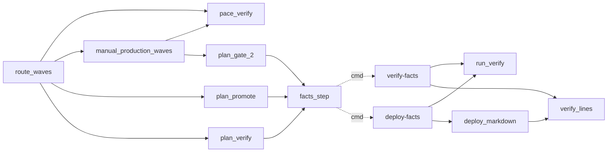
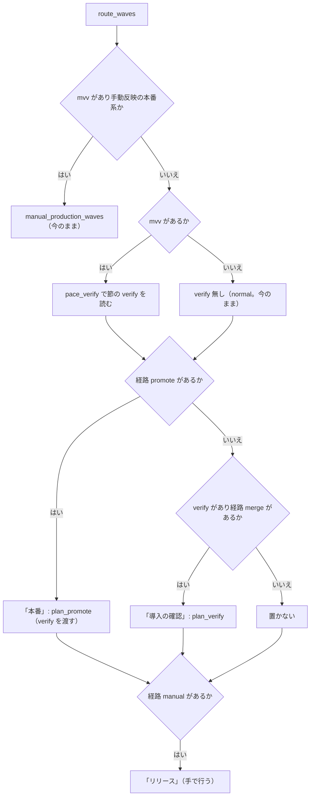
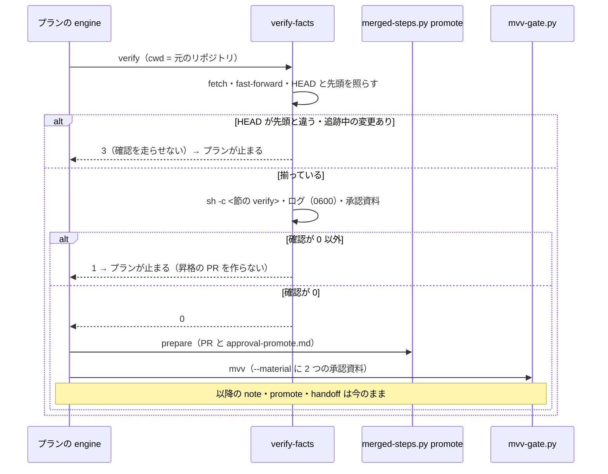

# #1457: pace: auto / fast の merge・promote の経路で、承認ゲート 2 の前に導入の確認を走らせる

要求と受け入れ条件は #1457 の本文にある（コピーは `issues/issue-1457-requirements.md` ）。この文書は「どう作るか」だけを扱う。
決定の記録・テスト設計・未確認のまま残ることは `issues/issue-1457-design-decisions.md` にある。

## 例: project-trygroup-prd の形の宣言で何が起きるか

宣言は次のとおり（起点 `develop` ・本番 `main` 、 `release.form` を持たない）。

```json
{
  "worktree.json": {"base_branch": "develop", "production_branch": "main"},
  "project.json": {"delivery": [
    {"kind": "auto", "branch": "develop", "target": "stg"},
    {"kind": "auto", "branch": "main", "target": "prd"}
  ]},
  "pace.json": {"auto": {"enabled": true, "verify": "sh scripts/check-stg.sh"},
                "fast": {"enabled": true, "verify": "sh scripts/smoke-stg.sh"}}
}
```

（実物は 3 つのファイルに分かれている。ここでは並べて示す。）

リリースの経路（ `lib/delivery.py` の `routes` ）は、 `stg` の行が `merged-by-check` （以下「経路 `merge` 」）、 `prd` の行が
`promote` （以下「経路 `promote` 」）になる。 `supervise.py new sprint --pace auto --state <状態> ...` の後ろのステージは次の並びになる。

| # | ステージ | 中身 | 今 | 変えた後 |
| --- | --- | --- | --- | --- |
| 1 | スプリントブランチ | `sprint-branch` | 同じ | 同じ |
| 2 | 実装 | `impl-<N>` | 同じ | 同じ |
| 3 | 検査 | `check` （スプリントの Pull Request を `develop` へマージ。 `stg` へ届く） | 同じ | 同じ |
| 4 | 本番 | 昇格のプラン `promote` | `prepare` → `mvv` → `note` → `promote` | **`verify`** → `prepare` → `mvv` → `note` → `promote` |

1. **検査のマージ。** 3 のマージで `develop` の先頭が進み、 `stg` への反映（CI）が始まる。反映を待つのは `auto.verify` のコマンドの側である
2. **導入の確認。** 4 の最初のステップ `verify` が `release-steps.py verify-facts` を打つ。メインディレクトリを `develop` の先頭へ
   fast-forward し、 `sh scripts/check-stg.sh` を走らせ、承認資料 `{state_dir}/work/approval-verify.md` に確認したコミットと
   終了コードを書く。出力は `approval-verify.md.verify.log` （権限 0600）へ分ける
3. **止まり方。** 確認が 0 以外なら `verify` のステップが落ち、プランは止まる。 `prepare` が走らないので昇格の Pull Request も作られず、
   `main` へのマージは起きない
4. **MVV 判定。** 確認が 0 なら今と同じ `prepare` → `mvv` と進む。 `mvv` は `approval-promote.md` と `approval-verify.md` の 2 つを
   `--material` に受け取る

`--pace fast` で組むと、 `verify` が走らせるのは `sh scripts/smoke-stg.sh` （ `fast.verify` ）になる。

宣言から `prd` の行を消す（経路 `merge` だけ）と、4 の「本番」は置かれず、代わりにプラン `verify` （ステップ `verify` 1 つ）を持つ
ステージ「導入の確認」が検査の後に置かれる。MVV 判定はそこには無い（経路 `merge` の反映は開発版のチャネルへのものである）。

ai-plugins（ `release.form: package-plugin` ）は経路が雛形なので、ここは通らない。 `sprint.json` は変更の前後で同じになる。

## ドメインモデル

### コンテキスト

| コンテキスト | 何の語が 1 つの意味に決まるか |
| --- | --- |
| NDF の開発ワークフロー（ `ndf-workflow` ） | 承認ゲート・承認資料・MVV 判定・進め方・スプリント・ステージ・プラン・導入の確認 |
| NDF のリリース（ `ndf-release` ） | リリースの経路・昇格の Pull Request・昇格のプラン |

関係は #1336・#1454 と同じ**公開された言語**である。開発ワークフローが進め方の宣言（ `pace.json` ）と配布の宣言の判定
（ `lib/delivery.py` ）を公開し、スプリントの組み立て（ `route_waves` ）がそれを読んでリリースのプランを組む。どれも宣言を書き換えない。

### 集約

| 集約 | 持ち主（書き換えてよいもの） | 根 | エンティティ | 値オブジェクト |
| --- | --- | --- | --- | --- |
| 進め方の宣言 | 利用者（この変更は読むだけ） | `.ndf/pace.json` | 節（ `fast` / `auto` ） | `verify` ・ `enabled` ・ `modes` |
| スプリントのプラン | `supervise.py new sprint` / `new close` | `sprint.json` | ステージ・プラン・ステップ | リリースの経路の並び・実行条件 |
| 導入の確認の記録（1 回の確認で作るもの） | `release-steps.py verify-facts` / `deploy-facts` | 承認資料のファイル | — | 確認したコミット・コマンド・終了コード・出力のログの置き場 |

**確認の記録は上書きする。** 同じプランを `--from verify` で打ち直すと、同じ置き場へ書き直す（追記しない）。
過去の確認は記録として持たず、承認ゲートの記録（ `sprint-state.py gate` ）と MVV 判定の記録（ `mvv-gate.jsonl` ）が判定の履歴を持つ。

### 不変条件

| # | 集約 | 条件 | 破れたときの扱い |
| --- | --- | --- | --- |
| I1 | スプリントのプラン | `fast` / `auto` で、経路が雛形でも手動反映の本番系でもなく、経路 `promote` か `merge` を持つスプリントでは、 `<節>.verify` を走らせるステップがちょうど 1 つある | 組み立ての誤り（テストが落とす） |
| I2 | スプリントのプラン | 昇格のプランでは、確認のステップが `mvv` より前にあり、確認が 0 以外なら `prepare` ・ `mvv` ・ `note` ・ `promote` のどれも走らない | 組み立ての誤り |
| I3 | スプリントのプラン | 確認のステップが走らせるのは選んだ進め方の節の `verify` である（ `new close` は `fast` ）。節に `verify` が無ければプランを書かない（ `DeclError` ） | 引数の誤り（終了コード 2） |
| I4 | 導入の確認の記録 | 承認資料には確認の出力を載せない。出力は承認資料と別の、権限 0600 のファイルにだけ残る | 秘密が外部の LLM へ渡る（テストが落とす） |
| I5 | 導入の確認の記録 | 確認はベースブランチの先頭のコミットで、追跡中の変更が無いworktreeでだけ走る。満たさなければ確認を走らせず 3 で止まる | 別のコミットを確かめた記録が残る |
| I6 | スプリントのプラン | `normal` ・手動反映の本番系（ `gate-2` ）・雛形の経路で組むステージは、この変更の前と同じである | 既存の振る舞いが変わる |
| I7 | スプリントのプラン | `new close` で最終の検査に変更が無い（実行条件が `skip`）とき、確認も走らない | 変更の無いスプリントで確認が落ちて止まる |

### ドメインイベント

| # | イベント | 発生元 | 受け手 |
| --- | --- | --- | --- |
| E1 | スプリントのプランを組んだ | `supervise.py new sprint` / `new close` | conductor |
| E2 | 検査の Pull Request をベースブランチへマージした | 検査のプラン | 経路 `promote` を持つ: 次のステージ「本番」の昇格のプランの先頭の `verify` のステップ（ステージの並びで続く。 `then_of` ではない）。経路 `merge` だけ: ステージ「導入の確認」の `verify` のステップ（ `then_of` で続く） |
| E3 | 開発版のチャネルへ反映した | ベースブランチへの push（NDF の外） | `<節>.verify` のコマンド（反映を待つのはコマンドの側） |
| E4 | 導入の確認を走らせた | 確認のステップ（ `verify-facts` ） | プランの engine（終了コードで次のステップを決める） |
| E5 | 確認の終了コードを承認資料へ書いた | `verify-facts` | `mvv` のステップ（ `--material` ）・人 |
| E6 | 承認ゲート 2 の MVV 判定をした | 昇格のプランの `mvv` | `note` ・ `promote` （今のまま） |
| E7 | 本番チャネルへの昇格の Pull Request をマージした | 昇格のプランの `promote` | 今のまま |

経路 `merge` だけのスプリントでは E6・E7 が無く、E5 の受け手は人だけである。

**「インストール確認」との住み分け。** 用語集の「インストール確認」は、隔離した HOME で ref からプラグインをインストールし版と中身を
確かめること（ `release-verification-steps.py verify-install` ）の意味のまま変えない。 `<節>.verify` に書くコマンドの 1 つになりうるが、
`<節>.verify` を走らせること全体は「導入の確認」と呼ぶ。 `pace.md` で `<節>.verify` を指して「インストール確認」と書いている箇所
（「使ってよい条件」の表の「インストール確認がある」・設定の表の `fast.verify` / `auto.verify` の説明・経路の図の「開発版の配布と
インストール確認」の節点）は、F4 で「導入の確認」へ改める。

### 用語

| 用語 | 意味 | 用語集への反映 |
| --- | --- | --- |
| 導入の確認 | `.ndf/pace.json` の `<節>.verify` に書かれたコマンドを、ベースブランチの先頭で走らせること。経路 `promote` では承認ゲート 2 の前（昇格のプランの先頭）に、経路 `merge` だけのときは検査の後（ステージ「導入の確認」）に走る | 追加（ `ndf-workflow` ） |
| 昇格のプラン | 経路 `promote` のための「本番」のステージのプラン。ベースブランチ → 本番チャネルの Pull Request を作り、承認ゲート 2 の後にマージする | 追加（ `ndf-release` ） |

## 機能一覧

| # | 機能 | 誰が使うか |
| --- | --- | --- |
| F1 | 昇格のプランの `fast` / `auto` の先頭で導入の確認を走らせ、落ちたら止める | conductor（ `new sprint` / `new close` の後の queue） |
| F2 | 経路 `merge` だけのスプリントの `fast` / `auto` で、検査の後に導入の確認のステージを置く | 同上 |
| F3 | 確認のコマンド・終了コード・確認したコミットを承認資料へ書き、出力をログへ分ける（ `verify-facts` ） | 昇格のプランの `mvv` ・人 |
| F4 | `pace.md` の経路の表に、確認が走る置き場と落ちたときの振る舞いを書く | 利用者・conductor |

## 構成要素

| 要素 | 変える点 | 責務 |
| --- | --- | --- |
| `release_lib/deploy.py` の `run_verify`（新規） | `head_of_base` ・確認の実行・ログの書き出しを `deploy_facts` から切り出す | ベースブランチの先頭で確認を 1 度走らせ、(コミット・終了コード・ログの置き場) を返す。前提を満たさなければ 3 の `StepError` |
| `release_lib/deploy.py` の `verify_lines`（新規） | `deploy_markdown` の「導入の確認」の節を切り出す | 承認資料の「導入の確認」の節（コマンド・終了コード・出力を載せない旨）の行を返す |
| `release_lib/deploy.py` の `deploy_facts` / `deploy_markdown` | 上の 2 つを使う形にする。出力する承認資料は変えない | 手動反映の本番系の承認資料（今のまま） |
| `release_lib/deploy.py` の `verify_facts` ・ `cmd_verify_facts` （新規） | サブコマンド `verify-facts` を足す | 経路 `merge` / `promote` の確認の承認資料を書き、終了コードの契約（0 / 1 / 2 / 3）で終える |
| `release_templates.py` の `facts_step` （新規） | `plan_gate_2` の `facts` のステップの形を切り出す | 確認のステップ 1 つ（ `stage: 配布` ・上限 1500 秒・ `cwd` ）を返す。 `gate-2` ・昇格・導入の確認のプランが使う |
| `release_templates.py` の `plan_promote` | 引数 `verify` を足し、 `mvv` のあるときの先頭に `verify` を置き、 `mvv` の `--material` に確認の資料を足す | 昇格のプラン |
| `release_templates.py` の `plan_verify` （新規） | ステップ `verify` 1 つのプランを組む | 経路 `merge` だけのスプリントの「導入の確認」のプラン |
| `release_templates.py` の `plan_gate_2` | `facts` を `facts_step` で作る。組まれるプランは変えない | 手動反映の本番系の承認ゲート 2（今のまま） |
| `sprint_routes.py` の `pace_verify` （新規） | `manual_production_waves` の節の選び方と `verify` の確かめを切り出す | 選んだ進め方の節の `verify` を返す（ `new close` は `fast` ）。無ければ `DeclError` |
| `sprint_routes.py` の `route_waves` | `mvv` のあるとき、昇格のプランへ `verify` を渡す。経路 `promote` が無く `merge` があれば「導入の確認」のステージを置く | 雛形で組まない経路のステージ |
| `sprint_routes.py` の `manual_production_waves` | `pace_verify` を使う。組むステージは変えない | 手動反映の本番系のステージ（今のまま） |
| `development-workflow/references/pace.md` | 経路の表と昇格のプランの説明に確認のステップを足す。 `<節>.verify` を指す「インストール確認」を「導入の確認」へ改める（用語の節の住み分け） | 利用者向けの説明 |

呼び出しの関係（ `→` は呼ぶ）:



点線は、プランのステップの `cmd` として `release-steps.py` のサブコマンドを打つ関係である（プランを実行した時点で呼ばれる）。

## 構造

関数の単位の変更で、型は足さない。 `run_verify` の戻り値は、 `deploy_facts` が今 `metrics` に載せている値と同じ名前の辞書にする。

| 関数 | 引数 | 戻り値 |
| --- | --- | --- |
| `run_verify(root, base, verify, out)` | worktree・ベースブランチ・確認のコマンド・承認資料の置き場 | `{"sha", "verify_exit", "log"}` 。ログは `f"{out}.verify.log"` |
| `verify_lines(verify, code)` | 確認のコマンド・終了コード | 「## 導入の確認」から始まる行の列 |
| `verify_facts(root, base, verify, out)` | 同上 | `(items, metrics)` 。 `metrics` は `run_verify` の値に `base` を足したもの |
| `facts_step(repo, cmd, next_id)` | 元のリポジトリ・ステップのコマンド・次のステップ | ステップの辞書 |
| `plan_verify(a, repo, verify, condition)` | 引数・元のリポジトリ・確認のコマンド・実行条件 | プランの辞書 |
| `pace_verify(a)` | 引数 | `verify` の文字列 |

`plan_promote` の引数は `verify: str | None = None` を足す。 `mvv` があって `verify` が無いときは `DeclError` にする（I3）。

## 入出力の契約

### `release-steps.py verify-facts`

```text
python3 release-steps.py verify-facts --base <ベースブランチ> --verify <コマンド> --out <承認資料> [--root <dir>]
```

| 終了コード | 状態 | いつ |
| --- | --- | --- |
| 0 | `ok` | 確認が 0 で終わった。承認資料を書いた |
| 1 | `stopped` | 確認が 0 以外で終わった。承認資料は書く（終了コードが載る） |
| 2 | `stopped` | 承認資料かログへ書けない |
| 3 | `stopped` | `--root` の HEAD がベースブランチの先頭と違う（fast-forward しても）・追跡中のファイルに変更がある・ベースブランチを決められない。確認を走らせない |

結果 JSON の `metrics` は `verify_exit` ・ `sha` ・ `base` ・ `log` 、 `presentation_path` は `--out` 。 `--base` はプランが
`a.base` を渡す（配布の宣言は読まない。経路 `merge` / `promote` の確認には本番系の行が要らない）。

承認資料（ `--out` ）の形:

```markdown
# 導入の確認の承認資料

## 確認したコミット

- ベースブランチ develop の先頭: `<sha>`。導入の確認はこのコミットで走らせた

## 導入の確認

- コマンド: `sh scripts/check-stg.sh`
- 終了コード: 0
- 出力は秘密を含みうるため、この資料へ載せない（手元のログに残す）
```

「## 導入の確認」の節は `verify_lines` が作り、 `deploy-facts` の承認資料の同じ節と同じ行になる。

### 昇格のプラン（ `fast` / `auto` ）のステップ

| id | 変更 | cmd の要点 | 次 |
| --- | --- | --- | --- |
| `verify` | 新規（先頭） | `cd` は元のリポジトリ。 `release-steps.py verify-facts --root <repo> --base <a.base> --verify <節の verify> --out {state_dir}/work/approval-verify.md` 。上限 1500 秒 | 0 なら `prepare` 。ほかは落ちてプランが止まる |
| `prepare` | 無し | 今のまま | `mvv` |
| `mvv` | `--material` に `{state_dir}/work/approval-verify.md` を足す | `mvv-gate.py check ... --material {state_dir}/work/approval-promote.md {state_dir}/work/approval-verify.md ...` | 今のまま |
| `note` ・ `promote` ・ `promote-approved` ・ `handoff` | 無し | 今のまま | 今のまま |

`normal` （ `mvv` 無し）の `promote` → `promote-approved` は変えない（I6）。

### プラン `verify` （経路 `merge` だけ）

| 項目 | 値 |
| --- | --- |
| `フェーズ` | `配布（導入の確認）` |
| `規則` | 「開発版のチャネルへの反映の後の導入の確認。落ちたら直さずに止める」 |
| `上限` | 12（ほかの配布のプランと同じ） |
| `steps` | `verify` 1 つ（昇格のプランの `verify` と同じ `cmd` 。 `next: end` ） |
| 実行条件（プランのキー） | `new close` の `changed` （渡されたときだけ） |

### `sprint.json` のステージ（ `fast` / `auto` 、経路が雛形でも手動反映の本番系でもないとき）

| 経路 | 検査の後のステージ |
| --- | --- |
| `promote` を持つ（ `merge` の有無によらない） | 「本番」（昇格のプラン。先頭に `verify` ）。 `manual` もあれば「リリース」を続ける |
| `merge` を持ち `promote` を持たない | 「導入の確認」（プラン `verify` ）。 `manual` もあれば「リリース」を続ける |
| `manual` か `none` だけ | 今のまま（前提 3） |

「導入の確認」のステージは `then_of` （検査の queue に `--then` で続く）で、 `new close` では実行条件を持つ。

## 処理の流れ

ここの 2 つの図は、組み立て（ `route_waves` ）と実行（昇格のプラン）の順序だけを描く。 `run_verify` ・ `verify_lines` ・
`facts_step` ・ `plan_gate_2` ・ `deploy-facts` の関係は構成要素の呼び出しの図にあり、 `pace.md` は図に含めない。

### `route_waves` の組み立て



`pace_verify` が `DeclError` を投げたら（節に `verify` が無い）、 `new sprint` / `new close` はプランを書かずに引数の誤り
（ `ap.error` 。終了コード 2）で終える（ `manual_production_waves` と同じ扱い）。

**`new close` は `--pace` を持たない。** `--state` が必須で、組むステージは `fast` のスプリントの終わりとして扱い、読む節は
`fast` である（ `manifest_head` ・ `manual_production_waves` と同じ）。 `auto` のスプリントの `new close` も `fast.verify` を走らせる。

### 昇格のプランの実行（ `auto` ）



止まったプランは `supervise.py run <プラン> --from verify` で打ち直す。確認の資料は上書きされる。

## 非機能の実現方式

| 条件 | 実現方式 |
| --- | --- |
| 確認のステップの上限は手動反映の本番系の `facts` と同じ 1500 秒 | `facts_step` が上限を 1 か所で持ち、3 つのプランがそれを使う |
| 確認の出力を承認資料へ載せない | `run_verify` が出力を `<承認資料>.verify.log` へ 0600 で書き、承認資料には `verify_lines` の行だけを書く |
| 確認と承認資料の処理を経路ごとに分けない | `run_verify` ・ `verify_lines` ・ `facts_step` ・ `pace_verify` を 1 つずつ置き、 `deploy-facts` と `verify-facts` 、 `gate-2` と昇格と導入の確認のプランが共有する |
