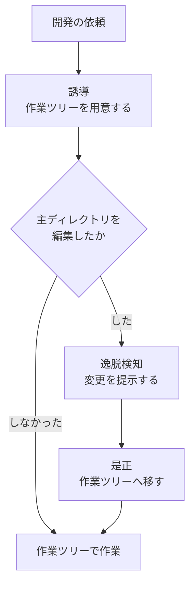
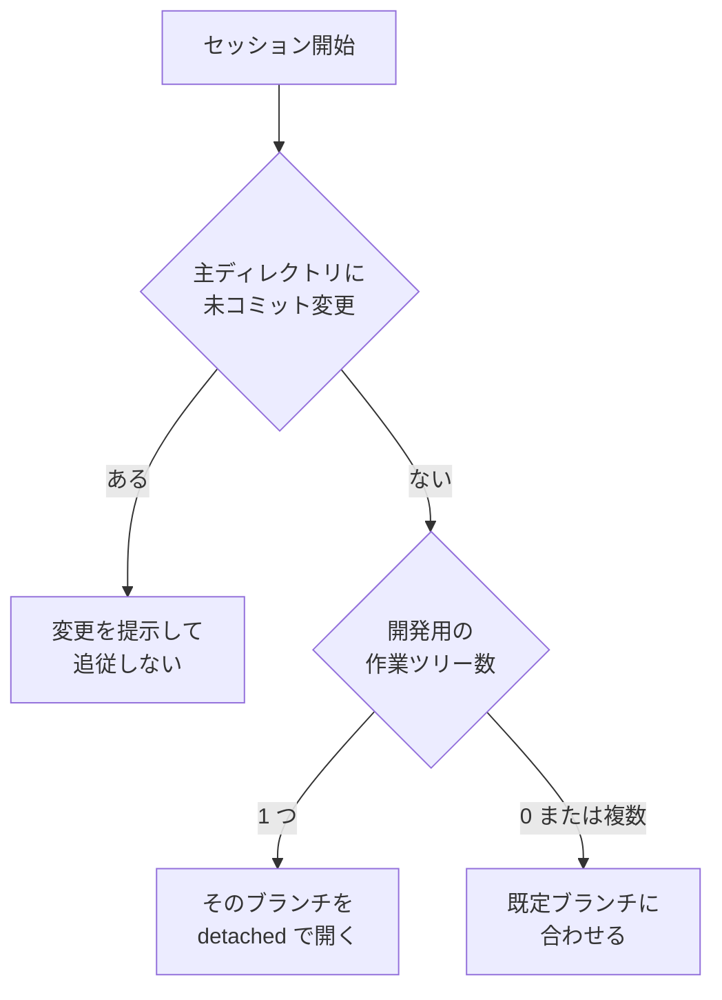

# issue-146: リポジトリの更新を作業ツリー経由に統一する

## 関連リンク

- Issue: https://github.com/devbasex/ai-plugins/issues/146

## 文書の構成

| ファイル | 内容 |
| --- | --- |
| `01-spec-and-plan.md`（この文書） | 仕様、受け入れ条件 1〜20、設計、タスク分解 |
| [`02-local-environment.md`](02-local-environment.md) | ローカル環境を持つリポジトリでの動作検証。受け入れ条件 21〜27 |
| [`03-test-execution.md`](03-test-execution.md) | データ保存先を要するテスト・ブラウザを使うテスト・実機や外部サービスからの通信を受ける検証。受け入れ条件 31〜39 |
| [`04-component-and-data.md`](04-component-and-data.md) | 詳細設計。構成要素、ファイル配置、宣言ファイル・台帳・セッション状態のデータ構造 |
| [`05-interface-contract.md`](05-interface-contract.md) | 詳細設計。hook とコマンドの入出力の契約、3 ランタイムへの結線 |
| [`06-decisions-and-tests.md`](06-decisions-and-tests.md) | 詳細設計。決定の記録 10 件、テスト設計と受け入れ条件の対応 |

02 は人が画面を触って確かめる検証を、03 は自動テストの実行を扱う。分離の範囲が異なるため文書を分けている。
依存物の複製手順は両者で共通である。

両文書とも、前提とするのは git・コンテナ実行系と Compose 相当の定義・POSIX シェルまでとする。
ホストの種類、コンテナを操作する場所、環境管理ツール、言語とフレームワークには依存しない。
リポジトリごとの差は宣言ファイル（`.ndf/localenv.json`）が持ち、宣言が無いリポジトリでは
これらの仕組みは何もせずに終わる。

## モード

`architecture`。公開 Skill と新しい hook 種別を追加し、hooks / skills / manifests / Kiro 導入スクリプトの 4 箇所にまたがる。既存 Skill 5 個の手順も変わる。

## 依頼（原文）

> ## 目的
>
> 常に並列開発を意識した編集を行う。
>
> ## 要望内容
>
> - リポジトリを clone したディレクトリは直接編集しない
>   - ただし `issues/` は除く。場合によっては `docs/` も（この塩梅は要調査）
> - `{repo_root}/.worktrees/` を作成して git worktree をその下に作成する
> - 開発タスクは必ず worktree を使って変更し、PR を作成する
> - PR が merge されたら worktree は削除する
>
> ## 実装方針
>
> 1. **hook にして強制力を高める** — Skill の発動は確率的なため、禁止の強制には hook を使う
> 2. **`superpowers:using-git-worktrees` が存在しない環境でも動くようにする** — インストールでもコピーでも可
> 3. **NDF の他の Skill もこの方針に従って調整する**
> 4. **リポジトリルートのブランチは、稼働中の worktree に追従させる**
>    - 直近の active な worktree のブランチが 1 つであれば、それに連動させる
>    - 複数動いていれば、適宜切り替えるか `main` に合わせる

## 目的

開発作業を作業ツリー（git worktree）の中で行う運用へ揃え、clone したディレクトリ自身を編集対象から外す。並行して複数の作業を進めても、互いの変更が同じ作業ディレクトリで混ざらない状態を目指す。

達成したい状態は次の 3 つである。

1. 開発の変更が、clone したディレクトリではなく作業ツリーの中で行われる
2. clone したディレクトリを編集してしまった場合に、それが利用者に見える
3. clone したディレクトリのブランチが、稼働中の作業ツリーの内容と一致して見える

## 用語

| 用語 | 意味 |
| --- | --- |
| 主ディレクトリ | リポジトリを clone したディレクトリ。`git rev-parse --git-common-dir` の親にあたる |
| 作業ツリー | `git worktree add` で作った作業用ディレクトリ。ここでは `.worktrees/` 配下に置くものを指す |
| 開発用の作業ツリー | 人が変更を加えて Pull Request にするもの。ブランチを持つ |
| レビュー用の作業ツリー | 相互レビュー・相互リファクタリングが一時的に使うもの。参加者ごとに分かれ、いずれも detached HEAD で作られる |
| 誘導 | 逸脱しかけた操作の直前に、正しい手順を伝えること |
| 逸脱検知 | 主ディレクトリに変更が加わった事実を、後から見つけて伝えること |

## 前提

- 前提 1: 主ディレクトリの編集を機械的に拒否しない。原則を伝え、逸脱は検知して事後に是正する。誤検知で正当な操作が止まる状態を作らないことを優先する
- 前提 2: レビュー用の作業ツリーは非永続領域（システムの一時ディレクトリ）に置いたままにする。開発用とは寿命も後片付けの主体も異なる
- 前提 3: 3 ランタイム（Claude Code / Codex CLI / Kiro CLI）で同じ原則を伝える。伝達手段は各ランタイムの hook 種別に合わせて変わってよい
- 前提 4: 対象リポジトリは `.worktrees/` を `.gitignore` へ登録できる。登録しないまま作業ツリーを作ると、作業ツリーの中身が追跡対象に入る

## 対象範囲

含む:

- 作業ツリーの作成・移動・後片付けを扱う Skill の新設
- 主ディレクトリの編集を検知して伝える hook（3 ランタイム）
- 主ディレクトリのブランチを稼働中の作業ツリーへ追従させる仕組み
- 既存 Skill のうち、ブランチ作成を起点にしている手順の作業ツリー対応
- `.worktrees/` の `.gitignore` 登録

含まない:

- レビュー用の作業ツリーの置き場所の変更。既定は非永続領域のまま据え置く（環境変数による切り替えは既に存在する）
- 主ディレクトリの編集を拒否する強制。誘導と検知に留める
- 作業ツリーごとの依存関係・ポート・データベースの分離

## 実測で確定した制約

設計判断の前提になる事実を、実行結果とともに記録する。

### 3 ランタイムはいずれも tool 実行前の hook を持つ

| ランタイム | 版 | hook 種別 | 確認方法 |
| --- | --- | --- | --- |
| Claude Code | — | `PreToolUse`（ブロック可） | 公式ドキュメントの hook 一覧 |
| Codex CLI | 0.149.0 | `PreToolUse` | `~/.codex/hooks.json` に設定実例が存在する |
| Kiro CLI | 2.19.1 | `preToolUse` / `postToolUse` / `agentSpawn` / `userPromptSubmit` | 実行ファイルに文字列として含まれる（`grep -ao`） |

伝達手段が 3 ランタイムで揃うため、Claude Code だけが強制され他が誘導のみ、という差は生じない。

### 作業ツリーの新規作成先はランタイムごとに固定される

Claude Code の作業ツリー作成ツールは、新規作成先が `.claude/worktrees/` に固定されている。既存の作業ツリーへ入る場合はパス指定が可能で、そのパスが `git worktree list` に載っていれば受け付ける。

したがって `.worktrees/` を使う場合は、`git worktree add` で作成してからパス指定で入る 2 段階になる。

### 同一ブランチを 2 つの作業ディレクトリへ checkout できない

git の制約である。稼働中の作業ツリーが `feature/X` を保持している状態で、主ディレクトリで同じブランチを checkout すると拒否される。

```text
fatal: 'feature/X' is already checked out at '/path/to/.worktrees/feature-X'
```

相互リファクタリングは既にこの制約へ対処している（`plugins/ndf/skills/cross-refactoring/scripts/prepare-worktrees.sh:8-22`）。

```text
<worktree-root>/
├── work/        書き込み用。Pull Request の head ブランチ（唯一の非 detach）
├── <参加1>/     読み取り用。--detach
├── <参加2>/     読み取り用。--detach
└── <参加3>/     読み取り用。--detach
```

書き込み用の 1 個だけがブランチを持ち、参加者ごとの読み取り用はすべて detached HEAD で作られる。主ディレクトリのブランチ追従にも同じ手が使える。

### レビュー用の作業ツリーが非永続領域にある理由

`plugins/ndf/skills/cross-review/scripts/state.py:192-208` に経緯が記録されている。共有の永続領域に置いた結果、別リポジトリの同じ Pull Request 番号と衝突する・明示削除が必要になる・領域を消費する、の 3 点が課題になったため移した。

`.worktrees/` はリポジトリごとに分かれるため衝突は解消されるが、明示削除と領域消費は残る。切り替え口は環境変数として既に存在する（`state.py:196` / `refactor.py:244`）。

## 受け入れ条件

### 作業ツリーの運用

- [ ] 1. 主ディレクトリで開発作業を依頼すると、`.worktrees/<ブランチ名>` に作業ツリーが作られ、以降の変更がその中で行われる
- [ ] 2. `.worktrees/` が `.gitignore` に登録されていない状態で作業ツリーを作ろうとすると、登録を先に行う
- [ ] 3. 既に作業ツリーの中にいる状態で同じ Skill を起動しても、入れ子の作業ツリーは作られない
- [ ] 4. `superpowers:using-git-worktrees` が導入されている環境では、作業ツリーの作成手順をそちらへ委譲する
- [ ] 5. `superpowers:using-git-worktrees` が導入されていない環境でも、条件 1 から 3 が同じ結果になる

### 逸脱の誘導と検知

- [ ] 6. 主ディレクトリの `plugins/` 配下を編集しようとすると、作業ツリーで作業する旨の案内が出る。編集自体は成立する
- [ ] 7. 主ディレクトリの `issues/` / `docs/` / `.claude/` 配下を編集しても、案内は出ない
- [ ] 8. 作業ツリーの中で `plugins/` 配下を編集しても、案内は出ない
- [ ] 9. 主ディレクトリに追跡対象の未コミット変更がある状態でセッションを開始すると、変更されたファイル数とパスが提示される
- [ ] 10. 主ディレクトリの変更を作業ツリーへ移す手順が Skill に記載されており、その手順で変更が作業ツリー側へ移る

### ブランチ追従

- [ ] 11. 稼働中の開発用作業ツリーが 1 つだけのとき、主ディレクトリはそのブランチの指すコミットを detached HEAD で開く
- [ ] 12. 稼働中の開発用作業ツリーが 2 つ以上のとき、主ディレクトリは既定ブランチに合わせる
- [ ] 13. 稼働中の開発用作業ツリーが無いとき、主ディレクトリは既定ブランチに合わせる
- [ ] 14. 主ディレクトリに未コミット変更があるとき、追従は行わず、変更がある事実だけを伝える
- [ ] 15. 追従の対象に、レビュー用の作業ツリーは含まれない

### 退行しないこと

- [ ] 16. 相互レビューと相互リファクタリングの既存テストがすべて通る
- [ ] 17. レビュー用の作業ツリーの既定の置き場所が変わっていない
- [ ] 18. Skill の frontmatter 検査（`python3 scripts/check-skill-frontmatter.py`）が通る
- [ ] 19. 配布物の同期に差分が出ない（`bash scripts/build-runtime-plugins.sh --check`）
- [ ] 20. hook の追加によって、セッション開始が体感できるほど遅くならない（追加分の実行時間が 1 秒以内）

### ローカル環境とテスト実行に関する条件

ローカルにデータベースやアプリケーションサーバを持つリポジトリでの動作検証は
[`02-local-environment.md`](02-local-environment.md) が扱う（受け入れ条件 21〜27）。
データ保存先を要するテスト・ブラウザを使うテスト・実機からの通信を受ける検証は
[`03-test-execution.md`](03-test-execution.md) が扱う（受け入れ条件 31〜39）。

## 設計

### 3 層で原則を支える

編集を拒否する代わりに、段階の違う 3 つの仕組みで原則を支える。1 層目をすり抜けても 2 層目が拾い、3 層目で元の状態へ戻せる。



| 層 | 担当 | 働くタイミング |
| --- | --- | --- |
| 誘導 | 新設する Skill | 開発の依頼を受けた時点 |
| 誘導（補助） | tool 実行前の hook | 主ディレクトリの保護対象パスを編集しようとした時点 |
| 逸脱検知 | セッション開始時の hook | 主ディレクトリに未コミット変更が残っている時点 |
| 是正 | 新設する Skill の手順 | 逸脱検知の後 |

### 作業ツリーを役割で分ける

置き場所は用途で分ける。寿命と後片付けの主体が異なるためである。

| 役割 | 置き場所 | ブランチ | 後片付け |
| --- | --- | --- | --- |
| 開発用 | `<主ディレクトリ>/.worktrees/<ブランチ名>` | 持つ | Pull Request のマージ後に `merged` Skill が削除する |
| レビュー用 | システムの一時ディレクトリ配下 | 書き込み用のみ持つ。他は detached HEAD | 収束後に破棄される。領域の再作成でも消える |

`.worktrees/` の直下にはブランチ名をそのまま使う。`feature/foo` は `.worktrees/feature/foo` になり、ブランチ名から場所が一意に決まる。

### 新設する Skill の責務

Skill 名は `worktree` とする。担当するのは次の 4 つである。

1. 現在地の判定（主ディレクトリにいるか、作業ツリーの中にいるか）
2. 作業ツリーの用意（`.gitignore` 登録の確認を含む）
3. 主ディレクトリに残った変更の作業ツリーへの移送
4. 作業ツリーの一覧提示

`superpowers:using-git-worktrees` が導入されている環境では、2 の手順をそちらへ委譲する。委譲する場合も置き場所の既定は一致する（`.worktrees/`）。導入の有無は Skill の一覧に当該 Skill が含まれるかで判定する。

### 現在地の判定

作業ツリーの中では `git rev-parse --show-toplevel` が作業ツリー自身を返すため、主ディレクトリを指すには別の手段が要る。

```bash
git_dir=$(cd "$(git rev-parse --git-dir)" && pwd -P)
git_common=$(cd "$(git rev-parse --git-common-dir)" && pwd -P)
main_dir=$(dirname "$git_common")
```

作業ディレクトリ固有の git ディレクトリと、共通の git ディレクトリが異なれば作業ツリーの中にいる。ただしサブモジュールの中でも同じ結果になるため、`git rev-parse --show-superproject-working-tree` が値を返す場合は通常のリポジトリとして扱う。

### hook の構成

| ランタイム | 追加する hook | 実行するもの |
| --- | --- | --- |
| Claude Code | `PreToolUse`（`Edit\|Write\|NotebookEdit` と `Bash`）、`SessionStart` | 共通スクリプト |
| Codex CLI | `PreToolUse` | 同じ共通スクリプト |
| Kiro CLI | `preToolUse`、`agentSpawn` | 同じ共通スクリプト（導入スクリプトがエージェント定義へ書き込む） |

hook スクリプトは `plugins/ndf/scripts/` に置き、3 ランタイムで共有する。既存の hook スクリプトと同じく、依存コマンドが無い場合は終了コード 0 で抜けて作業を妨げない。

tool 実行前の hook は案内を返すだけで、拒否の判定は返さない。案内は Claude Code では `additionalContext`、他ランタイムでは標準出力に載せる。

### 案内を出さないパス

主ディレクトリでの編集でも案内を出さないパスを定める。知識と設定の更新は、作業ツリーを用意する手間に見合わないためである。

| パス | 扱う内容 |
| --- | --- |
| `issues/` | 計画と仕様の草案 |
| `docs/` | リポジトリ知識 |
| `.claude/` `.codex/` `.kiro/` `.agents/` `.gemini/` | 各ランタイムの設定 |
| `.serena/` | コードインテリジェンスの設定と索引 |
| `.gitignore` | 作業ツリーの登録そのものに必要 |

これ以外のパスを主ディレクトリで編集しようとしたとき、案内を出す。

`Bash` に対しては、書き込みを伴うコマンドの形（`sed -i` / `tee` / 出力のリダイレクト / `cp` / `mv`）を検出したときだけ案内を出す。検出できない書き込みは通過するが、セッション開始時の逸脱検知が後から拾う。

### ブランチ追従

主ディレクトリのブランチは、稼働中の開発用作業ツリーへ追従させる。同一ブランチを 2 箇所で checkout できないため、追従は detached HEAD で行う。detached HEAD ではコミットしてもブランチが動かないため、主ディレクトリで加えた変更が作業ツリーのブランチへ混ざることもない。



対象は `.worktrees/` 配下の作業ツリーに限る。レビュー用の作業ツリーは一時的なもので、そちらへ追従すると主ディレクトリの見え方が相互レビューの進行に左右される。

## 代替案と採否

| 案 | 内容 | 採否 | 理由 |
| --- | --- | --- | --- |
| 編集の拒否 | 主ディレクトリへの編集を hook で拒否する | 不採用 | 誤検知が起きたとき、利用者が作業を続ける手段を失う。原則の徹底は誘導と検知で足りる |
| 誘導と検知の併用 | 案内を出し、逸脱は後から提示する | 採用 | 逸脱しても作業が止まらず、逸脱した事実は残る |
| 置き場所を `.claude/worktrees/` に合わせる | ランタイムの既定に寄せる | 不採用 | パス名が 1 ランタイム由来になり、3 ランタイムで共有する運用と合わない |
| 置き場所を `.worktrees/` にする | 依頼の指定と、外部 Skill の既定に合わせる | 採用 | 3 ランタイムで同じ場所になる。作成後にパス指定で入る手順が必要になる |
| 外部 Skill をコピーして同梱する | 手順ごと取り込む | 不採用 | 配布元の更新へ追随する手間が続く。置き場所の既定は一致しており、独自に持っても手順は重複しない |
| 独自 Skill を持ち、外部 Skill があれば委譲する | 自前の手順を基本とし、導入済みならそちらを使う | 採用 | 導入の有無にかかわらず同じ結果になる |
| ブランチ追従を通常の checkout で行う | `--ignore-other-worktrees` で同じブランチを開く | 不採用 | 同じブランチを 2 箇所で保持し、片方のコミットが他方の作業ディレクトリへ現れない |
| ブランチ追従を detached HEAD で行う | ブランチの指すコミットを開く | 採用 | 内容が作業ツリーと一致し、主ディレクトリでのコミットがブランチに乗らない |
| レビュー用の作業ツリーを `.worktrees/` へ移す | 置き場所を 1 箇所に集約する | 不採用 | 1 つの Pull Request あたり最大 4 個が増え、後片付けの対象が開発用と混ざる。切り替えは環境変数で可能なため、選択肢は残る |

## 修正対象

新規:

```text
plugins/ndf/skills/worktree/SKILL.md
plugins/ndf/scripts/worktree-guard.sh          誘導（tool 実行前）
plugins/ndf/scripts/worktree-session.sh        逸脱検知とブランチ追従（セッション開始時）
plugins/ndf/scripts/lib/worktree-common.sh     現在地の判定と共通の解決処理
plugins/ndf/skills/worktree/tests/             判定ロジックのテスト
plugins/ndf/skills/worktree/references/local-environment.md  ローカル環境での動作検証
plugins/ndf/skills/worktree/references/test-execution.md     テストの種類ごとの実行手順
plugins/ndf/scripts/worktree-localenv.sh       設定の複製と、載っているコードの照合
plugins/ndf/scripts/worktree-stack.sh          スタックの採番・起動・公開・後片付け
```

変更:

```text
plugins/ndf/hooks/claude.json                  PreToolUse / SessionStart の追加
plugins/ndf/hooks/codex.json                   PreToolUse の追加
plugins/ndf/dev.kiro/install.sh                preToolUse / agentSpawn の生成
plugins/ndf/manifests/claude-skills.txt        worktree の追加
plugins/ndf/manifests/codex-skills.txt         同上
plugins/ndf/manifests/kiro-skills.txt          同上
plugins/ndf/.claude-plugin/plugin.json         skills 一覧と版の更新
plugins/ndf/skills/issue-plan-strategy/SKILL.md 作業ツリーの置き場所を揃える
plugins/ndf/skills/merged/SKILL.md             削除対象の探索範囲を揃える
plugins/ndf/skills/pr/SKILL.md                 ブランチ作成の起点を作業ツリーへ
plugins/ndf/skills/deploy/SKILL.md             同上
plugins/ndf/skills/cherry-pick-pr/SKILL.md     同上
.gitignore                                     .worktrees/ の登録
CLAUDE.md / AGENTS.md / KIRO.md                作業ツリー運用の明記
```

## タスク分解

### Task 1: 作業ツリーを用意する

- **対象ファイル:** `plugins/ndf/skills/worktree/SKILL.md`、`plugins/ndf/scripts/lib/worktree-common.sh`、`.gitignore`
- **変更内容:** 現在地の判定と作業ツリーの作成手順を持つ Skill を作る。`.gitignore` へ `.worktrees/` を登録する。作成は `git worktree add` で行い、その後にパス指定で入る
- **満たす受け入れ条件:** 1、2、3、5
- **進め方:** 現在地の判定（主ディレクトリ / 作業ツリー / サブモジュール）を関数に切り出し、3 通りの入力に対する失敗するテストを先に書く
- **詳細設計:** [`04`](04-component-and-data.md) 構成要素・ファイル配置、[`05`](05-interface-contract.md) 共通ライブラリの関数、[`06`](06-decisions-and-tests.md) 決定 2・8

### Task 2: 導入済みの外部 Skill へ委譲する

- **対象ファイル:** `plugins/ndf/skills/worktree/SKILL.md`
- **変更内容:** `superpowers:using-git-worktrees` が利用可能なときは作成手順をそちらへ渡す分岐を書く。置き場所の既定は変わらない
- **満たす受け入れ条件:** 4
- **進め方:** 分岐の判定だけを扱う。委譲先の挙動は対象にしない

### Task 3: 主ディレクトリの編集時に案内を出す

- **対象ファイル:** `plugins/ndf/scripts/worktree-guard.sh`、`plugins/ndf/hooks/claude.json`
- **変更内容:** 編集系の tool と `Bash` を対象に、対象パスが主ディレクトリの保護対象かを判定して案内を返す。拒否の判定は返さない
- **満たす受け入れ条件:** 6、7、8
- **進め方:** 判定関数へ入力（パス・現在地）を与えて出力を確かめるテストを先に書く。案内を出す例と出さない例を対で用意する
- **詳細設計:** [`05`](05-interface-contract.md) tool 実行前の hook（入力・出力・判定）、[`06`](06-decisions-and-tests.md) 決定 1・5

### Task 4: 案内を 3 ランタイムへ広げる

- **対象ファイル:** `plugins/ndf/hooks/codex.json`、`plugins/ndf/dev.kiro/install.sh`
- **変更内容:** Codex CLI と Kiro CLI の tool 実行前 hook から同じスクリプトを呼ぶ。Kiro はエージェント定義へ生成する形になる
- **満たす受け入れ条件:** 6、7、8（各ランタイム）
- **進め方:** 各ランタイムを実際に起動し、案内が出ることと作業が止まらないことを確認する

### Task 5: 逸脱を検知して是正手順を示す

- **対象ファイル:** `plugins/ndf/scripts/worktree-session.sh`、`plugins/ndf/skills/worktree/SKILL.md`
- **変更内容:** セッション開始時に主ディレクトリの未コミット変更を調べ、あればファイル数とパスを提示する。移送手順を Skill に書く
- **満たす受け入れ条件:** 9、10
- **進め方:** 変更あり / なしの状態を作って出力を確かめる。移送手順は実際に変更を作って作業ツリーへ移し、両側の状態を確認する

### Task 6: 主ディレクトリのブランチを追従させる

- **対象ファイル:** `plugins/ndf/scripts/worktree-session.sh`、`plugins/ndf/hooks/claude.json`
- **変更内容:** `.worktrees/` 配下の作業ツリーを数え、1 つなら detached HEAD で追従し、0 個または複数なら既定ブランチへ合わせる。未コミット変更があるときは追従しない
- **満たす受け入れ条件:** 11、12、13、14、15
- **進め方:** 作業ツリーの一覧と未コミット変更の有無を入力とする判定関数に切り出し、6 通りの組み合わせのテストを先に書く
- **詳細設計:** [`05`](05-interface-contract.md) セッション開始時の hook、[`06`](06-decisions-and-tests.md) 決定 4

### Task 7: 既存 Skill を作業ツリー運用へ揃える

- **対象ファイル:** `issue-plan-strategy` / `merged` / `pr` / `deploy` / `cherry-pick-pr` の各 `SKILL.md`
- **変更内容:** ブランチ作成を起点にしている手順を、作業ツリーの用意を経由する形へ改める。後片付けの探索範囲を `.worktrees/` に合わせる
- **満たす受け入れ条件:** 直接は持たない。条件 1 の運用が既存の手順と食い違わないことを担保する
- **進め方:** 手順の記述変更のみ。振る舞いを持つコードは含まない

### Task 8: 配布物を同期して検査を通す

- **対象ファイル:** `plugins/ndf/manifests/*.txt`、`plugins/ndf/.claude-plugin/plugin.json`、`CLAUDE.md` / `AGENTS.md` / `KIRO.md`
- **変更内容:** 新しい Skill を 3 ランタイムの配布一覧へ加え、版を上げる。運用の記述を各ガイドへ書く
- **満たす受け入れ条件:** 18、19
- **進め方:** 検査コマンドを実行し、差分が出ない状態にする

### Task 9: ローカル環境での動作検証を支える

- **対象ファイル:** `plugins/ndf/skills/worktree/references/local-environment.md`、`plugins/ndf/scripts/worktree-localenv.sh`
- **変更内容:** リポジトリごとの宣言を読み、追跡されない設定ファイルと依存物を作業ツリーへ持ち込む。検証の直前に、環境へ載っているコードと現在地が一致するかを照合する。変更ファイルの一覧から、相乗りと分離のどちらを使うかを提示する
- **満たす受け入れ条件:** 21、22、23、24、25、26、27
- **進め方:** 照合は一致・不一致・適用外の 3 状態を終了コードで返す。3 状態それぞれの失敗するテストを先に書く。手順の詳細は [`02-local-environment.md`](02-local-environment.md)
- **詳細設計:** [`04`](04-component-and-data.md) 宣言ファイル、[`05`](05-interface-contract.md) 作業ツリーの操作、[`06`](06-decisions-and-tests.md) 決定 6・9

### Task 10: テスト実行の分離を支える

- **対象ファイル:** `plugins/ndf/skills/worktree/references/test-execution.md`、`plugins/ndf/scripts/worktree-stack.sh`
- **変更内容:** スタック名・スロット・ポートを作業ツリーから決定的に採番し、台帳へ記録する。基準イメージのタグをスキーマ定義の内容から計算する。起動・停止・公開・後片付けを 1 つの入口にまとめる。外部公開はマスク済みデータを載せたスタックだけに許す
- **満たす受け入れ条件:** 31、32、33、34、35、36、37、38、39
- **進め方:** 採番規則とタグ計算は入出力が決まるため、失敗するテストを先に書く。起動と外部公開を伴う部分は手動確認で担保する。手順の詳細は [`03-test-execution.md`](03-test-execution.md)
- **詳細設計:** [`04`](04-component-and-data.md) 台帳、[`05`](05-interface-contract.md) スタックの操作、[`06`](06-decisions-and-tests.md) 決定 7・10

## 影響

| 対象 | 影響 |
| --- | --- |
| 公開インタフェース | Skill が 1 つ増える（27 → 28、Codex は 25 → 26、Kiro は 26 → 27）。既存 Skill の削除・改名はない |
| hook | tool 実行前とセッション開始時の hook が増える。いずれも案内と提示のみで、作業を止めない |
| 既存の振る舞い | 既存 Skill 5 個の手順が作業ツリー起点になる。相互レビューと相互リファクタリングの動作は変わらない |
| データ | なし |

## 検証手段

| 項目 | 手段 |
| --- | --- |
| 判定ロジックのテスト | `python3 -m pytest plugins/ndf/skills/worktree/tests -q` |
| 既存テスト | `python3 -m pytest plugins/ndf/skills/cross-review/tests plugins/ndf/skills/cross-refactoring/tests plugins/ndf/skills/statusline/tests -q` |
| Skill の frontmatter | `python3 scripts/check-skill-frontmatter.py` |
| 配布物の同期 | `bash scripts/build-runtime-plugins.sh --check` |
| 配布物の妥当性 | `bash scripts/validate-runtime-plugins.sh` |
| 文書内リンク | `python3 scripts/check-markdown-links.py` |
| プラグイン定義 | `claude plugin validate` |
| 3 ランタイムの案内 | 各 CLI を起動し、主ディレクトリで `plugins/` 配下を編集して案内が出ること、作業が止まらないことを目視する |
| セッション開始の所要時間 | hook 追加の前後で開始までの時間を計測し、追加分が 1 秒以内であること |
| 採番と照合のテスト | `python3 -m pytest plugins/ndf/skills/worktree/tests -q`（Task 9・10 の判定部分を含む） |
| ローカル環境での動作検証 | ローカル環境を持つリポジトリで [`02-local-environment.md`](02-local-environment.md) の手順を実行する |
| テスト実行の分離 | 2 つの作業ツリーで同時にデータベース付きのテストを走らせ、互いのデータが変わらないことを確認する |

## 前提とする取り決め

| 項目 | 参照先 / 決めたこと |
| --- | --- |
| プロジェクト構造 | Skill の実体は `plugins/ndf/skills/` の 1 箇所。配布先は `plugins/ndf/manifests/*.txt` が決める（`AGENTS.md`） |
| Skill の書き方 | `plugins/ndf/skills/README.md` の frontmatter 規約に従う |
| 文書の書き方 | `markdown-writing` Skill |
| テスト戦略 | 判定ロジックは関数へ切り出して単体テストで担保する。hook の結線と 3 ランタイムでの動作は手動確認で担保する |

## 境界

| 区分 | 内容 |
| --- | --- |
| 常に行う | 既存テストの実行、frontmatter 検査、配布物の同期確認 |
| 確認してから行う | 案内を出さないパスの追加・削除、hook の対象 tool の変更 |
| 行わない | 主ディレクトリの編集の拒否、レビュー用の作業ツリーの置き場所の変更、依頼範囲外の Skill の書き換え |

## リスクと対処

| リスク | 対処 |
| --- | --- |
| tool 実行前の hook が毎回の編集で走り、応答が遅くなる | 判定を文字列比較だけで済ませ、git コマンドの実行はセッションあたり 1 回に留めてキャッシュする |
| セッション開始時のブランチ追従が、主ディレクトリで意図的に作業していた利用者の状態を変える | 未コミット変更があるときは追従しない（受け入れ条件 14）。追従は detached HEAD なのでブランチは動かない |
| 案内が頻繁に出て、内容が読まれなくなる | 案内を出さないパスへ `issues/` `docs/` 設定類を含める。同一セッション内で同じ案内を繰り返さない |
| Kiro CLI の tool 実行前 hook の出力仕様が他 2 者と異なる | Task 4 で実機確認する。差がある場合は Kiro だけ出力の載せ方を変え、判定スクリプトは共有したままにする |
| 作業ツリーが増えて領域を消費する | Pull Request のマージ後に `merged` Skill が削除する。一覧提示の手順を Skill に持たせ、残存を見つけられるようにする |
| `.worktrees/` を `.gitignore` へ登録し忘れた状態で作業ツリーを作る | 作成前に登録状態を確認し、未登録なら先に登録する（受け入れ条件 2） |
| テスト用の環境を複数立てるとホストのメモリが尽きる | 1 スタックの中核サービスが約 753 MiB を使う実測がある。測定時のホストは退避領域が 85% 使用済みで、確保できる量の側で見れば 3 本は収まるが余力は再利用可能な控えに依る。各サービスへ上限を置き、同時稼働数の上限を設ける。詳細は [`03-test-execution.md`](03-test-execution.md) の残リスク |
| 外部公開を伴う検証で顧客データが外部へ出る | 公開はマスク済みデータを載せたスタックに限り、公開コマンドが照合して他を拒否する（受け入れ条件 36）。マスク済みデータが整うまで公開を伴う検証は行わない |

## 切り戻し手順

hook の追加は `plugins/ndf/hooks/*.json` の該当項目を外せば元に戻る。Skill の追加は配布一覧から名前を外せば配布されなくなる。作業ツリーそのものは `git worktree remove` で削除でき、リポジトリの履歴には影響しない。既存 Skill の手順変更は文書の変更のみで、取り消しても実行中の作業に影響しない。

## 完了の定義

- [ ] 受け入れ条件 20 件をすべて満たし、条件ごとに検証手段と結果が対応している
- [ ] 判定ロジックの単体テストが通る
- [ ] 相互レビュー・相互リファクタリング・ステータス表示の既存テストが通る
- [ ] frontmatter 検査、配布物の同期確認、文書内リンク検査、プラグイン定義の検証が通る
- [ ] 3 ランタイムそれぞれで案内が出ること、作業が止まらないことを実機で確認した
- [ ] 相互レビューを通している
