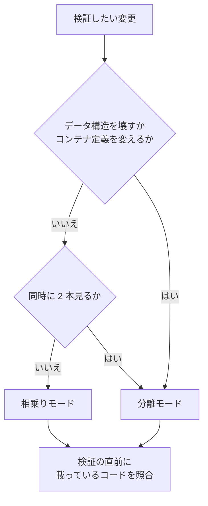

## ローカル環境を持つリポジトリでの動作検証

作業ツリーは追跡ファイルしか複製せず、コンテナのプロジェクト名は起動ディレクトリ名から決まる。
このため作業ツリーを作っただけでは環境ファイルも依存物も無く、2 本目を同時起動すると固定された
コンテナ名とホストポートで衝突する。検証をどこで行うかを決め、検証の直前に「いま何が載っているか」を
実体で照合する手順を置く。

### 前提とする環境

| 区分 | 内容 |
| --- | --- |
| 前提にする | git、OCI コンテナを扱う実行系と Compose 相当の定義、POSIX シェル |
| 前提にしない | ホストの種類、コンテナを操作する場所（ホストか開発用コンテナの中か）、特定の環境管理ツール、言語とフレームワーク、共有ネットワークやボリュームの名前 |

リポジトリ固有の値（サービス名、起動コマンド、複製対象）は本文に埋め込まず、後述の宣言ファイルから
読む。この文書に出る具体的な数値と行番号は、いずれも確認に使った 1 つの構成での実測例である。

### 最初に確かめること

環境の作り方によって手順が変わる。作業ツリーの運用を始める前に 1 度だけ判定し、結果を宣言ファイルへ書く。

```bash
MAIN=$(dirname "$(cd "$(git rev-parse --git-common-dir)" && pwd -P)")   # 主ディレクトリ
PROJ=$(basename "$MAIN")                                                # 既定のプロジェクト名
APP=$(docker ps -q \
  --filter "label=com.docker.compose.project=$PROJ" \
  --filter "label=com.docker.compose.service=$APP_SERVICE")
docker inspect "$APP" --format '{{range .Mounts}}{{.Source}} -> {{.Destination}}{{println}}{{end}}'
docker exec "$APP" sh -lc "readlink '$SRC_TARGET' || echo 'symlink ではない'"
```

| 型 | 見分け方 | 相乗りモードでの切り替え |
| --- | --- | --- |
| 間接参照型 | コンテナ内のコード位置が symlink で、その先がホストと同じ絶対パスを指す | リンクの張り替えで切り替わる。再作成は不要 |
| 直接マウント型 | コンテナ内のコード位置がマウントの到達点そのもの | 切り替えにはサービスの再作成が要る。定義側でマウント元を変数にする |
| ホスト直起動型 | コンテナを使わず、ホストのプロセスがコードを直接読む | 起動時の作業ディレクトリで決まる。切り替えは再起動 |

確認に使った構成は間接参照型だった。ホストの作業領域を載せたボリュームがコンテナの同名パスに現れ、
コードの位置はそこへの symlink になっていた。ホストとコンテナで絶対パスが一致するため、主ディレクトリ
直下の `.worktrees/` は定義を変えずにコンテナから見える。

**パスが一致しない環境がある。** コンテナを操作する場所とコンテナ実行系の動く場所が異なると、
相対パスで書かれたマウント元は存在しないパスを指す。確認した環境では、稼働中の 24 コンテナの
マウント元を走査して、操作している側の作業領域に属するものが 0 件だった。この場合は定義を叩く操作を
コンテナ実行系と同じ場所で行う。

### 分離を妨げる要因

同時起動を妨げるのは、プロジェクト名で分離されない値だけである。定義ファイルから次を洗い出す。

| 洗い出す対象 | 分離されるか |
| --- | --- |
| 名前付きボリューム、ネットワーク、ビルド成果物の名前 | プロジェクト名で分離される |
| サービスに明示したコンテナ名 | 分離されない。実行系の全体で一意 |
| ホスト側のポート番号 | 分離されない |
| ホストのパスを直接指すマウント元 | 分離されない |
| ホストのネットワークを直接使う設定 | 分離されない |
| 環境ファイルからの変数展開 | 環境ファイルが無いと解決に失敗する |

分離される側の挙動は、プロジェクト名を変えた 2 通りの定義出力を比べて確認した。

確認に使ったリポジトリでの実測値を例として挙げる。他のリポジトリでは値も件数も異なる。

| 対象 | 固定されている値 | 根拠 |
| --- | --- | --- |
| 7 サービス | コンテナ名の明示 | `docker-compose.dev.yml:4,20,35,73,123,157,202` |
| HTTP 入口 | ホストポート 80 | `docker-compose.dev.yml:12` |
| オブジェクトストレージ | ホストポート 9000 と 8080 | `docker-compose.dev.yml:131,132` |
| ファイル転送 | ホストポート 21 と 21000-21010 | `docker-compose.dev.yml:204,205` |
| データベース / 検索 / メール受信 | 変数の既定値 3306 / 7700 / 1025 / 8025 | `docker-compose.dev.yml:50,91,108,109`（環境ファイルに定義が 0 件であることを `grep -c` で確認） |
| 開発支援サービス | ホームディレクトリ配下とコンテナ実行系の受け口 | `docker-compose.dev.yml:167,170-179` |
| スキーマ図の生成 | ホストのネットワークを直接使う | `docker-compose.schemaspy.yml:12` |

### 2 つの検証モード

| モード | いつ使うか | 環境の数 | リポジトリ側の変更 |
| --- | --- | --- | --- |
| 相乗り | 既定。コマンドで完結する検証、1 本だけの画面確認 | 主ディレクトリの 1 セットを共有 | 不要 |
| 分離 | データの構造を壊す変更、2 本の同時比較、コンテナ定義そのものの変更 | 作業ツリーごとに 1 セット | 並行起動用の定義の追加 |



判定は、変更ファイルの一覧を宣言ファイルの条件に当てて機械的に提示する。既存の定義の書き換えや
コード中に直接書かれた操作は条件で拾えないため、最終判断は人が行う。

### 相乗りモードの手順

1. **型を確かめる。** 前節の判定を行い、宣言ファイルの記録と一致するかを見る。

2. **作業ツリーを用意する。** 追跡されない設定と依存物を持ち込む（後述）。

3. **コマンドで完結する検証は、作業ディレクトリを指定して実行する。**

   ```bash
   WT="$MAIN/.worktrees/feature/x"
   docker exec -w "$WT" "$APP" <検証コマンド>
   ```

   作業ディレクトリの指定を落とすと主ディレクトリのコードが検証される。この指定を含む起動を
   Skill 側の 1 コマンドに包み、素の実行を手順から外す。データベースは共有のままなので、同じ接続先を
   使うテストは同時に 1 本だけ走らせる。分離して走らせる手順は
   [`03-test-execution.md`](03-test-execution.md) にある。

4. **画面で確認するときだけ、コードの位置を作業ツリーへ向ける。** 追跡されない生成物を先に作る。

   間接参照型では、コードの位置を指しているコンテナだけを対象にリンクを張り替える。

   ```bash
   docker exec -w "$WT" "$APP" <資産のビルドコマンド>
   for c in $(docker ps --filter "label=com.docker.compose.project=$PROJ" --format '{{.Names}}'); do
     [ "$(docker exec "$c" sh -lc "readlink '$SRC_TARGET'" 2>/dev/null)" = "$MAIN" ] \
       && docker exec -u root "$c" sh -lc "ln -sfn '$WT' '$SRC_TARGET'"
   done
   ```

   直接マウント型では、マウント元を変数にした定義を用意し、その変数を作業ツリーへ向けて対象サービス
   だけを作り直す。ホスト直起動型では、作業ツリーを作業ディレクトリにして起動し直す。

   実行中のプロセスがコードの位置を保持している場合は、設定の再読み込みを促す合図を送る。確認した
   構成では、コンテナの最初のプロセスと再読み込みを受け取るプロセスが別だった。最初のプロセスへ
   送っても届かないため、対象のプロセス名を指定して送る。

5. **切り替えたことを確かめる。** 応答に現在のブランチ名が出る仕掛けを入れ、目視ではなくコマンドで
   判定できるようにする。判定コマンドは宣言ファイルが持つ。

6. **戻すときは同じ手順で主ディレクトリを指し直す。** 切り替えは同時に 1 本だけで、その間は主
   ディレクトリのコードが画面に出ない。作業ツリーを削除する前に必ず戻す。

### 分離モードの手順

1. **定義を叩く場所を確かめる。** コンテナ実行系と同じ場所から操作する（前々節の判定）。

2. **並行起動用の定義を追加する。** 明示されたコンテナ名を外し、ホストポートを変数へ逃がし、検証に
   要らないサービスを既定の起動集合から外す。変数を与えなければ現状と同じ値に解決されることを、
   定義の出力で確認してから取り込む。

   確認した実行系では、コンテナ名を外すには専用の指定が要り、空文字や null では外れなかった。
   ポートは上書きの指定を付けないと追記になった。指定の書き方は実行系の版で異なるため、取り込む前に
   定義の出力で確かめる。

3. **番号を採番し、作業ツリーの環境ファイルへ書く。** 既存の行があれば置換し、無ければ追記する。
   確認した構成では環境ファイルを先勝ちで読むため、末尾への追記では既存の値を上書きできなかった。
   採番は決定的な初期候補に加えて、台帳と稼働中の公開ポートを突き合わせ、削除済みの作業ツリーが
   残した番号を避ける。

4. **データは基準からの複製で用意する。** 停止した状態のデータ領域を 1 度だけ複製して基準とし、
   以後はそこから流し込む。基準はプロジェクト名の外側に置き、環境の破棄で消えないようにする。
   基準を作る作業は稼働中の環境と同じプロジェクト名を使うため、別の系統が同じ名前を握っていないかを
   先に確かめる。

5. **起動して検証する。** 定義に無いコンテナを削除する指定を付けない。稼働中のプロジェクトに定義外の
   コンテナが属していることがあり、付けると削除される。

6. **撤収は環境の破棄を先、作業ツリーの削除を後にする。** 順序を逆にすると定義と環境ファイルを失い、
   プロジェクト名を手で復元することになる。番号の解放まで行う。

### 作業ツリー作成時のセットアップ

複製対象は宣言ファイルが持つ。作業ツリーを作った直後に、追跡されない設定と依存物を持ち込む。

```bash
git -C "$MAIN" worktree add -b feature/x "$WT" origin/main
DECL="$MAIN/.ndf/localenv.json"
for p in $(jq -r '.localenv.copy_from_main[]' "$DECL"); do
  [ -e "$MAIN/$p" ] || continue
  if [ -e "$WT/$p" ] && ! diff -rq "$MAIN/$p" "$WT/$p" >/dev/null 2>&1; then
    echo "中断: $p の内容が主ディレクトリと異なる" >&2; exit 1
  fi
  cp -al "$MAIN/$p" "$WT/$p" 2>/dev/null || cp -a "$MAIN/$p" "$WT/$p"
done
# 書き換えられるパスはハードリンクを外し、実体で置き換える
for p in $(jq -r '.localenv.copy_as_real // [] | .[]' "$DECL"); do
  [ -e "$MAIN/$p" ] || continue
  rm -rf "$WT/$p"
  cp -a "$MAIN/$p" "$WT/$p"
done
```

`copy_as_real` のパスは `copy_from_main` のパスの内側を指す（例では `vendor` の中の
`vendor/composer`）。このため分岐ではなく後段の置き換えで扱う。

**依存物は複製する。主ディレクトリへの symlink は使わない。** 確認した構成では、読み込み定義が親
ディレクトリを実体解決するため、リンクにすると作業ツリーで起動した処理が主ディレクトリのコードを
読んだ。失敗として現れないまま別のコードを検証することになる。

複製はハードリンクで行う（実測 0.55 秒 / 54,180 ファイル / 実容量の増加なし）。ハードリンクは同じ実体を
共有するため、**書き換えられるファイルだけは実体を複製する**。確認した構成では読み込み定義を保持する
ディレクトリが該当した。ハードリンクが使えない配置ではファイル複製へ退避する（上の `||` の分岐）。
実測サイズは依存物が 498MB / 54,180 ファイル、フロントエンドの依存物が 59MB / 6,099 ファイルだった。
同じ手順を [`03-test-execution.md`](03-test-execution.md) でも使う。

### 宣言ファイル

リポジトリごとの差は `.ndf/localenv.json` が持ち、NDF 側は仕組みだけを配る。このファイルが無い
リポジトリでは、この節の仕組みは何もせずに終わる。

```json
{
  "version": 1,
  "localenv": {
    "kind": "compose",
    "layout": "indirect",
    "compose_files": ["docker-compose.dev.yml", "docker-compose.worktree.yml"],
    "app_service": "app",
    "src_target": "/src",
    "copy_from_main": ["vendor", "node_modules", "public/build", ".env"],
    "copy_as_real": ["vendor/composer"],
    "build_before_aim": ["<資産のビルドコマンド>"],
    "reload_signal": { "process": "<プロセス名>", "signal": "USR2" },
    "branch_probe": "<切り替えを確かめるコマンド>",
    "isolated_services": ["<並行起動するサービス名>"],
    "isolate_when": ["<分離モードを促す変更パスの条件>"],
    "verify": "<検証コマンド>"
  },
  "testenv": {
    "port_band": [20000, 29999],
    "port_roles": { "<役割名>": 0 },
    "golden_volumes": { "<ボリューム名>": "<基準ボリューム名>" }
  }
}
```

この節が使う項目は `localenv` 配下に置く。分離モードで採る番号と基準ボリュームは
[`03-test-execution.md`](03-test-execution.md) のテスト実行と共有するため `testenv` 配下に置く。
全体の構造と各項目の定義は [`04-component-and-data.md`](04-component-and-data.md) にある。

`localenv.layout` は前々節で判定した型（`indirect` / `direct` / `host`）を記録する。
`localenv.kind` が `compose` 以外、または宣言が無い場合、この仕組みは適用されない。

### 受け入れ条件の追加

- [ ] 21. ローカル環境の宣言が無いリポジトリでは、この節の仕組みが何も出力せず終了コード 0 で終わる
- [ ] 22. 作業ツリーを作ると、宣言に挙げた設定ファイルと依存物が複製され、内容が主ディレクトリと食い違う場合は上書きせず中断する
- [ ] 23. 検証コマンドを実行する前に照合が走り、載っているコードと現在地が一致（0）・不一致（1）・未起動または適用外（2）を終了コードで区別する
- [ ] 24. 変更ファイルの一覧から、相乗りと分離のどちらを使うかの提示が出る
- [ ] 25. 相乗りモードで画面確認へ切り替えると、宣言した判定コマンドが現在のブランチ名を返す
- [ ] 26. 分離モードで 2 本の作業ツリーを起動しても、コンテナ名・公開ポート・名前付きボリューム・ネットワークが重複しない
- [ ] 27. ハードリンクが使えない配置でも、依存物の複製が失敗せずファイル複製へ退避する

### 残リスク

- 起動を伴う検証は行っていない。マウント元の変更で対象サービスだけが作り直され、名前付きボリュームの
  データが保たれることは未確認。定義の要約値を前後で比べ、コードの位置を変えると相対パスを持つ
  8 サービスの値だけが変わり、プロジェクト名の変更ではどのサービスの値も動かないことまでを確認した
- 基準データの複製時間とサイズが未計測。確認した配置は軽量な複製が使えないファイルシステムのため、
  複製が数十分に及ぶと分離モードの利点が薄れる
- 停止したデータ領域を複製して同じイメージで起動できることは未確認
- コードの位置の切り替えは、同じ環境を共有する他のセッションにも及ぶ。排他の仕組みは持たない
- 変数の既定値を入れ子にした記述は、実行系の版によって展開が異なる。並行起動用の定義では入れ子を使わない
- 直接マウント型とホスト直起動型は、確認に使った構成に存在しなかったため実測していない
