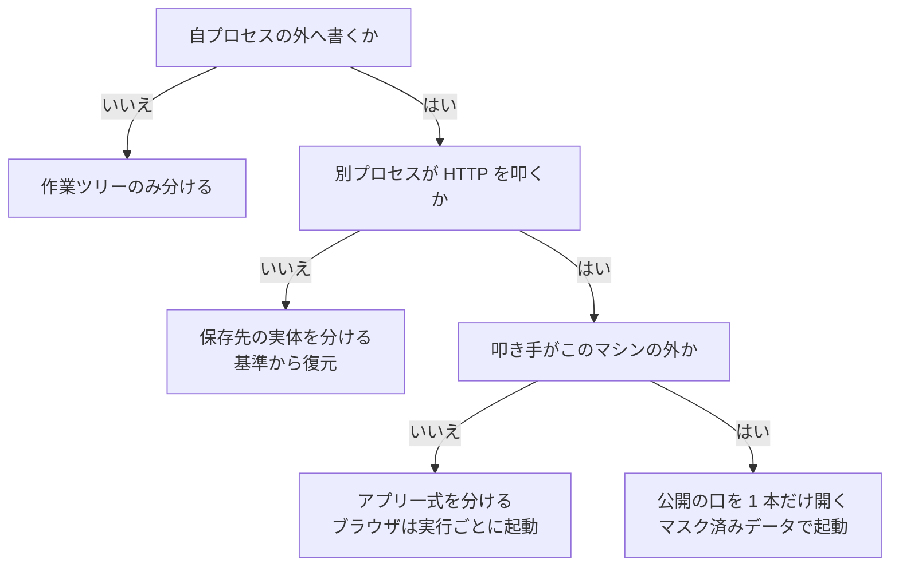

## 作業ツリーでのテスト実行

必要な分離の範囲は、テストが自プロセスの外へ何を書き、誰がそれを叩くかで決まる。
外部依存が無ければ作業ツリーのファイルだけ、データ保存先へ書くならその実体ごと、画面を開くなら
アプリ一式、外から到達させるなら公開の口を分ける。分けた資源の名前と番号は作業ツリーから決定的に
導き、使い終えたら必ず戻す。

### この文書での「テスト環境」

**1 つの作業ツリーに対応して立ち上げる、テスト実行に必要なサービスの一式**を指す。
番号で識別され、他の作業ツリーのものとポート・データ保存先・ネットワークを共有しない。

[`02-local-environment.md`](02-local-environment.md) が扱う「ローカル環境」とは用途が異なる。
ローカル環境は人が画面を触って確かめるためのもので、主ディレクトリの 1 セットを共有することが
既定である。テスト環境は自動テストのために作業ツリーごとに立て、使い終えたら破棄する。

### 前提とする環境

| 区分 | 内容 |
| --- | --- |
| 前提にする | git、OCI コンテナを扱う実行系と Compose 相当の定義、POSIX シェル |
| 前提にしない | ホストの種類、テストを実行する場所、特定の環境管理ツール、言語とテスト実行系、共有ネットワークの名前、外部の名前解決サービス |

リポジトリ固有の値は [`02-local-environment.md`](02-local-environment.md) と同じ宣言ファイルが持つ。
この文書に出る具体的な数値と行番号は、いずれも確認に使った 1 つの構成での実測例である。
手順の入口は NDF が配る 1 つのコマンド（以下 `worktree-testenv`）にまとめ、実行系ごとの差はその中に閉じる。

### テストの種類と必要な分離

| 種類 | 外部依存 | 分離の範囲 | 同時実行 |
| --- | --- | --- | --- |
| 単体（外部依存なし） | なし | 作業ツリーのファイルと依存物 | 可 |
| データ保存先を要する | データベース・キャッシュ | 保存先の実体とアプリのプロセス | 可（メモリ上限まで） |
| ブラウザを使う | 上記 + HTTP 入口 + ブラウザ | アプリ一式・ブラウザ・証跡の出力先 | 可（同上） |
| 実機・外部サービス受信 | 上記 + 外部からの到達 | 公開ホスト名と折り返し先 | 折り返しを使う検証は 1 本のみ |



### 種類の判定

**テストの置き場所やスイート名で判定しない。** 確認した構成では、外部依存が無いはずの区分に置かれた
839 件のうち 511 件が、データベースを使う仕組みを取り込んでいた。置き場所と実際の依存は一致しない。

判定は、依存を持ち込む記述の有無で行う。判定コマンドは宣言ファイルが持ち、リポジトリごとに書く。

```json
"testenv": {
  "test_kinds": {
    "pure": { "select": "<外部依存を持たないテストを列挙するコマンド>" },
    "stateful": { "select": "<データ保存先を要するテストを列挙するコマンド>" }
  }
}
```

この判定でも取りこぼしが残る。別の基底を経由して依存を持つものが混じるため、初回は 1 度走らせ、
落ちたものを外部依存ありへ移す。確認した構成では、外部依存なしと判定された 338 件がその対象だった。

### データ保存先を要するテスト

**分離は名前の付け替えではなく、保存先の実体を分けることで行う。** 初期化の処理が接続先を記述の中に
固定していると、名前を変える方式は成立しない。確認した構成では、初期化スクリプトの投入処理が既定の
接続先を指す行だけを除去して他の接続先指定を残す作りで（`RunInitSql.php:73`）、副系統を指す記述を
含むスクリプトが 109 本と 15 本あり、稼働中の保存先にも副系統側へ手続きが 107 本と 14 本入っていた。
実体を分ければ名前を変えずに済み、この書き換えが不要になる。

1. **採番する。** `worktree-testenv env "$WT"` が環境名・スロット・ポートを出力し、台帳へ記録する。
   同じ作業ツリーには常に同じ値が返る。

2. **依存物を持ち込む。** 手順は [`02-local-environment.md`](02-local-environment.md) と共通で、
   ハードリンク複製を使い、書き換えられるディレクトリだけ実体を複製する。**symlink は使わない**
   （作業ツリーのテストが主ディレクトリのコードを読む）。

3. **環境ファイルを置く。** 追跡外のため作業ツリーへは複製されず、読み込み処理は例外を出さずに
   既定値へ落ちる。置き忘れは接続先の取り違えとして現れる。主ディレクトリの内容を元に作業ツリー直下へ
   所有者のみ読み書きできる権限で書き出し、スロット固有の上書き値は共通の git ディレクトリ配下
   （`$(git rev-parse --git-common-dir)/ndf/`）へ同じ権限で置く。作業ツリーの中には資格情報を増やさない。

4. **基準を焼く（初回とデータ構造の変更時のみ）。** タグはデータ構造を定める資産の内容から決める。
   同じ内容なら焼き直しは発生しない。

   ```bash
   TAG=$(git -C "$MAIN" ls-tree -r HEAD -- $(jq -r '.testenv.golden_tag_paths|join(" ")' "$MAIN/.ndf/worktree.json") \
         | sha1sum | cut -c1-12)
   worktree-testenv bake --tag "$TAG"
   ```

5. **復元して起動する。** データ領域を実体間で複製し、中核のサービスだけを起動する。ホストポートは
   公開しない。

6. **差分を当てる。** ブランチがデータ構造の変更を追加していれば、更新を 1 回だけ流す。

7. **実行する。** 初期化を抑止する指定を必ず渡す。確認した構成では、渡さないと最初のテストが全ての
   テーブルを削除して 1,790 本の定義を流し直した。抑止の方法は宣言ファイルが持つ。

   ```bash
   worktree-testenv test "$WT" --kind stateful
   ```

保存先へ管理権限で接続するときは、資格情報をコマンドの引数に置かず、対象コンテナ自身が持つ環境変数を
その場で参照する。引数はプロセス一覧から読める。

**採番規則**

| 対象 | 規則 |
| --- | --- |
| 環境名 | `<リポジトリ>-wt-<ブランチ>-<ブランチの要約値 6 桁>`（小文字英数と `-`、40 文字で切る） |
| スロット | 台帳が 0〜63 の最小空き番号を割り当て、以後同じ番号を返す |
| ポート | `<帯の下限> + スロット*20 + 役割番号`。帯と役割番号は宣言ファイルが持つ |
| 保存先の名前 | 変えない。実体が別なので衝突しない |
| 公開ホスト名 | `wt<スロット>.<公開の基底名>`。基底名は宣言ファイルが持つ |

### ブラウザを使うテスト

1. データ保存先の手順 1〜6 を済ませ、画面の配信に要るサービスまで含めて起動する。

2. **入口はコンテナ間の名前で指し、ホストポートを使わない。** HTTP を配信するサービスを、テストを
   実行する場所から届くネットワークへ参加させる。ネットワーク名は宣言ファイルが持ち、無ければ作る。
   テストの実行がホストで行われる構成では、代わりに採番したポートを 1 つ公開する。

3. アプリが組み立てる絶対 URL を到達先へ揃える。設定を保持する仕組みがあれば、あわせて捨てる。

4. **ブラウザは実行ごとに起動する構成を選ぶ。** 常駐しているブラウザへ接続する構成は、接続先が 1 つで
   既存のタブをそのまま操作するため、2 本の実行が同じタブを奪い合う。

5. 接続先と出力先を環境変数で外から与える。設定ファイルに値を直接書かず、展開に任せる。

   ```bash
   worktree-testenv test "$WT" --kind browser --out "$WT/<証跡の置き場所>/$TESTENV-$STAMP"
   ```

証跡は作業ツリー配下へ固定する。既定の出力先が秒単位の識別子しか持たない場合、同じディレクトリで
同時に開始した 2 本が同じ場所へ書き合う。環境名を出力先に含めて避ける。共有の保管先へは送らない。

### 実機や外部サービスからの通信を受ける検証

**公開するのは、マスク済みデータで焼いた基準を載せたテスト環境だけとする。** 公開コマンドがタグを
照合し、他を拒否する。あわせて次を満たさない限り公開しない。

1. デバッグ用の表示を止める。例外の画面が環境変数を、計測用の表示が発行済みの問い合わせを見せる
   経路が実在する（確認した構成では `composer.json:46,56` の依存が該当）。

2. **公開の口はホストポート 1 本に集約する。** 共有の入口が要求先の名前でテスト環境へ振り分け、既定は
   全拒否とする。明示的に公開したテスト環境だけが通る。

3. 画面を開く経路には認証を前置する。認証を外すのは、署名の検証を自前で行う経路に限る。

4. 折り返しの中継では要求先の名前を保ち、圧縮や本文の書き換えを挟まない。署名の検証対象が壊れる。

5. **公開は期限付きにする。** 台帳（テスト環境・ブランチ・URL・折り返しの有無・期限）を唯一の記録とし、
   折り返しを使う公開は先着 1 本で排他する。外部サービス側に登録できる折り返し先が 1 つしか無い場合、
   同時に複数の作業ツリーへは届かない。

6. 公開するのは HTTP を配信するサービスだけとする。保存先・オブジェクトストレージ・メール受信・検索は
   公開しない。

7. 公開中に取った証跡には利用者の入力と資格情報が含まれるため、共有の保管先へ送らず作業ツリー内に
   留める。

同一ネットワーク内の実機からは、採番したポートを 1 つだけ公開して `http://<ホストの LAN IP>:<ポート>`
で開く。**安全な文脈を要する機能（カメラ取得・常駐ワーカー・端末認証）は、暗号化されていない経路では
確認できない。** その場合は固定のホスト名を持つ中継を使う。名前の解決は、ワイルドカードで応答する
名前解決の仕組みか、実機側の名前登録のどちらかを使う。外部サービスへの依存を避けるなら後者を選ぶ。

切り分けは、コンテナから入口、ホストから公開ポート、同一ネットワークから公開ポート、実機の順に行う。

### 後片付け

- 作業を止めるときは `worktree-testenv stop "$WT"`。メモリは返し、データは残す。再開はデータ領域の
  再構築を伴わない
- 一定時間使われていないテスト環境は `worktree-testenv reap --idle 45m` が停止する。使用中は実行側が
  ロックを保持して対象から外れる
- 公開は `worktree-testenv unexpose "$WT"` で閉じる。期限切れでも自動で閉じる。台帳の行は残り、
  `expose.closed_at` に終了の時刻が入る
- **作業ツリーを消す前に `worktree-testenv down "$WT" --volumes` を実行する。** データ領域（確認した構成では
  テスト環境 1 つあたり約 400 MB）とスロットを返してから作業ツリーを削除する。順序を逆にすると台帳から
  実体を引けなくなる
- 依存物のハードリンク複製は作業ツリーの削除で消える。実体は主ディレクトリ側に残る

### 宣言ファイルへの追加

[`02-local-environment.md`](02-local-environment.md) の宣言へ、テスト実行に要る項目を足す。

```json
{
  "testenv": {
    "test_kinds": {
      "pure":      { "select": "<外部依存なしを列挙>", "run": "<実行コマンド>" },
      "stateful":  { "select": "<保存先を要するものを列挙>", "run": "<実行コマンド>", "skip_reset": { "<変数名>": "true" } },
      "browser":   { "run": "<実行コマンド>", "base_url_env": "<接続先の変数名>", "out_env": "<出力先の変数名>" }
    },
    "golden_tag_paths": ["<データ構造を定める資産のパス>"],
    "profiles": { "core": ["<サービス名>"], "browser": ["<サービス名>"] },
    "shared_network": "<共有ネットワーク名。無ければ作る>",
    "expose": { "enabled": false, "public_tag": "golden-public", "base_domain": "<公開の基底名>", "ttl": "8h" }
  }
}
```

テスト実行の項目は `testenv` 配下に置く。全体の構造と各項目の定義は
[`04-component-and-data.md`](04-component-and-data.md) にある。

`testenv.expose.enabled` の既定は無効とする。外部公開は、マスク済みデータが整い、利用者が明示的に有効化した
リポジトリでのみ行う。

### 受け入れ条件の追加

- [ ] 31. 外部依存なしと判定されたテストだけを対象にした実行が、保存先を起動せずに成功する
- [ ] 32. 2 つの作業ツリーで同時に保存先つきのテストを実行し、両方が成功し、一方の実行後にもう一方の保存先の内容が変わらない
- [ ] 33. ハードリンク複製した作業ツリーで読み込み定義の基準を出力させると、作業ツリー側のパスが返る
- [ ] 34. データ構造を変えずに 2 回目の環境構築を行うと基準の焼き直しが発生せず、復元から 1 件のテスト完了まで 5 分以内に収まる
- [ ] 35. ブラウザを使うテストがホストポートを 1 つも公開せずに入口へ到達し、証跡が作業ツリー配下に出力される
- [ ] 36. 公開コマンドが、マスク済み以外のデータを載せたテスト環境の公開を理由付きで拒否する
- [ ] 37. 公開中のテスト環境の応答にデバッグ用の表示が含まれず、期限経過後に同じホスト名が拒否を返す
- [ ] 38. 作業ツリー削除後に、該当テスト環境のコンテナ・データ領域・スロット・公開設定がいずれも残らない
- [ ] 39. 宣言にテストの種類が書かれていないリポジトリでは、この節の仕組みが何も出力せず終了コード 0 で終わる

### 残リスク

- テスト環境の起動時間は未計測。確認した構成では保存先の健全性確認の間隔が未指定で既定値が適用され、
  アプリの起動がそれを待つ設定になっていた。停止と再開を繰り返す運用ではこの待ちを毎回払う
- 確認した構成では、アプリの起動コマンドが毎回、依存物の導入とフロントエンドのビルドを実行していた。
  修正対象が対象リポジトリの外にあり、対象リポジトリの変更だけでは閉じない
- 同時に立てられるテスト環境数は未計測。テスト環境 1 つの中核サービス合計は実測で約 753 MiB
  （データ保存先 475.6 MiB / アプリ 250.2 MiB / 入口 11.3 MiB / キャッシュ 15.9 MiB）。測定時の
  ホストは、未使用のメモリが 750 MB、再利用可能な分を含めて確保できる量が 9,758 MB、退避領域が
  2,047 MB 中 1,731 MB（85%）使用済みだった。**確保できる量の側で見れば 3 本は収まるが、その大半は
  再利用可能な内部の控えであり、退避領域が既に逼迫している。** 各サービスへメモリ上限を置き、
  同時稼働数の上限を設ける
- 基準の初回作成コストは未計測。確認した構成では 1,790 本の定義のうち 136 本しか適用されておらず、
  初回は全件と初期投入を必ず 1 回払う。導入初日は数分規模の待ちが発生する
- データ領域の複製手段は未検証。稼働中の保存先には複製用の拡張が入っていたが、定義が指すイメージとは
  異なる。使えない場合は正常停止後のファイル複製へ切り替える
- マスク済みのデータセットは未整備。整うまで外部への公開を伴う検証は実行できない
- 実機からの到達性は未検証。無線側の端末間分離、ローカル名の解決、アドレスの固定はいずれも
  確認していない
- **作業ツリーは、コンテナから見える領域に置く必要がある。** 既定の一時ディレクトリがコンテナの外に
  ある構成では、そこに作った作業ツリーはアプリのコンテナから見えない。配置の判定は
  [`02-local-environment.md`](02-local-environment.md) の型の判定に含める
- レビュー用の一時作業ツリーはこの手順の対象外とする。読み取り用で寿命が短く、一式を立てる利点が無い
