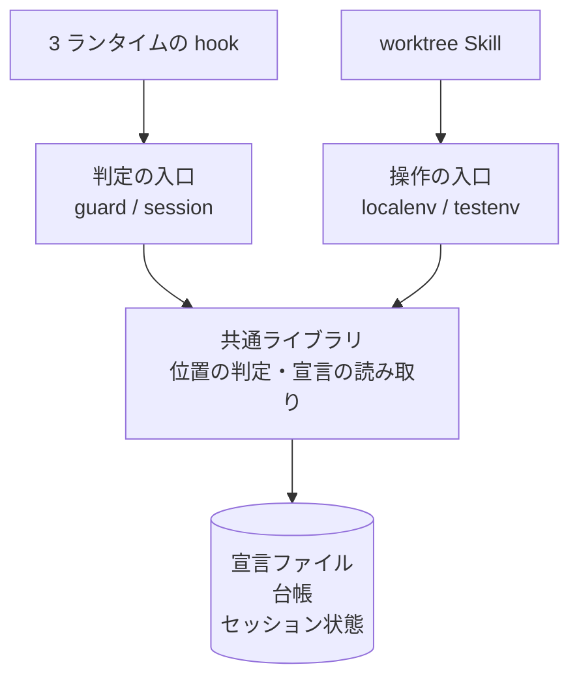

# 詳細設計: 構成要素とデータ構造

[`01-spec-and-plan.md`](01-spec-and-plan.md) の設計方針を、実装できる粒度へ落とす。
この文書は「何を作るか」と「どんなデータを持つか」を扱う。入出力の契約は
[`05-interface-contract.md`](05-interface-contract.md)、決定の記録とテストは
[`06-decisions-and-tests.md`](06-decisions-and-tests.md) にある。

## 構成要素



| 要素 | 実体 | 責務 |
| --- | --- | --- |
| 共通ライブラリ | `plugins/ndf/scripts/lib/worktree-common.sh` | 現在地の判定、主ディレクトリの解決、宣言ファイルの読み取り、台帳の読み書き |
| 誘導の入口 | `plugins/ndf/scripts/worktree-guard.sh` | tool 実行前に呼ばれ、対象パスが保護対象かを判定して案内を返す |
| 検知と追従の入口 | `plugins/ndf/scripts/worktree-session.sh` | セッション開始時に呼ばれ、逸脱を提示し、主ディレクトリのブランチを追従させる |
| ローカル環境の入口 | `plugins/ndf/scripts/worktree-localenv.sh` | 設定と依存物の複製、載っているコードの照合、モードの提示 |
| テスト環境の入口 | `plugins/ndf/scripts/worktree-testenv.sh` | 採番、基準の作成、起動と停止、公開、後片付け |
| 手順書 | `plugins/ndf/skills/worktree/SKILL.md` と `references/` | 人と AI が読む手順。判断の基準を持つ |

**入口のスクリプトは判定を持たない。** 判定はすべて共通ライブラリの関数に置き、入口は入力の受け取りと
出力の整形だけを行う。テストは共通ライブラリの関数に対して書く。

## ファイル配置

```text
plugins/ndf/
├── scripts/
│   ├── lib/worktree-common.sh          共通ライブラリ
│   ├── worktree-guard.sh               誘導（tool 実行前）
│   ├── worktree-session.sh             検知と追従（セッション開始時）
│   ├── worktree-localenv.sh            ローカル環境
│   └── worktree-testenv.sh             テスト環境の操作
├── skills/worktree/
│   ├── SKILL.md                        手順の入口
│   ├── references/
│   │   ├── local-environment.md        動作検証の手順
│   │   ├── test-execution.md           テスト実行の手順
│   │   └── declaration.md              宣言ファイルの書き方
│   ├── schemas/
│   │   ├── localenv.schema.json        宣言ファイルの定義
│   │   └── registry.schema.json        台帳の定義
│   └── tests/                          判定ロジックのテスト
└── hooks/
    ├── claude.json                     PreToolUse / SessionStart を追加
    └── codex.json                      PreToolUse / SessionStart を追加
```

対象リポジトリ側に置かれるもの:

```text
<主ディレクトリ>/
├── .worktrees/<ブランチ名>/            開発用の作業ツリー
├── .ndf/localenv.json                  宣言ファイル（任意。無ければ機能しない）
└── .git/ndf/                           共通の git ディレクトリ配下
    ├── worktree-registry.json          台帳
    └── slot<番号>.env                  スロット固有の設定（所有者のみ読み書き）
```

**台帳とスロット設定を共通の git ディレクトリ配下へ置く理由。** 作業ツリーの中に置くと、その作業ツリーを
削除した時点で割り当ての記録が消える。共通の git ディレクトリはすべての作業ツリーから同じ場所として
解決でき、作業ツリーの生死に影響されない。

## 宣言ファイル

対象リポジトリごとの差を吸収する。**このファイルが無いリポジトリでは、すべての機能が何もせずに終わる。**

```json
{
  "$schema": "https://raw.githubusercontent.com/devbasex/ai-plugins/main/plugins/ndf/skills/worktree/schemas/localenv.schema.json",
  "version": 1,
  "guard": {
    "allow_paths": ["issues/", "docs/", ".claude/", ".codex/", ".kiro/", ".agents/", ".gemini/", ".serena/", ".gitignore"]
  },
  "localenv": {
    "kind": "compose",
    "layout": "indirect",
    "compose_files": ["docker-compose.dev.yml"],
    "app_service": "app",
    "src_target": "/src",
    "copy_from_main": ["vendor", "node_modules", "public/build", ".env"],
    "copy_as_real": ["vendor/composer"],
    "build_before_aim": ["npm ci", "npm run build"],
    "reload_signal": { "process": "php-fpm", "signal": "USR2" },
    "branch_probe": "curl -sI http://localhost/ | grep -i x-worktree",
    "isolated_services": ["app", "nginx"],
    "isolate_when": ["database/migrations/**", "docker/**", "docker-compose*.yml", "Dockerfile*"],
    "verify": "curl -sf http://localhost/health"
  },
  "testenv": {
    "port_band": [20000, 29999],
    "port_roles": { "http": 0, "db": 1, "mail": 2, "object": 4, "search": 6 },
    "profiles": { "core": ["app", "mysql"], "browser": ["app", "mysql", "nginx"] },
    "shared_network": "",
    "golden_tag_paths": ["database/migrations", "database/seeders"],
    "golden_volumes": { "sail-mysql": "ndf-golden-mysql" },
    "test_kinds": {
      "pure":     { "select": "...", "run": "..." },
      "stateful": { "select": "...", "run": "...", "skip_reset": { "TEST_SKIP_MIGRATE_FRESH": "true" } },
      "browser":  { "run": "...", "base_url_env": "PWK_BASE_URL", "out_env": "PWK_OUT_DIR" }
    },
    "expose": { "enabled": false, "public_tag": "golden-public", "base_domain": "", "ttl": "8h" }
  }
}
```

### 定義

| 項目 | 型 | 必須 | 意味 |
| --- | --- | --- | --- |
| `$schema` | 文字列 | 任意 | 編集時の補完に使う定義の位置。読み取り側は参照しない |
| `version` | 整数 | 必須 | 宣言の版。読み取り側が知らない版なら何もせずに終わる |
| `guard.allow_paths` | 文字列の配列 | 任意 | 主ディレクトリで編集しても案内を出さないパス。未指定なら組み込みの既定を使う |
| `localenv.kind` | 文字列 | 必須 | `compose` 以外は未対応として扱う |
| `localenv.layout` | 文字列 | 必須 | `indirect` / `direct` / `host` のいずれか |
| `localenv.compose_files` | 文字列の配列 | `kind` が `compose` のとき必須 | 読み込む定義ファイル。並行起動用の定義を後ろへ足す |
| `localenv.app_service` | 文字列 | 任意 | コードを載せるサービス名。照合と再読み込みの対象 |
| `localenv.src_target` | 文字列 | `indirect` のとき必須 | コンテナ内でコードが置かれる位置 |
| `localenv.copy_from_main` | 文字列の配列 | 任意 | 作業ツリーへ複製する、追跡されないパス |
| `localenv.copy_as_real` | 文字列の配列 | 任意 | ハードリンクではなく実体を複製するパス。`copy_from_main` の内側を指してよい |
| `localenv.build_before_aim` | 文字列の配列 | 任意 | コードの位置を切り替える前に流す資産のビルドコマンド |
| `localenv.reload_signal` | オブジェクト | 任意 | 再読み込みの送り先。`process`（文字列）と `signal`（文字列）を持つ |
| `localenv.branch_probe` | 文字列 | 任意 | 環境に載っているブランチを返すコマンド。照合が使う |
| `localenv.isolated_services` | 文字列の配列 | 任意 | 分離モードで並行起動するサービス |
| `localenv.isolate_when` | 文字列の配列 | 任意 | 分離モードを促す変更パスの条件 |
| `localenv.verify` | 文字列 | 任意 | 動作検証に使うコマンド |
| `testenv.port_band` | 整数 2 個 | `testenv` を使うとき必須 | 採番するポートの範囲 |
| `testenv.port_roles` | 文字列から整数 | 同上 | 役割ごとの番号の割り当て |
| `testenv.profiles` | 文字列からサービス名の配列 | 任意 | 起動する集合の名前付き定義。未指定なら定義の既定の集合を使う |
| `testenv.shared_network` | 文字列 | 任意 | テスト環境が相乗りするネットワーク名。空文字ならテスト環境ごとに作る |
| `testenv.golden_tag_paths` | 文字列の配列 | 基準を焼くとき必須 | 基準のタグを計算する資産のパス。内容が同じなら焼き直さない |
| `testenv.golden_volumes` | 文字列から文字列 | 任意 | 定義上のボリューム名から基準ボリューム名への対応 |
| `testenv.test_kinds` | 文字列からオブジェクト | 任意 | テストの種類ごとの選別と実行。未指定ならテスト実行の仕組みは何もせずに終わる |
| `testenv.test_kinds.<種類>.select` | 文字列 | 任意 | その種類に当たるテストを列挙するコマンド |
| `testenv.test_kinds.<種類>.run` | 文字列 | 任意 | その種類のテストを実行するコマンド |
| `testenv.test_kinds.<種類>.skip_reset` | 文字列から文字列 | 任意 | 実行時に渡す、初期化を抑止する環境変数 |
| `testenv.test_kinds.<種類>.base_url_env` | 文字列 | 任意 | 入口の URL を渡す環境変数名 |
| `testenv.test_kinds.<種類>.out_env` | 文字列 | 任意 | 証跡の出力先を渡す環境変数名 |
| `testenv.expose.enabled` | 真偽値 | 任意 | 既定は偽。外部公開は明示的に有効化したときだけ行う |
| `testenv.expose.public_tag` | 文字列 | 公開するとき必須 | 公開を許す基準の識別子。載っている基準と一致しなければ拒否する |
| `testenv.expose.base_domain` | 文字列 | 公開するとき必須 | 公開するホスト名の基底 |
| `testenv.expose.ttl` | 文字列 | 任意 | 公開の期限。経過後は同じホスト名が拒否を返す |

**互換性の規則。** `version` を上げるのは、既存の項目の意味を変えるときに限る。項目の追加は版を
上げない。読み取り側は知らない項目を無視する。

## 台帳

作業ツリーへの割り当てを記録する。**割り当てを解放しても行を削除せず、解放の時刻を書き込む。**

```json
{
  "version": 1,
  "assignments": [
    {
      "id": "01JD3K...",
      "worktree": "/path/to/.worktrees/feature/x",
      "branch": "feature/x",
      "environment": "ai-plugins-wt-feature-x-a1b2c3",
      "slot": 0,
      "ports": { "http": 20000, "db": 20001 },
      "assigned_at": "2026-08-29T10:00:00Z",
      "released_at": null,
      "expose": null
    }
  ]
}
```

### 履歴を残す設計

| 操作 | 台帳への反映 |
| --- | --- |
| 割り当て | 行を追加する。`released_at` は空 |
| 解放 | 該当行の `released_at` に時刻を書く。行は消さない |
| 再割り当て | 新しい行を追加する。過去の行はそのまま残る |
| 公開の開始 | `expose` に URL と期限を書く |
| 公開の終了 | `expose.closed_at` に時刻を書く。URL は残す |

**空きスロットの判定は `released_at` が空の行だけを見る。** 過去の行は判定に影響しない。

この形を採る理由は 2 つある。第一に、**同じスロットを別の作業ツリーが使った履歴が追える**。番号の
衝突や残骸の混入を後から調べられる。第二に、**外部公開の記録が消えない**。どのブランチのコードが
いつ外から到達可能だったかは、後から必要になる。

`released_at` が空でない行が増え続けるため、**1 年を超えた解放済みの行は読み取り時に無視する**。
削除はしない。ファイルの肥大が問題になった時点で、別ファイルへ移す判断を行う。

### 同時更新

複数のセッションが同時に台帳を書き換えうる。**書き込みは排他制御のもとで行い、読み込み・変更・
書き出しを 1 つの区間にまとめる。** 排他の仕組みが使えない環境では、一時ファイルへ書いてから
名前を付け替える方式へ退避する。既存の設定書き換えスクリプトと同じ扱いである。

## セッション状態

判定の結果を、セッションの間だけ保持する。

```text
${TMPDIR:-/tmp}/ndf-worktree-<セッション識別子>.json
```

```json
{
  "main_dir": "/path/to/repo",
  "in_worktree": false,
  "has_declaration": true,
  "allow_paths": ["issues/", "docs/"],
  "notified": ["plugins/ndf/skills/pr/SKILL.md"],
  "computed_at": "2026-08-29T10:00:00Z"
}
```

**tool 実行のたびに git を起動しないための控えである。** 現在地の判定は 1 セッションに 1 回だけ行い、
以後は文字列の比較で済ませる。`notified` は同じ案内を繰り返さないために持つ。

セッション識別子は、Claude Code と Codex CLI では hook の標準入力に `session_id` として含まれる。
Kiro CLI は標準入力に持たず、環境変数 `KIRO_SESSION_ID` で渡す。**どちらからも取れない場合は、
この控えを使わずに毎回判定する**（動作は変わらず、実行時間だけが伸びる）。

## データ構造の検査

宣言ファイルと台帳は JSON Schema で定義し、`schemas/` に置く。読み取り側は次の順で扱う。

1. ファイルが無ければ、何もせず終了コード 0 で終わる
2. JSON として読めなければ、その旨を出力して終了コード 0 で終わる（作業は妨げない）
3. `version` が未対応なら、その旨を出力して終了コード 0 で終わる
4. 定義に反する項目があれば、その項目だけを無視する

**どの段階でも作業を止めない。** 宣言の誤りで編集や検証ができなくなる状態を作らない。

検査そのものは開発時に行う。定義に対する検査を継続的インテグレーションへ加え、
`scripts/check-skill-frontmatter.py` などと同じ扱いにする。
