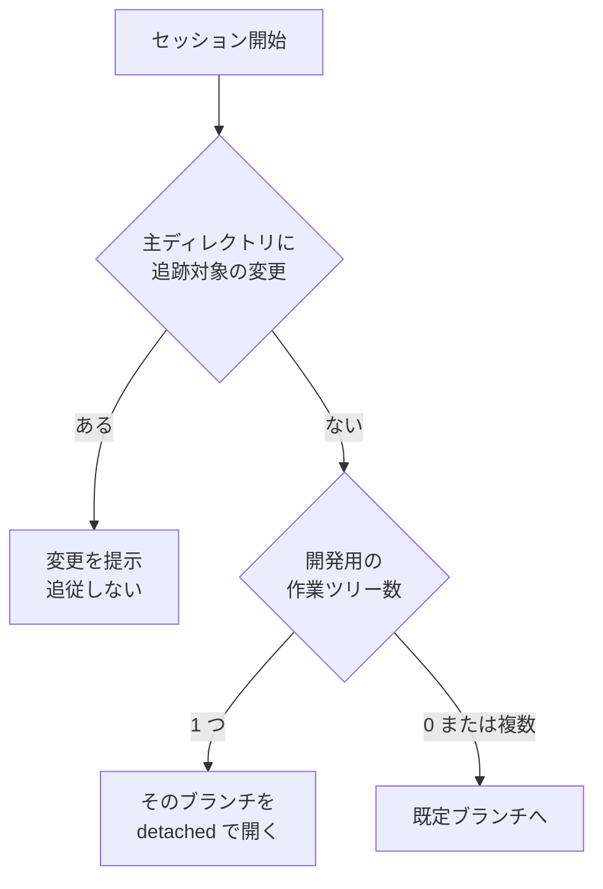

# 詳細設計: 入出力の契約

hook と各コマンドの入出力を確定させる。実装しながら形が決まる状態にしない。
構成要素とデータ構造は [`04-component-and-data.md`](04-component-and-data.md) にある。

## tool 実行前の hook

### 入力（実測）

3 ランタイムとも標準入力に JSON を受け取る。共通して使える項目は次のとおり。

| 項目 | Claude Code | Codex CLI | Kiro CLI |
| --- | --- | --- | --- |
| `session_id` | あり | あり | 標準入力には無い。環境変数 `KIRO_SESSION_ID` で渡る |
| `cwd` | あり | あり | あり |
| `hook_event_name` | あり | あり | あり |
| `tool_name` | あり | あり | あり |
| `tool_input` | あり | あり | あり |
| `permission_mode` | あり | あり | なし |

Claude Code だけが持つもの: `prompt_id` / `effort` / `agent_id` / `agent_type`。
Codex だけが持つもの: `turn_id`。

**判定に使うのは `tool_name` と `tool_input` と `cwd` だけとする。** どのランタイムでも取れる項目に
限ることで、判定の実装を 1 つに保つ。

ただし `tool_name` の値と `tool_input` の構造はランタイムごとに異なる。Kiro CLI で読み取りは
`fs_read`、書き込みは `fs_write` を名乗り、編集先のパスは書き込みで `tool_input.path`、読み取りで
`tool_input.operations[].path` に入る。判定へ渡す前に、ランタイム別の読み替えでツール種別と
パスの一覧へ正規化する。判定そのものは正規化した値だけを見るため、実装は 1 つで足りる。

Kiro CLI の tool 実行前の hook が受け取る標準入力は次の形である（`fs_write` の実測）。

```json
{
  "hook_event_name": "preToolUse",
  "cwd": "/path/to/proj",
  "tool_name": "fs_write",
  "tool_input": {
    "command": "create",
    "path": "/path/to/proj/out.txt",
    "file_text": "...",
    "summary": "..."
  }
}
```

### 出力（ランタイム差がある）

| 手段 | Claude Code | Codex CLI | Kiro CLI |
| --- | --- | --- | --- |
| `permissionDecision`（`allow` / `deny`） | あり | あり | なし。終了コード 2 が拒否に当たる |
| `permissionDecisionReason` | あり | あり | なし。標準エラー出力が理由として渡る |
| `systemMessage`（利用者へ表示） | あり | あり | なし |
| `additionalContext`（モデルへ渡す） | あり | あり | なし |
| プレーンな標準出力 | この事象では文脈に入らない | 無視される | 無視される |

Kiro CLI は終了コードで振る舞いが変わる。

| 終了コード | tool の実行 | 標準出力 | 標準エラー出力 |
| --- | --- | --- | --- |
| 0 | 続行する | 捨てられる | 捨てられる |
| 2 | **拒否する** | 捨てられる | **モデルへ渡り、利用者にも表示される** |
| その他 | 続行する | 捨てられる | 利用者へ警告として表示される |

**この差が責務の分担を決める。**

| 担い手 | 届く相手 | 使う手段 |
| --- | --- | --- |
| tool 実行前の hook | AI（Claude Code / Codex CLI） | `additionalContext` |
| セッション開始時・プロンプト送信時の hook | AI（3 ランタイム共通） | `additionalContext`（Kiro CLI は標準出力） |
| hook | 利用者 | `systemMessage`（Claude Code / Codex CLI） |
| Skill の記述 | AI（3 ランタイム共通） | 手順書そのもの |

**編集先のパスを見た誘導を、拒否せずに AI へ渡せるのは Claude Code と Codex CLI だけである。**
この 2 つでは tool 実行前の hook を誘導の主たる手段とする（決定 5）。Kiro CLI は同じ hook から
AI へ渡す手段が終了コード 2 しかなく、これは拒否を伴うため置かない。Kiro CLI では、パスを見ない
誘導をプロンプト送信時の hook が毎回渡す。Skill の記述は 3 ランタイム共通の土台として残す。

### 出力の形

拒否しないため、`permissionDecision` は返さない。

```json
{
  "systemMessage": "主ディレクトリを編集しています。開発は .worktrees/<ブランチ名> で行ってください（/ndf:worktree）",
  "hookSpecificOutput": {
    "hookEventName": "PreToolUse",
    "additionalContext": "この編集先は clone 元のディレクトリです。開発用の変更は作業ツリーの中で行います。..."
  }
}
```

`systemMessage` は最上位に置き、`additionalContext` は `hookSpecificOutput` の中に置く。
この形は Claude Code と Codex CLI が解釈する。Kiro CLI はこの事象で標準出力を読まないため、
同じスクリプトを結んでも出力は捨てられ、作業は妨げられない。
**両方を常に出力し、ランタイムごとに出し分けない。**

### 判定

```text
入力の hook_event_name がプロンプト送信時（userPromptSubmit）→ パスを見ない誘導を標準出力へ書く
入力の tool_name が編集系（Edit / Write / NotebookEdit / fs_write）→ tool_input からパスを取る
入力の tool_name が Bash → tool_input.command から書き込み先を推定する
それ以外 → 何も出力せず終了コード 0
```

**プロンプト送信時の分岐は Kiro CLI のためにある。** この事象は編集先を持たないため、パスを見る判定は
行わない。現在地が作業ツリーの中である場合と宣言ファイルが無い場合を除き、作業ツリーで作業する旨を
毎回書き出す。終了コードは 0 とする。同じスクリプトを 2 つの事象へ結ぶのは、判定の実装を 1 つに
保つためである。

パスが定まったら次を順に見る。1 つでも該当すれば案内を出さない。

1. 現在地が作業ツリーの中である
2. 宣言ファイルが無い
3. パスが主ディレクトリの外を指す
4. パスが `allow_paths` のいずれかで始まる
5. 同じパスへの案内をこのセッションで既に出した

Bash に対する書き込み先の推定は、次の形だけを対象とする。**推定できないものは案内を出さない。**

| 形 | 例 |
| --- | --- |
| 直接の書き換え | `sed -i ... <パス>` |
| 出力の付け替え | `> <パス>` / `>> <パス>` |
| 標準入力からの書き出し | `tee <パス>` |
| 複製と移動 | `cp <元> <先>` / `mv <元> <先>` |

すり抜けた書き込みは、セッション開始時の逸脱検知が拾う。

## セッション開始時の hook

### 入力

`session_id` と `cwd` を使う。他の項目は使わない。

### 出力

```json
{
  "hookSpecificOutput": {
    "hookEventName": "SessionStart",
    "additionalContext": "主ディレクトリに未コミットの変更が 3 件あります: ..."
  }
}
```

この事象では、Claude Code はプレーンな標準出力も文脈へ加える。**JSON と標準出力の双方へ同じ内容を
書く**ことで、`additionalContext` を持たないランタイムでも内容が届く。

### 処理



追従の対象は `.worktrees/` 配下の作業ツリーに限る。判定は `git worktree list --porcelain` の出力から
行い、パスが主ディレクトリ直下の `.worktrees/` で始まるものだけを数える。

**追従に失敗しても作業を止めない。** 切り替えが拒否された場合はその旨を出力して終了コード 0 で終わる。

## コマンドの契約

### 共通の規約

- 引数は `<コマンド> <サブコマンド> [対象] [オプション]` の形にする
- 標準出力は人が読む文とし、機械が読む値は `--json` を付けたときだけ JSON で出す
- 終了コードは 0 を「処理が完了した」、1 を「処理できなかった」、2 を「対象外」に割り当てる
- 宣言ファイルが無い場合は、すべてのサブコマンドが何も出力せず終了コード 0 で終わる

### 作業ツリーの操作

| 呼び出し | 動作 | 終了コード |
| --- | --- | --- |
| `worktree-localenv.sh setup <作業ツリー>` | 宣言に従って設定と依存物を複製する | 0 完了 / 1 内容が食い違って中断 |
| `worktree-localenv.sh verify [作業ツリー]` | 環境へ載っているコードと対象が一致するかを照合する | **0 一致 / 1 不一致 / 2 未起動または適用外** |
| `worktree-localenv.sh aim <作業ツリー>` | 環境が指すコードを対象へ向ける | 0 完了 / 1 失敗 |
| `worktree-localenv.sh mode [作業ツリー]` | 変更の一覧から相乗りと分離のどちらかを提示する | 0 相乗り / 1 分離 |

`verify` の 3 状態は受け入れ条件 23 に対応する。**「未起動」と「不一致」を同じ値にしない。** 環境が
動いていないことと、別のコードが載っていることは、次の手が違う。

### テスト環境の操作

| 呼び出し | 動作 | 終了コード |
| --- | --- | --- |
| `worktree-testenv.sh env <作業ツリー>` | 環境名・スロット・ポートを出力し、台帳へ記録する | 0 完了 / 1 空きが無い |
| `worktree-testenv.sh bake --tag <値>` | 基準を作る | 0 完了 / 2 同じ値の基準が既にある |
| `worktree-testenv.sh up <作業ツリー> --profile <名前>` | 起動する | 0 完了 / 1 失敗 |
| `worktree-testenv.sh test <作業ツリー> --kind <種類>` | 宣言の実行コマンドを走らせる | 実行したコマンドの終了コードを返す |
| `worktree-testenv.sh stop <作業ツリー>` | 止める。データは残す | 0 完了 |
| `worktree-testenv.sh down <作業ツリー> [--volumes]` | 破棄し、割り当てを解放する | 0 完了 |
| `worktree-testenv.sh expose <作業ツリー>` | 外部公開する | 0 完了 / 1 条件を満たさず拒否 |
| `worktree-testenv.sh unexpose <作業ツリー>` | 公開を閉じる | 0 完了 |
| `worktree-testenv.sh reap --idle <時間>` | 使われていないテスト環境を止める | 0 完了 |

`test` が実行したコマンドの終了コードをそのまま返すのは、**テストの成否を包み隠さないため**である。

`expose` が拒否する条件は次のとおり。1 つでも該当すれば公開しない。

1. 宣言の `testenv.expose.enabled` が偽
2. 載っている基準の識別子が `testenv.expose.public_tag` と一致しない
3. 折り返しを使う公開が既に別のテスト環境で開いている

拒否したときは、どの条件に当たったかを標準エラーへ出す。

## 共通ライブラリの関数

入口のスクリプトから呼ばれる。**テストはこの層に対して書く。**

| 関数 | 入力 | 出力 |
| --- | --- | --- |
| `wt_main_dir` | なし | 主ディレクトリの絶対パス |
| `wt_in_worktree` | なし | 作業ツリーの中なら 0、主ディレクトリなら 1、サブモジュールの中なら 1 |
| `wt_declaration` | 主ディレクトリ | 宣言の JSON。無ければ空文字と終了コード 1 |
| `wt_is_allowed_path` | パス、許可一覧 | 許可されていれば 0 |
| `wt_extract_write_target` | コマンド文字列 | 書き込み先のパス。推定できなければ空文字と終了コード 1 |
| `wt_dev_worktrees` | 主ディレクトリ | `.worktrees/` 配下の作業ツリーとブランチの一覧 |
| `wt_follow_target` | 作業ツリー一覧、変更の有無 | 追従先の指示（`detach <ブランチ>` / `default` / `skip`） |
| `wt_slot_acquire` | 作業ツリー | スロット番号。空きが無ければ終了コード 1 |
| `wt_slot_release` | 作業ツリー | なし。台帳へ解放の時刻を書く |
| `wt_port_for` | スロット、役割 | ポート番号 |

**`wt_follow_target` は git を呼ばない。** 一覧と変更の有無を引数で受け取り、判定だけを行う。
これにより、作業ツリーが 0 個 / 1 個 / 複数個 × 変更あり / なしの 6 通りをテストできる。

## 3 ランタイムへの結線

### Claude Code

```json
{
  "PreToolUse": [
    {
      "matcher": "Edit|Write|NotebookEdit|Bash",
      "hooks": [
        {
          "type": "command",
          "command": "bash ${PLUGIN_ROOT:-${CLAUDE_PLUGIN_ROOT}}/scripts/worktree-guard.sh",
          "timeout": 5,
          "continueOnError": true
        }
      ]
    }
  ],
  "SessionStart": [
    {
      "matcher": "startup",
      "hooks": [
        {
          "type": "command",
          "command": "bash ${PLUGIN_ROOT:-${CLAUDE_PLUGIN_ROOT}}/scripts/worktree-session.sh",
          "continueOnError": true
        }
      ]
    }
  ]
}
```

`SessionStart` は既存の 2 つの後ろへ足す。

### Codex CLI

同じ入口を `PreToolUse` へ結ぶ。matcher の記法は Claude Code と同じ。環境変数は `PLUGIN_ROOT` を使う。

Codex には `SessionStart` もあるため、逸脱検知も同じ形で結べる。

### Kiro CLI

導入スクリプトがエージェント定義へ書き込む。記述は `command` と `matcher` と `timeout_ms` を持つ形で、
Claude Code / Codex とは構造が異なる。

```json
"hooks": {
  "agentSpawn": [ { "command": "bash <プラグイン>/scripts/worktree-session.sh" } ],
  "userPromptSubmit": [ { "command": "bash <プラグイン>/scripts/worktree-guard.sh" } ]
}
```

**結ぶのはプロンプト送信時の hook である。** この hook は標準出力がそのまま AI の文脈へ入り、
プロンプトごとに実行される。tool 実行前の hook は、拒否せずに AI へ渡す手段を持たない
（前掲の終了コードの表）。同じスクリプトを tool 実行前の hook にも結べるが、出力は捨てられる。

出力は約 10 KB で切り詰められ、超えた分は警告なく捨てられる。上限は hook ごとの
`max_output_size` で変更できる。案内は 10 KB に収める。

`matcher` はツール名で絞り込む。読み取りは `fs_read`、書き込みは `fs_write` を名乗る。

## 実行時間

tool 実行のたびに走るため、上限を置く。

| 段階 | 目標 |
| --- | --- |
| セッション状態の控えがある場合 | 文字列の比較のみ。git を呼ばない |
| 控えが無い場合 | git の呼び出しは 2 回まで（現在地の判定と主ディレクトリの解決） |
| hook の時間切れ | 5 秒。超えた場合、Claude Code は判定なしとして扱い作業を続ける |

受け入れ条件 20（セッション開始の追加分が 1 秒以内）は、追従の処理を含めた計測で判定する。
