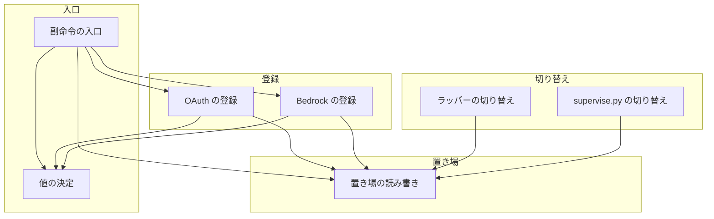
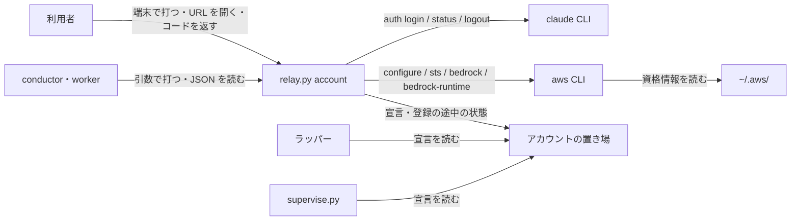
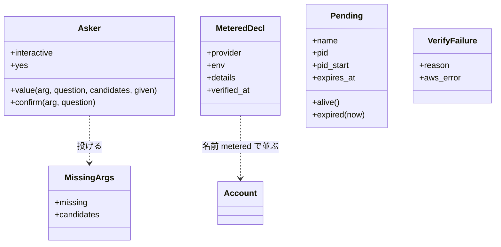
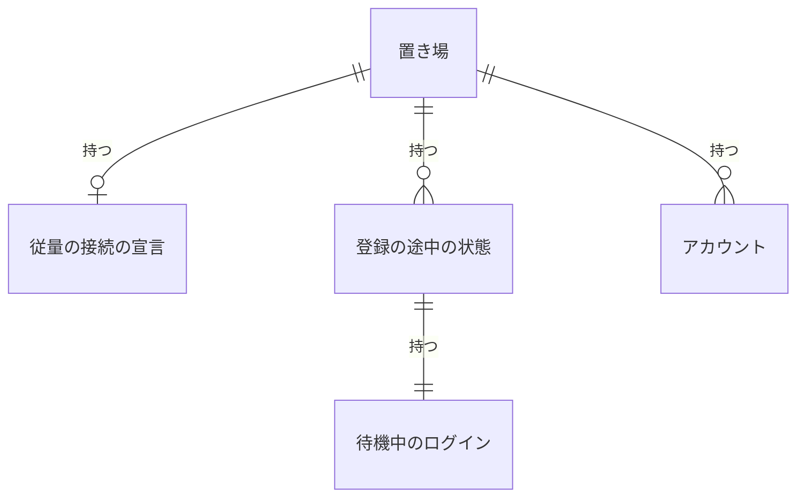
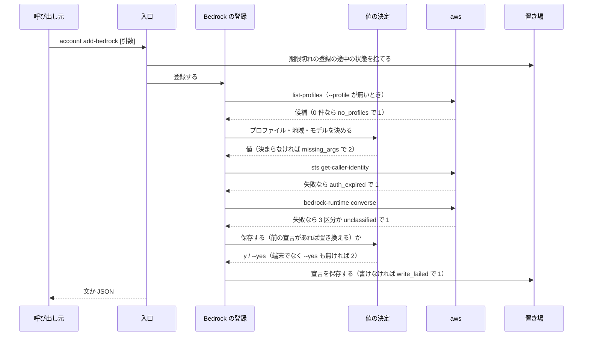
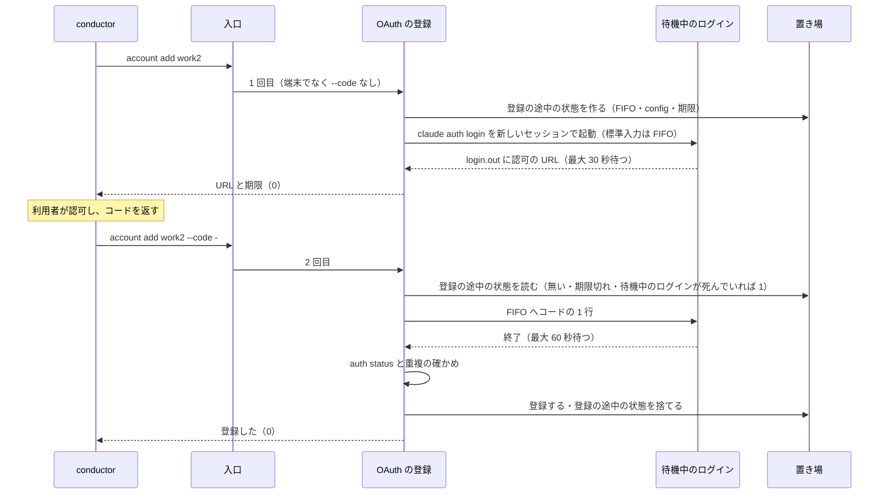
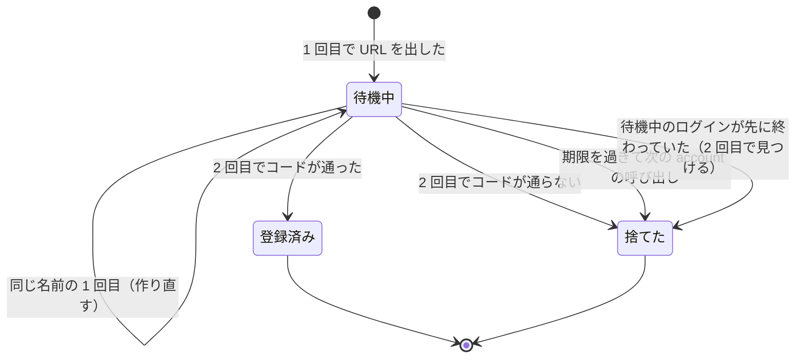

# #1468: Bedrock の登録をプロファイルの選択だけで済ませ、account の副命令を引数でも打てるようにする

要求と受け入れ条件は #1468 の本文にある（コピーは [issue-1468-requirements.md](issue-1468-requirements.md)）。
この文書は「どう作るか」だけを扱う。決定の記録・テスト設計・未確認のまま残ることは
[issue-1468-design-decisions.md](issue-1468-design-decisions.md) にある。

## 例: conductor が利用者の代わりに Bedrock とアカウントを登録する

**変更の後は、次の順に動く。** 利用者は AWS のプロファイル `bedrock-dev`（地域 `us-west-2`）を用意済みで、
claude のアカウントを 1 つ（`work1`）登録している。conductor は Claude Code の Bash から打つ（標準入力は端末でない。
2026-09-28 に Bash の中で `sys.stdin.isatty()` が偽であることを実測）。

1. conductor が `relay.py account add-bedrock --json` を打つ。候補が 2 つ（`bedrock-dev`・`default`）あり端末でも
   ないため、何も聞かずに終了コード 2 で終わり、`{"ok": false, "reason": "missing_args", "missing": ["--profile"],
   "candidates": {"--profile": ["bedrock-dev", "default"]}}` を返す
2. conductor が利用者へ「どのプロファイルか」を問い、`bedrock-dev` を受けて
   `relay.py account add-bedrock --profile bedrock-dev --json` を打つ。地域はプロファイルの設定から `us-west-2` に決まる。
   モデルの候補が 3 つあり `--model` が無いので、終了コード 2 と `missing: ["--model"]` と候補の一覧を返す
3. conductor が `--model us.anthropic.claude-sonnet-4-5-20250929-v1:0 --yes` を足して打ち直す。relay.py は
   `aws sts get-caller-identity` で認証が通るかを、`aws bedrock-runtime converse` で 1 回の短い応答が返るかを確かめ、
   通ったので宣言を `~/.claude/ndf/accounts/metered.json` へ保存する（終了コード 0）
4. `relay.py account list` の最後に次の行が出る（列は一覧の既存の列に合わせ、残量の列は `-` にする）

   ```text
   metered  Bedrock（bedrock-dev・us-west-2・us.anthropic.claude-sonnet-4-5-20250929-v1:0）  -  -  -  保存した宣言
   ```

5. 続いて 2 つ目のアカウントを足す。`relay.py account add work2 --json` は `claude auth login` を待機させたまま
   認可の URL を返して 0 で終わる。conductor は URL を利用者へ渡す
6. 利用者がブラウザで認可し、画面に出た認可コードを conductor へ返す。conductor は
   `printf '%s\n' '<コード>' | relay.py account add work2 --code - --json` を打ち、登録が終わる（終了コード 0）
7. 以後、`work1`・`work2` がともに上限に達すると、ラッパーの次の区間と `supervise.py` の次の `claude -p` が、
   保存した宣言の変数（`CLAUDE_CODE_USE_BEDROCK=1 AWS_PROFILE=bedrock-dev AWS_REGION=us-west-2 ANTHROPIC_MODEL=…`）で
   起動する。シェルの設定ファイルは 1 度も書き換えない

**利用者が端末で打つときは、今までと同じく対話で進む。** `account add-bedrock` を引数なしで打てば、プロファイルを
番号で選び、保存の確認に `y` を返すだけで終わる（AC1）。`account add work3` は今までどおり 1 回で `claude auth login`
を対話で通す（AC10）。

## ドメインモデル

### コンテキスト

| コンテキスト | 何の語が 1 つの意味に決まるか |
| --- | --- |
| NDF のラッパー（`ndf-relay`） | 登録済みのアカウント・従量の接続・従量の接続の宣言・relay の置き場・登録の途中の状態 |

1 つのコンテキストに収まる。AWS と claude の CLI は外部の系で、こちらの語へ変換してから扱う（`relay_lib/bedrock.py` と
`relay_lib/login.py` が翻訳の層を持つ）。

### 集約

| 集約 | 持ち主（書き換えてよいもの） | 根 | エンティティ | 値オブジェクト |
| --- | --- | --- | --- | --- |
| 従量の接続の宣言 | `lib/claude_accounts.py`（保存・読み出し・削除） | 宣言 | — | 提供元（`bedrock`）・変数の組・プロファイル・地域・モデル・確かめた時刻 |
| 登録の途中の状態 | `lib/claude_accounts.py`（作成・読み出し・破棄） | 登録の途中の状態（名前ごとに 1 つ） | 待機中のログイン | 期限・プロセスの識別（pid と開始の時刻） |
| 登録済みのアカウント | `lib/claude_accounts.py`（既存。変えない） | アカウント | — | 既存のまま |

**3 つとも書くのは `lib/claude_accounts.py` だけである**（既存の「置き場のファイルを書くのはこのモジュールだけ」を保つ）。
`relay_lib/` の新しい部品は、外部の CLI を呼んで値を決め、書くときは `claude_accounts` の関数を呼ぶ。

### 不変条件

| # | 集約 | 条件 | 破れたときの扱い |
| --- | --- | --- | --- |
| I1 | 従量の接続の宣言 | 保存した宣言に資格情報の変数（`AWS_ACCESS_KEY_ID`・`AWS_SECRET_ACCESS_KEY`・`AWS_SESSION_TOKEN`・`ANTHROPIC_API_KEY`・`ANTHROPIC_AUTH_TOKEN`・`CLAUDE_CODE_OAUTH_TOKEN`）が入らない | 書くときは拒む（例外）。読むときに見つかれば壊れているとして扱う（I5） |
| I2 | 従量の接続の宣言 | 保存するのは、呼べるかの確認が通った宣言だけである | 確認が通らなければ書かない。前の宣言は変わらない（AC3） |
| I3 | 従量の接続の宣言 | 保存した宣言は 1 つだけである。置き換えは確認に `y` か `--yes` があるときだけ | 端末でなく `--yes` も無ければ `missing: ["--yes"]` で終了コード 2 |
| I4 | 従量の接続の宣言 | 環境変数 `NDF_SUPERVISE_CLAUDE_FALLBACK` が定義されていれば（空でも）、保存した宣言を読まない | 2 つを混ぜた環境を作らない。読み先の関数が 1 つなので、呼び出し側は分岐を持たない |
| I5 | 従量の接続の宣言 | 保存先が読めない・形が違う・I1 に反するとき、宣言なしとして扱う | ラッパーと `supervise.py` が起動のたびに画面と記録へ 1 行出す。切り替えは宣言なしと同じ |
| I6 | 従量の接続の宣言 | 書き損じても前の宣言が残る | 一時ファイルへ書いてから置き換える（既存の `_write` と同じ） |
| I7 | すべて | 端末でない呼び出しは入力を待たない | 決められない値があれば、その引数の名前を示して終了コード 2 |
| I8 | 登録の途中の状態 | 名前ごとに 1 つだけあり、期限（作ってから 10 分）を過ぎたものは次の `account` の呼び出しで待機中のログインごと捨てる | 期限を過ぎた 2 回目は「期限切れ」で終了コード 1。状態は残さない（AC5） |
| I9 | すべて | トークン・認可コード・AWS の鍵とセッショントークンは、標準出力・標準エラー・`log.jsonl`・`--json`・保存した宣言・登録の途中の状態のファイルに書かない | テストで既知の値を入れ、どこにも現れないことを確かめる（AC7） |
| I10 | 従量の接続の宣言・登録の途中の状態 | ファイルは 0600、ディレクトリと FIFO は 0700 / 0600 | 置き場の既存の扱い（`_write`・`_tighten`）を使う |
| I11 | 登録済みのアカウント | 端末で打つ `account add <名前>`・`list`・`remove <名前>` の結果と、登録の形は変わらない | 既存のテストがすべて通る（AC10） |

### ドメインイベント

| # | イベント | 発生元 | 受け手 |
| --- | --- | --- | --- |
| E1 | プロファイルの候補を集めた | Bedrock の登録（`bedrock.profiles`） | 値の決定（`ask`） |
| E2 | プロファイルを決めた | 値の決定 | Bedrock の登録（地域の決定へ） |
| E3 | 地域とモデルを決めた | Bedrock の登録 | 呼べるかの確認 |
| E4 | Bedrock の Claude を呼べると確かめた | 呼べるかの確認（`bedrock.verify`） | Bedrock の登録（保存の確認へ） |
| E5 | 従量の接続の宣言を保存した | `claude_accounts.save_metered` | 一覧（`account list`）・宣言の読み先 |
| E6 | 宣言が次の起動から効いた | 宣言の読み先（`claude_accounts.fallback_env`） | ラッパーの切り替え（`switch.py`・`run.py`）・`supervise.py` の切り替え（`supervise_lib/claude.py`） |
| E7 | アカウントがすべて上限に達し、従量の接続へ切り替えた | ラッパーと `supervise.py` の切り替え（既存） | 既存どおり（`log.jsonl` の `account` の行・進捗ログ） |
| E8 | 認可の URL を出し、登録の途中の状態を置き場に残した | OAuth の登録（`login.start`） | 呼び出し元（URL を利用者へ渡す）・2 回目の呼び出し |
| E9 | 認可コードを受け取り、アカウントを登録した | OAuth の登録（`login.finish`） | `claude_accounts.register`（既存） |
| E10 | 期限を過ぎた登録の途中の状態を捨てた | `claude_accounts.sweep_pending`（`account` の入口が毎回呼ぶ） | 2 回目の呼び出し（「期限切れ」を出す） |
| E11 | 従量の接続を外した | `account remove metered`（`claude_accounts.remove_metered`） | 一覧・宣言の読み先 |

### 用語

| 用語 | 意味 | 用語集への反映 |
| --- | --- | --- |
| 待機中のログイン | OAuth の登録の 1 回目で起動し、認可コードを受け取るまで生かしておく `claude auth login` のプロセス。登録の途中の状態が持つ | 追加（`ndf-relay`） |
| 呼べるかの確認 | 従量の接続の宣言を保存する前に、その変数で Bedrock の Claude を 1 回呼び、通らなければ理由を 4 つの区分で示すこと | 追加（`ndf-relay`） |
| 従量の接続の宣言 | 意味は要求のとおり。保存先は relay の置き場のうちアカウントの置き場の `metered.json` | 変更なし（要求の段で反映済み） |

## 機能一覧

| # | 機能 | 誰が使うか |
| --- | --- | --- |
| F1 | Bedrock の従量の接続を登録する（`account add-bedrock`） | 利用者・conductor |
| F2 | 保存した従量の接続が今も呼べるかを確かめる（`account check metered`） | 利用者・conductor |
| F3 | 一覧に従量の接続の行を出す（`account list`） | 利用者・conductor |
| F4 | 従量の接続を外す（`account remove metered`） | 利用者・conductor |
| F5 | OAuth のアカウントの登録を、URL を出す 1 回目と認可コードで終える 2 回目に分ける（`account add <名前> [--code]`） | conductor（URL の受け渡しと認可は利用者） |
| F6 | `account` のすべての副命令で、値を引数で渡せる・`--yes` で確認を飛ばせる・`--json` で結果を返す・端末でなければ待たない | conductor・worker |
| F7 | 保存した宣言を、ラッパーと `supervise.py` の切り替えが使う（環境変数が優先） | ラッパー・`supervise.py` |

## 構成要素

| 要素 | 責務 | 新設 / 変更 |
| --- | --- | --- |
| 副命令の入口（`relay_lib/accounts.py`） | `argparse` で副命令と引数を読み、登録の途中の状態の掃除（E10）を呼び、各副命令へ振り分け、結果を文か JSON で出す。`list`・`remove`・`capacity`・`check` の中身を持つ | 変更 |
| 値の決定（`relay_lib/ask.py`） | 引数 → 対話 → 足りない引数の報告 の順で 1 つの値を決める。確認（y/n）も同じ形で扱う。端末かどうかを判定するのはここだけ | 新設 |
| OAuth の登録（`relay_lib/login.py`） | 端末での 1 回の登録（今の `cmd_add` の中身を移す）と、待機中のログインを使う 2 回の登録。`claude auth` の起動と出力の読み取り | 新設（今の `cmd_add` を移す） |
| Bedrock の登録（`relay_lib/bedrock.py`） | `aws` の呼び出し（プロファイル・地域・モデルの候補、認証、1 回の応答）と、失敗の 4 区分への振り分け。宣言の変数の組み立て | 新設 |
| 置き場（`lib/claude_accounts.py`） | 宣言の保存・読み出し・削除、宣言の読み先（環境変数が優先）、登録の途中の状態の作成・読み出し・破棄・掃除、宣言の子の環境の組み立て | 変更 |
| ラッパーの切り替え（`relay_lib/switch.py`・`run.py`） | 既存のまま宣言の読み先を呼ぶ。区間 1 の起動で、保存先が壊れていれば画面と `log.jsonl` に 1 行出す | 変更（1 行を出す所だけ） |
| `supervise.py` の切り替え（`supervise_lib/claude.py`） | 既存のまま宣言の読み先を呼ぶ。最初の呼び出しで、保存先が壊れていれば標準エラーと進捗ログに 1 行出す | 変更（1 行を出す所だけ） |
| 副命令の表（`relay_lib/__init__.py`） | 副命令の一覧と usage に `add-bedrock`・`check` を足す | 変更 |
| 手順書（`development-workflow/references/relay.md`） | 「従量の接続の宣言」の手順を新しい副命令へ置き換え、環境変数で上書きする場合だけを残す（AC8）。一覧の状態の値と `log.jsonl` の event の表へ、従量の接続の行と `metered_invalid` を足す | 変更 |
| `supervise.py` の説明（`supervise_lib/plan.py`） | 従量の接続の宣言を環境変数だけとしている説明文へ、保存した宣言（環境変数が優先）を足す | 変更 |
| テストの偽物（`tests/account_fake.py` と偽の `aws`） | 偽の `claude auth login`（URL を出して標準入力のコードを待つ）と、偽の `aws`（プロファイル・地域・候補・エラーを差し替えられる） | 変更・新設 |



副命令の表・手順書・`supervise.py` の説明・テストの偽物は、呼び出しの関係を持たないため図に含めない。

### 文脈と配置



**境界をまたぐものの中身。** `aws` へ渡すのはプロファイル名・地域・モデルの ID だけで、鍵は `aws` 自身が `~/.aws/` から
読む。relay.py は `aws` の出力のうちエラーの種類の名前（`An error occurred (<名前>)` の括弧の中）と、成否の
終了コードだけを使い、応答の本文とエラーの本文は画面へ出さない。待機中のログインへ渡すのは認可コードの 1 行だけで、
FIFO を通す（引数と環境変数に載せない）。

`claude` と `aws` は、こちらが変えられない外部の系である。アカウントの置き場は今回一緒に変える内部である。

### 置き場所

```text
plugins/ndf/scripts/
├── relay_lib/
│   ├── __init__.py        # 変更: 副命令の表と usage
│   ├── accounts.py        # 変更: argparse の入口・list/remove/capacity/check・出力
│   ├── ask.py             # 新設: 値の決定（引数 → 対話 → 足りない引数）
│   ├── bedrock.py         # 新設: aws の呼び出しと失敗の区分
│   ├── login.py           # 新設: OAuth の 1 回 / 2 回の登録（cmd_add の中身を移す）
│   ├── run.py             # 変更: 壊れた宣言の 1 行
│   └── switch.py          # 変更なし（読み先の関数が保存先も読む）
├── lib/claude_accounts.py # 変更: 宣言の保存先・読み先・登録の途中の状態
├── supervise_lib/
│   ├── claude.py          # 変更: 壊れた宣言の 1 行
│   └── plan.py            # 変更: 宣言の説明文
└── tests/
    ├── account_fake.py    # 変更: 待機する偽の claude auth login
    ├── aws_fake.py        # 新設: 偽の aws
    ├── test_claude_accounts.py
    └── test_relay.py
plugins/ndf/skills/development-workflow/references/relay.md  # 変更（AC8）
```

## 構造



| 型 | 置き場 | 責務 |
| --- | --- | --- |
| `Asker` | `relay_lib/ask.py` | `interactive`（標準入力が端末か）と `yes`（`--yes`）を持ち、値を決める。端末でなく引数も無ければ `MissingArgs` を投げる。前の値に依って決まる値（プロファイルから決まる地域など）は、前の値が決まるまで足りないと言わない |
| `MissingArgs` | `relay_lib/ask.py` | 例外。足りない引数の名前の並びと、引数ごとの候補を持つ。入口が捕まえて終了コード 2 にする |
| `MeteredDecl` | `lib/claude_accounts.py` | 保存した宣言の値オブジェクト。`env` が子へ足す変数の組。読み出しで I1 と形を確かめる |
| `Pending` | `lib/claude_accounts.py` | 登録の途中の状態。`alive()` は pid の開始の時刻（`/proc/<pid>/stat` の 22 番目）が記録と一致するかで見る（pid の使い回しを見分ける） |
| `VerifyFailure` | `relay_lib/bedrock.py` | 呼べるかの確認の失敗。区分と、元の AWS のエラーの種類の名前 |
| `Account` | `lib/claude_accounts.py` | 既存。変えない |

## データ構造

**永続データは 2 種類増える。どちらもアカウントの置き場（`${NDF_ACCOUNTS_DIR:-${CLAUDE_CONFIG_DIR:-~/.claude}/ndf/accounts}/`）の中に置く。**



### `metered.json`（従量の接続の宣言。0600）

| 列 | 型 | 空を許すか | 意味 |
| --- | --- | --- | --- |
| `version` | int | 許さない | 形の版。今回は 1。知らない版は壊れているとして扱う（I5） |
| `provider` | str | 許さない | 提供元。今回は `bedrock` だけ。Vertex は `vertex` を足す |
| `env` | object（str → str） | 許さない | 子へ足す変数の組。Bedrock は `CLAUDE_CODE_USE_BEDROCK`・`AWS_PROFILE`・`AWS_REGION`・`ANTHROPIC_MODEL`。キーは `[A-Z_][A-Z0-9_]*` で、I1 の変数を含まない |
| `details` | object（str → str） | 許さない | 一覧に出す提供元ごとの識別。Bedrock は `profile`・`region`・`model`（`env` の値と同じ）。一覧は提供元を知らずに値を並べる |
| `verified_at` | str（ISO 8601 UTC） | 許さない | 呼べるかの確認が通った時刻 |

**上書きして過去を失う構造を選ぶ。** 宣言は 1 つだけで（前提 1）、前の宣言を追う用途が無い。置き換えた事実は
`account add-bedrock` の出力（`replaced: true` と前のプロファイル名）が持つ。

### `.pending-<名前>/`（登録の途中の状態。0700）

| ファイル | 型 | 意味 |
| --- | --- | --- |
| `pending.json`（0600） | `{"version": 1, "name", "pid", "pid_start", "created_at", "expires_at"}` | 待機中のログインの識別と期限。`pid_start` は `/proc/<pid>/stat` の開始の時刻（起動からの tick） |
| `config/`（0700） | ディレクトリ | 待機中のログインの `CLAUDE_CONFIG_DIR`。登録が終わるとアカウントのディレクトリへ移す（`register` の `staging`） |
| `code.fifo`（0600） | FIFO | 待機中のログインの標準入力。2 回目が認可コードの 1 行を書く |
| `login.out`（0600） | テキスト | 待機中のログインの標準出力と標準エラー。1 回目が認可の URL を読む。画面へは写さない |

名前が `.` で始まるため、`names()`（`NAME_RE` に合うものだけを数える）には現れない。今の `staging_dir` の
`.add-<名前>-<pid>/`（端末での 1 回の登録）は変えない。

### CRUD

| 機能 | 宣言 | 登録の途中の状態 | アカウント |
| --- | --- | --- | --- |
| F1 add-bedrock | C / U | — | — |
| F2 check metered | R | — | — |
| F3 list | R | — | R |
| F4 remove metered | D | — | — |
| F5 add（1 回目） | — | C | R |
| F5 add（2 回目） | — | R / D | C |
| F6 入口（毎回） | — | D（期限切れだけ） | — |
| F7 切り替え | R | — | R |

**移行は無い。** 既存の登録の形は変えず、`metered.json` が無い利用者は今と同じに動く。

## 入出力の契約

### 副命令

| 副命令 | 入力（すべて省ける。端末でなければ決められない値が足りないと終了コード 2） | 成功（終了コード 0） | 失敗 |
| --- | --- | --- | --- |
| `account add-bedrock` | `--profile <名前>`・`--region <地域>`・`--model <モデルの ID>`・`--yes`・`--json` | 宣言を保存した。文は `登録した: 従量の接続（Bedrock・<プロファイル>・<地域>・<モデル>）` | 2: 足りない引数。1: `aws` が無い・プロファイルが 0 件・呼べるかの確認の失敗（4 区分）・書けない |
| `account check metered` | `--json`（`--yes` は受けて何もしない） | 今効いている宣言で呼べた | 1: 宣言が無い・Bedrock でない・呼べるかの確認の失敗 |
| `account list` | `--json` | 今の表の最後に従量の接続の行（宣言があれば） | 1: 置き場を読めない（今と同じ） |
| `account remove <名前>` | `<名前>` に `metered` を許す・`--yes`・`--json` | `metered` は保存した宣言を消す。ほかは今と同じ | 1: 登録されていない・保存した宣言が無い |
| `account add <名前>` | `--code <コード>` か `--code -`（標準入力の 1 行）・`--yes`・`--json` | 下の 3 通り | 2: 名前が不正・macOS。1: 登録済み・`claude` が無い・コードが通らない・期限切れ・登録の途中の状態が無い |
| `account capacity <名前> <5 時間> <週>` | `--yes`・`--json`（#1453 の形。位置引数は変えない） | #1453 のまま | #1453 のまま |

**`--yes` はすべての副命令が受ける。** 確認の無い副命令では何もしない。AI が副命令ごとに付けるかを判断しなくて済む。

**`account add <名前>` の 3 通り。**

| 条件 | 振る舞い |
| --- | --- |
| 端末で、`--code` なし | 今と同じ 1 回の登録（AC10） |
| 端末でなく、`--code` なし | 1 回目。待機中のログインを起動し、認可の URL と期限を出して 0（E8）。同じ名前の登録の途中の状態があれば、待機中のログインを止めて作り直す |
| `--code` あり（端末かを問わない） | 2 回目。登録の途中の状態が無ければ 1（`no_pending`）、期限切れなら 1（`expired`）。コードを FIFO へ書き、待機中のログインの終了を最大 60 秒待ち、今と同じ確かめ（`auth status`・同じメールアドレスと組織の重複）を通して登録する（E9）。通らなければ 1（`bad_code`）。どの失敗でも登録の途中の状態を捨てる |

### `--json` の形

**成功も失敗も、標準出力へ JSON を 1 つだけ出す。** 人向けの文と対話の問いは標準エラーへ回す。`account add` の端末での
1 回の登録では、`claude auth login` の標準出力も標準エラーへ回す。

```json
{"ok": true, "command": "add-bedrock", "provider": "bedrock", "profile": "bedrock-dev", "region": "us-west-2",
 "model": "us.anthropic.claude-sonnet-4-5-20250929-v1:0", "replaced": false}
{"ok": true, "command": "add", "name": "work2", "stage": "awaiting_code", "url": "https://claude.com/cai/oauth/authorize?…",
 "expires_at": "2026-09-29T01:10:00Z"}
{"ok": true, "command": "add", "name": "work2", "stage": "registered", "email": "b@example.com", "org_name": null}
{"ok": false, "command": "add-bedrock", "reason": "missing_args", "missing": ["--model"],
 "candidates": {"--model": ["us.anthropic.claude-sonnet-4-5-20250929-v1:0", "…"]}, "message": "…"}
{"ok": false, "command": "add-bedrock", "reason": "model_unavailable", "aws_error": "ValidationException", "message": "…"}
```

`reason` の値は次の表に限る。

| `reason` | 意味 | 終了コード |
| --- | --- | --- |
| `missing_args` | 端末でなく、決められない値がある | 2 |
| `invalid_name` / `platform` | 名前が不正 / macOS の OAuth の登録 | 2 |
| `aws_missing` / `no_profiles` / `claude_missing` | 外部の CLI が無い / プロファイルが 0 件 / 本物の claude が無い | 1 |
| `auth_expired` / `no_permission` / `region_unavailable` / `model_unavailable` | 呼べるかの確認の 4 区分（AC3） | 1 |
| `unclassified` | 4 区分のどれにも当たらない AWS のエラー（通信の失敗・スロットリングなど）。保存しない | 1 |
| `already_registered` / `not_registered` / `no_declaration` / `not_bedrock` | 登録の重複 / 登録が無い / 宣言が無い / 確かめられない提供元 | 1 |
| `no_pending` / `expired` / `bad_code` | OAuth の 2 回目の失敗 | 1 |
| `write_failed` | 置き場へ書けない | 1 |

**`account list --json` は今の形（行の配列）を保つ。** 各行に `kind`（`oauth` / `metered`）を足し、宣言があれば最後に
`{"name": "metered", "kind": "metered", "source": "saved" | "env", "provider", "details", "state"}` を
足す。`source` が `env` のときは値を出さず `keys`（変数の名前）だけを出す（環境変数の宣言には鍵が入りうる）。
`state` は `保存した宣言`・`環境変数の宣言`・`壊れている（宣言なしとして扱う）` のどれかである。

### 失敗の 4 区分への振り分け

`bedrock.verify` は次の順に 2 回 `aws` を呼び、最初に失敗した所で振り分ける。子に渡すのと同じ環境（`AWS_PROFILE`・
`AWS_REGION` を置き、`AWS_ACCESS_KEY_ID`・`AWS_SECRET_ACCESS_KEY`・`AWS_SESSION_TOKEN` を外す）で呼ぶ。

| 呼び出し | エラーの種類 | 区分 |
| --- | --- | --- |
| `aws sts get-caller-identity` | どのエラーでも（`NoCredentials`・`ExpiredToken`・`InvalidClientTokenId`・SSO の期限切れ） | `auth_expired` |
| `aws bedrock-runtime converse`（最大 1 トークン） | `AccessDeniedException` で本文が「モデルへのアクセスが無い」 | `model_unavailable` |
| 同上 | それ以外の `AccessDeniedException`（IAM の拒否） | `no_permission` |
| 同上 | `ValidationException`・`ResourceNotFoundException` で本文がモデルの ID を指す | `model_unavailable` |
| 同上 | 地域に Bedrock の口が無い（接続の失敗が端点の名前を指す）・本文が地域で使えないことを指す | `region_unavailable` |
| 同上 | 上のどれでもない | `unclassified` |

本文の照らし方（どの語で見分けるか）は、偽の `aws` と実物の出力で走らせて実装で決める（テスト設計の粒度）。
**画面と JSON へ出すのは区分とエラーの種類の名前だけで、`aws` の本文は出さない**（I9）。2026-09-28 の実測では、
資格情報が無いプロファイルで `aws sts get-caller-identity` が終了コード 253 と
`An error occurred (NoCredentials): Unable to locate credentials.` を返した。

### 地域とモデルの決め方

| 値 | 決め方（上から順に、決まった所で止まる） |
| --- | --- |
| プロファイル | `--profile` → 候補（`aws configure list-profiles`）が 1 つなら確認（`--yes` で飛ばす）→ 複数なら番号で選ぶ → 端末でなければ `missing_args` と候補 |
| 地域 | `--region` → `aws configure get region --profile <名前>`（未設定なら終了コード 1 と空。2026-09-28 に実測）→ 端末なら入力 → 端末でなければ `missing_args` |
| モデル | `--model` → 候補（`aws bedrock list-inference-profiles --type-equals SYSTEM_DEFINED` のうち ID に `anthropic.claude` を含むもの）が 1 つなら確認 → 複数なら番号で選ぶ → 候補が読めなければ端末で入力 → 端末でなければ `missing_args`（候補を添える） |

## 処理の流れ

### Bedrock の登録（F1）



### OAuth の 2 回の登録（F5）



### 登録の途中の状態の遷移



**描いていない遷移は起こらない。** 捨てた状態から 2 回目で登録へ戻ることは無い（1 回目からやり直す）。

### 宣言の読み先（F7）

`claude_accounts.fallback_env(environ)` の中だけで次を決める。呼び出し側（`switch.py`・`run.py`・`supervise_lib/claude.py`・
`account_env`）は今のまま、この関数を呼ぶ。

1. `environ` に `NDF_SUPERVISE_CLAUDE_FALLBACK` が定義されていれば、その値だけを読む（空なら宣言なし。I4）
2. 無ければ `metered.json` を読む。無ければ宣言なし
3. 読めない・形が違う・I1 に反するなら宣言なし。理由は `metered_problem()` が返す（I5）

**保存した宣言で起動する子からは、AWS の鍵の変数（`AWS_ACCESS_KEY_ID`・`AWS_SECRET_ACCESS_KEY`・`AWS_SESSION_TOKEN`）を
外す。** 呼べるかの確認と同じ環境で子を起動し、確かめたプロファイルと違う資格情報で動くことを防ぐ。環境変数の宣言では
外さない（今の振る舞いを変えない。AC10）。

## 非機能の実現方式

| 大項目 | 要求の条件 | 実現方式 | 確かめ方 |
| --- | --- | --- | --- |
| 運用・保守性 | 呼べるかの確認で失敗したとき、理由の区分（AC3 の 4 つ）と、元になった AWS のエラーの種類の名前が出る | `VerifyFailure` が区分とエラーの種類の名前を持ち、入口が文（`呼べない（モデルが有効でない・ValidationException）`）か JSON（`reason`・`aws_error`）で出す | 偽の `aws` に 4 区分のエラーを返させ、出力の区分と名前を見る |
| 運用・保守性 | 宣言の保存先が壊れていれば、起動のたびに画面と記録に 1 行出る | `metered_problem()` を、ラッパーは区間 1 の起動で画面と `log.jsonl`（`event: "metered_invalid"`）へ、`supervise.py` は最初の `claude -p` の前に標準エラーと進捗ログへ出す | 壊れた `metered.json` を置いて両方を起動し、1 行ずつ出ることと切り替えが宣言なしと同じことを見る |
| セキュリティ | AC7 | 認可コードは FIFO だけを通し、引数・環境変数・ファイルへ書かない（`--code -` を案内の既定にする）。`aws` と `claude` の本文を画面へ写さない。宣言は I1 で鍵の変数を拒む | 既知の値（トークン・コード・鍵）を入れて全出力と置き場のファイルを走査する |
| セキュリティ | 保存した宣言と登録の途中の状態のファイルは所有者だけが読み書きできる | `_write`（0600）と `make_store`・`_tighten`（0700）を使い、FIFO は `os.mkfifo(…, 0o600)` | 作ったファイルのモードを見る |
| セキュリティ | 登録の途中の状態は期限を過ぎたら捨てる | `account` の入口が毎回 `sweep_pending()` を呼び、期限切れの待機中のログインへ `SIGTERM` を送ってからディレクトリを消す | 期限を過去にした状態で `account list` を打ち、ディレクトリとプロセスが消えることを見る |
| システム環境 | Linux で動く。macOS は OAuth の登録を断る。Bedrock の登録は macOS でも動くかを設計で決める | OAuth は今どおり macOS で `platform`。Bedrock の登録は OS に依らず許す（`aws` と宣言だけを使い、Keychain に触れない） | macOS に見せかけた単体テストで、OAuth が 2・Bedrock が進むことを見る |
| システム環境 | `aws` CLI が無ければ Bedrock の副命令は理由を示して非 0 で終わる | `shutil.which("aws")` が無ければ `aws_missing` で 1 | `PATH` から `aws` を外して打つ |
