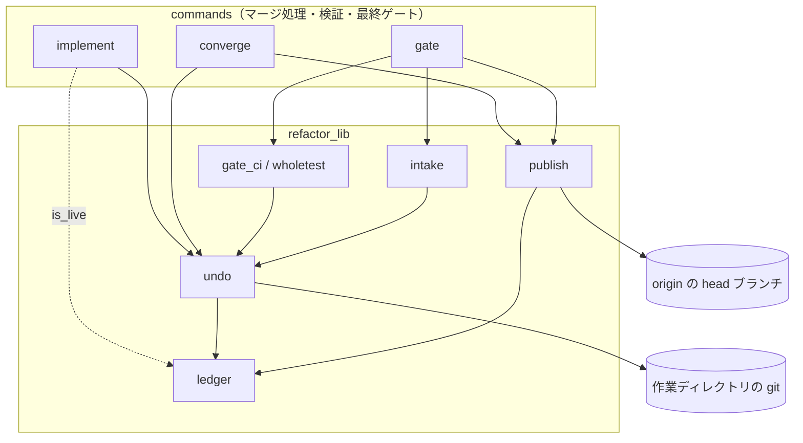
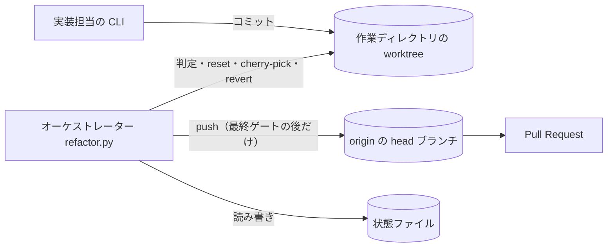
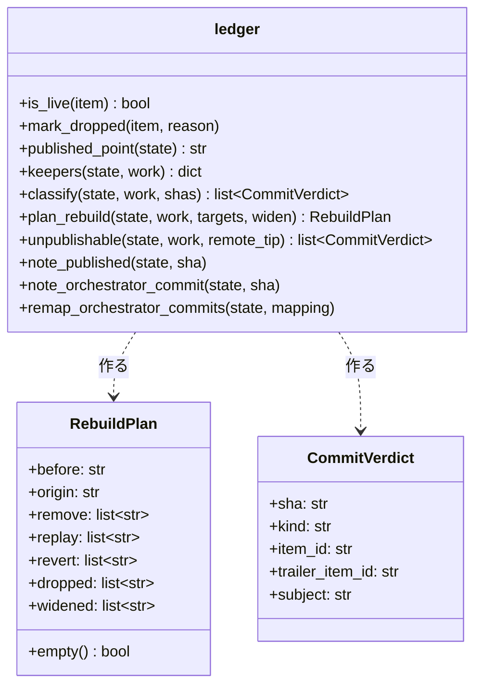
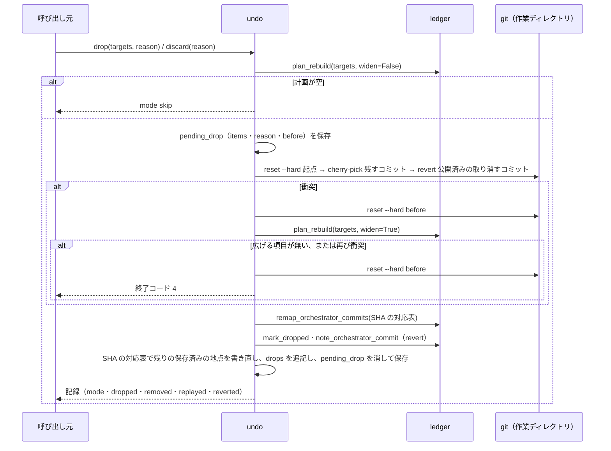
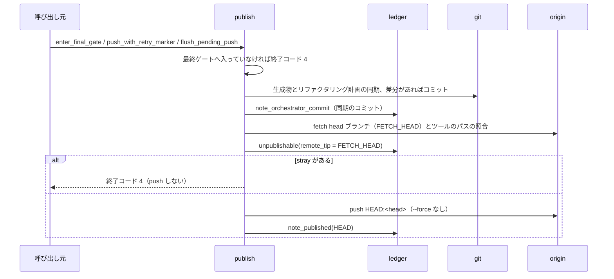
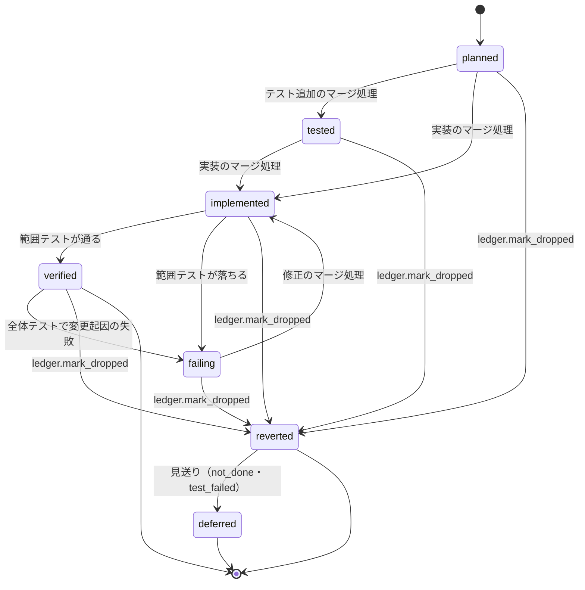

# #1482: cross-refactoring の取り消しと公開を 1 つの判定から決める — 設計

**この文書は「どう作るか」だけを扱う。** 他の 3 つは次のとおりである。

| 文書 | 中身 |
| --- | --- |
| [issue-1482-requirements.md](issue-1482-requirements.md) | 要求と受け入れ条件（#1482 の本文のコピー） |
| [issue-1482-design-decisions.md](issue-1482-design-decisions.md) | 決定の記録（結論・理由・採らなかった案） |
| [issue-1482-design-tests.md](issue-1482-design-tests.md) | テスト設計と未確認のまま残ること |

## 例: #1237 の計画を、変えた後の形で通すと

リファクタリング計画は I-001〜I-006 の 6 項目で、I-001 は見送り（not_done）、I-002〜I-006 を採用した。
最終ゲートへ入る前なので、起点（`plan.base_sha`）から HEAD までのコミットはどれもまだ push していない。

1. 検証で I-002 を取り消す。`undo.drop` が `ledger.plan_rebuild` を呼ぶ
2. 判定は「残すコミット」を I-003〜I-006 のコミットと決め、積み直しの起点を I-002 の最も古いコミットの
   親に置く。`git reset --hard <起点>` の後、I-003〜I-006 のコミットを古い順に `cherry-pick` する。
   `git revert` は 1 回も打たない（取り消すコミットはどれも未公開のため）
3. I-004 の積み直しが衝突する（I-004 は I-002 の変更の上に書かれている）。HEAD を取り消しの前へ戻し、
   判定に「同じファイルまで広げる」を渡す。消すコミットが触ったファイルは `cross-refactoring/scripts/drive.py`
   だけなので、広がるのは I-004 だけである。I-003（`supervise.py`）・I-005（`cross-review/scripts/drive.py`）・
   I-006 は残る
4. 広げた計画で積み直しが通る。`drops` に `mode: widened`・`dropped: ["I-002", "I-004"]` が残る
5. 続けて別の項目を取り消しても、前の取り消しの積み直しのコミットは「残すコミット」として扱われるだけで、
   `git revert` の対象に入らない。コミット数は取り消しの回数で伸びない
6. 検証を終えて最終ゲートへ入る時点で、初めて push する。push の直前に `ledger.unpublishable` が
   origin の head から HEAD までのコミットを照らす。残すコミットでないもの（見放した担当の残留コミットなど）が
   1 つでもあれば、push せずに終了コード 4 で止まる

## ドメインモデル

### コンテキスト

| コンテキスト | 何の語が 1 つの意味に決まるか |
| --- | --- |
| `ndf-cross-refactoring` | 改善項目・取り消しの判定・残すコミット・公開した地点・途中の push |

1 つのコンテキストに収まる。`cross-review` は取り消しと積み直しを持たないため対象にしない（要求の前提 6）。

### 集約

| 集約 | 持ち主（書き換えてよいもの） | 根 | エンティティ | 値オブジェクト |
| --- | --- | --- | --- | --- |
| 改善項目の採否 | 前へ進める遷移（`planned` → … → `verified`）は各コマンド。**`reverted` へ落とす遷移は `ledger.mark_dropped` だけ** | 改善項目（`state["items"][]`） | — | 記録したコミット（`commits.test` / `implement` / `fix[]`） |
| 公開の台帳 | `ledger.py`（`note_published` / `note_orchestrator_commit` / `remap_orchestrator_commits`）。`publish.py` と `undo.py` はこの関数を通して書き、`state["ledger"]` の欄を直接書かない | 台帳（`state["ledger"]`） | — | 公開した地点・オーケストレーターのコミットの SHA の並び |
| 取り消しの記録 | `undo.py` | 取り消し（`state["drops"][]`・`state["pending_drop"]`） | — | 積み直しの計画（`RebuildPlan`） |

**判定（どのコミットを残し、消し、戻し、公開してよいか）は `ledger.py` の純粋な関数が持つ。** git を書き換えるのは
`undo.py`、push するのは `publish.py` で、どちらも判定を呼んで結果に従うだけにする。

### 不変条件

| # | 集約 | 条件 | 破れたときの扱い |
| --- | --- | --- | --- |
| I1 | 公開の台帳 | 未公開の範囲（公開した地点から HEAD まで）のコミットは、取り消しを終えた時点ですべて残すコミットである | push の直前の照合が見つけ、push せずに終了コード 4 で止まる |
| I2 | 公開の台帳 | push するコミット（origin の head から HEAD まで）はすべて残すコミットである | push せずに終了コード 4。該当のコミットの SHA・`Item-Id`・件名を 1 行ずつ出す |
| I3 | 取り消しの記録 | `git revert` の対象は、取り消す改善項目のコミットのうち公開した地点より前にあるものだけで、同じコミットを 2 度戻さない | 起きない形にする（判定が revert の並びを作る）。テストで縛る |
| I4 | 取り消しの記録 | 積み直しの衝突で広げるのは、消すコミットが触ったファイルを触った改善項目までの 1 段だけである | 広げても衝突したら、HEAD を取り消しの前へ戻して終了コード 4 |
| I5 | 改善項目の採否 | 取り消しの後の worktree の内容は、積み直しの起点に「残すコミット」を古い順に当て、公開済みの取り消す項目のコミットを戻した内容に一致する | テストで縛る（AC-1399-3） |
| I6 | 公開の台帳 | 最終ゲートへ入る前には push しない | `publish` の公開の入口が、最終ゲートへ入っていない状態で呼ばれたら終了コード 4 で止まる |
| I7 | 取り消しの記録 | `pending_drop` が残ったまま再開したら、記録した取り消しの前の HEAD へ戻してやり直し、同じ結果になる | 起きない形にする。テストで縛る |
| I8 | 改善項目の採否 | 最終ゲートが `passed` でない実行は、残った改善項目を「採用」と数えない | 起きない形にする（報告と drive の集計が同じ判定を読む） |

### ドメインイベント

要求のドメインイベントの番号を引き継ぐ。

| # | イベント | 発生元 | 受け手 |
| --- | --- | --- | --- |
| E1 | 実装担当が改善項目のコミットを積んだ | 実装担当の CLI | マージ処理（E2）・push の直前の照合（E6。見放した後のコミット） |
| E2 | マージ処理でコミットを改善項目へ振り分けた | `implement` / `converge` / `gate` のマージ処理 | 取り消しの判定（記録したコミットが残すコミットになる） |
| E3 | 改善項目を取り消した | `undo.drop`・`undo.discard` | 取り消しの判定（`plan_rebuild`） |
| E4 | 同じファイルを触った改善項目まで広げた | `undo`（積み直しの衝突） | 取り消しの判定（`plan_rebuild(widen=True)`） |
| E5 | 取り消した改善項目を判定に記録した | `undo`（`ledger.mark_dropped`） | 報告・push の直前の照合 |
| E6 | push の直前に照合した | `publish.push_head` | `ledger.unpublishable` |
| E7 | head ブランチへ push した | `publish.push_head` | 公開の台帳（`note_published`） |
| E8 | 最終ゲートが合否を出した | `gate.cmd_final_gate` | 報告（`report`）・drive の集計 |

### 用語

| 用語 | 意味 | 用語集への反映 |
| --- | --- | --- |
| 取り消しの判定 | 改善項目ごとに取り消したかと、各コミットを残すか・消すか・戻すか・公開してよいかを `ledger.py` の 1 か所で決める処理。取り消しの 4 つの経路と push の直前の照合が同じものを呼ぶ | 追加（`ndf-cross-refactoring`。要求で追加済み） |
| 残すコミット | 取り消されていない改善項目に記録されたコミット・受け入れた最終ゲート修正のコミット・オーケストレーターが台帳に記録したコミットのどれか。公開してよいのはこれだけである | 追加（`ndf-cross-refactoring`） |
| 公開した地点 | オーケストレーターが最後に push した HEAD。まだ push していなければ `plan.base_sha`。これより前のコミットは書き換えない | 追加（`ndf-cross-refactoring`） |
| 積み直しの起点 | 取り消しで `git reset --hard` する先。未公開の範囲で最も古い「消すコミット」の親で、公開した地点より前には置かない | 追加（`ndf-cross-refactoring`） |
| 残留コミット | 見放した実装担当のプロセスが、オーケストレーターの判定の後に積んだコミット | 追加（要求で追加済み） |
| 途中の push | 最終ゲートへ入るより前の push | 追加（要求で追加済み） |

## 機能一覧

| # | 機能 | 誰が使うか |
| --- | --- | --- |
| F1 | 改善項目を取り消すとき、未公開のコミットは積み直しで除き、公開済みのコミットだけを revert する | オーケストレーター（取り消しの 4 つの経路） |
| F2 | 積み直しが衝突したら、同じファイルを触った改善項目まで 1 段だけ広げ、それでも衝突したら取り消しの前へ戻して止める | オーケストレーター |
| F3 | push の直前に、送るコミットがすべて残すコミットかを照らし、違えば push せずに止める | オーケストレーター（すべての公開） |
| F4 | 最終ゲートへ入るまで push しない | オーケストレーター |
| F5 | 最終ゲートを経ずに終わった実行を、採用ありと報告しない | conductor（drive の結果を読む側）・Pull Request の読み手 |
| F6 | 取り消しの途中で落ちても、取り消しの前の HEAD からやり直して同じ結果にする | オーケストレーター（再開） |

## 構成要素

置き場は `plugins/ndf/skills/cross-refactoring/` の下（表では省く）。

| 要素 | 変更 | 責務 |
| --- | --- | --- |
| `scripts/refactor_lib/ledger.py` | 新規 | 取り消しの判定。改善項目が取り消されていないか（`is_live`）・取り消しの記録（`mark_dropped`）・残すコミットの集合・積み直しの計画（`plan_rebuild`）・公開してよくないコミット（`unpublishable`）・公開の台帳の読み書き。**git を書き換えず、終了もしない**（読むのは `rev-parse`・`rev-list`・`show --name-only` とトレーラーだけ） |
| `scripts/refactor_lib/undo.py` | 変更 | 判定の計画を git で実行する（`reset --hard`・`cherry-pick`・`revert`）。衝突したら広げた計画でやり直し、広げても衝突したら取り消しの前へ戻して終了コード 4。記録と再開。入口は `drop`（改善項目の単位）と `discard`（結果を残さなかった起動・手順を外れた修正の範囲）の 2 つ |
| `scripts/refactor_lib/publish.py` | 変更 | push の直前の照合（`ledger.unpublishable`）。同期のコミットを台帳へ記録、push の後に公開した地点を記録。公開の入口 `enter_final_gate` と `push_with_retry_marker` / `flush_pending_push` は最終ゲートへ入った後だけ push する |
| `scripts/refactor_lib/intake.py` | 変更 | `discard_unverified` を `undo.discard` へ寄せる。`close_without_result` から push を外す |
| `scripts/refactor_lib/worktree.py` | 変更 | `revert_item_commits` を消す。`revert_range` は `undo.py` だけが呼ぶ |
| `scripts/refactor_lib/gitfacts.py` | 変更 | `revert_range` と `revert_item_commits` の再輸出を消す（`commands/` から直接呼べなくする） |
| `scripts/refactor_lib/commands/implement.py` | 変更 | `_group_by_item` は `ledger.is_live` を使う。`_prepare` の `flush_pending_push` と `_finish` の push を外す |
| `scripts/refactor_lib/commands/converge.py` | 変更 | `_apply_fix_result` の範囲の取り消しを `undo.discard` へ。`_prepare` の `flush_pending_push` と `cmd_merge_fix` の push を外す。`cmd_verify` の終わりの push を `publish.enter_final_gate` にする |
| `scripts/refactor_lib/commands/gate.py` | 変更 | `cmd_final_gate` の入口で `publish.enter_final_gate`（検証を通らずに最終ゲートへ来た実行でも 1 度 push する）。`_close_failed_final_fix` が取り消しの後に push する |
| `scripts/refactor_lib/commands/report.py` | 変更 | 最終ゲートが `passed` でなければ「採用」の代わりに「未確定（最終ゲートを経ていない）」を出す |
| `scripts/refactor_lib/commands/setup.py` | 変更 | 状態の初期値に `ledger` を足す |
| `scripts/drive.py` | 変更 | 集計（`counts`）の採用は最終ゲートが `passed` のときだけ数える。通っていなければ `stopped`（終了コード 1）で終える |
| `docs/04-verify-and-report.md` | 変更 | 「取り消し」の節を、積み直しの起点・公開済みだけの revert・`all` の廃止・終了コード 4 に書き直す |
| `docs/02-plan-and-implement.md` | 変更 | 公開の時点を「最終ゲートへ入る時点と、その後」に書き直す |
| `docs/glossary/glossary.json` | 変更 | 用語の表の追加 3 語を足し、`glossary.py render` で `docs/glossary.md` を作り直す |
| `tests/test_ledger_git.py` | 新規 | 再現手順（#817・#1399・#1237）と不変条件を、一時リポジトリと bare の origin で縛る |
| `tests/test_undo_git.py` | 変更 | `mode: all` を期待するテストを「終了コード 4 で取り消しの前へ戻る」へ、`reverted_commits` を `removed` / `replayed` / `reverted` へ書き換える |
| `tests/test_module_owners.py` | 変更 | `OWNERS` の `worktree` から `revert_item_commits` を除き、`ledger` の行を足す。`gitfacts` の再輸出から 2 つを外す |
| `tests/test_final_fix.py` | 変更 | 「範囲を取り消す」テストの期待を、revert のコミットではなく「範囲のコミットが HEAD の履歴から消える」へ改める |

次の 3 つは `undo.drop` を呼ぶだけで、呼び方は変えない。`refactor_lib/gate_ci.py`（`revert_deferred`）・
`refactor_lib/wholetest.py`・`converge._narrow` である。



図には、判定を呼ばない変更（`worktree.py`・`gitfacts.py` の削除、`report.py`・`setup.py`・`drive.py`）と、文書・用語集・
テストを載せない。

### システムの文脈と配置



**実装担当の CLI は、見放された後も worktree へコミットしうる**（E1）。オーケストレーターはそれを止められない
ため、push の直前の照合（F3）で拾う。プロセスを止める処理は範囲外（要求の「含まない」）。

## 構造

### パッケージ構成

```text
plugins/ndf/skills/cross-refactoring/scripts/
├── drive.py                 # 変更: 集計と終わり方
└── refactor_lib/
    ├── ledger.py            # 新規: 取り消しの判定
    ├── undo.py              # 変更: 判定の実行・記録・再開
    ├── publish.py           # 変更: push の直前の照合・公開の入口
    ├── intake.py            # 変更: discard_unverified → undo.discard
    ├── worktree.py          # 変更: revert_item_commits を消す
    ├── gitfacts.py          # 変更: 再輸出を消す
    └── commands/
        ├── implement.py     # 変更
        ├── converge.py      # 変更
        ├── gate.py          # 変更
        ├── report.py        # 変更
        └── setup.py         # 変更
```

### クラス図

`ledger.py` の値と関数だけを描く。状態は今までどおり辞書で持つ。



`CommitVerdict.kind` の値は 4 つである。

| `kind` | 何か | 残すか |
| --- | --- | --- |
| `item` | 取り消されていない改善項目に記録されたコミット | 残す |
| `final_fix` | 最終ゲート修正のマージ処理が受け入れたコミット（`final_gate.fix_commits`） | 残す |
| `orchestrator` | 台帳の `orchestrator_commits` にあるコミット（同期・リファクタリング計画の記録・公開済みの取り消しの revert） | 残す |
| `stray` | 上のどれでもない（取り消した改善項目のコミット・`Item-Id` が無いか計画に無い・記録の前の残留コミット） | 消す（未公開）／公開を止める |

**`stray` の見分けは SHA の一致だけで行う。** `Item-Id` の値は出力に添えるためだけに読む。トレーラーで残すかを
決めると、見放した担当が採用済みの項目の `Item-Id` を書いた残留コミットを通してしまう。

## データ構造

状態ファイル（`cross-refactoring-rf<ID>-state.json`）に足す欄と変える欄である。

| 欄 | 型 | 空の値 | 意味 |
| --- | --- | --- | --- |
| `ledger.published_sha` | str | 欄が無い（→ `plan.base_sha` を使う） | 公開した地点。push が通るたびに push した HEAD を書く |
| `ledger.orchestrator_commits` | list[str] | `[]` | オーケストレーターが作ったコミットの完全な SHA。同期・計画の記録のコミットは作った直後、revert は取り消しの記録の時点で足す。積み直しで SHA が変わったら `ledger.remap_orchestrator_commits` が書き直す（`undo` は対応表を渡すだけ） |
| `pending_drop.before` | str | 欄が無い（→ 今の HEAD から判定し直す） | 取り消しの前の HEAD。再開はここへ戻してやり直す |
| `drops[].mode` | str | — | `item` / `widened` / `skip`。**`all` は書かない**（既存の記録にある `all` は読めるまま残す） |
| `drops[].origin` | str | — | 積み直しの起点 |
| `drops[].removed` | int | — | 未公開の範囲から消したコミット数 |
| `drops[].replayed` | int | — | 積み直したコミット数 |
| `drops[].reverted` | int | — | 公開済みの範囲で `git revert` したコミット数 |
| `drops[].reverted_commits` | int | — | **書かなくなる。** 既存の記録は読めるまま残す |

**積み直しで書き直す SHA は項目のコミットに限らない。** 積み直しの起点より後を指す保存済みの地点も、
対応表で書き直す。対象は `phases.*.base_sha`・`fix.base_sha`・`final_gate.fix_base_sha`・`final_gate.fix_commits`・
`ledger.orchestrator_commits` である。`ledger.orchestrator_commits` だけは台帳の持ち主の `ledger.remap_orchestrator_commits(state, mapping)` を通して書き直し、残りは `undo` が書き直す。地点の対応は「元の履歴でその地点以前にある最後の残すコミットの
新しい SHA。無ければ積み直しの起点」とする。`remap_orchestrator_commits` は対応表に無い SHA をそのまま残し、同じ取り消しで作る revert の SHA は書き直しの後に `note_orchestrator_commit` で足す。書き直さないと、次のマージ処理が履歴に無い起点から範囲を取る。

**既存の状態ファイルからの再開**: `ledger` が無ければ公開した地点を `plan.base_sha` とみなす。旧い版で途中の push を
済ませた状態ファイルでは、これが実際の公開した地点より古い。そのときは積み直しが push 済みのコミットを置き換え、
次の push が fast-forward にならずに失敗する（`--force` を使わないため、origin は壊れない）。この場面の扱いは
「未確認のまま残ること」に置く。

### 機能 × データ

| 機能 | `items[].status` | `items[].commits` | `ledger` | `drops` / `pending_drop` | 保存済みの地点 |
| --- | --- | --- | --- | --- | --- |
| F1 取り消し | 更新（`reverted`） | 更新（積み直し） | 更新（revert の SHA） | 作成 | 更新 |
| F2 広げる | 更新（広げた項目） | 更新 | — | 作成（`widened`） | 更新 |
| F3 照合 | 読む | 読む | 読む | — | — |
| F4 公開 | — | — | 更新（公開した地点・同期のコミット） | — | — |
| F5 報告 | 読む | — | — | 読む | — |
| F6 再開 | 更新 | 更新 | 更新 | 読む・更新 | 更新 |

## 入出力の契約

コマンドと引数は変えない。変わるのは終了コードと出力である。

| 場面 | 終了コード | 出力（標準エラーの 1 行ずつ） |
| --- | --- | --- |
| push の直前の照合で `stray` を見つけた | 4 | `✖ 公開してよくないコミットがあるため push しません` の後に、`stray` ごとに `<SHA 12 桁> Item-Id=<値か -> <件名>`、最後に `origin の <head> は変えていません` |
| 広げても積み直せない | 4 | `✖ 同じファイルを触った項目まで広げても積み直せません: <衝突した SHA 12 桁>（広げた項目: I-00x, …）。HEAD を <before 12 桁> へ戻しました` |
| 最終ゲートへ入る前に公開の入口が呼ばれた | 4 | `✖ 最終ゲートへ入る前には push しません（呼び出し元の誤り）` |
| 公開した地点が HEAD の祖先でない | 4 | `✖ 公開した地点 <12 桁> が HEAD の祖先にないため取り消せません` |
| 取り消しの前の HEAD へ戻せない（`reset` の失敗） | 4 | 既存の `die` の形 |

**drive の結果**: 最終ゲートが `passed` でないまま終わったら、次の形で終える。

| 欄 | 値 |
| --- | --- |
| `status` | `stopped`（終了コード 1） |
| `metrics.exit` | 最終ゲートの終了コード |
| `metrics.adopted` | 0 |
| `metrics.unconfirmed` | 残った改善項目の数 |

`summary` は「最終ゲートを経ていないため、残った改善項目 N 件は採用と確定していない」とする。

**`refactor.py report`**: 最終ゲートが `passed` でなければ、「採用: N 件」の行を
「採用: 未確定（最終ゲートを経ていない。残った改善項目 N 件）」に替える。終了コードは今までどおり 0（読むだけのコマンド）。

## 処理の流れ

### 取り消し（`undo.drop` / `undo.discard`）



**`plan_rebuild` の決め方**（すべて判定の中で決め、`undo` は並びに従って打つだけにする）:

1. `P` = 公開した地点。`P` が HEAD の祖先でなければ、計画を作らず理由を返す（`undo` が終了コード 4 で止まる）
2. `dropped` = `targets`
3. 未公開の範囲（`P..HEAD`、古い順）の各コミットを `classify` し、`dropped` の項目のコミットと `stray` を「消す」、
   それ以外を「残す」に分ける
4. 公開済みの範囲（`plan.base_sha..P`）にある `dropped` の項目のコミットを、新しい順に「戻す」（`revert`）へ並べる
5. `widen=True` なら、3 と 4 で「消す」「戻す」にしたコミットが触ったファイルを集める。そのファイルを触った、
   取り消されていない改善項目を `dropped` へ足し（足した項目は `widened`）、3 と 4 を 1 度だけやり直す。
   足した項目のコミットから、さらには広げない
6. 起点 = 「消す」の中で最も古いコミットの親。「消す」が無ければ HEAD（reset しない）
7. `replay` = 起点より後の「残す」（古い順）
8. 「消す」も「戻す」も無ければ空の計画

**`discard` は `targets` が空の `drop` である。** 結果を残さなかった起動・手順を外れた修正のコミットは、
どの改善項目にも記録されていないため `stray` になり、3 で消える。範囲の起点を呼び出し元から受け取らない。
取り消しを行う 4 つの経路は、この 1 つの計画から消すコミットを得る。4 つとは `undo.drop`・
`intake.discard_unverified`・`converge._apply_fix_result`・最終ゲート修正のマージ処理である。

`discard_unverified` は `undo.discard` を呼んだ後、今までどおり起点の鍵（`scope.base_key`）を取り消し後の HEAD へ
進める。

### 公開（`publish`）



**照合する範囲は origin の head（`FETCH_HEAD`）から HEAD までである。** push が origin へ足すコミットと一致する。
公開した地点（台帳）ではなく origin を読むのは、台帳が古い状態ファイルからの再開でも、送るものを取りこぼさないためである。

「最終ゲートへ入った」は `state["phase"]` が `final` か `done` のときとする。`cmd_verify` の終わりと、残る項目が 0 件の
`implement._finish` がどちらも `final` を書いてから最終ゲートへ進む。

### push の時点

| 呼び出し元 | 今 | 変えた後 |
| --- | --- | --- |
| `implement._prepare`・`converge._prepare`（`flush_pending_push`） | push しうる | 呼ばない |
| `implement._finish` | `pending_push` なら push | push しない |
| `intake.close_without_result` | 取り消したら push | push しない（最終ゲート修正の経路は `gate._close_failed_final_fix` が push する） |
| `converge.cmd_merge_fix` | `pending_push` なら push | push しない |
| `converge.cmd_verify` の終わり | push | `enter_final_gate`（**実行で最初の push**） |
| `gate.cmd_final_gate` の入口 | — | `enter_final_gate`。HEAD が公開した地点と同じなら何もしない |
| `gate` の `recheck`・`cmd_merge_final_fix`・`flush_pending_push(gate)` | push | 変えない（最終ゲートの後） |
| `undo.drop`・`converge._apply_fix_result`・`intake.discard_unverified` の `pending_push = True` | 立てる | 立てない（取り消しは push を伴わない） |

### 改善項目の状態遷移

`reverted` へ落とす遷移の持ち主だけを変える。前へ進める遷移は変えない。



## 非機能の実現方式

| 大項目 | 条件 | 実現方式 |
| --- | --- | --- |
| 性能・拡張性 | 取り消し 1 回の `git revert` / `git cherry-pick` の回数が、起点の後の改善項目のコミットの数の 2 倍以下 | `replay` は未公開の残すコミットだけ（改善項目のコミットと、同期・受け入れた最終ゲート修正のコミット）、`revert` は公開済みの取り消す項目のコミットだけである。広げたやり直しを含めても 1 回の取り消しで計画を 2 度打つまでに限る |
| 運用・保守性 | 中断は終了コード 4 と、原因のコミットの SHA・`Item-Id` を含む 1 行で見分けられる。`drops` に `mode`・`dropped`・コミット数が残る | 「入出力の契約」の出力と、`drops[]` の `origin`・`removed`・`replayed`・`reverted` |
| セキュリティ | 検証と採否を経ていないコミットを Pull Request へ公開しない | すべての push が `push_head` の照合を通る。残すかは状態ファイルに記録した SHA で決め、担当が書けるトレーラーでは決めない |

**コミット数の上限（AC-1399-2）がなぜ守られるか**: 未公開の範囲は取り消しのたびに「残すコミット」だけへ組み直される
ため、前の取り消しの積み直しは元のコミットを置き換えるだけで数を増やさない。最終ゲートより前は公開済みの範囲が無く、
`git revert` は 1 度も打たれない。最終ゲートの後は、取り消す改善項目のコミットを 1 度だけ戻す（I3）。よって
起点から HEAD までのコミット数は「改善項目のコミットの数 × 2 + 同期・記録のコミットの数 + 受け入れた最終ゲート修正の
コミットの数」を超えない。
