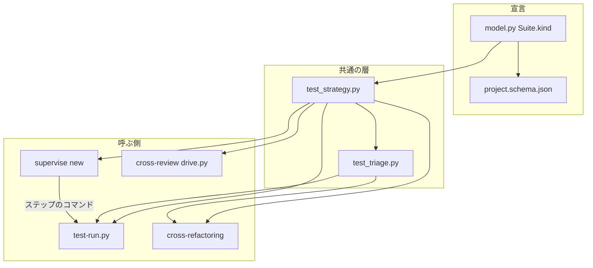
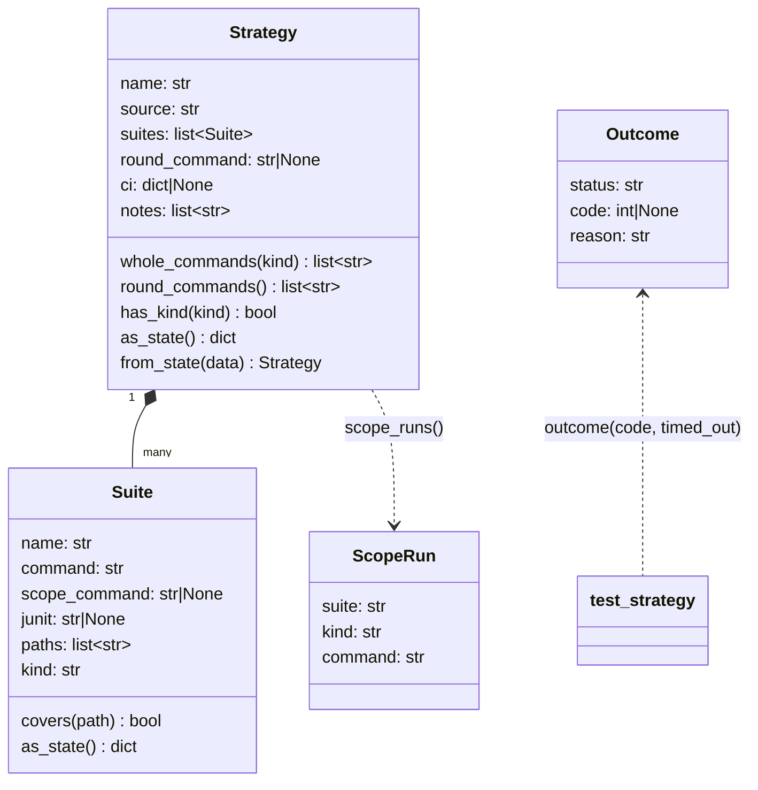
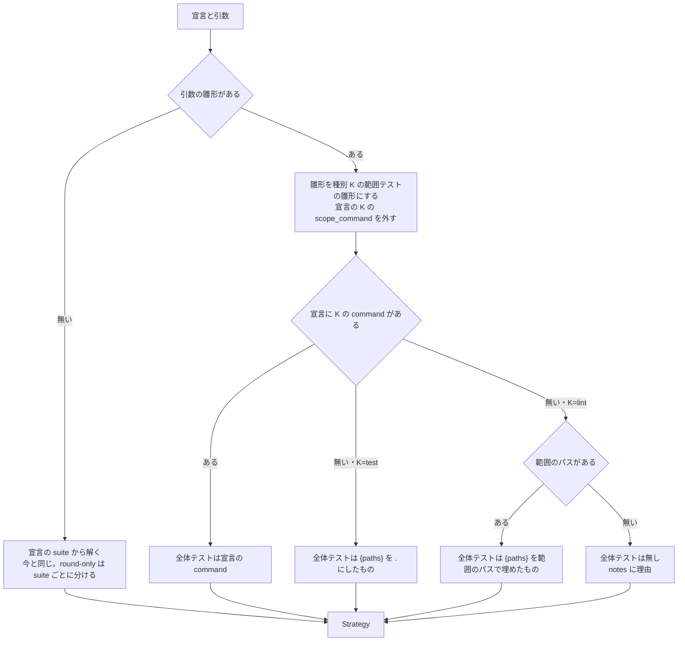
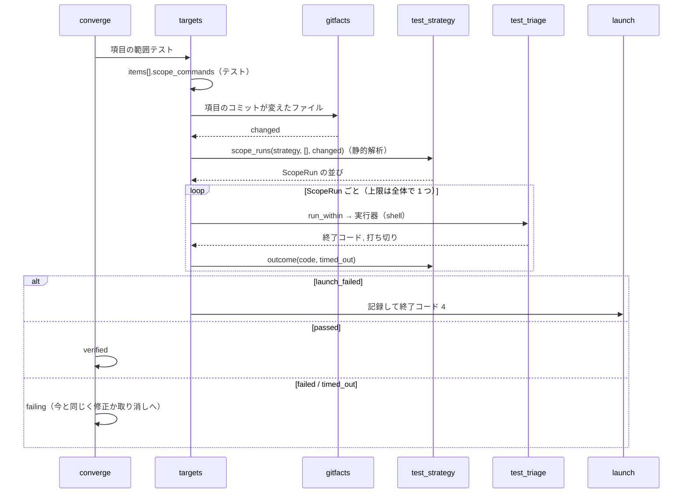

# #1483: テストの戦略の宣言に suite の種別と起動の失敗を持たせる — 設計

要求と受け入れ条件は #1483 の本文にある（コピーは [issue-1483-requirements.md](issue-1483-requirements.md)）。
この文書は「どう作るか」だけを扱う。

## 例: 変えた後に、シェルスクリプトだけの範囲で cross-refactoring を回すまで

#1434 と同じ形の実行を、変えた後の振る舞いでたどる。

1. 利用者が `/ndf:cross-refactoring 1500 --scope scripts/a.sh scripts/b.sh --baseline-test 'uvx --from shellcheck-py shellcheck -s bash {paths}' --test-kind lint` を打つ
2. `init` が戦略を解く。雛形の種別は `lint` で、宣言に `lint` の `command` が無いため、全体テストは `{paths}` を
   `--scope` のパスで埋めた `uvx --from shellcheck-py shellcheck -s bash scripts/a.sh scripts/b.sh` になる。
   `shellcheck ... .` は組まない（AC17）
3. 戦略にテストの種別の suite が無いため、`--scope` にテストの置き場所を求める検査を通らない。計画に
   「テストの種別の suite が無いため、テスト整備ラウンドと `--scope` の検査を行わない」と 1 行残る（AC16）
4. 項目 R1 が `scripts/a.sh` を直す。検証は R1 のコミットが変えたファイル `scripts/a.sh` を `{paths}` に入れ、
   `uvx --from shellcheck-py shellcheck -s bash scripts/a.sh` をシェルで走らせる
5. 実行環境に `uvx` が無ければ、シェルは終了コード 127 を返す。`test_strategy.outcome` がこれを「起動の失敗」と
   判別し、cross-refactoring は R1 を取り消さずに止まる。報告に `uvx --from shellcheck-py ...` と
   「終了コード 127（コマンドが見つからない）」が出て、終了コードは 4 になる（AC13）

宣言で同じことをするなら、`.ndf/project.json` の suite に `"kind": "lint"` と `"paths": ["*.sh"]` を書く。
`paths` の `*.sh` が、変更したファイルのうちこの suite にかけるものを絞る（決定 4）。

## ドメインモデル

### コンテキスト

| コンテキスト | 何の語が 1 つの意味に決まるか |
| --- | --- |
| NDF の工程（`ndf-workflow`） | テストの戦略・suite の種別・起動の失敗・範囲テストの雛形・全体テスト・範囲テスト |
| cross-refactoring（`ndf-cross-refactoring`） | 項目の検証・テスト整備ラウンド・最終ゲート・フレーキー / 既存失敗 / 変更起因 |
| cross-review（`ndf-cross-review`） | 最終スイープ |

**関係は「公開された言語」である。** `ndf-workflow` の宣言の形（`project.schema.json`）と戦略の状態の形
（`Strategy.as_state`）が文書化された共通の形式で、cross-refactoring・supervise・cross-review・`test-run.py` は
この形だけを読む。種別・全体テスト・起動の失敗の判別を呼ぶ側で作り直さない（非機能の条件「運用・保守性」）。

### 集約

| 集約 | 持ち主（書き換えてよいもの） | 保存先 | 根 | エンティティ | 値オブジェクト |
| --- | --- | --- | --- | --- | --- |
| テストの宣言 | 利用者（手で書く）と `project-decl.py write`（解析の答えを書く） | `.ndf/project.json` の `test` | `test` | suite（`name` で識別） | 種別・`command`・`scope_command`・`paths` |
| 戦略 | `test_strategy.resolve`（cross-refactoring の `init`・supervise の `new` が 1 回だけ呼んで写す） | cross-refactoring の状態ファイルの `strategy`、supervise のプランの `strategy` | 戦略 | suite の写し | 種別・全体テストのコマンド・範囲テストの雛形・`notes` |
| 項目の検証 | cross-refactoring の `converge`・`implement` | 状態ファイルの `items[]` | 項目 | — | 範囲テストのコマンド（`scope_commands`）・状態 |
| 起動の失敗の記録 | cross-refactoring の `refactor_lib/launch.py`（着手前・項目・テスト整備ラウンド・最終ゲートの手順が呼ぶ 1 つの関数） | 状態ファイルの `launch_failure` | 記録 | — | コマンド・終了コード・理由・手順 |
| テストの実行の結果 | `test-run.py`（1 回の起動が 1 つの結果を書く） | `test-run.py` の結果 JSON（`status`・`items[].launch_failed`） | 結果 | — | コマンド・終了コード・理由・ログ |

**保存先ごとに集約を分け、各々の持ち主を 1 つにする。** cross-refactoring は `test-run.py` の結果 JSON を書かず、
`test-run.py` は状態ファイルを書かない。起動の失敗の判別（`test_strategy.outcome`）だけを両者が共有する（I7）。
持ち主のほかは読むだけである。戦略は状態ファイルへ写した後に変えない（今の `as_state` の約束）。
項目の検証は戦略を ID（状態ファイルの `strategy`）で参照し、suite の中身を自分で持たない。

### 不変条件

| # | 集約 | 条件 | 破れたときの扱い |
| --- | --- | --- | --- |
| I1 | 戦略 | 種別は宣言の `kind` か引数 `--test-kind` だけで決まる。コマンドの語・実行器の名前を見ない（今の I1 を保つ） | 語を見て種別を決める処理はレビューで差し戻す |
| I2 | 戦略 | コマンドへの加工は、`{paths}` の字句をシェルの引用で守った対象の並びへ置き換えることだけである（今の I2 を保つ） | 置き換えのほかに語を足す・消す処理はレビューで差し戻す |
| I3 | テストの宣言・戦略 | 種別を持たない suite と、種別を持たない状態ファイルの suite はテストとして読む | 既存の宣言で戦略・全体テスト・範囲テストが変われば退行として直す（AC3・AC4） |
| I4 | 戦略 | 全体テストに、静的解析の雛形の `{paths}` を `.` にしたコマンドが入らない | 入れば解き方の誤りとして直す（AC5・AC17・AC18） |
| I5 | 戦略 | 同じ宣言のコマンドは、`test-run.py`・cross-refactoring・supervise のどこからでもシェル経由の 1 通りで走る | 語の並びを `shell=False` で走らせる経路が残れば直す（AC9） |
| I6 | 戦略 | suite のコマンドは 1 つずつ別のシェルのプロセスで走り、前の suite の作業ディレクトリの変更が後の suite に効かない | ` && ` でつないだ 1 本の文字列を新しく組めば直す（AC10） |
| I7 | 起動の失敗の記録 | 終了コードから「通った / 落ちた / 起動の失敗 / 打ち切った」を決める関数は `test_strategy.outcome` の 1 つだけである | 呼ぶ側に 126 / 127 を比べる処理が残れば直す（AC11） |
| I8 | 項目の検証 | 起動の失敗のとき、項目の状態を変えず、取り消しも次の項目の適用も行わない | 項目が `failing` か `reverted` になれば直す（AC13） |
| I9 | 項目の検証 | テスト整備ラウンドの判定と `--scope` の検査は、テストの種別の suite だけを見る | 静的解析の suite の結果で足したテストの項目を取り消せば直す（AC15・AC16） |
| I10 | 項目の検証 | 静的解析の suite の範囲は、その項目のコミットが変えたファイルのうち、その suite の `paths` に当たりworktreeに残るものである | 対象のテストの並び（`test_targets`）を静的解析へ渡せば直す（AC8） |
| I11 | 戦略 | 引数の雛形は、同じ種別の宣言の範囲テストの雛形を置き換える。全体テストは種別ごとに宣言の `command` が引数より先に効く | 引数の雛形から全体テストを組んで宣言の `command` を使わなければ直す（AC6） |
| I12 | 戦略 | 着手前に落ちていた静的解析の suite の全体の失敗は、suite に `scope_command` があれば変更したファイルに絞った範囲テストで判定し、無ければ絞らずに既存失敗として記録して判定から外す（報告に出す） | 変更と無関係な違反で最終ゲート修正へ回れば直す。`scope_command` の無い suite を変更起因として修正へ回しても直す（目的の 1 つ目・決定 9） |
| I13 | — | cross-review の最終スイープは、宣言の `test` があれば宣言の全体テストだけを名指しし、`--verify-command` を読まない | `--verify-command` の値がプロンプトに現れれば直す（AC19・AC20） |

### ドメインイベント

| # | イベント | 発生元 | 受け手 |
| --- | --- | --- | --- |
| E1 | 宣言を読んだ | `project_decl.read_project_decl`（`model.validate_decl` で種別を確かめる） | `test_strategy.decl_of` |
| E2 | 戦略を解いた | `test_strategy.resolve` | cross-refactoring の `init`（状態ファイル）・supervise の `new`（プラン）・`test-run.py`・cross-review の `drive.py` |
| E3 | 着手前の全体テストを走らせた | cross-refactoring の `baseline.run_baseline` | 状態ファイルの `baseline_test`（suite ごとの成否を足す） |
| E3a | 全体テストのステップを走らせた | supervise の `test-all`（`test-run.py whole`） | `test-run.py` の結果 JSON と終了コード。supervise のステップは今と同じく終了コードで次へ進むか止まるかを決め、プランへは成否を写さない（`baseline_test` を持たない） |
| E4 | 項目の範囲テストを走らせた | cross-refactoring の `converge._run_limited` | 項目の状態（`verified` / `failing`） |
| E5 | テスト整備ラウンドで足したテストを判定した | cross-refactoring の `implement._run_added_tests` | 項目の取り込み（`intake.test_failed`） |
| E6 | 最終ゲートで全体テストを走らせた | cross-refactoring の `gate._local_gate` | 最終ゲートの記録（`final_gate.checks[]`） |
| E7 | 起動の失敗を報告して止まった | E3・E4・E5・E6 の手順（cross-refactoring）と `test-run.py`（E3a を含む） | 利用者（報告と終了コード）。cross-refactoring は状態ファイルの `launch_failure`、`test-run.py` は結果 JSON の `items[].launch_failed` へ書く |
| E8 | 最終スイープのプロンプトに検証のコマンドを書いた | cross-review の `drive.sweep_prompt` | 最終スイープの worker |

**E5 も E7 の発生元に入れる。** 要求の表は E3・E4・E6 だけを挙げるが、足したテストのコマンドも同じ関数で
走らせるため、起動の失敗を「足したテストが通らない」として項目を落とすと I8 が破れる。

### 用語

| 用語 | 意味 | 用語集への反映 |
| --- | --- | --- |
| suite の種別 | 宣言の suite の `kind`。`test`（テスト）か `lint`（静的解析。整形の検査を含む）。書かなければ `test` | 意味の変更（`ndf-workflow`。キーと値を足す） |
| 範囲テストの雛形 | `{paths}` を引用の外の 1 字句として含むテストのコマンド（宣言の `scope_command` か `{paths}` を含む引数）。`{paths}` をシェルの引用で守った対象の並びへ置き換え、シェルで走らせる | 意味の変更（`ndf-workflow`） |
| 変更したファイル | cross-refactoring の項目のコミット（実装と修正）が変えたファイルのうち、worktreeに残るもの。そのうち静的解析の suite の `paths` に当たるものが、その suite の範囲になる | 追加（`ndf-cross-refactoring`） |
| 起動の失敗 | （要求で追加済み） | 変更なし |

## 機能一覧

| # | 機能 | 誰が使うか |
| --- | --- | --- |
| F1 | 宣言の suite に種別を書き、検証で誤りを知る | リポジトリの利用者・`development-workflow` の解析 |
| F2 | 引数の雛形に種別を添える（`--test-kind`） | cross-refactoring・supervise・`test-run.py` の起動者 |
| F3 | 種別に合わせて全体テストと範囲テストを組む | cross-refactoring・supervise・`test-run.py` |
| F4 | 起動の失敗を判別して止まる | cross-refactoring・`test-run.py`（supervise のステップ） |
| F5 | 項目ごとの範囲テストと最終ゲートで静的解析を走らせる | cross-refactoring |
| F6 | テスト整備ラウンドと `--scope` の検査をテストの種別の suite だけで行う | cross-refactoring |
| F7 | 最終スイープのプロンプトで宣言の全体テストを名指しする | cross-review |

## 構成要素

| 要素 | 責務 | 変え方 |
| --- | --- | --- |
| `scripts/project_lib/model.py` の `Suite` | 宣言の suite の形 | `kind: Literal["test", "lint"] = "test"` を足す。`paths` の説明に glob を足す |
| `skills/development-workflow/schemas/project.schema.json` | 公開する JSON Schema（生成物） | `project-decl.py schema --out` で作り直す |
| `scripts/lib/test_strategy.py` | 種別・全体テスト・範囲テストの組み立て・起動の失敗の判別（純粋な処理） | 下の「構造」。雛形の検査・置き換え・`resolve`・`outcome` を変える |
| `scripts/lib/test_triage.py` | 落ちたテストの見分け・走らせ直し | 走らせ直しを文字列のコマンドで組む。静的解析の suite の全体の失敗を変更したファイルに絞る関数を足す |
| `scripts/test-run.py` | supervise のテストのステップの入口 | `--test-kind`・`whole --paths` を足す。範囲テストをシェル経由にする。起動の失敗を結果 JSON に出す |
| `skills/cross-refactoring/scripts/refactor.py` と `commands/setup.py` | `init` の引数と戦略の解き方 | `--test-kind` を足す。戦略を解いてから `--scope` の検査を通す（テストの種別の suite があるときだけ） |
| `refactor_lib/baseline.py` | 着手前のテスト | 全体テストを種別ごとに走らせ、suite ごとの成否を記録する。起動の失敗で止める |
| `refactor_lib/targets.py` | 項目の範囲テストの組み立てと実行 | 項目の `scope_commands`（文字列）を組み・読む。旧形の `command` を読む。静的解析の範囲を変更したファイルで組む |
| `refactor_lib/gitfacts.py` | git の事実の読み取り | 項目のコミットが変えたファイルを返す関数を足す |
| `refactor_lib/commands/plan.py` | 計画 | テストの種別の suite が無いとき、項目の `tests` を空にして計画に残す。静的解析だけの戦略で項目を `no_target` で見送らない |
| `refactor_lib/commands/converge.py` | 項目の検証 | 範囲テストに静的解析を足す。起動の失敗で止める |
| `refactor_lib/commands/implement.py` | テスト整備ラウンドの判定 | テストの種別の suite だけで判定する。起動の失敗で止める |
| `refactor_lib/wholetest.py` | 危険フラグの全体テスト | テストの種別の全体テストだけを走らせる。起動の失敗で止める |
| `refactor_lib/commands/gate.py` | 最終ゲート | 静的解析の全体テストを戦略に関わらず手元で走らせ、着手前に落ちていた suite を絞って判定する。起動の失敗で止める |
| `refactor_lib/launch.py`（新設） | 起動の失敗で止める 1 か所 | 記録を状態ファイルへ書き、報告の 1 行を出し、終了コード 4 で止める |
| `refactor_lib/commands/report.py` | 報告 | `launch_failure` と「行わなかったこと」（テスト整備ラウンド・`--scope` の検査）を出す |
| `scripts/supervise_lib/new_args.py`・`decl.py`・`verify_steps.py` | supervise の `new` と、テストのステップのコマンド | `--test-kind` を足し、`resolve` へ種別と `--tests` を渡す。`test-run.py` へ `--test-kind` と `whole --paths` を渡す |
| `skills/cross-review/scripts/drive.py` | 最終スイープのプロンプト | 宣言の全体テストを名指しする段落を足す |
| 説明の文書 | 利用者向けの約束 | cross-refactoring の `SKILL.md` と `docs/01`・`docs/04`、cross-review の `docs/02` の Step 7.5、`development-workflow` の宣言の説明、用語集 |



**呼ぶ側どうしは互いを呼ばない。** supervise はプランのステップとして `test-run.py` を起動するだけで、
種別と全体テストは `test_strategy.py` から受け取る。

## 構造

変更が触る型だけを載せる。`Outcome` と `ScopeRun` を新しく作り、`Suite` と `Strategy` を変える。



| 型・関数 | 変える点 |
| --- | --- |
| `Suite.kind` | `"test"` / `"lint"`。`as_state` に載せ、`from_state` は無ければ `"test"` にする（I3） |
| `Suite.covers(path)` | 今の `suite_for` の一致の判定を移す。`paths` の要素に `*` `?` `[` があれば `fnmatch.fnmatchcase` で、無ければ今と同じ接頭辞で一致を見る |
| `Strategy.whole_commands(kind=None)` | 種別で絞れるようにする。`None` は両方。`round-only` で suite の `command` が無いときは今と同じくラウンドテスト |
| `Strategy.round_commands()` | 新設。ラウンドテストのコマンドの並び。引数の `--round-test` なら `[round_command]`、宣言から導いたなら `command` を持つ suite ごとに 1 つ（I6） |
| `Strategy.has_kind(kind)` | 新設。その種別の suite があるか |
| `ScopeRun` | 新設。範囲テストの 1 本（どの suite の、どの種別の、どのコマンドか）。状態ファイルの `items[].scope_commands` の 1 要素と同じ形 |
| `scope_runs(strategy, targets, changed)` | 今の `scope_words` と `test_triage.rerun_words` の組み立てを置き換える。テストの suite には `targets` を、静的解析の suite には `changed` を、`covers` で振り分けて入れる（I10） |
| `fill(template, paths)` | 新設。`{paths}` の字句を `shlex.join(paths)` に置き換えた文字列（I2） |
| `template_problem` | 字句の分け方を `shlex.shlex(text, posix=False, punctuation_chars=True)` にする（決定 2） |
| `outcome(code, timed_out)` | 新設。`Outcome` を返す（I7。下の「入出力の契約」） |
| `resolve(..., template_kind="test", scope_paths=None)` | 引数を 2 つ足す。解き方は「処理の流れ」 |
| `verify_commands(decl)` | 新設。最終スイープに書く全体テストの並び。宣言の `test` が無いか解けなければ `None`（I13） |
| `scope_words`・`whole_command_of`・`suite_for` | `scope_words` は消す。`whole_command_of` はテストの種別の引数の雛形だけに使う。`suite_for` は `kind` を受け、その種別の suite だけを見る |

**`test_strategy.py` は純粋な処理のままにする。** 変更したファイルの読み取り（git）とコマンドの実行は呼ぶ側が行い、
結果の値だけを渡す。`outcome` も終了コードと打ち切りの真偽を受け取るだけで、プロセスに触らない。

## データ構造

### 宣言（`.ndf/project.json` の `test.suites[]`）

| キー | 型 | 空の扱い | 変更 |
| --- | --- | --- | --- |
| `kind` | `"test"` \| `"lint"` | 無ければ `"test"` | 新設（任意） |
| `paths` | 文字列の配列 | 空なら `.`（すべて） | 要素に glob（`*.sh` など）を書けるようにする。glob を含まない要素は今と同じ接頭辞の一致 |
| そのほか | — | — | 変えない |

例（このリポジトリの宣言には足さない。足すかは利用者が決める。要求の未決の 2 行目）:

```json
{
  "name": "shellcheck",
  "runner": "shellcheck",
  "kind": "lint",
  "command": "bash scripts/check-lint.sh",
  "scope_command": "uv run --frozen --project . --only-group lint shellcheck -S warning {paths}",
  "paths": ["*.sh"]
}
```

**移行は要らない。** `kind` が無い suite はテストとして読み（I3）、glob を含まない `paths` は今と同じに一致する。

### 状態ファイル（cross-refactoring）

| 場所 | 型 | 変更 | 旧形を読むとき |
| --- | --- | --- | --- |
| `strategy.suites[].kind` | 文字列 | 新設 | 無ければ `"test"` |
| `strategy.round_command` | 文字列か `null` | 宣言から導いた `round-only` では `null` にし、ラウンドテストは `suites[].command` から組む | ` && ` でつないだ旧形はそのまま 1 本として走らせる（旧形の振る舞いのまま再開する） |
| `items[].scope_commands` | `ScopeRun` の配列 | 新設。計画の時点ではテストの種別だけを持つ | 無ければ旧形の `items[].command`（語の並びか、その並び）を `shlex.join` で文字列にして読む |
| `baseline_test.suites` | `{suite 名: "green" \| "red"}` | 新設。着手前の全体テストの suite ごとの成否 | 無ければ `baseline_test.status` をすべての suite に当てる |
| `launch_failure` | `{phase, command, code, reason, log, at}` か無し | 新設（E7） | 無ければ起動の失敗は無い |
| `plan_notes` | 文字列の配列 | 新設。「行わなかったこと」（AC16）を書く | 無ければ行わなかったことは無い |

**旧形の `items[].command` を文字列へ直しても、走らせる語は変わらない。** `shlex.join` で引用した文字列を
シェルが語に分けると、元の語の並びに戻る（Python の `shlex.join` の約束）。

**静的解析の範囲テストは状態へ保存しない。** 項目のコミットが変えたファイルは検証の時点で決まり、修正の
コミットが足されるたびに変わるため、検証のたびに `gitfacts` から組み直す。

## 入出力の契約

### 引数

| 入口 | 足す引数 | 意味 |
| --- | --- | --- |
| cross-refactoring の `init`（`refactor.py`） | `--test-kind {test,lint}`（既定 `test`） | `--baseline-test` と `--round-test` の雛形の種別 |
| supervise の `new`（`impl` `fix` `check` `sprint` `close`） | `--test-kind {test,lint}`（既定 `test`） | `--test-cmd` の雛形の種別 |
| `test-run.py scope` / `whole` | `--test-kind {test,lint}`（既定 `test`） | `--template` の雛形の種別 |
| `test-run.py whole` | `--paths PATH...`（任意） | 静的解析の雛形の全体テストの `{paths}` に入れる範囲 |
| `test-run.py scope` | `--changed PATH...`（任意） | 静的解析の suite の範囲。無ければベースブランチとの merge-base からworktreeまでの `git diff --name-only` と、追跡していない新しいファイル（`git ls-files --others --exclude-standard`）の和。supervise の `test-limited` は `pr` のステップのコミットより前に走るため、コミットしていない変更を含める |

**`--test-kind` は 1 回の起動の雛形すべてに効く。** 種別の違う雛形を混ぜたいときは宣言に書く（決定 3）。

### `test_strategy.outcome`

| 入力 | `status` | `reason` |
| --- | --- | --- |
| `timed_out` が真 | `timed_out` | `上限で打ち切った` |
| `code == 0` | `passed` | 空 |
| `code == 127` | `launch_failed` | `終了コード 127（コマンドが見つからないか、起動できない）` |
| `code == 126` | `launch_failed` | `終了コード 126（実行できない）` |
| そのほかの `code` | `failed` | `終了コード <code>` |

**起動の例外は 127 として受け取る。** 2 つの実行器（`test_triage.run_command` と `refactor_lib.process.run_with_timeout`）は
今も `OSError` を 127 に置き換えて返す。この変更で `test_triage.run_command` も例外の文をログへ書くようにし、
実行器の戻りの形は変えない（決定 6）。シェルが返す値の実測は次のとおりである（`/bin/sh` は dash）。

```text
$ sh -c 'nosuchcmd_x'; echo "rc=$?"     →  rc=127
$ touch n.sh; sh -c './n.sh'; echo "rc=$?"  →  rc=126
```

### `test-run.py` の結果 JSON

起動の失敗のとき、`status` は `stopped`、終了コードは 2、`items` に次の 1 行を足す。落ちたとき（1）とは
終了コードで、ほかの「判断できない」（2）とは `items[].launch_failed` の有無で分かれる（AC12）。

```json
{"launch_failed": {"command": "uvx --from shellcheck-py shellcheck -s bash scripts/a.sh", "code": 127,
  "reason": "終了コード 127（コマンドが見つからないか、起動できない）", "log": ".ndf/tmp/test-run/scope-0.log"}}
```

`summary` は `起動の失敗: <コマンド>（<理由>）` で始める。supervise のステップは終了コード 2 を今と同じく
「判断できない」として止まる。

### cross-refactoring の終了コードと報告

起動の失敗は、今の中断（`ABORT` = 4）で止める。どの手順も `refactor_lib/launch.py` の 1 つの関数を呼び、
`launch_failure` を状態ファイルへ書いてから止まる。報告には次の 1 行が出る。

```text
⛔ 起動の失敗（<手順>）: <コマンド> — <理由>。ログ: <パス>。項目は取り消さずに止めました
```

### 最終スイープのプロンプト（cross-review）

`verify_commands(decl)` が並びを返したときだけ、プロンプトへ次の段落を足す。返さなければ今と同じ文のまま
である（AC20）。

```text
- 修正をコミットしたら、検証は次のコマンドを作業ディレクトリで順に走らせる（.ndf/project.json の test）。
  Step 7.5 の探し方は使わない:
  - <全体テストのコマンド 1>
  - <全体テストのコマンド 2>
```

並びは `resolve(decl)` の `whole_commands()`（両方の種別）である。全体テストを CI に任せる戦略でも、宣言の
`command` を名指しする。`--verify-command` は読まない（I13）。

## 処理の流れ

図は 2 つだけにする。`resolve` の分岐と、項目の検証の呼び出しの順である。着手前（`baseline.py`）・危険フラグ
（`wholetest.py`）・テスト整備ラウンド（`implement.py`）・`test-run.py` は、項目の検証と同じ「`scope_runs` か
`whole_commands` で組み、実行器で走らせ、`outcome` で分け、起動の失敗なら止める」の順で動くため図に描かない。
最終ゲート（`gate.py`）と `--scope` の検査（`setup.py`・`plan.py`・`report.py`）は下の小見出しの表で示す。
supervise（`new_args.py`・`decl.py`・`verify_steps.py`）と cross-review（`drive.py`）は「入出力の契約」の
引数と最終スイープの節で示す。

### 戦略を解く（`resolve`）



- 範囲のパスは、cross-refactoring では `--scope`、supervise では `--tests` に明示したパスである。supervise の
  `sprint` の既定 `.` は範囲に数えない（数えると I4 が破れる）
- 引数から作る suite の `paths` は、静的解析なら範囲のパス、テストなら今と同じ `["."]` にする。項目の変更した
  ファイルのうち範囲の外のものを、引数の静的解析にかけないためである
- 宣言のほかの種別の suite は、引数があっても残す。引数でテストの雛形を渡しても、宣言の静的解析の suite は
  範囲テストと全体テストの両方で走る
- **戦略の名前を導く規則を種別で読む。** `propose` の「`scope_command` を持つ suite が無ければ `round-only`」は、
  テストの suite があればテストの suite だけで、無ければ静的解析の suite で判定する（決定 5）

### 項目を検証する（cross-refactoring）



**起動の失敗は、その時点で走らせ終えた範囲テストの結果を捨てて止まる。** 同じ実行の中で先に `verified` に
なった項目の状態はそのまま残り、再開すると次の未検証の項目から続く。

**同じコマンドは 1 回だけ走らせる**（今の `command_key` と同じ）。鍵は `ScopeRun.command` の並びにする。

### 最終ゲート（cross-refactoring）

1. テストの種別の全体テストを、今と同じく戦略に従って手元か CI で判定する
2. 静的解析の全体テストは、戦略に関わらず手元で走らせる（決定 7）
3. 静的解析の suite が落ちたら、`test_triage.lint_verdict` で判定する

| 着手前（`baseline_test.suites`） | suite の `scope_command` | 判定 |
| --- | --- | --- |
| green | — | 変更起因。今と同じく修正へ回す |
| red | ある | 着手前の HEAD からの変更したファイルで範囲テストを走らせ、通れば既存失敗、落ちれば変更起因 |
| red | 無い | 既存失敗として記録する（I12）。報告に「着手前から落ちていたため判定から外した」と出す |
| 読めない（旧形の状態） | — | `baseline_test.status` を当てて上の行へ |

`test-run.py whole` も同じ関数を使う。着手前の記録を持たないため「着手前」を読めない側として扱い、
`scope_command` があれば merge-base からの変更したファイルで判定し、無ければ変更起因とする（今の
`test_triage` の「迷ったら変更起因の側へ倒す」）。

### テスト整備ラウンドと `--scope` の検査

`init` は戦略を解いてから `--scope` の検査を通す。今は検査が先にある（`setup.py` の 495 行目）ため、順を入れ替える。

| 戦略にテストの種別の suite が | `--scope` の検査 | テスト整備ラウンド | 記録 |
| --- | --- | --- | --- |
| ある | 今と同じ | 今と同じ。足したテストはテストの種別の suite だけで判定する | — |
| 無い | 通らない | 計画が項目の `tests` を空にする | `plan_notes` と報告に 1 行ずつ |

## 非機能の実現方式

| 大項目 | 条件 | 実現方式 |
| --- | --- | --- |
| 運用・保守性 | 種別・全体テストの解決・起動の失敗の判別は `test_strategy.py` の 1 か所 | 呼ぶ側の 126 / 127 の比較・` && ` の連結・`{paths}` の置き換えを消し、`outcome`・`whole_commands`・`scope_runs`・`fill` を呼ぶ。起動の失敗で止める処理は cross-refactoring の中でも `launch.py` の 1 つにする |
| 移行性 | 種別を持たない宣言と状態ファイルが書き換えずに動く | `Suite.kind` の既定と `from_state` の既定（I3）。旧形の `items[].command` を `shlex.join` で読む。旧形の ` && ` の `round_command` はそのまま 1 本として走らせる |
| セキュリティ | シェル経由へ揃えても対象のパスがシェルに解釈されない | 対象の並びは `fill` が `shlex.join` で引用してから置き換える。雛形の `{paths}` が引用の中にあれば `template_problem` が拒む（決定 2）。項目の `test_targets` の文字の制限（`targets.valid_targets`）は残す |

## 決定の記録

### 決定 1: 種別のキーは `kind`、値は `test` と `lint`、引数は `--test-kind`

`lint` は整形の検査も含む静的解析の総称として流通しており、このリポジトリの検査のコマンドも
`scripts/check-lint.sh` の名前で `ruff format --check` と `ruff check` と `shellcheck` をまとめている。
`check` は宣言の `checks` と CI の `test.ci.check` に既に使われ、1 語 1 意味が崩れるため採らなかった。
`static` は整形の検査を含む意味で読まれにくいため採らなかった。

根拠: Value 8 / Value 5（MVV 版 2）

### 決定 2: 範囲テストはシェル経由で走らせ、`{paths}` を `shlex.join` した並びへ置き換える

宣言の `command` はすでにシェル経由で走っており、`scope_command` だけを語の並びとして走らせると、
`(cd sub && pytest -q {paths})` の形が範囲テストでだけ起動の失敗になる（F3・#1459）。解釈を 1 通りにし、
置き換える値だけを引用で守る。雛形の検査は `shlex.shlex(text, posix=False, punctuation_chars=True)` の
字句で `{paths}` を探す。この分け方は括弧と `&&` と `;` を別の字句にし、引用を字句に残すため、引用の中の
`{paths}` を拒める。実測は次のとおりである。

```text
'(cd sub && pytest -q {paths})' → ['(', 'cd', 'sub', '&&', 'pytest', '-q', '{paths}', ')']
"pytest '{paths}'"              → ['pytest', "'{paths}'"]
'pytest {paths};echo'           → ['pytest', '{paths}', ';', 'echo']
shlex.join(['a b.py', '$x;(y).sh']) → 'a b.py' '$x;(y).sh'
```

範囲テストだけを語の並びのまま残し、`cd` を含む雛形を拒む案は、宣言の書き手が `scope_command` を使えなくなる
ため採らなかった。

根拠: Value 6 / スプリント Value 6（MVV 版 2・スプリント MVV 503affec）

### 決定 3: 引数の種別は起動ごとに 1 つにする

雛形ごとに種別を添える形（`--baseline-test-kind` と `--round-test-kind`）は、引数が雛形の数だけ増える。
種別の違う雛形を同時に渡す場面は、宣言に書けば足りる。1 つの `--test-kind` を 3 つの入口で同じ名前にし、
supervise から `test-run.py` と cross-refactoring へそのまま渡す。

根拠: Value 5 / Value 6（MVV 版 2）

### 決定 4: 静的解析の suite にかけるファイルを `paths` の glob で絞る

変更したファイルをそのまま渡すと、ツールが扱わない種類のファイルで落ちる。`ruff format --check` に `.sh` を
渡すと終了コード 2 で終わる（実測: `invalid-syntax: Simple statements must be separated by newlines or semicolons`）。
新しいキーを足さず、既存の `paths` の要素に glob を書けるようにする。glob を含まない要素は今と同じ接頭辞の
一致のままで、既存の宣言は変わらない。ファイルの種類をツール名から推測する案は I1 に反するため採らなかった。

根拠: Value 5 / スプリント Value 6（MVV 版 2・スプリント MVV 503affec）

### 決定 5: `round-only` を導く規則は、テストの suite があればテストの suite だけで判定する

静的解析の suite だけが `scope_command` を持つ宣言で今の規則を当てると `local-full` になり、テストの項目が
範囲テストを組めずに `no_target` で見送られる。テストの suite があればその `scope_command` の有無で、
無ければ静的解析の suite の有無で判定する。

根拠: Value 6（MVV 版 2）

### 決定 6: 起動の例外は実行器が 127 に置き換え、`outcome` は終了コードだけを受け取る

2 つの実行器は `OSError` を 127 に置き換えて返し、11 か所の呼び出しがこの戻りの形を使っている。
例外を別の値で返すように戻りの形を変えると、起動の失敗の判別とは関係のない呼び出しまで直すことになる。
シェル経由に揃えた後は、`OSError` が起きるのは作業ディレクトリかシェルが無いときに限られ、どちらも
「起動できない」の意味で 127 と同じ扱いでよい。2 つの実行器を 1 つにまとめることは、この変更の範囲に含めない。

根拠: Value 1 / Value 6（MVV 版 2）

### 決定 7: 静的解析の全体テストは、戦略に関わらず最終ゲートで手元で走らせる

全体テストを CI に任せる戦略は、所要の長いテストのための戦略である。静的解析を CI に任せると、項目の
検証で拾えなかった違反が CI で初めて落ちる状態が残る（目的の 2 つ目）。着手前にも手元で走らせ、suite ごとの
成否を最終ゲートの判定（I12）に使う。危険フラグの全体テストには入れない。項目ごとに変更したファイルで
走らせ済みであり、危険フラグが覆うのはテストで守れない変更だからである。

根拠: Value 3 / スプリント Value 3（MVV 版 2・スプリント MVV 503affec）

### 決定 8: 静的解析の範囲テストは検証のたびに変更したファイルから組み、状態へ保存しない

計画の時点では項目の変更が存在しない。修正のコミットが足されると対象も変わる。保存すると古い対象で
走らせる経路ができる。テストの範囲テストは今と同じく計画の時点で `test_targets` から組んで保存する。

根拠: Value 6（MVV 版 2）

### 決定 9: 着手前に落ちていて絞れない静的解析の suite は、最終ゲートで既存失敗として外す

今の見分けは「迷ったら変更起因の側へ倒す」が、ここで同じにすると、宣言した静的解析がリポジトリ全体で
落ちている限り最終ゲート修正が締め切りまで回る（#1434 と同じ形）。着手前の記録は同じ実行の中で取った
事実なので、それを根拠に外し、外したことを報告に出す。`test-run.py` は着手前の記録を持たないため、今の
規則のまま変更起因へ倒す。

根拠: Value 1 / スプリント Value 4（MVV 版 2・スプリント MVV 503affec）

### 決定 10: 範囲テストのコマンドは項目の新しいキー `scope_commands` に置く

旧形の `command` は語の並び（`list[str]`）で、文字列の並びに変えると 1 つの suite の語の並びと区別できない。
新しいキーに `ScopeRun` の形で置き、旧形は読むときだけ文字列へ直す。旧形のキーは書かない。

根拠: Value 6（MVV 版 2）

## テスト設計

| 受け入れ条件・不変条件 | どの振る舞いで縛るか | どう壊したら落ちるべきか |
| --- | --- | --- |
| AC1 | `kind: "lint"` を書いた宣言が `model.validate_decl` と `project-decl.py check` を通る | `Suite` に `kind` を足さない |
| AC2 | `kind: "unit"` の宣言は検証で落ち、出力に `suites[0].kind` を含む | `kind` を任意の文字列で受ける |
| AC3・I3 | このリポジトリの `.ndf/project.json` と種別の無い宣言の組で、`resolve` の `as_state` から `kind` を除いたもの・`whole_commands()`・範囲テストのコマンドを語に分けた並びが変更前と一致する | 既定を `lint` にする・`propose` の規則をテストの suite だけの宣言で変える |
| AC4 | `as_state` に `kind` が残り、`kind` の無い状態を `from_state` で読むと `test` | `from_state` が `kind` を読み捨てる |
| AC5・I4 | 静的解析の suite だけで `command` の無い戦略の `whole_commands()` に、`{paths}` を `.` にした文字列が無い | 静的解析の雛形にも `whole_command_of` を当てる |
| AC6・I11 | 引数の雛形と宣言の `command` の両方があると、`whole_commands("test")` が宣言の `command` になる | 引数の雛形から全体テストを組む今の経路を残す |
| AC7 | 静的解析の雛形と範囲のパスで、全体テストが `{paths}` を範囲のパスで埋めたもの。範囲のパスが無ければ全体テストが無く、`notes` に理由がある | 範囲のパスが無いときに `.` を入れる |
| AC8・I10 | `scope_runs` がテストの suite に対象を、静的解析の suite に変更したファイルのうち `covers` に当たるものを入れる | 静的解析の suite に `test_targets` を渡す・glob を見ない |
| AC9・I5 | 一時リポジトリで `(cd sub && pytest -q {paths})` の雛形を、`test-run.py scope` と cross-refactoring の範囲テストの両方で走らせ、どちらも通る | どちらかが語の並びを `shell=False` で走らせる |
| AC10・I6 | 宣言から導いた `round-only` で `cd a && x` と `cd b && y` の 2 suite が両方とも自分のディレクトリで走る | ラウンドテストを ` && ` で 1 本につなぐ |
| AC11・I7 | `outcome` が 0 / 1 / 126 / 127 / 打ち切りをそれぞれの状態に分け、`test-run.py` と cross-refactoring の起動の失敗の判定がこの関数を通る | 呼ぶ側で 127 を比べる・`outcome` が 126 を落ちたとする |
| AC12 | 起動できないコマンドの雛形で `test-run.py scope` / `whole` が終了コード 2 と `items[].launch_failed` を返し、落ちたコマンドでは 1 を返す | 起動の失敗を落ちたとして 1 を返す |
| AC13・I8 | 着手前・項目・テスト整備ラウンド・最終ゲートのそれぞれで起動できないコマンドにすると、終了コード 4 で止まり、項目の状態が変わらず、取り消しのコミットが増えない | 起動の失敗で項目を `failing` にする |
| AC14 | 宣言の `ruff format --check {paths}` の suite があり、項目が整形の違反を入れると、その項目の範囲テストが落ちる。最終ゲートでも走る | 静的解析の suite を項目の範囲テストに足さない |
| AC15・I9 | 足したテストが通り、静的解析の suite だけが落ちる項目を、テスト整備ラウンドで取り消さない | 足したテストの判定に静的解析の suite を入れる |
| AC16・I9 | テストの種別の suite が無い戦略で、テストの置き場所の無い `--scope` でも `init` が止まらず、項目の `tests` が空で、計画と報告に行わなかったことが残る | `--scope` の検査を戦略の前に通す |
| AC17 | 静的解析の雛形を `--test-kind lint` で渡し `--scope` がシェルスクリプトだけのとき、着手前と最終ゲートのコマンドにディレクトリの `.` を渡すものが無い | 引数の雛形の全体テストを `.` で組む |
| AC18 | `supervise.py new sprint ... --test-cmd '<静的解析> {paths}' --test-kind lint --tests <ファイル>` のプランの `test-all` のコマンドが `--test-kind lint` と `--paths <ファイル>` を持ち、`test-run.py whole` がそのファイルで走らせる | supervise が `--test-kind` を `test-run.py` へ渡さない |
| AC19・I13 | 宣言の `test` がある状態で `sweep_prompt` が全体テストのコマンドを並べ、Step 7.5 の探し方の案内を持たない | 宣言を読まない・`--verify-command` の値を並べる |
| AC20 | 宣言の `test` が無い状態の `sweep_prompt` が変更前と同じ文になる | 宣言が無いときも段落を足す |
| AC21 | 全体テストが通る | — |
| AC22・I2 | `fill` に空白・`$`・`;`・`(` を含むパスを渡し、シェルで `printf '%s\n'` に渡すと 1 行 1 パスで出る。引用の中に `{paths}` がある雛形を `template_problem` が拒む | `fill` が `" ".join` で置き換える |
| I1 | 同じ雛形を種別だけ変えて渡すと戦略の種別が変わり、雛形の語（`shellcheck`・`ruff`）を変えても種別が変わらない | 雛形の語から種別を決める |
| I12 | 着手前 red・`scope_command` ありの静的解析の suite が最終ゲートで落ち、変更したファイルでは通るとき既存失敗になる。`scope_command` なしなら既存失敗として外れ、報告に出る。着手前 green なら変更起因 | 着手前の成否を見ずに変更起因とする |

## 未確認のまま残ること

| 項目 | 内容 |
| --- | --- |
| 引数の静的解析の雛形と種類の違うファイル | 引数から作る静的解析の suite は glob を持たないため、`--scope` にツールの扱わないファイルがあると範囲テストが落ちる。範囲を絞るか宣言に書く運用で避ける。実装の結合テストで、`--scope` がシェルスクリプトだけの場合（AC17）に限って確かめる |
| 変更したファイルの数が多いとき | 静的解析の範囲テストのコマンドの長さは変更したファイルの数に比例する。引数の長さの上限に当たる規模の項目は、今の計画の粒度では出ていない。当たったら `{paths}` を分けて走らせる課題にする |
| このリポジトリの宣言への静的解析の suite の追加 | 要求の未決のとおり利用者が決める（C7）。この設計は足さない |
| 2 つの実行器の統合 | `test_triage.run_command` と `refactor_lib.process.run_with_timeout` は同じ役割を持つ。統合はこの変更の範囲外として別に起票する |
