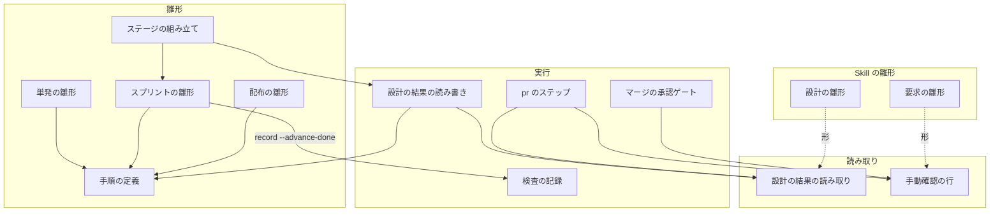
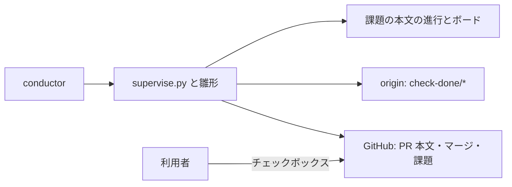
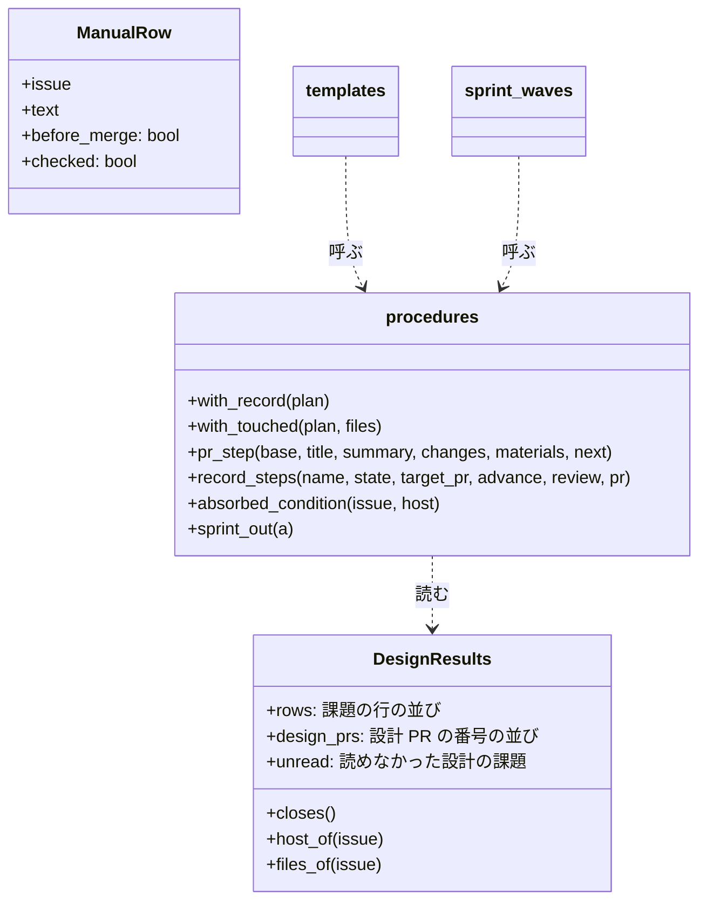
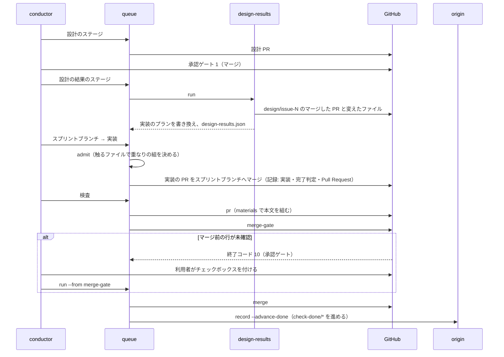
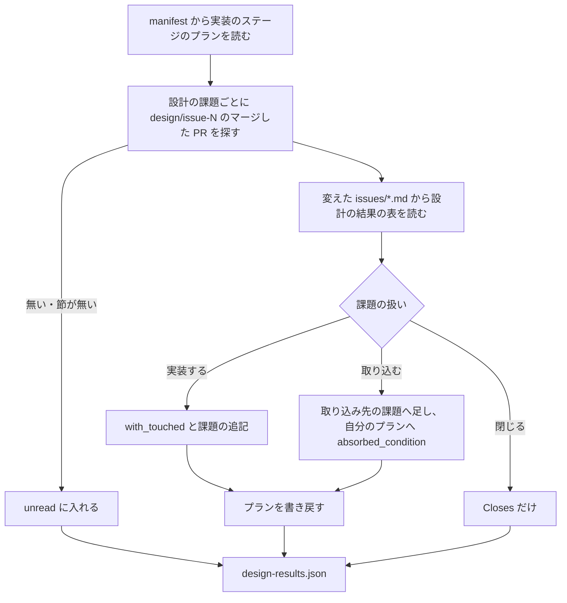

# #1485: スプリントの雛形が単発の雛形と同じ手順の定義でプランを組む

要求と受け入れ条件は #1485 の本文にある（コピーは `issues/issue-1485-requirements.md`）。この文書は「どう作るか」だけを扱う。

## 例: スプリント m17 で #1485 と #1597 を流す

`supervise.py new sprint --name m17 --issue 1485 1597 --design 1485` を打ったとき、変更の後に何が起きるかを先に示す。

1. 設計のステージで `design/issue-1485` の設計 PR がマージされる（承認ゲート 1）。設計文書の「設計の結果」の表には、#1485 を実装し、子 issue の #1298 #1421 #1299 #1272 #1398 を #1485 へ取り込み、#1485 が `plugins/ndf/scripts/supervise_lib/` を触ると書いてある
2. 新しい「設計の結果」のステージが、その表を読んで実装のステージのプランを書き換える。`impl-1485` の `課題` は `[1485, 1298, 1421, 1299, 1272, 1398]` になり、`触るファイル` に `plugins/ndf/scripts/supervise_lib/` が入る
3. 実装のステージで、`impl-1485` と `impl-1597` が流れる。`触るファイル` が重なれば queue が 1 本ずつ流す。どちらのプランも `記録` を持つため、通った工程が 7 件の課題の本文の「進行」へ付く
4. 検査のステージで、スプリント PR の本文に、2 本の実装の PR の「利用者向けの変化」の行・`Closes #1485` から `Closes #1597` までの 7 行・設計 PR の番号・要求の手動確認の行が入る
5. 要求に `手動確認（マージ前）` の行があれば、`merge-gate` のステップがチェックボックスの付いていない行を挙げて承認ゲートで止まる。利用者が PR 本文のチェックボックスを付け、`supervise.py run <検査のプラン> --from merge-gate` で続ける
6. スプリント PR をマージすると、`record` のステップが origin の `check-done/review` と `check-done/check` をマージのコミットへ進める

## ドメインモデル

### コンテキスト

| コンテキスト | 何の語が 1 つの意味に決まるか |
| --- | --- |
| NDF の開発ワークフロー（`ndf-workflow`） | スプリントの雛形・単発の雛形・プラン・ステージ・設計の結果・取り込んだ課題・手動確認の行 |

1 つのコンテキストに収まる。

### 集約

| 集約 | 持ち主（書き換えてよいもの） | 根 | エンティティ | 値オブジェクト |
| --- | --- | --- | --- | --- |
| 設計の結果 | 設計文書を書く `design` の Skill（マージした後は読むだけ） | 設計文書の「設計の結果」の節 | 課題の行 | 扱い（実装する / 取り込む / 閉じる）・取り込み先・触るファイル |
| 実装のプラン | スプリントの雛形の関数。`new sprint` が作り、「設計の結果」のステージが同じ関数を呼んで書き換える | プランのファイル（`sprint-<名前>/<番号>-impl-<課題>.json`） | ステップ | `課題`・`触るファイル`・`記録`・`実行の条件` |
| Pull Request の本文 | `pr` のステップ（チェックボックスの印だけは利用者） | PR 本文 | 手動確認の行 | 利用者向けの変化の行・Closes の行・設計 PR の番号 |
| 検査の位置 | `check-trigger.py record` | origin の `check-done/review` と `check-done/check` | — | コミット |
| 課題の進行 | `projects-sync.sh stage` | 課題の本文の「進行」の節 | — | 工程の印 |

### 不変条件

| # | 集約 | 条件 | 破れたときの扱い |
| --- | --- | --- | --- |
| I1 | 実装のプラン | 実装する課題のプランの `触るファイル` は、設計の結果の「触るファイル」の値と同じ。設計の結果が無い課題のプランは `触るファイル` を持たない | 書き換えを行わず、読めなかった課題として進捗ログに残す |
| I2 | 実装のプラン | 取り込んだ課題のプランは実装のステップを 1 つも流さない。取り込んだ課題は取り込み先のプランの `課題` に入る | 取り込み先がスプリントに無ければ書き換えずに止まる（`design-results` が終了コード 2） |
| I3 | Pull Request の本文 | 手動確認の節に、チェックボックスの付いていない「マージ前」の行がある PR はマージされない | `merge-gate` が終了コード 10 の承認ゲートで止まる |
| I4 | 検査の位置 | `check-done/*` は、検査が成功してスプリント PR をマージしたときだけ進み、戻らない | 落ちた・止まった・マージしなかった検査は進めない。origin が先なら保つ |
| I5 | 実装のプラン | 単発の雛形（`new impl` / `new check --pr` / `new check --since-last`）が書くプランのステップの `id` の列は、変更の前と同じである | テストが落ちる |
| I6 | 実装のプラン | 進捗記録・検査の記録・PR 本文の材料・触るファイル・手動確認の 5 種の手順は、それぞれ 1 か所で定義され、`sprint_waves.py` に同じ手順を組み直す文字列が無い | テストが落ちる |
| I7 | Pull Request の本文 | 「利用者向けの変化」の節には、変化のある実装の PR の行だけが入る | 変化なし・読めなかった PR は「集めた実装の PR」の節へ並べる |

### ドメインイベント

| # | イベント | 発生元 | 受け手 |
| --- | --- | --- | --- |
| E1 | スプリントの計画を書いた | `supervise.py new sprint` | conductor（ステージの command を打つ） |
| E2 | 設計 PR をマージした（承認ゲート 1） | 利用者か MVV 判定 | 「設計の結果」のステージ |
| E3 | 設計の結果を読んだ | 「設計の結果」のステージ（`design-results`） | 実装のステージの queue（`触るファイル` で流し方を決める） |
| E4 | 取り込んだ課題の実装プランを飛ばした | 実装のプランの `実行の条件` | queue（結果「完了」として後続のステージを流す） |
| E5 | 工程を課題の本文へ記録した | プランの `記録` と `RunState.record_stage` | 課題の本文の「進行」とボード |
| E6 | 実装の PR をスプリントブランチへマージした | 実装のプランの `merge` | 検査のプランの `pr`（実装の PR の本文を集める） |
| E7 | スプリント PR を作った | 検査のプランの `pr` | 利用者（手動確認）・`merge-gate` |
| E8 | マージ前の手動確認が済んだと記録した | 利用者（PR 本文のチェックボックス） | `merge-gate` |
| E9 | 検査を終えて `check-done/*` を進めた | 検査のプランの `record` | 次の `check-trigger.py scope` / `eval` |
| E10 | スプリント PR をマージし、Closes の課題を閉じる行が入った | 検査のプランの `merge` | 配布のプラン（`release-steps.py notes`）・まとめのプランの `close` |

### 用語

| 用語 | 意味 | 用語集への反映 |
| --- | --- | --- |
| 設計の結果 | 設計文書の「設計の結果」の節の表。課題ごとに扱い（実装する / 取り込む / 閉じる）・取り込み先・触るファイルを書き、実装のステージの前に機械が読む | 追加（`ndf-workflow`） |
| 手動確認の行 | 要求の検証手段の表で、項目が「手動確認」で始まる行。項目が `手動確認（マージ前）` ならマージ前、それ以外はリリース後テストに確かめる | 意味の変更（テスト戦略の表を読む対象から外し、時期の書き方を決めた） |

## 機能一覧

| # | 機能 | 誰が使うか |
| --- | --- | --- |
| F1 | スプリントで流した課題の本文の「進行」へ、実装以降の工程が記録される | 利用者・conductor |
| F2 | スプリントの検査が終わると、次の差分の検査の範囲がスプリント PR の後から始まる | conductor（`pace: fast` の検査・最終の検査） |
| F3 | スプリント PR の本文に、実装の PR の利用者向けの変化・閉じる課題・設計 PR が集まる | 利用者（承認ゲート 2 の材料）・`release-steps.py notes` |
| F4 | 設計で決めた触るファイルで実装のプランが直列になり、取り込んだ課題の実装プランが流れない | conductor |
| F5 | 要求の手動確認の行が PR 本文に並び、マージ前の行が未確認ならマージの前で止まる | 利用者 |
| F6 | 設計文書に設計の結果を書く形と、要求に手動確認の時期を書く形が雛形にある | `design` / `requirements-design` の Skill の担当 |

## 構成要素

| 要素 | 責務 |
| --- | --- |
| 手順の定義（`supervise_lib/procedures.py`、新設） | 5 種の手順を 1 か所で定義する。`with_record`（`記録` のキー）・`with_touched`（`触るファイル` のキー）・`pr_step`（`pr` のステップと `materials`）・`record_steps`（`record` と `abort` のステップ）・`absorbed_condition`（取り込んだ課題を飛ばす `実行の条件`）・`sprint_out`（スプリントの計画の置き場） |
| 単発の雛形（`templates.py`） | `plan_to_merge` / `plan_check` / `plan_check_since` が手順の定義を呼ぶ。ステップの並びは変えない |
| スプリントの雛形（`sprint_waves.py`） | `plan_sprint_branch` / `plan_sprint_check` が手順の定義を呼ぶ。`plan_design_results` を足す。手順の文字列を持たない |
| ステージの組み立て（`sprint.py`） | 設計の課題があるとき、承認ゲート 1 の直後に「設計の結果」のステージを置く。`close_plan` が `with_record` を呼ぶ |
| 配布の雛形（`release_templates.py`） | `plan_release` が `with_record` を呼ぶ（振る舞いは変えない） |
| 設計の結果の読み書き（`supervise.py design-results`、新設） | マージした設計 PR から設計の結果を読み、実装のステージのプランを書き換え、`design-results.json` を計画の置き場へ書く |
| 設計の結果の読み取り（`lib/design_results.py`、新設） | 設計 PR の変えた `issues/*.md` から「設計の結果」の節の表を読む |
| 手動確認の行（`lib/manual_checks.py`、新設） | 要求から手動確認の行を読む。PR 本文の「手動確認」の節を組む。PR 本文から未確認のマージ前の行を数える |
| `pr` のステップ（`pr.py`） | ステップの `materials` に従い、利用者向けの変化・集めた実装の PR・課題と設計・Closes・手動確認の節を組む |
| マージの承認ゲート（`merged_lib/merge.py` の `merge_gate`） | 承認ゲート 2 の判定の前に、PR 本文の未確認のマージ前の行を見て承認ゲートで止まる |
| 検査の記録（`check-trigger.py record`） | `--target-pr` に `--advance-done` を足すと、マージしたスプリント PR のマージのコミットへ `check-done/*` を進める |
| 設計の雛形（`skills/design/references/design-template.md`） | 「設計の結果」の節の形を持つ |
| 要求の雛形（`skills/requirements-design/references/spec-template.md`） | 検証手段の表の `手動確認（マージ前）` の書き方を持つ |



### システムの文脈



GitHub と origin はこちらが変えられない外部の系である。ボードへの記録は既存の `projects-sync.sh` が担う。

### 配置

配置は変わらない。すべて conductor の手元の `supervise.py queue` のプロセスの中の `run` と `pr` のステップとして動き、LLM を呼ばない。

### 置き場所

```text
plugins/ndf/
├── scripts/
│   ├── supervise.py                     # design-results の副命令を足す
│   ├── check-trigger.py                 # record --advance-done
│   ├── lib/
│   │   ├── design_results.py            # 新設
│   │   └── manual_checks.py             # 新設
│   ├── merged_lib/merge.py              # merge_gate
│   ├── supervise_lib/
│   │   ├── procedures.py                # 新設
│   │   ├── commands.py                  # cmd_design_results
│   │   ├── templates.py
│   │   ├── sprint_waves.py
│   │   ├── sprint.py
│   │   ├── release_templates.py
│   │   └── pr.py
│   └── tests/
└── skills/
    ├── design/references/design-template.md
    └── requirements-design/references/spec-template.md
```

## 構造



`DesignResults` と `ManualRow` は値オブジェクトである。`DesignResults` は `design-results.json` として計画の置き場へ書き、`pr` のステップが読む。

## 入出力の契約

### プランの JSON

| キー / ステップ | 変化 | 互換性 |
| --- | --- | --- |
| `記録` | `with_record` が、単発の実装・修正・検査（`--pr` / `--since-last`）と、スプリントのすべてのプラン（スプリントブランチ・実装・検査・設計の結果・まとめ・配布）へ `projects-sync.sh` の絶対パスを書く | 足すだけ。同じ工程を 2 度記録しても本文は変わらない（要求の前提 5） |
| `触るファイル` | 単発は今と同じ（`--files`）。スプリントは「設計の結果」のステージが書く | 足すだけ |
| `実行の条件` | 取り込んだ課題の実装プランに「設計の結果」のステージが `absorbed_condition` を書く。終了コード 3 で飛ぶ | 既存のキー（`skip_code: 3`） |
| `pr` のステップの `materials` | 新しいキー。下の表 | 無ければ今と同じ本文 |
| ステップの並び | 単発の雛形は変わらない（I5）。スプリントの検査のプランの `collect` → `pr` → 検査のステップの並びも変わらない | — |

`materials` の形:

| キー | 型 | 意味 | 使うプラン |
| --- | --- | --- | --- |
| `manual` | bool（既定 true） | プランの `課題` の要求から手動確認の行を集め、「手動確認」の節を作る | 単発の実装・修正・スプリントの検査（`fast` は実装のプラン） |
| `collect` | 文字列 | このブランチへマージした PR の本文から「利用者向けの変化」を集める | スプリントの検査（スプリントブランチ） |
| `design_results` | パス | `design-results.json`。「課題と設計」と Closes の材料 | スプリントの検査 |
| `closes` | 整数の並び | 必ず Closes の行にする課題（スプリントの課題） | スプリントの検査 |

### PR 本文の節（スプリント PR）

| 節 | 中身 | 無いとき |
| --- | --- | --- |
| `## 利用者向けの変化` | 実装の PR ごとの節の箇条を `- <行>（#<実装の PR>）` で並べる | すべて変化なしなら `- 無し`（`release-steps.py notes` は題名で代える。今の振る舞い） |
| `## 集めた実装の PR` | 実装の PR ごとに `#<番号>: 変化あり / 利用者向けの変化なし / 本文を読めなかった` | 実装の PR が無ければ節を置かない |
| `## 課題と設計` | `- 課題: #…`・`- 設計: #<設計 PR> …`（無ければ `- 設計: 設計なし`）・設計の結果を読めなかった設計の課題 | — |
| `## 閉じる課題` | `Closes #<番号>` を 1 行 1 件。スプリントの課題と設計の結果のすべての行の課題を、重ねずに番号の順で | — |
| `## 手動確認` | `- [ ] #<課題> マージ前: <確かめること>` と `- #<課題> リリース後テストへ回す: <確かめること>` | 手動確認の行が無ければ節を置かない（AC19） |

本文を作り直すとき（`pr` のステップを 2 度通るとき）は、今の PR 本文で `[x]` の付いた行と同じ文の行に `[x]` を引き継ぐ。

### 設計の結果の節（設計文書）

```markdown
## 設計の結果

| 課題 | 扱い | 取り込み先 | 触るファイル |
| --- | --- | --- | --- |
| #1485 | 実装する | — | `plugins/ndf/scripts/supervise_lib/`、`plugins/ndf/skills/design/` |
| #1298 | 取り込む | #1485 | — |
```

- 扱いは `実装する` / `取り込む` / `閉じる`（実装の PR を持たずにスプリント PR で閉じる）の 3 つ
- 表のすべての行の課題が、スプリント PR の Closes の行になる
- 触るファイルはバッククォートで囲んだパスを読点か `,` で区切る。ディレクトリでもよい（queue の重なりの判定は包含で見る）
- 節が無い・表の形が違う設計文書は「読めなかった」として扱う

### 手動確認の時期（要求の検証手段の表）

```markdown
| 項目 | 手段 |
| --- | --- |
| 手動確認（マージ前） | 実機で `/ndf:release` を通し、承認資料の欄が埋まることを見る |
| 手動確認 | 実際のスプリントを 1 本流し、課題の本文の進行を見る |
```

項目が `手動確認（マージ前）` の行だけがマージ前である。`手動確認` と `手動確認（リリース後テスト）` はリリース後テストへ回す。

### コマンド

| 名前 | 入力 | 出力 | 失敗の形 |
| --- | --- | --- | --- |
| `supervise.py design-results` | `--manifest <sprint.json>`・`--base <ベースブランチ>`・`--root <リポジトリ>`・`--design <課題…>` | 結果の JSON。`summary` に読めなかった設計の課題を書く。`design-results.json` を manifest の隣へ書く | 0 = 書いた（読めなかった課題があっても 0）/ 2 = manifest を読めない・取り込み先がスプリントの課題にも設計の結果の実装する行にも無い・2 本の設計の結果が同じ課題に違う扱いを書いた |
| `check-trigger.py record --target-pr N --advance-done` | 今の `record --target-pr` に旗を 1 つ | 今の結果に `pushed` / `unpushed` を足す | `--failed` と同時なら進めない。PR がマージされていなければ進めない |
| `merged-steps.py merge-gate --pr N` | 変わらない | 未確認のマージ前の行があれば、理由にその行を並べて終了コード 10 | 本文を読めなければ今の判定だけを行う |

`--advance-done` は `--pr` / `--review` と同時に渡せない（`--target-pr` と同じ扱い）。

## 処理の流れ

### スプリントのステージ（`normal`。`auto` と `fast` の違いは下の表）



失敗の経路:

| どこで | 何が起きるか |
| --- | --- |
| design-results が設計の結果を読めない | その設計の課題を `unread` に入れ、実装のプランを書き換えない。`summary` が進捗ログの step の行に残る |
| design-results が取り込み先を見つけない | 終了コード 2 で止まる。実装のステージは流れない（queue の後続は前のステージが完了のときだけ流れる） |
| 実装の PR の本文を読めない | 「集めた実装の PR」に「本文を読めなかった」と並べて PR を作る |
| 検査が落ちた・止まった | `abort` が `record --target-pr N --advance-done --failed` を打ち、落ちた行を書く。`check-done/*` は進めない |

### 進め方ごとの違い

| 進め方 | 設計の結果のステージ | 検査の記録 | 手動確認の節を載せる PR |
| --- | --- | --- | --- |
| `normal` | 承認ゲート 1 の直後。自分の command を持つ | スプリント PR のマージで `check-done/*` を進める | スプリント PR |
| `auto` | 承認ゲート 1 の直後。最初のステージの `--then` で続く | 同上 | スプリント PR |
| `fast` | 承認ゲート 1 の直後。実装の queue の先頭で、実装・検査・コードレビュー・開発版・本番はその `--then` で続く | 今と同じ（`plan_check_since` が進める） | 実装の PR |

設計の課題が無いスプリントは、設計の結果のステージを置かない。

### 設計の結果のステージの中



書き戻しは同じ入力に対して同じ内容になる（打ち直しても `課題` を重ねない）。取り込み先のプランの実装の指示文は `impl_prompt` で作り直し、両方の課題の本文を読む指示にする。

## 非機能の実現方式

| 大項目 | 要求の条件 | 実現方式 | 確かめ方 |
| --- | --- | --- | --- |
| 運用・保守性 | 足すステップは LLM を呼ばない（`run` か `pr` のステップ）。スプリント 1 本あたりの LLM の呼び出し回数を増やさない（Mission・Value 4） | 足すのは `run` のステップ 1 つ（設計の結果）だけ。PR 本文の材料は `pr` のステップの中、手動確認は `merge-gate` の中で組む。検査のプランの `pr` は今も `body: template` で LLM を呼ばない | 単体テストで、新しいプランの `work` / `judge` / `drive` のステップの数が変更前と同じことを見る |
| 移行性 | 既に書き出したスプリントの計画（`sprint-<名前>/`）は書き直さない。新しい形は次の `new sprint` から効く | 新しいキーとステージは `new sprint` が書くときだけ入る。`design-results` は自分と同じ manifest のプランだけを書き換える | 変更前の形の計画を `queue` に渡し、今と同じに流れることを単体テストで見る |
| システム環境 | ベースブランチ・テストのコマンド・要求の置き場（`issues/`）は宣言か引数で受け、ai-plugins の形を既定に埋め込まない（Value 5） | ベースブランチは `a.base`（宣言か引数）、テストは宣言から読む。要求の置き場は NDF の規約の定数 1 つ（決定 12） | ベースブランチを `main` にしたスプリントのプランで、`materials` と `design-results` の引数に `main` が入ることを見る |

## 決定の記録

### 決定 1: 設計の結果は設計文書の「設計の結果」の表に書き、マージした設計 PR から辿って読む

設計 PR の本文の「決めたこと」は、設計文書の決定の見出しから `pr-body-decisions.sh` が作る写しである。写しから読むと、正本と写しの 2 か所が同じ事実を持つ。設計文書は承認ゲート 1 でベースブランチへ入るため、実装のステージの時点で `origin/<ベースブランチ>` から読める。設計文書の名前は課題ごとに揃っていない（`issue-1078-pace-fast-design.md` など）ため、`design/issue-N` のマージした PR が変えた `issues/*.md` から節を探す。

根拠: Value 7（MVV 版 2）

### 決定 2: 設計の結果は、承認ゲート 1 の直後の専用のステージで読み、実装のステージのプランのファイルを書き換える

queue はステージを流す直前にプランのファイルを読み直し（`fill_step` → `admit_step`）、`触るファイル` で重なりの組を決める。そのため、実装のステージより前にファイルを書き換えれば、queue を変えずに直列化が効く。queue に設計の結果を読ませる案は、プランを流す汎用の仕組みが設計の文書の形を知ることになる。実装のプランの先頭のステップで読む案は、重なりの組を決めた後になり間に合わない。スプリントブランチのプランへ相乗りする案は、スプリントブランチを持たない `fast` で別の置き場が要り、置き場が 2 つになる。

根拠: Value 4 / Value 5 / Value 6（MVV 版 2）

### 決定 3: 取り込んだ課題の実装プランは、ステージから外さず `実行の条件` で飛ばす

ステージの command と `resume` は `new sprint` の時点で manifest に書かれており、プランを外すと conductor が写すコマンドと食い違う。`実行の条件` で飛んだプランは結果が「完了」になり、後続のステージがそのまま流れる。

根拠: Value 6（MVV 版 2）

### 決定 4: PR 本文の材料は `pr` のステップの中で集め、新しいステップを足さない

材料を作る `run` のステップを `pr` の前に足すと、単発の実装のプランのステップの並びが変わる（AC2）。`pr` のステップは既に本文を機械で組む唯一のハンドラーで、`append` と `decisions` の前例がある。ステップの `materials` が無ければ今と同じ本文になる。

根拠: Value 4 / Value 6（MVV 版 2）

### 決定 5: マージ前の手動確認は `merge-gate` で止め、確認済みは PR 本文のチェックボックスで記録する

`merge-gate` はすべてのマージが通る共通のステップ（`merge_steps`）で、既に終了コード 10 で承認ゲートを返し、`--from merge-gate` で続けられる。ここに入れれば単発とスプリントが同じ定義を使い、ステップも増えない。確認の記録を状態のファイルにすると、利用者がコマンドを打つ必要があり、PR を読むレビューの担当からも見えない。チェックボックスは GitHub の画面で付けられる。`pr` のステップが本文を作り直すときに印を引き継ぐ。

根拠: Value 2 / Value 6（MVV 版 2）

### 決定 6: `fast` では、手動確認の節を実装の PR に載せる

`plan_check_since` の検査の PR は前回の検査からの差分全体を範囲にし、課題の要求と 1 対 1 に対応しない。実装の PR は課題 1 件の変更で、その課題の要求の手動確認の行がそのまま当たる。単発の実装も同じ `plan_to_merge` を通るため、同じ定義になる。

根拠: Value 6（MVV 版 2）

### 決定 7: 利用者向けの変化の無い PR と読めなかった PR は、「利用者向けの変化」の節に入れず「集めた実装の PR」の節に並べる

`release-steps.py notes` は「利用者向けの変化」の節のすべての箇条を CHANGELOG と更新案内へ写す（「無し」だけを除く）。変化なしの PR をこの節に並べると、配布の説明文に「変化なし」の行が載る。

根拠: Value 1 / Value 6（MVV 版 2）

### 決定 8: スプリントの検査は、マージしたスプリント PR のマージのコミットへ `check-done/*` を進める

`normal` / `auto` ではスプリントの変更はスプリント PR 1 本でベースブランチへ入り、その PR にリファクタリングとコードレビューを通している。今の `--target-pr` を進めない扱いは、実装の PR 1 本を検査する `new check --pr` のためのもので、単発の検査は変えない（旗を渡さない）。

根拠: Value 3 / Value 6（MVV 版 2）

### 決定 9: 手動確認の時期は、要求の検証手段の表の項目名で決める

手段の欄は自由な文で、「マージ前に確かめるのは必須ではなく」のような否定も入る。文から時期を読むと誤ってマージを止める。項目名 `手動確認（マージ前）` だけをマージ前とし、それ以外をリリース後テストに回せば、既にある要求はどれもマージを止めない（AC18・AC19）。テスト戦略の行は確認の一覧ではなく方針の文のため、読む対象から外す。

根拠: Value 2 / Value 8（MVV 版 2）

### 決定 10: 単発の雛形のプランにも `記録` を持たせる

要求の前提 1 のとおり、進捗記録を共有の定義にすると単発の雛形も同じ定義を使う。conductor が工程ごとに打つ `projects-sync.sh` と重なっても、同じ工程に 2 度目の印は付かない（前提 5）。conductor の手当てを減らす方向にしか働かない。

根拠: Value 4（MVV 版 2）

### 決定 11: 要求の置き場は NDF の規約の定数 1 つにし、宣言にしない

`issues/issue-<番号>-requirements.md` は `requirements-design` の手順 7 がすべてのプロジェクトで同じ場所に置く写しで、プロジェクトごとに違うものではない。`plan_sprint_design` の `spec-copy.py check` が既に同じパスを使っており、`procedures.py` の定数 1 つへ寄せて両方が使う。

根拠: Value 5 / Value 6（MVV 版 2）

## テスト設計

| 受け入れ条件・不変条件 | どの振る舞いで縛るか | どう壊したら落ちるべきか |
| --- | --- | --- |
| AC1・I6 | `sprint_waves.py` の中に `"記録"`・`check-done`・`Closes` の文字列が無い。5 種の手順は `procedures.py` の関数を通る | `sprint_waves.py` に `plan["記録"] = …` を直書きすると落ちる |
| AC2・I5 | `new impl` / `new check --pr` / `new check --since-last` のプランのステップの `id` の列が、変更前の列と一致する | `pr` の前に材料のステップを足すと落ちる |
| AC3 | `new sprint` の `normal` / `auto` / `fast` で、スプリントブランチ・実装・検査のプランが `記録` に `projects-sync.sh` の絶対パスを持つ | `fast` の実装のプランから `with_record` を外すと落ちる |
| AC4 | `記録` を持つプランを流すと、偽の記録のスクリプトが課題ごと・工程ごとに 1 回ずつ呼ばれる（工程名は工程表の名前） | 同じ工程を 2 度呼ぶように壊すと落ちる |
| AC5・I4 | bare リポジトリを origin にし、`record --target-pr N --advance-done` がマージのコミットへ `check-done/review` と `check-done/check` を送る | `--advance-done` を読み捨てると落ちる |
| AC6 | AC5 の後の `check-trigger.py scope` の範囲に、スプリント PR のコミットが入らない | 送る先をスプリントブランチの先頭にすると落ちる |
| AC7・I4 | `--failed` と `--advance-done` を渡すと `check-done/*` が動かず、落ちた行が書かれる。マージされていない PR でも動かない | `--failed` でも送るように壊すと落ちる |
| AC8・I7 | 偽の実装の PR 2 本（変化あり）の本文から、スプリント PR の「利用者向けの変化」に PR の番号を添えた箇条が並ぶ。固定の文だけにならない | `changes` の固定の文を残すと落ちる |
| AC9・I7 | 変化が「無し」・節が無い PR は「集めた実装の PR」に「利用者向けの変化なし」、本文を読めない PR は「本文を読めなかった」として並び、「利用者向けの変化」に空の行が入らない | 変化なしの PR を「利用者向けの変化」に入れると落ちる |
| AC10 | スプリントの課題と設計の結果のすべての行の課題が、`Closes #N` の行で 1 件ずつ入る | `関連:` の 1 行に戻すと落ちる |
| AC11 | `design-results.json` の設計 PR の番号が「課題と設計」に載る。設計の課題が無ければ「設計なし」 | 設計 PR の番号を落とすと落ちる |
| AC12 | AC8 の本文を持つ PR を `release-steps.py notes` に渡すと、説明文に実装の PR の箇条が載る | 「利用者向けの変化」の見出しを変えると落ちる |
| AC13・I1 | `design-results` が、実装する課題のプランの `触るファイル` に設計の結果の値を書く。重なる 2 本を `queue --max 3` で流すと 1 本ずつ流れる | `触るファイル` を書かないと同時に流れて落ちる |
| AC14・I2 | 取り込んだ課題のプランが `実行の条件` で飛び、取り込み先のプランの `課題` に入り、実装の指示文が両方の課題を指す | 取り込んだ課題のプランを書き換えないと実装のステップが流れて落ちる |
| AC15・I1 | 設計の結果の節が無い設計文書では、プランを書き換えず、進捗ログの step の行に読めなかった課題の番号が載る | 読めなかったときに止まるように壊すと落ちる |
| AC16 | 要求に `手動確認（マージ前）` と `手動確認` の行があると、PR 本文の「手動確認」に課題の番号・確かめること・時期が並ぶ。`fast` では実装の PR に載る | 時期の列を落とすと落ちる |
| AC17・I3 | 未確認のマージ前の行があると `merge-gate` が終了コード 10 で止まり、理由に行を挙げる。`[x]` を付けた本文では 0 に進む | チェックボックスを見ずに通すと落ちる |
| AC18 | `手動確認` / `手動確認（リリース後テスト）` の行は「リリース後テストへ回す」と書かれ、`merge-gate` は止めない | 時期の無い行をマージ前と読むと落ちる |
| AC19 | 手動確認の行が無い要求では「手動確認」の節を置かず、`merge-gate` も止めない | 空の節を置くと落ちる |
| 決定 5（印の引き継ぎ） | 本文を作り直しても、`[x]` の行は `[x]` のまま残る | 作り直しで印を消すと落ちる |
| 非機能（運用・保守性） | スプリントのプランの `work` / `judge` / `drive` のステップの数が変更前と同じ | `pr` のステップの `body` を `llm` にすると落ちる |

## 設計の結果

| 課題 | 扱い | 取り込み先 | 触るファイル |
| --- | --- | --- | --- |
| #1485 | 実装する | — | `plugins/ndf/scripts/supervise_lib/`、`plugins/ndf/scripts/lib/design_results.py`、`plugins/ndf/scripts/lib/manual_checks.py`、`plugins/ndf/scripts/merged_lib/merge.py`、`plugins/ndf/scripts/check-trigger.py`、`plugins/ndf/scripts/supervise.py`、`plugins/ndf/scripts/tests/`、`plugins/ndf/skills/design/references/design-template.md`、`plugins/ndf/skills/requirements-design/references/spec-template.md` |
| #1298 | 取り込む | #1485 | — |
| #1421 | 取り込む | #1485 | — |
| #1299 | 取り込む | #1485 | — |
| #1272 | 取り込む | #1485 | — |
| #1398 | 取り込む | #1485 | — |

## 未確認のまま残ること

| 項目 | 内容 |
| --- | --- |
| AC4 の工程名 | 要求の AC4 は用語集の語（リファクタリング・コードレビュー）で工程を書く。工程表（`projects-common.sh` の `PJ_STAGES`）とプランのステップの `stage` は改名の前の値のままで、記録はその値で付く。工程表の値を用語集の語へ揃えるかはこの課題の範囲の外で、テストは工程表の値で見る |
| スプリントの外のマージ | スプリントの間にベースブランチへスプリントの外の PR が入ると、決定 8 でその変更も検査済みの範囲に入る。`normal` / `auto` でスプリントの外からベースブランチへ入れる運用があるかは、リリース後テストで実際のスプリントを流して確かめる |
| Closes がベースブランチで閉じるか | ベースブランチが既定ブランチでないとき（ai-plugins の `develop`）、GitHub は `Closes` で課題を閉じない。課題を閉じるのは今と同じくまとめのプランの `close` と利用者である。本文の `Closes` は閉じる対象の宣言として使う |
| 複数の設計 PR が同じ課題を書く | 2 本の設計の結果が同じ課題に違う扱いを書いたときの優先の規則は決めていない。`design-results` は終了コード 2 で止め、人へ戻す |
| 実機での確認 | 実際のスプリントを 1 本このプランで流し、課題の本文の進行・スプリント PR の本文・`check-done/*` の位置を見る（要求の検証手段の手動確認。リリース後テスト） |
