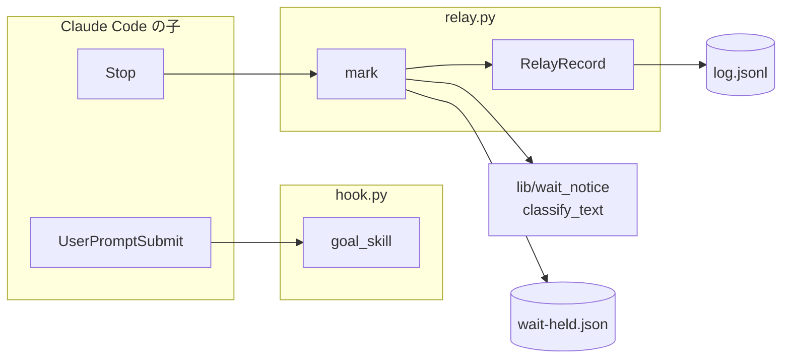
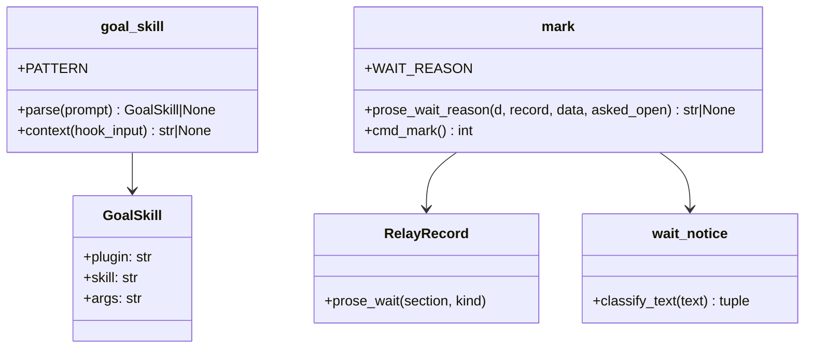
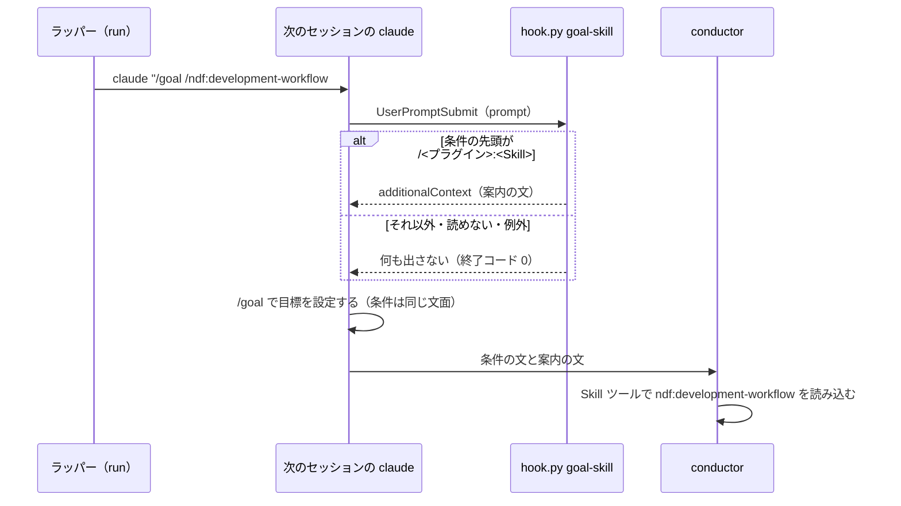
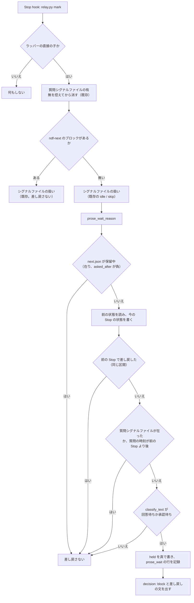
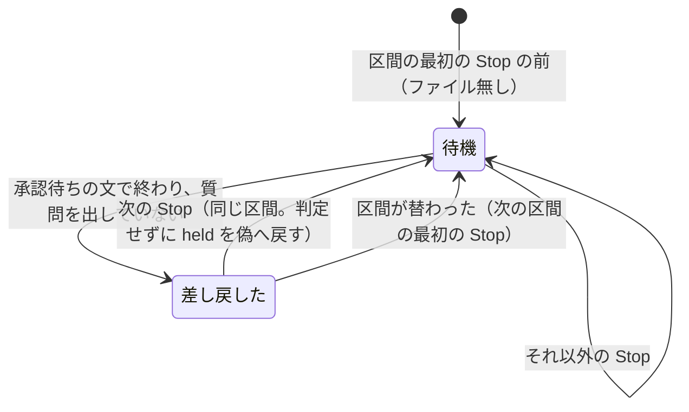

# relay: 切り替えた次のセッションが `/goal` の条件の Skill を読まずに進み、承認ゲートを本文で待って承認のないまま先へ進む → 次のセッションは最初に条件の Skill を読み込み、本文で待って終えた応答は 1 度止めて AskUserQuestion で出し直させる（#1492）

## 目的

- **何が壊れているか**: `/goal /ndf:development-workflow #<番号>` で始めた会話をラッパーが切り替えると、次のセッションの最初の入力は `/goal <条件>` だけで、条件に書いた Skill は読み込まれない。Skill を読まない conductor は承認ゲートで `AskUserQuestion` を出さず、本文で承認を待って応答を終え、目標の判定が応答を続けさせる
- **誰が困るか**: ラッパーの下で `/goal` を使って工程を回す利用者。承認ゲートを越えて先へ進まれ、メモリでの回避が要る
- **直すと何が成り立つか**: どの切り替えの経路でも、次のセッションは作業の最初に条件の Skill を読み込む。読まずに本文で待って終えても、その応答で 1 度止まり、`AskUserQuestion` で出し直すよう伝わる

## 適用範囲

- **働く範囲**: 配布先のリポジトリでも働く。条件の Skill の案内は Claude Code のすべての会話（ラッパーの外を含む）で、承認待ちの文の差し戻しはラッパーの直接の子の会話だけで働く
- **プロジェクトごとに違うもの**: 無し（条件の Skill の名前は `/goal` の入力が持ち、判定の語は待ち通知の定数が持つ。プロジェクトの設定を読まない）
- **当たるモード**: `standard`（hook の追加と、Stop hook の振る舞いの変更）

## あるべき姿の根拠

| 根拠 | 種類 | 何を示すか |
| --- | --- | --- |
| Claude Code 2.1.295 の `claude -p` で `/goal 「ok」と1語だけ答えたら達成` を打つと、`UserPromptSubmit` hook は `prompt` に `/goal …` の文字列そのものを受け、会話の記録では `/goal` がコマンドとして展開されて条件の文が本文として渡り、条件の中の Skill は展開されない | 実測 | 条件の Skill は Claude Code 本体では読み込まれない。`/goal` の入力でも `UserPromptSubmit` hook は働く |
| 同じ版で `UserPromptSubmit` hook が `additionalContext`（条件の Skill を Skill ツールで読み込む案内）を返すと、`/goal` は設定され（`Goal set: …`）、続く応答が Skill ツールを呼んだ | 実測 | 1 つの入力で、目標の設定と Skill の読み込みの案内を両立できる |
| 同じ版で、3 回の応答を要する目標の会話の Stop hook の入力は、1 回目が `stop_hook_active: false`、目標の判定が止めを拒んだ後の 2 回目・3 回目が `true` だった | 実測 | `/goal` の会話では `stop_hook_active` で「差し戻した直後の続き」を見分けられない |
| `approval-request.md` の「止まる手段」: 止まる手段は `AskUserQuestion` に限る。`/goal` の判定はターンの終わりに走るため、本文で承認を待って終えると承認のないまま先へ進む | 既存の規約 | 本文で待って終えた応答を止めて `AskUserQuestion` へ戻すことが規約どおりの形である |
| 利用者のメモリ「再開したら goal の Skill を読み込む」（#1322 の場面で読まずに承認ゲートの `AskUserQuestion` を落とした） | 利用者の指示の原文 | 今は人の記憶で回避しており、仕組みで置き換える |

要求と受け入れ条件は #1492 の本文にある（コピーは `issues/issue-1492-requirements.md`）。この文書は「どう作るか」だけを扱う。

## ドメインモデル

### コンテキスト

| コンテキスト | 何の語が 1 つの意味に決まるか |
| --- | --- |
| ラッパー（`ndf-relay`） | 条件の Skill・承認待ちの文・承認待ちの差し戻し・区間・シグナルファイル |
| 待ち通知（`ndf-notification`） | 回答待ち・承認待ち（本文の待ちの判定の結果） |

**待ち通知とラッパーは共有カーネルの関係にする。** 本文の待ちの判定（`lib/wait_notice.py` の `classify_text` と判定の語の定数）を 2 つのコンテキストが共有し、同じチームが一緒に変える。ラッパーは判定の結果のうち「待ちでない」以外（回答待ち・承認待ち）を「承認待ちの文」として受ける。判定の語を変えると、Slack の待ち通知と承認待ちの差し戻しの両方が変わる。

### 集約

| 集約 | 持ち主（書き換えてよいもの） | 根 | エンティティ | 値オブジェクト |
| --- | --- | --- | --- | --- |
| 差し戻しの状態 | `relay_lib/mark.py`（Stop hook の `mark`） | ラッパーの作業ディレクトリの `wait-held.json` | — | 区間の番号・Stop の時刻・差し戻したか |
| ラッパーの記録 | `relay_lib/record.py` の `RelayRecord`（既存） | `log.jsonl` | 1 行ずつの記録 | `prose_wait` の行（区間・待ちの種類） |
| 目標の入力 | Claude Code（読むだけ。NDF は書き換えない） | `UserPromptSubmit` の `prompt` | — | 条件の Skill の名前・引数 |

**目標の入力は NDF が書き換えない。** 条件の Skill の案内（`hook_lib/goal_skill.py`）は入力を読んで案内の文を返すだけで、状態を持たない。

### 不変条件

| # | 集約 | 条件 | 破れたときの扱い |
| --- | --- | --- | --- |
| I1 | 目標の入力 | 案内を出すのは、入力が `/goal ` で始まり、条件の先頭の語が `/<プラグイン>:<Skill>` の形のときだけ。それ以外の入力では何も出さない | 出力が無いので、入力は今と同じに扱われる |
| I2 | 目標の入力 | 案内は入力を書き換えない。次のセッションの最初の入力と目標の条件は、前のセッションと同じ文面のまま | — |
| I3 | 目標の入力 | 案内の hook は、入力が読めない・例外・Skill が導入されていないときも終了コード 0 で終わり、入力を止めない | 何も出さずに通す |
| I4 | 差し戻しの状態 | 差し戻すのはラッパーの直接の子の Stop だけ。ラッパーの外と `claude -p` の子では状態を読み書きしない | — |
| I5 | 差し戻しの状態 | 差し戻した直後の同じ区間の Stop では差し戻さない（その応答が再び承認待ちの文で終わっても） | — |
| I6 | 差し戻しの状態 | 応答の中で `AskUserQuestion` を出した（質問シグナルファイルが在る、または質問の時刻が前の Stop より後）ときは差し戻さない | — |
| I7 | 差し戻しの状態 | `ndf-next` のブロックを含む応答と、シグナルファイル（`next.json`）が保留中（在り、`asked_after` が偽）の Stop では差し戻さず、シグナルファイルの扱い（書く・書かない・残す・背景の作業での止め）は今と同じ。`/goal` の会話でブロックを出した後に目標が未達で続いた応答はブロックを持たないが、保留中のシグナルファイルで除く | — |
| I8 | ラッパーの記録 | 差し戻すたびに `log.jsonl` へ `prose_wait` の行を 1 行足す。本文と抜粋は書かない | 記録に失敗しても差し戻しの判定は変えない |
| I9 | 差し戻しの状態 | 判定・状態の読み書きが例外になったら差し戻さない（Stop を止めない） | 何も出さずに通す |
| I10 | 差し戻しの状態 | `stop_hook_active` の値で判定を変えない（`/goal` の続きの Stop でも差し戻す） | — |

### ドメインイベント

| # | イベント | 発生元 | 受け手 |
| --- | --- | --- | --- |
| E1 | セッションを終えるシグナルファイルを書いた | Stop hook（`mark`）・StopFailure hook（`limit`）・`/ndf:restart`（既存） | ラッパー（`run`） |
| E2 | 次のセッションの最初の入力を作った | ラッパー（既存。変えない） | ラッパー（`start_section`） |
| E3 | 次のセッションを起動した | ラッパー（既存） | Claude Code |
| E4 | 次のセッションで目標を設定した | Claude Code の `/goal` | 目標の判定 |
| E5 | 次のセッションで条件の Skill を読み込んだ | conductor（`UserPromptSubmit` hook の案内を受けて Skill ツールを呼ぶ） | — （conductor 自身が手順に従う） |
| E6 | conductor が `AskUserQuestion` を呼ばずに承認待ちの文で応答を終えた | conductor | Stop hook（`mark`） |
| E7 | Stop を 1 度止めて `AskUserQuestion` で出し直すよう伝えた | Stop hook（`mark`） | conductor |
| E8 | 止めた事実を記録した | Stop hook（`mark`） | `log.jsonl` を数える人（振り返り） |

### 用語

| 用語 | 意味 | 用語集への反映 |
| --- | --- | --- |
| 条件の Skill | `/goal` の条件の先頭の語が `/<プラグイン>:<Skill>` の形で名指しする Skill（例: `/ndf:development-workflow`） | 追加（`ndf-relay`。要求の段階で足した。意味は変えない） |
| 承認待ちの文 | `AskUserQuestion` を呼ばずに、応答の本文で利用者の承認・判断を待つと書いた文。判定は待ち通知と同じで、回答待ちか承認待ちに当たる文を指す | 意味の変更（`ndf-relay`。判定の出所を足す） |
| 承認待ちの差し戻し | ラッパーの直接の子の応答が承認待ちの文で終わったとき、Stop hook が Stop を 1 度止め、`AskUserQuestion` で出し直すよう伝えること | 追加（`ndf-relay`） |

## 機能一覧

| # | 機能 | 誰が使うか |
| --- | --- | --- |
| F1 | `/goal /<プラグイン>:<Skill> …` で始めたセッションで、作業の最初に条件の Skill を読み込むよう案内する | conductor（ラッパーが起動した次のセッション、人が貼り付けた再開コマンドのセッション） |
| F2 | 承認待ちの文で終えた応答を 1 度止め、`AskUserQuestion` で出し直すよう伝える | ラッパーの下の conductor |
| F3 | 差し戻した回数を `log.jsonl` から数える | 振り返りを書く人 |

## 構成要素

| 要素 | 責務 |
| --- | --- |
| `plugins/ndf/scripts/hook_lib/goal_skill.py`（新規） | `UserPromptSubmit` の入力の `prompt` から条件の Skill と引数を読み、案内の文を返す。入出力を持たない純粋な処理 |
| `plugins/ndf/scripts/hook.py` | 副命令 `goal-skill` を足す。標準入力の JSON を `goal_skill` へ渡し、案内があれば `hookSpecificOutput`（`hookEventName: UserPromptSubmit`・`additionalContext`）を出す。docstring の表に 1 行足す |
| `plugins/ndf/hooks/claude.json` | `UserPromptSubmit` の hook を 1 つ足す（Stop の `hook.py` と同じ、hook の環境の python で `hook.py goal-skill` を打つ。`timeout` 5、`continueOnError`） |
| `plugins/ndf/scripts/relay_lib/mark.py` | `cmd_mark` に承認待ちの差し戻しを足す（`prose_wait_reason`）。ブロックの無い応答で、シグナルファイル（`next.json`）が保留中でないときだけ判定し、差し戻すなら `{"decision": "block", "reason": …}` を出す。差し戻しの文の唯一の定義を持つ |
| `plugins/ndf/scripts/relay_lib/common.py` | 差し戻しの状態のファイル名の定数 `WAIT_HELD_FILE = "wait-held.json"` を足す |
| `plugins/ndf/scripts/relay_lib/record.py` | `RelayRecord.prose_wait(section, kind)` を足す（`log.jsonl` へ `prose_wait` の行を書く唯一の場所） |
| `plugins/ndf/scripts/relay_lib/version_dir.py` | `LIB_FILES` に `lib/wait_notice.py` を足す（複製の `relay_lib/mark.py` が import するため） |
| `plugins/ndf/scripts/relay_lib/__init__.py` | 副命令の表の `mark` の行に、承認待ちの差し戻しを足す |
| `plugins/ndf/scripts/tests/fixtures/relay_fake_claude.py` | 区間の起動の直後に、最後の引数（区間のプロンプト）を `UserPromptSubmit` の形で `hook.py goal-skill` へ渡し、出力を `FAKE_DIR/prompt-<pid>.jsonl` へ書く |
| `plugins/ndf/scripts/tests/test_relay.py` | 3 経路の結合の試験と、差し戻しの試験を足す |
| `plugins/ndf/scripts/tests/test_hook_goal_skill.py`（新規） | 案内の単体の試験 |
| `plugins/ndf/skills/development-workflow/references/relay.md` | 付則「`/goal` を付けた場合」の表に、条件の Skill の読み込みの行を足す。「承認ゲートを越えない守り」の節に承認待ちの差し戻しを足す。「記録の読み方」に `prose_wait` の行を足す |
| `plugins/ndf/skills/development-workflow/references/context-window.md` | 「新しい会話で戻す」の `/goal ` の行に、次のセッションが条件の Skill を読み込むこと（relay.md の付則を指す）を足す |

**変えないもの:** `lib/wait_notice.py`（判定と語の定数をそのまま使う）、`relay_lib/claude.py` の `resume_input` と `relay_lib/switch.py` の `limit_start`（最初の入力は今と同じ）、`ndf-next` の中身の形、`hooks/codex.json`（前提 7）。



図は実行時の呼び出しだけを描く。hook の登録（`hooks/claude.json`）・複製へ写す一覧（`version_dir.py`）・副命令の表（`__init__.py`）・偽の claude・試験・文書は図に含めない。

**配置は変わらない。** どちらも Claude Code の子が hook として起動するプロセスで、ラッパー（`run`）は呼び出しの関係に入らない。ラッパーが作る最初の入力は変えないため、ラッパーの側の図は今のままである。

### 値の集合へ値を足したときに当てはめた規則

| 足す値 | 集合 | 当てはまらない既存の規則 | 扱い |
| --- | --- | --- | --- |
| 副命令 `goal-skill` | `hook.py` の `COMMANDS` | 副命令を省いたときの振り分け（`UserPromptSubmit` は Kiro の worktree の案内へ回る） | 副命令を明示して呼ぶので振り分けを通らない。`_guards` は `command` が `""` か `worktree-guard` のときだけ worktree の案内を打つため、`goal-skill` では打たれない（変えない） |
| 副命令 `goal-skill` | `hook.py` の出力 | `_merge` は複数の案内をまとめるとき `hookEventName` を `PreToolUse` に固定する | `goal-skill` は `_merge` を通さず、自分の出力 1 つを返す |
| 事象 `UserPromptSubmit` | `hooks/claude.json` の事象 | — | 新しい事象の行。既存の行は変えない |
| `lib/wait_notice.py` | 複製へ写す `LIB_FILES` | 複製の `relay_lib/` は `LIB_FILES` にあるものしか import できない | `LIB_FILES` に足す（構成要素の表） |
| `prose_wait` の行 | `log.jsonl` の `event` | — | 既存の行の形は変えない（`record.py` の I11） |

## 構造



- `goal_skill.PATTERN` は `^/goal\s+/([A-Za-z0-9_.-]+):([A-Za-z0-9_.-]+)(?:\s+(.*))?$`（複数行の入力は 1 行目だけを見る。`args` は条件の残りで、2 行目以降を含む）
- `prose_wait_reason` は差し戻すときに差し戻しの文を、差し戻さないときに None を返す。状態ファイルと記録への書き込みはこの関数の中で行う（`cmd_mark` は文を出すだけ）

## 入出力の契約

### `hook.py goal-skill`（`UserPromptSubmit` hook）

| 項目 | 形 |
| --- | --- |
| 入力 | 標準入力の JSON。読むのは `prompt` だけ（Claude Code 2.1.295 の実測で `session_id`・`transcript_path`・`cwd`・`prompt_id`・`permission_mode`・`hook_event_name`・`prompt` を持つ） |
| 出力（案内するとき） | `{"hookSpecificOutput": {"hookEventName": "UserPromptSubmit", "additionalContext": "<案内の文>"}}` を 1 行 |
| 出力（案内しないとき） | 何も出さない |
| 終了コード | 常に 0 |

案内の文（`goal_skill.py` の定数が唯一の定義。`{name}` は `<プラグイン>:<Skill>`、`{args}` は条件の残り）:

```text
ndf: この目標の条件は Skill `{name}` を名指ししている。作業の最初の Tool の呼び出しとして Skill ツールで `{name}` を引数 `{args}` で読み込み、その手順に従う（承認ゲートでは AskUserQuestion で止まる）。Skill が見つからなければ読み込まずに、目標の条件のまま続ける。
```

引数が空のときは「引数 `{args}` で」を省く。

### `relay.py mark`（Stop hook）に足す出力

| 場合 | 標準出力 |
| --- | --- |
| 承認待ちの差し戻しをする | `{"decision": "block", "reason": "<差し戻しの文>"}` を 1 行 |
| それ以外 | 今と同じ（背景の作業での止めの文か、何も出さない） |

差し戻しの文（`mark.py` の定数 `WAIT_REASON` が唯一の定義）:

```text
ndf-relay: この応答は AskUserQuestion を呼ばずに、本文で承認・判断を待って終わった。/goal の判定は本文の待ちでは止まらず、承認のないまま先へ進む。利用者の承認・判断が要るなら、同じ問いを AskUserQuestion で出し直す（判断の材料は本文に書いてよい）。問いでなければ、そのまま作業を続ける。
```

### 作業ディレクトリのファイルと記録

| ファイル | 書き手 | 形 |
| --- | --- | --- |
| `wait-held.json`（新規） | `mark` | `{"section": <区間の番号か null>, "at": "<Stop の時刻 ISO 8601>", "held": <差し戻したか>}`。ラッパーの直接の子の Stop のたびに書き直す |
| `log.jsonl` の `prose_wait` の行（新規） | `RelayRecord.prose_wait` | `{"event": "prose_wait", "at": "<時刻>", "section": <区間の番号か null>, "kind": "承認待ち" か "回答待ち"}`。本文と抜粋は書かない |

数え方（relay.md の「記録の読み方」へ書く）:

```bash
cat ~/.local/state/ndf/relay/*/log.jsonl | jq -c 'select(.event == "prose_wait")'
```

## 処理の流れ

### 条件の Skill の案内（F1）

3 つの経路（カットポイントの `ndf-next`・利用上限での切り替え・`/ndf:restart`）はどれも、次のセッションの最初の入力を `/goal <条件>` のまま作る（今と同じ）。案内は入力を受けた側の hook が足すため、経路ごとの手当ては要らない。人が再開コマンドを貼り付けたラッパーの外のセッションでも同じに働く。



### 承認待ちの差し戻し（F2・F3）



- 「前の Stop」は `wait-held.json` の `at`。ファイルが無い・区間が違うときは、`log.jsonl` の今の区間の `start` の行の `at` を使う
- `prose_wait_reason` の全体を例外で包み、例外なら None を返す（I9）。記録（`log.jsonl`）の書き込みの失敗は捕まえて、差し戻しの文はそのまま出す（I8）
- `stop_hook_active` は読まない（I10）

### 差し戻しの状態の遷移



## 非機能の実現方式

| 大項目 | 実現方式 |
| --- | --- |
| 可用性 | `prose_wait_reason` を例外で包み、失敗は「差し戻さない」へ倒す。差し戻しの判定はシグナルファイルの扱い（`_mark_action` の結果と `next.json` の書き込み）の後に行い、シグナルファイルの扱いの入力も結果も変えない。案内の hook は `hook.py` の `main` の既存の例外の扱い（何も出さずに 0）に乗る |
| 運用・保守性 | 本文の待ちの判定は `lib/wait_notice.py` の `classify_text` だけを使い、判定の語は同じファイルの定数（`WAIT_ENDINGS`・`WAIT_CONTAINS`・`USER_WAIT_CONTAINS`・`APPROVAL_WORDS` ほか）の 1 か所に残る。#1286 は同じ `classify_text` を `ndf-next` を出す応答の本文へ当てればよい |

## 決定の記録

### 決定 1: 3 つの経路を 1 か所で直すため、条件の Skill の読み込みを `UserPromptSubmit` hook の案内で行う

最初の入力を作る経路は 3 つあり、そのうち `/ndf:restart` のラッパーの外では人が貼り付けるため、ラッパーの側で最初の入力を変えても届かない。入力を受けた側の `UserPromptSubmit` hook は、どの経路から来た `/goal` の入力も同じ形で受け、実測で `/goal` の入力にも働き、案内と目標の設定が両立した。最初の入力の文面と `ndf-next` の形を変えないため、既存の引継ぎ文書と互換が崩れない（受け入れ条件 4・5）。

最初の入力を 2 つ（`/goal` と Skill の呼び出し）に分けて端末へ打ち込む形は、ラッパーの中でしか働かず、端末への書き込みの時機を新しく持つため採らない。`SessionStart` hook は最初の入力を受け取らず、ラッパーの記録を読まないと条件が分からないため、ラッパーの外で働かないので採らない。

根拠: Value 6 / Value 5（MVV 版 2）

### 決定 2: ラッパーに依らない誤りを全体で塞ぐため、案内はラッパーの外の会話でも出す

条件の Skill が展開されないのは Claude Code の `/goal` の振る舞いで、ラッパーの有無に依らない。ラッパーの直接の子だけに絞ると、ラッパーを入れていない利用者と人が貼り付けた再開コマンドに同じ誤りが残る。案内は `/goal /<プラグイン>:<Skill>` で始まる入力にだけ出るため、ほかの入力の振る舞いは変わらない。

`relay.py` の副命令として `NDF_RELAY_DIR` のある会話だけで動かす形は、上の理由で採らない。

根拠: Value 6 / Value 5（MVV 版 2）

### 決定 3: 判定を 1 か所に置くため、承認待ちの文の判定に待ち通知の `classify_text` をそのまま使い、回答待ちと承認待ちの両方を差し戻す

待ち通知は既に、応答の最後の 3 行から本文の待ちを判定する語の一覧と処理を持つ。別の語の一覧を作ると、同じ「本文で待って終えた」の判定が 2 か所に分かれる。回答待ちも差し戻すのは、`/goal` の会話では判断を問う本文も承認と同じく止まらず、止まる手段が `AskUserQuestion` に限られるためである（要求の例の「よろしいでしょうか」は語の一覧では回答待ちに当たる）。

承認待ちだけを差し戻す形は、判断を問う本文が先へ進まれる形を残すため採らない。誤検知の害は決定 4 で 1 回分の応答の続きに抑える。

根拠: Value 6（MVV 版 2）

### 決定 4: `/goal` の続きでも働かせるため、差し戻した直後の Stop を `stop_hook_active` ではなく作業ディレクトリの状態で見分ける

実測で、`/goal` の会話は目標の判定が止めを拒んだ後の Stop がすべて `stop_hook_active: true` になる。これで「差し戻した直後」を見分けると、`/goal` の会話の 2 回目以降の応答でまったく差し戻さなくなり、守りたい場面で働かない。`wait-held.json` に前の Stop で差し戻したかを残し、次の Stop で判定せずに戻す。同じ区間の中で後の承認ゲートの本文の待ちは、間に差し戻さない Stop を挟めば再び差し戻せる。

`stop_hook_active` を使う形は上の理由で採らない。応答の本文のハッシュで 1 度だけにする形は、続きの応答が別の文面で待つと 2 度止めるため採らない。既存の背景の作業での止め（`hold_once`）が同じ前提を持つことは範囲外として #1877 に起こした。

根拠: Value 3（MVV 版 2）

### 決定 5: 質問を出した応答を見分けるため、質問シグナルファイルと質問の時刻を前の Stop の時刻と比べる

`AskUserQuestion` の質問は `PreToolUse` の `question open` が `asked` に時刻を残し、表示中は質問シグナルファイルが在る。Stop の時点で質問シグナルファイルが在れば質問を出して取り消した応答、`asked` の時刻が前の Stop より後なら同じ応答の中で質問を出して答えを得た応答である。どちらも会話の記録を読まずに決まり、既存の `asked_after` と同じ材料を使う。

会話の記録の Tool の呼び出しを遡る形は、Stop の時点で応答の最後の行がまだ書かれていないこと（`wait_notify.py` の `read_transcript` の実測）と、応答の始まりの行の形が `/goal` の続きで定まらないことから採らない。

根拠: Value 6（MVV 版 2）

### 決定 6: 切り替えの判定を変えないため、差し戻しは `ndf-next` のブロックを含まず、シグナルファイルが保留中でない応答だけで判定する

`ndf-next` を出した応答の本文の問いの扱いは #1286 の範囲で、そこで差し戻すとシグナルファイルを書いた応答の Stop を止め、切り替えの判定（`mark`）の結果が変わる。`/goal` の会話では、ブロックを出した後も目標が未達のため応答が続き（[relay.md](../plugins/ndf/skills/development-workflow/references/relay.md) の付則）、続いた応答はブロックを持たない。その応答を差し戻すと、conductor が `AskUserQuestion` を出せば `asked_after` が真になり、作業を続けて背景の処理を起こしても、切り替えが取り消される。そこで、シグナルファイル（`next.json`）が保留中（在り、`asked_after` が偽）の Stop も差し戻さない。この 2 つの条件のどちらかに当たる応答を対象から外せば、シグナルファイルの扱いの入力と結果はどの場合も今と同じになる。

根拠: Value 1（MVV 版 2）

## テスト設計

| 受け入れ条件・不変条件 | どの振る舞いで縛るか | どう壊したら落ちるべきか |
| --- | --- | --- |
| 受け入れ条件 1 / I2 | 偽の claude の区間 1 が `ndf-next`（中身 `/goal /ndf:development-workflow #895`）を出して切り替わると、区間 2 の起動の引数の最後が同じ文面で、区間 2 の `goal-skill` の出力に `ndf:development-workflow` を読み込む案内が入る | 案内の対象を `/goal` の無い入力に限るよう壊す・最初の入力を書き換えるよう壊す |
| 受け入れ条件 2 / I2 | 最後の `goal_status` が未達（条件 `/ndf:development-workflow #895`）の会話の記録で上限のシグナルファイルを書くと、区間 2 が `--resume <会話> "/goal /ndf:development-workflow #895"` で起動し、`goal-skill` の出力に同じ案内が入る | `resume_input` が `/goal ` を落とすよう壊す・案内が `--resume` の入力で出ないよう壊す |
| 受け入れ条件 3 | `/ndf:restart` の再開コマンドの形（`/goal /ndf:development-workflow #928 .ndf/handoff/issue-928.md の続きから`）を `goal-skill` に渡すと、`ndf:development-workflow` を引数 `#928 .ndf/handoff/issue-928.md の続きから` で読み込む案内が出る | 条件の残りを引数に含めないよう壊す |
| 受け入れ条件 4 / I2 | 受け入れ条件 1・2 の区間 2 の `log.jsonl` の `start` の行の `command` が前の区間の目標の入力と同じ文面 | 最初の入力に案内を混ぜるよう壊す |
| 受け入れ条件 5 / I1 | `/goal 引継ぎ文書の続きから`・`/ndf:development-workflow #895`（`/goal` なし）・`/goal ndf:x`（先頭の `/` なし）・`/goal /x`（プラグイン名なし）・空の入力で `goal-skill` が何も出さず、区間 2 の起動の引数が今と同じ | パターンの `:` を任意にするよう壊す・条件の途中の Skill 名を拾うよう壊す |
| 受け入れ条件 6 / I3 | `/goal /nosuch:skill #1` で案内（見つからなければ続ける文を含む）が出て、区間が起動する。JSON でない入力・`prompt` の無い入力で終了コード 0・出力なし | 例外を外へ出すよう壊す |
| 受け入れ条件 7 | relay.md の付則の表と context-window.md の `/goal ` の行（文書の変更。文言の試験は書かない。`doc-lint.py` で参照切れを見る） | — |
| 受け入れ条件 8 / I10 | ラッパーの直接の子の Stop で、本文が「設計 PR の承認を待ちます。」で終わり `ndf-next` の無い応答に、`decision: block` と差し戻しの文が出る。`stop_hook_active: true` でも同じ | 判定を `stop_hook_active` で飛ばすよう壊す・`classify_text` の回答待ちを外すよう壊す |
| 受け入れ条件 9 / I5 | 差し戻した直後の Stop の本文が再び承認待ちの文でも何も出ない。その次の Stop の承認待ちの文では再び差し戻す | 状態を書かないよう壊す・held を戻さないよう壊す |
| 受け入れ条件 10 / I4 | ラッパーの外（`NDF_RELAY_DIR` 無し・直接の子でない）では何も出ず、`wait-held.json` を作らない | 直接の子の判定を外すよう壊す |
| 受け入れ条件 10 | 承認待ちの文を含まない応答（「設計文書をコミットした。」）では何も出ない | 待ちでない応答も差し戻すよう壊す |
| 受け入れ条件 10 / I6 | 質問シグナルファイルが在る Stop と、`asked` の時刻が前の Stop より後の Stop では、承認待ちの文でも何も出ない | 質問の確かめを外すよう壊す |
| 受け入れ条件 11 / I8 | 差し戻すと `log.jsonl` に `prose_wait` の行が 1 行足され、`section` と `kind` を持ち、本文を持たない | 行を書かないよう壊す・抜粋を書くよう壊す |
| I7 | `ndf-next` のブロックと承認待ちの文を両方含む応答で、シグナルファイルが今と同じに書かれ、差し戻しの文が出ない。背景の作業が残る `ndf-next` の応答の止めの文が今と同じ | ブロックの有無を見ずに判定するよう壊す |
| I7 | シグナルファイルの保留中（`next.json` が在り、`asked` の時刻がその `written_at` より前）に続いた、ブロックの無い応答が「設計 PR の承認を待ちます。」で終わっても、差し戻しの文が出ず、`next.json` が残る | 保留中の確かめを外すよう壊す |
| I8 | `log.jsonl` に書けない（作業ディレクトリが読み取り専用）とき、差し戻しの文は出る | 記録の失敗で判定を変えるよう壊す |
| I9 | `classify_text` が例外を出すとき、何も出さずに終了コード 0 | 例外を外へ出すよう壊す |
| 受け入れ条件 12 | `uv run --frozen --project . --all-extras pytest . -q -n 4` の終了コード 0 | — |

## 設計の結果

| 課題 | 扱い | 取り込み先 | 触るファイル |
| --- | --- | --- | --- |
| #1492 | 実装する | — | `plugins/ndf/scripts/hook_lib/goal_skill.py`、`plugins/ndf/scripts/hook.py`、`plugins/ndf/hooks/claude.json`、`plugins/ndf/scripts/relay_lib/`、`plugins/ndf/scripts/tests/`、`plugins/ndf/skills/development-workflow/references/relay.md`、`plugins/ndf/skills/development-workflow/references/context-window.md` |

## 未確認のまま残ること

| 項目 | 内容 |
| --- | --- |
| 対話の起動で引数に渡した最初の入力にも `UserPromptSubmit` が働くか | 実測は `claude -p` だけである。ラッパーは擬似端末の対話の claude へ最初の入力を引数で渡す（`--resume` 付きを含む）。実装（`tdd-cycle`）で本物の claude を擬似端末で 1 度起動して確かめ、働かなければ設計へ戻す |
| 案内で読み込みが増える割合 | `claude -p --model haiku` では、案内が無くても条件の Skill を読んだ（2 回中 2 回）。誤りが起きた場面（Opus の対話・長い会話の `--resume`）の再現の割合は測っていない。リリース後テストで、切り替えた次のセッションの会話の記録に Skill の読み込みがあることを確かめる |
| 承認待ちの文の誤検知の割合 | 判定は文面のヒューリスティックである。`log.jsonl` の `prose_wait` の行と、その直後の応答が `AskUserQuestion` を呼んだかを振り返りで数え、誤検知が多ければ語の一覧（`lib/wait_notice.py`）を見直す |
| Slack の待ち通知との重なり | 差し戻した Stop でも待ち通知の Stop hook は承認待ちを送りうる（`stop_hook_active` が偽のとき）。続く `AskUserQuestion` でもう 1 度送る。重なりは 1 回の待ちにつき 1 件で、この課題では抑えない |
| 背景の作業での止めが `/goal` の続きで働かない | 範囲外として #1877 に起こした（決定 4） |
