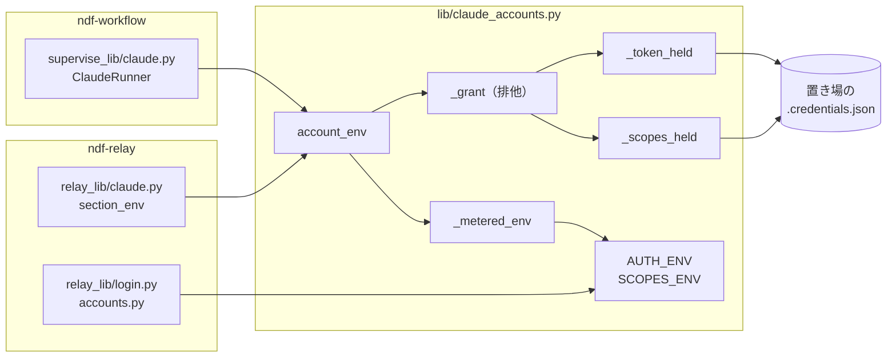
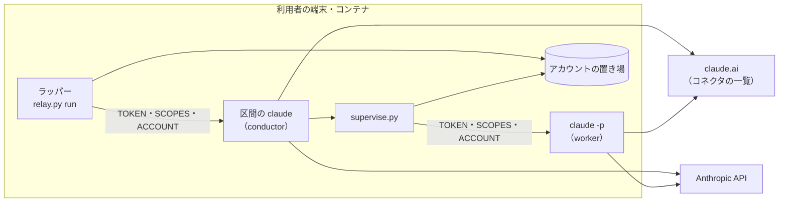
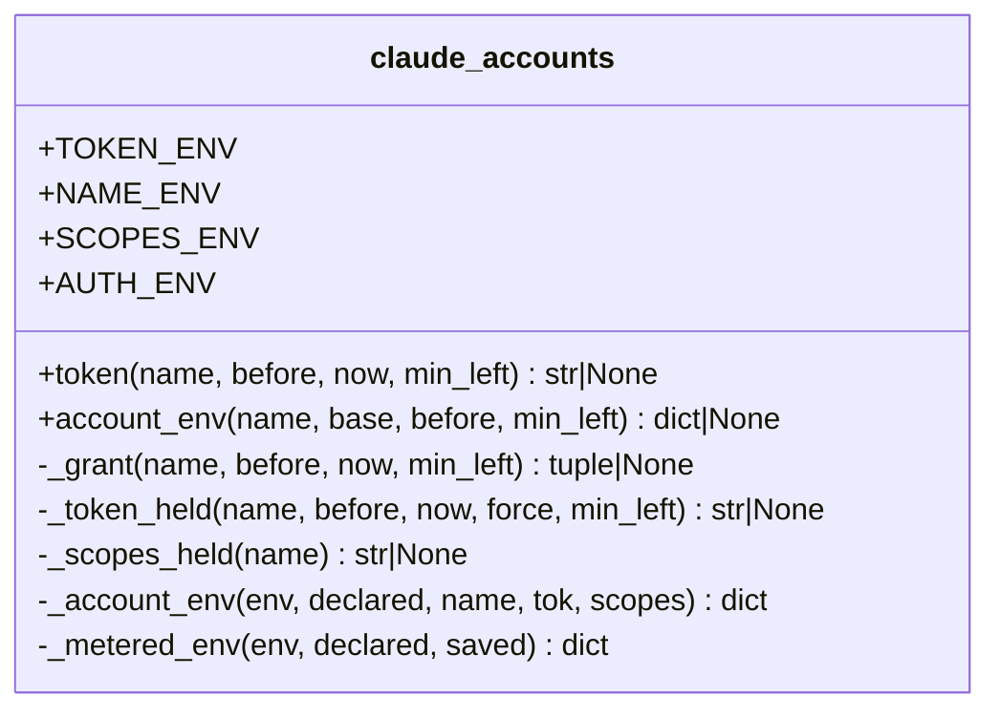
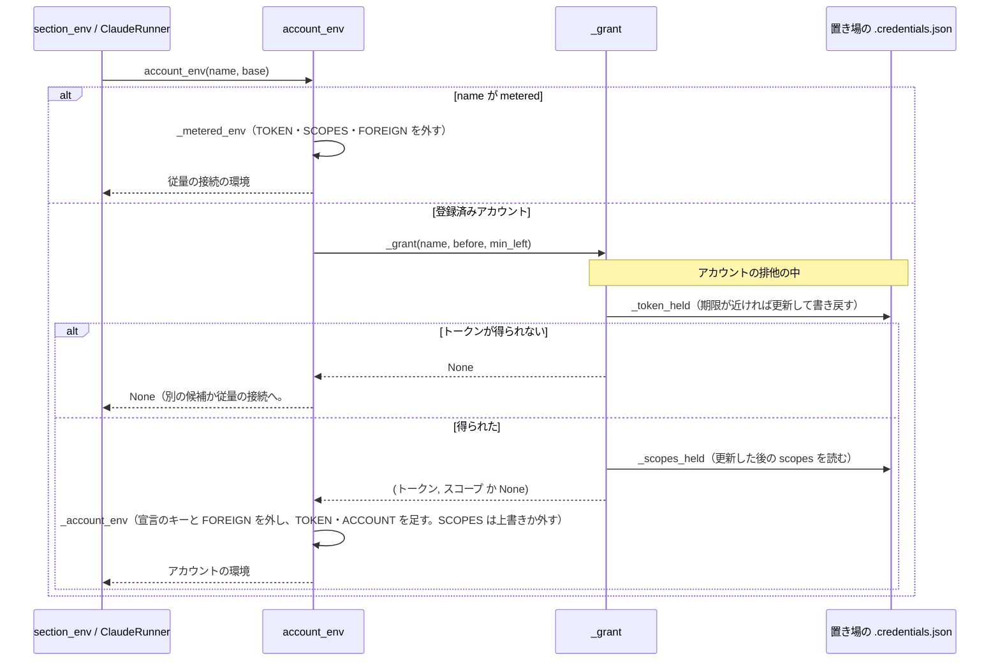

# #1523: 登録済みアカウントの子へ、トークンと一緒にアカウントのスコープを渡す

要求と受け入れ条件は [#1523](https://github.com/devbasex/ai-plugins/issues/1523) の本文にある（コピーは
[issue-1523-requirements.md](issue-1523-requirements.md)）。この文書は「どう作るか」だけを扱う。前提にする
アカウントの切り替えの設計は [issue-1389-design.md](issue-1389-design.md) と
[issue-1389-design-decisions.md](issue-1389-design-decisions.md) にある。

## 例: アカウント nyle-personal の区間で Slack のコネクタが消える

登録済みアカウントが 2 つある利用者が、ラッパー（`relay.py run`）の下で claude を起動する。ラッパーは
`nyle-personal` を選び、子の環境に次の 2 つを足す（今の形）。

| 変数 | 値 |
| --- | --- |
| `CLAUDE_CODE_OAUTH_TOKEN` | `nyle-personal` のアクセストークン |
| `NDF_CLAUDE_ACCOUNT` | `nyle-personal` |

Claude Code 2.1.285 は、変数で受けたトークンのスコープを `CLAUDE_CODE_OAUTH_SCOPES` から読み、無ければ
`user:inference` だけとみなす。claude.ai のコネクタを取りに行く条件は、スコープに `user:mcp_servers` が
あることなので、子の `claude mcp list` に claude.ai のコネクタが 1 件も並ばない。

この変更の後、ラッパーは同じ排他の中で `nyle-personal` の置き場の `.credentials.json` から `scopes` を読み、
3 つ目の変数を足す。

| 変数 | 値 |
| --- | --- |
| `CLAUDE_CODE_OAUTH_SCOPES` | `user:file_upload user:inference user:mcp_servers user:plugins user:profile user:sessions:claude_code` |

同じ組み合わせ（変数のトークン＋置き場の `scopes`）で `claude mcp list` を打つと、claude.ai のコネクタ 5 件が
`✔ Connected` で並ぶことを、要求の工程で実測した（要求の未決 1）。区間の中で起動する `supervise.py` の claude -p も、
同じ関数で環境を組み立てるので同じになる。

## ドメインモデル

### コンテキスト

| コンテキスト | 何の語が 1 つの意味に決まるか |
| --- | --- |
| NDF のラッパー（`ndf-relay`） | 登録済みアカウント・アカウントの置き場・アカウントのスコープ・従量の接続・claude.ai のコネクタ |
| NDF の開発ワークフロー（`ndf-workflow`） | プラン・ステップ・worker の呼び出し |

**`ndf-relay` が供給者、`supervise.py`（`ndf-workflow`）が顧客である（顧客 / 供給者）。** #1389 の関係を変えない。
`supervise.py` はアカウントの置き場を読まず、`lib/claude_accounts.py` の `account_env()` が返す環境をそのまま使う。
スコープの変数もこの環境に入るため、`supervise.py` の側に変更は無い。

### 集約

| 集約 | 持ち主（書き換えてよいもの） | 根 | エンティティ | 値オブジェクト |
| --- | --- | --- | --- | --- |
| 登録済みアカウント（アカウントごと） | `lib/claude_accounts.py` | アカウント（名前） | — | 認証情報（アクセストークン・リフレッシュトークン・2 つの期限・**スコープ**）・識別・残量・上限の観測 |

**この変更は集約に値を足さない。** スコープは今も認証情報（`.credentials.json` の `claudeAiOauth.scopes`）にあり、
`claude auth login` が書き、トークンの更新（`claude_usage.refresh_oauth`）が引き継ぐ。変えるのは、子の環境を組み立てる
ときにこの値を読むことだけである。子の環境は集約の外の出力（毎回組み立て直す値）で、保存しない。

区間のアカウント（`relay_lib/run.py`）とプランのアカウント（`supervise_lib/claude.py`）は #1389 のまま変えない。

### 不変条件

番号はこの文書のもの。#1389 の不変条件は `#1389 I4` の形で指す。

| # | 集約 | 条件 | 破れたときの扱い |
| --- | --- | --- | --- |
| I1 | 登録済みアカウント | 子へ渡すスコープは、渡すトークンと同じ排他の中で、そのアカウントの置き場の `scopes` から読んだものだけである。足さない・広げない・ほかのアカウントや共有の設定ディレクトリから補わない | — |
| I2 | 登録済みアカウント | 登録済みアカウントの子の環境のスコープの変数は、そのアカウントから読んだ値か、無いかのどちらかである。`base`（親の環境）から継いだ値を残さない | — |
| I3 | 登録済みアカウント | 置き場の `scopes` が無い・壊れているときは、スコープの変数を外して子を起動する。起動を止めず、`needs_relogin` にもしない | 今（変更前）と同じ起動になる。コネクタは読まれない |
| I4 | 登録済みアカウント | 従量の接続の子の環境と、専用の設定ディレクトリで起動する claude（登録・一覧）の環境に、スコープの変数を残さない（#1389 I16 を足した変数へ広げる） | — |
| I5 | 登録済みアカウント | 子の環境の `CLAUDE_CONFIG_DIR` と `NDF_ACCOUNTS_DIR` を変えない。共有の `.credentials.json` を読まず、書かない（#1389 I4）。Claude Code の子にアカウントの置き場の `.credentials.json` を読ませず、書かせない | — |
| I6 | 登録済みアカウント | トークンの値を子の引数・画面・`log.jsonl` に出さない（#1389 I1）。スコープの値は秘密ではないが、これも記録に出さない | — |

### ドメインイベント

要求の番号を引き継ぐ。E3 と E4 のほかは #1389 のまま変えない。

| # | イベント | 発生元 | 受け手 |
| --- | --- | --- | --- |
| E1 | 区間か呼び出しのアカウントを選んだ | `claude_accounts.choose`（ラッパー・`supervise.py` が呼ぶ） | `account_env()` |
| E2 | アカウントのトークンを読んだ（期限が近ければ更新した） | `claude_accounts._token_held` | E3（同じ排他の中） |
| E3 | アカウントのスコープを読んだ | `claude_accounts`（E2 と同じ排他の中） | `account_env()` |
| E4 | 子の環境を組み立てた | `account_env()` | ラッパー（`relay_lib/claude.py` の `section_env`）・`supervise_lib/claude.py` の `ClaudeRunner` |
| E5 | 子の claude が起動し、認証の方式を決めた | Claude Code | Claude Code（E6） |
| E6 | 子の claude が claude.ai のコネクタの一覧を取得した | Claude Code | 利用者（`claude mcp list`・MCP のツール） |
| E7 | 区間を切り替え、別のアカウントで `--resume` した | `relay_lib/run.py` の `Relay` | E1〜E6（新しいアカウントで） |
| E8 | 従量の接続へ移った | ラッパー・`ClaudeRunner` | `account_env(METERED, …)`（スコープの変数を外す） |

### 用語

| 用語 | 意味 | 用語集への反映 |
| --- | --- | --- |
| アカウントのスコープ | 登録済みアカウントのトークンに付いた権限の並び。アカウントの置き場の `.credentials.json` の `claudeAiOauth.scopes` で、子へは `CLAUDE_CODE_OAUTH_SCOPES`（空白区切り）で渡す | 追加（`ndf-relay`） |
| claude.ai のコネクタ | 要求の用語のまま | 要求の工程で追加済み（`ndf-relay`） |

## 機能一覧

| # | 機能 | 誰が使うか |
| --- | --- | --- |
| F1 | ラッパーの区間の claude で、選んだアカウントの claude.ai のコネクタを使う | ラッパーの下で作業する利用者・conductor |
| F2 | `supervise.py` が起動する claude -p（worker）で、選んだアカウントの claude.ai のコネクタを使う | supervisor・worker |
| F3 | 利用者向けの文書と説明で、子へ何を渡すかを知る | 利用者・NDF の開発者 |

## 構成要素

| 要素 | 変更 | 責務 |
| --- | --- | --- |
| `lib/claude_accounts.py` の定数 `SCOPES_ENV` | 追加 | スコープの変数の名前（`CLAUDE_CODE_OAUTH_SCOPES`）の正本。`AUTH_ENV` に加える |
| `lib/claude_accounts.py` の `_scopes_held(name)` | 追加 | 排他の中で呼ぶ。置き場の `claudeAiOauth.scopes` を空白区切りの文字列にして返す。形が崩れていれば None（I3） |
| `lib/claude_accounts.py` の `_grant(name, before, min_left)` | 追加 | 1 回の排他の中で `_token_held` と `_scopes_held` を呼び、(トークン, スコープ) を返す。トークンが得られなければ None（I1） |
| `lib/claude_accounts.py` の `token()` | 変更 | `_grant` のトークンだけを返す。呼び出し元（`relay_lib/switch.py`）から見た振る舞いは変えない |
| `lib/claude_accounts.py` の `account_env()` / `_account_env()` | 変更 | `_grant` を呼び、スコープがあれば `SCOPES_ENV` を上書きし、無ければ外す（I2・I3） |
| `lib/claude_accounts.py` の `_metered_env()` | 変更 | 外す変数に `SCOPES_ENV` を加える（I4） |
| `lib/claude_accounts.py` のモジュールの説明 | 変更 | 子へ渡す変数の説明に `CLAUDE_CODE_OAUTH_SCOPES` を足す |
| `supervise_lib/plan.py` の説明 | 変更 | 子へ渡す変数の説明に `CLAUDE_CODE_OAUTH_SCOPES` を足す（受け入れ条件 11） |
| `skills/development-workflow/references/relay.md` | 変更 | 認証の渡し方の段落に、スコープを添えることと、それで claude.ai のコネクタが読まれることを足す（受け入れ条件 11） |
| `issues/issue-1389-design-decisions.md` の決定 1 | 変更 | 決定 1 の末尾に、#1523 でスコープの変数を足したことと、この文書の決定 1 への参照を 1 文足す（要求の対象範囲「決定 1 の見直しの記録」） |
| `docs/glossary/glossary.json` | 変更 | 「アカウントのスコープ」を足し、`glossary.py render` で `docs/glossary.md` を作り直す |

変えないもの: `relay_lib/claude.py` の `section_env`、`supervise_lib/claude.py` の `ClaudeRunner`、`relay_lib/login.py` と
`relay_lib/accounts.py`（`AUTH_ENV` を `claude_accounts` から読むので、定数の追加だけで I4 が効く）、`claude_usage.refresh_oauth`
（更新の応答の `scope` で `scopes` を書き直す今の振る舞いのまま）。

### `AUTH_ENV` に値を足すことで当たる規則

`AUTH_ENV` は「登録済みアカウントの認証で子へ足す変数と、それより優先する変数」の集合である。値を足すと、この集合を
前提にした規則が新しい値にも当たる。配布物を `AUTH_ENV`・`TOKEN_ENV`・`FOREIGN_AUTH_ENV`・`CLAUDE_CODE_OAUTH_TOKEN` で
検索し、`account_env()` の経路を読んで集めた。

| 規則の場所 | 規則 | 新しい値に当てはまるか |
| --- | --- | --- |
| `relay_lib/login.py` の登録の環境 | 専用の設定ディレクトリの claude から `AUTH_ENV` を外す | 当てはまる（変更不要） |
| `relay_lib/accounts.py` | 同じ | 当てはまる（変更不要） |
| `_metered_env()` | `TOKEN_ENV` と `FOREIGN_AUTH_ENV` を外す（`AUTH_ENV` を使っていない） | **当てはまらない。** 構成要素の表へ載せた |
| `_account_env()` | 宣言のキーと `FOREIGN_AUTH_ENV` を外してトークンと名前を足す | **当てはまらない。** 構成要素の表へ載せた |
| `SECRET_ENV`（保存した宣言に入れてはならない変数） | 資格情報の変数を拒む | 当てはまらない。スコープは資格情報ではないため足さない（決定 4） |

### 構成要素図



### システム構成図（文脈と配置）



どこで動くかは変えない。子へ渡す変数が 1 つ増え、子が claude.ai からコネクタの一覧を取りに行く辺が効くようになる。

### パッケージ・モジュール構成

```text
plugins/ndf/
├── scripts/
│   ├── lib/claude_accounts.py        # 変更: SCOPES_ENV・_scopes_held・_grant・account_env・_metered_env
│   ├── supervise_lib/plan.py         # 変更: 説明の 1 か所
│   └── tests/
│       ├── test_claude_accounts.py   # 変更: 環境の組み立てのテスト
│       └── test_relay_account.py     # 変更: 従量の接続・登録の環境のテスト
└── skills/development-workflow/references/relay.md  # 変更: 認証の渡し方
docs/glossary/glossary.json, docs/glossary.md         # 変更: 用語の追加
issues/issue-1389-design-decisions.md                 # 変更: 決定 1 への追記
```

## 構造

触る関数だけを載せる。モジュールの関数を 1 つのクラスとして描く。



`_scopes_held` が「使える」とみなす形は、`scopes` が空でない list で、要素がすべて空白を含まない空でない文字列の
ときだけである。それ以外（キーが無い・list でない・空の list・文字列でない要素・空白を含む要素）は None にする。
空白を含む要素を認めると、空白区切りの変数で 1 つのスコープが 2 つに割れる。並びは置き場のとおりにし、並べ替えも
重複の除去もしない（I1）。

## 処理の流れ



図に現れない構成要素は、`SCOPES_ENV`（図の「SCOPES」）・`token()`（`relay_lib/switch.py` の更新の経路で、環境を組み立てない）・
説明と文書の 4 つ（モジュールの説明・`plan.py`・`relay.md`・#1389 の決定 1）・用語集である。

**スコープはトークンを得た後に読む。** トークンを更新すると、更新の応答の `scope` で `scopes` が書き直される
（`refresh_oauth`）。更新の前に読むと、子へ渡すトークンと合わないスコープを渡すことがある。

**スコープの変数は、必ず上書きか削除のどちらかをする。** `base` は親の環境で、区間の claude の中で動く `supervise.py`
では、区間のアカウントのスコープが入っている。何もしない分岐を置くと、別のアカウントへ切り替えたときに前の
アカウントのスコープが残る（I2・受け入れ条件 4）。

## 非機能の実現方式

| 大項目 | 要求の条件 | 実現方式 | 確かめ方 |
| --- | --- | --- | --- |
| 性能・拡張性 | 子の環境の組み立てに、ネットワークへの要求を足さない（スコープは置き場のファイルから、トークンと同じ排他の中で読む） | `_grant` の中で、`_token_held` が読んだのと同じ `.credentials.json` をもう 1 度読む。宛先を呼ぶのは今のトークンの更新だけ | 偽の取得先（`account_fake.FakeAnthropic`）の呼び出しの回数が、変更の前後で同じ |
| セキュリティ | トークンの値を引数・記録・画面に出さない。共有の `.credentials.json` に触れない。子へ渡すスコープは置き場の `scopes` にあるものだけで、足したり広げたりしない | スコープは環境変数だけで渡し、記録（`log.jsonl`・`account` の行）へ書かない。読むのはアカウントの置き場のファイルだけで、`CLAUDE_CONFIG_DIR` を変えない。値は置き場の list をそのまま空白で結ぶ | 置き場の `scopes` と子の環境の値が一致する。共有の `.credentials.json` に別のスコープを置いても子の値が変わらない。既存のトークンを出さないテストが通る |
| 移行性 | 既に登録済みのアカウントを登録し直さずに効く（置き場の形を変えない） | 今の置き場の `.credentials.json` に既にある `scopes` を読むだけで、書く形を変えない。`scopes` の無い古い置き場は I3 で今のまま動く | 変更前の形の偽の置き場（`account_fake` の既定）で子の環境にスコープが入る |

## 決定の記録

### 決定 1: 子の認証は今のまま変数のトークンで渡し、アカウントの `scopes` を `CLAUDE_CODE_OAUTH_SCOPES` で添える

Claude Code 2.1.285 は、変数のトークンのスコープを `CLAUDE_CODE_OAUTH_SCOPES` から読み、無ければ `user:inference`
だけとみなす。このため、足りないのは認証の方式ではなくスコープの宣言である。変数のトークンにスコープを添えると
claude.ai のコネクタが読まれることを実物のアカウントで確かめた（要求の未決 1）。#1389 の決定 1 の性質（設定・
プラグイン・会話の記録の置き場を分けない・共有の `.credentials.json` に触れない・NDF だけがトークンを更新する）を
1 つも崩さずに済む。

アカウントの置き場を `CLAUDE_CONFIG_DIR` にして渡す形は採らない。#1389 の決定 1 で退けた理由（会話の記録と設定が
置き場へ移り、切り替えた先で `--resume` できない）がそのまま残り、加えて Claude Code 自身が置き場の `.credentials.json`
を更新して NDF の更新と取り合い、子の中の `store_dir()` もずれる（受け入れ条件 7〜9 を満たすための手当てが要る）。
今のまま渡して読まれないことを文書に書く形は、期待する振る舞いを満たさないため採らない。

根拠: Mission / Value 6 / C2（MVV 版 2）

### 決定 2: 置き場の `scopes` をすべてそのまま渡し、`user:mcp_servers` だけに絞らない

目標は「ラッパーを通さずに起動したときと同じ振る舞い」である（要求の前提 1）。ラッパーを通さない起動では、
Claude Code は `.credentials.json` のスコープをすべて使う。`user:inference user:mcp_servers` の 2 つに絞ってもコネクタは
読まれる（未決 1 の実測）が、`user:profile`・`user:plugins`・`user:sessions:claude_code` などに掛かる振る舞いが
ラッパーの下でだけ違うまま残り、同じ種類の不具合が別の機能で起きる。置き場の値はトークンが実際に持つスコープと
一致する（要求の前提 5）ため、全部を渡しても権限は広がらない。

`user:mcp_servers` があるときだけ変数を足す形も採らない。変数の有無がスコープの中身で分岐し、I2 の「上書きか削除」
より規則が 1 つ増える。

根拠: Vision / Value 6（MVV 版 2）

### 決定 3: `scopes` が無い・壊れているときは変数を外して起動し、既定のスコープで補わない

`scopes` を読めないのは、登録が古いか置き場が壊れているときである。変数を外せば Claude Code は `user:inference`
だけとみなし、今（変更前）と同じ起動になる。起動を止めたり `needs_relogin` にしたりすると、コネクタが読まれない
だけの問題で作業が止まる。既定の並び（今の Claude Code の既定のスコープなど）で補うと、トークンが持たないスコープを
宣言しうる。これは非機能の条件「足したり広げたりしない」に反する。

根拠: Value 2 / C2（MVV 版 2）

### 決定 4: `SCOPES_ENV` を `AUTH_ENV` に入れ、`SECRET_ENV` には入れない

`AUTH_ENV` は、専用の設定ディレクトリで起動する claude（登録）から外す変数の正本で、`relay_lib/login.py` と
`relay_lib/accounts.py` がここから読む。入れれば、登録の claude に親の区間のスコープが漏れる経路が定数の追加だけで
塞がる。`SECRET_ENV` は、保存した従量の接続の宣言に入れると拒む資格情報の変数である。スコープは資格情報では
ないため入れない。宣言にスコープの変数があっても、従量の接続では Claude Code がコネクタを読まない（要求の前提 3）。

根拠: Value 6（MVV 版 2）

### 決定 5: トークンとスコープを 1 回の排他で読む関数を足し、`token()` はその上に置く

`account_env()` は、トークンを得た後で置き場のスコープを読む。別の排他で読むと、間に他のプロセスがトークンを
更新し `scopes` を書き直したとき、渡すトークンと合わないスコープを渡しうる。`token()` の戻り値の型を変える形は
採らない。`relay_lib/switch.py` がトークンの更新のためだけに `token()` を呼んでおり、戻り値の型を変えると
関係の無い呼び出し元へ変更が広がる。

根拠: Value 6（MVV 版 2）

## テスト設計

| 受け入れ条件・不変条件 | どの振る舞いで縛るか | どう壊したら落ちるべきか |
| --- | --- | --- |
| 受け入れ条件 1 | 実物のアカウントで、区間の claude の中の `claude mcp list` の claude.ai のコネクタが、置き場を `CLAUDE_CONFIG_DIR` にして変数を外したときと同じ件数だけ `✔ Connected` で並ぶ（要求の検証手段の手動確認。件数が 0 件のアカウントでは確かめたことにしない） | 単体テストにできない（Claude Code 本体の振る舞い）。リリース後の実機確認で行う |
| 受け入れ条件 2 | `section_env(base, 名前)` と `ClaudeRunner` が同じアカウントで組み立てた環境の、`TOKEN`・`SCOPES`・`ACCOUNT`・`FOREIGN_AUTH_ENV`・`CLAUDE_CONFIG_DIR` の値が一致する | どちらか一方の経路だけにスコープを足すと落ちる |
| 受け入れ条件 3 / I1 | 置き場の `scopes` に `user:mcp_servers` を含むアカウントの環境で、`SCOPES_ENV` が置き場の並びを空白で結んだ値に等しく、`user:mcp_servers` を含み、`FOREIGN_AUTH_ENV` が無い。共有の設定ディレクトリの `.credentials.json` に別の `scopes` を置いても値は変わらない | スコープを定数で埋める・並べ替える・共有の側から読むと落ちる |
| I1（排他） | 期限が近いトークンを更新し、更新の応答の `scope` が置き場と違うとき、子の環境のスコープは更新の後の値になる | 更新の前にスコープを読むと落ちる |
| 受け入れ条件 4 / I2 | `SCOPES_ENV` にアカウント A のスコープを持つ `base` から、別の `scopes` を持つアカウント B の環境を組み立てると B の値になる。B の `scopes` が無ければ変数が無い | 変数を上書きしない・無いときに外さないと落ちる |
| 受け入れ条件 5 / I3 | `scopes` が無い・list でない・空・文字列でない要素・空白を含む要素のアカウントで、`account_env()` は None でない環境を返し、`SCOPES_ENV` が無く、`needs_relogin` が偽のまま | 形の崩れで例外を出す・None を返す・再登録が要るにすると落ちる |
| 受け入れ条件 6 / I4 | `SCOPES_ENV` を持つ `base` から従量の接続の環境（環境変数の宣言・保存した宣言の両方）を組み立てると `SCOPES_ENV` が無い。登録の claude の環境（`relay_lib/login.py`）にも無い | `_metered_env` の外す変数から落とす・`AUTH_ENV` に入れないと落ちる |
| 受け入れ条件 7 | #1389 の `--resume` と会話の記録の置き場を見る既存テストが通る | 既存テストのまま |
| 受け入れ条件 8 / I5 | アカウントの環境の `CLAUDE_CONFIG_DIR` と `NDF_ACCOUNTS_DIR` が `base` と同じで、その環境で求めた `store_dir()` が組み立てた側と同じ | 置き場を `CLAUDE_CONFIG_DIR` にすると落ちる |
| 受け入れ条件 9 / I5 | 同じ（Claude Code の子は `CLAUDE_CONFIG_DIR` が置き場を指さない限り置き場の `.credentials.json` を読まず、変数のトークンは `refreshToken` を持たないため子は更新しない）。更新の宛先を呼ぶのが NDF の `_token_held` だけであることは #1389 の既存テストが見る | 置き場を `CLAUDE_CONFIG_DIR` にすると落ちる |
| 受け入れ条件 10 / I6 | #1389 のトークンを引数・画面・`log.jsonl` に出さない既存テストが通る。`account` の行にスコープの値が無い | 記録へ環境を丸ごと書くと落ちる |
| 受け入れ条件 11 | `references/relay.md` と `supervise_lib/plan.py` を読み、子へ渡す変数に `CLAUDE_CODE_OAUTH_SCOPES` があることを確かめる（`.md` の文言を照合するテストは書かない。レビューで見る） | — |
| 受け入れ条件 12 | 全体テスト `uv run --frozen --project . --all-extras pytest . -q -n 4` が通る | — |
| 非機能（性能） | 環境を 1 回組み立てる間の偽の取得先の呼び出しの回数が、スコープを読む前後で増えない | スコープを読むために取得先を呼ぶと落ちる |

## 未確認のまま残ること

| 項目 | 内容 |
| --- | --- |
| 受け入れ条件 1 の実機の確かめ | 実物のアカウントのトークンを使う（C1）ため、単体テストでは確かめられない。リリース後の実機確認で、利用者か利用者が許した conductor が行う |
| Claude Code の将来の版 | 変数のトークンのスコープを `CLAUDE_CODE_OAUTH_SCOPES` から読む振る舞いは本体の内部の実装で、公開の文書に無い（要求の前提 2）。変わったときは受け入れ条件 1 の手順で見つける |
| `user:mcp_servers` 以外のスコープの効き目 | 決定 2 で全部を渡すため、`user:profile`・`user:plugins`・`user:sessions:claude_code` などに掛かる振る舞いもラッパーの下で効くようになる。それぞれの機能が期待どおりに動くかは確かめていない。ラッパーを通さない起動と同じ振る舞いになることが目標なので、差が出たら別の課題にする |
| コネクタで増える読み込み量 | 要求の前提 1 で受け入れている。量は測っていない |
