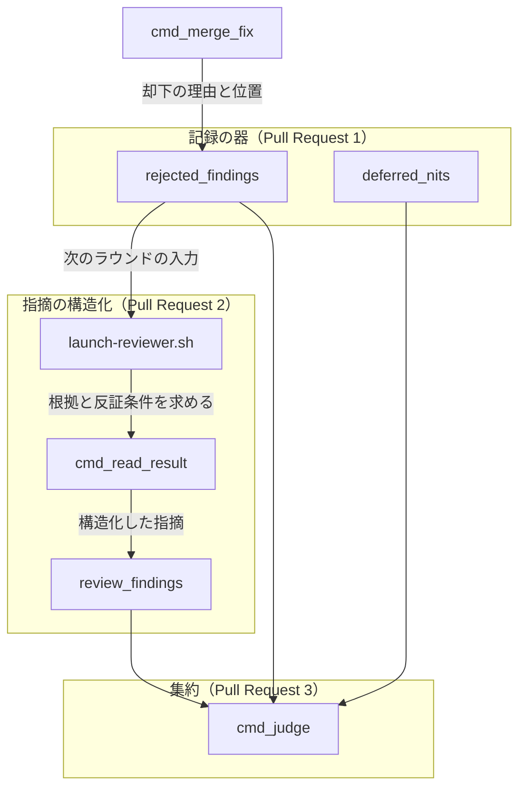
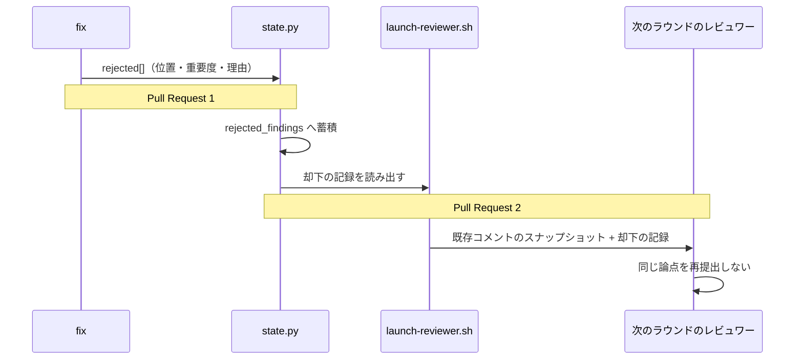
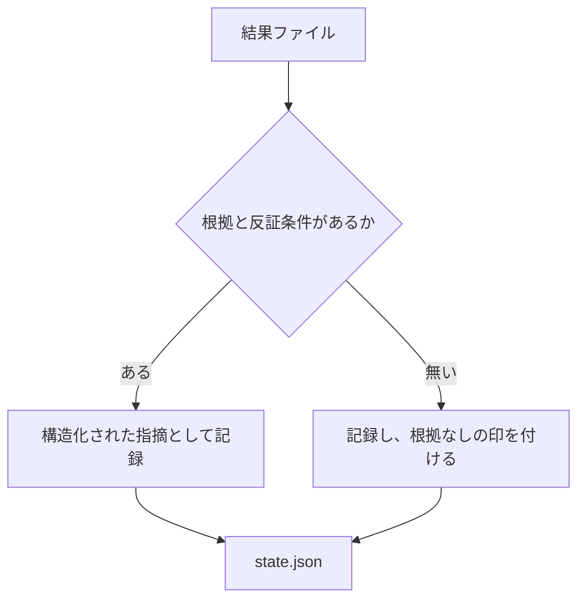

# 156: cross-review を証拠ベースの合議制へ広げる

要求と受け入れ条件は `issues/issue-156-evidence-based-review.md` にある。この文書は
「どう作るか」だけを扱う。

## 機能一覧

| # | 機能 | 誰が使うか |
| --- | --- | --- |
| 1 | 却下した指摘を、位置・重要度・理由とともに残す | 次のラウンドのレビュワー、振り返り |
| 2 | 指摘に根拠と反証条件を持たせる | レビュワー、集約の判定 |
| 3 | 発見を終えるまで他の担当の投稿と結果を見せない | レビュワー |
| 4 | 重複を統合しても、提案した担当をすべて残す | 集約の判定 |
| 5 | 提案者以外が各指摘へ賛否を返す | レビュワー |
| 6 | 実行できる検証を担当の再評価より先に走らせる | 進行側 |
| 7 | 5 つの区分へ分けて出す | 進行側、修正の担当 |
| 8 | 4 つの方式を同じデータから計算する | 効果を測る側 |

## 構成要素

### 分ける単位

**4 本の Pull Request に分ける。** 番号は入る順で、後の番号は前の番号の記録を入力にする。

| 順 | 何を作るか | なぜここで切るか |
| --- | --- | --- |
| 1 | 却下の記録の器 | 提案 2 / 3 / 5 がこの記録を読む。無いと後続が測れない |
| 2 | 指摘の構造化と独立発見 | 器の上に載る。レビュープロンプトと結果の形が変わる |
| 3 | 反証・実行検証・証拠ベース集約 | 収束の判定そのものを変える |
| 4 | 効果の測定 | 3 までの記録が揃ってから計算できる |

**この設計文書が扱うのは 1 と 2 の詳細で、3 と 4 は境界だけを決める。** 収束の判定を
変える設計は、1 と 2 が残す記録の実物を見てから決める。**先に決めると、記録の形が
想像で固まる。**

### 触るもの

| 要素 | 責務 |
| --- | --- |
| `state.py` の `cmd_merge_fix` | 却下した指摘を per-item で残す（件数の int へ潰さない） |
| `state.py` の `rejected_findings`（新設） | 却下の記録を、ラウンドをまたいで読める形で持つ |
| `fix/SKILL.md` の `rejected[]` | 位置・重要度を持つ形へ広げる |
| `scripts/launch-reviewer.sh` | レビュープロンプトの本体。根拠・反証条件・検証手順を求める節、却下の記録を渡す節、発見中の参照先を起動時のスナップショットへ限る節を足す |
| `state.py` の `cmd_read_result` | 構造化された指摘を状態ファイルへ取り込む |
| `state.py` の `review_findings`（新設） | 構造化された指摘を、ラウンドをまたいで読める形で持つ |



**`cmd_read_result` の出力先は `rejected_findings` ではない。** 却下は `fix` が決めるもので、
レビュワーが出した指摘そのものではない。両者を同じ器へ入れると、次のラウンドへ「却下済み」
として渡る対象に、まだ誰も却下していない指摘が混ざる。

## パッケージ・モジュール構成

```text
plugins/ndf/skills/cross-review/
├── SKILL.md                    # 418 行。加筆できるのは 82 行まで
├── docs/
│   ├── 01-state-and-review.md  # 492 行。加筆の余地なし
│   ├── 02-fix-and-rotation.md  # 493 行。加筆の余地なし
│   ├── 03-review-output.md     # 126 行
│   ├── 04-contracts.md         # 133 行。指摘の形の契約はここ
│   ├── 05-pool-and-convergence.md  # 58 行
│   └── 06-evidence.md          # 新設。根拠・反証・集約の規約
└── scripts/
    ├── state.py                # 3176 行
    └── launch-reviewer.sh      # 202 行。レビュープロンプトを組み立てる実体
plugins/ndf/skills/fix/SKILL.md # rejected[] の形
```

**レビュープロンプトは `launch-reviewer.sh` が持つ。** 87 行目の `cat > "$PROMPT" <<EOF` から
始まるヒアドキュメントが本体で、結果ファイルの契約（`result.json` と `payload.json`）も
ここに書かれている。Pull Request 2 の加筆はこのヒアドキュメントへ入る。

**加筆は `docs/04-contracts.md` と新設の `06-evidence.md` へ置く。** `SKILL.md` と
`docs/01` `docs/02` は分割の基準（501 行）に近く、足すと超える。

## 入出力の契約

### 却下の記録（Pull Request 1）

`fix` が返す `rejected[]` の各要素へ、`deferred[]` が既に持つ `path` / `line` / `severity` の
3 つを足す。既存の 3 つと合わせて 6 項目になる。

| 項目 | 変更前 | 変更後 |
| --- | --- | --- |
| `comment_id` | あり | あり |
| `summary` | あり | あり |
| `reason_for_rejection` | あり | あり |
| `path` | **無し** | **必須** |
| `line` | **無し** | **必須** |
| `severity` | **無し** | **必須** |

**位置が無いと、再提出の照合ができない。** #69 では同じ論点が 5 ラウンド続けて出た。
どのファイルのどの箇所かが分からないまま次のラウンドへ渡しても、同じ指摘だと判定できない。

状態ファイルは `deferred_nits` と同じ形で蓄積する。

```json
{"rejected_findings": [
  {"comment_id": 3222849090, "path": "src/foo.py", "line": 42, "severity": "minor",
   "summary": "...", "reason_for_rejection": "...", "pr": 67, "round": 3}
]}
```

**`rounds[].fix.rejected` の件数は残す。** ラウンドごとの集計に使っており、消すと既存の
報告が壊れる。**件数と per-item の両方を持つ**（`deferred` と同じ形である）。

### 指摘の形（Pull Request 2）

**足す先は `payload.json` である。** レビュワーが書き出すファイルは 2 つに分かれており、
指摘を 1 件ずつ持つのは `payload.json` の側だけである（`docs/04-contracts.md:123-130`）。

| ファイル | いまの中身 | この変更 |
| --- | --- | --- |
| `<agent>-review-pr<PR>-result.json` | `event` / `posted_as` / `comments_count` / `review_url` / `by_severity` のサマリ | 変えない |
| `<agent>-review-pr<PR>-round<R>-payload.json` | `{"comments": [{path, line, body, severity}, ...]}` | `comments[]` の各要素へ 4 つ足し、総評だけへ投稿した指摘も載せる |

`comments[]` の各要素へ足すのは次の 4 つである。

| 項目 | 何を書くか | 無いときの扱い |
| --- | --- | --- |
| `evidence` | 根拠。対象のコードと到達経路 | 集約で「根拠なし」として扱う |
| `falsification` | 反証条件。これが成り立てば棄却できる | 同上 |
| `suggested_check` | 実行できる検証手順 | 実行検証の対象から外す |
| `posted_to` | `inline` / `body` のどちらへ投稿したか | `inline` として扱う |

**総評だけへ投稿した指摘も `payload.json` へ載せる。** いまの `payload.json` は投稿した
インラインコメントの写しで（`launch-reviewer.sh:178-179`、`docs/04-contracts.md:130`）、
差分の外を指す指摘は入らない。プロンプトは差分に無い箇所を総評へ書かせ
（`launch-reviewer.sh:147-148`）、`HTTP 422` が返ったインラインも総評へ移させる
（同 149-150）。この 2 つの経路を通った指摘は、`comments[]` へ項目を足すだけでは
`review_findings[]` へ届かない。#156 が実測した「レビュー body だけの指摘が進行側から
見えない」（PR #157 の round 4）はこの経路である。

**インラインの有無と指摘の件数を切り離す。** `comments[]` が持つのは投稿の写しではなく、
**その担当が出した指摘の全件**とする。投稿先は `posted_to` が持つ。`path` / `line` は
総評へ書いたときも埋める。プロンプトが総評でも「ファイル名:行 + 指摘」の形を求めており
（`launch-reviewer.sh:147-148`）、値は担当の手元にある。

**取り込み先は状態ファイルの `review_findings[]`（新設）である。** `deferred_nits` と同じく
蓄積の配列で、要素は `payload.json` の 1 件に `pr` / `round` / `agent` を添えた形になる。

```json
{"review_findings": [
  {"pr": 67, "round": 3, "agent": "agy", "path": "src/foo.py", "line": 42,
   "severity": "major", "body": "...", "evidence": "...", "falsification": "...",
   "suggested_check": "pytest tests/test_foo.py -q", "posted_to": "body",
   "has_evidence": true}
]}
```

**`comments_count` は変えない。** `result.json` の件数は投稿したインラインの数を指し、
`cmd_read_result` が GitHub 側の実数との突き合わせに使う（`state.py:2235`）。指摘の全件を
ここへ入れると、投稿が届いたかの照合が常に食い違う。全件は `payload.json` の側で数える。

**`payload.json` を読むのは `cmd_read_result` にする。** いまは振動の検知（`cmd_judge`）だけが
`payload.json` を開いており（`state.py:2521`）、読んだ内容は状態ファイルへ残らない。
取り込みを結果の読み取りの側へ寄せれば、判定は状態ファイルだけを見ればよくなる。

**`confidence` は求めない。** 自己申告の数値は担当ごとに尺度が違い、突き合わせられない。
根拠と反証条件は文章として読めるため、別の担当が確かめられる。

**互換性**: 4 つを持たない結果ファイルも受け取る。持たない指摘は集約で区別できる形で
記録し、**捨てない**。捨てると、対応していない担当の指摘が消える。

### 独立発見（Pull Request 2）

**結果ファイルは共有していないが、GitHub を経由する流入路が 1 本ある。** レビュワーは
並列にバックグラウンドで起動し（`docs/01-state-and-review.md:154-166`）、互いの結果
ファイルは読まない。一方、起動プロンプトが呼ぶ `pr-review` は投稿の前に
`gh api "repos/<owner>/<repo>/pulls/<PR>/comments" --paginate` で**そのときの**既存コメントを
取りに行く手順を持つ（`pr-review/SKILL.md:277-286`）。同じラウンドで先に投稿した担当の
指摘は、この経路で後続の担当へ入る。**並列に起動することと、渡す入力を一覧で固定する
ことだけでは塞げない。**

**規約を 1 つ足す。** 発見を終えるまで、参照してよい既存コメントは**起動時に渡された
スナップショットに限る**。同じラウンドの他の担当の投稿・結果ファイル・進捗ログは
参照しない。書く先は `launch-reviewer.sh` のプロンプトである。

**`pr-review/SKILL.md` は変えない。** 単独で使うときは、その場の既存コメントを見るのが
正しい。制約が要るのは `cross-review` から呼ぶ経路だけであるため、プロンプトの側で上書き
する。**新しい仕組みは作らない。**

**既存コメントのスナップショットは渡し続ける。** これは前のラウンドの指摘であって、
同じラウンドの他の担当の結果ではない。渡さないと、同じ指摘が毎ラウンド出る。

## 処理の流れ

**図に含めないものが 1 つある。** 効果の測定（Pull Request 4）は、記録を読んで計算する
だけで、収束の流れに関わらない。

### 却下の記録が残り、次のラウンドへ渡る（Pull Request 1 と 2）



**Pull Request 1 が作るのは器と読み出しまでで、プロンプトへ載せるのは Pull Request 2 で
ある。** 受け入れ条件の「却下の記録がラウンドをまたいで読める（次のラウンドの入力になる）」は
読み出せることを求めており、レビュワーへ渡す節を書くのはプロンプトを変える側の責務になる。

**却下の記録を渡す先は、既存コメントのスナップショットと同じ経路である。** 新しい経路を
作らない。

### 指摘の取り込み（Pull Request 2）



## 非機能の実現方式

| 大項目 | 実現方式 | 確かめ方 |
| --- | --- | --- |
| 移行性 | 既存の状態ファイル（`rejected_findings` を持たない）を読める | 旧い形の状態ファイルを読むテスト |
| 保守性 | 加筆は `docs/04` と新設の `06` へ置き、分割の基準を超えない | `check-doc-line-limit.py` |
| 可用性 | 4 つの項目を持たない結果ファイルでも進行を止めない | 欠けた結果ファイルを読むテスト |
| セキュリティ | 実行する検証は、リポジトリが既に持つコマンドに限る | 実行の対象を宣言から取るテスト |
| 性能 | 却下の記録は蓄積するだけで、ラウンドごとの読み込みは 1 回 | 読み込みの回数を数えるテスト |
| システム環境 | 収束の上限と振動の閾値は変えない | 既存テストがそのまま通ること |

## 決定の記録

### 決定 1: 4 本へ分け、記録の器を先に入れる

提案 2 / 3 / 5 はいずれも却下と重複の記録を入力にする。器が無いまま集約を変えると、
判定の材料が揃わないまま形だけが変わる。**先に器を入れれば、次の Pull Request は
実物の記録を見て設計できる。**

1 本にまとめる案は採らない。差分がレビューで読み切れる量を超える。

### 決定 2: 却下の記録は件数と per-item の両方を持つ

`rounds[].fix.rejected` の件数はラウンドごとの報告に使われており、消すと既存の出力が
壊れる。`deferred` が既に件数と `deferred_nits` の両方を持つため、同じ形にする。

件数を per-item の長さから毎回数える案は採らない。件数だけが残る劣化表現（LLM が int を
返す経路）があり、そのとき per-item は空になる。

### 決定 3: 自己申告の確信度は求めない

数値の尺度は担当ごとに違い、突き合わせられない。根拠と反証条件は文章として読めるため、
別の担当が確かめられる。**求めるのは、確かめられる形である。**

### 決定 4: 独立発見は、プロンプトの規約とテストで固定する

結果ファイルを共有しない性質は実装の副産物として成り立っており、**壊れても失敗として
現れない**。加えて `pr-review` が持つ投稿前の既存コメント取得は、同じラウンドで先に投稿した
担当の指摘を流入させる（`pr-review/SKILL.md:277-286`）。新しい仕組みは作らず、プロンプトへ
参照先を限る規約を書き、両方をテストで固定する。

`pr-review/SKILL.md` の手順そのものを変える案は採らない。単独で使うときは、その場の既存
コメントを見るのが正しい。

### 決定 5: 加筆は新しい `docs/` のファイルへ置く

`SKILL.md` は 418 行で、加筆できるのは 82 行までである。`docs/01` と `docs/02` は
492 / 493 行で余地が無い。根拠・反証・集約の規約は 1 つの主題であるため、
`06-evidence.md` として新設する。

## テスト設計

| 受け入れ条件 | 何で確かめるか |
| --- | --- |
| 却下が位置・重要度・理由とともに残る | `cross-review/tests/` の新しいテスト。`cmd_merge_fix` の入出力 |
| 却下の記録がラウンドをまたいで読める | 同上。2 ラウンド分を蓄積して読み出す |
| `deferred_nits` と同じ形で読める | 同上。両者の要素の形を突き合わせる |
| 旧い状態ファイルを読める | 同上。`rejected_findings` を持たない状態ファイル |
| 指摘が根拠と反証条件を持つ | レビュープロンプトの検査と、結果ファイルの取り込みのテスト |
| 4 つを持たない結果ファイルでも進行する | 同上。欠けた結果ファイルを読む |
| 総評だけへ投稿した指摘も取り込まれる | インライン 0 件で `comments[]` に `posted_to: body` の指摘を持つ `payload.json` を読むテスト |
| 担当が他の担当の投稿を参照しない | プロンプトが参照先を限る節を持つことの検査と、起動時に渡すものの一覧を固定するテスト |
| 収束の上限と振動の閾値が変わらない | 既存テストがそのまま通ること |

## 未確認のまま残ること

| 項目 | 内容 |
| --- | --- |
| 集約の判定の形 | Pull Request 3 で決める。1 と 2 が残す記録の実物を見てから設計する |
| 実行検証の対象 | リポジトリが持つコマンドをどう宣言させるかは Pull Request 3 で決める |
| 効果の測定の指標 | Pull Request 4 で決める。比較のための Pull Request 群も未定 |
| 振動の検知への影響 | 誤検出が減ると重複率が下がり、安全弁が発火しにくくなる。**測るのは Pull Request 3 の後** |
