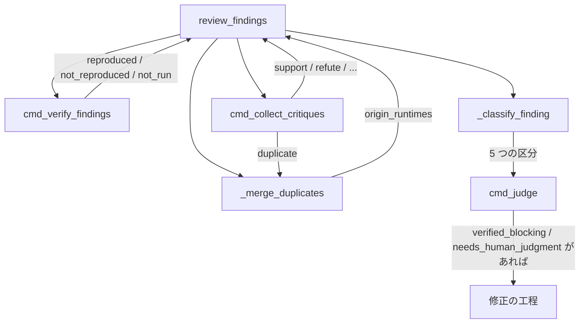
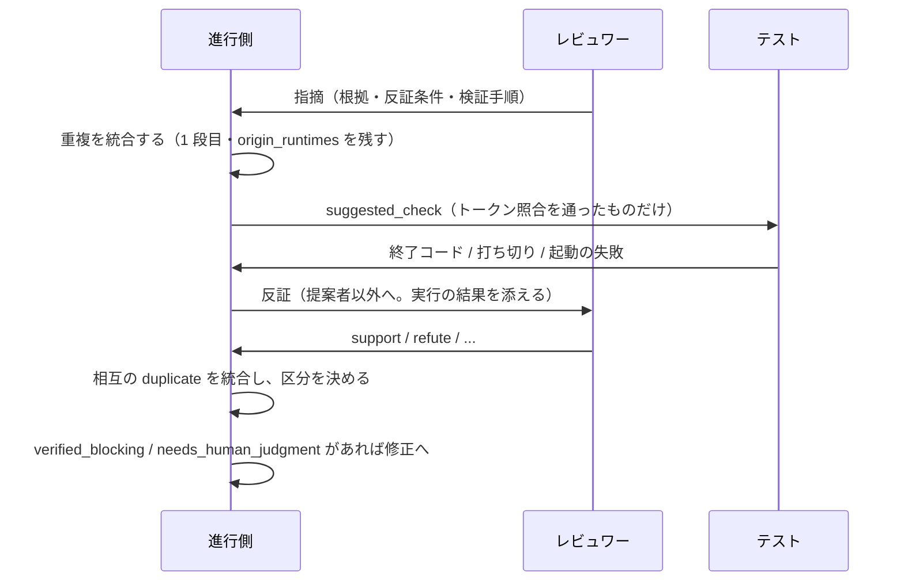

# 156-3: 反証・実行検証・証拠ベース集約

#156 を 4 本へ分けた 3 本目の設計。**全体の設計は `docs/specifications/` へ移す前の
`issues/issue-156-design.md`（Pull Request #531 でマージ済み）にあり、この文書はそこで
「未確認のまま残ること」とした 4 つを決める。**

| #531 で残したもの | この文書で決めること |
| --- | --- |
| 集約の判定の形 | 区分の決め方と、収束の判定への入れ方 |
| 重複の統合と `origin_runtimes` | 何を同一と見なすか、統合の後に何を残すか |
| 実行検証の対象 | 何を実行してよいか、どう宣言させるか |
| 振動の検知への影響 | 母集合が広がった後の測り方 |

## 機能一覧

| # | 機能 | 誰が使うか |
| --- | --- | --- |
| 1 | 重複を統合しても、提案した担当をすべて残す | 集約の判定 |
| 2 | 実行できる検証を、担当の再評価より先に走らせる | 進行側 |
| 3 | 提案者以外が各指摘へ賛否を返す | レビュワー |
| 4 | 指摘を 5 つの区分へ分ける | 進行側、修正の担当 |
| 5 | 収束の判定が、担当の判定ではなく指摘ごとの検証結果を見る | 進行側 |

**並びが処理の順序である。** 実行検証は反証より前に置く。#156 の受け入れ条件が
「実行できる検証手順を持つ指摘は、担当の再評価より先に実行する」と定めており、反証を
返す担当は実行の結果を見たうえで賛否を決められる。

## 構成要素

| 要素 | 責務 |
| --- | --- |
| `state.py` の `_merge_duplicates`（新設） | 同一の指摘を 1 件へ束ね、`origin_runtimes` を残す。機械の 1 段目と申告の 2 段目 |
| `state.py` の `cmd_verify_findings`（新設） | `suggested_check` を実行し、結果を記録する |
| `scripts/critique.sh`（新設） | 反証のプロンプトを組み立て、提案者以外を起動する |
| `state.py` の `cmd_collect_critiques`（新設） | 反証の結果を `review_findings[]` へ結ぶ |
| `state.py` の `_classify_finding`（新設） | 1 件の指摘を 5 つの区分のいずれかへ分ける |
| `state.py` の `cmd_judge` | 区分を読んで収束を決める |
| `docs/06-evidence.md` | 反証の値・区分の決め方・実行の範囲 |



## 入出力の契約

### 指摘の識別子（`finding_id`）

**反証も実行の結果も、指摘 1 件へ結ぶ。** 結ぶ先を指す値が要る。`review_findings[]` の
要素は `pr` / `round` / `agent` を持つが（`state.py:2379-2382`）、同じ担当の同じラウンドの中で
1 件を指す値を持たない。

**`finding_id` を取り込みの時点で採番する。** 形は `<agent>-r<round>-<索引>` で、索引は
その担当の `payload.json` の `comments[]` の並びである。取り込みは
`(pr, round, agent)` の組ごとに入れ替える（`state.py:2372-2376`）ため、再実行しても
同じ指摘へ同じ値が付く。

```json
{"finding_id": "codex-r3-0", "pr": 539, "round": 3, "agent": "codex"}
```

### 重複の統合（`_merge_duplicates`）

**同じ指摘を複数の担当が出したとき、1 件へ束ねる。** 読む値は振動の検知と同じ 3 つ組
（`_finding_keys`、`state.py:2668-2709` の `(ファイル, 行, 正規化した本文)`）である。
**ただし結び方は同じにしない。**

| 判定 | 結び方 | 誤って結んだときに何が起きるか |
| --- | --- | --- |
| 振動の検知（`state.py:2747`） | 位置・近傍（`OSCILLATION_NEAR_LINES` 以内）・本文の**いずれか** | 重複率が 1 件ぶん動く。閾値 0.5 の中で薄まる |
| 統合（この設計） | 近傍**かつ**本文（同じファイル・行差 3 以内・正規化本文が一致） | 代表以外が区分と収束の判定から外れ、**別の修正事項が消える** |

**誤りの代償が違うため、条件を同じにしない。** 近傍だけで結ぶと、`api.py:40` の null
入力と `api.py:42` の認可漏れが 1 件へ束ねられる。**過剰な統合は指摘を失うが、統合し
損ねても失われるものは無い**（両方が区分に載り、`origin_runtimes` が 1 者ずつになる
だけである）。非対称であるため、厳しい側へ倒す。

**本文が一致しない候補は統合しない。** 近傍で当たっただけの組は `duplicate_candidates`
へ両方の `finding_id` を残し、反証で相互に `duplicate` が付いたときに当ラウンドの
2 段目として統合する（後述）。**位置の一致は候補の抽出までである。**

ラウンドをまたぐ一致を見る振動の検知に対し、統合は**同じラウンドの中**で見る。

| キー | 何を持つか |
| --- | --- |
| `origin_runtimes` | その指摘を出した担当の一覧。統合しても消さない |
| `finding_id` | 束ねた先の代表 1 件の値。代表は**先に取り込まれた担当**の指摘とする（`origin_runtimes` の先頭）。**重要度と `verification` は代表の値ではなく組の集約を採る**（後述） |
| `merged_from` | 代表が持つ。束ねられた側の `finding_id` の一覧 |
| `merged_into` | **束ねられた側が持つ。**代表の `finding_id`。代表は持たない |
| `duplicate_candidates` | 近傍で当たったが本文が一致せず、統合しなかった相手の `finding_id` |

```json
{"finding_id": "codex-r3-0", "origin_runtimes": ["codex", "kiro"],
 "merged_from": ["kiro-r3-2"]}
{"finding_id": "kiro-r3-2", "origin_runtimes": ["kiro"], "merged_into": "codex-r3-0"}
```

**束ねられた側は消さない。** `merged_into` へ代表の `finding_id` を書いて残す。消すと、反証の
結果ファイルがその `finding_id` を指したときに結び先を失う。判定が読むのは代表の 1 件である。

**代表は組の集約を持つ。重要度は最も高いもの、実行の結果は `reproduced` > `not_reproduced` >
`not_run` の順で最初に当たった 1 件である**（決定 2 の向き）。取り込みの順序で決めると、
`minor` が代表の組は再現しても `verified_non_blocking` へ落ち、`not_reproduced` と `not_run`
の組は代表が `not_run` になって順 3 を素通りし、順 4 で `needs_human_judgment` へ昇格する。
実行検証は束ねた組の全員の `suggested_check` を対象にし、出所は `verification.finding_id` へ
残す。**この集約は 1 段目にも 2 段目にも掛かる。**

**独立して出したかを区別する。** `origin_runtimes` の長さは「同じ指摘へ到達した担当の
数」であり、反証の `support` の数とは別に数える。支持は他者の指摘を読んだうえでの賛成で、
こちらは読まずに同じ結論へ達したことを表す。

**1 段目の統合は反証より前に行う。** 後にすると、束ねられる 2 件へ別々に反証が付き、
どちらの値を採るかという判断が増える。担当の申告による 2 段目は反証の後に置く（後述）。

### 実行検証（`cmd_verify_findings`）

**実行してよいのは、リポジトリが宣言したコマンドだけである。**

| 宣言 | 何を書くか |
| --- | --- |
| `.ndf/cross-review.json` の `verify_commands` | 実行を許すコマンドの一覧。**トークン列として読む** |

```json
{"version": 1, "verify_commands": ["pytest", "uv run --with pytest pytest"]}
```

**宣言が無ければ実行検証を行わない。** 行わなかったことを記録へ残し、区分は根拠と反証で
決める。**新しい実行系は導入しない。**

#### 照合はトークン単位で行う

**文字列の前方一致では照合しない。** 宣言 `"pytest"` に対し `pytest-danger --evil` が
一致してしまう。宣言と `suggested_check` の両方を `shlex.split` でトークン列にし、
**宣言のトークン列が `suggested_check` のトークン列の先頭と全要素で一致する**ことを求める。

```console
$ python3 -c "import shlex; print(shlex.split('pytest-danger --evil'))"
['pytest-danger', '--evil']
$ python3 -c "import shlex; print(shlex.split('pytest; rm -rf /'))"
['pytest;', 'rm', '-rf', '/']
```

**実測のとおり、区切りのメタ文字はトークンの一部になる。** `pytest; rm -rf /` の先頭
トークンは `pytest;` であり、宣言 `pytest` と一致しない。**メタ文字の一覧を持たない。**
弾く文字を列挙する方式は、列挙から漏れた文字がそのまま通る。

**宣言より後ろのトークンは、`-` で始まらないものだけを許す。** トークン境界だけでは
`pytest -c /tmp/evil.ini` や `pytest -p reviewer_plugin` が通り、レビュワーが書いた
文字列で任意の設定ファイルとプラグインを読み込ませられる。実行してよいのは、対象を絞る
引数（テストの位置指定）までである。

#### 位置指定は作業ツリーの中に限る

**`-` で始まらないことだけでは足りない。** 位置指定は `pytest` が import する対象で
あるため、`pytest ../external/test_payload.py` や `pytest /tmp/evil.py` を通すと、
レビュワーが書いた文字列でリポジトリの外の任意のコードを実行できる。

**後ろの各トークンを実行時の作業ディレクトリから解決し、その配下に収まることを求める。**
作業ディレクトリはその Pull Request の作業ツリーの根である。**解決は
`os.path.realpath` で行う。`os.path.abspath` は symlink をたどらないため使わない。**

```console
$ ln -s ../outside/evil.py repo/link.py     # 作業ツリーの中から外を指す
$ python3 -c "import os; r=os.path.realpath('repo')
print(os.path.realpath('repo/link.py').startswith(r+os.sep))"   # realpath
False
$ python3 -c "import os; r=os.path.realpath('repo')
print(os.path.abspath('repo/link.py').startswith(r+os.sep))"    # abspath は見逃す
True
```

**`::` を含むトークンはファイル名の部分だけを解決する。** `tests/t.py::test_x` は
ファイルとテスト ID を `::` で結ぶ形である。

**実行は `shell=False` で行う。** トークン列をそのまま渡し、シェルを経由させない。
経由させなければ、`$(...)` や `` ` `` を含むトークンは展開されずに引数として渡る。

`review_findings[]` の各要素へ `verification` を足す。

```json
{"verification": {"command": "pytest tests/test_foo.py::test_null_input", "exit_code": 1,
                  "result": "reproduced", "finding_id": "kiro-r3-2", "ran_at": "..."}}
```

| `result` | 決まり方 |
| --- | --- |
| `reproduced` | 実行が終わり、終了コードが**再現の終了コード**に一致した |
| `not_reproduced` | 実行が終わり、終了コードが 0 |
| `not_run` | 宣言が無い / トークン照合に当たらない / 宣言より後ろに `-` で始まるトークンがある / **位置指定が作業ツリーの外を指す** / **位置指定を 1 つも持たない** / **上記のどちらでもない終了コード** / **上限時間で打ち切った** / **起動に失敗した** |

#### 「0 でない」を再現としない

**再現とみなす終了コードを宣言する。** 既定は `[1]` である。0 以外をすべて再現として
扱うと、指摘とは無関係な失敗まで「指摘のとおり壊れている」ことになる。

```json
{"version": 1, "verify_commands": ["pytest"], "reproduced_exit_codes": [1]}
```

pytest の終了コードを実測すると、**バグの再現と、指摘の書き誤りが別の値で分かれる**。

```console
$ uv run --with pytest pytest test_ng.py   >/dev/null 2>&1; echo $?   # テストが失敗
1
$ uv run --with pytest pytest test_missing.py >/dev/null 2>&1; echo $?  # ファイルが無い
4
$ uv run --with pytest pytest test_ok.py::test_absent >/dev/null 2>&1; echo $?  # テスト ID が無い
4
$ uv run --with pytest pytest -k 'nothing_matches' test_ok.py >/dev/null 2>&1; echo $?  # 収集 0 件
5
```

**4 と 5 は、指摘が正しいことの証拠にならない。** レビュワーが書いた `suggested_check` の
対象が存在しないか、引数が誤っているだけである。既定 `[1]` はこれらを `not_run` へ落とす。
**終了コードの意味はランナーごとに違う**ため、値は宣言側が持つ。

**打ち切りと起動の失敗も `reproduced` にしない。** `subprocess.run` は上限時間で
`TimeoutExpired` を、コマンドが無いときは `OSError`（`FileNotFoundError` /
`PermissionError`）を送出するため、**終了コードを読む前に例外で分かれる**。例外で分かれた
経路は `not_run` とし、`reason` へどの理由であったかを残す。

**再現の向きに注意する。** 指摘は「壊れている」という主張であるため、**テストが失敗する
ことが再現である。**

#### 終了コードが答えるのは、書かれた検証手順の成否だけである

**対象を絞らない実行は、指摘と無関係な失敗を拾う。** 実測では、対象のテストが通って
いても同じ範囲に落ちるテストが 1 つあれば 1 を返す。**位置指定を 1 つも持たない値を
`not_run` とするのはこのためである。**

```console
$ uv run --with pytest pytest -q >/dev/null 2>&1; echo $?              # 対象は通るが無関係が落ちる
1
$ uv run --with pytest pytest -q test_target.py >/dev/null 2>&1; echo $?  # 対象だけ
0
```

**それでも「実行した対象が、その指摘を検査しているか」は機械では確かめられない。**
ここは `suggested_check` を**指摘を出した担当自身が書く**ことに支えている。反証条件と
検証手順は指摘の一部であり（`issues/issue-156-design.md`）、自分が「これで分かる」と
宣言した手順が 0 を返したなら、その形では主張が成り立たなかったことになる。**他者が
書いた手順で棄却される経路は無い。** 実行した値は `verification.command` へ残し、
`rejection_reason` から読めるようにする。

### 反証（`cmd_collect_critiques`）

**提案者以外の担当が、各指摘へ 1 つの値を返す。**

| 値 | 意味 |
| --- | --- |
| `support` | 根拠を独立に確認できた |
| `refute` | 反例・仕様・コードから誤りを示せる |
| `insufficient_evidence` | 可能性はあるが立証できない |
| `duplicate` | 別の指摘と同一。相手の `finding_id` を `duplicate_of` へ書く |
| `out_of_scope` | この Pull Request の範囲・目的から外れる |

**結果は担当ごとに 1 ファイルへ書く。** 名前は
`<agent>-critique-pr<PR>-round<ラウンド>.json` とする。既存の
`<agent>-review-pr<PR>-round<ラウンド>-payload.json`（`state.py:881-882`）と同じ位置
（`_resolve_tmp_dir(pr)`）に置き、同じ組み立て方に揃える。

```json
{"critiques": [
  {"finding_id": "codex-r3-0", "verdict": "refute",
   "reason": "handle() は呼び出し前に None を弾く（api.py:70）"}
]}
```

`cmd_collect_critiques` は `finding_id` で突き合わせ、`review_findings[]` の該当要素へ
`critiques` を足す。積むときに `agent` を添えるが、**その値はファイル名から採る**。本文の
申告を採ると、別の担当を名乗った値をそのまま数えることになる。

**`finding_id` が既知でない要素は捨てず、`unmatched_critiques` へ残す。** 黙って捨てると、
反証が 0 件のラウンドと、結び先を誤ったラウンドが同じに見える。

**自分の指摘へは返さない。** 自己支持を数に入れると、1 者が出した指摘が常に 1 票を持つ。
統合された指摘では `origin_runtimes` に載る担当すべてが提案者であり、いずれも返さない。

### 区分（`_classify_finding`）

**上から順に見て、最初に当たった区分を採る。**

| 順 | 区分 | 条件 |
| --- | --- | --- |
| 1 | `verified_blocking` | `verification.result` が `reproduced`、かつ重要度が `major` 以上 |
| 2 | `verified_non_blocking` | `verification.result` が `reproduced`、かつ重要度が `minor` 以下 |
| 3 | `rejected` | `verification.result` が `not_reproduced`、または `refute` が 1 件以上ある |
| 4 | `needs_human_judgment` | 根拠を持ち、重要度が `major` 以上で、`support` が 1 件以上**または** `origin_runtimes` が 2 者以上 |
| 5 | `insufficient_evidence` | 上のいずれにも当たらない |

**実行で再現した指摘を先に採るのは、順序そのもので決定 2 を表すためである。** 再現した
指摘へ `refute` が付いていても、順 1 と順 2 が先に当たるため `rejected` へ落ちない。
#156 の受け入れ条件「実行で再現した指摘は、支持した担当が少数でも棄却されない」がこの
向きを求めている。**順 3 を先に置くと、機械が再現した事実を担当の再評価が覆す。**

**`refute` が効くのは再現していない指摘だけである。** 反証は「なぜ成り立たないか」を
示すもので、支持の「確かにそう見える」より確かめられる形をしている。ただし実行の結果が
`reproduced` のときは、より確かな根拠が既にあるため見ない。

**`not_run` は実行の結果を持たないものとして扱う。** `reproduced` でも `not_reproduced`
でもないため、順 1・順 2 と順 3 の前半（`not_reproduced`）はいずれも当たらず、区分は
`refute` の有無と根拠で決まる。**実行できなかったことを、再現しなかったことと同じにしない。**

**`needs_human_judgment` は `major` 以上に限る。** この区分は収束の判定が数える
（後述）ため、重要度を問わないと `minor` の指摘へ `support` が 1 件付いただけで
ラウンドが増える。PR #157 の round 6 で `minor` 2 件だけの `REQUEST_CHANGES` が出た事象が
これにあたる。**`minor` 以下で支持を得た指摘は `insufficient_evidence` へ落ちる**が、
記録には残るため修正の担当は読める。実行で再現した `minor` を `verified_non_blocking` へ
分け、収束の判定から外す扱いと揃う。**`minor` は区分を問わず新規性へ入らない。**

**独立に到達した担当の数も、支持と並べて数える。** レビュワーは 2 者である
（`cross-review` の `SKILL.md`「レビュワーの母集合」）。2 者が同じ指摘を独立に出すと
`origin_runtimes` が 2 者になり、**提案者以外が 1 人も残らないため `support` は必ず
0 件になる**（「自分の指摘へは返さない」）。支持の数だけを見ると、最も強い一致である
**全員一致が `insufficient_evidence` へ落ちて収束する。** `origin_runtimes` の長さを
別に数える（前述）のはこのためである。

**棄却の理由を残す。** `rejected` の要素へ `rejection_reason` を書く（実行の結果か、
`refute` の理由）。

#### `duplicate` と `out_of_scope` は区分を決めない

**5 つの値のうち、区分の条件に現れるのは `support` と `refute` の 2 つだけである。**
残りの 3 つは、区分ではなく別の行き先を持つ。

| 値 | 何が起きるか |
| --- | --- |
| `insufficient_evidence` | 数えない。支持でも反証でもないため、区分は他の担当の値と根拠で決まる |
| `duplicate` | **当ラウンドの 2 段目の統合の入力にする**（後述）。区分は代表の 1 件が持つ |
| `out_of_scope` | 区分を変えない。`out_of_scope` を返した担当の一覧を要素へ残し、**修正の担当が `/ndf:out-of-scope` で起票する材料にする** |

**`refute` の代わりに使わせない。** `duplicate` は「別の指摘と同一」、`out_of_scope` は
「この Pull Request の範囲から外れる」であり、どちらも**指摘が誤っているという主張では
ない**。範囲外の指摘は、この Pull Request で直さないだけで、課題としては残る。

**機械では結べない重複は担当が見つける。その申告は次のラウンドへ回さず、当ラウンドの区分の
前に 2 段目の統合として適用する。** 回すと、同じ `major` の指摘を 2 者が別の本文で出した組が
どちらも `origin_runtimes` 1 者・`support` 0 件のまま `insufficient_evidence` へ落ち、統合
される前に収束する（前述の全員一致と同じ事象）。**2 段目は相互の申告に限る**（片側は
`duplicate_candidates` へ残す）。形は 1 段目と同じで、統合の後は組の担当の値を数えない。

## 処理の流れ



**実行検証が反証より前にある。** 機能一覧の並びと同じで、反証を返す担当は実行の結果を
読んだうえで賛否を決める。

## 収束の判定

**3 層の順序は変えない。** 変えるのは 2 層目（新規性）が数える対象である。

| 層 | 変更前 | 変更後 |
| --- | --- | --- |
| 引き継ぎ | 未解決の指摘 | 変えない |
| 新規性 | 前のラウンドと一致しない指摘の件数 | **`verified_blocking` と `needs_human_judgment` だけを数える** |
| 振動 | 重複率 0.5 以上で中断 | 変えない |

**数える 2 つはどちらも `major` 以上である。** `verified_blocking` は区分の条件が
`major` 以上を求め、`needs_human_judgment` も同じ条件を持つ。`minor` 以下の指摘は
どの経路からも新規性へ入らない。

**数える 2 つは、どちらも修正の工程へ渡る。** 新規性が数えた指摘が修正へ渡らないと、
そのラウンドは「収束していないのに直すものが無い」状態になり、次のラウンドで同じ指摘が
また数えられる。

| 区分 | 修正の担当が何をするか |
| --- | --- |
| `verified_blocking` | 直す。機械が再現しているため、判断の余地は無い |
| `needs_human_judgment` | **読んで決める。** 直す・`rejected` として理由を返す・範囲外として起票する、のいずれか |

**`needs_human_judgment` を人へのエスカレーションにしない。** 収束のループはこの工程の
中で回っており、止めて人を待つと `cross-review` が自動で進まなくなる。**決めるのは修正の
担当（AI）で、その判断の記録が次のラウンドの入力になる。** 区分の名前が指すのは「機械の
証拠だけでは決まらない」ことであって、人の関与が必須であることではない。

**`rejected` と `insufficient_evidence` と `verified_non_blocking` は新規性へ数えない。**
数えると、棄却した指摘と `minor` の指摘のぶんだけラウンドが増える。#69 で同じ論点が
5 ラウンド続いた事象がこれにあたる。

**担当の判定（`event`）は見なくなる。** 重要度の自己申告と `event` の対応が保証されない
ためである（PR #157 の round 6 で minor 2 件だけの `REQUEST_CHANGES` が出た）。

**測れないときは従来の判定へ落ちる。** 指摘の記録が無いラウンドでは区分を決められない。
`_new_finding_count` の「測れたかどうか」の返り値をそのまま使う。

## 非機能の実現方式

| 大項目 | 実現方式 | 確かめ方 |
| --- | --- | --- |
| セキュリティ | 宣言のトークン列と先頭が一致し、後ろに `-` で始まるトークンを持たず、位置指定が作業ツリーの中へ解決される値だけを `shell=False` で実行する | 別コマンド・引数の注入・メタ文字・作業ツリー外のパスを渡すテスト |
| 可用性 | 実行の失敗（コマンドが無い / 上限時間 / 対象が無い）は `not_run` として扱い、進行を止めない | 不在のコマンド・上限を超えるコマンド・終了コード 4 と 5 を渡すテスト |
| 移行性 | 宣言が無いリポジトリでは実行検証を行わず、従来どおり動く | 宣言なしのテスト |
| 保守性 | 区分の決め方を 1 つの関数へ集める | 区分ごとのテスト |
| 性能 | 実行は 1 指摘につき 1 回。上限時間を設ける | 上限を超える実行のテスト |

## 決定の記録

### 決定 1: 実行してよいコマンドをリポジトリが宣言する

**任意のコマンドを実行しない。** `suggested_check` はレビュワーが書いた文字列であり、
そのまま実行すると、レビュワーの誤りや誘導がそのまま実行になる。

宣言が無ければ実行検証を行わない案を採る。既定の一覧を持たせる案は採らない。リポジトリに
よってテストの起動が違い、既定は当たらない。

**宣言は「実行してよいものの一覧」であって、コマンド名の一覧ではない。** 文字列の前方
一致で照合すると、宣言した名前で始まる別のコマンドと、宣言の後ろへ足した任意の引数が
通る。前者はトークン列の照合で、後者は後ろのトークンから `-` で始まるものを外すことで
塞ぐ。**引数まで完全一致で固定する案は採らない。** `suggested_check` は指摘ごとに対象の
テストが変わるため、固定すると実行検証がほぼ働かなくなる。

### 決定 2: 実行の結果を担当の支持より先に見る

**機械が再現した事実は、担当の再評価より確かである。** 実行で再現した指摘は支持が少なくても
残し、再現しなかった指摘は支持が多くても棄却する。#156 の受け入れ条件がこの向きを求めている。

**この向きは区分の順序として実装する。** 条件の中で優先順位を書き分けるのではなく、
`reproduced` を見る 2 つの区分を表の上へ置く。**順序が向きそのものになるため、後から
条件を足しても向きが崩れない。**

### 決定 3: 新規性が数えるのは 2 つの区分だけである

`rejected` と `insufficient_evidence` を数えると、棄却した指摘のぶんだけラウンドが増える。
**却下の記録（1 本目）と反証（この変更）は、同じ論点が戻ることを止めるために入れた。**
数える対象を絞らないと、その効果が判定に出ない。

### 決定 4: 反証は新しいラウンドを足さず同じラウンドの中で回す

新しいラウンドを足す案は採らない。ラウンド数が 2 倍になり、収束の上限（12）の意味が変わる。
**発見と反証を 1 ラウンドの中で完結させる。**

### 決定 5: 振動の検知は変えない

母集合は 2 本目で既に広がっている。**この変更で判定式まで変えると、ラウンド数が動いた
ときにどちらが原因かを切り分けられない。** 閾値の見直しは、この変更の後の実測で決める。

## テスト設計

| 受け入れ条件 | 何で確かめるか |
| --- | --- |
| 統合しても提案した担当が残る | `tests/test_merge_duplicates.py`（新設）。`origin_runtimes` に 2 者が載ること |
| 独立して出した数と支持の数を区別できる | 同上。`origin_runtimes` の長さと `support` の件数が別に読めること |
| 近傍だけで本文が違う 2 件を統合しない | 同上。行差 2・本文が別の 2 件が 2 件のまま残り、`duplicate_candidates` に相手が載ること |
| 束ねられた側の形が決まっている | 同上。被統合側に `merged_into` が、代表に `merged_from` が付くこと |
| 被統合側の重要度と実行結果が失われない | 同上。`minor` と `major` の組の代表が `major`、`not_reproduced` と `reproduced` の組が `reproduced`、`not_reproduced` と `not_run` の組が `not_reproduced` になること |
| 提案者以外が賛否を返す | `tests/test_critiques.py`（新設）。自分の指摘へ返さないこと |
| 5 つの値が記録される | 同上 |
| `finding_id` で指摘へ結ばれる | 同上。既知でない `finding_id` が `unmatched_critiques` へ残ること |
| 宣言されたコマンドだけを実行する | `tests/test_verify_findings.py`（新設） |
| 別コマンドを実行しない | 同上。宣言 `pytest` に対し `pytest-danger --evil` が `not_run` になること |
| 引数の注入を実行しない | 同上。`pytest -c /tmp/evil.ini` と `pytest -p reviewer_plugin` が `not_run` になること |
| メタ文字が展開されない | 同上。`pytest; rm -rf /` は先頭トークンの不一致で、`pytest $(whoami)` は `shell=False` のまま実行されて終了コード 4 で、いずれも `not_run` になること |
| 作業ツリーの外は実行しない | 同上。`pytest ../evil.py`・`pytest /tmp/evil.py`・外を指す symlink が `not_run` になること |
| 位置指定を持たない値は実行しない | 同上。宣言 `pytest` と同じ `pytest` が `not_run` になること |
| 宣言が無ければ実行しない | 同上 |
| 打ち切りと起動の失敗を再現としない | 同上。上限を超えるコマンドと不在のコマンドが `not_run` になること |
| 指摘の書き誤りを再現としない | 同上。終了コード 4（対象が無い）と 5（収集 0 件）が `not_run` になること |
| 再現の向き（失敗＝再現） | 同上。終了コード 1 が `reproduced`、0 が `not_reproduced` |
| 相互の `duplicate` を当ラウンドで統合する | `tests/test_classify_findings.py`。本文の違う `major` 2 件が 1 件の `needs_human_judgment` になり、収束しないこと |
| `duplicate` / `out_of_scope` が区分を決めない | `tests/test_classify_findings.py`。両者だけを持つ指摘の区分が、値を持たない指摘と変わらないこと |
| 5 つの区分へ分かれる | `tests/test_classify_findings.py`（新設）。区分ごとに 1 件以上 |
| 実行で再現した指摘は支持が少なくても残る | 同上 |
| 全員一致の指摘が収束しない | 同上。`origin_runtimes` 2 者・`support` 0 件・`major` の 1 件が `needs_human_judgment` になること |
| 実行で再現した指摘は `refute` があっても棄却されない | 同上。`reproduced` と `refute` を両方持つ 1 件 |
| 実行で再現しない指摘は支持が多くても棄却される | 同上 |
| `minor` の支持だけではラウンドが増えない | 同上。`minor` かつ `support` 1 件が `insufficient_evidence` になること |
| 棄却の理由が残る | 同上 |
| 新規性が 2 つの区分だけを数える | 判定のテスト |
| 測れないときは従来の判定へ落ちる | 同上 |

## 未確認のまま残ること

| 項目 | 内容 |
| --- | --- |
| 振動の閾値 | 母集合が広がった後の適正値。**この変更の後の実測で決める** |
| 実行の上限時間 | 既定を何秒にするか。実測が無いため、まず 300 秒で置く。**超えた実行は `not_run` であり、再現ではない** |
| 効果の測定 | **4 本目が扱う。** #531 が「3 までの記録が揃ってから計算できる」を分割の理由とし、指標も 4 本目で決めるとしている（`issues/issue-156-design.md` の「分ける単位」と「未確認のまま残ること」）。この文書の時点では計算に使う記録が揃っていない |
