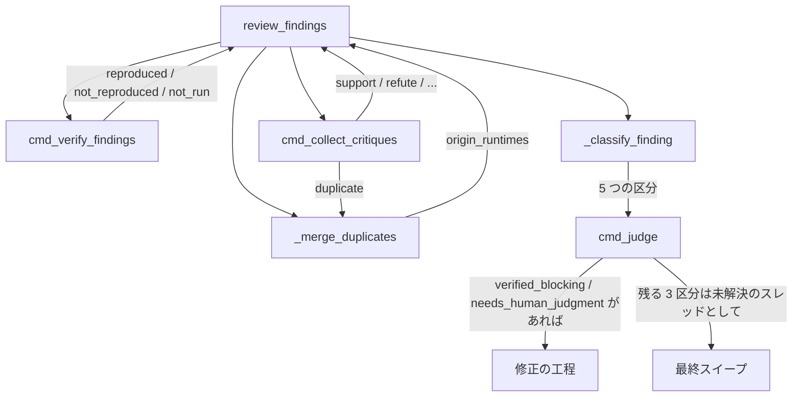
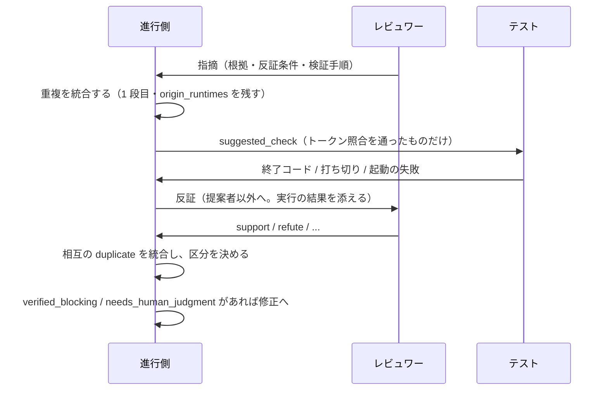

# 156-3: 反証・実行検証・証拠ベース集約

#156 を 4 本へ分けた 3 本目の設計。**全体の設計は `docs/specifications/` へ移す前の
`issues/issue-156-design.md`（Pull Request #531 でマージ済み）にあり、この文書はそこで
「未確認のまま残ること」とした 4 つを決める。**

| #531 で残したもの | この文書で決めること |
| --- | --- |
| 集約の判定の形 | 区分の決め方と、収束の判定への入れ方 |
| 重複の統合と `origin_runtimes` | 何を同一と見なすか、統合の後に何を残すか |
| 実行検証の対象 | 何を実行してよいか、どう受け取るか |
| 振動の検知への影響 | **この変更では変えない。**閾値は母集合が広がった後の実測で決める |

## 機能一覧

| # | 機能 | 誰が使うか |
| --- | --- | --- |
| 1 | 重複を統合しても、提案した担当をすべて残す | 集約の判定 |
| 2 | 実行できる検証を、担当の再評価より先に走らせる | 進行側 |
| 3 | 提案者以外が各指摘へ賛否を返す | レビュワー |
| 4 | 指摘を 5 つの区分へ分ける | 進行側、修正の担当 |
| 5 | 収束の判定が、担当の判定ではなく指摘ごとの検証結果を見る | 進行側 |

**並びが処理の順序である。** 実行検証は反証より前に置く。#156 の受け入れ条件が
「実行できる検証手順を持つ指摘は、担当の再評価より先に実行する」と定めており、反証を
返す担当は実行の結果を見たうえで賛否を決められる。

## 構成要素

| 要素 | 責務 |
| --- | --- |
| `state.py` の `_merge_duplicates`（新設） | 同一の指摘を 1 件へ束ね、`origin_runtimes` を残す。機械の 1 段目と申告の 2 段目 |
| `state.py` の `cmd_verify_findings`（新設） | `suggested_check` を実行し、結果を記録する |
| `scripts/critique.sh`（新設） | 反証のプロンプトを組み立て、提案者以外を起動する |
| `state.py` の `cmd_collect_critiques`（新設） | 反証の結果を `review_findings[]` へ結ぶ |
| `state.py` の `_classify_finding`（新設） | 1 件の指摘を 5 つの区分のいずれかへ分ける |
| `state.py` の `cmd_judge` | 区分を読んで収束を決める |
| `docs/06-evidence.md` | 反証の値・区分の決め方・実行の範囲 |

## 入出力の契約

**[`issues/issue-156-pr3-contracts.md`](issue-156-pr3-contracts.md) にある。** この文書が
500 行の上限に達したため、最も大きい節を分けた（`markdown-writing` の分割の基準）。

| 節 | 何を決めるか |
| --- | --- |
| 指摘の識別子（`finding_id`） | 反証と実行の結果を結ぶ先 |
| 重複の統合（`_merge_duplicates`） | 何を同一と見なし、統合の後に何を残すか |
| 実行検証（`cmd_verify_findings`） | 何を実行してよいか、結果をどう決めるか |
| 反証（`cmd_collect_critiques`） | 誰が何を返すか |
| 区分（`_classify_finding`） | 5 つの区分の決め方 |

## 処理の流れ

**実行検証が反証より前にある。** 機能一覧の並びと同じで、反証を返す担当は実行の結果を
読んだうえで賛否を決める。

## 収束の判定

**3 層の順序は変えない。** 変えるのは 2 層目（新規性）が数える対象である。

| 層 | 変更前 | 変更後 |
| --- | --- | --- |
| 引き継ぎ | 未解決の指摘 | 変えない |
| 新規性 | 前のラウンドと一致しない指摘の件数 | **`verified_blocking` と `needs_human_judgment` だけを数える** |
| 振動 | 重複率 0.5 以上で中断 | 変えない |

**数える 2 つはどちらも `major` 以上である。** `verified_blocking` は区分の条件が
`major` 以上を求め、`needs_human_judgment` も同じ条件を持つ。`minor` 以下の指摘は
どの経路からも新規性へ入らない。

**数える 2 つは、どちらも修正の工程へ渡る。** 新規性が数えた指摘が修正へ渡らないと、
そのラウンドは「収束していないのに直すものが無い」状態になり、次のラウンドで同じ指摘が
また数えられる。

| 区分 | 修正の担当が何をするか |
| --- | --- |
| `verified_blocking` | 直す。機械が再現しているため、判断の余地は無い |
| `needs_human_judgment` | **読んで決める。** 直す・`rejected` として理由を返す・範囲外として起票する、のいずれか |

**`needs_human_judgment` を人へのエスカレーションにしない。** 収束のループはこの工程の
中で回っており、止めて人を待つと `cross-review` が自動で進まなくなる。**決めるのは修正の
担当（AI）で、その判断の記録が次のラウンドの入力になる。** 区分の名前が指すのは「機械の
証拠だけでは決まらない」ことであって、人の関与が必須であることではない。

**その判断の行き先は却下の記録（`rejected_findings`）である。** 1 本目が作った器で、
`cmd_merge_fix` が修正の担当の報告から per-item で積み（`state.py:3001-3003`）、次の
ラウンドのレビュープロンプトへ渡る（`issues/issue-156-design.md` の「却下の記録が残り、
次のラウンドへ渡る」）。**この文書は器も経路も変えない。** 変えるのは、
`needs_human_judgment` が修正の担当の判断を必ず 1 つ受け取る、という点だけである。

**新規性の層は却下の記録を読まない。** 却下した指摘が次のラウンドで再提出されても、
新規性が数えるのは前のラウンドと一致しない指摘だけであり（`state.py:2743-2751`）、位置か
近傍か本文のいずれかで一致した時点で数から外れる。**却下の記録による抑止を足すと、同じ
抑止を 2 つの仕組みが持つ。** 一致の判定を持つのは `_finding_keys` の 1 か所である。
区分は、その一致の判定が数える母集合を絞るだけである。

**`rejected` と `insufficient_evidence` と `verified_non_blocking` は新規性へ数えない。**
数えると、棄却した指摘と `minor` の指摘のぶんだけラウンドが増える。#69 で同じ論点が
5 ラウンド続いた事象がこれにあたる。

**数えない 3 つにも行き先がある。数えないことと、扱わないことは別である。**

| 区分 | 当ラウンドの修正の工程 | 行き先 |
| --- | --- | --- |
| `verified_non_blocking` | 渡さない | **最終スイープ。** 再現した事実は `verification` として記録に残る |
| `insufficient_evidence` | 渡さない | 同上 |
| `rejected` | 渡さない | 棄却の理由（`rejection_reason`）が記録に残り、次のラウンドのレビュープロンプトへ渡る。スレッドは最終スイープが閉じる |

**最終スイープはループのどの終了経路でも走る**（`cross-review` の `SKILL.md`
「取りこぼし防止」と Step 7.5）。`approved` / `max_rounds` / `oscillation` / `error` の
いずれで抜けても `/ndf:fix` を再実行し、残った未解決のスレッドを直すか `deferred` として
記録し、未解決 0 件で終える。**`verified_non_blocking` が記録だけ残して消えることはない。**

**当ラウンドの修正の工程へ渡さないのは、`minor` でラウンドを増やさないためである。**
機械が再現していても重要度は `minor` であり、収束の判定が数えない指摘のために修正の工程を
動かすと、直すものが尽きるまでラウンドが続く。**再現したことは棄てず、扱う時期を
ループの外へ送る。** 修正の工程が `verified_blocking` か `needs_human_judgment` で起動した
ラウンドでは、記録を読んだ担当が併せて直してよい。**求めはしない**（求めると、`minor` の
修正が収束の判定に載らないまま毎ラウンド積み増される）。

**担当の判定（`event`）は見なくなる。** 重要度の自己申告と `event` の対応が保証されない
ためである（PR #157 の round 6 で minor 2 件だけの `REQUEST_CHANGES` が出た）。

**測れたかどうかは、区分で絞る前に決める。** `_new_finding_count` は対象が空なら
`(0, False)` を返す（`state.py:2736-2738`）。区分で絞った後の集合へこの規則をそのまま
使うと、**全件が `rejected` になったラウンドが「測れなかった」ことになる**。収束は
`round_passes or (findings_measurable and new_findings == 0)`（`state.py:2616-2618`）で
決まるため、元の判定が `REQUEST_CHANGES` のままループが終わらない。

| 状態 | 返る値 |
| --- | --- |
| 指摘の記録（payload）を読めない | `(0, False)`。従来の判定（全員が pass か）へ落ちる |
| 記録はあるが、数える 2 区分が 0 件 | **`(0, True)`。収束させる** |
| 記録があり、数える 2 区分に一致しない指摘がある | `(件数, True)` |

**記録が読めることと、数える対象があることは別である。** 前者は測定の可否、後者は測定の
結果である。全件を棄却したラウンドは「新しい修正必須の指摘が 0 件」であって、測れなかった
ラウンドではない。

## 非機能の実現方式

| 大項目 | 実現方式 | 確かめ方 |
| --- | --- | --- |
| セキュリティ | 渡されたコマンドのトークン列と先頭が一致し、後ろに `-` で始まるトークンを持たず、位置指定が作業ツリーの中へ解決される値だけを `shell=False` で実行する | 別コマンド・引数の注入・メタ文字・作業ツリー外のパスを渡すテスト |
| 可用性 | 実行の失敗（コマンドが無い / 上限時間 / 対象が無い）は `not_run` として扱い、進行を止めない | 不在のコマンド・上限を超えるコマンド・終了コード 4 と 5 を渡すテスト |
| 移行性 | `--verify-command` を渡さなければ実行検証を行わず、従来どおり動く | 引数なしのテスト |
| 保守性 | 区分の決め方を 1 つの関数へ集める | 区分ごとのテスト |
| 性能 | 実行は 1 指摘につき 1 回。上限時間を設ける | 上限を超える実行のテスト |

## 決定の記録

### 決定 1: 実行してよいコマンドは起動の引数で受け取る

**任意のコマンドを実行しない。** `suggested_check` はレビュワーが書いた文字列であり、
そのまま実行すると、レビュワーの誤りや誘導がそのまま実行になる。

**`--verify-command` で受け取る。** 渡されなければ実行検証を行わない。既定の一覧を持たせる
案は採らない。リポジトリによってテストの起動が違い、既定は当たらない。

**宣言ファイル（`.ndf/cross-review.json`）を新設する案は採らない。** 理由は 2 つある。

**1 つは、同じ性質の値を 2 つの Skill が別の方法で受け取ることになるためである。**
`cross-refactoring` は `--baseline-test` の引数でテストの起動を受け取っている。

**もう 1 つは、宣言ファイルには置き場所のほかに「作る手段」と「作る時期」が要るためである。**
`.ndf/worktree.json` は `worktree-setup.sh init` が作るが、`.ndf/projects.json` には作る
手段が無く、手順書の雛形を見て利用者が盤面の番号を自分で調べて書くことになっている。
**同じ形を増やさない。** 引数にすれば、いつ・誰が・どう決めるかが起動の時点で決まる。

**渡す値は「実行してよいものの一覧」であって、コマンド名の一覧ではない。** 文字列の前方
一致で照合すると、渡した名前で始まる別のコマンドと、その後ろへ足した任意の引数が
通る。前者はトークン列の照合で、後者は後ろのトークンから `-` で始まるものを外すことで
塞ぐ。**引数まで完全一致で固定する案は採らない。** `suggested_check` は指摘ごとに対象の
テストが変わるため、固定すると実行検証がほぼ働かなくなる。

### 決定 2: 実行の結果を担当の支持より先に見る

**機械が再現した事実は、担当の再評価より確かである。** 実行で再現した指摘は支持が少なくても
残し、再現しなかった指摘は支持が多くても棄却する。#156 の受け入れ条件がこの向きを求めている。

**この向きは区分の順序として実装する。** 条件の中で優先順位を書き分けるのではなく、
`reproduced` を見る 2 つの区分を表の上へ置く。**順序が向きそのものになるため、後から
条件を足しても向きが崩れない。**

### 決定 3: 新規性が数えるのは 2 つの区分だけである

`rejected` と `insufficient_evidence` を数えると、棄却した指摘のぶんだけラウンドが増える。
**却下の記録（1 本目）と反証（この変更）は、同じ論点が戻ることを止めるために入れた。**
数える対象を絞らないと、その効果が判定に出ない。

### 決定 4: 反証は新しいラウンドを足さず同じラウンドの中で回す

新しいラウンドを足す案は採らない。ラウンド数が 2 倍になり、収束の上限（12）の意味が変わる。
**発見と反証を 1 ラウンドの中で完結させる。**

### 決定 5: 振動の検知は変えない

母集合は 2 本目で既に広がっている。**この変更で判定式まで変えると、ラウンド数が動いた
ときにどちらが原因かを切り分けられない。** 閾値の見直しは、この変更の後の実測で決める。

## テスト設計

| 受け入れ条件 | 何で確かめるか |
| --- | --- |
| 統合しても提案した担当が残る | `tests/test_merge_duplicates.py`（新設）。`origin_runtimes` に 2 者が載ること |
| 独立して出した数と支持の数を区別できる | 同上。`origin_runtimes` の長さと `support` の件数が別に読めること |
| 近傍だけで本文が違う 2 件を統合しない | 同上。行差 2・本文が別の 2 件が 2 件のまま残り、`duplicate_candidates` に相手が載ること |
| 束ねられた側の形が決まっている | 同上。被統合側に `merged_into` が、代表に `merged_from` が付くこと |
| 被統合側の重要度と実行結果が失われない | 同上。`minor` と `major` の組の代表が `major`、`not_reproduced` と `reproduced` の組が `reproduced`、`not_reproduced` と `not_run` の組が `not_reproduced` になること |
| 被統合側の根拠が失われない | 同上。`has_evidence` が偽の代表と真の被統合側の組で、代表が真になり、`evidence` と `falsification` の本文が対で写り、`evidence_from` に被統合側の `finding_id` が載ること |
| 根拠を片方ずつ継ぎ合わせない | 同上。`evidence` だけの要素と `falsification` だけの要素の組で、代表の `has_evidence` が偽のままになること |
| 根拠の集約が取り込みの順序で変わらない | `tests/test_classify_findings.py`。全員 `not_run`・`major`・`origin_runtimes` 2 者で根拠を持つのが片方だけの組が、取り込みの順序を入れ替えてもどちらも `needs_human_judgment` になり、収束しないこと |
| 提案者以外が賛否を返す | `tests/test_critiques.py`（新設）。自分の指摘へ返さないこと |
| 5 つの値が記録される | 同上 |
| `finding_id` で指摘へ結ばれる | 同上。既知でない `finding_id` が `unmatched_critiques` へ残ること |
| 渡されたコマンドだけを実行する | `tests/test_verify_findings.py`（新設） |
| 別コマンドを実行しない | 同上。`--verify-command pytest` に対し `pytest-danger --evil` が `not_run` になること |
| 引数の注入を実行しない | 同上。`pytest -c /tmp/evil.ini` と `pytest -p reviewer_plugin` が `not_run` になること |
| メタ文字が展開されない | 同上。`pytest; rm -rf /` は先頭トークンの不一致で、`pytest $(whoami)` は `shell=False` のまま実行されて終了コード 4 で、いずれも `not_run` になること |
| 作業ツリーの外は実行しない | 同上。`pytest ../evil.py`・`pytest /tmp/evil.py`・外を指す symlink が `not_run` になること |
| 位置指定を持たない値は実行しない | 同上。`--verify-command pytest` と同じ `pytest` が `not_run` になること |
| `--verify-command` が無ければ実行しない | 同上 |
| 打ち切りと起動の失敗を再現としない | 同上。上限を超えるコマンドと不在のコマンドが `not_run` になること |
| 指摘の書き誤りを再現としない | 同上。終了コード 4（対象が無い）と 5（収集 0 件）が `not_run` になること |
| 再現の向き（失敗＝再現） | 同上。終了コード 1 が `reproduced`、0 が `not_reproduced` |
| 相互の `duplicate` を当ラウンドで統合する | `tests/test_classify_findings.py`。本文の違う `major` 2 件が 1 件の `needs_human_judgment` になり、収束しないこと |
| 2 段目の統合で実行し直さない | 同上。1 段目の後に `verification` を記録した組が相互の `duplicate` で統合されたとき、代表の `verification.result` が記録済みの値から選ばれ、実行が追加で走らないこと |
| `duplicate` / `out_of_scope` が区分を決めない | `tests/test_classify_findings.py`。両者だけを持つ指摘の区分が、値を持たない指摘と変わらないこと |
| 5 つの区分へ分かれる | `tests/test_classify_findings.py`（新設）。区分ごとに 1 件以上 |
| 実行で再現した指摘は支持が少なくても残る | 同上 |
| 全員一致の指摘が収束しない | 同上。`origin_runtimes` 2 者・`support` 0 件・`major` の 1 件が `needs_human_judgment` になること |
| 実行で再現した指摘は `refute` があっても棄却されない | 同上。`reproduced` と `refute` を両方持つ 1 件 |
| 実行で再現しない指摘は支持が多くても棄却される | 同上 |
| `minor` の支持だけではラウンドが増えない | 同上。`minor` かつ `support` 1 件が `insufficient_evidence` になること |
| 棄却の理由が残る | 同上 |
| 再現した `minor` が修正の工程を起動しない | 同上。`verified_non_blocking` 1 件だけのラウンドで、収束の判定が 0 件を返し、修正の工程が動かないこと |
| 新規性が 2 つの区分だけを数える | 判定のテスト |
| 指摘の記録が無いラウンドは従来の判定へ落ちる | 同上。`(0, False)` が返ること |
| 全件を棄却したラウンドが収束する | 同上。記録はあるが数える 2 区分が 0 件・元の判定が `REQUEST_CHANGES` のラウンドで `(0, True)` が返り、収束すること |
| 却下した指摘の再提出が新規性へ入らない | 同上。`needs_human_judgment` を `rejected` と決めた次のラウンドで、同じ位置・同じ本文の指摘が再び `needs_human_judgment` になっても新規性が 0 件になること |

## 未確認のまま残ること

| 項目 | 内容 |
| --- | --- |
| 振動の閾値 | 母集合が広がった後の適正値。**この変更の後の実測で決める** |
| 担当が 3 者以上になったときの区分の順序 | 順 4 の `origin_runtimes` 2 者以上は、1 ラウンドの担当が 2 者であることに支えられている（全員一致の指摘には提案者以外が残らず、`refute` が必ず 0 件になる）。3 者以上へ広げると、単一の `refute` が順 3 で全員一致を覆す。**この変更では広げない。**広げるときに順 3 と順 4 の順序を決め直す |
| 実行の上限時間 | 既定を何秒にするか。実測が無いため、まず 300 秒で置く。**超えた実行は `not_run` であり、再現ではない** |
| 効果の測定 | **4 本目が扱う。** #531 が「3 までの記録が揃ってから計算できる」を分割の理由とし、指標も 4 本目で決めるとしている（`issues/issue-156-design.md` の「分ける単位」と「未確認のまま残ること」）。この文書の時点では計算に使う記録が揃っていない |
