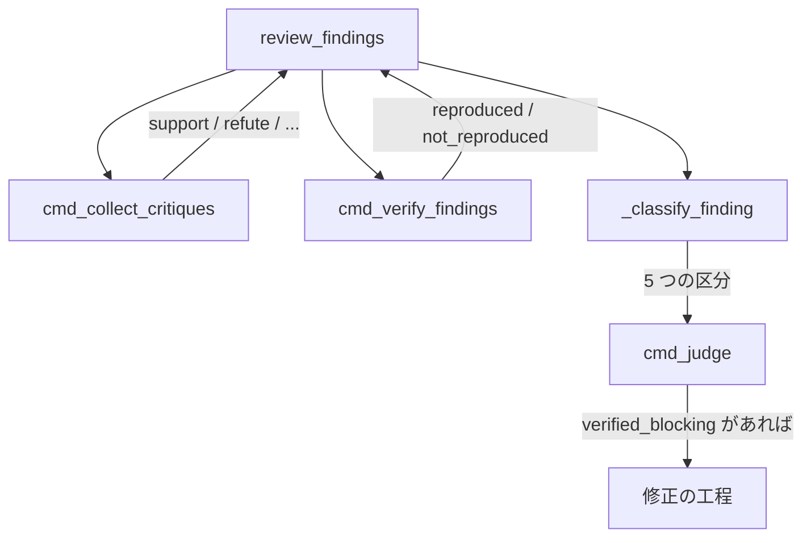
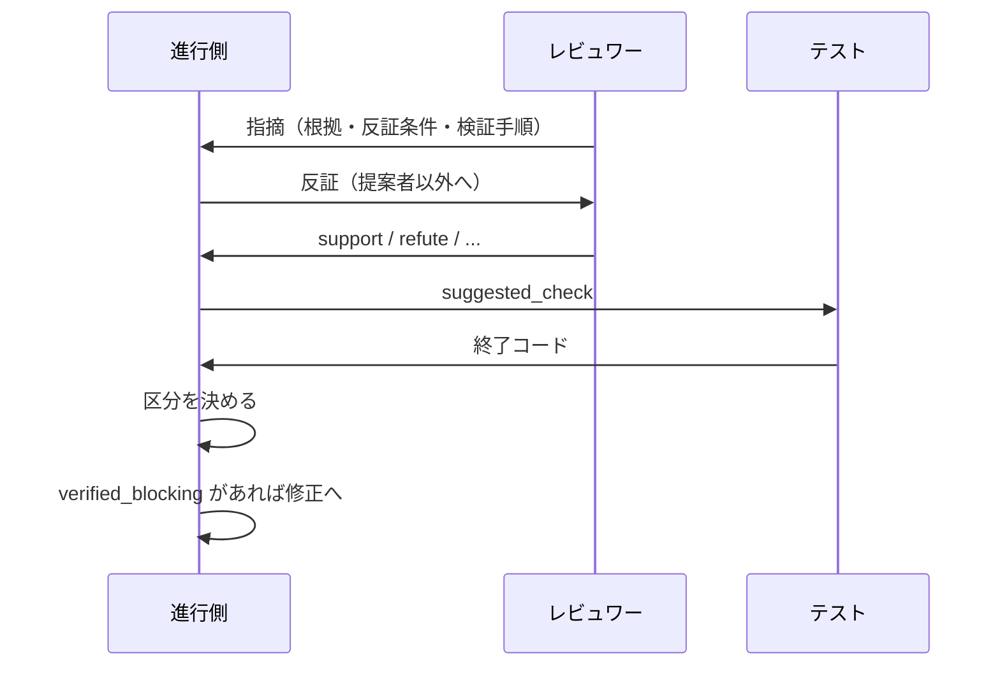

# 156-3: 反証・実行検証・証拠ベース集約

#156 を 4 本へ分けた 3 本目の設計。**全体の設計は `docs/specifications/` へ移す前の
`issues/issue-156-design.md`（Pull Request #531 でマージ済み）にあり、この文書はそこで
「未確認のまま残ること」とした 3 つを決める。**

| #531 で残したもの | この文書で決めること |
| --- | --- |
| 集約の判定の形 | 区分の決め方と、収束の判定への入れ方 |
| 実行検証の対象 | 何を実行してよいか、どう宣言させるか |
| 振動の検知への影響 | 母集合が広がった後の測り方 |

## 機能一覧

| # | 機能 | 誰が使うか |
| --- | --- | --- |
| 1 | 提案者以外が各指摘へ賛否を返す | レビュワー |
| 2 | 実行できる検証を、担当の再評価より先に走らせる | 進行側 |
| 3 | 指摘を 5 つの区分へ分ける | 進行側、修正の担当 |
| 4 | 収束の判定が、担当の判定ではなく指摘ごとの検証結果を見る | 進行側 |

## 構成要素

| 要素 | 責務 |
| --- | --- |
| `scripts/critique.sh`（新設） | 反証のプロンプトを組み立て、提案者以外を起動する |
| `state.py` の `cmd_collect_critiques`（新設） | 反証の結果を `review_findings[]` へ結ぶ |
| `state.py` の `cmd_verify_findings`（新設） | `suggested_check` を実行し、結果を記録する |
| `state.py` の `_classify_finding`（新設） | 1 件の指摘を 5 つの区分のいずれかへ分ける |
| `state.py` の `cmd_judge` | 区分を読んで収束を決める |
| `docs/06-evidence.md` | 反証の値・区分の決め方・実行の範囲 |



## 入出力の契約

### 反証（`cmd_collect_critiques`）

**提案者以外の担当が、各指摘へ 1 つの値を返す。**

| 値 | 意味 |
| --- | --- |
| `support` | 根拠を独立に確認できた |
| `refute` | 反例・仕様・コードから誤りを示せる |
| `insufficient_evidence` | 可能性はあるが立証できない |
| `duplicate` | 別の指摘と同一 |
| `out_of_scope` | この Pull Request の範囲・目的から外れる |

`review_findings[]` の各要素へ `critiques` を足す。

```json
{"critiques": [
  {"agent": "codex", "verdict": "refute",
   "reason": "handle() は呼び出し前に None を弾く（api.py:70）"}
]}
```

**自分の指摘へは返さない。** 自己支持を数に入れると、1 者が出した指摘が常に 1 票を持つ。

### 実行検証（`cmd_verify_findings`）

**実行してよいのは、リポジトリが宣言したコマンドだけである。**

| 宣言 | 何を書くか |
| --- | --- |
| `.ndf/cross-review.json` の `verify_commands` | 実行を許すコマンドの接頭辞の一覧 |

```json
{"version": 1, "verify_commands": ["pytest", "uv run --with pytest pytest"]}
```

**宣言が無ければ実行検証を行わない。** 行わなかったことを記録へ残し、区分は根拠と反証で
決める。**新しい実行系は導入しない。**

**接頭辞で照合する。** `suggested_check` がその一覧のいずれかで始まるときだけ実行する。
シェルのメタ文字（`;` / `|` / `&` / `` ` `` / `$(`）を含む値は実行しない。

`review_findings[]` の各要素へ `verification` を足す。

```json
{"verification": {"command": "pytest tests/test_foo.py::test_null_input",
                  "exit_code": 1, "result": "reproduced", "ran_at": "..."}}
```

| `result` | 決まり方 |
| --- | --- |
| `reproduced` | 実行して失敗した（指摘のとおり壊れている） |
| `not_reproduced` | 実行して通った（指摘が成り立たない） |
| `not_run` | 宣言が無い / 接頭辞に当たらない / メタ文字を含む |

**再現の向きに注意する。** 指摘は「壊れている」という主張であるため、**テストが失敗する
ことが再現である。**

### 区分（`_classify_finding`）

**上から順に見て、最初に当たった区分を採る。**

| 順 | 区分 | 条件 |
| --- | --- | --- |
| 1 | `rejected` | 実行して再現しなかった、または `refute` が 1 件以上ある |
| 2 | `verified_blocking` | 実行して再現した、かつ重要度が `major` 以上 |
| 3 | `verified_non_blocking` | 実行して再現した、かつ重要度が `minor` 以下 |
| 4 | `needs_human_judgment` | 根拠を持ち、`support` が 1 件以上ある |
| 5 | `insufficient_evidence` | 上のいずれにも当たらない |

**実行の結果を担当の支持より先に見る。** 実行で再現した指摘は、支持が少なくても
`verified_blocking` になる。実行で再現しなかった指摘は、支持が多くても `rejected` になる。

**`refute` を支持より強く見る。** 反証は「なぜ成り立たないか」を示すもので、支持の
「確かにそう見える」より確かめられる形をしている。

**棄却の理由を残す。** `rejected` の要素へ `rejection_reason` を書く（実行の結果か、
`refute` の理由）。

## 処理の流れ



## 収束の判定

**3 層の順序は変えない。** 変えるのは 2 層目（新規性）が数える対象である。

| 層 | 変更前 | 変更後 |
| --- | --- | --- |
| 引き継ぎ | 未解決の指摘 | 変えない |
| 新規性 | 前のラウンドと一致しない指摘の件数 | **`verified_blocking` と `needs_human_judgment` だけを数える** |
| 振動 | 重複率 0.5 以上で中断 | 変えない |

**`rejected` と `insufficient_evidence` は新規性へ数えない。** 数えると、棄却した指摘の
ぶんだけラウンドが増える。#69 で同じ論点が 5 ラウンド続いた事象がこれにあたる。

**担当の判定（`event`）は見なくなる。** 重要度の自己申告と `event` の対応が保証されない
ためである（PR #157 の round 6 で minor 2 件だけの `REQUEST_CHANGES` が出た）。

**測れないときは従来の判定へ落ちる。** 指摘の記録が無いラウンドでは区分を決められない。
`_new_finding_count` の「測れたかどうか」の返り値をそのまま使う。

## 非機能の実現方式

| 大項目 | 実現方式 | 確かめ方 |
| --- | --- | --- |
| セキュリティ | 実行するのは宣言された接頭辞に当たるコマンドだけ。メタ文字を含む値は実行しない | 実行を試みるテスト |
| 可用性 | 実行の失敗（コマンドが無い等）は `not_run` として扱い、進行を止めない | 不在のコマンドを渡すテスト |
| 移行性 | 宣言が無いリポジトリでは実行検証を行わず、従来どおり動く | 宣言なしのテスト |
| 保守性 | 区分の決め方を 1 つの関数へ集める | 区分ごとのテスト |
| 性能 | 実行は 1 指摘につき 1 回。上限時間を設ける | 上限を超える実行のテスト |

## 決定の記録

### 決定 1: 実行してよいコマンドをリポジトリが宣言する

**任意のコマンドを実行しない。** `suggested_check` はレビュワーが書いた文字列であり、
そのまま実行すると、レビュワーの誤りや誘導がそのまま実行になる。

宣言が無ければ実行検証を行わない案を採る。既定の一覧を持たせる案は採らない。リポジトリに
よってテストの起動が違い、既定は当たらない。

### 決定 2: 実行の結果を担当の支持より先に見る

**機械が再現した事実は、担当の再評価より確かである。** 実行で再現した指摘は支持が少なくても
残し、再現しなかった指摘は支持が多くても棄却する。#156 の受け入れ条件がこの向きを求めている。

### 決定 3: 新規性が数えるのは 2 つの区分だけである

`rejected` と `insufficient_evidence` を数えると、棄却した指摘のぶんだけラウンドが増える。
**却下の記録（1 本目）と反証（この変更）は、同じ論点が戻ることを止めるために入れた。**
数える対象を絞らないと、その効果が判定に出ない。

### 決定 4: 反証は同じラウンドの 2 段目として回す

新しいラウンドを足す案は採らない。ラウンド数が 2 倍になり、収束の上限（12）の意味が変わる。
**発見と反証を 1 ラウンドの中で完結させる。**

### 決定 5: 振動の検知は変えない

母集合は 2 本目で既に広がっている。**この変更で判定式まで変えると、ラウンド数が動いた
ときにどちらが原因かを切り分けられない。** 閾値の見直しは、この変更の後の実測で決める。

## テスト設計

| 受け入れ条件 | 何で確かめるか |
| --- | --- |
| 提案者以外が賛否を返す | `tests/test_critiques.py`（新設）。自分の指摘へ返さないこと |
| 5 つの値が記録される | 同上 |
| 宣言されたコマンドだけを実行する | `tests/test_verify_findings.py`（新設） |
| メタ文字を含む値は実行しない | 同上 |
| 宣言が無ければ実行しない | 同上 |
| 再現の向き（失敗＝再現） | 同上 |
| 5 つの区分へ分かれる | `tests/test_classify_findings.py`（新設）。区分ごとに 1 件以上 |
| 実行で再現した指摘は支持が少なくても残る | 同上 |
| 実行で再現しない指摘は支持が多くても棄却される | 同上 |
| 棄却の理由が残る | 同上 |
| 新規性が 2 つの区分だけを数える | 判定のテスト |
| 測れないときは従来の判定へ落ちる | 同上 |

## 未確認のまま残ること

| 項目 | 内容 |
| --- | --- |
| 振動の閾値 | 母集合が広がった後の適正値。**この変更の後の実測で決める** |
| 実行の上限時間 | 既定を何秒にするか。実測が無いため、まず 300 秒で置く |
| 効果の測定 | 4 本目が扱う |
