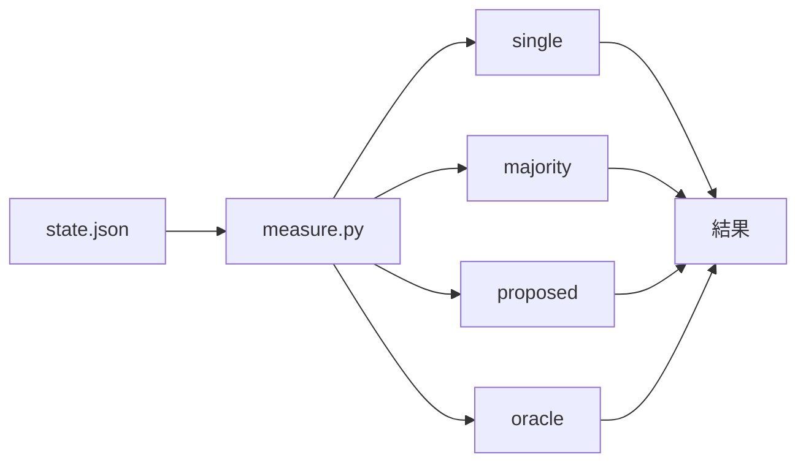

# 156-4: 効果の測定

#156 を 4 本へ分けた 4 本目の設計。**1〜3 本目が残した記録を読んで、方式ごとの結果を
同じデータから計算する。**

**新しい記録を集めない。** 1〜3 本目が既に per-item の記録を残しており、方式の違いは
**同じ記録をどう読むか**の違いである。実行のやり直しは要らない。

## 機能一覧

| # | 機能 | 誰が使うか |
| --- | --- | --- |
| 1 | 4 つの方式を同じ記録から計算する | 効果を測る側 |
| 2 | 追加でかかった時間と実行の量を並べる | 同上 |
| 3 | 振動の検知と上限の到達を、変更の前後で比べる | 同上 |

## 構成要素

| 要素 | 責務 |
| --- | --- |
| `scripts/measure.py`（新設） | 状態ファイルを読み、方式ごとの結果を出す |
| `state.py` の `cmd_report` | 変えない（報告の形は保つ） |
| `docs/06-evidence.md` | 測る指標と、比較として読むときの限界 |

**`state.py` へ足さない。** 測定は収束ループの外にあり、進行を止めない。状態ファイルを
読むだけの独立したスクリプトにする。

## 入出力の契約

### 4 つの方式

**同じ `review_findings[]` を、方式ごとに違う規則で読む。**

| 方式 | 採る指摘 |
| --- | --- |
| `single` | 1 者だけの結果。**担当ごとに 1 通り出す**（誰を選ぶかで結果が変わるため） |
| `majority` | `origin_runtimes` が 2 者以上の指摘 |
| `proposed` | 3 本目の区分が `verified_blocking` または `needs_human_judgment` |
| `oracle` | **いずれかの担当が出した指摘のうち、修正された**もの |

**`oracle` は上限を表す。** 実際に修正された指摘の集合であり、どの方式でもこれを超えられない。
「修正された」の判定は `rounds[].fix.resolved_thread_ids` と指摘の位置で結ぶ。

**`majority` は 3 本目の統合の結果を読む。** `origin_runtimes` は統合しても消さない項目で、
「2 者が独立に出した」ことを表す。**位置が近いだけの組を自分で数え直さない**（3 本目が
近傍かつ本文の一致で統合しており、同じ判定を 2 か所に持つと片方だけが古くなる）。

**統合し損ねた組は `majority` に入らない。** 3 本目は過剰統合を避けて厳しい側へ倒して
おり、取りこぼしは `duplicate_candidates` に残る。**この方式の値は、統合の判定の厳しさを
含んだ数字である。**

### 出力

```json
{"pr": 123, "rounds": 5,
 "methods": {
   "single": {"agy": {"found": 8, "of_oracle": 0.62}, "kiro": {"found": 5, "of_oracle": 0.38}},
   "majority": {"found": 4, "of_oracle": 0.31},
   "proposed": {"found": 11, "of_oracle": 0.85},
   "oracle": {"found": 13}},
 "cost": {"rounds": 5, "reviewer_launches": 10, "wall_clock_seconds": 4200},
 "convergence": {"final": "approved", "oscillation_hits": 0, "max_rounds_hits": 0}}
```

**`of_oracle` は再現率である。** その方式が `oracle` の何割を拾えたかを表す。
**精度（false positive）は測らない。** 修正されなかった指摘が誤りだったのか、範囲外
だったのか、判断が割れただけなのかを、記録からは区別できない。

### 費用

| 項目 | どこから取るか |
| --- | --- |
| ラウンド数 | `rounds` の長さ |
| レビュワーの起動回数 | ラウンドごとの担当の数の合計 |
| 実時間 | `started_at` と `ended_at` の差 |

**トークンの量は測らない。** 状態ファイルが持っておらず、CLI ごとに取り方が違う。

### 収束の様子

| 項目 | どこから取るか |
| --- | --- |
| 終わり方 | `final`（`approved` / `max_rounds` / `oscillation` / `error`） |
| 振動で中断した回数 | `final == "oscillation"` の Pull Request 数 |
| 上限で終わった回数 | `final == "max_rounds"` の Pull Request 数 |

**変更の前後を比べるには、両方の期間の状態ファイルが要る。** 状態ファイルは作業ツリーの
中にあり、`merged` が消す。**比較のためには、測る前に残す必要がある。**

## 処理の流れ



## 決定の記録

### 決定 1: 測定は独立したスクリプトにする

収束ループの中に置くと、測定の失敗が進行を止める。状態ファイルを読むだけの独立した
スクリプトにすれば、いつでも後から計算し直せる。

`state.py` へ副コマンドとして足す案は採らない。`state.py` は 3200 行を超えており、
収束ループが読む対象である。測定はその外にある。

### 決定 2: 精度は測らない

修正されなかった指摘が誤りだったかは、記録からは決まらない。範囲外として却下したもの、
判断が割れて deferred にしたもの、単に対応しなかったものが混ざる。**測れない値を数字に
すると、比較の根拠として使われてしまう。**

再現率（`of_oracle`）だけを出す。

### 決定 3: `single` は担当ごとに出す

1 者だけの結果は、誰を選ぶかで変わる。1 つの数字にまとめると、選び方が結果に混ざる。

### 決定 4: 状態ファイルを残す手を、この変更では作らない

比較には変更の前後の状態ファイルが要るが、`merged` が作業ツリーごと消す。**残す仕組みを
作るのはこの変更の範囲外である。** 測る側が測る前に控えるものとし、そのことを手順へ書く。

**自動で残す案は採らない。** 状態ファイルには Pull Request の中身が入り、置き場所と保持の
期間を決める必要がある。測定のためだけに決めるには重い。

## テスト設計

| 受け入れ条件 | 何で確かめるか |
| --- | --- |
| 4 つの方式を同じ記録から計算する | `tests/test_measure.py`（新設）。作った状態ファイルを読ませる |
| `single` が担当ごとに出る | 同上 |
| `oracle` が修正された指摘だけを数える | 同上 |
| 費用が並ぶ | 同上。時刻の差を確かめる |
| 収束の様子が並ぶ | 同上。4 つの `final` それぞれ |
| 記録が無いときに落ちない | 同上。空の状態ファイル |

## 未確認のまま残ること

| 項目 | 内容 |
| --- | --- |
| 比較のための Pull Request 群 | 変更の前後で同じ対象を測る必要がある。**対象の選び方は測る時点で決める** |
| `duplicate_candidates` の扱い | 統合し損ねた組を `majority` へ数え直すかどうか。**3 本目の統合の実測が出てから決める** |
| 既知の不具合を仕込んだ比較用のリポジトリ | 要求の「含まない」に挙げてある |
| 状態ファイルの保存 | 決定 4 のとおり、測る側が控える |
