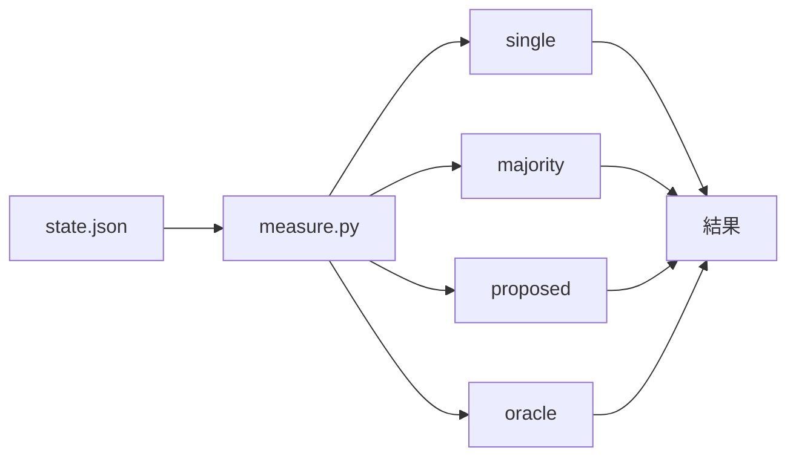

# 156-4: 効果の測定

#156 を 4 本へ分けた 4 本目の設計。**1〜3 本目が残した記録を読んで、方式ごとの結果を
同じデータから計算する。**

**測るために回し直さない。** 1〜3 本目が既に per-item の記録を残しており、方式の違いは
**同じ記録をどう読むか**の違いである。

**例外は `oracle` の 1 つだけである。** 「修正された」を判定する材料（解決済みスレッドの
位置）が記録に残っておらず、そこだけは書き込みの側へ項目を足す（決定 1）。**この項目を
持たない過去の記録では `oracle` が出ない。**

## 機能一覧

| # | 機能 | 誰が使うか |
| --- | --- | --- |
| 1 | 4 つの方式を同じ記録から計算する | 効果を測る側 |
| 2 | 追加でかかった時間と実行の量を並べる | 同上 |
| 3 | 振動の検知と上限の到達を、変更の前後で比べる | 同上 |

## 構成要素

**パスはリポジトリの根からの相対で書く。** 新設するものは
`plugins/ndf/skills/cross-review/` の下へ置く。**この Skill が使うものを、この Skill の下へ
同居させるのがこのリポジトリの配置である**（`scripts/` に `state.py` と `monitor.py`、
`docs/` に手順書、`tests/` にテストが既にある）。

**収集の対象に入るかどうかで置き場所を決めていない。** 継続的統合はリポジトリの根から
`uv run --project plugins/playwright-kit/skills/playwright-kit-ops --with pytest pytest . -q`
で全件を収集する（`.github/workflows/pytest.yml`）。**根から収集するため、どこへ置いても
対象に入る。**

| 要素 | 責務 |
| --- | --- |
| `plugins/ndf/skills/cross-review/scripts/measure.py`（新設） | 状態ファイルを読み、方式ごとの結果を出す |
| `plugins/ndf/skills/cross-review/scripts/state.py` の `_merge_fix_records` | 解決したスレッドの位置を記録へ残す（決定 1） |
| `plugins/ndf/skills/cross-review/scripts/state.py` の `cmd_report` | 変えない（報告の形は保つ） |
| `plugins/ndf/skills/cross-review/docs/06-evidence.md` | 測る指標と、比較として読むときの限界 |

**測定の処理は `state.py` へ足さない。** 測定は収束ループの外にあり、進行を止めない。
状態ファイルを読むだけの独立したスクリプトにする。**記録の項目を足すことはこれと別である**
（決定 1）。

## 入出力の契約

### 4 つの方式

**同じ `review_findings[]` を、方式ごとに違う規則で読む。**

| 方式 | 採る指摘 |
| --- | --- |
| `single` | 1 者だけの結果。**担当ごとに 1 通り出す**（誰を選ぶかで結果が変わるため） |
| `majority` | `origin_runtimes` が 2 者以上の指摘 |
| `proposed` | 3 本目の区分が `verified_blocking` または `needs_human_judgment` |
| `oracle` | **いずれかの担当が出した指摘のうち、修正された**もの |

**母集合は代表だけである。** 4 つの方式はいずれも、`merged_into` を持つ要素を数えない。
統合された側を一緒に数えると、同じ指摘が 2 件になる。`state.py` の区分・反証・集計も
同じ規則で数えており（`_classify_round` ほか）、ここだけ別の数え方をすると値が食い違う。

**`single` は代表の `origin_runtimes` で判定する。** その担当が出した指摘が別の担当の代表へ
統合されていても、`origin_runtimes` にその担当が載るため数えられる。**統合された側の要素を
数えない**（統合の前後で `single` の値が変わらないようにする）。

**`origin_runtimes` が無い指摘は `[agent]` として読む。** この値は統合のときに初めて付く。
`_collect_review_findings` が取り込んだ直後の指摘は持たず（実測: 取り込み直後のキーは
`agent` / `finding_id` / `pr` / `round` / `path` / `line` / `severity` / `body` /
`evidence` / `falsification` / `suggested_check` / `posted_to` / `has_evidence` の 13 個で、
`origin_runtimes` を含まない）、値を補うのは `_merge_duplicates`（`cmd_verify_findings` から）と
`_merge_declared_duplicates`（`cmd_read_critiques` から）の `setdefault` である。
**どちらもそのラウンドの指摘しか触らない**（`targets` を `round == round_no` で絞る）。
そのため Step 2.5 へ届かずに終わったラウンドの指摘と、3 本目より前に取った記録は、代表で
あってもこの値を持たない。

**無いものを「0 者」として読むと、比較対象の過去の記録の `single` が全件 0 になる。**
変更の前後を比べるのがこの測定の目的であり、前の側が数えられないと目的そのものが立たない。
`state.py` 自身も同じ場面で `finding.get("origin_runtimes") or [finding.get("agent")]` と
読んでおり（`_critique_targets` / `_assign_critiques` / `_absorb`）、測定もこれに合わせる。

`majority` も同じ読み替えを通す。補った値は 1 者であるため `majority` には入らない
（統合を通っていない指摘は、2 者が出したことが記録から言えない）。**`majority` の値は
読み替えても変わらないが、2 つの方式が同じ読み方を通ることで、片方だけが補う状態を
作らない。**

**`oracle` は上限を表す。** 実際に修正された指摘の集合であり、どの方式でもこれを超えられない。

### `oracle` の判定

**「修正された」は、解決されたスレッドの位置と指摘の位置で結ぶ。** 記録の側にこの結合の
材料が無いため、**1〜3 本目の記録だけでは `oracle` を計算できない**。

- `review_findings[]` は `finding_id` / `path` / `line` を持つが、**スレッドの識別子を持たない**
- `rounds[].fix.resolved_thread_ids` は**識別子の文字列だけ**で、位置を持たない
  （`_thread_ids` が `thread_id` だけを取り出す）
- 位置つきで取れるのは `_fetch_unresolved_threads` が返す**未解決**のスレッドで、
  `oracle` が数える**解決済み**のスレッドの位置はどこにも残らない

**材料は捨てられているだけで、存在する。** `fix` の戻り値の `resolved_threads[]` は
`thread_id` / `comment_id` / `path` / `line` を持つ（`plugins/ndf/skills/cross-review/docs/02-fix-and-rotation.md`）。
`_merge_fix_records` が件数と識別子だけを残すため、位置がそこで落ちる。

**そこで `rounds[].fix.resolved_thread_positions` を足す。** `[{"thread_id": ..., "path": ...,
"line": ...}]` の形で、戻り値の `resolved_threads[]` から位置ごと写す。既存の
`resolved_thread_ids` は変えない（次のラウンドの開始時の検査が読む）。

**照合の規則を 3 つ決める。**

- **照合の対象は、その解決を記録した fix のラウンド以下の指摘に限る。**
  `rounds[R].fix.resolved_thread_positions` の 1 件は、**ラウンド R の時点で出ていた指摘**を
  解決したものである（`review_findings[].round` が指摘の出たラウンドを持つ）。R より後の
  指摘は、解決した時点でまだ存在しない。限らないと、round 1 で修正した `a.py:10` の解決が、
  **round 2 に同じ行へ出た別の未修正の指摘**へ結ばれ、その指摘を `oracle` へ誤って算入する
- 突き合わせは `(path, line)` で行う。上の絞り込みの後になお複数の代表が一致するときは、
  **ラウンドが最も新しいものを採る**。行番号は修正で動くため、古い側へ結ぶと別の指摘を数える
- どの指摘とも一致しなかった解決済みスレッドは `oracle` に数えず、**件数を
  `oracle` の `unmatched` として出す**。落としたことが出力から見えないと、`of_oracle` が
  実際より高く出ていることに気づけない

**総評だけへ書いた指摘は `oracle` に入らない。** `posted_to` が `body` の指摘はスレッドを
持たないため、修正されても解決済みスレッドとして現れない。`oracle` は
**インラインへ投稿された指摘の上限**である。

**`majority` は 3 本目の統合の結果を読む。** `origin_runtimes` は統合しても消さない項目で、
「2 者が独立に出した」ことを表す。**位置が近いだけの組を自分で数え直さない**（3 本目が
近傍かつ本文の一致で統合しており、同じ判定を 2 か所に持つと片方だけが古くなる）。

**`proposed` が読むのは、証拠集約を通ったラウンドだけである。** 3 本目のレビューで
`evidence_rounds` を足した（状態ファイルが持つ、統合・実行検証・反証をすべて通した
ラウンドの印）。印の無いラウンドの指摘は区分を持たないか、持っていても反証を結ぶ前の
値である。**印の無いラウンドを `proposed` の母集合へ入れない**（入れると、区分の付かない
指摘が `insufficient_evidence` として落ち、方式の再現率が実際より低く出る）。印の無い
ラウンドしか無い状態ファイルは、`proposed` を計算せず、後述の形で「計算できない」ことを出す。

**`proposed` の `of_oracle` は、分母も印のあるラウンドに限る。** 分子だけを絞ると、印の
混ざった記録で再現率が過小に出る。印の無い round 1 と印のある round 2 に修正された指摘が
1 件ずつあるとき、`proposed` が採れるのは round 2 の 1 件だけなのに、全ラウンドの `oracle`
（2 件）で割ると、**拾えるものを全部拾っても 0.5 にしかならない**。再現率は分子と分母を
同じ母集合で数える。

**分母が全ラウンドと違うことは出力へ出す。** `proposed` は `oracle_scope`
（`all_rounds` / `evidence_rounds`）と `oracle_base`（分母に使った `oracle` の件数）を
**常に持つ**。添えないと、`proposed` の `of_oracle` を他の 3 つと同じ分母の値として読める
（他の 3 つは全ラウンドの `oracle` で割る）。

**統合し損ねた組は `majority` に入らない。** 3 本目は過剰統合を避けて厳しい側へ倒して
おり、取りこぼしは `duplicate_candidates` に残る。**この方式の値は、統合の判定の厳しさを
含んだ数字である。**

### 呼び出し方

```
measure.py <状態ファイルのパス> [--output <パス>]
```

| 引数 | 意味 |
| --- | --- |
| `<状態ファイルのパス>` | 必須。**1 つだけ受け取る**（`cross-review-pr<番号>-state.json`） |
| `--output` | 書き出し先。省略すると標準出力へ出す |

**1 回の実行が測るのは 1 つの Pull Request である。** 複数を渡して集計する形は作らない
（決定 5）。出力は 1 件の JSON で、複数を比べるときは測る側が並べる。

### 出力

```json
{"pr": 123, "rounds": 5,
 "methods": {
   "single": {"agy": {"found": 8, "of_oracle": 0.62}, "kiro": {"found": 5, "of_oracle": 0.38}},
   "majority": {"found": 4, "of_oracle": 0.31},
   "proposed": {"found": 11, "of_oracle": 0.85,
                "oracle_scope": "all_rounds", "oracle_base": 13},
   "oracle": {"found": 13, "unmatched": 1}},
 "cost": {"rounds": 5, "reviewer_launches": 10, "wall_clock_seconds": 4200},
 "convergence": {"final": "approved", "oscillation": 0, "max_rounds": 0}}
```

**キーは常に置き、決まらない値は `null` にする。** キーを省くと、読む側が「0 件」と
「計算できない」を区別できないうえ、欠けたキーを読んで落ちる。

| 決まらない場面 | 出す形 |
| --- | --- |
| 印（`evidence_rounds`）を持つラウンドが無い | `"proposed": {"found": null, "of_oracle": null, "oracle_scope": null, "oracle_base": null, "reason": "no_evidence_rounds"}` |
| 位置の記録（`resolved_thread_positions`）を持つラウンドが無い | `"oracle": {"found": null, "unmatched": null, "reason": "no_resolved_thread_positions"}`。`of_oracle` は全方式で `null`、`proposed` の `oracle_base` も `null` |
| `oracle` が 0 件 | `of_oracle` は `null`（0 除算。`0.0` にすると「拾えなかった」と読めるが、実際は比べる相手がいない） |
| 印のあるラウンドに修正された指摘が 1 件も無い | `proposed` の `oracle_base` は `0`、`of_oracle` は `null`（同じ 0 除算）。`found` は数えた件数をそのまま出す |
| その方式が 0 件 | `"found": 0`。`of_oracle` は `0.0`（計算できている） |

**`reason` は値が `null` のときだけ置く。** 決まった値に添えると、読む側が例外の有無を
毎回見分けることになる。

**`of_oracle` は再現率である。** その方式が `oracle` の何割を拾えたかを表す。
**精度（false positive）は測らない。** 修正されなかった指摘が誤りだったのか、範囲外
だったのか、判断が割れただけなのかを、記録からは区別できない。

### 費用

| 項目 | どこから取るか |
| --- | --- |
| ラウンド数 | `rounds` の長さ |
| レビュワーの起動回数 | ラウンドごとの担当の数の合計 |
| 実時間 | `started_at` と `ended_at` の差 |

**トークンの量は測らない。** 状態ファイルが持っておらず、CLI ごとに取り方が違う。

### 収束の様子

**測るのは 1 つの Pull Request であるため、値は 0 か 1 である。**

| 項目 | どこから取るか |
| --- | --- |
| 終わり方 | `final`（`approved` / `max_rounds` / `oscillation` / `error`） |
| `oscillation` | `final == "oscillation"` なら 1、そうでなければ 0 |
| `max_rounds` | `final == "max_rounds"` なら 1、そうでなければ 0 |

**0 か 1 で出すのは、複数を比べるときに足せるようにするためである。** 「振動で中断した
Pull Request 数」は、測る側がこの値を合計して得る。合計そのものは作らない（決定 5）。

**変更の前後を比べるには、両方の期間の状態ファイルが要る。** 状態ファイルは作業ツリーの
中にあり、`merged` が消す。**比較のためには、測る前に残す必要がある。**

## 処理の流れ



## 決定の記録

### 決定 1: 測定は独立したスクリプトにし、記録の項目だけを `state.py` へ足す

収束ループの中に置くと、測定の失敗が進行を止める。状態ファイルを読むだけの独立した
スクリプトにすれば、いつでも後から計算し直せる。

`state.py` へ副コマンドとして足す案は採らない。`state.py` は 4100 行を超えており、
収束ループが読む対象である。測定はその外にある。

**ただし、記録の項目を 1 つ足すことは別である。** `oracle` の判定には解決済みスレッドの
位置が要り、その値は `fix` の戻り値にあるのに `_merge_fix_records` が捨てている。
**測定の側からは足せない**（測るのは記録が書かれた後であり、そこには位置が無い）。
足すのは書き込みの 1 行分で、読む側（収束ループ）の判断は増えない。**進行を止めないという
決定 1 の趣旨は保たれる。**

**GitHub API でスレッドの位置を引く案は採らない。** 外部依存を足すと、測定が GitHub の
状態と認証に左右され、「記録があればいつでも後から計算し直せる」という決定 1 の利点が
消える。Pull Request が消えた後は引けず、`merged` の後に測る運用とも合わない。

**この項目を持たない過去の状態ファイルでは `oracle` を計算できない。** そのことは出力へ
`reason` として残す（「出力」の表）。

### 決定 2: 精度は測らない

修正されなかった指摘が誤りだったかは、記録からは決まらない。範囲外として却下したもの、
判断が割れて deferred にしたもの、単に対応しなかったものが混ざる。**測れない値を数字に
すると、比較の根拠として使われてしまう。**

再現率（`of_oracle`）だけを出す。

### 決定 3: `single` は担当ごとに出す

1 者だけの結果は、誰を選ぶかで変わる。1 つの数字にまとめると、選び方が結果に混ざる。

### 決定 4: 状態ファイルを残す手を、この変更では作らない

比較には変更の前後の状態ファイルが要るが、`merged` が作業ツリーごと消す。**残す仕組みを
作るのはこの変更の範囲外である。** 測る側が測る前に控えるものとし、そのことを手順へ書く。

**自動で残す案は採らない。** 状態ファイルには Pull Request の中身が入り、置き場所と保持の
期間を決める必要がある。測定のためだけに決めるには重い。

### 決定 5: 1 回の実行が測るのは 1 つの Pull Request

複数の状態ファイルを渡して集計する形は作らない。**集計の単位は測る目的で変わる**
（変更の前後・担当ごと・リポジトリごと）。出力を 0 か 1 の値で出しておけば、どの単位でも
測る側が足し合わせられる。中で先に束ねると、束ね方を変えるたびにスクリプトを直すことになる。

## テスト設計

**テストの置き場所は `plugins/ndf/skills/cross-review/tests/` である。** 収集の対象に入るか
どうかでは決めていない（根から `pytest . -q` で全件を回すため、根の `tests/` も収集される）。
根拠は 2 つである。

- **Skill のテストはその Skill の下へ置く**のがこのリポジトリの配置である
  （`plugins/ndf/skills/<名前>/tests/`）。根の `tests/` にあるのは `tests/runtime-smoke/`
  だけで、こちらは容器を起動する shell のテストであり、Python のテストを持たない
- `plugins/ndf/skills/cross-review/tests/conftest.py` が `state.py` を**相対の位置**
  （`_HERE.parent / "scripts" / "state.py"`）で読み込む。同じ位置へ置けば、`state_mod` などの
  既存のフィクスチャをそのまま使える

| 受け入れ条件 | 何で確かめるか |
| --- | --- |
| 4 つの方式を同じ記録から計算する | `plugins/ndf/skills/cross-review/tests/test_measure.py`（新設）。作った状態ファイルを読ませる |
| `single` が担当ごとに出る | 同上 |
| `origin_runtimes` を持たない記録でも担当別の件数が残る | 同上。`agent` だけを持つ指摘（統合を通っていないラウンド・3 本目より前の記録）を 2 者分。`single` がその `agent` の側で 1 件ずつ数え、**どちらも 0 件にならない**。`majority` は 0 件 |
| 統合された指摘を 2 回数えない | 同上。`merged_into` を持つ要素と代表を混ぜた記録 |
| `oracle` が修正された指摘だけを数える | 同上。`resolved_thread_positions` を持つ記録 |
| `oracle` が解決より後のラウンドの指摘を拾わない | 同上。round 1 で解決した `a.py:10` と、round 2 の同じ位置に出た別の指摘を持つ記録。`oracle` は 1 件で、round 2 の指摘を含まない |
| 印の混ざった記録で `proposed` の分母が印のあるラウンドに限られる | 同上。印の無い round 1 と印のある round 2 に修正された指摘を 1 件ずつ持つ記録。`of_oracle` が `1.0`、`oracle_scope` が `evidence_rounds`、`oracle_base` が `1` |
| 一致しないスレッドを `unmatched` に出す | 同上。位置がどの指摘とも合わない記録 |
| 計算できない値が `null` で出る | 同上。印の無い記録・位置の記録が無い記録・`oracle` が 0 件の記録 |
| 費用が並ぶ | 同上。時刻の差を確かめる |
| 収束の様子が並ぶ | 同上。4 つの `final` それぞれ |
| 記録が無いときに落ちない | 同上。空の状態ファイル |
| `_merge_fix_records` が位置を残す | `plugins/ndf/skills/cross-review/tests/` の既存のテストへ足す |

## 未確認のまま残ること

| 項目 | 内容 |
| --- | --- |
| 比較のための Pull Request 群 | 変更の前後で同じ対象を測る必要がある。**対象の選び方は測る時点で決める** |
| `evidence_rounds` を持たない記録の比較 | 3 本目より前に回した Pull Request は印を持たない。**変更の前後を比べる対象として使えるのは `oracle` と `single` と `majority` だけである** |
| `resolved_thread_positions` を持たない記録の比較 | この変更より前に回した Pull Request は位置を持たず、`oracle` を計算できない。**`of_oracle` はこの変更より後に取った記録でしか出ない。** 再現率で前後を比べるには、両方の期間の記録が位置を持っている必要がある。**対象の選び方は測る時点で決める** |
| `duplicate_candidates` の扱い | 統合し損ねた組を `majority` へ数え直すかどうか。**3 本目の統合の実測が出てから決める** |
| 既知の不具合を仕込んだ比較用のリポジトリ | 要求の「含まない」に挙げてある |
| 状態ファイルの保存 | 決定 4 のとおり、測る側が控える |
