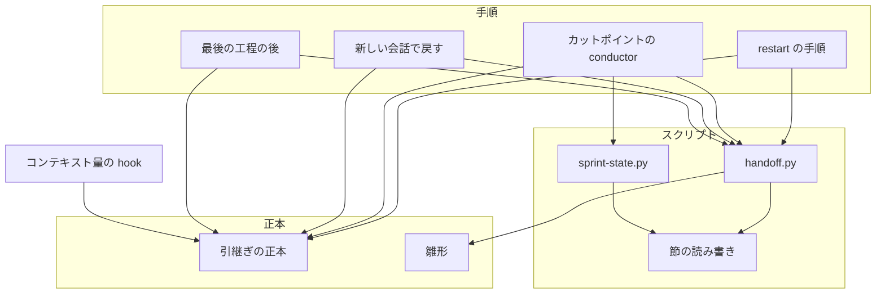
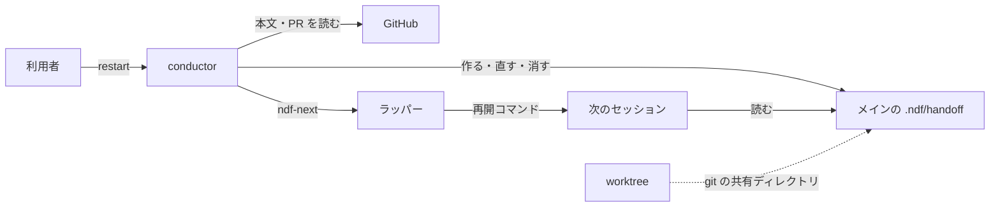
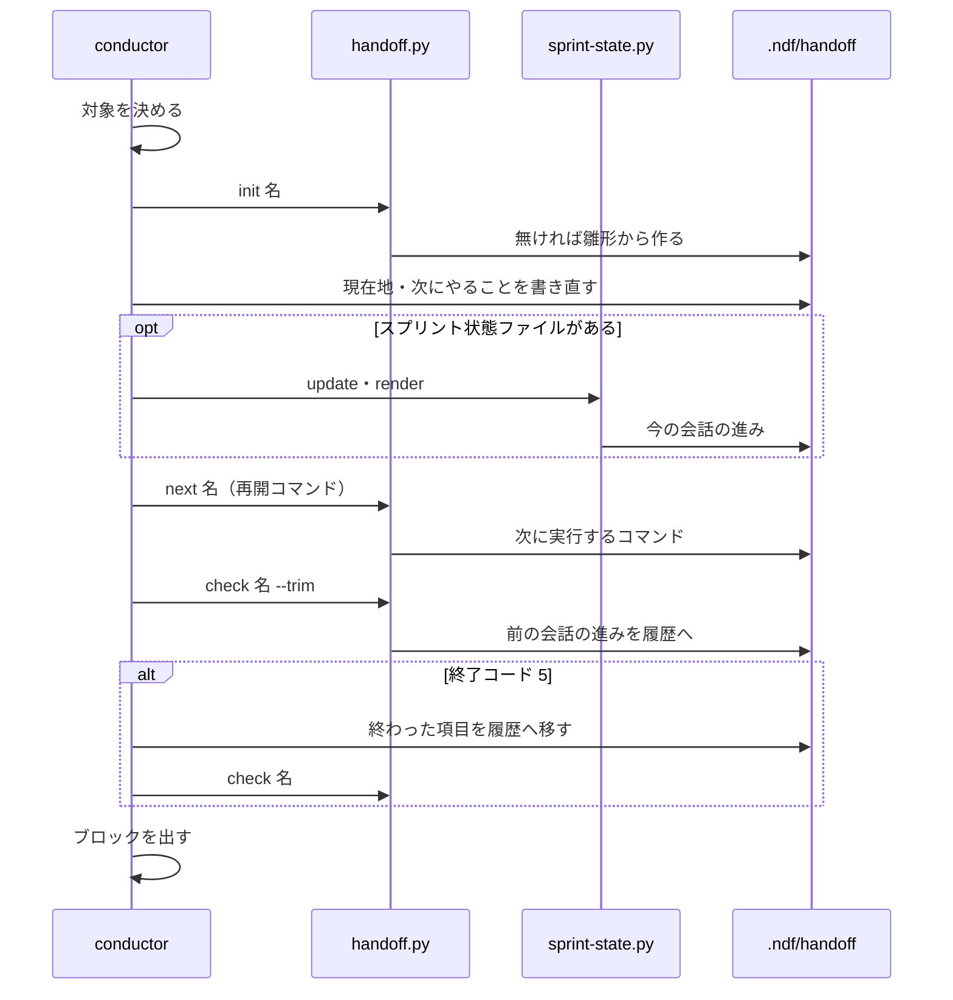
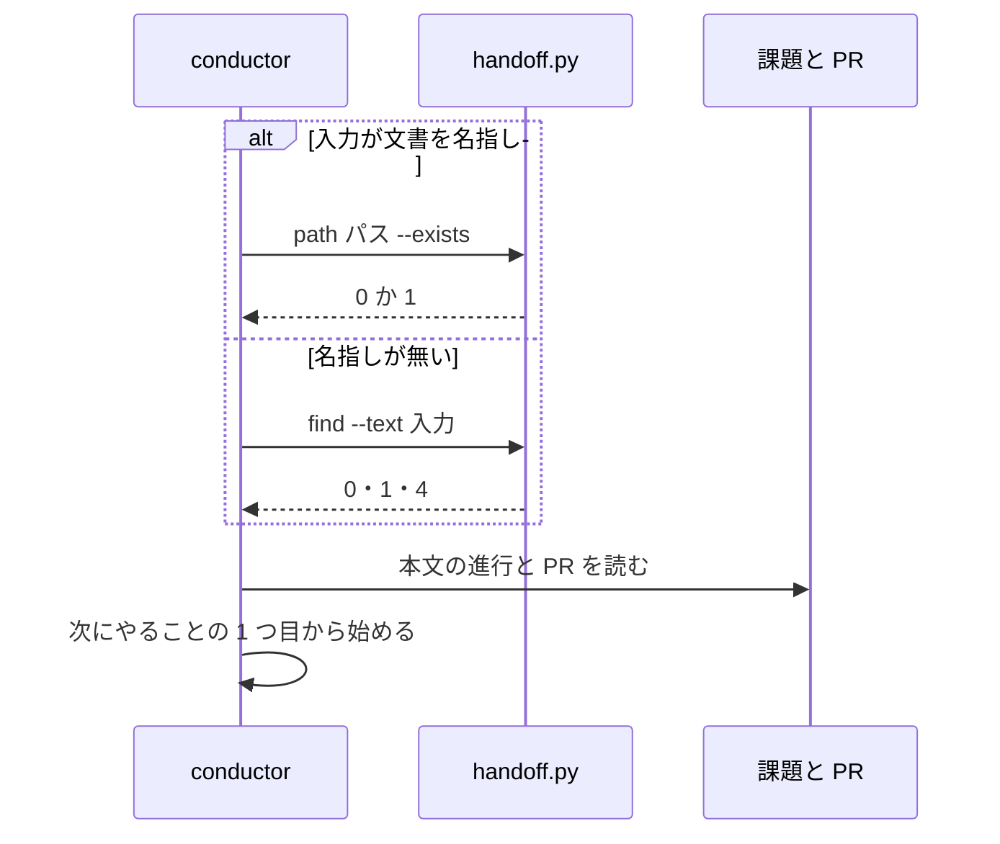
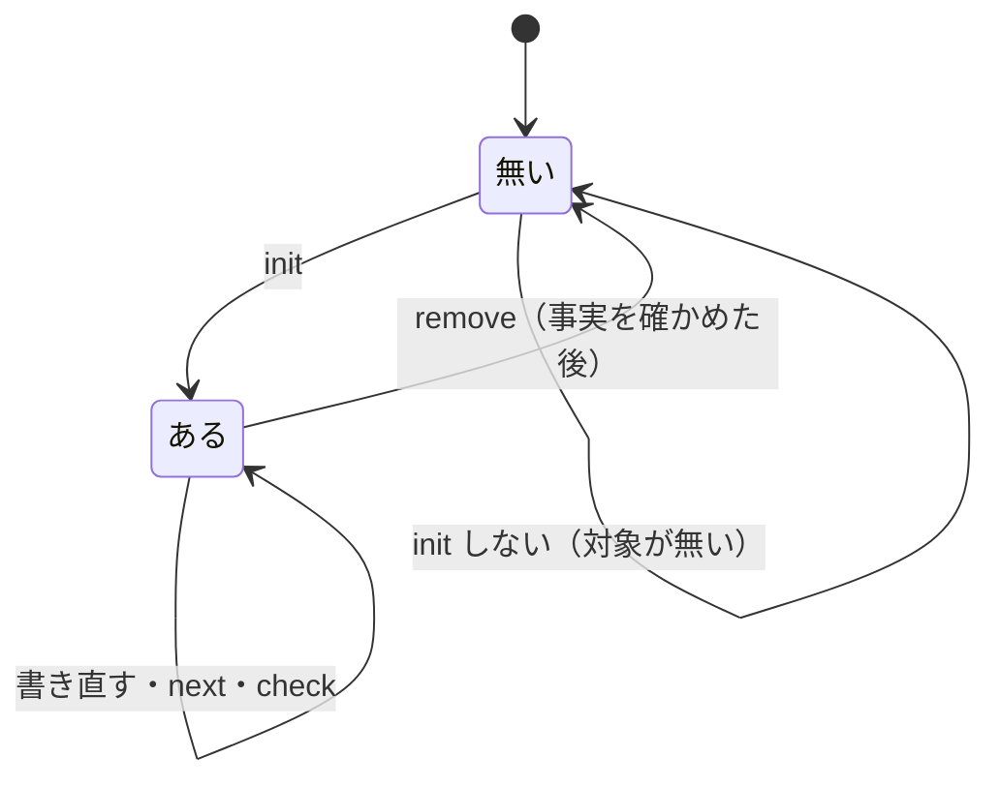

# #1560: 引継ぎ文書を .ndf/handoff/ に置く正式な仕組みにする

要求と受け入れ条件は [#1560](https://github.com/devbasex/ai-plugins/issues/1560) の本文にある（コピーは
[issue-1560-requirements.md](issue-1560-requirements.md)）。この文書は「どう作るか」だけを扱う。

## 例: マイルストーン 26 の会話を `/ndf:restart` で切って続ける

conductor が worktree `.worktrees/design/issue-1560` の中で `/goal /ndf:development-workflow マイルストーン 26 を進める`
の会話を進めている。利用者が `/ndf:restart` を打つ。

1. restart は引継ぎの対象を「マイルストーン 26」と決め、`handoff.py init milestone-26 --title "マイルストーン 26"` を打つ。
   メインディレクトリ `/work/ai-plugins` の `.ndf/handoff/milestone-26.md` が無ければ雛形から作る。worktree の
   `.ndf/handoff/` には書かない
2. conductor が「現在地」と「次にやること」を書き直す（追記を積まない）。状態の写しは書かず、課題と Pull Request の
   URL だけを書く
3. 再開コマンドを決める。`/goal` の目標に文書のパスを足す

   ````text
   ```ndf-next
   /goal /ndf:development-workflow .ndf/handoff/milestone-26.md の続きから
   ```
   ````

4. `handoff.py next milestone-26` に再開コマンドを標準入力で渡す。文書の「次に実行するコマンド」の節が同じ囲みに
   置き換わる。`handoff.py check milestone-26 --trim` が節の順と行数を確かめる
5. restart は今までどおりブロックを出して終える。ラッパーが次のセッションを起動する
6. 次のセッションの `development-workflow` は、入力の `.ndf/handoff/milestone-26.md` を `handoff.py path --exists` で
   メインディレクトリのパスへ直して読み、「次にやること」の 1 つ目から始める

マイルストーン 26 を閉じたら、conductor は文書の決定・未検証の項目・起票が課題の本文か Pull Request にあることを
確かめてから `handoff.py remove milestone-26` を打ち、消した 2 本のパスを報告に並べる。

## ドメインモデル

### コンテキスト

| コンテキスト | 何の語が 1 つの意味に決まるか |
| --- | --- |
| NDF の開発ワークフロー（`ndf-workflow`） | 引継ぎ文書・引継ぎの対象・引継ぎの履歴・再開コマンド・`ndf-next`・カットポイント |

**1 つのコンテキストに収まる。** ラッパー（`ndf-relay`）は `ndf-next` の囲みを拾うだけで、引継ぎ文書を読まない。
拾う規則は変えない（要求の「含まない」）。

### 集約

| 集約 | 持ち主（書き換えてよいもの） | 根 | エンティティ | 値オブジェクト |
| --- | --- | --- | --- | --- |
| 引継ぎ文書（引継ぎの対象ごと） | conductor | 本体（`<名>.md`） | 引継ぎの履歴（`<名>-history.md`） | 名・節・再開コマンド |

**持ち主は conductor だけである。** `handoff.py`・`sprint-state.py render` / `next`・`supervise.py note` は
conductor が打つスクリプトで、書き換えの主体ではない。supervisor・worker は打たない。

### 不変条件

| # | 集約 | 条件 | 破れたときの扱い |
| --- | --- | --- | --- |
| I1 | 引継ぎ文書 | 置き場はメインディレクトリの `.ndf/handoff/` だけである。起点が worktree でも、その worktree の `.ndf/` には書かない | — |
| I2 | 引継ぎ文書 | 名は `sprint-<スプリント名>`・`milestone-<番号>`・`issue-<番号>` のどれかで、1 つの対象に本体は 1 本である | 名が形に合わなければ作らず、終了コード 2 |
| I3 | 引継ぎ文書 | 本体の `##` の節は雛形の順に並び、必須の 5 節を持ち、同じ節を 2 つ持たず、雛形に無い節を持たない | 検査が終了コード 1 で違反の節を返す |
| I4 | 引継ぎ文書 | 「次に実行するコマンド」の節の囲みの中身は、最後に出した再開コマンドと一字一句同じである | — |
| I5 | 引継ぎ文書 | 本体は 300 行以下である | 検査が終了コード 5 で行数を返し、conductor が終わった項目を履歴へ移す。移しても超えれば超えた行数を報告し、更新は残す |
| I6 | 引継ぎ文書 | 書く・消すのは conductor だけである | — |
| I7 | 引継ぎ文書 | スクリプトは本体も履歴もコミットせず、`.gitignore` に書かない | — |
| I8 | 引継ぎ文書 | 消す前に、文書の決定・未検証の項目・起票が課題の本文か Pull Request にあることを確かめる。消したパスを報告する | 確かめられない事実があれば消さず、その事実を報告する |
| I9 | 引継ぎ文書 | 名指しの無い再開で一致する本体が 2 本以上あれば、どれも読まない | 候補のパスを示して利用者へ聞く |
| I10 | 引継ぎ文書 | 名指しした本体が無ければ、別の本体を推測で読まない | 課題の本文と Pull Request から戻し、無かったパスを報告する |

### ドメインイベント

要求の番号を引き継ぐ。「処理する主体」はイベントを受けて次の処理をする者だけを書き、続くイベントと書く先・出す先は
別の列に分ける。

| # | イベント | 発生元 | 処理する主体（すること） | 続くイベント | 書く先・出す先 |
| --- | --- | --- | --- | --- | --- |
| E1 | 対象の引継ぎ文書を作った | `handoff.py init`（conductor が restart かカットポイントで打つ） | conductor（現在地と次にやることを書き直す） | E2 | 本体 `.ndf/handoff/<名>.md` |
| E2 | 引継ぎ文書を更新した | conductor（節の書き直し）・`handoff.py next`・`sprint-state.py render` / `next` | conductor（`handoff.py check --trim` を打つ） | E3 | 本体 |
| E3 | 終わった項目を履歴の文書へ移した | `handoff.py check --trim`（「前の会話の進み」の節）と conductor（それ以外の終わった項目） | conductor（再開コマンドのブロックを出す） | E4 | 履歴 `<名>-history.md` |
| E4 | 再開コマンドに文書のパスを含めて出した | restart の手順 3・カットポイントの conductor | ラッパー（`ndf-next` の囲みを拾って次のセッションを起動する。ラッパーの外では利用者が貼る） | E5 | 最後の応答の `ndf-next` の囲み |
| E5 | 新しいセッションが引継ぎ文書を読んだ | `development-workflow` の「新しい会話で戻す」 | 新しいセッションの conductor（次にやることの 1 つ目から始める） | — | — |
| E6 | 引継ぎ文書を消した | `handoff.py remove`（対象が閉じた後の conductor） | conductor（消したパスを報告に並べる） | — | 報告 |

### 用語

| 用語 | 意味 | 用語集への反映 |
| --- | --- | --- |
| 引継ぎ文書 | 会話を切って新しいセッションで続けるための文書。メインディレクトリの `.ndf/handoff/<名>.md` に置き、コミットしない。1 本が 1 つの引継ぎの対象を受け持つ | 意味の変更 |
| 引継ぎの対象 | 引継ぎ文書 1 本が受け持つ仕事のまとまり（スプリント・マイルストーン・課題のどれか）。名の頭（`sprint-` / `milestone-` / `issue-`）になる | 追加 |
| 引継ぎの履歴 | 引継ぎ文書の本体から終わった項目を移す文書。本体と同じ場所の `<名>-history.md` | 追加 |

## 機能一覧

| # | 機能 | 誰が使うか |
| --- | --- | --- |
| F1 | 対象の引継ぎ文書を作る（無ければ） | conductor（restart・カットポイント） |
| F2 | 現在地と次にやることを書き直し、次に実行するコマンドを置き換える | conductor |
| F3 | 終わった項目を履歴へ移し、節の形と行数を確かめる | conductor |
| F4 | 再開コマンドに文書のパスを含めて出す | restart・カットポイントの conductor |
| F5 | 新しいセッションで文書を見つけて読み、次にやることの 1 つ目から始める | 新しいセッションの conductor |
| F6 | 対象が閉じたら事実を確かめてから文書を消し、消したパスを報告する | conductor |
| F7 | マイルストーン 26 の文書を新しい置き場へ移す | 実装の担当（1 回だけ） |

## 構成要素

| 要素 | 責務 |
| --- | --- |
| 引継ぎの正本 `development-workflow/references/handoff.md`（新設） | 置き場・名の決め方・節ごとに書くこと・作る／読む／更新する／消す規則・書かないもの・一致の規則。ほかの文書はここを指す |
| 雛形 `scripts/data/handoff-template.md`（新設） | 節の見出しと順の唯一の定義。`handoff.py` が作るときに写し、検査のときに読む |
| `scripts/handoff.py`（新設） | パスの解決（メインディレクトリ）・作る・探す・次に実行するコマンドの置き換え・検査と履歴への移し・消す。LLM を呼ばない |
| `scripts/lib/handoff_doc.py`（新設） | 見出しで節を探す・節の本文を置き換える。`sprint-state.py` の `find_section` / `heading_text` をここへ移し、両方が使う |
| `sprint-state.py`（変更） | 上の 2 関数を `lib/handoff_doc.py` から読む。引数・出力・振る舞いは変えない |
| `restart/SKILL.md`（変更） | 手順に「引継ぎの対象を決め、文書を作る・更新する」を足し、再開コマンドの表の 1・2 行目に文書のパスを含める |
| `context-window.md`（変更） | 「新しい会話で戻す」の表の先頭に文書を読む行を置く。更新の文は正本を指す |
| `relay.md`（変更） | 例の `DOC=issues/handoff-<名>.md` を `DOC` に `handoff.py path <名>` の `path`（メインディレクトリの絶対パス）を入れる形にし、置き場の規則は正本を指す。**手順も変える:** (1) 手順 1 の `--goal` の雛形に「`.ndf/handoff/sprint-{name}.md` の続きから」（スプリント名が I2 の形に合わなければ `.ndf/handoff/milestone-{milestone}.md`）を必ず書く規則を足す（既存の差し込みの語 `{name}`・`{milestone}` を使い、文書のパスを文字のまま書かない。雛形は次のスプリントでも同じものを使うため、文字のままでは前のスプリントの文書を指し続ける。`sprint-state.py` の差し込みの語と振る舞いは変えない。正本の「更新する」にも同じ規則を置く）。(2) カットポイントの 3 つの呼び出しと本番後のパイプラインの前に `handoff.py init <名> --title <表示名>`、`next --replace` の後に `handoff.py check <名> --trim` を足す。(3) 本番後のパイプラインを背景の Bash で流す前に、conductor が `init` を打ち、本番の後の現在地と次にやることを文書へ書く手順を足す（パイプラインの中では書き直せないため） |
| `development-workflow/SKILL.md`（変更） | 対象の最後の工程（振り返り）の後に文書を消す 1 文と、正本への案内 |
| `conductor-entrypoints.md`（変更） | 「セッションの切り替えと記録」の表に `handoff.py` の 6 つの副命令を足す |
| 開発ワークフローの用語集 `glossary.md`（変更） | 「引継ぎ文書」の行を直し、「引継ぎの対象」「引継ぎの履歴」を足す |
| `hook_lib/token_guard.py`（変更） | ラッパーの下の拒否文の「引継ぎ文書（/goal の指示が名指ししたもの。無ければ書かない）」を、正本に従って作るか更新し、再開コマンドに文書のパスを含める文へ変える |
| `scripts/tests/test_handoff.py`（新設） | `handoff.py` と `lib/handoff_doc.py` の単体テスト |
| プロジェクトの用語集 `docs/glossary/glossary.json` と `docs/glossary.md`（この設計の変更で直す） | 用語の表の 3 語 |
| 移行（メインディレクトリの操作。Pull Request に載らない） | `issues/handoff-milestone26*.md` の 2 本を `.ndf/handoff/milestone-26*.md` へ移す |

### 置き場を変えることで当たる規則

引継ぎ文書を指す規則を、`引継ぎ文書` と `handoff` の語で配布物を検索して集め、手順（restart・カットポイント・
コンテキスト量の hook）を読んで確かめた。当てはまらないものだけを上の表に載せた。

| 規則の場所 | 今の前提 | 新しい置き場での扱い |
| --- | --- | --- |
| `token_guard.py` の拒否文 | 名指しが無ければ文書を書かない | 当てはまらない。正本に従って作るか更新する（上の表） |
| `restart/SKILL.md` の表の 1 行目 | 名指ししていれば「<文書> の続きから」を足す | 当てはまらない。文書を作ってから必ず足す（上の表） |
| `relay.md` の例 | `issues/handoff-<名>.md` | 当てはまらない（上の表） |
| `waiting.md` の 145 行・`conductor-entrypoints.md` の `note` / `next` の行 | 文書のパスは呼ぶ側が渡す | 当てはまる。置き場を持たない |
| `supervise.py note` の既定の節「今の会話の進み」 | 節に表がある | 当てはまる。雛形の同じ節に表の見出しの行と区切りの行を置き、`note` はそこへ行を足す（`note` の書き方は変えない）。スプリント状態ファイルがあれば `render` が節の本文ごと置き換える |

### 構成要素図

「restart の手順」は `restart/SKILL.md`、「カットポイントの conductor」は `relay.md`、「新しい会話で戻す」は
`context-window.md`、「最後の工程の後」は `development-workflow/SKILL.md` の変更である。**図に載せないもの:**
案内だけを持つ `conductor-entrypoints.md` と用語集 2 つ、テスト、移行。



### システム構成図（文脈と配置）



**すべて利用者の機械の中で動く。** `.ndf/handoff/` は git の追跡外で、外へ出ない。メインディレクトリは
`git rev-parse --path-format=absolute --git-common-dir` の親として決まる（`lib/repo.py` の `main_dir`）。

### パッケージ・モジュール構成

```text
plugins/ndf/
├── scripts/
│   ├── handoff.py                 # 新設
│   ├── sprint-state.py            # 2 関数を lib から読む
│   ├── data/
│   │   └── handoff-template.md    # 新設
│   ├── hook_lib/
│   │   └── token_guard.py         # 拒否文
│   ├── lib/
│   │   └── handoff_doc.py         # 新設（sprint-state.py から移す）
│   └── tests/
│       └── test_handoff.py        # 新設
└── skills/
    ├── restart/SKILL.md
    └── development-workflow/
        ├── SKILL.md
        └── references/
            ├── handoff.md         # 新設（正本）
            ├── context-window.md
            ├── relay.md
            ├── conductor-entrypoints.md
            └── glossary.md
```

## 構造

**型・クラスを足さない。** `handoff.py` は副命令ごとの関数と、`lib/handoff_doc.py` の 2 関数でできる。
クラス図の対象が無いため描かない。

| 関数 | 置き場 | 責務 |
| --- | --- | --- |
| `find_section(text, word)` | `lib/handoff_doc.py`（`sprint-state.py` から移す） | 見出しに語を含む最初の節の位置。囲みの中の `#` を数えない |
| `heading_text(line)` | 同上 | 見出しの行から `#` を除いた文 |
| `replace_body(text, word, body)` | 同上（新設） | 節の本文だけを置き換えた全文。節が無ければ `None` |

## データ構造

**永続データは追跡外のファイル 2 本で、スキーマは雛形の見出しである。**

### 雛形（`scripts/data/handoff-template.md`）

````markdown
# 引継ぎ: {title}

会話を切って新しいセッションで続けるための文書（規則は NDF の development-workflow の references/handoff.md）。

## 進め方（利用者の指示）

## 課題の順

## 現在地

## 次にやること

## 今の会話の進み

## 運用の知見

## 次に実行するコマンド

```ndf-next
```
````

| 節（見出しの頭） | 必須 | 書くこと | 書き手 |
| --- | --- | --- | --- |
| 進め方（利用者の指示） | ○ | 対象の間ずっと効く利用者の指示（pace・版の付け方・並列の上限など） | conductor |
| 課題の順 | ○ | 着手の順と状態。状態は課題の URL を添えて 1 語で | conductor |
| 現在地 | ○ | 本番の版・動いているプランの状態ディレクトリのパス・利用者の側で残っていること。見出しに時点を足してよい | conductor が書き直す |
| 次にやること | ○ | 番号付き。1 つ目が次のセッションの最初の作業 | conductor が書き直す |
| 今の会話の進み | — | プランごとの行の表 | `sprint-state.py render`・`supervise.py note` |
| 運用の知見 | — | その対象で繰り返し効いた手順と落とし穴 | conductor |
| 次に実行するコマンド | ○ | `ndf-next` の囲み 1 つ | `handoff.py next`・`sprint-state.py next --replace` |

- **節は見出しの頭で見分ける。** `## 現在地（2026-09-30 セッション 42）` は「現在地」の節である。`sprint-state.py` の
  語を含む照合と同じ語で当たる
- 任意の 2 節は、使わなければ見出しごと消してよい
- `sprint-state.py render --demote` が作る「前の会話の進み」の節は、`check --trim` が履歴へ移す

### CRUD 図

| 機能 | 本体 | 履歴 |
| --- | --- | --- |
| F1 作る | C | — |
| F2 書き直す | R・U | — |
| F3 移す・確かめる | R・U | C・U（末尾に足す） |
| F4 出す | R | — |
| F5 読む | R | R（必要なときだけ） |
| F6 消す | R・D | D |
| F7 移行 | C（移す）・U（パスの参照） | C（移す） |

## 入出力の契約

### `handoff.py`（新設）

出力は `lib/step_result.py` の形の 1 行の JSON（`tool` は `handoff`）。すべての副命令が `--root <DIR>`（既定は
カレント）を受け、そこからメインディレクトリを決める。

| 副命令 | 入力 | 出力（`items`） | 終了コード |
| --- | --- | --- | --- |
| `path <名かパス> [--exists]` | 名、または `.ndf/handoff/<名>.md` で終わるパス（相対・絶対） | `{name, path, history, exists}`。`path` はメインディレクトリの絶対パス | 0 解決した / 1 `--exists` で本体が無い |
| `init <名> --title <表示名>` | 名と見出しの表示名 | `{path, created}` | 0 作った・既にあった（既にあれば変えない） |
| `find --text <再開の入力>` | 再開の入力の全文 | 一致した本体のパスの並び | 0 ちょうど 1 本 / 1 0 本 / 4 2 本以上 |
| `next <名>` | 標準入力に再開コマンド（複数行可。前後の空行を除く） | `{path, block, changed}`。`block` は置いた囲み | 0 置き換えた / 1 節が無い（文書を変えない） |
| `check <名> [--trim] [--max-lines N]` | `--trim` で「前の会話の進み」を履歴へ移してから確かめる。`N` の既定は 300 | 違反の並び（節の欠け・順・重複・雛形に無い節）と `{lines, limit}`・移した節 | 0 形も行数も通る / 1 形の違反 / 5 行数だけ超える |
| `remove <名>` | 名 | 消したパスの並び（無ければ空） | 0 |

`check` は形の違反と行数の超過が重なれば 1 を返す（形を先に直す）。

全副命令で共通の失敗: 名が I2 の形に合わない・パスが `.ndf/handoff/` の下でない → 2。git の中でない・
メインディレクトリに `.ndf/` が無い（要求の前提 5）→ 3。本体・履歴が読めない・書けない → 2 と理由。

**一致の規則（`find`）。** 名ごとに、再開の入力に次の語があれば一致とする。`-history.md` は候補に入れない。

| 名 | 一致する語 |
| --- | --- |
| `issue-<N>` | `#<N>`（後ろに数字が続かない） |
| `milestone-<N>` | `マイルストーン <N>`・`milestone <N>`・`milestone-<N>`（空白は 0 個以上、英字の大小を問わない。`<N>` の後ろに数字が続かない） |
| `sprint-<X>` | `sprint-<X>`、または前後が英数字と `-` でない `<X>` |

**互換性。** 新設のため既存の呼び出し側は無い。`sprint-state.py` は関数の置き場が変わるだけで、引数と出力を変えない。

### `/ndf:restart` の再開コマンド

引数と出すブロックの形（`ndf-next` / `text`）は変えない。変わるのは、引数が無いときに決める再開コマンドの中身である。

| # | 会話の状態 | 再開コマンド |
| ---: | --- | --- |
| 1 | `/goal` の目標がある | 目標の入力に「 `<文書のパス>` の続きから」を足す。既に文書を名指ししていれば足さない |
| 2 | 課題・worktree・Pull Request が会話にある | 定型の 1 文: 「`<文書のパス>` の続きから始める。状態は課題の本文の `## 進行` と Pull Request を読む」 |
| 3 | どれも無い | 変えない（文書を作らず、ブロックを出さずに終える） |

`<文書のパス>` はメインディレクトリからの相対 `.ndf/handoff/<名>.md` で書く。**引数で渡された再開コマンドは
書き換えない**（今の規則）。そのときも対象が決まれば文書を作り、引数の中身を「次に実行するコマンド」に置く。

### 新しいセッションの入力

`/ndf:development-workflow .ndf/handoff/<名>.md の続きから`（先頭に `/goal ` が付いてもよい）。相対パスは
メインディレクトリを起点に読む。セッションのカレントが worktree でも同じ本体に当たる。

## 処理の流れ

### 作る・更新する（restart とカットポイントで共通）



- **対象の決め方（上から最初に当たるもの）:** 会話がスプリント状態ファイルを使っていれば `sprint-<スプリント名>`
  （名が I2 の形に合わなければ次へ）→ `/goal` か会話がマイルストーンを進めていれば `milestone-<番号>` →
  課題番号があれば `issue-<最初の番号>`。どれも無ければ文書を作らない（restart の表の 3 行目か、引数だけで出す）
- **スプリント状態ファイルがあるカットポイントでは、`next` の代わりに `sprint-state.py next --doc <本体> --replace`
  を打つ**（relay.md の今の手順）。同じ節を同じ形で置き換える。再開コマンドは `goal_template` から作られるため、
  文書のパスは `sprint-state.py init --goal` の雛形に「`.ndf/handoff/sprint-{name}.md` の続きから」（スプリント名が
  I2 の形に合わなければ `.ndf/handoff/milestone-{milestone}.md`）と既存の差し込みの語で書いて含める（E4・受け入れ条件 7）。
  雛形は次のスプリントでも同じものを使う（relay.md）ため、パスを文字のまま書くと前のスプリントの文書を指し続ける。
  差し込みの語は足さず、`sprint-state.py` の振る舞いは変えない
- **本番後のパイプライン（relay.md）もこの図の順に流す。** 図の 3 つ目（現在地・次にやることを書き直す）は背景の Bash
  では行えないため、conductor がパイプラインを流す前に `handoff.py init` を打ち、本番の後の現在地と次にやることを
  文書へ書く（必須の 2 節を空のまま `check` へ渡さず、E5 の読み先を空にしない）。パイプラインの先頭の `handoff.py init` は
  既にある文書をそのまま残し、`next --replace` の後に
  `handoff.py check --trim` を置く。`render --demote` がカットポイントごとに足す「前の会話の進み」を `--trim` が
  履歴へ移すため、節は重ならず（I3）、300 行の検査（I5）も走る。`check` が 1 か 5 ならパイプラインはブロックを出さずに
  止まり、conductor が完了の通知で終了コードを受けて下の規則で扱ってからブロックを出す
- `init` が 2 か `next` が 0 以外なら、ブロックを出さずに理由を報告する（E2 の失敗。更新されていない文書で再開させない）。
  `init` が 3（git の外・メインディレクトリに `.ndf/` が無い。要求の前提 5）なら文書なしで続け、`restart` は文書のパスを
  含めない再開コマンドでブロックを出す（今までの振る舞い。文書が無いため、古い文書で再開させる恐れが無い）。
  読む側の `path --exists`・`find` の 3 も文書なしで戻す
- `check` が 1 なら、conductor が違反の節を正本の形へ直して打ち直す。5 のまま移せる項目が無ければ、超えた行数を
  報告してブロックを出す（E3 の失敗）

### 読む（新しいセッション）



| 結果 | conductor のすること |
| --- | --- |
| `path --exists` が 0・`find` が 0 | 本体を読む。「次にやること」の 1 つ目から始める。1 つ目が課題の本文か Pull Request で既に済んでいれば、次の項目から始め、食い違いを報告する |
| `path --exists` が 1 | 別の本体を読まない。課題の本文と Pull Request（表の 1〜5 行）だけで戻し、無かったパスを報告する |
| `find` が 1 | 今までどおり表の 1〜5 行で戻す |
| `find` が 4 | どれも読まずに、候補のパスを示して利用者へ聞く |

### 消す

対象が閉じた後（スプリント・課題は振り返りの後、マイルストーンは閉じた後）に conductor が行う。

1. 本体と履歴から、決定・未検証の項目・起票を拾う
2. それぞれが課題の本文か Pull Request にあるかを `gh` で確かめる
3. すべてあれば `handoff.py remove <名>` を打ち、出力の消したパスを報告に並べる。無い事実があれば消さずに、その事実を報告に並べる

### 状態遷移（引継ぎ文書）



## 非機能の実現方式

| 大項目 | 実現方式 |
| --- | --- |
| 運用・保守性 | `check` が行数を測り、300 を超えれば 5 で知らせる。`remove` が消したパスを出力に並べ、conductor が報告へ写す |
| セキュリティ | 正本が認証情報・承認の許可・状態の写しを書かないと定める。文書は追跡外で外へ出ない。スクリプトは中身を解釈しない（書き手の規則で守る） |
| 移行性 | 移行は `mv` 2 本。移す前後の sha256 を比べて同じであることを確かめる。切り戻しは逆向きの `mv` |

## 決定の記録

10 件の決定は [issue-1560-design-decisions.md](issue-1560-design-decisions.md) にある（1 ファイル 500 行の上限のため分けた）。

## テスト設計

| 受け入れ条件・不変条件 | どの振る舞いで縛るか | どう壊したら落ちるべきか |
| --- | --- | --- |
| 1・I2 | `init` が 3 つの形の名で本体を作り、形に合わない名（`handoff`・`issue-x`・`../a`）を 2 で拒む | 名の形を確かめないようにする |
| 2・I1 | worktree を `--root` にした `init` が、メインディレクトリの `.ndf/handoff/` に作り、worktree の下に作らない | カレントの `.ndf/` へ書くようにする |
| 3・I7 | 作った後のリポジトリで `git status --short` に `?? .ndf/handoff/` が出て、`git check-ignore` が 1 を返す | `.gitignore` に書くようにする |
| 4（`check-markdown-links.py`） | 追跡外の本体を置いたリポジトリで落ちない。安全な理由は、`git ls-files --others` で追跡外も一覧に入れるが、走査の対象（`DEFAULT_SCAN_TARGETS`）に `.ndf` が無いことである | `DEFAULT_SCAN_TARGETS` に `.ndf` を足す（追跡外の本体も走査される） |
| 4（`check-doc-line-limit.py`） | 追跡外の 501 行の本体を置いたリポジトリで落ちない。安全な理由は、`--others` を付けない `git ls-files '*.md'` で追跡ファイルだけを見ることである | `git ls-files` に `--others` を足す |
| 5・I3 | `check` が雛形どおりの本体で 0、節の欠け・順の逆・重複・雛形に無い節でそれぞれ 1 と違反の節を返す。任意の 2 節が無くても 0 | 順か重複を見ないようにする |
| 6・I4 | `next` に渡した複数行の再開コマンドと、本体の節の囲みの中身と、出力の `block` の中身が同じ | 前後の空白を詰める・囲みの外に置く |
| 7 | 手動: `claude -p` で `/ndf:restart` を打ち、出たブロックに `.ndf/handoff/<名>.md` がある | — |
| 8 | `init` が既存の本体を変えずに `created: false` を返す。`next` を 2 度打っても「次に実行するコマンド」が 1 つ | 既にあるときも雛形で上書きする |
| 9・I5 | 301 行の本体で `check` が 5、「前の会話の進み」を含む本体で `check --trim` がそれを履歴の末尾へ移して 0 | 移さずに行数だけ返す・履歴を上書きする |
| 10・I6 | 手動: `agents/supervisor*.md`・`agents/worker.md` と `supervise_lib` の起動指示に `handoff.py` と引継ぎ文書を書く手順が無い | — |
| 11・I8 | `remove` が本体と履歴を消し、消したパスを返す。`.ndf/handoff/` の外のパスは 2 で拒む。事実の照合は手動（リリース後テスト） | 外のパスを消せるようにする |
| 12 | `path .ndf/handoff/<名>.md --exists` が worktree からもメインディレクトリの本体を返す。始める項目は手動 | カレントを起点に解決する |
| 13 | `find` が一致 1 本で 0 とそのパスを返す。`#15` の入力で `issue-1560` に当たらず、`マイルストーン 26` の入力で `milestone-2` に当たらない | 数字の後ろを確かめない |
| 14・I9 | `find` が一致 2 本（`issue-1560` と `milestone-26` に当たる入力）で 4 と 2 本のパスを返す | 先頭の 1 本を返す |
| 15・I10 | `path <無い名> --exists` が 1 を返し、ほかの本体を返さない | 近い名を返す |
| 16 | 手動: 正本の「書かないもの」の節を読む（`.md` の文言は照合しない） | — |
| 17・18 | `grep -rn "issues/handoff" plugins/ndf --include=*.md` が 0 件 | — |
| 19 | 手動: 移す前後の sha256 が同じ | — |
| 20 | `lib/handoff_doc.py` へ移した後、既存の `test_sprint_state.py`・`test_supervise.py` が変えずに通る | 囲みの中の `#` を見出しと数える |
| 21 | 手動: 課題も目標も無い会話の `/ndf:restart` が文書を作らずに終える | — |

## 未確認のまま残ること

| 項目 | 内容 |
| --- | --- |
| `guard.allow_paths` を差し替えたリポジトリ | `.ndf/` を外した一覧を持つリポジトリで conductor が本体を Edit すると、worktree の guard の案内が出る（拒否はされない）。実装で案内の文面を確かめる |
| マイルストーン 26 の移行の時点 | 今の会話の `/goal` と `sprint-state.json` の雛形が古いパスを指している。移行はカットポイントで行い、同じ更新で雛形の文面を直す必要がある。どのスプリント状態ファイルが生きているかは移行の時点で確かめる |
| 受け入れ条件 11 | マイルストーン 26 を閉じたとき（リリース後テスト）に確かめる |
| Codex / Kiro / agy の再開の入力 | Skill の起動の書き方が違うため、パスを含む再開コマンドの形は各 README の書き方へ読み替える。実機での確認は実装の後 |
